# UVC/UAC - 模块使用说明

UVC（USB Video Class）全称USB视频类，其定义适用于所有用于USB操纵视频和相关功能的复合设备中的所有设备或功能。V821平台UVC版本为1.1。

UAC （USB Audio Class）全称USB音频类，是一种通过USB连接传输音频数据的标准协议。它允许音频设备（如耳机、麦克风、音频接口、扬声器等）与计算机或其他支持USB的设备进行通信。USB Audio Class定义了音频设备与计算机或其他USB主机之间的数据交换方式，从而使音频设备能够在无需专用音频接口卡的情况下，直接通过USB接口与计算机连接。V821平台UAC版本为1.0。

UVC/UAC 支持功能：

-   支持MJPEG、H264、YUY2、NV12格式
-   支持ISOC/BULK传输模式

本文将展示如何将 V821 配置成为 USB 摄像头，通过 MIPI 摄像头输入图像，MIC 输入音频，通过 UVC/UAC 将音视频数据传输到 PC 端相机软件。将 V821 作为一个 USB 摄像头使用。

## 内核配置

执行 `make kernel_menuconfig` 进入内核配置界面

```
Allwinner BSP  --->
	Device Drivers  --->
		USB Drivers  --->
			USB Gadget Drivers  --->
				<M> Allwinner USB Gadget support
				<M> Allwinner USB Webcam function
```

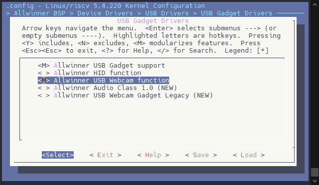

## Tina 环境配置

**配置自动加载驱动**

执行 `make menuconfig` 进入配置界面

```
Kernel modules  --->
	USB Support  --->
		<*> kmod-sunxi-uvc
```

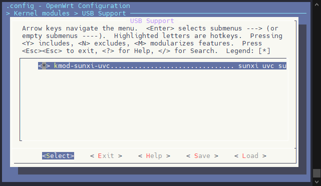

系统启动后会自动加载UVC驱动

**配置 UVC 配置脚本**

```
Allwinner  --->
	USB  --->
		<*> setusbconfig
```

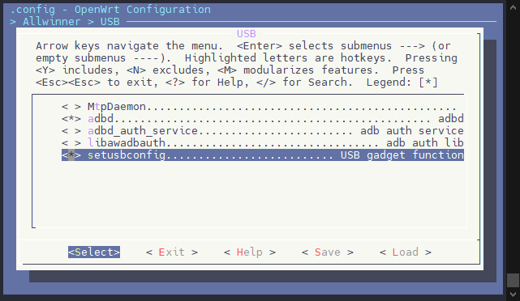

## 配置UVC 设备

执行 `make menuconfig` 进入配置界面，选择运行 demo

```
Allwinner  --->
	eyesee-mpp  --->
		[*]   support usb video camera, enable uvc component
		<*>   eyesee-mpp-middleware-demo
		[*]     select mpp sample
		[*]       mpp sample uvcout
```

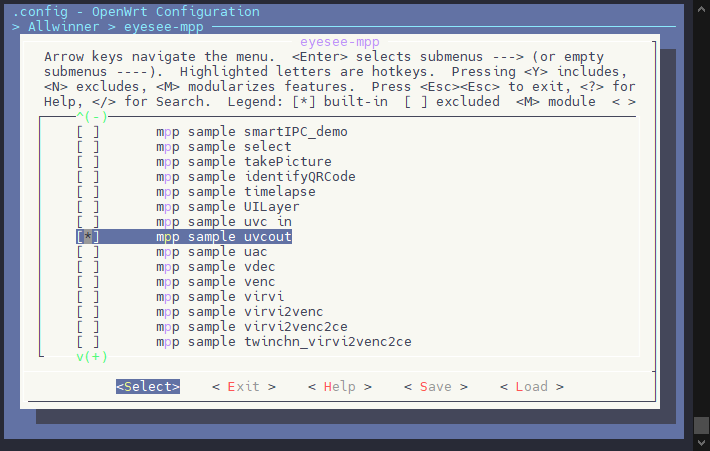

编译后可以在 `platform/allwinner/eyesee-mpp/middleware/sun300iw1/sample/bin` 找到应用程序，复制到 SD 卡插入开发板。

![image-20250214145945850](data:image/png;base64,iVBORw0KGgoAAAANSUhEUgAAAiQAAABoCAYAAADB9utOAAAWhElEQVR4nO3dT2wb150H8C/XzsI1c0y5soVVKcDIQWQAE6gYFBYq1+6hVCLI6GbY0peGObQbKZAOjStA8kIkIAsr+CTVZG5l3IPZcHyIIFsEitqtCxlFyRYMYFKHrBeRWUimx0eHrYGtOHsYzmhIDYekKGlI+vsB1JScf2/ezJv58ffejG2yLMsgIiIistC/WF0AIiIiIgYkREREZDkGJERERGQ5BiRERERkueP/8/h/rS4DERERveJsfMqGiIiIrMYuGyIiIrIcAxIiIiKyHAMSIiIishwDEiIiIrLc8S+//NLqMhAREdErjk/ZEBERkeXYZUNERESWY0BCRERElmNAQkRERJZrOSCRJAkulwuSJDW9bLFYhNfrhc1mgyiKrRalrenrqdk6S6VScDgcSKVSh1xKotrqnYeiKMLr9aJYLNad3sp1gw4frznNaafzWb2v1rqntvOxtTRDcv36dTidTsiyDEEQrCwKEVHHkiQJDocDNpsNDoej4saon2a32ytuRGbTWilHKBRqaT30ajqygMQoatvY2MDAwMBRFaFjeb1eSJIEr9drdVHoFcbzsD0Vi0UEg0Fks1nIsozz58/jo48+0qa9++67GB8fhyzL+PTTT/Huu+9CkiTTac0ea/X67na7eU1vc+3cjjmGpMo//vEP/Pa3v8XOzo7VRekIrC/r8RgcvXaqc7vdjrt378LhcAAABEHA5uYmisUicrkcnj9/jvHxcQDAyMgInE4nHjx4YDptP2VIpVJahmQ/2qlOrfaq1kXdgESNfCORiJbaMxvzkUqlYLfbK+aTJAn9/f1Ip9Pw+/3wer145513IIoiwuGwlmLUpw+rU4/V5fB6vdjc3ER/fz+i0ai2TVEUIYqito5mU4d//OMf8ac//Qm/+c1v9nUyGO2/Gb/fr5VR3X91GbXP/Q9/+AP6+/u1Ourv78cvfvGLPftoNk2//uppRnVbaxzAQdeXUZnU8ujLXj3+wGg/ACAUChmeP2bLmE0zKm+j51y9ttNs26qllWPQzP6kUintPDSqN7/fv2fdZtPN5lW32Uj7KBaLNdtdrXO7mWNupNXz3ug8ra5f/ed6bVtPFEWMjIzAbrfjyZMnGBwc1IIEu90Op9OJXC5nOk2/7UaPQasOo06B2tfkg2zL1aw+v4zKoJZ1v+fVUWg4QxIOh7WUYCKRwMTExJ4BPMViETdv3oQkSRXzAcBXX32FwcFBJBIJpFIp3L17F4IgYG5uTluP2+3W0oeyLCMSicDtdldsRy1HKpXCyZMnUSwW8emnn0KSJCQSCfj9foiiCFmW8ec//1krT6O+//3v48yZM3j8+HHTJ0Ot/Tfb/sDAADY2NgAADx48gMPhQC6XA7B7YTl58uSe7Wxubmr7GI1Gtb7fWtMkScLbb7+NO3fuQJZlfP3111hbW6toUPq6tdvth15ftcq0traGK1euYG1tTbvQiaKIK1euoFgs1tyPVCqFmzdv4tmzZ5BlWWuQZvveSL1Ua/acq9d2Gmlbh3UM9rM/gHLs3G43IpGI1l7148DqTa9eV61j0Ej7AFC33enPbbNzqFGt1Hmt87Qes3avv+kKgqDdVNS6MmI2Ta+RY9Do9cLMYdRpvWvyQbdlwPx8Poq6aKasah3UOq+OWsMBiRoZArVTe3a7HZFIBNevX6/7i6jagwcP4HQ6ceXKFe07o+3oy6Fu88aNG7Db7RgeHobT6cTHH38MAHA6nQCAzc3Nhstx7NgxCIKAEydO4PHjx3j48GHDy+5n/0dGRpBOpyFJEu7evYvFxUXt8/Pnz7ULbvV21H10uVxwuVx1pz148ACbm5t4++23YbPZ8PrrryOdTldclKrrthGt1JdZmYaHh/H8+XPkcjlIkqR9Z7aM0+lEsVhEf39/RYMyW8ZsWq0Bf82ec/XaTiNt67COwX72R61Tp9NZcX7qA45606vXVesYNNI+Gml3+jpupC3U00qd1zpP6zFr92qWQpbliqyFfp5qZtP09nON2o/DqNN658ZBt2XA+vOrmbIC5ufVUTvQMST6X9ZqtNVq5Gy32/Gtb33rIIrXkJ2dHYiiiJcvX+LMmTM4d+5cw8vuZ/9dLhecTifS6TSeP3+OwcFB/P3vf8ft27e16QdlcHAQX3/9tfaLVZblltNzrdSXWZkcDgd+8pOfYG1tDdFoFC6XS2tcZsuoaciPPvqoIogw2/d665NlWUvZtqNWj0E7qHUMGmkf+2l3rbaFVurc7Dw9CDdu3NCCeQDaeBJg99ewel0xm6Y6qmvUYdTpYdyTGmHl+dXJGg5I9Omm69evY3NzE8PDwxXzPHnyBC6XS8ty6FPu9QwPD2NzcxPXr1/XvlOXP8qI7Xe/+x0eP36MM2fO4Mc//jGOHTvW8LL72X81Mp+enobdbofD4cDw8DCi0SiGh4cPrPGo9bu2tqZ912zXgJFW6qtemUZGRrQuHDWCN1tG7Qq02+34/e9/D5fLhSdPnpguc1j1olev7TTStsy0cgz2q7reisViRdutN91sXcDuMWikfTTb7g7imLdS57XOU2A3KGhkP/Tre//997XP0WgU3/zmN+FyubTshbqv6n9HRkZMp+kd1TXqMOq0lXuSkUbaqtXnVzNlbTdNZUjUQS/RaBTZbHZPel89kV9//XXYbDak02ntZLXb7RgZGdEGtVafFA6HA9lsFtFoVNvOxMQE7ty5cyQRreq73/0uvvOd7+zrJDDb/3rLffXVV1pKe2RkBJIkHVgqFFDq986dO3j//fe1+j1//vy+R8SrWqmvemXyer1a2lQNSs2W8Xq9uHnzppYmdTqdEATBdJnDqpdq9dpOvelmWjkG++VwOBCJROD3+7VBhOfPn294evW6zI5BvfbRbLs7iGPeSp3XOk+9Xi/Gx8e1VH+j1w+1nejPIfW6qXZJqPuqv6aaTat2FNeow6jT/V6TzdRrq1afX82Utd3U/dd+i8Uivve97+HKlSt8eRkdOb/fj4GBgY580VK9tsO2RdQZ2FaPBt9DQm0rlUohnU5r70kgIqLuddzqAhAZUR+/SyQSbZ9mJCKi1tXtsiEiIiI6bOyyISIiIssxICEiIiLLMSAhIiIiyx3/8ssvrS4DERERveI4qJWIiIgsxy4bIiIishwDEiIiIrIcAxIiIiKyHAMSIiIishwDEiIiIrIcAxIiIiKyXFsEJC9fvrS6CEQd78WLFwiFQnjx4oXVRSFqK9vb21YXgRrQFgEJEbXmxYsX+NnPfobTp0/j5z//OYMSIuo4DEiIOpwajAQCAfz0pz/Fxx9/zKCEiDoOAxKiDqYPRkZHRwEAb775JoMSIuo4bfHq+JcvX+LEiRNWF4Oo47x48QJ//etfcf78+T3T1H+n6s033zzqYhG1le3tbZw+fdrqYlAdDEiIiKirMSDpDOyyISIiIssxICEiIiLLHbe6AIcri8XgPfTNTyHQW2fWrfuYuHoPebgxHQsA0Vk8HLyG6cEjKSgREVlGQvxqHPhw916x3uw9IB3HxPZFRMYce6dp95dalPvOEAy2ra1XwmIwjnXdUkPj3XWP6uKAJLt78K7O4lbV1L5LU4iMOZBfWcLE5xKUE+KackJs3cdE2o3A+FGXmYiIjtxWFut4C0MrS4iPTeHcX5awmAaQnt0NAHovIjJ/AX3pOEaj2d1lBwNYHXdjPS1hyCgYqZpvLwnxq/e0T/kVg20jiwlcRJ8ucFmPzuLh/ve4LXVlQKIGGUPj17BaHT1u3cfEJ8B0+cTpG5vC6pj+hJAQ/0SJZBeDs1jULaoGMURE1D3yf3kEDAbw71uP8HBlCbfS6o/UAIbKP24xdgF9gBJYxMoLbt3HxAoAZPEwLWE9XfXjt2YQUlvf2BSmt2pkSD5/1vrOtrGuC0jyK0uYSL+FSOwC8tElxE/rumvScYyu/JsS5QJQItMl3NoqT9cCkMr0GVCORk8zGCEi6i5ZxD+XgEvKp76xKayOK98rP0oduDx/zbTbP79yD/lLU1gt/2BturvHwHp0N0PSd+miVlb9D+WhLuquAbowIFEyHuX/P35ROXjj13AuPYtFBLA6r49WHQjMX0MAWSwGH+FcORqOrzgwhHLqDAFEvp1FfPtiV/XVERFROZjodeg+L2E0LQFw4PJ8AENX47ildvsbZjwkPExLyCOL/NgF9EHC37Yd6Kt+yjgdx2iwVincmK76Rhsfko5jYls3H7tsOpUbgUsOTERnAaPuG1X6EdaRxXpwCX+bn0JgrGp67wVE5g+7rEREdNTyeAuBwUeIlz+rGZL8yhImrt7D5flrWIWEfK9DyawbDFBdvxTA5fQj5AH0QVLWWZ1RaXAMibZOwwxJd+vagGQ9OqsMDNJ91o9O3h0PIiGeBoZ63Tg3/xYeXr2P/NgzpdunF1C7dfJj3TWamYiIgKGxC8ivPNJ9o4wZyV+awmpMefBh9HPg8vwU+tQgQx3gunUfEysORMbcyOMeFlck9OEe8oOB8rCAFsplmCFhl01HUQORvl4H+i4FjAeh6g5wfiWO9d6LGNp+BMCN6fksFoPPMB1zAyv3oHTrBLAYXEK8kceHiYiogylPXGLrPiaC94BLU1iNAfGrS4h/OIWAftbeC4iUn8bsG7uIvuASJuDA5fn9jzfUfkxXP2Wz5d4NhNCdXTZd92K0ofFrWI01ns3IbzkQ0IKW8rPo45UDWgE3pscduPXJ/YMtLBERtY2h8SkEeiXEr85i9BNgOnYNkdP3MBpcQn7M4AdpOo7Rq/cr3y/S+xbOtfDDVbmHTeFyrxvT8+qjvtcQGQTypx0tZ17aWddlSPTynyupNiNqn9zQeACAVO4/VAa5GhoM1B6DQkREXaL8sEM6jtHgbPkx30DlLFv3lOxJOWOBlSWMqq+aQByjwSVcrs6oNzyodfclbUO9wNB4HKPR+/jbtoTLHzb3CHGn6eqApOZ7Qyr65AzoXnwzNM5HfYmIXhnq9d8oEAGA7WfI68eQBGfL3TrqvSKA1Vg5y3JaN5C1wUGt69HymEU1mBkMYBVxTGwHEOlF5cs8u+zlnfzXfomIqKvxX/vtDF03hoSIiIg6DwMSIiIishwDEiIiIrIcAxIiIiKyHAMSIiIishwDEiIiIrIcAxIiIiKyHN9DQkRERJZjhoSIiIgsx4CEiIiILMeAhIiIiCzHgISIiIgsx4CEiIiILMeAhIiIiCzHgISIiIgsd9zqAhymW7duoSTLkEslyLKMUkmGLJe070qyjJPf+AZ+8IMf4I033rC6uERERK+srg5ISrKMy4GA9lnW/keRSHyGs2fP4u7aGt4ZGWFQQkREZJGu7rKRSyUAwE6phJ2dEnZ2drCzs4N/lv8A4I033sDgt7+N1dU7VhaViIjoldbVGRLtrfgyIKP6DfnK51//+tcAgOP/+q9HWLJmifDbRAhyAoLVRSEiIjoEXR2QlEpK0KEFI3JFjw1++MP/gAzg+LFjuBGJHHn5iIioDWRimIxlyh964JuZga9Hm4jYZAwZo2kmyxWSC1hIFna34QliOeip3G4hiYWFAnzLQXhMy2Awv65sT30zmNkzcyPTG53PfHr9fW2sHF0dkMhyaTcAqQpGqj+X5NKRlevVlEPY7UZuTkaCaR4iahsZxJI9mFleRg+gBBkLMfQsB+FBAckF5Ua67Oupmma2HPC0UEBPnRtwIZMBfB/UXdfe+QtILiwgWfDA46mxcgCFZBIZACYlOJD11N7Xxtav6uoxJCW5HHVUByMVHTjlLErJ8n/0mIiIjpwHwRnf7s3WcxYePEWhAKCQQabggU+90Xp88PVk8EWmznJlp3rMsxLJJODx9DS0rsr5e+CbWcbychBna62+kMSvMh74TAOBg1pPrX1tYP06XR2QqINaq4MRfdpEG2YimwckubAbNput/OeHuDsBbu17G/zaBBF+mxthcXe6XwQg+rV53eGcuhKE3Tb4RRF+w3VVq5xvdz2GBYd7T3n9EMvb1C+bC7thc4eRM91G5fd768Los1IXoRwg+m26bRARtZnMF8jgFHp6ADwtoOA5q8tS9KDnlJIRMF0OBRSeApnYJCYnJzGpdflUzd/jgcewh0S/rgbm36OA5K+SOOXzmWRHWlhPIYmFyQUovTQN7GuDujogKWlBhpomUQIQfTeONm/JpMsmF8aPQgNIyDJkWYasDS7NIRwGPlO/TwgQ/bobMnIIqdMTgnIzFgVl3mwICIWhjzlEvwih5rq0ueC3heHKqmXJQhDdJsFLLS7MzQnIibfLwUEOt8UchLk5uCDCb/NjI5Qtb0NGds5V3nbl93IC8NuMyqknICFnEXIBQkKGnJ2Dq9niEhEdtkISC7EMPEGlq6RQeLqv5XYzA8rfjO8pYgtJ6MOYzBcZeIwChj3rqjO/gUxsARnPDKqHrDSrsfXU39dGdXVAonTDyGosUtlNI1d225hmSFwDGFAzHhU/7V2YS8wBavZkT1TgQuiz8s1XECDAhdCcoFvnBjZ06xMSuqdohDmEXCLE6lWKIkTkEHKrGQol87CxsY+cgyBAyIm4nQOQuw0xJ0AQyttwhfDZXFXYYPR9rXISEXWQQnIBkwsZeGaWtRtwT8+pfS1Xrcfng6eQQaagLYRkxoOze8a41lhXjfkNZWKIPfXhA9NBrC2up8eHmWWDQbcw2NcmdPWg1lJ5UOue8SP6L8qBifmgVgEJWYbatWLLuRDKZjGHMNzuEBDKQpZdSheF+wg6I1whZA8kyyBAEPwI387hPYhA6LN9Plbsgmug5cIQEVkiE5tEDEEsLxvc8Z8WUIA6oFPpnjh1tqf+ciYKmQwKHl9lBsRkXUbz11gzkskMUAAWJpO67xcwmfFhZqbRLpyDWk9zujtDsjtApNxdUxmMyLosiemg1lwYYREAXJjLZhFy5ZDbALCRQ06XMcjdFlsaGyHq0gy58I8QUjMWeoIAIRcql6e8nGHXjt5uJqa6jMJcCBCV/RPec9XYhohwOKd9/yN9mkgMIwQB72nRUe1tERG1nXL2IWiU3vD44EMSSXVQRCaJJHzKAE+z5VCoGJCaicV04z8KyGQK8OjTHXXWtWf+miq7T5aXlUxLj28Gy00FEXXWUz2GpOa+Nqe7MyQl2eAJG2BPlgT68SYGXHMYCNtg85c/CwnIAgDMIRR2w20LKbMJQktZCwEibLsbQcLwRWgCEtkQ3G4bbFpxZCRMyv5ZSITbbUPIqIyu9yAghNBAAgltQvU2lLIALiTkBPw2N8q7XJ5WztaYbsuF9wQXQn4bbAeW4SEiatHTAgrIIDaZQUz3tSe4jKCnB74PfFhYmMRkDAA8CC6Xb+ymywGZX01CezVHjy6rUMggAx8+0McXZus6ZTB/m6m5r02yyfUeLzkCL1++xIkTJw58vb+8cQMf/ueH+L9//lP5Qt77vlYAeO214/jvxUX81+zsgZehMXxHBxHRqyATm0Syp96LyvY/fyfr6i6bkixDhozjx48pf68dx2sGf8DuW12JiIgORwZfZHrK7xI5jPk7W1d32cglGb+8cQNySRk/UiqVlP/KJcglWQlY5BJKpTpP2XQE0fDxWyHBrAsRUXvwINjUANhm5+9sXd1lQ0RERJ2hq7tsiIiIqDMwICEiIiLLMSAhIiIiyzEgISIiIssxICEiIiLLMSAhIiIiyzEgISIiIssxICEiIiLLMSAhIiIiyzEgISIiIssxICEiIiLL/T/mXjdS9rB3mQAAAABJRU5ErkJggg==)

### 配置UVC设备

输入 `setusbconfig uvc` 即可配置 V821 为 UVC 设备，可以看到提示新设备 Tina UVC

```
setusbconfig uvc
```

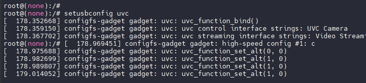

运行后可以看到出现了新的 `video1` 节点

![image-20250214150236340](data:image/png;base64,iVBORw0KGgoAAAANSUhEUgAAAYoAAAA1CAYAAABflawEAAASvElEQVR4nO2dP2gby7rAf/dxW7/aOMWaXcPN7YTBbRaCJkdNSGHXi0GFBA6840LSaeQibiKrcN7lBKRCEFRLxSGN4jEHNq3BqDs54F28xTGur+HxuveKXdkreVe7+mNLTuYHhmRHo+/b+WZnvvlm9tPfPn369H//+te/CPM///t3FAqFQqEA+I9FK6BQKBSK5UZNFAqFQqEYi5ooFN8nokq/Y2HM4auMQov++WnwV0XM4TtnZo73N180hNCS9Vpa/RVRfHcThVGo0i1oi1YjBg1Ra1FcipHmx8TQTQwdBgNaGpxmnsxmlsxOG+dBtfsO0E2KNQt90Xoo5spyTRSiOtZjM4RFvTPw7FrU700IJsXCOlJ6D63plHjI00uKhdk9KaPQol8z56LVLQntv0zyp0NDHFn+9wuLenb9wSTNyoO072PId9tsbx4i569SKoxCi7pyxObOlBOFhqGnWF7OE1GlWzND3p2NXjigGHJdjIKFkG0a7mMqNiGyTQNrxlWFSbGgIU/teWn1xORPiW4isJEuGPo6jnu5aI1imH/7GlEuvh63orovf7L6iu+NCSYKk/p5lWKhRff8gKOjA7pD3p9GsXYXy+3WzJGJZEy5btE9Pw08GJP6IB5869GY1GsmspKnMVgtuG0aMhw+8P8d+XCt5Pj8Zpfc2i6f33zgjzcf+OPlLrmV8IdWebv1i1/25gOftzJsTFg/F1d/CA8pPUQ2ylsL7j0pditeINw2jYHbplt0z1vUa61gpRW053nVn0h1y7eVqAbXT+l3qgg9XH9c+yfIBwZhtTj7G4XW8H0FOt/pN16+Edb9vEX9XtjIHFpthh0IRJVup0W3Y2HoFkedFt2ChlE4oFub0z5Gon4TENm+Y+4PGNv+usVRZ2Slplt0O1b06i2ifyXXD9ktclU4g/5Befz4YVLvtOjWLIQOum7d/l/tgcyHCVcUJkJvU97Ms72TJ7PTvl1iilqLIm22N7Nkdg6RRpWjUGhobLkbXK/YgE1pM+uvGirBoC9eILA5kQSdwu9sr/Aw9EH4YB1D93Big8gZ9p712f/tZ/7523v2bzIcP8/clua2fmGPHq9/+5l//v6JLyu7HD9fnaj+8aD+b+8j6t/huJdgTLsi0ygWTGTzfrzcaebZboIoaDQ2s5SkGZpITYrZr5Q3s2Q285Qck3ohGIiT2j+FfFFrUR/YdzN/z/5OM0/JsYJrJvWOhVvJ+6u/RPkmxdo6shJc33zHSdYcGoxErYpwDoP+1QYRmuTkIeXyOxoSZDNPuWzjYFPaeUc5oh0nJ1m/9MS175j7I6H9XRvpmrwKKWQIE0N+jQgRRchPVX9gt+iw00z6kzR+2JR28pRP8TfShcZJOc92Re0pzYsJJwoP2bRDHWiwF2DySng0BmWuTaNp+50pVfl4DH0dgk4pCn6Hy2y+44SQ16ZrCRto13z51uci+Hfvrz6srAZef4af1q75OCi/6fPrtz4ba+FVwQT1uY6oP0KkvsHDNm7TVFgUGfU2AS5x3GAScj3uR9/CtvP8ldc0k1Wk/BH74kXaV1YOcQstup0qQh5SmiiQrSFuN6I9ZKUdGpCi+1cYxwXD8HCkh2No/iDnejhzC1OO028C0rTvvftLav/RVeyY0Fak/AnqRzKr/inHD92E5iEN1nmllhJzZT6vYOsaOpecxD10SeWp0TAMkEEnc12P9Mcrrrm4iSlaWWWDa77Elaeqv0ru5Qf2wtdvemmVS8nA28tO4SldzmFQjJGva+hoiM4pxfB1tz1S36bRtOgWoFGeJP5uU9rRqB9ZHBWqGHjI5jtKTS8kP65/aRRrFgbr6DpQqGIY/oBXr2k05uJ1JuiXmnHtm/R8jW9/p9lGnlsUmzYNww8tbd+byeL7V7r64/SbQf8044ducSRsyjs2ThPqgTOyqE317435TBSuh4vvTckoYyaVp8HQMLBxHChmTZCX6OHNtEgvOiU311yQYWMFGDtZjKvf5+Nvn0g9NcTqq2HgRQ9ewqKo2xN64nMkTr7r4WLTSDrtolscFS5pNNcpHlnISY6bum1KO/7AYYiqH49uBvIS+pc8/QrZdYRrUzqFV4aHlF85medm9jj90jK2fZOer6T2tzmRVYpCw9FNHJm/3/Zj+1eK+nHMqn+a8cNts71zp2upvKwHFZ4mczoea3MifW/EAP8sdcHEkYOlZFJ5gOPhsH7vhIXjXt6GamTTj0/2zw94Rdhj82WkPRs/TJ8vV6vsPQ9CRSsZ3j7PcHE1CCWlqZ/hOLSBvbGWG9rDCCOyEfcO+BuCrZFDAiP1mlOGNNIQ0/7J8m1OpH/gYLDiN4R1twcC3O1LHNII9iu6o5vlcfJ1/7viownR/cvHC9paQzbb/tFp/ZKTpo2UMRNyHMGA9WrUOIn6pWN8+8bd36A8qf1BntoYwuKV8CKPkCf1r6T6d4zacFb9U44fYdxlPSL/NJnbexSykqdBcHql4+8jlENL76RyIDjJBMXOyKkX2abh+nFRf+Mq2JCt5Ic2XP2OPN0D2zt7z0dy/qmml7v8dPOJ/W/XE9XfH9R/84HjZ/Dlr37EJ80xD9oljuvhRG0y6hZFYdOYOJwxAXHtn0K+rOQpDex7fspRFk7knW1EbXhfQlYOkaI6fOY9Tr7bpsELjgYnXgrQ2Bn2PmUlT8MITh51LJDh0Jbm7084+AcjIjdx02BTqtjotYEed4cxkvRLJEX7xt9fcvv7H/qK1E2Ea9/3zNP0r3H1b7EpVS4RneE2mlX/VOOH4sH425PJHqtbdDsmbuUdpVhvRqPYOYByfnnfpRBV+gWP7Qnf8hW1U4punu0FPRyLlv+9s+j2XbR8xXKzXG9mj8Nts73ThsLB3Vnqe29mezSalwixuDdax6NRzK7TKE+4gfoYq4lllv+9s+j2XbR8xdLzdFYUCoVCoVgIT2dFoVAoFIqF8HATxdouf7zMxb9wtjBWya2tJuu1tPrPiaW9P2UfYInvT9nnR+THW1GsZNjbUh14aVm0fVYy6QbCH5VF2wfYWFM2emymnig2nv/CH1vR7wk8BlPLv+nxepIX4+ZGOOngL7F5oOaFss80ZDh+ucvxIwyEyj5TspLjeOtxbKS4Y8qJIsPeP1b9fEdzYmMl4uJK3GB6X/5k9R8fP+lgP0g62IN//MLx2kNJU/aZnFXevtxl46r/CIOgss90rPJ2K8OXP+fXbop0THe8aS1D7qbH66vwRd8b81NvX/Pxz9GX1VbJbe1yvOZ3vourT+yfBW8+r+Q4frk6nAJjJcfn0Wtx8lPVz3D8ZpccAH32733vDPoH5W+3dtmLLA+SBv7eu006+PHPaz4/y7B/9QCdXtlnQvsEXH3i9Tc4fvPAnr6yz1T22Xi+y083PV7/OzOcU03x4Eyxoljl7fMMvW+9ISPmtnbJ3Xy685jXhh+2sWm4b/p8ucnwU8jD3niWifHuIuSnqj9IER69bJ5JfxLSlAdJB8NJBS/+fR3KPjtPlH0mtg8wyPj78Cj7TGefDHv/uObjmVpNLILJJ4q1HHv0+DjiDUWl6Y4tv5eG+5re1TW5Z5nbz8cuzSPlT1A/kln1T5OmHPzwxgc+D00gc0bZJ0L/tPZ5BJR9IvRPtk9uaxfOFrg38oMzYehp4I38PLxkT0rTnSIN98W3Hr03Od6u9Pl1JWppPkZ+6vrj9JtB/1RpygGu+fX3n/kVYI0g6+w8UfaZzT4PjbLPVPZZ2+V4pcfrm9XhvZSVVbhJn49NMT2TTRRrOfZW+uyPdqCkNN2p0nD3+XK1y96zVS5WMlxcvb8/iMbJT1s/jln1T1V/uHzjP1fhJm122pQo+0xnn8dC2Wdq+1zgZ2cGbjfZj7dg4+wTvy7cAfj+mSj0lHuW4eLPXoSxo9N0D5cnp+Hu/dVnYy3HT2vXfPnrvqcQLz9d/TtGPJOZ9U9KUz4oz92Wz/vUCyj7TG+fx0HZZ0r7XH3i9e/v7/7O+kCf/d/VJPFYpF9RrOTYW+vz8bfoDtQ7e8/Gy1/4/Ab8Uw99P7wSKmdrl89vdgG4uOrxcXTz8KpPb2vXX/aOdoAE+Yn1b+mzf5bhc7AMvvjzPa+/Xc+sf+/sPRtD5cNpyu/Kc8A1vT/fx3h2U6LsM5N9hk/1QO7NB44jT/dMibLPjPZRLJLUSQFzWx/Yu/E7xSJYtPxlZ9Hts2j5y86i22fR8hVPm3Shp4E3sqhOtmj5y86i22fR8pedRbfPouUrnjwqzbhCoVAoxqJmBIUigf3/yo8tP/7v1iNpolAshh8ve6zix0BU6XesqX4/XaFQDPPdTRRGoRrxE6nLgoaotSiKRevx42LoJoYOoCHEsvYThWK5WK6JQlTpn1eJG0cNYVHvnAa/md2ifm9CMCkW1pFyWX/710OeXlIszO7pGoUW/dqcfxs8of2XSf50aIgjy/9+YVHPrj+YJIXie2LKiULD0LXHXdaLKt2aidPMk9nMktmx0QsHFPW7jxgFCyHbNNzHVGxCZJsG1oyrCpNiQUOe2vPS6onJnxLdRGAjXTD0dRz3ctEaKRRPggk2s03q5y9wmuuIAuCCoV9S2jxEAqBRrB1QDJbzjjykXLFxbuuPKdctuqF4cv088FTlIZmK7cuumchKloYMPuS2aUiLotBoND0GoQTZjBi8BimTz2Bv8HboTZ/9s0/0bl8sGpPmOGX98WmUB3hI6VHMmiBHdTWpn1cRbpvtnXao7UYQL/zPDNpCt+h2TFwJQoBs2ugFCwObxs4hDSy6HY1GBYo1029n16ZUPkS6ado/QT7gh9UOqMfY3yi06Ar77r4CneVOPtBvvHxDVDka6I6HrLyjNLRyNKl3qgjdL280Q5OAqNItrEPg3Bx1TAxdAw7o6jblypi2VigUk64oTITepryZZ3snT2anzWCsELUWRdpsb2bJ7BwijSpHodDQ2HI3uF6xAZvSZtZfNQwGKfECgc2JBHQzCD+1eIWHoQ/CB+sYuocT+8Rn2Hs2SJX8nv2bzFAKhFRpjhPqj0ujHMZxL8GYdkWmUSyYyOb9wc1p5tlugihoNDazlKQZisObFLNfKW9myWzmKTkm9UIwICe1fwr5otaiPrDvZv6e/Z1mnpJjBddM6h0Lt5L3V3+J8k2KtXVkJbi++Y6TrDkUohK1KsI5DPpXG0QoLCYPKZff0ZAgm3nKZRsHm9LOO8oR7ahQKIaZcKLwkM3QKsEdeHQmr4RHY1Dm2jSaNoYYeIBJ5eMx9HWQX5GAKPgDQmbzHSeE9ih0DT32GwCu+RJKc9z7qx9K850mDfUE9e+lUY4gUt9gkBy7mrAo0r5bWd1yieMGk5DrcT/6Frad54eNppmsIuWP2Bcv0r6ycohbaNHtVBHykNK9exiHhrjdiPaQlTsnJa5/hXFcMAwPR3o4hoYhvyJdD2eZw5QKxZIwn/codA2dS07iHrqk8tRoGAa34SXX9UiYHUIM/3DQEKnSUCfVH58Gej4MvPnsFF7w5RwGxRj5uoaOhuicUgxfd9sj9W0aTYtuARrlSfY3bEo7GvUji6NCFQMP2XxHqemF5Mf1L41izcJgHV0HClUMw19t1GsaDRV2UigSmc9E4Xq4+N6ejHpYk8rTYGgY2DgOQXz/El0PrSgiveiUzJqGOlUa6BFi9dUw8KIHL2FR1O0JPfE5Eiff9XCxadzuV8WgWxwVLmk01ykeWchxK6dR3DalHX/iMUSVbs1CNAN5Cf1Lnn6F7DrCtSmdwivDQ8qvnKjNbIUiFXM6HmtzIn1v0wDQTYoFE0cOQhFJ5QGOh8N6EF4IXXYvb0M1sunvb/TPD3hFeDPTlzHd2fhZ01CnSwM9QGQj7h3wN7NbdGOOiIqsidNsjx+MZyGm/ZPl25xI/8DBINRkCOtuDwS425c4pBHsV3RHj9fGydf974oPk0X3Lx8vaGsN2Wz7R6f1S06aNlLGTMgKhWKIub1HISvB6ZXzU/odfx+h3PRSlwPBSSYoDt6VGAwksk3D9Y9k4tqUdoIN2Up+aMNVnqbf9xild/aej+T4/OYDf7zc5aebydIc987esz+o/+YDx8/gS+TvTfjx9Oh3PS5xXA8n2I8ZQrcoCjs44fVAxLV/Cvmykqc0sO/5KUdZOAmd6hK14X0JWTlEiir18IwYJ99t0+AFR8F3dwvQ2BlevchKnoZRDfqXNXKiTPP3Jxz8gxFR7atQKGJ5OkkBB0dA7x2LDKNR7BxAOb+871KIKv2CN/74a1S12ilFN8/2Q04USyx/kahcT4ofneV6M3scwbsFFA6CN7NPI1J1+OfnhZjzG8NzQ6OYXadRnnAD9TFWE8ssX6FQLJSns6JQKBaEWlEofnTUjKBQJKAmAsWPztMJPSkUCoViIaiJQqFQKBRjUROFQqFQKMaiJgqFQqFQjEVNFAqFQqEYy/8DFz4wzT2OXHoAAAAASUVORK5CYII=)

PC 可以看到提示新设备 Tina UVC


### 运行测试用例

```
./sample_uvcout -D 0 -d 1 -B 10 &
```

| 参数 | 功能描述 | 示例 |
| --- | --- | --- |
| \-D / --vipp\_dev | 选择 vipp 设备。 | \-D 0 表示选择 /dev/video0 |
| \-d / --uvc\_dev | 选择 uvc 设备。 | \-d 1 表示选择 /dev/video1 |
| \-B / --bitrate | 设置 MJPEG/H264 流的比特率。 | \-B 5 表示设置比特率为 5 Mbps |
| \-s / --dual\_stream | 启用 MJPEG 插入 H264 流的功能。 | \-s 1 表示启用双流功能 |
| \-s\_vipp\_dev / --dual\_stream\_vipp\_dev | 设置双流使用的 vipp 设备。 | \-s\_vipp\_dev 4 表示双流使用 /dev/video4 |
| \-b / --uvc\_bulk\_mode | 启用 UVC 批量传输模式。 | \-b 1 表示启用 UVC 批量传输模式 |
| \-uac\_in / --uac\_in | 启用 UAC1 输入功能。 | \-uac\_in 1 表示启用 UAC1 输入功能 |
| \-uac\_out / --uac\_out | 启用 UAC1 输出功能。 | \-uac\_out 1 表示启用 UAC1 输出功能 |
| \-uac\_sr / --uac\_sample\_rate | 设置 UAC1 音频采样率。 | \-uac\_sr 16000 表示设置 UAC1 音频采样率为 16000Hz |
| \-uac\_ch / --uac\_channel | 设置 UAC1 音频通道数。 | \-uac\_ch 1 表示设置 UAC1 音频通道为 1 |
| \-uac\_bw / --uac\_bitwidth | 设置 UAC1 音频位宽。 | \-uac\_bw 16 表示设置 UAC1 音频位宽为 16位 |
| \-uac\_aec / --uac\_aec | 启用音频 AEC（回声消除）功能。 | \-uac\_aec 1 表示启用音频回声消除功能 |
| \-uac\_agc / --uac\_agc | 启用音频 AGC（自动增益控制）功能。 | \-uac\_agc 1 表示启用音频自动增益控制功能 |
| \-uac\_ans / --uac\_ans | 启用音频 ANS（自动噪声抑制）功能。 | \-uac\_ans 1 表示启用音频自动噪声抑制功能 |
| \-enable\_dual\_uvc / --enable\_dual\_uvc | 启用双 UVC 设备功能。 | \-enable\_dual\_uvc 表示启用双 UVC 设备功能 |
| \-debug / --debug\_mode | 启用调试模式，发送图片。 | \-debug 1 表示启用调试模式，发送图片 |

PC端打开PotPlayer，`右键-->选项-->设备-->摄像头-->格式` 选择对应格式及分辨率 ,然后点击右下角打开设备。

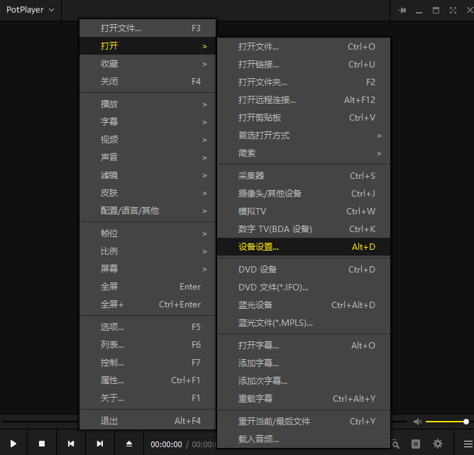

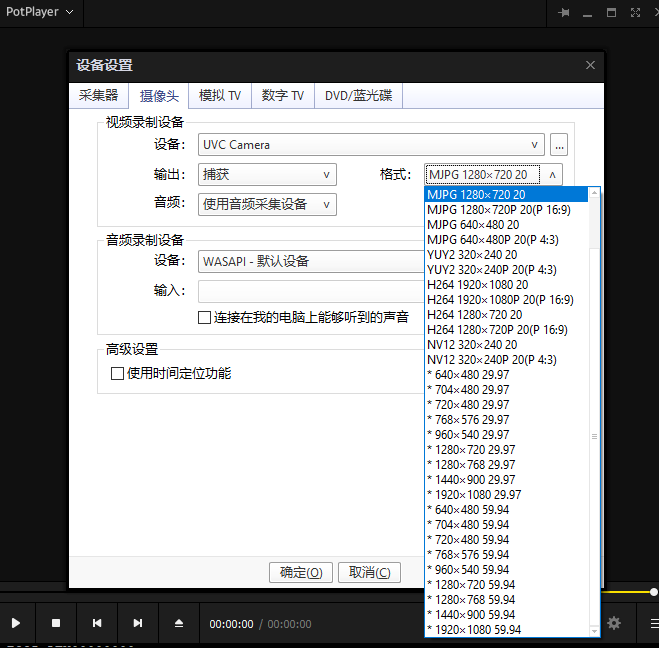

### 配置支持格式与支持分辨率

修改setusbconfig脚本，路径如下：

```
platform/allwinner/usb/setusbconfig/setusbconfig
```

找到enable\_uvc函数，修改如下代码格式为：

```
uvc_create_frame <format> <flag> <width> <height> <index>
```

```
...
uvc_create_frame mjpeg m 1920 1080 1
uvc_create_frame mjpeg m 1280 720 2
uvc_create_frame mjpeg m 640 480 3
uvc_create_frame uncompressed u 320 240 1
uvc_create_frame h264 h 1920 1080 1
uvc_create_frame h264 h 1280 720 2
uvc_create_frame nv12 nv12 320 240 1
...
```

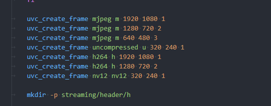

修改时注意，需要按照如上代码配置format、flag。相同格式下index从1开始递增，每个格式的 index 都是独立的。

### UVC BULK传输模式配置

使用如下指令初始化UVC BULK模式。

```
setusbconfig uvc,bulk
```

使用测试用例加入-b 1 参数。

```
./sample_uvcout -D 0 -d 1 -B 10 -b 1 &
```

### 双路UVC设备

使用如下指令初始化双路UVC设备。

```
setusbconfig uvc,dual
```

使用如下指令测试：

```
sample_uvcout -D 0 -d 1 -B 10 -enable_dual 1 -D 4 -d 2 -B 10 &
```

接入Windows PC打开设备管理器可以看到两个UVC设备，使用potplayer打开对应的UVC设备进行预览。

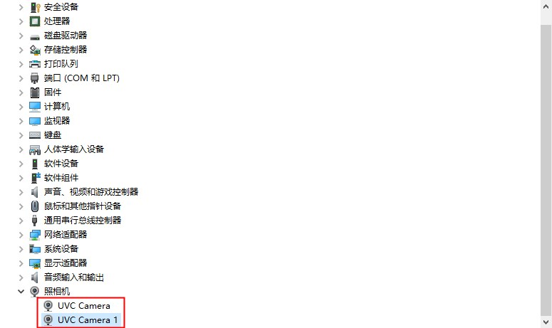

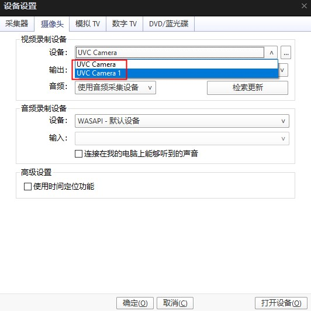

## UVC 和 UAC1 复合设备的使用

### 内核配置

```
Allwinner BSP  --->
	Device Drivers  --->
		USB Drivers  --->
			USB Gadget Drivers  --->
				<M> Allwinner Audio Class 1.0
```

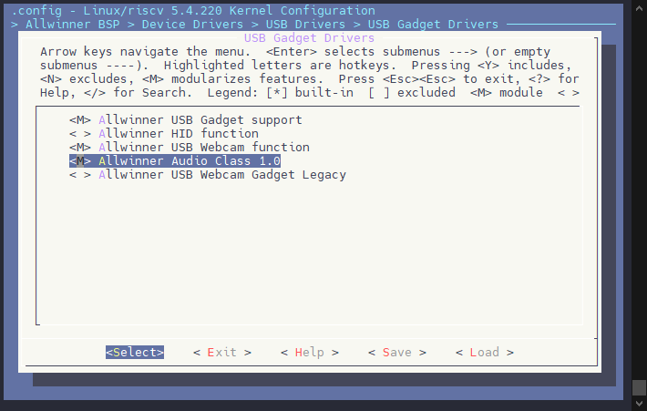

### Tina 环境配置

执行 `make menuconfig` 进入配置界面

```
Kernel modules  --->
	USB Support  --->
		<*> kmod-sunxi-uac1
```

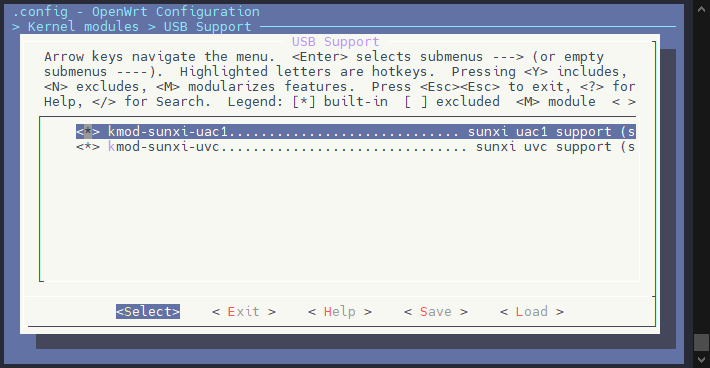

### 初始化设备

勾选驱动后进行编译打包烧录，小机端串口输入：

```c
setusbconfig uvc,uac1
```

切换到UVC+UAC1复合设备。

接入Windows PC后设备管理器会显示出UVC（UVC Camera）+UAC1（AC Interface）设备。（HD Audio 这个是电脑显示屏的，可以无视）

![image-20250214154953209](data:image/png;base64,iVBORw0KGgoAAAANSUhEUgAAAXUAAAB8CAYAAACWhSC0AAAgAElEQVR4nO2de6wc1Z3nv+V7ry8PYxsCdxhslvhJUqcTPxMnxJjN7HV2mGCCBk7NEB5RFIFX2milzBAsJGvqtLBmN2FnNkgrEUA7kMAkmjoz0ghHMMgOk0RDIic4XkKfwjbCyJYdPNiG++z77K75o6q7q6qrqqv79r39uL8PanHdXXXqnOrqb/3qV6d+X81xHAcEQRBEV7Ck1R0gCIIgmkdvqzsQ5q1cDm8ePwMAuP+eP2lxbwiCIDqLtorU/+311zE8PIyl/f1Y2t/fcDvS0MCEamLPCIIgOoO2EfVfHTmCi5c+xIqVK7HsymVYduWydCsqAaZp0HwvQwJ2NhN4T9MMyMCKEgYTUACUYKFlvZf3OZQAM2R4wxBMg6YxxJ0/lGDQqtaLQ8LQktsLjLmB/vj7lbpbBEF0FG0h6m8cPYqhoSEMDAxgxfIVcLz/UsEElOPAcSxwcFiOA6f8ssB1E7ny54BfzGFnkdE0GLDc5XMmdG5V1lcCDABsG9D18ibdk4ABWA4cR8DOaJEiyYRCTheJVw2VE0qpPQXBSgJdfbJCA/2pJeJKMLqyIYguoW5Rj5ssU88kmqnpGXz/+X/Ak8+8gD//6gMYHhnFwMAArrnmGjiOg5GREYyMjNTZMw7TVBA+cZKGAQhPmKPwBF8J242SM1nY0vCJqCeuhgxE/q5A2shmSlcAHJC+yN4HExa4NGKjZyYUHMdBztRDnwRPUBYHytH4HPpDEER3U9eN0ueffx7Hjx/HgQMH0NtbWXV2dhb79+/HJz/5SXzta1+r2Y4G4NrrBgAAmU9vxcDAAPr6+pCfmEChUMDYaHpBF0xD1va/k4GW9f1TatBKf3MLjhXTkG4ipyonACUYsmAQKgcwN3XDLQURe4aIw4Zt25BZCeEq8xxorD8k7ASxeEgdqRcKBRw/fhxHjhzB/v37MTs7C6Ai6EeOHMHbb7+NQqFQs62lS/uwYuXVWLHyaszOzGDJkiUYHhnB0NAQ8vk8xsbGMDY2lqpfQvnTLTVelg7BDEg7i4xW+r/my3sr93P/BpSEZBwlOQ7k332RcGyKQ0pIbsJUIiJar6RZMlkb0nD/ZsKOaGhu/Sm1Hd5W6d8EQXQHqUW9p6cHjz/+OHbs2FEW9omJibKg79ixAwcOHEBPT0+q9s6cPo0zp0/j0qWL+GhoCENDwxgeHkE+P4H8+Bjy4+lEHQDgS5lEv0o3D1n0SSAhglZSAnowHNbNXCVHL42EfLSCEBKcCwjBkM2GVb/UH7ctbrn9USKciplbf0opntIrZ+rlbUWnfgiC6FTqyqn39fXhwIEDZWE3DCMg6P6UTC3OnTuLc+fO4qOPPsTwsJtDHx0dw8TkJPL5PPL5fF0DcYUtOkKP1mzfDdMEbNuGnTWQtW1kMwxZuzSzJjybJmoTWWRhwuQAYqN1QBoC4HqqqZhz6k8MTCio+vNKBEG0IXXfKO3t7S0L+9jYWEOCDgAXLlzAhQsXMDz0EUZGRjE66qZcpiYnMTmZx+RkfaJePYUxYtYI4E4H9Iu5NHzpFxs2dPjjVjeizcHUdZg5BVMPRcaxSBiGBC/fqGXR0bo0IHQLpu5uS9iZxJkq9fcnIqUU1Ve6qUoQXUFDUxpLwv71r38djz/+eN2CDgCjoyOV19gYxsbHMZ7PY2p6GlOTk5ianKyrvXSRuoIwJLhVmqqYRUboyFkWLCUAISDtLAyhwIQKRfju7JLKHPhkoZSGAWXmgm1wCxaC6REpAeGLkrkVd2URpr7+EASxOGh4nnpvby8efPBB9PX1NbR+f/9SFAoFjI+PYXx8HBP5CUxOTmJmZtYV9unputpLF6kzCKUgmIShGZDc8uaiuzcsM5Ij57jRsiuSpRuZGWRtHWbOFdxAZMytUOrCXcdA+H0XbuXAZaYs7NyKi7BLDyP5x9BIfwiCWEy07OGjp7/3v/DCM0/iN0d+hQ3r1mJychJTU9MoFGYxMz2NmTpFPW1O3Z31IcFLN0iVANMysEXlYSNuOXByOgST4KqU7vBtzM6CaQYkY2DeTdpM1n0eSBoZSJ5LuPnqTkv0C3s0UfPUSzdW0/fHG3XgBBGe/UJRPkF0D1q7lN79p39+Cb9547f4xM0bcfhffwEAePHvvt/iXi0WJAymYKqEB7UIgugI2qZK49133YlioYjxfB6Fwmyru7PI4LDUXB+MIgiiHWiL2i8l+N13Yf26tSgWiygWi63uDkEQRMfRNukXgiAIYu60VaROEARBzA0SdYIgiC6CRJ0gCKKLaJvZL83goYcewqZNm7BixQoUi0VMTEzgww8/hG3bePHFF1vdPYIgiHmnq0SdMQbDMNDf349isYjh4WGMjo5ius4HmQiCIDqVrkq/XH755ZHvX3bZZQvcE2LBUQIsjb9rIl75iGb1qaupeAGQ32170VWi3jyCj9WnN49uH9KU8SXqJ2gm7j9OGj0ZVCwKo0l/LC7kd66EgSyzEkpbNw4du3ODRD2MNHwmzt6LyyYcZF6hr847PyRQa0wLOGYmoJxG7AbrQAkYkiNncbhj82oIOQ4s7pZarr9NCQkdupTVJ4U2PhZt24auz4+5ilv0Lt7Xl0iGRD2AVwM9XP6WKh8SAGQ2C+avj68qFTY554BSddekV1IC3ILgEjIgsov5WIzxHiBSQaLuR0pI3XMqikMJsMiyvqXoJ6pkroShZZC1vSqRTEAp4VZWDLRb+neorbKBRbDt9BGbhKExCGFErJvU73C//P+OGFPVNqM+jxtD1Ji9fsvKPjckAvaF5fUD/Uwab9J3mISCUjriglMpJXTO6yyIpiAlwDkD5xxS+M1bUhyLicTtg7l/L8KIqOOfuE/j2k44nnUdegMnSaJLRP25554DABw+fBh79+7FAw88gPvuuw979+7Ft771Lbz66quB5RpHQWRRKYlrcUgjmEuVRuWSvPI5h+WVy+VWpcRvLcptKQEGCUMT0HOlS3G3fG/6S2gbWZu76+ZMIBu8vI3udxK1xhT1ee0xBMfs9Vt4+9zirhBJ/ziyMf2MG2/t7zBu/9k2AwuUzq8ImeRO/RG0zCILDs4AcA5uS8imqljUPpj79yKscB3/pH3q3nxWvtLY7n6qsU3GwGwbZIleP10h6iVmZ2dRKBTK//e/mgODsAQgWOxNq4DpBTdh6uHL6vQE2pIS0nM7ciMbN9pSKq0K6DBLYR/j4KGIs5n9jiXFGKpNQ3SYJacqzsED42BgUIjeBXHjrf0dRqIUlB60OnTz+K4ocRkX9cbPyAlG9xyc25BNVfXk79zXkQa+Fz8J+9S74rDCJ7ya29Sh63HfLZFEV4l6nKCnFvVa0ZIXmRmwytHP/NwqikE3kQsZgHRcfrXVY2j0O6wROXLL8h07foOTuJu37knT79jlpjS8K495idwTmMv30ug+TdxmxJURkYquEvX+/v5IQb/iiitStsBhmkA2E4qupOcratuwfVGHkrLqRy594a0SBrI2B48NcSqRSFRbwa5xcDuLbOCSuHlzqpP7XUc/k5jnMaQixXcYjy9yVALM8O8zAal7qZQ0SOml5fyiZoGjdIVU41hsJnP9XpL2aVXbEkKo2tukfHrDdM0TpefPnw8IU9TnaWBCwWEGtIyGbOlNbsGxGAATpsggo7mf6JxXRSQc0p2G5v3LKnmHgoFzHRlDg6abyCkBy5TIeNuJaivcspUzwTIatHK3HFipRlWb2H6zpH5WjymoaRFjnscxpILX/g5jVgTnBqQNgMHdLzoL7bP0zlHSm/USPN+7J1LDvXta41icC03+XhL3afi4dY8tgCVv07Zhc56Q8iHi6Ip66u+88w5+/etfJ5YDWLp0KT772c9iw4YN89QLBcFcr9NmP4wxv3Rqv1uAEmAGYJHt3zyjINwdPb/PHXQpXRGpb9iwoUqsn376aezdu7dFPSK6EiZgcYaMwRKMxYm5UjJvVyToDdEVok4QCwUTCh1/advmcMuhtMsc6Ir0S4lbbrkl9rNf/vKXC9gTgiCI1tBVok4QBLHY6aopjQRBEIsdEnWCIIgugkSdIAiiiyBRJwiC6CJI1JuKgmBztVQjCIJonI4V9U2bNmHTpk3YvGkTNm/ejM2bN2PL5s3YsmULtmzZgq1bt2Lr1q3YtnUrtm3bhm3btmH7tm3Yvn07tm/fHt2oEjCEQumJNgnXvqxcw7tmRT+vuL8Rri0e3Aaraqfk91j7hFDuTzcjjUrFw6Z4j9bJgm2zBT6fi8HLtdXHT4vpWFFfvnw57r/vPjzwwAO4//778dV774XxZ3+Gu//0T3HXV76CL3/5y7j9j/8Yg7t344tf/CJ27tyJ7Z/5DLZv3w5N06IbZQImjPIPTAkGAxYs7pYE5eHKXD6zhoCHpJ1FJvR++Udr2/A7LSjBfJZlAnYm+AOvJeJKsJoFniq+mjE2ZhEGHcFxpf0B1/LbXGjmMpb5p/k+n+093tq09vjpFm/UjhV1TdPQ09uL3r4+9PT0YMmSJViiadCWLIFW+lvTsETTMDszg6mpqfJ6cSjBkMnakEYGWVsim7VhZzMwpPu3NHw/Fi8S0H3F/+NeOVOH/4ANl1tFua60a6iBQG3uORLw1UwP9/tiWoCRJppM8ttslCZ4j9Y9loXwO8X8+XwmjneBxtYQLT5+usUbtWNFHUC5upsGAJoGaG7FN837G5qG6elpTExOustplYpwUTCh3KjJ9AwFvHrPphKQ5drPFji4W9TJ84sMiH3oxYQCEwoWZxAqB1PXoes6TM/xRSkVOglYsOpwR6pF0FezQbgFJ2dC1SjHGu+32UakHEvX0EHjbf3x0x3eqB0t6oVi0a2ZXizCcRzAezi29JDs+NgYxsbHKyILuMIfG6270bRkJnRwWMKGISSkzcDhGSREOOAEIqNAdM4h/CGCkpCsUk5UlZxitGBkHk65+E8amdAVQyabVA082VezLhgHT3RDSvDbTPRjBcJelVow/5S8bCPphcBYIrxRy9t0P/NfkivBGvRbDSKjfD4Tx1a7zVTjDe3PwDEY55Fby8s10p+0et8Fct3VjbTH8dMF3qidK+qOE3A6KhaL7ssT9+HhYeQnJuoQdLdIP/zu7dwEtxW4ZcF0zeLdnHgNg2E3jcN8tdS996UE9OCaFZ9HRBoglK4e/CcL/0nEPXnEEe0eU3VlkcnO3QuyYb9N96YbfGOKzxRV+1266YW5R6HV3qiAG7lx2FJ6P3IFKW1w0ajfagVe5fOZbmxJbdaNEjCyzGfUETxe0/nWxvmThvedW0Oex101tsvx0wXeqB0r6g5Q5XBU9CL3ixcvYiJG0JPSL9xSEKxUy9kC97wXGQDGgGxWQkoJxhiib0r5o+dQRMAEpG3DzhrI2jayGYasHY7U6ocJFW87FuWriYgri9S2fPFRf8N+m56Hpen7IVbdkA4tG/C7bNhPNTiWWA9Ov8AoCVlyhJqzr2djY6urzQAR3x1j3skpenZIOt/aBH/SgDhLSBnvAtY+x0/ne6N2rqiXUi+lSN2L2i988AGmpqfjBT0hWncj2IwnuqG0CDdhKgOGKh1ADEJF3Bi1uJvHDL/vubA7jptXN3MKph6K1KuoTK2MR8KIu6RtZtThj6Qi+pDotznv1JliShxLmIrAKCkB06x8Vwvit9qE9FnseEt2ehZgpJtSW0WiP6lrySelcu3+Yp2M2un46Xxv1M4VdaBiMj07i8mpKfz7Bx9gZna2IUEHAG56uXSnJL7wXS7asJt2TeaeNKpzqvNBE6IOaUAzFEwr7tK5lt9msB/JHpYKQsTsDW9ZI5CnrUegU4wlarOm6W7Hy/lG93uOfqvNGFsUSeNVAu6uLt3EDx7jqfx2a3i+Ms7L+840EyLodjl+OjyfDnSwScbU1BQOHz5cFuvpqSk3n47gtMWov2NlnQkox02blJwn3aNKQjMkuOUgpxgyDBF+nLVwbePc+5pupM4lg4EclLBhMAVwC4oDStTVcAIhX806kIYvVaWbyDlWbBM1/TatJJ9TDsvi0Mrb090ff+Tv0vW3NLQMtKz/veTvop6xRMI4ODLunPLyis32jG1sbFGkHi8TYFkNFZtVC44/jRHrt+vvdg3PVybcm67KRC5mIG11/HSDN6rTJez6r3c4Owdvdz7/xS85n931R872L9zmbPncTufTn/m8k9n6mVRtWBwOoDtmLvCmA3DHckLv6aaTq1rXffHAwmFyjqm728iZuqNz7uiAA2552/L3IeeYeqXd2FeoL8HNmY6e9DlBVOEed8nHcXosDkc3O+EIrPw2Oxkyyeh4JAymYCZcOSjBkLEF+WoSKWmiGbkSYBkbIva+UfsgDQ1Cz83DfZGFhUSdIIgQzRH10lx8bjWrDAKRBhJ1giCILqJjZ78QBEEQ1ZCoEwRBdBEk6gRBEF0EiTpBEEQX0bEPH6XhrVwObx4/AwC4/54/aXFvCIIg5p+uFfV/e/11AMDS/v4W94QgCGLh6Mr0y6+OHMHFSx9ixcqVWHblMiy7cln6lZUA8wpkBWtNx9RrDhNRPtfXeFVlR0NGbKdZrkddTws8Pgmizek6UX/j6FEMDQ1hYGAAK5avgOP91wjBWuZugS/oZtkaLlL0Q3Z11UJdKVzkr4VescWr/eRdxXMUCJb4bbSgVC1vyAQTgvCSC+jz2HyPzwrd4ldJLD46XtSnpmfw/ef/AU8+8wL+/KsPYHhkFAMDA7jmmmvgOA5GRkYwMjKSqi1peIYRdhYZfxlSaUDT3Cfs/OYEYQMLxyu9G+lbWl6vIpB+16LKiaCGMAc8RxUEqxgZWFzCaCRkTfKGlAa0kAmBw2UTBC/GBLsO5svjE+gev0pi8dHxoq4BuPa6AaxatRqZT2/FwMAArrxyGfITExgbH8fY6AjGRtOJOre8etC6iZxTMszQoAkduZhosCpaj4rUy1F6dQ12UzGvFrUFDs+7NKGOS9BzlEGoSmTPOW+odGi8N6R7kqh6zNvzZu1uusOvklh8dLyoL13ahxUrr8aKlVdjdmYGS5YswfDICIaGhpDP5zE2NoaxsbE6W3Vtr4Qw3FK5dhYZrToXDsRE6zFRelS6JpO1fTXVI8w5AiR7jgbdY9KS4A0Z4SpTH56rjjBCPp4ShucUJA2tIc9PEeXxGemV6e9LVNtx76Mr/CqJxUfHizoAnDl9GmdOn8alSxfx0dAQhoaGMTw8gnx+AvnxMeTH04q6gjCysG0G4VgQQvmciiqplUDUGhKSqFdJKIInADfCLrcXdkuKjNYjXFl825e8Aeedhr0h02Ija/OyKw6yBoTisEomJFZprPV5fooqj884r0wgypvS3U81ttkFfpXE4qMrRP3cubM4d+4sPvroQwwPuzn00dExTExOIp/PI5/Pp2pHMAMQJnS/r6dyXVk4c225XOebULTsF+RQTt1/MzRo+OwKlBLMFTYua8+AifIcZQLK2xaXcVFvvE1Zw96QqdErjjeMg8elwOfs+ZnglRnlTZlqm53vV0ksPrpC1C9cuIALFy5geOgjjIyMYnTUTblMTU5icjKPycmUoq4UREB03MidCQGmBISKsRaTlfRCOKfuvxnKLW8GjbuS67AkvfX9IqSb0c5KNSJHblm+SNtvD6YQHcDX8Iacl8g9gbl4fiZ6ZTa6zc73qyQWH10h6qOjI5XX2BjGxscxns9janoaU5OTmJqcbKhdabgWZhb3iXvI89M1I46Y7RIRqbvMdUqjb/tKgPlOBkoISL0ev85a3pCucXA2E4r0E+fiN8hcPT+TvDKr2pYQQtXeJuXTiQ6kK54o7e9finx+AuPjYxgfH8f01DSmZ6YxMzOLqenpxhqVhhv1WToEy0DyHFRZbUvRm0Q2C/A480W4efSgMLgRegnumVraWZ9vom7CjGwt5DnKBCydhXwk03ta1vSG5Ny9D8AMaJ4/ZKnTjjXX8JWBcx0ZQ4PmXZnMyfMz0Ssz7CfqelUCLHmb3eBXSSw6us4k4ycv/wuO/vb/Y2Z2Fhs3rMNrP3fLBTz/zP+tua4SDJmsDd2sWFqVLa64BMtk3eiPW96NOPfmZPoHXxQEy4J50xCVYMgyBQsGmDIrN++S7OmUADMAq27ja6I+lHuPxYpLXRFEe9J1og4A//TPL+E3b/wWn7h5Iw7/6y8AAC/+3fdb3KvmQZ6j80+3+FUSi4+uSL+EufuuO1EsFDGez6NQmG11d5oOE6rBwgdEWrjlUNqF6Ei64kZpFPzuu7B+3VoUi0UUi8VWd4cgCGJB6Mr0C0EQxGKlayN1giCIxQiJOkEQRBdBok4QBNFFtHT2y/nz53HmzBkMDw+Xb2j29/dj1apVuPnmm1vZNYIgiI6kJaI+OzuLY8eO4dSpU3j77bdx6dKl8mdXXXUV1q5di3PnzuHWW29FX19fK7pIEATRkbQk/XLs2DHkcjm8+eabuO2227Bv3z48+uijeOSRR3D77bfj7NmzeP311/Gzn/0sRWshqzUmoPwFtiLra7tPC8ry39Elc6OXjzbGIAiCaAcWXNTPnz+PU6dO4cSJE/jGN76B1atX49VXX8WTTz6JF154AStXrgTnHDMzMzhx4gTeeuut2o2WKu2VKvNxy6uDHl08q5pwUatay3t1wOupBkgQBLEA1J1+cRwHmq8gVa33w5w5cwZvvfUWBgcHUSgU8D+f+D/48OIHcAozOH78OA4dOoTvfe972LVrF15++WWsXr0an/rUp+rtZtl3s/RUoG3bAHMf/y4H1prmFoJKaKZ6eQs5UnGCINqUuiL1559/Ho899hhmZ4OP3s/OzuKxxx7DD37wg5ptjIyM4P3338eGDRtw9Nib+PDSBfRoDq5cdRNWf2oTfv/73+OVV17BDTfcgOHhYYyOjtbuWMlurlRwy1cH3TZKqRS3+qAbYVvgpejc4qhK4fjqoJd9SwPLEwRBtCepRb1QKOD48eM4cuQI9u/fXxb22dlZ7N+/H0eOHMHbb7+NQqGQ2E6xWMTy5ctRLBYxMTGBIjQ4Tg8Kl+3Bx27S0bu0H7Zto1AooFAoYHx8vHbnQukXabilci3uS5P46pQrISA9izM3CE9Ov7i1uf3LEwRBtCepRb2npwePP/44duzYURb2iYmJsqDv2LEDBw4cQE9PT2I7xWIRly5dQqFQwGXX/CH6/9MmLF26BK/9/T6ceO0n6Ll6NbZs2YJCoYBisYilS5fWPShuWWA+N5/gjU8FaTNwncNyOCTL1vCg9C2f0yHopihBEG1MXemXvr4+HDhwoCzshmEEBL23t3aKftmyZbj22mth2zbYutVYv+YmXBybwsfXX4XezXtw/eb/jM997nM4efIkLr/8clx99dUNDi0YfZcibyUMSL1koMBhKRN6QvpFCQM2926GMgFlcdg2gh6lBEEQbULds196e3vLwj42NlaXoAPATTfdBF3X8fLLL6MwNQF+K8NXbt+NT2zcgAfv/C/IPjAIADh8+DDWr18PlsYgsiqnDoTz5CWRtsFhiXiLufBJwAaHGUijKygV5VtJ6RmCIFpPQw8flYT9Rz/6Ee69997Ugg4AN954I9atW4fh4WE89dRT+NKXvoRdO7+Anbd8Ho7j4MSJE3jttdfKy23cuLFGi64gh4l6z11cAFCpxZeL0PKhWTUBdJ2mNxIE0VIafqK0t7cXDz74YEPr7ty5E4VCAf39/XjllVfw4x//uPzZ8uXLoes61q9fjzvuuCNFawqCZWALBxYMaEJHTgkwJcAyNoRjgUvf+5FtBH1DS/AIg0yZzYIJp7odpaAYI4s5giBaSkvKBPT19WFwcBDr1q3DjTfeiJGRkXLtlyuuuAKMMWQymVRtKWEgyyw4HAAsWFKDITiUEBBcgxAKXFhwYEAzZMyURNeImAfaZRWj5cqbEMqE5Rd7xsCkAU0CupmrZzcQBEE0nbYwybjjjjswMzODDz74AMeOHWt1dwiCIDoWKr1LEATRRbQkUj906BB6enrQ09MDTdOQz+eRz+cxNTWF6elpzM7OolgswnEcPPzwwwvdPYIgiI6lLdIvBEEQRHOg9AtBEEQX0VLno0b47b+3ugdEmK1/0OoeEARRgiJ1giCILqLjIvU4ZobPY/LiGUyPV/xOtd5+XPaxVVi+ivxOCYJYHHS8qDuFWYyfPob3z8T7nf7hxXP4A3YrlvSS3ylBEN1Nx4v6+OljePd4Du+88w52796NDRs2wHEcFItFnDlzBj/96U/x/vvvY1OhgNVbd7e6uwRBEPNKR+fUZ4bP4/0z6fxOz7x7Ahffq+V3KrHveoanT4TePiFwzy6BUwAOP6Rh20PV5cBOPcGwzVum0paGbaVXxDrV265neYIgiGo6WtQnLwb9Tv/6u3+Ll37yMk6ePIkf/vCH+OY3v4np6Wns2rULp06dwtC5d+e8zcE7OXBQ4nDgXYVDB20MfltgLQAcNLDtegN41sHR897rTol7nlDRjda7PEEQRAwdLeoz+fr8TqfyKfxOa7GHYxAShw763jshcegkx+49ACCx7yGJwWcdfGePfz0L//jtqBqO9S5PEAQRT0eL+rz4ndbEFe/DL1XSI6deknhvD8cg4EbxG03s3RPbQJA0y58QuMeXmtlXPqF46aKDlc/3HYQX+bv/Dkb7wRRP5TOFp3dp2HfQ+7yURordLkEQ7UrHi/p8+51GMfiIiTXlFIyXerkz0jajCSg8/b+B75bSMs9yHH7I8KV/bDzzhPf5s9zN+b/E3WV/bgJ/k/WWldh3vcDan5dSPDnsPpgJCPXhhyR2n3dw9BcCa2tulyCIdqSjZ7/0XOb3O92A3713Hr955w18fP1VKG78I1yz7LKA3+llVzXqdxriZo7dGzM4dBAY3OimXv5b2si8bhj2PsvcG7F/UzLr859AdDz8rJfL38MxCIW1j3if38ywDhLvngAGT0ochg3cpuEZ39prjivA6/vgs5Z7tZFquwRBtCMdHalffl19fqfXramVo9axdqONU1h1syEAAAHiSURBVCdDb5+08V7gDYbde3QcfkkGUy+AK6wnJQ6FZ9DEUWt5LwXyKKxy9L0mZdNVbDQhz/tuxp534vP2zdwuQRALRkeL+hXX3ogbblqHDRs24KmnnsKpd9/Frp1fwF/8j/+OW2+6AqffPYnnnnsOq1atwg03rcPHbqzld+qJdSDN4N7IXLOHu9Gwx9o7OdYcFHj0IPDwI/4IlmPvXwLP3BaaGnnQiJnNUmP5kzbe22jiu574nnpJhk4wKdnDMXgyi6cD6ZaEdEqztksQxILS0ekXABjQa/udrvr4emy8JY3fKbD22wrfOalh3/UVz9I1f5mrjmhv5ti9MYtnYGL3zdVtHP2EgW3+VMceC0efjY6Kk5c38fATGfDrXXO9NXt4gxEzx3d+buKe2zRs894ZfNbBd+IW39Os7RIEsZB0XD31uCqNI+ffw4V3f4fJ8YrfaW//FbhuDcPA2nR+p0RjUJVGgmgfOj5SL7H8+jVYfv0a/NU3Kn6n/+9fyO+UIIjFRUfn1AmCIIggHZ9+ufS79H6n279CfqfzAaVfCKJ96Pj0y8c+Hay8uKxF/SAIgmgHKP1CEATRRXRc+oUgCIKIp/fs2bOt7gNBEATRJChSJwiC6CJ6jx8/3uo+EARBEE3iPwC70o+sVYCYywAAAABJRU5ErkJggg==)

### 运行测试用例

```
./sample_uvcout -D 0 -d 1 -B 5 -uac_in 1 -uac_out 1 -uac_sr 16000 -uac_bw 16 -uac_ch 1 -uac_aec 1 -uac_ans 1 -uac_agc 1
```

-   配置设备 0（`/dev/video0`）为视频输入设备，
-   配置设备 1（`/dev/video1`）为 UVC 视频输入设备，
-   设置视频流比特率为 5 Mbps，
-   启用音频输入输出功能，并设置音频相关参数（采样率、位宽、通道数等），
-   启用音频的回声消除、自动噪声抑制和自动增益控制功能。

Windows PC可在声音设置界面进行测试验证：

UAC1播放测试：

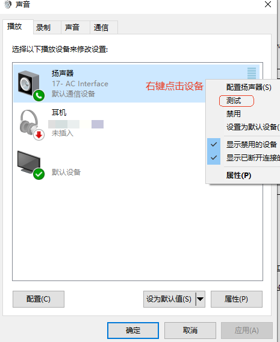

UAC1采集测试：

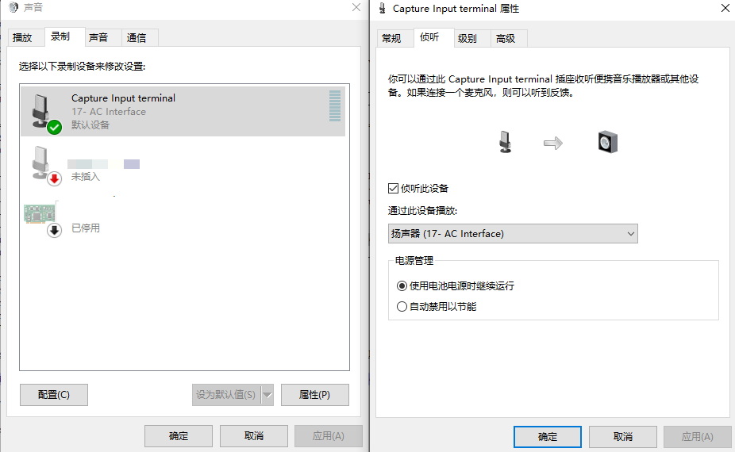

使用侦听功能进行测试验证。

### 默认参数修改

默认UAC1设备参数为支持双向对讲、16k采样率、16bit位宽、单通道，req size为200Bytes。

音频参数可通过setusbconfig脚本进行修改。

```
platform/allwinner/usb/setusbconfig/setusbconfig
```

找到如下位置进行修改。

```c
echo 0xef > /sys/kernel/config/usb_gadget/g1/bDeviceClass
echo 0x02 > /sys/kernel/config/usb_gadget/g1/bDeviceSubClass
echo 0x01 > /sys/kernel/config/usb_gadget/g1/bDeviceProtocol
[ -d /sys/kernel/config/usb_gadget/g1/functions/uac1.usb0 ] || {
mkdir /sys/kernel/config/usb_gadget/g1/functions/uac1.usb0
}
# playback and capture
echo 0x1 > /sys/kernel/config/usb_gadget/g1/functions/uac1.usb0/p_chmask
echo 0x1 > /sys/kernel/config/usb_gadget/g1/functions/uac1.usb0/c_chmask
echo 16000 > /sys/kernel/config/usb_gadget/g1/functions/uac1.usb0/p_srate
echo 16000 > /sys/kernel/config/usb_gadget/g1/functions/uac1.usb0/c_srate
echo 0x2 > /sys/kernel/config/usb_gadget/g1/functions/uac1.usb0/p_ssize
echo 0x2 > /sys/kernel/config/usb_gadget/g1/functions/uac1.usb0/c_ssize
echo 0x2 > /sys/kernel/config/usb_gadget/g1/functions/uac1.usb0/req_number
echo "Tina UVC,UAC1" > /sys/kernel/config/usb_gadget/g1/strings/0x409/product
ln -s /sys/kernel/config/usb_gadget/g1/functions/uac1.usb0/ /sys/kernel/config/usb_gadget/g1/configs/c.1/uac1.usb0
enable_uvc 0
```

| 参数 | 说明 | 默认值 |
| --- | --- | --- |
| p\_chmask | playback 音频通道数（0x1：单通道 0x3：双通道） | 0x1 |
| c\_chmask | capture 音频通道数（0x1：单通道 0x3：双通道） | 0x1 |
| p\_srate | playback 音频采样率 | 16000 |
| c\_srate | capture 音频采样率 | 16000 |
| p\_ssize | playback 音频位宽 | 16 |
| c\_ssize | capture 音频位宽 | 16 |
| req\_num | UAC1驱动req个数 | 2 |

> UAC1 out/capture指主机HOST到小机端Device，即小机端作为USB喇叭。 UAC1 in/playback指小机端Device到主机端HOST，即小机端作为麦克风。'

某些门锁猫眼板厂商会对 `UAC wMaxPacketSize` 大小有要求，这就需要对应修改。

例如在某某厂商某型号猫眼板，对模组的 `UAC wMaxPacketSize` 要求16 bytes。

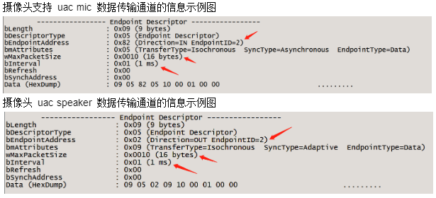

在 V821上 `wMaxPacketSize` 在UAC1驱动中进行修改，如下图修改为16 bytes。

文件路径：

```
bsp/drivers/usb/gadget/function/u_uac1.h
```

修改 `UAC1_OUT_EP_MAX_PACKET_SIZE` 宏定义的数值。

```
#define UAC1_OUT_EP_MAX_PACKET_SIZE     16
```

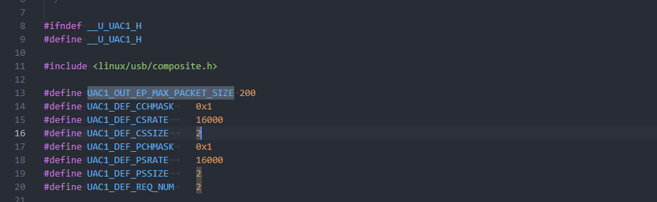

## 常见问题

### PotPlayer 打开设备卡住最后显示未响应

问题现象：

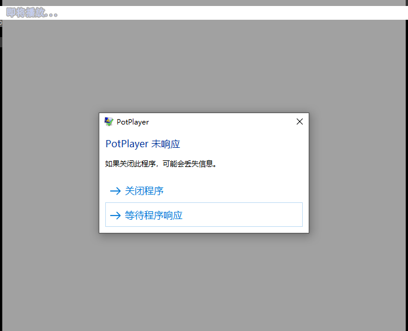

问题分析：出现这个现象说明 UVC 设备未响应，那么大概率为小机端没有跑 UVC 测试用例或者打开的 `video` 节点不对。

问题排查步骤：

检查是否运行了 UVC 测试用例，是否 UVC 测试用例报错退出。

UVC设备节点也是 `/dev/video` 节点与VIPP的节点类似，需要分清楚。可以参考以下几种方式确认打开的UVC节点是否正确。

1.  执行 `setusbconfig uvc` 前后查看生成的video节点，如下图 UVC 节点为 `/dev/video1`

```c
root@(none):/# ls /dev/video*
/dev/video0  /dev/video4
root@(none):/# setusbconfig uvc
root@(none):/# ls /dev/video*
/dev/video0  /dev/video1  /dev/video4
root@(none):/#
```

2.  通过 `class` 设备模型确认，如下图 `video1` 节点为UVC节点

```c
root@(none):/# cat /sys/class/video4linux/video1/name
sunxi_usb_udc
root@(none):/# cat /sys/class/video4linux/video0/name
vin_video0
```

### BULK 模式 PotPlayer 打开失败或者黑屏无图像

问题现象：

1.  提示该没问题无法播放

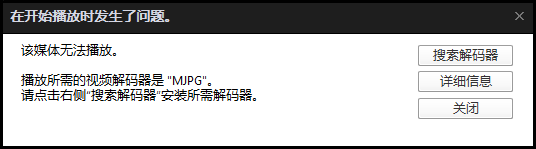

2.  进入了播放界面确没有图像显示

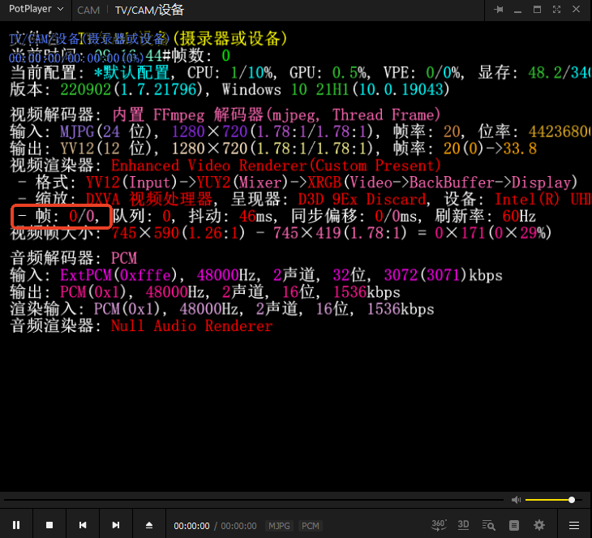

问题分析：V821 支持两种UVC传输模式，每个模式都需要配置对应的UVC设备描述符并且上层处理UVC协议逻辑也要对应选择。所以针对该问题需要对UVC设备描述符和上层应用逻辑一起分析。

问题排查步骤：

1.  接入PC使用 `usbview` 工具查看UVC设备描述符配置是否正确，如下图说明该设备为UVC BULK传输模式。

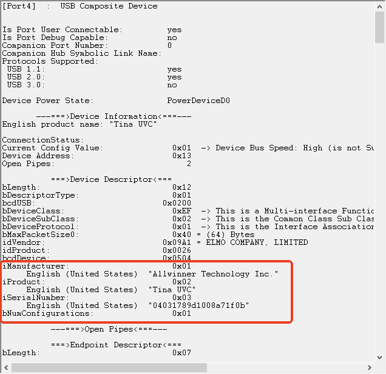

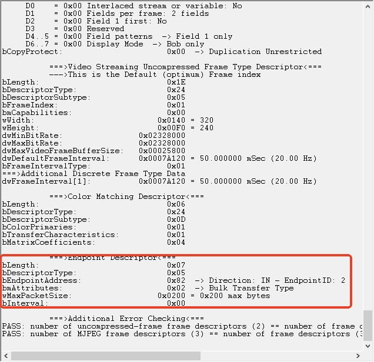

2.  UVC驱动通过驱动模块参数判断是否要配置为BULK模式，可根据如下来确认。

```c
# 1代表UVC BULK模式
root@(none):/# cat /sys/kernel/config/usb_gadget/g1/functions/uvc.usb0/streaming_bulkep
1
# 0代表UVC ISOC模式
root@(none):/# cat /sys/kernel/config/usb_gadget/g1/functions/uvc.usb0/streaming_bulkep
0
```

3.  确认UVC测试用例加入了 -b 1 参数

```bash
./sample_uvcout -D 0 -d 1 -B 10 -b 1 &
```

### UVC测试用例输出colorbar测试单UVC通路

加入 `-debug 1` 选项输出colorbar图像。

```bash
./sample_uvcout -D 0 -d 1 -B 10 -debug 1 &
```

### 如何修改音量大小

#### 采集音量大小设置

```c
platform/allwinner/eyesee-mpp/middleware/sun300iw1/sample/sample_uvcout/uac/uac.c

result = AW_MPI_AI_EnableChn(ai_dev, ai_chn);
if (result != SUCCESS)
{
    aloge("enable ai chn %d fail!", ai_chn);
    goto _destroy_ai_chn;
}

AW_MPI_AI_SetDevVolume(ai_dev, 80); //加入这句

while (1)
```

采集音量大小范围0~100，默认为80。

#### 播放音量大小设置

修改如下文件：

```c
platform/allwinner/eyesee-mpp/middleware/sun300iw1/sample/sample_uvcout/uac/uac.c

...
result = AW_MPI_AO_StartChn(ao_dev, ao_chn);
if (result != SUCCESS)
{
    aloge("ao dev %d ao chn %d start fail!", ao_dev, ao_chn);
    goto _destroy_ao_chn;
}

AW_MPI_AO_SetDevVolume(ao_dev, 80); //加入这句

while (1)
...
```

播放音量大小范围0~100，默认为80。
