# Wi-Fi - 无线保真组件

Wi-Fi（无线保真）是一种允许设备通过无线信号进行网络连接的技术。它基于 IEEE 802.11 系列标准，广泛应用于家庭、办公、公共场所等环境中，用于实现设备与互联网或局域网之间的无线通信。Wi-Fi 技术通过无线电波传输数据。

V821 是一款内置WIFI的多核芯片平台，其中 CPU0 运行Linux系统，CPU1 运行 RTOS 系统。V821 在 Linux 和 RTOS 平台上实现 TCP/IP 双栈，Linux 系统运行内核 TCP/IP Stack，RTOS系统运行 LWIP TCP/IP Stack和 WIFI HOST 协议栈，基于 MSGBOX 和共享内存进行异构通信，其大致层次关系如下图所示。

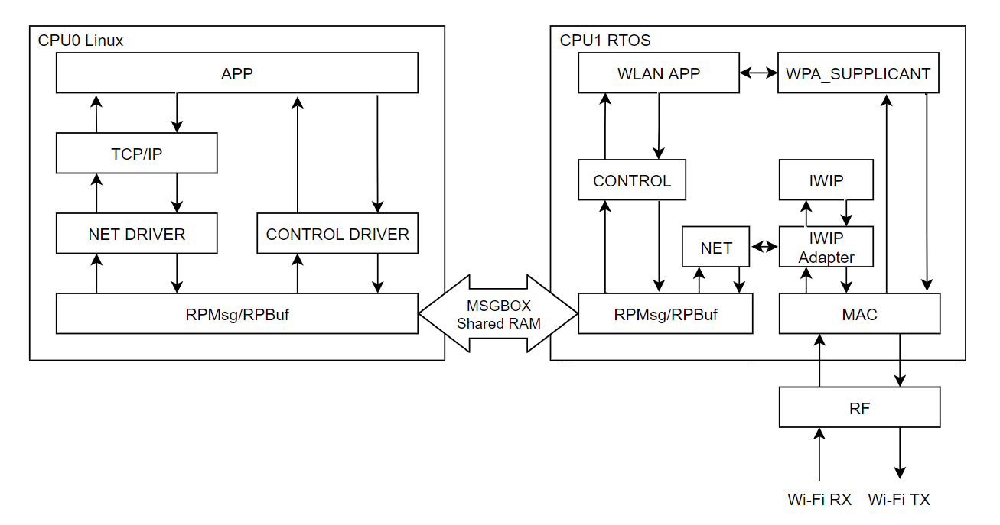

芯片内置 Wi-FI 支持 2.4G 802.11b/g/n-HT20。目前内置 WIFI 可处于 3 种工作模式，分别是 STATION，AP，MONITOR。也支持扩展复合模式，例如 STA-AP

-   STATION：连接无线网络的终端，大部分无线网卡默认都处于该模式，也是常用的一种模式。
-   AP：无线接入点，常称热点，比如路由器功能。
-   MONITOR：也称为混杂设备监听模式，所有数据包无过滤传输到主机。
-   STA-AP：STATION 模式与 AP 模式共存

## Wi-Fi 软件结构

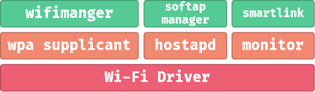

-   `wifimanger`： 主要用于STATION模式，提供Wi-Fi连接扫描等功能。
-   `softap manager`：提供启动AP的功能。
-   `smartlink`： 对于 `NoInput` 的设备，通过借助第三方设备（如手机）实现透传配网的功能,包括 `softap/soundwave/xconfig/airkiss/` 等多种配网方式。
-   `wpa_supplicant`: 开源的无线网络配置工具，主要用来支持WEP，WPA/WPA2和WAPI无线协议和加密认证的，实际上的工作内容是通过 `socket` 与驱动交互上报数据给用户。
-   `hostapd`: 是一个用户态用于AP和认证服务器的守护进程。
-   `monitor`: Wi-Fi处于混杂设备监听模式的处理应用。

## Wi-Fi 驱动配置

由于 V821 是内置双栈 Wi-Fi， 所以驱动分为 Linux 端与 RTOS 端。在此需要分别配置（**默认SDK已经配置完成，无需修改**）

### Linux 内核驱动配置

使用 `make kernel_menuconfig` 进入内核配置界面

```
Allwinner BSP  --->
	Device Drivers  --->
		Network Device Drivers  --->
			Wireless LAN  --->
				<M> v821 dual protocol stack support
				<M>   Support RPMSG platforms
```

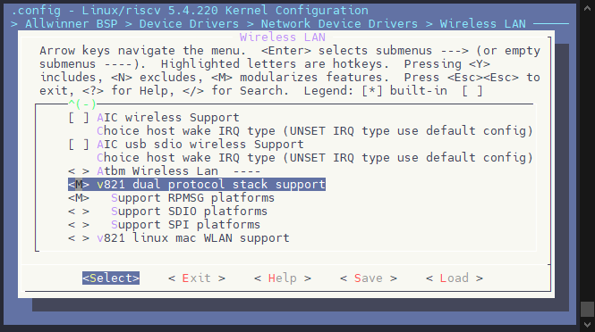

### RTOS 双栈配置

使用 `mrtos menuconfig` 进入内核配置界面

```
Drivers Options  --->
	other drivers  --->
		-*- rfkill drivers
		[*] wireless devices  --->
			[*]   XRADIO driver  --->
				[*]   Enable xradio test cmd
				Xradio chip (Enable v821 driver)  --->
				[*]   Wi-Fi Certification of WFA
				[*]   v821 wlan dual core
				[*]     default init xradio dual net stack
				[*]   wlan station mode
				[*]   wlan monitor mode
				[*]   wlan ap mode
```

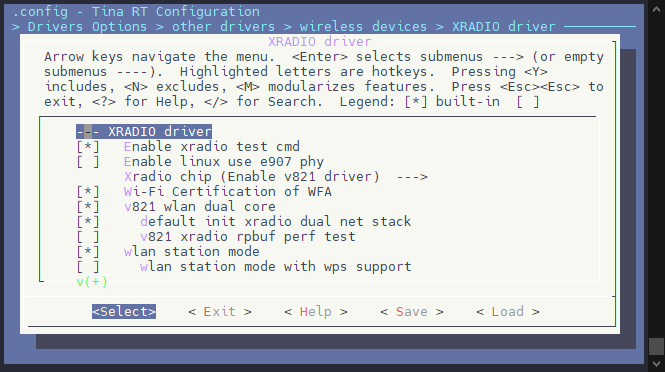

如果需要 STA+AP 共存模式，还需要打开以下配置，**开启后会影响吞吐，仅有特殊需求时使用**

```
Drivers Options  --->
	other drivers  --->
		[*] wireless devices  --->
			[*]   XRADIO driver  --->
				[*]     wlan STA and SoftAp coexist
```

## Wi‑Fi 中间件介绍

**wpa\_supplicant**

`wpa_supplicant` 是一个开源项目，主要用于支持 `WEP`、`WPA/WPA2` 和 `WAPI` 无线协议的加密与认证。它的核心功能是通过 `socket` 与无线驱动程序进行交互，将数据上报给用户。用户可以通过 `socket` 向 `wpa_supplicant` 发送命令，进而控制驱动程序操作 Wi-Fi 芯片。简而言之，`wpa_supplicant` 充当了 Wi-Fi 驱动与用户之间的中介，同时提供协议和加密认证的支持。

**hostapd**

`hostapd` 能够将无线网卡切换为 `master` 模式，从而模拟接入点（AP）的功能，也就是我们所说的软 AP（Soft AP）。`hostapd` 的主要功能是作为 AP 的认证服务器，负责控制和管理接入的 `stations`（通常指带有无线网卡的设备，如 PC）的接入和认证。通过 `hostapd`，可以将无线网卡切换为 AP/`master` 模式，并通过修改配置文件，设置一个开放式（不加密）、`WEP`、`WPA`、`WPA2` 或 `WPA3` 加密方式的无线网络。此外，配置文件还可以用来调整无线网卡的各种参数，包括频率、信号强度、`beacon` 包的时间间隔、是否发送 `beacon` 包以及如何响应探针请求等。

## WiFiManager

`WiFiManager` 是一个用于 Wi-Fi 连接管理、通信以及提供一些附加功能的工具。它支持 `STA`、`AP`、`monitor` 和 `P2P` 模式，并集成了配网模式和其他功能。`WiFiManager` 屏蔽了底层系统的具体实现，使其能够适配各种差异化的系统平台，如 `Linux`、`RTOS` 和 `xrLink`（Linux 系统 + MCU 模组）。

`WiFiManager` 兼容 `Linux`、`XrLink`、`FreeRTOS` 等系统，支持 `STA`、`AP`、`monitor` 和 `P2P` 等模式，并集成了 `SoftAP`、`BLE`、`XConfig`、`Soundwave` 等配网功能。它提供了完善的 API 接口，方便用户进行调用，同时还提供了一个功能完整的 Demo，便于用户直接使用和测试。

`WiFiManager` 的软件结构整体分为三部分：

-   **应用层**：提供用户与系统交互的接口。
-   **lib 层**：包含接口抽象层、模式抽象层和 OS 抽象层，用于屏蔽底层的具体实现。
-   **OS 具体实现层**：负责操作系统相关的具体实现，确保跨平台兼容性。

该结构使得 `WiFiManager` 易于移植和扩展，同时为不同平台提供了统一的开发接口。

### 配置 WiFiManager

WiFiManager 软件包配置位于 RTOS 软件包配置内，执行 `make menuconfig`，配置 WiFiManager 为 XRLINK 模式。并且勾选 `DEMO_TEST_TOOL` 作为 DEMO 测试应用。 **默认SDK已经配置完成，无需修改**

```
Allwinner  --->
	Wireless  --->
		<*> wifimanager-v2.0  --->
			--- wifimanager-v2.0
			Wifimanager-v2.0 Configuration  --->
				Wifimanager support platform (XRLINK PLATFORM OS)
				Wifimanager support mode Configuration  --->
					[*] Wifimanager support sta mode enable
					[*] Wifimanager support ap mode enable
				(/etc/wifi) Wifimanager config file path
				[*] Wifimanager unregister callback function
				<*>   wifimanager-v2.0-lib
				<*>     wifimanager-v2.0-demo
					Wifimanager demo choice (DEMO_TEST_TOOL)  --->
						(X) DEMO_TEST_TOOL
		-*- wirelesscommon
```

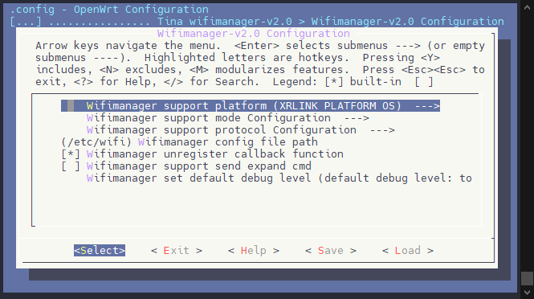

内置 SIP Wi-Fi 双栈模式无需配置设备树。

## WiFiManager Demo 功能命令

系统启动之后，会显示 Wi-Fi 相关的日志，示例如下：

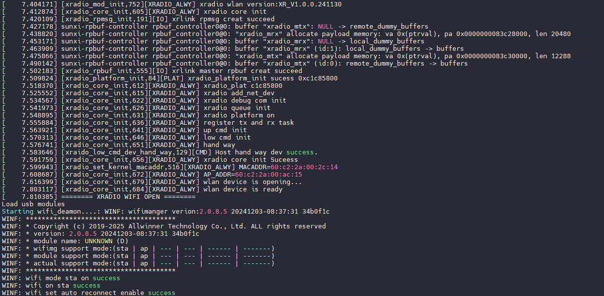

### STA模式命令

打开STA模式，使WiFi模块进入客户端模式，可以连接到无线接入点（AP）。

```
wifi -o sta
```

![image-20241204113137868](data:image/png;base64,iVBORw0KGgoAAAANSUhEUgAAA1YAAAAxCAYAAADZRTgUAAAZgElEQVR4nO3dbWhbZ5bA8f8swzaQt13CpE5qy1eJZqto0lZ4s2EcFstyLAzDSE5hwVSUUVPVY39TBS1OxiTBEW4StqDqyxLX1XoERUNgobENHbLym8IQD7Ndo9npOupGiWXJbYOHwKZJYXa+zH64V7Yk6+XKahOnOT/oh+q55+rRm7kn53nO/Z7ZcvQvCLGBCZcTUpMpFksNm3sJXezBZgAyV3CfGC06rkq8EEIIIYQQ3yF/9bgnsFkWX4Bxn+lxT6MME67gGH7nt/cMFrMDi1l7Lue38D6Y7XiHPJQ7s6uvB2W2H2tLJ9YNSVX1eCGEEEIIIb5LHk9i5QyQWAjgKjNscfYSujpFYmGKxMIYoQ0JlIM+TyNz11Lf9kw3KcXEzAoeby+WOs9k8Y2RCDqKHjXRddFNF4DTw/kOY53PUkJylO6WM0yUHDRx0AjpOxXe/4rxW1yV76cQQgghhBDFqiRWJixmU93JQU2cAaJDx0iHtWqI+waKZxC/ef0Qi8+NLR4lmHyUE6vRZIQIPfTVVbVy0OdpIj4TK3zYbKedG1xLguVAI8vppXqeRAghhBBCCFGn723cY+UgtNBGOtJIuwfIQLNhhbNr1QcT/uAgHlsTAMvxS5z2x/KWglUYN/cyHu2huXgW8UtY/THtuQfgXCe+yfVhV3AKb7qf7lBKPf/VyyjhwmMA2P1Tft3ewPv/CT//+8MoAA8+5Rf/+QEf3c8d1MjbR3/G6/v2ApD+8kPe+t0n/HcN8S8f/RnvlIovYvGNEVWi2msrfo8HsJXcm5THGSDhzawf4www7m0EQxPNwHImS7OhCciyHL/BaX+Fc1V43wrnqc0NgPm8z339HB5D0akLXkel+G/C8/zD8HlePKZO4v6NALODH3NPZ7TFGeDCUKv2HcwSPzeMb1KrvFX9fgJmB/4+d973+0qV910IIYQQQjwNylSsWmlXopxuOUn3iZNY3ZG1i2NX8DIeorhbOrG6LzFnHOBC3lK9iuPJUbpbOrGem0e96O5Uq1K5i1ZnGzbmmZ4EzA5tOeAYx8nSrOSWuxlRDFnSt8q9pMP8fH+Ct8bf5ND4u/zi4WHeef7I2ujLR9/idf6dfxp/k0NzHzKz41XetTTWFP9OLn783RLx6xbvrIBR2WTFz4Tf20o8nHfRPnmG06eGCcchHunn9KkbLDPPWfcwp0eqXdynuL0EyoGNu55MSlNe1SuGr6UTa8sl4iXOETzRibWln0gG4uc6S+yxqhRfP9PwL3mRCFftrYR7AywbzmDve15ntIO+oUbmcvNuGWa6w76+5K/a9xNwdbXBzLAW388cPUQ3LNUUQgghhBBPmzKJVZa5kbwqVDK3l8bBcVuWSG4sGSMYnqfZbteSh2rjlVkONEL8OhOAq28A29Il9eKXpvWDzIpaSSprlZnPchWkFT764lPY0cCPADiCY98q/5obv/8J//w/n6I0WLXxGuNZKRFfxGAo0cBBSz4qVqs8eLjCSFF1aTEJB41Z0tdSLP7QQHP8OhPJFIs6lkVOzMyvJaiu4JTW/MPEQWN2C+9Xy/cTlGMZ/mtMq1ClPuY/PvwNu/+xkz26z9FE+4Fc448UE/7RmipqE6EzBHMVLlIEZ+brSJ6FEEIIIcR3xfdrOtqsoLDCdLmL+GrjuqnNEeJhtVKQSmepkk3lWSV1v8zQ7gaMrBIrN64rfi/29vd4Pf/xB3f1Tk6nXLXqTNESSw8KjSgGoC+AYmwFIBRUGNGzHO1WhuWhNlzAcWMWjHYs16DdsEJ4y+xX+wmds2fyluP9hrj9bVIAJiN/Q4b0pnPAGD63QuiimwueAZrJEo8M4wvVcEJnL+PeHprzl0NmMpudkBBCCCGE+I6oLbFKpklzjINmoNSFeLVxPYwKFmLcXgJPhwMmlzApeRUr7Tk25f5dlngR026gYnJVKf5T3h//gI/0xmQylL5sN2GhzD2enB48hnnOFlWrrs1cp6vDjS1zg7MzcNzbSHz2OtN3dDavyH0+vjaU2WHCyiBdXStq1Uvv6/nWfcyU/ePSQ6kl/pc2/tYEZd7U6pKj+E6MAup+q+iQB1dI7z4wB6GhHtLn+unOVa2cARLeTc5FCCGEEEJ8Z9TYbj3GdLwJT59DXfpkduD3trI8O6slCNXGNbcyLNOoJmB5Fu+srC2dmxi5RNw4QGJhkONkN8yhvWszd0j6hNiXe3n9+SPq0r3dR3j77w6Tvpso2XyidPxh3jl6ZG3p348af8q/WI6UPNrVUeK1A2qDh8tEy7T0dnW0shyJFF3sp1icjHGbJuLhUSYm02BYYToUY0L3TXi1986utqqfmFmh3V6pq+DGz6g29cYX+5j0DQMvnvyJuvTP9BP+4dV/5P5vpvQ1rzD3EvI5qi/bK/P9VGVJ57I67fsthBBCCCFEbRUrYMLfz8HgINGFAUDr+pe3lKraOADJUcLxY5yPTuGB9a5rkxEi3st4fSYmQjF8J4q76WnPMTPPea8dS0hvQrHuo9+9i+noz/i37lcBravf4kpN8RTET/H+Z5+UOFLdbzY3Uqq0skQ6k0VZKlEpMvfitc0T9peKU/dDpW+hNvqIX8ene+aqVDpLs22F20mADBhay9yPKobvXBvj2me0HMl1ZdSr3vgy8x98jb8dPs+J2TOA1hVw5DN9wclRRroCXFgYUJcaZuaJuEtUq8p9P4kxEmnjwtAUniE1/uzsPNjrfllCCCGEEOIJV6Ld+mNm7mU8eox0fhvsDUz4rw7CqZNb915Wxa3SdSpsLS+EEEIIIYR4EtS4FPARSI7S7Y6Cd5DEwhSJhVz3unwpguEV2ru2aptrE/6ORiKnary/Ua5aJUmVEEIIIYQQT5StV7ESQgghhBBCiCfM1qtYCSGEEEIIIcQTRhIr8R1lwuU0le8AaO4ldFVdapq42lviuCrxj4ozUGZ+QgghhBBiK3liEyuLL1Bi79VWYcIVHMPv/PaewWJ2YDFrz+Xcqu/DY2S24x3yUO6dcfX1oMz2Y23pxFqqwUiVeCGEEEIIIfI9nsTKGSBR5h5OABZnXjVhYYzQhgTKQZ9HvRfT1qTeI8rjrb/SYPGNkQgWN+kw0XXRTReA08P5DqOOMzkILUwRKpHsrT+HCf/a+z61sXmIM7CxmUhxRUU7pvC/Mfzf6P2sdEiO0t1S7sa/Jg4aKdNmXk/8d1yV36cQQgghhNioSmJlwmJ+xMuhnAGiQ8dIh7VqgvsGimew4MLc4nNji0e3bqt1UO/JRQ99dVWtHPR5mojPFN3Py2ynnRtcS4LlQKUb/OZbIp0B5cDGGoxJadLOkSJ4ohNrSz+RjHrvKWtL54bW780eT+WL7swV3C2d6ufX0om1ZQu3xRdCCCGEEOIbUCKxchBaCOD3jTG+MMiFi4NEC/712oQ/OLZezQg6ihKvCuPmXsYXpkgMtQKtnM9VNNYqMg5CQ63Ez50kmLuHVXKUcLyJ9i7T2vm77CWSDYDdP+XX3W/wcuMb/Lr7PW52v8fNjjd4eXf+QY28ffQX6lj3e/z66BF+VGP8y+XiC6S4NpvF1lGqJbxaPaq6d8bZhi1zhZHJ3P8HGL86xni0h2ZDDxeujhH1NNHsGWQ8WK06luJ2yfxLrd7oN0883oq3rmWYOl9/AbWaVrnilnfuhakSVZdcRe4yHgPYhkrtsaoUX4W5l/GFMULBMa3Sqn3fFwJ5/zBQ7ffjKKjW+g9sfB9cFeMrszgD2py0anD+MtKqv0/A7Ciaf61V2Wp/HwK48ud4NYCrhmrnNudLGBMOzAkH5sQxnnPuXB88ZMKYeIld+QHOlzCPm9i29sBOdoWOafEOjKH8sc2MNxSMV5yfjnEhhBBCbF1lKlattCtRTrecpPvESazuyNqSKFfwMh6iakXCfYk54wAX8i6yK44nR+lu6cR6bh6Y52yuouHXkiRnGzbmmZ4EzLkLzDGOk6VZyV39G1EMWdK3yr2kw/x8f4K3xt/k0Pi7/OLhYd55/sja6MtH3+J1/p1/Gn+TQ3MfMrPjVd61NNYU/04ufvzdEvHrFu+sgFHZZMXPhN/bSjyct/9n8gynTw0TjkM80s/pUzdYZp6z7mFOj1S/Z1YqnXsfteQh74K54rK4ItMjV8Buf8QNFdTEsHLFDSCGr6UTa8sl4iXOkV+Ri5/rLLHHqlK8PumRk7gjYPMYCLd0cjbeuvYPA9V/PwPYli5p41Gwtxac2xW8zPlcfEv/hvjKHPQNNTKXe90tw0x32NeTx2q/T8DV1QYzw1p8P3P0EN2wVLW8aq8fWvF2XOe0dv6zS62c79N7/gb2BLbz8EyMpDVG0voHHnQ+W5hIVbEr9GP2K6t88Yp6ji+nYKezxnHukLbGSFp/y0PlBfa9mUuOqs2v/vkLIYQQ4vEpk1hlmRuJrV9sJnMX3Q6O27JEcmPJGMHwPM1rF9nVxiuzHGiE+HUmAFefeoFpbRlmmqb1g8wKSsWzrDLz2Sf8NwArfPTFp7CjQasqHcGxb5V/zY3f/4R//p9PURqseVWnGuJZKRFfxGAo0QBBu3gv1TQhx+nBQ161SrOYhIPGLOlrKRZ/aKA5fp2JZIpFHUvt1hI9s4KSybJsa8NVNVEtITnLXKVljoYeovl7rDZceOt4/SVMzMyvJdiuYG6vl4mDxuwW2m+3wu2k9l5nMhTOanO/n7LxpGr6famaaD+Qa3ySYsI/WtM+sonQmfVqMimCM/M1/OOBnr8P+X97UkzUdH6A7ew42MC2QwAP+MqX4ivdsQ3stH3NvVMpvrqpPvKnyRR/nKxx/PJd/oT6/H/8YJVn7M/mVa2qza+e+QshhBDicfp+TUebFRRWmC53EV9tXDd1eVo8rP5LeSqdpUo2lWeV1P0yQ7sbMLJKrNy4rvi92Nvf4/X8xx/c1Ts5nXLVqjN5iYcJf9CDQiOKAegLoBjVakYoqDDi15Gk3MqwbDDQ1dUIs1HCipuDzs18ZuoFfcLbiyVcYjhzBXeNSZMutzIsD7XhAo4bs2C0Y7kG7YYVwk/CHq56fz9mBYUmbNEpPPmPZzI6JxDD51YIXXRzwTNAM1nikWF8oRqSUmcv494emg2beH5dfx/UxHRz7vL5Kzt47uIB9r32As/wNQ9++Qc+f++BvvBDO/hrvubBzXrGt7PzVw725D++nKumVptfnfMXQgghxGNVW2KVTJPmGAfNQKmLn2rjehgVLMS4vQSeDgdMLmFS8ipW2nNsyv27LPEipt1AxeSqUvynvD/+AR/pjdlQtcgxYSFVOvlwevAY5jlbVK26NnOdrg43tswNzs7AcW8j8dnrTN/R07wC7b0zoChNpGdipHDj9R6jOXOjzBwrmIwQ8V6mr2O++rElVXj95eS+X742lNlhwsogXV0ratVuk7N4pOr9/STTpJknXE+3wuQovhOjgLrfKjrkwRXSez4HoaEe0uf66c5VrZwBEl69z/0N/H2o5maKz7vVuW1zvoQSOMCu936vr+pz8yF/Zi/PHAJKJU+6xle5Z63wfNXmV8/8hRBCCPFY1dhuPcZ0vAlPn7bh3OzA721leXZWu0CuNq65lWGZRvUCK8/inZW1pXMTI5eIGwdILAxynOyGOaw3s6jFJ8S+3Mvrz2sNJ3Yf4e2/O0z6bkJb2qcn/jDv5DWs+FHjT/kXy5GSR7s6Srx2QN3jdLmoKUhRXCRSdLGbYnEyxm2aiIdHmZhMg2GF6VCMiUm9CcoS6UwrNpu6j23x2g0wNMFSehPVJa05h621+qEbVH795WmfvV1ttT8xs0K7vVJXxI3fsdrUG19sc7+fwvhWzuc1fLA4ewn5dO5BMqvHVl1WV+b3qcqSzqXhG+ZXjc6/D5t1yMRzbzYUNZPIoyVGe3J7ng418IM39uYdcJcH8e3suWhi1yH1kW1OEz9w1jK+l/15DSu2OdU56ZpftXEhhBBCbGm1VayACX8/B4ODRBcGAFiOX+J03lKiauOA1unvGOdzS5ril9QN8loVxOszMRGK4TtRovMf6l6b8147llCNFQ/go9+9i+noz/i37lcBSH/5IW8trtQUT0H8FO9/9kmJI9X9JHMjpWpBS6QzWZSlEpUWcy9e2zxhf6k4dT9R+hZqo4/4dXy6Zw7rnQG1KloyTRpgLTEx4b+qdswDwHOZhEdtu17cch1gMRQl7hnAVtMcoOLrr/YK0lmabbnlYhkwtJZpvBHDd66Nce07Vu41lFdvfGm6fj9XL2vjWSKRebAXxlMQf4XwSOnfyQbJUUa6AlxYGKAZIDNPxF2iWlXu90mMkUgbF4am8Ayp8WdnC+dX7+uvy80U97peYl/iBZ4BWF7l3iv51Z67fH7mWYyBH2N+TR3/Yna1YP5f+X4LoRfY/ysj+4H/iy/xpa/2cSXxAmjj9y7f1Te/qvMXQgghxFb2PbPl6F8e9yQKmHsZjx4jfW4Y32S5Cy4T/quDcGoL3x/JGSDhzdS818gVnMKb/mYu4oUQQgghhBCPRo1LAR+B5Cjd7ih4B9fvdbOhnXSKYHiF9i79bZ4fLRP+jkYip2ps4JCrVklSJYQQQgghxBNl61WshBBCCCGEEOIJs/UqVkIIIYQQQgjxhHmKEysTLqepfIc0cy+hq9oNbq/2ljiuSrwQQgghhBDiqfH0JlZmO94hD+Watrv6elBm+7G2dGIt1YCiSrwQQgghhBDi6VGQWIUWpgg5Nx5k8Y2RCDpQu/FNrTWV2NBcwhnY2GzCGSis+GjHFP43hv8bvV+QDslRusveaNXEQSNl2njrid/inAESNd9DSgghhBBCCFFOwX2s0hloP2ACChMKk9Kk3YQ1RfBEJ0Htfkfts6Xbgjd7PLhCFZKOzJWa25ALIYQQQgghxFZVULG6vVTqELV6o9888Xgr3g0t0mvhIFR2b1M5ajWtcsUt79wLUyWqNrmKnHqTXNtQqT1WleJ1zjM4tl7tCzrWz23uZXwhgMsZYDz3HFcDuGqo5lnyYxfGCDnzPgdzrzo21Aq0cj53XDCvbb3ZUTS/Wj4D2OZ8CWPCgTnhwJw4xnPOneuDh0wYEy+xKz/A+RLmcRPb1h7Yya7QMS3egTGUP7aZ8YaC8Yrz0zEuhBBCCCFEKQWJVSqdpVkxspY85F1wV1wWV2R65ArY7Y+4sUOK20ugHNiY0K1X3ABi+Fo6sbZcIl7iHMETnVhb+olkIH6us8Qeq0rx1bmCl/EQxd3SidV9iTnjABcKktBWvB3XOd2izuPsUivn+/Ter8tB31Ajc7l5twwz3WFfT/6So3S3dGI9Nw/Mc7ZFO84fW59fVxvMDGvx/czRQzSo9/kb2BPYzsMzMZLWGEnrH3jQ+WxhIlXFrtCP2a+s8sUr6jm+nIKdzhrHuUPaGiNp/S0PlRfY92YuOao2v/rnL4QQQgghnk4FidXinRUwKljMCkomy7KtDRdGFEOW9K0azpqcZY4e+kpUjwAw9BDN32O14cJdS15qXC44MTOvJYbgCub2epk4aMwyd20r3HTXwXFblshITH1dyRjB8DzNBUlolrncOCkmZubVz0T3czTRfsCBxazF+0dr2gc2ETpDcDL3XqUI1vz829lxsIFthwAe8JUvxVe6YxvYafuae6dSfHVTfeRPkyn+OFnj+OW7/An1+f/4wSrP2J/Nq1pVm1898xdCCCGEEE+rgj1W3MqwbDDQ1dUIs1HCipuDTgWFFaaTtZw2RTA8T8LbiyVcYvjb2mN1K8PyUBsu4LgxC0Y7lmvQblghXNP8vyVmPe/lCrc3PdcYPrdC6KKbC54BmskSjwzjK7EPrixnL+PeHpoNeY9lMjqD7/L5Kzt47uIB9r32As/wNQ9++Qc+f++BvvBDO/hrvubBzXrGt7PzVw725D++nKtWVptfnfMXQgghhBBPrcJ268k0aUBRmkjfiZFKQ7v3GM2ZDDXXeyYjROihr2OzU9vEPaKSadI0ctDXhjI7THjpGF1dBprj17dG977c/L7NDojJUXwnTtLd0on73Ao2j6eGfWAOQkM9pMNam/m1ZYM1uJni8+4bLFljpM98zc7XDuhfSnfzIX9mO88cqmd8lS+suaV82n/dKa2CpWN+9cxfCCGEEEI8tYruY7VEOtOKzTbP9CQsXrsBhiZYSm+iupTi2mwWm611E9NyEFq4TLTm5hAxpuNNtNsbmbuWYmJmhXZ7Y97+qmL1Jjm1xqvz8/RpDSvMDvzeVpZnZ7+Z6p25l5DPUT0hvZVhuezcs6RzabQ2P90OmXjuzYaiZhJ5bj7kz+xlT27P06EGfvDG3rwD7vIgvp09F03s0pKnbU4TP3DWMr6X/XkNK7Y51Tnpml+1cSGEEEIIIcooSqzUBhDkKlRaBWs9MSnsmtfsubzxvlV5FkPRTTV4UBO8LMubqDSl0lmaDdpyulsZMDSVabwRw3duhfboVMXXUN7m4if8/URwq3vMogO0L13idC1L9SpJjjJCGxe0vWtRL0TcJdreJ0cJx8ETLd7jFmMkskJ7rhvixTZuz9ZQsbqZ4h7Psk/rqqe8Afde+X3eHqW7fH5mFV77sdp17+Kz/N/sasEpvvL9li/Se9n/K/Uc+zrhwWSN4xxASeSNX7urb35V5y+EEEIIIURp3zNbjv7lcU9CCCGEEEIIIZ5kf1X9ECGEEEIIIYQQlUhiJYQQQgghhBB1ksRKCCGEEEIIIeokiZUQQgghhBBC1EkSKyGEEEIIIYSokyRWQgghhBBCCFEnSayEEEIIIYQQok7/DwSx2pi8YOaeAAAAAElFTkSuQmCC)

扫描可用的WiFi网络，列出周围的所有无线网络（SSID）。

```
wifi -s
```

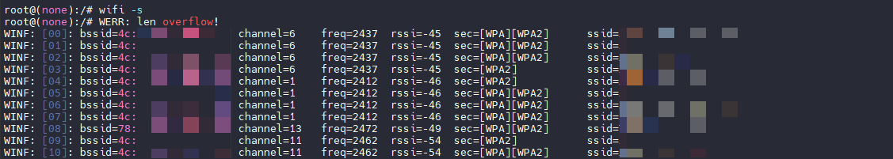

连接到指定的WiFi接入点（SSID），如果该接入点有密码，需提供密码。如果没有密码，直接连接。

```
wifi -c ssid [passwd]
```

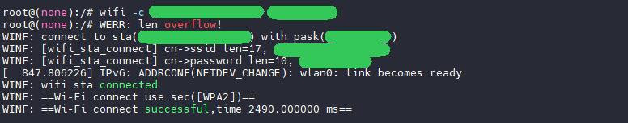

尝试重新连接到之前已经连接过的指定SSID的网络，无需提供密码。

```
wifi -t ssid
```

使用BSSID（即AP的硬件地址）连接到指定的接入点，无论该AP是否加密，都可以连接。如果AP有密码，需提供密码。

```
wifi -M bssid [passwd]
```

启用或禁用自动重连功能。当设置为“enable”时，WiFi模块会在断开连接时自动尝试重新连接到之前连接的AP。

```
wifi -a [enable/disable]
```

列出已连接的或保存的AP的详细信息。若指定“all”，则列出所有已保存的网络信息。

```
wifi -l [all]
```

移除指定的WiFi网络（通过SSID指定）。如果指定“all”，则移除所有已保存的网络配置。

```
wifi -r [ssid/all]
```

断开当前连接的WiFi网络。

```
wifi -d
```

关闭STA模式，停止WiFi模块作为客户端工作。

```
wifi -f sta
```

### AP模式命令

启动AP模式，创建一个无线接入点。

-   `ssid`：设置AP的SSID（即网络名称）
    
-   `passwd`：设置接入点的密码（可选，若未设置则默认无密码）
    
-   `channel`：设置无线频道（可选，若未设置，则使用默认频道6）
    
-   `wep/wpa/wpa2`：设置加密类型（可选，默认使用WPA2加密）
    

```
wifi -o ap [ssid] [passwd] [channel] [wep/wpa/wpa2]
```

在AP模式下扫描周围的WiFi网络。

```
wifi -s ap
```

列出当前AP模式的配置信息，如SSID、密码、加密类型等。

```
wifi -l ap
```

关闭AP模式，停止WiFi模块作为接入点工作。

```
wifi -d ap
```

强制关闭AP模式，停止当前的接入点广播。

```
wifi -f ap
```

### 其他命令

设置调试级别。

-   `error`：仅输出错误信息。
-   `warn`：输出警告信息。
-   `info`：输出信息级别日志。
-   `debug`：输出调试级别日志，包含更多调试信息。
-   `dump`：转储日志信息。
-   `exce`、`exce-mid`、`exce-max`：分别输出不同等级的异常日志。
-   `open`：开启详细的路径、文件、函数、行号信息。
-   `close`：关闭详细日志输出。

```
wifi -D [error/warn/info/debug/dump/exce/exce-mid/exce-max/open/close]
```

获取系统的MAC地址。

```
wifi -g
```

设置WiFi模块的MAC地址，可以通过此命令修改系统的WiFi硬件地址。

```
wifi -m [macaddr]
```

获取WiFi管理器的状态信息，查看当前WiFi模块的运行状态。

```
wifi -i
```

![image-20241204113516827](data:image/png;base64,iVBORw0KGgoAAAANSUhEUgAAAwgAAABbCAYAAADX96LTAAAgAElEQVR4nO3dW2hj2Z3v8W8fzmOgmZfQGWx5u0qZKEozGE3T4Hoo2S4LQ4hsBwYMIkSnWsex3xRBGpdTVBVVotpVTINGD2ew43iMYBCnINC+QA818k1FKEHoGD/0McqUqrwtm5nQcDg0GULech60Jcvy1tU3OfX7gB+ktdfea1+M1trr8n/H4/H8+Y9/+u+I2HMy7Ifcao5du2TXOPEnY3gdQP4ZgdH5iu3q5D+17+Acgv/3/Hf833PZv4iIiMjb5b9ddgFOyx2Oshx2XnYxqnAyHFsk4j+/I7hdPtwu61j+c7gOrn5CD4NU2/PwxBjG5iQ9nkF6TjQO6uc/NecgPXf+J391XvsXERERectcbgPBH2VnO8pwlWS3f5z40ho722vsbC8SP9EQ8DER7GDree68S9qiHCsbhwRD47hPuSd3eJGdmK/iWydDTwIMAfiDPBroPuVRbGTnGfHcY8U20cn1bjDf1Lj+NfOfgdz/4lf9H9OuT4CIiIjIVdNgA8GJ2+U8dSW3Kf4oyYc3MBest9OBlxjBu0RcR5u4wwG86SSx7EUWrEmrCRKMMXGqXgQfE8FO0hup41+7+unjJc+z4L7Wwb65d5qDiIiIiIjwTvU5CD7i2zcxEx30BYE8dDkOuV96G+wkErtL0NsJwH76KdORVNkQkxrprnGWk2N0VR4y/ZSeSMo69hQ8GCS8epQ8HFsjZE4yEs8V9r80i7FwfBsA3v0B/9r3Hr/4Lfzk797HAPjDl/z8t7/ks6+LG3Xw8Yc/5qNvfRMA8z//hZ/95gv+TxP5f/jhj/nELn8Fd3iRpJG0zq3yGk/htR27X8YfZSeUP9rGH2U51AGOTrqA/fwBXY5O4ID99EumIzX2VeO6HS+nVTYAMmX3/WgfQUfFro+dR638Z+H7DG7es56hX5NWL4KIiIjImajTg9BLn5Fk2nObkdHb9AQSpUrecGyWIEkCnkF6Ak/Z6p5ipmwIUM307DwjnkF6HmQoVB4HC70ExQq0/yZeMqyvAi6fNcxokVsc0GUUh9F0YzgOMF9VK/v7/OSvd/jZ8k/57vKn/Py/3ueT73xQSv3hhz/jI/6Nv1/+Kd/d+hc2vvEjPnV3NJX/k2L+5U9t8h/ZfXMI3UaLPTBOIqFe0gtllf7Ve0zfecxCGtKJSabvvGSfDPcDj5meq9U4AMjxeg+MaydnBTiNzrJeiBRhzyA9nqekbfYRGx2kxzNJIg/pB4M2cxBq5T8Ln7PW38tCf5T9c9m/iIiIyNupTgPhgK25sl6BbPEdrY9b3gMSxbRsithChq7+fqsSXC+9Nve1Dki/YAUYnpjCu/eUHs9j1uk82shlFN7sV/UVG78rvtE/5LP/+BK+8R7fA+ADfN/6in8upn/9Bf/w719ivNdjpTeZn0Ob/BUcDpuJulYlumbvQZAgz5ireNu/m4Xr3QeYz3PsfttBV/oFK9kcuw0Mt1rZyJQaWsOxNWuSt5Pr3QdtPJ9DRERERC5Ca+ubugwMDlmvVhmtl96wwiTY9EKhZyFnHlCnVVDmK3JfV0l69z26+YpUtfSG8n+T/r5/5KPy7//w+0YL16Bi78G9iqFbQQw6MBzARBSjuxeAeMxgrubwIsurPPsPbzIM3Oo+gO5+3M+hz3HIQtvM5ygfQgQaRiQiIiJyMVprIGRNTG5w3QXYVSjrpTei28BNitd7EBzwweoeTqOsB8E6Rku+/j17/C3Od4GajYRa+b/kF8u/5LNG8+TzVSq3TtxUiRHgDxJ0ZLhf0XvwfOMFQwMBvPmX3N+AW6EO0psvWH/T4CTl4v0J38TYfMyCcZehocNCL0Sj53PuPmet//PLLoSIiIjIW6fFZU5TrKc7CU74CkOGXD4ioV72Nzetim69dMurPPt0FBoSZXbfHJaG5KzMPSXdPcXO9l1ucXCiDH1Drayw/wWp//wmH33ng8KQoHc/4OO/eR/z9zu2k4zt87/PJx9+UBpS9L2OH/BP7g9stx4esDl3oDCRd5ZklaVehwd62U8kKirtOXZXU7ymk/TCPCurJjgOWY+nWGk4GJl17foLS8SubBzS119rFaST96g5p81fj4O/atdQGCIiIiJXTMshlFcik1yP3SW5PQVYqxTFcw2nA5CdZyF9g0fJNYJwtIrRaoJEaJZQ2MlKPEV4tHL1H+sYGxkehfpxx5uP0vvZbz7F+eGP+dXIjwBrFaLdw6bycyz/Gr/43Rc2WxbmY2zN2fUf7GHmDzD2bN7cu8YJeTMsROzyFeYLmK8oTOhOvyDccMkLcuYBXd5DXmcB8uDorRLPIEX4wU2WrXu0nyiuItWo0+av53PWnvTz9/MZ/hb4+n//D34197sz3L+IiIjI26XGMqeXzDXOcvIG5oPHhFerVSidRJbuwp3b7RsLoXKJ0gYdX9JVRERERORiXG4k5Vqy84wEkhC6a0VSLq62Uy5HbOGQvqHKCMPtwklkoIPEneYaB6XeAzUOREREROSCtW8PgoiIiIiIXLj27UEQEREREZELpwaCiIiIiIiUXPkGgjsctZmb0C6cDMcWifjP7whulw+3yzqWv12vg4iIiIhcFZfbQPBH2akSAwDA7R8nvrRmTVJeJH6iIeBjIlhYy789FWIMBEPjhXgQp+AOL7ITq5yM7WToSYAhAH+QRwPdDezJR3x7jbhNo+XoGE4ipeu+dnKSuD96ctK4P8rOUtl5Wtsc/1skcq7xEERERETktBpsIDhxu5ynruQ2xR8l+fAG5sIkPZ5BegIvMYJ3j1Uw3eEA3nSyfZc4hUJMB8aYOFUvgo+JYCfpjYp4EK5++njJ8yy4r9UKdFZuDzMPxrWTvQ1Oo9PaR47Y6CA9nkkS+ULsgh7P4IklV7uCwaqNOwDyzwh4Bgv3zzNIj6eNl6MVEREREaBmoDQf8e2bmIkO+oJAHroch9z33LOCejmJxO4S9HYCViC0SKpsOc8a6a5xlpNjdFlbPtpe4xEcBUrDR/xhL+kHg8RWrY2y8yykxwgNOYllc4CTof5O0gs2QdTe/QH/2vcev/gt/OTv3scA+MOX/Py3v+Szr4sbdfDxhz/mo299E7ACpf3mi0Ik5Qbz//DDH/OJXf5jcjzfPCA54IPVyrL6iG9P4c0/qx0nwX+zsE3xWvijLIc6wNFJFzCzdIMuRydwl2XjJdORWsuq5ni9B30nvndyvRswq2askCGd7rWC2bXag9Pg+YuIiIjIhanTg9BLn5Fk2nObkdHb9AQSpYi/w7FZgiQLb4gDT9nqnmKmbMhJzfTsPCOeQXoeZIAM94tvmCNWBdp/Ey8Z1lcBl88aZrTILQ7oMorDaLoxHFY0YVvv85O/3uFnyz/lu8uf8vP/ep9PvvNBKfWHH/6Mj/g3/n75p3x361/Y+MaP+NTd0VT+T4r5lz+1yX9k980hdBst9sA4iYR6SS+UVaBX7zF95zELaUgnJpm+85J9MtwPPGZ6rn5FO2cWr2NhuFH50CX7aMr21ueeQX//xfYsiYiIiMi5qtNAOGBrrqxXIFusPPq45T0gUUzLpogtZOgqVRbrpdfmvtYB6ResAMMTU3j3ntLjecw6nUcbuYzCm/2qvmLjd8U3+od89h9fwjfe43sAfIDvW1/xz8X0r7/gH/79S4z3eqz0JvNzaJO/gsPByUE9KcKeQXpq9h4ECfKMudXjX+9m4Xr3AebzHLvfdtCVfsFKNsduA0N4Sg0Wl4GRP2Dfe5Phug0uG9lNtmoNn3KMkSyfg3BiDkUD5y8iIiIiF6q1CGkuA4ND1qtVRuulN6ww7KU4jChnHlCnVVDmK3JfV0l69z26+YpUtfSG8n+T/r5/5KPy7//w+0YL16Bi78G9iqFbQQw6MBzARBSjuxeAeMxgrubwIsurPPsOB0NDHbCZZMEIcN3fyj3LEVvIsBMax71gk3yuQ4e+z+DmvdIwNfg16f6PySld6UpX+qWni4hcba01ELImJje47gLsKpT10hvRbeAmxes9CA74YHUPp1HWg2AdoyVf/549/hbnu0DNRkKt/F/yi+Vf8lmjefL5Kj8eTtzk7CvR/iBBR4b7Fb0HzzdeMDQQwJt/yf0NuBXqIL35gvU3jUxSxrp2DgyjE3MjRY4AodANuvIvm/+BW02QCM0yMZBpNqelxvnX9Dlr/Z8rXelKV3obpouIXG0tLnOaYj3dSXDCVxgy5PIRCfWyv7lpVfTqpVte5dmno9CQKLP75rA0JGdl7inp7il2tu9yi4MTZegbamXt/y9I/ec3+eg7HxSGBL37AR//zfuYv9+xmWRcLf/7fPLhB6UhRd/r+AH/5P7AduvhAZtzBwpzAGZJVlnqdXigl/3E0byPghy7qyle00l6YZ6VVRMch6zHU6ysNlrR3sPM9+L1FuZ57D5/CY5O2DNbqKgXJmF7vb1N56x3/iIiIiJy8VrrQQBWIpNcj90luT0FWKsUla1mUy8dsFYmusGj5BpBOFrFyHorXVghJ0V41GalImBlI8OjUD/uePNvoD/7zac4P/wxvxr5EWCtQrR72FR+juVf4xe/+8Jmy8J8jK05u3fze5j5A4y9FxWNAMA1TsibYSFil89ZmH/wisKE7vQLwg2XHIorGYHVq5E1C4sXlZZJdRJZmiXosD4GZ9kJFpY7rVzqFGA3niQdnMLbVBmg5vmLiIiIyKV4x+Px/PmPf2q5nXB+XOMsJ29gPnhMeLXawBcnkaW7cKeN19f3R9kJ5Zseiz8cWyNk2lfIRURERETOy+VGUq4lO89IIAmhuycj+ZbkiC0c0jdUuTpOu3ASGeggcafJibrF3gM1DkRERETkgrVvD4KIiIiIiFy49u1BEBERERGRC6cGglwMf5SdpXFFXRYRERFpc2ogyJXmDkdt5qa0Cx/xtl7Ctd3LV0+7l9/JcGyRSLVI4yIiIm3KtoEQ314jbvOj5g4vshPzUVg9aK00efjEJGJ/9OSk4so3yNY2x/8WiVTERDgtd3jR9lzeCv4oO21dgTotHxPBDraetziZ+y/++sjlyrGycUgwpJ4zERG5WmwbCGYejGsn38o6jU72zT0gR2x0kB7PJIl8YX38Hs/giSU5u4LB2pWv/DMCnkF6Sn9tvFxpW3PidjnfukqIOxzAm07qmZH2tZogwRgTb+tLChERuZJsGwiv9+y+dXK9u5ldZ0inewmdaviHj/j2WvNj110+4kuLLMfGGTLAuDZe+tzoftz+KMtlPRtxf9l5uMZZrnzzXN5DYqVHwkf7WI75jo5dLx0AJ5HY4lHvzIn0wvCKSHiR5e27zDy5exSR2DVe2O/DXqCXR8XziDW4HKxrnOXtReKxxcK5h639bUfLengaKN9SWc/QtcqDFIZfVM9fPMdq99/JUH8n6Q37IHr171+d6+PyVZzfBb8FrnX8hp4faQ9WpPGBdl2KWURE5CTbBkLOPKDL6KZUQSurOJlvGh/OsT73DPr7L77ikk0RHr3N9Ab0eTvp6newfuc2I5FG4xH4mHjYwdaDYs/GY9YH+pscitJL0HjBtGeQnsBTtrqnmDnWWKqdPhybJUiy0MNim7+wjz4jybTnNiOjt+kJJAoRibPzjHgG6XmQATLcL/bQROwr09WYc7cJJMAbdLDgGeR+upe+IWdD5RuOTeHde2qlJ6G/99i+h2OzPCrm90xWOb9aujEcVjTpE+rcvwauz/DQTdh4bOWfZIsxko02sM5A/ePXe76kXey+OYRuQw04ERG5MmwbCKUfNJeBkT9g33uT4ZoVsiqym2zV6l53jJEsn4NwogKWIuwZpKfJKMQl125A4ikJOrj17WYzd9J3zYfbBZBjJTJfqHw37IDEXKpQ7myK2EKGrmONpVrpPm556+Uv7GOruA1A9iwDqx3yOms9C/k8x/dcr3z26VXzk6tyfjXuv8vAqFn+092/lfg9YqUI3jliG5kLreTVP34jz4e0DYcDNd9EROSqsI+Q9irPvsPB0FAHbCZZMAJc9xsYHLLe1HjvQsVvJzSOe8EmOf+MQKuV/3pc48z0v2R6NMVuHOJLUYZX7zVYSUwRDhjEnwSYCU7RxQHpxGPCTUU2LlSwW0p3tXKtL1C98jWU3ok3uUaw/Pt8/owKeAb3zz/OcmiMLsd5lO8sjl/v+Tpv32dw8x5dpc+/Jt3/cVlD8rTp5+2ql19EROT82DcQsiYmDgyjE3MjRY4AodANuvIvm/8BXE2QCM0yMZCpv60tJ25yzTcisvOMjBY/pAjfsZ1YUTN/eHQeKIxnTz4MMhxvtIEB0MF1F1C1ElcjPWticqNO/ktUr3wNpWdY8DRyPavcf+sY1ct4mvvnI/5wDPPBJCPFt/j+KDuhhjKfgUaOX+/5Om+fs9b/+Tmmn7cLLv+JXjgREZH2VSUOwh5mvhevN8P6Kuw+fwmOTtgzW3jbb03S8/bW3/QEH/Ht2aPJt6fRzPAb1zjxcI1Jn1kTk7IJ2C4fkVDl+XUSnLD2YaXvb26WXb9a6SnW0/XyN+BVnv1iRfJM1Sufffrx/L08KptY6/YXrvlxte5/4RjFORHH1Lt/RTWvzwFmsUpne3/PW73jn8HzIRdieED3RkRErpYqDYRcYSWj4luvrIkJ1hKncBQHYZagA7qCsyfjHpTZjSdJt1S8Pcz8AfvpF02O/z+l7Dxz3GTGmhuRDEEiUP72OUX4QQas8955cpPXm5U9JBkSprWP5BR9e0+ZPjbEpXb6SmSSBIHCHA3b/I2dx0IagskmVzFqQL3yrUQmSXRPWekBqLg+K5FJ7hfzb68xMwDrzysnUde+/ysbVcbd171/R9vZX58Uc4lD+h6u1bi/56mR49d7vqQ9FObbtByrQ0RE5BK84/F4/vzHP9mPNJIWucZZTjqqD6Gply4NchJZugt32jV+ho/49k3Wz/o+n9nzc07luzBXoPz+KDuh/PnNtRIRETkHVXoQRK6CHLGFQ/qGtMa8tCMnkYEOEnfUOBARkatFXQdyta3eY+SyyyBiK0cscvuyCyEiItI0DTESEREREZESDTGSi+GPsrM0rkBeIiIiIm1OXQdypbnDUWZIMNKGK/i4/eNMDDiAPOtz86y02UTqdi9fPe1ffifDsbtc37hNbPWyyyIiItI42x6E+PYacf/J793hRWspyOIyp8f/Ssuc+qMnlz2tfINsbXP8b5HIGa/Z7w4v2p7LW8EfZecsYki0LR8TwY7Wl5A8z+vjj5J8eANz4wXrG3D92/ZLAF+adi9fPVei/DlWNg4JhtRzJiIiV4ttD4KZh75rTqiI/ek0Oq1YCDlio4PEcBJZmqVvc9L2DW5XsE702vyzt2T5PyduF5CtFhG6XrrYcYcDeNNJwm335hjc1zognSS2WhnboT20e/nquTLlL0aS988TVi+CiIhcEbY9CK/37L51cr27mV1nSKfLog23xEd8e635sesuH/GlRZZj4wwZYFwbL31ufD9OhmOLR70j5Xld4yxXvnk+McbeR3w7SiS8yPL2XWae3K2ICFwvvfL4vpPH90dZLva+LEUZdpWnr7HzsBfo5dF2k4HSXOMsby8Sjy2ys71IPGztbzta1sPjJFKtfMXzWyrrGbpW7/raRT6udf+dDPV3kt6wryC6y6/N9iJxf9lz2Mj1cfkqzq+5Z3D3zSF4b7Zt7027l6+eq1N+K5L8gJbiFRGRq8O2gZAzD+gyuilV0MoqTuabxodzrM89A7tIt+ctmyI8epvpDejzdtLV72D9zm1GIo33VgzHZnnU/ZL7gUF6PINMb8BQ00OVeukzkkx7bjMyepueQKKiN6V6+nBslkckCXgG6fFMstU9xcyxxlYvoYEXTFvp9/d6eTRh3afsPCOeQXoeZIAM9z2Fc+iJNPe21Zy7TSAB3qCDBc8g99O99A05S+ULFssXeHqifMOxKbx7T630JPT3Htt3/fOrpxvDcYD5yi7Nx8TDDrYeWOftecz6QP9RZbKB6zM8dBM2Hlv5J9lijGSTkaj36eXRGUavPmvtXr56rkr5d98cQrehYUYiInJl2DYQSj9oLgMjf8C+9ybDNStkVWQ32WKMiWoVa8cYyfI5CCd+7FOEPYP0tDoM6doNSDwlQQe3vt1MRh+3vAck7hxNfNxdnW9houEBW3Opo7JnKxtX1dKt45fScsQWMnQda2yV582xspE540rIIa+z1rOQz1cMNqsoXzZVUT779Kr5bc8Pat5/l4FRs/yd9F3zFYZukWMlMt9UtN2V+D1iq8WzzhFr5vq6xll+CAuBp6S9U0dzYPxRltuhQtvu5avnKpbf4aAdZ0mIiIjYsV/F6FWefYeDoaEO2EyyYAS47jcwOGS9qfHehYrfTmgc94JN8nnOQXCNM9P/kunRFLtxiC9FGV6tMR/iWN5WzvUMuQwMOvEm1wiWf5/Pl30oVOAvRb3r01B6vfM7jRThgEH8SYCZ4BRdHJBOPCbczEpH/nGWQ2N0OZovn3voBiQes5LNsRIwWE4uEnl1m+fXOsC0Hb9n4/sMbt6jq/T516T7Py5rqNVLb/fyvb3lFxERaXf2DYSsiYkDw+jE3EiRI0AodIOu/MvmfwCLk/QGMvW3teXETQuTd7PzjIwWP6QI32m04oB1/je47gIuoxKeNTHJsOBpsEFz0epdn4bSGz2/KvffOkb1Ms4THp0HCvMRkg/rTJg/xkf84Rjmg0lGir0I/ig7oYYy4zQ6wTwqx3TiBskn47DXibnR6H/Q56z1f36K9HYv31tW/hO9cCIiIu2rSqC0Pcx8L15vhvVV2H3+EhydsGe28LbfmqTn7a2/6Qk+4tuzFZN3W3RieE8tKdbTnQSfjJcm/rr940SKQxmyJiZlE7BdPiKhVs6v1vEL46uLQ1rc/nHi4SaHT7zKs09HoaJ+pqzrM2GVzzr//c1N6/mwTz+ev5Hzq3X/C8cozok4xlXYV93hQDWvzwFmsUrX5P1d2cgUVvCy9rsbf0yCMYLdz5hrg5Vs2r189Vy18g8PlP9viIiItL8qDYRcYSWj4luvrIkJ1hKncBQHYZagA7qCsyfjHpTZjSdJt1S8Pcz8AfvpFxf+Jn0lMsn9vRs8ShbmR8wMwPNS5SNF+EEGrPPeeXKT15ut9pDUOD6B0hyNmQFYf97kko7ZeRbSEEw2uYpRg+VLFMuXnKJv7ynTZUN4ViKTJLqnrPQAVFyfxs6v9v1f2bCbtwBk55njJjPWvpMhSARseg+qXp8Uc4lD+h6utXZ/V+8RSHQUnp2lRXa2Z+nby5B21JiPc5HavXz1XKnyF+bbtByrQ0RE5BK84/F4/vzHPymgslxFTiJLd+HObWJtGAsBwO1ysttU79XFavfy1dP25fdH2Qnl35J4LyIi8peiSg+CyFWQI7ZwSN9Qm65cA+1deaX9y1dPe5ffSWSgg8QdNQ5ERORqUQ+CiIiIiIiUqAdBRERERERK1EAQEREREZESNRBERERERKTEtoEQ314jbrNcoDu8aC0FWVzm9PhfaZlTf/Tksqf+KDtL40dLUlrbHP9bJHLGa/a7w4u253Im/FF2ziJGw2Ud/9LK39jzU/p+KVpa8x4A1zjLtcpt+2zZP9MiIiIicpzt7GQzD33XnFAR+9NpdFqxEHLERgeJ4SSyNEvf5iQj8ZOriXQF60SvzT/T8n9vpUaenwz3rUjLbn+UmeQi1wPNLGd6lF9EREREGmfbg/B6z+5bJ9e7m9l1hnS6LNpwS3zEt9eO9zw0wuUjvrTIcmycIQOMa+Olz43ux+2PslzWsxH3l52Ha7yQ9rAX6OXRdmWgrUIZIrHFo7fgTRz73I/fSH6cDB/LbxeZuMX706Td1XtMJyA40b7LmYqIiIj8pbBtIOTMA7qMbkoVwLKKo/mm8XXH1+eegV2k2/OWTREevc30BvR5O+nqd7B+5zYjkUZ7K3xMPOxg68EgPZ5BejyPWR/oPxrSkp1nxDNIz4MMhTfV1naRo0jAw0M3YeOxlX+SLcZINhzJ+JyP30j+2CyPSBIo5u+eYuZUjb3T2X1zCN3GxT9LIiIiIm8Z2yFGu28Ood/A7QIjf8C+9ybDgOE4wHzVxN6zm2wxy4R/nrBdumOM5PbY0ef002OVVEgR9qROZGvYtRuQeEqiP8Ctb8NKU9F2O+m75uO5K8VuNsdKpLmATCvxe2WfcsQ2MgRDhQpuY42Uyzy+j1veAxKBlLVtjthChmCoH3c8V5b/lPfnXBV6Rh6VPh+QaGqIkoiIiMjbyT5C2qs8+w4HQ0MdsJlkwQhw3W9gcMh6UxWsQsVyJzSOe8Em+TznILjGmel/yfRoit04xJeiDK82OiY9RThgEH8SYCY4RRcHpBOPCdvMs6jKP85yaIwuR9l3+XyDmS/5+C4Dg068yTWC5d83XP52oDkIIiIiIq2wbyBkTUwcGEYn5kaKHAFCoRt05V/S3HtsYDVBIjTLxECmxSI6cZNrvhGRnWdktPghRfiO7cSKmvnDo/NAYT5A8mGdCdfH+Ig/HMN8MMnIqnXF/FF2Qlfk+FkTkwwLDVWwW7w/TXJf64C9F5rQLiIiInLOqsRB2MPM9+L1Zlhfhd3nL8HRCXtmCxW0HM83D/B6e1sono/49izJs1iKM9tE08Y1TjxsNym3wqs8+3Rw3XZp1gPMYnPK5SMSauL8L+r4VfOnWE/38qhsYrLbXyjTcWd4f2pw+6PMBCEx167DmURERET+clRpIOQKKxnl84UqZtbEBGuJUzhax36WoAO6grMn4x6U2Y0nSbdUvD3M/AH76RcXO1QkO88cN5mxVvBJhiARsHmbnp1nIQ3BZOUqQCnmEof0PbS+f3KT15tN9KBc1PGr5oeVyCT3CZC0yjAzAOvPKyvord6fRp6fo9WVZkKwcGL+QNnqS7arMJ1Mr/Z8ioiIiMiRdzwez5//+Cf7kUYiIiIiIvJ2qdKDICIiIiIibyM1EEREREREpEQNBBERERERKVEDQUREREREStRAEBERERGREvUOrrYAAAIjSURBVNsGQnx7jbj/5Pfu8KK1lGRxmcoqy0j6oyeXlfRH2VkaP1rb39rm+N8iEds1/UVERERE5CLYrm9q5qHvmhMq4iY7jU4rFkKO2OggMZxElmbp25xkJH4yEFlXsE703/wzAqPzio4rIiIiItImbHsQXu/Zfevkenczu86QTvcSOlVwKh/x7bXjPQ8iIiIiInJubBsIOfOALqObUgW9LEKt+eZkT0E163PPoL9flXsRERERkSvCdojR7ptD6Ddwu8DIH7DvvckwYDgOMF81sffsJlvMMuGfJ2yX7hgjuT129Dn9lJ5IqmyDFGFP6kQ2ERERERE5H7YNBF7l2Xc4GBrqgM0kC0aA634Dg0PWs83sPkdsIcNOaBz3gk3yuc5B+D6Dm/foKn3+Nen+j8tmVShd6UpX+mWli4iItK93PB7Pn//4p8p2go/49k1I98LGIHPXFpnphy5eVlToq0xS9kfZeQj3PfdYsbYx9jJ4u/NH+f1RdkL5BhoITtzkNJFZREREROQCVImDsIeZ78XrzbC+CrvPX4KjE/bMFirqOZ5vHuD19rZQPB/x7VmS21GGW8gtIiIiIiLNqdJAyBVWMsrnC13iWRMTrCVO4SgOwixBB3QFZ0/GPSizG0+Sbql4e5j5A/bTL6ovlSoiIiIiImemyhAjERERERF5G1XpQRARERERkbeRGggiIiIiIlKiBoKIiIiIiJSogSAiIiIiIiX/H2AeH7pVv4cbAAAAAElFTkSuQmCC)

进行WiFi用户厂商消息测试，`length`指定测试消息的长度。

```
wifi -v [length]
```

关闭WiFi管理器，不再进行WiFi管理操作。

```
wifi -f
```

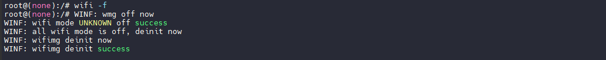

显示帮助信息，列出所有可用的WiFi命令及其简要说明。

```
wifi -h
```

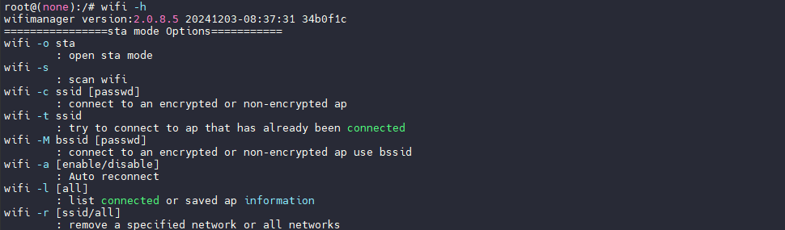

## SIP Wi-FI 配置单栈驱动

V821 还支持使用单网络栈的 Wi-Fi 模式，此时全套 Wi-Fi 驱动，协议栈都运行在 CPU0 的 Linux 系统内，若配置这样的模式，Wi-Fi 将不支持低功耗保活。**一般作为调试使用**。

（1）使用 quick\_config 切换单栈驱动

选择选项 13，V821\_SMAC 即可切换到单栈驱动，之后编译烧写即可。

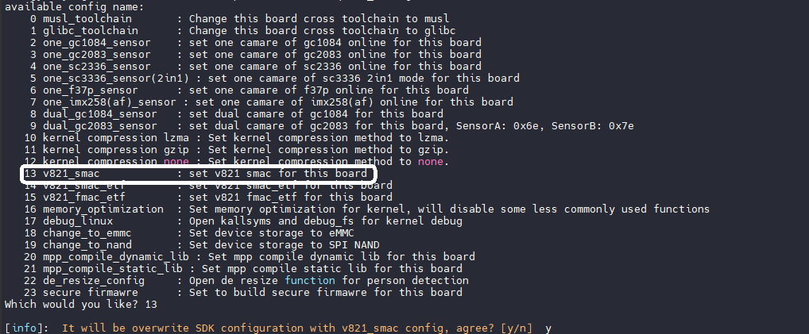

（2）重新编译 WiFiManager

在切换后，需要重新单独编译 WIFIManager 来支持单网络栈模式，命令如下

```
cwifimgm && mm -B && cd -
```

（3）编译固件

使用 `mp` 命令编译打包固件

（4）启动使用

启动后可以看到使用的是单栈驱动，其余使用均与双栈驱动一致

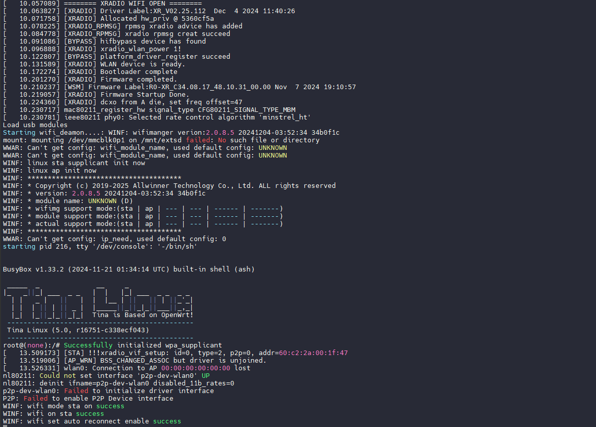

## SIP Wi-FI 配置STA+AP模式

在某些场景下，需要配置 Wi-Fi 作 STA + AP 模式运行，例如配网的时候启动 AP 和 STA， 通过 AP 与手机APP通讯获取需要连接 Wi-Fi 的 SSID，密码后， 直接STA链接， 连接识别， 直接通过 AP 反馈给手机APP，进行下一次操作。启用这样的模式需要单独配置下驱动。**STA+AP会影响吞吐性能，仅在特殊需求下使用**

（1）配置 RTOS 小核驱动

运行 `mrtos menuconfig`，开启配置项：

```
Drivers Options  --->
	other drivers  --->
		[*] wireless devices  --->
			[*]   XRADIO driver  --->
				[*]     wlan STA and SoftAp coexist
```

然后重新编译小核固件

```
mrtos clean && mrtos
```

（2）配置 WIFIManager 模式

运行 `m menuconfig` ，开启配置项 `Wifimanager support sta + ap coexist mode enable`

```
Allwinner  --->
	Wireless  --->
		<*> wifimanager-v2.0  --->
			Wifimanager-v2.0 Configuration  --->
				Wifimanager support platform (XRLINK PLATFORM OS)
				Wifimanager support mode Configuration  --->
					[*] Wifimanager support sta mode enable
					[*] Wifimanager support ap mode enable
					[*] Wifimanager support sta + ap coexist mode enable
```

然后重新编译 WIFIManager

```
cwifimgm && mm -B && cd -
```

（3）编译固件，验证功能

启动的时候可以看到 `sta-ap` 功能支持上了

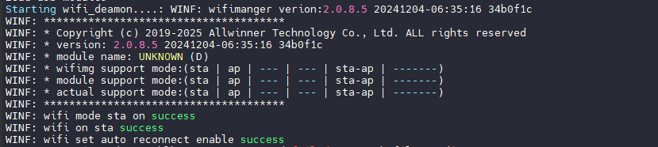

首先以 STA 模式联网，联网后使用 `ifconfig` 查看配置

```
wifi -o sta
wifi -c ssid [passwd]
```

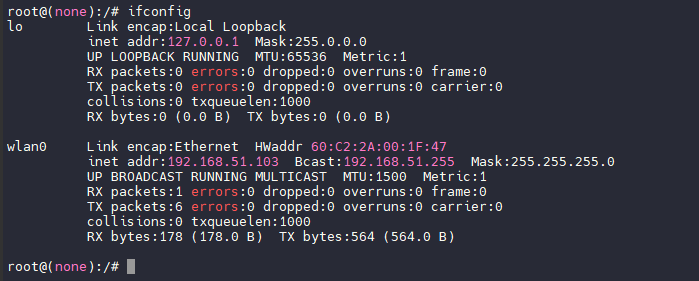

然后配置 AP 模式，启用 AP，此时使用 `ifconfig` 可以看到生成了两个 wlan 节点，一个是 STA 一个是 AP

```
wifi -o ap
```

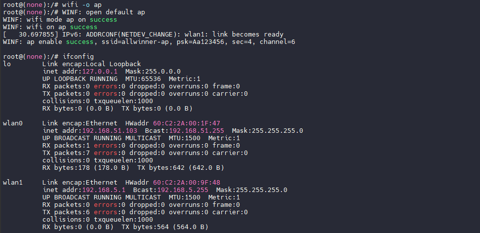

## 外置 Wi-FI 配置

针对没有内置 Wi-Fi 的 V821 型号，若使用外挂 Wi-Fi 就需要适配外置模组。这里将演示适配的 Wi-Fi 模组是 [XradioTech](http://www.xradiotech.com/) 所设计的 XR819s Wi-Fi 模组。在 SDK 中已经内置了 XR819s 的驱动，在这里我们简单说明如何配置驱动。

### 设备树配置

找到设备树中的 SDC1，配置启用他。

```c
&sdc1 {
	bus-width = <4>;
	no-mmc;
	no-sd;
	cap-sd-highspeed;
	/*sd-uhs-sdr12*/
	/*sd-uhs-sdr25;*/
	/*sd-uhs-sdr50;*/
	/*sd-uhs-ddr50;*/
	/*sd-uhs-sdr104;*/
	/*sunxi-power-save-mode;*/
	sunxi-dis-signal-vol-sw;
	cap-sdio-irq;
	keep-power-in-suspend;
	ignore-pm-notify;
	max-frequency = <50000000>;
	ctl-spec-caps = <0x428>;
	status = "okay";
};
```

然后新增 `rfkill` 节点，用于管理 Wi-Fi 模组的供电，唤醒等功能。

```c
&soc {
	rfkill: rfkill@0 {
		compatible = "allwinner,sunxi-rfkill";
		chip_en;
		power_en;
		pinctrl-0;
		pinctrl-names;
		status = "okay";

		/* wlan session */
		wlan: wlan@0 {
			compatible    = "allwinner,sunxi-wlan";
			/*clocks        = <&rtc_ccu CLK_DCXO24M_OUT>, <&rtc_ccu CLK_OSC32K_OUT>;*/
			/*clock-names   = "dcxo24M-out", "osc32k-out";*/
			/*wlan_power    = "axp803-dldo1";*/
			/*wlan_power_vol= <3300000>;*/
			wlan_busnum   = <0x1>;
			wlan_regon    = <&pio PD 11 GPIO_ACTIVE_HIGH>;
			wlan_hostwake = <&pio PD 12 GPIO_ACTIVE_HIGH>;
			wakeup-source;
			//regulator-boot-on;
			//regulator-always-on;
		};
	};
};
```

需要关注的配置如下：

-   `wlan_regon = <&pio PD 11 GPIO_ACTIVE_HIGH>;`：表示 PD 11 为模块的 REGON 控制脚
-   `wlan_hostwake = <&pio PD 12 GPIO_ACTIVE_HIGH>;`：表示 PD 12 为模块的 HOSTWAKE 控制脚

### 内核驱动配置

进入内核驱动配置页 `make kernel_menuconfig`，选择驱动 `<M> XR819S WLAN support`

```
Allwinner BSP  --->
	Device Drivers  --->
		Network Device Drivers  --->
			Wireless LAN  --->
				<M> XR819S WLAN support
```

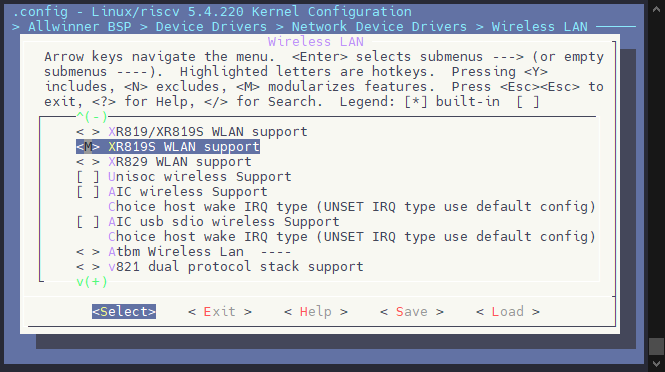

### 用户层固件配置

进入 ROOTFS 配置界面 `make menuconfig`，配置固件和驱动，由于使用的是40M晶振的 xr819s 模块，所以这里需要勾选 `xr819s with 40M sdd`

```
Firmware  --->
	<*> wireless-regdb
	-*- xr819s-firmware
	[*] xr819s with 40M sdd

Kernel modules  --->
	Wireless Drivers  --->
		<*> kmod-cfg80211
		<*> kmod-net-xr819s
```

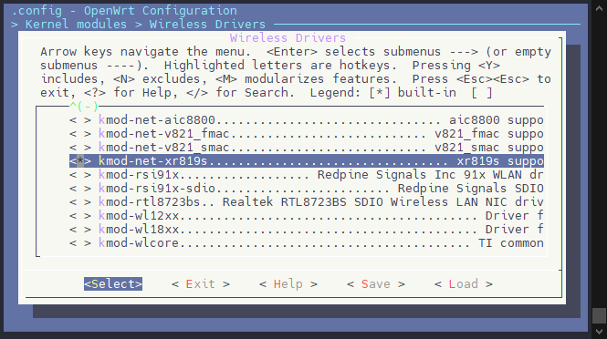

### 上电启动

配置完成之后，编译烧录固件，上电启动后可以看到 Wi-Fi 相关的日志

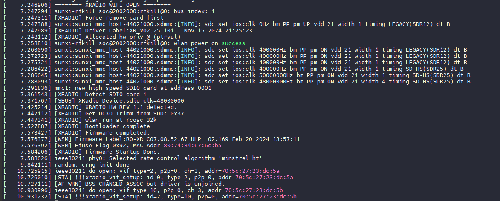

可以使用 `wifi -s` 搜索 Wi-Fi

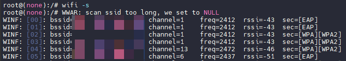

其他操作与【WiFiManager Demo 功能命令】中描述的一致，在此不过多赘述。

## FAQ

### WIFI Manager 相关 FAQ

#### ADB中输入 WIFI 指令，ADB没有输出

由于 WIFI 进程与操作 WIFI 配置的进程 `wifi daemon` 是两个进程，所以默认情况下，在 ADB 输入的 WIFI 指令操作会打印到串口。

如果需要输出指令，请打开此配置 `m menuconfig`

```
Allwinner  --->
	Wireless  --->
		<*> wifimanager-v2.0  --->
			[*]   wifi daemon log socket to wifi
```


### SIP Wi-Fi 相关 FAQ

**获取SIP WIFI驱动版本**

在调试过程中如果出现问题，需要查看 WIFI 驱动版本。由于实际的 Wi-Fi 驱动是在 RTOS 上，所以需要查看 RTOS 的打印，在 Linux 中查看 RTOS 打印命令如下

```
cat /sys/kernel/debug/remoteproc/remoteproc0/aw_trace_log
```

**报错WERR: NLMSG bind failed.**

这样的错误是 RTOS 相关问题，Linux端无法连接小核驱动导致，请检查小核是否正确运行。

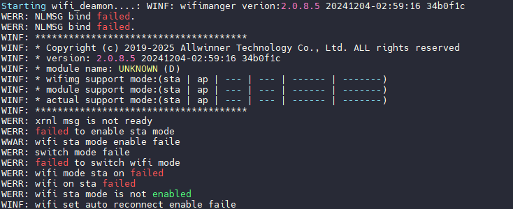

### 外置 Wi-Fi 相关 FAQ

#### 编译问题

**找不到wowlan变量**

（1）现象：

```
drivers/net/wireless/xr819/umac/main.c:870:17: error: 'struct wiphy' has no member named 'wowlan'

 if ((hw->wiphy->wowlan->flags || hw->wiphy->wowlan->n_patterns)
```

（2）原因：

```
wowlan成员变量受CONFIG_PM控制，没有打开导致的．休眠唤醒的依赖。
```

（3）解决方案：

```
在内核配置
     -Power management options  --->
             Device power management core functionality
```

**找不到 xxx.ko**

（1）现象：

```
sunxi_wlan_get_bus_index...xr819s.ko undefined!
```

（2）原因：

```
缺少配置misc。
```

（3）解决方案：

```
在内核配置
Device drivers-->
	Misc Devices Drivers  --->
		<*> Allwinner rfkill driver
		<*> Allwinner Network MAC Addess Manager
```

**mmc\_xxx undefined**

（1）现象：

```
drivers/built-in.o: In function scan_device_store':
drivers/misc/sunxi-rf/sunxi-wlan.c:309: undefined reference tosunxi_mmc_rescan_card'
drivers/misc/sunxi-rf/sunxi-wlan.c:309:(.text+0x5fc40): relocation truncated to fit:
     R_AARCH64_CALL26 against undefined symbol `sunxi_mmc_rescan_card'
```

（2）原因：

```
没有配置mmc。
```

（3）解决方案：

```
Device Drivers  --->
     SD/MMC Drivers  --->
         <*>   Allwinner sunxi SD/MMC Host Controller support
```

**缺少依赖库**

（1）现象：

```
Package kmod-net-xr819 is missing dependencies for the following libraries:
    cfg80211.ko
```

（2）原因：

```
依赖库需要编译进内核，不能以模块方式编译进去。
```

（3）解决方案：

```
在内核配置如下模块时，配置成 y
CONFIG_RFKILL=y
CONFIG_CFG80211=y
CONFIG_MMC=y
CONFIG_MAC80211=y
```

#### 驱动加载问题

**博通模组联网时提示：No such device.**

（1）现象：

```
root@TinaLinux:/# wifi_add_network_test ssid passwd 1
*********************************
***Start wifi connect ap test!***
*********************************
wpa_suppplicant not running!
Cannot create "/data/misc/wifi/entropy.bin": No such file or directory
Wi-Fi entropy file was not created
ifconfig: SIOCGIFFLAGS: No such device
event_label 0x0
wifi on failed!
wifi on failed event 0xf001
```

（2）原因：

```
firmware选择不匹配，导致驱动加载时下载失败．
- lsmod查看驱动已经正常加载
- dmesg 查看加载log发现：
[   22.336336] dhdsdio_download_code_file: Open firmware file failed /lib/firmware/fw_bcm43438a1.bin
[   22.346331] _dhdsdio_download_firmware: dongle image file download failed
表示firmware固件缺失（这里表示缺失fw_bcm43438a1.bin）
最后发现是在配置firmware时选择了ap6212,正常应该用ap6212a
```

（3）解决方案

```
tina配置正确的firmware
firmware  --->
     └─> <*> ap6212a-firmware............................... Broadcom AP6212A firmware
```

**XR819模组ifconfig显示：No such device**

（1）现象：

```
ifconfig: SIOCGIFFLAGS: No such device
```

（2）原因：

```
firmware选择不匹配。
- lsmod查看驱动已经正常加载。
- dmesg 查看加载log发现：

[  195.966066] [XRADIO_ERR] xradio_load_firmware: Wait for wakeup:device is not responding.
XR819s是40M晶振。
```

（3）解决方案

```
配置选择40M晶振的firmware
firmware  --->
     [*] xr819s with 40M sdd
```

**XR819s can't open /etc/wifi/xr\_wifi.conf, failed**

（1）现象：

```
lsmod驱动没有正常加载。
```

（2）原因：

```
- dmesg查看log：
[    6.802331] [XRADIO_ERR] can't open /etc/wifi/xr_wifi.conf, failed(-30)
[    6.802338] [XRADIO_ERR] Access_file failed, path:/etc/wifi/xr_wifi.conf!
[    6.914044] sunxi-mmc sdc1: no vqmmc,Check if there is regulator
[    7.028376] [XRADIO_ERR] xradio_load_firmware: Wait_for_wakeup: can't read control register.
busnum配置错误，原理图上使用的是sdc0.
```

（3）解决方案

```
board.dts中配置wlan时
busnum = 0;
```

#### 驱动加载问题总结

**配置问题**

```
1.内核驱动，Tina modules, Tina firmware三者必须正确对应同一个模组。
2.注意common下的modules.mk的编写。
3.Sdio的配置一定要根据原理图选择对应busnum。
可能导致：
1.扫卡失败。
2.下载firmware失败。
最终导致驱动加载失败。
```

**供电问题**

```
检查VCC_WIFI和VCC_IO_WIFI两路电。
不同模组对供电时序有一定要求，比如RTL8723ds需要两路电同时供电，针对有AXP的方案，一定要注意供电的配置，
特别是enable的时间。
１．硬件方面：主要排查两路电的供电方案，是否是同一路供电，若是分开供电，要考虑两路供电的时序，
例如DCDC1--->VCC_WIFI,LDOA--->VCC_IO_WIFI,那么DCDC1和LDOA的时序就得考虑。
２．软件方面主要是sysconfig.fex或者boart.dts的配置，分开供电的是否需要单独配置。
如：R818硬件设计是两路电分开供电。

可能导致：
1.扫卡失败。
2.下载firmware失败。
3.sdio_clk没有时钟。
4.32k竞争不起振。
最终导致驱动加载失败。
```

**SDIO问题**

```
1.sdio busnum配置错误．
2.驱动WL-REG-ON的方式不对．例如：
XR819模块出现
    [SBUS_ERR] sdio probe timeout!
    [XRADIO_ERR] sbus_sdio_init_failed
这个问题主要是sdio扫卡失败，跟sdio上电时序有关，可在drivers/net/wireless/xradio/wlan/platform.c中

xradio_wlan_power函数sunxi_wlan_set_power(on)后面加上一段延时。

RLT8723ds需要先高－低－高的方式．
可能导致：
1.扫卡失败。
2.下载firmware失败。
3.sdio_clk没有时钟。
4.32k晶振不起振。
5.WL-REG-ON无法正常被拉高。
最终导致驱动加载失败。
```

#### 起wlan0网卡问题

**RTL8723DS ifconfig wlan0 up: No such device**

（1）现象：

```
ifconfig: SIOCGIFFLAGS: No such device
```

（2）原因：

```
- lsmod查看驱动已经正常加载。
- dmesg查看log未发现异常。
- 排查sdio_clk, regon_on,32k,都正常。
- 两路供电都正常配置。
- 对比其他平台硬件发现，供电方式不一样，两路电采用了分开供电，咨询RTL需要同时上电。
```

（3）解决方案：

```
硬件更改，VCC_WIFI/VCC_IO_WIFI用同一路电供电。
```

**RTL8723DS 无法自启动wlan0**

（1）现象：

```
启动脚本/etc/init.d/wpa_supplicant中会自启动wlan0
但是每次启动启动都自启动失败，然后手动ifconfig wlan0 up正常。
```

（2）原因：

```
AP-WAKE_BT引脚被接了上拉电阻，进入测试模式了。
```

（3）解决方案：

```
硬件摘除上拉电阻。
```

**起wlan0网卡问题总结**

wlan0启动失败问题目前遇到的都是与硬件相关的，如果不能自加载一般采用ifconfig wlan0 up先手动加载看看打印提示。同时让硬件帮忙check一下供电和一些io的上下拉电阻。

#### wpa\_supplicant服务问题

**找不到wpa\_suplicant.conf文件**

（1）现象：

```
起supplicant失败
- ps发现没有supplicant进程．
- 于是手动执行wpa_supplicant -D nl80211 -i wlan0 -c /etc/wpa_supplicant.conf -B
提示：
Failed to open config file '/etc/wpa_supplicant.conf', error: No such file or directory
Failed to read or parse configuration '/etc/wpa_supplicant.conf'.
```

（2）原因：

```
路径错误。
```

（3）解决方案：

```
tina正常的路径一般在/etc/wifi/wpa_supplicant.conf
在wifimanage包下面配置正确的路径，保持和启动脚本一致．
```
