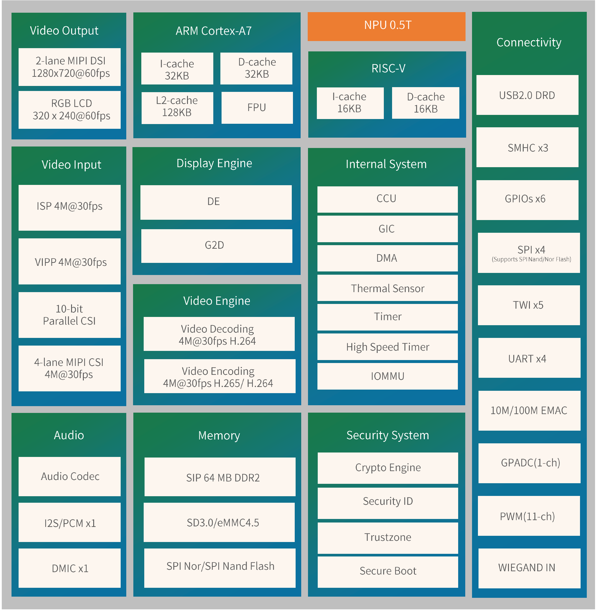
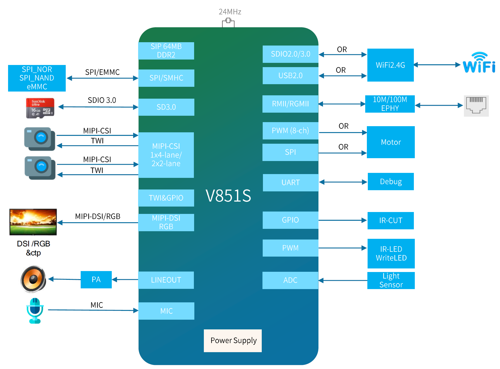

# 柚木PI蜥蜴硬件简述

- 此开发板的任何问题都可以在我们的社区讨论 https://forums.100ask.net/c/aw/v851s/70

## 硬件简述

柚木PI-蜥蜴开发板是嵌入式圈内YuzuKi大佬设计，百问网量产并提供配套硬件模块以及快速上手文档支持，柚木PI-蜥蜴基于全志V851s芯片，是一款专用于IPC网络摄像头方案设计的芯片。主要用于嵌入式Linux AI学习开发。

- SOC：单核ARM Cortex-A7@900Mhz 运行linux 单核RISC-V E907@600Mhz运行RTOS
- NPU: 最大算力0.5Tops支持 支持TensorFlow、Caffe、Tflite、和Onnx等多种深度学习框架
- DDR：内置SIP 64 MB DDR2
- Flash: 128MB SPI NandFlash 另外支持 最大容量128G TF卡
- Audio: 支持外接功放模块
- Display： 支持1*2-lane MIPI DSI输出，最大支持1280x720@60fps
- Camera: 支持2-lan MIPI CSI接口摄像头，最高视频采集分辨率 4M@30fps
- Wireless: 支持2.4GHz WIFI无线网络协议，以及标准蓝牙及低功耗蓝牙协议。
- Other: GPIO支持2路IIC，一路SPI，一路uart，三路PWM

V851S拥有全新一代高性能的ISP图像处理模块及视频编码器，具备较高的编码质量、较低的编码码率和行业主流水准的图像处理能力。同时，该芯片内部集成了64MBDDR2存储器，拥有完备的应用所需外设接口，包括USB，SDIO和Ethernet等，可适用于多种网络摄像机产品。

## 芯片架构

### 芯片架构框图

### 芯片应用框图

## 支持的扩展模块

### MIPI摄像头

- 支持GC2053 MIPI摄像头，现已上架

### MIPI显示屏

- 支持MIPI 双LANE 480x800分辨率显示屏，带电容触摸(暂未上架)。

### 其它扩展模块

- 扬声器
- 排针 I2C SPI GPIO等扩展模块

### 商品购买

- 国内： https://item.taobao.com/item.htm?&id=692970888824
- 国外： https://www.aliexpress.com/item/1005005034517794.html

## 使用指南