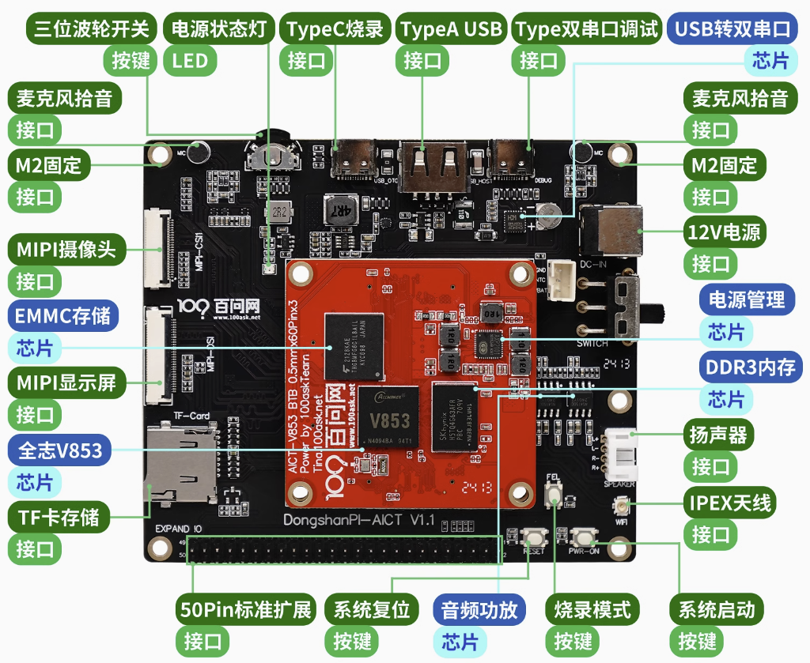
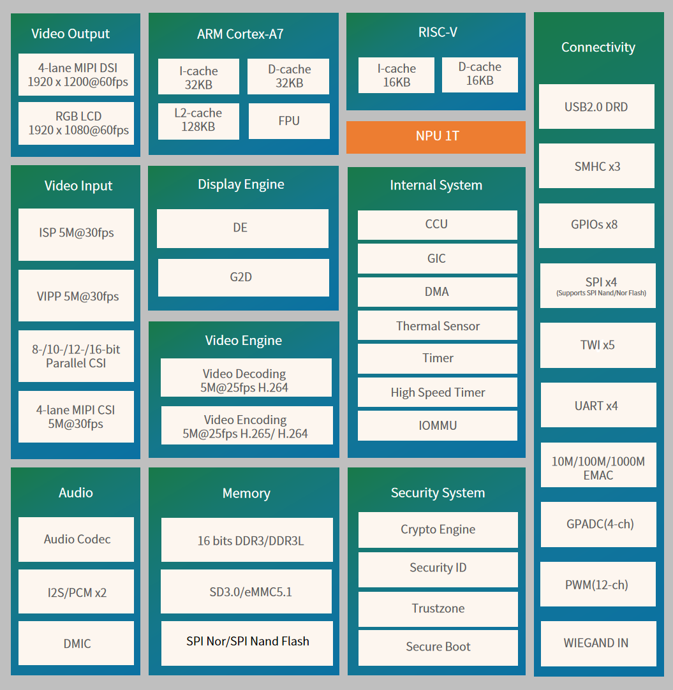

# DshanPI-AICT套件简述

DshanPI-AICT开发板是一款高性能嵌入式计算平台，搭载 全志 V853 处理器，结合 Arm Cortex-A7 + RISC-V E907 双核架构，集成 1T NPU 以支持高效 AI 计算，并采用全志自研 Smart 视频引擎 与高性能 ISP，提供卓越的图像处理能力。

- 512MB DDR3/DDR3L 内存 + 8GB eMMC，支持 TF 卡扩展，确保流畅运行和大容量存储。
- 视频能力强大，支持 5M@25fps H.265 编码 & H.264 编解码，配备 4-lane MIPI CSI/DSI 接口，实现高分辨率视频输入输出。
- 音频支持：提供 双路拾音器 和 扬声器接口，适用于音视频同步处理。
- 无线通信：板载 XR829 WiFi 模组，支持无线数据传输。
- 12V DC 供电，确保稳定的电源管理。

DshanPI-AICT开发板适用于 嵌入式视觉、AI 计算、智能监控、边缘计算等场景，提供高集成度和强大的视频处理能力，助力高效开发。

## V853芯片介绍

**CPU**

- Arm Cortex-A7@1GHz
  - 32 KB I-cache, 32 KB D-cache
  - 128 KB L2 cache
- RISC-V E907@600MHz
  - 16 KB I-cache, 16 KB D-cache

**NPU**

- Maximum performance up to 1 Tops
- Embedded 128KB internal buffer
- Supports deep learning frameworks: TensorFlow, Caffe, TFLite, PyTorch, ONNX NN, and more

**Memory**

- 16-bit DDR3/DDR3L SDRAM, supporting up to 1GB
- SD3.0/eMMC 5.1 interface
- Supports SPI Nor/SPI NAND Flash

**Video Engine**

- Video Encoder
  - H.264/H.265 up to 4K@15fps or 5M@25fps
  - JPEG up to 1080p@60fps
- Video Decoder
  - Supports H.264 BP/MP/HP, JPEG
  - Real-time multiple streams H.264 encoding capability: 5M@25fps
  - JPEG snapshot performance of 1080p@60fps independently

**Display Engine**

- Allwinner SmartColor post-processing for enhanced display quality
- Supports 2 video channels and 1 UI channel
- G2D hardware accelerator with rotation, mixing, and scaling functions

**Video Input**

- ISP

  - Maximum performance of 5M@30fps, maximum resolution of 3072×1772
  - Adjustable 3A functions (AE, AWB, AF) with customizable parameters
  - Provides ISP tuning tools for PC

- VIPP

  - Four VIPP YUV422 or YUV420 outputs
  - Maximum performance of 5M@30fps, maximum resolution of 3072×1772

- Parallel CSI Interface

   (8-/10-/12-/16-bit)

  - Supports digital camera (DC), BT.601, BT.656, BT.1120 protocols
  - Maximum video capture resolution up to 5M@30fps

- 4-lane MIPI CSI Interface

  - Supports DOL WDR mode and 2×2-lane MIPI CSI splitting
  - Supports 4-channel VC de-interleaving
  - Maximum video capture resolution up to 5M@30fps

**Video Output**

- RGB LCD output up to 1920×1080@60fps
- 4-lane MIPI DSI output up to 1920×1080@60fps

**Audio**

- 1 DAC and 2 ADCs
- **Analog audio interfaces:** MICIN1P/N, MICIN2P/N, LINEOUTRP/N
- **Digital audio interfaces:** I2S/PCM ×2, DMIC

**Security System**

- AES, DES, 3DES encryption and decryption
- RSA/ECC signature verification
- MD5/SHA and HMAC tamper-proofing
- PRNG/TRRNG hardware random number generator
- Integrated 2Kbits OTP storage space

**Connectivity**

- USB 2.0 DRD, SDIO 3.0, SPI ×4, UART ×4, TWI ×5, WIEGAND
- PWM (12-ch), GPADC (4-ch)
- 10/100/1000M EMAC with RMII and RGMII interfaces

**Package**

- LFBGA 318, 12mm × 12mm, 0.5mm ball pitch

**Chip Process**

- 22nm

## 芯片框图

## 配套模块

MIPI显示屏

- 4寸MIPI显示屏（480*800分辨率）：[https://item.taobao.com/item.htm?id=706864521673](https://item.taobao.com/item.htm?id=706864521673)

GC2053摄像头

- MIPI摄像头（1080p分辨率）：[https://item.taobao.com/item.htm?id=706864521673](https://item.taobao.com/item.htm?id=706864521673)

开发板套件购买

- V853-AICT开发套件：[https://item.taobao.com/item.htm?id=706864521673](https://item.taobao.com/item.htm?id=706864521673)

## 进阶课程

​	《AI MPP音视频多媒体课程》系统地涵盖了嵌入式多媒体开发的核心知识，包含 嵌入式Linux开发环境搭建、全志MPP多媒体平台、图像与视频处理、音视频编解码、流媒体传输 以及 机器学习基础。你将学习 OpenCV、FFmpeg、GStreamer、Live555 等工具的使用，掌握 视频采集、编码、解码、渲染、RTSP推流、音视频同步 等关键技术，并深入理解 视频格式、颜色空间、图像处理算法、音频编码及文件封装，为高效开发嵌入式多媒体应用奠定扎实基础。

- 课程购买链接：[https://item.taobao.com/item.htm?id=706864521673](https://item.taobao.com/item.htm?id=706864521673)
