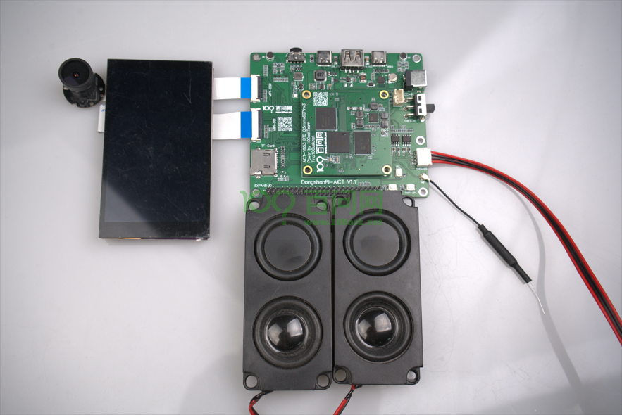

# 开发板快速启动

## 硬件要求

### 盒子里包括的内容

当您购买了一套全新的V853-AICT音视频开发套件时，包装盒内会有：

1. DongshanPI-AICT开发板
2. MIPI摄像头
3. 4寸MIPI显示屏
4. 两根Type-C数据线
5. 一个电源适配器
6. 一根2.4GHz天线
7. 一个喇叭

### 盒子中不包含的内容

您还需要额外的：

1. microSD卡(建议最低8GB）

> 注意：使用时还需要一台正常工作且能连接互联网的PC电脑。

## 1.连接天线

要使用WIFI，您需要连接V853-AICT音视频开发套件中提供的2.4GHz天线，下面是将天线连接到DongshanPI-AICT开发板的指南。

## 2.连接摄像头

要使用摄像头获取图像数据，如果您只单独购买了DongshanPI-AICT开发板，可能还需另外购买MIPI摄像头。下面图片是将MIPI摄像头连接到DongshanPI-AICT开发板的指南。

## 3.连接显示屏

要使用显示屏显示摄像头获取的图像，如果您只单独购买了DongshanPI-AICT开发板，可能还需另外购买MIPI显示屏。下面是将MIPI显示屏连接到DongshanPI-AICT开发板的指南。

## 4.连接喇叭

要使用播放声音需要连接喇叭，如果您只单独购买了DongshanPI-AICT开发板，可能还需另外购买喇叭。下面是将喇叭连接到DongshanPI-AICT开发板的指南。

## 5.开发板连接电脑

通过Type-C线将板连接到PC电脑，您可以使用V853-AICT音视频开发套件中的两条Type-C线。连接指南如下所示：

## 6.开发板连接电源

通过电源线将板连接到PC电脑，您可以使用V853-AICT音视频开发套件中的一条电源线。连接指南如下所示：

## 7.打开串口软件登录开发板

通过前面步骤已经将串口连接到您的电脑中，要查看主板的启动日志并访问DongshanPI-AICT的终端控制台，您可以通过设备管理器确定串口端口号，并使用[MobaXterm](https://mobaxterm.mobatek.net/)串口软件访问该端口号。下面是使用串口访问开发板调试控制台的指南。

1.打开**设备管理器**，并展开端口(COM和LPT)列表。

2.请注意USB串行端号的数字，如下图所示，我连接后大核的端口号为COM10。

3.使用MobaXterm串口软件访问设备管理器中的端口号。

4.进入串口调试控制台后，如果开发板正在启动uboot或者kernel则会不断打印输出信息直到系统完全启动，如果开发板已经完全启动则不会打印信息，可直接按下回车键，进入开发板系统控制台。

