# 更新系统

硬件要求：

- DongshanPI-AICT开发板
- Type-C数据线 x2
- 电源线 x1

> 注意：使用时还需要一台正常工作且能连接互联网的PC电脑。

软件要求：

- 全志USB烧录驱动包：[AllwinnerUSBFlashDeviceDriver](https://gitlab.com/dongshanpi/tools/-/raw/main/AllwinnerUSBFlashDeviceDriver.zip)

- 全志固件烧写工具：[AllwinnertechPhoeniSuit](https://gitlab.com/dongshanpi/tools/-/raw/main/AllwinnertechPhoeniSuit.zip)

  在连接开发板后需要注意，虚拟机可能会拦截串口或者USB，选择连接到主机即可。

## 1. 安装全志USB驱动

如果是第一次使用，需要安装全志USB驱动，如果已经安装过全志USB驱动即可跳转到**小节2**继续进行烧写系统。

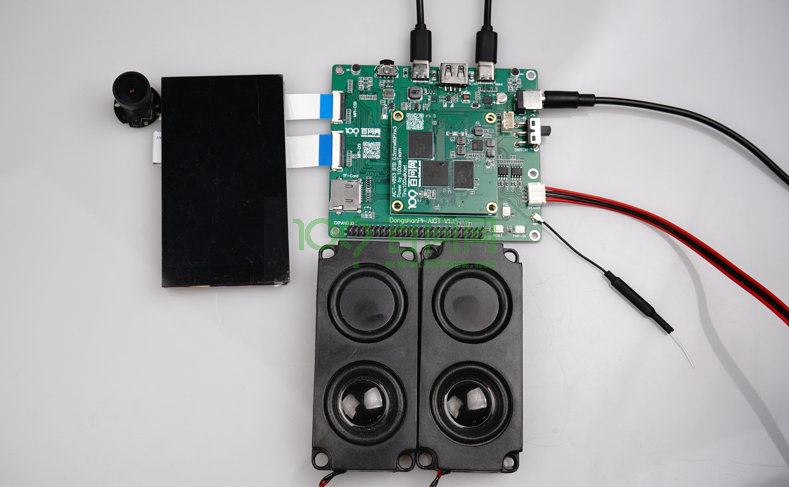

连接好12V电源，并将两条Type-C分别连接到开发板和电脑端以后，将开关拨向靠近12V电源的方向即可将开发板上电。按住开发板的REL键进，之后按一下RESET键可以自动进入烧写模式。

这时我们可以看到电脑设备管理器 **通用串行总线控制器** 部分弹出一个 未知设备 ，这个时候我们就需要把我们提前下载好的 **全志USB烧录驱动** 进行修改，然后将解压缩过的 **全志USB烧录驱动** 压缩包，解压缩，可以看到里面有这么几个文件。

```
InstallUSBDrv.exe 
drvinstaller_IA64.exe 
drvinstaller_X86.exe 
UsbDriver/ 
drvinstaller_X64.exe 
install.bat
```

对于wind7系统的同学，只需要以管理员 打开 `install.bat` 脚本，等待安装，在弹出的 是否安装驱动的对话框里面，点击安装即可。

对于wind10/wind11系统的同学，需要在设备管理器里面进行手动安装驱动。

如下图所示，在第一次插入OTG设备，进入烧写模式设备管理器会弹出一个未知设备。

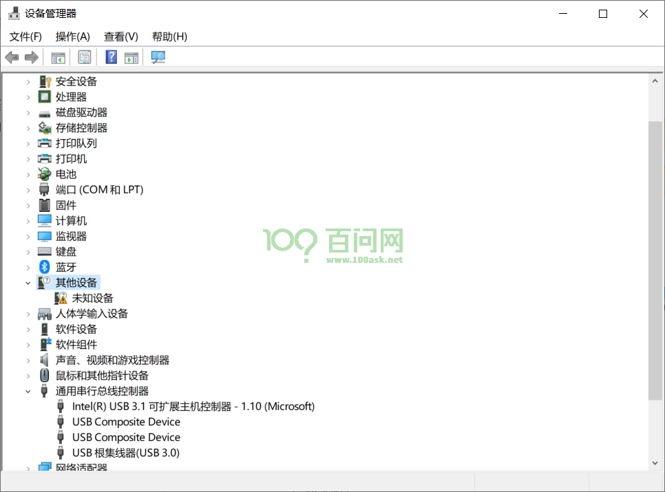 

接下来鼠标右键点击这个未知设备，在弹出的对话框里， 点击浏览我计算机以查找驱动程序软件。

[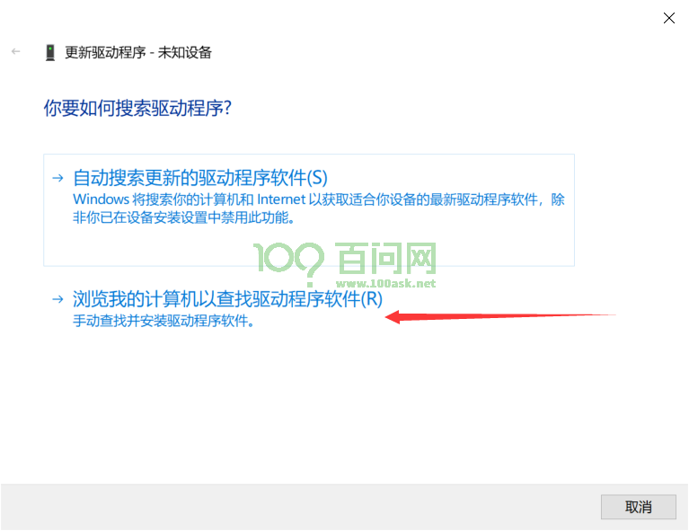

之后在弹出新的对话框里，点击浏览找到我们之前下载好的 usb烧录驱动文件夹内，找到 `UsbDriver/` 这个目录，并进入，之后点击确定即可。

[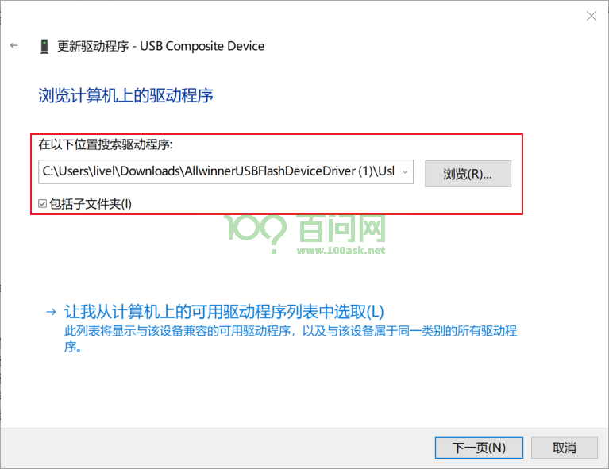

注意进入到 `UsbDriver/` 文件夹，然后点击确定，如下图所示。

[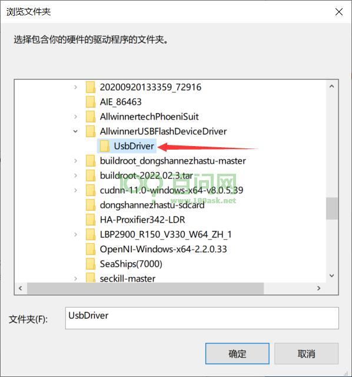

此时，我们继续点击 **下一页** 按钮，这时系统就会提示安装一个驱动程序。

在弹出的对话框里，我们点击 始终安装此驱动程序软件 等待安装完成。

[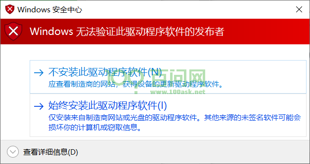]

安装完成后，会提示，Windows已成功更新你的驱动程序。

[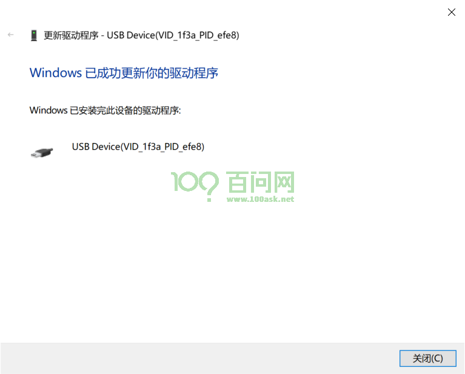 

最后我们可以看到，设备管理器 里面的未知设备 变成了一个 `USB Device(VID_1f3a_efe8)`的设备，这时就表明设备驱动已经安装成功。

[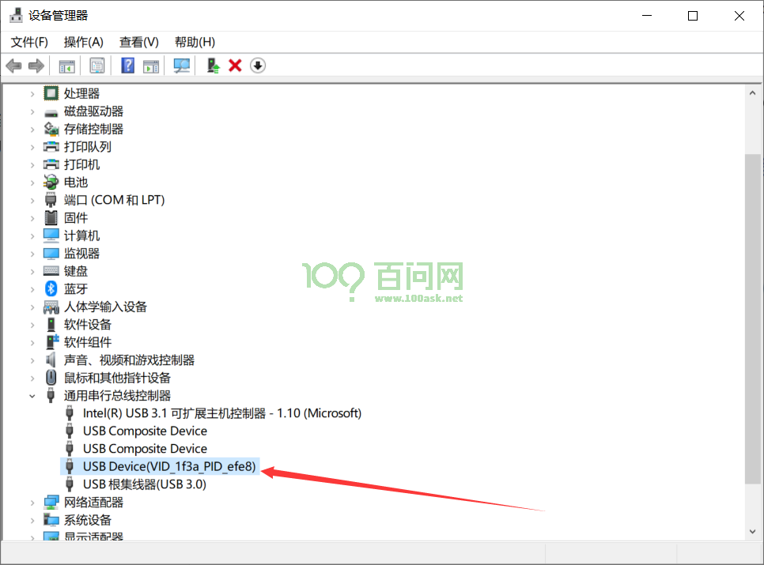]

安装完成USB驱动后后续即可正常使用烧录功能。

## 2.烧写系统

全志线刷工具：[AllwinnertechPhoeniSuit 23](https://gitlab.com/dongshanpi/tools/-/raw/main/AllwinnertechPhoeniSuit.zip)


在我们连接好开发板的12V电源线，并将两条Type-C分别连接到开发板和电脑端以后，打开PhoenixSuit烧写工具，

打开软件后 软件主界面如下图所示

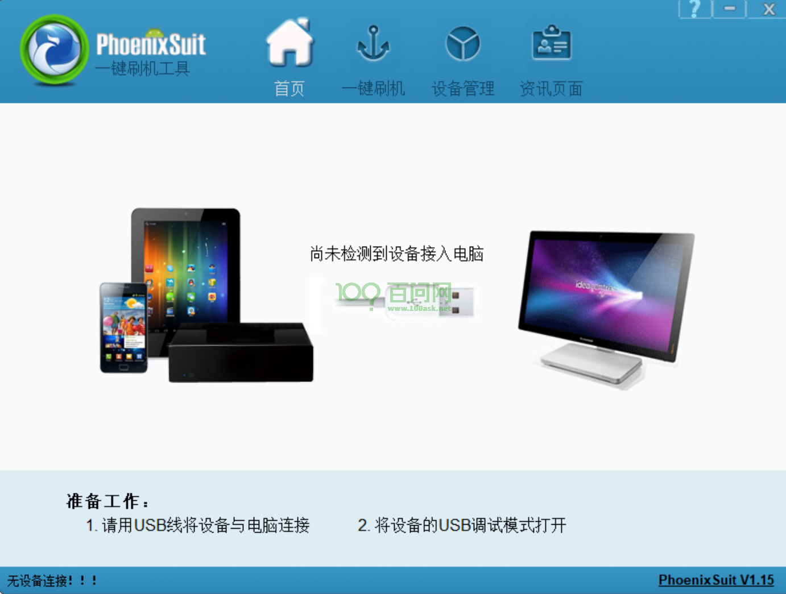

接下来 我们需要切换到 **一键刷机**窗口。如下图所示，点击红框标号1，在弹出的新窗口内，我们点击 红框2 **浏览** 找到我们刚刚编译出来的 V853系统镜像v853_linux_100ask_uart0.img，选中镜像后，点击红框3 **全盘擦除升级** 。


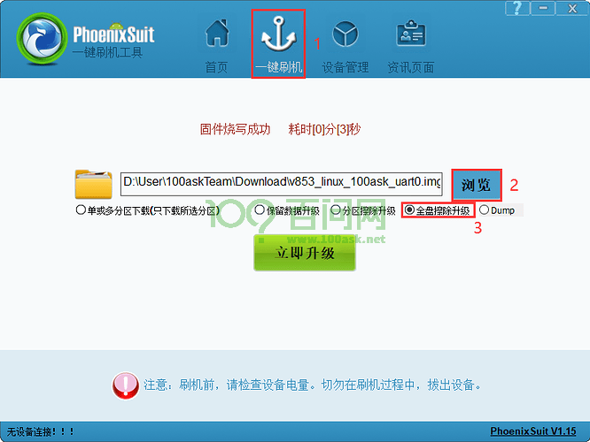


这时 我们拿起已经连接好的开发板，先按住 **FEL** 烧写模式按键，之后按一下 **RESET** 系统复位键，就可以自动进入烧写模式并开始烧写。

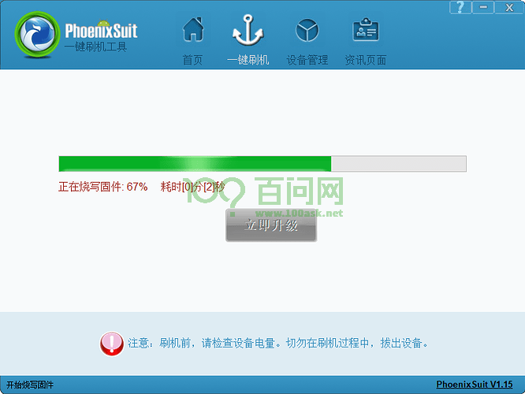


烧写时会提示烧写进度条，烧写完成后，会在红框处提示固件烧写成功。


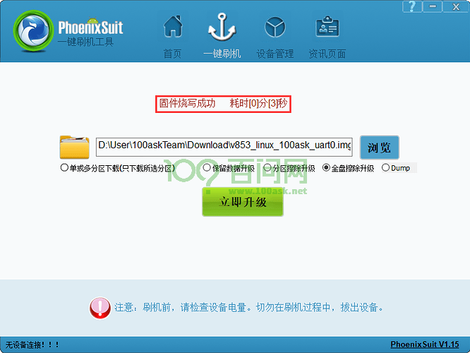

## 3.进入Tina系统

烧写完成，我们可以使用串口工具MobaXterm进入串口查看，具体可以参考《快速启动》章节。