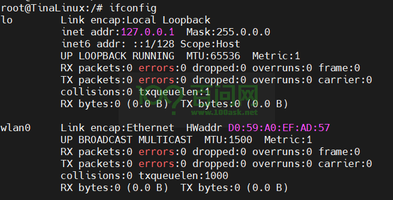
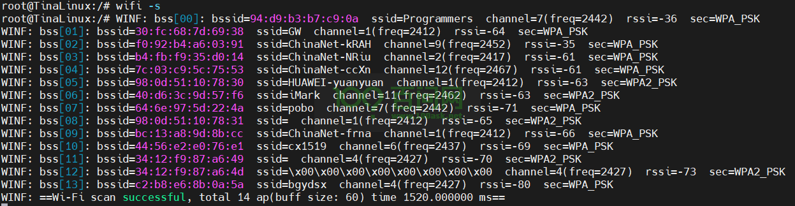
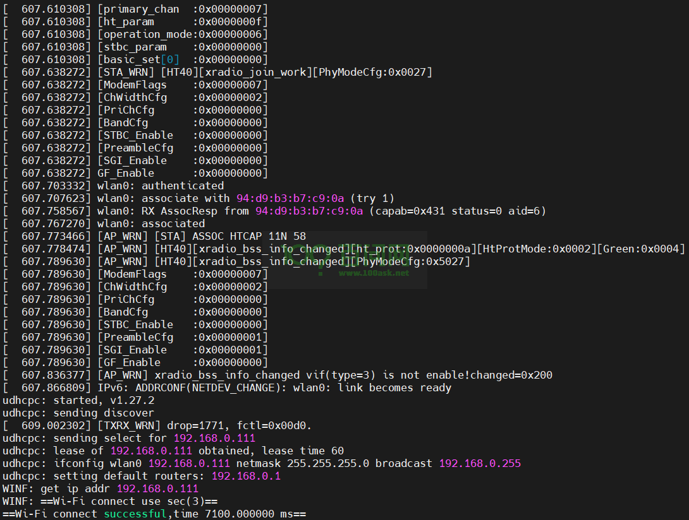
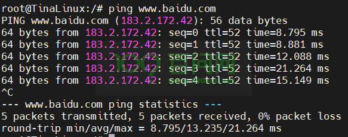

# 开发板配网

硬件要求：

- DongshanPI-AICT开发板
- 天线 x1
- Type-C数据线 x2
- 电源线 x1

## 1.连接互联网

### 1.1 检查WiFi节点

在开发板的串口终端输入`ifconfig`，查看WiFi节点是否正常。



可以看到wlan0节点已经出来了，也就意味着我们可以使用该节点连接WIFI并上网。

### 1.2 扫描附件可用WiFi

扫描开发板附件所有可用的WiFi，输入`wifi -s`。



> 注意：
>
> ​	1.请提前为开发板安装天线，否则将无法扫描到WiFi 。
>
> ​	2.开发板只能连接2.4GHz的WiFi，如果是5GHz的WiFi可能会出现扫描不到的情况。


### 1.3 连接WiFi

连接开发板附件可正常扫描到的WiFi，输入`wifi -c [WiFi名称] [密码]`。

假设这里我需要连接的WiFi名称为`Programmers`，密码为`12345678`，我们可以在开发板端输入：

```
wifi -c Programmers 12345678
```

输入完成后，开发板自动连接互联网并获取IP地址。



### 1.4 测试联网功能

测试WiFi是否可以访问互联网，输入`ping www.baidu.com`，输入后如下所示：



> 注意：输入Crtl+C可结束测试。

在后续重新启动开发板，都会自动连接到WiFi并获取IP地址，可直接上网。