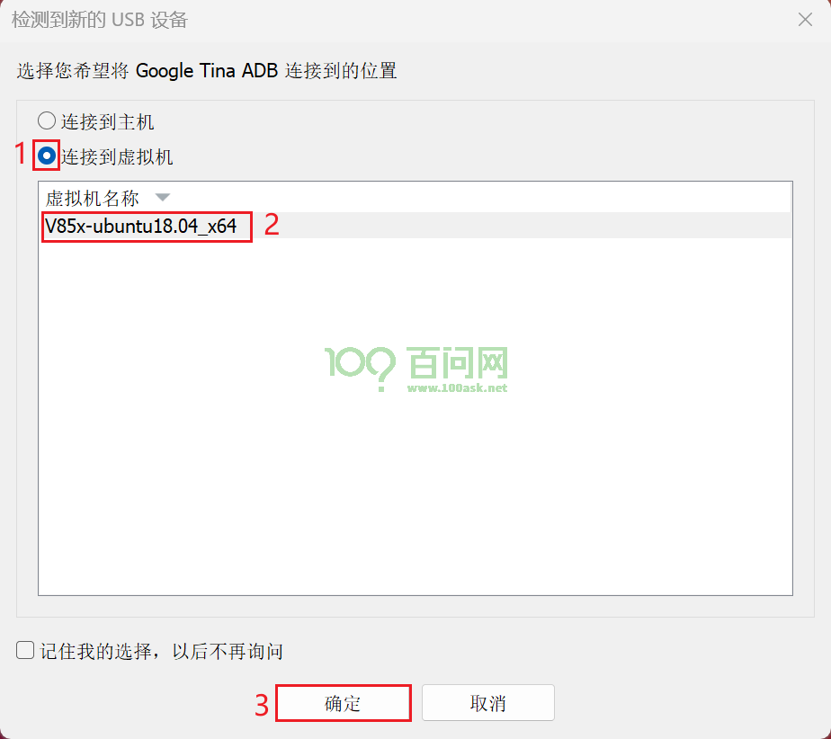
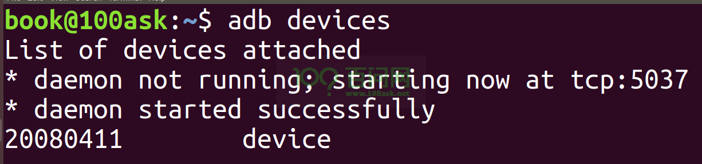

# 使用ADB进行文件传输

**硬件要求：**

- DongshanPI-AICT开发板
- Type-C数据线 x2
- 电源线 x1

> 注意：使用时还需要一台正常工作且能连接互联网的PC电脑。

**软件要求：**

- MobaXterm终端工具：https://mobaxterm.mobatek.net/


开始前请确认以下两点：

- 开发板的OTG USB直接连接到电脑端。
- 开发板已经处于启动完成后，串口终端可操作开发板。


## 1.查看ADB设备

在电脑端打开Windows中的命令行提示符，输入`adb devices`

```
C:\Users\100ASK>adb devices
List of devices attached
20080411        device
```

可以看到，如果电脑端检测到adb设备，会在命令执行完成后列出已连接的设备列表。

> 注意：如果您开启了虚拟机，可能会被虚拟机拦截导致无法扫描到。


## 2.Windows与开发板传输文件

### 2.1 传输Windows中的文件至开发板

在电脑端打开Windows中的命令行提示符，进入需要传输的文件路径，假设我需要进入下载目录中传输`test.jpg`，可以执行

```
cd C:\Users\100ASK-R\Downloads
```

使用`adb push`命令传输对应的文件到指定目录`/mnt/UDISK`，例如：

```
adb push test.jpg /mnt/UDISK
```

传输完成后会统计传输文件，文件大小以及时间等，例如：

```
C:\Users\100ASK>cd C:\Users\100ASK\Downloads

C:\Users\100ASK\Downloads>adb push test.jpg /mnt/UDISK
test.jpg: 1 file pushed. 4.9 MB/s (38526 bytes in 0.008s)
```


### 2.2 传输开发板的文件至Windows

在电脑端打开Windows中的命令行提示符，假设我需要从`/mnt/UDISK`文件拉去文件到Windows下，输入

```
adb pull /mnt/UDISK/test.jpg
```

输入完成后，会拉取/mnt/UDISK/目录下的test.jpg到当前路径下，拉取文件成功如下所示。

```
C:\Users\100ASK-R\Downloads>adb pull /mnt/UDISK/test.jpg
/mnt/UDISK/test.jpg: 1 file pulled. 6.1 MB/s (38526 bytes in 0.006s)
```


## 3.Ubuntu与开发板传输文件

### 3.1 传输Ubuntu中的文件至开发板

> 开始前请注意：如果您启动了虚拟机并连接了开发板的串口和OTG口，会出现被虚拟机软件拦截的情况。



将ADB设备连接到虚拟机，并选择将其连接到Ubuntu虚拟机中，连接之后可以打开Ubuntu的终端界面，输入：

```
adb devices
```



输入后可以扫描到adb设备列表即表示Ubuntu可正常使用adb设备。


假设我需要传输当前目录中`test.txt`，使用`adb push`命令传输对应的文件到指定目录`/mnt/UDISK`，例如：

```
adb push test.txt /mnt/UDISK
```

传输成功后如下所示：

```
book@100ask:~$ adb push test.txt /mnt/UDISK
test.txt: 1 file pushed. 0.1 MB/s (601 bytes in 0.010s)
```

### 3.2 传输开发板的文件至Ubuntu

假设我需要从`/mnt/UDISK`文件拉取test.txt文件到Ubuntu下，输入

```
adb pull /mnt/UDISK/test.txt
```

输入完成后，会拉取/mnt/UDISK/目录下的test.txt到当前路径下，拉取文件成功如下所示。

```
book@100ask:~$ adb pull /mnt/UDISK/test.txt
/mnt/UDISK/test.txt: 1 file pulled. 0.1 MB/s (601 bytes in 0.011s)
```

