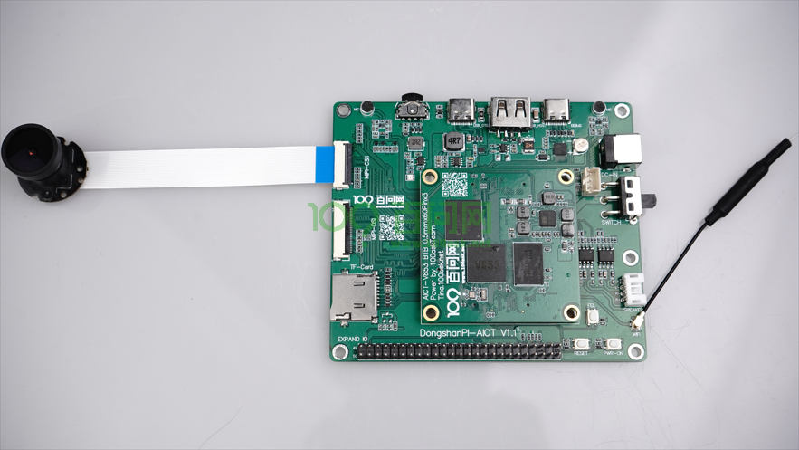
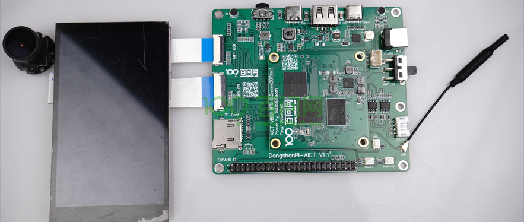
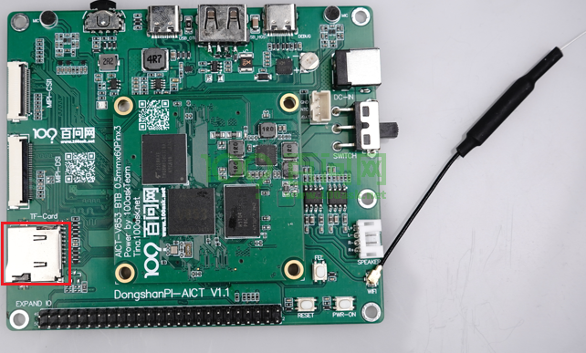
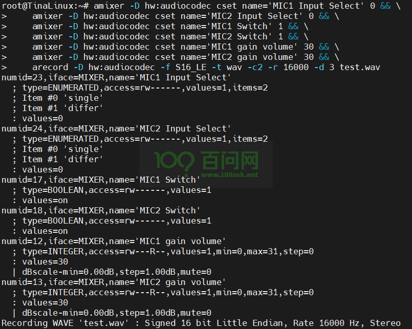
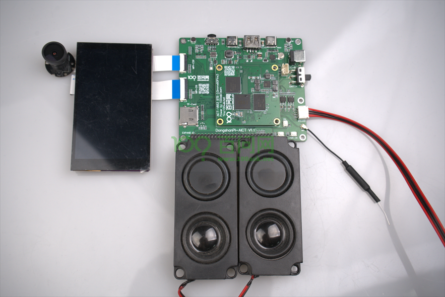
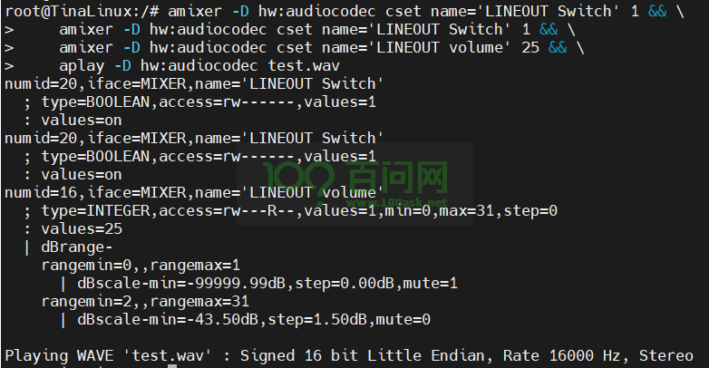

# 开发板功能测试

硬件要求：

- DongshanPI-AICT开发板
- Type-C数据线 x2
- 电源线 x1
- MIPI摄像头
- MIPI显示屏
- 喇叭

> 注意：使用时还需要一台正常工作且能连接互联网的PC电脑。


在开始前请注意：所有需要排线连接的设备都需要在开发板上电前连接！！！

## 1.MIPI摄像头功能测试

将V853-AICT音视频开发套件的MIPI摄像头连接至开发板的MIPI摄像头接口。如下图所示：



连接成功，启动开发板，打开串口终端，输入命令：`camerademo`，输入完成后如下所示：

```
root@TinaLinux:/# camerademo
[CAMERA]**********************************************************
[CAMERA]*                                                        *
[CAMERA]*              this is camera test.                      *
[CAMERA]*                                                        *
[CAMERA]**********************************************************
[CAMERA]**********************************************************
[CAMERA][   19.420401] [VIN_ERR]vin is not support this pixelformat
 open /dev/video0!
[CAMERA]****[   19.428495] [VIN_ERR]vin is not support this pixelformat
********************************[   19.437252] [VIN_ERR]vin is not support this pixelformat
**********************
[CAMERA][   19.445969] [VIN_ERR]vin is not support this pixelformat
********************************[   19.454847] [VIN_ERR]vin is not support this pixelformat
**************************
[CAM[   19.463477] [VIN_ERR]vin is not support this pixelformat
ERA] The path to data saving is [   19.472266] [VIN_ERR]vin is not support this pixelformat
/tmp.
[CAMERA] The number of ca[   19.480959] [VIN_ERR]vin is not support this pixelformat
ptured photos is 5.
[CAMERA] sa[   19.489748] [VIN_ERR]vin is not support this pixelformat
ve bmp format
[   19.498446] [VIN_ERR]vin is not support this pixelformat
[   19.505712] [VIN_ERR]vin is not support this pixelformat
[   19.511852] [VIN_ERR]vin is not support this pixelformat
[CAMERA]**********************************************************
[CAMERA] Using format parameters NV21.
[CAMERA] camera pixelformat: NV21
[CAMERA] Resolution size : 640 * 480
[CAMERA] The photo save path is /tmp.
[CAMERA] The number of photos taken is 5.
begin ion_alloc_open
pid: 1167, g_alloc_context = 0xb6ee9f70
[CAMERA] Camera capture framerate is 20/1
[CAMERA] VIDIOC_S_FMT succeed
[CAMERA] fmt.type = 9
[CAMERA] fmt.fmt.pix_mp.width = 640
[CAMERA] fmt.fmt.pix_mp.height = 480
[CAMERA] fmt.fmt.pix_mp.pixelformat = NV21
[CAMERA] fmt.fmt.pix_mp.field = 1
[CAMERA] stream on succeed
[CAMERA] camera0 capture num is [0]
[CAMERA_PROMPT] the time interval from the start to the first frame is 55 ms
[CAMERA] camera0 capture num is [1]
[CAMERA] camera0 capture num is [2]
[CAMERA] camera0 capture num is [3]
[CAMERA] camera0 capture num is [4]
[CAMERA] Capture thread finish[   19.694871] [VIN_ERR]scaler0 channel ID nember is lost!!!

[   19.702113] [VIN_ERR]scaler0 channel ID nember is lost!!!
[   19.709459] [VIN_ERR]scaler0 channel ID nember is lost!!!
[CAMERA] close /dev/video0
ion_alloc_close
pid: 1167, release g_alloc_context = 0xb6ee9f70
```

执行完成后会使用摄像头进行拍照，连续拍摄5张照片，拍摄完成会将照片保存在`/tmp`目录下，如下所示：

```
root@TinaLinux:/# ls /tmp/
UNIX_WIFI.domain  bmp_NV21_3.bmp    lib               wpa_ctrl_1115-1
bmp_NV21_1.bmp    bmp_NV21_4.bmp    lock              wpa_ctrl_1115-2
bmp_NV21_2.bmp    bmp_NV21_5.bmp    run
```

可以使用adb命令将其拷贝到Ubuntu/Windows下查看。

```
注意：camerademo程序执行拍摄的照片没有经过ISP处理，照片会整体显示绿色，属于正常现象！！！
```

## 2.MIPI显示屏功能测试

将V853-AICT音视频开发套件的MIPI显示屏连接至开发板的MIPI显示屏接口。如下图所示：



连接成功，启动开发板，打开串口终端，输入命令：`lv_examples 0`，输入完成后如下所示：

```
root@TinaLinux:/# lv_examples 0
wh=480x800, vwh=480x1600, bpp=32, rotated=0
Turn on double buffering.

```

此时开发板会显示lvgl的demo程序，开发板默认已经支持触摸功能，你可以点击显示屏中LVGL的控件测试触摸功能。


## 3.开发板USB功能测试

在开始USB功能验证前，须知：

​	开发板USB的功能有两种，分别是device和host。两者功能同时只能使用一种，将USB切换为host功能时，device功能就会失效，反之USB切换为device功能时，host功能也会失效。

> 开发板默认为device模式，可以正常使用ADB功能。如果切换为Host功能，将无法使用ADB功能，可连接U盘或者USB摄像头等设备。

### 3.1 切换开发板USB为host模式

​	进入开发板终端后，输入以下命令：

```
echo 256 > /sys/class/gpio/export
echo out > /sys/class/gpio/gpio256/direction
echo 1 > /sys/class/gpio/gpio256/value
cat /sys/devices/platform/soc/usbc0/usb_host
```

切换完成后，如下所示：

```
root@TinaLinux:/# echo 256 > /sys/class/gpio/export
root@TinaLinux:/# echo out > /sys/class/gpio/gpio256/direction
root@TinaLinux:/# echo 1 > /sys/class/gpio/gpio256/value
root@TinaLinux:/# cat /sys/devices/platform/soc/usbc0/usb_host
[ 1287.600442]
[ 1287.600442] rmmod_device_driver
[ 1287.600442]
[ 1287.607487] android_work: sent uevent USB_STATE=DISCONNECTED
[ 1287.614044]
[ 1287.614044] insmod_host_driver
[ 1287.614044]
[ 1287.614049] [ehci0-controller]: sunxi_usb_enable_ehci
[ 1287.614056] [sunxi-ehci0]: probe, pdev->name: 4101000.ehci0-controller, sunxi_ehci: 0xc0a699e8, 0x:e084b000, irq_no:137
[ 1287.614541] sunxi-ehci 4101000.ehci0-controller: SW USB2.0 'Enhanced' Host Controller (EHCI) Driver
[ 1287.614583] sunxi-ehci 4101000.ehci0-controller: new USB bus registered, assigned bus number 1
[ 1287.614740] sunxi-ehci 4101000.ehci0-controller: irq 311, io mem 0xdf21f330
[ 1287.649795] sunxi-ehci 4101000.ehci0-controller: USB 0.0 started, EHCI 1.00
[ 1287.650877] hub 1-0:1.0: USB hub found
[ 1287.650920] hub 1-0:1.0: 1 port detected
[ 1287.651337] [ohci0-controller]: sunxi_usb_enable_ohci
[ 1287.651343] [sunxi-ohci0]: probe, pdev->name: 4101000.ohci0-controller, sunxi_ohci: 0xc0a69c0c
[ 1287.651836] sunxi-ohci 4101000.ohci0-controller: SW USB2.0 'Open' Host Controller (OHCI) Driver
[ 1287.651877] sunxi-ohci 4101000.ohci0-controller: new USB bus registered, assigned bus number 2
[ 1287.651935] sunxi-ohci 4101000.ohci0-controller: irq 312, io mem 0xdf45fe58
host_chose finished![ 1287.733908] hub 2-0:1.0: USB hub found

root@TinaLinux:/# [ 1287.733944] hub 2-0:1.0: 1 port detected
```

可以看到开发板找到USB hub，接下来我们可以将USB设备，如U盘，USB2.0的摄像头等设备插入开发板的USB口中，下面演示两种设备的识别结果：

U盘设备：

```
root@TinaLinux:/# [ 1422.836108] sunxi-ehci 4101000.ehci0-controller: ehci_irq: highspeed device connect
[ 1423.100423] usb 1-1: new high-speed USB device number 3 using sunxi-ehci
[ 1423.304988] usb-storage 1-1:1.0: USB Mass Storage device detected
[ 1423.312233] scsi host0: usb-storage 1-1:1.0
[ 1424.322524] scsi 0:0:0:0: Direct-Access     Generic- SD/MMC           1.00 PQ: 0 ANSI: 4
[ 1425.370632] sd 0:0:0:0: [sda] 62333952 512-byte logical blocks: (31.9 GB/29.7 GiB)
[ 1425.380116] sd 0:0:0:0: [sda] Write Protect is off
[ 1425.385601] sd 0:0:0:0: [sda] Mode Sense: 2f 00 00 00
[ 1425.392247] sd 0:0:0:0: [sda] Write cache: disabled, read cache: enabled, doesn't support DPO or FUA
[ 1425.412925]  sda: sda1 sda2 sda3 sda4 sda5 sda6
[ 1425.422363] sd 0:0:0:0: [sda] Attached SCSI removable disk
```

USB2.0摄像头：

```
root@TinaLinux:/# [ 1474.170089] sunxi-ehci 4101000.ehci0-controller: ehci_irq: highspeed device connect
[ 1474.430361] usb 1-1: new high-speed USB device number 10 using sunxi-ehci
[ 1474.697300] uvcvideo: Found UVC 1.00 device USB 2.0 Camera (038f:0541)
[ 1474.708162] uvcvideo 1-1:1.0: Entity type for entity Processing 2 was not initialized!
[ 1474.717236] uvcvideo 1-1:1.0: Entity type for entity Extension 6 was not initialized!
[ 1474.726162] uvcvideo 1-1:1.0: Entity type for entity Camera 1 was not initialized!
[ 1474.735218] input: USB 2.0 Camera as /devices/platform/soc/4101000.ehci0-controller/usb1/1-1/1-1:1.0/input/input7

root@TinaLinux:/# ls /dev/video0
/dev/video0
```


### 3.2 切换开发板USB为device模式

​	进入开发板终端后，输入以下命令：

```
echo 256 > /sys/class/gpio/export
echo out > /sys/class/gpio/gpio256/direction
echo 0 > /sys/class/gpio/gpio256/value
cat /sys/devices/platform/soc/usbc0/usb_device
```

如果您已经执行过前面两个命令，可只执行下面两行：

```
echo 0 > /sys/class/gpio/gpio256/value
cat /sys/devices/platform/soc/usbc0/usb_device
```

切换完成后，如下所示：

```
root@TinaLinux:/# echo 0 > /sys/class/gpio/gpio256/value
root@TinaLinux:/# cat /sys/devices/platform/soc/usbc0/usb_device
[ 2241.373862]
[ 2241.373862] rmmod_host_driver
[ 2241.373862]
[ 2241.380687] [ehci0-controller]: sunxi_usb_disable_ehci
[ 2241.386475] [sunxi-ehci0]: remove, pdev->name: 4101000.ehci0-controller, sunxi_ehci: 0xc0a699e8
[ 2241.396344] sunxi-ehci 4101000.ehci0-controller: remove, state 4
[ 2241.403154] usb usb1: USB disconnect, device number 1
[ 2241.409566] sunxi-ehci 4101000.ehci0-controller: USB bus 1 deregistered
[ 2241.417154] [ohci0-controller]: sunxi_usb_disable_ohci
[ 2241.423069] [sunxi-ohci0]: remove, pdev->name: 4101000.ohci0-controller, sunxi_ohci: 0xc0a69c0c
[ 2241.432864] sunxi-ohci 4101000.ohci0-controller: remove, state 4
[ 2241.439685] usb usb2: USB disconnect, device number 1
[ 2241.446133] sunxi-ohci 4101000.ohci0-controller: USB bus 2 deregistered
[ 2241.453796]
[ 2241.453796] insmod_device_driver
[ 2241.453796]
device_chose finished!
root@TinaLinux:/# [ 2241.702015] android_work: sent uevent USB_STATE=CONNECTED
[ 2241.745670] configfs-gadget gadget: high-speed config #1: c
[ 2241.752086] android_work: sent uevent USB_STATE=CONFIGURED
```

切换成功后，可以看到开发板会在自动启动ADB功能，并且可以在电脑端看到ADB设备。


## 4.SD卡功能测试

将SD卡插入开发板的SD卡槽中，如下图所示：



插入后，开发板的串口终端会提示以下信息：

```
[   50.499002] sunxi-mmc sdc0: sdc set ios:clk 0Hz bm PP pm UP vdd 22 width 1 timing LEGACY(SDR12) dt B
[   50.759073] sunxi-mmc sdc0: no vqmmc,Check if there is regulator
[   50.788998] sunxi-mmc sdc0: sdc set ios:clk 400000Hz bm PP pm ON vdd 22 width 1 timing LEGACY(SDR12) dt B
[   50.829061] sunxi-mmc sdc0: sdc set ios:clk 400000Hz bm PP pm ON vdd 22 width 1 timing LEGACY(SDR12) dt B
[   50.842348] sunxi-mmc sdc0: sdc set ios:clk 400000Hz bm PP pm ON vdd 22 width 1 timing LEGACY(SDR12) dt B
[   50.855207] sunxi-mmc sdc0: sdc set ios:clk 400000Hz bm PP pm ON vdd 22 width 1 timing LEGACY(SDR12) dt B
[   50.868508] sunxi-mmc sdc0: sdc set ios:clk 400000Hz bm PP pm ON vdd 22 width 1 timing LEGACY(SDR12) dt B
[   51.120947] sunxi-mmc sdc0: sdc set ios:clk 0Hz bm PP pm ON vdd 22 width 1 timing LEGACY(SDR12) dt B
[   51.131294] sunxi-mmc sdc0: no vqmmc,Check if there is regulator
[   51.158989] sunxi-mmc sdc0: sdc set ios:clk 400000Hz bm PP pm ON vdd 22 width 1 timing LEGACY(SDR12) dt B
[   51.178421] mmc1: host does not support reading read-only switch, assuming write-enable
[   51.188177] sunxi-mmc sdc0: sdc set ios:clk 400000Hz bm PP pm ON vdd 22 width 4 timing LEGACY(SDR12) dt B
[   51.202207] sunxi-mmc sdc0: sdc set ios:clk 400000Hz bm PP pm ON vdd 22 width 4 timing UHS-SDR104 dt B
[   51.212818] sunxi-mmc sdc0: sdc set ios:clk 150000000Hz bm PP pm ON vdd 22 width 4 timing UHS-SDR104 dt B
[   51.223846] mmc1: new ultra high speed SDR104 SDHC card at address aaaa
[   51.231861] mmcblk1: mmc1:aaaa SD32G 29.7 GiB
[   51.238680]  mmcblk1: p1
```

可以看到开发板识别到SD卡的分区，接下来我们可以将TF卡的分区挂载到开发板的文件系统中，输入：

```
mount /dev/mmcblk1p1 /mnt/sdcard/
```

挂载之后，可以将文件保存在SD卡的分区`/mnt/sdcard/`，如下所示：

```shell
root@TinaLinux:/# mount /dev/mmcblk1p1 /mnt/sdcard/
root@TinaLinux:/# cd /mnt/sdcard/
root@TinaLinux:/mnt/sdcard# ls
System Volume Information
```


## 5.音频功能测试

​	开发板中提供了两个板载麦克风、一个speaker接口，可以进行音频相关模块的开发和调试。

### 5.1 录音功能测试

使用下面这行命令使用板载麦克风录制音频，如下所示：

```
amixer -D hw:audiocodec cset name='MIC1 Input Select' 0 && \
    amixer -D hw:audiocodec cset name='MIC2 Input Select' 0 && \
    amixer -D hw:audiocodec cset name='MIC1 Switch' 1 && \
    amixer -D hw:audiocodec cset name='MIC2 Switch' 1 && \
    amixer -D hw:audiocodec cset name='MIC1 gain volume' 30 && \
    amixer -D hw:audiocodec cset name='MIC2 gain volume' 30 && \
    arecord -D hw:audiocodec -f S16_LE -t wav -c2 -r 16000 -d 3 test.wav
```



可以看到，录音结束后生成了 `test.wav` 音频文件

### 5.2 播放功能测试

在播放刚才的录音前，需要先接入扬声器，如下图所示：



使用命令播放音频，如下所示：

```
amixer -D hw:audiocodec cset name='LINEOUT Switch' 1 && \
    amixer -D hw:audiocodec cset name='LINEOUT Switch' 1 && \
    amixer -D hw:audiocodec cset name='LINEOUT volume' 25 && \
    aplay -D hw:audiocodec test.wav
```



此时喇叭中就会播放刚刚录取的声音。