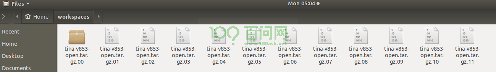

# 编译构建系统

## 0.前言

本章主要介绍关于DongshanPI-AICT开发板的Tina SDK包的下载和编译打包生成镜像，并将镜像烧录到DongshanPI-AICT开发板上。在进行DongshanPI-AICT开发板的环境配置前需要获取配置虚拟机系统，可以参考：[安装并配置开发环境](/docs/V853/ConfigHostEnv)。

全志Linux Tina-SDK开发完全手册：https://tina.100ask.net/


## 1.下载Tina SDK包

​	由于Tina SDK包的大小较大，我们将其分卷压缩并放在在了百度网盘中 ,位于07_Tina_SDK包目录下，将该目录下的全部文件下载并拷贝到虚拟机下，如下所示



​	在此目录下打开终端，输入cat tina-v853-open.tar.gz* | tar xz，合并压缩包并解压压缩包。

```shell
book@100ask:~/workspaces$ cat tina-v853-open.tar.gz* | tar xz
```

该过程时间可能会比较长，需要耐心等待。

​	解压完成后会在当前目录下生成一个tina-v853-open的文件夹，该文件夹即为Tina SDK包的全部目录。

```shell
book@100ask:~/workspaces$ ls
tina-v853-open            tina-v853-open.tar.gz.01  tina-v853-open.tar.gz.03  tina-v853-open.tar.gz.05  tina-v853-open.tar.gz.07  tina-v853-open.tar.gz.09  tina-v853-open.tar.gz.11
tina-v853-open.tar.gz.00  tina-v853-open.tar.gz.02  tina-v853-open.tar.gz.04  tina-v853-open.tar.gz.06  tina-v853-open.tar.gz.08  tina-v853-open.tar.gz.10
```

## 2.为Tina SDK包打上百问网V853的补丁包

​	在当前目录下通过GIT命令下载DongshanPI-AICT补丁包，对于此补丁包我们也在gitee和百度网盘中提供，百度网盘中位于08_DongshanPI-AICT_TinaSDK补丁包目录下。

```shell
book@100ask:~/workspaces$ git clone https://github.com/100askTeam/DongshanPI-AICT_TinaSDK.git
Cloning into 'DongshanPI-AICT_TinaSDK'...
remote: Enumerating objects: 131, done.
remote: Counting objects: 100% (131/131), done.
remote: Compressing objects: 100% (86/86), done.
remote: Total 131 (delta 12), reused 128 (delta 12), pack-reused 0
Receiving objects: 100% (131/131), 1.73 MiB | 2.89 MiB/s, done.
Resolving deltas: 100% (12/12), done.
```

下载完成后将此文件夹拷贝到tina-v853-open文件夹中

```shell
book@100ask:~/workspaces$ cp -rfvd DongshanPI-AICT_TinaSDK/* tina-v853-open/
```

## 3.编译系统

​	进入tina-v853-open目录下，可以通过ls命令查看当前文件夹下的所有文件

```shell
book@100ask:~/workspaces$ cd tina-v853-open/
book@100ask:~/workspaces/tina-v853-open$ ls
brandy  build  buildroot  build.sh  device  kernel  openwrt  platform  prebuilt  tools
```

​	对于想详细了解Allwinner Tina Linux系统平台，可以在后续访问：https://tina.100ask.net/SdkModule/Linux_SystemSoftware_DevelopmentGuide-01/

​	建立编译环境，输入 source build/envsetup.sh

```shell
book@100ask:~/workspaces/tina-v853-open$ source build/envsetup.sh
NOTE: The SDK(/home/book/workspaces/tina-v853-open) was successfully loaded
load openwrt... ok
Please run lunch next for openwrt.
load buildroot,bsp...ok
Please run ./build.sh config next for buildroot,bsp.
```

​	选择编译的开发板，输入lunch

```
book@100ask:~/workspaces/tina-v853-open$ lunch

You're building on Linux

Lunch menu... pick a combo:
     1  v853-100ask-tina
     2  v853-vision-tina
Which would you like?:
```

这里是需要您选择编译哪个方案的开发板，这里输入1，选择v853-100ask-tina，再按回车即可。

选择完成后会倒数8秒，让您阅读许可协议，阅读完成后，会询问您是否接受上述条款协议。输入y，再按回车即同意以上条款。

```
book@100ask:~/workspaces/tina-v853-open$ lunch

You're building on Linux

Lunch menu... pick a combo:
     1  v853-100ask-tina
     2  v853-vision-tina
Which would you like?: 1
Jump to longan autoconfig
/home/book/workspaces/tina-v853-open/build.sh autoconfig -o openwrt -i v853 -b 100ask           -n default

Before using this files, please make sure that you note the following important information.
**********************************************************************

Copyright (c) 2019-2022 Allwinner Technology Co., Ltd. ALL rights reserved.

Allwinner is a trademark of Allwinner Technology Co.,Ltd., registered in
the the People's Republic of China and other countries.
All Allwinner Technology Co.,Ltd. trademarks are used with permission.

DISCLAIMER
THIRD PARTY LICENCES MAY BE REQUIRED TO IMPLEMENT THE SOLUTION/PRODUCT.
IF YOU NEED TO INTEGRATE THIRD PARTY'S TECHNOLOGY (SONY, DTS, DOLBY, AVS OR MPEGLA, ETC.)
IN ALLWINNERS'SDK OR PRODUCTS, YOU SHALL BE SOLELY RESPONSIBLE TO OBTAIN
ALL APPROPRIATELY REQUIRED THIRD PARTY LICENCES.
ALLWINNER SHALL HAVE NO WARRANTY, INDEMNITY OR OTHER OBLIGATIONS WITH RESPECT TO MATTERS
COVERED UNDER ANY REQUIRED THIRD PARTY LICENSE.
YOU ARE SOLELY RESPONSIBLE FOR YOUR USAGE OF THIRD PARTY'S TECHNOLOGY.


THIS SOFTWARE IS PROVIDED BY ALLWINNER"AS IS" AND TO THE MAXIMUM EXTENT
PERMITTED BY LAW, ALLWINNER EXPRESSLY DISCLAIMS ALL WARRANTIES OF ANY KIND,
WHETHER EXPRESS, IMPLIED OR STATUTORY, INCLUDING WITHOUT LIMITATION REGARDING
THE TITLE, NON-INFRINGEMENT, ACCURACY, CONDITION, COMPLETENESS, PERFORMANCE
OR MERCHANTABILITY AND FITNESS FOR A PARTICULAR PURPOSE.
IN NO EVENT SHALL ALLWINNER BE LIABLE FOR ANY DIRECT, INDIRECT, INCIDENTAL,
SPECIAL, EXEMPLARY, OR CONSEQUENTIAL DAMAGES (INCLUDING, BUT
NOT LIMITED TO, PROCUREMENT OF SUBSTITUTE GOODS OR SERVICES;
LOSS OF USE, DATA, OR PROFITS, OR BUSINESS INTERRUPTION)
HOWEVER CAUSED AND ON ANY THEORY OF LIABILITY, WHETHER IN CONTRACT,
STRICT LIABILITY, OR TORT (INCLUDING NEGLIGENCE OR OTHERWISE)
ARISING IN ANY WAY OUT OF THE USE OF THIS SOFTWARE, EVEN IF ADVISED
OF THE POSSIBILITY OF SUCH DAMAGE.

**********************************************************************
You can read /home/book/workspaces/tina-v853-open/build/disclaimer/Allwinnertech_Disclaimer(Cn_En)_20181122.md for detailed information.

You read time left 8 seconds....
I have already read, understood and accepted the above terms? [Y/N]y
```

确认同意条款后，系统会自动配置环境变量

```
You select Yes, Build continue....
========ACTION List: mk_autoconfig -o openwrt -i v853 -b 100ask -n default;========
options :
INFO: Prepare toolchain ...
INFO: kernel defconfig: generate /home/book/workspaces/tina-v853-open/kernel/linux-4.9/.config by /home/book/workspaces/tina-v853-open/device/config/chips/v853/configs/100ask/linux-4.9/config-4.9
INFO: Prepare toolchain ...
make: Entering directory '/home/book/workspaces/tina-v853-open/kernel/linux-4.9'
  HOSTCC  scripts/basic/fixdep
  HOSTCC  scripts/kconfig/conf.o
  SHIPPED scripts/kconfig/zconf.tab.c
  SHIPPED scripts/kconfig/zconf.lex.c
  SHIPPED scripts/kconfig/zconf.hash.c
  HOSTCC  scripts/kconfig/zconf.tab.o
  HOSTLD  scripts/kconfig/conf
*** Default configuration is based on '../../../../../device/config/chips/v853/configs/100ask/linux-4.9/config-4.9'
#
# configuration written to .config
#
make: Leaving directory '/home/book/workspaces/tina-v853-open/kernel/linux-4.9'
INFO: clean buildserver

Usage:
 kill [options] <pid> [...]

Options:
 <pid> [...]            send signal to every <pid> listed
 -<signal>, -s, --signal <signal>
                        specify the <signal> to be sent
 -l, --list=[<signal>]  list all signal names, or convert one to a name
 -L, --table            list all signal names in a nice table

 -h, --help     display this help and exit
 -V, --version  output version information and exit

For more details see kill(1).
INFO: prepare_buildserver
```

编译系统，输入make，输入完成后系统将会开始编译

```
book@100ask:~/workspaces/tina-v853-open$ make
===There is tina environment.===
 Note: make is the shell functon in envsetup.sh.

== action: openwrt_build, action_args:  ==
========ACTION List: build_linuxdev ;========
options :
INFO: ----------------------------------------
INFO: build linuxdev ...
INFO: chip: sun8iw21p1
INFO: platform: linux
INFO: kernel: linux-4.9
INFO: board: 100ask
INFO: output: /home/book/workspaces/tina-v853-open/out/v853/100ask/openwrt
INFO: ----------------------------------------
INFO: don't build dtbo ...
INFO: build arisc
INFO: build_bootloader: brandy_path= /home/book/workspaces/tina-v853-open/brandy/brandy-2.0
grep: /home/book/workspaces/tina-v853-open/brandy/brandy-2.0/spl/Makefile: No such file or directory
build for sun8iw21p1_defconfig ...
Prepare arm toolchain ...
...//此部分编译输出信息省略
Building kernel
/home/book/workspaces/tina-v853-open/kernel/linux-4.9/output/lib/modules/4.9.191
  CHK     include/config/kernel.release
  CHK     include/generated/uapi/linux/version.h
  CHK     include/generated/utsrelease.h
  CHK     scripts/mod/devicetable-offsets.h
  CHK     include/generated/timeconst.h
  CHK     include/generated/bounds.h
  CHK     include/generated/asm-offsets.h
  CALL    scripts/checksyscalls.sh
  CHK     include/generated/compile.h
  DTC     arch/arm/boot/dts/board.dtb
  Kernel: arch/arm/boot/Image is ready
  Building modules, stage 2.
  MODPOST 27 modules
  Kernel: arch/arm/boot/zImage is ready
  Kernel: arch/arm/boot/uImage is ready
'arch/arm/boot/Image' -> 'output/bImage'
'arch/arm/boot/uImage' -> 'output/uImage'
'arch/arm/boot/zImage' -> 'output/zImage'
Copy rootfs.cpio.gz for arm
Building modules
[GPU]: No GPU type is configured in /home/book/workspaces/tina-v853-open/kernel/linux-4.9/.config.
regenerate rootfs cpio
16149 blocks
16150 blocks
build_ramfs
Copy boot.img to output directory ...
./scripts/build.sh

sun8iw21p1 compile Kernel successful


INFO: ----------------------------------------
INFO: build Tina OK.
INFO: ----------------------------------------
```

等待编译完成，此部分编译时间由电脑CPU等决定，第一次编译系统的时间比较长，请耐心等待。等待输出编译Tina OK即编译成功。

## 4.打包生成DongshanPI-AICT系统镜像

​	编译完成后，输入pack，可以直接将刚刚编译完成的系统打包生成可烧写到板载EMMC上的镜像。

```
book@100ask:~/workspaces/tina-v853-open$ pack
/home/book/workspaces/tina-v853-open/build/pack -c sun8iw21p1 -i v853 -p openwrt -b 100ask -k linux-4.9 -d uart0 -v none -m normal -w none -n default
INFO: /home/book/workspaces/tina-v853-open/out/v853/common/keys
copying tools file
copying configs file
copying product configs file
...

Dragon execute image.cfg SUCCESS !
----------image is at----------

33M     /home/book/workspaces/tina-v853-open/out/v853/100ask/openwrt/v853_linux_100ask_uart0.img

pack finish
```

等待打包完成，打包完成后可以根据上面的输出信息提示的目录下找到v853_linux_100ask_uart0.img镜像，将此镜像文件拷贝到Windows电脑中。


系统的烧录请参考开发**更新系统**章节。

