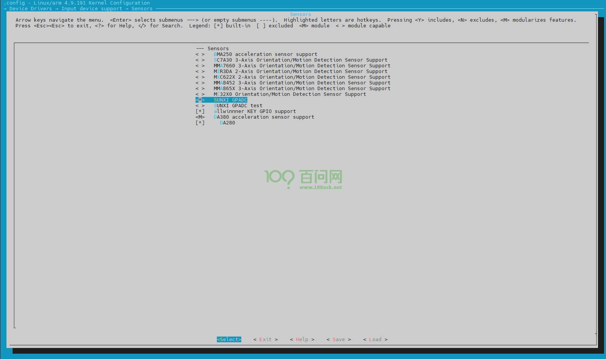
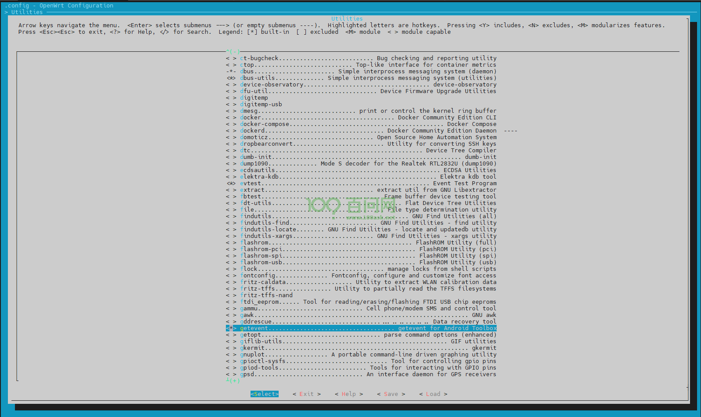

# 波轮开关适配指南

## 0.前言

​	DongshanPI-AICT开发板上有波轮开关，本章节跟大家讨论如何使能波轮开关。


## 1.V853功能按键原理

​	DongshanPI-AICT开发板上提供的波轮开关是通过GPADC高精度数模转换模块模拟出5个功能按键。GPADC 是 12bit 

分辨率，8 位采集精度的模数转换模块，具体通道数可以查看对应的 spec 说明⽂档，模拟输⼊范 围 0〜1.8V，最⾼采样率 

1MHz，并且⽀持数据⽐较，⾃校验功能，同时⼯作于可配置⼀下⼯作模式：

1. Single mode：在指定的通道完成⼀次转换并将数据放在对应数据寄存器中； 
2. Single-cycle mode：在指定的通道完成⼀个周期转换并将数据放在响应数据寄存器中;
3. Continuous mode：在指定的通道持续转换并将数据放在响应数据寄存器中； 
4. Burst mode：边采样边转换并将数据放⼊ 32 字节的 FIFO，⽀持中断控制。


​	部分 GPADC 接⼝也开始慢慢⽤于 KEY 模块按键的读取，⼀般包括 VOL+、VOL-、HOME、MENU、ENTER 等等， GPADC0 ⽤于 KEY 的电路如上图。 AVCC-AP 为 1.8V 的供电，不同的按键按下，GPADC0 ⼝的电压不同，CPU 通过对这个电压的采样来确定具体是那 ⼀个按键按下。如上图，VOL+、VOL-、MENU、ENTER、HOME/UBOOT 对应的电压分别为 0.21V、0.41V、 0.59V、0.75V、0.88V。具体可以查看《100ASK-V853_Pro系统开发手册.pdf》中第五篇驱动开发的第⼗三章 Linux GPADC 开发指南。


## 2.GPADC驱动

GPADC驱动存放的位置为

```
tina-v853-open/kernel/linux-4.9/drivers/input/sensor/sunxi_gpadc.c
tina-v853-open/kernel/linux-4.9/drivers/input/sensor/sunxi_gpadc.h
```

## 3.GPADC内核配置

在Tina的根目录下输入`make kernel_menuconfig`

```
book@100ask:~/workspaces/tina-v853-open$ make kernel_menuconfig
```

进入如下目录中，输入Y使能SUNXI GPADC驱动。

```
→ Device Drivers 
	→ Input device support 
		→ Sensors
			 <*>   SUNXI GPADC
```

配置完成后如下图所示。



保存并退出内核配置界面。

## 4.GPADC设备树配置

内核设备树存放位置：

```
tina-v853-open/device/config/chips/v853/configs/100ask/board.dts
```

进入该目录后输入`vi board.dts`

```shell
book@100ask:~/workspaces/tina-v853-open$ cd device/config/chips/v853/configs/100ask/
book@100ask:~/workspaces/tina-v853-open/device/config/chips/v853/configs/100ask$ ls
BoardConfig.mk  board.dts  buildroot  env.cfg  linux-4.9  sys_config.fex  uboot-board.dts
book@100ask:~/workspaces/tina-v853-open/device/config/chips/v853/configs/100ask$ vi board.dts
```

找到&gpadc节点，这个节点保存有采样相关的配置，键值，电压数据等。

```
&gpadc {
    channel_num = <1>;                        // 使用1通道
    channel_select = <0x01>;                  // 选择 0x01 通道
    channel_data_select = <0>;                // 启用数据通道
    channel_compare_select = <0x01>;          // 启用通道比较功能
    channel_cld_select = <0x01>;              // 启用数据小于比较功能
    channel_chd_select = <0>;                 // 启用数据大于比较功能
    channel0_compare_lowdata = <1700000>;     // 小于这个值触发中断
    channel0_compare_higdata = <1200000>;     // 大于这个值触发中断
    channel1_compare_lowdata = <460000>;      // 小于这个值触发中断
    channel1_compare_higdata = <1200000>;     // 大于这个值触发中断
    key_cnt = <5>;                            // 按键数量
    key0_vol = <210>;                         // 按键电压，单位mv
    key0_val = <115>;                         // 按下按键的键值
    key1_vol = <410>;                         // 按键电压，单位mv
    key1_val = <114>;                         // 按下按键的键值
    key2_vol = <590>;                         // 按键电压，单位mv
    key2_val = <139>;                         // 按下按键的键值
    key3_vol = <750>;                         // 按键电压，单位mv
    key3_val = <28>;                          // 按下按键的键值
    key4_vol = <880>;                         // 按键电压，单位mv
    key4_val = <102>;                         // 按下按键的键值
    status = "okay";                          // 启用GPADC
};
```

我们还能通过board.dts文件中知道还有一部分不经常需要修改的配置保存在sun8iw21p1.dtsi文件中，进入该目录，并打开该文件。

```
book@100ask:~/workspaces/tina-v853-open$ cd kernel/linux-4.9/arch/arm/boot/dts/
book@100ask:~/workspaces/tina-v853-open/kernel/linux-4.9/arch/arm/boot/dts$ vi sun8iw21p1.dtsi
```

查看gpadc节点，可以发现这里的配置保存有中断和时钟等信息，但默认不使能。注意：这里可以不修改，因为这里的所设置的status配置会被board.dts中的status覆盖，只要在board.dts设置为使能，最终生成打包进镜像的设备树都为使能状态。

```
gpadc:gpadc@2009000 {
    compatible = "allwinner,sunxi-gpadc";         // 用于驱动和设备的绑定
    reg = <0x0 0x02009000 0x0 0x400>;             // 设备使用的寄存器地址
    interrupts = <GIC_SPI 57 IRQ_TYPE_NONE>;      // 设备使用的中断
    clocks = <&clk_gpadc>;                        // 设备使用的时钟
    status = "disabled";                          // 配置默认不启用GPADC
};
```

## 5.增加getevent测试包

在Tina根目录下执行`make menuconfig`

```
book@100ask:~/workspaces/tina-v853-open$ make menuconfig
```

进入Utilities目录下，输入Y选中getevent

```
 > Utilities
 	 <*> getevent.................................... getevent for Android Toolbox 
```

选中完成后如下图所示。



保存并退出Tina配置界面。

## 6.编译、打包和烧写

在Tina的根目录下，输入`make -j32 `

```
book@100ask:~/workspaces/tina-v853-open$ make -j32
...
book@100ask:~/workspaces/tina-v853-open$ pack
...
```

​	生成镜像后，将tina-v853-open/out/v853/100ask/openwrt/目录下的v853_linux_100ask_uart0.img镜像拷贝到Windows电脑主机中，使用全志PhoenixSuit烧写工具烧写到开发板上。

​	插上12V的电源线，和两条Type-C，把开关拨向电源接口方向上电，烧写新镜像后等待启动系统，在命令行中输入`getevent`可以进入测试程序，通过输出的打印信息我们知道，我们的gpadc驱动上报的信息使用的

是`/dev/input/event1`，此时按下按键，会读取按键的键值。

```
root@TinaLinux:~# getevent
add device 1: /dev/input/event2
  name:     "ft6336"
add device 2: /dev/input/event1
  name:     "sunxi-gpadc0"
add device 3: /dev/input/event0
  name:     "axp2101-pek"
poll 4, returned 1
/dev/input/event1: 0001 0073 00000001
poll 4, returned 1
/dev/input/event1: 0000 0000 00000000
poll 4, returned 1
/dev/input/event1: 0001 0073 00000000
poll 4, returned 1
/dev/input/event1: 0000 0000 00000000

```

按下Crtl+C结束测试。

## 7.编写一个测试应用程序

通过上一章节的测试，我们知道gpadc使用的`/dev/input/event1`上报按键数据，则我们编写的应用程序中获取数据的节点应该为/dev/input/event1，应用程序如下所示。

```c
#include <stdio.h>
#include <linux/input.h>
#include <stdlib.h>
#include <sys/types.h>
#include <sys/stat.h>
#include <fcntl.h>
#include <sys/time.h>
#include <limits.h>
#include <unistd.h>
#include <signal.h>

#define DEV_PATH "/dev/input/event1" //Modified to gpadc drive reporting node
static int gpadc_fd = 0;

unsigned int test_gpadc(const char * event_file)
{
        int code = 0, i;

        struct input_event data;

        gpadc_fd = open(DEV_PATH, O_RDONLY);

        if(gpadc_fd <= 0)
        {
                printf("open %s error!\n", DEV_PATH);
                return -1;
        }

        for(i = 0; i < 10; i++) //read 10 times
        {
                read(gpadc_fd, &data, sizeof(data));
                if(data.value == 1)
                {
                        printf("key %d pressed\n", data.code);
                }
                else if(data.value == 0)
                {
                        printf("key %d releaseed\n", data.code);
                }
        }
        close(gpadc_fd);
        return 0;
}

int main(int argc,const char *argv[])
{
    int rang_low = 0, rang_high = 0;
        return test_gpadc(DEV_PATH);

```

## 8.编译应用程序并进行测试

新建一个gpadc目录，存放应用程序和可执行程序。

```
book@100ask:~/workspaces$ mkdir gpadc_test
book@100ask:~/workspaces$ cd gpadc_test/
book@100ask:~/workspaces/gpadc_test$ vi gpadc_test.c
```

将上一小节编写的应用程序复制到gpadc_test.c中保存。

编写完成后，我们需要提供编译环境给gpadc_test应用程序，输入

```shell
book@100ask:~/workspaces/gpadc_test$ export STAGING_DIR=~/workspaces/tina-v853-open/prebuilt/rootfsbuilt/arm/toolchainsunxi-musl-gcc-830/toolchain/arm-openwrt-linux-muslgnueabi
```

使用交叉编译工具链编译二进制文件，注意：需要Tina SDK包目录需要更换为自己的目录。

```
book@100ask:~/workspaces/gpadc_test$ ~/workspaces/tina-v853-open/prebuilt/rootfsbuilt/arm/toolchain-sunxi-musl-gcc-830/toolchain/bin/arm-openwrt-linux-gcc -o gpadc_test gpadc_test.c
```

编译完成后会再当前目录下生成一个gpadc_test可执行程序，将其拷贝到开发板上运行即可。下面使用TF卡的方式将文件拷贝到开发板上，此时假设你已经将文件拷贝到TF卡中，插入开发板后，在命令行中输入以下命令挂在SD卡到`/mnt/`目录下，并将gpadc_test应用程序拷贝到、root目录下。

```
root@TinaLinux:/# mount /dev/mmcblk1p1 /mnt/
[   26.744697] FAT-fs (mmcblk1p1): Volume was not properly unmounted. Some data may be corrupt. Please run fsck.
root@TinaLinux:/# cd /mnt/
root@TinaLinux:/mnt# ls
System Volume Information  gpadc_test
root@TinaLinux:/mnt# cp gpadc_test /root/
```

进入/root目录下执行测试程序，该程序读取10次值会自动结束才测试

```
root@TinaLinux:/mnt# cd /root/
root@TinaLinux:~# ./gpadc_test
key 115 pressed
key 0 releaseed
key 115 releaseed
key 0 releaseed
key 114 pressed
key 0 releaseed
key 114 releaseed
key 0 releaseed
key 139 pressed
key 0 releaseed
```

