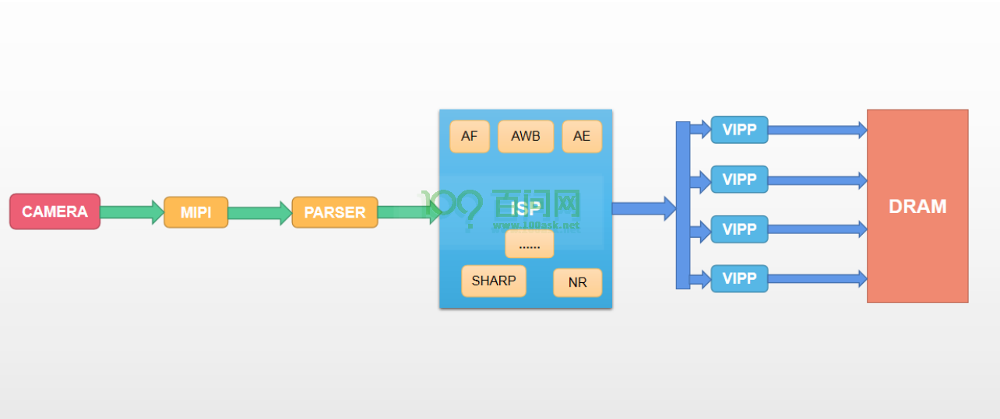
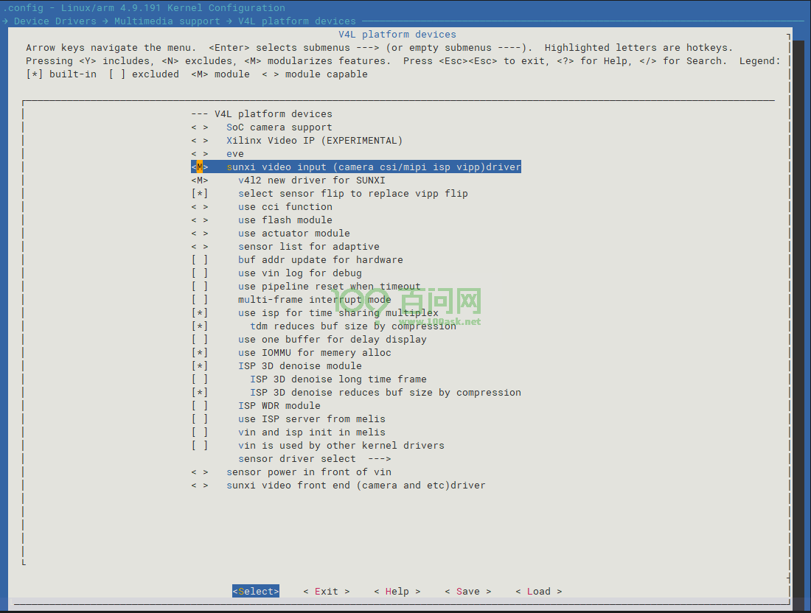
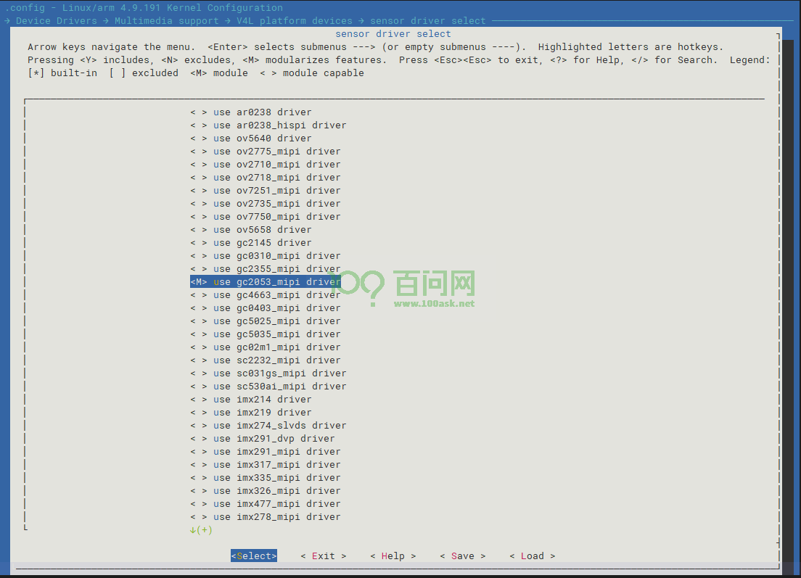
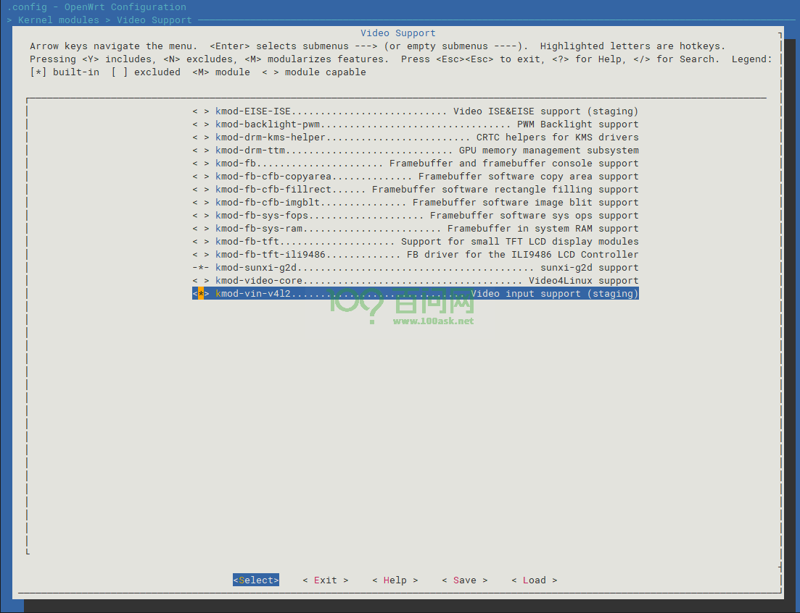
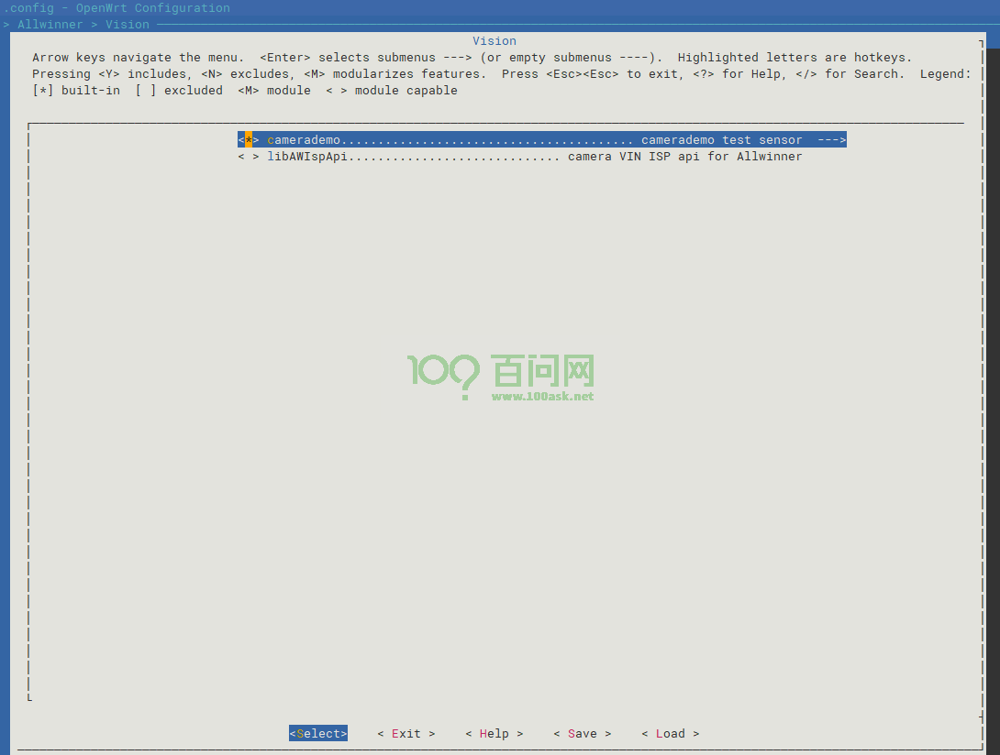

# MIPI摄像头适配指南

## 0.前言

​	DongshanPI-AICT开发板支持4LINE的MIPI摄像头和2LINE的MIPI摄像头，使用百问网提供的Tina SDK包生成的镜像，系统已经配置好了，可以直接使用。本章介绍如何去适配一个MIPI摄像头，本文所用的2LINE的MIPI摄像头，大家可以在百问网官方淘宝店铺上购买。


全志Linux Tina-SDK开发完全手册：https://tina.100ask.net/

如果您想适配自己的摄像头，强烈建议您参照以下开发指南进行操作：

Camera_开发指南：https://tina.100ask.net/SdkModule/Linux_Camera_DevelopmentGuide-01/


## 1.VIN框架介绍

V853支持并口CSI、MIPI，使用VIN camera驱动框架。

**Camera 通路框架**

• VIN 支持灵活配置单/双路输入双ISP 多通路输出的规格

• 引入media 框架实现pipeline 管理

• 将libisp 移植到用户空间解决GPL 问题

• 将统计buffer 独立为v4l2 subdev

• 将的scaler（vipp）模块独立为v4l2 subdev

• 将video buffer 修改为mplane 方式，使用户层取图更方便

• 采用v4l2-event 实现事件管理

• 采用v4l2-controls 新特性



**VIN 框架**

• 使用过程中可简单的看成是vin 模块+ device 模块+af driver + flash 控制模块的方式；

• vin.c 是驱动的主要功能实现，包括注册/注销、参数读取、与v4l2 上层接口、与各device 的下层接口、中断处理、buffer 申请切换等；

• modules/sensor 文件夹里面是各个sensor 的器件层实现，一般包括上下电、初始化，各分辨率切换，yuv sensor 包括绝大部分的v4l2 定义的ioctrl 命令的实

现；而raw sensor 的话大部分ioctrl 命令在vin 层调用isp 库实现，少数如曝光/增益调节会透过vin 层到实际器件层；

• modules/actuator 文件夹内是各种vcm 的驱动；

• modules/flash 文件夹内是闪光灯控制接口实现；

• vin-csi 和vin-mipi 为对csi 接口和mipi 接口的控制文件；

• vin-isp 文件夹为isp 的库操作文件；

• vin-video 文件夹内主要是video 设备操作文件；


驱动路径位于linux-4.9/drivers/media/platform/sunxi-vin 下。

```
sunxi-vin:
│ vin.c ;v4l2驱动实现主体（包含视频接口和ISP部分）
│ vin.h ;v4l2驱动头文件
│ top_reg.c ;vin对各v4l2 subdev管理接口实现主体
│ top_reg.h ;管理接口头文件
│ top_reg_i.h ;vin模块接口层部分结构体
├── modules
│ ├── actuator ;vcm driver
│ │ ├── actuator.c
│ │ ├── actuator.h
│ │ ├── dw9714_act.c
│ │ ├── Makefile
│ ├── flash ;闪光灯driver
│ │ ├── flash.c
│ │ └── flash.h
│ └── sensor ;sensor driver
│ ├── ar0144_mipi.c
│ ├── camera_cfg.h ;camera ioctl扩展命令头文件
│ ├── camera.h ;camera公用结构体头文件
│ ├── Makefile
│ ├── ov2775_mipi.c
│ ├── ov5640.c
│ ├── sensor-compat-ioctl32.c
│ ├── sensor_helper.c ;sensor公用操作接口函数文件
│ ├── sensor_helper.h
├── platform ;平台相关的配置接口
├── utility
│ ├── bsp_common.c
│ ├── bsp_common.h
│ ├── cfg_op.c
│ ├── cfg_op.h
│ ├── config.c
│ ├── config.h
│ ├── sensor_info.c
│ ├── sensor_info.h
│ ├── vin_io.h
│ ├── vin_os.c
│ ├── vin_os.h
│ ├── vin_supply.c
│ └── vin_supply.h
├── vin-cci
│ ├── sunxi_cci.c
│ └── sunxi_cci.h
├── vin-csi
│ ├── parser_reg.c
│ ├── parser_reg.h
│ ├── parser_reg_i.h
│ ├── sunxi_csi.c
│ └── sunxi_csi.h
├── vin-isp
│ ├── sunxi_isp.c
│ └── sunxi_isp.h
├── vin-mipi
│ ├── sunxi_mipi.c
│ └── sunxi_mipi.h
├── vin-stat
│ ├── vin_h3a.c
│ ├── vin_h3a.h
│ ├── vin_ispstat.c
│ └── vin_ispstat.h
├── vin_test
├── vin-video
│ ├── vin_core.c
│ ├── vin_core.h
│ ├── vin_video.c
│ └── vin_video.h
└── vin-vipp
├── sunxi_scaler.c
├── sunxi_scaler.h
├── vipp_reg.c
├── vipp_reg.h
└── vipp_reg_i.h
```

## 2.驱动配置

​	DongshanPI-AICT开发板支持4LINE双摄镜头模组和2LINE单摄镜头模组，下面我仅演示2LINE的MIPI摄像头如何进行配置。我们使用的是GC2053摄像头，使用的是全志已经内置的驱动程序，路径为：

```
kernel/linux-4.9/drivers/media/platform/sunxi-vin/modules/sensor/gc2053_mipi.c
```

## 3.设备树配置

设备树配置路径：

```
device/config/chips/v853/configs/100ask/board.dts
```

camera相关配置：

```
                vind0:vind@0 {
                        vind0_clk = <300000000>;
                        status = "okay";

                        csi2:csi@2 {
                                pinctrl-names = "default","sleep";
                                pinctrl-0 = <&ncsi_pins_a>;
                                pinctrl-1 = <&ncsi_pins_b>;
                                status = "okay";
                        };
                        /*Online mode tp9953 uses online mode*/
                        tdm0:tdm@0 {
                                work_mode = <0>;
                        };

                        isp00:isp@0 {
                                work_mode = <0>;
                        };

                        scaler00:scaler@0 {
                                work_mode = <0>;
                        };

                        scaler10:scaler@4 {
                                work_mode = <0>;
                        };

                        scaler20:scaler@8 {
                                work_mode = <0>;
                        };

                        scaler30:scaler@12 {
                                work_mode = <0>;
                        };

                        actuator0:actuator@0 {
                                device_type = "actuator0";
                                actuator0_name = "ad5820_act";
                                actuator0_slave = <0x18>;
                                actuator0_af_pwdn = <>;
                                actuator0_afvdd = "afvcc-csi";
                                actuator0_afvdd_vol = <2800000>;
                                status = "disabled";
                        };
                        flash0:flash@0 {
                                device_type = "flash0";
                                flash0_type = <2>;
                                flash0_en = <>;
                                flash0_mode = <>;
                                flash0_flvdd = "";
                                flash0_flvdd_vol = <>;
                                status = "disabled";
                        };

                        sensor0:sensor@0 {
                                device_type = "sensor0";
                                sensor0_mname = "gc2053_mipi";
                                sensor0_twi_cci_id = <1>;
                                sensor0_twi_addr = <0x6e>;
                                sensor0_mclk_id = <0>;
                                sensor0_pos = "rear";
                                sensor0_isp_used = <1>;
                                sensor0_fmt = <1>;
                                sensor0_stby_mode = <0>;
                                sensor0_vflip = <0>;
                                sensor0_hflip = <0>;
                                sensor0_iovdd-supply = <&reg_aldo2>;
                                sensor0_iovdd_vol = <1800000>;
                                sensor0_avdd-supply = <&reg_bldo2>;
                                sensor0_avdd_vol = <2800000>;
                                sensor0_dvdd-supply = <&reg_dldo2>;
                                sensor0_dvdd_vol = <1200000>;
                                sensor0_power_en = <>;
                                sensor0_reset = <&pio PA 18 1 0 1 0>;
                                sensor0_pwdn = <&pio PA 19 1 0 1 0>;
                                sensor0_sm_hs = <>;
                                sensor0_sm_vs = <>;
                                flash_handle = <&flash0>;
                                act_handle = <&actuator0>;
                                status  = "okay";
                        };
                        sensor1:sensor@1 {
                                device_type = "sensor1";
                                sensor1_mname = "tp9953";
                                sensor1_twi_cci_id = <0>;
                                sensor1_twi_addr = <0x88>;
                                sensor1_mclk_id = <2>;
                                sensor1_pos = "front";
                                sensor1_isp_used = <0>;
                                sensor1_fmt = <0>;
                                sensor1_stby_mode = <0>;
                                sensor1_vflip = <0>;
                                sensor1_hflip = <0>;
                                sensor1_iovdd-supply = <&reg_aldo2>;
                                sensor1_iovdd_vol = <1800000>;
                                sensor1_avdd-supply = <>; /*<&reg_dcdc1>;*/
                                sensor1_avdd_vol = <3300000>;
                                sensor1_dvdd-supply = <>;//<&reg_dldo2>;
                                sensor1_dvdd_vol = <1200000>;
                                sensor1_power_en = <&pio PI 0 1 0 1 0>;
                                sensor1_reset = <&pio PH 13 1 0 1 0>;
                                sensor1_pwdn  = <>;
                                /*sensor1_pwdn = <&pio PE 13 1 0 1 0>;*/
                                sensor1_sm_hs = <>;
                                sensor1_sm_vs = <>;
                                flash_handle = <>;
                                act_handle = <>;
                                status  = "okay";
                        };
```

## 4.内核配置

在Tina根目录下执行`make kernel_menuconfig`

```
book@100ask:~/workspaces/tina-v853-open$ make kernel_menuconfig
```

注意:在进行内核配置前需要配置环境变量才可以进入内核调试，即在配置前输入

```
book@100ask:~/workspaces/tina-v853-open$ source build/envsetup.sh
...
book@100ask:~/workspaces/tina-v853-open$ lunch
... 输入1，选择方案1
```

在内核配置界面中，进入如下目录，输入M选中下面两项。

```
→ Device Drivers 
	→ Multimedia support 
		→ V4L platform devices
			<M>   sunxi video input (camera csi/mipi isp vipp)driver
			<M>     v4l2 new driver for SUNXI
```




可以看到全志已经支持了很多摄像头，找到我们需要适配的摄像头，输入M将gc2053驱动编为模块。

```
→ Device Drivers 
	→ Multimedia support 
		→ V4L platform devices 
			→ sensor driver select
				<M> use gc2053_mipi driver
```

注意：如果出现没有的路径，需要选择上一级目录才会打开。



## 5.Tina配置

在Tina根目录下输入`make menuconfig`，进入如下目录

```
 > Kernel modules 
 	> Video Support
 		<*> kmod-vin-v4l2.............................. Video input support (staging)
```

如下图所示



## 6.modules.mk配置

modules.mk主要完成两个方面：

1. 拷贝相关的ko模块到小机rootfs中
2. rootfs启动时，按顺序自动加载相关的ko模块。

modules.mk文件路径：

```shell
tina-v853-open/openwrt/target/v853/v853-100ask/modules.mk
```

驱动加载顺序配置

```makefile
 define KernelPackage/vin-v4l2
   SUBMENU:=$(VIDEO_MENU)
   TITLE:=Video input support (staging)
   DEPENDS:=
   FILES:=$(LINUX_DIR)/drivers/media/v4l2-core/videobuf2-core.ko
   FILES+=$(LINUX_DIR)/drivers/media/v4l2-core/videobuf2-dma-contig.ko
   FILES+=$(LINUX_DIR)/drivers/media/v4l2-core/videobuf2-memops.ko
   FILES+=$(LINUX_DIR)/drivers/media/v4l2-core/videobuf2-v4l2.ko
   FILES+=$(LINUX_DIR)/drivers/media/platform/sunxi-vin/vin_io.ko
   FILES+=$(LINUX_DIR)/drivers/media/platform/sunxi-vin/modules/sensor/gc2053_mipi.ko
 #  FILES+=$(LINUX_DIR)/drivers/media/platform/sunxi-vin/modules/sensor_power/sensor_power.ko
   FILES+=$(LINUX_DIR)/drivers/media/platform/sunxi-vin/vin_v4l2.ko
   FILES+=$(LINUX_DIR)/drivers/input/sensor/da380/da380.ko
   AUTOLOAD:=$(call AutoProbe,videobuf2-core videobuf2-dma-contig videobuf2-memops videobuf2-v4l2 vin_io gc2053_mipi vin_v4l2 da380.ko)
 endef

 define KernelPackage/vin-v4l2/description
  Kernel modules for video input support
 endef

 $(eval $(call KernelPackage,vin-v4l2))
```

## 7.S00mpp配置

V853平台在完成modules.mk配置后，还需要完成.ko挂载脚本S00mpp的配置，以便开机快速启动摄像头模块。

S00mpp配置路径：

```
tina-v853-open/openwrt/target/v853/v853-100ask/busybox-init-base-files/etc/init.d/S00mpp
```

脚本对摄像头驱动进行了提前加载，应用需要使用的时候即可快速配置并启动。

```
#!/bin/sh
#
# Load mpp modules....
#

MODULES_DIR="/lib/modules/`uname -r`"

start() {
    printf "Load mpp modules\n"
    insmod $MODULES_DIR/videobuf2-core.ko
    insmod $MODULES_DIR/videobuf2-memops.ko
    insmod $MODULES_DIR/videobuf2-dma-contig.ko
    insmod $MODULES_DIR/videobuf2-v4l2.ko
    insmod $MODULES_DIR/vin_io.ko
#   insmod $MODULES_DIR/sensor_power.ko
    insmod $MODULES_DIR/gc4663_mipi.ko
    insmod $MODULES_DIR/vin_v4l2.ko
    insmod $MODULES_DIR/sunxi_aio.ko
    insmod $MODULES_DIR/sunxi_eise.ko
#   insmod $MODULES_DIR/vipcore.ko
}

stop() {
    printf "Unload mpp modules\n"
#   rmmod $MODULES_DIR/vipcore.ko
    rmmod $MODULES_DIR/sunxi_eise.ko
    rmmod $MODULES_DIR/sunxi_aio.ko
    rmmod $MODULES_DIR/vin_v4l2.ko
    rmmod $MODULES_DIR/gc4663_mipi.ko
#   rmmod $MODULES_DIR/sensor_power.ko
    rmmod $MODULES_DIR/vin_io.ko
    rmmod $MODULES_DIR/videobuf2-v4l2.ko
    rmmod $MODULES_DIR/videobuf2-dma-contig.ko
    rmmod $MODULES_DIR/videobuf2-memops.ko
    rmmod $MODULES_DIR/videobuf2-core.ko
}

case "$1" in
    start)
    start
    ;;
    stop)
    stop
    ;;
    restart|reload)
    stop
    start
    ;;
  *)
    echo "Usage: $0 {start|stop|restart}"
    exit 1
esac

exit $?
```

## 8.增加摄像头测试程序

在Tina根目录下执行`make menuconfig`，进入Tina配置界面后，进入如下目录，输入Y选中camerademo测试程序。

```
> Allwinner 
	> Vision
		<*> camerademo........................................ camerademo test sensor  ---> 
```



## 8.编译烧写镜像

在Tina的根目录下，输入`make -j32 `

```
book@100ask:~/workspaces/tina-v853-open$ make -j32
...
book@100ask:~/workspaces/tina-v853-open$ pack
...
```

​	生成镜像后，将tina-v853-open/out/v853/100ask/openwrt/目录下的v853_linux_100ask_uart0.img镜像拷贝到Windows电脑主机中，使用全志PhoenixSuit烧写工具烧写到开发板上。

​	上电前需要连接插上12V的电源线，和两条Type-C，把开关拨向电源接口方向上电，烧写新镜像后等待启动系统，在命令行中输入`lsmod`

```
root@TinaLinux:/# lsmod 
Module                  Size  Used by
vin_v4l2              181099  0 
gc2053_mipi             8567  0 
vin_io                 21106  3 vin_v4l2,gc2053_mipi
videobuf2_v4l2          9304  1 vin_v4l2
videobuf2_dma_contig     8632  1 vin_v4l2
videobuf2_memops         948  1 videobuf2_dma_contig
videobuf2_core         22168  2 vin_v4l2,videobuf2_v4l2
xradio_wlan              598  0 
xradio_core           431911  1 xradio_wlan
xradio_mac            222724  1 xradio_core
```

可以看到我们之前选中的VIN驱动和GC2053驱动已经装载进去了

## 9.运行camera测试程序

在开发板的串口终端界面输入`camedemo -h`可以输出camera测试程序的使用教程

```
root@TinaLinux:/# camerademo -h
[CAMERA]**********************************************************
[CAMERA]*                                                        *
[CAMERA]*              this is camera test.                      *
[CAMERA]*                                                        *
[CAMERA]**********************************************************
[CAMERA]******************** camerademo help *********************
[CAMERA] This program is a test camera.
[CAMERA] It will query the sensor to support the resolution, output format and test frame rate.
[CAMERA] At the same time you can modify the data to save the path and get the number of photos.
[CAMERA] When the last parameter is debug, the output will be more detailed information
[CAMERA] There are eight ways to run:
[CAMERA]    1.camerademo --- use the default parameters.
[CAMERA]    2.camerademo debug --- use the default parameters and output debug information.
[CAMERA]    3.camerademo setting --- can choose the resolution and data format.
[CAMERA]    4.camerademo setting debug --- setting and output debug information.
[CAMERA]    5.camerademo NV21 640 480 30 bmp /tmp 5 --- param input mode,can save bmp or yuv.
[CAMERA]    6.camerademo NV21 640 480 30 bmp /tmp 5 debug --- output debug information.
[CAMERA]    7.camerademo NV21 640 480 30 bmp /tmp 5 Num --- /dev/videoNum param input mode,can save bmp or yuv.
[CAMERA]    8.camerademo NV21 640 480 30 bmp /tmp 5 Num debug --- /dev/videoNum output debug information.
[CAMERA]    8.camerademo NV21 640 480 30 bmp /tmp 5 Num 1 --- 1/2: chose memory: V4L2_MEMORY_MMAP/USERPTR
[CAMERA]**********************************************************
```

在开发板的串口终端界面输入`camerademo NV21 640 480 30 bmp /tmp 5`，将会拍摄5张照片放在/tmp目录下，将/tmp目录下的文件拷贝到电脑端即可查看相应的图片。

具体教程可以参考：https://tina.100ask.net/SdkModule/Linux_Camera_DevelopmentGuide-06/