# 模型转换工具安装

## 0.前言

NPU 使用的模型是 NPU 自定义的一类模型结构，不能直接将网络训练出的模型直接导入 NPU 进行计算。这就需要将网络训练出的转换模型到 NPU 的模型上。


NPU 系统的模型部署流程一般包括以下四个部分：

[](https://v853.docs.aw-ol.com/assets/img/dev_npu/image-20220712110126757.png)

V853 支持的常用深度学习框架模型有：

- TensorFlow
- Caffe
- TFLite
- Keras
- Pytorch
- Onnx NN
- Darknet

本文针对NPU使用的模型转换工具的安装使用进行讲解，本文主要使用` Verisilicon Tool Acuity Toolkit`工具，主要用于模型转换，该工具目前只支持Linux 发行版Ubuntu 20.04。

下载地址：https://netstorage.allwinnertech.com:5001/sharing/ZIruS49kj

模型仿真工具使用指南：


## 1.配置模型转换工具环境

下载虚拟机环境：https://www.linuxvmimages.com/images/ubuntu-2004/


下载完成后解压，解压完成后使用VMware软件打开`Ubuntu_20.04.4_VM_LinuxVMImages.COM.vmx`文件。

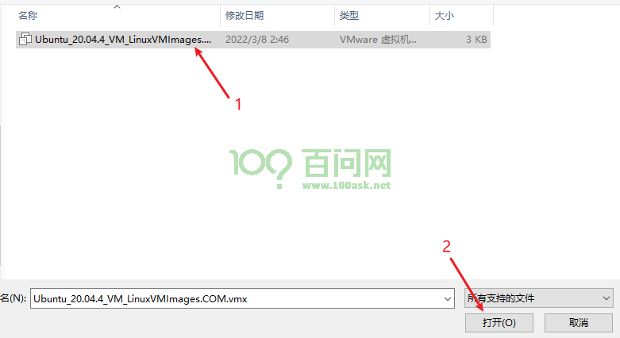

等待Ubuntu20.04虚拟机打开，打开完成后，下载对应依赖。

```
sudo apt install -y python3 python3-dev python3-pip build-essential 
```


## 2.安装模型仿真工具

安装前声明：如果是个人开发者可能无法申请到`Lincese`使用全部功能。我们仅需要使用其模型转换的功能，该部分功能不需要申请`Lincese`。


将下载的`Verisilicon_Tool_VivanteIDE`，传入虚拟机的任意目录中。假设将该文件下载后的文件名称为`V853 NPU Toolkits.zip`，在Windows电脑端解压该文件，解压完成后，进入`V853 NPU Toolkits\NPU`目录下，将下图中的`Verisilicon_Tool_VivanteIDE_v5.7.0_CL470666_Linux_Windows_SDK_p6.4.x_dev_6.4.10_22Q1_CL473325A_20220425.tar`文件拷贝到Ubuntu20.04中。


拷贝到虚拟机的目录下，下图所示：


在压缩包目录下，解压压缩包文件，输入

```
ubuntu@ubuntu2004:~$ tar xvf Verisilicon_Tool_VivanteIDE_v5.7.0_CL470666_Linux_Windows_SDK_p6.4.x_dev_6.4.10_22Q1_CL473325A_20220425.tar
```


解压完成后，会在当前目录下解压出以下文件

```
├── doc
│   ├── Vivante.IDE.Release.Notes.pdf
│   └── Vivante_IDE_User_Guide.pdf
├── Vivante_IDE-5.7.0_CL470666-Linux-x86_64-04-24-2022-18.55.31-plus-W-p6.4.x_dev_6.4.10_22Q1_CL473325A-Install
└── Vivante_IDE-5.7.0_CL470666-Win32-x86_64-04-24-2022-18.36.02-plus-W-p6.4.x_dev_6.4.10_22Q1_CL473325A-Setup.exe
```

`doc/`目录下有：

仿真工具的IDE版本说明`Vivante.IDE.Release.Notes.pdf`

仿真工具的用户指南`Vivante_IDE_User_Guide.pdf`


当前目录下有：

Linux仿真工具安装包：

`Vivante_IDE-5.7.0_CL470666-Linux-x86_64-04-24-2022-18.55.31-plus-W-p6.4.x_dev_6.4.10_22Q1_CL473325A-Install`

Windows仿真工具安装包：

`Vivante_IDE-5.7.0_CL470666-Win32-x86_64-04-24-2022-18.36.02-plus-W-p6.4.x_dev_6.4.10_22Q1_CL473325A-Setup.exe`


由于我们是在Ubuntu下的Linux环境中安装仿真工具，所以需要使用Linux仿真工具安装包，输入

```
ubuntu@ubuntu2004:~$ ./Vivante_IDE-5.7.0_CL470666-Linux-x86_64-04-24-2022-18.55.31-plus-W-p6.4.x_dev_6.4.10_22Q1_CL473325A-Install
```


执行完后，会弹出以下对话框，点击`Yes`


点击`Next`

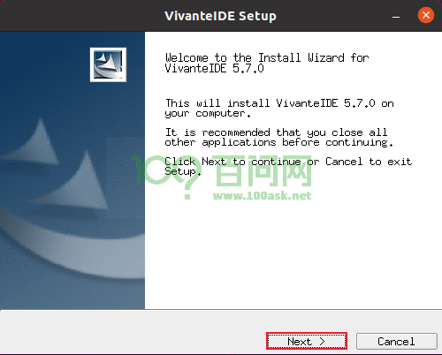

阅读许可协议，点击接受许可协议，再点击`Next`

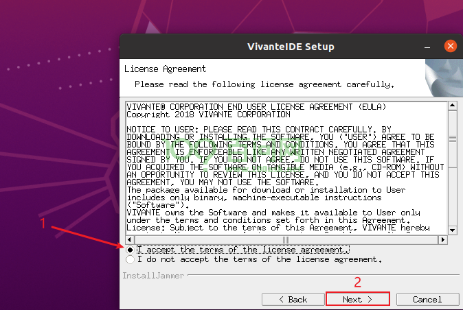

可以自定义安装路径，这里我使用默认安装路径。

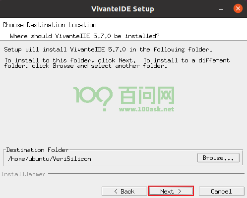

选择` License` 许可文件， 没有许可文件点击 Next 跳过，之后在IDE中添加。企业客户可以根据后续步骤获取` License` ，个人开发者不申请` License` 也可以使用模型转换功能。

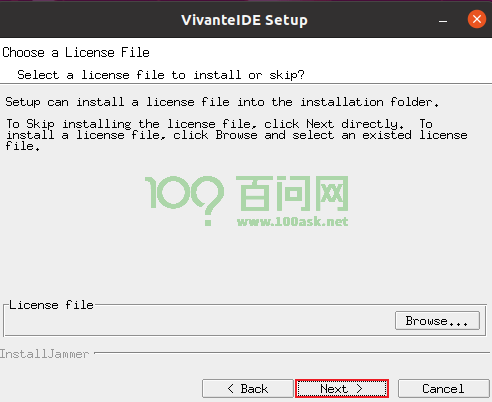

点击`Next`

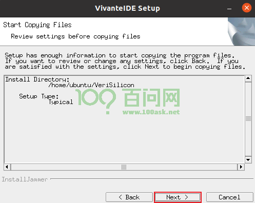

等待安装完成

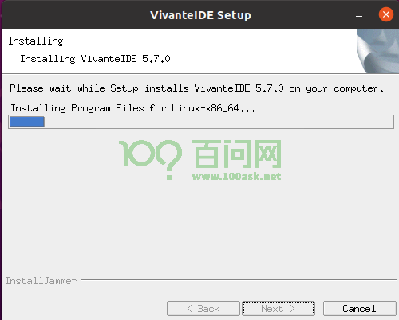

安装完成后，点击`Finish`

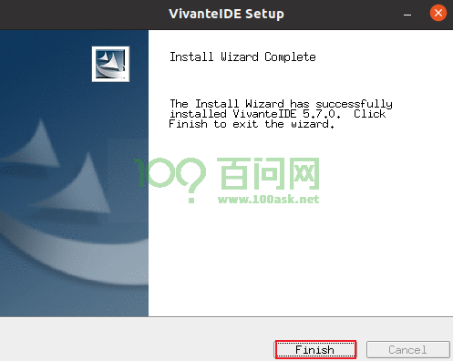

经过上述步骤仿真工具IDE就已经安装完成了，我们可以进入`VeriSilicon/VivanteIDE5.7.0/ide/`目录下

```
ubuntu@ubuntu2004:~$ cd VeriSilicon/VivanteIDE5.7.0/ide/
ubuntu@ubuntu2004:~/VeriSilicon/VivanteIDE5.7.0/ide$ ls
3ds          about.html  artifacts.xml  epl-v10.html  history.txt  libcairo-swt.so  p2       readme     setenv-vivanteide5.7.0     VivanteIDE       VivanteIDE.ini
about_files  acuityc     configuration  features      icon.xpm     notice.html      plugins  resources  uninstall-vivanteide5.7.0  vivanteide5.7.0
```

该目录下`vivanteide5.7.0`即为仿真工具IDE的应用程序，使用如下命令即可运行应用程序

```
ubuntu@ubuntu2004:~/VeriSilicon/VivanteIDE5.7.0/ide$ ./vivanteide5.7.0 
```

启动后，会需要您创建工作空间，这里我使用默认配置，点击OK即可。

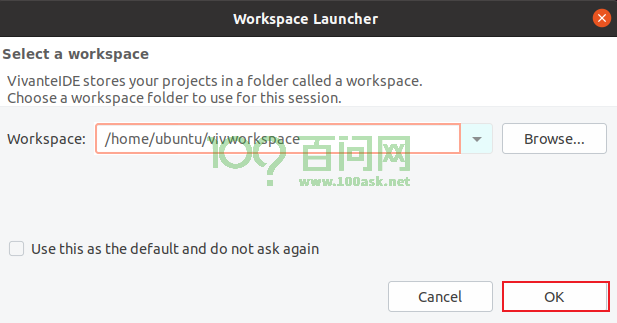

等待IDE工具配置完成后，会进入应用程序，这里会需要您输入`License`。


如果您是个人开发者，那您可直接关闭该应用程序，后续开发不使用该仿真工具也是可以正常进行开发的。

如果您是企业客户，您可进入芯原官网，填写公司相关信息后，获取到`License`。

License申请地址：https://www.verisilicon.com/cn/VIPAcuityIDELicenseRequest

注意：申请`License`时需要使用企业邮箱，不能使用个人邮箱申请。


## 2.安装模型转换工具

### 2.1 配置环境

将下载的`Verisilicon Tool Acuity Toolkit`，传入虚拟机的任意目录中。假设将该文件下载后的文件名称为`V853 NPU Toolkits.zip`，在Windows电脑端解压该文件，解压完成后，进入`V853 NPU Toolkits\NPU`目录下，将下图中的`Vivante_acuity_toolkit_binary_6.6.1_20220329_ubuntu20.04.tgz`拷贝Ubuntu20.04中。


拷贝到虚拟机目录下，如下图所示：


拷贝完成后解压该工具包，输入

```
ubuntu@ubuntu2004:~$ tar xvf Vivante_acuity_toolkit_binary_6.6.1_20220329_ubuntu20.04.tgz
```

等待解压完成，解压完成后会在当前目录下得到一个`acuity-toolkit-binary-6.6.1`文件夹


将该文件夹拷贝到仿真IDE目录下

```
ubuntu@ubuntu2004:~$ mv acuity-toolkit-binary-6.6.1 /home/ubuntu/VeriSilicon/
```

注意：`/home/ubuntu/VeriSilicon/`该路径需要更换成之前您的IDE安装路径。


进入`acuity-toolkit-binary-6.6.1`文件夹下

```
ubuntu@ubuntu2004:~$ cd VeriSilicon/acuity-toolkit-binary-6.6.1/
ubuntu@ubuntu2004:~/VeriSilicon/acuity-toolkit-binary-6.6.1$ ls
bin  build_linux.sh  COPYRIGHTS  lenet  LICENSE  README.md  requirements.txt
```

由于模型转换还需要安装一些包，所需的包已经放在了`requirements.txt`目录下，所以需要输入

```
ubuntu@ubuntu2004:~/VeriSilicon/acuity-toolkit-binary-6.6.1$ pip install -r requirements.txt
```

等待下载完成。由于默认PIP源下载较慢，所以推荐换源后，再下载包。换源方法例如更换清华源：

```
ubuntu@ubuntu2004:~/VeriSilicon/acuity-toolkit-binary-6.6.1$ pip config set global.index-url https://pypi.tuna.tsinghua.edu.cn/simple/
Writing to /home/ubuntu/.config/pip/pip.conf
ubuntu@ubuntu2004:~/VeriSilicon/acuity-toolkit-binary-6.6.1$ pip install -r requirements.txt
```

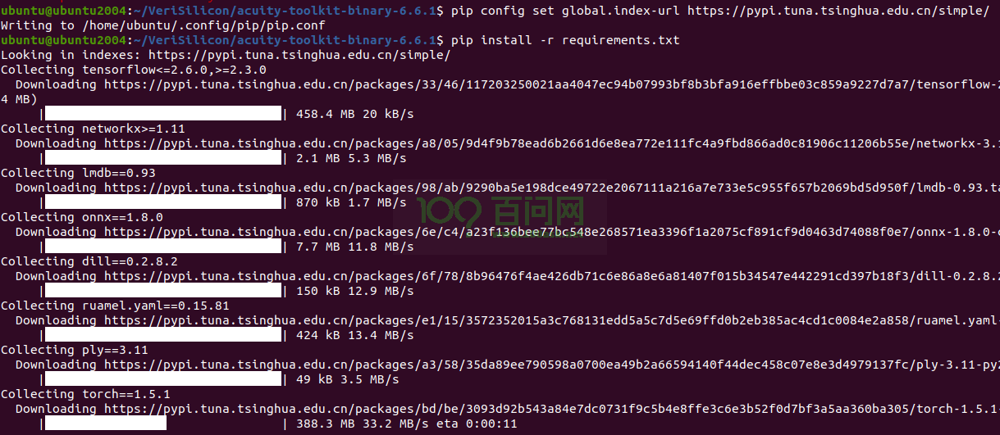

**FAQ**：

注意安装时如果提示：

```
RROR: launchpadlib 1.10.13 requires testresources, which is not installed.
```


需要手动安装`launchpadlib`

```
ubuntu@ubuntu2004:~/VeriSilicon/acuity-toolkit-binary-6.6.1$ pip install launchpadlib
```

安装完成后重新执行`pip install -r requirements.txt`即可。

### 2.2 配置路径

配置路径，使您可以再任意目录都可以使用。这里提供 2 种方法配置。

（1）使用命令配置

在`home`目录下，进入仿真工具IDE的安装路径`VeriSilicon`。

```
ubuntu@ubuntu2004:~$ cd VeriSilicon/
ubuntu@ubuntu2004:~/VeriSilicon$ pwd
/home/ubuntu/VeriSilicon
```

运行下面的命令一键设置。

```
export ACTU_BASE=$(ls | grep acu*) && \
    export ACTU_IDE_BASE=$(ls | grep *IDE*) && \
    echo -e "ACUITY_TOOLS_METHOD='$PWD/$ACTU_BASE'\nexport ACUITY_PATH='$PWD/$ACTU_BASE/bin/'\nexport VIV_SDK='$PWD/$ACTU_IDE_BASE/cmdtools'\nexport PATH=$PATH:$PWD/$ACTU_BASE/bin/:$PWD/$ACTU_IDE_BASE/ide/\nexport pegasus=$PWD/$ACTU_BASE/bin/pegasus\nalias pegasus=$PWD/$ACTU_BASE/bin/pegasus" >> ~/.bashrc && \
    source ~/.bashrc
```

（2）手动编辑配置

手动编辑 `~/.bashrc` ，配置下列内容。在终端中输入：

```
vi ~/.bashrc 
```

在文件的末尾，添加

`/home/ubuntu/VeriSilicon/` 修改为之前的安装路径。

```
ACUITY_TOOLS_METHOD='/home/ubuntu/VeriSilicon/acuity-toolkit-binary-6.6.1'
export ACUITY_PATH='/home/ubuntu/VeriSilicon/acuity-toolkit-binary-6.6.1/bin/'
export VIV_SDK='/home/ubuntu/VeriSilicon/VivanteIDE5.7.0/cmdtools'
export PATH=/usr/local/sbin:/usr/local/bin:/usr/sbin:/usr/bin:/sbin:/bin:/usr/games:/usr/local/games:/snap/bin:/home/ubuntu/VeriSilicon/acuity-toolkit-binary-6.6.1/bin/:/home/ubuntu/VeriSilicon/VivanteIDE5.7.0/ide/
export pegasus=/home/ubuntu/VeriSilicon/acuity-toolkit-binary-6.6.1/bin/pegasus
alias pegasus=/home/ubuntu/VeriSilicon/acuity-toolkit-binary-6.6.1/bin/pegasus
```

配置完成后 `.bashrc` 是这样的


配置完成后，保存并退出配置界面，在终端输入`source ~/.bashrc`，激活配置文件。

```
ubuntu@ubuntu2004:~$ source ~/.bashrc
```

至此模型转换工具就安装完成了，输入`pegasus help`命令，测试工具是否生效。

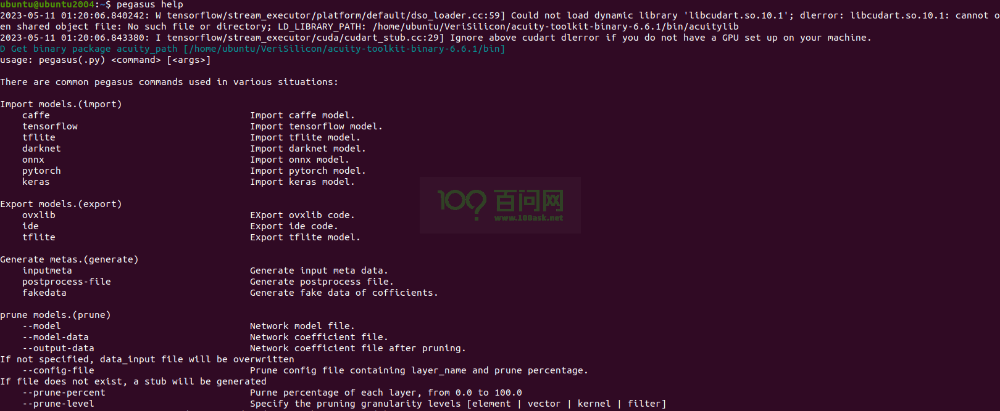