# 目标检测模型yolov3部署

## 0.前言

​	上一节我们已经学习了如何配置NPU模型转换工具，这一章节演示增加NPU拓展包，该拓展包包含`Lenet、YOLOV3`测试用例，并实现yolov3模型转换部署。


NPU拓展包下载地址：https://www.aw-ol.com/downloads?cat=18

全志官方NPU介绍：https://v853.docs.aw-ol.com/npu/dev_npu/

资源包：（包含模型结构描述文件`cfg`、权重文件`weights`和测试图像）


## 1.安装NPU拓展包

​	进入https://www.aw-ol.com/downloads?cat=18后，下载V853的NPU拓展包


将下载`V853 NPU扩展软件包.gz`重命名为`npu_package.tar.gz`，并将该拓展包放在Tina根目录下。如下所示：

```
book@100ask:~/workspaces/tina-v853-open$ ls
brandy  build  buildroot  build.sh  device  kernel  npu_package.tar.gz  openwrt  out  platform  prebuilt  tools
```

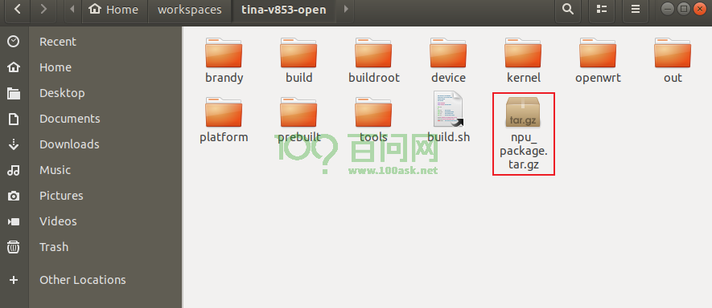

在终端中解压npu拓展压缩包

```
book@100ask:~/workspaces/tina-v853-open$ tar xvf npu_package.tar.gz openwrt/package/npu/
```

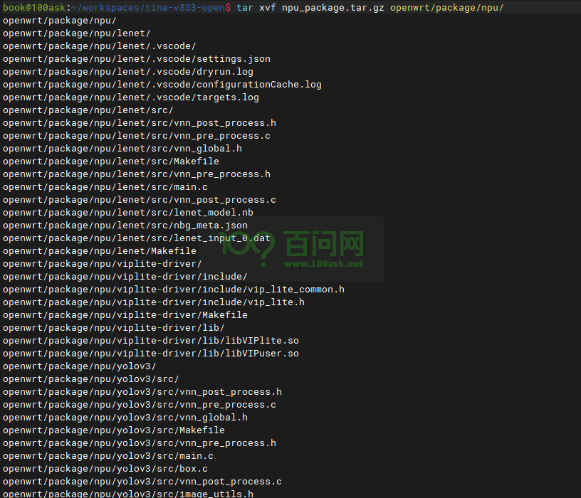

解压完成后，拓展包就自动安装到Tina的配置中。

## 2.配置yolov3

​	重新使能Tina环境配置，并加载选中100ASK_V853-PRO开发板方案。

```
book@100ask:~/workspaces/tina-v853-open$ source build/envsetup.sh 
...
book@100ask:~/workspaces/tina-v853-open$ lunch

You're building on Linux

Lunch menu... pick a combo:
     1  v853-100ask-tina
     2  v853-vision-tina
Which would you like? [Default v853-100ask]: 1 
...
```

进入Tina配置界面，输入

```
make menuconfig
```

进入如下目录：

```
> Allwinner 
	> NPU
		< > lenet......................................................... lenet demo (NEW)
		<*> viplite-driver................................... viplite driver for NPU  (NEW)
		< > vpm_run................................................ vpm model runner  (NEW)
		<*> yolov3....................................................... yolov3 demo (NEW)
		<*>   yolov3-model.............................. yolov3 test demo model (37 MB) 
```

选中`viplite-driver`和`yolov3`，如下图所示：

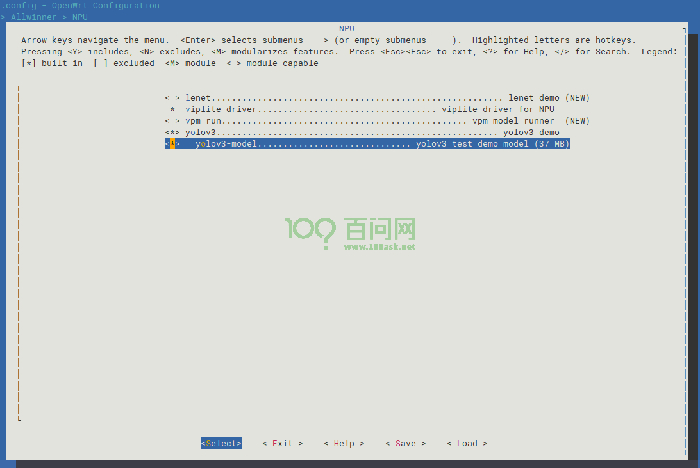

选中完成后，保存并退出Tina配置界面。

​	yolov3 Demo示例的源码位于：tina-v853-open/openwrt/package/npu/yolov3

```
book@100ask:~/workspaces/tina-v853-open/openwrt/package/npu/yolov3$ ls
Makefile  src
book@100ask:~/workspaces/tina-v853-open/openwrt/package/npu/yolov3$ tree
.
├── Makefile
└── src
    ├── bmp.h
    ├── box.c
    ├── box.h
    ├── image_utils.c
    ├── image_utils.h
    ├── main.c
    ├── Makefile
    ├── vnn_global.h
    ├── vnn_post_process.c
    ├── vnn_post_process.h
    ├── vnn_pre_process.c
    ├── vnn_pre_process.h
    ├── yolo_layer.c
    ├── yolo_layer.h
    ├── yolov3_model.nb
    └── yolo_v3_post_process.c

1 directory, 17 files
```

## 3.测试yolov3 Demo

测试前需要准备一张`416*416`格式的图像

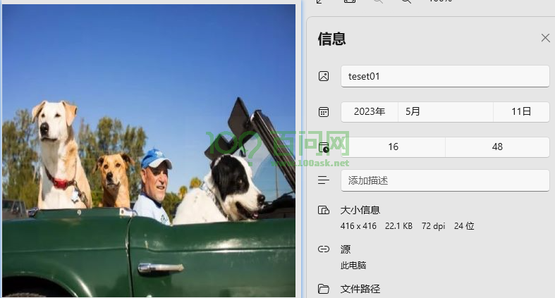

将图像使用ADB传入开发板中

```
book@100ask:~/workspaces/testImg$ adb push test01.jpg /tmp/
test01.jpg: 1 file pushed. 0.5 MB/s (22616 bytes in 0.048s)
```

进入串口终端后，进入`tmp`目录下

```
root@TinaLinux:~# cd /tmp/
root@TinaLinux:/tmp# ls
UNIX_WIFI.domain  lock              test01.jpg        wpa_ctrl_1067-2
lib               run               wpa_ctrl_1067-1
```

使用yolov3 Demo测试图像，输入

```
root@TinaLinux:/tmp# yolov3 /etc/models/yolov3_model.nb test01.jpg
```

输入完成后，测试程序会将test01.jpg图像作为输入，输出test01.jpg图像的打框图像。将文件使用TF卡等方式传入Windows中查看，如下图所示：

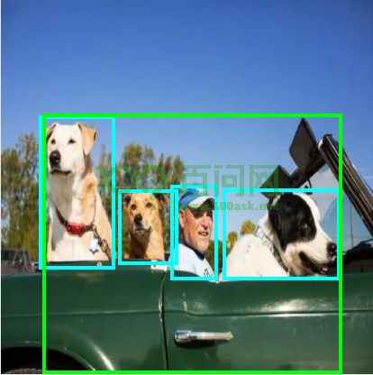

## 4.转换yolov3模型

### 4.1 模型准备

​	本次使用的网上下载的模型，后续将会使用字自训练生成的模型。我们使用的框架是 darknet，模型为 `YOLOv3-608`。 其训练的数据集是 `COCO trainval` 数据集，模型可以在这里下载到：https://pjreddie.com/darknet/yolo/

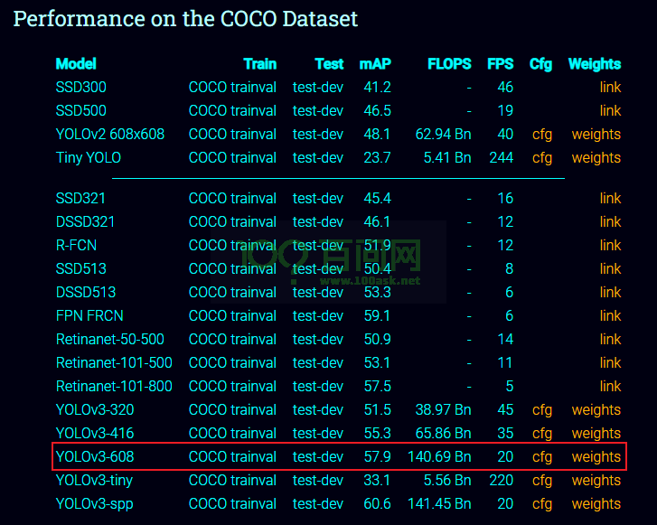

分别下载模型结构描述文件`cfg`和权重文件`weights`。如果下载不了，可以在source压缩包中的yolov3目录下找到对应文件。

​	将下载的两个文件传入配置好模型转换工具的Ubuntu20.04中，假设传入`/home/ubuntu/workspaces`目录下

```
ubuntu@ubuntu2004:~/workspaces$ ls
yolov3.cfg  yolov3.weights
```

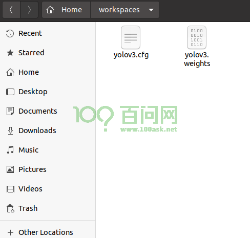

​	修改`yolov3.cfg`文件，将 `width` 与 `height` 改为 `416` 以获得更好的性能。

```
ubuntu@ubuntu2004:~/workspaces$ vi yolov3.cfg
```

将原本的模型宽度和高度608修改为416。

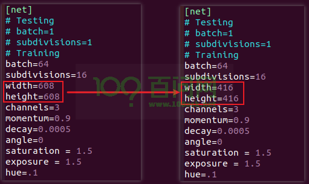

新建`data`文件夹，用于存放量化所需的图片。

```
ubuntu@ubuntu2004:~/workspaces$ mkdir data
```

新建`dataset.txt`文件，写入图片的路径和 id。

```
ubuntu@ubuntu2004:~/workspaces$ touch dataset.txt
```

假设我将两张量化图片放在`/home/ubuntu/workspaces/data`目录下，如下所示：


那么此时需要修改`/home/ubuntu/workspaces`目录下的`dataset.txt`文件,

```
ubuntu@ubuntu2004:~/workspaces$ vi dataset.txt
```

修改该文件的内容为：

```
./data/test01.jpg
./data/test02.jpg
```

下面为所有文件目录结构，可自行对比是否缺少对应文件。

```
ubuntu@ubuntu2004:~/workspaces$ tree
.
├── data
│   ├── test01.jpg
│   └── test02.jpg
├── dataset.txt
├── yolov3.cfg
└── yolov3.weights

1 directory, 5 files
```

### 4.2导入模型

​	在终端输入

```
buntu@ubuntu2004:~/workspaces$ pegasus import darknet --model yolov3.cfg --weights yolov3.weights --output-model yolov3.json --output-data yolov3.data
```

导入生成两个文件，分别是是 `yolov3.data` 和 `yolov3.json` 文件，他们是 YOLO V3 网络对应的芯原内部格式表示文件，分别对应原始模型文件的 `yolov3.weights` 和 `yolov3.cfg`

```
ubuntu@ubuntu2004:~/workspaces$ ls
data  dataset.txt  yolov3.cfg  yolov3.data  yolov3.json  yolov3.weights
```

### 4.3 创建 YML 文件

YML 文件对网络的输入和输出的超参数进行描述以及配置，这些参数包括，输入输出 tensor 的形状，归一化系数 (均值，零点)，图像格式，tensor 的输出格式，后处理方式等等

```
pegasus generate inputmeta --model yolov3.json --input-meta-output yolov3_inputmeta.yml

pegasus generate postprocess-file --model yolov3.json --postprocess-file-output yolov3_postprocessmeta.yml
```

执行后生成`yolov3_inputmeta.yml`和`yolov3_inputmeta.yml`，修改`yolov3_inputmeta.yml` 文件中的的 `scale` 参数为 `0.0039(1/255)`，目的是对输入 `tensor` 进行归一化，和网络进行训练的时候是对应的。

在终端输入

```
ubuntu@ubuntu2004:~/workspaces$ vi yolov3_inputmeta.yml 
```

将scale的参数从原来的1.0修改为0.0039，如下图所示：

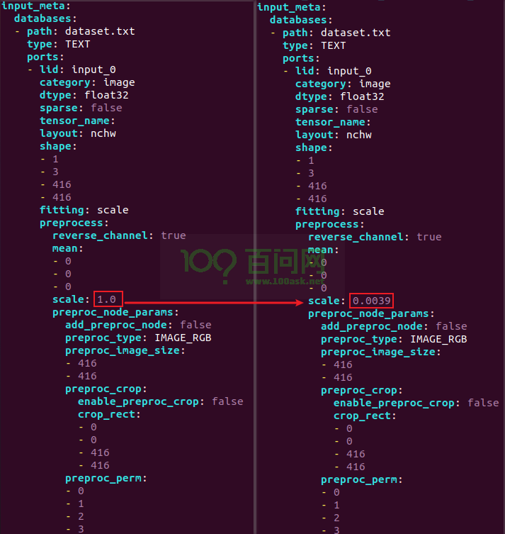


### 4.4量化

生成下量化表文件，使用非对称量化，uint8，修改 `--batch-size` 参数为你的 `dataset.txt` 里提供的图片数量。

```
pegasus quantize --model yolov3.json --model-data yolov3.data --batch-size 1 --device CPU --with-input-meta yolov3_inputmeta.yml --rebuild --model-quantize yolov3.quantize --quantizer asymmetric_affine --qtype uint8
```


### 4.5 预推理

利用前文的量化表执行预推理，得到推理 `tensor`，yolov3 是 1 输入 3 输出网络，所以一共产生了 4 个 `tensor`

```
pegasus inference --model yolov3.json --model-data yolov3.data --batch-size 1 --dtype quantized --model-quantize yolov3.quantize --device CPU --with-input-meta yolov3_inputmeta.yml --postprocess-file yolov3_postprocessmeta.yml
```


### 4.6 导出模板代码与模型

```
pegasus export ovxlib --model yolov3.json --model-data yolov3.data --dtype quantized --model-quantize yolov3.quantize --batch-size 1 --save-fused-graph --target-ide-project 'linux64' --with-input-meta yolov3_inputmeta.yml --output-path ovxilb/yolov3/yolov3prj --pack-nbg-unify --postprocess-file yolov3_postprocessmeta.yml --optimize "VIP9000PICO_PID0XEE" --viv-sdk ${VIV_SDK}
```

至此，模型转换完成，生成的模型存放在 `ovxilb/yolov3_nbg_unify` 文件夹内。

```
ubuntu@ubuntu2004:~/workspaces$ ls ovxilb/yolov3_nbg_unify/
BUILD   makefile.linux  network_binary.nb  vnn_post_process.c  vnn_pre_process.c  vnn_yolov3prj.c  yolov3prj.2012.vcxproj
main.c  nbg_meta.json   vnn_global.h       vnn_post_process.h  vnn_pre_process.h  vnn_yolov3prj.h  yolov3prj.vcxproj
```

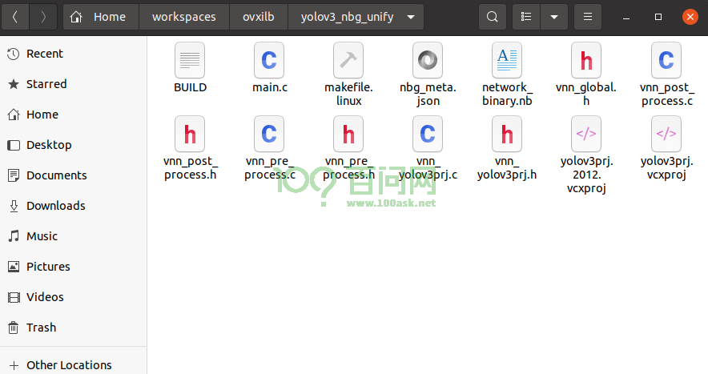

## 5.使用转换后的模型测试

​	将模型通过adb或者TF卡的方式传入开发板中，例如通过ADB的方式：

```
ubuntu@ubuntu2004:~/workspaces/ovxilb/yolov3_nbg_unify$ adb push network_binary.nb /tmp/
network_binary.nb: 1 file pushed. 0.8 MB/s (39056704 bytes in 43.893s)
```

​	传入测试图片，可使用adb或者TF卡的方式传入开发板中，例如通过ADB的方式：

```
buntu@ubuntu2004:~/workspaces/data$ adb push test01.jpg /tmp/
test01.jpg: 1 file pushed. 0.6 MB/s (27095 bytes in 0.041s)
ubuntu@ubuntu2004:~/workspaces/data$ adb push test02.jpg 
adb: usage: push requires an argument
ubuntu@ubuntu2004:~/workspaces/data$ adb push test02.jpg /tmp/
test02.jpg: 1 file pushed. 0.7 MB/s (30697 bytes in 0.041s)
```

传入完成后，进入开发板的串口终端，进入`/tmp/`目录下，即可看到传入的文件

```
root@TinaLinux:~# cd /tmp/
root@TinaLinux:/tmp# ls
lock                test01.jpg          wpa_ctrl_1067-2
UNIX_WIFI.domain    network_binary.nb   test02.jpg          
lib                 run                 wpa_ctrl_1067-1
```

测试`test01.jpg`，输入

```
root@TinaLinux:/tmp# yolov3 ./network_binary.nb test01.jpg 
[0xb6f0c560]vip_init[104], [ 1374.785733] npu[4ca][4ca] vipcore, device init..

The version of Viplite is: 1.8[ 1374.793243] set_vip_power_clk ON
.0-0-AW-2022-04-21
[ 1374.801777] enter aw vip mem alloc size 83886080
[ 1374.811007] aw_vip_mem_alloc vir 0xe2c00000, phy 0x48800000
[ 1374.817350] npu[4ca][4ca] gckvip_drv_init  kernel logical phy address=0x48800000  virtual =0xe2c00000
Create Neural Network: 73.30ms or 73297.75us
Start run graph [1] times...
Run the 1 time: 201.00ms or 200999.30us
vip run network execution time:
Total   201.15ms or 201152.98us
Average 201.15ms or 201152.98us
data_format=2 buff_size=43095
data_format=2 buff_size=172380
data_format=2 buff_size=689520
dog  97% 168 394 27 396
cat  95% 8 209 153 408
[ 1375.455490] npu[4ca][4ca] gckvip_drv_exit, aw_vip_mem_free
[ 1375.461792] aw_vip_mem_free vir 0xe2c00000, phy 0x48800000
[ 1375.467981] aw_vip_mem_free dma_unmap_sg_atrs
[ 1375.473057] aw_vip_mem_free ion_unmap_kernel
[ 1375.479885] aw_vip_mem_free ion_free
[ 1375.484023] aw_vip_mem_free ion_client_destroy
[ 1375.494199] npu[4ca][4ca] vipcore, device un-init..
```

测试完将输出的打框图像传入TF卡中

```
root@TinaLinux:/tmp# mount /dev/mmcblk1p1 /mnt/extsd/
root@TinaLinux:/tmp# cp yolo_v3_output.bmp /mnt/extsd/yolo_v3_output-test01.bmp
```


测试`test02.jpg`，输入

```
root@TinaLinux:/tmp# yolov3 ./network_binary.nb test02.jpg 
[0xb6f9d560]vip_init[104], [ 1541.123871] npu[4d3][4d3] vipcore, device init..

The version of Viplite is: 1.8[ 1541.131453] set_vip_power_clk ON
.0-0-AW-2022-04-21
[ 1541.139871] enter aw vip mem alloc size 83886080
[ 1541.148078] aw_vip_mem_alloc vir 0xe2c00000, phy 0x48800000
[ 1541.154367] npu[4d3][4d3] gckvip_drv_init  kernel logical phy address=0x48800000  virtual =0xe2c00000
Create Neural Network: 73.51ms or 73514.38us
Start run graph [1] times...
Run the 1 time: 201.01ms or 201008.95us
vip run network execution time:
Total   201.16ms or 201164.50us
Average 201.16ms or 201164.50us
data_format=2 buff_size=43095
data_format=2 buff_size=172380
data_format=2 buff_size=689520
motorbike  99% 86 313 150 405
person  100% 117 294 0 366
[ 1541.793857] npu[4d3][4d3] gckvip_drv_exit, aw_vip_mem_free
[ 1541.800091] aw_vip_mem_free vir 0xe2c00000, phy 0x48800000
[ 1541.806330] aw_vip_mem_free dma_unmap_sg_atrs
[ 1541.811397] aw_vip_mem_free ion_unmap_kernel
[ 1541.818379] aw_vip_mem_free ion_free
[ 1541.822433] aw_vip_mem_free ion_client_destroy
[ 1541.836550] npu[4d3][4d3] vipcore, device un-init..
```

测试完将输出的打框图像传入TF卡中

```
root@TinaLinux:/tmp# cp yolo_v3_output.bmp /mnt/extsd/yolo_v3_output-test02.bmp
```

使用电脑端查看TF中的两张输出图像如下所示：

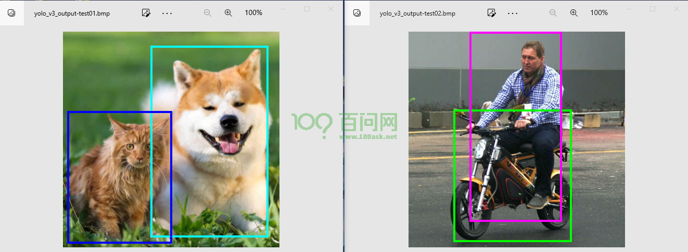