# AnaConda安装指南

安装AnaConda，进入AnaConda的官网[https://www.anaconda.com/ 13](https://www.anaconda.com/)
下载AnaConda安装包，点击Download下载并进行开发。


下载完成后双击打开安装包，点击Next进入下一步。
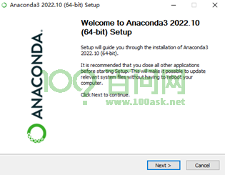

同意许可说明，选择I Agree。
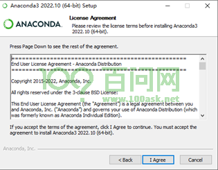

选择All Users，并Next。选择All Users防止后续安装环境出现权限不足的问题。

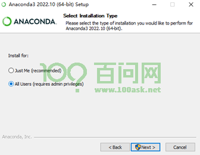

点击Browse选择安装位置，我这里选择默认位置，点击Next
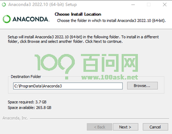

选择选项2，安装在其他项目中，不安装进系统中，防止后续出现问题。点击Install。
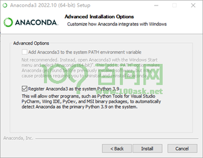

等待安装完成。
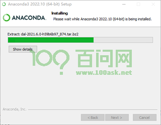


安装完成后，点击Next
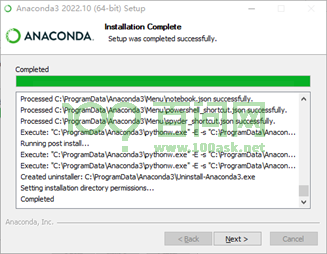

点击Next
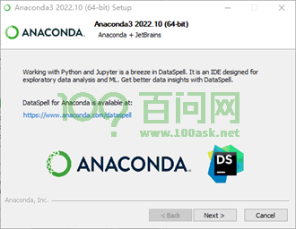

取消勾选，点击Finish。
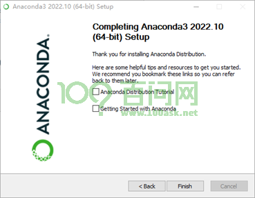

配置环境变量，打开高级系统设置，点击环境变量
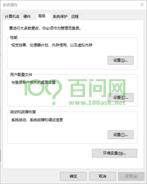

选择系统环境变量中的Path,点击编辑。
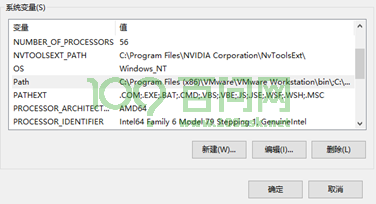

根据安装目录的路径，在Path环境变量中增加以下三条路径，点击确定。
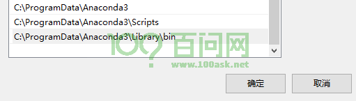

点击确定
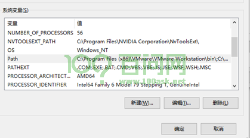

点击确定
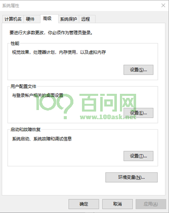

测试conda环境，按下win+R，输入cmd 回车，进入命令行模式。如下所示，测试conda环境配置。

```rust
C:\Users\100askTeam>conda --version
conda 22.9.0

C:\Users\100askTeam>conda info

     active environment : None
       user config file : C:\Users\100askTeam\.condarc
 populated config files : C:\Users\100askTeam\.condarc
          conda version : 22.9.0
    conda-build version : 3.22.0
         python version : 3.9.13.final.0
       virtual packages : __cuda=12.0=0
                          __win=0=0
                          __archspec=1=x86_64
       base environment : C:\ProgramData\Anaconda3  (read only)
      conda av data dir : C:\ProgramData\Anaconda3\etc\conda
  conda av metadata url : None
           channel URLs : https://mirrors.tuna.tsinghua.edu.cn/anaconda/cloud/pytorch/win-64
                          https://mirrors.tuna.tsinghua.edu.cn/anaconda/cloud/pytorch/noarch
                          https://mirrors.tuna.tsinghua.edu.cn/anaconda/pkgs/main/win-64
                          https://mirrors.tuna.tsinghua.edu.cn/anaconda/pkgs/main/noarch
                          https://mirrors.tuna.tsinghua.edu.cn/anaconda/pkgs/free/win-64
                          https://mirrors.tuna.tsinghua.edu.cn/anaconda/pkgs/free/noarch
                          https://repo.anaconda.com/pkgs/main/win-64
                          https://repo.anaconda.com/pkgs/main/noarch
```