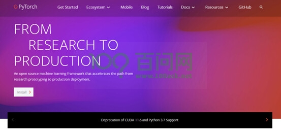
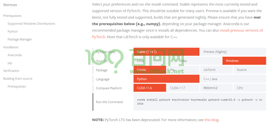
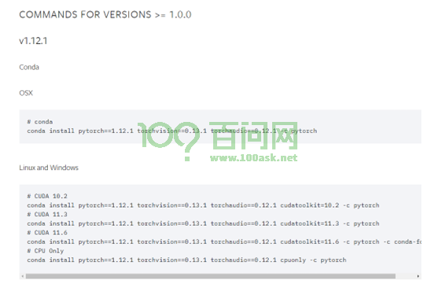

# Pytorch框架搭建

安装Pytorch。打开AnaConda终端Anaconda Prompt (Anaconda3)，进入终端后在命令行中输入`conda create -n pytorch python=3.8`即：

```csharp
(base) C:\Users\100askTeam>conda create -n pytorch python=3.8
```

等待conda帮助我们配置好python3.8的环境，配置完成后会输出如下命令：

```bash
done
#
# To activate this environment, use
#
#     $ conda activate pytorch
#
# To deactivate an active environment, use
#
#     $ conda deactivate

Retrieving notices: ...working... done
```

可以根据上面的命令去操作我们创建的环境，激活创建的环境使用conda activate pytorch，退出当前环境输入conda deactivate。我们现在先激活pytorch环境。

```csharp
(base) C:\Users\100askTeam>conda activate pytorch
(pytorch) C:\Users\100askTeam>
```

可以看到前面括号内已经变成了pytorch，说明此时我们使用的环境变成了刚刚我们创建的python3.8了。
安装pytorch，进入官网 [https://pytorch.org/ 8](https://pytorch.org/)
点击install。



进入安装界面，根据自己的配置选择安装，我这里按默认选择安装。Pytorch版本选择1.13.1，windows操作系统上安装，使用conda管理包，使用python作为语言环境，使用CUDA11.6通用并行计算架构。



注意：
1.对于没有显卡的设备可以选择使用CPU。
2.操作系统可以根据根据自己的系统选择
3.对于包管理，windows系统下尽量选择conda，linux下尽量选择pip。

完成后会在下面获得一个命令行，将命令行复制到conda终端执行即可。但我这里选择安装旧版的CUDA,点击install previous version of Pytorch。



选择安装CUDA11.3的配置

```makefile
(pytorch)C:\Users\100askTeam>conda install pytorch==1.12.1 torchvision==0.13.1 torchaudio==0.12.1 cudatoolkit=11.3 -c pytorch
```

执行完后等待环境配置安装完成。安装完成后测试是否可以导入torch模块。输入python进入python环境变量。

```python
(pytorch) C:\Users\100askTeam>python
Python 3.8.16 (default, Jan 17 2023, 22:25:28) [MSC v.1916 64 bit (AMD64)] :: Anaconda, Inc. on win32
Type "help", "copyright", "credits" or "license" for more information.
>>> import torch
>>> torch.cuda.is_available()
True
>>> x = torch.rand(5, 3)
>>> print(x)
tensor([[0.8340, 0.7938, 0.1156],
        [0.2469, 0.7756, 0.2502],
        [0.3953, 0.1375, 0.5440],
        [0.1007, 0.6544, 0.2416],
        [0.8846, 0.5376, 0.8914]])
>>> exit()
```

输入 torch.cuda.is_available()测试后输出True，且可以创建随机初始化的Tensor,0-1之间，即为安装pytorch成功。