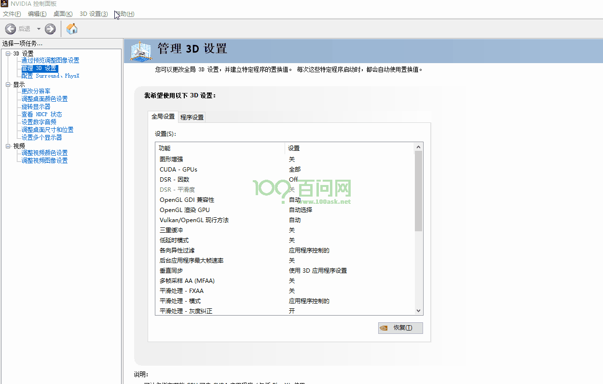
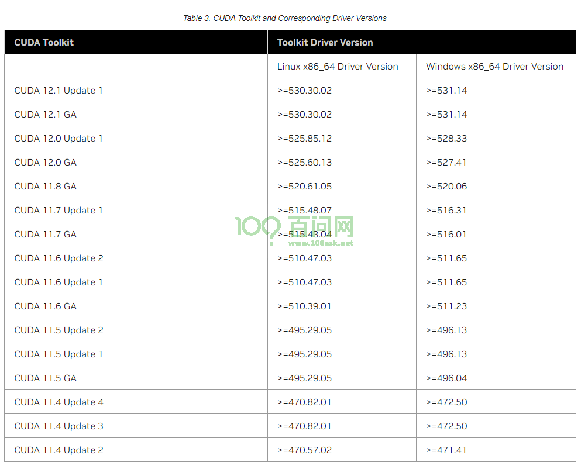
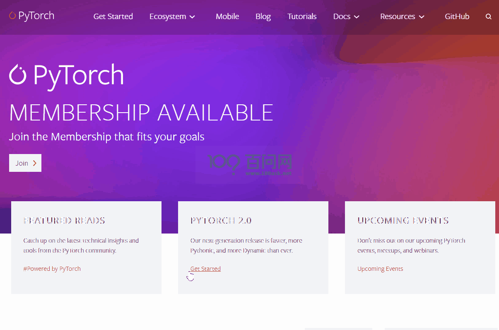
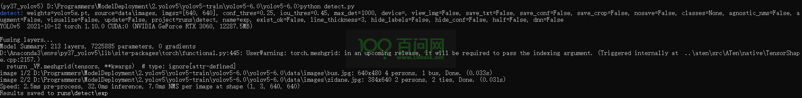
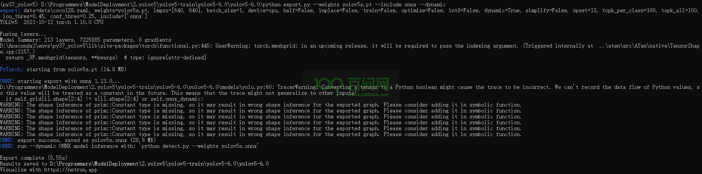
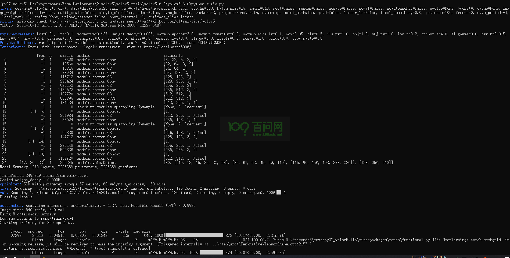

# 搭建YOLOV5-V6.0环境

## 0.前言

​	本章节主要记录如何搭建yolov5-v6.0环境，并支持CUDA加速。此文章的硬件要求如下，如果您的电脑没有显卡设备，这篇文章无法给您当做参考。

**硬件与软件列表：**

- CPU：Intel(R) Xeon(R) CPU E5-2680 v4 @ 2.40GHz   2.40 GHz 

- 显卡：RTX 3060

- 系统：Windows 10 专业工作站版


## 1.搭建Python环境

打开Conda终端，创建Python3.7的Conda环境，输入

```
conda create -n py37_yolov5 python=3.7
```

创建完成后，需要安装pytorch。

## 2.安装Pytorch和cuda

两者的安装顺序没有要求，但都有版本要求。简而言之：两者版本需要对应，一个高版本和一个低版本会导致CUDA无法使用。

需要查了显卡驱动版本，查看方式如下：



查看CUDA驱动适用版本:[CUDA驱动适配版本](https://docs.nvidia.com/cuda/cuda-toolkit-release-notes/index.html),查看表格3:[CUDA工具包和相应的驱动程序版本](https://docs.nvidia.com/cuda/cuda-toolkit-release-notes/index.html#id4)



如果客户的驱动版本过低，更新显卡驱动即可升级，更新方法可在网上自行搜索。


下面我安装CUDA11.3版本的，以满足更多客户的需要。

进入pytorch网址：[https://pytorch.org/](https://pytorch.org/)，下载之前版本的pytorch。下载步骤如下：



将复制出来的命令，粘贴至终端输入：

```
conda install pytorch==1.10.0 torchvision==0.11.0 torchaudio==0.10.0 cudatoolkit=11.3 -c pytorch -c conda-forge
```


测试安装的pytorch是否可用

在Conda终端输入`python`后，加载torch模块，打印cuda是否可用。

```
(py37_yolov5) D:\Programmers\ModelDeployment\2.yolov5\yolov5-train\yolov5-6.0\yolov5-6.0>python
Python 3.7.16 (default, Jan 17 2023, 16:06:28) [MSC v.1916 64 bit (AMD64)] :: Anaconda, Inc. on win32
Type "help", "copyright", "credits" or "license" for more information.
>>> import torch
>>> torch.cuda.is_available()
True
```

## 3.安装YOLOV5-V6.0版本依赖包

安装前，查看已经安装的依赖包，输入`pip list`

```
(py37_yolov5) D:\Programmers\ModelDeployment\2.yolov5\yolov5-train\yolov5-6.0\yolov5-6.0>pip list
Package           Version
----------------- --------
certifi           2023.5.7
cycler            0.11.0
fonttools         4.38.0
kiwisolver        1.4.4
numpy             1.21.6
packaging         23.1
Pillow            9.2.0
pip               22.3.1
pyparsing         3.1.0
python-dateutil   2.8.2
setuptools        65.6.3
six               1.16.0
torch             1.10.0
torchaudio        0.10.0
torchvision       0.11.0
typing_extensions 4.6.3
wheel             0.38.4
wincertstore      0.2
```

查看源码目录中的依赖文件`requirements.txt`可知，这里我不建议直接输入`pip install -r requirements.txt`

```
# pip install -r requirements.txt

# Base ----------------------------------------
matplotlib>=3.2.2
numpy>=1.18.5
opencv-python>=4.1.2
Pillow>=7.1.2
PyYAML>=5.3.1
requests>=2.23.0
scipy>=1.4.1
torch>=1.7.0
torchvision>=0.8.1
tqdm>=4.41.0

# Logging -------------------------------------
tensorboard>=2.4.1
# wandb

# Plotting ------------------------------------
pandas>=1.1.4
seaborn>=0.11.0

# Export --------------------------------------
# coremltools>=4.1  # CoreML export
# onnx>=1.9.0  # ONNX export
# onnx-simplifier>=0.3.6  # ONNX simplifier
# scikit-learn==0.19.2  # CoreML quantization
# tensorflow>=2.4.1  # TFLite export
# tensorflowjs>=3.9.0  # TF.js export

# Extras --------------------------------------
# albumentations>=1.0.3
# Cython  # for pycocotools https://github.com/cocodataset/cocoapi/issues/172
# pycocotools>=2.0  # COCO mAP
# roboflow
thop  # FLOPs computation
```


这里我建议在Conda命令中单独安装所需的依赖，查漏补缺，缺少了哪个依赖包就补充哪一个即可。

```
pip install opencv-python==4.7.0.68 -i https://pypi.doubanio.com/simple/
pip install matplotlib==3.5.3 -i https://pypi.doubanio.com/simple/
pip install PyYAML==6.0 -i https://pypi.doubanio.com/simple/
pip install requests==2.28.2 -i https://pypi.doubanio.com/simple/
pip install tqdm==4.64.1 -i https://pypi.doubanio.com/simple/
pip install tensorboard==2.11.2 -i https://pypi.doubanio.com/simple/
pip install pandas==1.1.5 -i https://pypi.doubanio.com/simple/
pip install seaborn==0.12.2 -i https://pypi.doubanio.com/simple/
pip install coremltools==4.1 -i https://pypi.doubanio.com/simple/
pip install onnx==1.13.0 -i https://pypi.doubanio.com/simple/
pip install onnxsim==0.4.13 -i https://pypi.doubanio.com/simple/
pip install scikit-learn==0.19.2 -i https://pypi.doubanio.com/simple/
```

安装完成后，查看依赖包列表如下所示：

```
Package                 Version
----------------------- --------
absl-py                 1.4.0
attr                    0.3.2
attrs                   23.1.0
cachetools              5.3.0
certifi                 2023.5.7
charset-normalizer      3.1.0
colorama                0.4.6
coremltools             4.1
cycler                  0.11.0
fonttools               4.38.0
google-auth             2.20.0
google-auth-oauthlib    0.4.6
grpcio                  1.56.0
idna                    3.4
importlib-metadata      6.6.0
kiwisolver              1.4.4
Markdown                3.4.3
markdown-it-py          2.2.0
MarkupSafe              2.1.2
matplotlib              3.5.3
mdurl                   0.1.2
mpmath                  1.3.0
numpy                   1.19.5
oauthlib                3.2.2
onnx                    1.13.0
onnxsim                 0.4.13
opencv-python           4.7.0.68
packaging               23.1
pandas                  1.1.5
Pillow                  9.2.0
pip                     22.3.1
protobuf                3.20.3
pyasn1                  0.5.0
pyasn1-modules          0.3.0
Pygments                2.15.1
pyparsing               3.1.0
python-dateutil         2.8.2
pytz                    2023.3
PyYAML                  6.0
requests                2.28.2
requests-oauthlib       1.3.1
rich                    13.3.5
rsa                     4.9
scikit-learn            0.19.2
scipy                   1.7.3
seaborn                 0.12.2
setuptools              65.6.3
six                     1.16.0
sympy                   1.10.1
tensorboard             2.11.2
tensorboard-data-server 0.6.1
tensorboard-plugin-wit  1.8.1
torch                   1.10.0
torchaudio              0.10.0
torchvision             0.11.0
tqdm                    4.64.1
typing_extensions       4.6.3
urllib3                 1.26.15
Werkzeug                2.2.3
wheel                   0.38.4
wincertstore            0.2
zipp                    3.15.0
```

## 4.测试YOLOV5环境

### 4.1 测试检测模型

进入YOLOV5源码目录后，输入`python detect.py `



可以看到已经可以检测出CUDA显卡设备号0。

```
YOLOv5  2021-10-12 torch 1.10.0 CUDA:0 (NVIDIA GeForce RTX 3060, 12287.5MB)
```

### 4.2 测试导出模型

在终端输入

```
python export.py --weights yolov5s.pt --include onnx --dynamic
```




### 4.3 测试训练模型

在终端输入

```
python train.py
```


