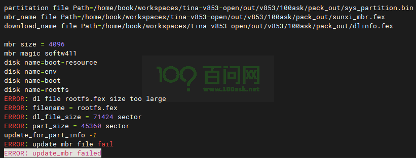
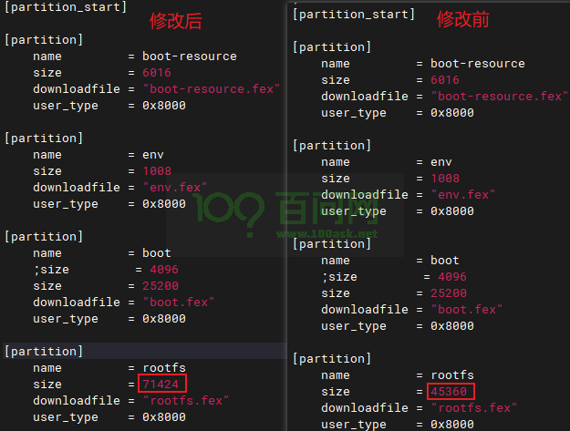

# 问题1

## pack时报错提示ERROR: update_mbr failed

**原因**：在文件系统中增加了一些包，导致文件系统变大，原本设置的文件系统大小太小

**现象**：make编译完成后，pack打包生成镜像时会报错

```makefile
ERROR: dl file rootfs.fex size too large
ERROR: filename = rootfs.fex 
ERROR: dl_file_size = 71424 sector
ERROR: part_size = 45360 sector
update_for_part_info -1
ERROR: update mbr file fail
ERROR: update_mbr failed
```

如下图所示：

[

**解决办法**：
1、进入`tina-v853-open/device/config/chips/v853/configs/100ask/linux-4.9`目录下

```ruby
book@100ask:~/workspaces/tina-v853-open$ cd device/config/chips/v853/configs/100ask/linux-4.9/
```

2、修改`sys_partition.fex`文件

```ruby
book@100ask:~/workspaces/tina-v853-open/device/config/chips/v853/configs/100ask/linux-4.9$ vi sys_partition.fex
```

3.修改`rootfs`的大小为报错提示的`dl_file_size`的大小

```ini
[partition]
    name         = rootfs
    size         = 71424
    downloadfile = "rootfs.fex"
    user_type    = 0x8000
```



4.修改完成后重新返回Tina根目录，重新执行`pack`即可。