# 百问网Avaota F2核心板

## 简介

百问网的 **AvaotaF2 V861 开发套件** 采用 Pico 尺寸设计，紧凑且功能强大，支持标准 2.54 排针接口，方便与面包板连接，进行 DIY 实验。其超薄双面设计令其尺寸仅与 1 元硬币相当，集成了 V861 所有核心功能，极大地提升了开发灵活性与可扩展性。

这款开发套件具备多种强大特性：

- **板载 MIPI CSI 4Lane/2Lane摄像头接口**，支持高清图像采集。
- **SPI NOR FLASH（16MB）**，提供充足的存储空间。
- **AXP333电源管理芯片**，提供VCC\DRAM\DCDC电源。
- **TF 卡卡座**，方便数据存储和扩展。
- **MIC 拾音接口和SPK喇叭接口**，便于音频采集和音频播放。
- **烧录按键**，简化固件烧录操作。
- **POWON按键**，电源管理芯片的按键。
- 丰富的 **GPIO 资源**，可灵活配置和控制外部硬件设备。
- 硬件**没有使用PMC**功能。

该开发套件支持最新的 **Tina Linux 5.0 系统**，可直接在 V861 AvaotaF2 上进行开发。除此之外，还支持多种配件：

- **MIPI 摄像头 GC2083**，提供高质量图像采集。
- **SPI 屏幕**：包括 3.5 寸 320x480 分辨率显示屏和 1.54 寸 240x240 分辨率显示屏，适应多样的显示需求。

AvaotaF2 V861 开发套件集成了丰富的功能，操作简便且便于拓展，是进行嵌入式开发与实验的理想选择。

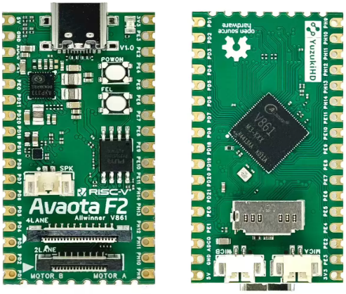

## 核心板参数

| 项目     | 参数                                               |
| -------- | -------------------------------------------------- |
| 主控     | 全志V861 M3-XXX                                    |
| PMU      | 集成电源芯片AXP333                                 |
| DDR      | Internal 128MB DDR3                                |
| Memory   | Nor Flash 128MB（PY25Q256）                        |
| 摄像头   | 单目 1920x1080@30fps                               |
| 屏幕     | 3.5寸（320*480）SPI 屏                             |
| 麦克风   | 麦克风接口*2                                       |
| 按键     | FEL烧录                                            |
| 按键     | POWON烧录                                          |
| 灯       | LED * 1                                            |
| Debug    | 支持uart串口调试，支持ADB USB调试                  |
| USB      | Type-C USB * 1, 同时支持供电和数据传输以及串口输出 |
| GPIO     | 引出双盘排针30Pin 支持多达30个GPIO信号             |
| 板身尺寸 | 长44mm*宽24mm                                      |
| 板层     | 6层板                                              |

## 核心板接口功能示意

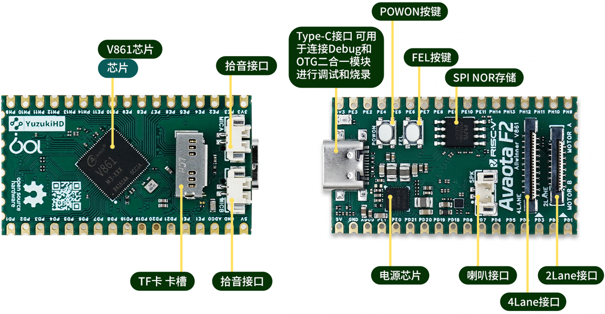


## 核心板使用入门

### 串口调试

核心板支持接出两路调试串口，分别为 RISC-V CPU Linux 核心串口 UART0，波特率均为 115200。

核心板调试串口有两种接入方式：

- 使用 USB 拆分器接入串口：仅接出常用的 CPU 核心串口 UART0
- 使用 GPIO 接入串口：支持接出 CPU 核心串口 UART0

**使用 USB 拆分器接入串口**

核心板设计之时复用了 TypeC 中的 SBU 信号线用于传输串口信号，这个串口是 UART0。使用USB分线器连接串口和USB数据线，接入方法如下：

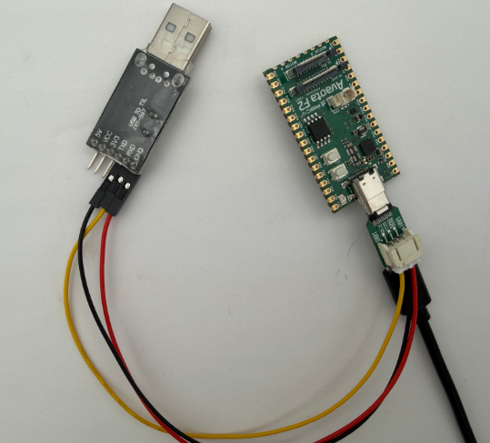

**使用 GPIO 接入串口**

核心板串口位于 PL 口，如下图所示，需要焊接或者排针接出。其中绿色的是 RISC-V MCU 核心串口，蓝色的是 RISC-V CPU 串口。

待补充...

串口线打开电脑的设备管理器，确认串口号，例如这里是 COM5。

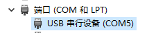

硬件连接完成后，使用串口终端访问，波特率 `115200` 。例如这里使用的 `PuTTY`

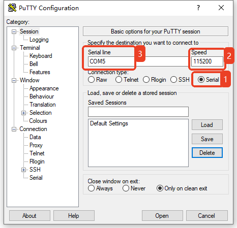

如果是刷入固件的核心板，上电后即可看到启动日志与控制台

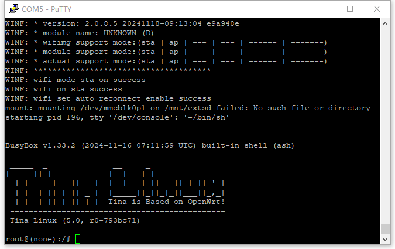

### ADB 调试

在电脑上安装 ADB，打开 CMD 使用 `adb shell` 进入终端。

（1） 在 [全志开发者社区-资料下载 专区 ](https://www.aw-ol.com/downloads?cat=5)下载 ADB 工具 `ADB(tab自动补全版)` （2）下载后解压放到本地磁盘下（例如D盘的adb文件夹里）

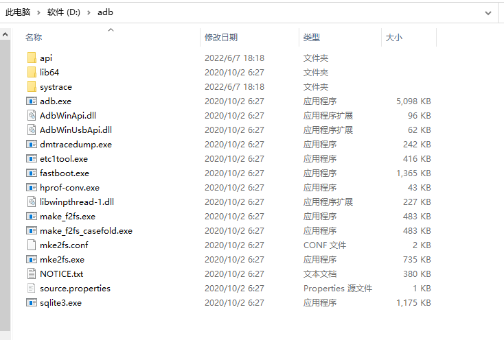

（3） 右键 ”此电脑“，属性，找到高级系统设置，点击环境变量，xxx用户的环境变量，Path，新增一个环境变量。

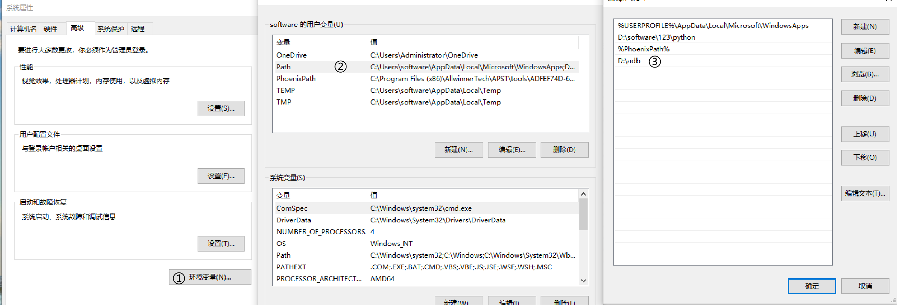

（4） 打开命令提示符，输入 `adb shell`

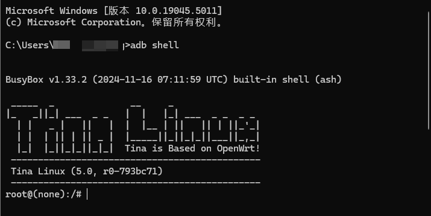

ADB 也可以作为文件传输使用，例如：

- 将 sample.mp4 上传到核心板 /mnt/UDISK 目录内

```
C:\System> adb push sample.mp4 /mnt/UDISK
```

- 将 /mnt/UDISK/sample.mp4 下拉到当前目录内

```text
C:\System> adb pull /mnt/UDISK/sample.mp4
```

### 重启

在核心板终端 Linux 命令行中输入 `reboot` 即可重启

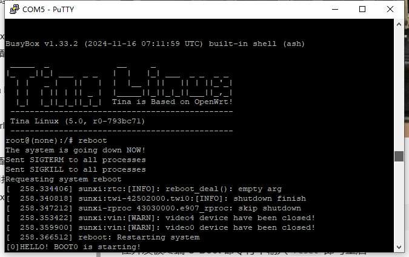

在核心板终端 U-Boot 命令行中输入 `reset` 即可重启

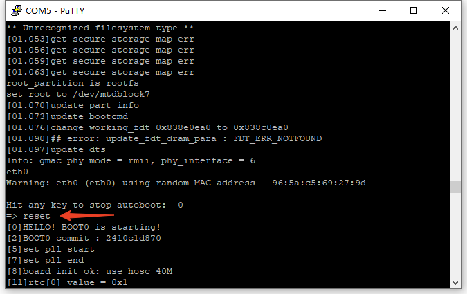

## 烧录

USB烧录采用全志发布的PhoenixSuit工具作为USB烧写工具，如图所示：

PhonenixSutit工具图示

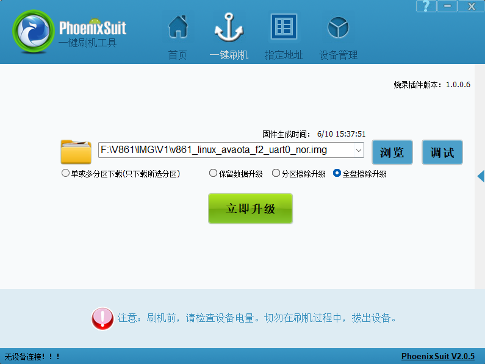

打开软件后选择一键刷机，点击浏览选择对应要烧写的.img固件。

接下来在核心板找到按键 `FEL`，断开USB，电源。

（1）按住 `FEL` 按键

（2）插入 USB 线

（3）等待电脑连接成功，松开 `FEL` 按键即可进入烧录模式。

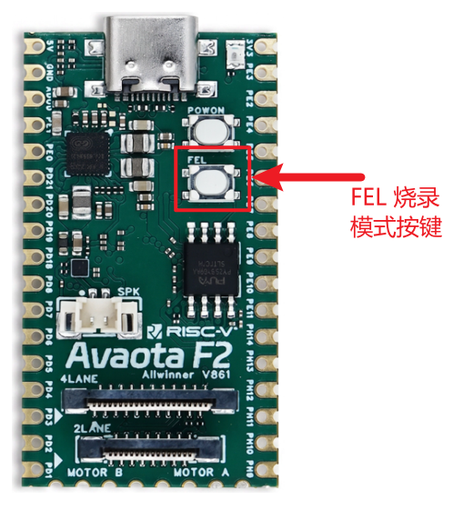

等待硬件进入烧录模式后，电脑工具界面出现烧录进度条，等待进度条结束即可烧写成功，烧写过程中可接着串口查看烧写过程打印。
