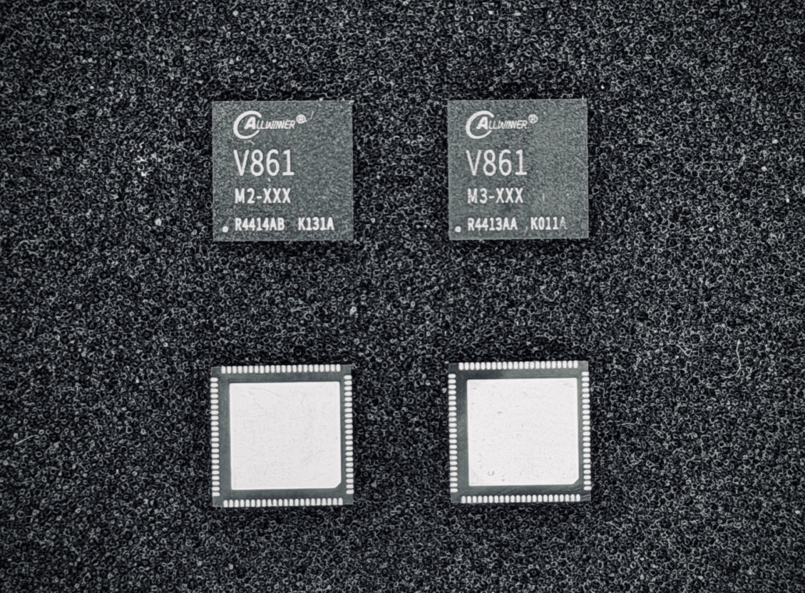
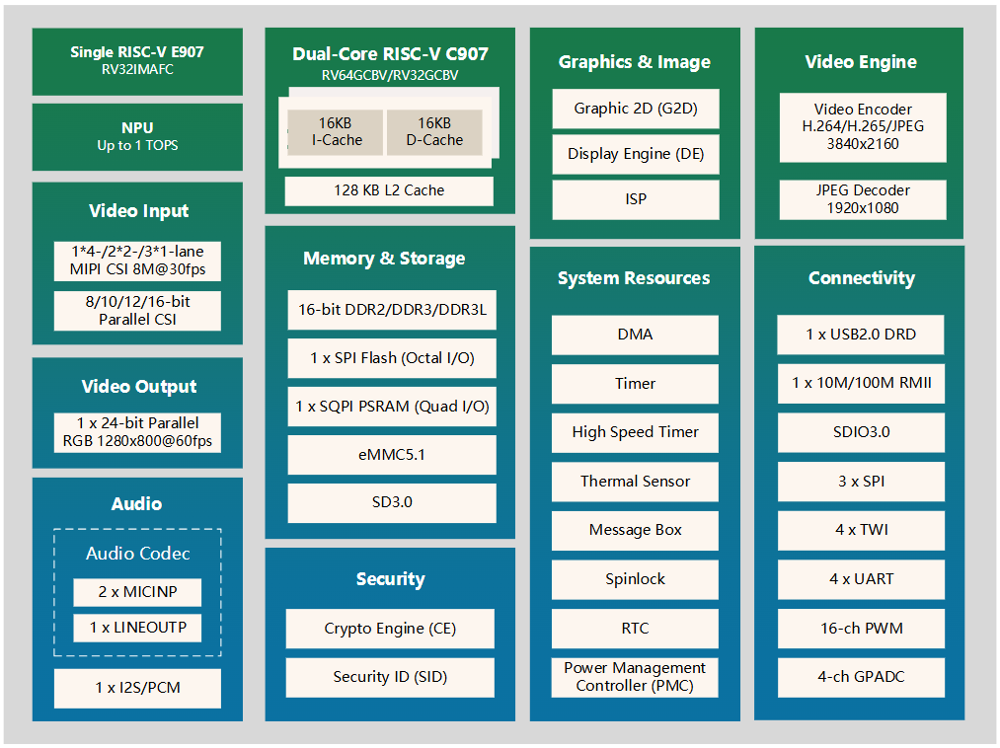
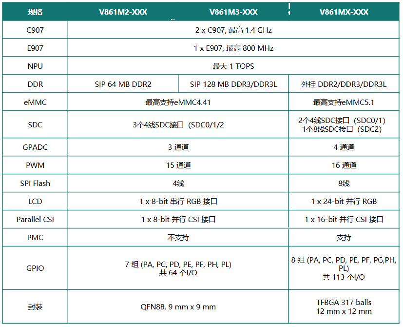

# V861 - 高性能 AI-IPC 处理器

V861 是一款高性能网络摄像机处理器，全新升级 AI-ISP 图像处理单元和 H.264/H.265 编码器提供 **6MP** 高清视频处理能力，支持三路 Camera 直接接入。双核CPU和更高性能 MCU 提供更高通用算力，可以和 NPU 协同扩展更多音视算法、满足流畅解码需求并带来更好系统启动性能。基于通用算力、专用算力、智能编码升级，V861 更好支撑 4G 高清 IPC、高清 AI-ISP 和 AOV 等典型 IPC 方案。

:::info

:::note

信息

:::
:::note

V861系列芯片有多个不同规格子型号，本页面中介绍为 V861M3-XXX，其它子型号规格略有不同，具体以规格书为准

:::

:::

## 芯片亮点

-   **AI 画质升级**：AI-ISP 2.0，支持全天候 AI 画质，并支持 64MB 低内存下 AI-ISP 方案。
-   **实时三目**：芯片支持三目直接接入，方案支持可扩展四目等更多视角的一机多目产品。
-   **低功耗方案**：支持 1$\times$4M 和 2$\times$2M AI-ISP+AOV 方案，可应用于太阳能电池机；支持毫秒级冷启 AI-ISP，可应用于门铃等室内机。
-   **AI算法配套**：支持人车宠等检测识别类算法和 AI-SR、AI-NR、AI-Remosaic 等 AI 画质算法。
-   **外围配套**：配套 MPPT 协议太阳能快充 PMU 和低功耗 Wi-Fi MCU。

## 芯片规格

**处理器内核**

-   双核 RISC-V C907, 时钟速率最高 1.4 GHz
    -   每核 16 KB I-Cache 和 16 KB D-Cache
    -   支持 128 KB L2 Cache
    -   RV32GCBV / RV64GCBV 指令集
    -   所有核心都集成了具有 RISC-V H/F/D 精度的浮点运算单元（FPU）
    -   集成 128 位向量单元，支持 RVV1.0。
-   支持单核 RISC-V E907 MCU, 时钟速率最高 800 MHz
    -   RV32IMAFC 指令集

**智能引擎**

-   支持1 TOPS@INT8，支持常用 CNN 算子

**视频编码**

-   支持 H.264 BP/MP/HP Level 5.1
-   支持 H.265 Main Profile Level 5.0
-   H.264/H.265 编码最大分辨率为 $4096\times4096$
-   支持 I/P 帧
-   多码流编码典型性能如下：
    -   单摄 $3840\times2160@20fps$ + $1920\times1080@20fps$（仅 H.265）
    -   单摄 $3840\times2160@25fps$ + $1280\times720@25fps$（仅 H.265）
    -   单摄 $3200\times1800(6M)@25fps$ + $1920\times1080@25fps$
    -   双摄 $2960\times1666(5M)@15fps$ + $640\times480@15fps$
-   支持 64 个区域的编码前 OSD 叠加，支持 OSD 反色
-   支持 32 个颜色框叠加
-   支持 CBR/VBR/FIXQP/QPMAP 等多种码率控制模式
-   支持 8 个感兴趣区域（ROI）编码
-   支持 JPEG Baseline 编码
    -   JPEG 编码最大分辨率 $8192\times8192$
    -   JPEG 编码最高性能为 $1920\times1080@60fps$

**视频解码**

-   JPEG 解码最大分辨率 $8192\times8192$
-   JPEG 解码最高性能为 $1920\times1080@60fps$

**ISP**

-   支持最多 4 个 Sensor 同时接入
-   支持最大 24M（$5592\times4224$） Sensor 接入
-   支持 AI-ISP（AI-NR/AI-SHARP/AI-Remosaic） 处理
-   支持 2F-WDR Sensor
-   支持抗频闪（统计及校正）
-   支持去紫边（横向/轴向色差）
-   支持3A（AE/AWB/AF） 统计
-   支持动态及静态像素坏点校正（DPC）
-   支持固定模式噪声去除（FPN）
-   支持镜头阴影校正（LSC）
-   支持局部动态对比度增强
-   支持局部色调映射
-   支持分区域清晰度管理
-   支持多级时空域降噪
-   支持多级图像锐化
-   支持 3D-LUT 色彩增强
-   支持镜头畸变矫正（LDC）
-   支持 4 路缩放（1x~1/64x）输出
-   支持 PC 端工具调试 ISP（在线/离线/远程调试）

**视频输入**

-   3 x 1 lane / 2 x 2 lane / 1 x 4 lane MIPI-CSI
    -   每 Lane 最高速率 1.5Gbps
    -   兼容 MIPI CSI2 V1.1和MIPI DPHY V1.1 协议
-   一套并行 CSI 接口
    -   8 bits 位宽
    -   支持BT.656，BT.601 和 DC 协议
        -   BT656 接口最大支持 $4\times720P@30fps$

**视频输出**

-   支持一个显示屏接口
    -   支持并行 RGB 接口，最大性能 $1280\times800@60fps$
    -   支持串行 RGB 接口，最大性能 $800\times480@60fps$
    -   支持 i8080 接口，最大性能 $800\times480@60fps$

**2D 加速引擎**

-   支持图像合成，输入/输出最大 $2048 \times 2048$ 分辨率
-   支持图像旋转，输入/输出最大 $4096 \times 4096$ 分辨率
-   图像合成和旋转最大支持 $1080P@120fps$
-   支持图像缩放，缩放比例 $\frac{1}{16}\sim32\times$

**音频接口**

-   支持 2 个 ADC 和 1 个 DAC
-   支持 2 路音频单端输入：MICIN1P，MICIN2P
-   支持 1 路音频单端输出：LINEOUTP
-   支持 1 路 I2S/PCM 接口，最大 16 通道，8kHz-384kHz 采样率，8-32bit 位宽

**安全**

-   支持 AES、DES 和 3DES 加密和解密算法
-   支持 MD5 和 SHA256 防篡改
-   支持 160 位硬件伪随机数生成器 (PRNG) ，支持 175 位种子
-   支持 256 位硬件真随机数生成器 (TRNG)
-   集成 2048 位 eFuse，用于芯片 ID 和安全应用

**存储接口**

-   支持内置 64MB DDR2 或 128 MB DDR3/DDR3L
-   支持 3 套 4 线 SDC 接口
    -   SDC0 最高支持 SD3.0 或 SDIO3.0 外设
    -   SDC1 最高支持 SD2.0 或 SDIO2.0 外设
    -   SDC2 最高支持 SD2.0，SDIO2.0，eMMC4.41 或 MMC4.41 设备
-   支持一套 4 线 DTR 模式 SPI Flash 接口
-   支持一套 4 线 SQPI PSRAM 接口

**外设接口**

-   1 路 USB2.0 DRD，支持 UAC/UVC 协议
-   3 路 SPI（支持 SPI DBI），4 路 TWI，4 路 UART
-   1 路 10/100Mbit/s RMII 接口
-   15 通道 PWM
-   3 通道 GPADC（GPADC 管脚可以用作普通 I/O）
-   1 套 SDIO2.0

**封装**

-   V861MX-XXX：TFBGA317 balls, $12 mm \times 12 mm$
-   V861M3-XXX：QFN88, $9 mm \times 9 mm$
-   V861M2-XXX：QFN88, $9 mm \times 9 mm$

## 芯片框图

## 型号差异

