# AI 辅助适配 Sensor 驱动

本 SDK 提供了 **AI 辅助 Sensor 驱动适配 Skills**，能够自动化完成从数据手册到驱动代码的完整生成过程。该工作流基于大型语言模型和专门的 Agent 系统，将传统需要数天的驱动适配工作压缩到分钟级别。

### 处理流程

```
Input Materials            AI Processing Pipeline                 Output
┌──────────────┐         ┌────────────────────────┐        ┌─────────────────┐
│ Datasheet    │───┐     │ • Environment Init     │        │                 │
│ (PDF)        │   ├───> │ • Dual-Source Parsing  │──────> │ Linux V4L2      │
│              │   │     │ • Parameter Fusion     │        │ Driver Source   │
│ Register     │───┘     │ • Interactive Confirm  │        │ (.c file)       │
│ Config (.ini)│         │ • Driver Generation    │        │                 │
└──────────────┘         │ • Multi-Level Validate │        └─────────────────┘
                         │ • SDK Integration      │             ↓ Optional
                         └────────────────────────┘       ┌──────────────────┐
                                                          │ • ISP Check      │
                                                          │ • Compile        │
                                                          │ • Push to Device │
                                                          │ • Functional Test│
                                                          │ • Diagnosis      │
                                                          └──────────────────┘
```

### 核心处理能力

**智能文档解析**：Agent 使用专门的解析子代理从 PDF 数据手册中提取 I2C 地址、Chip ID、曝光/增益寄存器等关键信息，同时从 .ini 文件读取初始化序列和时序参数。两个信息源交叉验证，确保参数准确性。

**参数融合与冲突解决**：当数据手册与配置文件出现参数差异时，系统会根据预设优先级（.ini > 数据手册 > 默认值）自动决策，并在遇到关键冲突时主动询问用户确认。

**约束感知代码生成**：基于生产级驱动模板，生成符合 Linux 内核规范的完整驱动代码。特别注重平台约束，如内核驱动严禁浮点运算、增益计算必须使用整数运算等关键规则。

**分层质量保障**：生成的代码需通过语法检查、占位符完整性、必需函数存在性、正确性验证等多层检查，P0 级问题会触发自动诊断修复循环。

整个流程无需人工干预，从原始文档到可编译驱动的端到端自动化。

### 核心优势对比

| 传统方式 | AI 辅助方式 |
| --- | --- |
| 手动阅读数据手册，逐行编写驱动 | 自动解析数据手册，AI 生成驱动 |
| 容易出错的手动参数计算 | 自动参数校验与修正 |
| 反复试错的调试过程 | 前置质量验证，减少调试次数 |
| 需要深厚的驱动开发经验 | 只需提供原始材料，AI 处理细节 |

### 快速开始

```bash
# 步骤 1: 安装 Skills
cd {SDK_PATH}
python3 skills/scripts/init.py

# 步骤 2: 准备输入文件
# - Sensor 数据手册 (PDF)
# - 寄存器配置文件 (.ini)

# 步骤 3: 执行工作流
/sensor-lightup-workflow-v6 <prompt>
```

## 系统要求与准备

### 必需工具

-   `pdftotext` 工具（用于解析 PDF 数据手册）
-   Claude Code 工具
-   一个好用的后端大模型（GLM5.1 或 Opus4.7）
-   Tina Linux SDK 环境

### 输入文件

需要准备以下两个文件：

1.  **Sensor 初始化配置文件**（.ini 格式）
    
    -   示例：`cleaned_0x04_SC1B4AE_MIPI_27Minput_2Lane_10bit_371.25Mbps_1280x720_25fps.ini`
    -   来源：Sensor 原厂提供或通过调试工具导出
    -   内容：包含寄存器初始化序列、分辨率、帧率、MIPI 参数等
2.  **Sensor 芯片数据手册**（PDF 格式）
    
    -   示例：`SC1B4AE_数据手册_V1.2.pdf`
    -   来源：Sensor 厂商官方文档
    -   内容：包含寄存器定义、I2C 地址、Chip ID、电气特性等

![文件列表](data:image/png;base64,iVBORw0KGgoAAAANSUhEUgAAAVMAAABRCAYAAABv9EXLAAAFuXRFWHRDb21tZW50ANHa3u4APHByb3BzPg0KPHByb3A+DQo8a2V5Pl9JUEdGSUQ8L2tleT4NCjx2YWw+W0RvY0lEXT1GNjBGOTI3NS1CQ0U0LTRGNjQtODYzQy02QUU1MjMwMURBQjQ8L3ZhbD4NCjwvcHJvcD4NCjxwcm9wPg0KPGtleT5fSVBHRkxPV19QLTkyN0VfRS0wX0NWLThBMTRCMkI1X0NOLTM5QjAwQkU1PC9rZXk+DQo8dmFsPkRQRlBNS3wzfDUwfDJ8MDwvdmFsPg0KPC9wcm9wPg0KPHByb3A+DQo8a2V5Pl9JUEdGTE9XX1AtOTI3RV9FLTFfRlAtMV9DVi1COTAyQzY1RF9DTi1BQ0QyRjdDNjwva2V5Pg0KPHZhbD5LSEtTL0VOYXhrVXhzMkYvMWhoMzIxbVVLd3hOTXhXOGE5WkJ6d1Z5SGlseDZuM0NpcFRvWGtLUW9sV1BYQXhhc2p1V1NWRGdtMDdiTjZCY0R3UlRjT3JibFFQdU9yOWpxS3JZMktFcSszbEk1UnVMekZDcW9JUHQweE1FRWx0d2l2bnhJb3h0SHVaRnlycUJOOUtoWk9aRHBqQW13eHZ4eWxEUUZBanlFOXdicFphSUJ6anhjTm1ZUS91N3J3YWxSSXRXaVQ1aXk1OWlkTDdmMWFrUFIxdnVwbTQrWHg4UFNLbzhCcC9FQmM2Zy9nT1VsZDlwamlnOS9pU0toZ0REbWRQVXRrK1hrbUpUaUxmeXcvdXErL1gyZldZQ1dnVy91UmpYVXN2U2R6akhWSi9JMlRsV1pXYVVmamhOczJwOUNFVlVFQXZPZ2ZUWFBjcnkzeTVMNWxZVXJIODRic3kxOGFRYTVLSUMrbnE3T1RwQzc4ZGFWVXllUkUrbmQzeVBkQUdsb0ZGV2RiYTlJZ2V4VFlubEJPTnZKNGhWM1MwWHFBT0xmZWg2Nm55SGFvU3g0WGVjWUZXRXYxOEtiRTM0QXpIck4weE1OQU8wVCt2bHZQMk5JRmNIK0JnTzM1NEpHR1h2eURYWnBYclhiQzRmR0s2ZWhlLzlhU2ZuS2ZLWDwvdmFsPg0KPC9wcm9wPg0KPHByb3A+DQo8a2V5Pl9JUEdGTE9XX1AtOTI3RV9FLTFfRlAtMl9DVi0xRjFDMzU2M19DTi1BQTNDMUVGQTwva2V5Pg0KPHZhbD5LSEtTL0VOYXhrVXhzMkYvMWhoMzI0ZHd4dTBkQXdEM2dnY2xKQmk2MEpESURUalQ2SStDMU9sV2o3NExzY1pOTDhtNEJjN0VCcDVYc1hvV2QxeVdjZzQzaHRrbytjbGFBbHR2b1d3a3ZtWVNHbjgxNGhIQnB3b1AvTFVHeXBWNWo2eUp5OFZ4TGQvR0FUZ0xNaXY0ZlExcyswT1pUb1RiMGU1ZkhWQi9lcWJpZjljU200UWVkMCtTT284L09vc3J2USt3TVlweUVmTE00eDNFUzNTTFRuNmF3Rk5yVU5BUGFla01qRUpPU1RuYVI4US85cEIvaEs1TWFRMjh6WHQyOS9Wd1I5YWRQVVBqTWZhejJJeExQaEF2amZEMXVFbVNPNVE4WG5CMkRETHhNakhaR1kwTXVCMW4zUlU2THQySkNiV1VWR2lqRUxiNW9RL2NvVThwNGZ6alNJdndvQ09lMjE5ZmxIQlkrV2FhWEhlY0g5dk85RmVmTlk4dzBWWVcxUEJHL01jekFKVlM5N2RaSHovcXZNNHVXQTRla2dock5ML3AwWE9Ma1RpeTdnMlIzMmx2d1JPVzFBVWhVTmM0OU5ZU1UzUUZwV1dNdnlvZitjU1hLK0Jwa0FRcHZ0c28wRCtOMElkTUxQbUtELzc2T2Z4cUc4OGgyM0xrb3g1YjE5c1Q1dWJOSVNwa1dwaVZTaXE1bHc9PTwvdmFsPg0KPC9wcm9wPg0KPC9wcm9wcz4NCgAABaQ1QDRukNw7igAAEYhJREFUeJztnX+MFNd9wD/r+AeOZJfjx2FMIW7a2unORqKS7SjyqcaQAnZEjF3enq/qH7XUqja0gv+QAu3OSDjx1YlU2kLkthGJFXG9eacKjLENDgQ10Da52sFlZqU6bY3PsmUOO8XGrn/Et69/zOzs7O7M7t7uAHfw/Uh7up2Z99533sz7zvf7fbPvmzPGGARhlnD+/HlefPFFVqxY0bTvlVdeAeDWW2+92GIJAjlRpoIgCL1z1aUWQBAE4XJAlKkgCEIGZKRMPYYf3snIGx0c+sZRNj28jXUPj3AcOL57G8Pj2UghCIJwqcggZuoxHCrGJJat38yu+/uZ2L+TTfsmgQJb9wwxAIFi3X6Goep3QRCEWUpPyrSqIAc2PsbWOxp2vnGUTd+BrTtWsizaOMnI9iMs3THEAJOMbN/J3gRrtqqABUEQZgtdK9OJ/TvZNP5Fdu1YycTunbx+/2aGloQ7x0dYt38RuyJFmqY4Y1ZqyPHd2zhxR4JyFgRBmMFk9GpU4Oqz8THuGt/GMEMc2FhIOe4Ud+0ZYgCPkf39DIUhgGGG2HW7l2DNCoIgzHyuzqaaAkPr+9m0extsfIwDaVbl+CmO43H84Z28vmMzQ/c37F+ykl07spFIEAThYtKzZdpuNr4W/5xkZPcRJt6Eu3Z8kRPbJxm6/0wQKlhyhGFWMTA+wsT94uILgjD76NoyrSrRZUv6WbZ+KHnCaHyETW8G/07sH+H4klUMvHkKKLB1h8fww2fYuqcA+48A/QztGApesdoRi78KgiDMArp+z3Rg42Mc2NO5FTnxRhAfDZhkZPsIbGx8JarA1o397P3O0W7FEgRBuCRkEjOd2LeTdfuS9y1bvwqAgY1DwCQjQGCFPpZc4I6h9JirIAjCDCUTZZr6XmjMzU9kfIR1uz0ABjbKe6WCIMxeZNUoQRCEDJCFTgRBEDJAlKkgCEIGiDIVBEHIAFGmgiAIGSDKVBAEIQNEmQqCIGSAKFNBEIQMEGUqCIKQAaJMBUEQMkCUqSAIQgaIMhUEQcgAUaaCIAgZIMpUEAQhA0SZCoIgZIAoU0EQhAzIZHHovXv3UjEGU6lgjKFSMRhTibZVjOGz11/P2rVrWbBgQRZNCoIgzCgyUaYVY/j9oaHou4n+BLjuKMuXL+fgs8/y1fvuE4UqCMJlRyZuvqlUAJiqVJiaqjA1NcXU1BSfhh+ABQsWcMftt3PgwDNZNCkIgjCjyEaZVjOfGDA0ZkEJvj/11FM899xzvPf++S5a0BRzRXRPUmaILpIrOPiXWg7h8sd3KOQKOHKzXQB8nEKOYkaKJRNlWqkECjNSpKbOy+fBB3+PTX/6Z2zevAVTuVJSTmmKuRy5XI5cx4OhkzLBMYW2FcbrSrph6vfnmg5IbkcXY2VyuRYPlTQ5gxu4ub1we7zulg/Q6vGt+ykuny7G5WluLy5S/bEp6GKsfE0O3yk0nEe8/unLPWNIOd+slVL3pN1z3YzF6ZORZVqpKU8Dv5ya4pNPfhl9j6vPiqlk0eQMx8cpFCnbHsYYjJvHLrSzrDsr4ztOBxZ6YMnjmqAu42E5sbp0kVzdfoNROrwJq4Ndg0qu3arKaAxu3qaQMIpS5fTH0FhYWifuV3GZjJsmQk0WC/RY8+jorJ8sbC9sy7MpF6cz0DRFx8Kryhq7XlbJi51DULeFQsVOpmO5rRKe8ShZncrVDZ0ow/TzvfS0ume7GYvdkYky/c+f/5wnv7uHZ597ntOvvcaTf/8P7D9wgHqnP7RerwTL1B9D+4pSdQSoEral0a2uYCdlfIdBrbDbaRi/TNmyKUXHWZS8qmLSFIsa5RrceD3KxStZ4bGdKTKAvJUwylvI6Y9pUKOUVJv+6JC8UmA3Kk6fMQ12246KYZUoKT9RwSWjcL0S0dkrhaJMOaG4dmzybn1/Zib3RaPz8734tLhnuxmLXZKJMr366mu4Z+VX6L95Kf91eoJ7v7qOjz/+mLi5GoVV22aWrnc/k12tFsf4DoVE101TzBVwnGJK3a3abecSN1D28ZWKXViLfB7KZT90AWtPRl0M62tRJjwxnEGbfKlEvnXrYOXJ+zZOkphao+sUbS/4jGkfFTe5WsoZKAu1wUIphXYycGXzJUpK48Svl3awUWxo21EZojWaPPnGZ4suUiwn9HencvsOheh+aXUPV63LlPBOXT3x70Gdth/ei52GF9LOt5ELMh6nQdtx1dxWt+GKnpSpO/ZP7DtwkIWLbgLgo48+jPb92m/8Jt/93vfZ/eTf1fn5lUorNz9wT8sxN9Jr8m80xZyD5dVcWKULtXiUA6ORK6LQxbhJ72P7KnK9sAdDt65VnY0uc4NFl4BfLqfus0oebnUQhQPNc1XLMgC6WEArr23bAQrXVWF8M3uXxrcLUfzJpl5RtJSzqiwsAsvG1zQagnUx2Q7vaqUUfmTl+TiORpViVlRHJ+XgaAu1oQt/2ncoFDXKbbSMWsvSndxp93CALmpU6v2fhMI1HrYVhli8Dvot9XybZc1+PE6PduMKuumzZHpSphMTE3zu87/O6rX38bOXXqTy8YcsWbSQZ5/ex+LFN/M796wKXuSPSpjWlmloNY22ChBpjcbHjiYPgqdq8KSxKLklqE4ANPW+hV0d+dYGlNVBnQmWXL0l1oyVb20SKdclbxfIFcvYo8HN27JMqHRb9ktzI8HDyC4HT90MZwfiMVNT8msWTxs5tdZYakM4WBUqwa2ui5l29uSIXLfgAeU0Kfh0Yte8oFHe9GOTvlMIyyY8ZEMXM/V26UrulHu4WmVcwV0Al7bl+SbImvl4nCbtxiJk12c9KdNH/+SP+fGxHwFwU/8CBgYGuO222/jKqnt49X/+m4nXTrP+a+uCg00QP81kAsqya4HwuAUbuhSDjMYC/z3W2S3lcsxd8imXId/OJ0osA46jwbcjd6moQ+uwA5csmAxxUboYPNlTLMKuiWJnfhs5gxu0ZtVW93cyUdQOi1JJ4esxnDqF3b6cHbN+pnu5dTFHwS+lltWODXaphfXWrdyXhnbn28RMGY/djMUu6EmZvnr6NNdcex0AZ85MgjFgDJOTZ5lz/fXM7ZvHyZdfDjojLNNyAkopVF2sryGmlHgMNbO87OPHLFt/THcW/2lVZ9O+UGm0rK+ETaxMg9Whi0EoI/BsQoWYWqYaXK8PM1i2l+6ShW5YPRZWHkBRssEuNMxc62J3cakodtZGTq3RKNy6AeKiyMhyCq+TrWOTDRcS38HRQTglGY3uJGyQsdw61pm+M4hdZxnXJow6Hhu1ytqcbwIXYjxOlzZjEVr0Wfwd37T/Y/SkTJ//4VFWrFwFwKKbl/CDkX/k8JEjnP3fcyxefDN9fX28Nfl2XZlKywkohevZlKO4mSbfdIM1HpNDq9BMDzuuahkN+vkOn4Qt6qyLP+bI5QZJ99uqWJRGY/UViWZCdTEXucJWaTSQt6hblpk2VolRy6l7XxO3Zk1YJS98RSQWn9Sq4yd/3LoMwsntZ/611qEVGye4aeM3c/17rNN5VUlRsq2ENi4QZR+/cWKybsKnTLmTCZqM5Vbo2qSNna9dG6vEqE10zevHhsUGZbWegGp3vjRcu4KDf0HG43RpP65S+2ya5Ez76fVUjh47xtnJs/x0fJw/emRT3b4fHf0hi/sX8sEHH/DgAw8AcM01V/P48DB/vm1bt00KgpCIj1Mo4Jc6iWUKF4KeFjpZuWIFAC//x8sAnPzZS7x//j1uv/NL/NYXvsDAl7/UVKZyJbxnKgjCFUdmv80/+MzTnDr5Eu+cPcPeHzzFCy8c5lvf/jZPPPEthv/yCR4fHuYb33y8g/dMZxPNbk8v76nNvvYvBpf6HC91+xebmXy+M1m2Ht18QRAEIUBW2hcEQcgAUaaCIAgZIMpUEAQhA0SZCoIgZEAmOaBGRkbCRHrpCfXmXDeHe++7lwXz52fRpCAIwowiE2VqjOGhhx6qfY/+BLjuKHfeeScHDx6UhHqCIFyWZJS2pEVCvU8/BeDGG29k4K67OPCMJNQTBOHyI9OEeoeef55Dh57n8KFDHD58iBcOH4JcDggS6u3bt4/z59/PosnZi+9QjNKDBIs3+E64VqMuJi+VF1u4pCkH0zReXq7LTVRs83v4unw/PSzOO1NoSoJYywE1U176FmY3mSbUW7NmLavXrGH1mrWsXr2G3129BoAHqgn1tmyZ9kr7l10iOKtEicHovMpOgUFGcVWwkG27tVLrl41LWrA6+VciufhSaAlrhVbXEY1vjtYtbfNj7yhbQGPPOI3LBHaQDDA1aVu2+M4gdt7taLFvQeiEnpTp8dw8TuXm8dt/uIVTn1mAf20/5WsX4V/bj3fdotpnzk2cmnMTL129kC9vLvGT3DwO5/oSarz8E8H5ToGC7aOLBWxfY9s+vl2gqDWO7TetvOMUc+QKNn547vWL5iY9dBqXuTN4toVle72tz9oCFSz9lJDPyA9Xjm9/bQIuXtK2su9jWRczr4lwudOTMv0VYBlX1X2WchVLyUWfX234LAk/N5BrrvAKSARXzVzp2ipYWTxcBLdUdtDRgrguKkxgVnLDRXWVG25PtkwvqYWlVPO6pHWrzHd6bWZy0jZBaE1PytSEn7nmbfrM29xw7GmYeyMLzDssNO+w8NyrfHbLIxhgsXmHm807LDj2NKmO/hWRCC6w0nS+hIXCLfkMOpoxP4/CpwzhQ8VqnzjPdyg0hSua3fxCaP02hzlqKX6rFnFRh5ZvUdfKVP9PDY00r0vqj+mGRGZdkJq0rU3yuKR+aIgRR1kALkCOLOEKxfTASfrML5hvjDHm3PK7zdTpCfPu+j8wxhjzFvPM28vvDv6/ZbkxxpjXmWcmmGdeY545QV9ypa4KdbQybuN2yzZeB3K5CmPZXtM2iH0a6oqXaSpf17ZrFJap7faMbTXUreokb5CjWtYztqWMazxjq6Buz1bBPlfVt+/ZxgplthvPo8U51YpbTf3R2DdVkSP54jI0ypOEZxsrumZBnyR1Q9K1Sa8vuY5an8fuEVfFvrtGNZR1VX3/dCyHIHRIJpYpwJwtj3DV55by8bET0b5PTp6i8u57fOaWpQAsPPY0c//qG2G5FPv0Mk8Ep1yPkuXjFAZhNHDbS241qR7YjkZrHeaoCWONBRtfuRhvA5Rjbr5nY8Vz5XS7Mn+U0qQHrA2oaiKydonk2tBp0rbURGhdJEEUhF7peTa/qhI//N5ezvZ9nsq5d6Pt162/D3PuXT4KFeyZFV/jF1u+jklXpRGXayK4wJ0uYPvxzJixPFDleJ71MNYYJSIr4/t5GAtlKdj4kdwFHD/pzYIUN7/lGw2dpcitJ0x9oXVPLv60k7YJwgwhA8s0UIufHDtB5dy7kZLsP32SG+ytnNvy9VoyvfD4VEV6BSSCUyU7iJWGbyvYFrFc6WX8VqcSi6XWvz1QteCaz8XEZvMbtweWrEbr5rhk2WfaOeStDQpLOwxqail829GQqCw1aVtCErPURGjdJEEUhB7JxM2fzM2vC969mZvPW7cs58zyu/m/fc9igNdy8yNFGg8P1HElJIKzSnhGoXNVCzWsJ/bal6d0wsRSmDpYbSDf1F4PL55rTbkpHbFGlxXT1KWhq+/j00VZ6ChpW5z0RGjdJEEUhB7pJeB6lLnm3+kz4/SZn9JnfhJ+/o0+86/0mX8JPyfoM8eZa34cfv6ZueYZ5vbS9KwlmAiLT2CZhsmT2LbYhJNl20ZZ1Ykqq2lipjaxFW0xKjY5lTYn5qqw3fjEn6uC46Nt6eUvDekTXIJwqcgkbclf/83f8uijj3R07DcfH+Yvtkt2UqEXJBOnMPPIbNWoXbt2hUvvGSqmgqmYuiX4jKlE+68Mgl9zNXqoTT86mFVcjuckCNkgCfUEQRAyQFbaFwRByABRpoIgCBkgylQQBCEDRJkKgiBkgChTQRCEDBBlKgiCkAGiTAVBEDJAlKkgCEIGiDIVBEHIAFGmgiAIGSDKVBAEIQNEmQqCIGTA/wO+NYVRjwSh6wAAAABJRU5ErkJggg==)

准备好所需工具和文件后，接下来初始化 Skill 系统。

* * *

## 初始化 Skill 系统

### 步骤 1：执行初始化脚本

在 SDK 根目录下执行：

```bash
python3 skills/scripts/init.py
```

### 步骤 2：选择平台

系统会提示选择 Agent 平台，选择 `1`（Claude Code）。

![skill 平台选择](data:image/png;base64,iVBORw0KGgoAAAANSUhEUgAAAXgAAADQCAYAAAANpXqRAAAFuXRFWHRDb21tZW50AM2eo0MAPHByb3BzPg0KPHByb3A+DQo8a2V5Pl9JUEdGSUQ8L2tleT4NCjx2YWw+W0RvY0lEXT03QzMwNDc2OS0yQTFELTRBNUUtOTdFOS02RUYxNEMzRkI2M0Q8L3ZhbD4NCjwvcHJvcD4NCjxwcm9wPg0KPGtleT5fSVBHRkxPV19QLTkyN0VfRS0wX0NWLThBMTRCMkI1X0NOLTM5QjAwQkU1PC9rZXk+DQo8dmFsPkRQRlBNS3wzfDUwfDJ8MDwvdmFsPg0KPC9wcm9wPg0KPHByb3A+DQo8a2V5Pl9JUEdGTE9XX1AtOTI3RV9FLTFfRlAtMV9DVi01RjgyRUE3M19DTi03NEI2RUFGNDwva2V5Pg0KPHZhbD5LSEtTL0VOYXhrVXhzMkYvMWhoMzIxbVVLd3hOTXhXOGE5WkJ6d1Z5SGlseDZuM0NpcFRvWGtLUW9sV1BYQXhhc2p1V1NWRGdtMDdiTjZCY0R3UlRjT3JibFFQdU9yOWpxS3JZMktFcSszbEk1UnVMekZDcW9JUHQweE1FRWx0d2l2bnhJb3h0SHVaRnlycUJOOUtoWk9aRHBqQW13eHZ4eWxEUUZBanlFOXdicFphSUJ6anhjTm1ZUS91N3J3YWxSSXRXaVQ1aXk1OWlkTDdmMWFrUFIxdnVwbTQrWHg4UFNLbzhCcC9FQmM2Zy9nT1VsZDlwamlnOS9pU0toZ0REbWRQVXRrK1hrbUpUaUxmeXcvdXErL1gyZldZQ1dnVy91UmpYVXN2U2R6akhWSi9JMlRsV1pXYVVmamhOczJwOUNFVlVFQXZPZ2ZUWFBjcnkzeTVMNWxZVXJIODRic3kxOGFRYTVLSUMrbnE3T1RwQzc4ZGFWVXllUkUrbmQzeVBkQUdsb0ZGV2RiYTlJZ2V4VFlubEJMb1Nyd1ZJQnJ3QlJ0V2tLV0IzeVlveEtQcTdLTktLdXYrdUpVd3ZBSFpQeHZRYklreVJRWEo5ZnJ4Ulh6MEtJbkQvTGxzRnIzQ241ZEdlejB2SXhhV1U3NjhRaWRKS2xLRi96NHBKYW52aTwvdmFsPg0KPC9wcm9wPg0KPHByb3A+DQo8a2V5Pl9JUEdGTE9XX1AtOTI3RV9FLTFfRlAtMl9DVi0zQ0EyRTNGRF9DTi1ERTM2RUMwNTwva2V5Pg0KPHZhbD5LSEtTL0VOYXhrVXhzMkYvMWhoMzI0ZHd4dTBkQXdEM2dnY2xKQmk2MEpESURUalQ2SStDMU9sV2o3NExzY1pOTDhtNEJjN0VCcDVYc1hvV2QxeVdjZzQzaHRrbytjbGFBbHR2b1d3a3ZtWVNHbjgxNGhIQnB3b1AvTFVHeXBWNWo2eUp5OFZ4TGQvR0FUZ0xNaXY0ZlExcyswT1pUb1RiMGU1ZkhWQi9lcWJpZjljU200UWVkMCtTT284L09vc3J2USt3TVlweUVmTE00eDNFUzNTTFRuNmF3Rk5yVU5BUGFla01qRUpPU1RuYVI4US85cEIvaEs1TWFRMjh6WHQyOS9Wd1I5YWRQVVBqTWZhejJJeExQaEF2amZEMXVFbVNPNVE4WG5CMkRETHhNakhaR1kwTXVCMW4zUlU2THQySkNiV1VWR2lqRUxiNW9RL2NvVThwNGZ6alNJdndvQ09lMjE5ZmxIQlkrV2FhWEhlY0g5dk85RmVmTlk4dzBWWVcxUEJHL01jekFKVlM5N2RaSHovcXZLSE81K2pIN2FKYXlUajdCNFV1NkczZzJmeGZSeUhVSjIzK3Z4UG04aFJDendQeStlS0xabmMzcURHTTNMcFZVVGJJOTY1YnIrK1dQSGhpdWg5R2hRak52c21KL3Byem1HR1hZbmE3WHpKOWhSc2p2UFR0clUxOStYZG4yUmR2SXc9PTwvdmFsPg0KPC9wcm9wPg0KPC9wcm9wcz4NCgAABaQ1QDRuqQpfkQAAGeVJREFUeJzt3TFII1vbB/D//bjdFG6xK+zdwg36yrIXlFQhImgnJPBymxQJhARWtkgRCIJkU2xhoSKIYJFicSFBSIo0ywUFOwVJSCWxWBZR1OLehV2LtZj6/YqZSSbJzGQymcTk5P+DhU3GmTlzRp85c+bMeX7z/OfP/4GIiITzf09dACIi6g8GeCIiQTHAExEJigGeiEhQDPBERIJigCciEhQDPBGRoH5v/yqCneIKPK1fy5cIrX7nMi7jsiFctre6i3Lr9zT2fuOLTkREYmILnsu4TIBlbMGTEbbgiYgExYesRESCYoAnIhIUAzwRkaAY4ImIBMUAT0QkKAZ4IiJBMcATEQmKAZ6ISFAGb7L2Sn0TdqzervMhc5DA7HUW8e2qyc8Y18tCOovUvKR8uDtB6EOhvobVMhGM87ETDUJ3AT66gVJgymDBPY7CH5Fzp0xdaJ9W4fY4hnW0l1OuacFXWQfHMawfAlpw9sLOBclkf4fOj6C8nUAZakCbsL/MGfVYpeZvG3XjXHwrj+XH7rYz2GPvgX8NueQctGqzf85b6tv2hcrpekTNugvwhx8R0gVF4xZrAevhQfwy+pA5WMFkLYtQaxmiQNNFx7+GXDKBXBqIbzf/6EI6ZjO4W+zPlkHVi5UqNlersHfHQQofMu+mcbUfw2YFaiMni8x1QvlsIb6VgPfnCUKrBWiNg1z6pmOdO12PqJWrXTTmt9U+ZA5iwOdzPEtqLWB9q7+lxWKne8e/iFlJxtWZjV/6yi7iMxsoBYIAvum2sYb38w84CtvoSupmf/WWvnKMV33pbmhtjfd6F9XlOTI6NiRQKiaU/9aP08G5tVVW4xaudifxCbF6uTq2uKMbKAXQXH+675SLourwG24DK3g2A8AqwPvXsPxaxsW+dq4L+FJbRGpmEQuomh+/0/WIDLj6kLW8nUAoHMNeTTZYKsGbXMSv/RhC4Swu5Cksp30AgIV0EPgcQyisLsMc3qvLTFXOcSVL8CazyPhtFO76ETKe677QWmY2g6Lt/SnBfbKWRUgNGNb14sxCOqa08sJavbnRRWZ1joz3px3b0Z3S1VNfrgZcR+e2g3oLV9vmixXkdNuU5hNITZzX69yztIYFqw0efsMtpvA22vhq4dVz4O6b8zqdmYAk3+BUuwhEN5QLjjSB2X6sR2RgoKNobo+129oqTq9lSBPTAIDy9kfd7W7zMnNVbK7GsFcDvMk8SsV80x95m8p3/NB99AQSmL3Od7zN7m5/i/XgPpDb6ddvEHd5k2bnyOn+nJ1bKxG8fX2Po/pdUBWbZ/eQZhYbQVy+xJ66vHx2A7ljcCzgS02G521E/ezD8gxw8Xf7nVZ8S3lQ/sXucxf/GnLFvHo3cIJbPMcfdhokTtcj0unDKBoHWh5iAQDu7K2qPYzT+tlLW9MIfTXax0tM6j7eHp8AgRgy/moXQd5kfx9uAADS/Bw8kHFhqxunN+XtBGa38ggW8wjCnQelfdlfD+fWeHsvMYkpeNRy1MmXjf9enze6Miq7iNs4v+WzG7xPKhewnH8Rs7jBp5b1FtJZBF/f2+vSAwBpDqnkPY7CscazIDzga6fyOF2PqMUQjIOPYCc5B+hu7x11ZVR28akmAy9eGi5eWJqGhAfdNwWsHz/Am9xw1go22J9cy6otfIfb7FLug9b1cYIf8wnrO5gn2Z9L57aNEvxC+n+99utXznElK900C0vTgP4iAe35EnBht0vv+hEy5Oafn5mAJD/iqh/rERkYggCv+PGP2hr0r+H9vGT9w4Z8WJ6RgJ/f2xep/Zi3xx+bvz/8iL3acwQPOvTRdrG/8nYCR3dTDrfp1A1+ude972h/V49yczeJTu/nVkcNxMGtSOef7YrSfTT5KoLlmQec6u5OGsHdZOSM1p2iP+faM5t32nc+ZJammu8unK5HZJOLXTStoyxWUCquqCMcbizWU0cJBJT+RuAeFzUZ3k5jn43G5GujKaIbAKbq3QmAjAttmFuL8nYeywcJpIobmLV6UGm1PzS3ZHMfsvjjIIFUMYtyOG9ZL+4sU8vSscuk5RzNK6NelO6WLtYz2F+jHvNI6erG/Nxa/76YLytgcxXIHCSU71RudFGVt8/xV3EF3rsTbNa/jeAv9aLkTeZRSmo77DQaqFovp1Yn9srodD2idkzZR0QkqKHpoiEiIncxwBMRCYoBnohIUAzwRESCYoAnIhIUAzwRkaAY4ImIBMUAT0QkKAZ4IiJBMcATEQmKAZ6ISFAGk421J5YGAMiXCK1+5zIu47IhXNZ7GkQSEScbIyISFFvwXMZlAixjC56MsAVPRCQoPmQlIhIUAzwRkaAY4ImIBMUAT0QkKAZ4IiJBMcATEQmKAZ6ISFAM8EREgmKAJyISFAM8EZGgGOCJiATFAE9EJCgGeCIiQTHAExEJigGeiEhQDPBERIJigCciEhQDPBGRoBjgiYgExQBPRCQoBngiIkExwBMRCYoBnohIUAzwRESCYoAnIhIUAzwRkaAY4ImIBMUAT0QkKAZ4IiJBMcATEQmKAZ6ISFAM8EREgmKAJyISFAM8EZGgGOCJiATFAE9EJCgGeCIiQTHAExEJigGeiEhQDPBERIJigCciEhQDPBGRoH53c2ML6SxS85Ly4e4EoQ8FNzcvtugGSoEp9YOMi/0ENitPWiLH4lt5LD9mEd+uPnVRiMaaSYCPYKe4Ao/um9vjGNYPrTdW3k6gDDXQT7hVxNEJGM7LGcFOYMpWHbthVOqTiHpjEOB9yBysYLKWRYgBYDD8LzGJe5wOILgT0fhoD/D+RcxKMq7OzIK7D5mDBLxqT4z9rpgO6zV1UQByLYtPiDW6fJBAqZjoYp8t+5Mvsbe6izIAozuURreIWTl9yBzEgM/neJbU1r3HUfgjrvRdU12XE8DMBCSDr7WWtr4eGq38lmOoH18v5ez+2HNGdQ1ArumPRC0ru+2IBqo9wFfOcfVuDt5kFhm09wPHtxLw/jxBaLUREHLpm463+5brRTdQCjzHxX6sZX9VlOGsS2EhHQQ+xxCqoL6/92kfyttVxLd0wca/hlxyDj+OlWM1LycASPAmF3GxH0NIvRAsp33IqV1T3Zaz6ZkFgGAxjyDQdGGQ5hNI3Z0gFC4oP7+0Bhyet9xlKWVJbUVQ/nDjuJzOjr3asp66fdtnioj6xWAUTRWbqzHs1QBvMo9SMY9c2qcui+Dt63sc1VthVWye3UOaWcSC5W7M1wN8yCxNQa7lXX2oWN7+qNteFafXMqSJabUswO1XtSyVc1zJwOQrX4dyKm6PtYuefptOy5hAKBxD6PgeSos4pnzWt3LlS+ypn8tnN5ClCSAahFe6x2k9QFex+fkS8us3PZTT4bH717DctJ6RAtZbj4uI+s50FI32wFRp4SZQ2ppG6O+XmMQUPFpLUyNfWu/Fb7XeNJ5JwI9/XO7vV1vmTV0fdwBwg18y4H0bAVBo7pLyLzo7vj6Sr8/VbiUAlV3EKwCiG4D8iCs3d2R5johoFHUeJlnZxaelLFIzL9Uv9H2v3TBbz4dfMvCs6+1ZiWAnOQfoHhQ3RvZU8e/PBLyvV1AqrgBQ+vs3KwD81uUcKtIEZoFG8Dfpx+/OiBw7Edli40UnH5ZnJODnd7U7YwrBrUh3e7FcT7nd9wQ2EDdZ/epRttEN1K5+V+Bfw3utr1vrUtC6Q8KxRl+00+PrsZxdO/yGW0xhud51pnVzHdla3bCcjs/td/zAFN5GlY8L6SyCr1t/KIKdYh4lh/VKRM60t+BbRrMAaHrot7kKZA4S9dYvoLSA49toGUmhtpDVdc3Xq6K8nQDSWaR03QPaMgAob+exfJBAqphHqqU8xgr4UltEKpBHKQAA97ioyfBOAKjs4vS/+cYDzZb9WR1fJ92X06kC1sPATrFlJIz6wNVpOZ0dewHrx29Q0ur67gR7tUW8d35wROSS3zz/+fN/T12IgfKvIZecwKm+K8K/hlxyGlcj/PYoEVGr8ZuLxqCvemFpGhIe8C+DOxEJZPxa8FDGaTf3Ezt9cExENLzGMsATEY2D8euiISIaEwzwRESCYoAnIhLUSAf4hXQWpaIyX06/XqKJb+nn4hlf41bXrpcluoHSwVofX4LzIXOQx060bzswob7E1tWxRbBTNH+xkdzThwDv5IQ7o03WtVeT+7ynMRLdaATyYhYZv/L1SNW1yTE8Gf8acoHnuPi825haQvvewd/KMF0InSngS+05ggOIEePO3QAf3UCp+Aa/RiEIUJuFdLY+bbMyjUMe+O9o/REO3zH4kHk3BxjMlrqwNA3UTnCBaSw/9UXIMXWm0NWWi1cH5e0Ejn7O4f1IX6iGn4s5WSPYWXrEXngXSGfhdW/DhslAOs+5bpbwQ/n+2VkjPZ4yEdm5cdIL6JNXOE12Mgoi+Gtewu1xrGma5c0Pdmb5HJa67nQMZklSDPbXc1lU0SC8uMRe2++rMsfTj7MCTrGI90s+oKLN7e8kYcuNwTE23u9wO3lMDjZyMHf4u839fYnlZBBxVPkOSp+42IIvYL3Lq7gtumQgbZODWagn/AjHEApncQF7rYV68gp1X0d3ZsuyuHixMuK3yjrRN/DgHl8dpA0cmrq2PAZdKkpdOVPq84R+nff426nmKZ81/kXMSkpZy/88tEz+piRX+bWv7k9WJpbTusmO7pRgGTLIH+AJtK9X3+p8Qrm4ql1tnqW1jvXSXJYYju4aE9JZdtvZ+btVJ7h7O/DnBuNjyB+yOk8GYp7ww4Jl8gqnyU7ENxJ1bZUkpW9l8eGPF8a5DhaWpiHdfVNaroffcCs1d9M4TSxjuV7PyWOA3Nd74MXLDsdu9++2in9/asl2qB9c7KLphx6SgZgm/HBolBJitB17n6diGJW6dpIkpaeyKL+/7ZTumdsz7aJRwNe7FSwv+YA+zofkWvKY1lwEbez/3V49yghOTANwOeEPARj6AH/jMBmIVcKPXozInDXaH283rh8hY065Xe6qm2aI6rrTMThOkuL0vJv8/voXMSsBUn06a5W8COC86730rNt66XhBsP93OzshQX686fyD5Mhgu2i6HhbWORmIFcOEH6r6bWF0o/GgyCp5RY/JQIZeZRend2ipax8yW/bO1VDUtcUxWCZJ6dt5N+mCmJmAJF9iT5d0JrR/CVmy1w3jamKZrpLHRLATMHmm0MTu3615Fxa5w8UWfOsohDkloUTTSIXumScDsU4wYprwA1Vsfl5U8swWE4B8iaOajOAEYJ28wioZiBi/oLkPMWBLnwxFxsV+oj4aZhTq2uwYAFgkSan27bznvt4jGGgeKaI8eM02/01UznH1bq7j9gCzhC1OW8Gdk8d4dHcajeO2/p3olMQHQP1B86mDB/tkD2eTJOorJRDOXo9iQ6B9mKubtKGbo1cvo2PIR9EQjTplVArmY0//Ru0QWUhnEXxxiU8M7n3FAE/Ub5VdxI8f4H03Wm8F908Ef80/4Kgf781QE3bREBEJii14IiJBMcATEQmKAZ6ISFBjE+BHfw7t0SF0Xfc9cUe/MMnGOHJ3qoKWOUka05HSyGia4lV5Sajbid4Gwqyc0Q2Ulh4NXq5rnw4Y6PJFNS1xx/5H3bbNpkruI+3vrMN0x4D++Ar4UssidbCGK45eGRsutuB9yLybxpU2PejxPTyBIcimQ7YNX7IMY87KWcXmqjaNbmO6Xfsv2Rgl7mi8xGQ81W5/GCcK6Xx8TLIxflxswVexuar7Yzn8htvACp7NoPcZ8kwTB7icwEFtGUHXqotv5RF8PSKTjPVkwMkyHNd1L4lJemCUuKPtO21qhjewStyhHJtZEpHO6xknCrGHSTbGy/D3wZsmDuhDAofKLuLH95C0tw6jG2MS3DH4ZBlO67qHxCS9MErcsfDqOfDze8ucMsrEZQrzZBnWSUSME34A6JAoxAYm2RgrfQvw8a0VeORLfOnpD9EicUC/EjgcfsReDfD+dw2ZpSncHo9BcO9k7OvaeNZD46lulalyNUbJMqzqpX295sQdnRKFdMYkG+OkL/PBK9Ot3uMo3OvDnA6JA/qUwEGbrc/78wShUXxI3I+EH2Nd18aJO4yTVUzjmWSRdF6aAPxwmETEKlGI/W4aJtkYH64HeCURL3Cx70ZrrEPigD4lcIhvJTB7fYKLmRXk0jejN9tdPxJ+DEtdO05M0gvj38PyPw9IzSjp6+r14n+JSTyYb0p+VP9jVi8WLWuLRCELqNpuTDHJxvhwtYumEdxNhta5mfCjXwkc1L7g0+3CeM0C+BTJMpzUdY+JSZwx6dY4/IZbST8qRRtpY50sw3ESEYtEIfa7aZhkY5y4ONlYyygLjX60heH43c6UC0ejvWg6iqY+EgHNI2/uTrD3uIj3yJskK1C3+U8QpcBU0/h9ZWTHEI8Hd5lyvNon/XEPV12blrNlxJWy+BKh1fPexsFHN1AKwKDV3Vwv5gkxWvdlthxtc7ArKRDPcYQVg/nTle1srmbtHZ9/DbnkBE7HYeAAcTZJInu6TdzR32QZTjHJxngZ/mGSRENh9BN3MMnG+GGAJ7JrpBN3MMnGOGIXDRGRoNiCJyISFAM8EZGgGOCJiATFAN8nQie9GDKsayJjrk5V0PzyCRN+jJ4nSF4xKglGiEaQqy343IfmV6gnmfBjhAw+ecWoJBghGlV9mU0SgDJHSXLahQ2ZJZroV0IFDC7ByDAZePKKAScYIRpD/euDj76BR77BaU+329aJJvqSUGGQCUaGyMCTVww6wQjRGHI5wPuQOcijVMwrE0md9dh/a5VoQuVuQoUnSDAyJJ4ieYUpweuaaFBc7qLR52VVgn3uVY8TG3WbaKKnhApPk2DEdQ4Sfgw+eUUHo1LXREOsf33wqOL0OgZvr5ljuk000UtChSdKMOI6Bwk/Bp684okSjBCNkz6Og1cfon3V3Up3m/DDKtGEwf56TqjwFAlGhsWgk1c8RYIRojHjYgu+fWRD7+PgC1gPAzvFBErFhPLV3QlC6kNPAPDo0pfpkxtsriqJE0rFlfrWtIQKVsrbCSCdRUp3m6+sZ1WWKtaP36CkleXuBHu1RbwHoHRbmZVlmKZtbT8+ffIKwP26zn2IAVt5BOt1rYyDByB4XRMNxgjPJjmcCRXExLomGkWcqoCISFAM8EREghrhLhoiIrLCFjwRkaAY4ImIBMUAT0QkKAZ4IiJBMcATEQmKAZ6ISFAM8EREgmKAJyISFAM8EZGgGOCJiATFAE9EJCgGeCIiQTHAExEJigGeiEhQDPBERIJigCciEhQDPBGRoH5/6gLQaCsV86bLQuHYAEtCRK3YgiciEhQDPBGRoAQN8D5kDvLYiTpdP4KdYh6lgzUsuFmsTqIbA9hnBDvFDcT7ug8iGgaGffDxrTyCr5u/k2tZxLerHTcY38pj+dHez5KOfw25wHNc7H9EuWlBBDvFFXjkS+yt7rYsM9Z6/m6PY1g/1D4V8KWWRepgDVc2t0dEo8n0IavdgC6mAtbDhQHuz4fMuzmglsVmRfd1dAOlAHBRk4EZ+1vLfYghp33wryGXzCJznahvu7ydwOxWHu/TPpTH9hwTia/LUTQ+ZA5iwOdzPEuuwAMAuMdR+COu0lmk5iX15xIoFRPKf+9OEPpQUNdNwKv9SP37Rqv/E2L1bTS3Oi1EN1AKTNU/Khcm7ZPa+tWVM9f2PQBd63hBfxy6Mlrvr2p5fJ2PIQgvLrHXFGwj2Fl6xF54F0hn4bW3pXaV7/iRnG77Ovf3JZaTQcRRbVwMtP0WV+DppvxENJQc9MFL8CYX8Ws/hlA4iwt5CstpH8rbCYTCMRzdKUEvFI4p/+pBPAHvzxP1+ywuXqwgl/Y1tjqfQGriHKFwDHs1GZ4lG33R0Q2UAs9xsR+r709/1+EJtJdTCcQrmKyXMYsLzCG1FQGA+nHs1eSu9tfp+KzE305Bvj5v6S4pYN2NLpToG3jkG5xWWr6vnONKnsJbx88piGjYmQZ4aT6BUjFf/6d/YHl7rN3uV3F6LUOaaG8hNovg7et7HNVbhFVsnt1DmllsBHH5Envq8vLZDWRpArOW2/QhszQFuZZv7tbQMSxnNAivdI/T+oWgis3Pl5Bfv+nw4NFqfzaOz2K7f7wAfvzjZleJ8pC5VMyjFJjC7ZnRhaKKf38Ck69aL0IFrOsuzEQ0ugbTB+9/iUlMwVPMI9i0k8vGf/Ut2Mou4iZBu2EazySHgVF+xFXXK1nsz8bxddpu1/xryCXn0FhV3wVVxeaqVk4l2OdetZ/Pq0cZwYlpAOyHJxLRAN9k1QegZtYtdTM3+CUDz5ysqt4d1C8oMxPoHGM77c/8+HrbrglbF0FAuXuJwWsQyGcnJMiPN93umYhGhOvj4K8e5fauCbW/N6j2c7tD6XbxBLoc0334DbfQ+uOBRtfLUYfgbLG/no7PrKvELRH8NS/h9mtrl4tZ15D6DoCr54qInoJpC17pg0/UPzePTjFX3s5j+SCBVDGPFFAfTbK5CmQOEigVV1q26bx7oLydANJZpHRdI53LWcB6GNgptoz0MRoJgxWlvOoxmO+v2tPx5b7eIxhoHdHSWpY5pU47jodvXc9kRJJ/EbPSPU7tjFQiopH0m+c/f/7vqQtBSlCevR7cuwduvZDGycaIhpegUxWMGmUkD+ZjyPj7v7eFdBbBF5f4xJeciITGAD8sKruIHz/A+67/c9H8Nf+AI05TQCQ8dtFQT9hFQzS8GOCJiATFLhoiIkExwBMRCYoBnohIUAzwRESCYoAnIhIUAzwRkaAY4ImIBMUAT0QkKAZ4IiJBMcATEQmKAZ6ISFAM8EREgmKAJyISFAM8EZGgGOCJiATFAE9EJCgGeCIiQTHAExEJigGeiEhQDPBERIL6f/dAxIf5KXP2AAAAAElFTkSuQmCC)

### 步骤 3：选择安装范围

建议安装到项目目录，选择 `1`。

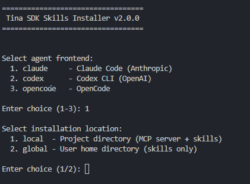

### 步骤 4：验证安装

安装完成后，启动 Claude Code，输入 `/skills` 可以看到安装好的 Skills。

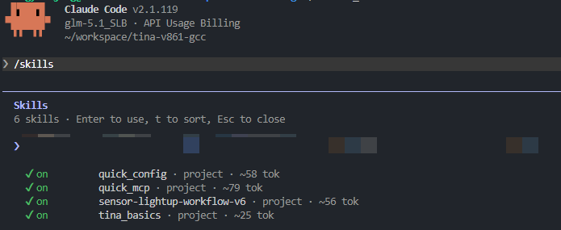

Skill 系统初始化完成后，即可开始使用 AI 辅助编写 Sensor 驱动。下面以 SC1B4AE 传感器为例，演示完整的驱动生成流程。

* * *

## AI 编写摄像头驱动

### 准备工作

将准备好的 Sensor 相关文件拷贝到 SDK 目录中，建议放在一个单独的目录下便于管理。

![准备好的 Sensor 相关文件](data:image/png;base64,iVBORw0KGgoAAAANSUhEUgAAATQAAAC7CAYAAADrEGImAAAFuXRFWHRDb21tZW50ALhqRFUAPHByb3BzPg0KPHByb3A+DQo8a2V5Pl9JUEdGSUQ8L2tleT4NCjx2YWw+W0RvY0lEXT1BOTY3QTZEQS03NzU2LTQ5QTctQTVBRi1CNEJBNkVBOEYyNzE8L3ZhbD4NCjwvcHJvcD4NCjxwcm9wPg0KPGtleT5fSVBHRkxPV19QLTkyN0VfRS0wX0NWLThBMTRCMkI1X0NOLTM5QjAwQkU1PC9rZXk+DQo8dmFsPkRQRlBNS3wzfDUwfDJ8MDwvdmFsPg0KPC9wcm9wPg0KPHByb3A+DQo8a2V5Pl9JUEdGTE9XX1AtOTI3RV9FLTFfRlAtMV9DVi00RUUwQTU3QV9DTi0yNjE5RkE0Mzwva2V5Pg0KPHZhbD5LSEtTL0VOYXhrVXhzMkYvMWhoMzIxbVVLd3hOTXhXOGE5WkJ6d1Z5SGlsaTZsYU9wT3p3b1BYSjZhbUVjUEo5Q0gyMnhOdkVUV01sZE9ONW02KzRGSDd3dGF0bmxSdnBBbGNlRVRFWFJwRFViSkRsVEd4T0p5TTlEZ1lmWHVocnR6VWUxWEV0RmZaTGEvbkxlOUxSSk9mVW9QVE9KS3dUdDJWaGRWZTM5eUpHK1NxNTRwdGhBMTR0aGgyMTVXdVZVenJZRmN1L3UyMjAvSEh3SUh5Y0tISWtRWlI0NHNENXA2ckNqSHliOHN5UVdhb1NSUGozKzJJWjU2eEE2c1J0VWZINHNQL2EyY3BnNEp5cU1vWVlhUmMzMDN6ME5NcFhWaXo0enZmODNIQjJoamphVDZGcWhCQUp3TWl4OVpnaE5mRVNIMHdpdU5oc3Znb0t3Q2huNWpKSThnV0dPbzRjM1JUSDY1c0NQWEoxbUN5cncrdXJ0ekJRMk1DZFk1bGFuRXR5QVpYWDZYQWpzc3NnMzlKVCtOaXVWWXkwWXRBZ3QyUkhCQ2pFcjBEekxBbCtydEFEYWxZT3c1OUppS2pqa3pFTXh6NUcrYzRyZ2NmTTFVVlJUMVhYQXByYXFGTmU3dWp4YnJ6aXNrUXdOcjJKWEJRRy9QRTI5TG5xSWluYzwvdmFsPg0KPC9wcm9wPg0KPHByb3A+DQo8a2V5Pl9JUEdGTE9XX1AtOTI3RV9FLTFfRlAtMl9DVi1GODcxQzAwRF9DTi0xMDdBNUNEOTwva2V5Pg0KPHZhbD5LSEtTL0VOYXhrVXhzMkYvMWhoMzI0ZHd4dTBkQXdEM2dnY2xKQmk2MEpESURUalQ2SStDMU9sV2o3NExzY1pOTDhtNEJjN0VCcDVYc1hvV2QxeVdjZzQzaHRrbytjbGFBbHR2b1d3a3ZtWVNHbjgxNGhIQnB3b1AvTFVHeXBWNWo2eUp5OFZ4TGQvR0FUZ0xNaXY0ZlExcyswT1pUb1RiMGU1ZkhWQi9lcWJpZjljU200UWVkMCtTT284L09vc3J2USt3TVlweUVmTE00eDNFUzNTTFRuNmF3Rk5yVU5BUGFla01qRUpPU1RuYVI4US85cEIvaEs1TWFRMjh6WHQyOS9Wd1I5YWRQVVBqTWZhejJJeExQaEF2amZEMXVFbVNPNVE4WG5CMkRETHhNakhaR1kwTXVCMW4zUlU2THQySkNiV1VWR2lqRUxiNW9RL2NvVThwNGZ6alNJdndvQ09lMjE5ZmxIQlkrV2FhWEhlY0g5dk85RmVmTlk4dzBWWVcxUEJHL01jekFKVlM5N2RaSHovcXZCMkZ2Y25XMCtpMGdabGFLTTdYbFYvbENvQVRGNytITGRtdnV4OFRTMzZlYWxMOE1sSWNCVk1NRDBNS0xPV0pDSXF4eEV2WDUzd2JrOXlYRkd6dWFBUHF4MWNWUVZZek9rdDl3a1BqTTNNeXE4bTloa0g0VjJwVkhPMWlucXJEUlE9PTwvdmFsPg0KPC9wcm9wPg0KPC9wcm9wcz4NCgAABaQ1QDRuOYwlYAAAIABJREFUeJzt3X9UlPe94PE3+CuCJMQoVmIzYleaqyaUy+2auWFij9vbLrjYbrqcw/Q4oF2vFXZzuMsSjksTd5e4LIcQ76XZFUttwkC3w9m5e08ajnLvbcutDu3U9lJKjtoWEnEStRGVYhA0UWH/eJ6Zeeb3D/kxPH5e5+SEmXme7zwzznzm++N5Pp+krI2bp4noqxx641km7S3Ud5+PvLmfr5V9g3Xrs2La54Pz7/F3HW1htiih0baNsb6r5OYZlLtc3RQf6FT+NlXRVpFOj/kg7ZTQaCtAOYJJhl2Qca2d3U1OAEobrBQZYKLvKLubnJQ2WNlytoyaDu1zuff3bgeQX91C5aqT3ud1H9eRcuod0dwWQvhbtmx5XPslRRfQEpEEBiH0Kt6AljzDxyGEEPNGApoQQjcW8JBTCKFXMuQUQjzwJKAJIXRDApoQQjckoAkhdEMCmhBCNySgCSF0QwKaEEI3JKAJIXRjcXSbzezF6dNTU/zml6dx/OjvmZ6airm9mXc/14UqF65zooyaDrm+VIj5FGVAe4v6Nz9N455yaok9qPln2khKTib3GSO5zxhD7nPxwjD/z/pGTM8zPzqpMXcGf8hSh900RvO+w/TO7UEJ8UCKesg56Xidl77/PpnF5dQWbJjNYwICg6AQQkQSZQ9NMdbzOi/xAod2xddTm1nq8O7EENmFOaQCjA94e0NqPrTBvtXk5qUwfELJb+bOfQa+ec0AWF9FW0VgW/nVLezFmz8NUxVtFji27zC9IYar+dUtVOalAAYqbVZ2ntDmVxNCzIaYFwXGerw9tRdN8V1AOnNSyDXBMXMZxeYyukZzqGwo0TxuIJt2is1KMMmvbqGIborNZRSbjzKYvZ9GS7Rtxaa3qZziEy4lMJolmAkxFxb4Kuck/R3e+an24wNMGDZR6nncRY+nB1bCzjzoP+6e73JyanCSjDXGKNsSQiS6mIacAOnbX+DQrie4bG/hVcet2Tim+DkuM1KRHmaDFHIrrNgrNHe5DHG2JYRINDEFNG0wm9/5sxBMmWSMjxH6yFx0mQ/SHnB/kKFlxLaEEIkm6iFniikRg1kKuTvcwchIrSUHBp0hTpHo5IzLQFHIebHQbfVeuUpqtpF8zWOpM/kyhBAzIuoTa2v3xB/MLl4YjqvqU2ST9F/bhN1mVW66uinWrlr6aT9wlHWt+7HbCrz7e1Ynw7TV0U2/aT+VNiuVTNJ/YoAJUxSHp9lPVjmFmH0LOAW3nJUvhF5JCm4hxANPApoQQjcW8JBTCKFXMuQUQjzwJKAJIXRDApoQQjckoAkhdEMCmhBCNySgCSF0QwKaEEI3JKAJIXRDqj4JIXQj6isFUkwv0Bhnxo3K//pKzAcWV9UntY5AT9CcZ0KIhWLWrxSQqk9CiES38Ks+9V0lN8/AxMg1UjNWAVBks7LdU9FJKQTsCY+ubooPdGracD+mzY0mhFiIYq4poA1qL948OM91BVLIXXWOYvNB5WbAkNNIbWsBGX1HPckaSxustFW72N0Eta1KxfNiSbwohC4s8FXOSU0VpyAsBeQywDFNFtv24wOQbSQfJxdH0VR9EkIsdDEHtISu+hTM6GXfGgOOy4ykpbMBJSX3YPZ+7DYrbdUS2IRY6GIKaAlf9SmYlZlqcROVTzUnJ/X7ghUdFkIsRAu86lMEHecYTsthr6b3VbojWGUoGX4KoQcLvOqTH8dhenZYNaucndSYodG2H7ttPwATntVPI7Wt+8lNU/eNUDFKCJH4JAW3ECLhSApuIcQDTwKaEEI3JKAJIXRDApoQQjckoAkhdEMCmhBCNySgCSF0QwKaEEI3JKAJIXRDApoQQjckoAkhdCPmjLXxkKpPQoi5MCcBzT/TRlJyMrnPGMl9Jni6nqgrPpmqaKvIIdV926deAATUE8BFl09FKPVxn/38snCgzdDhK7+6hcq8q35tetvNCNjP/3iCHbMQIl4RAppSj/PGm6FrByjl7R7h5DcOYQ/TUvN/fzn+owzGVEVbxUYGj5R5CpuUVleRD0quM0sd9kIDw9qaAaYqGquN0OT0BKP+vklY5d+4tmBKCY22UmpNTr8CKiXszEsJemj51dvIcLk8qb59c6/5B1UhxEyJENDewmrfQOWeOl5ccohXe274PKrNYBsumLmlrkijZF85K9LSIm577+5dftz1Fr97ZyD0RuNDnNIEmfamw+pfJTQWrqZfE+wAcBymRr3d21ROL0ovKzfskbgYG08hfT2gaau0oQD6BpjIS/fb3shz2TDY0Q2WUp4zQa9UkhJiTkRcFBjqPkyz/Q8Ydr3Ei9sf8dwfTzruTbl/GlUwA1i0eDFTU2FStTmcDJJDZUNJ4GOWTWT5Bbu4mYxkM8Db2spQljqK6KbmdKjthzjlcHJqEHJ3BDk+IcSsiGqV0z+oxVtb4LNbnop629u3bvHe786F2UKpB9BFAXabFbt/YPMvjhKTFHIrrEq7FTmMOA572zJV0VYIXSHmvbQpvntPDzFh2ESpzxYGimxq2zar1DEQYgZFvSgw1H2YZqqo3PUq/4sbnIsxmD2y8jEey1gT9fZn+n7Fvbt3I27XfqCMdpR6m/bWTJr3qcFHLY4SX1DzLTqs1PI8qtTytGxk8Eh5iDmwErYYJhk8ri4EqCnBt1gATw9P5tCEmC0xrXIqQc3Mn398GmtPbLUFnnzq6ai3nZ6aov90bPn92w8cZV2rOmfVcY7hwm0zNn/VftZF0WYDWDaRm5YCFVbsFd7Hi2wtrDtSTv36TWQR+Dgrq8jvOHwfPUYhRDRiPm1jqNvGUBxP9CdP50T/HOfOMHnzZviNLHU0cpAazwqmkew0GASgk7f7tlFZ0UIt3p4WpioatzqpibEYSulmAxPXuqGj07fKuk+ldiO1FmVVtcanEnsJjbaZC65CiNDm5Dy0WKs+/dr588gbdXQz1mrFXui+w3eY2NtUTq+lDru2tzQ+QPO+aIKZOofm3i+ailAmI9lpLno6/B/o5IyrgKIdJeoqqTKHVuR+eHzAO0wWQtwXqfokhEg4UvVJCPHAk4AmhNANCWhCCN2QgCaE0A0JaEII3ZCAJoTQDQloQgjdkIAmhNANCWhCCN2Yk0uf4vHoF/by0Po/A+DWuz9nrFfyUwghwkvYHtryjc+yOH0tix/NJOXJL8z34QghFoCECWhL0jPJ+NorLFv7JMuz8li6OouxU28w9rN2lqzK4qEnclmWuYnVz9exOD3zPp6phEZbC7WmGTv0+5Jf3UJbdfBiMULMnBIaH4CEogkz5Hxsx4ss3/gsqU99mempKcZ/ZWfy96cgOZllqzawds9RSEoCIHnpcq50vjjPRzyHfKpbRZkgMpp91G1GAlIe+fOvhBWiehYRHp+z6lqBbYfPaqJuT6ht/J7HUod98zn1tQR5Ls3rzK9uYS/tQV+Xh1/1Mm8KqiBVwjSvheoWKvPwyTKjVdpgpWil+zV1UmOeg+piPim15l5CBLSUjUaWb3yWqz98hXsfjTD9ySQkLWLll/8TAOO/snPzzI9IWrKExY+sZdXOb7F8w7/k1vlfzvORz4USGjXVrfKrW6hsreJ82JRD0e1TukNTAjAk5QubPXjUm0LJUqX0cB0kcHWtyZBf9OAmmSCHnRbo9Qvu+dXbyAImwuzrfS7l/WqrdoUPYhqlO9LpMSuZl5WA0ELthXLqHf5BSGk7XU0Jnw9MjKt1Kxx+wcpUxXYDMB7VIehGQgS0O6OXuHPNxWNffIEPv/8CkETmN7/HnWsuSEoi9anvcvmImaQ7y1j5tUPcGTnP3RsfRtGy76+n0gMI3Kq0wUqRQbuN8kFUvozuL5O315Ff3ULlqpN0UaDu5//l0f6y+j2m/TUeH6BrMMJLsGwiy3WSYk+et5PsVBNGbthhpYhun55C9uBRdl8JvY8nyaSljiIG6B/Pwb9uVaBJBrUZhDsOU+9+nTqqrjU46CJ3cwngW9t1Z95V+vtWkx1VK07qHQXYNxuA6AJa+4GD3hsOJ4OWnID3AQBLAbmj3b5JRgeHGM5T6lZoe0SlO3IY6Rsgw3PQSqLRsSPl1DvUv08MkV2ofhb9epW+n2//XuMmzmh6YKUNVracLaMG5ccNoMhmZXuIHvdsSog5tDvX3+dSy9dJTk1nScYGVnxuB3dG3uPSd3Zx+egu7l7/gBWfK2JpxmdIeuhhLn3Hwp3r70doVdOzMJdRbO4mWOzIr25RgoK5jGLzUQaz96vzDEaeWzVEs7mMYnMZXS4DRdpCLIYCtpxVHmvug1yLUhNUed4COKE8VnxkiOyKOrVQirfnVGxWejTbQ/Q+PMe3ZjUT11yae7xf/PYD3Qwbtim9JUsBuQxwrMkZdh/cx1EIXQei+bCp1as8r0FDb9W1TnfTv3Kbz/xqfvU2slznOHX/rUfJQHqaizMBUwBGak2r6T/uP2x08nbfarZr52FNVWw3uDgT7H3zSCHXBMfU78awocB3fk3z+S4+MkBGYRTzzh0HKT4ywAQuusxlcx7MIEECmsf0tPq/Kaan7jF952Om7txmeuouJCvzZ0lMRdeW+gU55nlTO6kPeINL2JmH5kPi5NTgJBlrjICT+gPeIVr7WZfvrq5uz7xT7+khJtLS2QCewOL5YjqcDI6vZp3J/eU46e3NOA5zrG8y7MvYsMo/4Dm5OOr+u5OaE1fJ3VGlfNjVugXh93EH3OjnOHqbyik+gVqtyi+wJWx1LU3bNmuUCy/+wVHpBQYGkXBKaCw0MHw2nvkq5d8mo6878N/GUkAuwX88ek8PQV6B5/Xnb90IwdrwMen5vChZlVE/9yrN5xvHYXpcKWRvTfzFq4QYci557AnWmF9javIGn3z4Lp9ceY9HnjHzePn/gaRklqzOYuRvv0VS0iKmbt/k8W928GHni9wd/SB0o+vTSR09F8WXzS/dNoBLHS5YvF1o5f4QZfUclxmp0AyJ0nKotFmp1GwyrPaOfHtOkZ2/Nsl2n3uMrFupudnRTb97qOmIvE9+damybdhFgCA6DipDHUsddndRGEjg6lqxzqEplOG5OoSzFJA7qgzd87eG28v3MxRYVyIKpira1N777mAT/JsNDDsOBn+ffV6/MkTuMTvBFH0ACvzMxPZ4okiIgLY4/VMsWWXg6g9fYdGKlUzducUf3vgmD3/+eaan7nHt7f9B8kMrSF6ynOs/ep3VX3mZJelrwwc0iPLLFmIF0FKH3TRGs1n9EFnqsG+O8gX5rOZ55VdD6irfuZUNq1LgWvjmfPcxkJ42ydgF93EWkDvqYjjPd0I9+D4l7CxMIZX92G37vU9QaKVtTZTzHR0HaV7Twt6tRmjSY3WtTt7ua2FvdQnrslfT3xFNTyu+4OlhqqLNAsfM5SGOvYQtBhdnDoRuov34AG2WKkrXbCSjr33GVxg3rEph5KwTMETcdj4lxJDz1nu/ZPL3DlZ/5WU+ZXmdtXtaSd28nev/8NeM/ujbrMgpYO2eVj5lUYLZxO9+GnmFs+Mcw2k57PUMNUqoDRh2dHLGf25Mlb9mtc9wqnRzlP+QHecC5yNUytBIM0fjXokKo7fppHeeDP9hqzopf/wgb/d5h0qh9+mkRp0TdM8Z9o8rPYrQwayERp/3x8hz2e4hbafyvBV+8yvuVc4YKdW1XEpvUHucnnmZcuodRmpN6qqqz2vpZjhtI8/NwPmF7iFcqCHezDIqvdFwgdiyiSzXufBByuFkkByK8vBdwImX9nNqqaPI4J7XczE2blB6g57HwrRjqqLNpplD9pwDaqS2debPi0uIHhrA9X/4a6ZuT/DRL35A8rIUMkpe45OR8yQlJbHiqUI+fLOcqbu3eeTz/44//vS7UbTYSY0ZGm3e3sjwiTL8f2GUep77sdsK1HvUX9umdp7T3D/sinao2EnNkUzaKjQVqdznQDkOs3u9phLV+ABdfZG68p3UnNjks0/zPveqpnJuVI0DcCjHq5wuEGqfeHTy9rUWzfvjuxKcmNW1XIFtx1Lg2T2EOzsX1bgMpKelkBUw7eHt5XvKKIblXl09F39PUcs1BBb3MSnfiXbt8xSqn29XN10uA1vc+6nvnWeVM+zCxMxL2KpPmX/5JotSV0JSEvdujHD5jb3zfUhCPBDcp20EmzaZK/FWfUqYHpq/yaGfs3x9HsADcQKt7zlvqrms2el3trriPueGEsy8vscPwPubCBK2hyaEmB8LuYcmAU0IkXCk0LAQ4oEnAU0IoRsS0IQQuiEBTQihGxLQhBC6IQFNCKEbCXNi7UPJSbz8eAYZS5YEPPbO5G1e/zDCFdxCiAdewgS0p1OWU/DowwH3n7v1Mf/2sYdJXZREw6Wr83BkCcxSR9uabiXdTmspdJRTv96d797lvc//THRTFW07LrP7QGfws+c9orn+0TfvvTZ1jjYTsPcx/zz5cra8mDkJE9AeWbwo6P0XP77Df/vgQ974zKdJJon6SyNzfGQJrOMgPQ1WGi1HGQPYWod9lbt4RwnpDPF2FIEieP4uJdUyEOKyHTclO2lNhLbzq1vY6bOPEihLG1pYF/kQE5gx4IfDE8hDpJESsydhApq/qelpRu7cA+Dd25/wzfOX+M6Gx5liOvqemv8XMeADlmjVioJU+QnzpfB8cQxqbrM8A2DA3gDFZzeRlWbwSTQ50fcTBrP/lXrsOdht2xh2QVaeJjOIDxdnAByHA5MOunN4zfZ1kO68dAHPo82Rr9yjvB+he5WhakTMKDX99ay0LSJKmIA2Pe17BdbxsXFOfjTBX6QrkeO3t27zH4YvcXTD4/xsfBLHR6Fr8AA+GUA9H/jqKm/Cx4StVhT9l6H9QJnay7FSZPDP/triLV6ill3b3dQJtAcMOXee9R0mbjnrHhpuiuIoZllHiCSS2uIx7nJ8fQNMGEKVfClh56qTFJs1hUAiVs+K0/gY52e6TRGVhAlo/q7eucfo3Xt8+ZEVfPnpjT6PLVPrc0bkV8Cjvemw+pdeqhW560m6GB43kFthpW3rUXafNrJlJaA5plhTf7vzySlC1IeEgFTjoXqr8VPynG3fagSHu101yaNDrZbk7kGaqmjLC91OjSbja+/pIfbmKXUggvb8tBWR/DJyaHt6E32a4jualO2VNis740nFLe5LwgS0ZL8YtX7ZEk6N38d18w4ng5b9VDaU0Os/ZFOrFTXPYLWiY0GqFRWfzgz8gqnVio45nLC1lMpgNRWjoq2XqSwK9B8p5+IOK/aKSfpPDJGtlmQr3WxQ0ydrGAqwt2bSNQhZhX5DToPmtjrkDShSG3bIqQmA2rbw/p1ls1LkvrvCin1H6KF1+1kXRSZNbzZkkscYrE8nNWQWWKUiUrO5jF6UXqvnc2SpozJ7iGbzYc8PXmUa9IOSaffCHA3FRVAJE9Cm8Y1ov564xaOLFvHbW7f5k+UPxdGik/p9TkobrEq2Vf+5qJmoVqQpihFQrcjcCaaqgD2VakVHle1PD7G3wr+mooEizZc9dMEN5fV5i8+WqZlr1YK1lNDYmkm+Tz56TaBR34/SBmvAyuSWs/fbs1ACoLat/OoWdl4p9wxlz2gXBY5HWOXs6Kbf5O3N5m/dSKrrZPxzVKYq2gpX038k1A+JtiKSkq9/e8UmSjGyzuRbrKS3qZ3nWgMK/Il5kjgBTTOHdmtqiqHbH9O8/nH+6sJlnkp5iMVJYFyRytOpsQU37TyTvTXTO3RI2GpF0c6h+S1OeHpZ7mPr5MyolZ0N6WS5zqmrkGpPy1RF2w5NU5vrsNs051e4e1VqKu3n/BZBtPyHnMpLmOnVPSenBt29WZdSWi6q4iWB8qtb1B5WqIIkQfhU9dIUqBEJJ2ECmtZ3r4yyNCmZjqt/5MnlSxm9e5eP7k0xcuduzAHNTakdoP7Kh5pojtP8VCtyUr/P4LvSpw4D3fOG7ccHaKvYGKYnYmTdyknGBgGCrAC3ZuLtCfqJuMqpth3syx/HpHmvuzdrylSH7DE2gBLM9tJOcVT1DjRMmWSox7wO//lSA+lpKKfNiHmXUJc+3Z6a5lsfXOGfbkzw2vq1/OWalfzV2tW8vG4NrxrW8vK6NdE3ZqnzrShjMpLt6WXopFqRBc6YT5LuKdabTo8nwBipteSQSkroquLu6uNX4njuiAykp13lon/gsWwiK57hvsPJ4LiB7ZaNngLDkWkqC5mq2Js9pCk8reFTmQjwec+U91F5TqUQdZZJWS0HtaJWrK9FzJqE6qH9041xXLc/5rX1a1ka7UpmKB3djLVqJ6R9h4mJWa0I/OfQwua87+ik3VKHHcA1QP/KHIpaqzi/7zI73efP7XNR27pfOTfNbxjonc8roNJQ4FPZyf3c8cqv3ha0PmTpZgPDZw/G0aIy7MzNg/54yrStTyfV77w8UOcoA3qRk/Rf24TdZlVuav59e5vK2dBg9bQz0ddN//i2OF6PmA0Jk4I7N3U53/vMOq7fvcdjIa4acNvz7kUGJm/N0ZElKvcpG34Bz31Olt9iQmmDle3XvCfWTvQNMJKXrkzOW9yXSwUOOd/2Caa+p2+EPkVDKbF3cZ/adqEB5QflJOk7oOaASzP/l2gnoQaesCvm3oKvKbAoCfaveYzPpYR/IadvTvK9kVES4qDnyLxXhJoLCVMVSQJaIljwZezuTcP//vD6fB9GQnKf5KtrwS6vEiJGCdNDE0IIN6n6JIR44ElAE0LohgQ0IYRuSEATQuiGBDQhhG5IQBNC6IYENCGEbkhAE0LoRpQB7asceuNVags2xPUkP/jKBc5XnPX8N1R+jpee/ZBFSTN/Tm9+dQv2hmDZJUpotFk9GTiUHGbGgL+FEAtXlJc+vUX9m5+mcU85tbRQ3x1bNqtnHvctaLIoaZpv5FznGzmhL3X6xaVUvv7D9TE9T3hB0kgLIXQl6iHnpON1Xvr++2QWl8fdU4vo6a+DpQssXTxT8JXZeQ4hhG7FNIc21jOLQe3pryv/71AzgeWYqfz3Xwy7S351i5LY0GYNPsw0VdFmcw8nS2i0+SV0DEoZmirtRrO9ECJRxJxtY6zndV7iBQ7tKufFmwd51TFDeclyzEowcwc2oHLvF2n+3o+Db+9XfSdQCY0+ecEMQbfypeTxQlurUwixYCTWKqelSwls0bgwxkSaUlcxUCa1rUpl8tiqFzm5OAoZa2SBQIiFKOaAlr79BQ7teoLL9paZ650BDNgC7mo+FqJ3Bkr+rBNQZLNi98kHDxhyyGUgeP74CNoPHGUwez92m6x8CrHQxBTQtMEs1pXOiN75QcBdIYebbu6iJCegqNVbuAJXN12jOVQGPX0jEif1+8ooNiuBzafQihAioUUd0FJMsxjM3LS9tCA9tpCCDD/bDxylf2VBiHPSoiHDTyEWmigXBb5K7Z74g9kvLqUGnIsW1Ds/8PTUfnYxFQhzHpqn+Aa4c8+3g7eX5qlbWaAWGL4cxZH6Fe+NppqTECJhJFwK7vPOBgA2GA/M85EIIebLgq/6JIQQblJTQAjxwJOAJoTQDQloQgjdkIAmhNANCWhCCN2QgCaE0A0JaEII3ZCAJoTQDQloQgjdkIAmhNCNqC9OP/TGs0zGeXH6H/7zLm5/9gnP7aSpKdJ6+lj5tz8haWoq5vaEECKYqK/lTDG9QGOcGTeGW2tjPrCHfv8+a1/7fthtShusbL92lN1xZ8RQsmukO8pizGwrhJhNs34t55xUfdLQ9uiEECIaMWfbiCdrbbgemu0LXwp6v/mn/0jWvvqQ+9W2Wr15y3DRZT6o5EOrbqEyL0W9u5viA2otTlMVbRU5pHq2P8cWWwFZ7ibGB2jeF6rgihBiLs1p+iB3UHO9GV3Vp0hDTtsXvoT5p/8Y8He4gAZBhpyWOuymMU9g8j5uoNG2jbEj5dQ7tC3IkFOIRCTpgzBSazIw7PD2strPukhdZQBcjI2nkD6ThdiFEAkn5rqcs1X1KdTQM1ZZhVbshZo7xsfIp1NNx608NnxCemRC6FFMAW1Wqz4Br/zmn3n5c392Hy0otQV8h5VundSYO/FUUL8QajshxEKVUFWf7i+YOTk1CLkWTTm7oGT4KYReRRnQ7q/q00O/fz/iNq/85p99bi//7XDEfdqPD0Defk+h4d6mcqUep82KXf1PqatZogw3bVbstv1kD7orqjupd7iUYWprpEAohEh0CVEkpfJEG2v+hdJluvLuBZoLd8/zEQkh5tOCXuX8ybff5LrrEleHP+An335zvg9HCLFAJUQPTQghtBZ0D00IIWaCBDQhhG5IQBNC6IYENCGEbkhAE0LohgQ0IYRuSEATQuiGBDQhhG5IQBNC6MacVH26V9gEa5/23E6avgdnf0jSL7+r/J0ITFW0VaTTo6byFkIsPFEGtLeof/PTNO4pp5Y4gpommAFMJy2CLc8zveX50Pv84R0WnagO2+z9V30SQuhJQlR9eiw1mZf/YiWfXb3Ee6dfEBRCiEhiylg71vM6L/ECh3bF2VML4frEFPaBm5T/+SM4L9zm5idTOF0fcyPMPp6qT4b92G0Fwas+BWSwLaFRW+lJWxXKT2mDlSKD8vdEn/QChVgIYl4UGOvx9tReNMV3RXwwvxv5hIaeP/Klz6bw/FMr+Py6ZWG3r99XRpdLCTbF7nkvSx2VeVfpMpdRbC6j+MgQ2RVK8kelwlMBGX1HlcfMZXRRQFu1MaDt/OoWiuj2bCfBTIiFIaFWOW/cnubv3rkJwOa1S0lKSophb7Xq0wnNpL7jMD0uA1ssgKWAXAY4pglO7ccHINsYkKm298pVWJkpGWyFWGBiDmizVfXpqbVLOfSvH+XvB2/xP3v+yJMZSzB+sSjGViYZu+B7z/lrk2SsUXtho5d9Cwk7LjOSlk7AjGDHQZoHNyqpvCU1txALRkwBbbaqPj21din7nnmYI86PuDc1zbvX7vB/B26y7d8Ux9hSYPGTDatSGLmi9sr8e12mTDLGxwj2Snqbyik2lymBraEkxuMQQszS49ThAAAA5UlEQVSHea/65A5mf+O4wXvX7nju//HgLY41/JcYWnJyanCSrEL3nBlgqmK7wcWZDqDjHMNpOezVzJmV7siBQadvr82PDD+FWDiiTME9syfWum1es5T9xoc5fGqM4dG7vgd2+dckdx8I37CpiraKHFJxhVjl9N6v8F3l9Fm91JxYez5sG0KI2RZvCu55qymw6U+fYV9tI39TW86FwbPzcQhCiAS14GoKmAq/xusH/6MEMyHEjJGqT0KIhLPgemhCCDHTJKAJIXRDApoQQjckoAkhdEMCmhBCNySgCSF0QwKaEEI3/j+f7jPJn2/uKwAAAABJRU5ErkJggg==)

### 执行 Skill

:::tip

:::note

提示

:::
:::note

`/sensor-lightup-workflow-v6` 为文档写作时的最新版本 Skill，后期可能会更新，以实际 SDK 中安装的配置为准。

:::

:::

执行命令：

```bash
/sensor-lightup-workflow-v6 严格按照skills流程完成SC1B4AE点亮测试 数据手册：SC1B4AE/SC1B4AE_数据手册_V1.2.pdf 寄存器配置：SC1B4AE/cleaned_0x04_SC1B4AE_MIPI_27Minput_2Lane_10bit_371.25Mbps_1280x720_25fps.ini
```

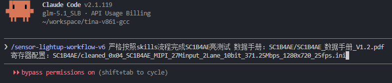

按下回车，等待 AI 根据输入的文档手册创建 Sensor 驱动。

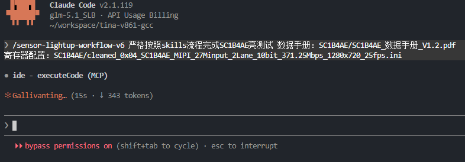

### 参数确认阶段

接下来 Agent 会自行阅读数据手册和初始化序列，然后根据输入的 Sensor 文档和初始化序列，自动提取相关参数。提取完成后会询问用户参数是否正确。

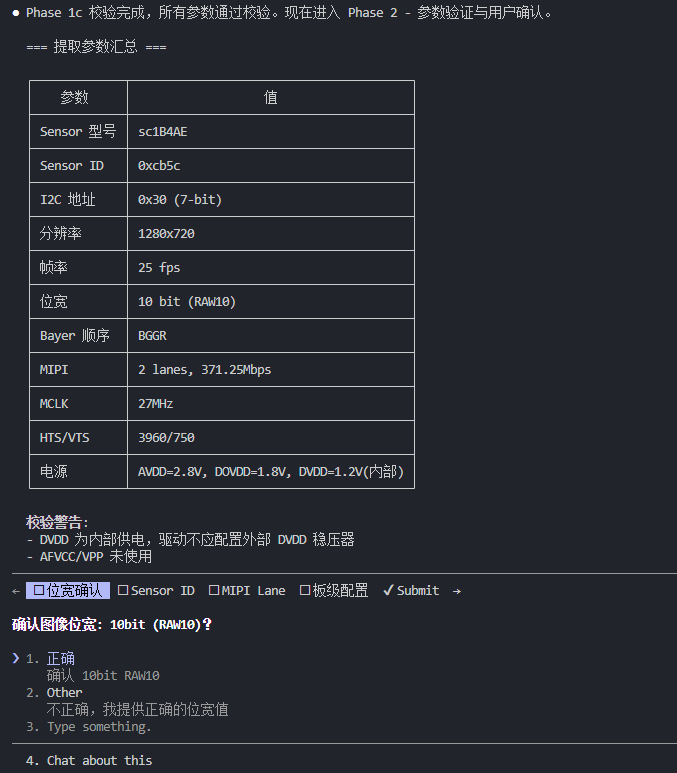

用户可以确认以下关键参数：

| 参数 | 说明 | 来源 |
| --- | --- | --- |
| Sensor 型号 | 如 SC1B4AE | 文件名或 .ini 内容 |
| Sensor ID | 如 0x1B4A | 数据手册 Chip ID 寄存器 |
| I2C 地址 | 如 0x30 | 数据手册 I2C 地址配置 |
| 分辨率 | 如 1280x720 | .ini 文件 |
| 帧率 | 如 25 fps | .ini 文件 |
| MIPI Lane 数 | 如 2 lanes | .ini 文件 |
| 位宽 | 如 10bit | .ini type 字段或文件名 |
| Bayer 顺序 | 如 RGGB | .ini 文件 |

如果参数不正确，可以在 "Type something" 中输入正确的值。

全部参数确认无误并点击 Submit 后，Agent 会自动进入驱动生成阶段。如有参数需要修正，请在输入框中输入正确值后再提交。

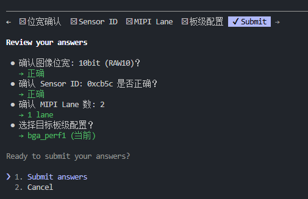

有些时候 Agent 会多次询问，以防止选错了写出错误的驱动，保障驱动功能完整。

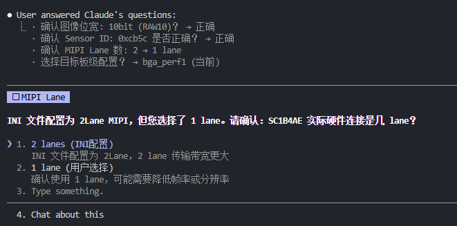

### 驱动生成阶段

Agent 总结相关参数后，开始生成驱动文件。

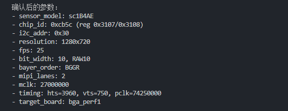

生成的驱动代码包含：

1.  **完整的 V4L2 subdev 驱动结构**
2.  **Sensor 探测函数**（sensor\_detect）
3.  **曝光控制函数**（sensor\_s\_exp）
4.  **增益控制函数**（sensor\_s\_gain）
5.  **翻转控制函数**（sensor\_s\_flip）
6.  **电源管理函数**（sensor\_power）
7.  **格式枚举和设置函数**
8.  **初始化序列数组**

写好后会自动配置 `Kconfig` 和 `Makefile`。

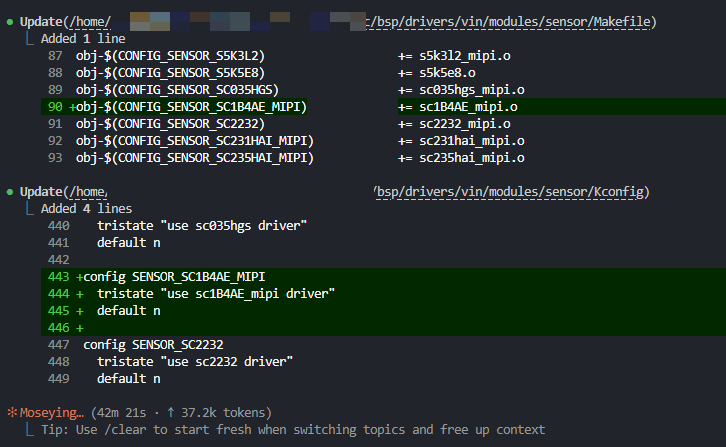

此时驱动即生成结束，可以执行后续相关操作。

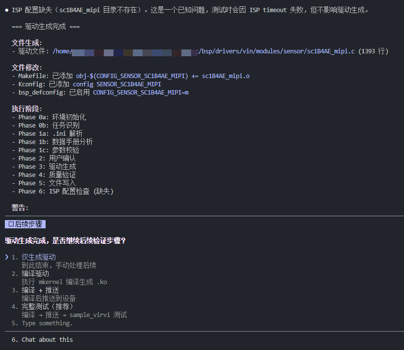

输出驱动如下：

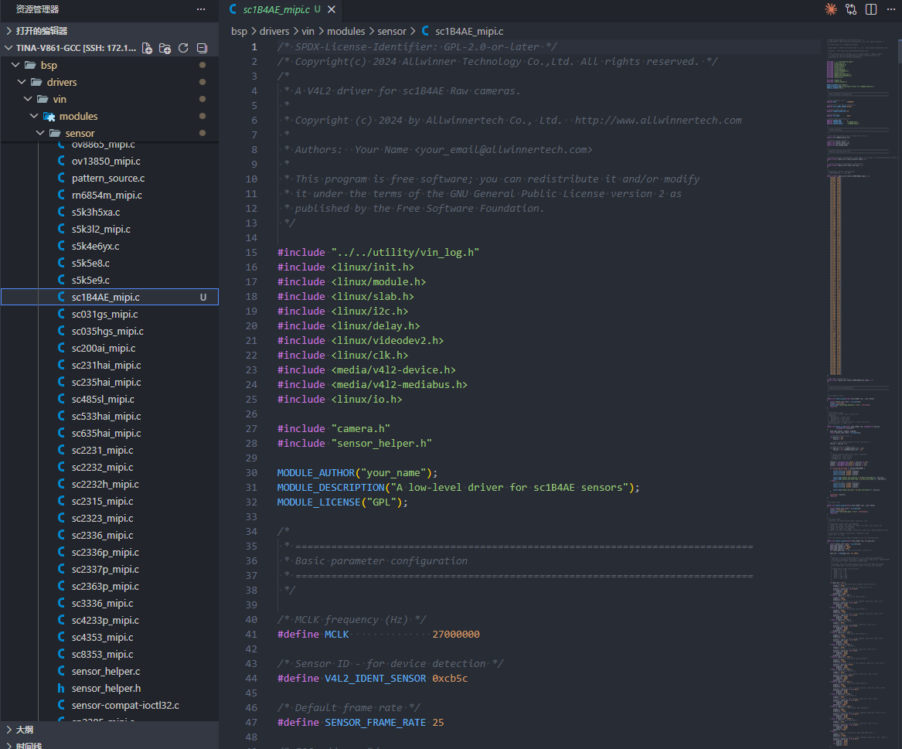

* * *

## 可选验证流程（Phase 6-10）

驱动生成完成后，可以选择继续执行后续验证步骤，形成完整的闭环。

### Phase 6: ISP 配置检查

**目的**：检查是否存在对应的 ISP 配置文件，ISP 配置是图像质量调优的关键。

**ISP 配置路径**：

```
{SDK_PATH}/platform/allwinner/vision/libAWIspApi/isp_mpp/isp_v861/libisp/isp_cfg/SENSOR_H/{SENSOR_MODEL}/
```

**配置文件命名规则**：

```
{SENSOR_MODEL}_{WIDTH}_{HEIGHT}_{FPS}_0_0.ini
```

例如：`sc1b4ae_mipi_1280_720_25_0_0.ini`

如果 ISP 配置缺失，测试时会报 `isp0 event select timeout` 错误，但驱动加载仍可正常进行。

### Phase 7: 编译驱动

**目的**：编译生成 .ko 文件，验证驱动代码的正确性。

**编译命令**：

```bash
cd {SDK_PATH}
source build/envsetup.sh
lunch                    # 选择对应的板级配置
mkernel -j$(nproc)       # 编译内核及驱动模块
```

**生成的 .ko 文件位置**：

```
out/kernel/build/bsp/drivers/vin/modules/sensor/{sensor_model}_mipi.ko
```

### Phase 8: 推送到设备

**目的**：将编译好的驱动模块推送到目标设备并加载。

**V861 模块加载顺序**：

```
videobuf2-* → vin_io → actuator → sensor → vin_v4l2
```

### Phase 9: 测试验证

**目的**：在设备上运行 sample\_virvi 测试程序，验证驱动功能。

**测试步骤**：

1.  推送 sample\_virvi 和配置文件到设备
2.  修改配置文件中的分辨率、帧率等参数
3.  执行测试程序

```bash
adb shell "cd /tmp && ./sample_virvi -path /tmp/sample_virvi.conf"
```

**成功标志**：

-   sample\_virvi 正常退出
-   捕获到视频帧（frames\_captured > 0）
-   无 ISP timeout 错误

例如下图 GC4053 正常出图

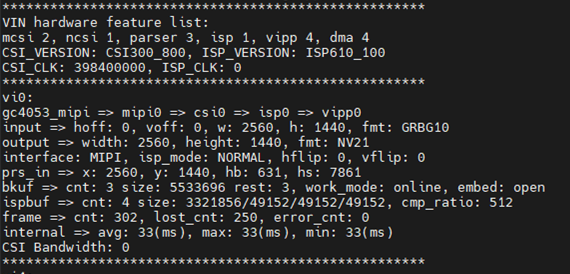

以上介绍了正常情况下的完整流程。在实际操作中可能会遇到各种问题，以下是常见异常情况及处理方法。

### Phase 10: 问题诊断

如果测试失败，Agent 会分析测试日志，识别问题类型并提供修复建议。

**常见问题诊断表**：

| 错误特征 | 问题类型 | 原因 | 解决方案 |
| --- | --- | --- | --- |
| `isp0 event select timeout` | ISP timeout | ISP 配置缺失 | 创建 ISP 配置文件 |
| `chip found is not an target chip` | Sensor ID 错误 | 驱动 ID 与实际不符 | 检查数据手册 Chip ID |
| `Unknown symbol` | 模块依赖错误 | 加载顺序错误 | 检查 V861/V821 加载顺序 |
| `MIPI timeout` | MIPI 连接问题 | 硬件连接或 MIPI 参数 | 检查 MIPI 线缆/参数 |
| `no image` | 图像问题 | 曝光/增益参数 | 检查初始化序列 |

* * *

## 异常处理机制

### 输入材料缺失

```
错误: 缺少必需的输入材料
处理:
1. .ini 文件缺失 → 终止流程，提示用户提供
2. 数据手册缺失 → 终止流程，提示用户提供
3. 硬件连接信息缺失 → 使用默认值，生成警告
```

### Agent 执行失败

```
错误: Agent Tool 返回 status: "failed"
处理:
1. 检查 error 字段了解失败原因
2. 根据错误类型决定:
   - 文件读取失败 → 确认路径正确后重试
   - 解析失败 → 提示用户提供更完整的材料
   - 生成失败 → 返回对应 Phase 重新执行
```

### 关键数据缺失

```
错误: Sensor ID / I2C 地址 / 曝光寄存器 / 增益寄存器 缺失
处理:
1. 终止代码生成流程
2. 返回 Phase 2 让用户确认并提供正确信息
3. 提供可能的原因和建议
```

### 验证失败

```
错误: Phase 4 验证检查未通过
处理:
1. P0 问题 → 调用 troubleshooter Agent 诊断
2. P1 问题 → 记录警告，继续生成
3. 根据诊断结果修复后重新执行 Phase 3/4
```
