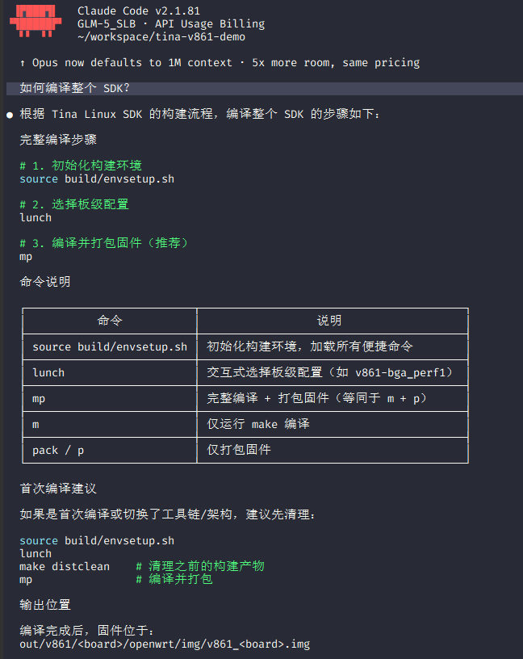
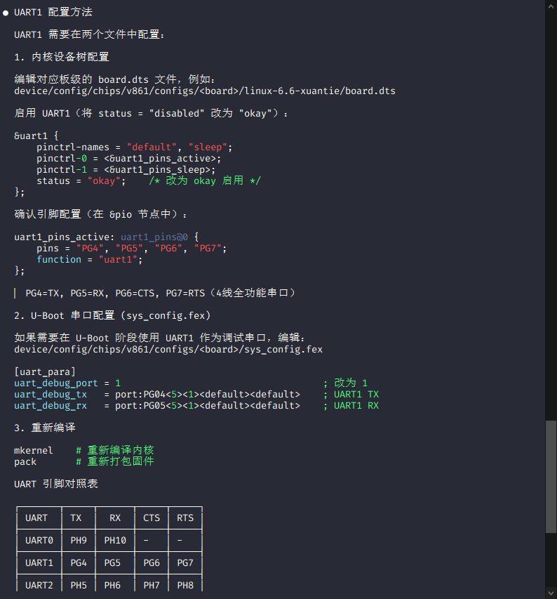
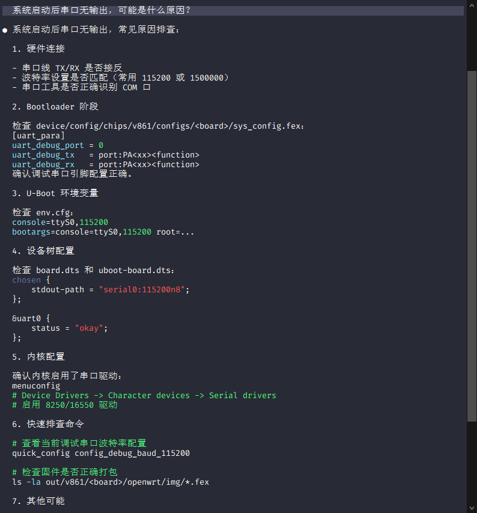
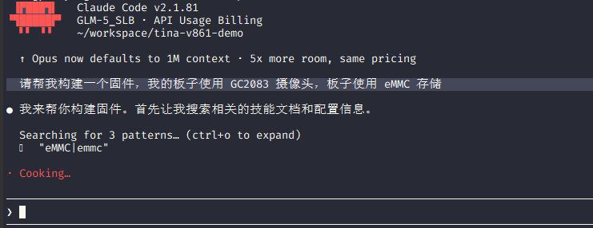
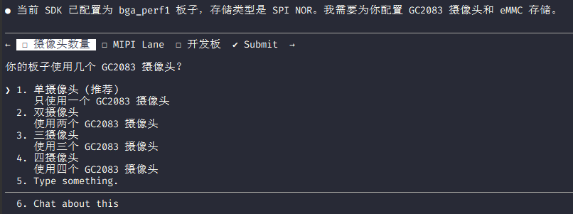
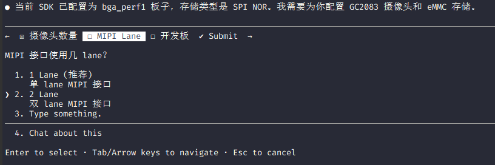
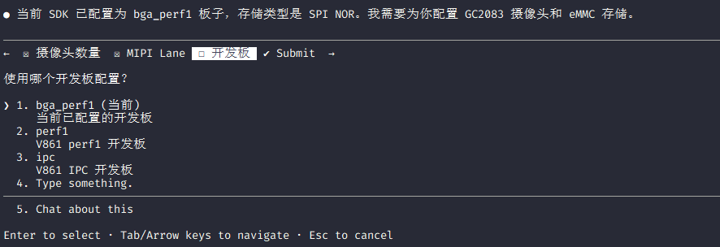
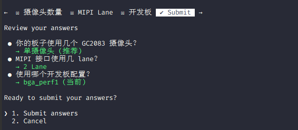
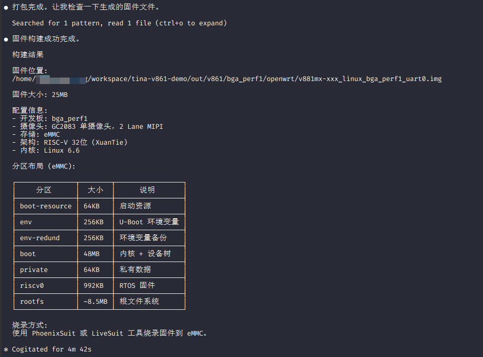

# SDK AI 辅助开发

本文档介绍如何使用 AI Agent 辅助工具进行 Tina Linux SDK 开发、配置和问题排查。

## 核心能力概览

V861 SDK 部署了**完整的 AI 辅助开发能力**，远超传统的问答式 AI 工具：

-   **丰富的 Skills 知识库**：涵盖 SDK 构建、设备配置、BSP 驱动、RTOS、多媒体等全栈技术领域
-   **方便的 MCP 配置服务**：支持多种 AI Agent（Claude Code、Cursor、Cline 等）快速接入
-   **quick\_config 配置联动**：AI 可直接调用 MCP 工具执行工具链切换、架构切换等配置操作
-   **强大的配置执行能力**：支持内核配置、设备树修改、板级配置、环境变量管理等大量配置操作

SDK AI 联动模块架构：

```
┌────────────────────────────────────────────────────────────────────┐
│                         AI Agent Layer                             │
│    Claude Code  │  Cursor  │  Cline  │  MCP Compatible Agents      │
└───────────────────────────────┬────────────────────────────────────┘
                                │  MCP Protocol / AGENT.md
┌───────────────────────────────┴────────────────────────────────────┐
│                      SDK AI Integration Layer                      │
│  ┌─────────────────────────┐   ┌─────────────────────────────────┐ │
│  │   Skills Knowledge Base │   │       MCP Tools Suite           │ │
│  │   - SDK Build Skills    │   │   - SDK MCP Config Tool         │ │
│  │   - Device Config       │   │   - File Operations             │ │
│  │   - BSP Driver Skills   │   │   - Shell Execution             │ │
│  │   - RTOS/MPP Skills     │   │   - Code Search                 │ │
│  │   - Other Skills        │   │   - SDK info MCP Server         │ │
│  └─────────────────────────┘   └─────────────────────────────────┘ │
└───────────────────────────────┬────────────────────────────────────┘
                                │
┌───────────────────────────────┴────────────────────────────────────┐
│                     SDK Configuration Layer                        │
│   Kernel Config │ Device Tree │ U-Boot │ BoardConfig │ OpenWRT     │
└───────────────────────────────┬────────────────────────────────────┘
                                │
┌───────────────────────────────┴────────────────────────────────────┐
│                       Build & Output Layer                         │
│              Kernel Image │ Rootfs │ Firmware Image                │
└────────────────────────────────────────────────────────────────────┘
```

### 支持的 AI Agent

| Agent | 说明 | 特点 |
| --- | --- | --- |
| **Claude Code** | Anthropic 官方 CLI Agent | 原生支持 Skills，MCP |
| **OpenCode** | 开源 CLI Agent | 原生支持 Skills，MCP |
| **Codex** | OpenAI 官方 CLI Agent | 原生支持 Skills，MCP |
| **Cursor** | AI 代码编辑器 | 支持 MCP 协议，可接入 Skills |
| **Cline** | VSCode AI 插件 | 支持自定义指令，兼容 Skills |
| **其他 MCP 兼容 Agent** | 支持 MCP 协议的任意 Agent | 可通过 MCP Server 接入 |

### AI 开发能力矩阵

| 能力类别 | 具体功能 | 说明 |
| --- | --- | --- |
| **代码编译** | 执行构建命令 | AI 可以直接执行 `m -j8`、`mkernel`、`pack` 等编译命令 |
| **代码编写** | 编写/修改代码 | AI 可以直接编辑源文件、设备树、配置文件等 |
| **应用设计** | 设计应用架构 | 帮助设计应用程序结构、驱动框架、系统集成方案 |
| **问题诊断** | 分析日志/崩溃 | 智能分析串口日志、kernel panic、coredump 等 |
| **配置管理** | 修改配置文件 | 自动修改 Makefile、Kconfig、设备树等 |

### Skills 知识库

SDK 内置了**丰富的 Skills 知识库**，为 AI Agent 提供专业的技术支撑：

| 类别 | 覆盖领域 |
| --- | --- |
| SDK 构建 | 编译命令、快速配置、环境管理 |
| 设备配置 | 设备树、GPIO、引脚复用 |
| BSP 驱动 | UART、SPI、I2C、网络、存储、多媒体 |
| RTOS | Melis 调试、驱动移植、编译系统 |
| 多媒体 | MPP 框架、摄像头、编码器 |
| ······ | ······ |

**关键特性：**

-   **可执行命令**：AI 不仅能给出建议，还能直接执行 shell 命令、编译代码
-   **文件操作**：支持读取、创建、编辑项目中的任意文件
-   **多文件协作**：可以同时操作多个相关文件，保持代码一致性
-   **上下文理解**：理解整个 SDK 的目录结构、构建系统、代码风格
-   **Skills 增强**：通过 Skills 知识库，AI 获得专业的 SDK 开发能力

### 什么是 AI SDK

Tina Linux AI SDK 是将 AI 辅助开发能力集成到 Tina Linux SDK 中的完整解决方案。通过 AI Agent 工具，开发者可以：

-   **智能问答**：询问 SDK 使用方法、配置选项、驱动接口等
-   **代码分析**：理解复杂驱动代码、内核配置、设备树结构
-   **问题诊断**：分析串口日志、崩溃信息、编译错误
-   **配置指导**：获取设备树、内核配置、板级配置的正确写法
-   **代码生成**：自动生成驱动代码、应用框架、配置文件

### 系统架构

```
Tina Linux SDK
├── AGENT.md                    # SDK 全局指令（构建命令、目录结构等）
├── skills/                      # Skills 技能文档库（支持多 Agent）
│   ├── sdk/                     # SDK 构建和配置技能
│   ├── device/                  # 芯片和设备配置技能
│   ├── bsp/                     # BSP 驱动开发技能
│   ├── melis/                   # Melis RTOS 技能
│   ├── eyesee-mpp/              # 多媒体中间件技能
│   └── docs/                    # 文档工具技能
├── .cursor/                     # Cursor 配置目录（可选）
├── .vscode/                     # VSCode/Cline 配置（可选）
└── docs/                        # 文档目录
....                             # SDK 其余文件
```

### 工作原理

1.  **AGENT.md** 提供全局上下文，定义 SDK 基本命令和结构
2.  **Skills 系统** 提供专项技术文档，AI Agent 根据指令检索相关技能
3.  **Memory 系统** 保存用户偏好和历史经验，持续学习改进
4.  **多 Agent 支持** 通过标准化接口（AGENT.md、MCP）支持多种 AI Agent

## Skills 系统介绍

### 目录结构

```
skills/
├── README.md                    # Skills 主索引相关 SKills
├── sdk/                         # SDK 构建与配置相关 SKills
├── device/                      # 芯片设备配置相关 SKills
│   └── v861/
│       ├── dts/                 # 设备树配置相关 SKills
│       ├── gpio/                # GPIO 引脚配置相关 SKills
│       ...                      # 其他设备相关 Skills
├── bsp/                         # BSP 驱动开发相关 SKills
│   ├── bsp_intro/               # BSP 介绍相关 SKills
│   ...                          # 其他 BSP 相关 Skills
├── melis/                       # Melis RTOS 相关 SKills
└── eyesee-mpp/                  # 多媒体中间件相关 SKills
    └── middleware/              # MPP 组件技能相关 SKills
```

### SKILL.md 文件格式

每个 Skill 使用 YAML front matter 格式：

```markdown
---
name: skill-name
description: 简短描述该技能的用途和使用场景
---

# 技能标题

详细的技术文档内容...

## 源码位置
## 配置方法
## 使用示例
## 调试方法
## 相关文件
```

**关键元素：**

-   `name`: 技能唯一标识符
-   `description`: 用于 AI 自动匹配用户问题

### Skills 使用方式

为了兼容多个 AI 平台，默认提供的**Skills 不会自动被触发**。SKILL.md 文件是普通 Markdown 文档，在使用的时候 Agent 不会自动扫描或匹配它们。要让 Agent 使用 Skills，需要在 `AGENT.md` 中添加明确的检索指令。

#### 配置方法

在 `AGENT.md` 中添加 Skills 检索指令：

```markdown

## Skills System

**IMPORTANT: You MUST proactively search and read relevant skills when handling user requests.**

········
```

#### 为什么需要这样配置？

1.  **没有自动索引机制** - YAML front matter 中的 `description` 只是文档内容，不会被自动匹配
2.  **需要显式指令** - Agent 必须被告知去搜索 skills 目录
3.  **上下文限制** - 无法将所有 skills 加载到上下文中，需要按需检索

#### 检索流程

```
用户问题: "如何配置 UART1？"
    ↓
Agent 根据 AGENT.md 指令执行:
    ↓
Glob skills/**/SKILL.md (找到所有 skills)
    ↓
Grep "uart" skills/ (搜索关键词)
    ↓
Read skills/bsp/drivers/uart/SKILL.md (读取相关 skill)
    ↓
基于 skill 内容回答用户
```

### 基本使用流程

#### 1\. 询问构建相关问题

```
用户: 如何编译整个 SDK？
```



#### 2\. 询问驱动配置问题

```
用户: 如何配置 UART1 串口？
```



#### 3\. 询问问题诊断

```
用户: 系统启动后串口无输出，可能是什么原因？
```



### 常用 Skills 快速参考

| 场景 | 推荐 Skill | 典型问题示例 |
| --- | --- | --- |
| 编译 SDK | build\_sdk | "如何编译内核?" "mkernel 做什么?" |
| 切换配置 | quick\_config | "如何切换 glibc 工具链?" |
| 设备树 | dts | "如何添加 I2C 设备?" |
| 引脚配置 | gpio | "PE8 可以用于哪些功能?" |
| 串口驱动 | uart | "如何启用 DMA?" |
| 以太网 | gmac | "如何配置 RMII 模式?" |
| 摄像头 | vin-overview | "如何添加新摄像头?" |
| 崩溃分析 | coredump\_analysis | "程序崩溃如何分析?" |
| RTOS 调试 | melis-debug | "RTOS 启动失败怎么办?" |

* * *

## 开发场景指南

### SDK 构建场景

#### 场景 1：首次构建 SDK

```
请帮我构建一个固件，我的板子使用 GC2083 摄像头，板子使用 eMMC 存储
```

AI 开始执行操作，查看相关配置和技能



然后 AI 会提问，我们使用单个摄像头



摄像头是 2lane 的摄像头，选择 2lane



选择开发板，我们是 bga\_perf1 开发板



询问完成，提交



然后 AI 会执行编译操作，等待输出固件即可，如果出现报错 AI 会自行解决，也可以人工干预解决。



AI 编译完成

#### 场景 2：只编译内核

```
用户: 修改了设备树，如何只重新编译内核？

Agent: 使用 mkernel 命令：
mkernel   # 编译内核和设备树
pack      # 重新打包固件

导航命令：
ck        # 进入内核源码目录
cdts      # 进入设备树目录
ckout     # 进入内核输出目录
```

#### 场景 3：切换工具链

```
用户: 如何从 musl 切换到 glibc？

Agent: 使用 quick_config 工具：

# 注意：切换前需要清理
make distclean

# 切换到 glibc
quick_config glibc_toolchain

# 重新编译
m -j$(nproc)
pack
```

### 驱动开发场景

#### 场景 1：添加新的 I2C 设备

```
用户: 如何在 I2C0 上添加一个温度传感器 LM75？

Agent: 根据 twi 和 dts skill，步骤如下：

1. 在 board.dts 的 &twi0 节点下添加子节点：
   &twi0 {
       status = "okay";

       lm75: lm75@48 {
           compatible = "national,lm75";
           reg = <0x48>;
       };
   };

2. 确保内核启用 LM75 驱动：
   make menuconfig
   # 路径: Device Drivers -> Hardware Monitoring -> LM75

3. 重新编译：
   mkernel
   pack
```

#### 场景 2：配置 SPI Flash

```
用户: 如何启用 SPI NOR Flash 支持？

Agent: 根据 spi 和 mtd skill：

1. 检查设备树中 &spif 节点：
   &spif {
       clock-frequency = <100000000>;
       status = "okay";

       spif-nor {
           compatible = "jedec,spi-nor";
           status = "okay";
       };
   };

2. 内核配置启用 MTD：
   make menuconfig
   # 启用:
   # - MTD support
   # - SPI NOR device support

3. 用户空间访问：
   # 查看 MTD 分区
   cat /proc/mtd
   # 擦除分区
   flash_erase /dev/mtd0 0 0
```

### 设备树配置场景

#### 场景 1：修改 CPU 频率

```
用户: 如何启用 1.368GHz 的 CPU 频率？

Agent: 根据 dts skill，修改 OPP 表：

在 board.dts 中覆盖 OPP 状态：
&cluster0_opp_table {
    opp@1368000000 {
        status = "okay";  /* 默认为 disabled */
    };
};

重新编译设备树：
mkernel
pack
```

#### 场景 2：配置显示屏

```
用户: 如何配置 RGB 显示屏？

Agent: 根据 dts skill：

1. 启用显示相关节点：
   &vo0 {
       status = "okay";
   };

   &rgb0 {
       status = "okay";
       pinctrl-0 = <&rgb24_PD_pins_default>;
   };

2. 配置时序（在 panel 节点中）：
   panel@0 {
       compatible = "simple-panel";
       power-supply = <&reg_lcd_power>;
       display-timings {
           native-mode = <&timing0>;
           timing0: timing0 {
               clock-frequency = <30000000>;
               hactive = <800>;
               vactive = <480>;
               hfront-porch = <40>;
               hback-porch = <40>;
               hsync-len = <48>;
               vfront-porch = <13>;
               vback-porch = <29>;
               vsync-len = <3>;
           };
       };
   };
```

### 多媒体开发场景

#### 场景 1：配置摄像头

```
用户: 如何添加 GC4663 摄像头？

Agent: 根据 vin-sensor-porting skill：

1. 在设备树中添加传感器配置：
   &vind0 {
       sensor0: sensor@5812000 {
           sensor0_mname = "gc4663_mipi";
           sensor0_twi_addr = <0x52>;
           sensor0_twi_id = <0>;
           sensor0_reset = <&pio PA 18 GPIO_ACTIVE_LOW>;
           status = "okay";
       };
   };

2. 配置 MIPI 接口：
   &mipi0 {
       status = "okay";
   };

3. 确保驱动已启用：
   make menuconfig
   # Allwinner BSP -> VIN Drivers -> GC4663 sensor
```

* * *

## 问题诊断与调试

### 串口日志分析流程

当遇到启动或运行问题时，提供串口日志可帮助快速定位问题。

#### 提供信息清单

```
请提供以下信息以便分析：

1. 【问题描述】
   - 具体现象是什么？
   - 是偶发还是必现？
   - 有没有错误提示？

2. 【串口日志】
   - 完整的启动日志（从上电开始）
   - 出错前后的日志片段

3. 【环境信息】
   - SDK 版本
   - 板型配置（lunch 选择的配置）
   - 是否有修改过代码/配置

4. 【复现步骤】
   - 如何复现问题？
```

#### 日志分析示例

**示例 1：U-Boot 启动失败**

```
用户提供日志：
[00.000] U-Boot 2023.04 (Mar 01 2024 - 10:00:00 +0800)
[00.100] DRAM: 128 MiB
[00.200] Loading Environment from SPI Flash...
[00.300] *** Warning - bad CRC, using default environment
[00.400] Hit any key to stop autoboot: 0
[00.500] Failed to load kernel

Agent 分析：
根据日志分析，问题在于：
1. "bad CRC" 表示 U-Boot 环境变量损坏
2. "Failed to load kernel" 表示内核加载失败

可能原因：
1. 内核镜像损坏或不存在
2. 启动参数配置错误
3. 存储介质问题

建议操作：
1. 进入 U-Boot 命令行（启动时按任意键）
2. 检查内核加载命令：
   => printenv bootcmd
3. 手动加载内核测试：
   => sf probe
   => sf read 0x40000000 0x100000 0x600000
   => bootm 0x40000000
```

**示例 2：内核启动失败**

```
用户提供日志：
[    0.000000] Linux version 6.6.0-xuantie
[    0.500000] Cannot find devtmpfs
[    0.600000] Kernel panic - not syncing: VFS: Unable to mount root fs

Agent 分析：
根据日志，内核无法挂载根文件系统。

可能原因：
1. 根文件系统类型未配置正确
2. 存储设备未识别
3. 内核缺少必要的驱动

检查内核配置：
make menuconfig
# 确保启用：
# - Device Drivers -> Block devices -> Loopback device
# - File systems -> Pseudo filesystems -> /proc, /sys, /devtmpfs

检查启动参数：
cat device/config/chips/v861/configs/<board>/env.cfg
# 查看 root= 参数是否正确
```

### Coredump 分析

当应用程序崩溃时，可以使用 coredump 分析崩溃原因。

#### 步骤 1：在设备上启用 coredump

```bash
# 启用 core dump
ulimit -c unlimited

# 设置 core 文件位置
echo "/tmp/core.%e.%p" > /proc/sys/kernel/core_pattern

# 运行程序，崩溃后会在 /tmp 生成 core 文件
./your_program
```

#### 步骤 2：使用 GDB 分析

```bash
# 找到 GDB 工具链
find prebuilt -name "*-gdb"

# 设置变量
COREDUMP=/tmp/core.your_program.1234
APP=/path/to/your_program
ROOTFS=out/v861/your_board/openwrt/staging_dir/target/root-v861-*

# 使用 GDB 分析
riscv32-unknown-linux-musl-gdb $APP \
    -ex "set sysroot $ROOTFS" \
    -ex "core-file $COREDUMP" \
    -ex "bt full"
```

#### 示例分析

```
用户提供：
程序 vi2venc 崩溃，coredump 已生成。

Agent 分析：
根据 coredump_analysis skill，使用以下命令分析：

# 找到工具链
GDB=$(find prebuilt -name "riscv32-unknown-linux-musl-gdb" | head -1)

# 设置路径
APP=out/v861/ipc/openwrt/bin/vi2venc
COREDUMP=/tmp/core.vi2venc.1234
ROOTFS=out/v861/ipc/openwrt/staging_dir/target/root-v861-ipc

# 分析
$GDB $APP -ex "set sysroot $ROOTFS" -ex "core-file $COREDUMP" -ex "bt"

# 输出示例：
#0  0x40123456 in func_a (ptr=0x0) at src/module.c:100
#1  0x40123789 in func_b () at src/main.c:50
#2  0x40123abc in main () at src/main.c:30

问题定位：func_a 中访问了空指针 (ptr=0x0)
```

### 常见问题排查

#### 启动类问题

| 现象 | 可能原因 | 排查方法 |
| --- | --- | --- |
| 无任何输出 | 电源/串口问题 | 检查电源、串口线连接 |
| U-Boot 无输出 | SPL 未运行 | 检查 boot0 是否烧录正确 |
| 内核无输出 | 控制台配置错误 | 检查 console 参数、stdout-path |
| 挂载根文件系统失败 | 存储驱动未启用 | 检查内核配置、存储设备识别 |

#### 驱动类问题

| 现象 | 可能原因 | 排查方法 |
| --- | --- | --- |
| 设备节点不存在 | 驱动未加载/未启用 | 检查设备树 status、内核配置 |
| 通信失败 | 引脚配置错误 | 检查 pinctrl、引脚冲突 |
| 中断不触发 | 中断配置错误 | 检查 interrupts 属性 |
| DMA 失败 | 内存/通道配置 | 检查 dma 属性、内存保留区 |

* * *

## 进阶使用

### 添加自定义 Skills

如果 SDK 中没有覆盖你的需求，可以添加自定义 Skill。

#### 步骤 1：创建 Skill 目录

```bash
# 在适当位置创建目录
mkdir -p skills/custom/my_driver
```

#### 步骤 2：编写 SKILL.md

```markdown
---
name: my_driver
description: 自定义驱动开发指南。用于 XXX 驱动的开发和调试。
---

# XXX 驱动开发指南

## 概述
...

## 源码位置
...

## 配置方法
...

## 使用示例
...
```

#### 步骤 3：更新索引

在对应模块的 README.md 中添加新 Skill 条目。

### 配合 AGENT.md 使用

可以在子目录中创建 AGENT.md 来提供特定上下文：

```
bsp/drivers/uart/AGENT.md    # UART 驱动特定指令
device/config/chips/v861/AGENT.md  # V861 特定指令
```

* * *

## 最佳实践

### 提问技巧

#### 好的提问

```
用户: 我想在 V861 上启用 UART2，波特率 1500000，使用 DMA。
请问如何配置设备树？

Agent: 根据 uart skill，配置步骤如下：

1. 启用 UART2 节点并配置 DMA：
   &uart2 {
       pinctrl-names = "default";
       pinctrl-0 = <&uart2_pins>;
       dmas = <&dma 16>, <&dma 16>;
       dma-names = "tx", "rx";
       status = "okay";
   };

2. 配置引脚：
   uart2_pins: uart2-pins {
       pins = "PA8", "PA9";
       function = "uart2";
   };

3. 设置波特率（在 chosen 节点或内核参数）：
   console=ttyS2,1500000
```

#### 不好的提问

```
用户: 串口不工作怎么办？

Agent: 请提供更多信息：
1. 是哪个串口？
2. 具体现象是什么？（无输出？乱码？）
3. 提供相关日志
4. 当前的配置是什么？
```

### 信息收集清单

在提问前，准备好以下信息：

-   [x]  SDK 版本和板型配置
-   [x]  问题描述和复现步骤
-   [x]  相关串口日志
-   [x]  已尝试的解决方法
-   [x]  修改过的配置文件

### 常见问题速查

| 问题 | 参考 Skill | 快速答案 |
| --- | --- | --- |
| 如何编译 SDK？ | build\_sdk | `source build/envsetup.sh && lunch && m -j$(nproc) && pack` |
| 如何只编译内核？ | build\_sdk | `mkernel` |
| 如何切换工具链？ | quick\_config | `quick_config glibc_toolchain` |
| 如何配置引脚？ | gpio, dts | 查看 v861-pinouts.csv |
| 如何添加 I2C 设备？ | twi, dts | 在 &twi 节点添加子节点 |
| 如何分析崩溃？ | coredump\_analysis | 使用 GDB 分析 core 文件 |
| RTOS 如何调试？ | melis-debug | 根据问题类型调度专项 skill |

### 模块联动架构

```
┌─────────────────────────────────────────────────────────────────────────────┐
│                              AI Agent Layer                                 │
│  ┌──────────────┐  ┌──────────────┐  ┌──────────────┐  ┌──────────────────┐ │
│  │ Claude Code  │  │   Cursor     │  │    Cline     │  │ MCP Compatible   │ │
│  │   (CLI)      │  │  (Editor)    │  │  (VSCode)    │  │    Agents        │ │
│  └──────┬───────┘  └──────┬───────┘  └──────┬───────┘  └────────┬─────────┘ │
└─────────┼─────────────────┼─────────────────┼───────────────────┼───────────┘
          │                 │                 │                   │
          └─────────────────┴─────────────────┴───────────────────┘
                                    │
                          MCP Protocol / AGENT.md
                                    │
┌───────────────────────────────────┴───────────────────────────────────────────┐
│                           SDK AI Integration Layer                            │
│                                                                               │
│  ┌─────────────────────────────┐    ┌─────────────────────────────────────┐   │
│  │     Skills Knowledge Base   │    │         MCP Tools Suite             │   │
│  │  ┌───────────────────────┐  │    │  ┌───────────────────────────────┐  │   │
│  │  │ SDK Build Skills      │  │    │  │ quick_config MCP Tool         │  │   │
│  │  │ - build_sdk           │  │    │  │ - Toolchain switch            │  │   │
│  │  │ - quick_config        │  │    │  │ - Architecture switch         │  │   │
│  │  │ - coredump_analysis   │  │    │  │ - Storage medium change       │  │   │
│  │  └───────────────────────┘  │    │  │ - Debug config toggle         │  │   │
│  │  ┌───────────────────────┐  │    │  │ - Sensor configuration        │  │   │
│  │  │ Device Config Skills  │  │    │  └───────────────────────────────┘  │   │
│  │  │ - dts                 │  │    │  ┌───────────────────────────────┐  │   │
│  │  │ - gpio                │  │    │  │ File Operations MCP Tool      │  │   │
│  │  │ - pinmux              │  │    │  │ - Read/Write/Edit files       │  │   │
│  │  └───────────────────────┘  │    │  │ - Search code patterns        │  │   │
│  │  ┌───────────────────────┐  │    │  └───────────────────────────────┘  │   │
│  │  │ BSP Driver Skills     │  │    │  ┌───────────────────────────────┐  │   │
│  │  │ - uart/spi/twi        │  │    │  │ Shell Execution MCP Tool      │  │   │
│  │  │ - mmc/gmac/sound      │  │    │  │ - Build commands (m, pack)    │  │   │
│  │  │ - vin/vout            │  │    │  │ - Debug tools                 │  │   │
│  │  └───────────────────────┘  │    │  └───────────────────────────────┘  │   │
│  │  ┌───────────────────────┐  │    │                                     │   │
│  │  │ RTOS/MPP Skills       │  │    └─────────────────────────────────────┘   │
│  │  │ - melis-debug         │  │                                              │
│  │  │ - middleware          │  │                                              │
│  │  └───────────────────────┘  │                                              │
│  └─────────────────────────────┘                                              │
└───────────────────────────────────────────────────────────────────────────────┘
                                    │
┌───────────────────────────────────┴───────────────────────────────────────────┐
│                            SDK Configuration Layer                            │
│                                                                               │
│  ┌─────────────────┐  ┌─────────────────┐  ┌─────────────────┐                │
│  │  Kernel Config  │  │   Device Tree   │  │   U-Boot Config │                │
│  │  - defconfig    │  │   - board.dts   │  │   - defconfig   │                │
│  │  - fragments    │  │   - pinctrl     │  │   - env.cfg     │                │
│  └────────┬────────┘  └────────┬────────┘  └────────┬────────┘                │
│           │                    │                    │                         │
│           └────────────────────┴────────────────────┘                         │
│                                │                                              │
│  ┌─────────────────┐  ┌────────┴────────┐  ┌─────────────────┐                │
│  │  BoardConfig.mk │  │   sys_config    │  │ Partition Table │                │
│  │  - Toolchain    │  │   - sys_config  │  │  - sys_partition│                │
│  │  - Architecture │  │   - pinmux      │  │  - boot_package │                │
│  └─────────────────┘  └─────────────────┘  └─────────────────┘                │
│                                                                               │
│  ┌─────────────────┐  ┌─────────────────┐  ┌─────────────────┐                │
│  │  OpenWRT Config │  │   RTOS Config   │  │   Boot0 Config  │                │
│  │  - packages     │  │   - defconfig   │  │   - common.mk   │                │
│  │  - defconfig    │  │   - sys_config  │  │   - boot0.cfg   │                │
│  └─────────────────┘  └─────────────────┘  └─────────────────┘                │
└───────────────────────────────────────────────────────────────────────────────┘
                                    │
┌───────────────────────────────────┴───────────────────────────────────────────┐
│                              Build & Output Layer                             │
│                                                                               │
│  ┌─────────────────┐  ┌─────────────────┐  ┌─────────────────┐                │
│  │   Kernel Image  │  │   Rootfs Image  │  │   Boot Firmware │                │
│  │   - vmlinux     │  │   - rootfs.img  │  │   - boot0.bin   │                │
│  │   - zImage      │  │   - packages    │  │   - u-boot.bin  │                │
│  └─────────────────┘  └─────────────────┘  └─────────────────┘                │
│                                                                               │
│                    ┌─────────────────────────────┐                            │
│                    │     Final Firmware Image    │                            │
│                    │     (img for flashing)      │                            │
│                    └─────────────────────────────┘                            │
└───────────────────────────────────────────────────────────────────────────────┘
```

### quick\_config 配置联动

`quick_config` 工具通过 MCP 协议与 AI Agent 集成，实现一键配置能力：

| 配置类别 | 支持的配置项 | 影响范围 |
| --- | --- | --- |
| **工具链切换** | musl\_toolchain / glibc\_toolchain | BoardConfig.mk、编译环境 |
| **架构切换** | RV32I / RV64I / RV64ILP32 | 内核配置、工具链、OpenSBI |
| **存储介质** | SPI NOR / SPI NAND / eMMC | 分区表、U-Boot、内核驱动 |
| **调试配置** | UART 打印、kallsyms、debugfs | Boot0、U-Boot、内核 |
| **摄像头配置** | 单目/双目/多目传感器 | 设备树、VIN 驱动 |
| **内存优化** | 内存布局、预留区域 | 设备树、内核配置、RTOS |
| **产品模式** | IPC/CDR/Tuya 演示 | MPP、OpenWRT 包 |
