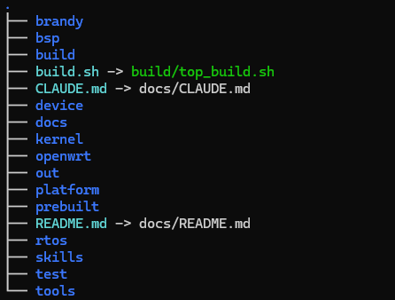
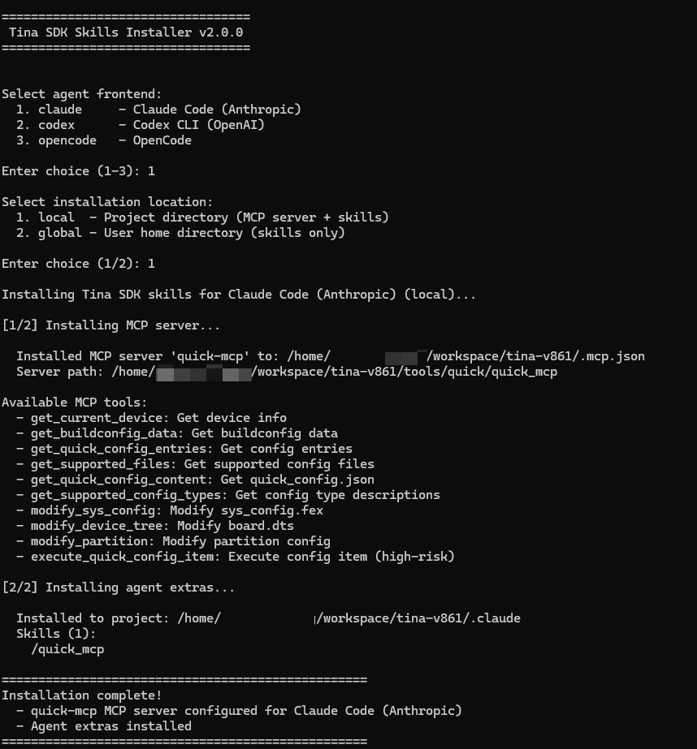
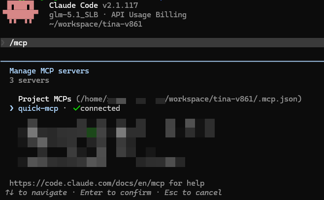

# SDK AI 功能配置指南

本文档介绍如何在 Tina Linux SDK 中配置 AI 辅助开发功能，包括 MCP 配置工具、Skill 知识库和参考文档系统的安装与使用。

## 核心概念

在开始之前，先了解两个核心概念：

### 什么是 MCP？

**MCP（Model Context Protocol）** 是 AI 与外部系统交互的标准协议。它让 AI 助手能够安全地读取和修改项目配置文件，而无需你手动编辑。你可以把 MCP 想象成 AI 的"工具箱"——AI 通过调用这些工具来完成配置修改、信息查询等任务。

例如，当你说"帮我把 boot 分区改成 64M"时，AI 会自动调用 `modify_partition` 这个 MCP 工具来修改配置文件，而不是让你手动去改。

### 什么是 Skill？

**Skill** 是可插拔的知识包，类似于手机 App。安装 Skill 后，AI 就获得了特定领域的专业知识。例如 `quick_mcp` Skill 包含了所有 MCP 工具的详细使用指南，当 AI 需要调用工具时会参考这份指南。

简单来说：

-   **MCP 工具** = AI 能使用的功能（如修改配置）
-   **Skill** = AI 的使用说明书（如何调用这些功能）

* * *

## 前置条件

### Python 3

MCP 服务器和安装脚本依赖 Python 3：

```bash
python3 --version    # 需要 Python 3.6+
```

### AI Agent 工具

选择以下任一工具：

| 工具 | 安装方式 | 说明 |
| --- | --- | --- |
| **Claude Code** | `npm install -g @anthropic-ai/claude-code` | Anthropic 官方 CLI，功能最完整 |
| **Codex CLI** | `npm install -g @openai/codex` | OpenAI Codex 命令行工具 |
| **OpenCode** | 参考官方文档安装 | 开源 AI 编码工具 |

> **推荐使用 Claude Code**，对 MCP 和 Skill 的支持最完善。

### SDK 环境

确保已获取 Tina Linux SDK 源码，目录结构完整：

```bash
cd tina-v861/
tree . -L 1
```



## 初始化安装

### 运行安装脚本

在 SDK 根目录下执行：

```bash
cd tina-v861
python3 skills/scripts/init.py
```

安装脚本会启动交互式引导流程：



### 步骤一：选择 Agent 前端

```
Select agent frontend:
  1. claude     - Claude Code (Anthropic)
  2. codex      - Codex CLI (OpenAI)
  3. opencode   - OpenCode

Enter choice (1-3):
```

输入数字或名称选择你使用的 AI 工具。

### 步骤二：选择安装位置

```
Select installation location:
  1. local  - Project directory (MCP server + skills)
  2. global - User home directory (skills only)

Enter choice (1/2):
```

两种模式的区别：

|  | Local（项目级） | Global（全局） |
| --- | --- | --- |
| **MCP 配置** | 写入项目 `.mcp.json` | 写入全局配置 |
| **Skills** | 复制到项目 `.claude/skills/` | 安装到 `~/.claude/plugins/` |
| **作用范围** | 仅当前项目 | 所有项目 |
| **推荐场景** | 单项目开发 | 多项目共用 |

> **推荐选择 local**，配置与项目绑定，更可控。

### 步骤三：安装过程

脚本自动执行两步安装：

```
[1/2] Installing MCP server...

  Installed MCP server 'quick-mcp' to: /path/to/tina-v861/.mcp.json
  Server path: /path/to/tina-v861/tools/quick/quick_mcp

  Available MCP tools:
    - get_current_device: Get device info
    - get_buildconfig_data: Get buildconfig data
    - ...

[2/2] Installing agent extras...

  Installed to project: /path/to/tina-v861/.claude
  Skills (1):
    /quick_mcp
```

安装完成后：

```
==================================================
Installation complete!
  - quick-mcp MCP server configured for Claude Code
  - Agent extras installed
==================================================
```

* * *

## 安装结果说明

### Local 安装

选择 local 后，SDK 目录下会新增/修改以下文件：

```
tina-v861/
├── .mcp.json                          # [新增] MCP 服务器配置
└── .claude/
    └── skills/
        └── quick_mcp/
            └── SKILL.md               # [新增] MCP 工具使用指南
     ... 其他工具 Skills
```

**`.mcp.json` 内容示例：**

```json
{
  "mcpServers": {
    "quick-mcp": {
      "command": "python3",
      "args": ["/path/to/tina-v861/tools/quick/quick_mcp"]
    }
  }
}
```

### Global 安装

选择 global 后，文件安装到用户主目录：

```
~/.claude/plugins/marketplaces/tina-sdk-skills/
├── plugin.json                        # 插件元数据
├── marketplace.json                   # Marketplace 注册信息
└── skills/
    └── quick_mcp/
        └── SKILL.md                   # MCP 工具使用指南
```

Global 安装后需要手动启用插件：

```bash
claude plugin install tina-sdk-skills@tina-sdk-skills
```

或在 `~/.claude/settings.json` 中添加：

```json
{
  "extraKnownMarketplaces": {
    "tina-sdk-skills": {
      "source": {
        "source": "directory",
        "path": "/home/<user>/.claude/plugins/marketplaces/tina-sdk-skills"
      }
    }
  },
  "enabledPlugins": {
    "tina-sdk-skills@tina-sdk-skills": true
  }
}
```

### 不同 Agent 的安装结果

| Agent | MCP 配置文件 | Skills 安装位置 |
| --- | --- | --- |
| Claude Code (local) | `<project>/.mcp.json` | `<project>/.claude/skills/` |
| Claude Code (global) | — | `~/.claude/plugins/marketplaces/tina-sdk-skills/` |
| Codex CLI | `~/.codex/config.toml` | `<project>/AGENTS.md` |
| OpenCode | `<project>/opencode.jsonc` | 无额外安装 |

* * *

## MCP 工具使用

MCP（Model Context Protocol）工具是 SDK AI 功能的核心，提供结构化的配置修改接口。AI 在对话中会自动调用这些工具，无需手动操作。

### 工具分类

| 类别 | 工具 | 说明 |
| --- | --- | --- |
| **查询** | `get_current_device` | 获取当前芯片、板卡等配置信息 |
|  | `get_supported_config_types` | 获取支持的配置类型列表 |
|  | `get_quick_config_entries` | 获取快速配置选项 |
|  | `get_quick_config_content` | 获取快速配置详细内容 |
|  | `get_supported_files` | 获取配置文件路径 |
|  | `get_buildconfig_data` | 读取 buildconfig 变量（编译配置） |
|  | `query_device_tree` | 查询设备树节点（硬件描述源码） |
| **BoardConfig** | `modify_board_config` | 修改 BoardConfig.mk（编译选项） |
|  | `modify_board_config_batch` | 批量修改 BoardConfig.mk（编译选项） |
|  | `modify_board_config_item` | 修改 BoardConfig 多值项 |
| **sys\_config** | `modify_sys_config` | 修改 sys\_config.fex（硬件描述） |
|  | `modify_sys_config_batch` | 批量修改 sys\_config.fex（硬件描述） |
| **设备树** | `modify_device_tree` | 修改设备树（硬件描述源码） |
|  | `modify_device_tree_batch` | 批量修改设备树（硬件描述源码） |
|  | `modify_bootargs` | 修改内核 bootargs |
| **分区** | `modify_partition` | 修改分区配置 |
|  | `modify_partition_batch` | 批量修改分区配置 |
| **Defconfig** | `modify_kernel_defconfig` | 修改内核 defconfig（功能开关） |
|  | `modify_uboot_defconfig` | 修改 U-Boot defconfig（功能开关） |
|  | `modify_rtos_defconfig` | 修改 RTOS defconfig（实时系统功能开关） |
|  | `modify_openwrt_defconfig` | 修改 OpenWrt defconfig |
| **环境变量** | `modify_env_cfg` | 修改 env.cfg（U-Boot 环境变量） |
|  | `modify_env_cfg_batch` | 批量修改 env.cfg（U-Boot 环境变量） |
| **启动** | `modify_bootpkg` | 修改 boot\_package.cfg（启动镜像打包） |
|  | `modify_bootpkg_batch` | 批量修改 boot\_package.cfg（启动镜像打包） |
|  | `modify_boot0_config` | 修改 Boot0 配置 |
| **特殊** | `modify_amp_reserved_memory` | 修改 AMP 保留内存（异构多核通信区域） |
|  | `generate_dts_base` | 生成设备树基础结构 |
|  | `sync_nand_map` | 同步 NAND 分区映射 |
|  | `execute_quick_config_item` | 执行快速配置项 |

### 使用示例

直接用自然语言与 AI 对话即可，AI 会自动选择合适的 MCP 工具：

```
用户: 帮我把 boot 分区大小改成 64M
AI:  [调用 modify_partition，partition_name="boot", size="64M"]

用户: 查看当前设备树 gmac0 节点的配置
AI:  [调用 query_device_tree，node_name="gmac0", dts_type="board.dts"]

用户: 启用 GMAC 功能
AI:  [调用 execute_quick_config_item，config_name="v861_bga_perf1_gmac"]
```

```
用户输入 → AI 理解意图 → 选择 MCP 工具 → 调用 quick-mcp 服务 → 修改配置文件 → 返回结果
```

### 配置修改优先级

当需要修改 SDK 配置时，遵循以下优先级：

1.  **MCP 工具**（首选） — 类型安全、自动校验
2.  **SDK 脚本**（备选） — `quick_config`、`menuconfig` 等
3.  **直接编辑**（最后） — 仅当以上方法不可用时

* * *

## Skills 使用

Skills（可插拔的知识包，见[核心概念](#%E4%BB%80%E4%B9%88%E6%98%AF-skill)）安装后通过 `/skill_name` 斜杠命令调用。

### 导入 Skills

| Skill | 命令 | 说明 |
| --- | --- | --- |
| quick\_mcp | `/quick_mcp` | MCP 配置工具完整 SOP，包含所有工具的使用示例、参数说明和常见工作流 |

### 使用方式

在 AI 对话中输入斜杠命令：

```
/quick_mcp
```

AI 会加载该 skill 的完整内容到上下文中，然后根据 skill 中的指南执行操作。

### 添加新 Skill

在 `skills/packages/` 下创建新目录和 `SKILL.md`：

```bash
mkdir -p skills/packages/my_skill
```

创建 `skills/packages/my_skill/SKILL.md`：

```yaml
---
name: my_skill
description: 简要描述 skill 的用途和触发条件
---

# My Skill

Skill 内容...
```

重新运行安装脚本即可生效：

```bash
python skills/scripts/init.py
```

* * *

## 参考文档系统

`skills/docs/` 目录包含大量技术参考文档，AI 会在需要时自动检索和阅读。

### 文档分类

| 类别 | 路径 | 涵盖内容 |
| --- | --- | --- |
| SDK 构建 | `skills/docs/sdk/` | 构建命令、快速配置、核心转储分析、sys\_config |
| 设备 | `skills/docs/device/v861/` | 设备树配置、GPIO 引脚复用 |
| BSP 驱动 | `skills/docs/bsp/drivers/` | UART、TWI、SPI、MMC、GMAC、声卡、VIN（摄像头） |
| 多媒体 | `skills/docs/eyesee-mpp/middleware/` | VI、VENC、VO、ISP 等 MPI 接口 |
| RTOS | `skills/docs/melis/` | Melis 调试、backtrace 分析 |

### 使用方式

无需手动操作。AI 会根据你的问题自动检索相关文档。例如：

```
用户: 如何启用 UART2？
AI:  [自动检索 skills/docs/bsp/drivers/uart/SKILL.md 和 skills/docs/device/v861/dts/SKILL.md]
```

### 文档索引

完整索引参见 `skills/README.md`。

### 全志配置文件体系概览

Tina Linux SDK 使用多层配置文件来管理不同的系统组件：

| 配置文件 | 作用域 | 用途 | 修改工具 |
| --- | --- | --- | --- |
| `BoardConfig.mk` | 编译时 | 定义板卡编译选项（如芯片型号、内存大小） | `modify_board_config` |
| `sys_config.fex` | 编译时 | 描述 SoC 内部硬件模块的开关和参数 | `modify_sys_config` |
| `*.dts` (设备树) | 编译时 | 描述板卡上的外设（GPIO、I2C 设备等） | `modify_device_tree` |
| `*_defconfig` | 编译时 | 控制内核/U-Boot/RTOS 的功能编译开关 | `modify_*_defconfig` |
| `env.cfg` | 运行时 | U-Boot 环境变量（启动命令、IP 地址等） | `modify_env_cfg` |
| `boot_package.cfg` | 打包时 | 定义启动镜像的组成（boot0、uboot 等） | `modify_bootpkg` |

**配置修改流程：**

```
修改配置 → 重新编译 (mp) → 烧录固件 → 重启设备
```

大多数 MCP 工具修改的是**源码中的配置文件**，修改后需要重新编译并烧录才能生效。只有 `env.cfg` 等少数运行时配置可以在设备启动后动态修改。

## 故障排查

### MCP 服务器未连接

**症状：** AI 无法调用 MCP 工具，提示工具不可用。

**排查步骤：**

1.  检查 `.mcp.json` 是否存在且配置正确：
    
    ```bash
    cat .mcp.json
    ```
    
2.  检查 quick\_mcp 脚本是否存在：
    
    ```bash
    ls tools/quick/quick_mcp
    ```
    
3.  手动测试 MCP 服务器：
    
    ```bash
    python3 tools/quick/quick_mcp --help
    ```
    
4.  在 Agent CLI 中检查 MCP 状态：
    
    ```
    /mcp
    ```
    



### Skill 未生效

**症状：** 输入 `/quick_mcp` 无反应。

**排查步骤：**

1.  检查 skill 是否已安装：
    
    ```bash
    # local 安装
    ls .claude/skills/quick_mcp/SKILL.md
    
    # global 安装
    ls ~/.claude/plugins/marketplaces/tina-sdk-skills/skills/quick_mcp/SKILL.md
    ```
    
2.  重新运行安装脚本：
    
    ```bash
    python skills/scripts/init.py
    ```
    

### 安装脚本报错

| 错误信息 | 原因 | 解决方法 |
| --- | --- | --- |
| `quick_mcp not found` | `tools/quick/quick_mcp` 文件缺失 | 检查 SDK 是否完整 |
| `Source packages directory not found` | `skills/packages/` 目录缺失 | 检查 SDK 是否完整 |
| `plugin.json not found` | `skills/configs/claude/` 缺失 | 检查 SDK 是否完整 |
| `Python3 not found` | 未安装 Python 3 | 安装 Python 3.6+ |

### 配置修改未生效

MCP 工具修改的是源码中的配置文件，修改后需要重新编译才能生效：

```bash
source build/envsetup.sh
lunch
mp          # 重新编译并打包
```
