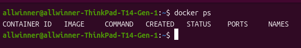
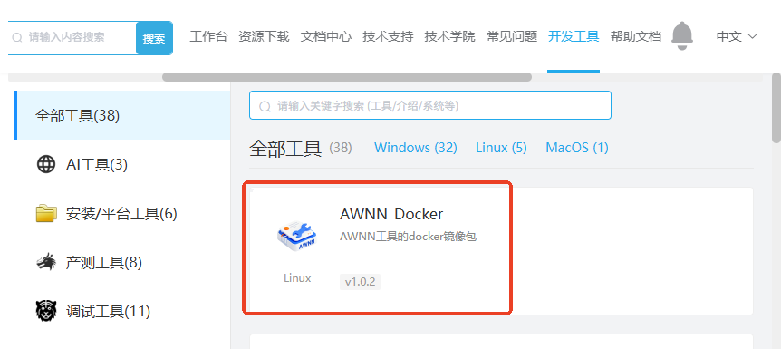
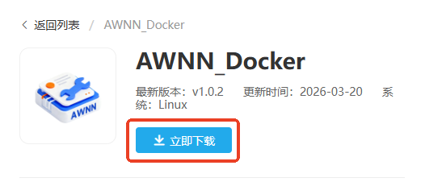
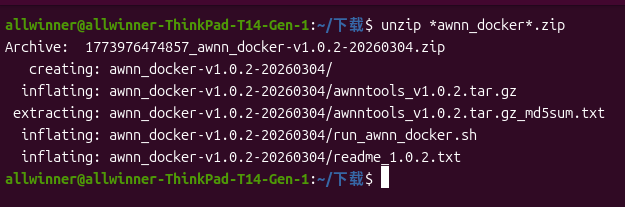
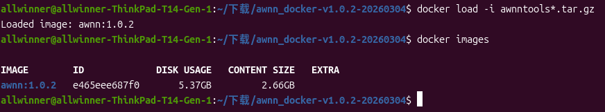

# AWNN 开发环境部署

AWNN 提供 Docker 部署环境，需要搭建 Docker 开发环境。本文档将指导您完成从 Docker 安装到 AWNN 开发环境搭建的完整流程。

**主要步骤：**

1.  安装 Docker CE
2.  获取 AWNN Docker 镜像包
3.  导入 Docker 镜像
4.  创建并启动 Docker 容器

## 系统要求

### 操作系统要求

-   **推荐系统**：Ubuntu 20.04 LTS 或更高版本
-   **其他支持**：Debian 10+、CentOS 7+、Fedora 33+
-   **架构要求**：x86\_64 (amd64)

### 硬件要求

-   **内存**：至少 8GB RAM（推荐 16GB 或更多）
-   **磁盘空间**：至少 20GB 可用空间（镜像文件较大）
-   **CPU**：双核或更多核心

### 网络要求

-   稳定的互联网连接（用于下载 Docker 和镜像包）
-   能够访问 Docker Hub 和全志客户服务平台

### 权限要求

-   具有 sudo 权限的用户账户
-   或 root 用户账户

## Docker CE 安装

Docker 安装请参考 Docker 官方网站提供的安装流程 [Install Docker Engine](https://docs.docker.com/engine/install/)，本文将以 Ubuntu 为例，演示安装流程：

### 步骤 1：删除旧版本

删除 Ubuntu 自带版本或者过时版本安装包：

```bash
sudo apt remove $(dpkg --get-selections docker.io docker-compose docker-compose-v2 docker-doc podman-docker containerd runc | cut -f1)
```

**注意事项：**

-   此命令会删除系统中已有的 Docker 相关包
-   如果您之前安装过 Docker，建议先备份重要数据

### 步骤 2：安装 apt 源

```bash
# Add Docker's official GPG key:
sudo apt update
sudo apt install ca-certificates curl
sudo install -m 0755 -d /etc/apt/keyrings
sudo curl -fsSL https://download.docker.com/linux/ubuntu/gpg -o /etc/apt/keyrings/docker.asc
sudo chmod a+r /etc/apt/keyrings/docker.asc

# Add the repository to Apt sources:
sudo tee /etc/apt/sources.list.d/docker.sources <<EOF
Types: deb
URIs: https://download.docker.com/linux/ubuntu
Suites: $(. /etc/os-release && echo "${UBUNTU_CODENAME:-$VERSION_CODENAME}")
Components: stable
Architectures: $(dpkg --print-architecture)
Signed-By: /etc/apt/keyrings/docker.asc
EOF

sudo apt update
```

**注意事项：**

-   确保系统已安装 `ca-certificates` 和 `curl` 包
-   如果网络连接有问题，可能需要配置代理

### 步骤 3：安装 Docker 相关软件包

```bash
sudo apt install docker-ce docker-ce-cli containerd.io docker-buildx-plugin docker-compose-plugin
```

**注意事项：**

-   安装过程可能需要几分钟时间
-   确保网络连接稳定

### 步骤 4：将当前用户加入 Docker 组

```bash
sudo usermod -aG docker $USER
```

**注意事项：**

-   执行此命令后，需要注销并重新登录才能生效
-   或者执行 `newgrp docker` 命令立即生效

### 步骤 5：验证 Docker 安装

```bash
docker ps
```

**预期结果：**

-   如果看到类似以下的输出，说明 Docker 安装成功：
    
    ```
    CONTAINER ID   IMAGE   COMMAND   CREATED   STATUS   PORTS   NAMES
    ```
    



-   如果出现权限错误，请参考[常见问题解答](#%E5%B8%B8%E8%A7%81%E9%97%AE%E9%A2%98%E8%A7%A3%E7%AD%94)

## 获取 AWNN Docker 镜像包

前往 [全志客户服务平台 - 开发工具](https://open.allwinnertech.com/#/devtoolIndex?menuID=37) 页面，找到 AWNN Docker



点击 【立即下载】 按钮下载镜像包



**注意事项：**

-   需要注册并登录全志客户服务平台才能下载
-   镜像包文件较大（通常 1-3GB），请确保网络稳定

## 导入 AWNN Docker 镜像

下载 zip 文件后先解压压缩包

```bash
unzip *awnn_docker*.zip
```



解压完成后，导入 Docker 镜像，进入文件夹中

```bash
cd awnn_docker*
```

执行命令，将 Docker 导入

```bash
docker load -i awnntools*.tar.gz
```

等待导入结束后，执行命令检查是否导入正确

```bash
docker images
```



**注意事项：**

-   导入过程可能需要几分钟时间，取决于镜像大小和系统性能
-   确保有足够的磁盘空间
-   如果导入失败，请参考[常见问题解答](#%E5%B8%B8%E8%A7%81%E9%97%AE%E9%A2%98%E8%A7%A3%E7%AD%94)

## 创建 Docker 容器并启动

首先创建一个 AWNN 工作区

```bash
mkdir awnn_workspace
cd awnn_workspace
```

然后创建并启动容器，注意 `<version>` 替换成你的 AWNN 版本

```bash
docker run -it -v $PWD:/data --name awnn-devel awnn:<version>
```

例如本文的 AWNN 版本是 `1.0.2` 则运行命令

```bash
docker run -it -v $PWD:/data --name awnn-devel awnn:1.0.2
```

**参数说明：**

-   `-it`：以交互模式运行容器，并分配一个伪终端
-   `-v $PWD:/data`：将当前目录挂载到容器的 `/data` 目录
-   `--name awnn-devel`：为容器指定名称

**注意事项：**

-   容器名称 `awnn-devel` 可以自定义，但建议保持一致以便管理
-   如果端口有冲突，可以使用 `-p` 参数指定端口映射

### 如果需要启动已经创建好的容器

1.  列出所有容器

```bash
docker ps -a
```

2.  启动目标容器

```bash
docker start awnn-devel
```

3.  进入正在运行的容器，并启动一个交互式 `Bash Shell`

```bash
docker exec -it awnn-devel /bin/bash
```

**注意事项：**

-   如果容器已经停止，需要先启动再进入
-   可以使用 `docker logs awnn-devel` 查看容器日志

## 注意事项

### 安全注意事项

1.  **权限管理**：不要以 root 用户运行 Docker，建议将用户加入 docker 组
2.  **镜像来源**：只从官方或可信来源获取 Docker 镜像
3.  **网络安全**：在公共网络环境下注意保护敏感数据

### 性能注意事项

1.  **资源分配**：确保宿主机有足够的资源（CPU、内存、磁盘）
2.  **存储位置**：建议将 Docker 数据目录放在 SSD 上以提高性能
3.  **日志管理**：定期清理容器日志以避免磁盘空间不足

### 维护注意事项

1.  **定期更新**：定期更新 Docker 和 AWNN 镜像以获取最新功能和安全修复
2.  **备份数据**：定期备份容器中的重要数据
3.  **清理资源**：定期清理未使用的镜像、容器和卷

## 常见问题解答

### Q1: Docker 安装失败怎么办？

**问题描述**：执行 `docker ps` 时出现 "permission denied" 错误

**解决方案**：

1.  确认用户已加入 docker 组：
    
    ```bash
    groups $USER
    ```
    
2.  如果没有 docker 组，需要重新登录或执行：
    
    ```bash
    newgrp docker
    ```
    
3.  如果仍然失败，检查 Docker 服务是否运行：
    
    ```bash
    sudo systemctl status docker
    ```
    

### Q2: 镜像导入失败怎么办？

**问题描述**：执行 `docker load` 时出现错误

**解决方案**：

1.  检查文件是否完整：
    
    ```bash
    ls -lh awnntools*.tar.gz
    ```
    
2.  检查磁盘空间：
    
    ```bash
    df -h
    ```
    
3.  尝试重新下载镜像包
4.  检查 Docker 服务状态：
    
    ```bash
    sudo systemctl status docker
    ```
    

### Q3: 容器启动失败怎么办？

**问题描述**：执行 `docker run` 时出现错误

**解决方案**：

1.  检查镜像是否存在：
    
    ```bash
    docker images
    ```
    
2.  检查容器名称是否已存在：
    
    ```bash
    docker ps -a
    ```
    
3.  如果名称冲突，可以删除旧容器或使用不同名称
4.  查看详细错误信息：
    
    ```bash
    docker run -it -v $PWD:/data --name awnn-devel-new awnn:1.0.2
    ```
    

### Q4: 如何退出容器？

**解决方案**：

1.  在容器内执行 `exit` 命令
2.  或者使用快捷键 `Ctrl + D`
3.  如果需要在后台运行容器，使用 `Ctrl + P` 然后 `Ctrl + Q`

### Q5: 如何删除容器和镜像？

**解决方案**：

1.  删除容器：
    
    ```bash
    docker rm awnn-devel
    ```
    
2.  删除镜像：
    
    ```bash
    docker rmi awnn:1.0.2
    ```
    
3.  强制删除运行中的容器：
    
    ```bash
    docker rm -f awnn-devel
    ```
    

## 故障排除

### 查看日志

1.  查看容器日志：
    
    ```bash
    docker logs awnn-devel
    ```
    
2.  实时查看日志：
    
    ```bash
    docker logs -f awnn-devel
    ```
    
3.  查看 Docker 服务日志：
    
    ```bash
    sudo journalctl -u docker.service
    ```
    

### 常见错误代码

| 错误代码 | 描述 | 解决方案 |
| --- | --- | --- |
| 125 | 容器启动失败 | 检查镜像和配置 |
| 126 | 命令无法执行 | 检查权限和路径 |
| 127 | 命令未找到 | 检查命令拼写 |
| 137 | 容器被强制终止 | 检查内存限制 |

### 调试技巧

1.  **进入容器调试**：
    
    ```bash
    docker exec -it awnn-devel /bin/bash
    ```
    
2.  **查看容器进程**：
    
    ```bash
    docker top awnn-devel
    ```
    
3.  **查看容器资源使用**：
    
    ```bash
    docker stats awnn-devel
    ```
    
4.  **检查容器配置**：
    
    ```bash
    docker inspect awnn-devel
    ```
