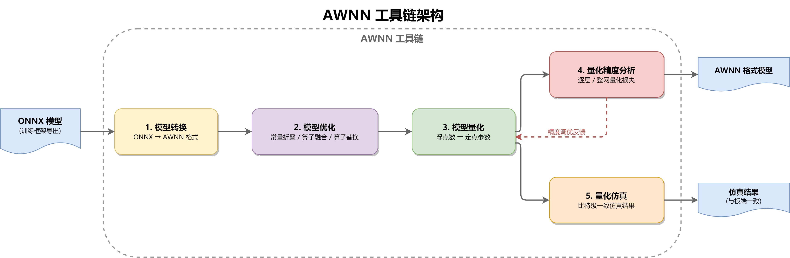
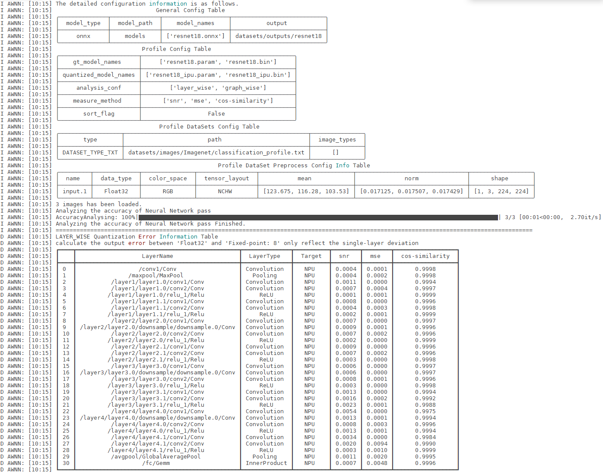
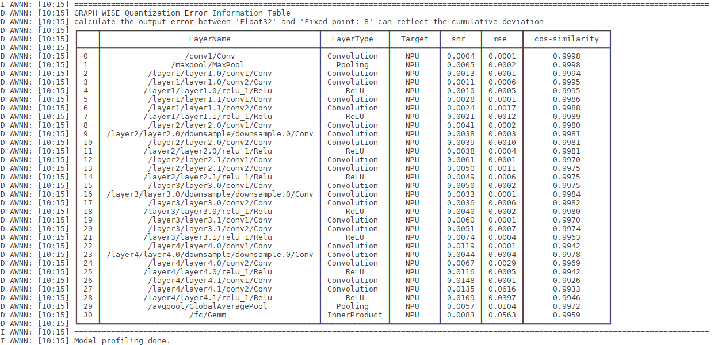

# AWNN 工具链使用指南

本文档描述了 AWNN 工具链的功能与使用方法，面向零基础用户介绍如何操作工具链，在 PC 上完成模型转换及板端结果验证等功能，旨在协助技术支持工程师、AI 软件开发工程师和 AI 算法开发工程师快速上手 AWNN 工具链的使用。

## 概述

AWNN 工具链用来帮助用户将深度学习模型部署在 Allwinner 芯片上。为了调用 NPU 资源，用户需要使用 AWNN 工具链提供的离线工具，将模型转换成 AWNN 支持的模型文件，并使用 AWNN Runtime 库来完成开发板上的板端部署。



工具链包含以下功能模块：

| 功能模块 | 具体描述 |
| --- | --- |
| build | 完成模型优化、量化等操作，生成可供 NPU 使用的模型文件 |
| profile | 帮助用户完成模型量化后的精度分析 |
| simulate | 用于模型仿真，可以脱离板端获取目标模型的推理仿真结果 |
| encrypt | 为用户提供基础的模型加密功能 |
| generate\_config\_file | 基于用户提供的模型为用户生成配置文件模板 |

所有功能指令以 `awnntools` 开头，对应命令为 `awnntools build`、`awnntools profile`、`awnntools simulate`、`awnntools encrypt` 以及 `awnntools generate_config_file`。

```shell
root@xxx:/data# awnntools -h
usage: awnntools [-h] [-v] {convert,build,profile,simulate,encrypt,generate_config_file} ...

AWNNToolKits: The offline tools for Neural Network quantization and optimization.

positional arguments:
  {convert,build,profile,simulate,encrypt,generate_config_file}
    convert             convert your model to ncnn format
    build               compiling the model for execution on NPU devices.
    profile             get profile information
    simulate            get simulate results
    encrypt             encrypt model files
    generate_config_file
                        generate the required configuration file template based on the provided ONNX model

optional arguments:
  -h, --help            show this help message and exit
  -v, --version         show version
```

此外，AWNN 还提供了板端推理验证工具 `awnn_verify`，用于在开发板上执行模型推理并与仿真结果进行比对。

* * *

## 快速入门

本节以 `yolov5s` 模型为例，演示从 PC 端模型转换到板端部署验证的完整流程，帮助用户快速上手 AWNN 工具链。

### 准备资源

-   **模型**

目前工具仅支持 ONNX 模型转化，本节基于 `$(V861-SDK)/platform/allwinner/vision/awnn_sdk` 中的 `yolov5s` 示例进行说明，模型位置 `awnn_sdk/toolkits/example/yolov5s`，我们将其拷贝到创建的 `awnn_workspace` 中。

> 📷 原文图片缺失：`figures/2026-06-09 15-34-26.png`

其中的 `models/yolov5s.onnx` 为标准的 ONNX 模型文件。如开发者使用其他深度学习框架，请先将其模型转换至 ONNX 格式。

-   **校准文件**

`images/*` 目录存放用于模型量化（Quantization）校准图像数据集。

> 📷 原文图片缺失：`figures/2026-06-09 15-35-10.png`

-   **yml 文件**

`yolov5_config.yml` 定义了模型构建、性能剖析与仿真所需的全部参数。建议开发者首先使用 `awnntools` 生成一个标准配置模板，然后基于该模板根据您的具体需求进行修改。

执行命令：

```shell
awnntools generate_config_file configs/config.yml models/yolov5s.onnx
```

-   `generate_config_file`：子命令，功能是生成一个配置文件模板
-   `configs/config.yml`：指定生成的配置文件的保存路径和文件名
-   `models/yolov5s.onnx`：指定源模型文件（此处为 yolov5s 的 ONNX 格式）的路径

Loading asciinema cast...

### PC 端模型转换

#### 执行编译

执行 `awnntools build` 命令来完成模型的编译。

```shell
awnntools build configs/yolov5_config.yml
```

-   `build`：子命令，功能是将配置文件描述的模型编译成 NPU 可执行文件
-   `configs/yolov5_config.yml`：指定编译所需的配置文件

Loading asciinema cast...

#### 精度分析

执行 `awnntools profile` 命令对比量化模型与浮点模型的精度。

```shell
awnntools profile configs/yolov5_config.yml --log-file ./output/yolov5s.csv
```

-   `profile`：子命令，功能是对配置文件描述的模型进行 profile 分析
-   `configs/yolov5_config.yml`：指定 profile 所需的配置文件
-   `--log-file`：指定保存 profile 信息的文件

Loading asciinema cast...

#### 执行仿真

执行 `awnntools simulate` 命令完成模型仿真，利用仿真数据核验板端推理结果。

```shell
awnntools simulate configs/yolov5_config.yml
```

-   `simulate`：子命令，功能是对配置文件描述的模型进行仿真
-   `configs/yolov5_config.yml`：指定仿真所需的配置文件

Loading asciinema cast...

仿真结束后，推理的结果保存在 `results` 目录下。

### 板端快速部署

#### 编译推理工具

执行 `make menuconfig`，选中 awnn 中间件配置以及验证工具，重新编译 SDK 生成 `awnn_verify` 工具。

```
OpenWrt Configuration
    Allwinner  --->
        Vision  --->
            <*> awnn_runtime....................... Allwinner NPU (AWNN) runtime librarys
            <*>   awnn_verify........................................... awnn verify toools
```

-   `awnn_runtime`：NPU 运行相关的中间件
-   `awnn_verify`：模型板端推理工具

#### 将推理文件推送至板端

将 `yolov5s` 仿真结果推送到板端设备中，包含的文件及目录格式如下：

```
~/awnn_sdk/toolkits/example/yolov5s-ver$ tree
.
├── models
│   ├── yolov5s_ipu.bin
│   └── yolov5s_ipu.param
└── results
    └── images_dog.jpg
        ├── config.txt
        ├── images_fp32.bin
        ├── images_int8.bin
        ├── _model.24_Reshape_1_output_0_fp32.bin
        ├── _model.24_Reshape_1_output_0.npy
        ├── _model.24_Reshape_2_output_0_fp32.bin
        ├── _model.24_Reshape_2_output_0.npy
        ├── _model.24_Reshape_output_0_fp32.bin
        └── _model.24_Reshape_output_0.npy

3 directories, 11 files
```

#### 板端执行推理

```shell
root@(none):/tmp/awnn/yolov5s-ver# awnn_verify results/images_dog.jpg/config.txt
```

#### 查看推理信息

运行的 log 信息示例：

```
AWNN SDK Version: 1.0.8
finish setting outputPrefix.
finish creating AWNNInstance.
finish setting input buffer.
finish setting input information.
finish setting output information.
======>finish assigning blob memory offset!
finish precompiler.
finish loading input bin.
finish setInTensors.
-----------------------caseNet inference 0-----------------------
NPU Layer NETQUEUE                 subnet[0]                      | Write BW:    91.26 MBps | Read BW:   212.68 MBps | Time:    34.22 ms    |
MIX Layer LayoutConvert            BUFFER2HOST                    | Write BW:    65.41 MBps | Read BW:    43.63 MBps | Time:    28.07 ms    |
CPU Layer Reshape                  /model.24/Reshape              | Write BW: 816000.06 MBps | Read BW: 816000.06 MBps | Time:     0.01 ms    |
NPU Layer NETQUEUE                 subnet[1]                      | Write BW:    67.45 MBps | Read BW:   199.28 MBps | Time:     3.42 ms    |
MIX Layer LayoutConvert            BUFFER2HOST                    | Write BW:    65.93 MBps | Read BW:    43.98 MBps | Time:     6.96 ms    |
CPU Layer Reshape                  /model.24/Reshape_1            | Write BW: 108800.00 MBps | Read BW: 108800.00 MBps | Time:     0.01 ms    |
NPU Layer NETQUEUE                 subnet[2]                      | Write BW:    26.38 MBps | Read BW:   255.38 MBps | Time:     3.88 ms    |
MIX Layer LayoutConvert            BUFFER2HOST                    | Write BW:    69.34 MBps | Read BW:    46.25 MBps | Time:     1.66 ms    |
CPU Layer Reshape                  /model.24/Reshape_2            | Write BW: 58285.72 MBps | Read BW: 58285.72 MBps | Time:     0.01 ms    |
finish inference.
outputNames[0] = /model.24/Reshape_output_0, [w, h, d, c] = [80, 80, 85, 3], size = 1632000
outputNames[1] = /model.24/Reshape_1_output_0, [w, h, d, c] = [40, 40, 85, 3], size = 408000
outputNames[2] = /model.24/Reshape_2_output_0, [w, h, d, c] = [20, 20, 85, 3], size = 102000
finish getting output tensor dim info.
finish getOutTensors.
results/images_dog.jpg/_model.24_Reshape_output_0_fp32.bin: test success ^_^ ^_^ ^_^
count success num: 1632000, count fail num: 0
results/images_dog.jpg/_model.24_Reshape_1_output_0_fp32.bin: test success ^_^ ^_^ ^_^
count success num: 408000, count fail num: 0
results/images_dog.jpg/_model.24_Reshape_2_output_0_fp32.bin: test success ^_^ ^_^ ^_^
count success num: 102000, count fail num: 0
yolov5s:  min =   89.45  max =   89.45  avg =   89.45
AWNN Memory Statistics: blobMemorySize=15.2039MB, weightMemorySize=6.9608MB, queueMemorySize=0.7748MB, npuMemorySize=22.9395MB
```

**模型运行耗时**

-   **min、max、avg** 的值表示模型在 NPU 上单次推理的完整处理耗时。由于测试时 `loop_count` 设为 1（即仅运行一次），因此示例中最小值、最大值与平均值相同。在实际多轮测试中，这三个数值将分别反映最快、最慢和平均推理时间。

**内存占用统计**

-   **`blobMemorySize`**：存储网络中间特征图（feature maps）所需的内存空间
-   **`weightMemorySize`**：存储模型权重（weights）参数所需的内存空间
-   **`npuMemorySize`**：NPU 运行该模型所需的总内存（前三项之和）

* * *

## 配置文件

配置文件（`config.yml`）是 AWNN 工具链的核心，所有功能（`build`、`profile`、`simulate`、`encrypt`）都依赖它来指定模型路径、数据集、量化参数等。本章介绍配置文件的生成方法和各参数的含义。

:::tip

:::note

提示

:::
:::note

建议先使用 `generate_config_file` 生成模板，再根据实际需求修改。详细参数表见 [附录：config.yml 完整参数参考](#%E9%99%84%E5%BD%95configyml-%E5%AE%8C%E6%95%B4%E5%8F%82%E6%95%B0%E5%8F%82%E8%80%83)。

:::

:::

### 生成配置文件模板

使用 `generate_config_file` 功能，根据用户提供的模型生成对应的配置文件模板。工具会根据模型信息生成输入模型的建议存放路径，以及输入输出 tensor 的名称和 shape 信息。

```shell
root@xxx:/data# awnntools generate_config_file -h

usage: awnntools generate_config_file [-h] config model_path

positional arguments:
  config      generated config file path
  model_path  input onnx model path

optional arguments:
  -h, --help  show this help message and exit
```

以 `ResNet18` 为例：

```shell
root@xxx:/data$ awnntools generate_config_file resnet18_config.yml ${model_path}/resnet18.onnx
```

:::warning

:::note

注意

:::
:::note

用户获取的配置文件模板只是一个参考模板，用户必须仔细核对各项配置，不能直接拿来当作最终的配置文件使用。

:::

:::
:::note

:::note

备注

:::
:::note

1.  `general_conf` 下的 `model_path` 和 `model_names` 会根据输入 ONNX 模型的路径生成。用户也可根据自己的需要来自行配置模型路径信息。
2.  `dataset_conf` 中，`preprocess_conf` 默认为列表，列表中的数目依赖于工具读取到的 ONNX 模型信息，其中各个列表元素中的 `name` 和 `shape` 会根据输入的 ONNX 模型读取生成。用户也可根据自己的判断以及模型实际情况来自行配置输入信息。`tensor_layout` 默认设置为 `NCHW`。
3.  如果工具判断输入模型为多输入模型，工具会指定 `dataset_conf` 中的 `type` 为 `DATASET_TYPE_JSON`。
4.  工具依赖于输入 ONNX 的信息来给出基础的配置信息，如果出现与用户预期（或者可视化软件呈现）不一致的情况，首先需要用户自行确认 ONNX 模型的详细信息，如果 ONNX 模型存储信息确实与预期不一致，则需要用户自行修改 ONNX 模型，如果确认为工具解析问题，请反馈给工具开发人员。
5.  用户导出 ONNX 模型前，请参考 NPU 硬件算子支持列表，酌情将包含不支持算子的部分不导出或者导出后自行裁剪（工具提供了一定程度的模型裁剪功能，该功能参考 [模型子图切分](#%E6%A8%A1%E5%9E%8B%E5%AD%90%E5%9B%BE%E5%88%87%E5%88%86)），一般来讲，对于用户模型部署所需的后处理操作，基于模型部署效率的考量，我们建议用户自行实现。
6.  建议用户导出 ONNX 模型时，指定 opset=11。optset 不等于 11 时（尤其是低于 11 时），如果遇到转换出错的问题，可以尝试重新导出 ONNX 模型，并指定 opset=11。

:::

:::

### general\_conf

`general_conf` 用于配置模型的通用信息，该类信息可以用于工具的不同子功能的使用。

| 参数 | 说明 | 类型 |
| --- | --- | --- |
| `model_type` | 输入模型的类型。`build` 功能使用时可配置为 `onnx`，其余功能工具会强制使用 `ncnn` | string |
| `model_path` | 输入模型文件的路径。使用相对路径时，应为相对于当前工作目录的路径 | string |
| `model_names` | 输入模型的名称。`ncnn` 时需两个值（`.param` + `.bin`），`onnx` 时仅需一个 `.onnx` 值 | string list |
| `output` | 输出文件存放路径 | string |

### dataset\_conf

`dataset_conf` 用于构建数据集的参数管理，被 `build`、`profile`、`simulate` 等多个功能共用。

**数据集管理类型**：

| 类型 | 说明 |
| --- | --- |
| `DATASET_TYPE_TXT` | 通过用户给定的 txt 文件来管理校准数据集，一行作为一组输入 |
| `DATASET_TYPE_PATH` | 工具自动分析用户给定路径下的图片格式文件（`jpg`、`png`、`JPEG`、`bmp`），全部作为校准数据 |
| `DATASET_TYPE_JSON` | 适配多输入模型的校准数据，数据集须为字典的列表，每个元素包含输入名称和数据路径 |

**数据集配置参数**：

| 参数 | 说明 | 类型 |
| --- | --- | --- |
| `type` | 数据集的管理类型 | string |
| `path` | 数据集的路径或者数据集管理文件（TXT 或 JSON）的路径 | string |
| `preprocess_conf` | 校准数据集的预处理操作配置（见下表） | list |

**preprocess\_conf 预处理参数**：

| 参数 | 说明 | 类型 |
| --- | --- | --- |
| `name` | 输入 tensor 的名称 | string |
| `color_space` | 图片的颜色空间，支持 `RGB`、`BGR`、`RGBA`、`BGRA` 和 `GRAY` | string |
| `mean` | 数据预处理使用的均值，列表长度与通道数一致 | float list |
| `norm` | 数据预处理使用的归一化系数，列表长度与通道数一致 | float list |
| `tensor_layout` | 输入数据的张量布局，支持 `NHWC`、`NCHW`、`HWC` 和 `CHW` | string |
| `shape` | 输入数据的形状，需与 `tensor_layout` 吻合（如 `NCHW` 对应 `[N, C, H, W]`） | int list |

:::note

:::note

备注

:::
:::note

参数 `color_space`、`mean`、`norm` 只对图片格式的输入数据有效，对于 `npy` 数据不生效，且 `npy` 格式的数据的 `shape` 信息以及 `tensor_layout` 与参数配置值要保持一致。

:::

:::

### build\_conf

`build_conf` 用于配置模型 build 阶段的参数信息。

| 参数 | 说明 | 类型 | 默认值 |
| --- | --- | --- | --- |
| `build_mode` | 模型构建模式。`auto`：默认全流程；`quantize`：混合精度量化；`prefabricated`：自定义量化校准表 | string | `auto` |
| `export_type` | 模型导出模式，目前仅支持 `standard` | string | `standard` |
| `debug_enable` | 是否开启 debug 模式，`false` 时不输出调试信息 | bool | `true` |
| `enable_onnxsim` | 是否使用 onnxsim 来简化 onnx 模型 | bool | `true` |
| `save_temporary_model` | 是否存储临时模型数据 | bool | `false` |
| `use_npu_preprocess` | 是否使用 NPU 进行图像预处理 | bool | `false` |
| `opt_level` | 优化等级。`0`：不优化；`1`：开启硬件相关优化 | int | `1` |
| `calibration_engine` | 校准引擎，目前仅支持 `default` | string | `default` |
| `cutstartname` | 模型裁剪后的输入节点名称（用于子图切分） | string list | \- |
| `cutendname` | 模型裁剪后的输出节点名称（用于子图切分） | string list | \- |

**quantize\_conf 量化参数**：

| 参数 | 说明 | 可选值 |
| --- | --- | --- |
| `calibration_algorithm` | 量化校准算法 | `minmax`、`kl`、`percentile`（推荐） |

**hybrid\_quantization\_conf 混合精度量化参数**：

| 参数 | 说明 | 类型 |
| --- | --- | --- |
| `white_list` | 算子白名单，名单内的算子将取消量化，使用浮点精度推理 | string list |
| `op_type_white_list` | 算子类型白名单，该类型算子将取消量化，使用浮点精度推理 | string list |

### profile\_conf

`profile_conf` 用于配置模型 profile 阶段的参数信息。

| 参数 | 说明 | 类型 |
| --- | --- | --- |
| `gt_model_names` | 转换后的浮点模型文件名列表。不指定时根据 `general_conf` 推断 | string list |
| `quantized_model_names` | 量化后的模型文件名列表（`_ipu` 后缀） | string list |
| `dataset_conf` | 数据集配置，参照 [dataset\_conf](#datasetconf) | \- |
| `evaluation_conf` | 评估指标配置（见下表） | \- |

**evaluation\_conf 评估参数**：

| 参数 | 说明 | 可选值 |
| --- | --- | --- |
| `sort_flag` | 排序使能 | bool |
| `analysis_conf` | 精度评估度量维度 | `layer_wise`、`graph_wise` |
| `measure_method` | 精度评估度量方法 | `snr`、`mse`、`cos-similarity` |

### simulate\_conf

`simulate_conf` 用于配置模型 simulate 阶段的参数信息。

| 参数 | 说明 | 类型 |
| --- | --- | --- |
| `model_names` | 输入模型文件名称（目前仅支持 ncnn 模型及本工具量化后的模型） | string list |
| `monitor_blobs` | 仿真导出 blob 的名称，建议按网络中的调用顺序指定 | string list |
| `dump_path` | 导出数据存放路径 | string |
| `dataset_conf` | 数据集配置，参照 [dataset\_conf](#datasetconf) | \- |

### encrypt\_conf

`encrypt_conf` 用于配置模型 encrypt 阶段的参数信息。

| 参数 | 说明 | 类型 |
| --- | --- | --- |
| `model_names` | 需要加密的模型文件名称 | string list |
| `output` | 加密后的模型文件的存放路径 | string |

* * *

## 模型编译（build）

本章介绍如何使用 `awnntools build` 将 ONNX 模型转换为 NPU 可执行的格式，以及相关的进阶配置（子图切分、混合精度量化）。

### 基本用法

AWNN 工具链支持 [ONNX（Open Neural Network Exchange）](https://onnx.ai/) 作为输入模型的中间表示来完成模型转换量化。用户可以通过深度学习框架（`TensorFlow`、`PyTorch`、`MXNet`）的 ONNX 格式文件的导出接口来生成 ONNX 格式模型文件。

用户需要正确配置 `config.yml` 中的 [general\_conf](#generalconf) 和 [build\_conf](#buildconf)，然后使用 `awnntools build` 编译生成 NPU 支持的格式文件。

```shell
root@xxx:/data$ awnntools build -h
usage: awnntools build [-h] [--build_mode {auto,quantize,encrypt}] [--model_type {onnx,ncnn}] [--model_path MODEL_PATH] [--model_names MODEL_NAMES [MODEL_NAMES ...]] [--output OUTPUT] config

positional arguments:
  config                deploy config path

optional arguments:
  -h, --help            show this help message and exit
  --build_mode {auto,quantize,encrypt}
                        set compile mode, quantize mode is for hybrid_quantization
  --model_type {onnx,ncnn}   input model type
  --model_path MODEL_PATH
                        input model path
  --model_names MODEL_NAMES [MODEL_NAMES ...]
                        input model names
  --output OUTPUT
                        output path
```

用户也可以通过命令行赋值的方式来配置个别参数（如 `build_mode`、`model_type`、`model_path`、`model_names`、`output`），命令行传入的参数将覆盖 config 文件中的配置。

模型转换运行示例：

```shell
root@xxx:/data$ awnntools build config.yml
```

转换结束后，用户会在模型所在的目录下或者用户配置的 `output` 目录下生成一系列的文件：

```shell
root@xxx:/data$ tree
.
├── resnet18.bin         # 从 onnx 模型转换得到的 ncnn 模型权重文件
├── resnet18.param       # 从 onnx 模型转换得到的 ncnn 模型结构文件
├── resnet18.table       # 使用 PTQ 校准算法得到的校准表
├── resnet18_ipu.bin     # 量化后的模型权重文件
├── resnet18_ipu.param   # 量化后的模型结构文件
├── resnet18_opt.bin     # 优化后的模型权重文件
├── resnet18_opt.param   # 优化后的模型结构文件
└── resnet18_opt.table   # 优化后的得到的校准表

0 directories, 8 files
```

其中，后缀含 `_ipu` 的文件为板端可运行的模型文件。

### 模型子图切分

如果模型中存在 AWNN 工具链不支持的算子（如 `TopK`、`NonMaxSuppression`、`Less` 等后处理算子），导致转换报错，或者后处理使用工具链导出效率不如用户自己实现，可以通过模型裁剪功能将图的后处理子图部分或前处理部分移除。

模型裁剪通过 config 文件中的 `cutstartname` 和 `cutendname` 参数进行：

-   `cutstartname`：指定裁剪后的输入节点名称
-   `cutendname`：指定裁剪后的输出节点名称
-   不配置时将使用原有的输入输出节点名称

```yaml
build_conf:
    cutstartname:
    - 'input_0' # 输入节点名称
    cutendname:
    - 'output_0' # 输出节点名称
    - 'output_1' # 输出节点名称
```

:::note

:::note

备注

:::
:::note

用户如果要配置 `cutstartname`，一定要将裁剪后的新模型所有输入节点的名称全部配置进去。

:::

:::

### 混合精度量化

AWNN 工具链支持混合精度量化，可以对指定算子或者某一类算子设置量化精度。对于精度损失较大的算子，可以指定其解除量化，使用 CPU 进行浮点运算。

配置方法：设置 `build_conf` 中的 `build_mode` 为 `quantize`（或继续使用 `auto`），然后配置 `hybrid_quantization_conf`：

-   `white_list`：将需要使用 CPU 浮点计算的算子名称添加进去
-   `op_type_white_list`：将需要浮点计算的某类算子添加进去

```yaml
build_conf:
    build_mode: quantize
    export_type: standard
    debug_enable: True
    opt_level: 1
    hybrid_quantization_conf:
        op_type_white_list:
            - HardSigmoid
            - HardSwish
        white_list:
            - /fc/Gemm
```

:::warning

:::note

注意

:::
:::note

使用 CPU 进行浮点运算会带来运行耗时的增加，请谨慎选择需要解除量化的算子。

:::

:::

* * *

## 精度分析（profile）

本章介绍如何使用 `awnntools profile` 进行量化精度分析，包括分析维度、评估指标和精度问题排查流程。

### 基本用法

模型转换完成后，用户可以使用 `profile` 功能来完成模型的量化精度分析。

```shell
root@xxx:/data# awnntools profile -h
usage: awnntools profile [-h] [--model_type {onnx,ncnn}] [--model_path MODEL_PATH] [--model_names MODEL_NAMES [MODEL_NAMES ...]] [--quantized_model_names QUANTIZED_MODEL_NAMES [QUANTIZED_MODEL_NAMES ...]] [--log-file LOG_FILE] config

positional arguments:
  config                deploy config path

optional arguments:
  -h, --help            show this help message and exit
  --model_type {onnx,ncnn}   input model type
  --model_path MODEL_PATH
                        input model path
  --model_names MODEL_NAMES [MODEL_NAMES ...]
                        gt model names
  --quantized_model_names QUANTIZED_MODEL_NAMES [QUANTIZED_MODEL_NAMES ...]
                        quantized model names
  --log-file LOG_FILE   log file path, endswith .csv
```

可选参数 `log_file` 用于保存工具运行过程中的 log 信息以及最终的精度分析结果，后缀须为 `.csv`，方便使用表格文件查看。

模型精度分析运行示例：

```shell
root@xxx:/data$ awnntools profile config.yml
```

以 `resnet18` 模型为例，`profile` 之后存储的 log 信息如下：

 

### 分析维度：Layerwise 与 Graphwise

工具提供两个维度的精度分析：

-   **Layerwise（逐层分析）**：针对每一个算子，得到浮点模型运行中的输入输出 golden 数据，然后将输入数据使用校准算法获取的量化参数来进行量化，同时权重以及偏差数据也进行对应的量化。用于评估单层的误差损失，精度损失来自于权重的量化以及输入输出 tensor 的量化。
    
-   **Graphwise（整网分析）**：与 `Layerwise` 最大的区别在于 `Graphwise` 考虑到了精度损失的误差累积，与真实的板端部署一致，可以反映模型在板端部署的真实性能表现。
    

### 评估指标

工具提供了三种衡量标准：

| 指标 | 说明 | 越小越好 |
| --- | --- | --- |
| `SNR` | 信噪比（Signal to Noise Ratio） | ✓ |
| `MSE` | 均方误差（Mean Squared Error） | ✓ |
| `cos-similarity` | 余弦相似度 | ✓ |

计算公式：

```python
# SNR
diff = y_pred - y_real
snr = sum(diff ** 2) / (sum(y_real ** 2) + 1e-7)

# MSE
mse = mean((y_pred - y_real) ** 2)

# cos-similarity
cosine_similarity = dot(y_pred, y_real) / (norm(y_pred) * norm(y_real) + 1e-7)
```

### 精度问题排查流程

1.  **优先进行 Layerwise 分析**：判断单个算子的精度损失是否在合理范围
2.  **分析损失来源**：从 `.table` 文件中获取激活值和权重的量化尺度信息
    -   如果是**激活值**的量化尺度选择问题 → 尝试其他校准算法（参考 [量化校准算法选择](#%E9%87%8F%E5%8C%96%E6%A0%A1%E5%87%86%E7%AE%97%E6%B3%95%E9%80%89%E6%8B%A9)）
    -   如果是**权重**的量化问题 → 使用 [混合精度量化](#%E6%B7%B7%E5%90%88%E7%B2%BE%E5%BA%A6%E9%87%8F%E5%8C%96) 解除该算子的量化
3.  **当 Layerwise 不满足要求时**：进一步查看 `Graphwise` 分析结果，评估误差累积的影响

* * *

## 模型仿真（simulate）

为了验证板端运行结果的正确性或者方便用户在脱离板端环境下获取算法模型的精度表现，工具提供了离线仿真功能。用户可以在给定模型中任意输入的张量数据来获取想要的输出节点的仿真结果。

用户需要正确配置 `config.yml` 中的 [general\_conf](#generalconf) 和 [simulate\_conf](#simulateconf)。

```shell
root@xxx:/data$ awnntools simulate -h
usage: awnntools simulate [-h] [--model_type {ncnn}] [--model_path MODEL_PATH] [--model_names MODEL_NAMES [MODEL_NAMES ...]] [--dump_path DUMP_PATH]

optional arguments:
  -h, --help            show this help message and exit
  --model_type {ncnn}   input model type
  --model_path MODEL_PATH
                        input model path
  --model_names MODEL_NAMES [MODEL_NAMES ...]
                        input model names
  --dump_path DUMP_PATH
                        feature dump path
```

模型仿真分析运行示例：

```shell
root@xxx:/data$ awnntools simulate config.yml
```

:::note

:::note

备注

:::
:::note

1.  模型仿真的导出目录会根据所有输入的节点名称以及输入数据文件的名称进行拼接，如：输入节点名称为 `input`，输入数据文件名为 `input.bin`，则导出目录为 `${dump_path}/input_input.bin`。多个输入的情况可以看作单输入的多次拼接。
2.  输出节点名称中如果含有特殊符号（&lt;>:"/\\|?\*），导出时名称中的这类特殊符号会被替换为 `_`。

:::

:::

导出文件示例：

```shell
root@xxx: datasets/results/input.1_000000000785.jpg$ tree
.
├── 191_int8.bin          # 导出的输出仿真数据二进制格式
├── 191.npy               # 导出的输出仿真数据 npy 文件
├── config.txt            # 板端运行可使用的配置文件
├── input.1_fp32.bin      # 导出的输入数据，浮点类型 layout 为 CHW
└── input.1_int8.bin      # 导出的输入数据，int8 类型 layout 为 HWC

0 directories, 5 files
```

:::note

:::note

备注

:::
:::note

1.  由于导出二进制的 bin 文件无法存储数据类型等信息，所以在名称中添加 fp32 或者 int8 标识符来表示数据类型，同时遵循 fp32 时 layout 为 CHW，int8 时 layout 为 HWC 的规则。
2.  导出的 npy 文件也遵循上述规则。
3.  生成的 config.txt 文件须搭配 [awnn\_verify 工具](#awnnverify-%E7%BC%96%E8%AF%91) 使用，用户可使用该文件以及导出的输入输出张量数据来完成板端的正确性验证以及板端运行的性能评估。

:::

:::

* * *

## 模型加密（encrypt）

工具提供基础的模型加密功能。用户需要正确配置 `config.yml` 中的 [general\_conf](#generalconf) 和 [encrypt\_conf](#encryptconf)。

```shell
awnntools encrypt -h
usage: awnntools encrypt [-h] [--model_path MODEL_PATH] [--model_names MODEL_NAMES [MODEL_NAMES ...]] config

positional arguments:
  config                deploy config path

optional arguments:
  -h, --help            show this help message and exit
  --model_path MODEL_PATH
                        input model path
  --model_names MODEL_NAMES [MODEL_NAMES ...]
                        input model names
```

模型加密运行示例：

```shell
root@xxx:/data$ awnntools encrypt
```

工具将生成后缀分别为 `.id.h` 以及 `.param.bin` 这两个文件，供 runtime 库使用。

* * *

## 数据集配置

本章介绍数据集的配置方式，包括图片格式和非图片格式数据的处理方法，以及数据集管理文件的书写规范。

### 图片格式数据

常见的图片格式（`jpg`、`png`、`bmp` 等）可以直接使用。工具支持通过 `preprocess_conf` 配置预处理操作，包括颜色空间变换（`color_space`）、均值归一化（`mean`、`norm`）等。

配置示例：

```yaml
dataset_conf:
-   type: DATASET_TYPE_TXT
    path: datasets/images/calibration_datasets.txt
    image_types: []
    preprocess_conf:
    -   name: input.1
        color_space: RGB
        mean:
        -   0.0
        -   0.0
        -   0.0
        norm:
        -   1.0
        -   1.0
        -   1.0
        tensor_layout: NCHW
        shape:
        -   1
        -   3
        -   224
        -   224
```

### 非图片格式数据（npy）

某些情况下，图片格式的数据无法满足需求，比如：

1.  输入数据为非图片格式数据（视频、音频、文本等）
2.  算法的预处理与工具提供的预处理方式差异较大

此时，用户需要使用 `numpy` 的 `npy` 格式来提供数据（使用 `numpy.save()` 保存为 `.npy` 文件）。

:::tip

:::note

提示

:::
:::note

对于 `npy` 数据，工具将不提供任何预处理操作，即使在配置文件中做了类似配置也不会生效。工具仅核对用户提供的 `npy` 数据与对应的 shape 信息是否一致。

:::

:::

### 数据集管理文件的书写方法

**TXT 文件**（适用于单输入模型，`DATASET_TYPE_TXT`）：

一行作为一组输入：

```txt
/path/to/input_0.jpg
/path/to/input_1.npy
```

**JSON 文件**（适用于多输入模型，`DATASET_TYPE_JSON`）：

```json
[
    {
        "input_0": "path/to/input_0.npy",
        "input_1": "path/to/input_1.jpg"
    },
    {
        "input_0": "path/to/input_0.npy",
        "input_1": "path/to/input_1.jpg"
    }
]
```

`DATASET_TYPE_JSON` 类型也可用于单输入模型：

```json
[
    {
        "input_0": "path/to/input_0.npy"
    },
    {
        "input_0": "path/to/input_0.npy"
    }
]
```

:::note

:::note

备注

:::
:::note

`dataset.json` 是一个字典的列表，列表中每一组字典可以视为一组数据，其中 `key` 值对应于模型中的输入名称，`value` 值对应于输入数据文件路径。

:::

:::

* * *

## 性能优化

用户在正确部署模型后，如果有进一步的性能优化需求，可以从如下几个方面来进行调优。

### 部署过程耗时分析

整个部署程序的推理部分耗时有如下两个方面：

1.  **非 NPU 相关的耗时**：数据的前处理、后处理和逻辑代码的耗时。这部分耗时由用户全权控制，可以尝试将一部分操作通过专用硬件加速。
    
2.  **NPU 相关的耗时**：NPU 执行推理的耗时，直接体现部署模型的耗时。
    

分析各环节耗时占比能够直观的确定优化重点。测定这些步骤的耗时可以在应用程序上通过打时间戳的方式获得。

### NPU 图像预处理

如果用户的图像预处理不涉及通道的重排（如 `RGB` 转为 `BGR` 或转换为灰度图像），仅为归一化（减均值和除方差）操作时，可以使用 NPU 进行图像预处理，大大减少预处理操作的计算耗时。

在配置文件 `config.yml` 中 `build_conf` 配置项中添加 `use_npu_preprocess` 字段并设置为 `True` 即可。

:::warning

:::note

注意

:::
:::note

1.  该配置项仅支持图片输入的预处理。
2.  NPU 支持的预处理操作仅支持归一化，其余预处理操作需要用户自行实现。
3.  工具会自动对配置文件中 `build_conf` 的预处理值 `norm` 取倒数，并保存在 param 文件中。

:::

:::

### 模型结构设计优化

用户在模型设计阶段就可以根据硬件特性来调整模型。NPU 支持以下算子融合策略：

1.  `Conv+ReLU(LeakyReLU)`
2.  `Conv+PRelu`
3.  `Conv+Sigmoid/Swish/HardSigmoid/HardSwish`
4.  `Conv+Add`
5.  `Conv_Activation+Add`

高利用率模型结构的设计要注意以下几点：

1.  避免使用 NPU 不支持的算子，尤其是在模型内部（会造成大量的数据搬运以及 layout 转换，效率很低）
2.  减少低效算子的使用，比如 `Sigmoid`、`Swish`、`HardSigmoid`、`HardSwish` 等
3.  卷积的输入输出 Tensor 的 Channel 尽量保持 16 对齐
4.  `Concat` 的输入 Tensor 的 Channel 尽量保持 16 对齐

### 量化校准算法选择

AWNN 工具链支持三种量化校准算法：

| 算法 | 原理 | 适用场景 |
| --- | --- | --- |
| `percentile` | 统计激活值分布，根据百分比进行裁剪选择区间 | 推荐首选 |
| `kl` | 统计激活值分布直方图，使用 KL 散度确定量化区间 | percentile 效果不佳时尝试 |
| `minmax` | 统计激活值的最大值和最小值，直接确定量化区间 | 分布均匀时使用 |

:::tip

:::note

提示

:::
:::note

建议先使用 `percentile` 算法，如果量化效果不佳且确定量化损失来源为激活值的量化，可以尝试 `kl` 的校准方法。

:::

:::

* * *

## 板端部署与验证

本章介绍如何使用 `awnn_verify` 工具在板端执行模型推理，并与仿真结果进行比对验证。

### 配置文件说明

用户可以通过 `awnn_verify` 获取板端推理结果，并与 [awnntools 仿真](#%E6%A8%A1%E5%9E%8B%E4%BB%BF%E7%9C%9Fsimulate) 结果进行比较。其中 `config.txt` 为 `awnntools` 工具端通过仿真自动生成的配置文件，用户也可以自行修改配置。

`config.txt` 中典型配置如下：

```txt
# 模型输入文件路径
input_paths=datasets/results/images_inputs_hwc_int8.npy/images_int8.bin
# 模型输出文件路径
output_paths=datasets/results/images_inputs_hwc_int8.npy/_baseModel_head_module_convs_pred.0_Conv_output_0.bin,...
# 模型输入层名字
input_blob_names=images
# 模型输出层名字
output_blob_names=/baseModel/head_module/convs_pred.0/Conv_output_0,...
# 模型输入数据 w 大小（如果有多个值，可以逗号隔开）
inputs_w=640
# 模型输入数据 h 大小（如果有多个值，可以逗号隔开）
inputs_h=640
# 模型输入数据 c 大小（如果有多个值，可以逗号隔开）
inputs_c=3
# 模型输入数据的类型（DATA_TYPE_INT8/DATA_TYPE_FP32）
input_data_type=DATA_TYPE_INT8
# 模型输出数据的类型（DATA_TYPE_INT8/DATA_TYPE_FP32）
output_data_type=DATA_TYPE_INT8,DATA_TYPE_INT8,DATA_TYPE_INT8
# 模型权重文件路径
model_path=datasets/models/yolov5s6_s/model_ipu.bin
# 模型参数文件路径
param_path=datasets/models/yolov5s6_s/model_ipu.param
# 是否启用静态图功能（1 表示开启静态图模式，0 表示动态图模型）
use_static_mode=1
# 是否启用 profiler 功能（1 表示开启，0 表示关闭）
use_awnn_profiler=1
# 是否与仿真器结果进行比较（1 表示开启，0 表示关闭）
is_compare_result=1
# 是否 dump 板端输出结果（1 表示开启，0 表示关闭）
dump_output_result=1
# 测试用例名字
net_name=caseNet
# 测试循环次数
loop_count=10
```

### 运行与结果解读

```shell
root@xxx:/data# ./AWNN_verify config.txt
AWNN SDK Version: 1.3.0
finish creating AWNNInstance.
finish setting sessConfig.
finish loading input bin.
-----------------------caseNet inference 0-----------------------
NPU Layer NETQUEUE                 subnet[0]                      | Write BW:    94.87 MBps | Read BW:   208.99 MBps | Time:    48.17 ms    |
finish inference.
outputNames[0] = /baseModel/head_module/convs_pred.0/Conv_output_0, [w, h, c] = [80, 80, 255], size = 1632000
outputNames[1] = /baseModel/head_module/convs_pred.1/Conv_output_0, [w, h, c] = [40, 40, 255], size = 408000
outputNames[2] = /baseModel/head_module/convs_pred.2/Conv_output_0, [w, h, c] = [20, 20, 255], size = 102000
datasets/results/images_inputs_hwc_int8.npy/_baseModel_head_module_convs_pred.0_Conv_output_0.bin: test success ^_^ ^_^ ^_^
count success num: 1632000, count fail num: 0
datasets/results/images_inputs_hwc_int8.npy/_baseModel_head_module_convs_pred.1_Conv_output_0.bin: test success ^_^ ^_^ ^_^
count success num: 408000, count fail num: 0
datasets/results/images_inputs_hwc_int8.npy/_baseModel_head_module_convs_pred.2_Conv_output_0.bin: test success ^_^ ^_^ ^_^
count success num: 102000, count fail num: 0
caseNet:  min =   57.32  max =   57.32  avg =   57.32
AWNN Memory Statistics: blobMemorySize=8.9783MB, weightMemorySize=6.9608MB, queueMemorySize=0.7779MB, npuMemorySize=16.7170MB
```

输出信息中显示 `test success ^_^ ^_^ ^_^` 即表示该输出 tensor 板端输出与仿真器结果一致。如果出现结果不一致的情况，请与 AWNN 工具链开发团队反馈。

* * *

## 常见问题

### Docker 镜像加载时出现"Got permission denied"

**问题现象**

执行 `docker load` 或 `docker run` 命令时，终端输出"Got permission denied"错误信息，无法正常使用 Docker 加载 AWNN 工具链镜像。

**根本原因**

用户未加入 `docker` 用户组，或 `docker` 服务未启动成功。镜像本身不会出问题。

**解决办法**

参考以下命令完成 Docker 环境配置并重新加载镜像：

```shell
docker load -i  awnntools_<img_version>.tar.gz
docker run -it --shm-size=2g --name awnn-v1 -v /data:/data  awnn:<img_version>
```

确保用户已加入 `docker` 用户组并重新登录生效。

### ONNX opset 版本不兼容导致 build 流程报错

**问题现象**

执行 `awnntools build` 流程时，报错位置和信息不确定，可能出现 reshape 推理过程中的错误。

**根本原因**

ONNX 模型导出时使用的 opset 版本与工具链适配版本不一致。工具链的适配基于 `opset11`，当导出版本不一致时，算子属性差异较大，导致报错。

**解决办法**

建议尽量使用 `opset=11` 导出 ONNX 模型。如果当前模型导出版本不是 `opset=11`，尝试重新导出 ONNX 模型并指定 `opset=11`。

### 模型存在不支持的算子导致转换失败

**问题现象**

执行模型转换时，工具报错提示存在不支持的算子。

**根本原因**

模型中包含 AWNN 不支持的算子（如 `TopK`、`Mod`、`Expand`、`ScatterNd` 等），一般属于模型的后处理部分。

**解决办法**

用户需要截取 AWNN 可支持的部分，自行实现后处理。可参考 [模型子图切分](#%E6%A8%A1%E5%9E%8B%E5%AD%90%E5%9B%BE%E5%88%87%E5%88%86) 章节进行模型裁剪。

### Build 阶段校准集配置不当导致精度异常

**问题现象**

模型转换量化后，板端推理精度与预期不符。

**根本原因**

对于校准数据集中的文件类型，工具链目前支持图片和 `npy` 两种。校准集只有在图片情况下，预处理才会生效。当用户使用图片格式数据集作为校准数据集时，`color_space`、`mean`、`norm`、`shape` 之间的配置不匹配。

**解决办法**

检查配置文件中 `dataset_conf` 的预处理参数，确保 `color_space`、`mean`、`norm`、`shape` 之间相互匹配。对于 `npy` 格式数据，预处理配置不生效，需确保 `npy` 数据的 `shape` 信息以及 `tensor_layout` 与参数配置值保持一致。

### Simulate 阶段获取多个输出 blob 时涉及异构算子导致仿真结果错误

**问题现象**

使用 `awnntools simulate` 获取多个输出 blob 的仿真结果时，涉及异构算子的输出数据与预期不符。

**根本原因**

工具在推理过程中将某些 blob 进行了反量化操作，导致用户获取的数据与预期不符。

**解决办法**

用户在配置阶段将想要获取的 blob 按照 blob 在模型文件中的顺序重新排列。

* * *

## 附录：config.yml 完整参数参考

本附录提供配置文件中所有参数的详细说明，包括参数类型、可选值和注意事项。按模块组织，便于查阅。

### 全局配置信息管理

#### model\_type

| 参数属性 | 描述 |
| --- | --- |
| 参数名称 | _model\_type_ |
| 参数作用 | 描述输入模型的类型 |
| 参数类型 | string |
| 可选列表 | `onnx`, `ncnn` |

#### model\_path

| 参数属性 | 描述 |
| --- | --- |
| 参数名称 | _model\_path_ |
| 参数作用 | 指定输入模型文件的根路径 |
| 参数类型 | string |

#### model\_names

| 参数属性 | 描述 |
| --- | --- |
| 参数名称 | _model\_names_ |
| 参数作用 | 指定输入模型文件的具体名称 |
| 参数类型 | string list |
| 注意事项 | 对于 `ncnn` 模型，列表数目须为 2，并且第一个后缀为 `param`，第二个为 `bin`。无论模型文件有多少，此处必须为字符串列表 |

#### output

| 参数属性 | 描述 |
| --- | --- |
| 参数名称 | _output_ |
| 参数作用 | 输出文件存储路径 |
| 参数类型 | string |

代码示例：

```yaml
general_conf:
    model_type: ncnn
    model_path: datasets/models/resnet18
    model_names:
        - model.param
        - model.bin
    output: datasets/models/resnet18
```

### build 模块配置信息管理

`build_conf` 模块用于配置模型编译过程中的相关参数配置。

#### build\_mode

| 参数属性 | 描述 |
| --- | --- |
| 参数名称 | _build\_mode_ |
| 参数作用 | 指定 build 阶段的编译类型 |
| 参数类型 | string |
| 可选列表 | `auto`、`quantize`、`prefabricated` |
| 注意事项 | `build_mode` 指定为 `auto`，工具将使用默认名称执行量化编译过程中的所有流程；`quantize` 模式则用于配置混合精度量化；`prefabricated` 模式适用于用户使用符合 `AWNNToolkits` 格式的自定义量化校准表来进行编译 |

#### export\_type

| 参数属性 | 描述 |
| --- | --- |
| 参数名称 | _export\_type_ |
| 参数作用 | 指定 build 阶段的导出类型 |
| 参数类型 | string |
| 可选列表 | `standard` |

#### debug\_enable

| 参数属性 | 描述 |
| --- | --- |
| 参数名称 | _debug\_enable_ |
| 参数作用 | 设置是否打印调试信息 |
| 参数类型 | bool |

#### enable\_onnxsim

| 参数属性 | 描述 |
| --- | --- |
| 参数名称 | _enable\_onnxsim_ |
| 参数作用 | 设置是否使用 onnxsim 来简化 onnx 模型 |
| 参数类型 | bool |

#### save\_temporary\_model

| 参数属性 | 描述 |
| --- | --- |
| 参数名称 | _save\_temporary\_model_ |
| 参数作用 | 设置是否存储临时模型数据 |
| 参数类型 | bool |

#### use\_npu\_preprocess

| 参数属性 | 描述 |
| --- | --- |
| 参数名称 | _use\_npu\_preprocess_ |
| 参数作用 | 设置是否开启使用 NPU 进行图像预处理功能 |
| 参数类型 | bool |

#### cutstartname

| 参数属性 | 描述 |
| --- | --- |
| 参数名称 | _cutstartname_ |
| 参数作用 | 设置输入端的 tensor 名字来截取子模型 |
| 参数类型 | string list |
| 注意事项 | 对于模型裁剪后有多个输入的情况，配置该参数时需要添加模型裁剪后所有的输入节点名称，不能只配置增项 |

#### cutendname

| 参数属性 | 描述 |
| --- | --- |
| 参数名称 | _cutendname_ |
| 参数作用 | 设置输出端的 tensor 名字来截取子模型 |
| 参数类型 | string list |

#### dataset\_conf（build 内）

鉴于模型输入并非均为单输入，为了更好的适配多输入模型，`dataset_conf` 是个列表，用户需根据模型的具体信息逐个配置输入校准数据。对于单个输入而言，其校准数据的配置参数如下：

##### type

| 参数属性 | 描述 |
| --- | --- |
| 参数名称 | _type_ |
| 参数作用 | 指定校准数据集类型 |
| 参数类型 | string |
| 可选列表 | `DATASET_TYPE_PATH`、`DATASET_TYPE_TXT`、`DATASET_TYPE_JSON` |
| 注意事项 | `DATASET_TYPE_JSON` 用于多输入模型的数据集适配 |

##### path

| 参数属性 | 描述 |
| --- | --- |
| 参数名称 | _path_ |
| 参数作用 | 指定校准数据集的相对路径 |
| 参数类型 | string |

##### image\_types

| 参数属性 | 描述 |
| --- | --- |
| 参数名称 | _image\_types_ |
| 参数作用 | 指定校准数据集内支持的图片格式类型 |
| 参数类型 | string list |
| 可选列表 | `bmp`、`jpg`、`png`、`JPEG` |
| 注意事项 | 该参数仅在 `type` 为 `DATASET_TYPE_PATH` 时生效，支持的类型为 `opencv` 支持的常见图片格式 |

##### preprocess\_conf

该参数序列用来指定校准数据的一系列预处理操作，包括图像的颜色空间变换以及归一化操作等。为了支持多输入模型，该参数序列是个 list。

###### color\_space

| 参数属性 | 描述 |
| --- | --- |
| 参数名称 | _color\_space_ |
| 参数作用 | 指定校准数据图片的颜色空间预处理方法 |
| 参数类型 | string |
| 可选列表 | `RGB`、`BGR`、`GRAY`、`RGBA`、`BGRA` |

###### mean

| 参数属性 | 描述 |
| --- | --- |
| 参数名称 | _mean_ |
| 参数作用 | 指定校准数据图片的数值预处理均值 |
| 参数类型 | float list |
| 注意事项 | 列表维度须与颜色空间维度匹配 |

###### norm

| 参数属性 | 描述 |
| --- | --- |
| 参数名称 | _norm_ |
| 参数作用 | 指定校准数据图片的数值预处理方差 |
| 参数类型 | float list |
| 注意事项 | 列表维度须与颜色空间维度匹配 |

###### tensor\_layout

| 参数属性 | 描述 |
| --- | --- |
| 参数名称 | _tensor\_layout_ |
| 参数作用 | 指定数据的 tensor layout |
| 参数类型 | string |
| 可选列表 | `NCHW`、`NHWC`、`CHW`、`HWC` |

###### shape

| 参数属性 | 描述 |
| --- | --- |
| 参数名称 | _shape_ |
| 参数作用 | 指定校准数据图片的数值预处理尺寸大小 |
| 参数类型 | int list |
| 注意事项 | 列表维度须与 [tensor\_layout](#tensorlayout) 匹配 |

#### quantize\_conf

该参数序列用来指定校准器的一系列配置，包括量化数据类型的设置、校准算法、量化方法等配置选项。

##### calibration\_algorithm

| 参数属性 | 描述 |
| --- | --- |
| 参数名称 | _calibration\_algorithm_ |
| 参数作用 | 指定校准算法类型 |
| 参数类型 | string |
| 可选列表 | `kl`、`percentile`、`minmax` |

#### calibration\_engine

| 参数属性 | 描述 |
| --- | --- |
| 参数名称 | _calibration\_engine_ |
| 参数作用 | 指定量化校准表来源 |
| 参数类型 | string |
| 可选列表 | `default`、`custom` |
| 注意事项 | `default` 模式下，会采用 `AWNNToolkits` 自带的量化校准器来完成校准；`custom` 模式下则需要用户自己生成符合 `AWNNToolkits` 量化表校准格式的量化校准表 |

#### custom\_calibration\_file

| 参数属性 | 描述 |
| --- | --- |
| 参数名称 | _custom\_calibration\_file_ |
| 参数作用 | 指定量化校准表的路径 |
| 参数类型 | string |

#### opt\_level

| 参数属性 | 描述 |
| --- | --- |
| 参数名称 | _opt\_level_ |
| 参数作用 | 优化等级配置 |
| 参数类型 | int |
| 可选列表 | 0、1 |
| 注意事项 | 0：不做任何硬件相关优化；1：做一些硬件相关的优化 |

#### hybrid\_quantization\_conf

该参数序列用来配置混合量化的参数。

##### white\_list

| 参数属性 | 描述 |
| --- | --- |
| 参数名称 | _white\_list_ |
| 参数作用 | 算子白名单，名单内的算子将取消量化，使用浮点精度来推理 |
| 参数类型 | string list |

##### op\_type\_white\_list

| 参数属性 | 描述 |
| --- | --- |
| 参数名称 | _op\_type\_white\_list_ |
| 参数作用 | 算子类型白名单，名单内的这类算子将取消量化，使用浮点精度来推理 |
| 参数类型 | string list |

代码示例：

```yaml
build_conf:
    build_mode: auto
    export_type: standard
    debug_enable: true
    enable_onnxsim: true
    save_temporary_model: false
    cutstartname:
    cutendname:
    quantize_conf:
        quantized_dtype: symmetric_i8
        calibration_algorithm: percentile
        quantized_method: per-channel
    calibration_engine: ppq
    dataset_conf:
    -   type: DATASET_TYPE_TXT
        path: datasets/images/calibration_datasets.txt
        image_types: []
        preprocess_conf:
        -   name: data
            color_space: RGB
            mean:
            -   0.0
            -   0.0
            -   0.0
            norm:
            -   1.0
            -   1.0
            -   1.0
            tensor_layout: NCHW
            shape:
            -   1
            -   3
            -   112
            -   112
    opt_level: 1
    hybrid_quantization_conf:
        white_list:
            - /fc/Gemm
```

### profile 模块配置信息管理

#### gt\_model\_names

| 参数属性 | 描述 |
| --- | --- |
| 参数名称 | _gt\_model\_names_ |
| 参数作用 | 输入转换后的浮点模型文件名列表 |
| 参数类型 | string list |
| 注意事项 | 参数顺序参照代码示例 |

#### quantized\_model\_names

| 参数属性 | 描述 |
| --- | --- |
| 参数名称 | _quantized\_model\_names_ |
| 参数作用 | 输入量化后模型文件名列表 |
| 参数类型 | string list |
| 注意事项 | 参数顺序参照代码示例 |

#### evaluation\_conf

##### sort\_flag

| 参数属性 | 描述 |
| --- | --- |
| 参数名称 | _sort\_flag_ |
| 参数作用 | 排序使能 |
| 参数类型 | bool |

##### analysis\_conf

| 参数属性 | 描述 |
| --- | --- |
| 参数名称 | _analysis\_conf_ |
| 参数作用 | 指定精度评估度量维度 |
| 参数类型 | string list |
| 可选列表 | `layer_wise`、`graph_wise` |

##### measure\_method

| 参数属性 | 描述 |
| --- | --- |
| 参数名称 | _measure\_method_ |
| 参数作用 | 指定精度评估度量方法 |
| 参数类型 | string list |
| 可选列表 | `snr`、`mse`、`cos-similarity` |

代码示例：

```yaml
profile_conf:
    gt_model_names:
    quantized_model_names:
    -   arcface_ipu.param
    -   arcface_ipu.bin
    dataset_conf:
    -   type: DATASET_TYPE_TXT
        path: datasets/images/calibration_datasets.txt
        image_types: []
        preprocess_conf:
        -   name: data
            color_space: RGB
            mean:
            -   0.0
            -   0.0
            -   0.0
            norm:
            -   1.0
            -   1.0
            -   1.0
            tensor_layout: NCHW
            shape:
            -   1
            -   3
            -   112
            -   112
    evaluation_conf:
        sort_flag: false
        analysis_conf:
        -   layer_wise
        -   graph_wise
        measure_method:
        -   snr
        -   mse
        -   cos-similarity
```

### 仿真模块配置信息管理

#### model\_names

| 参数属性 | 描述 |
| --- | --- |
| 参数名称 | _model\_names_ |
| 参数作用 | 指定输入模型名称 |
| 参数类型 | string list |
| 注意事项 | 目前仅支持 `ncnn` 模型以及本工具量化后的模型 |

#### monitor\_blobs

| 参数属性 | 描述 |
| --- | --- |
| 参数名称 | _monitor\_blobs_ |
| 参数作用 | 指定仿真导出 blob 名称 |
| 参数类型 | string list |
| 注意事项 | 建议按照 blob 在网络中的调用顺序指定 |

#### dump\_path

| 参数属性 | 描述 |
| --- | --- |
| 参数名称 | _dump\_path_ |
| 参数作用 | 指定导出数据存放路径 |
| 参数类型 | string |

代码示例：

```yaml
simulate_conf:
    model_names:
    -   arcface_ipu.param
    -   arcface_ipu.bin
    dataset_conf:
    -   type: DATASET_TYPE_TXT
        path: datasets/images/calibration_datasets.txt
        image_types: []
        preprocess_conf:
        -   name: data
            color_space: RGB
            mean:
            -   0.0
            -   0.0
            -   0.0
            norm:
            -   1.0
            -   1.0
            -   1.0
            tensor_layout: NCHW
            shape:
            -   1
            -   3
            -   112
            -   112
    monitor_blobs:
    -   fc1
    dump_path: datasets/results
```
