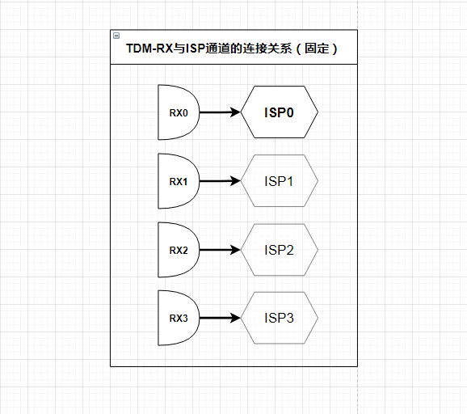
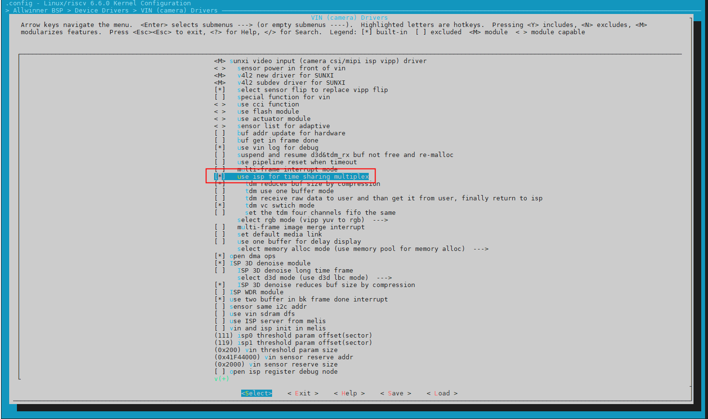
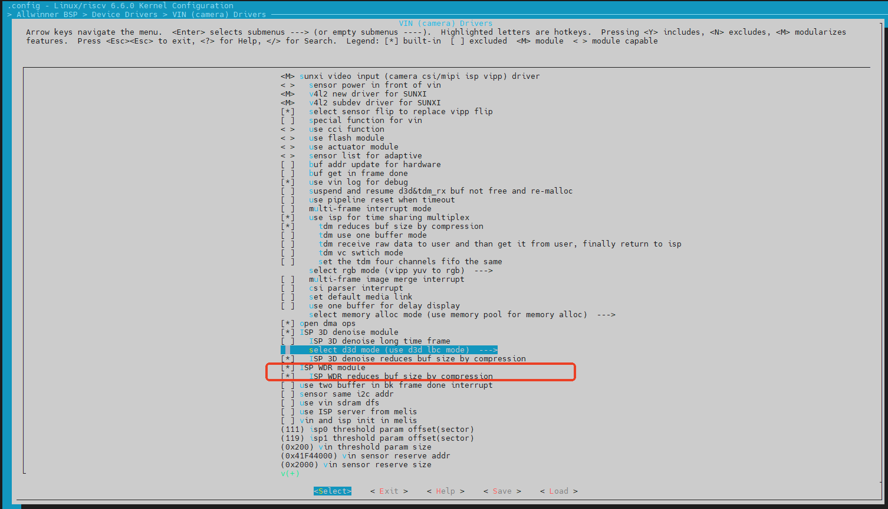
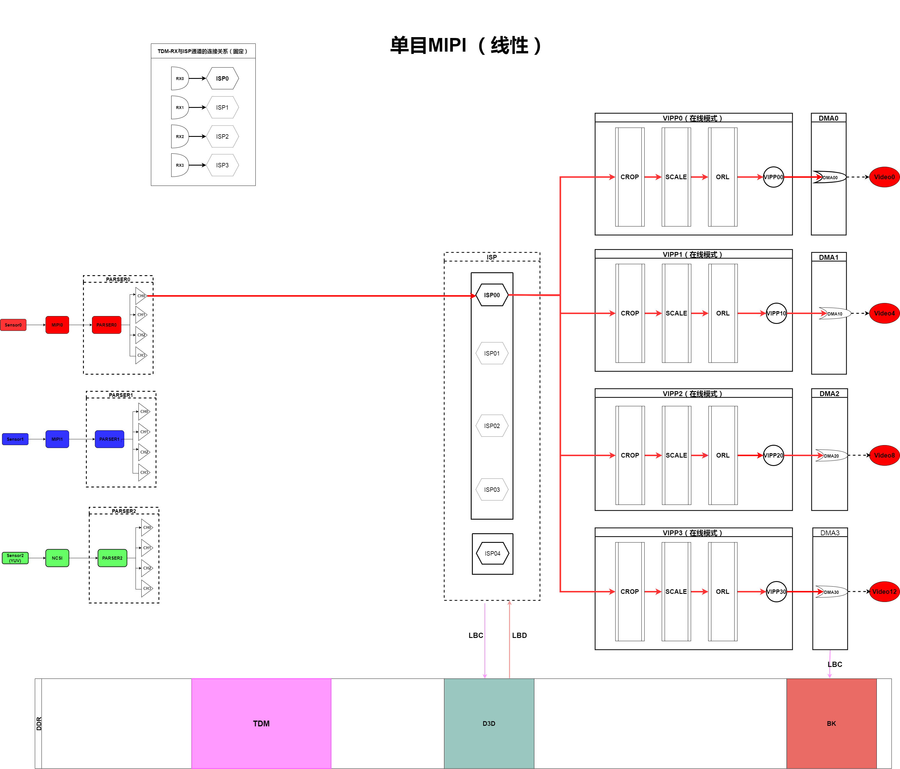
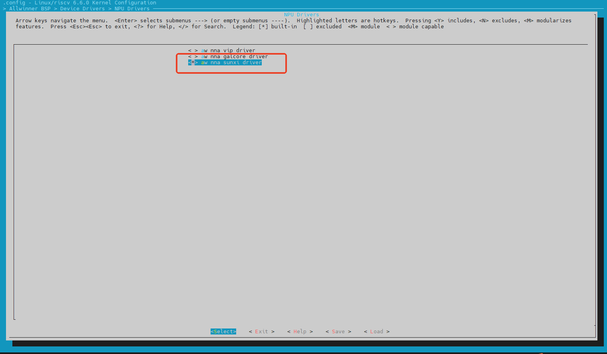
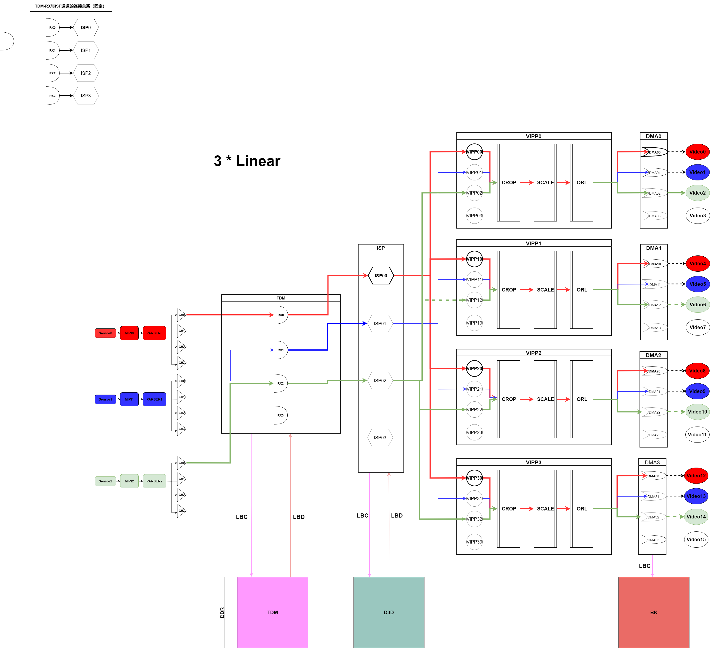
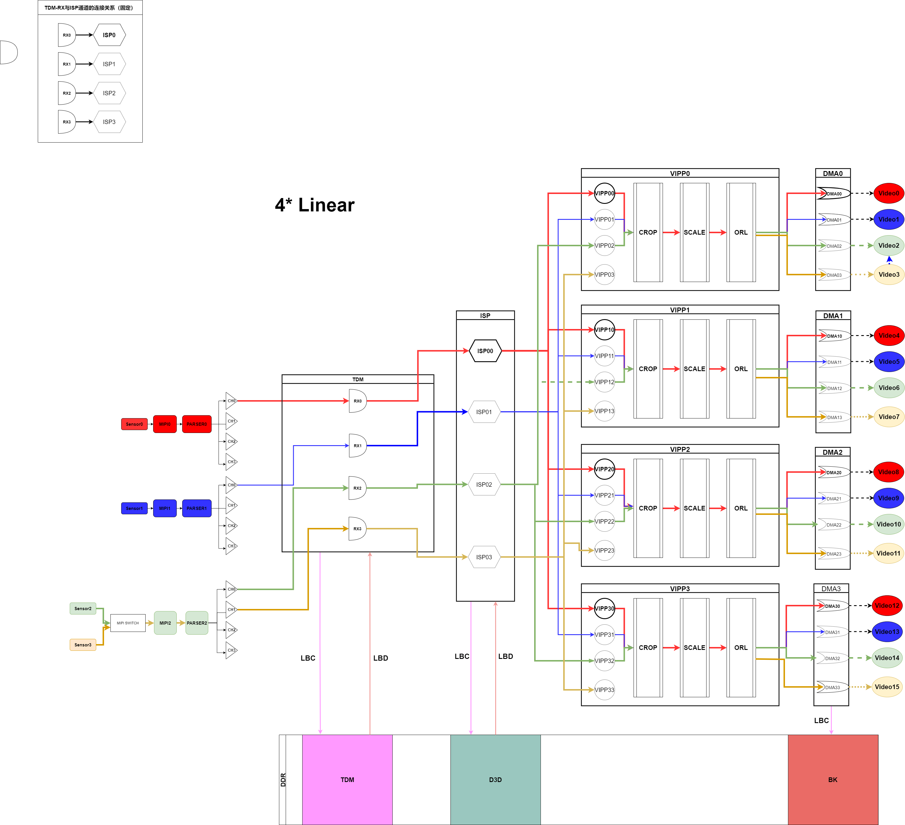
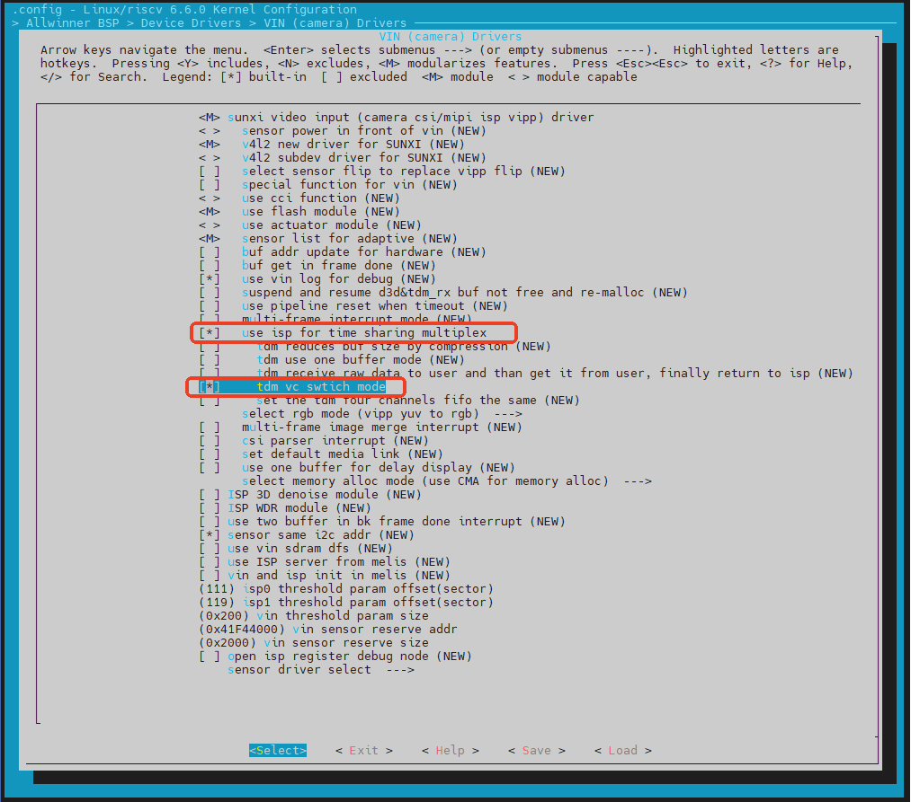

# Camera 通路配置指南

## 前言

### 概述

本指南主要介绍 V861/V838/V881 平台 Camera 通路结构，说明典型工作场景的通路配置（board.dts）。

### 读者对象

本文档（本指南）主要适用于以下工程师：

-   技术支持工程师
-   软件开发工程师

### 适用范围

适用的SOC平台：

-   适用于 V861/V838/V881平台
-   SDK版本：V861\_TINA

## 芯片规格描述

### MIPI 规格描述

-   支持 3 路 MIPI
-   支持 2 路 MIPI + 1 路 DVP
-   最大支持 1 路 MIPI（4 Lane）或者 2 路 MIPI 各 1/2 Lane 或者 3 路 MIPI 1 Lane，即 MIPI0\_4Lane 或者 MIPI0（1/2 Lane）+ MIPI1（1/2 Lane）或者 MIPI0（1 Lane）+ MIPI1（1 Lane）+ MIPI2（1 Lane）

### ISP 规格描述

-   支持2F-WDR
-   一个ISP实体，在线模式可以处理1路线性或者1路2F-WDR，
-   在线模式最大处理能力6M@30fps,最大分辨率3264x4244
-   离线模式可分时复用为四个虚体，可以支持处理4路线性、2F-WDR+2路线性、2F-WDR + 2F-WDR。
-   离线模式最大处理能力8M@30fps,最大分辨率5592x4244

### TDM 规格描述

-   TDM 为 ISP 数据输入端，控制 ISP 处理数据的分时复用。
-   支持四路TDM\_RX，分别对应四路ISP虚体，即4路线性：TDM\_RX0连接ISP00、TDM\_RX1连接ISP01、TDM\_RX2连接ISP02、TDM\_RX3连接ISP03。
-   2F-WDR + 2路线性：TDM\_RX0连接ISP00、TDM\_RX2连接ISP02、TDM\_RX3连接ISP03。
-   2F-WDR + 2F-WDR：TDM\_RX0连接ISP00、TDM\_RX2连接ISP02。

### VIPP 和 DMA 规格描述

-   **在线模式：** 共有四个VIPP和DMA实体，VIPP0无法缩放, 只有VIPP0/1支持LBC2.0，支持YUV422转420
-   VIPP1-支持自定义缩小算法,缩放倍数 1 ~ 1/256 宽高各（1 ~ 1/8）,支持YUV422转420，VIPP2-支持自定义缩小算法 缩放倍数 1 ~ 1/256 宽高各（1 ~ 1/8），支持最邻近和线性插值算法 缩放倍数 1 ~ 1/4096 宽高各（1 ~ 1/64）,支持YUV422转420，VIPP3-支持自定义缩小算法 缩放倍数 1 ~ 1/4096 宽高各（1 ~ 1/64）
-   **离线模式：** 每个VIPP和DMA可分时复用为4个VIPP和DMA虚拟体，四个VIPP和DMA实体相互独立，在线模式和离线模式开关也是相互独立的。
-   VIPP和DMA的分时复用（离线模式）与ISP和TDM的分时复用（离线模式）是绑定关系，即TDM和ISP开启了离线模式，VIPP和DMA的输入端如果是ISP，那么VIPP和DMA也需要开启离线模式。

**离线模式下，通路连接关系：**

-   ISP00固定连接VIPP00、VIPP10、VIPP20和VIPP30
-   ISP01固定连接VIPP01、VIPP11、VIPP21和VIPP31
-   ISP02固定连接VIPP02、VIPP12、VIPP22和VIPP32
-   ISP03固定连接VIPP03、VIPP13、VIPP23和VIPP33 

**离线模式分时复用说明：**

-   离线模式下，实体VIPP0可分时复用为VIPP00、VIPP01、VIPP02、VIPP03，实体DMA0可分时复用为DMA00、DMA01、DMA02、DMA03，分别对应 video0、video1、video2和video3；在线模式下，VIPP0和DMA0对应video0可用，video1、video2和video3不可用。
-   离线模式下，实体VIPP1可分时复用为VIPP10、VIPP11、VIPP12、VIPP13，实体DMA1可分时复用为DMA10、DMA11、DMA12、DMA13，分别对应 video4、video5、video6和video7；在线模式下，VIPP1和DMA1对应video4可用，video5、video6和video7不可用。
-   离线模式下，实体VIPP2可分时复用为VIPP20、VIPP21、VIPP22、VIPP23，实体DMA2可分时复用为DMA20、DMA21、DMA22、DMA23，分别对应 video8、video9、video10和video11；在线模式下，VIPP2和DMA2对应video8可用，video9、video10和video11不可用。
-   离线模式下，实体VIPP3可分时复用为VIPP30、VIPP31、VIPP32、VIPP33，实体DMA3可分时复用为DMA30、DMA31、DMA32、DMA33，分别对应 video12、video13、video14和video15；在线模式下，VIPP3和DMA3对应video12可用，video13、video14和video15不可用。

**特殊场景输出 RAW 数据：**

-   只有实体节点可以出raw，其他分时复用的节点均无法出raw数据，即只有video0、video4、video8、video12 可以输出 RAW 数据。
-   如果工作场景中需要 Sensor 同时输出 YUV 数据和 RAW 数据的的话，那么需要使用到 ISP4（ISP4 为空的 ISP）来输出 RAW 数据，这一路需要占用一个实体 VIPP 和 DMA，且需要配置为在线模式（参考下文的典型场景）。

**使用注意：**

由于 video1、video2、video3、video5、video6、video7、video9、video10、video11、video13、video14、video15都是分时复用来的，开启它们的前提是一一对应的实体（video0、video4、video8、video12）已经开启。

## 板级配置概要

### 板级配置目录

board.dts：位于 `device/config/chips/xxx（芯片型号）/configs/xxx（板型）/board.dts`，

以 V861 bga-perf 板级为例，`board.dts` 目录如下：

```
device/config/chips/v861/configs/bga_perf1/board.dts
```

### Vind (Camera) 节点描述

```c
&vind0 {
	csi_top = <300000000>;
	status = "okay";

	csi2: csi@5822000 {
		pinctrl-names = "default","sleep";
		pinctrl-0 = <&ncsi_8bit_pins_a>;
		pinctrl-1 = <&ncsi_8bit_pins_b>;
		status = "disabled";
	};

	tdm0: tdm@5908000 { // TDM工作模式配置，0：在线模式，1：离线模式，以下同理
		work_mode = <0x0>;
		delay_init = <0>;
	};

	isp00:isp@5900000 { // ISP工作模式配置
		work_mode = <0x0>;
		delay_init = <0>;
	};

	isp01:isp@58ffffc {
		status = "disabled";
		delay_init = <0>;
	};

	isp02:isp@58ffff8 {
		status = "disabled";
		delay_init = <0>;
	};

	isp03:isp@58ffff4 {
		status = "disabled";
		delay_init = <0>;
	};

	isp10:isp@4 {
		status = "disabled";
	};

	isp20:isp@5 {
		status = "disabled";
	};

	isp30:isp@6 {
		status = "disabled";
	};

	tdm0: tdm@5908000 {	// TDM工作模式配置，0：在线模式，1：离线模式，以下同理
		work_mode = <0>;
	};
	
	scaler00:scaler@5910000 {
		work_mode = <0x0>;
		status = "okay";
		delay_init = <0>;
	};

	scaler01:scaler@590fffc {
		status = "disabled";
		delay_init = <0>;
	};

	scaler02:scaler@590fff8 {
		status = "disabled";
		delay_init = <0>;
	};

	scaler03:scaler@590fff4 {
		status = "disabled";
		delay_init = <0>;
	};

	scaler10:scaler@5910400 {
		work_mode = <0x0>;
		status = "okay";
		delay_init = <0>;
	};

	scaler11:scaler@59103fc {
		status = "disabled";
		delay_init = <0>;
	};

	scaler12:scaler@59103f8 {
		status = "disabled";
		delay_init = <0>;
	};

	scaler13:scaler@59103f4 {
		status = "disabled";
		delay_init = <0>;
	};

	scaler20:scaler@5910800 {
		work_mode = <0x0>;
		status = "okay";
		delay_init = <0>;
	};

	scaler21:scaler@59107fc {
		status = "disabled";
		delay_init = <0>;
	};

	scaler22:scaler@59107f8 {
		status = "disabled";
		delay_init = <0>;
	};

	scaler23:scaler@59107f4 {
		status = "disabled";
		delay_init = <0>;
	};

	scaler30:scaler@5910c00 {
		work_mode = <0x0>;
		status = "okay";
		delay_init = <0>;
	};

	scaler31:scaler@5910bfc {
		status = "disabled";
		delay_init = <0>;
	};

	scaler32:scaler@5910bf8 {
		status = "disabled";
		delay_init = <0>;
	};

	scaler33:scaler@5910bf4 {
		status = "disabled";
		delay_init = <0>;
	};

	sensor0: sensor@5812000 {	// Sensor0节点配置
		device_type = "sensor0";
		sensor0_mname = "gc4663_mipi";	// Sensor驱动ko命名
		sensor0_twi_cci_id = <1>;	// 连接的TWI组号，比如使用的是 TWI1，那么填1
		sensor0_twi_addr = <0x52>;	// IIC地址
		sensor0_mclk_id = <0>;		// 连接的MCLK组号，比如使用的是 MCLK0，那么填0
		sensor0_pos = "rear";		// 标志“后置摄像头”
		sensor0_isp_used = <1>;		// 开启ISP，RAW Sensor 需要，YUV Sensor 不需要，
		sensor0_fmt = <1>;			// Sensor输入数据类型，YUV：0，RAW：1
		sensor0_stby_mode = <0>;
		sensor0_vflip = <0>;	// VIPP图像垂直翻转
		sensor0_hflip = <0>;	// VIPP图像水平翻转
		sensor0_iovdd-supply = <>;		// 电源参考原理图配置
		sensor0_iovdd_vol = <>;			// 电压标准参考规格书
		sensor0_avdd-supply = <&reg_axp333_aldo1>;		// 电源参考原理图配置
		sensor0_avdd_vol = <2800000>;			// 电压标准参考规格书
		sensor0_dvdd-supply = <>;		// 电源参考原理图配置
		sensor0_dvdd_vol = <>;			// 电压标准参考规格书
		sensor0_power_en = <>;					// POWER_EN 引脚，除非硬件设计上有用到，否则不需要配置
		sensor0_reset = <&pio PA 18 GPIO_ACTIVE_LOW>;		// GPIO引脚参考原理图配置
		sensor0_pwdn = <&pio PH 9 GPIO_ACTIVE_LOW>;		// GPIO引脚参考原理图配置
		sensor0_sm_hs = <>;						// DVP HSYNC 引脚，引脚连接与 SOC 公版有差异才需要配置
		sensor0_sm_vs = <>;						// DVP VSYNC 引脚，引脚连接与 SOC 公版有差异才需要配置
		status	= "okay";					// Sensor节点使能开关
	};

	sensor1: sensor@5812010 {
		device_type = "sensor1";
		sensor1_mname = "gc1084_mipi_2";
		sensor1_twi_cci_id = <0>;
		sensor1_twi_addr = <0x7e>;
		sensor1_mclk_id = <1>;
		sensor1_pos = "front";
		sensor1_isp_used = <1>;
		sensor1_fmt = <1>;
		sensor1_stby_mode = <0>;
		sensor1_vflip = <0>;
		sensor1_hflip = <0>;
		sensor1_iovdd-supply = <>;
		sensor1_iovdd_vol = <>;
		sensor1_avdd-supply = <&reg_axp333_aldo1>;
		sensor1_avdd_vol = <2800000>;
		sensor1_dvdd-supply = <>;
		sensor1_dvdd_vol = <>;
		sensor1_power_en = <>;
		sensor1_reset = <&pio PE 1 GPIO_ACTIVE_LOW>;
		sensor1_pwdn = <>;
		status = "disabled";
	};

	sensor2: sensor@5812020 {
		device_type = "sensor2";
		sensor2_mname = "gc1084_mipi_3";
		sensor2_twi_cci_id = <0>;
		sensor2_twi_addr = <0x7e>;
		sensor2_mclk_id = <1>;
		sensor2_pos = "front";
		sensor2_isp_used = <1>;
		sensor2_fmt = <1>;
		sensor2_stby_mode = <0>;
		sensor2_vflip = <0>;
		sensor2_hflip = <0>;
		sensor2_iovdd-supply = <>;
		sensor2_iovdd_vol = <>;
		sensor2_avdd-supply = <>;
		sensor2_avdd_vol = <>;
		sensor2_dvdd-supply = <>;
		sensor2_dvdd_vol = <>;
		sensor2_power_en = <>;
		sensor2_reset = <&pio PD 13 GPIO_ACTIVE_LOW>;
		sensor2_pwdn = <>;
		status = "disabled";
	};

	/* 一个 vinc 代表一个 /dev/video 设备：video0 - vinc@0 */
	vinc00:vinc@5830000 {				// 对应软件上的 video0 结点
		vinc0_csi_sel = <0>;			// 代表选择的 csi 接口，MIPI0 - 0，MIPI1 - 1，MIPI2 - 2, DVP - 2
		vinc0_mipi_sel = <0>;			// 代表选择的 mipi 接口，V861 有 MIPI0 - 0 ，MIPI1 - 1，MIPI2 - 2, DVP 接口则配置 0xff
		vinc0_isp_sel = <0>;			//  ISP通道号【0，4】，【0-3】分别为 Sensor 输入 RAW 数据的场景，当 Sensor 输入 YUV 数据时，需要配置为4
		vinc0_isp_tx_ch = <0>;			// 表示 ISP 的通道数，MIPI接口只需要配置为0
		vinc0_tdm_rx_sel = <0>;			// TDM_RX 通道，与 isp_sel 保持一致即可,如果 Sensor 输入 YUV 数据，则配置 0xff
		vinc0_rear_sensor_sel = <0>;	// 选择哪个sensor接收图像，如上述的 sensor0、sensor1、sensor2
		vinc0_front_sensor_sel = <0>;	// 选择哪个sensor接收图像，如上述的 sensor0、sensor1、sensor2
		vinc0_sensor_list = <0>;		// sensor list自适应功能使能开关
		vinc0_vipp_sel = <0>;
		work_mode = <0x0>;				// DMA工作模式，0：在线，1：离线，需要与上述 TDM 、VIPP、ISP 保持一致，只有 vinc@00、 vinc@10、 vinc@20、 vinc@30 可以配置，其它均不需要配置
		status = "okay";
	};
}
```

## TDM & WDR 驱动配置

### TDM 驱动内核配置

配置离线模式时，不仅 `board.dts` 的 `tdm@0`、`isp@0`，`scaler@0/1/2/3` 等节点需要配置，TDM 驱动的内核配置也需要使能。

```
执行 m kernel_menuconfig
选中  
Allwinner BSP → 
	Device Drivers →
		VIN (camera) Drivers →
			use isp for time sharing multiplex
```



### WDR 驱动内核配置

运行WDR模式时，需要同时打开 TDM 驱动配置（同上）。

```
执行 m kernel_menuconfig
选中  
Allwinner BSP → 
	Device Drivers → 
		VIN (camera) Drivers → 
			use isp for time sharing multiplex
```


### WDR LBC 压缩模式 (可选)

```
for time sharing multiplex
选中 
Allwinner BSP → 
	Device Drivers → 
		VIN (camera) Drivers → 
			ISP WDR module → 
				ISP WDR reduces buf size by compression
```



## Pipeline 典型场景

### 在线模式

#### 线性/WDR 单路输入 4 路输出

此模式为典型IPC场景，1路MIPI输入（RAW）4路输出，其中 TDM 关闭、ISP0、VIPP0 和 DMA0、VIPP1 和 DMA1、VIPP2 和 DMA2、VIPP3 和 DMA3，都配置在线模式，其中只有 video0 可支持在线编码模式，video4、video8、video12 只能支持离线编码。

-   `Sensor0 → MIPI0 → PARSER0 → ISP00：video0、video4、video8、video12`



**VINC 配置示例**（仅展示需要配置的结点，没有展示的默认关闭）

> 同路摄像头输入的 vinc 结点配置都是一致的，如当前单目输入（在线模式），则对应可以使用 video0/4/8/12，对应 vinc@00/10/20/30，每个vinc配置一致；

```c
tdm0: tdm@5908000 {				// TDM工作模式配置：在线模式
	work_mode = <0>;
};
isp00:isp@5900000 {				// ISP工作模式配置：在线模式
	work_mode = <0>;
};
scaler00:scaler@5910000 {		// VIPP0工作模式配置：在线模式
	work_mode = <0>;
};
scaler10:scaler@5910400 {		// VIPP1工作模式配置：在线模式
	work_mode = <0>;
};
scaler20:scaler@5910800 {		// VIPP2工作模式配置：在线模式
	work_mode = <0>;
};
scaler30:scaler@5910c00 {		// VIPP3工作模式配置：在线模式
	work_mode = <0>;
};

vinc00:vinc@5830000 {				// 对应软件上的 video0 结点，vinc@00/10/20/30 配置一致
	vinc0_csi_sel = <0>;			// 配置 CSI0 通道
	vinc0_mipi_sel = <0>;			// 配置 MIPI0 通道
	vinc0_isp_sel = <0>;			// 选择 ISP0 通道
	vinc0_isp_tx_ch = <0>;			// 表示 ISP 的通道数，MIPI接口只需要配置为0
	vinc0_tdm_rx_sel = <0xff>;		// 关闭 TDM 配置
	vinc0_rear_sensor_sel = <0>;	// 选择 Sensor0 作为数据来源
	vinc0_front_sensor_sel = <0>;	// 选择 Sensor0 作为数据来源
	vinc0_sensor_list = <0>;
	work_mode = <0x0>;				// 配置在线模式
	status = "okay";
};

vinc10:vinc@5831000 {				// 对应软件上的 video4 结点
	vinc4_csi_sel = <0>;
	vinc4_mipi_sel = <0>;
	vinc4_isp_sel = <0>;
	vinc4_isp_tx_ch = <0>;
	vinc4_tdm_rx_sel = <0>;
	vinc4_rear_sensor_sel = <0>;
	vinc4_front_sensor_sel = <0>;
	vinc4_sensor_list = <0>;
	work_mode = <0x0>;
	status = "okay";
};

vinc20:vinc@5832000 {				// 对应软件上的 video8 结点
	vinc8_csi_sel = <0>;
	vinc8_mipi_sel = <0x0>;
	vinc8_isp_sel = <0>;
	vinc8_isp_tx_ch = <0>;
	vinc8_tdm_rx_sel = <0>;
	vinc8_rear_sensor_sel = <0>;
	vinc8_front_sensor_sel = <0>;
	vinc8_sensor_list = <0>;
	work_mode = <0x0>;
	status = "okay";
};

vinc30:vinc@5833000 {				// 对应软件上的 video12 结点
	vinc12_csi_sel = <0>;
	vinc12_mipi_sel = <0x0>;
	vinc12_isp_sel = <0>;
	vinc12_isp_tx_ch = <0>;
	vinc12_tdm_rx_sel = <0>;
	vinc12_rear_sensor_sel = <0>;
	vinc12_front_sensor_sel = <0>;
	vinc12_sensor_list = <0>;
	work_mode = <0x0>;
	status = "okay";
};
```

#### MIPI + DVP 2路输入 4 路输出

此模式为典型CDR场景，2路输入（RAW + YUV）4路输出，DVP 通路为 YUV 数据（如后拉摄像头）输入；其中 TDM 关闭、ISP0、VIPP0 和 DMA0、VIPP1 和 DMA1、VIPP2 和 DMA2、VIPP3 和 DMA3，都配置在线模式。

-   `Sensor0 → MIPI0 → PARSER0 → ISP00：video0、video4、video12`
    
-   `Sensor1 → DVP → PARSER2 → ISP04：video8`
    

-在线模式-7791a529a731ee0b6a11a8dd58804b5d.png)

**VINC 配置示例**（仅展示需要配置的结点，没有展示的默认关闭）

```c
csi2: csi@5822000 {
	pinctrl-names = "default","sleep";
	pinctrl-0 = <&ncsi_8bit_pins_a>;
	pinctrl-1 = <&ncsi_8bit_pins_b>;
	status = "okay";
};

tdm0: tdm@5908000 {	// TDM工作模式配置：在线模式
	work_mode = <0>;
};
isp00:isp@5900000 {		// ISP工作模式配置：在线模式
	work_mode = <0>;
};
isp10:isp@4 {		// 添加 ISP4 通道，配置在线模式
	work_mode = <0>;
};
scaler00:scaler@5910000 {		// VIPP0工作模式配置：在线模式
	work_mode = <0>;
};
scaler10:scaler@5910400 {		// VIPP1工作模式配置：在线模式
	work_mode = <0>;
};
scaler20:scaler@5910800 {		// VIPP2工作模式配置：在线模式
	work_mode = <0>;
};
scaler30:scaler@5910c00 {	// VIPP3工作模式配置：在线模式
	work_mode = <0>;
};

vinc00:vinc@5830000 {				// vinc@00/10/30 配置一致
	vinc0_csi_sel = <0>;			// 配置 CSI0 通道
	vinc0_mipi_sel = <0>;			// 配置 MIPI0 通道
	vinc0_isp_sel = <0>;			// 选择 ISP0 通道
	vinc0_isp_tx_ch = <0>;
	vinc0_tdm_rx_sel = <0xff>;		// 关闭 TDM 配置
	vinc0_rear_sensor_sel = <0>;	// 选择 Sensor0 作为数据来源
	vinc0_front_sensor_sel = <0>;	// 选择 Sensor0 作为数据来源
	vinc0_sensor_list = <0>;
	work_mode = <0x0>;				// 配置在线模式
	status = "okay";
};

vinc10:vinc@5831000 {				// 对应软件上的 video4 结点
	vinc4_csi_sel = <0>;
	vinc4_mipi_sel = <0>;
	vinc4_isp_sel = <0>;
	vinc4_isp_tx_ch = <0>;
	vinc4_tdm_rx_sel = <0>;
	vinc4_rear_sensor_sel = <0>;
	vinc4_front_sensor_sel = <0>;
	vinc4_sensor_list = <0>;
	work_mode = <0x0>;
	status = "okay";
};

vinc20:vinc@5832000 {				// DVP 接口配置（YUV数据需要独占一路实体VIPP和DMA），对应软件上的 video4 结点，配置方式其它 vinc 通用，按需求选择即可
	vinc8_csi_sel = <2>;			// 配置 CSI2（DVP） 通道
	vinc8_mipi_sel = <0xff>;		// 关闭 MIPI 配置
	vinc8_isp_sel = <4>;			// YUV 数据选择 ISP4 通道 bypass
	vinc8_isp_tx_ch = <0>;
	vinc8_tdm_rx_sel = <0xff>;		// 关闭 TDM
	vinc8_rear_sensor_sel = <1>;	// 选择 Sensor1 作为数据来源
	vinc8_front_sensor_sel = <1>;	// 选择 Sensor1 作为数据来源
	vinc8_sensor_list = <0>;
	work_mode = <0x0>;
	status = "okay";
};

vinc30:vinc@5833000 {				// 对应软件上的 video12 结点
	vinc12_csi_sel = <0>;
	vinc12_mipi_sel = <0x0>;
	vinc12_isp_sel = <0>;
	vinc12_isp_tx_ch = <0>;
	vinc12_tdm_rx_sel = <0>;
	vinc12_rear_sensor_sel = <0>;
	vinc12_front_sensor_sel = <0>;
	vinc12_sensor_list = <0>;
	work_mode = <0x0>;
	status = "okay";
};
```

#### MIPI + MIPI 2 路输入 4 路输出

此场景有 2 路输入（RAW + YUV）4路输出，其中第2路MIPI通路为 YUV 数据（如后拉摄像头）输入；其中 TDM 关闭、ISP0、VIPP0 和 DMA0、VIPP1 和 DMA1、VIPP2 和 DMA2、VIPP3 和 DMA3，都配置在线模式。

-   `Sensor0 → MIPI0 → PARSER0 → ISP00：video0、video4、video12`
    
-   `Sensor1 → MIPI1 → PARSER1 → ISP04：video8`
    

-在线模式-98e1ceebcd3d41c0efb18952fb6b940c.png)

**VINC 配置示例**（仅展示需要配置的结点，没有展示的默认关闭）

```c
csi2: csi@5822000 {
	pinctrl-names = "default","sleep";
	pinctrl-0 = <&ncsi_8bit_pins_a>;
	pinctrl-1 = <&ncsi_8bit_pins_b>;
	status = "disabled";
};

tdm0: tdm@5908000 {	// TDM工作模式配置：在线模式
	work_mode = <0>;
};
isp00:isp@5900000 {		// ISP工作模式配置：在线模式
	work_mode = <0>;
};
isp10:isp@4 {		// 添加 ISP4 通道，配置在线模式
	work_mode = <0>;
};
scaler00:scaler@5910000 {		// VIPP0工作模式配置：在线模式
	work_mode = <0>;
};
scaler10:scaler@5910400 {		// VIPP1工作模式配置：在线模式
	work_mode = <0>;
};
scaler20:scaler@5910800 {		// VIPP2工作模式配置：在线模式
	work_mode = <0>;
};
scaler30:scaler@5910c00 {	// VIPP3工作模式配置：在线模式
	work_mode = <0>;
};

vinc00:vinc@5830000 {				// vinc@00/10/30 配置一致
	vinc0_csi_sel = <0>;	// 配置 CSI0 通道
	vinc0_mipi_sel = <0>;	// 配置 MIPI0 通道
	vinc0_isp_sel = <0>;	// 选择 ISP0 通道
	vinc0_isp_tx_ch = <0>;
	vinc0_tdm_rx_sel = <0xff>;	// 关闭 TDM 配置
	vinc0_rear_sensor_sel = <0>;	// 选择 Sensor0 作为数据来源
	vinc0_front_sensor_sel = <0>;	// 选择 Sensor0 作为数据来源
	vinc0_sensor_list = <0>;
	work_mode = <0x0>;		// 配置在线模式
	status = "okay";
};

vinc10:vinc@5831000 {				// 对应软件上的 video4 结点
	vinc4_csi_sel = <0>;
	vinc4_mipi_sel = <0>;
	vinc4_isp_sel = <0>;
	vinc4_isp_tx_ch = <0>;
	vinc4_tdm_rx_sel = <0>;
	vinc4_rear_sensor_sel = <0>;
	vinc4_front_sensor_sel = <0>;
	vinc4_sensor_list = <0>;
	work_mode = <0x0>;
	status = "okay";
};

vinc20:vinc@5832000 {				// YUV数据需要独占一路实体VIPP和DMA），对应软件上的 video4 结点，配置方式其它 vinc 通用，按需求选择即可
	vinc8_csi_sel = <1>;	// 配置 CSI1 通道
	vinc8_mipi_sel = <1>;	// 配置 MIPI1 通道
	vinc8_isp_sel = <4>;	// YUV 数据选择 ISP4 通道 bypass
	vinc8_isp_tx_ch = <0>;
	vinc8_tdm_rx_sel = <0xff>;	// 关闭 TDM
	vinc8_rear_sensor_sel = <1>;	// 选择 Sensor1 作为数据来源
	vinc8_front_sensor_sel = <1>;	// 选择 Sensor1 作为数据来源
	vinc8_sensor_list = <0>;
	work_mode = <0x0>;		// 配置在线模式
	status = "okay";
};

vinc30:vinc@5833000 {				// 对应软件上的 video12 结点
	vinc12_csi_sel = <0>;
	vinc12_mipi_sel = <0x0>;
	vinc12_isp_sel = <0>;
	vinc12_isp_tx_ch = <0>;
	vinc12_tdm_rx_sel = <0>;
	vinc12_rear_sensor_sel = <0>;
	vinc12_front_sensor_sel = <0>;
	vinc12_sensor_list = <0>;
	work_mode = <0x0>;
	status = "okay";
};
```

#### MIPI/DVP 1 路输入（解交织）4 路输出

此场景为典型 CDR 场景，1路 MIPI/DVP 输入（YUV）4路输出，其中输入源是 1 个转换芯片（MIPI/DVP），这个转换芯片连接了 4 个后拉摄像头；这个场景 TDM 关闭、ISP0、VIPP0 和 DMA0、VIPP1 和 DMA1、VIPP2 和 DMA2、VIPP3 和 DMA3，都配置在线模式，其中只有 video0 可支持在线编码模式，video4、video8、video12 只能支持离线编码。

**VINC 配置示例**（仅展示需要配置的结点，没有展示的默认关闭）

```c
// 以 DVP 接口为例
csi2: csi@5822000 {
	pinctrl-names = "default","sleep";
	pinctrl-0 = <&ncsi_16bit_pins_a>;
	pinctrl-1 = <&ncsi_16bit_pins_b>;
	status = "okay";
};

tdm0: tdm@5908000 {	// TDM工作模式配置：在线模式
	work_mode = <0>;
};
isp00:isp@5900000 {		// ISP工作模式配置：在线模式
	work_mode = <0>;
};
isp10:isp@4 {		// 添加 ISP4 通道，配置在线模式
	work_mode = <0>;
};
scaler00:scaler@5910000 {		// VIPP0工作模式配置：在线模式
	work_mode = <0>;
};
scaler10:scaler@5910400 {		// VIPP1工作模式配置：在线模式
	work_mode = <0>;
};
scaler20:scaler@5910800 {		// VIPP2工作模式配置：在线模式
	work_mode = <0>;
};
scaler30:scaler@5910c00 {	// VIPP3工作模式配置：在线模式
	work_mode = <0>;
};

vinc00:vinc@5830000 {				// 对应软件上的 video0 结点，vinc@00/10/20/30 配置一致
	vinc0_csi_sel = <2>;	// 配置 CSI0 通道
	vinc0_mipi_sel = <0xff>;	// 配置 MIPI0 通道
	vinc0_isp_sel = <4>;	// 选择 ISP0 通道
	vinc0_isp_tx_ch = <0>;	// 表示第一路后拉摄像头数据源
	vinc0_tdm_rx_sel = <0xff>;	// 关闭 TDM 配置
	vinc0_rear_sensor_sel = <0>;	// 选择 Sensor0 作为数据来源
	vinc0_front_sensor_sel = <0>;	// 选择 Sensor0 作为数据来源
	vinc0_sensor_list = <0>;
	work_mode = <0x0>;			// 配置在线模式
	status = "okay";
};

vinc10:vinc@5831000 {				// 对应软件上的 video4 结点
	vinc4_csi_sel = <2>;
	vinc4_mipi_sel = <0xff>;
	vinc4_isp_sel = <4>;
	vinc4_isp_tx_ch = <1>;		// 表示第二路后拉摄像头数据源
	vinc4_tdm_rx_sel = <0xff>;
	vinc4_rear_sensor_sel = <0>;
	vinc4_front_sensor_sel = <0>;
	vinc4_sensor_list = <0>;
	work_mode = <0x0>;
	status = "okay";
};

vinc20:vinc@5832000 {				// 对应软件上的 video8 结点
	vinc8_csi_sel = <2>;
	vinc8_mipi_sel = <0xff>;
	vinc8_isp_sel = <4>;
	vinc8_isp_tx_ch = <2>;		// 表示第三路后拉摄像头数据源
	vinc8_tdm_rx_sel = <0xff>;
	vinc8_rear_sensor_sel = <0>;
	vinc8_front_sensor_sel = <0>;
	vinc8_sensor_list = <0>;
	work_mode = <0x0>;
	status = "okay";
};

vinc30:vinc@5833000 {				// 对应软件上的 video12 结点
	vinc12_csi_sel = <2>;
	vinc12_mipi_sel = <0xff>;
	vinc12_isp_sel = <4>;
	vinc12_isp_tx_ch = <3>;		// 表示第四路后拉摄像头数据源
	vinc12_tdm_rx_sel = <0xff>;
	vinc12_rear_sensor_sel = <0>;
	vinc12_front_sensor_sel = <0>;
	vinc12_sensor_list = <0>;
	work_mode = <0x0>;
	status = "okay";
};
```

### 离线模式

#### MIPI + MIPI 2 路（线性）输入 8 路输出

此场景为典型的双目场景，有2路 MIPI 输入（RAW），其中 TDM 开启、ISP0、VIPP0 和 DMA0、VIPP1 和 DMA1、VIPP2 和 DMA2、VIPP3 和 DMA3，都配置离线模式，每路MIPI输入都有4路输出。

-   `Sensor0 → MIPI0 → PARSER0 → TDM_RX0 → ISP00：video0、video4、video8、video12`
-   `Sensor1 → MIPI1 → PARSER1 → TDM_RX1 → ISP01：video1、video5、video9、video13`

> 需要打开 TDM 驱动配置。

-c86cded9cc9390d6e9de2675ab5eae01.png) **VINC 配置示例**（仅展示需要配置的结点，没有展示的默认关闭）

> 双目输入（离线模式）场景，配置 vinc@00/10/20/30 和 vinc@1/5/9/13，vinc@00/10/20/30的 work\_mode 需要配置为1（离线模式，与上述ISP、TDM、VIPP一致）

```c
tdm0: tdm@5908000 {	// TDM工作模式配置：离线模式
	work_mode = <1>;
};

isp00:isp@5900000 {		// ISP工作模式配置：离线模式
	work_mode = <1>;
};

scaler00:scaler@5910000 {		// VIPP0工作模式配置：离线模式
	work_mode = <1>;
};

scaler10:scaler@5910400 {		// VIPP1工作模式配置：离线模式
	work_mode = <1>;
};

scaler20:scaler@5910800 {		// VIPP2工作模式配置：离线模式
	work_mode = <1>;
};

scaler30:scaler@5910c00 {	// VIPP3工作模式配置：离线模式
	work_mode = <1>;
};

vinc00:vinc@5830000 {				// vinc@00/10/20/30 配置一致
	vinc0_csi_sel = <0>;	// 配置 CSI0 通道
	vinc0_mipi_sel = <0>;	// 配置 MIPI0 通道
	vinc0_isp_sel = <0>;	// 选择 ISP0 通道
	vinc0_isp_tx_ch = <0>;
	vinc0_tdm_rx_sel = <0>;	// 选择 tdm_rx0
	vinc0_rear_sensor_sel = <0>;	// 选择 Sensor0 作为数据来源
	vinc0_front_sensor_sel = <0>;	// 选择 Sensor0 作为数据来源
	vinc0_sensor_list = <0>;
	work_mode = <0x1>;			// 配置离线模式
	status = "okay";
};

vinc01:vinc@582fffc {				// vinc@1/5/9/13 配置一致
	vinc1_csi_sel = <1>;	// 配置 CSI1 通道
	vinc1_mipi_sel = <1>;	// 配置 MIPI1 通道
	vinc1_isp_sel = <1>;	// 选择 ISP1 通道
	vinc1_isp_tx_ch = <0>;
	vinc1_tdm_rx_sel = <1>;	// 选择 tdm_rx1
	vinc1_rear_sensor_sel = <1>;	// 选择 Sensor1 作为数据来源
	vinc1_front_sensor_sel = <1>;	// 选择 Sensor1 作为数据来源
	vinc1_sensor_list = <1>;
	status = "okay";
};

vinc10:vinc@5831000 {
	vinc4_csi_sel = <0>;
	vinc4_mipi_sel = <0>;
	vinc4_isp_sel = <0>;
	vinc4_isp_tx_ch = <0>;
	vinc4_tdm_rx_sel = <0>;
	vinc4_rear_sensor_sel = <0>;
	vinc4_front_sensor_sel = <0>;
	vinc4_sensor_list = <0>;
	work_mode = <0x1>;
	status = "okay";
};

vinc11:vinc@5830ffc {
	vinc5_csi_sel = <1>;
	vinc5_mipi_sel = <1>;
	vinc5_isp_sel = <1>;
	vinc5_isp_tx_ch = <0>;
	vinc5_tdm_rx_sel = <1>;
	vinc5_rear_sensor_sel = <1>;
	vinc5_front_sensor_sel = <1>;
	vinc5_sensor_list = <0>;
	status = "okay";
};

vinc20:vinc@5832000 {
	vinc8_csi_sel = <0>;
	vinc8_mipi_sel = <0x0>;
	vinc8_isp_sel = <0>;
	vinc8_isp_tx_ch = <0>;
	vinc8_tdm_rx_sel = <0>;
	vinc8_rear_sensor_sel = <0>;
	vinc8_front_sensor_sel = <0>;
	vinc8_sensor_list = <0>;
	work_mode = <0x1>;
	status = "okay";
};

vinc21:vinc@5831ffc {
	vinc9_csi_sel = <1>;
	vinc9_mipi_sel = <1>;
	vinc9_isp_sel = <1>;
	vinc9_isp_tx_ch = <0>;
	vinc9_tdm_rx_sel = <1>;
	vinc9_rear_sensor_sel = <1>;
	vinc9_front_sensor_sel = <1>;
	vinc9_sensor_list = <0>;
	status = "okay";
};

vinc30:vinc@5833000 {
	vinc12_csi_sel = <0>;
	vinc12_mipi_sel = <0x0>;
	vinc12_isp_sel = <0>;
	vinc12_isp_tx_ch = <0>;
	vinc12_tdm_rx_sel = <0>;
	vinc12_rear_sensor_sel = <0>;
	vinc12_front_sensor_sel = <0>;
	vinc12_sensor_list = <0>;
	work_mode = <0x1>;
	status = "okay";
};

vinc31:vinc@5832ffc {
	vinc13_csi_sel = <1>;
	vinc13_mipi_sel = <1>;
	vinc13_isp_sel = <1>;
	vinc13_isp_tx_ch = <0>;
	vinc13_tdm_rx_sel = <1>;
	vinc13_rear_sensor_sel = <1>;
	vinc13_front_sensor_sel = <1>;
	vinc13_sensor_list = <0>;
	status = "okay";
};
```

#### MIPI 1 路输入 + AIISP 4 路输出

此场景为 1 路 MIPI输入（RAW）+ AIISP模式，其中TDM 开启、NPU开启，ISP0、VIPP0 和 DMA0、VIPP1 和 DMA1、VIPP2 和 DMA2、VIPP3 和 DMA3，都配置离线模式，每路MIPI输入都有4路输出。

-   `Sensor0 → MIPI0 → PARSER0 → TDM_RX0 → AIISP → ISP00：video0、video4、video8、video12`

> 需要打开 TDM 驱动配置、NPU驱动配置




> AIISP模型支持的SENSOR ：sc2337p sc235hais sc485sl

应用端参考代码位置 ：

```
platform/allwinner/eyesee-mpp/middleware/sun252iw1\sample/sample_smartIPC_demo.c
platform/allwinner/eyesee-mpp/middleware/sun252iw1\sample/sample_smartIPC_demo/sample_smartIPC_demo-4M-aiisp-rtsp.conf
```

模型位置：

```
package/allwinner/vision/libawaiisp/src/v861/models/sc485sl/isp_cfg_aiisp
```

**VINC 配置示例**（仅展示需要配置的结点，没有展示的默认关闭）

```c
tdm0: tdm@5908000 {	// TDM工作模式配置：离线模式
	work_mode = <1>;
};
isp00:isp@5900000 {		// ISP工作模式配置：离线模式
	work_mode = <1>;
};
scaler00:scaler@5910000 {		// VIPP0工作模式配置：离线模式
	work_mode = <1>;
};
scaler10:scaler@5910400 {		// VIPP1工作模式配置：离线模式
	work_mode = <1>;
};
scaler20:scaler@5910800 {		// VIPP2工作模式配置：离线模式
	work_mode = <1>;
};
scaler30:scaler@5910c00 {	// VIPP3工作模式配置：离线模式
	work_mode = <1>;
};

sensor0: sensor@5812000 {
	device_type = "sensor0";
	sensor0_mname = "sc485sl_mipi";
	sensor0_twi_cci_id = <1>;
	sensor0_twi_addr = <0x60>;
	sensor0_mclk_id = <0>;
	sensor0_pos = "rear";
	sensor0_isp_used = <1>;
	sensor0_fmt = <1>;
	sensor0_stby_mode = <0>;
	sensor0_vflip = <0>;
	sensor0_hflip = <0>;
	sensor0_iovdd-supply = <>;
	sensor0_iovdd_vol = <>;
	sensor0_avdd-supply = <&reg_axp333_aldo1>;
	sensor0_avdd_vol = <2800000>;
	sensor0_dvdd-supply = <>;
	sensor0_dvdd_vol = <>;
	sensor0_power_en = <>;
	sensor0_reset = <&pio PA 18 GPIO_ACTIVE_LOW>;
	sensor0_pwdn = <&pio PH 9 GPIO_ACTIVE_LOW>;
	status = "okay";
};

vinc00:vinc@5830000 {				// vinc@00/10/20/30 配置一致
	vinc0_csi_sel = <0>;	// 配置 CSI0 通道
	vinc0_mipi_sel = <0>;	// 配置 MIPI0 通道
	vinc0_isp_sel = <0>;	// 选择 ISP0 通道
	vinc0_isp_tx_ch = <0>;
	vinc0_tdm_rx_sel = <0>;	// 选择 tdm_rx0
	vinc0_rear_sensor_sel = <0>;	// 选择 Sensor0 作为数据来源
	vinc0_front_sensor_sel = <0>;	// 选择 Sensor0 作为数据来源
	vinc0_sensor_list = <0>;
	work_mode = <0x1>;			// 配置离线模式
	status = "okay";
};

vinc10:vinc@5831000 {
	vinc4_csi_sel = <0>;
	vinc4_mipi_sel = <0>;
	vinc4_isp_sel = <0>;
	vinc4_isp_tx_ch = <0>;
	vinc4_tdm_rx_sel = <0>;
	vinc4_rear_sensor_sel = <0>;
	vinc4_front_sensor_sel = <0>;
	vinc4_sensor_list = <0>;
	work_mode = <0x1>;
	status = "okay";
};

vinc20:vinc@5832000 {
	vinc8_csi_sel = <0>;
	vinc8_mipi_sel = <0x0>;
	vinc8_isp_sel = <0>;
	vinc8_isp_tx_ch = <0>;
	vinc8_tdm_rx_sel = <0>;
	vinc8_rear_sensor_sel = <0>;
	vinc8_front_sensor_sel = <0>;
	vinc8_sensor_list = <0>;
	work_mode = <0x1>;
	status = "okay";
};

vinc30:vinc@5833000 {
	vinc12_csi_sel = <0>;
	vinc12_mipi_sel = <0x0>;
	vinc12_isp_sel = <0>;
	vinc12_isp_tx_ch = <0>;
	vinc12_tdm_rx_sel = <0>;
	vinc12_rear_sensor_sel = <0>;
	vinc12_front_sensor_sel = <0>;
	vinc12_sensor_list = <0>;
	work_mode = <0x1>;
	status = "okay";
};
```

#### MIPI + MIPI 2 路（WDR + 线性/WDR）输入 8 路输出

此场景为 2 路 MIPI（WDR + 线性或 WDR + wdr）输入（RAW），其中 TDM 开启、ISP0、VIPP0 和 DMA0、VIPP1 和 DMA1、VIPP2 和 DMA2、VIPP3 和 DMA3，都配置离线模式，每路MIPI输入都有4路输出。

-   `Sensor0 → MIPI0 → PARSER0 → TDM_RX0 → ISP00：video0、video4、video8、video12`
-   `Sensor1 → MIPI1 → PARSER1 → TDM_RX2 → ISP02：video2、video6、video10、video14（请留意，此场景与2路线性有差异）`

> 需要打开 TDM 驱动配置、WDR 驱动配置。

-3b60168caecb8cbcbc45667e7c0b6cac.png)

**VINC 配置示例**（仅展示需要配置的结点，没有展示的默认关闭）

> 双目输入（离线模式）场景，配置 vinc@00/10/20/30 和 vinc@02/12/22/32，vinc@00/10/20/30的 work\_mode 需要配置为1（离线模式，与上述ISP、TDM、VIPP一致）

```c
tdm0: tdm@5908000 {	// TDM工作模式配置：离线模式
	work_mode = <1>;
};
isp00:isp@5900000 {		// ISP工作模式配置：离线模式
	work_mode = <1>;
};
scaler00:scaler@5910000 {		// VIPP0工作模式配置：离线模式
	work_mode = <1>;
};
scaler10:scaler@5910400 {		// VIPP1工作模式配置：离线模式
	work_mode = <1>;
};
scaler20:scaler@5910800 {		// VIPP2工作模式配置：离线模式
	work_mode = <1>;
};
scaler30:scaler@5910c00 {	// VIPP3工作模式配置：离线模式
	work_mode = <1>;
};

vinc00:vinc@5830000 {				// vinc@00/10/20/30 配置一致
	vinc0_csi_sel = <0>;	// 配置 CSI0 通道
	vinc0_mipi_sel = <0>;	// 配置 MIPI0 通道
	vinc0_isp_sel = <0>;	// 选择 ISP0 通道
	vinc0_isp_tx_ch = <0>;
	vinc0_tdm_rx_sel = <0>;	// 选择 tdm_rx0
	vinc0_rear_sensor_sel = <0>;	// 选择 Sensor0 作为数据来源
	vinc0_front_sensor_sel = <0>;	// 选择 Sensor0 作为数据来源
	vinc0_sensor_list = <0>;
	work_mode = <0x1>;			// 配置离线模式
	status = "okay";
};

vinc02:vinc@582fff8 {				// vinc@02/12/22/32 配置一致
	vinc2_csi_sel = <1>;	// 配置 CSI1 通道
	vinc2_mipi_sel = <1>;	// 配置 MIPI1 通道
	vinc2_isp_sel = <2>;	// 选择 ISP2 通道
	vinc2_isp_tx_ch = <0>;
	vinc2_tdm_rx_sel = <2>;	// 选择 tdm_rx2
	vinc2_rear_sensor_sel = <1>;	// 选择 Sensor1 作为数据来源
	vinc2_front_sensor_sel = <1>;	// 选择 Sensor1 作为数据来源
	vinc2_sensor_list = <0>;
	status = "okay";
};

vinc10:vinc@5831000 {
	vinc4_csi_sel = <0>;
	vinc4_mipi_sel = <0>;
	vinc4_isp_sel = <0>;
	vinc4_isp_tx_ch = <0>;
	vinc4_tdm_rx_sel = <0>;
	vinc4_rear_sensor_sel = <0>;
	vinc4_front_sensor_sel = <0>;
	vinc4_sensor_list = <0>;
	work_mode = <0x1>;
	status = "okay";
};

vinc12:vinc@5830ff8 {
	vinc6_csi_sel = <1>;
	vinc6_mipi_sel = <1>;
	vinc6_isp_sel = <2>;
	vinc6_isp_tx_ch = <0>;
	vinc6_tdm_rx_sel = <2>;
	vinc6_rear_sensor_sel = <1>;
	vinc6_front_sensor_sel = <1>;
	vinc6_sensor_list = <0>;
	status = "okay";
};

vinc20:vinc@5832000 {
	vinc8_csi_sel = <0>;
	vinc8_mipi_sel = <0x0>;
	vinc8_isp_sel = <0>;
	vinc8_isp_tx_ch = <0>;
	vinc8_tdm_rx_sel = <0>;
	vinc8_rear_sensor_sel = <0>;
	vinc8_front_sensor_sel = <0>;
	vinc8_sensor_list = <0>;
	work_mode = <0x1>;
	status = "okay";
};

vinc22:vinc@5831ff8 {
	vinc10_csi_sel = <1>;
	vinc10_mipi_sel = <1>;
	vinc10_isp_sel = <2>;
	vinc10_isp_tx_ch = <0>;
	vinc10_tdm_rx_sel = <2>;
	vinc10_rear_sensor_sel = <1>;
	vinc10_front_sensor_sel = <1>;
	vinc10_sensor_list = <0>;
	status = "okay";
};

vinc30:vinc@5833000 {
	vinc12_csi_sel = <0>;
	vinc12_mipi_sel = <0x0>;
	vinc12_isp_sel = <0>;
	vinc12_isp_tx_ch = <0>;
	vinc12_tdm_rx_sel = <0>;
	vinc12_rear_sensor_sel = <0>;
	vinc12_front_sensor_sel = <0>;
	vinc12_sensor_list = <0>;
	work_mode = <0x1>;
	status = "okay";
};

vinc32:vinc@5832ff8 {
	vinc14_csi_sel = <1>;
	vinc14_mipi_sel = <1>;
	vinc14_isp_sel = <2>;
	vinc14_isp_tx_ch = <0>;
	vinc14_tdm_rx_sel = <2>;
	vinc14_rear_sensor_sel = <1>;
	vinc14_front_sensor_sel = <1>;
	vinc14_sensor_list = <0>;
	status = "okay";
};
```

#### MIPI+MIPI 2 路（线性）输入，其中一目需要同时输出 YUV 和 RAW

此场景为特殊场景，有2路MIPI输入（RAW），其中有一目在 VIPP 端需要同时输出 YUV 和 RAW 数据供应用功能使用，配置 TDM 开启、ISP0、VIPP0 和 DMA0、VIPP2 和 DMA2、VIPP3 和 DMA3，都配置离线模式，由于只有 video0/4/8/12可以输出 RAW，所以可以将 VIPP1 和 DMA1配置为在线模式（独占一路 VIPP 和 DMA 给到 Sensor1 同时输出 RAW 数据），这个场景配置下，可以在软件上同时获取到 Sensor1 的 YUV 和 RAW。

-   `Sensor0 → MIPI0 → PARSER0 → TDM_RX0 → ISP00：video0、video8、video12`
-   `Sensor1 → MIPI1 → PARSER1 → TDM_RX1 → ISP01：video1、video9、video13`
-   `Sensor1 → MIPI1 → PARSER1 → ISP04：video4（只能出 RAW）`

> 需要打开 TDM 驱动配置。

-b8b43cba7c4882fa417bc4fa1e597f01.png)

**VINC 配置示例**（仅展示需要配置的结点，没有展示的默认关闭）

> 双目输入（离线模式）场景，配置 vinc@0/8/12 和 vinc@1/4/9/13，vinc@0/8/12的 work\_mode 需要配置为1（离线模式，与上述ISP、TDM、VIPP一致）,vinc@4 的 work\_mode 需要配置为0（在线模式，与 scaler@4 一致）

```
tdm0: tdm@5908000 {	// TDM工作模式配置：离线模式
	work_mode = <1>;
};
isp00:isp@5900000 {		// ISP工作模式配置：离线模式
	work_mode = <1>;
};
scaler00:scaler@5910000 {		// VIPP0工作模式配置：离线模式
	work_mode = <1>;
};
scaler10:scaler@5910400 {		// VIPP1工作模式配置：在线模式，Sensor1 输出 RAW 数据
	work_mode = <0>;
};
scaler20:scaler@5910800 {		// VIPP2工作模式配置：离线模式
	work_mode = <1>;
};
scaler30:scaler@5910c00 {	// VIPP3工作模式配置：离线模式
	work_mode = <1>;
};

vinc00:vinc@5830000 {				// vinc@0/8/12 配置一致
	vinc0_csi_sel = <0>;	// 配置 CSI0 通道
	vinc0_mipi_sel = <0>;	// 配置 MIPI0 通道
	vinc0_isp_sel = <0>;	// 选择 ISP0 通道
	vinc0_isp_tx_ch = <0>;
	vinc0_tdm_rx_sel = <0>;	// 选择 tdm_rx0
	vinc0_rear_sensor_sel = <0>;	// 选择 Sensor0 作为数据来源
	vinc0_front_sensor_sel = <0>;	// 选择 Sensor0 作为数据来源
	vinc0_sensor_list = <0>;
	work_mode = <0x1>;			// 配置离线模式
	status = "okay";
};

vinc01:vinc@582fffc {				// vinc@1/9/13 配置一致
	vinc1_csi_sel = <1>;	// 配置 CSI1 通道
	vinc1_mipi_sel = <1>;	// 配置 MIPI1 通道
	vinc1_isp_sel = <1>;	// 选择 ISP1 通道
	vinc1_isp_tx_ch = <0>;
	vinc1_tdm_rx_sel = <1>;	// 选择 tdm_rx1
	vinc1_rear_sensor_sel = <1>;	// 选择 Sensor1 作为数据来源
	vinc1_front_sensor_sel = <1>;	// 选择 Sensor1 作为数据来源
	vinc1_sensor_list = <1>;
	status = "okay";
};

vinc10:vinc@5831000 {
	vinc4_csi_sel = <1>;	// 配置 CSI1 通道
	vinc4_mipi_sel = <1>;	// 配置 MIPI1 通道
	vinc4_isp_sel = <4>;	// 选择 ISP4 通道，bypass RAW 数据
	vinc4_isp_tx_ch = <0>;
	vinc4_tdm_rx_sel = <0xff>;	// 关闭 TDM
	vinc4_rear_sensor_sel = <1>;	// 选择 Sensor1 作为数据来源
	vinc4_front_sensor_sel = <1>;	// 选择 Sensor1 作为数据来源
	vinc4_sensor_list = <0>;
	work_mode = <0x0>;				// 配置在线模式
	status = "okay";
};

vinc20:vinc@5832000 {
	vinc8_csi_sel = <0>;
	vinc8_mipi_sel = <0x0>;
	vinc8_isp_sel = <0>;
	vinc8_isp_tx_ch = <0>;
	vinc8_tdm_rx_sel = <0>;
	vinc8_rear_sensor_sel = <0>;
	vinc8_front_sensor_sel = <0>;
	vinc8_sensor_list = <0>;
	work_mode = <0x1>;
	status = "okay";
};

vinc21:vinc@5831ffc {
	vinc9_csi_sel = <1>;
	vinc9_mipi_sel = <1>;
	vinc9_isp_sel = <1>;
	vinc9_isp_tx_ch = <0>;
	vinc9_tdm_rx_sel = <1>;
	vinc9_rear_sensor_sel = <1>;
	vinc9_front_sensor_sel = <1>;
	vinc9_sensor_list = <0>;
	status = "okay";
};

vinc30:vinc@5833000 {
	vinc12_csi_sel = <0>;
	vinc12_mipi_sel = <0x0>;
	vinc12_isp_sel = <0>;
	vinc12_isp_tx_ch = <0>;
	vinc12_tdm_rx_sel = <0>;
	vinc12_rear_sensor_sel = <0>;
	vinc12_front_sensor_sel = <0>;
	vinc12_sensor_list = <0>;
	work_mode = <0x1>;
	status = "okay";
};

vinc31:vinc@5832ffc {
	vinc13_csi_sel = <1>;
	vinc13_mipi_sel = <1>;
	vinc13_isp_sel = <1>;
	vinc13_isp_tx_ch = <0>;
	vinc13_tdm_rx_sel = <1>;
	vinc13_rear_sensor_sel = <1>;
	vinc13_front_sensor_sel = <1>;
	vinc13_sensor_list = <0>;
	status = "okay";
};
```

#### MIPI 大分辨率（2in1）1 路输入 4 路输出

此场景为典型的单目大分辨（2in1）场景，有1路 （线性）输入（RAW），ISP需要开启拼接模式，开启分辨率要求查看[ISP-规格描述](#ISP-%E8%A7%84%E6%A0%BC%E6%8F%8F%E8%BF%B0) ISP 规格描述 ，同时打开 TDM 驱动配置

```
Sensor0 → MIPI0 → PARSER0 → TDM_RX0 → ISP00 ：video0、video4、video8、video12
                  PARSER1 → TDM_RX1 → ISP01： video1、video5、video9、video13 (拼接后使用的节点)
```

> 需要打开 TDM 驱动配置。

单目 2in1 模式，需要将 vinc 01/11/21/31 都打开并配置为 Sensor0 输入，具体dts配置参考如下

这里以 8M GC8613 为例

```c
tdm0: tdm@5908000 {
	work_mode = <0x1>;
	delay_init = <0>;
};

isp00:isp@5900000 {
	work_mode = <0x1>;
	delay_init = <0>;
};

isp01:isp@58ffffc {
	status = "okay";
	delay_init = <0>;
};

scaler00:scaler@5910000 {
	work_mode = <0x1>; // 配置离线模式
	status = "okay";
	delay_init = <0>;
};

scaler01:scaler@590fffc {
	status = "okay";
	delay_init = <0>;
};

scaler10:scaler@5910400 {
	work_mode = <0x1>;// 配置离线模式
	status = "okay";
	delay_init = <0>;
};

scaler11:scaler@59103fc {
	status = "okay";
	delay_init = <0>;
};

scaler20:scaler@5910800 {
	work_mode = <0x1>;// 配置离线模式
	status = "okay";
	delay_init = <0>;
};

scaler21:scaler@59107fc {
	status = "okay";
	delay_init = <0>;
};

scaler30:scaler@5910c00 {
	work_mode = <0x1>;// 配置离线模式
	status = "okay";
	delay_init = <0>;
};

scaler31:scaler@5910bfc {
	status = "okay";
	delay_init = <0>;
};

sensor0: sensor@5812000 {
	device_type = "sensor0";
	sensor0_mname = "gc8613_mipi";
	sensor0_twi_cci_id = <1>;
	sensor0_twi_addr = <0x62>;
	sensor0_mclk_id = <0>;
	sensor0_pos = "rear";
	sensor0_isp_used = <1>;
	sensor0_fmt = <1>;
	sensor0_stby_mode = <0>;
	sensor0_vflip = <0>;
	sensor0_hflip = <0>;
	sensor0_iovdd-supply = <>;
	sensor0_iovdd_vol = <>;
	sensor0_avdd-supply = <&reg_axp333_aldo1>;
	sensor0_avdd_vol = <2800000>;
	sensor0_dvdd-supply = <>;
	sensor0_dvdd_vol = <>;
	sensor0_power_en = <>;
	sensor0_reset = <&pio PE 0 GPIO_ACTIVE_LOW>;
	sensor0_pwdn = <>;
	status = "okay";
};

vinc00:vinc@5830000 {
	vinc0_csi_sel = <0>;
	vinc0_mipi_sel = <0>;
	vinc0_isp_sel = <0>;
	vinc0_isp_tx_ch = <0>;
	vinc0_tdm_rx_sel = <0>;
	vinc0_vipp_sel = <0>;
	vinc0_rear_sensor_sel = <0>;
	vinc0_front_sensor_sel = <0>;
	vinc0_sensor_list = <0>;
	delay_init = <0>;
	work_mode = <0x1>;
	status = "okay";
};

vinc01:vinc@582fffc { 
	vinc1_csi_sel = <0x0>;
	vinc1_mipi_sel = <0x0>;
	vinc1_isp_sel = <1>;
	vinc1_isp_tx_ch = <0>;
	vinc1_tdm_rx_sel = <1>;
	vinc1_vipp_sel = <1>;
	vinc1_rear_sensor_sel = <0x0>;
	vinc1_front_sensor_sel = <0x0>;
	vinc1_sensor_list = <0>;
	delay_init = <0>;
	status = "okay"; //拼接开启后使用的节点
};

vinc10:vinc@5831000 {
	vinc4_csi_sel = <0>;
	vinc4_mipi_sel = <0>;
	vinc4_isp_sel = <0>;
	vinc4_isp_tx_ch = <0>;
	vinc4_tdm_rx_sel = <0>;
	vinc4_vipp_sel = <4>;
	vinc4_rear_sensor_sel = <0>;
	vinc4_front_sensor_sel = <0>;
	vinc4_sensor_list = <0>;
	delay_init = <0>;
	work_mode = <0x1>;
	status = "okay";
};

vinc11:vinc@5830ffc {
	vinc5_csi_sel = <0x0>;
	vinc5_mipi_sel = <0x0>;
	vinc5_isp_sel = <1>;
	vinc5_isp_tx_ch = <0>;
	vinc5_tdm_rx_sel = <1>;
	vinc5_vipp_sel = <5>;
	vinc5_rear_sensor_sel = <0x0>;
	vinc5_front_sensor_sel = <0x0>;
	vinc5_sensor_list = <0>;
	delay_init = <0>;
	status = "okay"; //拼接开启后使用的节点
};

vinc20:vinc@5832000 {
	vinc8_csi_sel = <0>;
	vinc8_mipi_sel = <0>;
	vinc8_isp_sel = <0>;
	vinc8_isp_tx_ch = <0>;
	vinc8_tdm_rx_sel = <0>;
	vinc8_vipp_sel = <8>;
	vinc8_rear_sensor_sel = <0>;
	vinc8_front_sensor_sel = <0>;
	vinc8_sensor_list = <0>;
	delay_init = <0>;
	work_mode = <0x1>;
	status = "okay"; 
};

vinc21:vinc@5831ffc {
	vinc9_csi_sel = <0x0>;
	vinc9_mipi_sel = <0x0>;
	vinc9_isp_sel = <1>;
	vinc9_isp_tx_ch = <0>;
	vinc9_tdm_rx_sel = <1>;
	vinc9_vipp_sel = <9>;
	vinc9_rear_sensor_sel = <0x0>;
	vinc9_front_sensor_sel = <0x0>;
	vinc9_sensor_list = <0>;
	delay_init = <0>;
	status = "okay"; //拼接开启后使用的节点
};

vinc30:vinc@5833000 {
	vinc12_csi_sel = <0>;
	vinc12_mipi_sel = <0>;
	vinc12_isp_sel = <0>;
	vinc12_isp_tx_ch = <0>;
	vinc12_tdm_rx_sel = <0>;
	vinc12_vipp_sel = <12>;
	vinc12_rear_sensor_sel = <0>;
	vinc12_front_sensor_sel = <0>;
	vinc12_sensor_list = <0>;
	delay_init = <0>;
	work_mode = <0x1>;
	status = "okay";
};

vinc31:vinc@5832ffc {
	vinc13_csi_sel = <0x0>;
	vinc13_mipi_sel = <0x0>;
	vinc13_isp_sel = <1>;
	vinc13_isp_tx_ch = <0>;
	vinc13_tdm_rx_sel = <1>;
	vinc13_vipp_sel = <13>;
	vinc13_rear_sensor_sel = <0x0>;
	vinc13_front_sensor_sel = <0x0>;
	vinc13_sensor_list = <0>;
	delay_init = <0>;
	status = "okay"; //拼接开启后使用的节点
};
```

应用参考位置：

```
platform/allwinner/eyesee-mpp/middleware/sun252iw1/sample/sample_smartIPC_demo/sample_smartIPC_demo.c
platform/allwinner/eyesee-mpp/middleware/sun252iw1/sample/sample_smartIPC_demo/sample_smartIPC_demo-8M-rtsp.conf
```

#### MIPI 双目大分辨率（2in1） 1 路输入 4 路输出

此场景为典型的双目大分辨率（2in1）场景，有1路 （线性）输入（RAW），ISP 需要开启拼接模式，开启分辨率要求查看[ISP-规格描述](#ISP-%E8%A7%84%E6%A0%BC%E6%8F%8F%E8%BF%B0) ISP 规格描述 ，同时打开 TDM 驱动配置

```
Sensor0 → MIPI0 → PARSER0 → TDM_RX0 → ISP00 ：video0、video4、video8、video12
                  PARSER1 → TDM_RX1 → ISP01： video1、video5、video9、video13 (拼接后使用的节点)
Sensor1 → MIPI1 → PARSER2 → TDM_RX2 → ISP02 ：video2、video6、video10、video14
                  PARSER3 → TDM_RX3 → ISP03： video3、video7、video11、video15 (拼接后使用的节点)
```

> 需要打开 TDM 驱动配置。

单目 2in1 模式，需要将 vinc 01/11/21/31 都打开并配置为 Sensor0 输入，具体dts配置参考如下

这里以双8M GC8613为例

```c
tdm0: tdm@5908000 {
	work_mode = <0x1>;
	delay_init = <0>;
};

isp00:isp@5900000 {
	work_mode = <0x1>;
	delay_init = <0>;
};

isp01:isp@58ffffc {
	status = "okay";
	delay_init = <0>;
};

isp02:isp@58ffff8 {
	status = "okay";
	delay_init = <0>;
};

isp03:isp@58ffff4 {
	status = "okay";
	delay_init = <0>;
};

scaler00:scaler@5910000 {
	work_mode = <0x1>;
	status = "okay";
	delay_init = <0>;
};

scaler01:scaler@590fffc {
	status = "okay";
	delay_init = <0>;
};

scaler02:scaler@590fff8 {
	status = "okay";
	delay_init = <0>;
};

scaler03:scaler@590fff4 {
	status = "okay";
	delay_init = <0>;
};

scaler10:scaler@5910400 {
	work_mode = <0x1>;
	status = "okay";
	delay_init = <0>;
};

scaler11:scaler@59103fc {
	status = "okay";
	delay_init = <0>;
};

scaler12:scaler@59103f8 {
	status = "okay";
	delay_init = <0>;
};

scaler13:scaler@59103f4 {
	status = "okay";
	delay_init = <0>;
};

scaler20:scaler@5910800 {
	work_mode = <0x1>;
	status = "okay";
	delay_init = <0>;
};

scaler21:scaler@59107fc {
	status = "okay";
	delay_init = <0>;
};

scaler22:scaler@59107f8 {
	status = "okay";
	delay_init = <0>;
};

scaler23:scaler@59107f4 {
	status = "okay";
	delay_init = <0>;
};

scaler30:scaler@5910c00 {
	work_mode = <0x1>;
	status = "okay";
	delay_init = <0>;
};

scaler31:scaler@5910bfc {
	status = "okay";
	delay_init = <0>;
};

scaler32:scaler@5910bf8 {
	status = "okay";
	delay_init = <0>;
};

scaler33:scaler@5910bf4 {
	status = "okay";
	delay_init = <0>;
};

sensor0: sensor@5812000 {
	device_type = "sensor0";
	sensor0_mname = "gc8613_mipi";
	sensor0_twi_cci_id = <1>;
	sensor0_twi_addr = <0x62>;
	sensor0_mclk_id = <0>;
	sensor0_pos = "rear";
	sensor0_isp_used = <1>;
	sensor0_fmt = <1>;
	sensor0_stby_mode = <0>;
	sensor0_vflip = <0>;
	sensor0_hflip = <0>;
	sensor0_iovdd-supply = <>;
	sensor0_iovdd_vol = <>;
	sensor0_avdd-supply = <&reg_axp333_aldo1>;
	sensor0_avdd_vol = <2800000>;
	sensor0_dvdd-supply = <>;
	sensor0_dvdd_vol = <>;
	sensor0_power_en = <>;
	sensor0_reset = <&pio PA 18 GPIO_ACTIVE_LOW>;
	sensor0_pwdn = <&pio PH 9 GPIO_ACTIVE_LOW>;
	status = "okay";
};

sensor1: sensor@5812010 {
	device_type = "sensor1";
	sensor1_mname = "gc8613_mipi_2";
	sensor1_twi_cci_id = <1>;
	sensor1_twi_addr = <0x20>;
	sensor1_mclk_id = <1>;
	sensor1_pos = "front";
	sensor1_isp_used = <1>;
	sensor1_fmt = <1>;
	sensor1_stby_mode = <0>;
	sensor1_vflip = <0>;
	sensor1_hflip = <0>;
	sensor1_iovdd-supply = <>;
	sensor1_iovdd_vol = <>;
	sensor1_avdd-supply = <>;
	sensor1_avdd_vol = <2800000>;
	sensor1_dvdd-supply = <>;
	sensor1_dvdd_vol = <>;
	sensor1_power_en = <>;
	sensor1_reset = <&pio PA 19 GPIO_ACTIVE_LOW>;
	sensor1_pwdn = <&pio PH 10 GPIO_ACTIVE_LOW>;
	status = "okay";
};

vinc00:vinc@5830000 {
	vinc0_csi_sel = <0>;
	vinc0_mipi_sel = <0>;
	vinc0_isp_sel = <0>;
	vinc0_isp_tx_ch = <0>;
	vinc0_tdm_rx_sel = <0>;
	vinc0_vipp_sel = <0>;
	vinc0_rear_sensor_sel = <0>;
	vinc0_front_sensor_sel = <0>;
	vinc0_sensor_list = <0>;
	delay_init = <0>;
	work_mode = <0x1>;
	status = "okay";
};

vinc01:vinc@582fffc { 
	vinc1_csi_sel = <0x0>;
	vinc1_mipi_sel = <0x0>;
	vinc1_isp_sel = <1>;
	vinc1_isp_tx_ch = <0>;
	vinc1_tdm_rx_sel = <1>;
	vinc1_vipp_sel = <1>;
	vinc1_rear_sensor_sel = <0x0>;
	vinc1_front_sensor_sel = <0x0>;
	vinc1_sensor_list = <0>;
	delay_init = <0>;
	status = "okay"; //拼接开启后使用的节点
};

vinc10:vinc@5831000 {
	vinc4_csi_sel = <0>;
	vinc4_mipi_sel = <0>;
	vinc4_isp_sel = <0>;
	vinc4_isp_tx_ch = <0>;
	vinc4_tdm_rx_sel = <0>;
	vinc4_vipp_sel = <4>;
	vinc4_rear_sensor_sel = <0>;
	vinc4_front_sensor_sel = <0>;
	vinc4_sensor_list = <0>;
	delay_init = <0>;
	work_mode = <0x1>;
	status = "okay";
};

vinc11:vinc@5830ffc {
	vinc5_csi_sel = <0x0>;
	vinc5_mipi_sel = <0x0>;
	vinc5_isp_sel = <1>;
	vinc5_isp_tx_ch = <0>;
	vinc5_tdm_rx_sel = <1>;
	vinc5_vipp_sel = <5>;
	vinc5_rear_sensor_sel = <0x0>;
	vinc5_front_sensor_sel = <0x0>;
	vinc5_sensor_list = <0>;
	delay_init = <0>;
	status = "okay"; //拼接开启后使用的节点
};

vinc20:vinc@5832000 {
	vinc8_csi_sel = <0>;
	vinc8_mipi_sel = <0>;
	vinc8_isp_sel = <0>;
	vinc8_isp_tx_ch = <0>;
	vinc8_tdm_rx_sel = <0>;
	vinc8_vipp_sel = <8>;
	vinc8_rear_sensor_sel = <0>;
	vinc8_front_sensor_sel = <0>;
	vinc8_sensor_list = <0>;
	delay_init = <0>;
	work_mode = <0x1>;
	status = "okay"; 
};

vinc21:vinc@5831ffc {
	vinc9_csi_sel = <0x0>;
	vinc9_mipi_sel = <0x0>;
	vinc9_isp_sel = <1>;
	vinc9_isp_tx_ch = <0>;
	vinc9_tdm_rx_sel = <1>;
	vinc9_vipp_sel = <9>;
	vinc9_rear_sensor_sel = <0x0>;
	vinc9_front_sensor_sel = <0x0>;
	vinc9_sensor_list = <0>;
	delay_init = <0>;
	status = "okay"; //拼接开启后使用的节点
};

vinc30:vinc@5833000 {
	vinc12_csi_sel = <0>;
	vinc12_mipi_sel = <0>;
	vinc12_isp_sel = <0>;
	vinc12_isp_tx_ch = <0>;
	vinc12_tdm_rx_sel = <0>;
	vinc12_vipp_sel = <12>;
	vinc12_rear_sensor_sel = <0>;
	vinc12_front_sensor_sel = <0>;
	vinc12_sensor_list = <0>;
	delay_init = <0>;
	work_mode = <0x1>;
	status = "okay";
};

vinc31:vinc@5832ffc {
	vinc13_csi_sel = <0x0>;
	vinc13_mipi_sel = <0x0>;
	vinc13_isp_sel = <1>;
	vinc13_isp_tx_ch = <0>;
	vinc13_tdm_rx_sel = <1>;
	vinc13_vipp_sel = <13>;
	vinc13_rear_sensor_sel = <0x0>;
	vinc13_front_sensor_sel = <0x0>;
	vinc13_sensor_list = <0>;
	delay_init = <0>;
	status = "okay"; //拼接开启后使用的节点
};

	vinc32:vinc@5832ff8 {
	vinc14_csi_sel = <2>;
	vinc14_mipi_sel = <2>;
	vinc14_isp_sel = <2>;
	vinc14_isp_tx_ch = <0>;
	vinc14_tdm_rx_sel = <2>;
	vinc14_vipp_sel = <14>;
	vinc14_rear_sensor_sel = <2>;
	vinc14_front_sensor_sel = <2>;
	vinc14_sensor_list = <0>;
	delay_init = <0>;
	status = "okay"; //拼接开启后使用的节点
};

vinc33:vinc@5832ff4 {
	vinc15_csi_sel = <0>;
	vinc15_mipi_sel = <0>;
	vinc15_isp_sel = <3>;
	vinc15_isp_tx_ch = <0>;
	vinc15_tdm_rx_sel = <3>;
	vinc15_vipp_sel = <15>;
	vinc15_rear_sensor_sel = <0>;
	vinc15_front_sensor_sel = <0>;
	vinc15_sensor_list = <0>;
	delay_init = <0>;
	status = "okay"; //拼接开启后使用的节点
};
```

应用参考位置：

```
platform/allwinner/eyesee-mpp/middleware/sun252iw1/sample/sample_smartIPC_demo/sample_smartIPC_demo.c
platform/allwinner/eyesee-mpp/middleware/sun252iw1/sample/sample_smartIPC_demo/sample_smartIPC_demo-dual-8M-rtsp.conf
```

#### MIPI + MIPI + MIPI 3 路（线性 + 线性 + 线性）输入 12 路输出

此场景为典型的三目场景，有3路 （线性）输入（RAW），其中 TDM 开启、ISP0、VIPP0 和 DMA0、VIPP1 和 DMA1、VIPP2 和 DMA2、VIPP3 和 DMA3，都配置离线模式，每路MIPI输入都有4路输出，DVP输入也有4路输出。

-   `Sensor0 → MIPI0 → PARSER0 → TDM_RX0 → ISP00 ：video0、video4、video8、video12`
-   `Sensor1 → MIPI1 → PARSER1 → TDM_RX1 → ISP01：video1、video5、video9、video13`
-   `Sensor2 → MIPI2 → PARSER2 → TDM_RX2 → ISP02 ：video2、video6、video10、video14`

> 需要打开 TDM 驱动配置



**VINC 配置示例**（仅展示需要配置的结点，没有展示的默认关闭）

> 双目输入（离线模式）场景，配置 vinc@00/10/20/30、vinc@1/5/9/13、vinc@02/12/22/32，vinc@00/10/20/30的 work\_mode 需要配置为1（离线模式，与上述ISP、TDM、VIPP一致）

```c
tdm0: tdm@5908000 {
	work_mode = <0x1>;// 配置离线模式
};

isp00:isp@5900000 {
	work_mode = <0x1>;// 配置离线模式
};

isp01:isp@58ffffc {
	status = "okay";
};
scaler00:scaler@5910000 {
	work_mode = <0x1>;
	status = "okay";
};

scaler01:scaler@590fffc {
	status = "okay";
};

scaler10:scaler@5910400 {
	work_mode = <0x1>;// 配置离线模式
	status = "okay";
};

scaler11:scaler@59103fc {
	status = "okay";
};

scaler20:scaler@5910800 {
	work_mode = <0x1>;// 配置离线模式
};

scaler21:scaler@59107fc {
	status = "okay";
};

scaler30:scaler@5910c00 {
	work_mode = <0x1>;
	status = "okay";// 配置离线模式
};

scaler31:scaler@5910bfc {
	status = "okay";
};

vinc00:vinc@5830000 {
	vinc0_csi_sel = <0>;
	vinc0_mipi_sel = <0>;
	vinc0_isp_sel = <0>;
	vinc0_isp_tx_ch = <0>;
	vinc0_tdm_rx_sel = <0>;
	vinc0_vipp_sel = <0>;
	vinc0_rear_sensor_sel = <0>;
	vinc0_front_sensor_sel = <0>;
	vinc0_sensor_list = <0>;
	delay_init = <0>;
	work_mode = <0x1>;// 配置离线模式
	status = "okay";
};

vinc01:vinc@582fffc {
	vinc1_csi_sel = <0x0>;
	vinc1_mipi_sel = <0x0>;
	vinc1_isp_sel = <1>;
	vinc1_isp_tx_ch = <0>;
	vinc1_tdm_rx_sel = <1>;
	vinc1_vipp_sel = <1>;
	vinc1_rear_sensor_sel = <0x0>;
	vinc1_front_sensor_sel = <0x0>;
	vinc1_sensor_list = <0>;
	delay_init = <0>;
	status = "okay";
};

vinc10:vinc@5831000 {
	vinc4_csi_sel = <0>;
	vinc4_mipi_sel = <0>;
	vinc4_isp_sel = <0>;
	vinc4_isp_tx_ch = <0>;
	vinc4_tdm_rx_sel = <0>;
	vinc4_vipp_sel = <4>;
	vinc4_rear_sensor_sel = <0>;
	vinc4_front_sensor_sel = <0>;
	vinc4_sensor_list = <0>;
	delay_init = <0>;
	work_mode = <0x1>;// 配置离线模式
	status = "okay";
};

vinc11:vinc@5830ffc {
	vinc5_csi_sel = <0x0>;
	vinc5_mipi_sel = <0x0>;
	vinc5_isp_sel = <1>;
	vinc5_isp_tx_ch = <0>;
	vinc5_tdm_rx_sel = <1>;
	vinc5_vipp_sel = <5>;
	vinc5_rear_sensor_sel = <0x0>;
	vinc5_front_sensor_sel = <0x0>;
	vinc5_sensor_list = <0>;
	delay_init = <0>;
	status = "okay";
};

vinc20:vinc@5832000 {
	vinc8_csi_sel = <0>;
	vinc8_mipi_sel = <0>;
	vinc8_isp_sel = <0>;
	vinc8_isp_tx_ch = <0>;
	vinc8_tdm_rx_sel = <0>;
	vinc8_vipp_sel = <8>;
	vinc8_rear_sensor_sel = <0>;
	vinc8_front_sensor_sel = <0>;
	vinc8_sensor_list = <0>;
	delay_init = <0>;
	work_mode = <0x1>;// 配置离线模式
	status = "okay";
};

vinc21:vinc@5831ffc {
	vinc9_csi_sel = <0x0>;
	vinc9_mipi_sel = <0x0>;
	vinc9_isp_sel = <1>;
	vinc9_isp_tx_ch = <0>;
	vinc9_tdm_rx_sel = <1>;
	vinc9_vipp_sel = <9>;
	vinc9_rear_sensor_sel = <0x0>;
	vinc9_front_sensor_sel = <0x0>;
	vinc9_sensor_list = <0>;
	delay_init = <0>;
	status = "okay";
};

vinc30:vinc@5833000 {
	vinc12_csi_sel = <0>;
	vinc12_mipi_sel = <0>;
	vinc12_isp_sel = <0>;
	vinc12_isp_tx_ch = <0>;
	vinc12_tdm_rx_sel = <0>;
	vinc12_vipp_sel = <12>;
	vinc12_rear_sensor_sel = <0>;
	vinc12_front_sensor_sel = <0>;
	vinc12_sensor_list = <0>;
	delay_init = <0>;
	work_mode = <0x1>;// 配置离线模式
	status = "okay";
};

vinc31:vinc@5832ffc {
	vinc13_csi_sel = <0x0>;
	vinc13_mipi_sel = <0x0>;
	vinc13_isp_sel = <1>;
	vinc13_isp_tx_ch = <0>;
	vinc13_tdm_rx_sel = <1>;
	vinc13_vipp_sel = <13>;
	vinc13_rear_sensor_sel = <0x0>;
	vinc13_front_sensor_sel = <0x0>;
	vinc13_sensor_list = <0>;
	delay_init = <0>;
	status = "okay";
};
```

#### MIPI + MIPI + DVP 3 路（WDR + 线性 + 线性）输入 12 路输出

此场景为3路 （WDR + 线性 + 线性）输入（RAW），其中 TDM 开启、ISP0、VIPP0 和 DMA0、VIPP1 和 DMA1、VIPP2 和 DMA2、VIPP3 和 DMA3，都配置离线模式，每路MIPI输入都有4路输出，DVP输入也有4路输出。

-   `Sensor0 → MIPI0 → PARSER0 → TDM_RX0 → ISP00：video0、video4、video8、video12`
-   `Sensor1 → MIPI1 → PARSER1 → TDM_RX2 → ISP02：video2、video6、video10、video14`
-   `Sensor2 → DVP → PARSER2 → TDM_RX3 → ISP03：video3、video7、video11、video15`

> 需要打开 TDM 驱动配置、WDR 驱动配置。

+DVP\(RAW\)-c0ff16314940d57d622f4951f1b7a3f2.png)

**VINC 配置示例**（仅展示需要配置的结点，没有展示的默认关闭）

> 双目输入（离线模式）场景，配置 vinc@00/10/20/30、vinc@02/12/22/32、vinc@03/13/23/33，vinc@00/10/20/30的 work\_mode 需要配置为1（离线模式，与上述ISP、TDM、VIPP一致）

```c
csi2:csi@2 {
	pinctrl-names = "default","sleep";
	pinctrl-0 = <&ncsi_pins_a>;
	pinctrl-1 = <&ncsi_pins_b>;
	status = "okay";	// 使能 DVP 接口
};

tdm0: tdm@5908000 {	// TDM工作模式配置：离线模式
	work_mode = <1>;
};
isp00:isp@5900000 {		// ISP工作模式配置：离线模式
	work_mode = <1>;
};
scaler00:scaler@5910000 {		// VIPP0工作模式配置：离线模式
	work_mode = <1>;
};
scaler10:scaler@5910400 {		// VIPP1工作模式配置：离线模式
	work_mode = <1>;
};
scaler20:scaler@5910800 {		// VIPP2工作模式配置：离线模式
	work_mode = <1>;
};
scaler30:scaler@5910c00 {	// VIPP3工作模式配置：离线模式
	work_mode = <1>;
};

vinc00:vinc@5830000 {				// vinc@00/10/20/30 配置一致
	vinc0_csi_sel = <0>;	// 配置 CSI0 通道
	vinc0_mipi_sel = <0>;	// 配置 MIPI0 通道
	vinc0_isp_sel = <0>;	// 选择 ISP0 通道
	vinc0_isp_tx_ch = <0>;
	vinc0_tdm_rx_sel = <0>;	// 选择 tdm_rx0
	vinc0_rear_sensor_sel = <0>;	// 选择 Sensor0 作为数据来源
	vinc0_front_sensor_sel = <0>;	// 选择 Sensor0 作为数据来源
	vinc0_sensor_list = <0>;
	work_mode = <0x1>;		// 配置离线模式
	status = "okay";
};

vinc02:vinc@582fff8 {				// vinc@02/12/22/32 配置一致
	vinc2_csi_sel = <1>;	// 配置 CSI1 通道
	vinc2_mipi_sel = <1>;	//  配置 MIPI1 通道
	vinc2_isp_sel = <2>;	// 选择 ISP2 通道
	vinc2_isp_tx_ch = <0>;
	vinc2_tdm_rx_sel = <2>;	// 选择 tdm_rx2
	vinc2_rear_sensor_sel = <1>;	// 选择 Sensor1 作为数据来源
	vinc2_front_sensor_sel = <1>;	// 选择 Sensor1 作为数据来源
	vinc2_sensor_list = <0>;
	status = "okay";
};

vinc03:vinc@3 {				// vinc@03/13/23/33 配置一致
	vinc3_csi_sel = <2>;	// 配置 CSI2（DVP） 通道
	vinc3_mipi_sel = <0xff>;	//  关闭 MIPI 配置
	vinc3_isp_sel = <3>;	// 选择 ISP3 通道
	vinc3_isp_tx_ch = <0>;
	vinc3_tdm_rx_sel = <3>;	// 选择 tdm_rx3
	vinc3_rear_sensor_sel = <2>;	// 选择 Sensor2 作为数据来源
	vinc3_front_sensor_sel = <2>;	// 选择 Sensor2 作为数据来源
	vinc3_sensor_list = <0>;
	status = "okay";
};

vinc10:vinc@5831000 {
	vinc4_csi_sel = <0>;
	vinc4_mipi_sel = <0>;
	vinc4_isp_sel = <0>;
	vinc4_isp_tx_ch = <0>;
	vinc4_tdm_rx_sel = <0>;
	vinc4_rear_sensor_sel = <0>;
	vinc4_front_sensor_sel = <0>;
	vinc4_sensor_list = <0>;
	work_mode = <0x1>;
	status = "okay";
};

vinc12:vinc@5830ff8 {
	vinc6_csi_sel = <1>;
	vinc6_mipi_sel = <1>;
	vinc6_isp_sel = <2>;
	vinc6_isp_tx_ch = <0>;
	vinc6_tdm_rx_sel = <2>;
	vinc6_rear_sensor_sel = <1>;
	vinc6_front_sensor_sel = <1>;
	vinc6_sensor_list = <0>;
	status = "okay";
};

vinc13:vinc@5830ff4 {
	vinc7_csi_sel = <2>;
	vinc7_mipi_sel = <0xff>;
	vinc7_isp_sel = <3>;
	vinc7_isp_tx_ch = <0>;
	vinc7_tdm_rx_sel = <3>;
	vinc7_rear_sensor_sel = <2>;
	vinc7_front_sensor_sel = <2>;
	vinc7_sensor_list = <0>;
	status = "okay";
};

vinc20:vinc@5832000 {
	vinc8_csi_sel = <0>;
	vinc8_mipi_sel = <0>;
	vinc8_isp_sel = <0>;
	vinc8_isp_tx_ch = <0>;
	vinc8_tdm_rx_sel = <0>;
	vinc8_rear_sensor_sel = <0>;
	vinc8_front_sensor_sel = <0>;
	vinc8_sensor_list = <0>;
	work_mode = <0x1>;
	status = "okay";
};

vinc22:vinc@5831ff8 {
	vinc10_csi_sel = <1>;
	vinc10_mipi_sel = <1>;
	vinc10_isp_sel = <2>;
	vinc10_isp_tx_ch = <0>;
	vinc10_tdm_rx_sel = <2>;
	vinc10_rear_sensor_sel = <1>;
	vinc10_front_sensor_sel = <1>;
	vinc10_sensor_list = <0>;
	status = "okay";
};

vinc23:vinc@11 {
	vinc11_csi_sel = <2>;
	vinc11_mipi_sel = <0xff>;
	vinc11_isp_sel = <3>;
	vinc11_isp_tx_ch = <0>;
	vinc11_tdm_rx_sel = <3>;
	vinc11_rear_sensor_sel = <2>;
	vinc11_front_sensor_sel = <2>;
	vinc11_sensor_list = <0>;
	status = "okay";
};

vinc30:vinc@5833000 {
	vinc12_csi_sel = <0>;
	vinc12_mipi_sel = <0>;
	vinc12_isp_sel = <0>;
	vinc12_isp_tx_ch = <0>;
	vinc12_tdm_rx_sel = <0>;
	vinc12_rear_sensor_sel = <0>;
	vinc12_front_sensor_sel = <0>;
	vinc12_sensor_list = <0>;
	work_mode = <0x1>;
	status = "okay";
};

vinc32:vinc@5832ff8 {
	vinc14_csi_sel = <1>;
	vinc14_mipi_sel = <1>;
	vinc14_isp_sel = <2>;
	vinc14_isp_tx_ch = <0>;
	vinc14_tdm_rx_sel = <2>;
	vinc14_rear_sensor_sel = <1>;
	vinc14_front_sensor_sel = <1>;
	vinc14_sensor_list = <0>;
	status = "okay";
};

vinc33:vinc@5832ff4 {
	vinc15_csi_sel = <2>;
	vinc15_mipi_sel = <0xff>;
	vinc15_isp_sel = <3>;
	vinc15_isp_tx_ch = <0>;
	vinc15_tdm_rx_sel = <3>;
	vinc15_rear_sensor_sel = <2>;
	vinc15_front_sensor_sel = <2>;
	vinc15_sensor_list = <0>;
	status = "okay";
};
```

#### MIPI + MIPI + DVP 3 路（线性 + 线性 + YUV）输入6 路输出

此场景为 3 路 （线性 + 线性 + YUV）输入（RAW + RAW + YUV），其中 TDM 开启、ISP0、VIPP0 和 DMA0、VIPP1 和 DMA1、VIPP2 和 DMA2、VIPP3 和 DMA3，都配置离线模式；每路MIPI输入都有3路输出，DVP输入配置1路输出。

需要单独占用一路实体VIPP和DMA，不能被分时复用，如果还需要再增加一路DVP输出，则需要将 vide0/4/12 其中一路配置为在线模式，关闭分时复用，配置方法与 video8 一致

-   `Sensor0 → MIPI0 → PARSER0 → TDM_RX0 → ISP00：video0、video4、video12`
-   `Sensor1 → MIPI1 → PARSER1 → TDM_RX1 → ISP01：video1、video5、video13`
-   `Sensor2 → DVP → PARSER2 → ISP04：video8`

> 需要打开 TDM 驱动配置。

-37bef0f1b845daf8a37e5af46d4d9d27.png)

**VINC 配置示例**（仅展示需要配置的结点，没有展示的默认关闭）

> 双目输入（离线模式）场景，配置 vinc@00/10/30、vinc@01/11/31，vinc@20，vinc@00/10/30的 work\_mode 需要配置为1（离线模式，与上述ISP、TDM、VIPP一致），vinc@20 的 work\_mode 需要配置为0（在线模式，scaler@8保持一致）

```c
csi2:csi@2 {
	pinctrl-names = "default","sleep";
	pinctrl-0 = <&ncsi_pins_a>;
	pinctrl-1 = <&ncsi_pins_b>;
	status = "okay";	// 使能 DVP 接口
};

tdm0: tdm@5908000 {	// TDM工作模式配置：离线模式
	work_mode = <1>;
};
isp00:isp@5900000 {		// ISP工作模式配置：离线模式
	work_mode = <1>;
};
scaler00:scaler@5910000 {		// VIPP0工作模式配置：离线模式
	work_mode = <1>;
};
scaler10:scaler@5910400 {		// VIPP1工作模式配置：离线模式
	work_mode = <1>;
};
scaler20:scaler@5910800 {		// VIPP2工作模式配置：在线模式，YUV数据输入需要配置在线模式
	work_mode = <0>;
};
scaler30:scaler@5910c00 {	// VIPP3工作模式配置：离线模式
	work_mode = <1>;
};

vinc00:vinc@5830000 {				// vinc@00/10/20/30 配置一致
	vinc0_csi_sel = <0>;	// 配置 CSI0 通道
	vinc0_mipi_sel = <0>;	// 配置 MIPI0 通道
	vinc0_isp_sel = <0>;	// 选择 ISP0 通道
	vinc0_isp_tx_ch = <0>;
	vinc0_tdm_rx_sel = <0>;	// 选择 tdm_rx0
	vinc0_rear_sensor_sel = <0>;	// 选择 Sensor0 作为数据来源
	vinc0_front_sensor_sel = <0>;	// 选择 Sensor0 作为数据来源
	vinc0_sensor_list = <0>;
	work_mode = <0x1>;		// 配置离线模式
	status = "okay";
};

vinc01:vinc@582fffc {				// vinc@1/5/9/13 配置一致
	vinc1_csi_sel = <1>;	// 配置 CSI1 通道
	vinc1_mipi_sel = <1>;	// 配置 MIPI1 通道
	vinc1_isp_sel = <1>;	// 选择 ISP1 通道
	vinc1_isp_tx_ch = <0>;
	vinc1_tdm_rx_sel = <1>;	// 选择 tdm_rx1
	vinc1_rear_sensor_sel = <1>;	// 选择 Sensor1 作为数据来源
	vinc1_front_sensor_sel = <1>;	// 选择 Sensor1 作为数据来源
	vinc1_sensor_list = <0>;
	status = "okay";
};

vinc10:vinc@5831000 {
	vinc4_csi_sel = <0>;
	vinc4_mipi_sel = <0>;
	vinc4_isp_sel = <0>;
	vinc4_isp_tx_ch = <0>;
	vinc4_tdm_rx_sel = <0>;
	vinc4_rear_sensor_sel = <0>;
	vinc4_front_sensor_sel = <0>;
	vinc4_sensor_list = <0>;
	work_mode = <0x1>;
	status = "okay";
};

vinc11:vinc@5830ffc {
	vinc5_csi_sel = <1>;
	vinc5_mipi_sel = <1>;
	vinc5_isp_sel = <1>;
	vinc5_isp_tx_ch = <0>;
	vinc5_tdm_rx_sel = <1>;
	vinc5_rear_sensor_sel = <1>;
	vinc5_front_sensor_sel = <1>;
	vinc5_sensor_list = <0>;
	status = "okay";
};

vinc20:vinc@5832000 {				// DVP 接口配置（YUV数据需要独占一路实体VIPP和DMA）
	vinc8_csi_sel = <2>;	// 配置 CSI2（DVP） 通道
	vinc8_mipi_sel = <0xff>;// 关闭 MIPI 配置
	vinc8_isp_sel = <4>;	// YUV 数据选择 ISP4 通道 bypass
	vinc8_isp_tx_ch = <0>;
	vinc8_tdm_rx_sel = <0xff>;	// 关闭 TDM
	vinc8_rear_sensor_sel = <2>;	// 选择 Sensor2 作为数据来源
	vinc8_front_sensor_sel = <2>;	// 选择 Sensor2 作为数据来源
	vinc8_sensor_list = <0>;
	work_mode = <0x0>;
	status = "okay";
};

vinc30:vinc@5833000 {
	vinc12_csi_sel = <0>;
	vinc12_mipi_sel = <0>;
	vinc12_isp_sel = <0>;
	vinc12_isp_tx_ch = <0>;
	vinc12_tdm_rx_sel = <0>;
	vinc12_rear_sensor_sel = <0>;
	vinc12_front_sensor_sel = <0>;
	vinc12_sensor_list = <0>;
	work_mode = <0x1>;
	status = "okay";
};

vinc31:vinc@5832ffc {
	vinc13_csi_sel = <1>;
	vinc13_mipi_sel = <1>;
	vinc13_isp_sel = <1>;
	vinc13_isp_tx_ch = <0>;
	vinc13_tdm_rx_sel = <1>;
	vinc13_rear_sensor_sel = <1>;
	vinc13_front_sensor_sel = <1>;
	vinc13_sensor_list = <0>;
	status = "okay";
};
```

#### MIPI + MIPI + MIPI + MIPI 4 路（线性）输入 16 路输出

此场景为典型的四目场景，有4路 MIPI 输入（RAW），其中MIPI2通过MIPI SWITCH芯片分时复用 配置TDM 和 TDM\_VC\_SWITCH\_MODE 开启、ISP0、VIPP0 和 DMA0、VIPP1 和 DMA1、VIPP2 和 DMA2、VIPP3 和 DMA3，都配置离线模式，每路MIPI输入都有4路输出。

-   `Sensor0 → MIPI0 → PARSER0 → TDM_RX0 → ISP00：video0、video4、video8、video12`
-   `Sensor1 → MIPI1 → PARSER1 → TDM_RX1 → ISP01：video1、video5、video9、video13`
-   `Sensor2 → MIPI2 → PARSER2 → TDM_RX2 → ISP02：video2、video6、video10、video14`
-   `Sensor3 → MIPI2 → PARSER2 → TDM_RX3 → ISP03：video3、video7、video11、video15`



> 需要打开 TDM 驱动和 `TDM_VC_SWITCH_MODE` 配置。



```c
tdm0: tdm@5908000 {
	work_mode = <0x1>;
	delay_init = <0>;
};

isp00:isp@5900000 {
	work_mode = <0x1>;
	delay_init = <0>;
};

isp01:isp@58ffffc {
	status = "okay";
	delay_init = <0>;
};

isp02:isp@58ffff8 {
	status = "okay";
	delay_init = <0>;
};

isp03:isp@58ffff4 {
	status = "okay";
	delay_init = <0>;
};

isp10:isp@4 {
	status = "disabled";
};

isp20:isp@5 {
	status = "disabled";
};

isp30:isp@6 {
	status = "disabled";
};

scaler00:scaler@5910000 {
	work_mode = <0x1>;
	status = "okay";
	delay_init = <0>;
};

scaler01:scaler@590fffc {
	status = "okay";
	delay_init = <0>;
};

scaler02:scaler@590fff8 {
	status = "okay";
	delay_init = <0>;
};

scaler03:scaler@590fff4 {
	status = "okay";
	delay_init = <0>;
};

scaler10:scaler@5910400 {
	work_mode = <0x1>;
	status = "okay";
	delay_init = <0>;
};

scaler11:scaler@59103fc {
	status = "okay";
	delay_init = <0>;
};

scaler12:scaler@59103f8 {
	status = "okay";
	delay_init = <0>;
};

scaler13:scaler@59103f4 {
	status = "okay";
	delay_init = <0>;
};

scaler20:scaler@5910800 {
	work_mode = <0x1>;
	status = "okay";
	delay_init = <0>;
};

scaler21:scaler@59107fc {
	status = "okay";
	delay_init = <0>;
};

scaler22:scaler@59107f8 {
	status = "okay";
	delay_init = <0>;
};

scaler23:scaler@59107f4 {
	status = "okay";
	delay_init = <0>;
};

scaler30:scaler@5910c00 {
	work_mode = <0x1>;
	status = "okay";
	delay_init = <0>;
};

scaler31:scaler@5910bfc {
	status = "okay";
	delay_init = <0>;
};

scaler32:scaler@5910bf8 {
	status = "okay";
	delay_init = <0>;
};

scaler33:scaler@5910bf4 {
	status = "okay";
	delay_init = <0>;
};

vinc00:vinc@5830000 {
	vinc0_csi_sel = <0>;
	vinc0_mipi_sel = <0>;
	vinc0_isp_sel = <0>;
	vinc0_isp_tx_ch = <0>;
	vinc0_tdm_rx_sel = <0>;
	vinc0_vipp_sel = <0>;
	vinc0_rear_sensor_sel = <0>;
	vinc0_front_sensor_sel = <0>;
	vinc0_sensor_list = <0>;
	delay_init = <0>;
	work_mode = <0x1>;
	status = "okay";
};

vinc01:vinc@582fffc {
	vinc1_csi_sel = <1>;
	vinc1_mipi_sel = <1>;
	vinc1_isp_sel = <1>;
	vinc1_isp_tx_ch = <0>;
	vinc1_tdm_rx_sel = <1>;
	vinc1_vipp_sel = <1>;
	vinc1_rear_sensor_sel = <1>;
	vinc1_front_sensor_sel = <1>;
	vinc1_sensor_list = <0>;
	delay_init = <0>;
	status = "okay";
};

vinc02:vinc@582fff8 {
	vinc2_csi_sel = <2>;
	vinc2_mipi_sel = <2>;
	vinc2_isp_sel = <2>;
	vinc2_isp_tx_ch = <0>;
	vinc2_tdm_rx_sel = <2>;
	vinc2_vipp_sel = <2>;
	vinc2_rear_sensor_sel = <2>;
	vinc2_front_sensor_sel = <2>;
	vinc2_sensor_list = <0>;
	delay_init = <0>;
	status = "okay";
	vinc2_csi_ch = <0x10>;//VC 通道 0
};

vinc03:vinc@582fff4 {
	vinc3_csi_sel = <2>;
	vinc3_mipi_sel = <2>;
	vinc3_isp_sel = <3>;
	vinc3_isp_tx_ch = <0>;
	vinc3_tdm_rx_sel = <3>;
	vinc3_vipp_sel = <3>;
	vinc3_rear_sensor_sel = <2>;
	vinc3_front_sensor_sel = <2>;
	vinc3_sensor_list = <0>;
	delay_init = <0>;
	status = "okay";
	vinc3_csi_ch = <0x11>;//VC 通道 1
};

vinc10:vinc@5831000 {
	vinc4_csi_sel = <0>;
	vinc4_mipi_sel = <0>;
	vinc4_isp_sel = <0>;
	vinc4_isp_tx_ch = <0>;
	vinc4_tdm_rx_sel = <0>;
	vinc4_vipp_sel = <4>;
	vinc4_rear_sensor_sel = <0>;
	vinc4_front_sensor_sel = <0>;
	vinc4_sensor_list = <0>;
	delay_init = <0>;
	work_mode = <0x1>;
	status = "okay";
};

vinc11:vinc@5830ffc {
	vinc5_csi_sel = <1>;
	vinc5_mipi_sel = <1>;
	vinc5_isp_sel = <1>;
	vinc5_isp_tx_ch = <0>;
	vinc5_tdm_rx_sel = <1>;
	vinc5_vipp_sel = <5>;
	vinc5_rear_sensor_sel = <1>;
	vinc5_front_sensor_sel = <1>;
	vinc5_sensor_list = <0>;
	delay_init = <0>;
	status = "okay";
};

vinc12:vinc@5830ff8 {
	vinc6_csi_sel = <2>;
	vinc6_mipi_sel = <2>;
	vinc6_isp_sel = <2>;
	vinc6_isp_tx_ch = <0>;
	vinc6_tdm_rx_sel = <2>;
	vinc6_vipp_sel = <6>;
	vinc6_rear_sensor_sel = <2>;
	vinc6_front_sensor_sel = <2>;
	vinc6_sensor_list = <0>;
	delay_init = <0>;
	status = "okay";
	vinc6_csi_ch = <0x10>;//VC 通道 0
};

vinc13:vinc@5830ff4 {
	vinc7_csi_sel = <2>;
	vinc7_mipi_sel = <2>;
	vinc7_isp_sel = <3>;
	vinc7_isp_tx_ch = <0>;
	vinc7_tdm_rx_sel = <3>;
	vinc7_vipp_sel = <7>;
	vinc7_rear_sensor_sel = <2>;
	vinc7_front_sensor_sel = <2>;
	vinc7_sensor_list = <0>;
	delay_init = <0>;
	status = "okay";
	vinc7_csi_ch = <0x11>;//VC 通道 1
};

vinc20:vinc@5832000 {
	vinc8_csi_sel = <0>;
	vinc8_mipi_sel = <0>;
	vinc8_isp_sel = <0>;
	vinc8_isp_tx_ch = <0>;
	vinc8_tdm_rx_sel = <0>;
	vinc8_vipp_sel = <8>;
	vinc8_rear_sensor_sel = <0>;
	vinc8_front_sensor_sel = <0>;
	vinc8_sensor_list = <0>;
	delay_init = <0>;
	work_mode = <0x1>;
	status = "okay";
};

vinc21:vinc@5831ffc {
	vinc9_csi_sel = <1>;
	vinc9_mipi_sel = <1>;
	vinc9_isp_sel = <1>;
	vinc9_isp_tx_ch = <0>;
	vinc9_tdm_rx_sel = <1>;
	vinc9_vipp_sel = <9>;
	vinc9_rear_sensor_sel = <1>;
	vinc9_front_sensor_sel = <1>;
	vinc9_sensor_list = <0>;
	delay_init = <0>;
	status = "okay";
};

vinc22:vinc@5831ff8 {
	vinc10_csi_sel = <2>;
	vinc10_mipi_sel = <2>;
	vinc10_isp_sel = <2>;
	vinc10_isp_tx_ch = <0>;
	vinc10_tdm_rx_sel = <2>;
	vinc10_vipp_sel = <10>;
	vinc10_rear_sensor_sel = <2>;
	vinc10_front_sensor_sel = <2>;
	vinc10_sensor_list = <0>;
	delay_init = <0>;
	status = "okay";
	vinc10_csi_ch = <0x10>;//VC 通道 0
};

vinc23:vinc@5831ff4 {
	vinc11_csi_sel = <2>;
	vinc11_mipi_sel = <2>;
	vinc11_isp_sel = <3>;
	vinc11_isp_tx_ch = <0>;
	vinc11_tdm_rx_sel = <3>;
	vinc11_vipp_sel = <11>;
	vinc11_rear_sensor_sel = <2>;
	vinc11_front_sensor_sel = <2>;
	vinc11_sensor_list = <0>;
	delay_init = <0>;
	status = "okay";
	vinc11_csi_ch = <0x11>;//VC 通道 1
};

vinc30:vinc@5833000 {
	vinc12_csi_sel = <0>;
	vinc12_mipi_sel = <0>;
	vinc12_isp_sel = <0>;
	vinc12_isp_tx_ch = <0>;
	vinc12_tdm_rx_sel = <0>;
	vinc12_vipp_sel = <12>;
	vinc12_rear_sensor_sel = <0>;
	vinc12_front_sensor_sel = <0>;
	vinc12_sensor_list = <0>;
	delay_init = <0>;
	work_mode = <0x0>;
	status = "okay";
};

vinc31:vinc@5832ffc {
	vinc13_csi_sel = <1>;
	vinc13_mipi_sel = <1>;
	vinc13_isp_sel = <1>;
	vinc13_isp_tx_ch = <0>;
	vinc13_tdm_rx_sel = <1>;
	vinc13_vipp_sel = <13>;
	vinc13_rear_sensor_sel = <1>;
	vinc13_front_sensor_sel = <1>;
	vinc13_sensor_list = <0>;
	delay_init = <0>;
	status = "okay";
};

vinc32:vinc@5832ff8 {
	vinc14_csi_sel = <2>;
	vinc14_mipi_sel = <2>;
	vinc14_isp_sel = <2>;
	vinc14_isp_tx_ch = <0>;
	vinc14_tdm_rx_sel = <2>;
	vinc14_vipp_sel = <14>;
	vinc14_rear_sensor_sel = <2>;
	vinc14_front_sensor_sel = <2>;
	vinc14_sensor_list = <0>;
	delay_init = <0>;
	status = "okay";
	vinc32_csi_ch = <0x10>;//VC 通道 0
};

vinc33:vinc@5832ff4 {
	vinc15_csi_sel = <2>;
	vinc15_mipi_sel = <2>;
	vinc15_isp_sel = <3>;
	vinc15_isp_tx_ch = <0>;
	vinc15_tdm_rx_sel = <3>;
	vinc15_vipp_sel = <15>;
	vinc15_rear_sensor_sel = <2>;
	vinc15_front_sensor_sel = <2>;
	vinc15_sensor_list = <0>;
	delay_init = <0>;
	status = "okay";
	vinc33_csi_ch = <0x10>;//VC 通道 1
};
```

## 在线编码相关说明

-   在线编码可通过 VI 与 VENC 联动进行，达到节省内存 BUF 的目的，同时提高链路传输效率

### VI在线模式

-   支持在线编码 VIPP00 ,VIPP10 VIPP20,VIPP30

### VI离线模式

-   支持在线编码（分时复用）

```
VIPP00，VIPP01，VIPP02，VIPP03，
VIPP10、VIPP11、VIPP12、VIPP13、
VIPP20、VIPP21、VIPP22、VIPP23、
VIPP30、VIPP31、VIPP32、VIPP33、
```

-   内核配置方法

`board.dts` 参考第5章节设置VI链路在线模式或离线模式

-   应用端配置方式：

可参考 `sample_onlineVenc`，该 sample 演示 IPC 在线编码使用场景：包括主码流在线编码、子码流离线编码。
