# 异构快启 Camera 使用指南

## 概述

### 编写目的

描述camera异构快启的整体架构、数据流程、异构快启sensor更新指南、rtos-isp工作模式阐述、flash分区数据管理、sensor\_list使用说明、如何连接TigerIsp工具以及如何获取rtos的图像数据。

### 适应范围

Allwinner软件平台Tina，快启场景。

-   V861
-   V881
-   V838

### 相关人员

开发和维护camera的相关人员。

### 专有名词

-   CSI(Camera Serial Interface)：图像串行接口，一般指串行数字接口
-   ISP(Image Signal Processor)：图像处理器
-   VIPP(Video Input Post Processor)：视频输入后置处理器，一般做scale处理
-   MIPI(Mobile Industry Processor Interface)：高速接收接口
-   TDM(Time Divison Multiplexing)：分时复用控制器，其中rx表示接受sensor数据，tx表示发送数据给isp处理
-   VINC(Video Input Control)：视频输出dma接收
-   WDR(Wide Dynamic Range Imaging)：宽动态范围成像，行业也称为HDR(High Dynamic Range Imaging)高动态范围成像
-   MPP(Media Process Platform)：媒体处理平台

## 快启异构架构说明

### 快启异构Camera运行流程

#### 基本流程

快启异构方案出图基本流程如下图所示，可以大概分为以下三个流程：

1.  Boot0引导rtos系统（rtos系统）启动，rtos系统启动后初始化sensor、CSI和ISP硬件以及初始化ISP算法库，图像开始采集并且ISP库对图像开始处理。
    
2.  Boot0引导Linux系统启动，然后等待rtos的通知，rtos系统对图像处理后关闭CSI和ISP硬件并发消息告知Linux系统。
    
3.  Linux系统打开CSI和ISP硬件开始接收图像，并把图像信息发送给rtos系统的ISP算法库对图像进行处理，处理结果再发送回给Linux系统的ISP硬件，双系统协同完成图像的接收和处理。
    

#### 详细流程

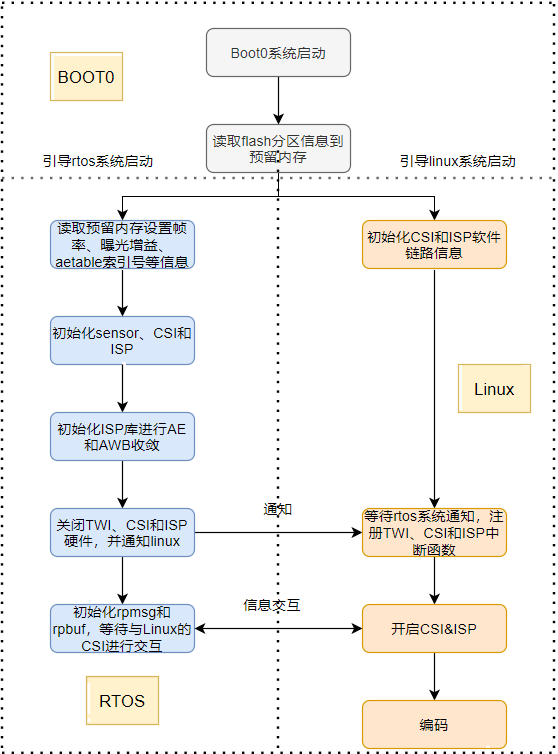

结合以上流程图，具体阐述如下：

1.  boot0启动，并读取flash分区（每个sensor占4个扇区，4kB的数据量）信息到预留内存里面，flash分区存放应用层控制输出码流分辨率、帧率、码流格式、白天黑夜切换阈值等信息。
    
2.  boot0先引导rtos系统启动，接着引导linux系统启动。
    
3.  rtos系统启动后先初始化twi、时钟、pinctrl等基础系统信息后，读取预留内存的分辨率、帧率、曝光增益等信息，并由此初始化摄像头sensor、CSI和ISP硬件。
    
4.  linux系统启动后，初始化CSI和ISP软件链路信息，等待rtos系统通知再开启CSI和ISP。
    
5.  rtos系统初始化ISP库读取效果头文件和读取预留内存白天黑夜切换阈值，主要对AE和AWB进行收敛并根据阈值切换IR-CUT。
    
6.  AE和AWB稳定后，关闭rtos系统的TWI、CSI和ISP硬件，并通知linux系统，linux系统收到通知后注册TWI、CSI和ISP中断处理函数，并使能CSI和ISP的IOMMU使能位。
    
7.  rtos系统和Linux初始化rpmsg和rpbuf，linux系统开启CSI和ISP，通过rpmsg和rpbuf与rtos系统的ISP库进行交互处理图像效果。
    
8.  rpmsg为name server机制，每次可以发送数据最大为512-16字节（数据块大小为512字节，头部占用16字节），所以rtos系统ISP库和Linux系统CSI&ISP框架之间的小数据交互使用到的是rpmsg机制。
    
9.  rpbuf机制其实就是一种共享内存机制，即在linux系统和rtos系统都申请一块name和大小相同的ddr地址，双系统都可以读写到此块ddr地址，完成大数据交互。linux系统会把统计值数据save buffer发送给rtos系统的ISP库进行处理，ISP库处理完成后，把处理结果load buffer再发送给Linux系统设置到ISP硬件。
    
10.  linux系统抓取到rtos系统的ISP库处理后的效果图像送到编码，编码读取预留内存的分辨率、帧率和编码格式，对数据流进行编码。
     

## 异构快启系统sensor更换指导

### rtos系统sensor更换说明

1.  sensor的初始化配置最好先在Linux测试通过，不然rtos无法判断sensor输出图像是否正常。
    
2.  rtos系统的sensor初始化作为一个加速阶段，切换到linux的时候就作为linux系统首帧的图像效果。
    
3.  rtos系统sensor首帧初始化目前支持预取值模式、高帧率模式、硬光敏模式和硬光敏高帧率模式（mrtos menuconfig选择配置）， [rtos-isp模式使用说明](#rtos-isp%E6%A8%A1%E5%BC%8F%E4%BD%BF%E7%94%A8%E8%AF%B4%E6%98%8E) 进行详细说明。
    

-   预取值模式指的是sensor的初始化曝光增益使用的是上一次系统关闭时候保存在flash的曝光和增益，以保证首帧曝光增益正常。最简单模式，sensor几乎没有什么特别改动。
    
-   高帧率模式就是先使用低分辨高帧率先计算出曝光增益和白平衡，然后再切换到目标帧率，以得到当前环境正确的曝光增益和白平衡，优点就是首帧曝光增益和白平衡比较正常，缺点是比第一种耗时。sensor具体如何修改支持高帧率模式会在 [Sensor支持高帧率模式指导](#Sensor%E6%94%AF%E6%8C%81%E9%AB%98%E5%B8%A7%E7%8E%87%E6%A8%A1%E5%BC%8F%E6%8C%87%E5%AF%BC) 中详细说明。
    
-   硬光敏模式光敏高帧率模式就是读取光敏电阻数值从而得到当前环境的亮度，所以可以在boot0就判断当前环境的亮度，提前控制ir\_cut和红外补光。进入rtos系统的后再通过查询提前标定的光敏gpadc置与曝光增益关系表得出首帧曝光增益，优点是与第一种模式一样出图快，缺点是会增加成本。
    
-   硬光敏高帧率模式就是读取光敏电阻数值从而得到当前环境的亮度，所以可以在boot0就判断当前环境的亮度，提前控制ir\_cut和红外补光。进入rtos系统的时候再使用高帧率模式收敛曝光增益和白平衡，由于提前在boot0就控制了it\_cut，所以优点就是出图比第二种高帧率模式快且曝光增益相对准确，缺点是增加成本。sensor支持硬光敏模式需要使用到高帧率进行加速收敛，所以改动同高帧率模式。
    

4.  可以参考gc4663\_mipi.c，位于
    
    lichee/rtos-hal/hal/source/vin/modules/sensor/gc4663\_mipi.c
    
5.  下面介绍一下sensor驱动的结构体：
    

```
struct sensor_fuc_core gc4663_core  = {
	.g_mbus_config = sensor_g_mbus_config,  //配置sensor lane数目、通道数目以及
											//mipi settletime函数
	.sensor_test_i2c = sensor_test_i2c,  //测试sensor twi通讯是否成功函数
	.sensor_power = sensor_power,  //sensor上电和下电函数
	.s_ir_status = sensor_set_ir,  //ircut控制函数
	.s_stream = sensor_s_stream,   //sensor数据流开启开关函数
	.s_switch = sensor_s_switch,   //高帧率模式低分辨率高帧率切换到目前分辨率目前帧
								   //率函数
	.s_exp_gain = sensor_s_exp_gain,  //sensor曝光增益配置函数
	.sensor_g_format = sensor_get_format,  //sensor信息配置结构体
	.sensor_g_switch_format = sensor_get_switch_format,  //高帧率模式下待切换的目
									//前分辨率目前帧率sensor信息配置结构体
	.probe = sensor_probe, //设置模组的一些基本信息，例如:模组寄存器的地址位宽和数据位宽
};
```

-   预取值模式和硬光敏模式：sensor\_s\_stream和sensor\_format配置的就是目标分辨率目标帧率的数据流开启函数和配置结构体，sensor\_s\_switch和switch\_sensor\_format不需要配置。
    
-   高帧率模式和硬光敏高帧率模式：sensor\_s\_stream和sensor\_format配置的就是低分辨高帧率的数据流开启函数和配置结构体，sensor\_s\_switch和switch\_sensor\_format配置的就是目标分辨率目标帧率的数据流切换函数和配置结构体。其中sensor\_s\_switch配置的切换寄存器越简单越好，这样初始化时间短。
    

6.  接着在该目录下camera.h添加extern该结构体sensor\_fuc\_core
    
    ```
    extern struct sensor_fuc_core gc4663_core;
    ```
    
    添加完再该目录下修改Kconfig和Makefile，编译新添加的sensor驱动。
    
7.  注册sensor驱动的func\_core结构体
    
    rtos/lichee/rtos-hal/hal/source/vin/modules/sensor/sensor\_register.c
    
    ```
    struct sensor_cfg_array sensor_array[] = {
    #ifdef CONFIG_SENSOR_GC4663_MIPI
    	{"gc4663_mipi", &gc4663_core},
    #endif
    #ifdef CONFIG_SENSOR_GC2053_MIPI
    	{"gc2053_mipi", &gc2053_core},
    #endif
    #ifdef CONFIG_SENSOR_SC2355_MIPI
    	{"sc2355_mipi", &sc2355_core},
    #endif
    };
    ```
    
8.  修改vin配置文件
    
    rtos/lichee/rtos-hal/hal/source/vin/platform/vin\_config\_\{IC\}.c，如果打开CONFIG\_VIN\_USE\_SYSCONFIG，vin配置参考[异构快启系统sys\_config文件配置指导](#%E5%BC%82%E6%9E%84%E5%BF%AB%E5%90%AF%E7%B3%BB%E7%BB%9Fsys_config%E6%96%87%E4%BB%B6%E9%85%8D%E7%BD%AE%E6%8C%87%E5%AF%BC)
    
    其中，CONFIG\_ISP\_NUMBER的数值是由用户通过menuconfig配置，表示isp使用个数。
    
    -   CONFIG\_ISP\_NUMBER = 1对应的是单目摄像头配置。
    -   CONFIG\_ISP\_NUMBER = 2/3对应的双目摄像头配置（其中CONFIG\_ISP\_NUMBER = 2表示双目线性,CONFIG\_ISP\_NUMBER = 3表示单目wdr+单目线性或者双目wdr）。
    
    这里主要关注global\_sensors，mipi0对应第一个结构体\[0\]，mipi1对应第二个结构体\[1\]：
    
    ```
    [0] = {
    	.used = 1,
    	.sensor_name = "gc4663_mipi",  //sensor名称
    	.sensor_twi_addr = 0x52,  //slave地址
    	.sensor_twi_id = 1,  //twi号
    	.mclk_id = 0,  //mclk号
    	.use_isp = 1,
    	.id = 0,
    	.addr_width = 16,  //sensor地址位数
    	.data_width = 8,  //sensor数据位数
    	.reset_gpio = GPIOA(11),  //reset引脚
    	.pwdn_gpio = GPIOA(9),  //pwdn引脚
    	.ir_cut_gpio[0] = GPIOD(18), /*-cut*/
    	.ir_cut_gpio[1] = GPIOD(8),  /*+cut*/
    	.ir_led_gpio = 0xffff,  //如果不需要设置该功能引脚的话请设置为0xffff
    	},
    ```
    
9.  修改twi配置
    
    修改twi引脚：文件位于rtos/board/v861\_e907/\{方案\}/configs/sys\_config.fex，直接修改即可。
    
    修改twi的频率：文件位于rtos/lichee/rtos-hal/hal/source/twi/hal\_twi.c，如下：
    
    ```
    twi_status_t hal_twi_init(twi_port_t port)
    {
    	......
    	twi-&gt;freq = TWI_FREQUENCY_400K;
    	......
    }
    ```
    

### linux系统sensor更换说明

1.  这里只是比较非快启环境的差异，并非从头开始讲解如何编写一个新的驱动。
    
2.  除了board.dts需要配置ir-cut引脚外，board.dts配置、编译方式都没有变化，与之前一致。
    
    ```
    sensor0:sensor@0 {
    	......
    	sensor0_sm_hs = &lt;&pio PD 18 1 0 1 0&gt;; /\*-cut\*/
    	sensor0_sm_vs = &lt;&pio PD 8 1 0 1 0&gt;; /\*+cut\*/
    	......
    };
    ```
    
3.  函数sensor\_init()如果有以下语句请把它在该函数删除，preview\_first\_flag表示第一次出图，如果在sensor\_init函数置1的话，那表示每次都是第一次出图，所以需要删除。
    
    ```
    info->preview_first_flag = 1;
    ```
    
4.  函数sensor\_reg\_init()以下语句进行变更
    
    ```
    #if defined CONFIG_VIN_INIT_rtos
    	if (info->preview_first_flag) {//首次初始化不设置，因为在rtos环境已经初始化了
    		info->preview_first_flag = 0;
    	} else {
    			if (wsize->regs)
    			sensor_write_array(sd, wsize->regs, wsize->regs_size);
    			if (info->exp && info->gain) {
    					  exp_gain.exp_val = info->exp;
    					  exp_gain.gain_val = info->gain;
    			} else {
    			if (wsize->wdr_mode == ISP_DOL_WDR_MODE) {
    							  exp_gain.exp_val = 30720;
    							  exp_gain.gain_val = 16;
    			} else {
    							  exp_gain.exp_val = 15408;
    				exp_gain.gain_val = 32;
    			}
    		}
    			sensor_s_exp_gain(sd, &exp_gain);  //设置上一次保存的曝光增益
    	}
    #else
    	if (wsize->regs) {
    		sensor_write_array(sd, wsize->regs, wsize->regs_size);
    	}
    #endif
    ```
    
5.  函数sensor\_probe()添加一下两个语句
    
    ```
    info->preview_first_flag = 1;
    info->first_power_flag = 1;
    ```
    
6.  修改加载驱动方式
    
    ```
    VIN_INIT_DRIVERS(init_sensor);
    module_exit(exit_sensor);
    ```
    
7.  board.dts配置说明
    

-   预留地址给rtos系统vin使用，使用结束后会在linux释放，但是此地址需要与系统约定好。此处只供参考，实际要按照需求进行内存分配
    
    ```
    e907_dram_reserved: e907_dram@41000000 {
    	reg = <0x0 0x41000000 0x0 0x400000>;
    	no-map;
    };
    
    isp_dram_reserved: isp_dram@414c6000 {
    	reg = <0x0 0x414c6000 0x0 0xA00000>;
    };
    ```
    
    RTOS e907 和ISP内存需要同步修改 位置：rtos/lichee/rtos/projects/v861\_e907/perf2\_fastboot/defconfig
    
    ```
    CONFIG_ARCH_START_ADDRESS=0x41000000
    CONFIG_ARCH_MEM_LENGTH=0x900000
    
    CONFIG_ISP_MEMRESERVE_ADDR=0x414c6000
    CONFIG_ISP_MEMRESERVE_LEN=0xa00000
    ```
    
    或者 mrtos menuconfig 修改
    
    
    
    
    
-   twi延后初始化，具体初始化时机等rtos通知（rtos通知：调用接口rpmsg\_notify("twi1", NULL, 0)，位于rtos/lichee/rtos/projects/v861\_e907/\{方案\}/src/main.c）, linux端board.dts中需在节点中增加如下属性：
    
    ```
    &twi1 {
    	..........
    	/\*twi驱动匹配到该节点即会延后初始化twi硬件和延后注册中断处理函数\*/
    	rproc-name = "6010000.e907_rproc";
    };
    ```
    
-   vind子设备节点改动
    
    ```
    tdm0:tdm@0 {
    	delay_init = <1>;//延迟注册中断处理函数
    	rpmsg-ser-name = "6010000.e907_rproc";
    	.........
    };
    
    scaler00:scaler@5910000 {
    	rpmsg-ser-name = "6010000.e907_rproc";
    	delay_init = <1>;
    	.........
    };
    
    vinc00:vinc@5830000 {
    	rpmsg-ser-name = "6010000.e907_rproc";
    	delay_init = <1>;
    	.........
    };
    ```
    

Linux需要使用到tdm，需要收到rtos系统使用结束，然后rtos系统会调用rpmsg\_notify通知linux系统，例如rpmsg\_notify("tdm0", NULL, 0)，这样linux会收到事先注册的回调函数进行使能该master的iommu和注册中断处理函数。其他节点scaler和vinc也是如此使用。（tdm为分时复用模式，scaler表示缩放模式，vinc表示数据输出模块）

-   isp节点改动

```
	isp00:isp@5900000 {
		rpbuf = <&rpbuf_controller0>;
		isp-region = <&isp_dram_reserved>;
		rpmsg-ser-name = "6010000.e907_rproc";
		delay_init = <1>;
	};
```

Linux需要使用到isp，需要rtos系统使用结束，然后rtos系统会调用rpmsg\_notify通知linux系统，即rpmsg\_notify("isp0", NULL, 0)，这样linux会使能 isp注册中断处理函数、释放预留内存。

-   特别说明

由于linux系统启动后sensor首次出图使用的rtos系统初始化的sensor驱动，所以如果需要修改sensor驱动的话，麻烦修改linux的sensor驱动和rtos系统的sensor驱动。

### sensor支持高帧率模式指导

1.  需要先确保预取值模式能够正常出图，需打开CONFIG\_ISP\_READ\_THRESHOLD功能。

![预取值模式配置](data:image/png;base64,iVBORw0KGgoAAAANSUhEUgAAAiIAAAD1CAIAAADicgnDAAAAA3NCSVQICAjb4U/gAAAACXBIWXMAAA7EAAAOxAGVKw4bAAAgAElEQVR4nO3dX2gbWZ4v8F/GmWQS0hBHesh42pdBdpsR987DDZauTTN7L9vCRMLEy3X3XjcB0X5oYTb2ixxmCRhP1og1uxvrxfIiMg+eFYToTo8v7WCsxijLLkMTj2WyD3sXgxOLYRw8vlCOAx0Skom770P9lVSnVKdcR3+s74c8xOXSqVOnSvWrc6r8O6c+++w7AgAAEON79a4AAACcZAgzAAAgEMIMAAAIhDADAAACIcwAAIBACDMAACAQwgwAAAh02uZ6d+4cCK0HAAA0l5s3PXZWQ28GauFw82Iq5UmlPKnUhZ16VWDtTD22bM/h+fupi5uHtdrczoXU/fM12xq0OLu9GYDjaO99Md5LdHj+/r363Nm0974Yr8uGAVoeejPQhHYu1KtXBAC8EGYAAEAgDJqBUzsXUrmz8n97wgcDXYbfrHly2/IvvhkfeFu9JMb6+nLP6+ufvmonedjtnPw6Si511tYmtHqWrWla/8Pz9+9974O+0+vrbTYKb9u8f/F5sGTfDzcv3nv+anzgLdGZtdR722S+XxuXXnvWz21rW79UWsJ6W1mTljs8f//eGfK0HRxQT9/rg/VzB3TUd/1Fbzuxt6stP+rre1fSQpzHC4ALwgw4c2Ytd7rv+kFvOxHRztqFna6X8lVxZ82To2/Gx9/KV+H7my8+7T2yKIi1/s6aJ3fw+vq4El02d6i3i6j91afjr2jnQipH4fGXFtdhXdfL8fGXh5sX7z23VX+is+vPbdb/qN1DTw7biPQVnj9v81yS6//etnLVNinnYP3MB9cPxtvVn9XH8YebF++tvwuPv7Czax9cPbi6c/He+vfC4we05tnYaevtPWJtt2w50Wu5EN7jBcALg2bgWNuTnTb5f10D2jX6zM72UV9AviM+6g2+OXhy1vKNJtb6Z3a2j/quvlKuw+2vem2FlOPXn4g46t/V9ebgeRsR7ax57m+2EbUdHhx90HVUtR08fd/0tpeX9rwgxxh74ZPetbdTe/s78nxr6AtZtqdhebX1AVzD3Zs5c8Hz3lkRNYEG9Obg4CXjV28Hrr++f+9iap2IyNOn3gIfnj6gtu17nnVtRc9rqy2w1j88fUDvuiouxO5h1J9IvnzbdelbT+7MzgDtHBzRwdnDLnpy8C7Y7qz+bdsHRx46u7PzsstxTGVt12o5x/G66PG0Oa0aNK03wVM/KKg/BBIbuTEf1+edDJodvX7x4hW61S1PHr8i+SHHuZ3el11E1P7OQ2+Cdu/H2eu3v/PQ+cNDInGRxrT+RESnObYr13OTDj74Jvj8vZ2ddwc9b7vIWf2P+q6+6H1+IZW7eEl5ysKPtV2r5RzH68UB/ky7FeUkSf5PPu6d4/84Bs3AkcPza5um97Vvu3rO5rQ/hDw8f9/4R5Ht7zx0dmfHzvpvu3ra1r9S/4Tw8Pym8VOXvvXIwcD9+hNR23pBrkPb5sZZzwdvLC/4b7t62p48oQ+6jrq63j15clp+MKPUn6McVdfLsHHHubG2W77csD77eAG4Aa8AgCPtrwJ0MZWSr9RHfdf1R9ZdAwfhNU8qRUTyG2LGN5feDoTfpHKebcM4FWt9efm91Dl1ecnWgz3ncvJQj42XwdaVW/D3UttE9CY8/rKLXX+iN32XzqdS75FceLXn4ZcuHR1sU7CdiL6lgzZP8Eit/4u++xeV/bJRjkb+4L21d85e+mJt17D8qK/vDT3R1rc4XgAuOPXZZ9/ZWU/LaXbmguf8txg0gxPq8Pz9e9/jGPQDaCX5uHeuR382g5xmAABQfwgzAAAgEJ7NABi0v/oUKTYB7PnVr07ZWa1lejPFdNgbz9e7Fu4rpsPecLpY72o0jEY/ztXqJ7r+DsvPx3GWHUujn5dioTcDJ4pvLCfVuw7HIbr+zd4+0Ixq3pvJx72GqC4qxpduBUQ5qe3s1n6d1PYBazjupVpm0AwAAOqhkcJMPu5Vld0J6L+peotQTIe9Xu9IhigzUvkRRkEc5evb8Hq93rIB63zcG06nKwtjLK/cYZPenf0On1ytartbdqNlKJ7d/syNmbczT0Hy9s0PgGk7lzwlKGkcrZDyjWrlhNPp8k+Xl295/og9D1n152hOy/PHtHyr9teWhtNPrSvk7Lxl7hjre8Ta47R2IO2VU2V3mVeHY34v3Lr+NJ/GCTP5+MhWYkOSRVZLLlojlJUkSZI2ElsjVZ5E+sZykiRlo0RR+TNSMqT+LjOyGpGXZaOZEcPFnqN8onz8Bi0o9cz6p4KlZ0ZharlH3Qt9y2bL8/GRTLRsu75uP209LalAcbsQ6KmeqK6YDgen/FnDRhn7FRpPBDKr2hcuNVWIRkJk0f7m2O1stl/WWMfFtJ1DkWhheU0us7i2rNSeiCiUlCRpIxEoKz0flxtGkqQFWs4YlpuVb7VfYs9DRv25jovl+cNoH3b7a8exrN3cOW+tzxPW98hMZmp70n45jOPIamfXvhduXX+aUeOEGSLSLh8USupXy9VMIDEu/+Qbm9SvMfy0cigUiapfC+7yQ0k9P6mhHG0bC6bZSyuWm283FIkWtouk37QXn24FhgaqhJntlBxjjN9H5n75Boa0OJNfzZB+nTZtf14OjpfpcWG2sx5nSqOMzfpov7A+jm7sF4v5/rJxHBdH54+t74W6slvnbZX2ZH2PLOtvpxyL7bLa2ZXvBbl1/WlGNQ8zvp7KuykiIgolNxI0FSwbw6Di0y0qqIvl3qhj/u7KE9dB+YZOtPP6FJ9umdbH1xPIrOYpv7oVoOW1YnFtuWC2WolCZosCpHdR1PIZ++UbGApk5tLF0lOc0f5u7ZcVxvqsdlbjjK0oY1EfruMo+jxk4jwuTs4f1veCZznvdp2cJyw85TCPI6udXfpesOrp5nnVuBqpNyP3NyVJykYLUynlmunr9mvdTxnvXAdVNspbvqGvr/SOHW/X7D5WXp5e3RpamPQvr61tV7+SUiCxkMtloxljh9tqv9SbpvxqxnjHadr+bu0XN4t2luNM3k6UYdeH8ziKPg+tNs1zXJycP+xyWOfn8c9b184TIq5yLI4jq51d+V44qM8JUvveTLdfv+8uri2rA7jFdNz8TiEUMY5fF9NhO0/JfD0Buyefg/K1Medies7x3Ucoop+0xfScdsEPRaKF5WUaGvCFIv7l5S07D2aIiELJbLQwdUNrRMv9CkWihangiCHKMNvfkkk7s/bLAWY7hyLRwtTIlK0raHl97JTP2C+h5yED93Fxev6YlWPWbm6dty6eJ1zlMI4jq51d+15w1udkqX1vJpTcSGwpL2EEp/xZJXj7xsbphtpz3Eps6GOgoaSUJeUD3hu0YGd01Dc2GVW7otUOG2f5oXG9D32Dhpz2ZkoawtAORL6eQKFA3T4iXw8Vqg95lBRI+isJlvsVikSJKDpp6OGw2t+KWTuz9ouTZTsr1TdGGeW1seBUQX3HR31nQK+PsRzL8s33S+h5yKg//3FhnD/M9mFhtJtr561L5wkRRRM9c/bLMT+OrHZ273vBV5+TBRMBtKhiOhzcnqz6Es9JU5bHHJpdi57HdVP2BfJ6vXY+1UjPZqB29BeZT758XL2hPObgDAA4gZxmLScf945kiKJZqTWiDIWSkbjXO0JERNGshJ4MQG0hzLScUFKSkvWuRG214C63CqQCbQY1HzRzK1lm3RPgGzKYOKmF20lDWy3RuN39bZJ2MeS9qVNt7Z3PrHrWuv5VJyZo0AkVWhR6Mw7lU1OU2GicEZhWu6s7YfvrG8tJY8oD7bpUwOb5zKpn3esPjaxJXgFouMTanH/EXK/6N1y7NYlmbzfu+rv5R/knUH3OB2OaCpN0u2Zdx2I6bNIfNckRW1aO4N1rkjADANBCDBk15aSdevDQsgaUZf6Q/97dmIONyJBUV5IkSZrc1vMYlGQfEPpKeJ3CjP1M3NaJtQ2rOE+Ab6OWZTOxlfyVW/UxYsGJwZkJ3nkS2hfTYW84HPZ6vVpedesds2hP1nEsrYFV8fwJ7RmbZe+wxZbdmODAcnXexO+s9fXl9iYyYO+w6fnMub82qm9z4oBqX4uyiQmYnppMEMB5HahxYv9iOix/qPh0q+TPj42JXvWF44mAnLFU+fTaciGazZak35RHQ7Ugcrzkn07VJcxUTTxuSIhtlVibyIUE+EyMROVyhTYSAbVC1n/rV4PE4KYJ3h0ltB9akDYSATmverZKrlhme/JPBFDJQUJ7i4TtjMT75lt2a4IDlya2YK+fj3v1LSzQWr5K/S132OR8duM4ssqxOr7s/TWfmIDNdIIAzutAjRL7q8NaweWhDSkZUpJyjXCOfMpZ/oxTZTTIaGhdwoxrCbFdSoBvqgYJuuuSGNyifH+3j3zdfrKXBovRnu7U31FCe1bCdt7E+6Yc7JcrE1uw1s+vZgxJ7n1jYy7fpLp1HvJOHGC5v2YTOrC5ch2wU77z768WXpSAqN+0hpJSNqp1oczjTT41ZZjUR8tYXjIl03aBuXGtcO9xc09XU5cww5Ng3IorCfAZanEXUI/E4C6Wb9qebrUbd0J7i4TtbtSHe79cmtiCtb7o89Ot8nknDnBzfxnrc10HeMt38/sbSqoPTkp74Vp4GMlE9RxuhjzEvp6AGmeYE69Q6bMZsfmXGuYVACeJwV1KgO9afdzQcBMfWJVl0p5utZuDhPbCE7Zz7pcrE1uw1hd9frp7HO1PHODm/rLW57kO8OI8vuo5sqEk/2T0Kkp74YbyDZ324nZBDXDBqQIpz2zqdR0r1TBhxjoxuEVi7WMmwHdWH171SgzuVkJ7FpP2ZLRb6QQQNiZQ4Ews7yxhO8vxJzhwNrFFSStZrx+KGE/7Yjpt/NTxJyCo8n2srKdF/bkmDrDcX/MJHVjY9ee4Dsj7Jfr7q4WboeWg/ApAyQfzq5lqfbn8aiagPQuUslH1OMiZyA1zTtfjRf3GCTOWicEtE2sfKwG+s/rwEpgY3DLBu1sJ7dmVrWxPRruFktmo2tu3NYECX0J7Zwnbmds+9gQHDie20FtJu61lrR9KSlm/PpXBQKhk6/bPNxbL/TWpJ7v+fBMHsPfXfGICNosJAjiuA0Q1TOzvG8vJXRTfWC6yqg692TijywJRKKLFGd9YTp96xTvXow8SGp/NiH0403ITASBxuLvQntCMcN46g4kA7GilBPi1gPaEZoTztqZaKKdZyyXAFwztCc0I523ttVCYQTZ4d6E9oRnhvK29Vhs0A9UxJzI4JlaymYrlvAnXBSVod5zonrs+9T0uFWqd8L7REuzbSUbTSPVtTC3UmwGjRpvIgIU34b+gCQIcJ7rnrU+jHZcTNuGC69A+dtS8N8ObyLrK+qLr01jcymXYKKmOHGv2RP1MdTouJ7U9effrpLZDvdVl0Ez7K9aK1HJmiaytEl+7XB9B5bskH1cz9dlIAQkA0Bjq+2zGNzBUNZG1kZ74WswczeWJtfNxbzidrszqbX8eA6vldmiJwck8hzd/OzhJ/M5qB8tNVD5gYCVyZyznneCANUGAxcQE5geSVX9OzPqbbtel42I1oYPZftWiPVmY7WyWwN9yu6UtUiTL/bKoC1fCfwcTUrSq+oYZQ7Y39cfyRNYV6yupj8Zy0uR28NiXgqoKU8s9agqHpJLo3jTRNyvxu0WCegsVicEN8nHvSCaaTTprB4eJ3yvbgSUfv0ELaq/Lr2dnYCVyZyZ455zggDFBgMV+sRK5m9efG6M+jO26eVxMJ3Qw3y/x7cnCbmfTBP6cExPwTojAn/Cff0KK1lWn+WaUYH+DFgyZ5UwTWVesX5K1Q7k43XDp3qE0sTYRERmSrSvrsBN9sxLRs5abYCcG11cYoWzJl8addqiSwLyiHZiMEzBZJEhnbddB1S1Z7Jf5BAGM+ruIa2ICB8fFfEIHl/aLuz1Z2PWxNRGAgIk5WHgnkuD4vreI+j6bWaAb+kXRPJG1Yf2SzGVuMk+sbY6Z6JuViN4iQb0T+uxe7nLx2bPxrYqqidzrmdCesdy0/m7i2V/Rx4WXg/bkrk89zhMrbkwA0drq/GxmbFLL8MZIZF2y9kJCmSiCiPTTVOt7O71zME+szagyO9E3KxE9T4L6qonBQ8mKDo4r7eBawnDD2IYyCmFZfsMltGfUv15EH5dGrE89zhMXCZ2QojnV+c8zi0+31K49K5G1kZwoNaU86ZxTBqXN+h8VL0a7hpHom5X43WGC+orE4Pr2Kp4oW7WDfS5OfKB1t4wJ21mJ3B0keOdNzM67X6b1l7fLSIAvkOjjQkSi25O3PsyJA7gnmOCdEOH4Eyi4OyHFSVHfZzOGDN3sRNYlQpEoZebSRd9YTvCEb0zmib5Zid+PmaBeSwxu8XuX2sGliQ/k+S3U1jEkbGclcmcs553ggLk+534x668UZp4Av5Jl/XmIPi5EQtvTQX3ME/g7mWCCd0IEjvVrMiHFSdFyEwEAAIAzmAgAAAAaDsIMAAAIhDADAAACIcwAAIBACDMAACAQwgwAAAiEMAMAAAIhzAAAgEAIMwAAIBDCDAAACHRa9AbycTHJ1AEAwInou+/+qU394ei18ORhwsMMEQUSG3XKcgkAAOVeHBhyVIrfHAbNAABAIIQZAAAQCGEGAAAEQpgBAACBEGYAAEAghBkAABAIYcZ9+XjVieK51wSHiulwa7axMle9t8n2vpgOe+N527/X9tLL+FS18qAWavF3M60lHx/ZSmwkbf2dUGg8MRdM5ceSIdG1ghaTT01RYkM6cX+v5hvLSWU/jhEV0+Hgtp31oS7Qm3FZfjUTGBqw++X2jU1GM3ONcLtZdtdn7Gfl494S4XSxYqHNG8Z83PaqjamYDpf2D8obx+atdlk5Ju2iHBBn7UzFp1vk7z52jHHreDXacW+0+px0CDPu4osyROTrCRS2GyDMWAskNiSNltIhmlWWZKOZkeYam3GouLZcICosr5Xsq9YOkiRJes9U6VCULTUtx9cToK2nJYUWtwuBHl9p+RuJrdZoZzhZEGZcxX8T6RsYCmRWq99YHZ6/n7qwo/24cyF1//yh/H/DDW/ZHZr+G7G3bqHxRLVgKd/Zj2SIMiPlVWLvgHk54XDY6/V642m5t6BdeA29B7OLsfxr4xZ426e4tlyIZrPR8jhjjn0HUVGOr9tfvsrTLZMSB4aq3pTIexmcKqgNrTcFo31Mm9/qeDFwl8M8Xk+1X5geLY6uc8X6zPqUdXDwTMdNCDOuMtyC1or8LEi53Y2slly8Ryhbk7vg4tpyIRqxfMDkG8tJkpSN6vfm6g1+Pj6SifLVc2hB2kgEMlPbk5KkXazz8Ru0oHav/FPB0otEMR0OTvmzhn4Ff/souxmK2IwzRGTayzMpRw1J+bjhslhxw1JcW656fskNvZEIqA2tdj4Z7cM4f9jHi4G7HPbxkg9sxXEJJZUds8l0fWZ9QuMJw/1ePjVV7YwG+xBmTgD9ohdK6lfR1UwgMS7/5BubtHNlVO/vlNs94xamgiZ3qtr6N2ih2lWIyUE9/d0+8nX7qfSKG0rqCVpDkahxEGo7JccYYx35t6sF0/I4Y2g34xOt4PLQhpT1T91IF0vujs3K8XX7aetpsfh0KxAIZFbzJTcsJe3sOAstu31Mzx8H+Mph14f3fHCHcVwhv5ohRBn3IMy4qg5PWkLJjQSpUcAwQPJ0yxgcbE3GYHjGkI2W/Mb4bEa/gGh9ECrvO9jn0rNqotKn8SX7W8hsUYBKhyb528fQlfD1BIxXP+OzGeXSWUzPZaKTYz4KJdVAY12OrydQ2F5bW6ahhcno1tO8sVm08hfoxjHGP83bh3H+cOMvh3m8XDofePkGhgLy+zjGWxBwAcKMq5SbUo5P2BhvqrrRsZwaGwpTKXWwottf+mja+W1w9e0vJAJO35fjbzEGw9hbeZgMJBZyubLXFPjbp7hdUANTcKpA1W8nlN2SA82NZVIuXObl+Lr9RNvbBX+3z9dDy3Omo2O+scko2XmSZ4LdPqbnjwN85VgcL1fOBwfUzhP3ezxQBcKMu3jG7YnI/tOc9nceOrujvAPQtrlxVv18Om5+fQ9FopkR7c63mA4LfKDpG5u0d4UyeaMqFNE/WkzPHecLrjVkMT1X0TsJJbPRgqFfwds++dWMoU+XrXK59w0MBbSthZJZf8E/KYcxVjm+nkAmk4lGQuQbGKJCwfSevvh0i5w//DNrH+b5Q0qlbF70nZTDOl7854Ov288Vfln7FYpEC1PBEUQZlyHMuCw0niD7cUYbW6nu7UD4zXbOk0p5Uqn36IM3ymLf2DjdUEcethIb+pBWKCllyTCqL/RvQEORKNno0MjxKFjyjCeU3EhsyfUMTvmzTjtdoXF9zOYGDUVN1kiWDO/xtU9+NWO88IcihjhjfDajjhf5xnKGQaTVnsTWiDeetyjH1+1XL7yG/5aVf4wGYrQP+/yRf1t5vMxxl2NxvKKJnrmK3VVeSzO8QmesUCiZjcqL1R6r5frM/QpFokRk8ysJdp367LPv7Kx3545htrVvOSb1zMe9cz2tNXum/V1uwcYBaGTFdDi4Pen4hZamc8zrudfrtfMpJJtxXygp2TxJ7a8JAOLlU1OFaBZfSpchzAAAUD7uHckQRbO49XMdwow7bt70mC7/+ON/NV3+m9/8d9Pl2uCkzfIBGgHrvG0ioaQkJetdiRMKrwC4r3+CZoddXlOUflqcpc46VqCTZhepv2HK7xymxUXln9Wn7LdbJ83KBda4nUu3a3e/7BUr8HjBSYTejNv6KdZB0/O21n30JV2bof4leiS4UmDT7hKNLhF10uyMOwX2/wXRCo0uuVOa8+26vV8A9qE347L+XtrfpF3t5z/+5ubg/0htqj9u3hkcvLH8R/XHXXrwmK7Vt0NTS/3HvptuNh0dtLfXQtsFqIQw47LeK7S5Yfj5hx/fuT341e07m0REv0vdXrl6e2Hoh/rvn+3R5Y4a1xEAoHYwaOaqTuog2twtXdj76ec/uZ5d/vRHlPnq6t+t9Jb8cneD9meon2yNm/VP/M21vT/fG/znK0RE9PjuL+YfycsppiyiUcN43fAsDV4mIqJ9mr6l97EmFklefWXF1m6xymFt10Qnzc6QXEZskWJlH+mnxZjy37ujelP0T9C1PdobJHV/yWp/DYVoa1qXr7VD9fqXrm+n3fRGi9FirKTpWPtlUh95mGufLl+mxyvUMUiXiVamaWm3fHN2tlv9I8aV+dsTwBTCjKvep8v79Kx86Y+GJsd/+/n1z2nw9sp/O+YWLg/+x+b0L+YNl43+CYoRjY4SEQ3P0uww3VpSltM/0uiu8v+ZCeXK1T9BV9Sr2PBs9S1alGO6XXO7dGtUuTxVXphivUo5/RMUm6BHhiv+5UHanCY7+zsR06+//RPU/0jfimn5Ze1Qpf787bZ0i5aIhmep40HpNZq9X6z6bP4jbQRpZpDujhJN0LWgVZix3q7pfpkeX972BGDBoFlN/LD/Zz8h+smPf3TskvZXPi67xPReoZUvlf8vPaDLvcobTY/m9YvRo02iDmV52fpV2SxH264DWjnG8mX7K+WXVIvt9gb1OhsvsKbl89aft92sce3X3i7t7hGZ3MG4gHV8ibM9AVjQm3HVM9q/TO9T+RjFH5f/9pc0eJVSS5sfj/eaf9ShTuogujJDg9qSffU/hpENfbnpsJ41djnm2+W3Z78+7O3OT9PsDC0OEhHtr5R0TUzK520HB+3GRXT5FkyPL297ArAhzLhql/aIOjrL4szvln75H1dvL4wTDd6+07dy0xhoOoN0+fExRrd3aY/ogdn4+ETMMKTeT4vXLGpoxaIc0+2KZbFdeVyOlOtmldfEeduBv934iC6fzfz4Emd7ArBh0Mxlm4/1oQZlSeqvv7r6d+O9RL03b19duZ36nfG373fQ/vFePN18TLEJ9YdOmp3Qf7WnDrIMXytZf/AvTJZbYJXD2i7TM9qXL6bHYL7dTprgfC+8rB1KXkPfpT2i3n6r9V1nVR+3mO0XmR5f/vYEYEFvxmWPvqRrf0WdS+o1YvPO7a/+8+e/VJ789w6P/+Tzv071/Yv8Xg910rUr9OB4T1AfzRNN0OIiESlvCsm+XKEZdXBpZYWoV1+/Y1ZZ37icxaIc0+1a2aUHjykml2bv5a5K5tvdpS+D6kKilenqt97GdqDH5X9BOX+XFmO0GNPHi3jbjZd1fdxSuV/mx5e/PQFYMBGAO4w5x+TXVeXvsHVOM+OaMuQ0g2Z0AnKatSZMBNCsyl7LcWVNAIAmhWczAAAgEHoz7mAPGvwX06V9fXyDDBiUAIAmhd4MAAAIhDADAAACIcwAAIBAeDbjgu9//fX3v/663rUAqLM/ffjhnz78sN61gIaDMOOC73/99bm///t61wKg3n7+c4QZqIRBMwAAEAhhBgAABMKgmQv+9OGH9POf17sWAHWGETMwhTDjAjz5BABgwaAZAAAIhDADAAACIcwAAIBACDMAACAQwgwAAAiEMAMAAAIhzAAAgEAIMwAAIBDCDAAACIQwAwAAAiHMAACAQAgzAAAgEMIMAAAIhDADAAACIcwAAIBACDMAACAQwgwAAAiEMAMAAAIhzAAAgEAIMwAAIBDCDAAACIQwAwAAAiHMAACAQAgzAAAgEMIMAAAIhDADAAACIcwAAIBACDMAACAQwgwAAAiEMAMAAAIhzAAAgEAIMwAAIBDCDAAACIQwAwAAAiHMAACAQAgzAAAgEMIMAAAIhDADAAACIcwAAIBACDMAACAQwgwAAAiEMAMAAAIhzAAAgEAIMwAAIBDCDAAACIQwAwAAAiHMAACAQAgzAAAgEMIMAAAIhDADAAACIcwAAIBACDMAACAQwgwAAAiEMAMAAAIhzAAAgEAIMwAAIBDCDAAACIQwAwAAAp2uwTYKU0HvlPzf6Lvv/qmtBpsEAAAbjl4L34TwMBNKSlJS//HFwYHoLQIAQOPAoBkAAAiEMAMAAAIhzAAAgEAIMwAAIGT0y1YAAAWQSURBVBDCDAAACIQwAwAAAiHMAACAQAgzAAAgEMIMAAAIhDADAAACIcwAAIBACDMAACAQwgwAAAjkJENz27mLnnOu1wQAABrQm+CpHxTUHwIJ7s87CTNHr1+8eHXk4IMAANB0cpIk/ycf987xfxyDZgAAIBDCDAAACIQwAwAAAiHMAACAQAgzAAAgkJM3zaB13LzpqXcVjuXOnYN6VwGg1SHMQC10DtPMoPL/u6P0qK6VOcGefTERW9whIqKPplcn++pcHQAihBmojd0lGl0i6qTZmXpX5UR7/5P51U/kaPOHetcFQIEwA45tTSz++ory/5/eHf2fteuj9NNirDV6Rf/v4cV/2H915/pb+cf/e8+zdvlF/CP8dTQ0EYQZcGZrYvHXdPcXo4/UH2d/++zWz3brWykAaDwIM8Cjk2ZnaO8uzT+TOuinD/TehH/+lr5W/wTF5G7OYxqdr14qa319+T5N36JdtQKXiYgotkgx9SOdwzTTq67TRIrpcHDKn5WSISefXp+LzDwkIhsPYp59MRH7w5+N/n5RfnJTbf1iOhxcHtrIjfmc1AugBMIM2DI8S4OXiYhWpmlpl4i8e/TPsUWiirGy/gmKEY2OKp+aHaZbS1Yls9bvn6BYB02PKtFluJ92HxHt0q1Rk0Gz3SUa3aPFRSKi/ZUqW2wAxXQ4OFUgokBiQ3J2LV+fi8zQ9OpqnxxDJr64O//J+5afeLj4B7vr+8ZyUnfc6/XKVUS4geNAmAEr2htij+/SaEk88c+P/uXE4q9ji/8eIzI+m+m9QivTykpLD2jwGnUuWXUyWOvLy5UP7sqxzdIjpYadw0q8eXzX9n7WihZeollJstuD+bf3bv6b/lNHmIiI1r9+2DV6V+6RvP/J9Y8W7z169ol1nOka/V8864eSkpSU6+z1KnV21uuCFocwA47550d/If+vf+JvYhP+R/N+6qQOoiszNKittW9ZBmv9Tuog2myyITBB/us3Ja8AEBHRs93f087DWGRRW6trtFo5P+607u0AiIEwA1aUF5GJhmdpMUakD5qVeLT509g1qZNod5f2iB7YfweMtf4u7RF1dBLHw5Z+pYb7K8oQHBHdGbb98ZrwjeWkMVJ6CCPkfETq/c4f00fX+f4y5ve7z6jPfqTJx70jGZLH9SQMmoFzSDYDtizdotFRGp2m3hma6Cfq/O3sxJb22/7ef6c9rxwRNh9TbEL9RSfNThhK2aU9ot7+kpJZ628+psG/ok51+bDxU89oXw5C2ueGafEaTY/S6GjjP5ghOdxIkiRtDC0HvfG8gxL6Pvzo4czcuvLTsy8mtP+THIQefr1e9pGdxf+9rqx972HXn/VbRJxiOuyd69mQJEmS8GAGjgm9GeAhP4EnIvrZrc3/s7j4a2X5/p9P3/LL/300TzShPB2R3xAzmr9LizFajOkP6lnry8tnTMvZpQePKSYPtT2m0Xm919Vk1N6NA32Tq9NzkUiEiIi6Ru/O95X8cvqjyEzkofwb5RHMR6P/6V4kMkNE9NH0quVzmWPUC6Dcqc8++87OelpuqDMXPOe/xeyZrQI5zU6IZ19MxP7AOcgGUC4f98716OO88ruIVWHQDAAABEKYAQAAgfBsBqxg0OmEeP+T+dV61wFaFXozAAAgEMIMAAAIhDADAAACIcwAAIBACDMAACAQwgwAAAiEMAMAAAI5+buZtnMXPefk/74JnvpBwdUKAQBAwwokuD/CHWbevjw4eKn/mJMk7m0CAEDLwKAZAAAIhDADAAACIcwAAIBACDMAACAQwgwAAAhkd/ZMXr/61SkRxQIAQHNBbwYAAARCmAEAAIEQZgAAQCCEGQAAEAhhBgAABEKYAQAAgRBmAABAIIQZAAAQCGEGAAAEQpgBAACBEGYAAECg/w++QyF0Ry1KdwAAAABJRU5ErkJggg==)

2.  询问Sensor原厂FAE获取高帧率的初始化寄存器表，以及高帧率切换低帧率的寄存器表，并完成rtos驱动。
    
    ```
    	(例如rtos下的gc4663_mipi.c)
    	static struct regval_list sensor_720p120_regs[] = {
    		......
    	};
    	static struct regval_list sensor_720p120fps_to_2k20fps[] = {
    		......
    	};
    ```
    
    高帧率的分辨率尽可能要求原厂FAE提供大一些，有利于提高切换低帧率首帧白平衡、AE的准确性。
    
    \*\*注意：\*\*在使用前可先验证写入sensor\_720p120\_regs\[\] + sensor\_720p120fps\_to\_2k20fps\[\]是否可以正常出图：使用预取值模式，把sensor\_2560x1440p20\_regs\[\]里的数据修改成sensor\_720p120\_regs\[\] + sensor\_720p120fps\_to\_2k20fps\[\]
    
    ```
    	static struct struct regval_list sensor_2560x1440p20_regs[] = {
    		高帧率寄存器表；（sensor_720p120_regs[]的内容）
    		切换低帧率的寄存器表；（sensor_720p120fps_to_2k20fps[]的内容）
    	}
    ```
    
3.  参考SDK的其中一份已经支持高帧率模式的驱动（gc4663\_mipi.c或gc2083\_mipi.c）完成所有的CONFIG\_ISP\_FAST\_CONVERGENCE配置，主要完成sensor\_get\_switch\_format()、sensor\_get\_format()、sensor\_s\_switch(), 其他可直接同步。 完成后可以尝试设置成高帧率模式验证是否能够出图。
    

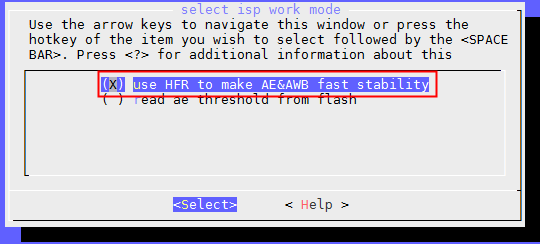

```
如能够正常出图，则继续进行下述步骤；否则，请继续检查驱动。
```

4\. 生成高帧率的ISP初始寄存器数据

```
修改为预取值模式，rtos的sensor驱动中sensor_get_format()和linux的sensor驱动中sensor_win_sizes[]只留下高帧率模式的配置，屏蔽其他的分辨率。

rtos/lichee/rtos-hal/hal/source/vin/vin_isp/isp_server/isp_manage/isp_helper.c中的isp_reg_save_exit()所有打印打开。

正常运行demo_video_in后E907串口会打印出ISP初始寄存器数据，复制一份已有的高帧率配置文件修改其文件名以及文件内的sensor名称，并把新的初始寄存器数据填入。
```

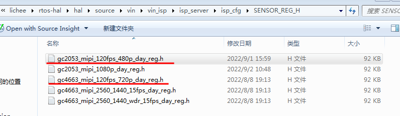

5.  生成高帧率的ISP头文件。
    
    复制低帧率的ISP头文件出来，修改其文件名以及文件内的结构体名称，并把部分与亮度、白平衡无关的模块关闭，修改AE table的最大曝光，曝光时间不得超过帧率上限。同时需要注意的是高帧率参数要确保跟低帧率参数的最小曝光时间和ae\_max\_lv要相同。
    

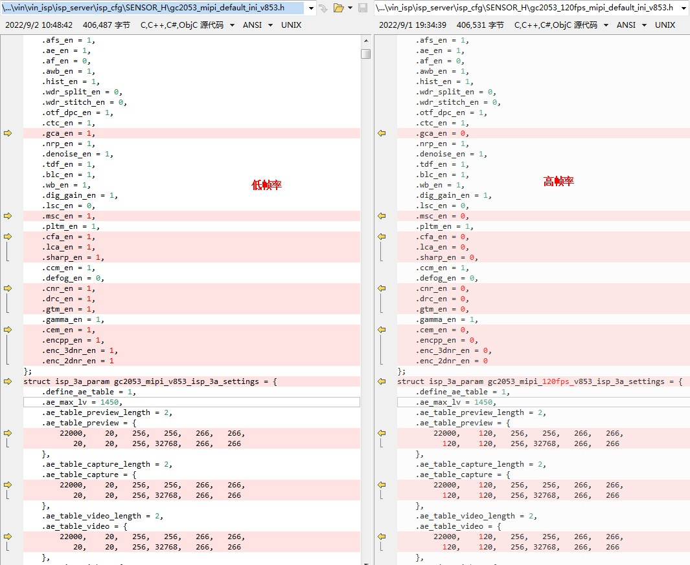

6.  isp\_ini\_parse.c完成高帧率模式的配置
    
    cfg\_arr\[\]中配置好高帧率的参数头文件。
    
    reg\_arr\[\]中配置好高帧率的初始化寄存器表。
    
7.  linux对应的sensor驱动需要添加ir\_cut控制接口，例如gc4663或者gc2083驱动中添加
    
    ```
    static long sensor_ioctl(struct v4l2_subdev *sd, unsigned int cmd, void *arg)
    {
    		......
    		case VIDIOC_VIN_SET_IR:
    			sensor_set_ir(sd, (struct ir_switch *)arg);
    			break;
    		......
    }
    ```
    
8.  硬光敏配置修改
    
    由于硬光敏模式也需要使用到高帧率，所以硬光敏模式sensor的改动同高帧率模式，即使用硬光敏模式前需要先把支持高帧率模式。
    

## rtos-isp模式使用说明

### rtos-isp模式简介

rtos 系统sensor首帧初始化目前支持预取值模式、高帧率模式、硬光敏模式和硬光敏高帧率模式，通过mrtos menuconfig选择配置，如下：

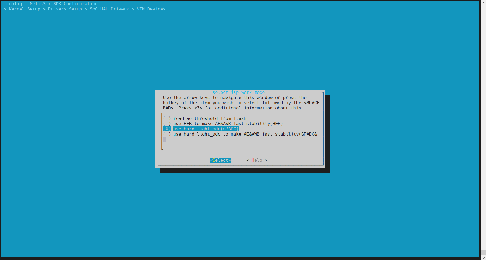

1.  read ae threshold from flash：预取值模式，指的是sensor的初始化曝光增益使用的是上一次系统关闭时候保存在flash的曝光和增益，以保证首帧曝光增益正常。
    
    优点就是出图时间快，缺点是场景变化会导致下一次出图曝光增益不准。
    
2.  use HFR to make AE&AWB fast stability(HFR)：高帧率模式（也称软光敏模式），指的是先使用低分辨高帧率先计算出曝光增益和白平衡，然后再切换到目标帧率，以得到当前环境正确的曝光增益和白平衡。
    
    优点就是首帧曝光增益和白平衡比较正常，缺点是比较耗时，特别是夜视需要开启ir\_cut，所以夜视出图耗时需要增加200ms。
    
3.  ISP\_ONLY\_HARD\_LIGHTADC（GPADC）：硬光敏模式，指的是读取光敏电阻数值从而得到当前环境的亮度，所以可以在boot0就判断当前环境的亮度，提前控制ir\_cut和红外补光，进入rtos系统后通过提前标定光敏电阻gpadc数值与曝光增益关系的得到关系表，从而使得冷启动后获取当前环境gpadc数值经查询关系表得出sensor的曝光增益，从而保证首帧曝光增益正常。
    
    优点就是出图时间快，但是曝光增益准确性依赖于光敏电阻的精度，缺点是增加成本且首帧白平衡会有偏差。
    
4.  use hard light\_adc to make AE&AWB fast stability(GPADC&HFR)：硬光敏高帧率模式，指的是读取光敏电阻数值从而得到当前环境的亮度，所以可以在boot0就判断当前环境的亮度，提前控制ir\_cut和红外补光，进入rtos系统的时候再使用高帧率模式收敛曝光增益和白平衡。
    
    由于提前在boot0就控制了it\_cut，所以优点就是出图比第二种高帧率模式快，而且首帧曝光增益和白平衡也比较正常，缺点是增加成本。
    
    流程图如下：
    

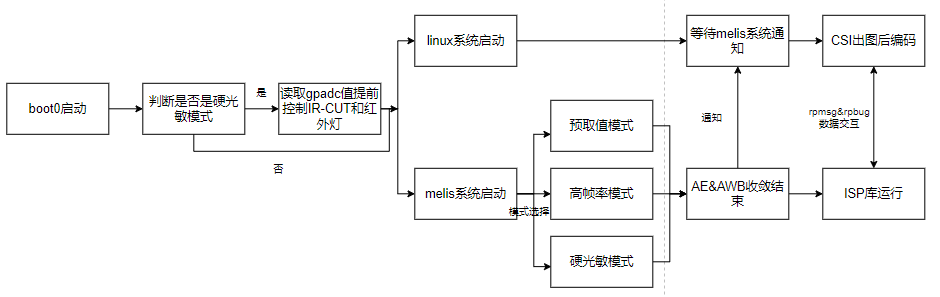

### rtos-isp详细说明

#### 预取模式

预取模式使用上没有其他特殊情况，但需要注意的事项有：

1.  由于保存的是上一次退出时候的曝光增益，所以一旦场景发生变化，首帧曝光增益将不准。
    
2.  底层不会控制ir\_cut自动变化，所以当首帧需要开启ir\_cut的时候，需要上层设置。
    

#### 高帧率模式（软光敏模式）

使用高帧率模式时需要保证sensor本身支持小分辨率高帧率格式，使用说明：

1.  配置sensor和效果头文件支持高帧率模式。
    
2.  通过分区参数lv\_liner\_def控制白天夜视切换阈值，如果上层不设置lv\_liner\_def，默认值为200。（参数lv\_liner\_def可以查看flash分区3.5kB对应的结构体 [tagsensor\_isp\_config\_s](#tagsensor_isp_config_s) ）。
    
3.  步骤及流程图
    

-   rtos系统启动，先关闭ir\_cut，首帧通过lv\_liner\_def判断需不需要开启夜视，如果需要开启则要等待200ms以开启ir\_cut，然后进行高帧率收敛，收敛结束后切换到目标帧率。
    
-   linux系统起来拉高ir\_cut引脚中止充电。
    
-   高帧率模式流程图
    

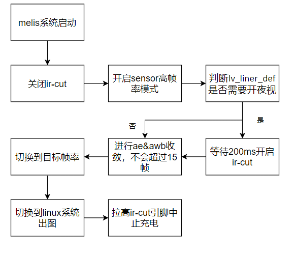

4.  调试高帧率模式注意事项

-   sensor支持小分辨率高帧率模式最好是scaler模式而不是图像高度crop模式，而且最好是binning模式而不是skipping模式，不然会出现统计画面亮度偏差导致高帧率模式不准确。
    
-   如果sensor不支持scaler模式而是图像高度crop模式，高帧率模式输出的分辨率应该尽可能大（例如：sensor的最大规格支持4M30fps，那么理应能够支持到1M120fps），有利于提高高帧率模式AE和AWB计算的准确性。
    
-   高帧率模式参数头文件中的ae table的min\_exp和ae\_max\_lv需要与线性模式一致，且ae table的max\_gain需要提高（例如：低帧率用的是30fps，最大增益设置为20000；在120fps高帧率下最大增益需要设置为 120 \* 20000 / 30 = 80000）。
    
-   高帧率模式参数头文件中ae target需要与线性模式的一致；一般情况下低帧率的彩色模式和红外模式下的AE target差异较小时可共用一份高帧率参数；如差异较大，高帧率可以分别使用彩色模式和红外模式两份效果头文件。
    
-   低帧率模式ISP参数头文件中PLTM manual\_strength代表首帧的PLTM强度，需要填写各ISO下稳定时的PLTM实际强度。
    
-   高帧率模式ISP参数头文件中ae tolerance越大，切换低帧率的时间越快，首帧的AE、AWB准确性越低；反之，切换低帧率的时间越慢，首帧的AE、AWB准确性越高。
    

#### 硬光敏模式

硬光敏模式指的是通过在boot0读取光敏电阻的gpadc值，从而知道当前环境亮度，提前控制ir-cut，而在rtos阶段则通过查询关系表得到sensor的首帧曝光增益（需要在灯箱提前标定好光敏电阻gpadc数值与sensor曝光增益的对应关系表）。使用说明：

1.  通过分区参数light\_enable控制是否开启boot0读取光敏电阻的gpadc值以判断是否需要开启ir\_cut和红外补光，此外还需要配置阈值和光敏电阻属性，其中阈值是分区参数light\_def，光敏电阻属性是adc\_mode，adc\_mode为0表示gpadc值越大环境光越亮，为1表示gpadc值越大环境光越暗。所以adc\_mode为0时，gpadc值小于light\_def则开启ir\_cut和红外补光，大于light\_def则关闭ir\_cut和红外补光；反之adc\_mode为1时，gpadc值大于light\_def则开启ir\_cut和红外补光，小于light\_def则关闭ir\_cut和红外补光。（参数可以参考flash分区3.5kB对应的结构体 [tagsensor\_isp\_config\_s](#tagsensor_isp_config_s) ）。
    
2.  提前标定好的两大组关系表，并把关系表设置到结构体LIGHT\_SENSOR\_ATTR\_S中的linear和linear\_night ，如果有wdr模式，则需要多标定两大组关系表hdr和hdr\_night。设置后需要把light\_sensor\_en置1，表示可以使用已经标定好的关系表。rtos系统启动后会去获取当前gpadc数值，通过查询关系表获取sensor的曝光增益，设置到sensor作为首帧曝光。
    
3.  步骤及流程图
    

-   boot0启动，通过判断分区参数light\_enable是否在boot0读取gpadc从而控制ir\_cut和红外补光，如果boot0已经控制ir\_cut和红外补光的话，置起分区参数ircut\_state为1。
    
-   rtos系统启动，读取分区参数ircut\_state，ircut\_state为0则需要在rtos系统控制ir\_cut和红外补光，ircut\_state为1则表示boot0已经处理ir\_cut和红外补光，接着读取当前环境的gpadc数值，并查询关系表获得sensor的曝光增益，设置到sensor获得使得图像正常曝光。
    
-   linux系统起来拉高ir\_cut引脚中止充电。
    
-   硬光敏模式流程图：
    

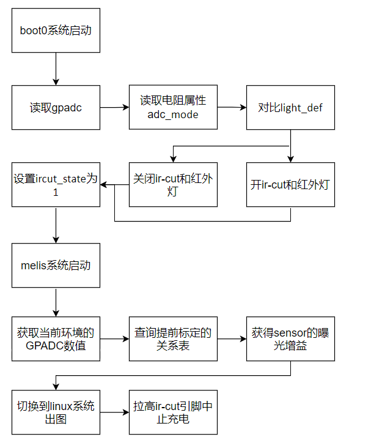

4.  标定说明

-   通过设置SENSOR\_ISP\_CONFIG\_S结构体中的参数lightadc\_debug\_en为1，在下次冷启动后会在rtos系统中打印当前光敏gpadc数值、ae\_table索引号、曝光行、模拟增益，lv等级以及ae\_wdr曝光比，如下所示：

```
[ISP0]gpadc_value:1287, ae_table idx:254, exp_line:21600, again:288, ev_lv:634,ae_wdr_ratio:32
[ISP0]gpadc_value:1286, ae_table idx:254, exp_line:21600, again:288, ev_lv:634,ae_wdr_ratio:32
[ISP0]gpadc_value:1287, ae_table idx:254, exp_line:21600, again:288, ev_lv:634,ae_wdr_ratio:32
```

-   白天标定：在灯箱中进行调节，需要使得gpadc数值从小到大变化（如果是越暗gpadc数值越小，则需要从暗到亮进行标定；如果是越亮padc数值越小，则需要从亮到暗进行标定），调节灯箱亮度，等到ae稳定后记录gpadc\_value、ae\_table idx、exp\_line和again，最多可以标定96组，标定越多，颗粒度越小，首帧曝光增益越准确，最后设置到SENSOR\_ISP\_CONFIG\_S结构体中的结构体linear。
    
-   夜视标定：由于光敏电阻对红外光不敏感，所以在夜视下，比较难通过标定关系表获取到准确的曝光增益值。所以一般采取合适的方式进行标定。在暗室里面，将摄像头切换到夜视模式，开启ir-cut和红外灯，将摄像头与目标放置一定距离，如5米以上，避免红外光反射到镜头造成过曝问题，可以有两种方式：
    

（1）在暗室下，等ae稳定后记录gpadc\_value、ae\_table idx、exp\_line和again，纪录一组结果，并把它设置到SENSOR\_ISP\_CONFIG\_S结构体中的结构体linear\_night。

（2）在暗室下，将均匀光源放置在角落，避免光线直射到镜头和光敏电阻，均匀调节光源，使得gpadc\_value从小到大变化，并记录下gpadc\_value、ae\_table idx、exp\_line和again，最多可以标定40组，最后把它设置到SENSOR\_ISP\_CONFIG\_S结构体中的结构体linear\_night。这种模式要求光敏电阻灵敏度比较高。

-   Wdr模式：白天标定和夜视标定过程与线性一置，但是需要注意的是，wdr在标定的时候需要选择固定曝光比的模式进行标定，可以查看rtos系统的打印中的ae\_wdr\_ratio是否是一致，并把该数值设置到SENSOR\_ISP\_CONFIG\_S结构体中的参数hdr\_light\_sensor\_ratio。

5.  调试硬光敏模式注意事项

-   首帧曝光不正常问题，可以多标定几组光敏gpadc与sensor曝光增益的关系表，看sensor曝光增益相同或者相近的情况下，光敏gpadc的数值是否相似，这与光敏电阻的灵敏度相关。
    
-   光敏gpadc对光的感知不是线性的，在某一个范围内光敏gpadc会出现突变现象，那么就需要对该范围内进行小颗粒度标定，即在该范围内多标定几组对应关系表。
    
-   通过在rtos系统执行dmesg指令，可以看到boot0控制信息，以及当前光敏gpadc值与查询到的曝光增益。
    

#### 硬光敏高帧率模式

硬光敏高帧率模式指的是通过在boot0读取光敏电阻的gpadc值，从而知道当前环境亮度，提前控制ir-cut，而在rtos阶段则使用高帧率模式进行快速收敛。使用说明：

1.  由于需要借助高帧率收敛曝光增益，所以需要先支持高帧率模式。
    
2.  通过分区参数light\_enable控制是否开启boot0读取光敏电阻的gpadc值以判断是否需要开启ir\_cut和红外补光，此外还需要配置阈值和光敏电阻属性，其中阈值是分区参数light\_def，光敏电阻属性是adc\_mode，adc\_mode为0表示gpadc值越大环境光越亮，为1表示gpadc值越大环境光越暗。所以adc\_mode为0时，gpadc值小于light\_def则开启ir\_cut和红外补光，大于light\_def则关闭ir\_cut和红外补光；反之adc\_mode为1时，gpadc值大于light\_def则开启ir\_cut和红外补光，小于light\_def则关闭ir\_cut和红外补光。（参数可以参考flash分区3.5kB对应的结构体 [tagsensor\_isp\_config\_s](#tagsensor_isp_config_s) ）
    
3.  步骤及流程图
    

-   boot0启动，通过判断分区参数light\_enable是否在boot0读取gpadc从而控制ir\_cut和红外补光，如果boot0已经控制ir\_cut和红外补光的话，置起分区参数ircut\_state为1。
    
-   rtos系统启动，读取分区参数ircut\_state，ircut\_state为0则需要在rtos系统控制ir\_cut和红外补光，ircut\_state为1则表示boot0已经处理ir\_cut和红外补光，接着进行高帧率收敛，收敛结束后切换到目标帧率
    
-   linux系统起来拉高ir\_cut引脚中止充电。
    
-   硬光敏高帧率模式流程图。
    

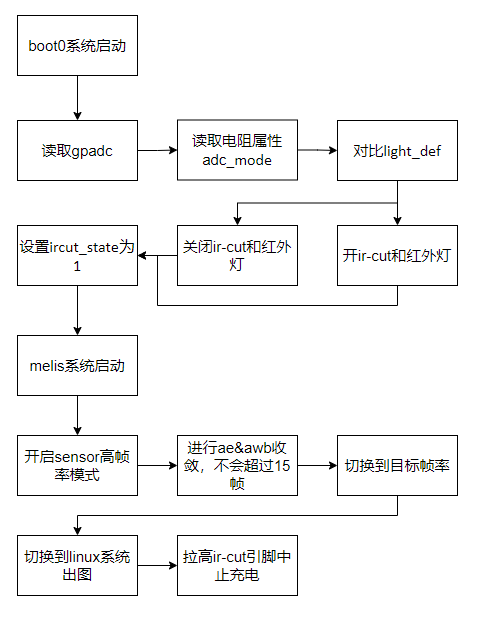

4.  调试硬光敏高帧率模式注意事项

-   可以在rtos系统通过demsg指令，通过dump打印信息判断boot0控制信息、当前是白天还是夜视模式和gpadc数值等信息。
    
-   其他注意事项同高帧率模式注意事项。
    

## 异构快启系统应用层设置flash分区结构体说明

### 背景说明

在fastboot系统的kernel阶段，由于需要快速出图，所以kernel启动后在各种系统资源ready后就可以出图，即出图不需要等到kernel完全启动后，那也表明应用启动后（应用启动需要等待kernel完全启动后）也控制不了出图的一些配置，例如wdr、宽高、编码格式等等。所以需要通过设置flash分区参数，以便可以提前设置出图配置。

流程图如下：

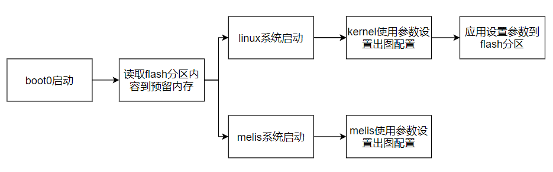

操作步骤如下：

1.  烧录固件后第一次启动，boot0读取flash分区标识符不匹配，linux系统和rtos系统使用默认参数出图，应用设置当前出图参数到flash分区，并对flash分区的标识符赋值，以便下次可以读取成功。
    
2.  第二次启动，boot0读取flash分区数据（通过标识符配置正确后）到预留内存，linux系统和rtos系统通过读取预留内存的值设置出图参数，输出应用想要的图像数据，应用再次设置当前出图参数到flash分区。
    
3.  第n次启动与第二次启动一样的流程。
    

### flash分布说明

每一个flash预留分区大小为4KB，单目摄像头方案需要一个总共4KB，双目摄像头方案需要两个总共8KB。

其中flash4k分为3.5KB（前七个扇区）预留给 [tagsensor\_isp\_config\_s](#tagsensor_isp_config_s) ，存放应用层控制参数；另外512B（第八个扇区）预留给isp\_autoflash\_config\_s，存放sensor和isp保存信息。

对应flash分区的位置介绍：第4.3小节。

#### tagsensor\_isp\_config\_s

flash分区3.5kB大小对应的结构体为tagsensor\_isp\_config\_s，具体位置位于：

linux：bsp/drivers/vin/vin-video/vin\_video.h

rtos：rtos/lichee/rtos-hal/hal/ource/vin/vin\_isp/isp61x\_server/isp\_server.c

应用层：platform/allwinner/multimedia/rt\_media/sun252iw1/api\_adapter/AW\_VideoInput\_API.c

含义如下：

```
#pragma pack(1)
typedef struct taglight_sensor_attr_s {
	unsigned short u16LightValue;	/*adc value*/
	unsigned short ae_table_idx;
	unsigned int   u32SnsExposure;
	unsigned int   u32SnsAgain;
} LIGHT_SENSOR_ATTR_S;
typedef struct tagsensor_isp_config_s {
	int sign;                    //id0: 0xAA66AA66, id1: 0xBB66BB66
	int crc;                     //checksum, crc32 check, if crc = 0, do check
	int ver;                     //version, 0x01

	int light_enable;            //boot0 adc en
	int adc_mode;                //ADC mode, 0:the brighter the u16LightValue more, 1:the brighter the u16LightValue smaller
	unsigned short light_def;    //adc threshold: 1,adc_mode=0:smaller than it enter night mode, greater than it or equal enter day mode;
				     //2,adc_mode=1:greater than it enter night mode, smaller than it or equal enter day mode;

	unsigned char ircut_state;   //1:hold, 0:use ir_mode
	unsigned short ir_mode;	     //IR mode 0:force day mode, 1:auto mode, 2:force night mode
	unsigned short lv_liner_def; //lv threshold: smaller than it enter night mode, greater than it or equal enter day mode
	unsigned short lv_hdr_def;   //lv threshold: smaller than it enter night mode, greater than it or equal enter day mode

	unsigned short width;        //init size, 0:mean maximum size
	unsigned short height;
	unsigned short mirror;
	unsigned short filp;
	unsigned short fps;
	unsigned short wdr_mode;     //hdr or normal mode, wdr_mode = 0 mean normal,  wdr_mode = 1 mean hdr
	unsigned char flicker_mode;  //0:disable,1:50HZ,2:60HZ, default 50HZ

	unsigned char venc_format;   //1:H264 2:H265
	/* unsigned char reserv 256 */
	unsigned char sensor_deinit; //sensor not init in melis
	unsigned char get_yuv_en; //get melis yuv en
	unsigned char light_sensor_en; //use LIGHT_SENSOR_ATTR_S en
	unsigned char hdr_light_sensor_ratio; //LIGHT_SENSOR_ATTR_S hdr exposure ratio, default is 16
	unsigned char lightadc_debug_en; //printf data about LIGHT_SENSOR_ATTR_S
	unsigned char pix_num; //two or one pix_num, default is one pix_num
	unsigned char tdm_speed_down_en; //tdm speed down en
	unsigned char reserv[256 - 7];

	LIGHT_SENSOR_ATTR_S linear[DAY_LIGNT_SENSOR_SIZE]; //day linear mode parameter, auto exp
	LIGHT_SENSOR_ATTR_S linear_night[NIGHT_LIGNT_SENSOR_SIZE]; //night linear mode parameter
	LIGHT_SENSOR_ATTR_S hdr[DAY_LIGNT_SENSOR_SIZE];    //day hdr mode paramete
	LIGHT_SENSOR_ATTR_S hdr_night[NIGHT_LIGNT_SENSOR_SIZE];    //night hdr mode parameter
} SENSOR_ISP_CONFIG_S; //size is 3563 < 3584(3.5k)
#pragma pack()
```

参数说明：

**#pragma pack(1)** ：结构体按1个字节对齐。

**Sign**：标识符，应用层设置后rtos和linux底层匹配到对应数值后才会使用用该flash进行设置，其中双目摄像头需要设置对应数值为0xAA66AA66和0xBB66BB66，单目摄像头设置数字为0xAA66AA66。

**Crc**：校验和，目前无需设置。

**Ver**：版本号。

\*\*light\_enable（硬光敏模式和硬光敏高帧率模式）：\*\*boot0 adc模式（光敏电阻模式）开关，打开会打开boot0检测gpadc，由此实现boot0控制ir\_cut和红外补光。

\*\*adc\_mode（硬光敏模式和硬光敏高帧率模式）：\*\*光敏电阻特性，0表示环境越亮光敏电阻数值越大，1表示环境越亮光敏电阻数值越小。

**light\_def（硬光敏模式和硬光敏高帧率模式）**：光敏电阻数值阈值，当ir\_mode为1自动模式时有效，有两种情况：①adc\_mode为0时，实际光敏电阻数值比它小为夜视模式，比它大为白天模式；②adc\_mode为1时，实际光敏电阻数值比它大为夜视模式，比它小为白天模式。

**ircut\_state（硬光敏模式和硬光敏高帧率模式）**：ircut状态，1/2表示boot0已经读取硬光敏数值控制了，kernel只需要断开ir充电即可，其中1表示boot0设置为白天模式，2表示boot0设置为夜视模式；0表示使用内核的ir\_mode。

**ir\_mode**：ir模式，0表示强制设置为夜视模式，1表示自动模式，2表示强制设置为白天模式。

**lv\_liner\_def（软光敏模式）**：sensor线性模式软光敏阈值：当ir\_mode为1自动模式时有效，实际lv值比它小为夜视模式，比它大为白天模式。

**lv\_hdr\_def（软光敏模式）**：sensor hdr模式软光敏阈值：当ir\_mode为1自动模式时有效，实际lv值比它小为夜视模式，比它大为白天模式。

**Width&height**：分辨率：如果都为0则表示使用最大分辨率出图（sensor最大分辨率大于1080p的话，默认使用1080p），其他数值则表示出当前设置的分辨率。

**Mirror&filp**：镜像和翻转：2表示不镜像或者翻转，1表示镜像或者翻转。

**Fps**：帧率：0表示30帧，其他数值表示对应帧率。

**wdr\_mode**：wdr模式：0表示sensor线性模式，1表示sensor宽动态模式。

**flicker\_mode**：抗频闪模式：0表示不打开，1表示50hz抗频闪，2表示60hz抗频闪。

**venc\_format**：编码格式：1表示H264，2表示H265。

**reserv\[256\]**：预留256个字节，可以后续有新需求添加。

**预留字节新增加功能**：

\*\*sensor\_deinit：\*\*针对双目连续时钟信号sensor，如果在linux系统启动后不想第一时间使用该路，需要把其置1，表示rtos系统不需要初始化该sensor。

**get\_yuv\_en**：保存rtos的yuv数据，为nv12格式，分辨率为1280\*720，目的是尽快获取yuv数据。

\*\*light\_sensor\_en（硬光敏模式）：\*\*置1表示可以使用硬光敏标定的关系表。

\*\*hdr\_light\_sensor\_ratio（硬光敏模式）：\*\*hdr模式下硬光敏标定的光系表的曝光比。

\*\*lightadc\_debug\_en（硬光敏模式）：\*\*置1表示放开rtos系统gpadc数值与sensor曝光增益打印，用于标定关系表使用。

**linear\[DAY\_LIGNT\_SENSOR\_SIZE\]（硬光敏模式）**：当light\_sensor\_en设置为1时被使用，白天线性关系表，最多可以标定96小组，排列方式按u16LightValue从小到大的顺序排列。

**linear\_night\[NIGHT\_LIGNT\_SENSOR\_SIZE\]（硬光敏模式）**：当light\_sensor\_en设置为1时被使用，夜视线性关系表，最多可以标定40小组，排列方式按u16LightValue从小到大的顺序排列。

**hdr\[DAY\_LIGNT\_SENSOR\_SIZE\]（硬光敏模式）**：当light\_sensor\_en设置为1时被使用，白天hdr关系表，最多可以标定96小组，排列方式按u16LightValue从小到大的顺序排列。

**hdr\_night\[NIGHT\_LIGNT\_SENSOR\_SIZE\]（硬光敏模式）**：当light\_sensor\_en设置为1时被使用，夜视hdr关系表，最多可以标定40小组，排列方式按u16LightValue从小到大的顺序排列。

**说明：**

① ircut\_state boot0和应用层均可以控制，需要配合使用。

② 剩余参数均在应用层控制，应用写flash分区的接口可以参考external/fast-user-adapter/rt\_media/api\_adapter/AW\_VideoInput\_API.c文件中函数isp\_config\_to\_flash，即应用运行后，设置参数后需要调用isp\_config\_to\_flash修改分区中的参数数据。

举例：启动的时候码流是1080P的，应用启动后想设置720p，那应用调用接口关闭当前码流，并设置720p重新打开码流后需要调用isp\_config\_to\_flash修改width&height，以便下次冷启动后输出的码流就是720p的。

③ 绑定isp设备号：isp0对应设置0xAA66AA66，isp1/isp2对应设置0xBB66BB66（支持双目：双路线性isp0和isp1，单路wdr单路线isp0和isp2，双路wdr isp0和isp2）。

#### isp\_autoflash\_config\_s

isp\_autoflash\_config\_s主要存放ae table索引号、模拟增益和曝光，此外还充当sensor\_list的存储功能和获取rtos的yuv到Linux的功能。而这部分写进入flash（第八个扇区）由rtos和linux kernel配合写入，不需要用户控制。如下：

```
#pragma pack(1)
struct isp_autoflash_config_s {
    //ISP_SET_SAVE_AE
    unsigned int ae_tble_idx;
    unsigned int ev_analog_gain;
    unsigned int ev_sensor_exp_line;
    unsigned int ev_short_analog_gain;
    unsigned int ev_short_sensor_exp_line;
    unsigned int reserv1[11];

    unsigned int rtosyuv_sign_id;//id0: 0xAA11AA11, id1: 0xBB11BB11
    unsigned int rtosyuv_paddr;
    unsigned int rtosyuv_size;
    unsigned int reserv2[45];

    //sensor_list, rtos identify sensor and then use this to notice kernel which sensor is use
    unsigned int sensorlist_sign_id;//id0: 0xAA22AA22, id1: 0xBB22BB22
    unsigned char sensor_name[20];
    unsigned int sensor_twi_addr;
    unsigned int sensor_detect_id;
    unsigned int reserv2[56];
 };
#pragma pack()
```

参数说明：

\*\*#pragma pack(1) \*\* ：结构体按1个字节对齐。

**#pragma pack(0)** : 恢复默认的对齐方式

**ae\_tble\_idx**：isp设置ISP\_SET\_SAVE\_AE保存的ae table的索引号。

**ev\_analog\_gain**：isp设置ISP\_SET\_SAVE\_AE保存的模拟增益。

**ev\_sensor\_exp\_line**：isp设置ISP\_SET\_SAVE\_AE保存的曝光。

**ev\_short\_analog\_gain**：isp设置ISP\_SET\_SAVE\_AE保存的短帧模拟增益。

**ev\_short\_sensor\_exp\_line**：isp设置ISP\_SET\_SAVE\_AE保存的短帧曝光。

**reserv1\[11\]**：预留11\*4个字节。

说明：预取值模式：保存上次关闭时候的曝光增益；高帧率模式：保存设置白天夜视切换lv对应的曝光增益；硬光敏模式：保存ae table中间（最大索引的一半）的曝光增益。

绑定isp设备号：保存isp0和isp1/isp2对应sensor的曝光增益（支持双目：双路线性isp0和isp1，单路wdr单路线isp0和isp2，双路wdr isp0和isp2）。

\*\*rtosyuv\_sign\_id：\*\*当设置rtos保存yuv时，rtos把rtosyuv\_sign\_id赋值，其中ISP0连接的sensor置0xAA11AA11，ISP1/ISP2连接的sensor置0xBB11BB11。

\*\*rtosyuv\_paddr：\*\*rtos保存yuv图像的物理地址。

\*\*rtosyuv\_size：\*\*rtos保存yuv图像的长度。

\*\*reserv2\[45\]：\*\*预留45\*4个字节。

说明：绑定isp设备号（支持双目：双路线性isp0和isp1，单路wdr单路线isp0和isp2，双路wdr isp0和isp2）。

**sensorlist\_sign\_id**：rtos系统遍历sensor\_list成功检测到sensor后，rtos把sensorlist\_sign\_id赋值，其中mipi0连接的sensor置0xAA22AA22，mipi1连接的sensor置0xBB22BB22。

**sensor\_name\[20\]**：rtos系统遍历sensor\_list成功检测到sensor的名称。

**sensor\_twi\_addr**：rtos系统遍历sensor\_list成功检测到sensor的slave地址。

**sensor\_detect\_id**：rtos系统遍历sensor\_list成功检测到该sensor在sensor\_list的索引号。

**Reserv3\[56\]**：预留56\*4个字节。

说明：绑定mipi设备号。

### flash扇区物理分布

如下图所示，由于boot0无法判断是单目还是双目摄像头，为了提高兼容性，nor介质为ISP预留8KB的内存，以物理104扇区开始读8kB数据，在boot0阶段加载到Dram上。

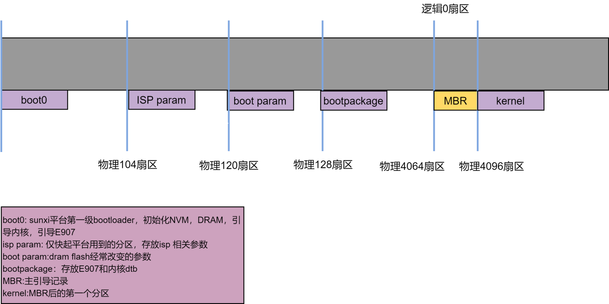

## 异构快启系统sensor\_list使用说明

### 使用说明

#### linux系统修改

1.  把sensor\_list需要的sensor全部build-in到内核，执行m kernel\_menuconfig把sensor选择为\*，如下，选择gc4663\_mipi和gc2083\_mipi。

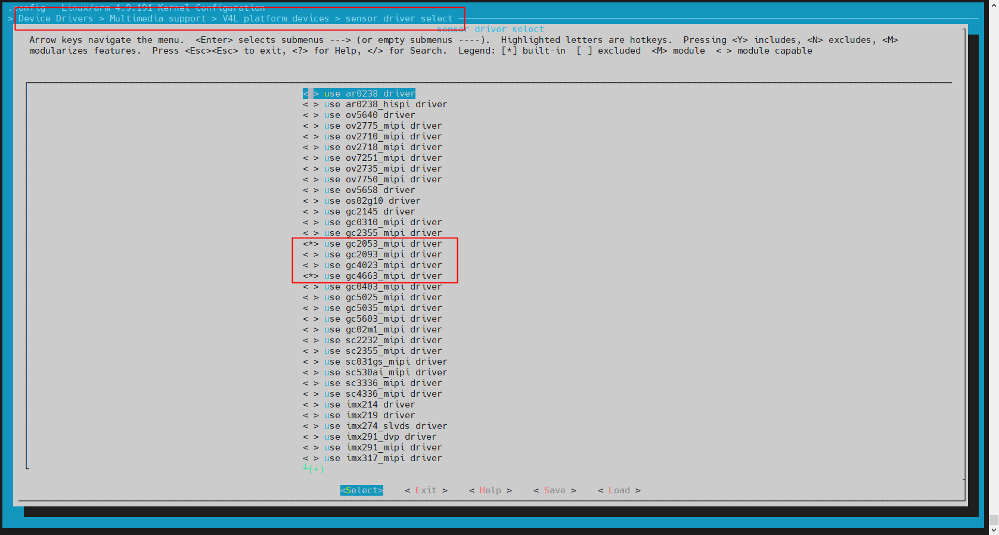

2.  board.dts把vinc节点下的sensor\_list打开，如下：
    
    ```
    	vinc00:vinc@0 {
    		vinc0_csi_sel = <0>;
    		vinc0_mipi_sel = <0>;
    		vinc0_isp_sel = <0>;
    		vinc0_isp_tx_ch = <0>;
    		vinc0_tdm_rx_sel = <0>;
    		vinc0_rear_sensor_sel = <0>;
    		vinc0_front_sensor_sel = <0>;
    		vinc0_sensor_list = <1>;
    		rpmsg-ser-name = "6010000.e907_rproc";
    		work_mode = <0x0>;
    		delay_init = <1>;
    		status = "okay";
    	};
    ```
    
    vinc0表示节点0，vinc0\_sensor\_list置1，表示sensor0开启sensor\_list功能（vinc0\_rear\_sensor\_sel&vinc0\_front\_sensor\_sel均为0表示sensor0，均为1表示sensor1）。
    

#### rtos系统修改

1.  把sensor\_list需要的sensor全部build-in到rtos，执行mrtos menuconfig把sensor选择为\*，如下，选择gc4663\_mipi和gc2083\_mipi：

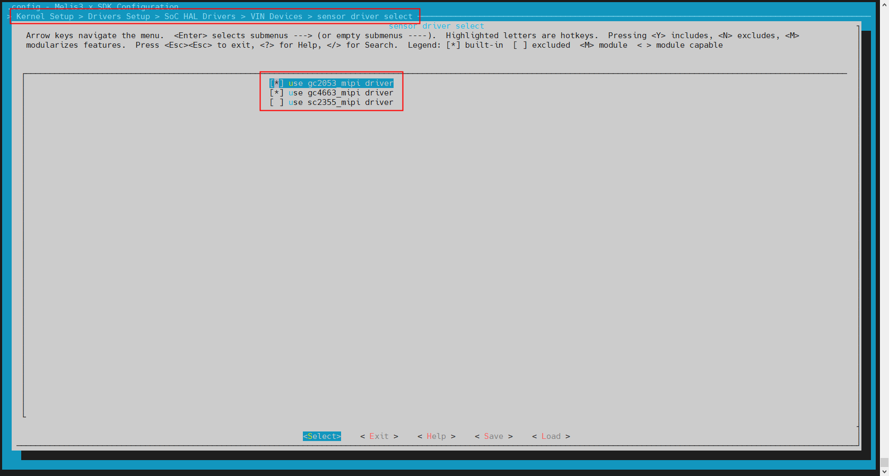

2.  检测是不是把所有sensor的func\_core都注册到vin驱动了，文件是：
    
    rtos/lichee/rtos-hal/hal/source/vin/modules/sensor/sensor\_register.c
    
    ```
    struct sensor_cfg_array sensor_array[] = {
    #ifdef CONFIG_SENSOR_IMX219_MIPI
        {"imx219_mipi", &imx219_core},
    #endif
    #ifdef CONFIG_SENSOR_GC05A2_MIPI
        {"gc05a2_mipi", &gc05a2_core},
    #endif
    #ifdef CONFIG_SENSOR_GC4663_MIPI
        {"gc4663_mipi", &gc4663_core},
    #endif
    #ifdef CONFIG_SENSOR_GC2053_MIPI
        {"gc2053_mipi", &gc2053_core},
    #endif
    #ifdef CONFIG_SENSOR_GC2083_MIPI
        {"gc2083_mipi", &gc2083_core},
    .....
    };
    ```
    
3.  把所有sensor都编写到结构体global\_sensor\_list，文件位于：
    
    rtos/lichee/rtos-hal/hal/source/vin/platform/vin\_config\_sun252iw1.c
    
    ```
    struct sensor_list global_sensors_list[2][MAX_DETECT_SENSOR] = {
    	[0]= {
    		[0] = {
    			.sensor_name = "gc2083_mipi",
    			.sensor_twi_addr = 0x6e,
    			.sensor_twi_id = 1,
    			.mclk_id = 0,
    			.use_isp = 1,
    			.id = 0,
    			.addr_width = 8,
    			.data_width = 8,
    			.reset_gpio = GPIOD(7),
    			.pwdn_gpio = GPIOD(18),
    			.ir_cut_gpio[0] = GPIOE(18), /*-cut*/
    			.ir_cut_gpio[1] = GPIOE(8),  /*+cut*/
    			.ir_led_gpio = 0xffff, //GPIOE(10)
    			 },
    		[1] = {
    			.sensor_name = "gc4663_mipi",
    			.sensor_twi_addr = 0x52,
    			.sensor_twi_id = 1,
    			.mclk_id = 0,
    			.use_isp = 1,
    			.id = 1,
    			.addr_width = 16,
    			.data_width = 8,
    			.reset_gpio = GPIOD(7),
    			.pwdn_gpio = GPIOD(18),
    			.ir_cut_gpio[0] = 0xffff, /*-cut*/
    			.ir_cut_gpio[1] = 0xffff,  /*+cut*/
    			.ir_led_gpio = 0xffff, //GPIOE(10)
    		},
    	},
    	[1]= {
    		[0] = {
    			 .sensor_name = "gc2083_mipi",
    			 .sensor_twi_addr = 0x6e,
    			 .sensor_twi_id = 0,
    			 .mclk_id = 1,
    			 .use_isp = 1,
    			.id = 0,
    			 .addr_width = 8,
    			 .data_width = 8,
    			 .reset_gpio = GPIOD(8),
    			 .pwdn_gpio = GPIOD(19),
    			 .ir_cut_gpio[0] = 0xffff,/*-cut*/
    			.ir_cut_gpio[1] = 0xffff,/*+cut*/
    			 .ir_led_gpio = 0xffff,
    		 },
    		[1] = {
    			.sensor_name = "gc4663_mipi",
    			.sensor_twi_addr = 0x52,
    			.sensor_twi_id = 0,
    			.mclk_id = 1,
    			.use_isp = 1,
    			.id = 1,
    			.addr_width = 16,
    			.data_width = 8,
    			.reset_gpio = GPIOD(8),
    			.pwdn_gpio = GPIOD(19),
    			.ir_cut_gpio[0] = 0xffff,/*-cut*/
    			.ir_cut_gpio[1] = 0xffff,/*+cut*/
    			.ir_led_gpio = 0xffff,
    		},
    	},
    };
    ```
    
    global\_sensors\_list\[2\]，分别对应mipi0和mipi1对应的sensor\_list，并且可以分别最大检测3款sensor。
    
4.  把use\_sensor\_list置1表示开启sensor\_list，文件位于：
    
    rtos/lichee/rtos-hal/hal/source/vin/platform/vin\_config\_sun252iw1.c
    

```
struct vin_core global_video[VIN_MAX_VIDEO] = {
	[0] = {
#ifdef CONFIG_SENSOR_GC4663_MIPI
		.used = 1,
		.id = 0,
		.rear_sensor = 0,
		.front_sensor = 0,
		.csi_sel = 0,
		.mipi_sel = 0,
		.isp_sel = 0,
		.tdm_rx_sel = 0xff,
		.isp_tx_ch = 0,
		.base = CSI_DMA0_REG_BASE,
		.irq = SUNXI_IRQ_CSIC_DMA0,
		.o_width = 640,
		.o_height = 480,
		//.fourcc = V4L2_PIX_FMT_SRGGB10,
		.fourcc = V4L2_PIX_FMT_NV12,
		.use_sensor_list = 0,
		.sensor_lane = 2,
#else
		.used = 1,
		.id = 0,
		.rear_sensor = 0,
		.front_sensor = 0,
		.csi_sel = 3,
		.mipi_sel = 3,
		.isp_sel = 0,
		.tdm_rx_sel = 0xff,
		.isp_tx_ch = 0,
		.base = CSI_DMA0_REG_BASE,
		.irq = SUNXI_IRQ_CSIC_DMA0,
		.o_width = 640,
		.o_height = 480,
		//.fourcc = V4L2_PIX_FMT_SRGGB10,
		.fourcc = V4L2_PIX_FMT_NV12,
		.use_sensor_list = 0,
		.sensor_lane = 2,
#endif
	};
};
```

```
global_video[0]表示video0节点，mipi_sel = 0表示使用global_sensors_list[0]为sensor_list。
```

## 连接TigerISP效果调试工具说明

### rtos系统关闭vin&isp库

执行mrtos menuconfig，关闭vin。

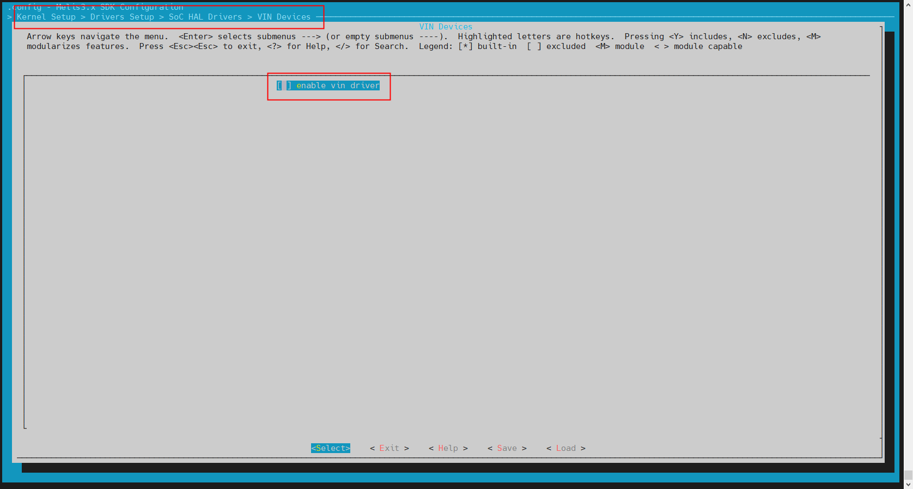

### linux系统关闭twi延后初始化

由于关闭rtos系统的vin，所以已经不需要twi延迟初始化了。

执行m kernel\_menuconfig，关闭twi延后初始化。

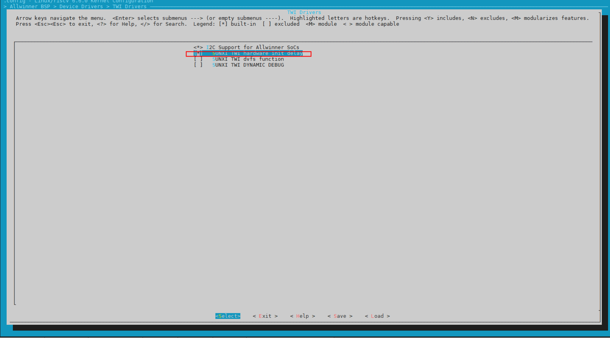

### linux系统关闭rt-media

不需要rt-media框架，执行m kernel\_menuconfig，关闭rt-media。

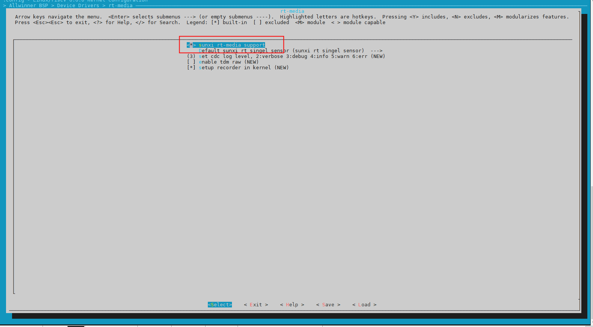

### linux系统关闭vin在rtos的初始化和isp库

由于已经不需要rtos系统的精简版vin和isp库，执行m kernel\_menuconfig，关闭vin在rtos初始化和isp库。

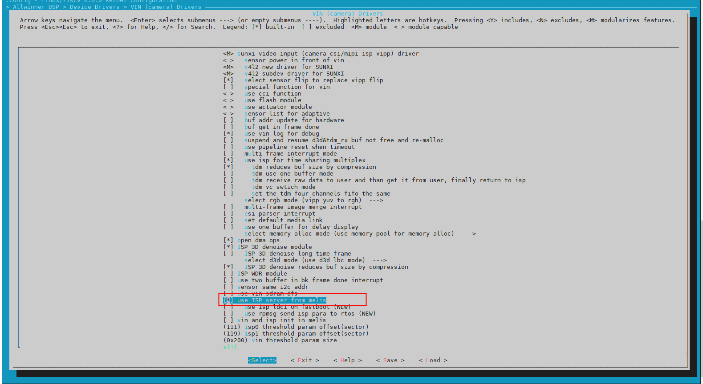

### linux系统关闭mpp fastboot

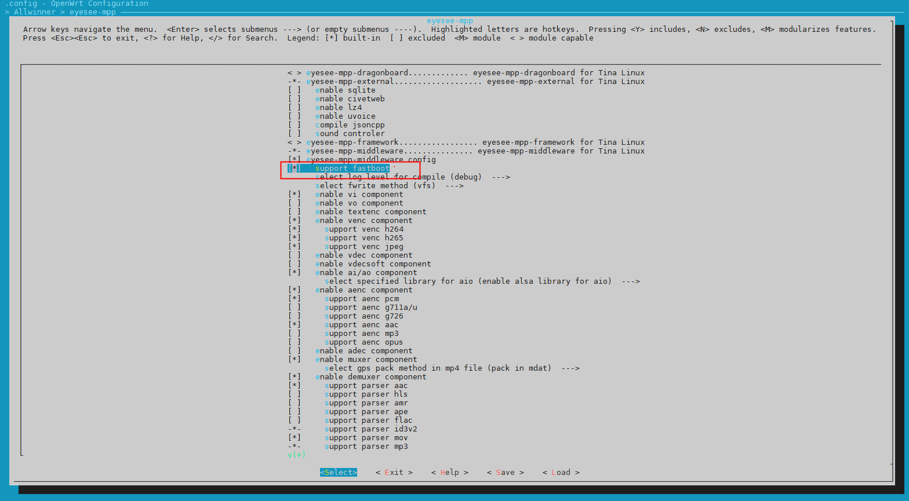

### linux系统关闭libisp fastboot

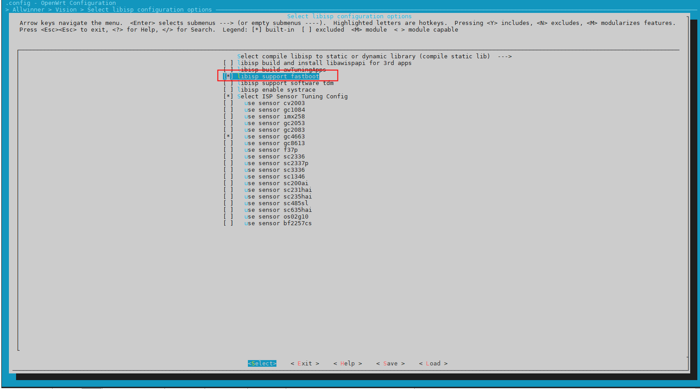

## linux系统获取rtos系统YUV图像说明

### 工作流程

由于rtos系统在系统冷启动后，运行精简版CSI只是作为一个获取图像加速作用，不做保存YUV数据的作用，但是如果想保存rtos系统的yuv数据，则需要设置结构体 [tagsensor\_isp\_config\_s](#tagsensor_isp_config_s) 中的参数get\_yuv\_en，表示需要保存rtos系统的yuv数据，那么rtos系统会保存一帧图像到预留内存再关闭rtos系统的csi&isp通路，但是代价是linux获取到首帧编码图像会比较晚。

具体的流程图如下所示：

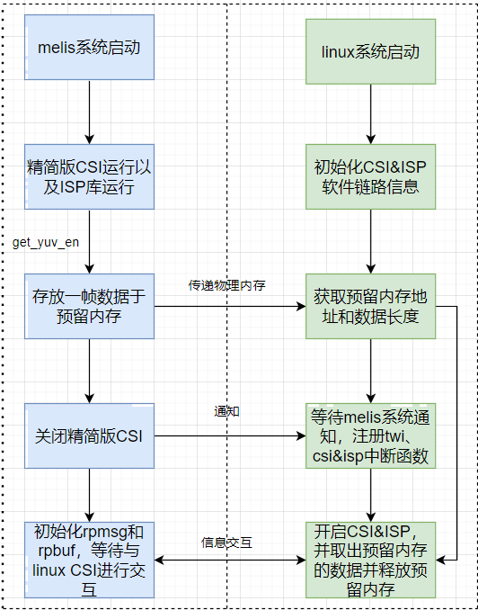

### 使用说明

#### 设置rtos系统YUV图像分辨率

rtos系统保存的yuv图像即为rtos系统输出图像，使用分辨率和输出数据格式可以在配置文件修改，配置文件位于：lichee/rtos-hal/hal/source/vin/platform/vin\_config\_sun252iw1.c 。

```
struct vin_core global_video[VIN_MAX_VIDEO] = {
	[0] = {
#ifdef CONFIG_SENSOR_GC4663_MIPI
		.used = 1,
		.id = 0,
		.rear_sensor = 0,
		.front_sensor = 0,
		.csi_sel = 0,
		.mipi_sel = 0,
		.isp_sel = 0,
		.tdm_rx_sel = 0xff,
		.isp_tx_ch = 0,
		.base = CSI_DMA0_REG_BASE,
		.irq = SUNXI_IRQ_CSIC_DMA0,
		.o_width = 640,
		.o_height = 480,
		//.fourcc = V4L2_PIX_FMT_SRGGB10,
		.fourcc = V4L2_PIX_FMT_NV12,
		.use_sensor_list = 0,
		.sensor_lane = 2,
#else
		.used = 1,
		.id = 0,
		.rear_sensor = 0,
		.front_sensor = 0,
		.csi_sel = 3,
		.mipi_sel = 3,
		.isp_sel = 0,
		.tdm_rx_sel = 0xff,
		.isp_tx_ch = 0,
		.base = CSI_DMA0_REG_BASE,
		.irq = SUNXI_IRQ_CSIC_DMA0,
		.o_width = 640,
		.o_height = 480,
		//.fourcc = V4L2_PIX_FMT_SRGGB10,
		.fourcc = V4L2_PIX_FMT_NV12,
		.use_sensor_list = 0,
		.sensor_lane = 2,
#endif
	},
};
```

**isp\_sel**：表示的是根据哪个 [tagsensor\_isp\_config\_s](#tagsensor_isp_config_s) 中的get\_yuv\_en开关测功能。

**o\_width&o\_height**：rtos系统输出保存的yuv图像分辨率。

**fourcc**：yuv图像数据格式。

#### linux系统获取rtos系统保存的YUV图像

Linux系统通过分区数据isp\_autoflash\_config\_s中标识符rtosyuv\_sign\_id获取到rtos系统保存图像的物理地址和数据长度后，通过ioctl命令VIDIOC\_SET\_PHY2VIR取出数据，如下示例：

```
char fdstr[50];
FILE *file_fd = NULL;
struct isp_memremap_cfg isp_memremap;
isp_memremap.en = 1;  //物理地址转换为用户空间的虚拟地址
if (-1 == ioctl(fd, VIDIOC_SET_PHY2VIR, &isp_memremap)) {
	printf("VIDIOC_SET_PHY2VIR error\n");
} else {
	sprintf(fdstr, "%s/pic.bin", path_name);  //创建图像文件
	file_fd = fopen(fdstr, "w");
	fwrite(isp_memremap.vir_addr, isp_memremap.size, 1, file_fd); //把rtos系统存放的图像存放到指定文件
	fclose(file_fd);
	printf("vir_addr is 0x%lx\n", (unsigned long)isp_memremap.vir_addr);

	isp_memremap.en = 0;  //解映射用户空间地址并释放预留的内存
	if (-1 == ioctl(fd, VIDIOC_SET_PHY2VIR, &isp_memremap)) {
		printf("VIDIOC_SET_PHY2VIR error\n");
	}
}
```

如上示例，文件pic.bin存放的就是rtos系统存放的yuv图像。值得注意的是由于预留内存使用后需要释放，所以Linux系统只能获取一次yuv图像。

## 异构快启系统sys\_config文件配置指导

### sys\_coinfig文件配置

```
使用sys_config配置文件需要打开CONFIG_VIN_USE_SYSCONFIG，配置文件路径：rtos/board/v861_e907/{ic_版型}/configs/sys_config.fex，若没有ONFIG_VIN_USE_SYSCONFIG配置，请参考上述配置方式进行配置。
```

```
[vind]

vind_user	= 1  //vind节点使用标志位， 0：disabled 1：enable
csi_top	= 300000000  //csi clk freq
csi_top_parent = 1800000000  //csi parent clk freq，时钟频率、父时钟需要与linux端设置一致

[vind/sensor0]
sensor0_used          = 1 //sensor节点使用标志位， 0：disabled 1：enable
sensor0_mname         = "gc4663_mipi"  //sensor name 需要与sensor_register.c中name保持一致
sensor0_twi_cci_id    = 1  // sensor使用的twi通道号
sensor0_twi_addr      = 0x52 //sensor twi地址
sensor0_mclk_id       = 0  //sensor使用的mclk通道号
sensor0_isp_used      = 1 //sensor是否使用isp 0：not use  1：use
sensor0_power_en      = port:PD18<1><0><1><0>
sensor0_pwdn          = port:PD18<1><0><1><0>
sensor0_reset         = port:PD7<1><0><1><0>
sensor0_sm_hs         = port:PD18<1><0><1><0>
sensor0_sm_vs         = port:PD18<1><0><1><0>
sensor0_ir_cut0       = port:PD18<1><0><1><0>
sensor0_ir_cut1       = port:PD18<1><0><1><0>
sensor0_ir_led        = port:PD18<1><0><1><0>

[vind/sensor1]
sensor1_used          = 0
sensor1_mname         = "gc2083_mipi"
sensor1_twi_cci_id    = 1
sensor1_twi_addr      = 0x6e
sensor1_mclk_id       = 1
sensor1_isp_used      = 1
sensor1_power_en      = port:PD19<1><0><1><0>
sensor1_pwdn          = port:PD19<1><0><1><0>
sensor1_reset         = port:PD8<1><0><1><0>
sensor1_sm_hs         = port:PD19<1><0><1><0>
sensor1_sm_vs         = port:PD19<1><0><1><0>
sensor1_ir_cut0       = port:PD19<1><0><1><0>
sensor1_ir_cut1       = port:PD19<1><0><1><0>
sensor1_ir_led        = port:PD19<1><0><1><0>

[vind/sensor2]
sensor2_used          = 0
sensor2_mname         = "gc2083_mipi"
sensor2_twi_cci_id    = 1
sensor2_twi_addr      = 0x6e
sensor2_mclk_id       = 0
sensor2_isp_used      = 1
sensor2_power_en      = port:PD6<1><0><1><0>
sensor2_pwdn          = port:PD6<1><0><1><0>
sensor2_reset         = port:PD3<1><0><1><0>
sensor2_sm_hs         = port:PD6<1><0><1><0>
sensor2_sm_vs         = port:PD6<1><0><1><0>
sensor2_ir_cut0       = port:PD6<1><0><1><0>
sensor2_ir_cut1       = port:PD6<1><0><1><0>
sensor2_ir_led        = port:PD6<1><0><1><0>

[vind/sensor3]
sensor3_used          = 0
sensor3_mname         = "gc2083_mipi"
sensor3_twi_cci_id    = 1
sensor3_twi_addr      = 0x7e
sensor3_mclk_id       = 0
sensor3_isp_used      = 1
sensor3_power_en      = port:PD6<1><0><1><0>
sensor3_pwdn          = port:PD6<1><0><1><0>
sensor3_reset         = port:PD3<1><0><1><0>
sensor3_sm_hs         = port:PD6<1><0><1><0>
sensor3_sm_vs         = port:PD6<1><0><1><0>
sensor3_ir_cut0       = port:PD6<1><0><1><0>
sensor3_ir_cut1       = port:PD6<1><0><1><0>
sensor3_ir_led        = port:PD6<1><0><1><0>

[vind/vinc0]
vinc0_used          = 1  //vinc节点使用标志位， 0：disabled 1：enable
vinc0_csi_sel		= 0  // parser 通道号
vinc0_mipi_sel		= 0  // mipi 通道号
vinc0_isp_sel		= 0  // isp 通道号
vinc0_isp_tx_ch		= 0  // isp tx 通道号
vinc0_tdm_rx_sel	= 0xff // tdm rx 通道号 
vinc0_rear_sensor_sel	= 0 // 后摄sel
vinc0_front_sensor_sel	= 0 // 前摄sel
vinc0_width     = 1280 // 出图的分辨率
vinc0_height    = 720
vinc0_use_sensor_list   = 0 // 是否使用sensor list 0：不使用 1：使用
vinc0_mipi_num = 1 //使用mipi数量，取决于sensor lane num与mipi所支持的最大lane的关系
vinc0_work_mode		= 0 // 通道work mode， 0：在线模式 1：离线模式

[vind/vinc1]
vinc1_used              = 0
vinc1_csi_sel           = 1
vinc1_mipi_sel          = 1
vinc1_isp_sel           = 1
vinc1_isp_tx_ch         = 0
vinc1_tdm_rx_sel        = 1
vinc1_rear_sensor_sel   = 1
vinc1_front_sensor_sel  = 1
vinc1_width             = 512
vinc1_height            = 288

[vind/vinc2]
vinc2_used              = 0
vinc2_csi_sel           = 2
vinc2_mipi_sel          = 2
vinc2_isp_sel           = 2
vinc2_isp_tx_ch         = 0
vinc2_tdm_rx_sel        = 2
vinc2_rear_sensor_sel   = 2
vinc2_front_sensor_sel  = 2
vinc2_width             = 512
vinc2_height            = 288

[vind/vinc3]
vinc3_used              = 0
vinc3_csi_sel           = 2
vinc3_mipi_sel          = 2
vinc3_isp_sel           = 3
vinc3_isp_tx_ch         = 0
vinc3_tdm_rx_sel        = 3
vinc3_rear_sensor_sel   = 3
vinc3_front_sensor_sel  = 3
vinc3_width             = 512
vinc3_height            = 288

[osal_cfg_test]
test_key_value = 1
test_gpio1 = port:PA16<5><1><default><default>
test_gpio2 = port:PA17<5><1><default><default>
```

### 新方案适配

新方案模组适配与sys config配置参考上述，本节主要对新方案配置方法进行补充 ：

在rtos/projects/v861\_e907/\{版型\_方案\}/src/main.c中，需要根据所使用的twi通道，以及vin通道修改rpmsg发送的注册信息，例：使用twi1通道，isp0，vipp0,vipp4,vipp8,vipp12,vinc0，vinc4，vinc8，vinc12，在csi\_init执行完后，发送相关通道的注册信息到linux端，并且在linux端dts中，对应节点下增加delay\_init = &lt;1>;属性

```
		#ifdef CONFIG_DRIVERS_VIN
		int ret;

		ret = csi_init(0, NULL);
		if (ret) {
			rpmsg_notify("rt-media", NULL, 0);
			printf("csi init fail!\n");
		} else {
		#if CONFIG_ISP_NUMBER >= 2 || CONFIG_CAPTURE_TDM_RAW
			rpmsg_notify("tdm0", NULL, 0);
		#endif
			rpmsg_notify("twi1", NULL, 0);
			rpmsg_notify("isp0", NULL, 0);
			rpmsg_notify("scaler0", NULL, 0);
			rpmsg_notify("scaler4", NULL, 0);
			rpmsg_notify("scaler8", NULL, 0);
			rpmsg_notify("scaler12", NULL, 0);
			rpmsg_notify("vinc0", NULL, 0);
			rpmsg_notify("vinc4", NULL, 0);
			rpmsg_notify("vinc8", NULL, 0);
			rpmsg_notify("vinc12", NULL, 0);
			.........

	dts端：
		tdm0: tdm@5908000 {
			work_mode = <0x0>;
			rpmsg-ser-name = "6010000.e907_rproc";
			delay_init = <0>;
		};

		isp00:isp@5900000 {
			work_mode = <0x0>;
			rpbuf = <&rpbuf_controller0>;
			isp-region = <&isp_dram_reserved>;
			rpmsg-ser-name = "6010000.e907_rproc";
			delay_init = <1>;
		};

		scaler00:scaler@5910000 {
			work_mode = <0x0>;
			status = "okay";
			rpmsg-ser-name = "6010000.e907_rproc";
			delay_init = <1>;
		};

		scaler10:scaler@5910400 {
			work_mode = <0x0>;
			status = "okay";
			rpmsg-ser-name = "6010000.e907_rproc";
			delay_init = <1>;
		};

		scaler20:scaler@5910800 {
			work_mode = <0x0>;
			status = "okay";
			rpmsg-ser-name = "6010000.e907_rproc";
			delay_init = <1>;
		};

		scaler30:scaler@5910c00 {
			work_mode = <0x0>;
			status = "okay";
			rpmsg-ser-name = "6010000.e907_rproc";
			delay_init = <1>;
		};

		vinc00:vinc@5830000 {
			vinc0_csi_sel = <0>;
			vinc0_mipi_sel = <0>;
			vinc0_isp_sel = <0>;
			vinc0_isp_tx_ch = <0>;
			vinc0_tdm_rx_sel = <0>;
			vinc0_vipp_sel = <0>;
			vinc0_rear_sensor_sel = <0>;
			vinc0_front_sensor_sel = <0>;
			vinc0_sensor_list = <0>;
			rpmsg-ser-name = "6010000.e907_rproc";
			delay_init = <1>;
			work_mode = <0x0>;
			status = "okay";
		};

		vinc10:vinc@5831000 {
			vinc4_csi_sel = <0>;
			vinc4_mipi_sel = <0>;
			vinc4_isp_sel = <0>;
			vinc4_isp_tx_ch = <0>;
			vinc4_tdm_rx_sel = <0>;
			vinc4_vipp_sel = <4>;
			vinc4_rear_sensor_sel = <0>;
			vinc4_front_sensor_sel = <0>;
			vinc4_sensor_list = <0>;
			rpmsg-ser-name = "6010000.e907_rproc";
			delay_init = <1>;
			work_mode = <0x0>;
			status = "okay";
		};

		vinc20:vinc@5832000 {
			vinc8_csi_sel = <0>;
			vinc8_mipi_sel = <0>;
			vinc8_isp_sel = <0>;
			vinc8_isp_tx_ch = <0>;
			vinc8_tdm_rx_sel = <0>;
			vinc8_vipp_sel = <8>;
			vinc8_rear_sensor_sel = <0>;
			vinc8_front_sensor_sel = <0>;
			vinc8_sensor_list = <0>;
			rpmsg-ser-name = "6010000.e907_rproc";
			delay_init = <1>;
			work_mode = <0x0>;
			status = "okay";
		};

		vinc30:vinc@5833000 {
			vinc12_csi_sel = <0>;
			vinc12_mipi_sel = <0>;
			vinc12_isp_sel = <0>;
			vinc12_isp_tx_ch = <0>;
			vinc12_tdm_rx_sel = <0>;
			vinc12_vipp_sel = <12>;
			vinc12_rear_sensor_sel = <0>;
			vinc12_front_sensor_sel = <0>;
			vinc12_sensor_list = <0>;
			rpmsg-ser-name = "6010000.e907_rproc";
			delay_init = <1>;
			work_mode = <0x0>;
			status = "okay";
		};
```
