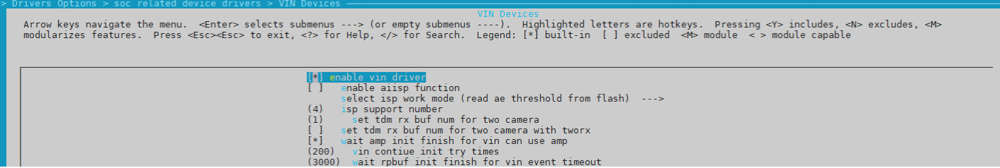
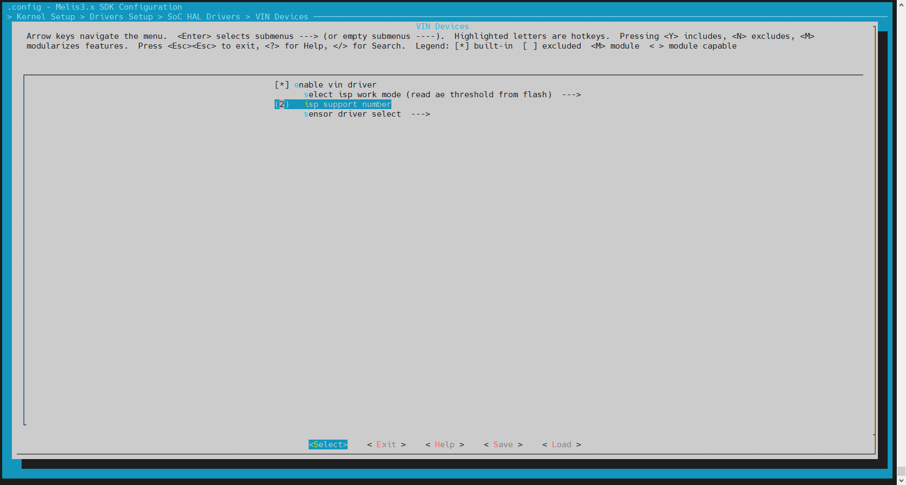
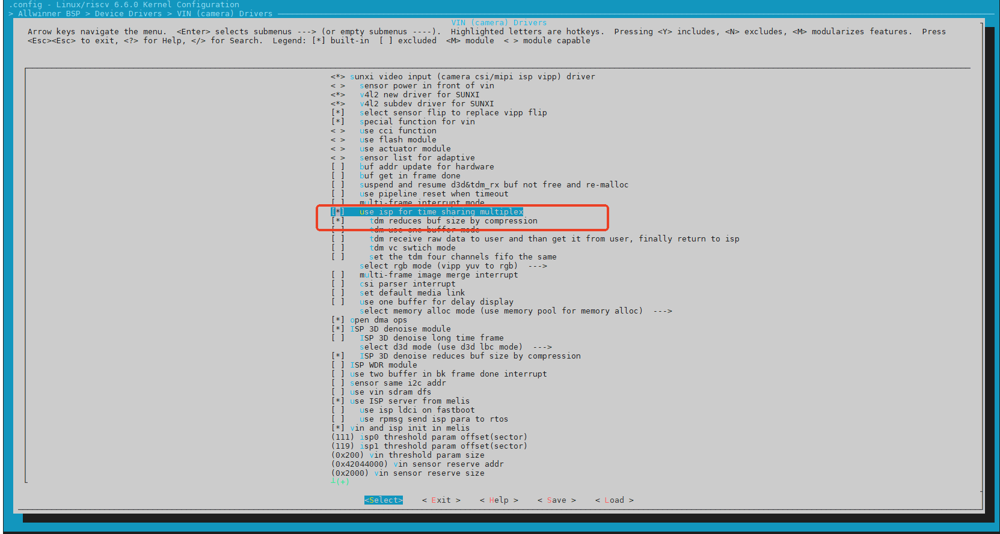
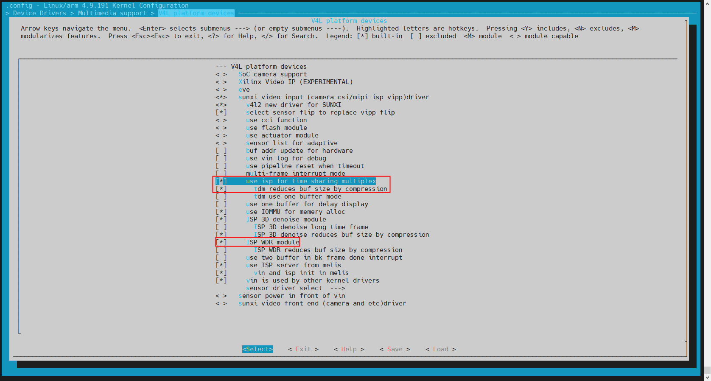
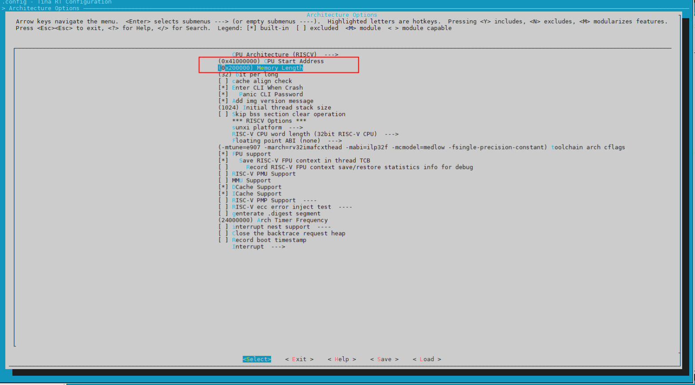
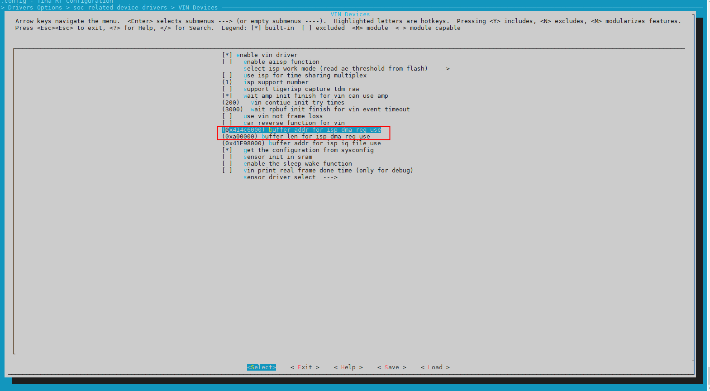
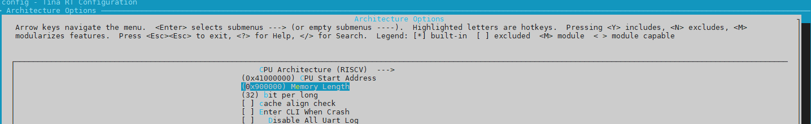
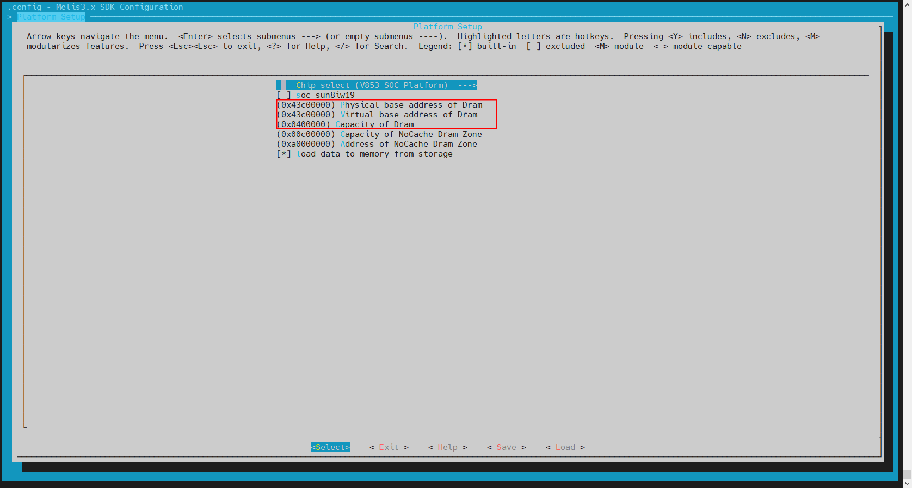

# 异构快启 WDR 配置指南

## 前言

### 文档简介

介绍快启 `WDR` 的使用方法，方便开发人员使用。

### 目标读者

`Camera` 模块的驱动开发/维护人员。

### 适用范围

:::note

:::note

适用产品列表

:::

:::

| 芯片型号 | 系统版本 | 驱动文件目录 |
| --- | --- | --- |
| V861/V838/V881 Linux | Linux-6.6-xuantie | `bsp/drivers/vin` |
| V861/V838/V881 RTOS | FreeRTOS | `rtos/lichee/rtos-hal/hal/source/vin` |
| V85X Linux | Linux-4.9 | `drivers/media/platform/sunxi-vin/` |
| V85X RTOS | melis-v3.0 | `rtos-hal/hal/source/vin` |

### 专有名词

-   `RTOS` 系统：`FreeRTOS` 或 `Melis` 实时系统
-   `CSI`（Camera Serial Interface）：图像串行接口，一般指串行数字接口
-   `ISP`（Image Signal Processor）：图像处理器
-   `VIPP`（Video Input Post Processor）：视频输入后置处理器，一般做 `scale` 处理
-   `MIPI`（Mobile Industry Processor Interface）：高速接收接口
-   `TDM`（Time Divison Multiplexing）：分时复用控制器，其中 `rx` 表示接受 `sensor` 数据，`tx` 表示发送数据给 `ISP` 处理
-   `VINC`（Video Input Control）：视频输出 `DMA` 接收
-   `WDR`（Wide Dynamic Range Imaging）：宽动态范围成像，行业也称为 `HDR`（High Dynamic Range Imaging）高动态范围成像
-   `MPP`（Media Process Platform）：媒体处理平台

## Sensor 驱动修改点

### RTOS 系统 Sensor 驱动修改点

下面是基于 `gc4663` 来讲解。

1.  可以参考 `RTOS` 的 `sensor` 驱动 `gc4663_mipi.c`

`V861/V838/V881` 代码位置: `rtos/lichee/rtos-hal/hal/source/vin/modules/sensor/gc4663_mipi.c`

`V85X` 代码位置: `rtos-hal/hal/source/vin/modules/sensor/gc4663_mipi.c`

2.  添加 `Sensor` 静态全局变量，以便可以保存 `sensor` 的 `WDR` 模式来控制曝光增益。

```
static int sensor_wdr_mode[2];
```

3.  函数 `sensor_get_format` 和 `sensor_get_switch_format` 在获取 `sensor` 格式后，需要给 `sensor_wdr_mode` 赋值，以便可以控制不同的曝光增益。

```
static struct sensor_format_struct *sensor_get_format(int id, int isp_id)
{
  ......
  sensor_wdr_mode[id] = sensor_format->wdr_mode;
  ......
}
static struct sensor_format_struct *sensor_get_switch_format(int id, int isp_id)
{
  ......
  sensor_wdr_mode[id] = sensor_format->wdr_mode;
  ......
}
```

4.  设置曝光增益函数 `sensor_s_exp_gain` 和设置 `mbus` 函数 `sensor_g_mbus_config` 需要根据 `sensor_wdr_mode` 来区分线性和 `WDR`。

```
static int sensor_s_exp_gain(int id, struct sensor_exp_gain *exp_gain)
{
	int isp_wdr_mode;

	if (sensor_wdr_mode[id])
		isp_wdr_mode = ISP_DOL_WDR_MODE;
	else
		isp_wdr_mode = ISP_NORMAL_MODE;

	......
}
static int sensor_g_mbus_config(int id, struct v4l2_mbus_config *cfg, struct
                                mbus_framefmt_res *res)
{
	int isp_wdr_mode;

	if (sensor_wdr_mode[id])
		isp_wdr_mode = ISP_DOL_WDR_MODE;
	else
		isp_wdr_mode = ISP_NORMAL_MODE;

	res->res_wdr_mode = isp_wdr_mode;
	......
}
```

5.  设置 `MIPI` 的接收 `WDR` 模式，一般有三种模式--`DOL`、`VC` 和普通模式，函数为 `sensor_g_mbus_config`。

```
static int sensor_g_mbus_config(int id, struct v4l2_mbus_config *cfg, struct
                                mbus_framefmt_res *res)
{
	......
	if (isp_wdr_mode == ISP_DOL_WDR_MODE) {
		res->res_combo_mode = MIPI_VC_WDR_MODE;
  }
	......

	return 0;
}
```

6.  `Linux` 系统 `sensor` 驱动改动点同常电，没有特殊配置。

## 配置修改

### RTOS 系统配置改动

1.  修改 `CSI` & `ISP` 的频率

注意不是 `WDR` 模式都需要修改，规格超过设置的频率才需要修改，默认频率是 `324M`。  
`CSI` & `ISP` 频率计算公式如下，设置的频率需要取 `max(csi_clk, isp_clk)`。

> `csi_clk` 计算公式：  
> 帧率 x （`vts`） x （`hts`） x 1(`WDR` 则为2) / 8 / 1(双 `pixel` 则为2) / 1000000，向上取整，单位为 `MH`；
> 
> `isp_clk` 计算公式：  
> 帧率 x （`vts`） x （`hts`） x 1.2 / 1000000，向上取整，单位为 `MH`；

`V861/V838/V881` 文件位置:

`rtos/lichee/rtos-hal/hal/source/vin/platform/vin_config_sun252iw1.c`

参数是 `vind_default_clk[VIN_TOP_CLK].frequency`，如下所示

```
struct vin_clk_info vind_default_clk[VIN_TOP_CLK] = {
	[VIN_TOP_CLK] = {
	.clock_id = CLK_CSI,
	.type = HAL_SUNXI_CCU,
	.frequency = 324000000,
	},
	[VIN_TOP_CLK_SRC] = {
	.clock_id = CLK_PLL_CSI_4X,
	.type = HAL_SUNXI_CCU,
	.frequency = 1296000000,
	},
	[VIN_TOP_CLK_SRC1] = {
	.clock_id = CLK_PLL_PERI_300M,
	.type = NOT_USE_THIS_CLK,
	},
};
```

`V85X` 文件位置: `lichee/rtos-hal/hal/source/vin/platform/vin_config_sun8iw21p1.c`，

参数是 `vind_default_clk[VIN_TOP_CLK].frequency`，如下所示：

```
struct vin_clk_info vind_default_clk[VIN_MAX_CLK] = {
	[VIN_TOP_CLK] = {
		.clock = HAL_CLK_PERIPH_CSI_TOP,
		.frequency = 300000000,
	},
	......
};
```

2.  配置 `TDM` 模块

由于 `WDR` 需要使用到 `TDM` 模块，所以需要把 `TDM` 连接到 `pipeline` 中。

`V861/V838/V881` 文件位置: `rtos/lichee/rtos-hal/hal/source/vin/platform/vin_config_sun252iw1.c`

`V85X` 文件位置: `lichee/rtos-hal/hal/source/vin/platform/vin_config_sun8iw21p1.c`

参数是 `tdm_rx_sel`，如下所示：

```
struct vin_core global_video[VIN_MAX_VIDEO] = {
	[0] = {
		......
		.tdm_rx_sel = 0,
		......
	},
  [1] = {
		......
		.tdm_rx_sel = 1,
		......
	},
}
```

注意：  
(1) 上面代码所示 `tdm_rx_sel` 不是固定为0/1，需要根据实际 `pipeline` 选择。  
(2) `vin_config_sun252iw1.c` 和 `vin_config_sun8iw21p1.c` 文件中通过 `CONFIG_ISP_NUMBER` 来区分单双目数据，如下：

```
#if (CONFIG_ISP_NUMBER == 1)
......//单目配置
#else /* CONFIG_ISP_NUMBER == 2/3 */
......//双目配置
#endif
```

(3) 单目配置  
单目 `WDR` 或者单目线性--配置 `global_video[0]`。  
(4) 双目配置  
双目线性--配置 `global_video[0]` 和 `global_video[1]`  
单目 `WDR` +单目线性或者双目 `WDR` --配置 `global_video[0]` 和 `global_video[2]`

3.  `RTOS` 系统 `menuconfig` 配置修改

`V861/V838/V881` 执行 `mrtos menuconfig`



`V85X` 执行 `mmelis menuconfig`，依次进入 `VIN Devices` 选项，如下图所示：



`isp support number`（即 `CONFIG_ISP_NUMBER`）可以配置范围为1-3，不同模式配置不一样：  
(1) 单目 `WDR` 或者单目线性，配置为1。  
(2) 双目线性，配置为2。  
(3) 单目 `WDR` +单目线性或者双目 `WDR`，配置为3。

4.  `RTOS` 系统 `main.c` 版型相关主文件修改

`V861/V838/V881` 此文件为 `FreeRTOS` 系统启动后运行指令函数集合，文件位置 `rtos/lichee/rtos/projects/v861_e907/版型型号/src/main.c`，主函数为 `cpu0_app_entry`，如下所示：

```
void cpu0_app_entry(void *param)
{
	(void)param;

#ifdef CONFIG_COMPONENTS_PM
	pm_init(1, NULL);
#endif

#ifdef CONFIG_COMPONENTS_OPENAMP
	void *thread;
	thread = hal_thread_create(openamp_init_thread, NULL,
							   "amp_init", 8 * 1024, HAL_THREAD_PRIORITY_SYS);
	if (thread != NULL)
		hal_thread_start(thread);
#endif

#ifdef CONFIG_COMPONENTS_TCPIP
	//tcpip stack init
	cmd_tcpip_init();
#endif

#if defined(CONFIG_COMPONENT_CLI) && !defined(CONFIG_UART_MULTI_CONSOLE_AS_MAIN)
	vCommandConsoleStart(0x1000, HAL_THREAD_PRIORITY_CLI, NULL);
#endif

#ifdef CONFIG_PRELOAD_COMPENENTS
extern void flash_load_data_async(void);
	flash_load_data_async();
#endif

#ifdef CONFIG_DRIVERS_VIN
	int ret;

	ret = csi_init(0, NULL);
	if (ret) {
		rpmsg_notify("rt-media", NULL, 0);
		printf("csi init fail!\n");
	} else {
#if CONFIG_ISP_NUMBER >= 2
		rpmsg_notify("tdm0", NULL, 0);
#endif
		rpmsg_notify("twi1", NULL, 0);
		rpmsg_notify("isp0", NULL, 0);
		rpmsg_notify("scaler0", NULL, 0);
		rpmsg_notify("scaler4", NULL, 0);
		rpmsg_notify("scaler8", NULL, 0);
		rpmsg_notify("scaler12", NULL, 0);
		rpmsg_notify("vinc0", NULL, 0);
		rpmsg_notify("vinc4", NULL, 0);
		rpmsg_notify("vinc8", NULL, 0);
		rpmsg_notify("vinc12", NULL, 0);
#if CONFIG_ISP_NUMBER >= 2
		rpmsg_notify("isp1", NULL, 0);
		rpmsg_notify("vinc1", NULL, 0);
		rpmsg_notify("vinc5", NULL, 0);
		rpmsg_notify("vinc9", NULL, 0);
		rpmsg_notify("vinc13", NULL, 0);
#endif
#if CONFIG_ISP_NUMBER >= 3
		rpmsg_notify("isp2", NULL, 0);
		rpmsg_notify("vinc2", NULL, 0);
		rpmsg_notify("vinc6", NULL, 0);
		rpmsg_notify("vinc10", NULL, 0);
		rpmsg_notify("vinc14", NULL, 0);
#endif
#if CONFIG_ISP_NUMBER >= 4
		rpmsg_notify("isp3", NULL, 0);
		rpmsg_notify("vinc3", NULL, 0);
		rpmsg_notify("vinc7", NULL, 0);
		rpmsg_notify("vinc11", NULL, 0);
		rpmsg_notify("vinc15", NULL, 0);
#endif
		printf("csi init success!\n");
	}
#endif

#ifdef CONFIG_COMMAND_AUTO_START_MEMTESTER
	void *autotest_thread;
	autotest_thread = hal_thread_create(auto_memtester_thread, NULL,
			"auto_memtester", 8 * 1024, HAL_THREAD_PRIORITY_SYS);

	if (autotest_thread != NULL)
		hal_thread_start(autotest_thread);
#endif

	vTaskDelete(NULL);
}
```

`V85X` 此文件为 `Melis` 系统启动后运行指令函数集合，文件位置 `lichee/melis-v3.0/source/projects/v851_e907/版型选项/src/main.c`，主函数为 `app_entry`，如下所示：

```
#include <stdio.h>
#include <hal_timer.h>
#include <openamp/sunxi_helper/openamp.h>

extern int csi_init(int argc, const char **argv);
extern int msh_exec(char *cmd, int length);

int app_entry(void *param)
{
 #ifdef CONFIG_DRIVERS_VIN
  int ret;

  ret = csi_init(0, NULL);
  if (ret) {
    rpmsg_notify("rt-media", NULL, 0);
    printf("csi init fail!\n");
  }
 #if 1
   rpmsg_notify("twi0", NULL, 0);
   rpmsg_notify("twi1", NULL, 0);
   rpmsg_notify("tdm0", NULL, 0);
   rpmsg_notify("isp0", NULL, 0);
   rpmsg_notify("isp1", NULL, 0);
   rpmsg_notify("scaler0", NULL, 0);
   rpmsg_notify("scaler4", NULL, 0);
   rpmsg_notify("scaler8", NULL, 0);
   rpmsg_notify("scaler12", NULL, 0);
   rpmsg_notify("vinc0", NULL, 0);
   rpmsg_notify("vinc1", NULL, 0);
   rpmsg_notify("vinc4", NULL, 0);
   rpmsg_notify("vinc5", NULL, 0);
   rpmsg_notify("vinc8", NULL, 0);
   rpmsg_notify("vinc9", NULL, 0);
   rpmsg_notify("vinc12", NULL, 0);
   rpmsg_notify("vinc13", NULL, 0);
 #endif
 #else
    hal_msleep(200);
    rpmsg_notify("rt-media", NULL, 0);
 #endif
    msh_exec("dmesg", strlen("dmesg"));
    return 0;
}
```

其中主要配置不同项为 `rpmsg_notify`，该函数的意思是发生消息给 `Linux` 系统，告知 `Linux` 系统该硬件模块 `RTOS` 系统已经使用完毕，`Linux` 系统可以注册该硬件模块的中断函数并使用此硬件模块，当然需要 `Linux` 系统通过函数 `rpmsg_notify_add` 创建 `name` 相同的消息回调才会被调用。  
即发送方 `RTOS` 系统，发送函数 `rpmsg_notify`，接收方 `Linux` 系统，创建回调函数 `rpmsg_notify_add` 并接收，通过两个函数的参数 `name` 一一对应。  
有四种调用组合：  
(1)单目线性

```
  rpmsg_notify("twi1, NULL, 0);
  rpmsg_notify("isp0", NULL, 0);
  rpmsg_notify("scaler0", NULL, 0);
  rpmsg_notify("scaler4", NULL, 0);
  rpmsg_notify("scaler8", NULL, 0);
  rpmsg_notify("scaler12", NULL, 0);
  rpmsg_notify("vinc0", NULL, 0);
  rpmsg_notify("vinc4", NULL, 0);
  rpmsg_notify("vinc8", NULL, 0);
  rpmsg_notify("vinc12", NULL, 0);
```

说明：

-   `twi` 表示 `sensor` 使用到的 `twi` 号，其他的均属于 `CSI` & `ISP` 硬件模块。
-   这里通过 `rpmsg_notify` 调用的函数需要在 `Linux` 系统的 `board.dts` 同步配置，`Linux` 系统的模块才可以收到该消息。`board.dts` 同步配置的是延时注册，见 `Linux` 系统配置改动章节。
-   `vincx` 表示 `Linux` 系统的 `videox` 节点，`Linux` 系统收到该消息回调的时候，会注册中断和使能 `iommu` 内存，并且调用 `rt-media` 回调函数接口告知 `rt-media` 可以开始配置 `videox` 出图。

(2)单目 `WDR`

```
  rpmsg_notify("twi1, NULL, 0);
  rpmsg_notify("tdm0", NULL, 0);
  rpmsg_notify("isp0", NULL, 0);
  rpmsg_notify("scaler0", NULL, 0);
  rpmsg_notify("scaler4", NULL, 0);
  rpmsg_notify("scaler8", NULL, 0);
  rpmsg_notify("scaler12", NULL, 0);
  rpmsg_notify("vinc0", NULL, 0);
  rpmsg_notify("vinc4", NULL, 0);
  rpmsg_notify("vinc8", NULL, 0);
  rpmsg_notify("vinc12", NULL, 0);
```

(3)双目线性

```
  rpmsg_notify("twi0", NULL, 0);
  rpmsg_notify("twi1", NULL, 0);
  rpmsg_notify("tdm0", NULL, 0);
  rpmsg_notify("isp0", NULL, 0);
  rpmsg_notify("isp1", NULL, 0);
  rpmsg_notify("scaler0", NULL, 0);
  rpmsg_notify("scaler4", NULL, 0);
  rpmsg_notify("scaler8", NULL, 0);
  rpmsg_notify("scaler12", NULL, 0);
  rpmsg_notify("vinc0", NULL, 0);
  rpmsg_notify("vinc1", NULL, 0);
  rpmsg_notify("vinc4", NULL, 0);
  rpmsg_notify("vinc5", NULL, 0);
  rpmsg_notify("vinc8", NULL, 0);
  rpmsg_notify("vinc9", NULL, 0);
  rpmsg_notify("vinc12", NULL, 0);
  rpmsg_notify("vinc13", NULL, 0);
```

(4)单目 `WDR` +单目线性或者双目 `WDR`

```
  rpmsg_notify("twi0", NULL, 0);
  rpmsg_notify("twi1", NULL, 0);
  rpmsg_notify("tdm0", NULL, 0);
  rpmsg_notify("isp0", NULL, 0);
  rpmsg_notify("isp2", NULL, 0);
  rpmsg_notify("scaler0", NULL, 0);
  rpmsg_notify("scaler4", NULL, 0);
  rpmsg_notify("scaler8", NULL, 0);
  rpmsg_notify("scaler12", NULL, 0);
  rpmsg_notify("vinc0", NULL, 0);
  rpmsg_notify("vinc2", NULL, 0);
  rpmsg_notify("vinc4", NULL, 0);
  rpmsg_notify("vinc6", NULL, 0);
  rpmsg_notify("vinc8", NULL, 0);
  rpmsg_notify("vinc10", NULL, 0);
  rpmsg_notify("vinc12", NULL, 0);
  rpmsg_notify("vinc14", NULL, 0);
```

### Linux 系统配置改动

1.  修改 `CSI` & `ISP` 的频率

`V861/V838/V881` 可以根据 `FreeRTOS` 系统计算出来的时钟频率，设置到 `board.dts`，如下所示：

```
&vind0 {
	csi_top = <324000000>;
	......
}
```

`V85X` 可以根据 `Melis` 系统计算出来的时钟频率，设置到 `board.dts`，如下所示：

```
vind0:vind@0 {
	vind0_clk = <300000000>;
	......
}
```

注意：  
`RTOS` 系统设置的 `CSI` & `ISP` 频率需要与 `Linux` 系统设置的 `CSI` & `ISP` 频率一样，否则可能会导致 `Linux` 系统无法启动。

2.  设置 `TWI` 延时注册

设置 `Linux` 系统延时注册的原因是 `RTOS` 系统还在使用该设备，如果这时 `Linux` 系统注册了该设备的中断函数并操作了该设备的硬件寄存器或者时钟，会导致 `RTOS` 系统无法使用到该设备，所以需要在 `Linux` 系统设置设备的延时注册。  
根据硬件连接到 `sensor` 的 `twi` 号(双目则需要设置两个 `twi` 延时注册)

`V861/V838/V881` 在 `board.dts` 设置它延时注册，设置 `rproc-name` 为 `6010000.e907_rproc`，以 `twi1` 为例，如下所示：

```
&twi1 {
	clock-frequency = <400000>;
	......
	rproc-name = "6010000.e907_rproc";
	status = "okay";
};
```

`V85X` 在 `board.dts` 设置它延时注册，设置 `rproc-name` 为 `e907_rproc@0`，以 `twi1` 为例，如下所示：

```
&twi1 {
	clock-frequency = <400000>;
	rproc-name = "e907_rproc@0";
	......
	status = "okay";
};
```

`Linux` 设置 `twi` 延时注册后，该 `twi` 将无法使用直到 `Melis` 系统通过 `rpmsg_notify("twi1", NULL, 0)` 通知到 `Linux` 系统为止。

3.  设置 `TDM` / `ISP` / `scaler` / `vinc` 延时注册

由于不同的方案配置 `TDM` / `ISP` / `scaler` / `vinc` 的设备号不一致，如下：

-   单目在线线性: `isp0`，`scaler0`，`scaler4`，`scaler8`，`scaler12`，`vinc0`，`vinc4`，`vinc8`，`vinc12`
-   单目在线 `WDR`: `tdm0`，`isp0`，`scaler0`，`scaler4`，`scaler8`，`scaler12`，`vinc0`，`vinc4`，`vinc8`，`vinc12`
-   双目离线线性: `tdm0`，`isp0`，`isp1`，`scaler0`，`scaler1`，`scaler4`，`scaler5`，`scaler8`，`scaler9`，`scaler12`，`scaler13`，`vinc0`，`vinc1`，`vinc4`，`vinc5`，`vinc8`，`vinc9`，`vinc12`，`vinc13`
-   单目离线 `WDR` +单目离线线性或者双目离线 `WDR`: `tdm0`，`isp0`，`isp2`，`scaler0`，`scaler2`，`scaler4`，`scaler6`，`scaler8`，`scaler10`，`scaler12`，`scaler14`，`vinc0`，`vinc2`，`vinc4`，`vinc6`，`vinc8`，`vinc10`，`vinc12`，`vinc14`

`V861/V838/V881` 设置延时注册为 `delay_init = <1>`，单目在线为例，如下：

```
tdm0: tdm@5908000 {
	work_mode = <0x1>;
	rpmsg-ser-name = "6010000.e907_rproc";
	delay_init = <1>;
};
isp00:isp@5900000 {
	work_mode = <0x1>;
	rpbuf = <&rpbuf_controller0>;
	isp-region = <&isp_dram_reserved>;
	rpmsg-ser-name = "6010000.e907_rproc";
	delay_init = <1>;
};
scaler00:scaler@5910000 {
	work_mode = <0x1>;
	status = "okay";
	rpmsg-ser-name = "6010000.e907_rproc";
	delay_init = <1>;
};
scaler10:scaler@5910400 {
	work_mode = <0x1>;
	status = "okay";
	rpmsg-ser-name = "6010000.e907_rproc";
	delay_init = <1>;
};
scaler20:scaler@5910800 {
	work_mode = <0x1>;
	status = "okay";
	rpmsg-ser-name = "6010000.e907_rproc";
	delay_init = <1>;
};
scaler30:scaler@5910c00 {
	work_mode = <0x1>;
	status = "okay";
	rpmsg-ser-name = "6010000.e907_rproc";
	delay_init = <1>;
};
vinc00:vinc@5830000 {
	vinc0_csi_sel = <0>;
	vinc0_mipi_sel = <0>;
	vinc0_isp_sel = <0>;
	vinc0_isp_tx_ch = <0>;
	vinc0_tdm_rx_sel = <0>;
	vinc0_vipp_sel = <0>;
	vinc0_rear_sensor_sel = <0>;
	vinc0_front_sensor_sel = <0>;
	vinc0_sensor_list = <0>;
	rpmsg-ser-name = "6010000.e907_rproc";
	delay_init = <1>;
	work_mode = <0x1>;
	status = "okay";
};
vinc10:vinc@5831000 {
	vinc4_csi_sel = <0>;
	vinc4_mipi_sel = <0>;
	vinc4_isp_sel = <0>;
	vinc4_isp_tx_ch = <0>;
	vinc4_tdm_rx_sel = <0>;
	vinc4_vipp_sel = <4>;
	vinc4_rear_sensor_sel = <0>;
	vinc4_front_sensor_sel = <0>;
	vinc4_sensor_list = <0>;
	rpmsg-ser-name = "6010000.e907_rproc";
	delay_init = <1>;
	work_mode = <0x1>;
	status = "okay";
};
vinc20:vinc@5832000 {
	vinc8_csi_sel = <0>;
	vinc8_mipi_sel = <0>;
	vinc8_isp_sel = <0>;
	vinc8_isp_tx_ch = <0>;
	vinc8_tdm_rx_sel = <0>;
	vinc8_vipp_sel = <8>;
	vinc8_rear_sensor_sel = <0>;
	vinc8_front_sensor_sel = <0>;
	vinc8_sensor_list = <0>;
	rpmsg-ser-name = "6010000.e907_rproc";
	delay_init = <1>;
	work_mode = <0x1>;
	status = "okay";
};
vinc30:vinc@5833000 {
	vinc12_csi_sel = <0>;
	vinc12_mipi_sel = <0>;
	vinc12_isp_sel = <0>;
	vinc12_isp_tx_ch = <0>;
	vinc12_tdm_rx_sel = <0>;
	vinc12_vipp_sel = <12>;
	vinc12_rear_sensor_sel = <0>;
	vinc12_front_sensor_sel = <0>;
	vinc12_sensor_list = <0>;
	rpmsg-ser-name = "6010000.e907_rproc";
	delay_init = <1>;
	work_mode = <0x1>;
	status = "okay";
};
```

`V85X` 设置延时注册为 `delay_init = <1>`，单目在线为例，如下：

```
isp00:isp@0 {
	work_mode = <0>;
	rpbuf = <&rpbuf_controller0>;
	iommus = <&mmu_aw 4 0>;
	isp-region = <&isp_reserved>;
	delay_init = <1>;
};
scaler00:scaler@0 {
	work_mode = <0>;
	iommus = <&mmu_aw 1 0>;
	delay_init = <1>;
};
scaler20:scaler@8 {
	work_mode = <0>;
	iommus = <&mmu_aw 1 0>;
	delay_init = <1>;
};
scaler10:scaler@4 {
	work_mode = <0>;
	iommus = <&mmu_aw 1 0>;
	delay_init = <1>;
};
scaler30:scaler@12 {
	work_mode = <0>;
	iommus = <&mmu_aw 1 0>;
	delay_init = <1>;
};
vinc00:vinc@0 {
	vinc0_csi_sel = <0>;
	vinc0_mipi_sel = <0>;
	vinc0_isp_sel = <0>;
	vinc0_isp_tx_ch = <0>;
	vinc0_tdm_rx_sel = <0>;
	vinc0_rear_sensor_sel = <0>;
	vinc0_front_sensor_sel = <0>;
	vinc0_sensor_list = <0>;
	work_mode = <0x0>;
	iommus = <&mmu_aw 1 0>;
	delay_init = <1>;
	status = "okay";
};
vinc10:vinc@4 {
	vinc4_csi_sel = <0>;
	vinc4_mipi_sel = <0>;
	vinc4_isp_sel = <0>;
	vinc4_isp_tx_ch = <0>;
	vinc4_tdm_rx_sel = <0>;
	vinc4_rear_sensor_sel = <0>;
	vinc4_front_sensor_sel = <0>;
	vinc4_sensor_list = <0>;
	work_mode = <0x0>;
	iommus = <&mmu_aw 1 0>;
	delay_init = <1>;
	status = "okay";
};
vinc20:vinc@8 {
	vinc8_csi_sel = <0>;
	vinc8_mipi_sel = <0x0>;
	vinc8_isp_sel = <0>;
	vinc8_isp_tx_ch = <0>;
	vinc8_tdm_rx_sel = <0>;
	vinc8_rear_sensor_sel = <0>;
	vinc8_front_sensor_sel = <0>;
	vinc8_sensor_list = <0>;
	work_mode = <0x0>;
	iommus = <&mmu_aw 1 0>;
	delay_init = <1>;
	status = "okay";
};
vinc30:vinc@12 {
	vinc12_csi_sel = <0>;
	vinc12_mipi_sel = <0x0>;
	vinc12_isp_sel = <0>;
	vinc12_isp_tx_ch = <0>;
	vinc12_tdm_rx_sel = <0>;
	vinc12_rear_sensor_sel = <0>;
	vinc12_front_sensor_sel = <0>;
	vinc12_sensor_list = <0>;
	work_mode = <0x0>;
	iommus = <&mmu_aw 1 0>;
	delay_init = <1>;
	status = "okay";
};
```

-   其中 `work_mode` 为0表示在线模式，为1表示离线模式。
-   `TDM` / `ISP` / `scaler` / `vinc` 设备号配置了延时注册后，`Linux` 系统将不能使用它们直到 `RTOS` 系统通过 `rpmsg_notify("tdmx", NULL, 0)` / `rpmsg_notify("ispx", NULL, 0)` / `rpmsg_notify("scalerx", NULL, 0)` / `rpmsg_notify("vincx", NULL, 0)` 通知到 `Linux` 系统为止，可以参考 `Melis` 系统配置改动章节的第4小点。
-   配置了 `scaler0-3` 延时注册只需要 `Melis` 系统配置 `scaler0` 通知 `rpmsg_notify("scaler0", NULL, 0)` 即可，同理配置 `scaler4-7` / `scaler8-11` / `scaler12-15` 只需要 `Melis` 系统配置 `scaler4` / `scaler8` / `scaler4` / `scaler12` 通知即可。

4.  `Linux` 系统 `menuconfig` 配置修改

执行 `m kernel_menuconfig`，依次进入 `V4L platform devices`，如下图所示：

v861



v85x



开启如下配置：

-   `use isp for time sharing multiplex`
-   `tdm reduces buf size by compression`
-   `ISP WDR module`

## WDR 开启方式

### 冷启动 Melis 和 Linux 开启 WDR

通过配置 `flash` 分区 `SENSOR_ISP_CONFIG_S` 结构的参数 `wdr_mode`，配置为1表示打开 `WDR`，配置为0表示关闭 `WDR`

`V861/V838/V881` 可以参考 `platform/allwinner/multimedia/rt_media/sun252iw1/api_adapter/AW_VideoInput_API.c`

`V85X` 可以参考 `external/fast-user-adapter/rt_media/api_adapter/` 目录文件

`AW_VideoInput_API.c` 函数 `isp_config_to_flash`，如下所示：

```
void isp_config_to_flash(void)
{
	SENSOR_ISP_CONFIG_S *sensor_isp_cfg0, *sensor_isp_cfg1;
	int fd = 0;
	struct write4k_op_t write_4k;
	fd = open("/dev/mtd0", O_RDWR);
	if (fd < 0) {
		aw_loge("open mtd error");
		return 0;
	}

	sensor_isp_cfg0 = malloc(sizeof(SENSOR_ISP_CONFIG_S));
	memset(sensor_isp_cfg0, 0, sizeof(SENSOR_ISP_CONFIG_S));
	sensor_isp_cfg0->sign = SENSOR_0_SIGN;
	sensor_isp_cfg0->crc = 0;
	sensor_isp_cfg0->ver = 0;
	sensor_isp_cfg0->light_enable = 0;
	sensor_isp_cfg0->adc_mode = 0;
	sensor_isp_cfg0->light_def = 900;
	sensor_isp_cfg0->ircut_state = 0;
	sensor_isp_cfg0->ir_mode = 0;
	sensor_isp_cfg0->lv_liner_def = 200;
	sensor_isp_cfg0->lv_hdr_def = 0;
	sensor_isp_cfg0->width = 0;
	sensor_isp_cfg0->height = 0;
	sensor_isp_cfg0->mirror = 0;
	sensor_isp_cfg0->filp = 0;
	sensor_isp_cfg0->fps = 15;
	sensor_isp_cfg0->wdr_mode = 1;
	sensor_isp_cfg0->flicker_mode = 0;
	sensor_isp_cfg0->venc_format = 0;
	sensor_isp_cfg0->sensor_deinit = 0;
	sensor_isp_cfg0->get_yuv_en = 0;
	sensor_isp_cfg0->lightadc_debug_en = 0;
	sensor_isp_cfg0->light_sensor_en = 1;

	write_4k.start = ISP0_PARAM_OFFSET*512;
	write_4k.buf = malloc(sizeof(SENSOR_ISP_CONFIG_S));
	memset(write_4k.buf, 0, sizeof(SENSOR_ISP_CONFIG_S));
	memcpy((void *)write_4k.buf, (void *)sensor_isp_cfg0, sizeof(SENSOR_ISP_CONFIG_S));
	write_4k.len = sizeof(SENSOR_ISP_CONFIG_S);
	ioctl(fd, MEMWRITE_4K, &write_4k);
	free(sensor_isp_cfg0);
	......
}
```

该配置控制的是冷启动后出图的 `WDR` 模式；

### 通过 rt-media 用户层接口调用

设置通路配置接口 `AWVideoInput_Configure(channelId_0, &config_0)` 时，通过设置 `config_0.enable_wdr`，配置为1表示打开 `WDR`，配置为0表示关闭 `WDR`，

`V861/V838/V881` 可以参考 `platform/allwinner/multimedia/rt_media/sun252iw1/demo/demo_video_in.c`

`V85X` 可以参考 `external/fast-user-adapter/rt_media/demo/demo_video_in.c`

创建通路0的实现，如下所示：

```
  ......
  config_0.enable_wdr = 1;
  if (AWVideoInput_Configure(channelId_0, &config_0) {
    aw_loge("config err, exit!");
    goto _exit;
  }
```

该配置控制的不是冷启动出图，而且冷启动出图后，关闭出图，再次启动出图时通过该接口配置开启 `WDR`。

### 通过 MPP 组件调用

如果 `Tina` 异构快启 `SDK` 选择的 `MPP` 组件的话，那么在 `MPP` 组件启动后，可以通过 `MPP` 组件配置 `WDR` 出图模式，接口为 `configViAttr`

`V861/V838/V881` 可以参考 `platform/allwinner/eyesee-mpp/middleware/sun252iw1/sample/sample_virvi` 目录的 `sample_virvi.c` 和 `sample_virvi.conf`。

`V85X` 可以参考 `external/eyesee-mpp/middleware/sun8iw21/sample/sample_virvi/` 目录的 `sample_virvi.c` 和 `sample_virvi.conf`。

`sample_virvi.c` 中 `pViAttr->wdr_mode` 配置为1表示开启 `WDR`，配置为0表示关闭 `WDR`，如下所示：

```
static void configViAttr(VI_ATTR_S *pViAttr, SampleVirViConfig *pConfig)
{
    pViAttr->type = V4L2_BUF_TYPE_VIDEO_CAPTURE_MPLANE;
    pViAttr->memtype = V4L2_MEMORY_MMAP;
    pViAttr->format.pixelformat = map_PIXEL_FORMAT_E_to_V4L2_PIX_FMT(pConfig->PicFormat);
    pViAttr->format.field = V4L2_FIELD_NONE;
    pViAttr->format.colorspace = pConfig->mColorSpace;
    pViAttr->format.width = pConfig->PicWidth;
    pViAttr->format.height = pConfig->PicHeight;
    pViAttr->nbufs = 3;
    pViAttr->nplanes = 2;
    pViAttr->fps = pConfig->FrameRate;
    pViAttr->use_current_win = 0;
    pViAttr->wdr_mode = pConfig->mEnableWDRMode;
    pViAttr->capturemode = V4L2_MODE_VIDEO; /* V4L2_MODE_VIDEO; V4L2_MODE_IMAGE; V4L2_MODE_PREVIEW */
    pViAttr->drop_frame_num = pConfig->mViDropFrmCnt; // drop 2 second video data, default=0
}
```

`sample_virvi.conf` 是配置文件，通过配置设置到 `pViAttr->wdr_mode`，参数是 `enable_wdr_mode_x`，配置为1表示打开 `WDR`，配置为0表示关闭 `WDR`，如下所示：

```
dev_num_0 = 0
isp_dev_num_0 = 0
pic_width_0 = 1920
pic_height_0 = 1080
frame_rate_0 = 20
pic_format_0 = "nv21"
color_space_0 = "rec709_part_range"
enable_wdr_mode_0 = 1
drop_frm_num_0 = 0
```

### 查看 WDR 生效的方式

可以通过在 `Linux` 系统串口通过命令 `cat` `vi` 节点查看，命令如下：

```
mount -t debugfs none /sys/kernel/debug
cat /sys/kernel/debug/mpp/vi
```

![vi 节点信息](data:image/png;base64,iVBORw0KGgoAAAANSUhEUgAAAc4AAACPCAIAAAD896yaAAAAAXNSR0IArs4c6QAAAARnQU1BAACxjwv8YQUAAAAJcEhZcwAADsMAAA7DAcdvqGQAACXTSURBVHhe7Z3pweMqz7C/Qp56Usz0Mq2cTk4np4f308IigYTBJosTXT/mDgK0gRXHcTz/7/+I/3U8/v77798/8M8/f5KECTkTcibkTMiZu8ufh1NqyZEHvvrzj3Qm5EzImZAzIWfuLn8m7llt5UEu9YScCTkTcibkzN3lu5kotUEQBME1otQGQRA8nSi1QRAETydKbRAEwdOJUhsEQfB0otQGQRA8nXOl9vHnz6tukQiCILg/p0rt4++//73ovt8gCIIvYNcFhMfff/79D/n3H/4VRhAEQZCxS217deDoasGff/77j0vsg17GGW8QBIHAKrXN9QHVxEpKyHIKwvSLYqC7ukBTan8QBMHPYZ7VqmppXZiF6ilEzQhVeIEotUEQ/DrOBYRaPLFQtpXWLrX4ByuqOSMIguCH8b4Wy6em+a/GLLUZe0oQBMHv4pXaVDCdsqlLrS6uTeEl4ibcIAh+GrfUUv38xzlBbSswtP07EFASlxSCIPhl/FLLJdKstMCffBtt6h/cVwunuS/8byWCIAg+j0GpDYIgCPYQpTYIguDpRKkNgiB4OlFqgyAIns53l9rVhz1+2sMh7+7/Krfyv70N54u5+77yeGlcm0st+P5Bq2Ld4jtidfyzubv/q9zL/98ptXffVx6vjWtrqUXXAeW9uAvsj9yXtvyRbyKLhzHu4e4Pt3yf//0N4g0vLbWxjp/JQlwbSy0U2n///lUbFGtvLqWPP3//5g5HDn7/TXU3Hsa4A0oibYF75vOd/h8ahAEbSu0DSa9d3pmHHbzL/zazuz9vL8Xlldp0ggrVGqtn3VKgMnewjQwWWjClLHrmp9INgw52Mhds9Ad8SSfUeQaaIIQdHA8Dy9uQPMu2xi9CGYC3iqHPkqf7r1JIs88EtxwXYu+TKm3c/yj/0ZKm2q1h1eMCx3vr6AGh4ViYCBQDpClPrY03rqO5Ls46kmfW/nzjOgpLqmnF5fnvyRfjskstOsIa4ZwTLGSFKP8XosXX8iyVesgOz2QZu5hXpR5ynlwy8S5BetAz/EtjYU4NHcleMTQOBDiC4tKDAT3egdU00LQHaKWo5rbEs/3H8aLZaW9g9Q1n4iJTYKvbJ+RBeg0LLLZP4lP8RzAGYZ1gGSqg/Cd/0DC+IgdwypGnAGoSB3MdnOcK8+/NAwImZSrIg9QW68iG+/35Nv+V4cYLQsfFhm3/N8Rlllo9qbZcZdVleFXMk4vliKuXFjw5wXFRNi1LkhJq9qvzr/qF4HgzroIefx7aEhjkMIhn+5/052nQeTW6ubgszwj0ANfdnfsh/hOGOR1XaSU/q0SPMxkMgS441xXG35sHBExKi+Rhv47ZwUQJ8X3+J8uIaVXHNfJ/Q1xWqRUOIq3qDh7AsD1ehEk9RS6BZKr4LIqerKHTBAJh6NiuHn+eua3wbP9n8rzGYlw9+C0CKnBUfIb/DJhrovD8KfIsmfB0NAT1yd735gEBk20qjHU8zA/zUv+zMduojmvV/8W4dpzV/sG0JzD7JQUw3nTFk2s8eaGEmkd2M7QhHC/6Df16vAOq6aBpD9oC0IL4Jz7gPN1/NaJY89gWl+VZg3N96EP8JwwPdVylVTzLEj3OxB9C2vCSb+1Xg1+dBwQcsE2qdUTDIqjq9Tv9Z9vKgwqIhSue/5vi2nWtNsMzU4N9MS4U2HJ4mYTZ7tD1Ghypg4n5b0ELcLyKSw8GOgUrgPq1Lfx8/6ENhy2PVwuzwnJcbLffJ2J9/VL7Ef4jmO02wewE+4OLwf3H69jjDalh1lfpNduS4jVO5gHR3nrriHnAFvsp0/dO/9H3uYfBev5vissutVk9vX+Ub1pJXr+CZRsNrUVYFnO8La/aUZ6W0wV9JFs5YzpzRPnyDeQ03vomUSDHP5tX+F/ybC/X07D3ibcbKp/iP1JCEDs6HxfgYDkuZtaxxR4CUmFLtt6ZB0Svi3P0DvbnG/3HNLrrIePy/N8Ul1dqBRMb5x6UQ+Km3N3/4Lv51uNrU1xOqf3zN9dutPMdlfZrt0IQfALfenxtisu9gCA+AFofVF8Hnf/3nCj/UWqD17Fv396FKLVDJi4gBEEQBNcYl9rvenja6Xeneu1bn5J48rvwrXF9OF//6ST2j8Ww1H7Znjgbjve94N2/L/zWuD6d7YcVPrrUPiXyHmr61Iedfu3+8fM8w/suIMCCvLiOn9zi3rQtR0w9AXj5TTDfGpeBuIlQfvWAkQpU0CKAkzf3uGxJcAUPJPtQSvF1XYZ843othrepDhh3F3JiEv/+W34FoOTN+lp6EmaeF/IWpfYQb9pJdRLKAS0RrPCFdLRvtVNvvTeIaw9wOMDhxCnB4Io/2DDPv6gjHYL1Jxi74tqQ4AJ7+o/1ay7oah9qShjyreu1GN6ODcJZSCUTFoxjkZoprrTWyiJNzXvA1kMNM8+kaTZvXqnFmYSYzjnsb00guXfrb50OKjkmlGvGPjqAGngrWTij9/xHyruTFHeOpjXx5AylTkk8SkYQ9i41lmhmquZ94zLmadG8PwrhHOqzFKBmy+UtceWZ9j4EluJ60PsATGldASOguA/Fkm+Ki6YqWCuKrYdMdsO13fk8KP8rOvYalyf39CBmntV4ocdmfFarVVNq8sYQZZxTxvL2B21iehNInX8Aq2+gmQ9848HOuZLr+Z99af1PNGEUPDkqc5dM0iho8rOAUiQbt46rn6cl0/4opHP4OiM+ANIQ7+Gf1+Nis+Y+JE7EBVOaFcuSVrsl3xVXolHHAtRIcWOPstB6WMCOKU86gwkVIy5namh5cg5fO3oqMFMMaMZD59Db1VIrlBXVI7nvCjQPApuHSi7tX2Ggw/Oz8azxsw2j4MmnSQqyWxcSIlyRWm4eF0ykedlxUKgCOIHnCx1xuQcdB4upFMpndOyJKytI5PAukDOVqW3tpC3fFVciqasUAWimSPNf4qo5ZRBf0vtjMlPJb22AkosOT08FZgpX03j8M5O31VIrmtDJnqzKmSPPVpgvtet+tt0FTz7Ngd0l8mSp5O5xJT1wPgL8fVz2C09sfE+qes//zXFlTuupgIpOYf9QU0++2Z9GnRBkzcoCe5Iap2gNCjNZjkPKGGVRfKrw9FRAIgY04/vhml2lVhhRct8VaMpeH1TTQTMfVGKhNX8BwfRHe9b42U4reHJg8vqxsmSpm9SDsK5RJPeLi/TACmNc9E3OpfyM6iwg/AS7wlKNZlNczUyllVmIi2gdpueZEny08CmIJ98VV6JTUATZjrIHjc5eZmWf1KHCTNWMTqRBjcXadPRUQCJdVQOsvCkOS60w1igrnShHb+m1vCYII/Jr/oQmlMnYzwEK5kpsxvOfHTX8Z5ppBU+OytRa+pBdMibeXDMLehAY3j0sjpXeNy4YCmUBFXGZUP7P6yEn9GTkIR/aCUFXXWi3v4DAJq/H1SSYjAnfpvVUYIozvneT0XJqXY4r0e2fIgBNaTFFxNjbrw2wYJd08EbHRjUjp5emkqsDw9ZTgZnKH9JEQ4y8tYxLLSrjN0C02eQQlLMnJDfuQADydJR2npfOAx934fmPQF6rp9LJblphIKcveacodvtrH7B60DefGlzsdm/cPC50hUfWV4Vpf2iuJCcJDrOcnTY9Mm8ygB1xoT9imNqHwHRcCC16pZuG/ZauVr5xHzbhCUGOtInYqQNLeagBUAi0lm2M2Ea7+LcCb+By5Q09iJ5T1Q7y1nJUamfochtsAjbh0QLekojrXnxrXC8lSu3Hgu/q35jWiOtefGtcryZK7cfyWP1y5CZEXPfiW+N6NTtKbRAEQTAkSu0Mw4dJNhf5e771rP98XMN8Fn7201L9riWukH4PUWonGB/zry+11x7mto3TcU1OfFmp/ZB8Zg43VHBH9pVavB1ix4GxS8/LaI6M3v/NJQMNdCbKDTN470oSSvF//zo3Mx3fpOLy7FI41r9tn1j59PKjEio6PPkZFtN6PQ+eQU5MxttAMwH7+9AEHRIU33So2zbAi4hSexlw+HWlFnV1D3MjYXJBGIOjAfZ1Fdc55CNNgIPgdLp3xmUx1r9nn1DqZh+Ox4O5VMiEevJzoIYFBdfz4BlUminGvM1lwJgi8e5u4O9DB2VLUV26Hvar8UqtfNPKb0PNkkCwnA9Kn4JH0fiPf7hi4w0iRLiiliv1LBJ/MDqRhyc+NK+JoORTI8RqhBH/JKO46nmMDpeCRRqTJXdNPr2HdmqUMjJxJZ9uflBzGTchX6ULrObhmQ8h9DxWYclRKj+rTEymgO0xqctz+ZOxSy0nGWOVv1tr4mtyphcGwfE79Diw+gaa+cg/A5oquY19oJOAQLnEPuIIimsmD7lQ9KeRKGg9OED7M85nQgyaGj+BHxe/ZjkM6tRr/+V4mU9fP9K2C9jxpHziSysuT36KxnxViX+pR3hEjYt56AwmpObB8bvGzGQKNNFdnkidpx14G2apVUtZW02W9Ci1MAyO36HnPFRy6XgVBjrAIhnMjoB/0iEgj0hoj3ULm5N5OE/jjzSAr/sEKqdS/vOs3uFJ3Lh0hLpFgEhadMa7+glonnPbQPszyo/1aQ/x5CdI5itFkDOgMnE9D53BBGqu1Li88ROsOsvvvHoGmlc74SZYpbZJZVlYT870Wdyl5zxzpTb5A59UAfPDCfgkJLvycB7tD1COdPyI2erHj+BSsssfTw/KNa1+7f9Ij+8nNGXvJeb84Y7kAhWBNMqTn6MxLwTZE5WJ63noDCaUZvGpwht/RLsP52isYROP01MevJUbn9Wimg6a+aASC62pCwjJA5jhPqwPBkiR9vjQ/3G8yOx15Uzjj6Kz1u9v5UEznpjzx41r5B7RDFD+1NY4b9B0rVzMp7JUvWj8KU1PXlnyp5tfBNkv5d/1PBgOE43m2lT2JzlXZwHtXXZiFPWHsnKtlsTpNclV7jAlOpco2aFnEVAwWWIL4BCd0OIrPrVNHQnsl7ImPwf+o0Rv2U7Z4r6BKWo8frlDGtmd3EdnIl0wAPlP8u4S6II/flyslF+DS9031GIoUcfLfI7z1uc5gcqm/K/AFDWe/GEf2LVWnBxN9j05g70r/jRhCwFoIs35L3E9D53BBIWV5SouslkXuFvfBncfEliEwU7thY9oaTuzpeqE9Eh5dwfsUkvhQoyIuvZEaUnSw4ci0hLi2SLJzut5PnVB9dJWsk9ysyXBXB6qStgjajx0zz/PAzeYoEwr/olHwhUfM8KsvOIgfQfgwIC+CYdGcYGSnKB63Ai8fMoLIAd5KzqaBduSTyc/9bDAnhqXJ0em85lowhaCnIEmE1fzgPo1PEvnRu4sQBYItSo9nf52GVsRvjvnKSKbqEeMa5ofj1dqd4C5mFnq4NOAg/d9e7gpJN/AW/N5A34iN1FqgwZYtumTwl3AaUw6ebnbucox78hn8HlEqQ0a3vLQPHnBQX/+vj0/8hBCfbmhEKfzmWeW2iAIgoAYl9q5h91tp34nEW+JJm9alzFfeI31ORx+2tP7H4cnvFkfuR/m+Y14h6X2TVcA4pg94DOvzMSyTXK0fHYiB7M+cz9M8yPx7ruAAAnbE//HJBIjEjGhX/zGy68qaaPw+ATeG0PTAGf8l2EfMRcQ+cQvlpRqea9R7lnbOMZ+TQo8u+76LnLgp9O9Ft0u6gnn0S1dp/mVeN9eah9Ies28J8cGGFG9NRHcAkQ1QT9VbZEZMO7a7sZ/GRDx/lKbk4/fmlXt3EMtkdW1jWMsR4rAsyvk1vpOc+Cn070W3R4oYgqS4j1tvv20r9pfGK+JV2rREiHMcfD9V8Uo19RJtFcJfV4C+vGBcLCPsX6lCZ2ispfFTc3NPeVCvyeXdgEKbeYo4cSDkzg2OSwmordKDY2vkVO2UgPpxp+BnEe06hKtDJc8sH9CYkIOGg/r4z47nzXN+qcc2/Jv5RM6xPzS6jI+RmsB8gJ5dl1/FuGZRoKwQyH9s+2hT4ToopH+utMUHbmDytDVeFNDNvGV4jvidRif1YLtJqQSCRxLKl6KqHWNZTweJot4sUfssSIHjBih0OafqsAxX+2QltQD1bh8pPPtAtg5lfqkhWotvKaXzVooNTw+Nfowek9OQ96k1wA0y8dZ8LS8BIM5D/3vRXuygzQP9ZNenMKR9XoaeemociNq7GxENqwlNajJs1ClkJdmIz8iDyd/8IUUCD3FrpTTW4kYtALa8Y8jL4xRdKBDdJF+EFCu+nVHg1P5byyWPCyjFHVxOIE5YuLD47VZLbXCeOMKRtSkRo9QrWayZJRjpE71lAzsrgAT0RHwB8+8+ZVQ1aSjjCfoCNJmu/HnAeUyQ2yr+1K2MQijxuZxPKnNI9u/TG2tyheBiTLMoqf4yZRmIz+EFcKstLzZgGcX5YXu5Gke9FNkpOhPOGGMogMVoutA/zTJYlaH4XsOHCB877U4gTli4tPjNVkttaLZhNR7huM1dfwgH40ZAt6rpC6eag1ERnZXKBHlF6i4qtItAIcV+q9NuvHnAUttqvExOWS3Xkdp8jNIOVPG55Hpr6dnJNeM7XqAwhm7pdnID6HxdIEIP83/xfMhmu7ZFXIKccWWpPGz6E84YYyiAxWi60D/NLv0IHmyoeQr4zV4ZqltpisGcfQ5ZtV5dJ3qKRnYZdrzPxs2mxoIelYN6hbQjdd04ytz/lTcANXH0cYgdDnmEyXxeWT7l6mtgXyQB+BM/ot3rl0xYg70k/9bMZiKb1Wsx7Or5CgWTjBzcTV+6mjcMBwxgYHUrsa1Vj8wud/UTMv+wr5lXYYvd4r3EoelVnjdGG9CagImYAjMYNmDLrjSS8DIR6aPkQazpL8miJ+cU09R79sFsFMeSy6sJTUQHWIXcDdeYyUImfanAlOEJjilLVeypQ9oEFvYZVzD6iiJz+qLGdba62nkpaPKqed6/iEu6b7QL7Ja/J8lJ0i/dO0KOdI0qa0lDo2fMK9GBnhhtPYEWkWOBQXGuk/7mUzSZLWxmAU9CPoI72vaF+Qu8V5lXGrROIbBB9HBFiljpY+0Vwn4ZJsOPqSbXDFSr77/dr/plvo8uwDon3v+R5dt9CwnQpLccVfHGZ8AV8HXGYcEcl3QgJUFSuTiHQjkRl4csUhqBYSeEtrgDoQr+U9M31erObKCFpLPzctEd1+t1CimINPrWPLMgBqhpesW6EVXyC5S4K/7dP6Rkmd9eCGr+5bSarh+l3ivclRqg1cAG2f3wgL+Hg6ew3PWcZXXrfuvxXuJKLVvB991n7JTotS+lKet4yovWvdfi/cqUWrfztMesmdvQfHxWPIJpydP4WXxfszDEl9Van8s3qtEqQ2CIHg67y21N3/4W/AWvLOYm5zdLPOtcf0Yby21sYfuBbwzOm+N2GN1efJLfHCpfWm8wa2ICwg7qbc4qXtO8FgRqMNG3F0ib1J54k0nZ+GLnl6Ns7oM+Y64vNKzsSSpe9XkssgF7gLo4xV6ul8PTrMxLg8n3uX97OUtuFBq8dmHkUsFlBHYj5wU2o15D2LD/BqGOtIefrQ/waAJsHd1rXoT7Cn/tKoBuuim2rbLkO+JC32xpnryZWAh3d+ElOWC19paHy+NT+t+wbkLU+dw4l3ez17eAsQqtbS0zi3BkEH62bh6+CEmlge3w11wJQixHLylxPvilKYOUANvqUsf49TeaTcSuWpWyiEwTR5mlgJvO4qpOSupsUajv9G0FNeD3gdgSusKKIWF6kOx5NDYERfP7PcJyf1b2ZfirQinVTCN/0a8zQgV/QpevNAzOu6ux6sQcnToUPHpcL8Vr9TihsE8tT90w/Wrq5rKGWU176/6EL9jYKLerVX58dsiu9lAMx74Y1DsXCi5eWf0ZlGyvmvQu6xHeio+WNGQv/loqR1yKpA9O4HS1EZ2Ii6YonNTJIbyTr4rLkqnsU9IDq9R7v1Ac9Wi3obocrar9UPPy+NljdlYd9zhwIvxCmQwnGjGuVDg6vldvFKrd1FtqUYG04qPIlhbVQAmiuUY2T0HlVzapxOKKAoYvGODoC5zw9KjAlIPH0LpIxd8+ModaVfndHi6ZkiqkCtqMqBDqahtrd2W74orK0iAHm558lOgMqOUwDKxvNQ+xI5XOcT6tsZLxk4ddwZOvAkVlkDtZ2Ks55dxLyDU7NWlbRsV3IFYphZTDNqEoZHdcyyVWt4lV00CeJ7qq6lRevHuzAPqotkbsklKOscYeA1dfNB78l1xeXp26Zeos2MykF9jB1vz4gVKZYYdqJ4RscIgrpPHnY+KNzG7nyWWnh9ny1ltZfFzA4wWgwdbygKHd9D8B5VYaMH+m37PJ+v4/7wYRhfOG8b7EhBR6vBrvCryJivEgj9JmZ3MFT1I6zBesGc4+3y8e/JdcTUzi1aUiyCNkFfjJZR+Ybc03XgV++MVOMfdtXiJlf2ssfz8ZU5cq+3X+fQXj1rbxJaaAdSslFim+t1FgIK5oCj63meRH85t0UUhdhcQkg+kx0jovD8Mj+/9WtUDwBRnfO8mo+XUuhyXt09G+xZY0C/WC/XkSdV90wCiw8IvE2mEUpPYEO/wuFvQ78S7uJ9dPQHiXkDw70Doc49J5sHm+/kIfNOkeTDN21LPR29U3UK36MvlQ2jbSbL7sO9yfpp0upkr8j6hcABA38IuxniM8dNxIaSj0k1rclZo5Tvi8vYJyeW+5f7MQrzgSl4vvWB1uZqOTBtv2d/5LbVyOV7pjnHcXY4X7SoO97Obt2DqWm3wccCO7o4sn/us51pc9+fX4v1potTeDjxbWVke74Tz01iN6+78Wry/zvNKLR7hBvE2fpXH/FVoXoObHNALcX0Fvxbvr2OV2iAIgmArK2e1KLdOSk+fBdfvSOJUd4l4+OSd8Y6jJyG+RnsLGG7CqxI/sZ/fWWrfvQduy9mEBx+Bdxw9iQ85zAab9jf28xtL7U0SjNc7r7s5uMnpFrzP/x35FzchfcA9SN5x9CQ+v9T+BlFqj9hxqJMOyhwc9Dsq94u54D/+WvXScX49YfA2AfWVncBN95b8izx4x9GTgARGqf0A3FJr/IRBbJG0Y7ljNF4kty45zZac2gqgBU6xFi/y1PObenrGfooOEZdGbRWsAXOeq83eZMXEPwsjo4hUUYSM9EnGqxQ91X+agr9yhg0DCG9tf+x4t+VfoYJZwIhbiOSPCWSerTzgtOQChdguTAuNx587wL/4y3FA7F3PbhbrZy9s2Q+AZZfT4RkQyRKQUUR0jfQM/P90vFKbNwD9wE7sC3wJf9UdgaPxYli7x5tuF1bfQBMf+WcrsyUXF7b8ErY8ipsM5JWDtVTrTnNMN2mXzGzNgzz00Ig0AfzpH0oJA+zMoSmhnH3nuHQP8Dz/AVReD4a8No4/pNGLl+ekhgQ7pvxXNMEsQF4qa0XCPuIruf8R7GnzkEOHv1N31orxnIpDu428dFR5UVrBzkbkYdsl/9zjCHu9YGGs6PL1VLuG/5+OV2pFFBAft0hO7646ZaPxYmSRJ5ruK8CCzzzBq/Ug4fnPQPOimynQbOZYIY7AdwQ3FhhgaWg1Q9uPa55l/wHTmOcPanTjnTI3yyVlMJnmZschIRxAFjCqpbsYSqRxHHmk/Fdl7V+mtlblqzh68gZJNPpLFAYwVHS5ehy7N2HiWm0JCeVYzto9MhpvyRNN9xXmSq1ncOwnNC+6eZAHC/x8hgE5IYGKziW0ovWiRHNo1+SE/+aggT+DeK/nP4OfPc9lgEl5ADXA30dJyyg/fh7648ij6M/K0l/P7kiu6VybYtUu0/QqYKjoerb/b2L5rBZfgUQOGI33U992u+C4Dpr4oBILrckLCK0HibGfGKzn5oRNRGmcDZvoPoYxIG2E5rh+WMPz/FdTMof+WPH2ksqk/8iwzq7kAXYcPpOSroEmv3SwqqW7GMwgCTG0rrenZDwra/8ytTWQj/N/Zj/U1vg4Gu0b7ZirRw+7G2eu1QIQdM2jN16OInmdgoxyPwPMnyyxBXYoXwSS12rNpSVE1BpU5lcBBQ7lszWndirgFC/56A03XDSV8uysCtXSSwY7D31hSM+0/0jjYcL2ZxzvhvyTVlMHMq+HouKLBvnUtshTXGr/AzijNSwiGjqWKfszKytKPbuNvHRUOfVc2w+d3eInA4OKQwhPSg2NHurrqXYN/z8d9wKCvKNAyEtGRMMbD+C5RJa2T6FvMvoa4KgrHslQ7KVlyhTtLkybf15I+cbWvCDQUka7w7NP6Cn6L5Heq3jTJk080X8jiQnbn3G8V/Pf5qfxDFwCA1OJIE00sr5iZAQyzVYecG4RqoYNDiFTWZlQ6tkl/0js34GwZT8Iu8VPpg9dbtoG2TXSM/D/07FKbRD8FnD89kd/EOwkSm3w4+DZ3OzJXBCcJUpt8ONc/DXbLuBzskWcbn8LUWqDIAiezrDU1u9C4q31fpRvRpqvk4IgeD2jUtt/hRhc4vHnDc/lbL7PDYLgHQxKbRyjBF5D25IGvhjXqKofHORdTvWWluYenhPsWsZteXDYoX9n3u7OnvWy92dwgtOlVjwU7rvZtWX/hd36T/NzF9JNWxiKRDED2xvqBCcX510z/zuldm/eDvD2vyf3WB0/zY71svdncAqz1NI+ldTrCJBx6+F4+NONNKe+/aXyAnKQscraJ25FPnn6AerpNual2dKu9POpD1EEHvTTNMyeUAHNOp+9SA2BGnQCW285W1H5t88KD/Jg8q48V67lzdufuILG/nfldp798R5vyadKIVtLjWCd1bNaXKe6aXKZo9/I5XUub3+oAJeKlh5FZelQS1KSB/nQ9Bay8MgVfrbkkvfJU5ibftdHBnJQsKf11mzbBew4cL0FpghVaFc0odPQ1gxax1LAMaEt+cNK9iANhTzonz3ynNQ4AMe+M8/ApbyxL+ynyA9AkaUu6DyQVz0qz4Cnx4ZGvzyfTQph3vIqBJUTpfYo32VIUZAl7V9mQuURsP0mnuzlWeqPJjkKmvaWPQHoEqpSfrJ5y9AG48Yy6ghrC63hEd2nCFhwResvvC7PF5Vpz1Srcbpgyk/oMXEGPzufE/szmGdTqYX3bDy7zPCQoiBPSn9RrrFUrjBXas2AgEbehLhzh4EuoWpsFwXqUDpJH/XALn7e5ZXsUjmfh3fn+Wre0E9N1dYtUsKSj+L19Fi8K59j/cEiW0otr2q3i4qCLBF/FzYBqumg+Q8qsdCavIBQPNOMtxQ0XW8nbCqawJWlzotBvVix2+hFdIRNvET3cZSGuXlosDQCL8nzjryBK54nTmi2XAtVy9Nj4gx+ej6VRmMfBSvsKrX5Gh9dk0pDioI8qUyGF9DDarBc6quCk4D62Wu0GbRrX/Pytyz29iEDqGy6+jAwRY2nPHCu6GXqo4ZpE1m1KzUnWMR2a3hwSptyo91h3DwYsP8vz/O2vOFQe382ThdsedUj84x4emxQzzv2LflPOowNEayx5wKC+p61PLStKMiTxGRYujIjH9+vQNlNZsdbFgVpik4HTJt/TgnuVEGZVjInPrCjPwrtDoQAc2YNIzkAoUetmClVNgknDybvyPPOvHn7s3M64cntPPvjPd61b639GZxiUGqDjwUOotj4J4i8BW8jSu3twLOS2ZOSoBJ5C95JlNrb8aRfF60Cn1ctPve08UPy5nG7fAZrRKkNgiB4OuNS+3jDk6imEd+CxOfC4Jf56OM0YIaltvmK8zO5hZNvBb9F3vAxFL8EP3VX3l25Td4+7BCI/Way7wICXmt6x3r/WKkVd9+oe+Q8OS3Mpgt++zS9nsjbOSJvu3h7qb38ELlPKrVtJLs/1WGseWvXW9l9ObA1PXd9W4u8nSPythGv1GLhJESkHDic1nNPzjXJNXWSvPU6DSdAf/cQOU8/AOtZxfqN7vJygAK6TV1pPcD0p/FENbHBw/X/yw9Qqqfevb13s8G7nJUdlNkPt6yrpbJfsdRN49v11pdm5KZqAJE3gJJAkqqdjTkH3g/l7cMYn9VCTpslLCmBLOl8W/lnGY/HfNf1xZ6aXS5zvn76bSSPhQ8u2s70apD6Fpr5yEc6bIWpkuv4o1yRjZoHsIRByo2OnVNbnzT+zbuzliRPjoDyTjWORyH+JRfzIPqbXIb8y5OVjKVvFtfuaH2Fb1IMoGTKGS8/nhyx4nT9p7/Jt5fmLQMCkRsa5x6nOPg38vZhrJZaEXeTBWjqJW1HqFYzmRjrLzRyWnhjkc5AJZf2qWXYQfgjfAFpcUt77MV1CG1V2Js0V5QkT04tlVKmeJk9EX9JTzNegkOK9kVcu5pWSl6lg/QU3583EAjljfPd6Fm8/Hhyan1Q3j6M1VIrmjlhiT4ptCSKOr6ZTAz0mw9pZJpZl5guta4/2Wnp/Dhv83h6BvqxqzNWxvfOwoFDF3TcFMDQ09ke2B2sL89rREt4+fHkAHZ1Fgf+vytvCRAI5YO4lvD0DPRjV2ds4P9T8/ZhPLPUNtMVzWTC1c+q8+hmajPLBwd20MzH4gWEkT/csmSp0fqPzFy0AGCmlx9T3jYSJWO5sx/Uf+xMWPpm/XftsrGsozFBs/AS32m7qPEr81YAgTBaxjOG6bvn7ZYclloR6HgJsbfNCieQZVjO6tUYK4WufnrFHc61TmuVZgGzkyU2M/QHO/9pomMXUeD4PxkBG6a56oObJweoS1gDvK0PU5MSd+sb2lA2579nl//y/DY/qJxV11cJFEzZzQZI5zflraAFZTzTjp62m6Z+Wt7uyrjUYqx4tseb/2AJy1iZNMhhElI5S1I7h75+WJSiBSp2O1U6+RKG/uCu6VzB2Hh8dwcCdJ14qB1qUkpsuZVpb+uPtDC9LgCWGGZNBDBnV+YTBgjFuoXqfj1vlYXj9O55uytHpTbYzqv3Dx5ae+y5nsOB/jVHRCHydo4X5O2WRKl9CXCqlj8qwVv8q/cPHtGTZzED8BTEchwPrdmTpHsReTvHc/N2V6LUvgZ5IUVcR/kGPvzhhB9L5O2X+N///j8VxJBTcosFTQAAAABJRU5ErkJggg==)

其中参数 `isp_mode` 表示当前 `sensor` 出图的模式：

-   `isp_mode`: `NORMAL`，表示 `sensor` 当前出图是线性模式
-   `isp_mode`: `DOL_WDR`，表示 `sensor` 当前出图是 `DOL_WDR` 模式

## 预留内存修改

### ISP 预留内存修改

1.  `board.dts` 内存预留

通过 `board.dts` 预留内存，在 `RTOS` 系统启动后，`CSI` & `ISP` 硬件配置起来的时候使用到这块内存，当 `Melis` 系统 `CSI` & `ISP` 出图结束，切换到 `Linux` 系统时，即 `Melis` 系统调用 `rpmsg_notify("isp0", NULL, 0)` 通知到 `Linux` 系统的时候，这块内存会被释放。  
默认预留是10M空间，如果是单目 `WDR` +单目线性或者双目 `WDR` 的话，10M空间可能不够，需要根据分辨率多预留几M空间。

`V861/V838/V881` `board.dts` 配置预留内存，默认预留10M给 `FreeRTOS` 系统的 `CSI` & `ISP` 使用，如下所示：

```
reserved-memory {
	......
	isp_dram_reserved: {
		reg = <0x0 0x414c6000 0x0 0xA00000>;
	};
	......
}
```

`V85X` `board.dts` 配置预留内存，默认预留10M给 `Melis` 系统的 `CSI` & `ISP` 使用，如下所示：

```
reserved-memory {
	......
	isp_reserved: isp_reserved {
		reg = <0x0 0x43200000 0x0 0x00a00000>;
	};
	......
}
```

值得注意的是这10M内存其实包含两部分：

-   地址范围 `0x43200000-0x43BFDFFF`：`Melis` 系统 `CSI` & `ISP` 出图使用的内存。如果内存不足可以根据系统整体内存进行修改。
-   地址范围 `0x43BFE000-0x43BC0000`：分配给 `flash` 分区读取 `ISP` 配置并保存区域，总共8kB。不可修改部分，如果 `isp_reserved` 被修改，那么需要单独在 `board.dts` 把 `0x43BFE000-0x43BC0000` 这8kB单独进行预留。

2.  `RTOS` 系统 `CSI` & `ISP` 内存修改

`V85X` 修改方式:

上图所说地址范围 `0x43200000-0x43BFDFFF` 是预留给 `Melis` 系统的 `CSI` & `ISP` 使用，在 `lichee/rtos-hal/hal/source/vin/vin.h` 修改被定义，如下所示：

```
#define MEMRESERVE 0x43200000
//0x2000 reserved for boot0 read flash and write to it
#define MEMRESERVE_SIZE (0xa00000 - 0x2000)
```

可以看到预留的内存是 `0x43200000`，与 `board.dts` 的 `isp_reserved` 预留的内存是一一对应的，`MEMRESERVE_SIZE` 是预留内存的大小，总共10M-8k，减掉8k的原因是地址范围 `0x43BFE000-0x43BC0000` 是分配给 `flash` 分区读取 `ISP` 配置保存区域。  
如果 `board.dts` 中 `isp_reserved` 预留内存被修改，那么 `Melis` 系统的 `vin.h` 中需要修改 `MEMRESERVE` 以及 `MEMRESERVE_SIZE`。

`V861` 修改方式

位置： `rtos/lichee/rtos/projects/v861_e907/perf2_fastboot/defconfig`

```
CONFIG_ARCH_START_ADDRESS=0x41000000
CONFIG_ARCH_MEM_LENGTH=0x900000

CONFIG_ISP_MEMRESERVE_ADDR=0x414c6000
CONFIG_ISP_MEMRESERVE_LEN=0xa00000
```

或者 `mrtos menuconfig` 修改





### RTOS 系统固件预留内存修改

如果使用单目 `WDR` +单目线性，双目 `WDR`，双目摄像头不同的场景，由于 `sensor` 驱动的增加和效果头文件的增加会导致 `Melis` 系统固件增大，原本在 `board.dts` 预留的空间可能不够，需要进行修改。

`V861/V838/V881` `FreeRTOS` 系统固件预留内存修改

1.  `board.dts` 修改

预留内存为 `e907_fw`，如下所示：

```
e907_mem_fw: e907_mem_fw@42400000 {
	/* boot0 & uboot0 load elf addr */
	reg = <0x0 0x42400000 0x0 0x200000>;
};
```

`V85X` `Melis` 系统固件预留内存修改

1.  `board.dts` 修改  
    预留内存为 `e907_fw`，如下所示：

```
reserved-memory {
	e907_fw: e907_fw {
		reg = <0x0 0x43080000 0x0 0x00180000>;
	};
}
```

2.  `boot0` 修改

`V861` `boot` 固件预留内存修改 `brandy/brandy-2.0/spl/include/configs/sun252iw1p1.h`

```
#define SDRAM_OFFSET(x)                   ((phys_addr_t)0x40000000 + (x))
#define CONFIG_RTOS_LOAD_ADDR             SDRAM_OFFSET(0x02400000)
```

`V85X` `boot` 固件预留内存修改

`lichee/brandy-2.0/spl/board/sun8iw21p1/commonfastboot.mk`

```
#E907
CFG_RISCV_E907=y
CFG_SUNXI_ELF=y
CFG_MELISELF_LOAD_ADDR=0x43080000
```

### RTOS 系统 DRAM 预留内存修改

`V861/V838/V881` `FreeRTOS` 系统预留的 `DRAM` 空间为4M，如果不够，则需要进行修改。

1.  `V861/V838/V881` 修改 `board.dts`

```
e907_dram_reserved: e907_dram@41000000 {
	reg = <0x0 0x41000000 0x0 0x900000>;
	no-map;
};
```

2.  `FreeRTOS` 系统 `menuconfig` 修改 执行 `mrtos menuconfig`，进入 `Architecture Options`，如下图所示



`V85X` `Melis` 系统给 `Melis` 系统预留的 `DRAM` 空间为4M，如果不够，则需要进行修改。

1.  `board.dts` 修改  
    预留内存为 `e907_dram`，如下所示：

```
e907_dram: riscv_memserve {
	reg = <0x0 0x43c00000 0x0 0x00400000>;
	no-map;
};

......
&e907_rproc {
	memory-region = <&e907_dram>, <&vdev0buffer>,
			<&vdev0vring0>, <&vdev0vring1>, <&rv_share_irq_table>;
	memory-mappings =
		/* DA 	         len         PA */
		/* DDR for e907  */
		< 0x43c00000 0x00400000 0x43c00000 >;

	// iommus = <&mmu_aw 5 1>;
	fw-region = <&e907_fw>;
	firmware-name = "melis-elf";
	share-irq = "e907";
	status = "okay";
};
```

2.  `Melis` 系统 `menuconfig` 修改  
    修改 `Melis` 系统的 `DRAM` 配置，执行 `mmelis menuconfig`，进入 `Platform Setup`，如下图所示：



需要物理和虚拟起始地址和内存大小：

-   `Physical base address of Dram`：`0x43c00000`
-   `Virtual base address of Dram`：`0x43c00000`
-   `Capacity of Dram`：`0x0400000`

3.  `Melis` 系统编译链接脚本修改  
    修改编译链接脚本中的地址，文件位于 `lichee/melis-v3.0/source/projects/xxx/kernel.lds`，如下所示：

```
MEMORY
{
   /*DRAM_KERNEL: 4M */
   DRAM_SEG_KRN (rwx) : ORIGIN = 0x43c00000, LENGTH = 0x00400000
}
```
