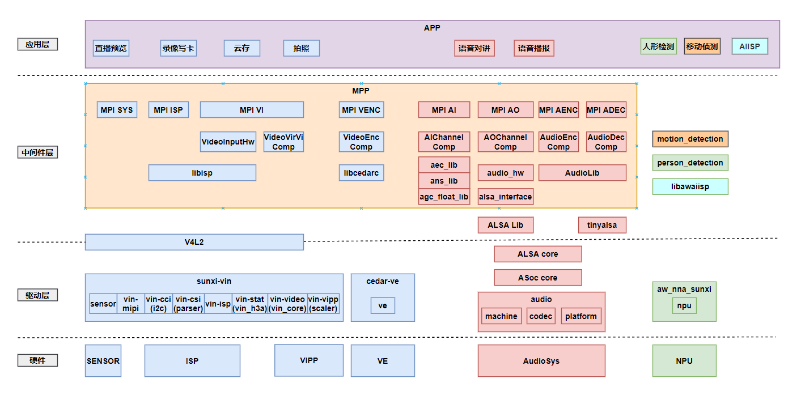
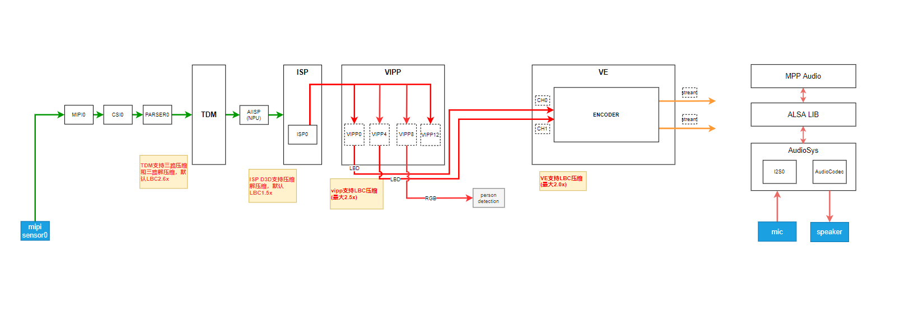
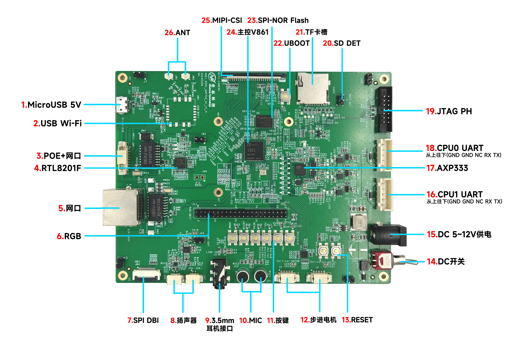
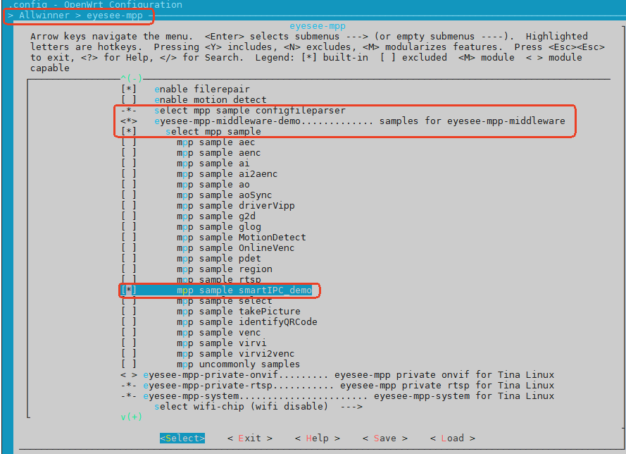
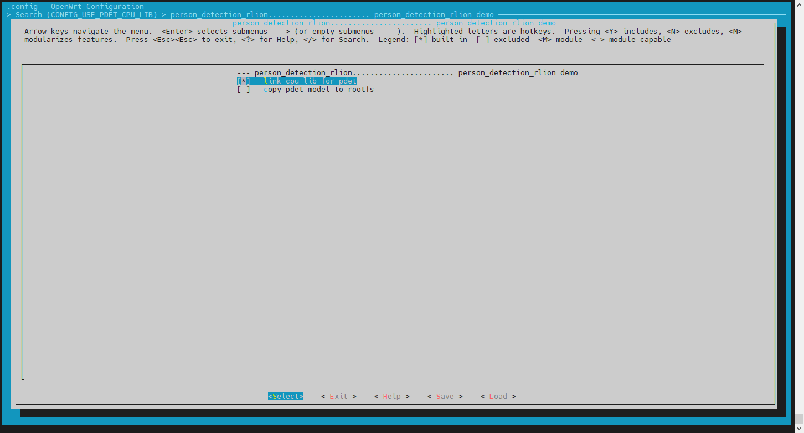
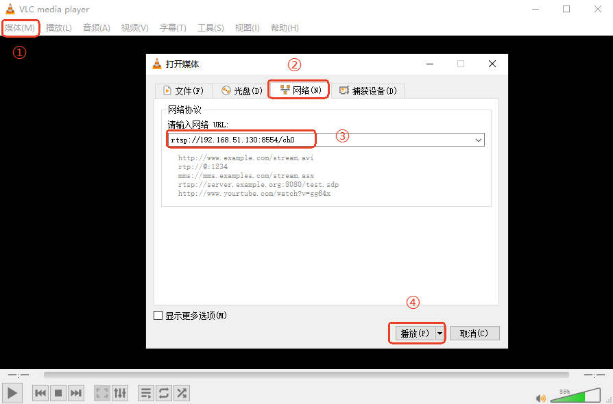
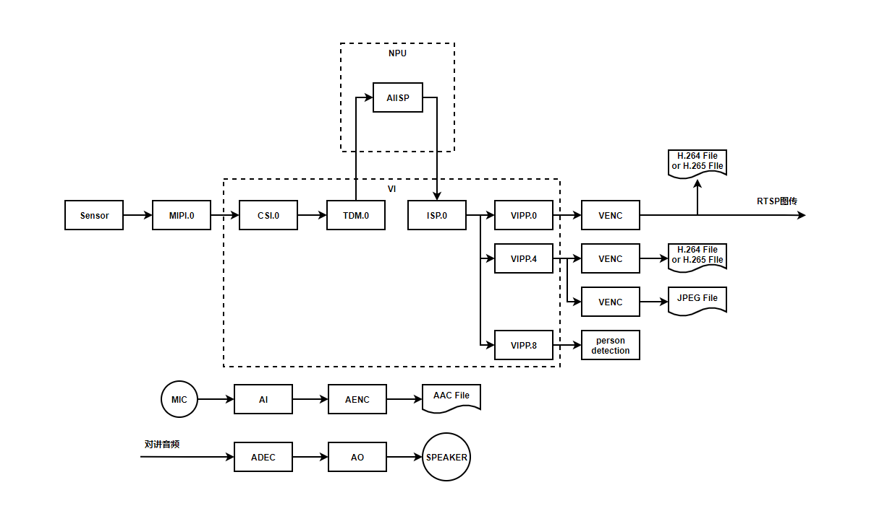
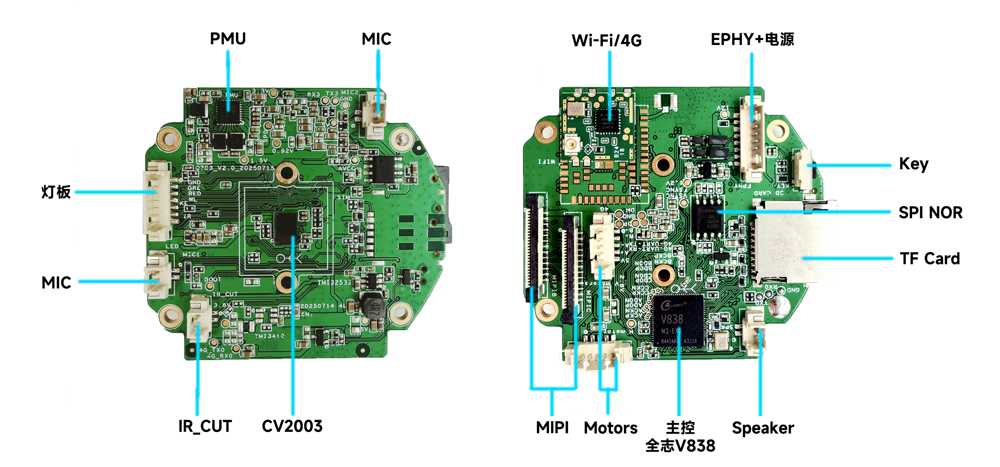
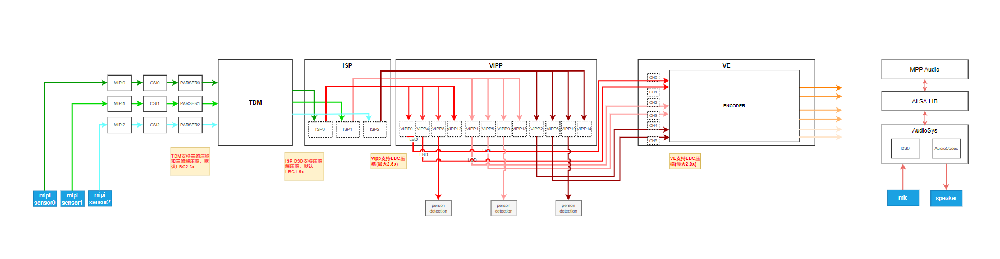
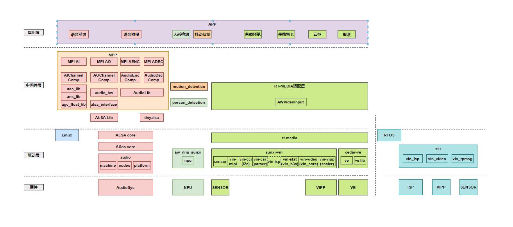

# IPC 应用开发指南

## 概述

### 编写目的

本文档用来指导用户进行V861 IPC产品应用开发，主要介绍IPC应用的开发流程、指导方法和常见问题。根据产品供电和启动速度的特征，分为常电IPC应用开发和低功耗快启IPC应用开发。其中，常电是指产品一直保持供电和工作；低功耗是指电池供电产品，需要保持较长的续航时间，对产品的功耗控制严格；快启，顾名思义是指快速启动，对产品的启动速度有较高要求。

IPC（Internet Protocol Camera）网络摄像机，它通过以太网或 Wi-Fi 连接到网络，可以直接传输视频和数据，支持远程监控和管理。IPC 通常用于安防监控、智能家居、工业检测等领域，具有高清晰度、智能分析和远程访问等特点。

如果您首次接触全志V861 IPC应用开发，请先阅读 [新手指引](#%E6%96%B0%E6%89%8B%E6%8C%87%E5%BC%95) 章节，熟悉本文档的结构、表达约定和开发流程。

如果您已熟悉全志V861 IPC应用开发，可以跳过前面的新手指引章节，阅读 [IPC应用开发](#IPC%E5%BA%94%E7%94%A8%E5%BC%80%E5%8F%91) 和 [IPC应用差异化开发](#IPC%E5%BA%94%E7%94%A8%E5%B7%AE%E5%BC%82%E5%8C%96%E5%BC%80%E5%8F%91) 章节，查看需要进一步了解的内容。

如果您已完全掌握全志V861 IPC应用开发，可以跳过本文档的介绍，阅读更深入的开发指导文档：

-   《V861\_Tina\_Linux\_SDK\_使用指南》
    
-   《V861\_Tina\_Linux\_方案FAQ》
    
-   《Tina\_Linux\_多媒体MPP\_开发指南》
    
-   《Tina\_Linux\_MPP\_Sample\_使用说明》
    
-   《Tina\_Linux\_RT\_MEDIA\_开发指南》
    
-   《V861\_Tina\_Linux\_多媒体内存\_优化指南》
    
-   《V861\_Tina\_Linux\_Camera\_通路配置指南》
    

### 适用范围

适用的产品型号：

-   V86x (V838/V861/V881)

### 读者对象

本文档（本指南）主要适用于以下人员：

-   应用开发工程师
    
-   技术支持工程师
    

### 相关术语介绍

-   IPC（Internet Protocol Camera）：网络摄像机
-   MPP（Media Process Platform）：嵌入式多媒体处理平台中间件软件
-   RT-MEDIA（Real Time Media）：嵌入式实时多媒体软件，包含RT-MEDIA内核驱动和RT-MEDIA用户层
-   CSI（Camera Serial Interface ）：相机串行接口，DVP（Digital Video Port）数字视频端口
-   MIPI（Mobile Industry Processor Interface）：MIPI联盟（TI、ST、ARM、Nokia）定义的移动行业处理器接口，如MIPI CSI-2（Cmaera）、MIPI DSI（Display）
-   TDM（Time Division Multiplexing）：帧级分时复用控制器
-   TDM RX（receive）：帧级分时复用控制器的接收端
-   TDM TX（transmit）：帧级分时复用控制器的发送端
-   ISP（Image Signal Processing）：图像信号处理器
-   VIPP（Video Input Processor）：视频输入处理器
-   VE/VENC（Video Encoder）：视频编码器
-   ENCPP（Encoder Pre-Process）：编码前处理模块
-   ORL（Object Rectangle Label）：物体矩形框标注
-   LBC（Lossy Block Compression）：有损块压缩
-   LBD（Lossy Block Decompression）：有损块解压缩
-   ISP D3D：ISP 3D降噪
-   hblank：行消隐，当扫描点到达图像右侧边缘时，扫描点快速返回左侧，重新开始在第1行的起点下面进行第2行扫描，行与行之间的返回过程称为行消隐
-   vblank：场消隐，扫描点扫描完一帧后，要从图像的右下角返回到图像的左上角，开始新一帧的扫描，会有一段间隔时间，这个时间间隔是场消隐

## 新手指引

### 文档结构总览

本文档分为以下几章：

-   概述：介绍文档编写目的、适用范围、读者对象、相关术语介绍。
    
-   新手指引：介绍文档结构、表达约定、开发流程。
    
-   IPC应用开发：以常电单目IPC为例介绍IPC应用开发，内容包括场景描述、场景约束、操作指导、开发指导、常见问题。
    
-   IPC应用差异化开发：介绍常电双目、低功耗快启单目/双目IPC应用开发与常电单目IPC应用开发的差异部分。
    

### 表达约定

在熟悉V861 IPC产品开发前，先简要介绍IPC应用开发SDK环境、接口使用等。

-   **SDK环境**：V861开发使用的是Tina5.0构建系统，Tina5.0 SDK目录结构，主要有构建工具、构建系统、配置工具、工具链、芯片配置目录、内核及boot目录等组成。下面简单介绍各个目录的作用，关于Tina5.0 SDK是详细使用方法，请参考文档《Tina\_Linux\_系统软件\_开发指南》。

V861 SDK目录结构：

```
Tina-v861/
  ├── brandy   // 存放boot0，uboot等代码。
  ├── bsp      // 存放着Allwinner的驱动，以及对内核的改动，保证着原生内核(kernel/linux-X.X)比较干净的状态，并且能够快速移植适配到新内核中。
  ├── build    // 存放Tina Linux的系统构建脚本。
  ├── build.sh -> build/top_build.sh
  ├── device   // 存放芯片方案的配置文件，包括内核配置、env配置、分区表配置、sys_config.fex、board.dts等。
  ├── kernel   // 存放不同版本的内核代码，V861使用的内核版本是Linux-5.4。
  ├── openwrt  // 存放着OpenWrt原生代码，及软件包、芯片方案目录。
  ├── out      // 用于保存编译相关的临时文件和最终镜像文件，编译后自动生成此目录，例如编译方案v861。
  ├── platform // 存放着一些软件包源码，这些软件包的编译方式是通用的。
  ├── prebuilt // 存放着一些预编译好的工具。
  ├── rtos     // 存放异构系统构建环境。
  └── tools    // 存放一些host端工具，例如打包工具。
```

-   **接口使用**：V861提供两套多媒体接口，MPP接口和RT-MEDIA接口，不同的产品开发使用的接口也会不同。常电IPC应用开发使用的音视频编解码接口是MPP接口；低功耗快启IPC应用开发使用的视频编码接口是RT-MEDIA接口，视频解码和音频接口是MPP接口。下面简要介绍MPP和RT-MEDIA接口代码存放的位置，关于MPP接口和RT-MEDIA接口的详细用法及示例，请参考文档《Tina\_Linux\_多媒体MPP\_开发指南》、《Tina\_Linux\_MPP\_Sample\_使用说明》、《Tina\_Linux\_RT\_MEDIA\_开发指南》。

MPP接口代码位置：

```
platform/allwinner/eyesee-mpp/middleware/sun252iw1/
.
├── config     // 存放mpp的配置、版本记录文件。
├── include    // 存放mpp接口的头文件。
├── install    // 编译mpp后生成的临时文件，拷贝到文件系统中的mpp的库、头文件、配置文件等。
├── InstallDev // 编译mpp后生成的临时文件，mpp的库和头文件。
├── media      // 存放mpp组件接口文件、组件、LIBRARY库。
├── Readme.txt
├── sample     // 存放mpp的sample。
└── tina.mk
```

快捷跳转命令：cmpp\_s

RT-MEDIA接口代码位置：

```
platform/allwinner/multimedia/rt_media/sun252iw1/
.
├── api_adapter      // 存放RT-MEDIA用户态接口文件和头文件。
├── build.sh
├── demo             // 存放RT-MEDIA的demo。
├── docs             // 存放ve编码参数xml配置文件及使用指南文档。
└── tinyalsa         // 该目录已废弃。
```

快捷跳转命令：crtmedia\_s

### 开发流程

IPC应用开发的一般流程，按开发先后顺序可以分为：场景评估、功能开发、系统优化、图像调试、方案测试、方案验收。

-   **场景评估**：在项目导入初期进行，重点对场景的可行性进行评估，可以借助SDK现有的Demo进行实测，评估场景的性能、内存、功能、功耗等是否满足。评估立项后，开始硬件设计和打板工作。
    
-   **功能开发**：在项目立项后进行，重点拆分场景中覆盖的多个功能项，先独立完成各项功能的应用开发和适配工作，再根据场景对功能进行整合，完成初版的应用。在硬件回板前，通常可先借用开发板进行部分功能开发。
    
-   **系统优化**：在功能开发后进行，先梳理全功能下的系统性能、内存、功耗等指标数据，再进行分析，拆分到具体的模块和业务功能，进行逐个优化和验证。
    
-   **图像调试**：在功能开发后进行，可以与系统优化并行。若有对标的竞品需提供竞品机器；若没有竞品需要先对齐图像优化的目标。图像调试分客观调试和主观调试。图像优化包含编码效果和图像效果，需要一起调试。
    
-   **方案测试**：在系统优化和图像调试后进行，如果图像调试周期长，也可以与图像调试并行。测试项包含软件功能测试、硬件信号测试、硬件可靠性测试。
    
-   **方案验收**：方案软硬件测试通过，图像效果验收通过后，整个方案算验收完成，可以试产和量产。
    


## IPC应用开发

IPC方案根据摄像头模组数量可分为：单目、双目、多目方案。这里摄像头模组通常是指MIPI协议的摄像头，若是DVP、USB摄像头的方案，本章内容同样适用。

IPC方案根据供电方式、功耗和启动速度不同可分为：常电方案、低功耗快启方案。

本章以 **常电单目IPC应用开发** 为例，分别从场景描述、场景约束、操作指导、开发指导、以及常见问题等几个方面详细阐述如何开发一个常电单目IPC应用。 后面 [IPC应用差异化开发](#IPC%E5%BA%94%E7%94%A8%E5%B7%AE%E5%BC%82%E5%8C%96%E5%BC%80%E5%8F%91) 章节再针对各个应用场景与常电单目IPC应用差异化部分进行讲解。

### 场景描述

首先描述常电单目IPC应用的典型场景，再通过软件框图和数据流程图分别介绍该场景的软件框架和数据流程。

V861 编码支持H.264、H.265和JPEG编码，典型场景录像以H.265为例，也可以直接修改格式为H.264。

#### 典型场景

该场景包含2路H.265编码、1路JPEG编码、aiisp、音频采集、音频播放和音频3A算法、人形检测算法、移动侦测算法。

```
主码流：H.265，离线编码，2688x1520@15fps，1Mbps
子码流：H.265，离线编码，480p@15fps，0.25Mbps
拍照：JPEG，480p
音频：AAC，8K采样率，单声道，3A算法（AEC、ANS、AGC）
算法：aiisp，人形检测，移动侦测
WiFi：RTSP预览码流
写卡：1路
```

#### 软件框架

该场景使用的硬件有：MIPI SENSOR、ISP、VIPP、VE、NPU、MIC、SPEAKER、AUDIOSYS，其中，MIPI SENSOR、MIC、SPEAKER为外设硬件，其他均为SOC硬件。硬件上的软件分3层，从上往下分别是：应用层、中间件层、驱动层。

-   **应用层**：客户APP属于应用层，该层基于MPP接口实现，功能包含直播预览、录像写卡、云存、拍照、人形检测、移动侦测、语音对讲、语音播报等。
    
-   **中间件层**：MPP、ALSA Lib、tinyalsa属于中间件层，该层对外提供统一的MPI接口，内部按组件分多个模块，调用不同的库接口，模块包含SYS、ISP、VI、VENC、AI、AO、AENC、ADEC、NPU，库包含libisp、libcedarc、libaiisp、libgomp、libatomic、libaw\_utilities\_nanolibawnn、libawipubsp、libaw\_person\_detection\_rlion、aec\_lib、ans\_lib、agc\_float\_lib、AudioLib、ALSA Lib、tinyalsa等等。
    
-   **驱动层**：V4L2、sunxi-vin、cedar-ve、aw\_nna\_sunxi、ALSA core、ASoc core、audio machine/codec/platform。
    



#### 数据流程

该场景的数据流程分为：视频数据流程、音频数据流程。

-   **视频数据流程**：摄像头模组采集视频RAW图像，经过MIPI、CSI、PARSER、TDM后先传入AIISP算法处理，然后送ISP处理，输出YUV图像给VIPP，VIPP输出图像给VE进行编码，编码后输出编码码流数据。
    
-   **音频数据流程**：音频采集和编码，MIC采集音频数据，经过AudioSys音频驱动处理后，通过ALSA Lib传递给中间件层MPP音频组件和3A算法库处理，处理后的音频可以进行编码；音频解码和播放，音频文件经过MPP音频解码，解码后的音频数据传递给ALSA Lib，ALSA Lib再传给AudioSys音频驱动，最后通过SPEAKER播放。
    



### 场景约束

以下场景约束适用于V86x芯片。

#### 通路数量限制

-   每个sensor最多支持创建4路VIPP，每个VIPP最多支持创建4个虚通道
    
-   最多支持创建16个VENC通道
    
-   最多支持创建1个音频通道，若开启AEC回声消除算法，最多支持创建2个音频通道
    

#### 功能限制

-   VIPP支持ORL画框功能，不支持overlay和cover功能
    
-   JPEG编码不支持首帧OSD overlay水印反色功能
    
-   支持JPEG解码，不支持H.264和H.265解码
    

#### 性能限制

V838:

-   H265编码性能最高支持4M@25fps
    
-   H264编码性能最高支持4M@25fps
    
-   JPEG编码，最大支持1080p@60fps
    
-   JPEG解码，最大支持1080p@60fps
    

V861:

-   H265编码性能最高支持4K@25fps
    
-   H264编码性能最高支持4K@25fps
    
-   JPEG编码，最大支持1080p@60fps
    
-   JPEG解码，最大支持1080p@60fps
    

V881:

-   H265编码性能最高支持4K@30fps
    
-   H264编码性能最高支持4K@25fps
    
-   JPEG编码，最大支持1080p@60fps
    
-   JPEG解码，最大支持1080p@60fps
    

#### 编解码分辨率约束

-   编码

| 编码格式 | 输入格式 | 最小输入 | 最大输入 | 最小输出 | 最大输出 |
| --- | --- | --- | --- | --- | --- |
| H265/H264 | LBC | 128x64 | 4080x4080 | 128x64 | 4096x4096 |
| H265/H264 | YUV420/YUV422/ARGB | 64x64 | 4096x4096 | 64x64 | 4096x4096 |
| JPEG | LBC | 128x64 | 4080x4080 | 128x64 | 4096x4096 |
| JPEG | YUV420/YUV422/ARGB | 64x64 | 8192x8192 | 64x64 | 8192x8192 |

-   JPEG解码，输入和输出最大分辨率支持8192x8192

#### 编码分辨率对齐约束

输入：

-   编码输入宽度：LBC格式输入时，宽度16对齐，非LBC格式输入时，宽度8对齐
    
-   编码输入高度：宽度8对齐
    

输出：

-   编码输出宽度：HEVC格式输出时，宽度16对齐，AVC/JPEG 格式输出时，宽度16对齐
    
-   编码输出高度：HEVC/JPEG 格式输出时，高度8对齐，AVC格式输出时，高度16对齐
    

#### 编码缩放倍率约束

-   YUV420/ARGB输入，支持输出1/16x~8x；
    
-   LBC输入，支持输出1~4x
    
-   YUV422输入，AVC/JPEG 支持1/3.8x~8x, HEVC 支持1/1.8x~8x
    

#### 编码输入LBC格式时的约束

-   放大功能：ENCPP支持最大8x（H/V）的放大
    
-   ENCPP开启放大功能，某些分辨率挡位会存在视角损失，常用分辨率挡位的视角损失情况如下表：
    

| 插值挡位 | 输入分辨率 | 输出分辨率 | 备注 |
| --- | --- | --- | --- |
| 1M->2M | 1280x720 | 1920x1080 | 1.50x放大，视角损失\[6.7%, 6.7%\] |
| 1M->3M | 1280x720 | 2304x1296 | 1.80x放大，视角损失\[11.1%, 11.1%\] |
| 1M->4M | 1280x720 | 2560x1440 | 2.00x放大，视角无损 |
| 2M->3M | 1920x1080 | 2304x1296 | 1.20x放大，视角损失\[2.6%, 2.6%\] |
| 2M->4M | 1920x1080 | 2560x1440 | 1.33x放大，视角无损 |
| 2M->5M | 1920x1080 | 2880x1624 | 1.50x放大，视角损失\[6.7%, 6.7%\] |
| 3M->4M | 2304x1296 | 2560x1440 | 1.11x放大，视角损失\[2.9%, 2.9%\] |
| 3M->5M | 2304x1296 | 2880x1624 | 1.25x放大，视角损失\[6.7%, 6.7%\] |
| 4M->5M | 2560x1440 | 2880x1624 | 1.13x放大，视角损失\[1.6%, 1.3%\] |

-   不支持旋转、镜像功能
    
-   不支持缩略图缩小功能
    
-   不支持彩转灰
    
-   不支持 crop 裁剪
    
-   不支持 FishEye（鱼眼）
    
-   宽度配置必须16对齐，高度8对齐
    

### 操作指导

如果您已熟悉如何使用全志V861常电单目IPC场景示例，可以跳过本章节，查看 [开发指导](#%E5%B8%B8%E7%94%B5%E5%8D%95%E7%9B%AEIPC%E5%BA%94%E7%94%A8-%E5%BC%80%E5%8F%91%E6%8C%87%E5%AF%BC) 章节的内容。

本章节是指导用户如何快速上手常电单目IPC场景示例。在应用开发前，建议先搭建一套完整的硬件环境，烧录V861常电单目IPC典型场景的固件，实际运行示例查看效果。

请按照下面的步骤1、2、3的提示，一步一步操作，体验常电单目IPC典型场景的运行效果。

#### 步骤1 准备硬件环境

V861 PERF1板、sc485sl模组、Wi-Fi天线、USB线、串口线、SD卡。

V861 PERF1板实物，如下图所示，参照实物图连接外设。



#### 步骤2 准备软件环境

下载全志V861 SDK编译固件和sample。烧录固件、编译SDK和sample的方法本文不再赘述，详情请参考文档《V861\_Tina\_Linux\_SDK\_使用指南》中的【固件烧录步骤】、【SDK编译】和【SDK 客制化编译】。

**SDK源码编译**

在一号通下载V861 SDK，下载后编译SDK的方法请参考文档《V861\_Tina\_Linux\_SDK\_使用指南》中的【SDK编译】和【SDK 客制化编译】章节，了解SDK编译的一般步骤和quick\_config使用方法。

对于常电单目IPC场景，需注意的有：

-   选择PERF1板级：编译前，lunch选择 `v861-perf1-tina` 板级配置，chip根据芯片选择V861M2或者V861M3，该板级对应的是V861 PERF1板。
    
-   优化系统内存：选择板级后，执行 `quick_config` 的内存优化指令 `memory_optimization` ，优化系统内存。
    
-   选择sensor：执行 `quick_config` 的sensor配置指令 `one_sc485sl_sensor` ，选择sc485sl sensor。
    
-   打开aiisp配置：选择sensor之后（必须），执行 `quick_config` 的指令 `aiisp_config` ，配置aiisp。
    
-   quick\_config配置完之后，重新source && lunch。
    
-   配置sample：执行指令 `m menuconfig` 打开配置菜单，依次选择 `Allwinner ---> eyesee-mpp --->` 进入mpp配置页面，参照下图勾选 `[*] eyesee-mpp-middleware-demo` 、 `[*] select mpp sample` 和 `[*] mpp sample smartIPC_demo` 。
    
    
    
-   编译sample：执行指令 `cleanmpp && mkmpp` 编译出 sample\_smartIPC\_demo ，编译后生成的sample路径：platform/allwinner/eyesee-mpp/middleware/sun252iw1/sample/sample\_smartIPC\_demo/ ，测试sample使用的配置文件 sample\_smartIPC\_demo-4M-rtsp.conf 也在该路径下。
    
-   将aiisp模型文件放置 /mnt/extsd/ 目录下，sdk中文件所在路径：openwrt/package/allwinner/vision/libawaiisp/src/v861/models/sc485sl/
    
-   如果需要跑人形检测，执行指令 `m menuconfig` 打开配置菜单，依次选择 `Allwinner ---> Vision --->` 进入人形配置页面，参考下图勾选 `[*] link cpu lib for pdet`。人形模型文件路径：platform/allwinner/vision/awnn\_sdk/aw\_algorithms/person\_detection\_rlion/src/model/cpu/
    
    
    

#### 步骤3 场景测试验证

准备好硬件和软件环境后，可以基于V861 PERF1板测试常电单目IPC场景。

sample、sample配置文件、aiisp模型文件以及人形检测模型文件（如果跑人形）需要手动拷贝到SD卡上，然后把SD卡接入V861 IPC板进行测试。拷贝前，SD卡需要格式化成FAT32格式。

串口测试指令：

```
a. 配置wifi

wifi -c name password      // 这里name是wifi的名称，password是wifi密码

b. 确认wifi连接成功

ifconfig                   // 执行ifconfig后，确认ip地址是否已获取到

c. 执行sample

/mnt/app/sample_smartIPC_demo -path /mnt/app/ssample_smartIPC_demo-4M-rtsp.conf &

d. 获取rtsp链接

从测试log中获取rtsp链接，比如：rtsp://192.168.51.130:8554/ch0

e. VLC预览

在PC或者手机上安装VLC软件，连接同一个路由器，使用VLC软件预览码流：

媒体 -> 打开网络串流 -> 输入上面的rtsp链接 -> 播放
```

VLC预览码流的配置步骤，如下图所示：



sdk中sample\_smartIPC\_demo-4M-rtsp.conf配置文件已配置好参数，可以直接使用

串口测试指令：同上。

### 开发方式

应用场景开发通常分为两种方式：一种是使用全志提供的SDK，在上面添加应用程序开发包进行应用开发； 另外一种是只使用全志SDK提供的库、头文件等，然后集成到自己的构建环境中进行应用开发。

全志V861 SDK都支持以上两种开发方式。

#### 在全志SDK上开发应用

开发应用前，需新增一个软件包到Tina SDK中。添加的方法，请参考文档《Tina\_Linux\_系统软件\_开发指南》的8.3章节【应用移植】。

应用的Makefile可参考MPP sample的来写：

```
文件：platform/allwinner/eyesee-mpp/middleware/sun252iw1/sample/tina.mk
```

应用通路开发的详细步骤，请参考本文 [开发指导](#%E5%B8%B8%E7%94%B5%E5%8D%95%E7%9B%AEIPC%E5%BA%94%E7%94%A8-%E5%BC%80%E5%8F%91%E6%8C%87%E5%AF%BC) 章节。

### 开发指导

前面 [开发流程](#%E5%BC%80%E5%8F%91%E6%B5%81%E7%A8%8B) 章节介绍了IPC应用开发的一般流程为场景评估、功能开发、系统优化、图像调试、方案测试、方案验收。其中，场景评估在项目立项前已完成，本文不再赘述；图像调试由对应的文档介绍，本文仅作简要说明，不再详细描述。本章节重点阐述功能开发、系统优化这两个部分，同时，涉及一些方案测试、方案验收时的注意事项。

以下分别介绍具体开发指导事项：应用接口适配、系统适配、通路适配、编码参数适配、图像调试简介、性能优化和测试、内存优化和测试、功耗优化和测试。

#### 应用接口适配

常电IPC应用开发时，需要适配的应用接口有：多媒体MPP接口、系统模块接口、算法库接口等。

**多媒体MPP接口**

该场景功能包含视频编码、音频对讲和播放，开发时需要用到的MPP组件有：SYS、VI、ISP、VENC、AI、AO 。

参考示例：sample\_smartIPC\_demo

路径：

```
platform/allwinner/eyesee-mpp/middleware/sun252iw1/sample/sample_smartIPC_demo/
```

关于MPP各组件和接口的详细使用方法，请参考文档《Tina\_Linux\_多媒体MPP\_开发指南》和《Tina\_Linux\_MPP\_Sample\_使用说明》。下面简要介绍使用到的各组件的接口：

（1）SYS组件

MPP系统控制模块，根据芯片特性，完成硬件各个部件的复位、基本初始化工作，同时负责完成MPP 系统各个业务模块的初始化、去初始化以及管理MPP 系统各个业务模块的工作状态、提供当前MPP 系统的版本信息等功能。

**注意：应用程序启动 MPP 业务前，必须完成MPP 系统初始化工作。同理，应用程序退出MPP 业务后，也要完成MPP 系统去初始化工作，释放资源。**

该场景使用的SYS模块接口如下：

```
AW_MPI_SYS_SetConf  // 配置系统控制参数
AW_MPI_SYS_Init     // 初始化MPP系统

AW_MPI_SYS_Bind     // 绑定数据源通道端口和数据接收者通道端口
AW_MPI_SYS_UnBind   // 数据源到数据接收者解绑定接口

AW_MPI_SYS_Exit     // 退出MPP系统
```

（2）VI组件

视频输入模块，用于接收并解析不同协议传输过来的图像，通过ISP和VIPP模块处理后输出。V861单目最多支持创建4个VIPP，每个VIPP最多支持创建4个虚通道，同一个VIPP的这4个虚通道共用同一组VIPP buffer。

该场景使用的VI模块接口如下：

```
AW_MPI_VI_CreateVipp         // 创建VIPP物理设备
AW_MPI_VI_SetVippAttr        // 设置VIPP物理设备属性
AW_MPI_VI_CreateVirChn       // 基于某个VIPP，创建虚通道
AW_MPI_VI_RegisterCallback   // 设置回调函数
AW_MPI_VI_EnableVipp         // 启动VIPP物理设备
AW_MPI_VI_EnableVirChn       // 启动虚通道

AW_MPI_VI_DisableVirChn      // 停止虚通道
AW_MPI_VI_DestroyVirChn      // 销毁虚通道
AW_MPI_VI_DisableVipp        // 停止VIPP物理设备
AW_MPI_VI_DestroyVipp        // 销毁VIPP物理设备
```

（3）ISP组件

ISP模块主要用于处理 image sensor 输出的 RAW 数据，其主要功能包括：黑电平校正、坏点校正、镜头阴影校正、2D/3D 降噪、色彩增强、数字宽动态、3A等。

ISP算法包含硬件算法和软件算法库两部分：硬件算法集成在 SOC 中，称为 Tiger ISP；软件算法服务于 ISP 硬件算法，故称为 ISP Server。

该场景使用的ISP模块接口如下：

```
AW_MPI_ISP_Init              // 初始化ISP，展示ISP版本
AW_MPI_ISP_Run               // 创建ISP 线程
AW_MPI_ISP_Stop              // 停止ISP 工作
AW_MPI_ISP_Exit              // 退出ISP
```

（4）VENC组件

视频编码模块，支持多路实时编码，且每路编码独立，编码协议和编码profile 可以不同。

V861支持的编码规格如下表所示：

| H.264 |  |  | H.265 | JPEG | MJPEG |
| --- | --- | --- | --- | --- | --- |
| BP | MP | HP | MP |  |  |
| 支持 | 支持 | 支持 | 支持 | 支持 | 支持 |

其中，MJPEG：MOTION JPEG

该场景使用的VENC模块接口如下：

```
AW_MPI_VENC_CreateChn                  // 创建编码通道
AW_MPI_VENC_SetRcParam                 // 设置码控参数
AW_MPI_VENC_RegisterCallback           // 设置回调函数
AW_MPI_VENC_SetVbrOptParam             // 设置新VBR码控参数
AW_MPI_VENC_StartRecvPic               // 启动编码

AW_MPI_VENC_GetH264SpsPpsInfo          // 获取H264编码帧头SPS、PPS
AW_MPI_VENC_GetStream                  // 获取编码后的码流，只能用于非绑定模式
AW_MPI_VENC_ReleaseStream              // 归还码流，只能用于非绑定模式

AW_MPI_VENC_StopRecvPic                // 停止编码
AW_MPI_VENC_ResetChn                   // 重置组件到初始化状态
AW_MPI_VENC_DestroyChn                 // 销毁组件

// 移动侦测接口
AW_MPI_VENC_SetMotionSearchParam       // 设置移动侦测参数
AW_MPI_VENC_GetMotionSearchParam       // 获取移动侦测参数
AW_MPI_VENC_GetMotionSearchResult      // 获取移动侦测结果

// 画框和OSD接口
AW_MPI_RGN_Create                      // 创建区域
AW_MPI_RGN_AttachToChn                 // 将区域叠加到通道上
AW_MPI_RGN_SetBitMap                   // 设置区域位图
AW_MPI_RGN_DetachFromChn               // 将区域从通道中撤出
AW_MPI_RGN_Destroy                     // 销毁区域
```

（5）音频组件

音频输入输出接口简称为AIO（Audio Input/Output）接口，用于向下对接alsa-lib，alsa-driver和Audio Codec，向上提供api对接应用程序，完成声音的录制和播放。AIO 接口分为两种类型：输入模式、输出模式。当为输入类型时，称为AIP，当为输出类型时，称为AOP。软件中负责抽象音频接口输入功能的单元，称之为AI 设备；负责抽象输出功能的单元，称之为AO 设备。一个AI设备下可以挂多个AI通道（组件），实现音频数据复用。

因为内核音频驱动是在ALSA框架下编写和适配的，所以用户态的音频输入输出组件内部也基于Alsa或TinyAlsa实现与内核音频驱动的对接。用户可以通过menuconfig选择使用Alsa还是TinyAlsa，SDK默认使用Alsa。

该场景使用的音频模块接口如下：

```
// AI组件
AW_MPI_AI_SetPubAttr           // 设置ai设备的pcm采集参数
AW_MPI_AI_CreateChn            // 创建ai通道
AW_MPI_AI_EnableChn            // 运行ai通道

AW_MPI_AI_DisableChn           // 停止ai通道接收数据
AW_MPI_AI_DestroyChn           // 销毁ai通道

// AO组件
AW_MPI_AO_CreateChn            // 创建ao通道
AW_MPI_AO_RegisterCallback     // 注册回调函数
AW_MPI_AO_StartChn             // 运行ao通道
AW_MPI_AO_SetDevVolume         // 设置AO设备音量大小

AW_MPI_AO_SendFrameSync        // 以同步方式发送AO音频帧

AW_MPI_AO_StopChn              // 停止ao通道
AW_MPI_AO_DestroyChn           // 销毁ao通道，并关闭ao设备
```

**算法库接口**

该场景开发需要用到的算法库有：libisp、libcedarc、libaw\_person\_detection\_rlion、aec\_lib、ans\_lib、agc\_float\_lib、AudioLib、ALSA Lib、tinyalsa。其中：

-   libisp、libcedarc、aec\_lib、ans\_lib、agc\_float\_lib、AudioLib、ALSA Lib、tinyalsa算法库已经过MPP组件封装，应用无需直接对接。
    
-   libaiisp 库和libaw\_person\_detection\_rlion人形检测库需要应用适配，适配方法，请参考示例：sample\_smartIPC\_demo
    

路径：

```
platform/allwinner/eyesee-mpp/middleware/sun252iw1/sample/sample_smartIPC_demo/
```

#### 系统适配

该场景的系统配置主要包含TINA配置、内核配置、设备树配置等几个部分，这些配置通常与板级有关。

-   TINA配置：通过 m menuconfig 命令可以打开配置菜单，根据方案场景需求修改配置，修改后的配置会保存到 defconfig 文件中。每个方案板级目录下均有一个 defconfig 配置文件，以v861-perf1为例，defconfig 的路径在 `openwrt/target/v861/v861-perf1` 目录下。通过快捷命令 cplat 可以快速跳转到当前方案的TINA配置路径。

常用的TINA配置有：选择MPP组件、MPP Sample等。

-   内核配置：通过 m kernel\_menuconfig 命令可以打开配置菜单，根据方案场景需求修改配置，修改后的配置会保存到 bsp\_defconfig 文件中。每个方案板级目录下均有一个 bsp\_defconfig 配置文件，以v861-perf1为例，bsp\_defconfig 的路径在 `device/config/chips/v861/configs/perf1/linux-6.6-xuantie` 目录下。通过快捷命令 cconfigs 可以快速跳转到当前方案的内核配置路径。

常用的内核配置有：配置sensor、开启/关闭调试功能等。

-   设备树配置：设备树通常有两份，一份在方案板级目录下，对应是配置文件 board.dts，以v861-perf1为例，board.dts 路径在 `device/config/chips/v861/configs/perf1` ，通过快捷命令 cconfigs 可以快速跳转到该目录。另一份在BSP目录下，对应是配置文件 sun252iw1p1.dtsi，路径在 `bsp/configs/linux-6.6-xuantie`，通过快捷命令 cdts 可以快速跳转到该目录。

常用的设备树配置有：配置sensor、开启/关闭调试功能等。

在开发阶段，若基于全志官方提供的开发板，可基于SDK中的板级进行开发，无需新建板级。开发板与SDK方案板级的对应关系如下表所示：

| **方案名** | **对应开发板** | **方案说明** |
| --- | --- | --- |
| v861-ipc-tina | V861 IPC板 | 三目cv2003常电方案 |
| v861-perf1-tina | V861 PERF2板 | 单目gc4663常电方案 |
| v861-perf2-tina | V861 PERF2板 | 单目gc4663常电方案 |
| v861-bga\_perf1-tina | V861 BGA PERF1板 | 单目gc4663常电方案 |
| v861-perf2\_fastboot-tina | V861 PERF2板 | 单目gc4663快启方案 |

注：V861 PERF1、BGA PERF1以及 PERF2 开发板可支持多目，连接多个摄像头需要用到SENSOR子板做转换。

**新建方案板级的方法：**

在开发阶段，若需要新建一个方案板级，SDK提供克隆方案板级的方法，具体操作如下：

```
前提：下载全志V861 SDK

1. 运行命令 source build/envsetup.sh 配置环境变量
2. 运行命令 lunch ，选择一个准备克隆的基础板级
3. 运行命令 create_new_board
4. 输入新板级名称（注意新板级的名称会统一加上前缀 “v861-” ），然后回车，即创建完成
5. 重新配置环境变量 source build/envsetup.sh ，并 lunch 选择新板级
6. 运行命令 mp -j32 编译和打包新板级
```

V861 SDK默认提供的常电方案板级v861-ipc-tina 是常电三目cv2003的配置，v861-perf1-tina、v861-bga\_perf1-tina和v861-perf2-tina，均是常电单目GC4663的配置，若不更换其他sensor模组，无需修改配置，使用默认配置编译固件即可。

-   开发板支持替换不同的sensor模组。若替换成其他sensor模组，在编译固件前需要使用quick\_config指令切换成对应的sensor模组，目前支持的有：GC1084、GC2083、GC4663、SC235HAI、SC2337P、SC485SL、SC636HAI、GC8613。

单目sensor的quick\_config配置指令如下：

```
tina-v861$ quick_config
available config name:
...
 63 one_gc4663_sensor                         : Set one camera of gc4663_mipi online for this board
   64 one_sc231hai_sensor                       : Set one camera of sc231hai online for this board
   65 one_gc2083_sensor                         : Set one camera of gc2083 1lane online for this board
   66 one_gc2083_sensor_2lane                   : Set one camera of gc2083 2lane online for this board
   67 one_os02g10_dvp_sensor                    : Set one camera of os02g10 dvp for this board
   68 one_tp2815_ahd_sensor                     : Set one camera of tp2815 ahd for this board
   69 one_sc235hai_sensor                       : Set one camera of sc235hai online for this board
   70 one_sc2337p_sensor                        : Set one camera of sc2337p online for this board
   71 one_sc485sl_sensor                        : Set one camera of sc485sl online for this board
   72 one_sc635hai_sensor                       : Set one camera of sc635hai online for this board
   73 one_gc8613_sensor                         : Set one camera of gc8613 for this board
...
```

#### 通路适配

该场景包含的通路有：主码流、子码流、拍照、音频、算法、WiFi。整个场景的通路如下图所示。



该场景共有3路vipp，3路编码，1路人形检测，1路音频采集，1路音频播放。

（1）主码流

单目场景，主码流通常配置vipp0 ch0、venc ch0，H.265（或者H.264）编码。

主码流的规格：

```
主码流：H.265（或者H.264），在线编码，2688x1520@15fps，1.5Mbps
```

参考示例：sample\_smartIPC\_demo

```
文件：platform/allwinner/eyesee-mpp/middleware/sun252iw1/sample/sample_smartIPC_demo/sample_smartIPC_demo.c

函数：configMainStream()，这个函数是主码流的配置。
```

（2）子码流

单目场景，子码流通常配置vipp4 ch0、venc ch1，H.265（H.264）编码。

子码流的规格：

```
子码流：H.265（或者H.264），离线编码，480p@15fps，0.25Mbps
```

参考示例：sample\_smartIPC\_demo

```
文件：platform/allwinner/eyesee-mpp/middleware/sun252iw1/sample/sample_smartIPC_demo/sample_smartIPC_demo.c

函数：configMain2ndStream()，这个函数是子码流的配置。
```

（3）拍照

单目场景，JPEG拍照通常配置vipp4 ch1、venc ch2，JPEG编码。

JPEG与子码流共用同一个vipp数据源。

拍照的规格：

```
拍照：JPEG，480p
```

参考示例：sample\_smartIPC\_demo

```
文件：platform/allwinner/eyesee-mpp/middleware/sun252iw1/sample/sample_smartIPC_demo/sample_smartIPC_demo.c

参考宏 SUPPORT_TAKE_PICTURE 括起来的代码。
函数：startJpegPicture()、stopJpegPicture()、takePictureThread()
```

（4）音频

音频的规格：

```
音频：AAC，8K采样率，单声道，3A算法（AEC、ANS、AGC）
```

参考示例：sample\_smartIPC\_demo

```
文件：platform/allwinner/eyesee-mpp/middleware/sun252iw1/sample/sample_smartIPC_demo/sample_smartIPC_demo.c

参考宏 SUPPORT_AUIDO_TEST 括起来的代码。
函数：audio_test_init()、audio_test_exit()
```

（5）算法

算法主要包含AIISP和人形检测。

参考示例：sample\_smartIPC\_demo

```
文件：platform/allwinner/eyesee-mpp/middleware/sun252iw1/sample/sample_smartIPC_demo/sample_smartIPC_demo.c

AIISP算法，参考宏 SUPPORT_AIISP_TEST 括起来的代码。

人形检测算法，参考宏 SUPPORT_PERSON_DETECT 括起来的代码。
```

（6）WiFi

WiFi主要用于预览编码输出的H.265（或者H.264）码流，测试sample使用的是RTSP协议传输码流。

参考示例：sample\_smartIPC\_demo

```
文件：platform/allwinner/eyesee-mpp/middleware/sun252iw1/sample/sample_smartIPC_demo/sample_smartIPC_demo.c

WiFi RTSP预览码流，参考宏 SUPPORT_RTSP_TEST 括起来的代码。
```

#### 编码参数适配

该场景用到的编码格式有：H.265，H.264编码和JPEG编码。不同编码格式配置的编码参数不同，分别是：

（1）H.265/H.264编码参数配置

编码参数分为：基本参数、码率控制参数和编码高级参数。通常应用只需熟悉和配置基本参数、码率控制参数，编码高级参数一般用于特殊场景。

**编码基本参数**

编码基本参数有：编码格式、编码输入/输出分辨率、输入/输出帧率、码率、I帧间隔、像素格式、颜色空间、编码参考帧压缩格式、VBV buf大小等。 还包含一些功能开关：编码参考帧省内存策略使能、VBR新码控功能使能、产品模式。

```
文件：platform/allwinner/eyesee-mpp/middleware/sun252iw1/sample/sample_smartIPC_demo/sample_smartIPC_demo.c

函数：configMainStream()，这个函数是主码流的配置。
```

其中，**产品模式，这个参数对编码参数配置很重要。** 由于不同产品的场景通常会有比较大的差异，对应的编码参数配置也会不同。 为简化编码参数的配置，用户只需 “产品模式” 这个参数，编码库内部默认就会匹配该场景下的其他编码参数。 若外部接口配置编码参数出现不一致时，编码库有警告打印提示。

产品模式参数 mProductMode 目前支持如下几种配置：

```
typedef enum {
	PRODUCT_STATIC_IPC = 0, // 适用于镜头不转动的IPC产品，比如：枪机
	PRODUCT_MOVING_IPC = 1, // 适用于镜头转动的IPC产品，比如：云台机
	PRODUCT_DOORBELL = 2,   // 适用于门铃类产品
	PRODUCT_CDR = 3,        // 适用于CDR类产品
	PRODUCT_SDV = 4,        // 适用于SDV类产品
	PRODUCT_PROJECTION = 5, // 适用于投影类产品
	PRODUCT_UAV = 6,        // 适用于无人机类产品，UAV：Unmanned Aerial Vehicle
	PRODUCT_NUM,
} eVencProductMode;
```

对应常电单目IPC场景，需配置 PRODUCT\_STATIC\_IPC 或者 PRODUCT\_MOVING\_IPC 。

**编码码率控制参数**

编码码率控制参数有：码控模式、QP、VBR新码控参数等。 为方便参考使用，已将编码码率控制参数整理封装成函数 configVencRateCtrlParam() 和 setRcVbrOptParam() ，定义路径如下：

```
文件：
platform\allwinner\eyesee-mpp\middleware\sun252iw1\sample\common\sample_common_venc.c
platform\allwinner\eyesee-mpp\middleware\sun252iw1\sample\common\sample_common_venc.h
```

**编码高级参数**

编码高级参数在编码库内部有默认值，根据外面配置的产品模式，编码库内部会启用与该产品模式匹配的编码高级参数，一般不推荐单独配置。

编码高级参数有：编码2DNR、3DNR、超大帧、区域联动、地面弱纹理等。

为方便参考使用，已在 sample\_common\_venc.c 文件中整理封装了一些函数，定义路径如下：

```
文件：
platform\allwinner\eyesee-mpp\middleware\sun252iw1\sample\common\sample_common_venc.c
platform\allwinner\eyesee-mpp\middleware\sun252iw1\sample\common\sample_common_venc.h
```

参考示例：sample\_smartIPC\_demo

```
文件：platform/allwinner/eyesee-mpp/middleware/sun252iw1/sample/sample_smartIPC_demo/sample_smartIPC_demo.c

参考宏 ENABLE_VENC_ADVANCED_PARAM 括起来的代码。
```

（2）JPEG编码参数配置

JPEG编码通常包含Thumb预览图，配置JPEG编码时，还需设置Thumb子图。

JPEG编码基本参数有：编码格式、输入/输出分辨率、VBV buf大小、像素格式、输出格式、颜色空间等。

JPEG编码效果参数较少，支持配置的是Qfactor（图像质量）。

参考示例：sample\_smartIPC\_demo

```
文件：platform/allwinner/eyesee-mpp/middleware/sun252iw1/sample/sample_smartIPC_demo/sample_smartIPC_demo.c

函数：startJpegPicture()。
```

#### 图像调试简介

关于图像调试的详细方法，请参考文档《V系列图像调试基本指南》，本章节主要介绍选用SENSOR的配置和对应ISP效果文件的配置方法。

（1）SENSOR配置

SDK默认配置的SENSOR是GC1084，若需要切换成其他SENSOR，推荐使用 quick\_config 指令来切换。

当前支持的指令有：

```
   63 one_gc4663_sensor                         : Set one camera of gc4663_mipi online for this board
   64 one_sc231hai_sensor                       : Set one camera of sc231hai online for this board
   65 one_gc2083_sensor                         : Set one camera of gc2083 1lane online for this board
   66 one_gc2083_sensor_2lane                   : Set one camera of gc2083 2lane online for this board
   67 one_os02g10_dvp_sensor                    : Set one camera of os02g10 dvp for this board
   68 one_tp2815_ahd_sensor                     : Set one camera of tp2815 ahd for this board
   69 one_sc235hai_sensor                       : Set one camera of sc235hai online for this board
   70 one_sc2337p_sensor                        : Set one camera of sc2337p online for this board
   71 one_sc485sl_sensor                        : Set one camera of sc485sl online for this board
   72 one_sc635hai_sensor                       : Set one camera of sc635hai online for this board
   73 one_gc8613_sensor                         : Set one camera of gc8613 for this board
   74 dual_gc2083_sensor                        : Set dual camera of gc2083 for this board
   75 dual_sc235hai_sensor                      : Set dual camera of sc235hai for this board
   76 dual_gc8613_sensor                        : Set dual camera of gc8613 for this board
   77 three_gc2083_sensor                       : Set three camera of gc2083 for this board
   78 four_gc2083_sensor                        : Set four camera of gc2083 for this board
```

（2）ISP效果文件配置

常电方案使用的是MPP，ISP效果文件存放在libAWIspApi里面，位置如下：

```
路径：platform/allwinner/vision/libAWIspApi/isp_mpp/isp_v861/libisp/isp_cfg/SENSOR_H

当前已提供的ISP效果文件有：
cv2003  cv2005  cv8002  gc2083  gc4663  gc8613  imx681  sc231hai  sc2337p  sc235hai  sc485sl  sc533hai  sc635hai
```

通过 m menuconfig 指令，可配置MPP编译的ISP效果文件：

```
Allwinner --->
  Vision --->
    libAWIspApi --->
      Select libisp configuration options --->
        Select ISP Sensor Tuning Config --->
        [*] Select ISP Sensor Tuning Config
        [ ]   use sensor cv2003  
        [ ]   use sensor imx258  
        [ ]   use sensor gc2053  
        [ ]   use sensor gc2083  
        [*]   use sensor gc4663  
        [ ]   use sensor gc8613  
        [ ]   use sensor f37p    
        [ ]   use sensor sc2336  
        [ ]   use sensor sc2337p 
        [ ]   use sensor sc3336  
        [ ]   use sensor sc1346  
        [ ]   use sensor sc200ai 
        [ ]   use sensor sc231hai
        [ ]   use sensor sc235hai
        [ ]   use sensor sc485sl 
        [ ]   use sensor sc635hai
        [ ]   use sensor os02g10 
        [ ]   use sensor bf2257cs
```

对应常电单目IPC场景，选择于SENSOR对应的ISP效果。

#### 性能优化和测试

常电单目IPC场景使用SDK默认的CPU频率 1008MHz ，系统SYS电压 0.92V 。

**CPU频率配置方法：**

使用 quick\_config 命令，可配置选择不同的频率，默认是 1008MHz 。

```
69 set_cpu_vf_0                              : Set cpu 1008mhz (0.92v)
70 set_cpu_vf_1                              : Set cpu 1416mhz (0.96v)
```

应用场景的性能测试，通常包含CPU占用率测试和带宽测试。CPU占用率测试使用 top 命令，带宽测试使用命令 mtop 。 在进行场景性能优化和测试前，需先搭建环境，跑通典型场景demo示例。搭建的方法，可参考 [操作指导](#%E6%93%8D%E4%BD%9C%E6%8C%87%E5%AF%BC) 。

（1）CPU占用率优化和测试

在优化CPU占用率前，一般需要跑通典型场景demo，用 `top -d 5 H &` 指令抓取各个线程的CPU占用情况，再进行分析和优化。

**CPU占用率优化措施**

对于常电单目IPC场景，当前CPU性能评估是足够的。若其他场景下出现CPU性能不足的情况，可以参考以下方法进行优化：

措施1：增加移动侦测检测间隔。默认是每帧都运算，可根据应用场景需要调整为每3帧运算一次。 请注意间隔帧数不能太大（不建议超过3帧），否则会出现移动侦测反应不灵敏的情况。

配置接口：

```
VencMotionSearchParam mMotionParam;
memset(&mMotionParam, 0, sizeof(VencMotionSearchParam));
AW_MPI_VENC_GetMotionSearchParam(mVEncChn, &mMotionParam);

// 修改间隔帧数
mMotionParam.update_interval = 3;
AW_MPI_VENC_SetMotionSearchParam(mVEncChn, &mMotionParam);
```

措施2：增加ISP算法设置间隔。默认是每帧都运算，可根据应用场景需要调整为每5帧运算一次。 请注意间隔帧数不能太大（不建议超过5帧），否则会出现ISP算法收敛慢的情况。

配置接口：

```
// 设置间隔帧数
int mIspAlgoFreq = 5;
AW_MPI_ISP_SetIspAlgoFreq(mIsp, mIspAlgoFreq);
```

措施3：增加编码区域联动设置间隔。默认是每帧都运算，可根据应用场景需要调整为每3帧运算一次。 请注意间隔帧数不能太大（不建议超过3帧），否则会出现编码运动场景效果差的情况。

配置接口：

```
sRegionLinkParam stRegionLinkParam;
memset(&stRegionLinkParam, 0, sizeof(sRegionLinkParam));
AW_MPI_VENC_GetRegionDetectLink(nVEncChn, &stRegionLinkParam);

// 修改间隔帧数
stRegionLinkParam.mStaticParam.updateInterVal = 3;
AW_MPI_VENC_SetRegionDetectLink(nVEncChn, &stRegionLinkParam);
```

**带宽优化措施**

对于常电单目IPC场景，当前带宽评估是足够的。若其他场景下出现带宽不足的情况，可以参考以下方法进行优化：

措施1：修改编码输入的格式为LBC压缩格式，压缩倍数越大，带宽占用越少。压缩可能会影响画质，这里需要综合考虑对图像画质的影响。

措施2：降低帧率和码率，可以减少带宽。

#### 内存优化和测试

应用场景的内存通常分为：内核内存、多媒体内存、应用内存三个部分。 在进行场景内存优化和测试前，需先搭建环境，跑通典型场景demo示例。搭建的方法，可参考 [操作指导](#%E6%93%8D%E4%BD%9C%E6%8C%87%E5%AF%BC) 。

**内存分析**

在优化内存前，一般需要跑通典型场景demo，抓取内存占用情况，再进行分析和优化。

需要抓取的内存相关的信息有：

```
1）ramparser -a （运行时获取）
2）cat /proc/meminfo （运行时获取）
3）cat /sys/kernel/debug/memblock/reserved （启动后获取）
4）dmesg | grep Memory; dmesg | grep Freeing （启动后获取）
5）cat /sys/kernel/debug/mpp/isp （运行时获取）
6）cat /sys/kernel/debug/mpp/vi （运行时获取）
7）cat /sys/kernel/debug/mpp/ve_base （运行时获取）
```

**内存池的配置方法**

多媒体内存使用的是内存池，内存池的配置方法如下：

以v861-perf1为例，介绍如何配置内存池。配置内存池前，需先确定好内存池大小、内存池阈值大小。 **内存池的内存分配原则是：系统预留一块size pool内存池，超过阈值的内存，在size pool内存池中申请，小于阈值的内存，在cma中申请。**

cma内存方案配置默认是4MB，如果没有一定需要使用cma内存的情况，一般不需要调整。

由于内存池内存是系统预留内存，应用和内核是无法使用到这块内存的，如果配置太大，会造成内存浪费。因此，方案确定后，建议调整一个合适的内存池。

配置内存池，建议遵循 “两查两改” 原则：

-   查询内存池中各个内存块大小，确定内存池阈值
    
-   修改内存池阈值大小
    
-   查询内存池已使用空间，确定内存池大小
    
-   修改内存池大小
    

具体操作步骤如下：

第一步：在场景demo运行时抓取内存，确认内存池阈值大小

使用命令 `ramparser -s` 抓取内存池中各小块内存的大小情况，以便选择一个合适的阈值。**阈值选择的标准**：尽可能保留大块的内存，过滤掉小块的内存，经验值是100KB。 避免出现功能切换时，内存池中的内存释放后重新申请时，太多小块的内存占据内存池中间位置，导致无法申请到大块的内存。

例如：抓取到大部分小块内存都小于 100 KB，配置内存池阈值大小为 100 KB 。

```
root@(none):/mnt/extsd# ramparser -s
size pool info:
Total:  20480 KB, Used: 6160 KB, Threshold: 512KB

pool[0][cma]: [0KB,512KB] Total: 6144KB Used: 5216KB
pool[1][in_heap]: [512KB,20480KB] Total: 20480KB Used: 6160KB

buf num = 82, total size = 10080KB
buf[0]: size=4KB
buf[1]: size=4KB
buf[2]: size=4KB
buf[3]: size=4KB
buf[4]: size=4KB
buf[5]: size=4KB
buf[6]: size=4KB
buf[7]: size=4KB
buf[8]: size=4KB
buf[9]: size=4KB
buf[10]: size=4KB
buf[11]: size=4KB
buf[12]: size=4KB
buf[13]: size=4KB
buf[14]: size=4KB
buf[15]: size=4KB
buf[16]: size=4KB
buf[17]: size=4KB
buf[18]: size=4KB
buf[19]: size=4KB
buf[20]: size=4KB
buf[21]: size=4KB
buf[22]: size=4KB
buf[23]: size=4KB
buf[24]: size=4KB
buf[25]: size=4KB
buf[26]: size=4KB
buf[27]: size=4KB
buf[28]: size=4KB
buf[29]: size=4KB
buf[30]: size=4KB
buf[31]: size=4KB
buf[32]: size=4KB
buf[33]: size=4KB
buf[34]: size=4KB
buf[35]: size=4KB
buf[36]: size=4KB
buf[37]: size=4KB
buf[38]: size=8KB
buf[39]: size=8KB
buf[40]: size=8KB
buf[41]: size=8KB
buf[42]: size=12KB
buf[43]: size=12KB
buf[44]: size=12KB
buf[45]: size=12KB
buf[46]: size=12KB
buf[47]: size=12KB
buf[48]: size=12KB
buf[49]: size=12KB
buf[50]: size=12KB
buf[51]: size=16KB
buf[52]: size=16KB
buf[53]: size=28KB
buf[54]: size=28KB
buf[55]: size=32KB
buf[56]: size=32KB
buf[57]: size=32KB
buf[58]: size=32KB
buf[59]: size=44KB
buf[60]: size=64KB
buf[61]: size=64KB
buf[62]: size=64KB
buf[63]: size=64KB
buf[64]: size=64KB
buf[65]: size=64KB          // <-- 大部分小块内存都小于 100 KB
buf[66]: size=132KB
buf[67]: size=160KB
buf[68]: size=180KB
buf[69]: size=192KB
buf[70]: size=192KB
buf[71]: size=272KB
buf[72]: size=452KB
buf[73]: size=452KB
buf[74]: size=452KB
buf[75]: size=500KB
buf[76]: size=564KB
buf[77]: size=564KB
buf[78]: size=564KB
buf[79]: size=640KB
buf[80]: size=1352KB
buf[81]: size=2476KB
```

第二步：修改board.dts 中的内存池阈值大小

修改board.dts 后需要重新编译固件，并烧录固件到板子上。

```
文件：device/config/chips/v861/configs/perf1/linux-6.6-xuantie/board.dts

reserved-memory {
    size_pool_mem: size_pool_mem@0{
        size = <0x0 0x1600000>;
    };
};

size_pool@0{
    compatible = "allwinner,sunxi-size-pool-dma";
    memory = <&size_pool_mem>;
    thrs = <100>;
    sizes = <0 22528>;
    fall_to_big_pool = <1>;
};
```

第三步：再次运行demo，抓取内存池占用情况，确认合适的内存池大小

使用 `ramparser -s` 命令抓取内存池已使用的空间大小，再考虑一点余量，确认内存池大小。

例如：抓取到 Used 是 9144 KB，考虑一点余量后，配置内存池为 10240 KB （极致一点，也可配置9.5MB=9728KB）。

```
root@(none):/mnt/extsd# ramparser -s
size pool info:
Total:  20480 KB, Used: 9144 KB, Threshold: 100KB     // <-- 查看Used表示内存池已使用的空间大小

pool[0][cma]: [0KB,100KB] Total: 4096KB Used: 1724KB
pool[1][in_heap]: [100KB,10240KB] Total: 10240KB Used: 9144KB

buf num = 82, total size = 10080KB
buf[0]: size=4KB
buf[1]: size=4KB
buf[2]: size=4KB
buf[3]: size=4KB
buf[4]: size=4KB
buf[5]: size=4KB
buf[6]: size=4KB
buf[7]: size=4KB
buf[8]: size=4KB
buf[9]: size=4KB
buf[10]: size=4KB
buf[11]: size=4KB
buf[12]: size=4KB
buf[13]: size=4KB
buf[14]: size=4KB
buf[15]: size=4KB
buf[16]: size=4KB
buf[17]: size=4KB
buf[18]: size=4KB
buf[19]: size=4KB
buf[20]: size=4KB
buf[21]: size=4KB
buf[22]: size=4KB
buf[23]: size=4KB
buf[24]: size=4KB
buf[25]: size=4KB
buf[26]: size=4KB
buf[27]: size=4KB
buf[28]: size=4KB
buf[29]: size=4KB
buf[30]: size=4KB
buf[31]: size=4KB
buf[32]: size=4KB
buf[33]: size=4KB
buf[34]: size=4KB
buf[35]: size=4KB
buf[36]: size=4KB
buf[37]: size=4KB
buf[38]: size=8KB
buf[39]: size=8KB
buf[40]: size=8KB
buf[41]: size=8KB
buf[42]: size=12KB
buf[43]: size=12KB
buf[44]: size=12KB
buf[45]: size=12KB
buf[46]: size=12KB
buf[47]: size=12KB
buf[48]: size=12KB
buf[49]: size=12KB
buf[50]: size=12KB
buf[51]: size=16KB
buf[52]: size=16KB
buf[53]: size=28KB
buf[54]: size=28KB
buf[55]: size=32KB
buf[56]: size=32KB
buf[57]: size=32KB
buf[58]: size=32KB
buf[59]: size=44KB
buf[60]: size=64KB
buf[61]: size=64KB
buf[62]: size=64KB
buf[63]: size=64KB
buf[64]: size=64KB
buf[65]: size=64KB
buf[66]: size=132KB
buf[67]: size=160KB
buf[68]: size=180KB
buf[69]: size=192KB
buf[70]: size=192KB
buf[71]: size=272KB
buf[72]: size=452KB
buf[73]: size=452KB
buf[74]: size=452KB
buf[75]: size=500KB
buf[76]: size=564KB
buf[77]: size=564KB
buf[78]: size=564KB
buf[79]: size=640KB
buf[80]: size=1352KB
buf[81]: size=2476KB
```

第四步：修改board.dts，根据确定好的内存池大小、阈值大小配置内存池

```
文件：device/config/chips/v861/configs/perf1/linux-6.6-xuantie/board.dts

reserved-memory {
    size_pool_mem: size_pool_mem@0{
        size = <0x0 0x00a00000>;
    };
};

size_pool@0{
    compatible = "allwinner,sunxi-size-pool-dma";
    memory = <&size_pool_mem>;
    thrs = <100>;
    sizes = <0 10240>;
    fall_to_big_pool = <1>;
};
```

修改后，重新编译固件，烧录固件到板子上。运行场景demo，测试内存情况是否符合预期。

**内存优化措施**

措施1：优化内核内存，推荐使用 `quick_config` 配置中的 memory\_optimization 命令进行优化。

这个命令具体优化了哪些内存，可查看脚本：

```
文件：device/config/chips/v861/configs/default/quick_config.json

搜索 memory_optimization 查看对应的命令实现方式
```

措施2：使用在线编码替代离线编码。在线编码的限制，请阅读前面章节 [场景约束](#%E5%9C%BA%E6%99%AF%E7%BA%A6%E6%9D%9F) 。

措施3：修改编码输入的格式为LBC压缩格式，压缩倍数越大，内存占用越少。压缩可能会影响画质，这里需要综合考虑对图像画质的影响。

有关多媒体的内存优化措施，请参考文档《V861\_Tina\_Linux\_多媒体内存\_优化指南》。

#### 功耗优化和测试

功耗优化和测试部分，请参考文档《V861\_WLAN低功耗方案\_开发指南》，该文档主要介绍使用V861进行低功耗场景下服务器保活的开发流程，开发过程中的注意事项，应用测试示例说明等。

## IPC应用差异化开发

前面章节以 “常电单目IPC应用开发” 为例重点介绍了IPC应用开发流程、开发指导等，本章节主要介绍常电IPC和低功耗快启IPC应用场景开发差异化的部分。

### 常电IPC应用场景

#### 常电单目IPC应用场景

常电单目IPC应用开发请查阅 [IPC应用开发](#IPC%E5%BA%94%E7%94%A8%E5%BC%80%E5%8F%91) 章节的介绍。

#### 常电三目IPC应用场景

该场景与常电单目IPC应用场景比，差异主要是：

-   典型场景
    
-   数据流程
    
-   性能优化和测试
    
-   内存优化和测试
    

下面分别介绍各个差异化的内容，其他内容请查阅 [IPC应用开发](#IPC%E5%BA%94%E7%94%A8%E5%BC%80%E5%8F%91) 章节的介绍。

##### 硬件环境

V861 IPC板、三目cv2003模组（其中有一块是onboard）、Wi-Fi天线、USB线、串口线、SD卡。

V861 IPC板实物，如下图所示，参照实物图连接外设。



##### 典型场景

该场景包含6路H.265（或者H.264）编码、3路JPEG编码、3路人形检测、音频采集、音频播放和音频3A算法、人形检测算法、移动侦测算法。

```
【sensor0】
主码流：H.265（或者H.264），在线编码，1080p@15fps，1Mbps
子码流：H.265（或者H.264），离线编码，480p@15fps，0.25Mbps
拍照：JPEG，480p

【sensor1】
主码流：H.265（或者H.264），在线编码，1080p@15fps，1Mbps
子码流：H.265（或者H.264），离线编码，480p@15fps，0.25Mbps
拍照：JPEG，480p

【sensor2】
主码流：H.265（或者H.264），在线编码，1080p@15fps，1Mbps
子码流：H.265（或者H.264），离线编码，480p@15fps，0.25Mbps
拍照：JPEG，480p

视频：各路sensor码流正常输出，不拼接
音频：AAC，8K采样率，单声道，3A算法（AEC、ANS、AGC）
算法：人形检测
WiFi：RTSP预览码流
写卡：3路
```

##### 数据流程

该场景的数据流程分为：视频数据流程、音频数据流程。

-   **视频数据流程**：3路摄像头模组分别采集视频RAW图像，经过MIPI、CSI、PARSER后传入ISP处理，输出YUV图像给VIPP，VIPP输出图像给VE进行编码，编码后输出编码码流数据。
    
-   **音频数据流程**：音频采集和编码，MIC采集音频数据，经过AudioSys音频驱动处理后，通过ALSA Lib传递给中间件层MPP音频组件和3A算法库处理，处理后的音频可以进行编码；音频解码和播放，音频文件经过MPP音频解码，解码后的音频数据传递给ALSA Lib，ALSA Lib再传给AudioSys音频驱动，最后通过SPEAKER播放。
    



##### 性能优化和测试

性能优化和测试的内容，请查阅前面 [性能优化和测试](#%E5%B8%B8%E7%94%B5%E5%8D%95%E7%9B%AEIPC-%E6%80%A7%E8%83%BD%E4%BC%98%E5%8C%96%E5%92%8C%E6%B5%8B%E8%AF%95) 章节的介绍。

##### 内存优化和测试

内存优化和测试的内容，请查阅前面 [内存优化和测试](#%E5%B8%B8%E7%94%B5%E5%8D%95%E7%9B%AEIPC-%E5%86%85%E5%AD%98%E4%BC%98%E5%8C%96%E5%92%8C%E6%B5%8B%E8%AF%95)，另外还可以采用【TDM与BK复用buffer】省内存策略进一步优化内存。

（1）硬件配置

-   sensor必须接VSYNC引脚

（2）软件配置

-   三目cv2003场景基础配置

其中 three\_sensor\_scenario\_test 是内部测试三目的quick\_config配置，执行之后，sample会拷贝到rootfs的 /mnt/app 目录下。

```
1. quick_config，配置 memory_optimization
2. quick_config，配置 three_sensor_scenario_test
```

-   【TDM与BK复用buffer】省内存策略配置

打开以下配置使用【TDM与BK复用buffer】省内存策略。

```
m kernel_menuconfig，打开这三项配置：
  CONFIG_SENSOR_CV2003_SM_VSYNC_MODE
  CONFIG_TDM_USE_BK_BUFFER
```

以上配置打开后，需要重新编译固件，使配置生效。

（3）参考示例

测试示例：

```
platform\allwinner\eyesee-mpp\middleware\sun252iw1\sample\sample_smartIPC_demo
```

三目2M场景的配置文件：sample\_smartIPC\_demo-three-2M-rtsp.conf

### 低功耗快启IPC应用场景

#### 快启单目IPC应用场景

该场景与常电单目IPC应用场景比，差异主要是：

-   软件框架
    
-   应用接口适配
    

下面分别介绍各个差异化的内容，其他内容请查阅 [IPC应用开发](#IPC%E5%BA%94%E7%94%A8%E5%BC%80%E5%8F%91) 章节的介绍。

##### 软件框架

该场景是异构框架，大核CPU0和CPU1是Linux系统，小和CPU2是RTOS系统。跟常电IPC场景的差别是：ISP模块运行在小核RTOS、视频采集和编码使用RT-MEDIA接口。 该场景使用的硬件有：mipi sensor、ISP、VIPP、VE、DE、mic、SPEAKER、AudioSys，其中，mipi sensor、mic、SPEAKER为外设硬件，其他均为SOC硬件。硬件上的软件分3层，从上往下分别是：应用层、中间件层、驱动层。

-   **应用层**：客户APP属于应用层，该层的视频采集和编码基于RT-MEDIA接口实现，音频基于MPP接口实现，功能包含直播预览、录像写卡、云存、拍照、人形检测、移动侦测、语音对讲、语音播报等。
    
-   **中间件层**：RT-MEDIA、MPP、ALSA Lib、tinyalsa属于中间件层，该层的RT-MEDIA对外提供统一的AWVideoInput接口，内部包含视频采集和视频编码两类接口； 该层的MPP对外提供统一的MPI接口，内部按组件分多个模块，调用不同的库接口，模块包含SYS、ISP、VI、VENC、AI、AO、AENC、ADEC、NPU， 库包含libisp、libcedarc、libaw\_person\_detection\_rlion、aec\_lib、ans\_lib、agc\_float\_lib、AudioLib、ALSA Lib、tinyalsa。
    
-   **驱动层**：包含Linux驱动和RTOS驱动，其中，RT-MEDIA、sunxi-vin、aw\_nna\_sunxi、cedar-ve、ALSA core、ASoc core、audio machine/codec/platform。 小核的vin和isp属于RTOS驱动。
    



##### 应用接口适配

低功耗快启IPC应用开发时，需要适配的应用接口有：RT-MEDIA接口、MPP接口、系统模块接口、算法库接口等。

**RT-MEDIA接口**

RT-MEDIA包含用户态模块AW\_VideoInput，内核驱动RT-MEDIA。RT-MEDIA只提供视频采集、视频编码功能。

参考示例：demo\_video\_rtsp

路径：

```
platform/allwinner/multimedia/rt_media-mpp_demo/sun252iw1/src/demo_video_rtsp/
```

关于RT-MEDIA接口的详细使用方法，请参考文档《Tina\_Linux\_RT-MEDIA\_开发指南》。下面简要介绍使用到的各接口：

```
AWVideoInput_Init                    // 初始化
AWVideoInput_Configure               // 配置通道参数信息
AWVideoInput_CallBack                // 设置编码帧回调函数
AWVideoInput_SetChannelCallback      // 设置通道消息回调函数video_stream_cb
AWVideoInput_SetChannelThreadExitCb  // 设置通知通道退出回调函数
AWVideoInput_Start(channelId_0, 1)   // 启动RT-MEDIA通道，开始采集和编码
video_stream_cb                      // 在回调函数中保存编码帧

AWVideoInput_Start(channelId_0, 0)   // 停止RT-MEDIA通道
AWVideoInput_Destroy                 // 销毁rt_media通道
AWVideoInput_DeInit                  // 反初始化用户态RT-MEDIA，释放所有资源
```

**MPP接口**

快启方案的音频采集、播放、编解码均在用户态进行，故使用MPP平台的音频组件：mpi\_ai, mpi\_ao, mpi\_adec, mpi\_aenc完成功能。MPP平台还提供了文件封装mpi\_mux组件，视频解码、播放等组件。

有关MPP接口的使用，请查阅 常电单目IPC [应用接口适配](#%E5%B8%B8%E7%94%B5%E5%8D%95%E7%9B%AEIPC-%E5%BA%94%E7%94%A8%E6%8E%A5%E5%8F%A3%E9%80%82%E9%85%8D) 章节的介绍。

用户开发app时，可以将RT-MEDIA和MPP平台的各种组件结合起来使用。

参考示例：rt\_media-mpp\_demo

路径：

```
platform/allwinner/multimedia/rt_media-mpp_demo/sun252iw1/src/

demo_codec_parallel   // 同编同解，RT-MEDIA编码+MPP解码
demo_video_rtsp       // 单目/双目RTSP预览码流
demo_aov              // AOV场景
demo_avmuxer          // 音视频封装成MP4，RT-MEDIA视频编码+MPP音频+MPP封装
demo_video_muxer      // 视频封装成MP4，RT-MEDIA视频编码+MPP封装
demo_video_webrtc     // 单目webrtc预览码流
```

该场景开发需要用到的算法库有：libisp、libcedarc、libaw\_person\_detection\_rlion、aec\_lib、ans\_lib、agc\_float\_lib、AudioLib、ALSA Lib、tinyalsa。其中：

-   libisp运行在RTOS，应用无需直接对接，通过RT-MEDIA接口使用ISP功能。
    
-   libcedarc运行在Linux内核态，应用无需直接对接，通过RT-MEDIA接口使用视频编码功能。
    
-   aec\_lib、ans\_lib、agc\_float\_lib、AudioLib、ALSA Lib、tinyalsa算法库已经过MPP组件封装，应用无需直接对接。
    
-   libaw\_person\_detection\_rlion人形检测库需要应用适配，适配方法，请参考示例：demo\_video\_rtsp
    

路径：

```
platform/allwinner/multimedia/rt_media-mpp_demo/sun252iw1/src/demo_video_rtsp/
```

#### 快启双目IPC应用场景

该场景与常电单目IPC应用场景比，差异主要是：

-   应用接口适配
    
-   性能优化和测试
    

下面分别介绍各个差异化的内容，其他内容请查阅 [IPC应用开发](#IPC%E5%BA%94%E7%94%A8%E5%BC%80%E5%8F%91) 章节的介绍。

##### 应用接口适配

快启双目IPC应用接口适配，请查阅 快启单目IPC [应用接口适配](#%E5%BF%AB%E5%90%AF%E5%8D%95%E7%9B%AEIPC-%E5%BA%94%E7%94%A8%E6%8E%A5%E5%8F%A3%E9%80%82%E9%85%8D) 章节的介绍。

##### 性能优化和测试

与常电双目IPC场景一样，性能优化和测试的内容，请查阅 常电单目IPC [性能优化和测试](#%E5%B8%B8%E7%94%B5%E5%8D%95%E7%9B%AEIPC-%E6%80%A7%E8%83%BD%E4%BC%98%E5%8C%96%E5%92%8C%E6%B5%8B%E8%AF%95) 章节的介绍。

## 常见问题

### 如何新增一个方案板级

V861 SDK提供复制板级的快捷命令，可快速一键式创建需要的板级。

新建方案板级的方法如下：

```
前提：下载全志V861 SDK
1. 运行命令 source build/envsetup.sh 配置环境变量
2. 运行命令 lunch ，选择一个准备克隆的基础板级
3. 运行命令 create_new_board
4. 输入新板级名称（注意新板级的名称会统一加上前缀 
“v861-” ），然后回车，即创建完成
5. 重新配置环境变量 source build/envsetup.sh ，并 lunch 
选择新板级
6. 运行命令 mp -j32 编译和打包新板级
```

### 内存池的配置方法

配置内存池，建议遵循 “两查两改” 原则：

```
1. 查询内存池中各个内存块大小，确定内存池阈值
2. 修改内存池阈值大小
3. 查询内存池已使用空间，确定内存池大小
4. 修改内存池大小
```
