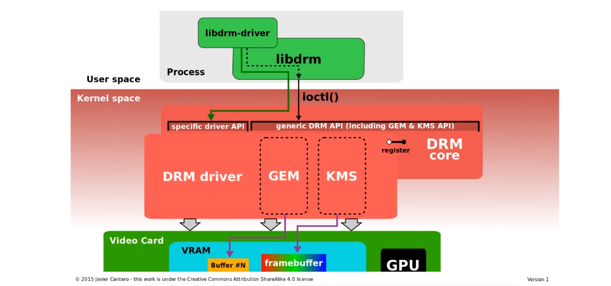
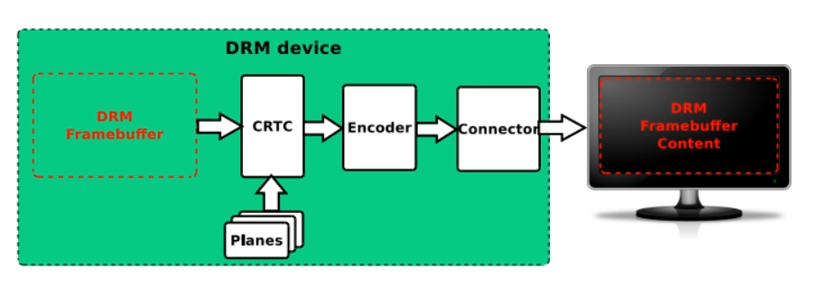
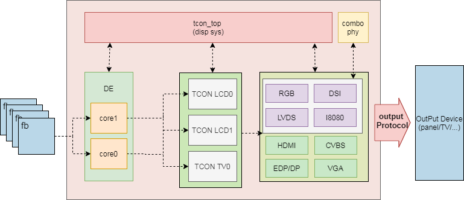
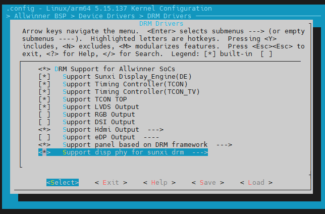
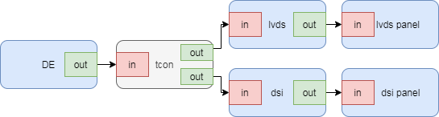

# Linux DRM 开发指南

## 前言

### 文档简介

介绍Sunxi平台DRM/KMS驱动的概要实现及配置方法。

### 目标读者

-   DRM驱动开发人员/维护人员
-   DRM模块的用户态开发人员

### 适用范围

:::note

:::note

适用产品列表

:::

:::

| 产品名称 | 内核版本 | 驱动文件 |
| --- | --- | --- |
| T527/A523/A527 | linux5.10/linux5.15 | bsp/drivers/drm/ |
| MR536/T536 | linux5.10 | bsp/drivers/drm/ |
| T527\_AIOT | linux5.15 | bsp/drivers/drm/ |
| A733 | linux6.6 | bsp/drivers/drm/ |
| T736 | linux5.15 | bsp/drivers/drm/ |
| A537 | linux6.6/linux5.15 | bsp/drivers/drm/ |
| A333 | linux6.6 | bsp/drivers/drm/ |
| T153 | linux5.10-rt | bsp/drivers/drm/ |
| T507 | linux6.6 | bsp/drivers/drm/ |

### 相关术语介绍

:::note

:::note

术语介绍

:::

:::

| 术语 | 解释 |
| --- | --- |
| DRM | Direct Rendering Manager 直接渲染管理器 |
| KMS | kernel Mode Setting |
| 模式设置 | 设置显示通路的模式（分辨率，颜色深度，位宽，图层设置等） |
| libdrm | 用于访问操作DRM的用户态库 |
| modetest | libdrm提供的测试程序，可以查询显示设备的信息及进行基本的显示测试 |
| crtc | 阴极射线管控制器，drm中将输入像素根据相应时序发送给下级硬件的硬件抽象 |
| encoder | 编码器， 作为crtc的后级硬件， 负责将crtc的信号转换给connector输出 |
| connector | 连接器， 显示通路末端显示输出接口的抽象，更多强调的是接口本身，lvds，hdmi，edp等 |
| plane | 图层、平面, 即具有合成能力的crtc的硬件图层抽象 |

## 模块介绍

Sunxi DRM驱动由Linux kernel DRM 框架（kernel/drivers/gpu/drm/）以及bsp仓库下drivers/drm/目录下的全志平台适配驱动组成，通过DRM驱动实现了对全志显示硬件的管理控制。

用户空间可以通过libdrm的标准API透过DRM对全志平台的显示硬件实现对显示通路的全功能管理配置。

### DRM简介



-   Linux DRM 包含旨在支持复杂图形设备需求的代码，通常包含适合 3D 图形加速的可编程管道。内核中的图形驱动程序可以利用 DRM 功能来简化内存管理、中断处理和 DMA 等任务，并为应用程序提供统一的接口。
-   直接渲染管理器 ( DRM ) 是 Linux 内核的一个子系统，负责与现代显卡的 GPU 接口。DRM公开了一种 API，用户空间程序可以使用该 API 将命令和数据发送到 GPU 并执行配置显示器模式设置等操作。



DRM的几个基础组件关系如上，Framebuffer、CRTC、Encoder、Connector、Plane都是通过DRM对显示通路进行配置操作的关键组件，通过对这些组件的参数进行配置并完成一次commit，即为一次modeset，决定了后续整个显示通路的图层缩放叠加混合，末端显示设备的开关、显示模式等显示画面输出相关状态。

### Sunxi平台DRM介绍

DRM的AW平台适配代码放在bsp/drivers/drm下，对接完成了kernel DRM框架要求驱动所需要实现的接口。

-   支持edp/hdmi/lvds/rgb/mipi dsi等显示输出接口
-   支持bootloader与内核平滑过渡显示
-   支持fbdev
-   DE支持iommu内存映射
-   支持多图层混合叠加缩放
-   支持drm atomic机制

驱动的主要源码文件及说明如下：

```
├── panel						//屏幕模组驱动
│   ├── edp_general_panel.c
│   ├── panel-dsi.c
│   ├── panel-lvds.c
│   ├── panel-rgb.c
│   └── sunxi-panel-simple.c
├── phy							//dsi、lvds、rgb等部分接口模块的phy抽象
│   ├── sunxi_dsi_combophy.c
│   └── sunxi_dsi_combophy_reg.c
├── sunxi_device
│   ├── hardware
│   │   ├── lowlevel_de			//de底层硬件相关
│   │   ├── lowlevel_edp		//edp/dp底层硬件相关
│   │   ├── lowlevel_hdmi20		//hdmi底层硬件相关
│   │   ├── lowlevel_lcd		//dsi、lvds、rgb等接口模块相关
│   │   └── lowlevel_tcon		//tcon-tv底层硬件相关
│   ├── sunxi_edp.c				//edp/dp中间抽象层
│   ├── sunxi_hdmi.c			//hdmi中间抽象层
│   ├── sunxi_tcon.c			//tcon驱动顶层实现
│   └── sunxi_tcon_top.c		//tcon_top驱动顶层实现
├── sunxi_drm_crtc.c			//crtc/plane对接，对下调用lowlevel_de
├── sunxi_drm_drv.c				//drm顶层master驱动
├── sunxi_drm_dsi.c				//dsi接口对接drm connector及encoder
├── sunxi_drm_edp.c				//edp接口对接drm connector及encoder
├── sunxi_drm_hdmi.c			//hdmi接口对接drm connector及encoder
├── sunxi_drm_lvds.c			//lvds接口对接drm connector及encoder
├── sunxi_drm_rgb.c				//rgb接口对接drm connector及encoder
├── sunxi_fbdev_core.c			//fbdev实现
└── sunxi_fbdev_platform.c		//fbdev实现
```

### 硬件模块介绍

AW平台显示相关硬件IP模块主要包括de、tcon top（又称disp sys）、combp phy、tcon、hdmi、edp/dp、DSI、CVBS、VGA等，如下框图。



内存中的输入buffer经过DE处理后，连接到tcon，经过输出协议IP模块处理最终通过SOC的外接引脚输出相应的显示输出协议信号。

一路显示输出通常始于DE的一个core或者一路disp output，DE对内存中的多个图像数据（fb）做混合裁剪及画质调整等处理后，信号输出连接到一路tcon（timing controller）。

tcon分为tcon\_tv以及tcon\_lcd，tcon后端一般为接口协议模块的具体IP，但也有部分接口（如RGB、LVDS等）直接由tcon\_lcd模块内部实现，不需要后接额外的协议IP模块。

协议IP模块一般都有自己的phy模块，图中省略未画出，但值得注意的是combo phy也是一个独立的硬件phy模块，但其同时为多种接口（如RGB、LVDS等）提供一些功能配置及实现。

在多数情况下，一路DE core后接一路tcon，再根据实际后端可能再有一路协议IP模块来完成信号输出。

但在某些情况下也可能后端协议模块需要通过两路tcon来完成通路数据传递（如 dual dsi），此时后端的协议IP模块可能也需要两路同时输出。

DE在drm中被抽象为crtc，DE具有的硬件图层合成能力，每个blending channel被抽象为一个plane，各种硬件输出接口则被抽象为connector，这些硬件的操作方法均通过DRM的标准的API提供。

用户空间一般借助libdrm简化对DRM框架的api调用，完成对显示输出管理，buffer申请、释放、映射、合成等操作。

:::tip

:::note

提示

:::
:::note

-   不同的显示输出接口协议硬件上固定使用tcon tv或者tcon lcd，tcon可以理解为是接口协议模块与DE沟通时序的桥梁模块。
-   支持多显时，每一路的DE输出所提供的功能会有所差异，但一般支持连接到任意输出接口。

:::

:::

## 配置集成方法

### menuconfig

#### 必选配置

在longan目录下执行./build.sh menuconfig ,首先依次进入Device Drivers > Graphics support， 选上Direct Rendering Manager (XFree86 4.1.0 and higher DRI support)后保存退出。



再执行一次./build.sh menuconfig依次进入Allwinner BSP > Device Drivers > DRM Drivers，可见上图的配置页面，其中:

Support Sunxi Display\_Engine(DE)、Support Timing Contoller(Tcon)、Support TCON TOP为必选,

DRM Support for Allwinner SoCs，根据需要可以编译为build-in或module。

#### 可选输出接口配置

hdmi/edp/LVDS/RGB/DSI根据需要选择，且hdmi、edp选上时其下级菜单也需要根据实际打开配置，

需要使用屏幕模组驱动的接口，也需要选上Support panel based on DRM framework，并在下级菜单中打开对应的屏幕模组驱动。

Support disp phy for sunxi drm是指combo phy驱动，当所使用的接口依赖combp phy时，需要选上，如果不确定，请选上，注意下级菜单中的配置也需要选上。

#### menuconfig注意事项

另外需要注意的是旧版显示驱动配置项AW\_DISP2，即

```
Allwinner BSP->Device Drivers->Video Drivers->DISP Driver Support(sunxi-disp2)
```

必须配置为关闭。

此外lcd/dp/edp等依赖屏幕面板的接口一般需要使用pwm背光，对应配置项为BACKLIGHT\_PWM，即

```
Device Drivers->Graphics support->Backlight & LCD device support->Lowlevel Backlight controls->Generic PWM based Backlight Driver
```

必须选上。

### board.dst配置

board.dts中需要为板级相关的设备进行配置，主要包括显示输出接口相关的设备，即在board.dts中需要配置输出接口是否使用，屏幕面板设备的驱动及参数等。

以下为某平台的board.dts drm显示相关的节点：

```
{
	lvds_panel: lvds_panel@0 {
		compatible = "sunxi-lvds";
		status = "okay";
		power0-supply = <&reg_dc1sw1>;
		power1-supply = <&reg_bldo2>;
		backlight = <&backlight0>;
		bus-format = <MEDIA_BUS_FMT_RGB888_1X7X4_SPWG>;
		enable0-gpios = <&pio PD 21 GPIO_ACTIVE_HIGH>;
		enable1-gpios = <&pio PD 22 GPIO_ACTIVE_HIGH>;
		display-timings {
			native-mode = <&lvds0_timing0>;
			lvds0_timing0: timing0 {
				clock-frequency = <74871600>;
				hback-porch = <70>;
				hactive = <1280>;
				hfront-porch = <83>;
				hsync-len = <18>;
				vback-porch = <13>;
				vactive = <800>;
				vfront-porch = <37>;
				vsync-len = <10>;
			};
		};
		port {
			lvds_panel_in: endpoint {
				remote-endpoint = <&lvds_panel_out>;
			};
		};
	};

	backlight0: backlight0 {
		compatible = "pwm-backlight";
		status = "okay";
		brightness-levels = <
			  0   1   2   3   4   5   6   7
			  8   9  10  11  12  13  14  15
			 16  17  18  19  20  21  22  23
			 24  25  26  27  28  29  30  31
			 32  33  34  35  36  37  38  39
			 40  41  42  43  44  45  46  47
			 48  49  50  51  52  53  54  55
			 56  57  58  59  60  61  62  63
			 64  65  66  67  68  69  70  71
			 72  73  74  75  76  77  78  79
			 80  81  82  83  84  85  86  87
			 88  89  90  91  92  93  94  95
			 96  97  98  99 100 101 102 103
			104 105 106 107 108 109 110 111
			112 113 114 115 116 117 118 119
			120 121 122 123 124 125 126 127
			128 129 130 131 132 133 134 135
			136 137 138 139 140 141 142 143
			144 145 146 147 148 149 150 151
			152 153 154 155 156 157 158 159
			160 161 162 163 164 165 166 167
			168 169 170 171 172 173 174 175
			176 177 178 179 180 181 182 183
			184 185 186 187 188 189 190 191
			192 193 194 195 196 197 198 199
			200 201 202 203 204 205 206 207
			208 209 210 211 212 213 214 215
			216 217 218 219 220 221 222 223
			224 225 226 227 228 229 230 231
			232 233 234 235 236 237 238 239
			240 241 242 243 244 245 246 247
			248 249 250 251 252 253 254 255>;
		default-brightness-level = <200>;
		enable-gpios = <&pio PI 2 GPIO_ACTIVE_HIGH>;
		pwms = <&pwm0 4 50000 0>;
	};
};

&de {
	chn_cfg_mode = <3>;
	status = "okay";
};

&vo0 {
	status = "okay";
};

&vo1 {
	status = "okay";
};

&lvds0 {
	status = "okay";
	dual-channel = <0>;
	pinctrl-0 = <&lvds0_pins_a>;
	pinctrl-1 = <&lvds0_pins_b>;
	pinctrl-names = "active","sleep";
	ports {
		port@1 {
			reg = <1>;
			lvds_panel_out: endpoint@0 {
				reg = <0>;
				remote-endpoint = <&lvds_panel_in>;
			};
		};
	};
};

&dsi0combophy {
	status = "okay";
};

&dsi1combophy {
	status = "okay";
};

&drm_edp {
	status = "disabled";

	edp_ssc_en = <0>;
	edp_ssc_mode = <0>;
	edp_psr_support = <0>;
	edp_colordepth = <8>; /* 6/8/10/12/16 */
	edp_color_fmt = <0>; /* 0:RGB  1: YUV444  2: YUV422 */

	lane1_sw = <0>;
	lane1_pre = <0>;
	lane2_sw = <0>;
	lane2_pre = <0>;
	lane3_sw = <0>;
	lane3_pre = <0>;
	efficient_training = <0>;

	sink_capacity_prefer = <1>;
	edid_timings_prefer = <1>;
	timings_fixed = <1>;

	vcc-edp-supply = <&reg_bldo3>;
	vdd-edp-supply = <&reg_dcdc2>;
	panel = <&edp_panel>;
	ports {
		edp_out: port@1 {
			edp_panel_out: endpoint@0 {
				reg = <0>;
				remote-endpoint = <&edp_panel_in>;
			};
		};
	};
};

&hdmi {
	hdmi_used = <1>;
	bldo3-supply = <&reg_bldo3>;
	hdmi_power0 = "bldo3";
	hdmi_power_cnt = <1>;
	hdmi_hdcp_enable = <1>;
	hdmi_hdcp22_enable = <0>;
	hdmi_cts_compatibility = <0>;
	hdmi_cec_support = <1>;
	hdmi_cec_super_standby = <1>;
	hdmi_skip_bootedid = <1>;

	ddc_en_io_ctrl = <0>;
	power_io_ctrl = <0>;

	status = "okay";
};

&dsi0 {
	status = "okay";
	pinctrl-0 = <&dsi0_4lane_pins_a>;
	pinctrl-1 = <&dsi0_4lane_pins_b>;
	pinctrl-names = "active","sleep";

	panel: panel@0 {
		compatible = "panel-dsi";
		status = "okay";
		reg = <0>;
		power0-supply = <&reg_dc1sw1>;
		power1-supply = <&reg_bldo2>;

		enable0-gpios = <&pio PD 22 GPIO_ACTIVE_HIGH>; //reset
		enable1-gpios = <&pio PH 9 GPIO_ACTIVE_HIGH>; //reset
		enable2-gpios = <&pio PH 10 GPIO_ACTIVE_HIGH>; //reset
		reset-gpios = <&pio PD 21 GPIO_ACTIVE_HIGH>; //reset
	//	backlight = <&backlight0>;
	//	dsi,flags = <(MIPI_DSI_MODE_VIDEO | MIPI_DSI_SLAVE_MODE)>;
		dsi,flags = <(MIPI_DSI_MODE_VIDEO)>;
		dsi,lanes = <4>;
		dsi,format = <0>;
		panel-init-sequence = [
			15 00 02 00 00
			15 00 02 FA 5A
			15 00 02 00 00
			39 00 04 FF 82 05 01
			15 32 02 29 00
			15 00 02 35 00
		];

		panel-exit-sequence = [
			05 00 01 28
			05 78 01 10
		];

		display-timings {
			native-mode = <&timing0>;
			timing0: timing0 {
				clock-frequency = <171993120>;
				hback-porch = <26>;
				hactive = <1200>;
				hfront-porch = <46>;
				hsync-len = <10>;
				vback-porch = <20>;
				vactive = <2000>;
				vfront-porch = <212>;
				vsync-len = <4>;
			};
		};
	};
};
```

当前DRM驱动支持hdmi、edp、dp、dsi、lvds、rgb接口输出，根据实际硬件平台不同，支持的接口也有所差异。

一些一般不需要修改的dts信息均存放在bsp/configs/linux-x.y/sunXXiwXpX.dtsi中，同时参照此部分dtsi显示相关的设备树节点会对sunxi-drm的设备树有更深入理解。

#### dts graphic说明

de、tcon、输出接口、屏驱动的设备树节点直接会使用port以及endpoint的方式连接起来，用来表示这些设备实际支持的连接状态。

这些设备会包含ports或者port节点，节点的名字会带有xxx\_in或者xxx\_out，说明这是该设备的一个输出或者输入口。

每一个port下会包含若干个endpoint，指明该设备与其他设备可能的连接关系。

每个endpoint下包含一个remote-endpoint的属性，其值为该口所连接到的设备的endpoint的引用，指明该设备与另一设备在硬件上允许的输入输出连接关系

以下为一个简单的简化设备树节点，de只支持一路输出，且只有一路tcon，该tcon支持lvds及dsi输出,lvds和dsi后分别接一个屏。

```
de: de@5000000 {
	ports {
		disp0_out_tcon0: endpoint@0 {
				remote-endpoint = <&tcon0_in_disp0>;
		};
	};
};

lcd0: tcon0@5501000 {
	ports {
		tcon0_in: port@0 {
			tcon0_in_disp0: endpoint@0 {
				remote-endpoint = <&disp0_out_tcon0>;
			};
		};
		tcon0_out: port@1 {
			tcon0_out_lvds0: endpoint@0 {
				remote-endpoint = <&lvds0_in_tcon0>;
			};
			tcon0_out_dsi0: endpoint@1 {
				remote-endpoint = <&dsi0_in_tcon0>;
			};
		};
	};
};

lvds0: lvds0@0001000 {
	ports {
		lvds0_in: port@0 {
			lvds0_in_tcon0: endpoint@0 {
				remote-endpoint = <&tcon0_out_lvds0>;
			};
		};
		lvds0_out: port@1 {
			lvds0_out_panel: endpoint@0 {
			remote-endpoint = <&lvds_panel_in>;
		};
	};
};

lvds_panel: lvds_panel@0 {
	port {
		lvds_panel_in: endpoint {
			remote-endpoint = <&lvds0_out_panel>;
		};
	};
};

dsi0: dsi0@5506000 {
	ports {
		dsi0_in: port@0 {
			dsi0_in_tcon0: endpoint@0 {
				remote-endpoint = <&tcon0_out_lvds0>;
			};
		dsi0_out: port@1 {
			dsi_out_panel: endpoint@0 {
			remote-endpoint = <&dsi_panel_in>;
		};
	};

	panel: panel@0 {
		port {
			dsi_panel_in: endpoint {
				remote-endpoint = <&dsi_out_panel>;
			};
	};
};
```

上图的连接示意图如下：



de作为显示通路的开始，必然只有输出的port，port的数量就是所支持的显示输出的数量。de的每个port下的节点就是这路de输出允许连接的tcon。每一路tcon至少包含连接到de的输入port，以及连接到后端显示接口的输出port。需要连接屏幕模组的接口的设备树节点必然有输出port连接到屏幕模组所在节点。dsi屏幕模组实际是dsi总线下的子设备，所以dsi屏幕模组的设备树节点从属于dsi模块的设备树节点。

#### 详细说明

tcon\_top(即vo,video out)为tcon的额外控制模块，部分IC DE也依赖tcon\_top，而tcon实际可区分为tcon\_tv以及tcon\_lcd两个不同的ip模块实现，

如果存在tcon\_top，则每个tcon设备必然配套一个tcon\_top设备，当需要手动配置使能某种输出接口（LVDS/RGB/HDMI等）时，

切记要保证对应的tcon以及对应tcon的tcon\_top的节点的status也为okay。在sunXXiwX.dtsi的对应输出接口的节点的remote-endpoint可以索引到其所依赖的tcon设备。

tcon\_lcd单独可实现rgb、lvds两种接口的输出，dsi接口输出则需要tcon-lcd后接dsi模块ip完成支持，tcon\_tv用于作为hdmi、edp、dp输出通路的一部分，后级还需要加上对应输出接口的ip模块。

对于依赖tcon\_lcd输出的输出接口，有可能还会依赖combo phy这一硬件模块，是否依赖能在sunXXiwX.dtsi对应节点中找到phys节点，如果有，则说明有依赖。

当前支持的所有输出通路如下:

-   edp/dp接口: DE->tcon\_tv->dp(edp)->panel，根据实际同时可能需要tcon\_top。
-   hdmi接口: DE->tcon\_tv->hdmi，根据实际同时可能需要tcon\_top。
-   dsi接口: DE->tcon\_lcd->dsi->panel，根据实际同时可能需要tcon\_top，需要combo phy。
-   lvds接口: DE->tcon\_lcd->panel，根据实际同时可能需要tcon\_top，可能需要combo phy。
-   rgb接口：DE->tcon\_lcd->panel，根据实际同时可能需要tcon\_top，可能需要combo phy。

总而言之，整个SOC的显示的通路结构通过sunXXiwX.dtsi中相关设备的ports/endpoint结构以图形的形式组织起来，其依赖的设备也以引用的方式包含在对应的设备树节点中， dts展示出硬件允许的所有可能的显示通路的连接关系，当需要支持某种接口时，需要确保整个通路上的设备都是okay状态，并且对应驱动的内核menuconfig配置项打开硬件才能正常初始化。

### fbdev相关配置

drm可以认为是fbdev的下一代显示驱动框架，sunxi-drm同时也提供了对fbdev的兼容处理，支持两者同时使用。

内核的menuconfig配置项DRM\_FBDEV\_EMULATION，即

```
Device Drivers > Graphics support > Direct Rendering Manager (XFree86 4.1.0 and higher DRI support) > Enable legacy fbdev support for your modesetting driver
```

控制是否同时使用fbdev兼容，平滑显示logo需要与fbdev配套使用，即如需使用平滑显示logo，则需要使能该项配置。

fbdev默认实现为双buffer。

fbdev默认使用DE的channel 1，如果用户态后续需要使用fbdev，那么通过drm送显应避开该channel的使用，以达成drm与fbdev同时使用的目的。

::: note 如果用户态没有进程在使用drm驱动，或者在使用完毕后调用了DRM\_IOCTL\_DROP\_MASTER，那么fbdev的刷新将自动完成。否则，fbdev将随着用户态对drm操作的其他plane的送显一同刷新。 :::

## 私有属性

sunxi\_drm 驱动，主要使用 atomic commit 配置显示驱动，这里主要介绍一下全志平台相关的一些私有属性，部分 blob 结构，通过 include/video/sunxi\_drm.h 透出公共结构体供用户态配置。

主要包括：

### crtc

| 名字 | 类型 | 简介 |
| --- | --- | --- |
| FEATURE | immutable blob | 绑定在 crtc，描述 crtc 硬件特性 |
| BACKEND\_DATA | blob | 配置后级输出的画质模块，对应 struct de\_backend\_data |
| SUNXI\_CTM | blob | 配置全局的 color materx，3 x 4，对比 drm 多了常数项， |
|  |  | 对应 struct de\_color\_ctm |
| FRAME\_RATE\_CHANGE | range | 高刷相关，用来表示这次 modeset 与改变帧率相关 |

### plane

| 名字 | 类型 | 简介 |
| --- | --- | --- |
| FB\_ID1~3 | object | framebuffer obj id |
| SRC\_X1 ~3 | signed range | src x 坐标 |
| SRC\_Y1~3 | signed range | src y 坐标 |
| SRC\_W1~3 | signed range | src 的 width |
| SRC\_H1~3 | signed range | src 的 height |
| CRTC\_X1~3 | signed range | crtc x 坐标 |
| CRTC\_Y1~3 | signed range | crtc y 坐标 |
| CRTC\_W1~3 | signed range | crtc 的 width |
| CRTC\_H1~3 | signed range | crtc 的 height |
| COLOR0~3 | signed range | 配置纯色图片 |
| alpha0 ~ 3 | range | 配置 global alpha |
| pixel blend mode0 ~ 3 | enum | 配置混合模式 |
| COLOR\_SPACE | signed range | 配置图层的颜色空间 |
| COLOR\_RANGE | signed range | 配置图层的颜色范围 |
| EOTF | signed range | 配置图层的 eotf |
| compressed\_image\_crop | range | afbc 图层 crop 信息 |
| FRONTEND\_DATA | blob | 配置前级输出（视频）的画质模块， |
|  |  | 对应 struct de\_frontend\_data |
| FEATURE | immutable blob | plane crtc 硬件特性 |

::: tip 全志平台部分 palne 硬件对应可以配置 4 个 layer，这些图层只能简单叠加覆盖，且格式、缩放系数等需要一致，所以部分属性会透出 4 个 :::

## 调试方法

### drm-log

-   `echo 0x1cf > /sys/module/drm/parameters/debug`

打开除了drm vblank 相关的 log 打印，可以观察 drm 调用过程是否正常/报错信息

相关 mask bit 的含义：

```
enum drm_debug_category {
    /**
     * @DRM_UT_CORE: Used in the generic drm code: drm_ioctl.c, drm_mm.c,
     * drm_memory.c, ...
     */
    DRM_UT_CORE     = 0x01,
    /**
     * @DRM_UT_DRIVER: Used in the vendor specific part of the driver: i915,
     * radeon, ... macro.
     */
    DRM_UT_DRIVER       = 0x02,
    /**
     * @DRM_UT_KMS: Used in the modesetting code.
     */
    DRM_UT_KMS      = 0x04,
    /**
     * @DRM_UT_PRIME: Used in the prime code.
     */
    DRM_UT_PRIME        = 0x08,
    /**
     * @DRM_UT_ATOMIC: Used in the atomic code.
     */
    DRM_UT_ATOMIC       = 0x10,
    /**
     * @DRM_UT_VBL: Used for verbose debug message in the vblank code.
     */
    DRM_UT_VBL      = 0x20,
    /**
     * @DRM_UT_STATE: Used for verbose atomic state debugging.
     */
    DRM_UT_STATE        = 0x40,
    /**
     * @DRM_UT_LEASE: Used in the lease code.
     */
    DRM_UT_LEASE        = 0x80,
    /**
     * @DRM_UT_DP: Used in the DP code.
     */
    DRM_UT_DP       = 0x100,
    /**
     * @DRM_UT_DRMRES: Used in the drm managed resources code.
     */
    DRM_UT_DRMRES       = 0x200,
};
```

### sunxi drm status

```
cat /proc/sunxi-drm/status
```

用来查看 crtc plane 的配置状态，整体的通路 crtc: plane（module） + plane（module）+ ... -> blender（module）

```
plane[93]: plane-0-vch0(0) enable
        crtc=DE-0
        rotation=1
        normalized-zpos=0
                 layer_id | fb_id |       src-pos       |       crtc-pos      | blend_mode |  alpha |   color
                 ---------+-------+---------------------+---------------------+------------+--------+---------
                     0    |  164  | 1280x 800+   0+   0 | 1280x 800+   0+   0 |   premult  |   255  | 0x00000000

        ovl@  101000: disable

        afbd@  105000: disable

        tfbd@  105400: enable
                format: AB24 little-endian (0x34324241) lossy: 0 layout: 16x4
                in(1280x 800) ==> c(1280x 800+   0+   0) ==> out(1280x 800)

        scaler@  104000: disable

        snr@  106400: disable

        sharp@  106000: disable

        cdc@  108000: disable

        gtm disable
        vch0_cdc_icsc@       0: disable
        vch0_cdc_icsc@       0: disable

        dlc@  115000: disable
        gamma0@  116000:
                gamma_tbl off

        fcm@  111000: disable csc: disable
        vch0_fcm_icsc@       0: disable
        vch0_fcm_ocsc@       0: disable

        vch0_csc@  100800: enable
                in:  colorfmt: rgb, eotf: bt709, colorspace: BT709, range: full
                out: colorfmt: rgb, eotf: bt709, colorspace: BT709, range: full
plane[101]: plane-1-vch1(0) disable
        crtc=(null)
        rotation=1
        normalized-zpos=0

        ovl@  121000: disable

        tfbd@  125400: disable

        scaler@  124000: disable

        vch1_csc@  120800: disable
plane[107]: plane-2-uch0(0) disable
        crtc=(null)
        rotation=1
        normalized-zpos=0

        ovl@  1c1000: disable

        tfbd@  1c5400: disable

        scaler@  1c4000: disable

        cdc@  1c8000: disable

        uch0_csc@  1c0800: disable
plane[113]: plane-3-uch2(0) disable
        crtc=(null)
        rotation=1
        normalized-zpos=0

        ovl@  201000: disable

        scaler@  204000: disable

        uch2_csc@  200800: disable
blender@  281000: enable
         pipe_id | enable | channel | premult |       crtc-pos
        ---------+--------+---------+---------+---------------------
             0   |   true |    0    |  false  | 1280x 800+   0+   0

        deband@  287000: disable
        smbl0@  28b000:
                smbl_tbl off, dimming: 256, backlight: 0
        gamma0@  289000:
                gamma_tbl off
        disp0_gamma_csc@       0: enable
                in:  colorfmt: rgb, eotf: bt709, colorspace: BT709, range: full
                out: colorfmt: rgb, eotf: bt709, colorspace: BT709, range: full
                bcsh: 50 50 50 50
        dither@  288000: disable
        fmt@  285000: disable

plane[120]: plane-0-vch2(1) disable
        crtc=(null)
        rotation=1
        normalized-zpos=0

        ovl@  141000: disable

        scaler@  144000: disable

        snr@  146400: disable

        fcm@  151000: disable csc: disable
        vch2_fcm_icsc@       0: disable
        vch2_fcm_ocsc@       0: disable

        vch2_csc@  140800: disable
plane[127]: plane-1-uch1(1) disable
        crtc=(null)
        rotation=1
        normalized-zpos=0

        ovl@  1e1000: disable

        tfbd@  1e5400: disable

        scaler@  1e4000: disable

        uch1_csc@  1e0800: disable
plane[133]: plane-2-uch3(1) disable
        crtc=(null)
        rotation=1
        normalized-zpos=0

        ovl@  221000: disable

        scaler@  224000: disable

        uch3_csc@  220800: disable
blender@  2a1000: disable
        smbl1@  2ab000:
                smbl_tbl off, dimming: 256, backlight: 0
        gamma1@  2a9000:
                gamma_tbl off
        disp1_gamma_csc@       0: disable
        dither@  2a8000: disable
        fmt@  2a5000: disable

crtc[100]: DE-0
        on: 1280x800@30&600Mhz->tcon0 irqcnt=3848 err=0
            format_space: 0 yuv_sampling: 0 eotf:1 cs: 1 color_range: 1 data_bits: 0
            vsync: 3848 last rcq at vsync: 3373
        wb off
crtc[126]: DE-1
        off
```

参数解析：

**plane：**

1.  图层参数信息

```
                 layer_id | fb_id |       src-pos       |       crtc-pos      | blend_mode |  alpha |   color
                 ---------+-------+---------------------+---------------------+------------+--------+---------
                     0    |  164  | 1280x 800+   0+   0 | 1280x 800+   0+   0 |   premult  |   255  | 0x00000000
```

主要包括 src 原图的 crop 信息，和 crtc 显示区域。

2.  plane 模块信息

```
scaler@  104000: disable
xxx@  偏移: disable/enable
```

这里表示未开启 plane 的 scaler 缩放功能

3.  颜色空间信息

```
vch0_csc@  100800: enable
                in:  colorfmt: rgb, eotf: bt709, colorspace: BT709, range: full
                out: colorfmt: rgb, eotf: bt709, colorspace: BT709, range: full
```

输入和输出对应的颜色空间格式转换

**blender：**

1.  pipe line 信息

```
      pipe_id | enable | channel | premult |       crtc-pos
        ---------+--------+---------+---------+---------------------
             0   |   true |    0    |  false  | 1280x 800+   0+   0   
```

一个 plane 最终会对应到一个 pipe，这里表示所有 pipe 最终混合的信息

2.  blender/disp\_out 模块信息

```
disp0_gamma_csc@       0: enable
                in:  colorfmt: rgb, eotf: bt709, colorspace: BT709, range: full
                out: colorfmt: rgb, eotf: bt709, colorspace: BT709, range: full
                bcsh: 50 50 50 50
```

模块使能和配置信息，bcsh，表示亮度、对比度、饱和度、色度信息

**crtc：**

1.  硬件相关信息
    
    ```
     on: 1280x800@30&600Mhz->tcon0 irqcnt=3848 err=0
         format_space: 0 yuv_sampling: 0 eotf:1 cs: 1 color_range: 1 data_bits: 0
         vsync: 3848 last rcq at vsync: 3373
     wb off
    ```
    

-   1280x800@30：设备输出分辨率为 1280x800 30 hz
-   err：当前状态的缺数数量，硬件内部的检测标志
-   format\_space、yuv\_sampling、eotf、cs、color\_range、data\_bits：输出设备格式信息
-   vsync、irqcnt：vsync 计数

### drm obj 信息

```
mount -t debugfs none /sys/kernel/debug
cat /sys/kernel/debug/dri/*/*
```

drm 原生提供的一些 obj（crtc、connecter、framebuffer 等信息）。

## FAQ

Q: libdrm如何获取?

A: `https://dri.freedesktop.org/libdrm/`

* * *

Q: modetest如何获取

A: 在libdrm下tests目录下

* * *

Q: sunxi drm与gpu有什么关系？

A: 本文档中提到的sunxi drm与全志soc的gpu驱动没有太多关系，是对AW显示硬件(de/tcon/hdmi/dsi/edp等)的控制驱动，soc内的gpu驱动部分版本也通过drm实现，但与本文档无关。

* * *

Q: 如何查看DRM驱动当前的状态？

A:

1.  使能debugfs后，可以在cat /sys/kernel/debug/dri/\*/\*下查看各个drm组件当前的状态。
2.  直接运行modetest，会显示drm组件的状态及全部property，可以了解对应硬件的状态。
3.  cat /sys/class/drm/card0/device/crtc/status可以查看de的状态
4.  /sys/class/drm/card0/card0-XXXX-X包含connector的节点，可以查看或操作connector硬件。

* * *

Q: 无显示，如何检查驱动配置是否正确？

A:

1.  可以检查内核启动log，如果驱动正常初始化，会有以下打印

```
[    6.086460] [drm] Initialized sunxi-drm 3.0.0 20230901 for soc@3000000:sunxi-drm on minor 0
[    6.095919] [drm] sunxi_drm_bind ok
```

2.  如果没有正常初始化的log，可以往前查看是否有相关报错log，一般都是某些依赖设备的驱动未配置导致，如iommu，tcon，tcon\_top（vo），pwm，backlight，panel，regulator，combo phy等。
3.  检查/sys/class/drm/下是否有对应的设备，一般card0就是sunxi-drm，以及card0-HDMI-A-X/card0-LVDS-X等输出接口的connector是否注册成功。
