# DRM 屏幕适配开发指南

## 前言

### 文档简介

介绍全志平台基于DRM显示框架的各类显示屏的适配方法及调试方法，如：LVDS、MIPI DSI、RGB、eDP等。

### 目标读者

需要完成新屏幕适配的显示开发工程师。

### 符号约定

本文档中会使用不同符号区分信息类型，具体释义如下：

:::note

:::note

备注

:::
:::note

用于呈现技术核心信息（如功能原理、核心参数定义）、流程补充内容（如步骤细节说明）等。

:::

:::
:::tip

:::note

提示

:::
:::note

用于分享技术操作中的高效方法（如命令行快捷指令、配置项优化窍门）与实践技巧。

:::

:::
:::warning

:::note

注意

:::
:::note

用于突出技术操作中易出错的环节（如参数配置边界、操作顺序要求）的提示。

:::

:::

### 适用平台

:::note

:::note

适用平台列表

:::

:::

| 平台 | 内核版本 | 驱动文件 |
| --- | --- | --- |
| Allwinner 系列芯片 | Linux 5.10 及以上内核版本 | bsp/drivers/drm/ |

### 相关术语介绍

:::note

:::note

术语介绍

:::

:::

| 术语 | 解释 |
| --- | --- |
| DRM | Direct Rendering Manager 直接渲染管理器 |
| DE | 完成图层合成和渲染等工作的显示引擎，显示系统的核心 |
| VIDEO\_OUT | 显示子系统域，并非所有平台都有这个模块，用于显示系统顶层功耗管理和通路管理 |
| TCON | 时序控制器，将DE合成的数据转换成对应的时序信息 |
| PHY | 物理层，根据时序信息生成对应的模拟信号，并非每个显示通路都有，部分显示接口集成在内部 |
| PANEL | 通常指的就是我们常规意义的物理屏幕，如DSI屏、LVDS屏、eDP屏等 |
| 显示接口 | 通常指显示接口的控制器，常见的显示接口有MIPI DSI、LVDS、eDP、HDMI等 |

## 概述

本章节主要介绍 Allwinner 平台接口支持情况及各接口特性。

### 基本硬件连接关系

Allwinner 平台显示硬件连接关系如下图所示:

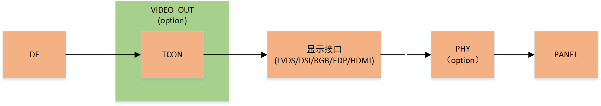

#### A523\_A527\_T527显示硬件连接关系

:::note

:::note

A523\_A527\_T527显示硬件连接关系

:::

:::

| 显示接口 | 所属Video\_Out | 所属Group | Tcon连接 | 外部PHY连接 |
| --- | --- | --- | --- | --- |
| DE | vo0 | N/A | N/A | N/A |
| DSI0 | vo0 | N/A | dlcd0 | dsi0combophy |
| DSI1 | vo0 | N/A | dlcd1 | dsi1combophy |
| 双DSI | vo0 | N/A | dlcd0 dlcd1 | dsi0combophy dsi1combophy |
| LVDS0 | vo0 | lvds0 | dlcd0 | dsi0combophy |
| LVDS1 | vo0 | lvds0 | dlcd0 | dsi1combophy |
| Dual-LVDS0+1 | vo0 | lvds0 | dlcd0 | dsi0combophy dsi1combophy |
| LVDS2 | vo1 | lvds1 | dlcd2 | N/A |
| LVDS3 | vo1 | lvds1 | dlcd2 | N/A |
| Dual-LVDS2+3 | vo1 | lvds1 | dlcd2 | N/A |
| RGB0 | vo0 | N/A | dlcd0 | N/A |
| RGB1 | vo1 | N/A | dlcd2 | N/A |
| EDP | vo0 | N/A | tv1 | N/A |
| HDMI | vo0 | N/A | tv0 | N/A |

#### A733显示硬件连接关系

:::note

:::note

A733显示硬件连接关系

:::

:::

| 显示接口 | 所属Video\_Out | 所属Group | Tcon连接 | 外部PHY连接 |
| --- | --- | --- | --- | --- |
| DE | vo0 | N/A | N/A | N/A |
| DSI0 | vo0 | N/A | dlcd0 | dsi0combophy |
| DSI1 | vo0 | N/A | dlcd1 | dsi1combophy |
| 双DSI | vo0 | N/A | dlcd0 dlcd1 | dsi0combophy dsi1combophy |
| LVDS0 | vo0 | lvds0 | dlcd0 | dsi0combophy |
| LVDS1 | vo0 | lvds0 | dlcd0 | dsi1combophy |
| Dual-LVDS0+1 | vo0 | lvds0 | dlcd0 | dsi0combophy dsi1combophy |
| LVDS2 | vo0 | lvds1 | dlcd2 | N/A |
| LVDS3 | vo0 | lvds1 | dlcd2 | N/A |
| Dual-LVDS2+3 | vo0 | lvds1 | dlcd2 | N/A |
| RGB0 | vo0 | N/A | dlcd0 | N/A |
| RGB1 | vo0 | N/A | dlcd2 | N/A |
| EDP | vo1 | N/A | tv1 | serdes |
| HDMI | vo1 | N/A | tv0 | N/A |

#### A537\_A333显示硬件连接关系

:::note

:::note

A537\_A333显示硬件连接关系

:::

:::

| 显示接口 | 所属Video\_Out | 所属Group | Tcon连接 | 外部PHY连接 |
| --- | --- | --- | --- | --- |
| DE | vo0 | N/A | N/A | N/A |
| DSI0 | vo0 | N/A | dlcd0 | dsi0combophy |
| LVDS0 | vo0 | lvds0 | dlcd0 | dsi0combophy |
| LVDS1 | vo0 | lvds0 | dlcd0 | dsi0combophy |
| Dual-LVDS0+1 | vo0 | lvds0 | dlcd0 | dsi0combophy |
| RGB0 | vo0 | N/A | dlcd0 | N/A |
| EDP | vo1 | N/A | tv1 | serdes |
| HDMI | vo1 | N/A | tv0 | N/A |

#### T153显示硬件连接关系

:::note

:::note

T153显示硬件连接关系

:::

:::

| 显示接口 | 所属Video\_Out | 所属Group | Tcon连接 | 外部PHY连接 |
| --- | --- | --- | --- | --- |
| DE | vo0 | N/A | N/A | N/A |
| DSI0 | vo0 | N/A | dlcd0 | dsi0combophy |
| LVDS0 | vo0 | lvds0 | dlcd0 | dsi0combophy |
| LVDS1 | vo0 | lvds0 | dlcd0 | N/A |
| Dual-LVDS0+1 | vo0 | lvds0 | dlcd0 | dsi0combophy |
| RGB0 | vo0 | N/A | dlcd0 | N/A |

#### V861显示硬件连接关系

:::note

:::note

V861显示硬件连接关系

:::

:::

| 显示接口 | 所属Video\_Out | 所属Group | Tcon连接 | 外部PHY连接 |
| --- | --- | --- | --- | --- |
| DE | vo0 | N/A | N/A | N/A |
| RGB0 | vo0 | N/A | dlcd0 | N/A |
| sRGB0 | vo0 | N/A | dlcd0 | N/A |
| I8080 | vo0 | N/A | dlcd0 | N/A |

#### LVDS接口硬件介绍

显示接口的硬件中，LVDS接口的设计与实际较为特殊，在本文档中单独拎出来介绍。

在AW平台中，LVDS通常分为两组（group），每组对应一个硬件模块，每个group中又可以支持两个LVDS接口，其中group0支持LVDS0和LVDS1，group1支持LVDS2和LVDS3。当需要开启dual link LVDS显示时，会将同个group中的两个LVDS接口都使能，使其同时承载数据传输。

下文及日常方案开发时提到的LVDSx常指代group中具体的某个LVDS接口（如LVDS1、LVDS3）。但是由于实际硬件是按group划分，因此驱动及dts配置中的lvdsx通常指代某个lvds\_group，这点需要额外注意，特别是在进行LVDS适配时需要根据下文的连接关系，打开对应LVDSx对应的group的节点，以保证驱动正常加载。

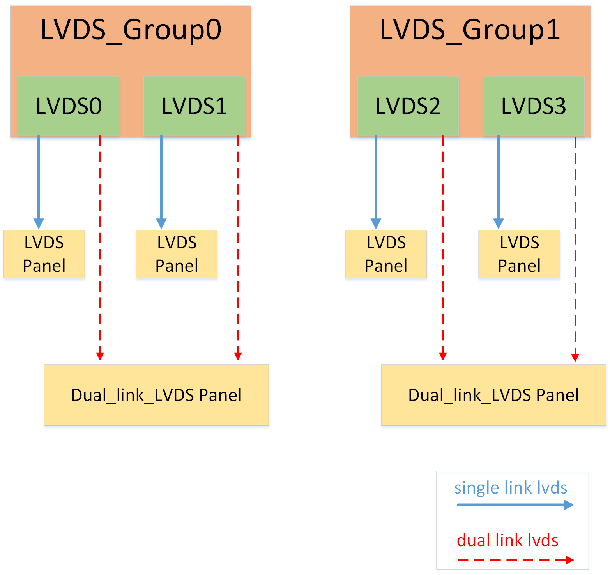

### 软件dts连接关系

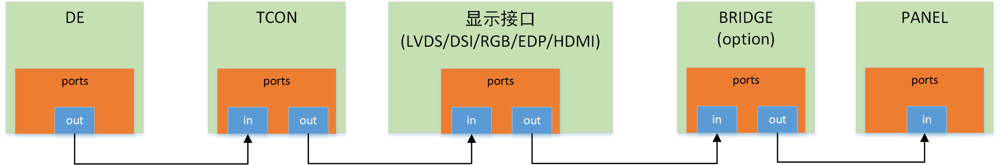

```
de: @5000000 {
    ...
    ports { /* DE端口列表 */
        #address-cells = <1>;
        #size-cells = <0>;
        disp0: port@0 {    /* 第一个DE输出端口列表 */
            reg = <0>;
            #address-cells = <1>;
            #size-cells = <0>;
            disp0_out_tcon0: endpoint@0 { /* DE的第一个out端口 */
                reg = <0>;
                remote-endpoint = <&tcon0_in_disp0>; /* 设置下一级的in节点 */
            };
            disp0_out_tcon1: endpoint@1 {
                reg = <1>;
                remote-endpoint = <&tcon1_in_disp0>;
            };
            disp0_out_tcon2: endpoint@2 {
                reg = <2>;
                remote-endpoint = <&tcon2_in_disp0>;
            };
            disp0_out_tcon3: endpoint@3 {
                reg = <3>;
                remote-endpoint = <&tcon3_in_disp0>;
            };
            disp0_out_tcon4: endpoint@4 {
                reg = <4>;
                remote-endpoint = <&tcon4_in_disp0>;
            };
        };
        disp1: port@1 {    /* 第二个DE输出端口 */
            reg = <1>;
            #address-cells = <1>;
            #size-cells = <0>;
            disp1_out_tcon0: endpoint@0 {
                reg = <0>;
                remote-endpoint = <&tcon0_in_disp1>;
            };
            disp1_out_tcon1: endpoint@1 {
                reg = <1>;
                remote-endpoint = <&tcon1_in_disp1>;
            };
            disp1_out_tcon2: endpoint@2 {
                reg = <2>;
                remote-endpoint = <&tcon2_in_disp1>;
            };
            disp1_out_tcon3: endpoint@3 {
                reg = <3>;
                remote-endpoint = <&tcon3_in_disp1>;
            };
            disp1_out_tcon4: endpoint@4 {
                reg = <4>;
                remote-endpoint = <&tcon4_in_disp1>;
            };
        };
    };
};

dlcd0: tcon0@5501000 { /* TCON0节点 */
    ...
    ports {
        #address-cells = <1>;
        #size-cells = <0>;
        tcon0_in: port@0 { /* TCON0的in端口列表 */
            #address-cells = <1>;
            #size-cells = <0>;
            reg = <0>;
            tcon0_in_disp0: endpoint@0 { /* TCON0的第一个in端口 */ 
                reg = <0>;
                remote-endpoint = <&disp0_out_tcon0>; /* 设置上一级的out节点 */
            };
            tcon0_in_disp1: endpoint@1 {
                reg = <1>;
                remote-endpoint = <&disp1_out_tcon0>;
            };
        };
        tcon0_out: port@1 { /* TCON0的out端口列表 */
            #address-cells = <1>;
            #size-cells = <0>;
            reg = <1>;
            tcon0_out_lvds0: endpoint@0 { /* TCON0的第一个out端口 */
                reg = <0>;
                remote-endpoint = <&lvds0_in_tcon0>; /* 设置下一级的in节点 */
            };
            tcon0_out_dsi0: endpoint@1 {
                reg = <1>;
                remote-endpoint = <&dsi0_in_tcon0>;
            };
            tcon0_out_dsi1: endpoint@2 {
                reg = <2>;
                remote-endpoint = <&dsi1_in_tcon0>;
            };
            tcon0_out_rgb0: endpoint@3 {
                reg = <3>;
                remote-endpoint = <&rgb0_in_tcon0>;
            };
        };
    };
};

lvds0: lvds0@0001000 { /* lvds节点 */
    ...
    ports {
        #address-cells = <1>;
        #size-cells = <0>;
        lvds0_in: port@0 { /* lvds的in端口列表 */
            #address-cells = <1>;
            #size-cells = <0>;
            reg = <0>;
            lvds0_in_tcon0: endpoint@0 { /* lvds的in端口 */
                reg = <0>;
                remote-endpoint = <&tcon0_out_lvds0>; /* 设置上一级的out节点 */
            };
        };

        lvds0_out: port@1 { /* lvds的out端口列表 */
            reg = <1>;
            lvds_panel_out: endpoint@0 { /* lvds的out端口 */
                reg = <0>;
                remote-endpoint = <&lvds_panel_in>; /* 设置下一级的in节点 */
            };
        };
    };
};

lvds_panel: lvds_panel@0 { /* lvds_panel节点 */
    ...
    port {
        lvds_panel_in: endpoint { /* lvds_panel_in端口 */
            remote-endpoint = <&lvds_panel_out>; /* 设置上一级的out节点 */
        };
    };
};

rgb0: rgb0@1000 { /* rgb节点 */
    ...
    ports {
        #address-cells = <1>;
        #size-cells = <0>;
        rgb0_in: port@0 { /* rgb的in端口列表 */
            #address-cells = <1>;
            #size-cells = <0>;
            reg = <0>;
            rgb0_in_tcon0: endpoint@0 { /* rgb的in端口 */
                reg = <0>;
                remote-endpoint = <&tcon0_out_rgb0>; /* 设置上一级的out节点 */
            };
        };

        rgb0_out: port@1 { /* rgb的out端口列表 */
            reg = <1>;
            rgb0_panel_out: endpoint@0 { /* rgb的out端口 */
                reg = <0>;
                remote-endpoint = <&rgb0_panel_in>; /* 设置下一级的in节点 */
            };
        };
    };
};

rgb_panel0: rgb_panel@0 { /* rgb_panel节点 */
    ...
    port {
        rgb0_panel_in: endpoint { /* rgb_panel_in端口 */
            remote-endpoint = <&rgb0_panel_out>; /* 设置上一级的out节点 */
        };
    };
};
```

drm框架的显示通路连接关系通过remote-endpoint表示，每个显示组件节点下定义了ports子节点，下面又分别有输入（in）和输出（out）子节点，其中in节点的remote-endpoint连接到上一级的out节点，out节点的remote-endpoint连接到下一级的in节点。

一级设备可有多个输入输出连接点，如某个TCON的输入数据既可以从DE0来，也可以从DE1来，输出既可以连接到LVDS，也可以连接到MIPI DSI。 默认设置in节点reg为0，out节点reg为1。

## 模块驱动开发

### 源码清单

驱动的主要源码文件及说明如下：

```
longan/bsp/drivers/drm$ tree
.
├── Makefile
├── panel
│   ├── edp_general_panel.c             // 通用EDP屏幕驱动文件
│   ├── panel-dsi.c                     // 通用DSI屏幕驱动文件
│   ├── panel-lvds.c                    // 通用LVDS屏幕驱动文件
│   ├── panel-rgb.c                     // 通用RGB屏幕驱动文件
│   └── sunxi-panel-simple.c
├── phy
│   ├── Kconfig
│   ├── Makefile
│   ├── sunxi_dsi_combophy.c            // DSI combophy驱动
│   ├── sunxi_dsi_combophy_reg.c
├── sunxi_device
│   ├── hardware
│   │   ├── lowlevel_edp                // EDP控制器驱动相关文件
│   │   │   ├── inno_edp13
│   │   │   │   ├── inno_edp13.c
│   │   │   └── trilinear_dp14
│   │   │       ├── trilinear_dp14.c
│   │   ├── lowlevel_lcd                // DSI控制器驱动文件
│   │   │   ├── dsi_v1.c
│   │   │   ├── dsi_v1.h
│   │   │   ├── dsi_v1_type.h
│   │   │   ├── tcon_lcd.c
│   │   │   ├── tcon_lcd.h
│   │   │   └── tcon_lcd_type.h
│   │   └── lowlevel_tcon               // TCON驱动文件
│   │       ├── Makefile
│   │       ├── tcon_top.c
│   │       ├── tcon_tv_reg.c
│   ├── sunxi_edp.c
│   ├── sunxi_tcon.c
│   ├── sunxi_tcon_top.c
├── sunxi_drm_dsi.c                     // DSI屏幕对接DRM框架
├── sunxi_drm_edp.c                     // EDP屏幕对接DRM框架
├── sunxi_drm_lvds.c                    // LVDS屏幕对接DRM框架
├── sunxi_drm_rgb.c                     // RGB屏幕对接DRM框架
```

### 背光配置

目前常见使用的背光驱动是pwm背光，这里只介绍pwm背光的相关配置，如需使用别的背光驱动，可按照对应驱动的要求完成config和dts配置。

#### menuconfig配置

```
Device Drivers
    Graphics support  --->
        Backlight & LCD device support  --->
            -*-   Generic PWM based Backlight Driver
```

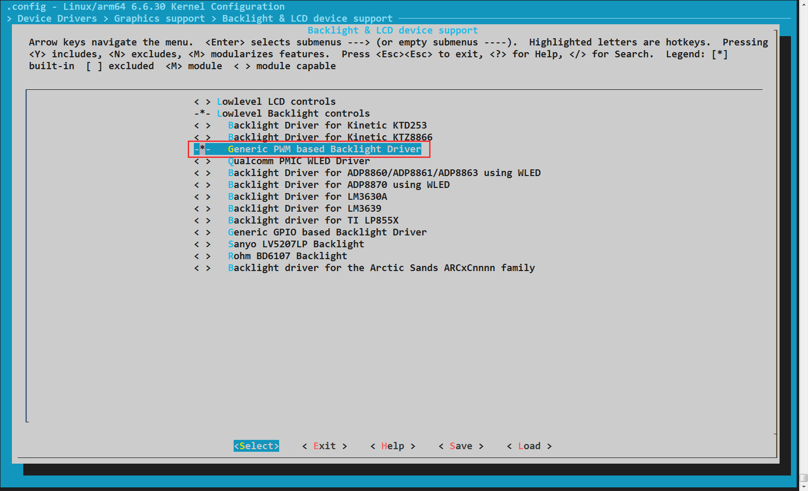

#### defconfig设置

```
CONFIG_BACKLIGHT_CLASS_DEVICE=y
```

#### board.dts配置

```
/ {
    backlight0: backlight0 {
        compatible = "pwm-backlight";
        status = "okay";
        brightness-levels = <
              0   1   2   3   4   5   6   7
              8   9  10  11  12  13  14  15
             16  17  18  19  20  21  22  23
             24  25  26  27  28  29  30  31
             32  33  34  35  36  37  38  39
             40  41  42  43  44  45  46  47
             48  49  50  51  52  53  54  55
             56  57  58  59  60  61  62  63
             64  65  66  67  68  69  70  71
             72  73  74  75  76  77  78  79
             80  81  82  83  84  85  86  87
             88  89  90  91  92  93  94  95
             96  97  98  99 100 101 102 103
            104 105 106 107 108 109 110 111
            112 113 114 115 116 117 118 119
            120 121 122 123 124 125 126 127
            128 129 130 131 132 133 134 135
            136 137 138 139 140 141 142 143
            144 145 146 147 148 149 150 151
            152 153 154 155 156 157 158 159
            160 161 162 163 164 165 166 167
            168 169 170 171 172 173 174 175
            176 177 178 179 180 181 182 183
            184 185 186 187 188 189 190 191
            192 193 194 195 196 197 198 199
            200 201 202 203 204 205 206 207
            208 209 210 211 212 213 214 215
            216 217 218 219 220 221 222 223
            224 225 226 227 228 229 230 231
            232 233 234 235 236 237 238 239
            240 241 242 243 244 245 246 247
            248 249 250 251 252 253 254 255>;
        default-brightness-level = <73>;
        enable-gpios = <&pio PJ 26 GPIO_ACTIVE_HIGH>;
        pwms = <&pwm0 4 25000 0>;
    };
};

&pio {
        ...

        pwm0_4_pins_active: pwm0@0 {
                pins = "PD22";
                function = "pwm0_4";
        };

        pwm0_4_pins_sleep: pwm0@1 {
                pins = "PD22";
                function = "gpio_in";
                bias-pull-down;
        };

        ...
};

&pwm0_4 {
        pinctrl-names = "active", "sleep";
        pinctrl-0 = <&pwm0_4_pins_active>;
        pinctrl-1 = <&pwm0_4_pins_sleep>;
        status = "okay";
};
```

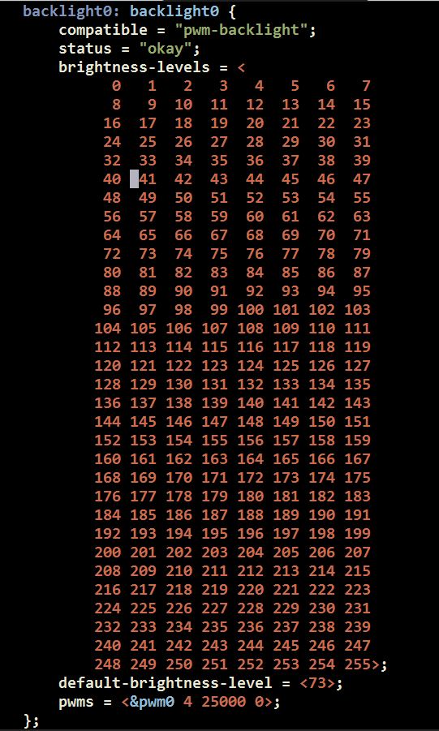

:::note

:::note

背光属性介绍

:::

:::

| 属性 | 介绍 |
| --- | --- |
| compatible | 匹配pwm驱动，必须为"pwm-backlight" |
| status | 开启驱动，必须为"okay" |
| brightness-levels | 背光线性值表，总共256个值， |
|  | 无特殊要求按照0-255填写即可，有非线性要求可按需求自行修改中间值 |
| default-brightness-level | 背光默认值，即背光开启后的默认亮度值 |
| enable-gpios | 背光使能pin，根据实际原理图配置 |
| pwms | pwm通道配置，根据实际原理图配置， |
|  | 四个参数依次为：使用哪组pwm pwm号 pwm波周期 pwm波极性 |
|  | 如无特殊需求pwm周期按照模板配置25000，极性按照模板配为为0 |

:::note

:::note

备注

:::
:::note

1.  适配背光节点前，如dts中没有对应pwm节点的配置，需要手动加上pwm节点配置，完成pwm的pinctrl引用，具体可以从同个dts中别的pwm节点拷贝修改而来，具体可以参考上文例子。
2.  完成背光节点的增添后，还需确保背光节点被屏节点正确引用，即在屏幕节点下要添加以下属性： backlight = &lt;&xxxxx>; xxxx为添加的背光节点名。

:::

:::

#### uboot-board.dts配置

将board.dts的背光配置拷贝即可

### RGB接口开发配置

RGB屏幕适配主要包括menuconfig配置、dts配置和时序参数计算三大部分。以下是详细的配置步骤和说明：

#### menuconfig配置

RGB屏幕适配首先需要在menuconfig中启用相关选项，具体配置如下：

##### RGB控制器配置

```
Allwinner BSP  --->
    Device Drivers  --->
        DRM Drivers  --->
            [*]   Support RGB Output
```

##### RGB屏配置

```
Allwinner BSP  --->
    Device Drivers  --->
        DRM Drivers  --->
            sunxi drm panels select  --->
                <*> rgb general drm panel
```

##### defconfig设置

配置完成后，对应的defconfig选项如下：

```
CONFIG_AW_DRM=y
CONFIG_AW_DRM_RGB=y
CONFIG_PANEL_RGB_GENERAL=y
CONFIG_DRM=y
```

#### dts配置

dts配置是RGB屏幕适配的核心，包括显示核心组件、背光、PWM、panel和接口配置等。

##### 显示核心组件配置（dtsi）

显示核心组件配置位于 dtsi 文件中，包含 DRM 核心、DE 显示引擎、VO、TCON LCD 控制器和 RGB 控制器等。  
该部分为平台通用配置，**基本固定、无需修改**，下文仅作原理性介绍，方便了解整体框架。

```c
/* DRM核心节点 */
sunxi_drm: sunxi-drm {
    compatible = "allwinner,sunxi-drm";
    fb_base = <0>;
    status = "okay";
};

/* DE显示引擎配置 */
de: de@5000000 {
    compatible = "allwinner,display-engine-v203";
    reg = <0x0 0x5000000 0x0 0x400000>;
    interrupts-extended = <&plic0 87 IRQ_TYPE_LEVEL_HIGH>;
    clocks = <&ccu CLK_DE>, <&ccu CLK_BUS_DE>;
    clock-names = "clk_de", "clk_ahb_de";
    resets = <&ccu RST_BUS_DE>;
    reset-names = "rst_bus_de";
    assigned-clocks = <&ccu CLK_DE>;
    assigned-clock-parents = <&ccu CLK_PLL_PERI_480M>;
    assigned-clock-rates = <480000000>;
    sys = <&vo0>;
    status = "disabled";
    ports {
        #address-cells = <1>;
        #size-cells = <0>;
        disp0: port@0 {
            reg = <0>;
            #address-cells = <1>;
            #size-cells = <0>;
            disp0_out_tcon0: endpoint@0 {
                reg = <0>;
                remote-endpoint = <&tcon0_in_disp0>;
            };
        };
    };
};

/* VO（Video Output）配置 */
vo0: vo0@5a00000 {
    compatible = "allwinner,tcon-top0";
    reg = <0x0 0x05a00000 0x0 0xfff>;
    clock-names = "clk_ahb", "clk_ahb_gate";
    reset-names = "rst_bus_dpss_top", "rst_bus_reg";
    status = "disabled";
};

/* TCON LCD控制器配置 */
dlcd0: tcon0@5461000 {
    compatible = "allwinner,tcon-lcd";
    reg = <0x0 0x05461000 0x0 0x1000>;
    interrupts-extended = <&plic0 90 IRQ_TYPE_LEVEL_HIGH>;
    clocks = <&ccu CLK_TCONLCD>, <&ccu CLK_BUS_TCONLCD>;
    clock-names = "clk_tcon", "clk_bus_tcon";
    resets = <&ccu RST_BUS_TCONLCD>;
    reset-names = "rst_bus_tcon";
    top = <&vo0>;
    status = "disabled";
    ports {
        #address-cells = <1>;
        #size-cells = <0>;
        tcon0_in: port@0 {
            #address-cells = <1>;
            #size-cells = <0>;
            reg = <0>;
            tcon0_in_disp0: endpoint@0 {
                reg = <0>;
                remote-endpoint = <&disp0_out_tcon0>;
            };
        };
        tcon0_out: port@1 {
            #address-cells = <1>;
            #size-cells = <0>;
            reg = <1>;
            tcon0_out_rgb0: endpoint@2 {
                reg = <2>;
                remote-endpoint = <&rgb0_in_tcon0>;
            };
        };
    };
};

/* RGB控制器配置 */
rgb0: rgb0@1000 {
    compatible = "allwinner,rgb0";
    clock-names = "rgb_pclk";
    phy-names = "combophy0";
    status = "disabled";
    ports {
        #address-cells = <1>;
        #size-cells = <0>;
        rgb0_in: port@0 {
            #address-cells = <1>;
            #size-cells = <0>;
            reg = <0>;
            rgb0_in_tcon0: endpoint@0 {
                reg = <0>;
                remote-endpoint = <&tcon0_out_rgb0>;
            };
        };
    };
};
```

##### 背光配置

背光配置用于控制屏幕亮度，以下是通用的PWM背光配置示例：

```c
backlight0: backlight0 {
    compatible = "pwm-backlight";
    status = "okay";
    brightness-levels = <
          0   1   2   3   4   5   6   7
          8   9  10  11  12  13  14  15
         16  17  18  19  20  21  22  23
         24  25  26  27  28  29  30  31
         32  33  34  35  36  37  38  39
         40  41  42  43  44  45  46  47
         48  49  50  51  52  53  54  55
         56  57  58  59  60  61  62  63
         64  65  66  67  68  69  70  71
         72  73  74  75  76  77  78  79
         80  81  82  83  84  85  86  87
         88  89  90  91  92  93  94  95
         96  97  98  99 100 101 102 103
        104 105 106 107 108 109 110 111
        112 113 114 115 116 117 118 119
        120 121 122 123 124 125 126 127
        128 129 130 131 132 133 134 135
        136 137 138 139 140 141 142 143
        144 145 146 147 148 149 150 151
        152 153 154 155 156 157 158 159
        160 161 162 163 164 165 166 167
        168 169 170 171 172 173 174 175
        176 177 178 179 180 181 182 183
        184 185 186 187 188 189 190 191
        192 193 194 195 196 197 198 199
        200 201 202 203 204 205 206 207
        208 209 210 211 212 213 214 215
        216 217 218 219 220 221 222 223
        224 225 226 227 228 229 230 231
        232 233 234 235 236 237 238 239
        240 241 242 243 244 245 246 247
        248 249 250 251 252 253 254 255>;
    default-brightness-level = <255>;
    pwms = <&pwm0 9 25000 0>;
};
```

##### PWM配置

PWM配置用于为背光提供脉冲宽度调制信号，示例如下：

```c
&pwm0_9 {
    pinctrl-names = "active", "sleep";
    pinctrl-0 = <&pwm0_9_pins_active>;
    pinctrl-1 = <&pwm0_9_pins_sleep>;
    status = "okay";
};
```

##### 初始化/反初始化序列配置

通常RGB屏需要配置初始化和反初始化序列，用于在屏幕启动和关闭时发送特定命令，这样屏幕才能正常显示和休眠。

###### 序列格式

-   第一个字节：delay（延迟时间，单位为毫秒）
-   第二个字节：len（数据长度）
-   后续字节：data（具体的命令和数据）

示例：

```
05 02 05 5f  /* delay=5ms, len=2, data=05 5f */
0a 02 05 1f  /* delay=10ms, len=2, data=05 1f */
```

###### 协议模式

-   protocol-mode：0表示三线SPI（目前仅支持此模式）
-   三线SPI所需PIN脚：clk-gpios、data-gpios、cs-gpios

#### 显示时序参数计算

时序参数是RGB屏配置的核心，需要根据屏厂提供的参数计算得出。

##### 基本参数定义

| 参数名 | 含义 | dts配置项 |
| --- | --- | --- |
| X | 水平有效像素 | hactive |
| Y | 垂直有效像素 | vactive |
| HT | 水平总时间 | \-（由其他参数计算得出） |
| VT | 垂直总时间 | \-（由其他参数计算得出） |
| HBP | 水平后沿（包含同步脉冲） | \-（由其他参数计算得出） |
| VBP | 垂直后沿（包含同步脉冲） | \-（由其他参数计算得出） |
| HSPW | 水平同步脉冲宽度 | hsync-len |
| VSPW | 垂直同步脉冲宽度 | vsync-len |
| HFP | 水平前沿 | hfront-porch |
| VFP | 垂直前沿 | vfront-porch |

##### 计算公式

```
HT = hactive + hfront-porch + hsync-len + hback-porch
VT = vactive + vfront-porch + vsync-len + vback-porch
HBP = hback-porch + hsync-len
VBP = vback-porch + vsync-len
```

##### 时钟频率计算

```
clock-frequency = HT * VT * 刷新率
```

#### RGB屏配置示例

根据RGB屏的类型（并行或串行），配置方式有所不同。以下是两种类型的完整配置示例：

##### 并行RGB屏示例

###### panel配置

```c
rgb_panel0: rgb_panel@0 {
    compatible = "sunxi-rgb";
    status = "okay";
    backlight = <&backlight0>;
    reg = <0>;
    display-timings {
        native-mode = <&rgb_timing0>;
        rgb_timing0: timing0 {
            clock-frequency = <33000000>;  /* 像素时钟频率 */
            hactive = <800>;               /* 水平有效像素 */
            hfront-porch = <25>;           /* 水平前沿 */
            hsync-len = <10>;              /* 水平同步脉冲宽度 */
            hback-porch = <46>;            /* 水平后沿 */
            vactive = <480>;               /* 垂直有效像素 */
            vfront-porch = <22>;           /* 垂直前沿 */
            vsync-len = <10>;              /* 垂直同步脉冲宽度 */
            vback-porch = <20>;            /* 垂直后沿 */
        };
    };
    port {
        rgb0_panel_in: endpoint {
            remote-endpoint = <&rgb0_panel_out>;
        };
    };
};
```

###### 接口配置

```c
/* DE显示引擎使能 */
&de {
    assigned-clock-rates = <600000000>;
    chn_cfg_mode = <0>;
    status = "okay";
};

/* video_out配置 */
&vo0 {
    status = "okay";
};

/* tcon配置 */
&dlcd0 {
    status = "okay";
};

/* rgb0接口配置 */
&rgb0 {
    status = "okay";
    pinctrl-names = "active", "sleep";
    pinctrl-0 = <&rgb24_pins_a> , <&rgb24_PD18_pin_a>;  /* 24位RGB引脚配置 */
    pinctrl-1 = <&rgb24_pins_b>;
    ports {
        port@1 {
            reg = <1>;
            rgb0_panel_out: endpoint@0 {
                reg = <0>;
                remote-endpoint = <&rgb0_panel_in>;
            };
        };
    };
};
```

##### 串行RGB屏示例

###### panel配置

```c
rgb_panel0: rgb_panel@0 {
    compatible = "sunxi-rgb";
    status = "okay";
    backlight = <&backlight0>;
    reg = <0>;
    
    /* 三线SPI引脚配置 */
    clk-gpios = <&pio PE 8 GPIO_ACTIVE_HIGH>;   /* SPI时钟引脚 */
    data-gpios = <&pio PH 11 GPIO_ACTIVE_HIGH>; /* SPI数据引脚 */
    cs-gpios = <&pio PH 12 GPIO_ACTIVE_HIGH>;   /* SPI片选引脚 */
    
    /* SPI协议模式：0表示三线SPI */
    protocol-mode = <0>;
    
    /* 屏幕初始化序列 */
    /* 格式：[delay(8位) len(8位) data...] */
    panel-init-sequence = [
        05 02 05 5f  /* delay=5ms, len=2, data=05 5f */
        0a 02 05 1f  /* delay=10ms, len=2, data=05 1f */
        32 02 05 5f  /* delay=50ms, len=2, data=05 5f */
        00 02 2b 01  /* delay=0ms, len=2, data=2b 01 */
        00 02 00 09  /* delay=0ms, len=2, data=00 09 */
        00 02 01 9f  /* delay=0ms, len=2, data=01 9f */
        00 02 04 0b  /* delay=0ms, len=2, data=04 0b */
        00 02 16 04  /* delay=0ms, len=2, data=16 04 */
    ];
    
    /* 屏幕退出序列 */
    panel-exit-sequence = [
        /* 可根据屏厂要求添加退出序列 */
    ];
    
    display-timings {
        native-mode = <&rgb_timing0>;
        rgb_timing0: timing0 {
            clock-frequency = <27000000>;  /* 像素时钟频率 */
            hactive = <320>;               /* 水平有效像素 */
            hfront-porch = <1325>;         /* 水平前沿 */
            hsync-len = <1>;               /* 水平同步脉冲宽度 */
            hback-porch = <70>;            /* 水平后沿 */
            vactive = <240>;               /* 垂直有效像素 */
            vfront-porch = <1>;            /* 垂直前沿 */
            vsync-len = <1>;               /* 垂直同步脉冲宽度 */
            vback-porch = <21>;            /* 垂直后沿 */
        };
    };
    port {
        rgb0_panel_in: endpoint {
            remote-endpoint = <&rgb0_panel_out>;
        };
    };
};
```

###### 接口配置

```c
/* DE显示引擎使能 */
&de {
    assigned-clock-rates = <600000000>;
    chn_cfg_mode = <0>;
    status = "okay";
};

/* video_out配置 */
&vo0 {
    status = "okay";
};

/* tcon配置 */
&dlcd0 {
    status = "okay";
};

/* rgb0接口配置 */
&rgb0 {
    status = "okay";
    pinctrl-names = "active", "sleep";
    pinctrl-0 = <&rgb8_pins_a> , <&rgb8_PD18_pin_a>;  /* 8位RGB引脚配置 */
    pinctrl-1 = <&rgb8_pins_b>;
    hv_mode = <8>;          /* 8位串行RGB模式 */
    hv_srgb_seq = <6>;      /* 串行RGB时序序列 */
    ports {
        port@1 {
            reg = <1>;
            rgb0_panel_out: endpoint@0 {
                reg = <0>;
                remote-endpoint = <&rgb0_panel_in>;
            };
        };
    };
};
```

#### 属性说明

##### RGB屏驱动属性

| 属性 | 介绍 |
| --- | --- |
| compatible | 匹配全志的rgb屏驱动，必须为"sunxi-rgb" |
| status | 开启驱动，必须为"okay" |
| powerX-supply | 可选，屏幕供电，最大支持三个供电，即X范围为0/1/2，根据实际原理图配置 |
| enableX-gpios | 可选，屏幕使能或供电使能，最大支持三个GPIO，即X范围为0/1/2，根据实际原理图配置 |
| backlight | 屏幕背光 |
| display-timings | LCD 时序参数，包含屏幕分辨率、同步信号、前沿、后沿等时序信息 |
| clock-frequency | 像素时钟频率，单位为Hz，根据屏幕刷新率和分辨率计算得出 |
| hactive | 水平有效像素数量 |
| hfront-porch | 水平前沿，即水平同步信号前的无效像素数 |
| hsync-len | 水平同步脉冲宽度，即水平同步信号的持续像素数 |
| hback-porch | 水平后沿，即水平同步信号后的无效像素数 |
| vactive | 垂直有效像素数量 |
| vfront-porch | 垂直前沿，即垂直同步信号前的无效行数 |
| vsync-len | 垂直同步脉冲宽度，即垂直同步信号的持续行数 |
| vback-porch | 垂直后沿，即垂直同步信号后的无效行数 |
| ports | 必须配置，连接关系配置， |
|  | remote-endpoint需引用rgb节点下的out子节点，参考软件dts连接关系章节 |
| clk-gpios | SPI时钟引脚， |
| data-gpios | SPI数据引脚， |
| cs-gpios | SPI片选引脚， |
| protocol-mode | SPI协议模式，0表示三线SPI， |
| panel-init-sequence | 屏幕初始化序列， |
| panel-exit-sequence | 屏幕退出序列， |
| hv\_mode | RGB数据宽度和模式。具体取值如下：  
\- 0：HV\_MODE\_PRGB\_1CYC - 并行RGB模式，1周期  
\- 8：HV\_MODE\_SRGB\_3CYC - 串行RGB模式，3周期（最常用的串行RGB模式）  
\- 10：HV\_MODE\_DRGB\_4CYC - Dummy RGB模式，4周期  
\- 11：HV\_MODE\_RGBD\_4CYC - RGB Dummy模式，4周期  
\- 12：HV\_MODE\_CCIR656\_2CYC - CCIR656模式，2周期 |
| hv\_srgb\_seq | 串行RGB时序序列，定义RGB数据的传输顺序，仅串行RGB屏需要。具体取值如下：  
\- 0：HV\_SRGB\_SEQ\_RGB\_RGB - 第一周期RGB，第二周期RGB  
\- 1：HV\_SRGB\_SEQ\_RGB\_BRG - 第一周期RGB，第二周期BRG  
\- 2：HV\_SRGB\_SEQ\_RGB\_GBR - 第一周期RGB，第二周期GBR  
\- 4：HV\_SRGB\_SEQ\_BRG\_RGB - 第一周期BRG，第二周期RGB  
\- 5：HV\_SRGB\_SEQ\_BRG\_BRG - 第一周期BRG，第二周期BRG  
\- 6：HV\_SRGB\_SEQ\_BRG\_GBR - 第一周期BRG，第二周期GBR（示例中使用的值）  
\- 8：HV\_SRGB\_SEQ\_GRB\_RGB - 第一周期GRB，第二周期RGB  
\- 9：HV\_SRGB\_SEQ\_GRB\_BRG - 第一周期GRB，第二周期BRG  
\- 10：HV\_SRGB\_SEQ\_GRB\_GBR - 第一周期GRB，第二周期GBR |

##### RGB模块属性

| 属性 | 介绍 |
| --- | --- |
| status | 开启驱动，必须为"okay" |
| pinctrl-names | 引脚状态名称，一般为"active"和"sleep" |
| pinctrl-0 | 引脚激活状态配置，根据实际硬件连接选择对应的引脚定义 |
| pinctrl-1 | 引脚休眠状态配置，根据实际硬件连接选择对应的引脚定义 |
| ports | 必须配置，连接关系配置， |
|  | remote-endpoint需引用rgb panel下的in子节点，参考软件dts连接关系章节 |

##### pinctl配置示例

| 应用场景 | 配置示例 |
| --- | --- |
| rgb0 24位引脚配置（并行RGB屏） | `pinctrl-0 = <&rgb24_pins_a> , <&rgb24_PD18_pin_a>;`  
`pinctrl-1 = <&rgb24_pins_b>;` |
| rgb0 8位引脚配置（串行RGB屏） | `pinctrl-0 = <&rgb8_pins_a> , <&rgb8_PD18_pin_a>;`  
`pinctrl-1 = <&rgb8_pins_b>;` |
| rgb1 24位引脚配置 | `pinctrl-0 = <&rgb1_24pins_a>;`  
`pinctrl-1 = <&rgb1_24pins_b>;` |
| PWM引脚配置 | `pinctrl-0 = <&pwm0_9_pins_active>;`  
`pinctrl-1 = <&pwm0_9_pins_sleep>;` |

#### 适配新屏幕步骤

1.  **确认硬件连接**：根据原理图确认RGB屏的硬件连接，包括引脚定义、供电方式和背光控制等。
    
2.  **获取屏厂参数**：从屏厂获取屏幕的详细参数，包括分辨率、刷新率、时序参数（HFP、HSYNC、HBP、VFP、VSYNC、VBP）等。
    
3.  **计算时序参数**：根据屏厂提供的参数，使用公式计算出clock-frequency和其他时序参数。
    
4.  **配置menuconfig**：按照上述menuconfig配置步骤，启用RGB相关选项。
    
5.  **修改dts文件**：
    
    -   根据屏幕类型（并行/串行），参考示例配置panel节点
    -   配置显示时序参数
    -   配置引脚和接口
    -   如果屏幕需要初始化，还需要配置初始化引脚和初始化/反初始化序列
6.  **编译测试**：编译内核并烧录到设备上测试，观察屏幕是否正常显示。
    
7.  **调试优化**：根据实际显示效果，调整时序参数和初始化序列，直到屏幕显示正常。
    

通过以上步骤，用户可以快速完成RGB屏的适配工作。在实际适配过程中，建议参考屏厂提供的详细文档，并结合实际硬件连接进行调整。

### MIPI-DSI开发配置

#### menuconfig配置

##### DSI控制器配置

```
Allwinner BSP  --->
    Device Drivers  --->
        DRM Drivers  --->
            [*]   Support DSI Output
```

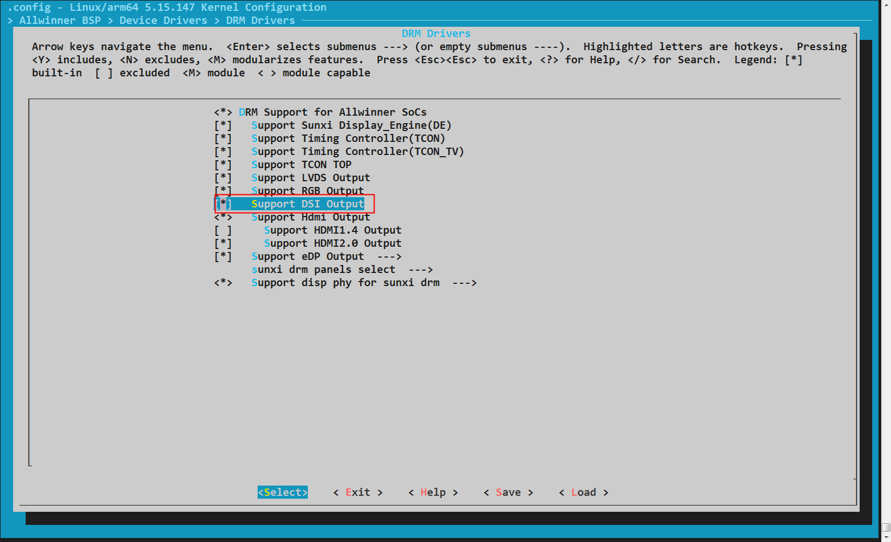

##### DSI屏配置

```c
Allwinner BSP  --->
    Device Drivers  --->
        DRM Drivers  --->
            sunxi drm panels select  --->
                <*> dsi general drm panel
```

##### defconfig设置

```
CONFIG_AW_DRM=y
CONFIG_AW_DRM_DSI=y
CONFIG_PANEL_DSI_GENERAL=y
CONFIG_DRM=y
```

#### board.dts配置

##### panel

单DSI panel 如下：

```c
        panel_0: panel_0@0 {
                compatible = "allwinner,panel-dsi";
                status = "okay";
            
                power-delay-ms = <10>;
                power-num = <2>;
                power0-supply = <&reg_dc1sw1>;
                power1-supply = <&reg_bldo2>;

                gpio-num = <2>;
                enable0-gpios = <&pio PH 9 GPIO_ACTIVE_HIGH>;
                enable1-gpios = <&pio PH 10 GPIO_ACTIVE_HIGH>;
                enable-delay-ms = <10>;
            
                reset-gpios = <&pio PD 21 GPIO_ACTIVE_HIGH>;
                reset-on-sequence = <1 10>, <0 20>, <1 100>;
                reset-off-sequence = <0 100>;

                backlight = <&backlight0>;
                dsi,flags = <(MIPI_DSI_MODE_VIDEO | MIPI_DSI_ASYNC_INCELL)>;
                dsi,lanes = <4>;
                dsi,format = <0>;
                panel-init-sequence = [
                        15 00 02 30 01
                        39 00 05 78 49 61 02 00
                        15 00 02 30 02
                        15 00 02 31 11
                        15 00 02 32 08
                        15 00 02 33 24
                        15 00 02 3d 42
                        15 00 02 3e ff
                        15 00 02 3f 30
                        15 00 02 42 81
                        15 00 02 43 30
                        15 00 02 44 21
                        15 96 02 11 00
                        15 32 02 29 00
                ];
                panel-exit-sequence = [
                        05 00 01 28
                        05 78 01 10
                ];

                display-timings {
                        native-mode = <&timing0>;
                        timing0: timing0 {
                                clock-frequency = <170422560>;
                                hback-porch = <28>;
                                hactive = <1200>;
                                hfront-porch = <40>;
                                hsync-len = <8>;
                                vback-porch = <38>;
                                vactive = <2000>;
                                vfront-porch = <180>;
                                vsync-len = <8>;
                        };
                };
                port {
                        panel0_in: endpoint@0 {
                                reg = <0>;
                                remote-endpoint = <&panel_output_0>;
                        };
                };
        };
```

dual-dsi panel 如下：

```c
        panel_0: panel_0@0 {
                compatible = "allwinner,panel-dsi";
                status = "okay";
                reg = <0>;

                power-delay-ms = <10>;
                power-num = <2>;
                power0-supply = <&reg_dc1sw1>;
                power1-supply = <&reg_bldo2>;
                gpio-num = <1>;
                enable0-gpios = <&pio PD 23 GPIO_ACTIVE_HIGH>;
                enable-delay-ms = <10>;
                
                reset-gpios = <&pio PD 21 GPIO_ACTIVE_HIGH>;
                reset-on-sequence = <1 10>, <0 20>, <1 100>;
                reset-off-sequence = <0 100>;
        
                backlight = <&backlight0>;
                dsi,flags = <(MIPI_DSI_MODE_VIDEO | MIPI_DSI_SLAVE_MODE)>;
                dsi,lanes = <4>;
                dsi,format = <0>;
                panel-init-sequence = [
                        05 78 01 11
                        05 14 01 29
                ];

                panel-exit-sequence = [
                        05 00 01 28
                        05 78 01 10
                ];

                display-timings {
                        native-mode = <&timing0>;
                        timing0: timing0 {
                                clock-frequency = <268627200>;
                                hback-porch = <48>;
                                hactive = <2560>;
                                hfront-porch = <80>;
                                hsync-len = <32>;
                                vback-porch = <31>;
                                vactive = <1600>;
                                vfront-porch = <9>;
                                vsync-len = <6>;

                        };
                };
                port {
                        panel0_in_0: endpoint@0 {
                                reg = <0>;
                                remote-endpoint = <&dsi0_panel_output_0>;
                        };
                        panel0_in_1: endpoint@1 {
                                reg = <1>;
                                remote-endpoint = <&dsi1_panel_output_0>;
                        };
                };
    };
```

:::note

:::note

DSI屏驱动属性介绍

:::

:::

| 属性 | 介绍 |
| --- | --- |
| compatible | 匹配全志的DSI屏驱动，必须为"allwinner,panel-dsi" |
| status | 开启驱动，必须为"okay" |
| powerX-supply | 可选，屏幕供电，默认支持三个供电，即X范围为0/1/2，根据实际原理图配置 |
| power-num | 可选，默认是3，即控制powerX-supply的X，可根据实际原理图配置数量。 |
| power-delay-ms | 可选，powerX-supply 之间的开启间隔，根据屏幕实际上电时序配置 |
| enableX-gpios | 可选，屏幕使能或供电使能，默认支持三个GPIO，即X范围为0/1/2，根据实际原理图配置 |
| gpio-num | 可选，默认是3，即控制enableX-gpios的X，可根据实际原理图配置数量。 |
| enable-delay-ms | 可选，enableX-gpios 之间的拉高间隔，根据屏幕实际上电时序配置 |
| reset-gpios | 可选，屏幕复位，根据实际原理图配置 |
| reset-on-sequence | 可选，屏幕上电时，复位引脚的电压连续变化情况，根据屏幕实际上电时序配置 |
|  | &lt;1 10>, &lt;0 20>, &lt;1 100>; 意思是 拉高10ms -> 拉低 20ms -> 拉高 100ms -> 发送 panel-init-sequence 指令 |
| reset-off-sequence | 可选，屏幕下电时，复位引脚的电压连续变化情况，根据屏幕实际下电时序配置 |
|  | &lt;0 100>； 意思是拉低100ms -> 关闭powerX-supply 电 |
| backlight | 屏幕背光 |
| panel-id-value | 屏幕id寄存器和值，使用多屏兼容必配屏幕id寄存器和值，使用多屏兼容必配 |
| dsi,flags | DSI模式配置，具体参数配置方 式参考下文说明。 |
| dsi,lanes | Lane Number（1 ~ 4） |
| dsi,format | Pixel Format |
| panel-init-sequence | 屏的上电初始化序列，具体参数配置方式参考Command说明。 |
| panel-exit-sequence | 屏的下电初始化序列，具体参数配置方 式参考Command说明。 |
| panel-timings | LCD 时序参数，按屏规格书填写。 |
| port | 必须配置，连接关系配置， |
|  | remote-endpoint需引用dsi/panel节点下的out子节点,参考软件dts连接关系章节 |

###### dsi,flags

MIPI\_DSI\_MODE\_VIDEO 必须有，其它模式可进行叠加，支持如下模式：

 MIPI\_DSI\_MODE\_VIDEO\_BURST：burst 模式，必选；

 MIPI\_DSI\_SYNC\_INCELL：incell 屏时，lcd 驱动上电完成后等待tp初始化完成后再送显示，必选；

 MIPI\_DSI\_ASYNC\_INCELL：incell 屏时，lcd 驱动上电完成后，只通知tp，不等待tp初始化完成就直接送显示，必选；

 MIPI\_DSI\_SLAVE\_MODE：**dual-dsi 、使用dsc 时**，必选；

 MIPI\_DSI\_CLOCK\_NON\_CONTINUOUS：使能DSI 非连续时钟；

 MIPI\_DSI\_MODE\_NO\_EOT\_PACKET：使能 EOTP（EoT packet）特性；

###### Command

```c
panel-init-sequence = [
    ...
    39 00 05 78 49 61 02 00
    15 00 02 30 02
    15 00 02 31 11
    15 00 02 32 08
    15 00 02 33 24
    ...
    15 96 02 11 00
    15 32 02 29 00
];

panel-exit-sequence = [
    05 00 01 28
    05 78 01 10
];
```

格式说明：头部 3 个字节（16 进制），分别代表 Data Type，Delay，Payload Length。

从第四个字节开始的数据代表长度为 Length 的 Payload。

例如：

```c
39 00 05 78 49 61 02 00
```

解析如下:

Data Type：0x39 (DCS Long Write)

Delay：0x00 (0 ms)

Payload Length：0x05 (4 Bytes)

Payload：0x78 0x49 0x61 0x02 0x00 (0x78 是要写入的寄存器地址)

**Data Type**

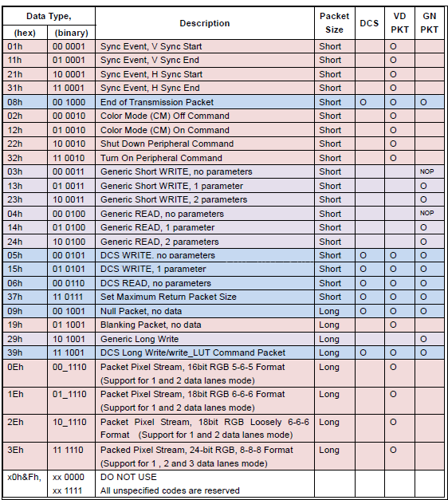

1、DCS Write

DCS packet 包括一个字节的 dcs 命令，以及 n 个字节的 parameters。

如果 n &lt; 2，将以 Short Packet 的形式对 Payload 进行打包。n = 0，表示只发送 dcs 命令，不带参数，Data Type 为 0x05；n = 1，表示发送 dcs 命令，带一个参数，Data Type 为 0x15。

如果 n >= 2，将以 Long Packet 的形式对 Payload 进行打包。此时发送 dcs 命令，带 n 个参数，Data Type 为 0x39。

2、Generic Write

Gerneic Packet 包括 n 个字节的 parameters。

如果 n &lt; 3，将以 Short Packet 的形式对 Payload 进行打包。n = 0，表示 no parameters， Data Type 为 0x03；n = 1，表示 1 parameter，Data Type 为 0x13；n = 2，表示 2 parameters，Data Type 为 0x23。

如果 n >= 3，将以 Long Packet 的形式进行对 Payload 打包，表示 n parameters，Data Type 为 0x29。

###### DCS

使用的平台支持dsc时，dsc 使用配置如下：

```c
panel_1: panel_1@0 {
    compatible = "allwinner,panel-dsi";
    status = "okay";

    dsc,status = "okay";
    dsc,slice-height = <8>;
    dsc,slice-width = <600>;
    dsc,bits-per-component = <8>;
    dsc,block-pred-enable = <0>;
    dsi,flags = <(MIPI_DSI_MODE_VIDEO | MIPI_DSI_SLAVE_MODE)>;
    dsi,lanes = <4>;
    dsi,format = <0>;

    display-timings {
        native-mode = <&panel1_timing0>;
        panel1_timing0: panel1_timing0 {
            clock-frequency = <351000000>;
            hback-porch = <120>;
            hactive = <1200>;
            hfront-porch = <180>;
            hsync-len = <72>;
            vback-porch = <200>;
            vactive = <2000>;
            vfront-porch = <250>;
            vsync-len = <30>;
        };
    };
};
```

:::note

:::note

dsc模块属性介绍

:::

:::

| 属性 | 介绍 |
| --- | --- |
| dsc,status | 开启dsc模块，必须为"okay" |
| dsc,slice-height | 图像在压缩过程中每个切片的高度，具体配置多少咨询屏厂 |
| dsc,slice-width | 图像在压缩过程中每个切片的宽度，具体配置多少咨询屏厂 |
| dsc,bits-per-component | 像素压缩后的位深：8/10/12 |
| dsc,block-pred-enable | 块预测启用配置，是否开启咨询屏厂  
开启：1；关闭：0 |

pps 可以不用填入 dts 中，驱动会自行按照协议计算具体的pps 发给屏端的。

##### dsi

:::note

:::note

dsi模块属性介绍

:::

:::

| 属性 | 介绍 |
| --- | --- |
| status | 开启驱动，必须为"okay" |
| ports | 必须配置，连接关系配置， |
|  | remote-endpoint需引用dsi panel下的in子节点，参考软件dts连接关系章节 |

###### dsi0接口

```c
&dsi0 {
    status = "okay";
    pinctrl-0 = <&dsi0_4lane_pins_a>;
    pinctrl-1 = <&dsi0_4lane_pins_b>;
    pinctrl-names = "active","sleep";

    ports {
        dsi0_out: port@1{
            dsi_out_panel: endpoint {
                    remote-endpoint = <&panel_input>;
            };
        };
    };
    panel: panel@0 {
        compatible = "allwinner,virtual-panel";
        status = "okay";
        reg = <0>;
        ports {
            panel_in: port@0 {
                reg = <0>;
                panel_input: endpoint@0 {
                    reg = <0>;
                    remote-endpoint = <&dsi_out_panel>;
                };
            };
            panel_out: port@1 {
                reg = <1>;
                panel_output_0: endpoint@0 {
                    reg = <0>;
                    remote-endpoint = <&panel0_in>;
                };
            };
        };
    };
};
```

###### dsi1接口

```c
&dsi1 {
    status = "okay";
    pinctrl-0 = <&dsi0_4lane_pins_a>;
    pinctrl-1 = <&dsi0_4lane_pins_b>;
    pinctrl-names = "active","sleep";

    ports {
        dsi1_out: port@1{
            dsi1_out_panel: endpoint {
                remote-endpoint = <&panel_input>;
            };
        };
    };
    panel: panel@0 {
        compatible = "allwinner,virtual-panel";
        status = "okay";
        reg = <0>;
        ports {
            panel_in: port@0 {
                reg = <0>;
                panel_input: endpoint@0 {
                    reg = <0>;
                    remote-endpoint = <&dsi1_out_panel>;
                };
            };
            panel_out: port@1 {
                reg = <1>;
                panel_output_0: endpoint@0 {
                    reg = <0>;
                    remote-endpoint = <&panel0_in>;
                };
            };
        };
    };
};
```

###### dual-dsi接口

```c
&dsi0 {
    status = "okay";
    pinctrl-0 = <&dsi0_4lane_pins_a>;
    pinctrl-1 = <&dsi0_4lane_pins_b>;
    pinctrl-names = "active","sleep";
    dual-channel = <&dsi1>;

    ports {
        dsi0_out: port@1{
            dsi0_out_panel: endpoint {
                remote-endpoint = <&dsi0_panel_input>;
            };
        };
    };
    dsi0_panel: panel@0 {
        compatible = "allwinner,virtual-panel";
        status = "okay";
        reg = <0>;
        ports {
            dsi0_panel_in: port@0 {
                reg = <0>;
                dsi0_panel_input: endpoint@0 {
                    reg = <0>;
                    remote-endpoint = <&dsi0_out_panel>;
                };
            };
            dsi0_panel_out: port@1 {
                reg = <1>;
                dsi0_panel_output_0: endpoint@0 {
                    reg = <0>;
                    remote-endpoint = <&panel0_in_0>;
                };
            };
        };
    };
};

&dsi1 {
    status = "okay";
    pinctrl-0 = <&dsi1_4lane_pins_a>;
    pinctrl-1 = <&dsi1_4lane_pins_b>;
    pinctrl-names = "active","sleep";

    ports {
        dsi1_out: port@1{
            dsi1_out_panel: endpoint {
                remote-endpoint = <&dsi1_panel_input>;
            };
        };
    };

    dsi1_panel: panel@0 {
        compatible = "allwinner,virtual-panel";
        status = "okay";
        reg = <0>;
        ports {
            dsi1_panel_in: port@0 {
                reg = <0>;
                dsi1_panel_input: endpoint@0 {
                    reg = <0>;
                    remote-endpoint = <&dsi1_out_panel>;
                };
            };
            dsi1_panel_out: port@1 {
                reg = <1>;
                dsi1_panel_output_0: endpoint@0 {
                    reg = <0>;
                    remote-endpoint = <&panel0_in_1>;
                };
            };
        };
    };
};
```

###### 多屏兼容

用来做兼容的屏必须要有屏ID，ID地址及ID值不能与其它屏有冲突，适配步骤如下：

**步骤1**：先单独点亮所有屏幕。

**步骤2**：panel\_X 节点中加上ID属性：panel-id-value = \[${id_reg} $\{id\_value\}\]; 查看uboot 打印读到屏端的具体值是多少： `dsi rx panel id 0x4: 0x99`；按照soc实际读回来的值更新dts中的 $\{id\_value\}，若对该值有疑问找屏厂咨询。

**步骤3**：在 virtual-panel 驱动设备树的 panel\_out 节点中按顺序0、1、2、... 依次添加 endpoint，其中 remote-endpoint 分别引用 panel\_X 下的 in 子节点；

**步骤4**：若想关闭某一兼容屏，只需修改该兼容屏节点 panel\_X 的 `status = "disabled";`即可，其它不用动。

参考配置如下：

```c
/ {
    panel_0: panel_0@0 {
        compatible = "allwinner,panel-dsi";
        status = "okay";
        panel-id-value = [04 66];
        ...
         
        port {
            panel0_in: endpoint@0 {
                reg = <0>;
                remote-endpoint = <&panel_output_0>;
            };
        };
    };
    
    
    panel_1: panel_1@0 {
        compatible = "allwinner,panel-dsi";
        status = "okay";
        panel-id-value = [04 99];
        ...
         
        port {
            panel1_in: endpoint@0 {
                reg = <0>;
                remote-endpoint = <&panel_output_1>;
            };
        };
    };
};

&dsi0 {
        status = "okay";
        pinctrl-0 = <&dsi0_4lane_pins_a>;
        pinctrl-1 = <&dsi0_4lane_pins_b>;
        pinctrl-names = "active","sleep";

        ports {
                dsi0_out: port@1{
                        dsi_out_panel: endpoint {
                                remote-endpoint = <&panel_input>;
                        };
                };
        };
        panel: panel@0 {
                compatible = "allwinner,virtual-panel";
                status = "okay";
                reg = <0>;
                ports {
                        panel_in: port@0 {
                                reg = <0>;
                                panel_input: endpoint@0 {
                                        reg = <0>;
                                        remote-endpoint = <&dsi_out_panel>;
                                };
                        };
                        panel_out: port@1 {
                                reg = <1>;
                                panel_output_0: endpoint@0 {
                                        reg = <0>;
                                        remote-endpoint = <&panel0_in>;
                                };
                                   panel_output_1: endpoint@1 {
                                        reg = <1>;
                                        remote-endpoint = <&panel1_in>;
                                };
                        };
                };
        };
};
```

##### tcon

使用 dsi0 和 dual-dsi 接口：

```c
&dlcd0 {
        status = "okay";
};
```

使用dsi1接口：

```c
&dlcd1 {
        status = "okay";
};
```

##### combophy

使用 dsi0 接口：

```
&dsi0combophy {
        status = "okay";
};
```

使用dual-dsi接口：

```
&dsi0combophy {
        status = "okay";
};

&dsi1combophy {
        status = "okay";
};
```

使用dsi1接口：

```
&dsi1combophy {
        status = "okay";
};
```

##### video\_out

dsi0、dsi1、dual-dsi0/1显示：

```c
&vo0 {
    status = "okay";
};
```

##### pinctl

1、dsi0

```c
pinctrl-0 = <&dsi0_4lane_pins_a>; 
pinctrl-1 = <&dsi0_4lane_pins_b>; 
```

2、dsi1

```c
pinctrl-0 = <&dsi1_4lane_pins_a>; 
pinctrl-1 = <&dsi1_4lane_pins_b>; 
```

#### 常见问题

1、使用 burst mode 时，屏幕无显示：

-   先用 video mode 把屏幕点亮

```c
dsi,flags = <(MIPI_DSI_MODE_VIDEO)>;
```

-   在video mode 能正常显示的基础上将 hfront-porch 加 200，然后再切换到 burst mode

```
dsi,flags = <(MIPI_DSI_MODE_VIDEO | MIPI_DSI_MODE_VIDEO_BURST)>;
```

2、重启样机屏幕概率无显示：

-   增加屏端reset次数或delay时间：

```c
reset-on-sequence = <1 10>, <0 20>, <1 10>;     ===》  reset-on-sequence = <1 20>, <0 30>, <1 50>;
```

-   在0x11、0x29指令之前及之后的指令增加0x0f延时，如下所示：

```c
1、    
panel-init-sequence = [
    ...
    15 0F 02 33 24
    15 96 02 11 00
    15 32 02 29 00
];

2、
panel-init-sequence = [
    ...
    15 0F 02 33 24
    15 96 02 11 00
    15 0F 02 32 08
    15 32 02 29 00
];

3、
panel-init-sequence = [
    ...
    15 0F 02 33 24
    15 96 02 11 00
    15 0F 02 32 08
    15 32 02 29 00
    15 0F 02 31 06
    ...
];
```

3、其它平台的屏参在AW无法点亮/花屏 或图像上下偏移

-   无法点亮/花屏：AW平台的hblank 相较 其它平台需要配大一点，自行将hbp 、hfp 加个 10 ~ 70 左右 ，还是不行找屏厂重新要套屏参；
-   图像上下偏移：vbp 配置太大导致。

### LVDS开发配置

#### menuconfig配置

##### lvds控制器配置

```c
Allwinner BSP  --->
    Device Drivers  --->
        DRM Drivers  --->
            [*]   Support LVDS Output
```

##### LVDS屏配置

```c
Allwinner BSP  --->
    Device Drivers  --->
        DRM Drivers  --->
            sunxi drm panels select  --->
                <*> lvds general drm panel
```

##### defconfig设置

```
CONFIG_AW_DRM=y
CONFIG_AW_DRM_LVDS=y
CONFIG_PANEL_LVDS_GENERAL=y
CONFIG_DRM=y
```

#### board.dts配置

##### panel

```c
lvds_panel: lvds_panel@0 {
    compatible = "sunxi-lvds";
    status = "okay";
    power-delay-ms = <10>;
    power0-supply = <&reg_dc1sw1>;
    power1-supply = <&reg_bldo2>;
    backlight = <&backlight0>;
    bus-format = <MEDIA_BUS_FMT_RGB888_1X7X4_SPWG>;
    enable0-gpios = <&pio PD 21 GPIO_ACTIVE_HIGH>;
    display-timings {
        native-mode = <&lvds0_timing0>;
        lvds0_timing0: timing0 {
            clock-frequency = <74871600>;
            hback-porch = <70>;
            hactive = <1280>;
            hfront-porch = <83>;
            hsync-len = <18>;
            vback-porch = <13>;
            vactive = <800>;
            vfront-porch = <37>;
            vsync-len = <10>;
        };
    };
    port {
        lvds_panel_in: endpoint {
            remote-endpoint = <&lvds_panel_out>;
        };
    };
};
```

:::note

:::note

LVDS屏驱动属性介绍

:::

:::

| 属性 | 介绍 |
| --- | --- |
| compatible | 匹配全志的LVDS屏驱动，必须为"sunxi-lvds" |
| status | 开启驱动，必须为"okay" |
| powerX-supply | 可选，屏幕供电，最大支持三个供电，即X范围为0/1/2，根据实际原理图配置 |
| enableX-gpios | 可选，屏幕使能或供电使能，最大支持三个GPIO，即X范围为0/1/2，根据实际原理图配置 |
| backlight | 屏幕背光 |
| bus-format | LVDS 信号的数据映射方式。  
MEDIA\_BUS\_FMT\_RGB888\_1X7X4\_ SPWG： vesa-24；  
MEDIA\_BUS\_FMT\_RGB888\_1X7X4\_ JEIDA： jeida-24 |
| panel-timings | 可选，用户自定义分辨率，驱动默认直接从EDID解析分辨率mode，配上后会追加用户自定义的mode |
| ports | 必须配置，连接关系配置，remote-endpoint需引用LVDS节点下的out子节点,参考软件dts连接关系章节 |

##### lvds

使用lvds0、lvds1、dual-lvds0+1接口：

```c
&lvds0 {
        status = "okay";
        dual-channel = <0>;
        pinctrl-0 = <&lvds0_pins_a>;
        pinctrl-1 = <&lvds0_pins_b>;
        pinctrl-names = "active","sleep";
        ports {
                port@1 {
                        reg = <1>;
                        lvds_panel_out: endpoint@0 {
                                reg = <0>;
                                remote-endpoint = <&lvds_panel_in>;
                        };
                };
        };
};
```

使用lvds2、lvds3、dual-lvds2+3接口：

```c
&lvds1 {
        status = "okay";
        dual-channel = <0>;
        pinctrl-0 = <&lvds2_pins_a>;
        pinctrl-1 = <&lvds2_pins_b>;
        pinctrl-names = "active","sleep";
        ports {
                port@1 {
                        reg = <1>;
                        lvds_panel_out: endpoint@0 {
                                reg = <0>;
                                remote-endpoint = <&lvds_panel_in>;
                        };
                };
        };
};
```

:::note

:::note

lvds模块属性介绍

:::

:::

| 属性 | 介绍 |
| --- | --- |
| status | 开启驱动，必须为"okay" |
| dual-channel | 选择显示接口；0: lvds0、lvds2 ； 1：dual-lvds0+1、 dual-lvds2+3； 2：lvds1、lvds3 ； |
| ports | 必须配置，连接关系配置，remote-endpoint需引用lvds panel下的in子节点,参考软件dts连接关系章节 |

##### tcon

使用lvds0、lvds1、dual-lvds0+1接口：

```c
&dlcd0 {
        status = "okay";
};
```

使用lvds2、lvds3、dual-lvds2+3接口：

```c
&dlcd2 {
        status = "okay";
};
```

##### combophy

使用lvds0接口：

```c
&dsi0combophy {
        status = "okay";
};
```

使用lvds1接口：

```c
&dsi0combophy {
        status = "okay";
};
```

使用dual-lvds0+1接口：

```c
&dsi0combophy {
        status = "okay";
};

&dsi1combophy {
        status = "okay";
};
```

lvds2、lvds3、dual-lvds2+3接口不需要combophy驱动。

##### video\_out

lvds0、lvds1、lvds0+1显示：

```c
&vo0 {
    status = "okay";
};
```

lvds2、lvds3、lvds2+3显示：

```c
&vo1 {
    status = "okay";
};
```

##### pinctl

1、lvds0

```c
pinctrl-0 = <&lvds0_pins_a>; 
pinctrl-1 = <&lvds0_pins_b>; 
```

2、lvds1

```c
pinctrl-0 = <&lvds1_pins_a>; 
pinctrl-1 = <&lvds1_pins_b>; 
```

3、dual-lvds0+1

```c
pinctrl-0 = <&lvds0_pins_a>, <&lvds1_pins_a>; 
pinctrl-1 = <&lvds0_pins_b>, <&lvds1_pins_b>; 
```

4、lvds2

```c
pinctrl-0 = <&lvds2_pins_a>; 
pinctrl-1 = <&lvds2_pins_b>; 
```

5、lvds3

```c
pinctrl-0 = <&lvds3_pins_a>; 
pinctrl-1 = <&lvds3_pins_b>; 
```

6、dual-lvds2+3

```c
pinctrl-0 = <&lvds2_pins_a>, <&lvds3_pins_a>; 
pinctrl-1 = <&lvds2_pins_b>, <&lvds3_pins_b>; 
```

#### 常见问题

1、显示颜色异常：

LVDS 信号的数据映射方式错误：修改bus-format 值为另外一个

2、屏幕上有异常条纹

用示波器查看date lane 波形是否异常。

### eDP开发配置

#### menuconfig配置

##### edp控制器配置

```
Allwinner BSP  --->
    Device Drivers  --->
        DRM Drivers  --->
            [*]   Support eDP Output  --->
                [ ]   Support HDCP For DisplayPort
                [*]   Support inno edp 1.3 controller
                [ ]   Support trilinear edp 1.4 controller
```

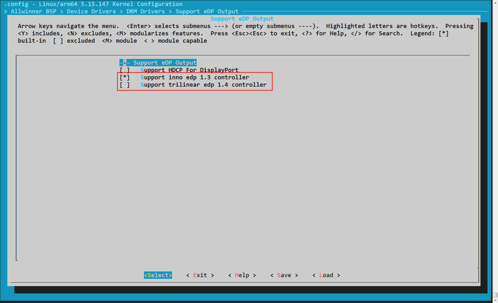

##### edp屏配置

```
Allwinner BSP  --->
    Device Drivers  --->
        DRM Drivers  --->
            sunxi drm panels select  --->
                <*> eDP general drm panel
```

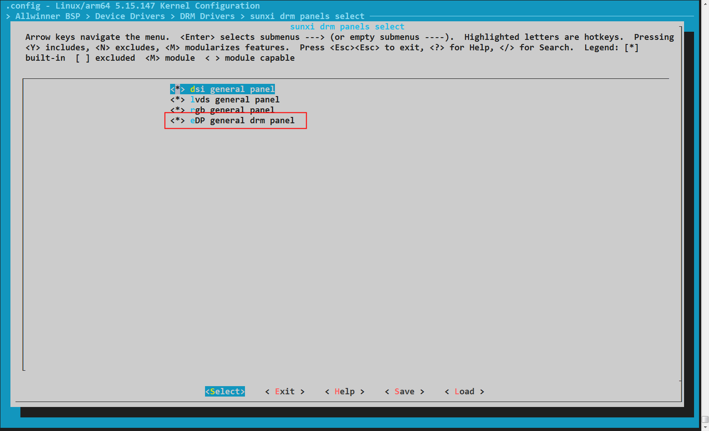

##### defconfig设置

```
CONFIG_AW_DRM=y
CONFIG_AW_DRM_EDP=y
CONFIG_AW_DRM_INNO_EDP13=y
CONFIG_PANEL_EDP_GENERAL=y
CONFIG_DRM=y
```

#### board.dts配置

##### panel

本节只介绍全志平台的edp屏驱动配置方法，如需使用其他屏驱动，需按照屏驱动要求进行配置，不必参考本章节。

```
edp_panel: edp_panel {
    compatible = "edp-general-panel";
    status = "okay";
    power0-supply = <&reg_dcdc4>;
    enable0-gpios = <&pio PI 2 GPIO_ACTIVE_HIGH>;

    backlight = <&edp_panel_backlight>;

    panel-timing {
        clock-frequency = <348577920>; /* pixel clock */
        hactive = <2560>;
        hback-porch = <120>;
        hfront-porch = <88>;
        hsync-len = <32>;
        vactive = <1600>;
        vback-porch = <71>;
        vfront-porch = <28>;
        vsync-len = <5>;
        /* hor_sync_polarity */
        hsync-active = <1>;
        /* ver_sync_polarity */
        vsync-active = <1>;
    };
    ports {
        #address-cells = <1>;
        #size-cells = <0>;
        panel_in: port@0 {
            #address-cells = <1>;
            #size-cells = <0>;
            reg = <0>;
            edp_panel_in: endpoint@0 {
                reg = <0>;
                remote-endpoint = <&edp_panel_out>;
            };
        };
    };
};
```

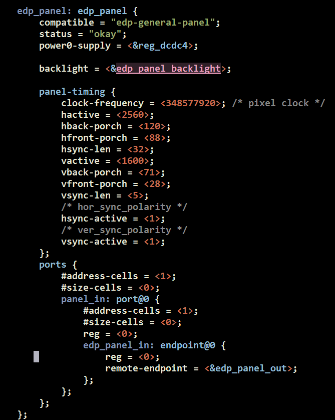

:::note

:::note

edp屏驱动属性介绍

:::

:::

| 属性 | 介绍 |
| --- | --- |
| compatible | 匹配全志的edp屏驱动，必须为"edp-general-panel" |
| status | 开启驱动，必须为"okay" |
| powerX-supply | 可选，屏幕供电，最大支持三个供电，即X范围为0/1/2，根据实际原理图配置 |
| enableX-gpios | 可选，屏幕使能或供电使能，最大支持三个GPIO，即X范围为0/1/2，根据实际原理图配置 |
| backlight | 可选，屏幕背光，如屏幕没有单独背光控制可以不配 |
| panel-timing | 可选，用户自定义分辨率， |
|  | 驱动默认直接从EDID解析分辨率mode，配上后会追加用户自定义的mode |
| ports | 必须配置，连接关系配置， |
|  | remote-endpoint需引用edp节点下的out子节点,参考软件dts连接关系章节 |

##### drm\_edp

```
&drm_edp {
    status = "okay";

    edp_colordepth = <8>; /* 6/8/10/12/16 */
    edp_color_fmt = <0>; /* 0:RGB  1: YUV444  2: YUV422 */

    vcc-edp-supply = <&reg_bldo3>;
    vdd-edp-supply = <&reg_dcdc2>;
    ports {
        edp_out: port@1 {
            #address-cells = <1>;
            #size-cells = <0>;
            reg = <1>;
            edp_panel_out: endpoint@0 {
                reg = <0>;
                remote-endpoint = <&edp_panel_in>;
            };
        };
    };
};
```

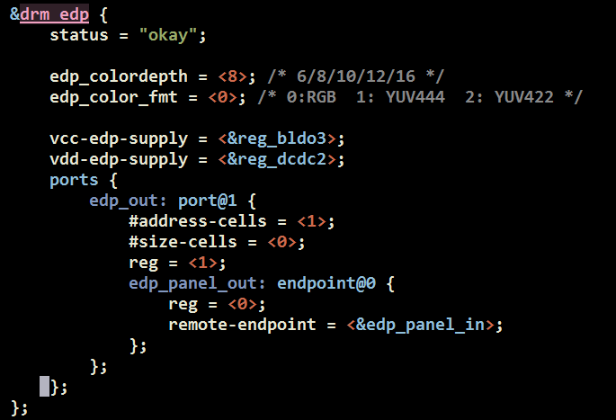

:::note

:::note

edp模块属性介绍

:::

:::

| 属性 | 介绍 |
| --- | --- |
| status | 开启驱动，必须为"okay" |
| edp\_colordepth | 必须配置，根据屏幕规格书配置屏幕的色深，常见色深有6/8/10/12/16 bit |
| edp\_color\_fmt | 必须配置，根据屏幕规格书配置屏幕的色彩空间，常见的有 RGB/YUV444/YUV422 |
| vcc-edp-supply | 可选，edp控制器供电，根据原理图SOC的edp模块实际供电配置 |
| vdd-edp-supply | 可选，edp控制器供电，根据原理图SOC的edp模块实际供电配置 |
| ports | 必须配置，连接关系配置， |
|  | remote-endpoint需引用edp panel下的in子节点，参考软件dts连接关系章节 |

##### tcon

eDP连接的TCON名字，可查询[硬件连接关系](#%E7%A1%AC%E4%BB%B6%E8%BF%9E%E6%8E%A5%E5%85%B3%E7%B3%BB)章节

```
&tv1 {
    status = "okay";
};
```

![edp\_tcon\_dts](data:image/png;base64,iVBORw0KGgoAAAANSUhEUgAAARsAAABcCAYAAABeBxFBAAAAAXNSR0IArs4c6QAAAARnQU1BAACxjwv8YQUAAAAJcEhZcwAADsMAAA7DAcdvqGQAAAfDSURBVHhe7d1PaxRJHMZxX4QLnozIogtewhIWhJibXrwISwISAvGQy4LkZlA8xUNOIoIoewh4Crnszdw95u6b8Og7qJ2e6a6uqn66pmumppPp+QofcH79J9Nk6klV9Z+5MfpnAKAHsggAuckiAOQmiwCQmywCQF77z7fMPbUAAHIibAD0RBYBIDdZBIDcZBEAcpNFAMhNFgEgN1mM+vbte2frd/64cuoYAPROFqNUqLRRjb9v6hgA9E4Wo1SotFGNv2/qGAD0ThajVKi0UY2/b+oYAPROFqPqMPlgdtbWzO3bt8fW1rbM4ekAw2bvs/n588fE5ZHZUOsAmEYWo8ZBcvrKbDpB0xY4XsN/9tH8+vrd/Hq979fn9sR8eT/ab7Hvr+fmy0N/uTqGztygIWyAechiVBEiJzuToFnbfGVOx8FS93I2D89F2DiBkC1s3JCp5AybdXN8WYbM2bZYDiCBLEa5YeMGi6rJYMgUNkev3ZCp5AybbXNW9mjO9tRyAAlkMaoIkdPDLb9nc7I7eR0Mo7YPzkUg+H4cPBmHQr1uMzBkWBXDsvdvzHb1/5Zt1TF0U4XNhTneUMsBJJDFqHGQtMzZ7JzUQZMaNusP35gfYa3iLLt45tQrhA1w3cliVBUkVe+msLa2a06ckKnUjb7bMMoOjaoeS8mGVlC3CBvgupPFqCJEqvmZOmyq4dNkorh6XTf6jnM2MjTqbRs9nsoCwmbj+GIyOfzzs9kTywEkkcWocH7Gnpka927mDJs7++ZiHBrOcMkOoZpBYmUMmzpkJpgcBrKQxSgbLjsfyuGSf3FfHTyznY2yQ6ZyvfC1tMCwuTxel+sBSCKLUc2wGQkmjKtldaPvHjZ1T+ajOXK2kxPDFYZRwHUni1HuxLB39qkcXrl1t9HX18UUIeIHgs8JmIMyeNomhisLCBsmiIGsZDFKDZtCzTmbERsIPjnpG6yr1pl+Wn0SauoYuiFsgIxkMWrSkzk3h5vhPE0RMHW9eN0lIPQZpnqiuG1imLABloosRtlhUwdhQFwFdQzdEDZARrIYpUKljWr8fVPH0A03YgIZyWKUCpU2enjTL3UMXYWnwXnEBDAzWYxSodJGNf6+qWNIwsOzgBxkMUqFShs1rOmbOgYAvZNFAMhNFgEgN1kEgNxkEQByk0VgoR69/cf8+9/Ip01zV7xW20xz98Xu3PvIYRHHNhCyiEJ1yjv3BX2L2u8SsQ3w7QP5ehbXLmwyHttAyCIWdvUwVyUXCJuVJIsgbBbKBkPZAKvX717caqzb1XUJm0Uc20DI4mDtnZUN3fIfjNW4PUFoPLlv48hcNtbzb95M3a99n8EVy7YugmrasV0nYQOMN8hbZudT2TuwnppHwXoybO5vmnd2m12zc9/Zxlum17H7DLcdc96X02tJO7aJ2O91QGRxgKo7uJW6USaHjQyaSh04iw2bbse2lGQg1F4+rtdths0D89KuG4RTdL9OsDjrNcLCLlNBlMD7DA36CQOyODz2/qbwl1k0VNUgOw53ig9KeL+U8+FpPr+4236Twib52LqxP6vNwu8Tc3s0blg4IeL0Yvywadu2VARFONxqCRY75xKs31ZPRtgMTPLNlPPMrcS2XWTYNNefx5WHTaxX8fjppKE7vQo3bHaqIEjqdehhkfpZbuC5vatZyd/r8MjiADmNvFODSQmbyDCmj7BJPrYlIRt5yQmiqrHbsHHEg8AdZgW8M0f1ejb07HsTvSa0kcXhcnsBjuZ3Q3ULhalzMb2ETanzsS2JWcPm01PzMjaEctdt44VNOESrh1CxSV80yOJqcBvnTKHgrOOFQmzbecLG6UFFth2LHls39j20WXTPSQRKpQ4LPYy62zKvM+EMl7xlLcOogn0vxc+r9i1CcEZtf1wGRhYHZ9wDCRudOzEnGmTd2NomWXVweL2dmfbr7qNax/lZwX5nObYurjxs5pogHtVsz2jECw8dKl5vJwwb772UGiE2I2+CWJ1UGIj951vmnlowMPHhTssZgJZhiTxF3UY19A77DT+ADWHYqHXGlvzshhsYDX7PohE2I/aM0YjbO3LrUiNsRoL3Ep8PSuN9jmb843DtrUrYFGSjnPLXWW3j/+UJehzlcrtdywdn+n5HglAaL69qwX5nObblISZyRa9ChU3YI6nnWJo9lWKZ3YcKm+jQbF4JQ+TlJYsAGuqwyT0x7P6xWNoJ/elkEYDH6Qll69XoXrFedxBkEUChMWeU7wyUHzazX+m9RGQRQMELGy7gm5MsAkBusggAuckiAOQmiwCQmywCQG6y2IF/jcCAL0QCkIcsdtC8IInAAdDqN1VMZG8iG/bt8QDm8fh3UUxlbxhciasgAczi7z9v6gUp7OMQpoeN7QUN985WAEqvYeM9o2XQT5EHEPrrpiimImwATCeLieoH/0y7RZ5hFLCyZDGdeqqcWg/AqpLFZOFjKQkbAAFZTFQPo6Zd2Mc1OcDKksU0M00Q0/sBVkqWb1foGjYjK/GVFQCa+g6bFfnKCgBNspgmIWxW5CsrADTJYpLpk74r95UVAJpksYOUAFm5r6wA0CSLHfDwLABJZBEAcpNFAMhNFgEgN1kEgNxkEQByk0UAyE0WASCvHF/lAgBTZfkqFwCYhrAB0Iu5Hy8BAN3IIgBkdMP8DzcFNWCmjrXYAAAAAElFTkSuQmCC)

:::note

:::note

edp tcon 模块属性介绍

:::

:::

| 属性 | 介绍 |
| --- | --- |
| status | 开启驱动，必须为"okay" |

##### video\_out

edp所属的video\_out名字，可查询[硬件连接关系](#%E7%A1%AC%E4%BB%B6%E8%BF%9E%E6%8E%A5%E5%85%B3%E7%B3%BB)章节。部分平台没有video\_out这一级，可以不用配置。

```
&vo0 {
    status = "okay";
};
```

![edp\_vo\_dts](data:image/png;base64,iVBORw0KGgoAAAANSUhEUgAAAR4AAABYCAYAAAAjv5gTAAAAAXNSR0IArs4c6QAAAARnQU1BAACxjwv8YQUAAAAJcEhZcwAADsMAAA7DAcdvqGQAAAhCSURBVHhe7d0/ixRJHMbxfREeGLmHiAomIiIIqxdp4gWCuCjLwhqYHMhmLorRGmwkIohygXCRmFzm5obmvgnDewd109Pd1fXn6Z7qnu4Zp/sbfIL5dU3vFLv9bFX1n9m6cWbLbG0BwAoRPABWjuABsHIHjx+Z3G1zUTUAgL4RPADWQBYBYEiyCABDkkUAGJIsAsCQZBEAhiSLSb5+/Zbs6u+X1071AcBayGISFTB1VBCsmuoDgLWQxSQqYOqoIFg11QcAayGLSVTA1FFBsGqqDwDWQhaTVMHy1uxub5tz587NbW/fNoefRhg8+x/Mz58/ct+PzHXVBkAKWUwyD5VPz82OEzp14aOCoG9HL76Z//5xvHlpHjrbVR+SuaFD8ADLksUkWaCc7Oahs73z3Hyah0w1+tk5/LKi4Dkwp27geL6YjzfzdqoPaa6a4+9F4Hx+KLYDaEkWk7jB44aMqsVh0Z9qpFOFzNWbL82PMnyKkY/qQ5qH5nMx0vm8r7YDaEkWk2SB8unwtj/iOdnLXwdTrYdPv8ThYN01H98UIfHiQNetd+bIe2812vnx9K5Tvxz9TNWHNGXwnJrj62o7gJZkMck8VGrWeHZPqtDJuCOQMCDcbaf345pi291/V9SCQAven7VXfUhD8AA9k8UkZaiUo57M9vaeOXECp5SFgZ0SBYu+dmRi6+5Ixx3hOGs5RdtqVFO1ixaZZ7KwU31IQ/AAPZPFJFmglOs5VfCUU6x8kbl8PQ8OOTqpQsaOhJpGR8E+vOCx23Kn9/1pmOpDiuvHp/nC8s8PZl9sB9CaLCYJ13PsGa75qEcEjzNiiadUThjVTZ+89vk+quBx2HWi5YKnCpwcC8tAb2QxiQ2a3bfFlMq/kLAKoeqslg2KIhzC13MtgqdqK9oHbVUfmoTB8/34qmwHoDVZTBIHz0yw2Fxui8MgW5Oppll2BCQCw9ZnqhFOETJO23Ba5k3DZq9VH1Iw1QJ6J4tJ3EVl7yxWMQVz61UgOGHztAiNYLG5zeKy39YZ8TiBVI6mVB/SsLgM9EwWk6ipVchf4ykEi8DRArJo46ufUsWq4FJ9SEPwAD2TxST5COeLOdwJ13WysKnq2WsbEnPOyEWt48h2hWh0VHJHPgXvYkSCB/iFyGISO7VK4AbAuqg+pCF4gJ7JYhIVMHVUEKya6kMabhIFeiaLSVTA1PGmQGui+pAqPLXOYzGApchiEhUwdVQQrJrqQys8CAzoiywmUQFTR019Vk31AcBayCIADEkWAWBIsggAQ5JFABiSLAIrcevVX+bvf2fe75jz4rV6zyLnn+wtvY8+DNG30bhxRhThK0+j933x4FD73SD2YHx1Rb7u4pcLnh77NhoEzyJDXbXM1dAZgmeiCJ5FCJ4h2ZAoDsby9esnZ6O2qX6V4Bmib6Mx1eDZ/1wc9Jb/kK/oFgkheiLh9SPzPWrn31jadr/2cwZXStu6CK1FffuVhAdj88F51uy+L0YN1j1zK2gng+fSjnlt37Nndi857/G26TZ2n+F755zP5Yxm2vUt1/R7HZXpBU95p7lSHaCtg0eGTqkKn2GDJ61vG0mGQ+XZnaptHDxXzDPbNgiqxv06IeO0i4LDblOh1IL3NzTyJyFMLnjs/VbhLzY7aNXBmTglyv5owvu3nD+k+HnNafttFTyt+5bG/qw6g9+35o503OBwAsUZ3fjBU/feQhYa4ZSsJmTsGk3Qvq7eGsEzYq1v9FxmLabpvUMGT9x+GWsPnqbRxp17+UHvjDbc4NktQ6HVaERPndTPcsPPHXV1JX+vYzS9qZZzwCcdPG2Cp2Gqs4rgad23DSEP+IITSuWBb4PH0RwK7lQs4J2BqtrZALSfTYymUG+qi8ve6MARf3dWWkAsXLtZSfAUkvu2IboGz/t75lnTNMttW8cLnnAaV02zmhaMIUw2eFzugdopIJw2XkA0vXeZ4HFGVg3vnWvsWxr7GeoMPaIS4VKqgkNPtc7XrAPlnCmVt61mqpWxnyX7eeW+RSB2VPePZnSmFjzzkUl4ALqLeuLgrA68ugVaHSLeKKjTft19lG2cnxXst0vfUqw9eJZaXJ7V7IhpxgsSHTDeKCgMHu+zFKJA68hbXFYnJEbk4PEjk7ttLqoGI9M8Jao5k1AzdZGnveuogz5hv+EfYyQMHtVmbsPPkrjhEfFHHFHwzNgzTzPuqMmtS1HwzASfpXn9qB3v76jjP4qNMLXgycgDdMF/bfUe/z9SMBIpttv31fwRLd7vTBBQ8+1lLdhvl75tDrEILEYbKnjCkUq1JhOPYLJtdh8qeBqnb8tqMY3ebLIIoFYVPH0vKrv/ODb2ZEAaWQQgOSOk3kY7erSs246GLAJwRWtM/Z3J8oOn+xXmG0YWAbi84OFiwR7IIgAMSRYBYEiyCABDkkUAGJIsAsCQZLEF/xqEkV/0BKAPB39c0BuSxRc/ET4AGs3v0/rzmvlNbWzJ3uA29lv6ASynvEn0zgWxsS17M+Nkrr4E0MWDIngeXDujG7RhH+GwOHjs6Gjcd+ACUNYSPN4zZkb+NH0AsXyqdc/08iRCggdAinnwLH1mq1Q9xGjRbf1MtYAJ6+uMlqWelqfaAZiuXkNnJnz0JsEDQJDFjqqp1qKLCLnmB5g0Weym0+IyoyJgcvKzWpkevmUiNXhmJvM1HgBi6wqeCX2NB4CYLHbTIngm9DUeAGKy2MniBeNJfo0HgJgsttAmTCb5NR4AYrLYAg8CA9CaLALAkGQRAIYkiwAwJFkEgCHJIgAMSRYBYDj9PQQMABLN79Pq+2FgANCkvEm0l6+3AYAU5bdMEDwAVmPL/A/1OjsuZ37azQAAAABJRU5ErkJggg==)

:::note

:::note

edp vo 模块属性介绍

:::

:::

| 属性 | 介绍 |
| --- | --- |
| status | 开启驱动，必须为"okay" |

##### combophy

edp模块使用的外部PHY名字，可查询[硬件连接关系](#%E7%A1%AC%E4%BB%B6%E8%BF%9E%E6%8E%A5%E5%85%B3%E7%B3%BB)章节。部分平台没有PHY这一级，可以不用配置。

```
&serdes {
    lane_invert = <1 1 1 1>;
    lane_remap = <2 3 0 1>;
    status = "okay";
};
```

![edp\_phy\_dts](data:image/png;base64,iVBORw0KGgoAAAANSUhEUgAAAXQAAAB5CAYAAAApito5AAAAAXNSR0IArs4c6QAAAARnQU1BAACxjwv8YQUAAAAJcEhZcwAADsMAAA7DAcdvqGQAABARSURBVHhe7d0/qyVFGgZwv4LZRDNi4sIFERmEgauBoMkYKDIXYRjQQANlMNJBnWgMxkREGEY2GNhALiYm4oSyhpNtYLofwHC/Qe/pP1X1VtVT1fWn+97uOs/CD3be7lO3uz3n6fdUn9PnucP/OiIiagIsVvv99z+TvfLCP5qFjg0R0UpgsRoK7hAUhK1Ax4aIaCWwWA0FdwgKwlagY0NEtBJYrIaCOwQFYSvQsSEiWgkszvig++Tf/+1+0P7o3jux10HBHYKCcG33vvqz+9+/Dr76EC5fijwmRe487v7++6/Rs3vddbQOEdEIFsNO7nffWGGOQx0FdwgKwrXtItBlmDPQiWgeLAbd+G4K8J/vdy8MNdOtf/PZq3o9FNwhKAjXtv1Af6V78GwK8vNbYDkRkQcWg1Sgy/BGNRTcISgI17b9QL/VnU+d+fkdtJyIyAOLQS989ofdob/zZPx3ZMrl4dm17urVq9q1a7e7h2K5DMBbH/8yBq3y/dfdLbF88O6P1jIdzqH13XUkEOhJ2zDxx/2xuyeWy2OXRwX60+7BdbSciMgDi2GBOfRP3rHXG8P6h+7smh3mKNTH8Hu7++l7NxwVOyR1oB/qT1FQWyH9YffUXS5Z62ZsQ3Rcs648JnkY6ESUDRajdJc+eNLdAOsMgf7w9hTeb3SfPzEd+Rj0dqCbrviX7qcbIDRl8OpAHz19d6ybMUygyg5arWfVxbhl2yDXVesz0InoUsBikL4oqqmpFnVxdPy3DPQh1E+/7J7oQLfJzvivj98W4ShCVk57iEC31vdC1oSxO64f6OXbEJuSQccwxfUHT8cLon8/7u6A5UREACxizny5Cfe+SweB/vsv3een/pSLG+7x6QtFTHkEu2PHja+7v6bHy+685wd65jaEpmeccIfHMcIE+YgXRIkoAyxCOsC/+2CquV8w6o1TMCqsB6JTl84e7jnQJ7JTF9Tfc4/hHDfQnz14Ba5HRATAIuQH+oF7kXRaZgW6JKdhzn4YarHpDqg60EV3nTDlkkyG+zSuPk6ZOOVCRAVgEZIXQ61PteipGFPvg/rJ52/o0NaefNmdTp98MYEeuiAZkBroMrj1VIgzVaIDPW8bhnXFYwfiBFIb6LwoSkQFYDEATbG4zBx6H+iqG3fJT76MgRif8ohf/AwzIR1ghXL6NsTHNduFj2MKBjoRZYPFiFe7935GIS7rf+iOHIW6f1FUBar9MUOpNNB7bvgO0y9qDLfLPkjahgMY6pUXRQ0GOhFlg8VqKqxTyJBsDTo2aRjoRJQNFquh4A5BQdgKdGzS8OZcRJQNFqu50ywx3rRFQ9CxSeV+hJG3zyWiGbBYDQV3CArCVqBjk4U/cEFE6WCxGppaCUFTFa1Ax4aIaCWwSERE+wOLRES0P7BIRET7A4tERLQ/sNiO6/e6Z/Kjf4P2bnh153zaN34ShuiYwWI7jiLQ1bdKe419s1R9bLPBL1e9f/Od7j+fCrdPupfBevme7764rcZ9s/viClqnxN7GPUqw2KSWb0nbZofe6rdlr3WPVIh7agJNBuMS4yl7G/eowWKTeI/xvdl7oPfB7QeU6czFsisn3W8q1Ao7da/jH9QH5HbG7Y/na937cBlNYLFJSYEOp2j8aQzVEQ+/KCS/zalqYl1l8a/yO393hPctdXvNNqKpm3DAJu2b+rvTMv2uwlnfGwvY/C85yYC2Qsp057+dPm895uXTNxNCLeLkNXMy6P9/zVjSJsa139U8Gn7HeJ5+jh3P/ZBgsUmzgQ7DXLEDzgojwP4tUBGEnop3CwWBHqK3VxwDLzTFMrN/Gfumt/dxd462Z3rR7T7QdTgduN12KLisE0B6YAUtGbzSpY5rT9G4J0SP9Xo+mruWwmKTkgLd7SwDAYe7S3FxUnQE5u/KJxVet9TcvuVsr17XORb6b8BuOmHfnBOQOimEt335KZe5E5u7z7msaYSb17zlpgs3Uwdo6mE2rOY0GeijuWOsMdDbNhd6GA4VEwz2WLqu1zWPd7tKFJCl5vYtfXsPdPDKFwHaj8x9E4FurQ//Xm9PgW53j6EO2wp0HWLqMeHpmGwNB/pAHrvINQf4/G4bLDYpLdDlRwAdKNCdAPCfQJHxtJwTDJYc6LPb2zPb7E/FBDrxILE9weAOWT7Q1yHnd+OBZAJd0F0mAz1rXGuaihdLJ7DYpLnQM8sDjibQxXhT3f33iIFuJM7vys7SDS8RUJxDnyGPY6RDP0Kw2KR46InwsEIPh0p6QJrHu9MSS1o60E1H3o9n9iF0sTdp3zYQ6Hp/Q5zjk2t2fleEthv6aH69WMOBnjyHfhB63jcMFpuUHOgiPMxj7HpOQJoxUoMs3+KBLkP8wRTu4EWRtW/ZgS62L7Bfucx4AUu88GX36IWz7ORFeMnpg5mQStJkoNd8ymXdhmpDYLEZViAj4gU8+2IvDPS5qYnSJ1rRviVt70QH8AhvZ8a+FQS6uw3K5l+c1vyuE1LWMld5dw7n5y1lY29j3MrPoffQc7w9sNiMnNCzuvRJHxx6jOJAd5Y5NhvoVljHQzhp30oC/QDt5+YDfdCHUKjjtLvNQWVn3nag9/rjmfu3xHOYgU5EtF+yGbCv/zQLFomIdgq/08brNgcW6cKlfARQWeYCIVGbZKAf3WsFFunCMdCJqBosEhHR/sAiERHtDywSEdH+wCIREe0PLBIR0f7AYjuc+znwUyJE1DBYbAcDnS4KukfLojfaWnjcA+/Xkha7FW3gJmS0NlhskvkaMAOdlgTuyyLVhCQKc6UqfO2bXdlqAhgdCwb6BYLFJjHQqV7ohlt+Xd58qvgHK/pAd7rxJcY1nbnYZvkOo/Bk4XX8g1igl9xwiyJgsUlJgQ6naPy7A6q7Cw73iEi6zSy4a6Bz58Ns6u9O41h3PAyMPbsN05jnd8TXp4d1InetW/GYbUrslriIWL/6J+UkMW5ZoJvuPPwjGwn7h/QnIHUymL3Huf0uIfuWuMdx98RcsNik2UCHwaTYARW6XawS+mUfX8W7BR2Kj7tztD3WEz5xG5ygDfF/axTJO2abDnU59ZHava4U6KYLLuxsQ0FrnbAq3lUos4Heq/nRirzbMB8JWGxSUqC7Hat4AsnAwd0w7mLN35VPwAXu0+yErwpZtJ/J2yDG7MdzH2d12f361ces/kZKcyeK0LuVVDk/eSZVd7ua3ckOKubPzXaZEwKaKqk+CSUF+ij5GDPQ58Bik2YDHRKBI4LXhIg9lq7rdc3j3Q5Ub09p4IjwtcbWdfWEz9gG9djp33r5tD9eoEMzx8zdX29786wX6Hb3mNWxym63+hMpINAHZR26FejyncfBo5PwdEy2jEAfyG2JnLD81xgJsNiktECP3PUwIZz8J1tkPK2sM00PwoxtUGNO26+OmQpwtX92oNcdM9l1bedHCGSI5nbY4rEVnXSQDL6Ck4W8qOqPc4mB3rOmfXixtAAsNmku0M3yAAa6F+hLHLNtBnovc353sHKYT6rm0a2u3Anb6guuwkodOkXBYpPigS6mCazAyZs+8AM9PN1RLTnQM7YhK9CXOWbmv8vWplxG6XPo4gSwciBVBXrkYi2aXy+WEejpxzj8PKIBLDYpOdBFCFkdaFGg1wdWUHKgZ2xDaaCXHjN5kavwBarHDVnihW91tSjsZDe/3FTB+zdBGMptKZqfl9sqxl903v8gKdAz3wVZF0UTGpTjA4vNsMIFES/22WAoDPS5KY/iJ2VGoCdvQ1agFx4zaOGT3Rqs+V0ZUnYoYWUhb3WunooTh7UvrvJx4fy8RY4tr1MUfA69Z73O6AAWm5ET6FbHOemDS49RHOjOMsfFBPpodhsyA73omLl29aLsQ8jtONcL9NDY1fPbAzB2ZWeeF+i9/njmHhvRnOzquXMhYJFocTrQl5gCoaMlm7RtXUTfBFgkWhwDncrhd4J43aMGi3ThUj5aqBR+zPGSMdCpnAz0fT7/Lwgs0oVjoBNRNVgkIqL9gUUiItofWCQiov2BRSIi2h9YJCKi/YFFolW8fv/T7p+/Hjw67V4E/0aPmfPiR7erx1jCGvtGlAkWj5vz9ffFrDXujuiQu38C/11ic4G+4L4RZYLFI4bvIFhvrXH3hYFOtCpYPGIM9DXp8J1CTv3724+ueOum2kqgr7FvRJlgsTn+nf7sb1vO3pXxwLt3hHNv5pF958PccUPfptR1cDKY27ctcUMuHnpXurNHU5er3exed9aDgf7Safetfszt7uwl8RhrGV5Hj+k+diC2S3Tfefs2iv13JSoAiw2JfaXeBF92oMMwV0yorxvoafu2SzB0jbtvmXX9QD/p7up1nRNAdFwR3mI9L5D1MhT2Gazn0A7uB097AIvtCN4zvA9DFHqJUyP9i9G9J4l4gfp3gksbNyvQs/ctjf5bIavfi0V25jKQRVCLbtwO9NBjJ30Yu1MzgfDWc+DO+qF6NgY6LQ8W26FDLzWIaua6Y49dM9D99WtceqDHuuO3bo5hKrpjGehnKmyzumc8hYL+ljypyHcJpeB/V6JysNgQEaRJoZQT6JEpj4sI9Ox92wkYpBMR9ipQdaAL8bCVUzIO6xMpZj19YtHbBrp/ossHi+2R3azg/+JJWvDOzo1fSKBPkvdtJ0oD/dHN7m5sukWuG2IFujudY6ZbYhc6iS4RLLZNBmBR8Ip1rOCNPbYm0MU7gchjB9F9S6O3IWTtdwAgtBUTyHjK5cXAPPtITK1YywJTLj29Lf3fU2ODE02h0AmcqBAsNmPopN1gkxejQOiZQAtdWMThbHXtRePKMdQ64m8545bsW4pLD/Sqi6KHmu7wD6yAxsFtde1uoFvbMvFOFIWsi6LoQjpRNlhsRnxqJPDJgsAUBvx4YQgK04Rx3Re5xw10tM5g55+akKHssTtkL9AP9CdRDmSXL+uQF+gHzrbE5+fzWM+jwhMwkQCLTYHBN9NlosfYHZTTOU/L9eMCL875cQ+c4B+Wq5ozbsm+7Qe4eAm6YxTobmdt5rz9jrtfpsdAgR6dxqmVMZ1GNA8WiUgzgb70xVB5Qt7tRWzaElgkooHo6BfrzvG7O7wuURZYJDpu3hz+cp9ssQO9/Bu9RAAsEh03K9D5JSLaDVgkIqL9gUUiItofWCQiov2BRSIi2h9YJCKi/YHFCPsztPwyBBHRZsBihP+lCIY6EdEmwGISfWMh3vqTiGgLYDGNvokUv+1GRLQBsJhG3+p1PtB1N887yhERrQUW06QGunWPb/66ORHRSmAxDQOdiGhLYDGRuTn/3O0/OeVCRLQ6WEyHfl0HrUdERGuDxWTuT6Ax0ImILg0sJjJTLnNfLuJn1omIVgeLaYouirKLJyJaCSymSQ30A92h93hhlIhoDbCYJiPQ5fQMA52IaBWwmCYj0OXFU97Mi4hoFbCYZP5Cp39nRs6fExGtBhYjckJarpsyLUNERBVgMYI/cEFEtFGwSERE+wOLRES0P7BIRET7A4tERLQ/sEhERPsDi0REtCvPdf8Hl7KO4crXFfMAAAAASUVORK5CYII=)

:::note

:::note

edp phy 模块属性介绍

:::

:::

| 属性 | 介绍 |
| --- | --- |
| status | 开启驱动，必须为"okay" |
| lane\_invert | 选配，配置信号的极性反转，若不配置默认不反转。四个参数分别代表lane0-lane4 |
| lane\_remap | 选配，配置线序，需根据原理图配置，若不配置则使用默认0123的线序。 |
|  | 四个参数分别代表lane0-lane4 |

### 各屏uboot-board.dts配置

将board.dts中对应的节点配置直接拷贝过去即可。

:::note

:::note

备注

:::
:::note

唯一需要注意的是：uboot-board.dts中关于GPIO的配置，不能使用"&lt;&pio PI 2 GPIO\_ACTIVE\_HIGH>"的配置方式，要使用"&lt;&pio PI 2 1 0 3 1>的配置方式"

:::

:::

### 开机logo

本章节通过描述配置 uboot-board.dts 文件,实现配置开机阶段logo显示

#### 单显

```
&sunxi_drm {
    route {
        disp0_lvds0 {
            logo,uboot = "bootlogo.bmp";
            status = "okay";
        };
    };
};
```

:::note

:::note

bootlogo route属性介绍

:::

:::

| 属性 | 介绍 |
| --- | --- |
| dispX\_YYY | 必须配置，配置想要的连接关系，disp0\_lvds0表示bootlogo通过de0渲染并 |
|  | 通过lvds0显示输出 |
| status | 开启驱动，必须为"okay" |
| logo,uboot | 选配，配置需要显示的bootlogo图片名，若不配置默认使用 |
|  | “bootlogo.bmp”，双显时配置不同名字可实现logo异显 |

#### 双显

增加一路route配置即可实现bootlogo双显。如以下例子配置de0渲染bootlogo.bmp图片通过lvds0显示，de1渲染bootlogo\_backup.bmp并通过edp显示，完成bootlogo双屏异显。

```
&sunxi_drm {
    route {
        disp0_lvds0 {
            logo,uboot = "bootlogo.bmp";
            status = "okay";
        };
        disp1_edp {
            logo,uboot = "bootlogo_backup.bmp";
            status = "okay";
        };
    };
};
```

#### 单双显

本节介绍单双显配置中的重点关注部分。

单显方案中只需要DE0处理图层数据，但双显方案中还需要DE1来处理副显的图层数据，因此在单双显中需要指定DE模块的硬件通道分配，以满足不同显示应用的需求。其中DE硬件通道分配的关键配置为de节点下的**chn\_cfg\_mode**。不同的配置对应显示场景如下：

:::note

:::note

chn\_cfg\_mode对应显示场景

:::

:::

| 平台 | chn\_cfg\_mode对应分配情况 |
| --- | --- |
| A523/A527/T527 | 0：单显 |
|  | 1：常规双显 |
|  | 3：双显，且主显分辨率大于2K |
|  |  |
| A733 | 0：单显 |
|  | 2：常规双显 |
|  |  |
| A537/A333 | 0：单显 |
|  | 1：常规双显 |

```
&de {
    chn_cfg_mode = <2>;
    status = "okay";
};
```

## 调试方法

### RGB显示

开启Colorbar

```shell
echo [param] > /sys/class/rgb/rgb/attr/colorbar
```

### DSI显示

开启Colorbar

```shell
echo [param] > /sys/class/dsi/dsi/attr/colorbar
```

### LVDS显示

开启Colorbar

```shell
echo [param] > /sys/class/lvds/lvds/attr/colorbar
```

### eDP显示

#### AUX通信失败

串口中看到“AUX”、“EDID”、“DPCD”相关的读取失败都是由于AUX通信失败引起。AUX通信失败一般是由于屏幕没有正常工作或者排线线序不对，导致没有应答，应根据[屏幕问题硬件checklist](#%E5%B1%8F%E5%B9%95%E9%97%AE%E9%A2%98%E7%A1%AC%E4%BB%B6checklist)检查屏幕相关电路贴片、供电、排线等硬件情况

### uboot通用调试方法

#### 确认驱动加载情况

开机后串口长按s键，可以停在uboot控制台，输入以下命令可以确认drm相关驱动加载情况

```
=> dm tree
 Class      Probed  Driver      Name
----------------------------------------
 root       [ + ]   root_drive  root_driver
 simple_bus [ + ]   generic_si  |-- soc@29000000
 video      [ + ]   sunxi_disp  |   |-- sunxi-drm
 vidconsole [ + ]   vidconsole  |   |   `-- sunxi-drm.vidconsole0
 misc       [ + ]   de          |   |-- de@5000000
 misc       [ + ]   tcon_top    |   |-- vo0@5500000
 misc       [   ]   tcon_top    |   |-- vo1@5510000
 misc       [ + ]   tcon        |   |-- tcon0@5501000
 phy        [ + ]   sunxi_dsi_  |   |-- phy@5507000
 display    [ + ]   sunxi_drm_  |   |-- lvds0@0001000
 misc       [   ]   tcon        |   |-- tcon3@5730000
 display    [   ]   sunxi_drm_  |   `-- hdmi@5520000
 backlight  [ + ]   pwm_backli  |-- backlight0
 panel      [ + ]   sunxi_lvds  `-- lvds_panel@0
```

### kernel通用调试方法

#### 确认驱动加载情况

-   确认drm组件是否正确注册

```
/ # ls /sys/class/drm/

card0              card0-HDMI-A-1     card0-Writeback-1
card0-DP-1         card0-LVDS-1       version
```

确认对应的显卡驱动，显示接口驱动是否正确注册

-   确认背光是否正确注册

```
/ # ls /sys/class/backlight/
backlight0     edp_backlight
```

## 常见问题

### disp 与 drm 屏参转化

由于disp 的 lcd\_hbp = hbp + hsync， lcd\_vbp = vbp + vsync；故转换关系如下：

-   clock-frequency = lcd\_ht \* lcd\_vt \* 60;
-   hback-porch = lcd\_hbp - lcd\_hspw;
-   hactive = lcd\_x;
-   hfront-porch = lcd\_ht - lcd\_x - lcd\_hbp;
-   hsync-len = lcd\_hspw;
-   vback-porch = lcd\_vbp - lcd\_vspw;
-   vactive = lcd\_y;
-   vfront-porch = lcd\_vt - lcd\_y - lcd\_vbp;
-   vsync-len = lcd\_vspw;

## 附录

### 屏幕问题硬件checklist

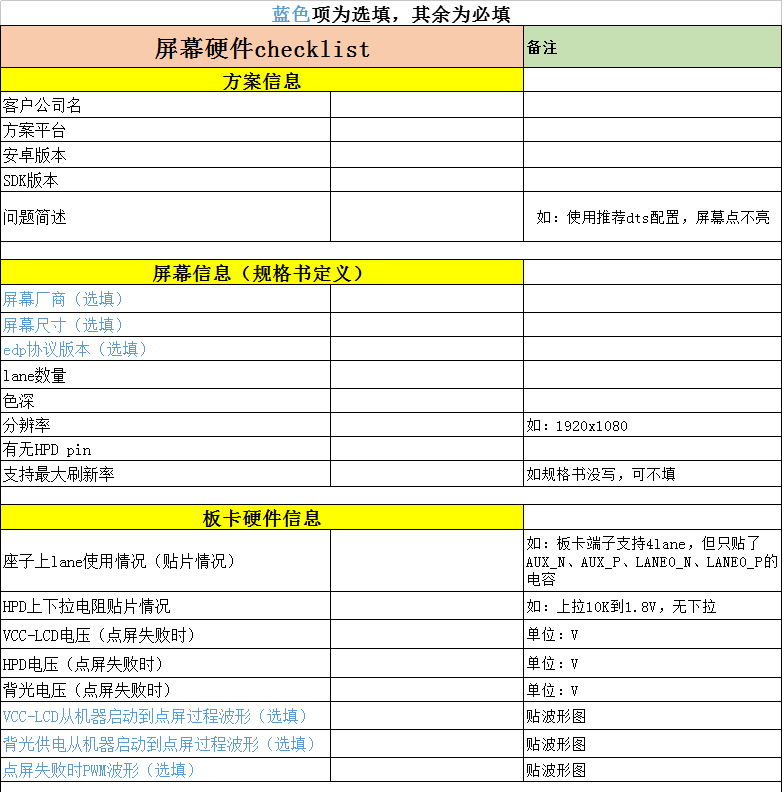

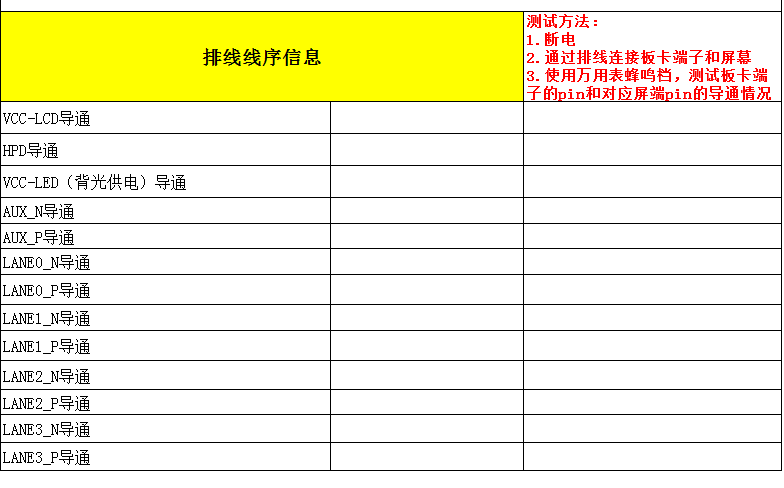
