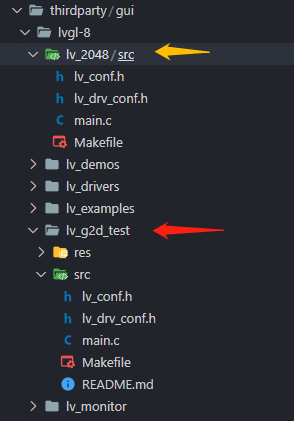
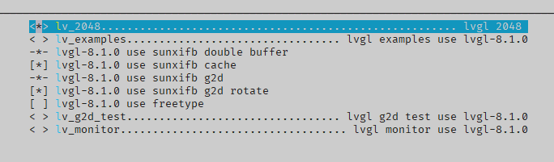
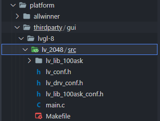
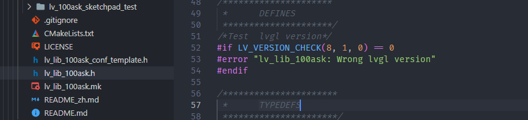
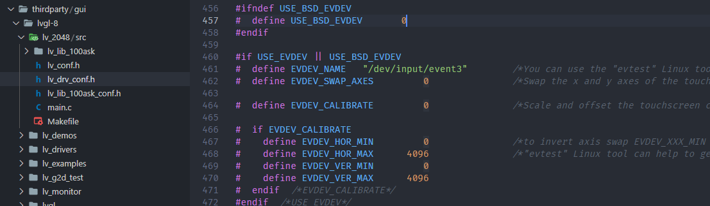
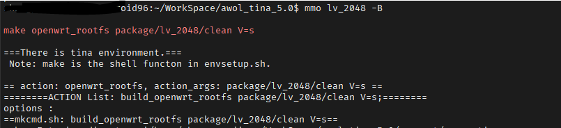

# 基于 LVGL 的 2048 小游戏

这一节将以一个已经编写好的 `lvgl` 小游戏 `2048` 描述如何将已经编写完成的 `lvgl` 程序移植到开发板上。

这里使用的 `2048` 小游戏由百问网提供，开源地址：[lv\_lib\_100ask](https://gitee.com/weidongshan/lv_lib_100ask)

## 准备脚手架

在这之前，我们先准备基础的 LVGL 脚手架。可以直接从 `lv_g2d_test` 里复制过来进行修改即可。

首先我们复制源码，在 `platform/thirdparty/gui/lvgl-8` 源码文件夹里，把 红色箭头 所指的 `lv_g2d_test` 的源码作为模板复制到 黄色箭头指向的 `lv_2048` 文件夹里。

如下图所示，并清理下 `res` 资源文件夹，

![](data:image/png;base64,iVBORw0KGgoAAAANSUhEUgAAASUAAACGCAYAAACbmJyDAAAAAXNSR0IArs4c6QAAAARnQU1BAACxjwv8YQUAAAAJcEhZcwAADsMAAA7DAcdvqGQAAA0jSURBVHhe7d1NixzHHYBxf5UkCB+kSH5ZxcSSY1CsYCIZBycCydGCLKTFhxgf7PhkkJHsQwyyLSOiLGJBByOBlpERQjrIJnoBHwzjqwQ++RvkI1T6X9XVXVVd3dM9OzNbU/scfmin32Z02Ieq2t3uZ361a7cCgFQQJQBJIUoAkkKUACRlR0TpyLGTnlcOH40eB2D7ZR+lE2ffU199c6tBtseO7+ctdeLHT9Xr78T29TWLawD5yT5Kax9+HI1Sm36xWlyUDty8pD74sXTzregxQAp27X1erRz9ozp48g118O9vqBePHFK79uyLHtsl6Sjtfun3andke21FPffSSmR7TaL04acXG1O4LrHr+BYUpU8+Uh98v6b26tevqte/v6ROfBIcAyTg2Rde1DE6tPY3z4ETR9Szz70QPadNwlE6qS7deai+vbjWEqYVderre+rh7S/Useh+Q6Ik5OtYgNrs23+wca2aExQvHIaMbmw89l75tBrpnL3yVhEWG6LJUZJzz155tfU1kIJfP7tH/e7Nw40gWfuPvqZ+UxwTOzcm7enbvjX177uxMJkgfVcE6dQ+d3uTjZJEJjZda9O9GO4GJYyLvP5IHZCvg2CZQPWPEiMlLINdv31OHXj7aDRI4mAxWhoyjUt/TakRpiJIF2/3CpKwUWpb8I45f3kjeq2aHxR3ZKRDotd+YhGRbfEota4dyfXK7QQJKZLgSHhiQRIyhcsrSqII06U73xdh+odaGxAkMU2UZA0qdq1aMMrxQmS3u19b7VGK0aFyAhW+BlIgUzOZosWCJPKavrl0mH7Qa0h9gyRslGLxaTP5J3BhUOR1MWV7Z02d7ZxuuedNilJkv1zfTg2BhMhidmwKJ9syWuieDQmSjHxi8WnTvcgtmsHQU7ibHzUWpreypiTX7LoekBJZW5JfA9C/ElDQvxJQbIsd2yX7KA2ZtonJ60kiEhS99tOMjLtWNPSnb3a0Zc8nSNgJso+SkJ+kxX7sHzN5lLQVEiKmX0CXHRGlVLBQDUxGlObIrCEx/QKGIEoAkkKUACSFKAFIClECkBSiBCApRAlAUogSgKQQJQBJIUqF8E9NeNoJsH12fJTa/mB38u1LulxQm+PH6urp2D4AXXZ8lGZ/ryWxtSidG43VeFx6sKFW3f2nN9Qju288UufcfcExm+edbedH9TXbzgMSsNRRSvdpJ1uIUhGUzfUz1WsdqNGF8rV/3dX1x81oFWzU6ihFzquuCaRliaOU8tNOnAjICCUIh0TDG8V0cc+Xr72YROKnj9lQVx847yEjJ/czhK+BhCz39C3Zp524sQjDIa/7T59kVPOoHDm5Xxtn/PhU145tZ6SE5bD8a0pJPu3Ej4A3MmqMdjrIsU7A5Dp+lNxruyEKoyTkM5VrSgQJCctjoTu5p534UapDJLFwR03t9LpQEI+ukZK/L4hSELfGayAheURJJPW0kyBK+nURgZ5rOW1rTs1pl30fZxQUkFA1R1ixkRSQhnyiNCUJ0uyfdhJGqQzNaNSYfjV0Tu/867avDUVGSuFCd/D5gFTs+CgNmbaJfk87aUbJTJkmh0CHpjHicc7T1ym3t466miMh/7oECena8VES6TztBABR2ibRERG/OwQQJQBpIUoAkkKUACSFKAFIyjN7nn9ZLbvjx49HtwNYPkQJQFKIEoCkECUASSFKPfzzD4d6eW3/K9HzAfRHlCZ4+uYb6n9//UtvhAnYGqLUQQITC0+X1ZdfjV5rXj6//4sa3/gsuq/LuzeeqKc//6Ke/nRXfSlfF/++K/vev6vGP/+gPg+OBxaFKHWwUbp46HB0uuaSY/pH6TN1/ScTBB2ChmvqXhGMPrGZLkpy/Sfq+vuRfUQJ24wodbBR6hOaIceaKD1R4yJM975s7rejmPlGqSU8RAnbjCh1mBQa2X/9T6+r//75iD5maJSu3/hBPb1/LdhngnG9CJMbG4mPnm6VUy47wvKi9GVxvWJ/FTodGHteGRpvmzlXR9B+jkaUzKjNHN8yugJmiCh16DP6kf1CwiT/ysK4nBc7tlZG6X37b73PBkL+raNUhKGKl5n62X1VlHRM3GsFUzQJVhUzf6TUHiXzXn7kGEVhvohSh64oyRqSDZGN0fAoBUEIttdR8rn7TJTu6tGMOxX0ryvcEPWMkhcy0YwoMGtEqUNblOx2GyG7Xb4eGiUvEBKBMg5hlHQ4qmmUP1LS27wANY83Iu9pj22LUuMa8XUwYFaIUoeukZKsJck++dduc0dO7rFN/ojDBOhaZJsJjxeNYJ8ZKcm5dajCY5oGRCmIHTBvRGkCGflIbGJsgGQqZyMl3NFTXDAN0iEoRiHOVKkZHhsYOdcfKZmvJTTOcfqaznt4ekapvCYjIywSUZpARkkSnJAbpTBGw6ZvhsQlXBOqQ2TiYKZPT9S9+y3BsnGzgQmnX9Wop2+U7GvnGq2/WwXMBlHaAhkhSbTklydtmGLHAeiPKM1IbN0JwHBECUBSiBKApBAlAEkhSgCSwiOWACSFKAFIClECkBSiBCApRAlAUohS4cixk55XDh+NHgdg/vKI0rF/qZu3LqtT+yL7Jjhx9j311Te3GmR77Ph+LqjN8WN19XRs37LK8f+EFGUyUlpRp76+px7eGR6mtQ8/jkapzfnLGz1GUkQJmFZG0zcTpu9ufzEoTEOjJOSc2LVqRAmYVmZrSkWYLt4eFKa5R+n8SI0fbKhVZ/+50Vhtnq9fN5zeUI/GYzXWRuqc3i7XdM7Tx9hImH3m+LF6tH6mupa816P1jXr/6IJ/vH7tHntBXX1Q7vMi1IySHB97z9X1x9V29/pAHxkudNdheju63zf/kVL4zSyvbWhiguPdqDlfm4CUISi2x2Nlw+GHrS105tjgvb1j6306PFVwzuiQ6etEIgwMkW+U7lxOJErmm72KhnzTdowe/G92IdeqI6avVYx8HrV+40sg/Pdujpzir8N9Xmy8/5P//xPyufW5Oopd0QW6ZTl9e3j3P+lM3+R1FSI/GDHe1KfinBOMhAwTj9jxW4uS2RaPkvt+JRtTPcKSbcQJw+W10D0wSGIhUdKvi29QCcqEqU014ojsEzoSI3eK5I5m7OtZRcm9VhilHsFhKocpZBKl6YIkFhOlOiZdwdGiI6FS9U3uhih4r8ia0pAouaMbPWqrouK/jz62YxqqMZXDFPKI0vEv1Ld3hgdJtP3yZJfJv1jZjJKZ0rTEJlRNf0ryzR/Gyn3tHv9gpDa3NFJyflLnBSX8P7VMGb3P7h4P9JPhQvdw8suQ4Z+atMn5T1DCYAHbgShtk+iC9javvxAlpIAooUKUkAKiBCApRAlAUogSgKQQJQBJIUoAkkKUACSFKAFIClECkBSiVNhJf0oCpC6PKPE0kxb+bUyAZZDJSGllBz3NRK5d/71c95+F9IjSLG4vUt1SJbIPGCij6ZsJU+5PM1ldHznXNYGqb/AWIkpYPpmtKZmbvWX1NJPi3HMdd6MM/4jWvfuAeTJJR5S8ex+513FHY/758n7u8eHdDjr/X0APGS5012HK4mkmZaDiUQpGQkEATTD8qDQ0Rkrm5m1VXJz9+nqxu00yUsIM5RulbJ5mYrbFoqRHLdWxQUyqbQOj1AiMc422+BAlzFCW07dlf5pJGKDmNrl+nwBNGSVnOhZOy3Q0ZZsbIaKEGcproXuKhwcsJEr6dfGNLwGY8M0bGyn560bltZz9hgQoDFX4OSJiUeoYyVne5yRKmKFMojRdkMRiolRO4aZ5mol+XUfJmwoGdCicOJhRzcAo6c/e/h4VN0RECTOUR5RyfppJ8c1e//TNjIaqfc4xNgh6nancPvGnbyV7ThXMMoTh9aupm+aGrP5cE2MGTJDhQvdwqT/NpGt0BOSGKG0Tf9RRik2B9KgptoY0hJmShe9H6JAiopSacOrUd8oHZIIoAUgKUQKQFKIEIClECUBSiBKApBAlAEkhSgCSQpQAJIUoFVL4UxIARh5R4mkmU+h5NwBgwTIZKa3soKeZzIf80e/E26oAC5DR9M2EKfenmcwLUUIqMltTMjd7W+qnmZQ3Xbta3UXAXKe+q0AYOzMNq/6A17lrpD6neG3vl+Sfaz9jeI+m+o4E/p0MIueum/s+ETPMUoYL3XWYlvJpJsGdJm0YvNdV5ExQ3Ci4Ix57rg2gf67/uRojpfCWKd4dKuXcIlQ9bpsLDJVvlJb0aSb+N/+E15FRmN5fbtMRct+rEZa2KMXu9+3+P/xzgVnKcvq2zE8zGRylRuDkvc3+RpScfZOj1Pyccj1zDFHC/OS10D3FwwMWEiUbA2cU0zynNDRKQ0ZKg6LESAnbI5MoTRcksZgold/QvZ9m0jNK+n38tSA3LtNHqTy3832JEuYjjyjl9DSTQVESJkz2p2SNsPSMkrmuXKO+tgmTvXb4nkQJ85HhQvdwqT/NBNhJiNI28UchpUnrTcAOQJQAJIUoAUgKUQKQFKIEIClECUBSiBKApBAlAAnZrf4PJ7tGZORZKIUAAAAASUVORK5CYII=)

同样的，复制一份引索文件，找到 `openwrt/package/thirdparty/gui/lvgl-8` 并把 `lv_g2d_test` 复制一份重命名为 `lv_2048` 作为我们 `2048` 小游戏使用的引索。



并编辑 `Makefile`，修改文件名称，把 `lv_g2d_test` 修改为这里的 `lv_2048`

```makefile
include $(TOPDIR)/rules.mk
include $(INCLUDE_DIR)/package.mk
include ../sunxifb.mk

PKG_NAME:=lv_2048
PKG_VERSION:=8.1.0
PKG_RELEASE:=1

PKG_BUILD_DIR := $(BUILD_DIR)/$(PKG_NAME)
SRC_CODE_DIR := $(LICHEE_PLATFORM_DIR)/thirdparty/gui/lvgl-8/$(PKG_NAME)
define Package/$(PKG_NAME)
  SECTION:=gui
  SUBMENU:=Littlevgl
  CATEGORY:=Gui
  DEPENDS:=+LVGL8_USE_SUNXIFB_G2D:libuapi +LVGL8_USE_SUNXIFB_G2D:kmod-sunxi-g2d \
           +LVGL8_USE_FREETYPE:libfreetype
  TITLE:=lvgl 2048 
endef

PKG_CONFIG_DEPENDS := \
    CONFIG_LVGL8_USE_SUNXIFB_DOUBLE_BUFFER \
    CONFIG_LVGL8_USE_SUNXIFB_CACHE \
    CONFIG_LVGL8_USE_SUNXIFB_G2D \
    CONFIG_LVGL8_USE_SUNXIFB_G2D_ROTATE

define Package/$(PKG_NAME)/config
endef

define Package/$(PKG_NAME)/Default
endef

define Package/$(PKG_NAME)/description
  a lvgl 2048 v8.1.0
endef

define Build/Prepare
    $(INSTALL_DIR) $(PKG_BUILD_DIR)/
    $(CP) -r $(SRC_CODE_DIR)/src $(PKG_BUILD_DIR)/
    $(CP) -r $(SRC_CODE_DIR)/../lvgl $(PKG_BUILD_DIR)/src/
    $(CP) -r $(SRC_CODE_DIR)/../lv_drivers $(PKG_BUILD_DIR)/src/
endef

define Build/Configure
endef

TARGET_CFLAGS+=-I$(PKG_BUILD_DIR)/src

ifeq ($(CONFIG_LVGL8_USE_SUNXIFB_G2D),y)
TARGET_CFLAGS+=-DLV_USE_SUNXIFB_G2D_FILL \
                -DLV_USE_SUNXIFB_G2D_BLEND \
                -DLV_USE_SUNXIFB_G2D_BLIT \
                -DLV_USE_SUNXIFB_G2D_SCALE
endif

define Build/Compile
    $(MAKE) -C $(PKG_BUILD_DIR)/src\
        ARCH="$(TARGET_ARCH)" \
        AR="$(TARGET_AR)" \
        CC="$(TARGET_CC)" \
        CXX="$(TARGET_CXX)" \
        CFLAGS="$(TARGET_CFLAGS)" \
        LDFLAGS="$(TARGET_LDFLAGS)" \
        INSTALL_PREFIX="$(PKG_INSTALL_DIR)" \
        all
endef

define Package/$(PKG_NAME)/install
    $(INSTALL_DIR) $(1)/usr/bin/
    $(INSTALL_DIR) $(1)/usr/share/lv_2048
    $(INSTALL_BIN) $(PKG_BUILD_DIR)/src/$(PKG_NAME) $(1)/usr/bin/
endef

$(eval $(call BuildPackage,$(PKG_NAME)))
```

完成脚手架的搭建后，可以 `make menuconfig` 里查看是否出现了 `lv_2048` 这个选项，选中它。



## 修改源码

第二步是修改源码。编辑之前复制的 `main.c` 文件，把不需要的 `lv_g2d_test` 的部分删去。保留最基础的部分。

```c
#include "lvgl/lvgl.h"
#include "lv_drivers/display/sunxifb.h"
#include "lv_drivers/indev/evdev.h"
#include <unistd.h>
#include <pthread.h>
#include <time.h>
#include <sys/time.h>
#include <stdlib.h>
#include <stdio.h>

static lv_style_t rect_style;
static lv_obj_t *rect_obj;
static lv_obj_t *canvas;

int main(int argc, char *argv[]) {
    lv_disp_drv_t disp_drv;
    lv_disp_draw_buf_t disp_buf;
    lv_indev_drv_t indev_drv;
    uint32_t rotated = LV_DISP_ROT_NONE;

    lv_disp_drv_init(&disp_drv);

    /*LittlevGL init*/
    lv_init();

    /*Linux frame buffer device init*/
    sunxifb_init(rotated);

    /*A buffer for LittlevGL to draw the screen's content*/
    static uint32_t width, height;
    sunxifb_get_sizes(&width, &height);

    static lv_color_t *buf;
    buf = (lv_color_t*) sunxifb_alloc(width * height * sizeof(lv_color_t), "lv_2048");

    if (buf == NULL) {
        sunxifb_exit();
        printf("malloc draw buffer fail\n");
        return 0;
    }

    /*Initialize a descriptor for the buffer*/
    lv_disp_draw_buf_init(&disp_buf, buf, NULL, width * height);

    /*Initialize and register a display driver*/
    disp_drv.draw_buf = &disp_buf;
    disp_drv.flush_cb = sunxifb_flush;
    disp_drv.hor_res = width;
    disp_drv.ver_res = height;
    disp_drv.rotated = rotated;
    disp_drv.screen_transp = 0;
    lv_disp_drv_register(&disp_drv);

    evdev_init();
    lv_indev_drv_init(&indev_drv); /*Basic initialization*/
    indev_drv.type = LV_INDEV_TYPE_POINTER; /*See below.*/
    indev_drv.read_cb = evdev_read; /*See below.*/
    /*Register the driver in LVGL and save the created input device object*/
    lv_indev_t *evdev_indev = lv_indev_drv_register(&indev_drv);

    /*Handle LitlevGL tasks (tickless mode)*/
    while (1) {
        lv_task_handler();
        usleep(1000);
    }

    return 0;
}

/*Set in lv_conf.h as `LV_TICK_CUSTOM_SYS_TIME_EXPR`*/
uint32_t custom_tick_get(void) {
    static uint64_t start_ms = 0;
    if (start_ms == 0) {
        struct timeval tv_start;
        gettimeofday(&tv_start, NULL);
        start_ms = (tv_start.tv_sec * 1000000 + tv_start.tv_usec) / 1000;
    }

    struct timeval tv_now;
    gettimeofday(&tv_now, NULL);
    uint64_t now_ms;
    now_ms = (tv_now.tv_sec * 1000000 + tv_now.tv_usec) / 1000;

    uint32_t time_ms = now_ms - start_ms;
    return time_ms;
}
```

接下来则是对接 `lv_lib_100ask` 与 `2048` 小游戏，我们先下载 `lv_lib_100ask` 的源码，放置到 `platform/thirdparty/gui/lvgl-8/lv_2048` 的 `src` 文件夹里。并按照 `lv_lib_100ask` 的说明，复制一份 `lv_lib_100ask_conf_template.h` 到 `src` 目录，并改名为 `lv_lib_100ask_conf.h`



编辑 `lv_lib_100ask_conf.h`，开启整个库的引用，并配置启用 `LV_USE_100ASK_2048` 。为了简洁，这里删除了不需要的配置项。

```c
/**
 * @file lv_lib_100ask_conf.h
 * Configuration file for v8.2.0
 *
 */
/*
 * COPY THIS FILE AS lv_lib_100ask_conf.h
 */

/* clang-format off */
#if 1 /*Set it to "1" to enable the content*/ 

#ifndef LV_LIB_100ASK_CONF_H
#define LV_LIB_100ASK_CONF_H

#include "lv_conf.h"

/*******************
 * GENERAL SETTING
 *******************/

/*********************
 * USAGE
 *********************

/*2048 game*/
#define LV_USE_100ASK_2048                               1
#if LV_USE_100ASK_2048
    /* Matrix size*/
    /*Do not modify*/
    #define  LV_100ASK_2048_MATRIX_SIZE          4

    /*test*/
    #define  LV_100ASK_2048_SIMPLE_TEST          1
#endif  

#endif /*LV_LIB_100ASK_H*/

#endif /*End of "Content enable"*/
```

再编辑 `platform/thirdparty/gui/lvgl-8/lv_2048/src/lv_lib_100ask/lv_lib_100ask.h` 中的版本号，修改为 `(8,1,0)`



之后在 `main.c` 里修改，对接 `lv_100ask_2048_simple_test`，具体如下。

（1）头文件加入 `lv_lib_100ask/lv_lib_100ask.h`

```c
#include <lv_lib_100ask/lv_lib_100ask.h>
```

（2）在 `main` 函数里添加接口调用

```c
lv_100ask_2048_simple_test();
```

完整的 `main.c` 如下

```c
#include <unistd.h>
#include <pthread.h>
#include <time.h>
#include <sys/time.h>
#include <stdlib.h>
#include <stdio.h>

#include "lvgl/lvgl.h"
#include "lv_drivers/display/sunxifb.h"
#include "lv_drivers/indev/evdev.h"

#include "lv_lib_100ask/lv_lib_100ask.h"  // 引用头文件

static lv_style_t rect_style;
static lv_obj_t *rect_obj;
static lv_obj_t *canvas;

int main(int argc, char *argv[]) {
    lv_disp_drv_t disp_drv;
    lv_disp_draw_buf_t disp_buf;
    lv_indev_drv_t indev_drv;
    uint32_t rotated = LV_DISP_ROT_NONE;

    lv_disp_drv_init(&disp_drv);

    /*LittlevGL init*/
    lv_init();

    /*Linux frame buffer device init*/
    sunxifb_init(rotated);

    /*A buffer for LittlevGL to draw the screen's content*/
    static uint32_t width, height;
    sunxifb_get_sizes(&width, &height);

    static lv_color_t *buf;
    buf = (lv_color_t*) sunxifb_alloc(width * height * sizeof(lv_color_t), "lv_nes");

    if (buf == NULL) {
        sunxifb_exit();
        printf("malloc draw buffer fail\n");
        return 0;
    }

    /*Initialize a descriptor for the buffer*/
    lv_disp_draw_buf_init(&disp_buf, buf, NULL, width * height);

    /*Initialize and register a display driver*/
    disp_drv.draw_buf = &disp_buf;
    disp_drv.flush_cb = sunxifb_flush;
    disp_drv.hor_res = width;
    disp_drv.ver_res = height;
    disp_drv.rotated = rotated;
    disp_drv.screen_transp = 0;
    lv_disp_drv_register(&disp_drv);

    evdev_init();
    lv_indev_drv_init(&indev_drv); /*Basic initialization*/
    indev_drv.type = LV_INDEV_TYPE_POINTER; /*See below.*/
    indev_drv.read_cb = evdev_read; /*See below.*/
    /*Register the driver in LVGL and save the created input device object*/
    lv_indev_t *evdev_indev = lv_indev_drv_register(&indev_drv);

    lv_100ask_2048_simple_test();  // 调用 2048 小游戏

    /*Handle LitlevGL tasks (tickless mode)*/
    while (1) {
        lv_task_handler();
        usleep(1000);
    }

    return 0;
}

/*Set in lv_conf.h as `LV_TICK_CUSTOM_SYS_TIME_EXPR`*/
uint32_t custom_tick_get(void) {
    static uint64_t start_ms = 0;
    if (start_ms == 0) {
        struct timeval tv_start;
        gettimeofday(&tv_start, NULL);
        start_ms = (tv_start.tv_sec * 1000000 + tv_start.tv_usec) / 1000;
    }

    struct timeval tv_now;
    gettimeofday(&tv_now, NULL);
    uint64_t now_ms;
    now_ms = (tv_now.tv_sec * 1000000 + tv_now.tv_usec) / 1000;

    uint32_t time_ms = now_ms - start_ms;
    return time_ms;
}
```

然后就是 `Makefile` 修改，增加一个 `lv_lib_100ask` 的 SRC 引用。

```
include lv_lib_100ask/lv_lib_100ask.mk
```

顺便也把 `BIN` 改为 `lv_2048` ，完整的 `Makefile` 如下

```makefile
#
# Makefile
#
CC ?= gcc
LVGL_DIR_NAME ?= lvgl
LVGL_DIR ?= ${shell pwd}
CFLAGS ?= -O3 -g0 -I$(LVGL_DIR)/ -Wall -Wshadow -Wundef -Wmissing-prototypes -Wno-discarded-qualifiers -Wall -Wextra -Wno-unused-function -Wno-error=strict-prototypes -Wpointer-arith -fno-strict-aliasing -Wno-error=cpp -Wuninitialized -Wmaybe-uninitialized -Wno-unused-parameter -Wno-missing-field-initializers -Wtype-limits -Wsizeof-pointer-memaccess -Wno-format-nonliteral -Wno-cast-qual -Wunreachable-code -Wno-switch-default -Wreturn-type -Wmultichar -Wformat-security -Wno-ignored-qualifiers -Wno-error=pedantic -Wno-sign-compare -Wno-error=missing-prototypes -Wdouble-promotion -Wclobbered -Wdeprecated -Wempty-body -Wtype-limits -Wshift-negative-value -Wstack-usage=2048 -Wno-unused-value -Wno-unused-parameter -Wno-missing-field-initializers -Wuninitialized -Wmaybe-uninitialized -Wall -Wextra -Wno-unused-parameter -Wno-missing-field-initializers -Wtype-limits -Wsizeof-pointer-memaccess -Wno-format-nonliteral -Wpointer-arith -Wno-cast-qual -Wmissing-prototypes -Wunreachable-code -Wno-switch-default -Wreturn-type -Wmultichar -Wno-discarded-qualifiers -Wformat-security -Wno-ignored-qualifiers -Wno-sign-compare
LDFLAGS ?= -lm
BIN = lv_2048

#Collect the files to compile
SRCDIRS   =  $(shell find . -maxdepth 1 -type d)
MAINSRC = $(foreach dir,$(SRCDIRS),$(wildcard $(dir)/*.c))

include $(LVGL_DIR)/lvgl/lvgl.mk
include $(LVGL_DIR)/lv_drivers/lv_drivers.mk
include lv_lib_100ask/lv_lib_100ask.mk

OBJEXT ?= .o

AOBJS = $(ASRCS:.S=$(OBJEXT))
COBJS = $(CSRCS:.c=$(OBJEXT))

MAINOBJ = $(MAINSRC:.c=$(OBJEXT))

SRCS = $(ASRCS) $(CSRCS) $(MAINSRC)
OBJS = $(AOBJS) $(COBJS)

## MAINOBJ -> OBJFILES

all: default

%.o: %.c
    @$(CC)  $(CFLAGS) -c $< -o $@
    @echo "CC $<"

default: $(AOBJS) $(COBJS) $(MAINOBJ)
    $(CC) -o $(BIN) $(MAINOBJ) $(AOBJS) $(COBJS) $(LDFLAGS)

clean: 
    rm -f $(BIN) $(AOBJS) $(COBJS) $(MAINOBJ)
```

## 对接触摸

做了以上操作，可能会发现触摸没有反应，这是因为触摸绑定的 `event` 事件号不对，这时需要修改绑定的 `event` 事件号，其配置文件在 `lv_drv_conf.h` 内：



这里将 `event3` 改为 `event0` 即可

```c
#  define EVDEV_NAME   "/dev/input/event0"
```

当然除了这样的方法，另外也可以用命令生成软连接`touchscreen`，就会直接以 `touchscreen` 为触摸节点，方便调试:

```shell
ln -s /dev/input/eventX /dev/input/touchscreen
```

## 测试编译

修改好了，希望单独编译这个包测试下而不编译完整的 SDK。可以这样做：

（1）确保已经 `source build/envsetup.sh` 并已经 `lunch`

（2）在任意文件夹下执行命令 `mmo lv_2048 -B`



其中 `mmo` 的意思是 单独编译一个 `openWrt` 软件包，后面的 `lv_2048` 是软件包名。`-B` 参数是先 `clean` 再编译，不加这个参数就是直接编译了。

## 测试运行

编译打包后，到开发板上使用 `lv_2048` 即可运行
