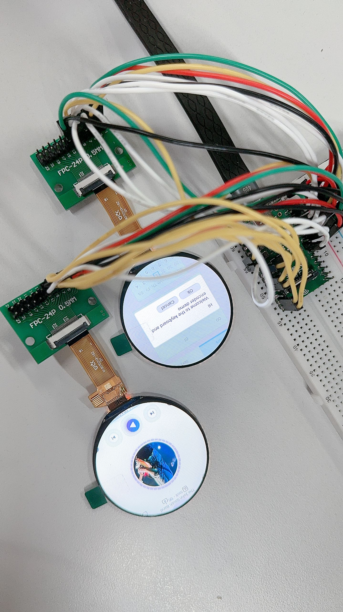
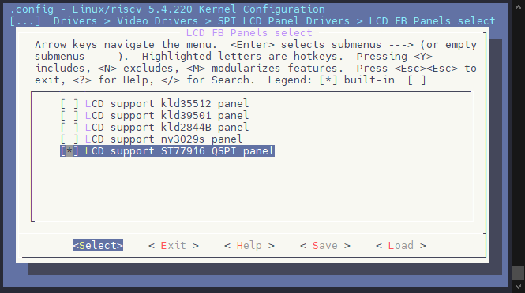
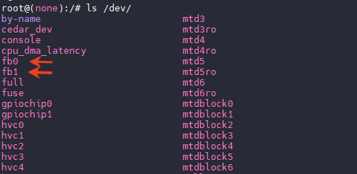
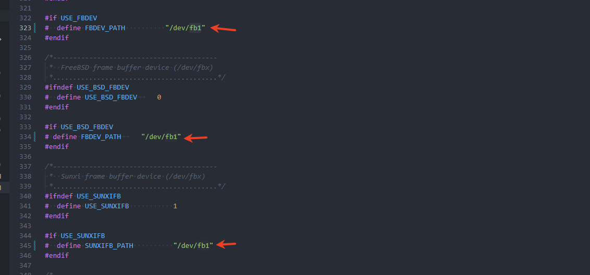

# QSPI 双屏 ST77916 LCD 异显

此次适配的 QSPI 屏为 `W180TE010I-18Z` ，使用的是 QSPI 4 线模式进行驱动。



屏幕 1 这里使用 QSPI2，位于 PD1~PD6 上，引脚配置如下：

| V861 | TFT 模块 |
| --- | --- |
| PD1 | QSPI-CS |
| PD2 | QSPI-CLK |
| PD3 | QSPI-D0 |
| PD4 | QSPI-D1 |
| PD5 | QSPI-D3 |
| PD6 | QSPI-D2 |
| PL6 | RESET |
| 3V3 | VCC |
| GND | GND |

屏幕 2 这里使用 QSPI1，位于 PD14~PD19 上，引脚配置如下：

| V861 | TFT 模块 |
| --- | --- |
| PD14 | QSPI-CS |
| PD15 | QSPI-CLK |
| PD16 | QSPI-D0 |
| PD17 | QSPI-D1 |
| PD18 | QSPI-D3 |
| PD19 | QSPI-D2 |
| PL7 | RESET |
| 3V3 | VCC |
| GND | GND |

## 勾选驱动

```
Allwinner BSP  --->
	Device Drivers  --->
		Video Drivers  --->
			SPI LCD Panel Drivers  --->
				<*> LCD FB Driver Support (SPI LCD)
					LCD FB Panels select  --->
						[*] LCD support ST77916 QSPI panel
```



## 配置设备树

```c
&pio {
	spi1_pins_default: spi1@0 {
		pins = "PD14", "PD15", "PD16", "PD17", "PD18", "PD19"; /* CS, SCK, D0, D1, D3, D2 */
		function = "spi1";
		allwinner,drive = <3>;
	};

	spi1_pins_sleep: spi1@1 {
		pins = "PD14", "PD15", "PD16", "PD17", "PD18", "PD19";
		function = "io_disabled";
	};

	spi2_pins_default: spi2@0 {
		pins = "PD1", "PD2", "PD3", "PD4", "PD5", "PD6"; /* CS, SCK, D0, D1, D3, D2 */
		function = "spi2";
		allwinner,drive = <3>;
	};

	spi2_pins_sleep: spi2@3 {
		pins = "PD1", "PD2", "PD3", "PD4", "PD5", "PD6";
		function = "io_disabled";
	};
};

&lcd_fb {
	status = "okay";
	port {
		#address-cells = <1>;
		#size-cells = <0>;
		spi_panel0: endpoint@0 {
			reg = <0>;
			remote-endpoint = <&panel_st7789v_spi1>;
		};
		spi_panel1: endpoint@1 {
			reg = <1>;
			remote-endpoint = <&panel_st7789v_spi2>;
		};
	};
};

&spi1 {
	pinctrl-0 = <&spi1_pins_default>;
	pinctrl-1 = <&spi1_pins_sleep>;
	pinctrl-names = "default", "sleep";
	clock-frequency = <150000000>;
	sunxi,spi-bus-mode = <SUNXI_SPI_BUS_MASTER>;
	sunxi,spi-cs-mode = <SUNXI_SPI_CS_SOFT>;
	status = "okay";

	panel_st7789v_spi1: slave@0 {
		device_type = "spi-panel";
		compatible = "allwinner,spi-panel";
		reg = <0x0>;
		spi-max-frequency = <150000000>;
		spi-rx-bus-width = <4>;
		spi-tx-bus-width = <4>;
		lcd_used = <1>;
		lcd_driver_name = "st77916_qspi";
		lcd_if = <2>;
		lcd_dbi_if = <0>;
		lcd_qspi_if = <2>;
		lcd_data_speed_hz = <118153846>;
		lcd_x = <360>;
		lcd_y = <360>;
		lcd_pixel_fmt = <10>;
		lcd_dbi_fmt = <2>;
		lcd_rgb_order = <0>;
		lcd_width = <60>;
		lcd_height = <60>;
		lcd_pwm_used = <0>;
		lcd_pwm_ch = <6>;
		lcd_pwm_freq = <5000>;
		lcd_pwm_pol = <1>;
		lcd_frm = <1>;
		lcd_gamma_en = <1>;
		fb_buffer_num = <2>;
		lcd_backlight = <100>;
		lcd_fps = <60>;
		lcd_dbi_te = <0>;
		lcd_dbi_clk_mode = <0>;
		lcd_gpio_0 = <&rtc_pio PL 7 GPIO_ACTIVE_LOW>;
		status = "okay";
	};
};

&spi2 {
	pinctrl-0 = <&spi2_pins_default>;
	pinctrl-1 = <&spi2_pins_sleep>;
	pinctrl-names = "default", "sleep";
	clock-frequency = <150000000>;
	sunxi,spi-bus-mode = <SUNXI_SPI_BUS_MASTER>;
	sunxi,spi-cs-mode = <SUNXI_SPI_CS_SOFT>;
	status = "okay";

	panel_st7789v_spi2: slave@0 {
		device_type = "spi-panel";
		compatible = "allwinner,spi-panel";
		reg = <0x0>;
		spi-max-frequency = <150000000>;
		spi-rx-bus-width = <4>;
		spi-tx-bus-width = <4>;
		lcd_used = <1>;
		lcd_driver_name = "st77916_qspi";
		lcd_if = <2>;
		lcd_dbi_if = <0>;
		lcd_qspi_if = <2>;
		lcd_data_speed_hz = <118153846>;
		lcd_x = <360>;
		lcd_y = <360>;
		lcd_pixel_fmt = <10>;
		lcd_dbi_fmt = <2>;
		lcd_rgb_order = <0>;
		lcd_width = <60>;
		lcd_height = <60>;
		lcd_pwm_used = <0>;
		lcd_pwm_ch = <6>;
		lcd_pwm_freq = <5000>;
		lcd_pwm_pol = <1>;
		lcd_frm = <1>;
		lcd_gamma_en = <1>;
		fb_buffer_num = <2>;
		lcd_backlight = <100>;
		lcd_fps = <60>;
		lcd_dbi_te = <0>;
		lcd_dbi_clk_mode = <0>;
		lcd_gpio_0 = <&rtc_pio PL 6 GPIO_ACTIVE_LOW>;
		status = "okay";
	};
};
```

## 功能测试

启动后可以执行 `ls /dev` 查看 framebuffer 节点。



### 修改 LVGL

配置 LVGL 色深 RGB565，反转 `byte`，修改文件 `platform/thirdparty/gui/lvgl-8/lv_examples/src/lv_conf.h`

```c
/*Color depth: 1 (1 byte per pixel), 8 (RGB332), 16 (RGB565), 32 (ARGB8888)*/
#define LV_COLOR_DEPTH 16

/*Swap the 2 bytes of RGB565 color. Useful if the display has an 8-bit interface (e.g. SPI)*/
#define LV_COLOR_16_SWAP 1
```


LVGL 需要编译两个版本，一个在 `fb0` 显示，一个在 `fb1` 显示。

编辑 `platform/thirdparty/gui/lvgl-8/lv_examples/src/lv_drv_conf.h`，将 `fb0` 修改为 `fb1`



勾选 LVGL，运行测试

```
lv_examples 1
lv_examples_fb1 1
```

屏幕可以正常显示，帧率正确即可。
