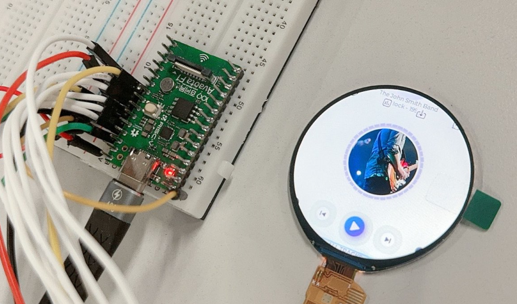
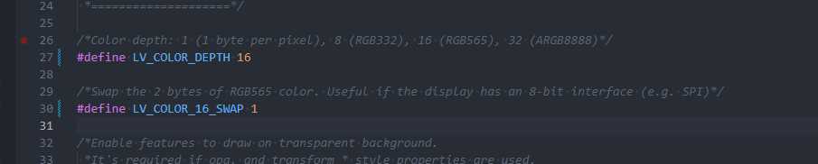

# QSPI 驱动 ST77916 1.8 寸 LCD

此次适配的 QSPI 屏为 `W180TE010I-18Z` ，使用的是 QSPI 4 线模式进行驱动。



这里使用 QSPI1，位于 PD1~PD6 上，引脚配置如下：

| V861 | TFT 模块 |
| --- | --- |
| PD1 | QSPI-CS |
| PD2 | QSPI-CLK |
| PD3 | QSPI-D0 |
| PD4 | QSPI-D1 |
| PD5 | QSPI-D3 |
| PD6 | QSPI-D2 |
| PD14 | RESET |
| 3V3 | VCC |
| GND | GND |

:::tip

:::note

提示

:::
:::note

QSPI 不限制 SPI 控制器，任意 SPI 控制器均可，对于 V861 来说，具体下表所示。

| TFT 模块 | IO 电平 | QSPI-CS | QSPI-CLK | QSPI-D0 | QSPI-D1 | QSPI-D2 | QSPI-D3 | 支持模式 |
| --- | --- | --- | --- | --- | --- | --- | --- | --- |
| SPI 引脚 | \\ | SPI-CS | SPI-CLK | SPI-MOSI | SPI-MISO | SPI-WP | SPI-HOLD | \\ |
| SPI0（PC6—PC11） | 3.3V | PC10 | PC9 | PC8 | PC11 | PC6 | PC7 | QSPI 1线/2线/4线 |
| SPI1（PD1—PD6） | 3.3V | PD1 | PD2 | PD3 | PD4 | PD6 | PD5 | QSPI 1线/2线/4线 |
| SPI1（PD5—PD8） | 3.3V | PD8 | PD5 | PD6 | PD7 | \\ | \\ | QSPI 1线/2线 |
| SPI1（PD12—PD15） | 3.3V | PD15 | PD12 | PD13 | PD14 | \\ | \\ | QSPI 1线/2线 |
| SPI1（PD14—PD19） | 3.3V | PD14 | PD15 | PD16 | PD17 | PD19 | PD18 | QSPI 1线/2线/4线 |
| SPI2（PA5—PA10） | 1.8V | PA5 | PA6 | PA7 | PA8 | PA10 | PA9 | QSPI 1线/2线/4线 |
| SPI2（PD1—PD6） | 3.3V | PD1 | PD2 | PD3 | PD4 | PD6 | PD5 | QSPI 1线/2线/4线 |
| SPI2（PD14—PD1） | 3.3V | PD14 | PD15 | PD16 | PD17 | PD19 | PD18 | QSPI 1线/2线/4线 |

:::warning

:::note

注意

:::
:::note

**同一个控制器仅能接一块屏幕**，意思是，当使用了**PD1—PD6的SPI1**接了屏幕，就不可以用**PD14—PD19的SPI1**接另外一块屏幕，虽然引脚没有冲突，但是控制器重复了。**同一个控制器仅能接一块屏幕**，如果需要接可以切换使用 SPI2。

:::

:::

:::

:::

## 编写 QSPI LCD 显示屏驱动

屏厂提供的初始化代码如下：

```c
LCD_WR_REG(0xF0);
LCD_WR_DATA(0x28);
LCD_WR_REG(0xF2);
LCD_WR_DATA(0x28);
LCD_WR_REG(0x73);
LCD_WR_DATA(0xF0);
LCD_WR_REG(0x7C);
LCD_WR_DATA(0xD1);
LCD_WR_REG(0x83);
LCD_WR_DATA(0xE0);
LCD_WR_REG(0x84);
LCD_WR_DATA(0x61);
LCD_WR_REG(0xF2);
LCD_WR_DATA(0x82);
LCD_WR_REG(0xF0);
LCD_WR_DATA(0x00);
LCD_WR_REG(0xF0);
LCD_WR_DATA(0x01);
LCD_WR_REG(0xF1);
LCD_WR_DATA(0x01);
LCD_WR_REG(0xB0);
LCD_WR_DATA(0x5E);
LCD_WR_REG(0xB1);
LCD_WR_DATA(0x55);
LCD_WR_REG(0xB2);
LCD_WR_DATA(0x24);
LCD_WR_REG(0xB3);
LCD_WR_DATA(0x01);
LCD_WR_REG(0xB4);
LCD_WR_DATA(0x87);
LCD_WR_REG(0xB5);
LCD_WR_DATA(0x44);
LCD_WR_REG(0xB6);
LCD_WR_DATA(0x8B);
LCD_WR_REG(0xB7);
LCD_WR_DATA(0x40);
LCD_WR_REG(0xB8);
LCD_WR_DATA(0x86);
LCD_WR_REG(0xB9);
LCD_WR_DATA(0x15);
LCD_WR_REG(0xBA);
LCD_WR_DATA(0x00);
LCD_WR_REG(0xBB);
LCD_WR_DATA(0x08);
LCD_WR_REG(0xBC);
LCD_WR_DATA(0x08);
LCD_WR_REG(0xBD);
LCD_WR_DATA(0x00);
LCD_WR_REG(0xBE);
LCD_WR_DATA(0x00);
LCD_WR_REG(0xBF);
LCD_WR_DATA(0x07);
LCD_WR_REG(0xC0);
LCD_WR_DATA(0x80);
LCD_WR_REG(0xC1);
LCD_WR_DATA(0x10);
LCD_WR_REG(0xC2);
LCD_WR_DATA(0x37);
LCD_WR_REG(0xC3);
LCD_WR_DATA(0x80);
LCD_WR_REG(0xC4);
LCD_WR_DATA(0x10);
LCD_WR_REG(0xC5);
LCD_WR_DATA(0x37);
LCD_WR_REG(0xC6);
LCD_WR_DATA(0xA9);
LCD_WR_REG(0xC7);
LCD_WR_DATA(0x41);
LCD_WR_REG(0xC8);
LCD_WR_DATA(0x01);
LCD_WR_REG(0xC9);
LCD_WR_DATA(0xA9);
LCD_WR_REG(0xCA);
LCD_WR_DATA(0x41);
LCD_WR_REG(0xCB);
LCD_WR_DATA(0x01);
LCD_WR_REG(0xCC);
LCD_WR_DATA(0x7F);
LCD_WR_REG(0xCD);
LCD_WR_DATA(0x7F);
LCD_WR_REG(0xCE);
LCD_WR_DATA(0xFF);
LCD_WR_REG(0xD0);
LCD_WR_DATA(0x91);
LCD_WR_REG(0xD1);
LCD_WR_DATA(0x68);
LCD_WR_REG(0xD2);
LCD_WR_DATA(0x68);
LCD_WR_REG(0xF5);
LCD_WR_DATA(0x00);
LCD_WR_DATA(0xA5);
LCD_WR_REG(0xDD);
LCD_WR_DATA(0x40);
LCD_WR_REG(0xDE);
LCD_WR_DATA(0x40);
LCD_WR_REG(0xF1);
LCD_WR_DATA(0x10);
LCD_WR_REG(0xF0);
LCD_WR_DATA(0x00);
LCD_WR_REG(0xF0);
LCD_WR_DATA(0x02);
LCD_WR_REG(0xE0);
LCD_WR_DATA(0xF0);
LCD_WR_DATA(0x10);
LCD_WR_DATA(0x18);
LCD_WR_DATA(0x0D);
LCD_WR_DATA(0x0C);
LCD_WR_DATA(0x38);
LCD_WR_DATA(0x3E);
LCD_WR_DATA(0x44);
LCD_WR_DATA(0x51);
LCD_WR_DATA(0x39);
LCD_WR_DATA(0x15);
LCD_WR_DATA(0x15);
LCD_WR_DATA(0x30);
LCD_WR_DATA(0x34);
LCD_WR_REG(0xE1);
LCD_WR_DATA(0xF0);
LCD_WR_DATA(0x0F);
LCD_WR_DATA(0x17);
LCD_WR_DATA(0x0D);
LCD_WR_DATA(0x0B);
LCD_WR_DATA(0x07);
LCD_WR_DATA(0x3E);
LCD_WR_DATA(0x33);
LCD_WR_DATA(0x51);
LCD_WR_DATA(0x39);
LCD_WR_DATA(0x15);
LCD_WR_DATA(0x15);
LCD_WR_DATA(0x30);
LCD_WR_DATA(0x34);
LCD_WR_REG(0xF0);
LCD_WR_DATA(0x10);
LCD_WR_REG(0xF3);
LCD_WR_DATA(0x10);
LCD_WR_REG(0xE0);
LCD_WR_DATA(0x08);
LCD_WR_REG(0xE1);
LCD_WR_DATA(0x00);
LCD_WR_REG(0xE2);
LCD_WR_DATA(0x00);
LCD_WR_REG(0xE3);
LCD_WR_DATA(0x00);
LCD_WR_REG(0xE4);
LCD_WR_DATA(0xE0);
LCD_WR_REG(0xE5);
LCD_WR_DATA(0x06);
LCD_WR_REG(0xE6);
LCD_WR_DATA(0x21);
LCD_WR_REG(0xE7);
LCD_WR_DATA(0x03);
LCD_WR_REG(0xE8);
LCD_WR_DATA(0x05);
LCD_WR_REG(0xE9);
LCD_WR_DATA(0x02);
LCD_WR_REG(0xEA);
LCD_WR_DATA(0xE9);
LCD_WR_REG(0xEB);
LCD_WR_DATA(0x00);
LCD_WR_REG(0xEC);
LCD_WR_DATA(0x00);
LCD_WR_REG(0xED);
LCD_WR_DATA(0x14);
LCD_WR_REG(0xEE);
LCD_WR_DATA(0xFF);
LCD_WR_REG(0xEF);
LCD_WR_DATA(0x00);
LCD_WR_REG(0xF8);
LCD_WR_DATA(0xFF);
LCD_WR_REG(0xF9);
LCD_WR_DATA(0x00);
LCD_WR_REG(0xFA);
LCD_WR_DATA(0x00);
LCD_WR_REG(0xFB);
LCD_WR_DATA(0x30);
LCD_WR_REG(0xFC);
LCD_WR_DATA(0x00);
LCD_WR_REG(0xFD);
LCD_WR_DATA(0x00);
LCD_WR_REG(0xFE);
LCD_WR_DATA(0x00);
LCD_WR_REG(0xFF);
LCD_WR_DATA(0x00);
LCD_WR_REG(0x60);
LCD_WR_DATA(0x40);
LCD_WR_REG(0x61);
LCD_WR_DATA(0x05);
LCD_WR_REG(0x62);
LCD_WR_DATA(0x00);
LCD_WR_REG(0x63);
LCD_WR_DATA(0x42);
LCD_WR_REG(0x64);
LCD_WR_DATA(0xDA);
LCD_WR_REG(0x65);
LCD_WR_DATA(0x00);
LCD_WR_REG(0x66);
LCD_WR_DATA(0x00);
LCD_WR_REG(0x67);
LCD_WR_DATA(0x00);
LCD_WR_REG(0x68);
LCD_WR_DATA(0x00);
LCD_WR_REG(0x69);
LCD_WR_DATA(0x00);
LCD_WR_REG(0x6A);
LCD_WR_DATA(0x00);
LCD_WR_REG(0x6B);
LCD_WR_DATA(0x00);
LCD_WR_REG(0x70);
LCD_WR_DATA(0x40);
LCD_WR_REG(0x71);
LCD_WR_DATA(0x04);
LCD_WR_REG(0x72);
LCD_WR_DATA(0x00);
LCD_WR_REG(0x73);
LCD_WR_DATA(0x42);
LCD_WR_REG(0x74);
LCD_WR_DATA(0xD9);
LCD_WR_REG(0x75);
LCD_WR_DATA(0x00);
LCD_WR_REG(0x76);
LCD_WR_DATA(0x00);
LCD_WR_REG(0x77);
LCD_WR_DATA(0x00);
LCD_WR_REG(0x78);
LCD_WR_DATA(0x00);
LCD_WR_REG(0x79);
LCD_WR_DATA(0x00);
LCD_WR_REG(0x7A);
LCD_WR_DATA(0x00);
LCD_WR_REG(0x7B);
LCD_WR_DATA(0x00);
LCD_WR_REG(0x80);
LCD_WR_DATA(0x48);
LCD_WR_REG(0x81);
LCD_WR_DATA(0x00);
LCD_WR_REG(0x82);
LCD_WR_DATA(0x07);
LCD_WR_REG(0x83);
LCD_WR_DATA(0x02);
LCD_WR_REG(0x84);
LCD_WR_DATA(0xD7);
LCD_WR_REG(0x85);
LCD_WR_DATA(0x04);
LCD_WR_REG(0x86);
LCD_WR_DATA(0x00);
LCD_WR_REG(0x87);
LCD_WR_DATA(0x00);
LCD_WR_REG(0x88);
LCD_WR_DATA(0x48);
LCD_WR_REG(0x89);
LCD_WR_DATA(0x00);
LCD_WR_REG(0x8A);
LCD_WR_DATA(0x09);
LCD_WR_REG(0x8B);
LCD_WR_DATA(0x02);
LCD_WR_REG(0x8C);
LCD_WR_DATA(0xD9);
LCD_WR_REG(0x8D);
LCD_WR_DATA(0x04);
LCD_WR_REG(0x8E);
LCD_WR_DATA(0x00);
LCD_WR_REG(0x8F);
LCD_WR_DATA(0x00);
LCD_WR_REG(0x90);
LCD_WR_DATA(0x48);
LCD_WR_REG(0x91);
LCD_WR_DATA(0x00);
LCD_WR_REG(0x92);
LCD_WR_DATA(0x0B);
LCD_WR_REG(0x93);
LCD_WR_DATA(0x02);
LCD_WR_REG(0x94);
LCD_WR_DATA(0xDB);
LCD_WR_REG(0x95);
LCD_WR_DATA(0x04);
LCD_WR_REG(0x96);
LCD_WR_DATA(0x00);
LCD_WR_REG(0x97);
LCD_WR_DATA(0x00);
LCD_WR_REG(0x98);
LCD_WR_DATA(0x48);
LCD_WR_REG(0x99);
LCD_WR_DATA(0x00);
LCD_WR_REG(0x9A);
LCD_WR_DATA(0x0D);
LCD_WR_REG(0x9B);
LCD_WR_DATA(0x02);
LCD_WR_REG(0x9C);
LCD_WR_DATA(0xDD);
LCD_WR_REG(0x9D);
LCD_WR_DATA(0x04);
LCD_WR_REG(0x9E);
LCD_WR_DATA(0x00);
LCD_WR_REG(0x9F);
LCD_WR_DATA(0x00);
LCD_WR_REG(0xA0);
LCD_WR_DATA(0x48);
LCD_WR_REG(0xA1);
LCD_WR_DATA(0x00);
LCD_WR_REG(0xA2);
LCD_WR_DATA(0x06);
LCD_WR_REG(0xA3);
LCD_WR_DATA(0x02);
LCD_WR_REG(0xA4);
LCD_WR_DATA(0xD6);
LCD_WR_REG(0xA5);
LCD_WR_DATA(0x04);
LCD_WR_REG(0xA6);
LCD_WR_DATA(0x00);
LCD_WR_REG(0xA7);
LCD_WR_DATA(0x00);
LCD_WR_REG(0xA8);
LCD_WR_DATA(0x48);
LCD_WR_REG(0xA9);
LCD_WR_DATA(0x00);
LCD_WR_REG(0xAA);
LCD_WR_DATA(0x08);
LCD_WR_REG(0xAB);
LCD_WR_DATA(0x02);
LCD_WR_REG(0xAC);
LCD_WR_DATA(0xD8);
LCD_WR_REG(0xAD);
LCD_WR_DATA(0x04);
LCD_WR_REG(0xAE);
LCD_WR_DATA(0x00);
LCD_WR_REG(0xAF);
LCD_WR_DATA(0x00);
LCD_WR_REG(0xB0);
LCD_WR_DATA(0x48);
LCD_WR_REG(0xB1);
LCD_WR_DATA(0x00);
LCD_WR_REG(0xB2);
LCD_WR_DATA(0x0A);
LCD_WR_REG(0xB3);
LCD_WR_DATA(0x02);
LCD_WR_REG(0xB4);
LCD_WR_DATA(0xDA);
LCD_WR_REG(0xB5);
LCD_WR_DATA(0x04);
LCD_WR_REG(0xB6);
LCD_WR_DATA(0x00);
LCD_WR_REG(0xB7);
LCD_WR_DATA(0x00);
LCD_WR_REG(0xB8);
LCD_WR_DATA(0x48);
LCD_WR_REG(0xB9);
LCD_WR_DATA(0x00);
LCD_WR_REG(0xBA);
LCD_WR_DATA(0x0C);
LCD_WR_REG(0xBB);
LCD_WR_DATA(0x02);
LCD_WR_REG(0xBC);
LCD_WR_DATA(0xDC);
LCD_WR_REG(0xBD);
LCD_WR_DATA(0x04);
LCD_WR_REG(0xBE);
LCD_WR_DATA(0x00);
LCD_WR_REG(0xBF);
LCD_WR_DATA(0x00);
LCD_WR_REG(0xC0);
LCD_WR_DATA(0x10);
LCD_WR_REG(0xC1);
LCD_WR_DATA(0x47);
LCD_WR_REG(0xC2);
LCD_WR_DATA(0x56);
LCD_WR_REG(0xC3);
LCD_WR_DATA(0x65);
LCD_WR_REG(0xC4);
LCD_WR_DATA(0x74);
LCD_WR_REG(0xC5);
LCD_WR_DATA(0x88);
LCD_WR_REG(0xC6);
LCD_WR_DATA(0x99);
LCD_WR_REG(0xC7);
LCD_WR_DATA(0x01);
LCD_WR_REG(0xC8);
LCD_WR_DATA(0xBB);
LCD_WR_REG(0xC9);
LCD_WR_DATA(0xAA);
LCD_WR_REG(0xD0);
LCD_WR_DATA(0x10);
LCD_WR_REG(0xD1);
LCD_WR_DATA(0x47);
LCD_WR_REG(0xD2);
LCD_WR_DATA(0x56);
LCD_WR_REG(0xD3);
LCD_WR_DATA(0x65);
LCD_WR_REG(0xD4);
LCD_WR_DATA(0x74);
LCD_WR_REG(0xD5);
LCD_WR_DATA(0x88);
LCD_WR_REG(0xD6);
LCD_WR_DATA(0x99);
LCD_WR_REG(0xD7);
LCD_WR_DATA(0x01);
LCD_WR_REG(0xD8);
LCD_WR_DATA(0xBB);
LCD_WR_REG(0xD9);
LCD_WR_DATA(0xAA);
LCD_WR_REG(0xF3);
LCD_WR_DATA(0x01);
LCD_WR_REG(0xF0);
LCD_WR_DATA(0x00);
LCD_WR_REG(0x3A);			
LCD_WR_DATA(0x55);   //   5 565  6 666
LCD_WR_REG(0x21);
LCD_WR_REG(0x11);
delay_ms(120);
LCD_WR_REG(0x29);
```

整理后的初始化代码如下：

```c
static struct lcm_setting_table lcm_initialization_setting[] = {
	{ 0xF0, { 0x28 }, 1, 0 },
	{ 0xF2, { 0x28 }, 1, 0 },
	{ 0x73, { 0xF0 }, 1, 0 },
	{ 0x7C, { 0xD1 }, 1, 0 },
	{ 0x83, { 0xE0 }, 1, 0 },
	{ 0x84, { 0x61 }, 1, 0 },
	{ 0xF2, { 0x82 }, 1, 0 },
	{ 0xF0, { 0x00 }, 1, 0 },
	{ 0xF0, { 0x01 }, 1, 0 },
	{ 0xF1, { 0x01 }, 1, 0 },
	{ 0xB0, { 0x5E }, 1, 0 },
	{ 0xB1, { 0x55 }, 1, 0 },
	{ 0xB2, { 0x24 }, 1, 0 },
	{ 0xB3, { 0x01 }, 1, 0 },
	{ 0xB4, { 0x87 }, 1, 0 },
	{ 0xB5, { 0x44 }, 1, 0 },
	{ 0xB6, { 0x8B }, 1, 0 },
	{ 0xB7, { 0x40 }, 1, 0 },
	{ 0xB8, { 0x86 }, 1, 0 },
	{ 0xB9, { 0x15 }, 1, 0 },
	{ 0xBA, { 0x00 }, 1, 0 },
	{ 0xBB, { 0x08 }, 1, 0 },
	{ 0xBC, { 0x08 }, 1, 0 },
	{ 0xBD, { 0x00 }, 1, 0 },
	{ 0xBE, { 0x00 }, 1, 0 },
	{ 0xBF, { 0x07 }, 1, 0 },
	{ 0xC0, { 0x80 }, 1, 0 },
	{ 0xC1, { 0x10 }, 1, 0 },
	{ 0xC2, { 0x37 }, 1, 0 },
	{ 0xC3, { 0x80 }, 1, 0 },
	{ 0xC4, { 0x10 }, 1, 0 },
	{ 0xC5, { 0x37 }, 1, 0 },
	{ 0xC6, { 0xA9 }, 1, 0 },
	{ 0xC7, { 0x41 }, 1, 0 },
	{ 0xC8, { 0x01 }, 1, 0 },
	{ 0xC9, { 0xA9 }, 1, 0 },
	{ 0xCA, { 0x41 }, 1, 0 },
	{ 0xCB, { 0x01 }, 1, 0 },
	{ 0xCC, { 0x7F }, 1, 0 },
	{ 0xCD, { 0x7F }, 1, 0 },
	{ 0xCE, { 0xFF }, 1, 0 },
	{ 0xD0, { 0x91 }, 1, 0 },
	{ 0xD1, { 0x68 }, 1, 0 },
	{ 0xD2, { 0x68 }, 1, 0 },
	{ 0xF5, { 0x00, 0xA5 }, 2, 0 },
	{ 0xDD, { 0x40 }, 1, 0 },
	{ 0xDE, { 0x40 }, 1, 0 },
	{ 0xF1, { 0x10 }, 1, 0 },
	{ 0xF0, { 0x00 }, 1, 0 },
	{ 0xF0, { 0x02 }, 1, 0 },
	{ 0xE0, { 0xF0, 0x10, 0x18, 0x0D, 0x0C, 0x38, 0x3E, 0x44, 0x51, 0x39, 0x15, 0x15, 0x30, 0x34 }, 14, 0 },
	{ 0xE1, { 0xF0, 0x0F, 0x17, 0x0D, 0x0B, 0x07, 0x3E, 0x33, 0x51, 0x39, 0x15, 0x15, 0x30, 0x34 }, 14, 0 },
	{ 0xF0, { 0x10 }, 1, 0 },
	{ 0xF3, { 0x10 }, 1, 0 },
	{ 0xE0, { 0x08 }, 1, 0 },
	{ 0xE1, { 0x00 }, 1, 0 },
	{ 0xE2, { 0x00 }, 1, 0 },
	{ 0xE3, { 0x00 }, 1, 0 },
	{ 0xE4, { 0xE0 }, 1, 0 },
	{ 0xE5, { 0x06 }, 1, 0 },
	{ 0xE6, { 0x21 }, 1, 0 },
	{ 0xE7, { 0x03 }, 1, 0 },
	{ 0xE8, { 0x05 }, 1, 0 },
	{ 0xE9, { 0x02 }, 1, 0 },
	{ 0xEA, { 0xE9 }, 1, 0 },
	{ 0xEB, { 0x00 }, 1, 0 },
	{ 0xEC, { 0x00 }, 1, 0 },
	{ 0xED, { 0x14 }, 1, 0 },
	{ 0xEE, { 0xFF }, 1, 0 },
	{ 0xEF, { 0x00 }, 1, 0 },
	{ 0xF8, { 0xFF }, 1, 0 },
	{ 0xF9, { 0x00 }, 1, 0 },
	{ 0xFA, { 0x00 }, 1, 0 },
	{ 0xFB, { 0x30 }, 1, 0 },
	{ 0xFC, { 0x00 }, 1, 0 },
	{ 0xFD, { 0x00 }, 1, 0 },
	{ 0xFE, { 0x00 }, 1, 0 },
	{ 0xFF, { 0x00 }, 1, 0 },
	{ 0x60, { 0x40 }, 1, 0 },
	{ 0x61, { 0x05 }, 1, 0 },
	{ 0x62, { 0x00 }, 1, 0 },
	{ 0x63, { 0x42 }, 1, 0 },
	{ 0x64, { 0xDA }, 1, 0 },
	{ 0x65, { 0x00 }, 1, 0 },
	{ 0x66, { 0x00 }, 1, 0 },
	{ 0x67, { 0x00 }, 1, 0 },
	{ 0x68, { 0x00 }, 1, 0 },
	{ 0x69, { 0x00 }, 1, 0 },
	{ 0x6A, { 0x00 }, 1, 0 },
	{ 0x6B, { 0x00 }, 1, 0 },
	{ 0x70, { 0x40 }, 1, 0 },
	{ 0x71, { 0x04 }, 1, 0 },
	{ 0x72, { 0x00 }, 1, 0 },
	{ 0x73, { 0x42 }, 1, 0 },
	{ 0x74, { 0xD9 }, 1, 0 },
	{ 0x75, { 0x00 }, 1, 0 },
	{ 0x76, { 0x00 }, 1, 0 },
	{ 0x77, { 0x00 }, 1, 0 },
	{ 0x78, { 0x00 }, 1, 0 },
	{ 0x79, { 0x00 }, 1, 0 },
	{ 0x7A, { 0x00 }, 1, 0 },
	{ 0x7B, { 0x00 }, 1, 0 },
	{ 0x80, { 0x48 }, 1, 0 },
	{ 0x81, { 0x00 }, 1, 0 },
	{ 0x82, { 0x07 }, 1, 0 },
	{ 0x83, { 0x02 }, 1, 0 },
	{ 0x84, { 0xD7 }, 1, 0 },
	{ 0x85, { 0x04 }, 1, 0 },
	{ 0x86, { 0x00 }, 1, 0 },
	{ 0x87, { 0x00 }, 1, 0 },
	{ 0x88, { 0x48 }, 1, 0 },
	{ 0x89, { 0x00 }, 1, 0 },
	{ 0x8A, { 0x09 }, 1, 0 },
	{ 0x8B, { 0x02 }, 1, 0 },
	{ 0x8C, { 0xD9 }, 1, 0 },
	{ 0x8D, { 0x04 }, 1, 0 },
	{ 0x8E, { 0x00 }, 1, 0 },
	{ 0x8F, { 0x00 }, 1, 0 },
	{ 0x90, { 0x48 }, 1, 0 },
	{ 0x91, { 0x00 }, 1, 0 },
	{ 0x92, { 0x0B }, 1, 0 },
	{ 0x93, { 0x02 }, 1, 0 },
	{ 0x94, { 0xDB }, 1, 0 },
	{ 0x95, { 0x04 }, 1, 0 },
	{ 0x96, { 0x00 }, 1, 0 },
	{ 0x97, { 0x00 }, 1, 0 },
	{ 0x98, { 0x48 }, 1, 0 },
	{ 0x99, { 0x00 }, 1, 0 },
	{ 0x9A, { 0x0D }, 1, 0 },
	{ 0x9B, { 0x02 }, 1, 0 },
	{ 0x9C, { 0xDD }, 1, 0 },
	{ 0x9D, { 0x04 }, 1, 0 },
	{ 0x9E, { 0x00 }, 1, 0 },
	{ 0x9F, { 0x00 }, 1, 0 },
	{ 0xA0, { 0x48 }, 1, 0 },
	{ 0xA1, { 0x00 }, 1, 0 },
	{ 0xA2, { 0x06 }, 1, 0 },
	{ 0xA3, { 0x02 }, 1, 0 },
	{ 0xA4, { 0xD6 }, 1, 0 },
	{ 0xA5, { 0x04 }, 1, 0 },
	{ 0xA6, { 0x00 }, 1, 0 },
	{ 0xA7, { 0x00 }, 1, 0 },
	{ 0xA8, { 0x48 }, 1, 0 },
	{ 0xA9, { 0x00 }, 1, 0 },
	{ 0xAA, { 0x08 }, 1, 0 },
	{ 0xAB, { 0x02 }, 1, 0 },
	{ 0xAC, { 0xD8 }, 1, 0 },
	{ 0xAD, { 0x04 }, 1, 0 },
	{ 0xAE, { 0x00 }, 1, 0 },
	{ 0xAF, { 0x00 }, 1, 0 },
	{ 0xB0, { 0x48 }, 1, 0 },
	{ 0xB1, { 0x00 }, 1, 0 },
	{ 0xB2, { 0x0A }, 1, 0 },
	{ 0xB3, { 0x02 }, 1, 0 },
	{ 0xB4, { 0xDA }, 1, 0 },
	{ 0xB5, { 0x04 }, 1, 0 },
	{ 0xB6, { 0x00 }, 1, 0 },
	{ 0xB7, { 0x00 }, 1, 0 },
	{ 0xB8, { 0x48 }, 1, 0 },
	{ 0xB9, { 0x00 }, 1, 0 },
	{ 0xBA, { 0x0C }, 1, 0 },
	{ 0xBB, { 0x02 }, 1, 0 },
	{ 0xBC, { 0xDC }, 1, 0 },
	{ 0xBD, { 0x04 }, 1, 0 },
	{ 0xBE, { 0x00 }, 1, 0 },
	{ 0xBF, { 0x00 }, 1, 0 },
	{ 0xC0, { 0x10 }, 1, 0 },
	{ 0xC1, { 0x47 }, 1, 0 },
	{ 0xC2, { 0x56 }, 1, 0 },
	{ 0xC3, { 0x65 }, 1, 0 },
	{ 0xC4, { 0x74 }, 1, 0 },
	{ 0xC5, { 0x88 }, 1, 0 },
	{ 0xC6, { 0x99 }, 1, 0 },
	{ 0xC7, { 0x01 }, 1, 0 },
	{ 0xC8, { 0xBB }, 1, 0 },
	{ 0xC9, { 0xAA }, 1, 0 },
	{ 0xD0, { 0x10 }, 1, 0 },
	{ 0xD1, { 0x47 }, 1, 0 },
	{ 0xD2, { 0x56 }, 1, 0 },
	{ 0xD3, { 0x65 }, 1, 0 },
	{ 0xD4, { 0x74 }, 1, 0 },
	{ 0xD5, { 0x88 }, 1, 0 },
	{ 0xD6, { 0x99 }, 1, 0 },
	{ 0xD7, { 0x01 }, 1, 0 },
	{ 0xD8, { 0xBB }, 1, 0 },
	{ 0xD9, { 0xAA }, 1, 0 },
	{ 0xF3, { 0x01 }, 1, 0 },
	{ 0xF0, { 0x00 }, 1, 0 },
	{ 0x3A, { 0x55 }, 1, 0 },
	{ 0x21, { 0x00 }, 1, 0 },
	{ 0x11, { 0x00 }, 1, 120 },
	{ 0x29, { 0x00 }, 1, 0 },
	{ REGFLAG_END_OF_TABLE, {}, 0, 0 },
};
```

对照屏厂提供的驱动修改 `address` 函数，做如下修改

```c
static void address(unsigned int sel, int x, int y, int width, int height)
{
	unsigned char reg_para_buf[4];
	reg_para_buf[0] = (y >> 8) & 0xff;
	reg_para_buf[1] = y & 0xff;
	reg_para_buf[2] = (height >> 8) & 0xff;
	reg_para_buf[3] = height & 0xff;
	sunxi_lcd_qspi_multi_para_write(sel, 0x2B, reg_para_buf, 4);

	reg_para_buf[0] = (x >> 8) & 0xff;
	reg_para_buf[1] = x & 0xff;
	reg_para_buf[2] = (width >> 8) & 0xff;
	reg_para_buf[3] = width & 0xff;
	sunxi_lcd_qspi_multi_para_write(sel, 0x2A, reg_para_buf, 4);
	return;
}
```

完成驱动如下

```c
/* SPDX-License-Identifier: GPL-2.0-or-later */
/* Copyright(c) 2020 - 2023 Allwinner Technology Co.,Ltd. All rights reserved. */

#include "st77916.h"

static void LCD_power_on(u32 sel);
static void LCD_power_off(u32 sel);
static void LCD_bl_open(u32 sel);
static void LCD_bl_close(u32 sel);
static void LCD_panel_init(u32 sel);
static void LCD_panel_exit(u32 sel);

#define RESET(s, v) sunxi_lcd_gpio_set_value(s, 0, v)
#define power_en(sel, val) sunxi_lcd_gpio_set_value(sel, 0, val)

struct sunxi_lcd_fb_disp_panel_para info;

static void address(unsigned int sel, int x, int y, int width, int height)
{
	unsigned char reg_para_buf[4];
	reg_para_buf[0] = (y >> 8) & 0xff;
	reg_para_buf[1] = y & 0xff;
	reg_para_buf[2] = (height >> 8) & 0xff;
	reg_para_buf[3] = height & 0xff;
	sunxi_lcd_qspi_multi_para_write(sel, 0x2B, reg_para_buf, 4);

	reg_para_buf[0] = (x >> 8) & 0xff;
	reg_para_buf[1] = x & 0xff;
	reg_para_buf[2] = (width >> 8) & 0xff;
	reg_para_buf[3] = width & 0xff;
	sunxi_lcd_qspi_multi_para_write(sel, 0x2A, reg_para_buf, 4);
	return;
}

/* cmd is u8 type, we using u16 as internal control */
#define REGFLAG_END_OF_TABLE 0xFFFC /* END OF REGISTERS MARKER */

struct lcm_setting_table {
	u16 cmd;
	u8 para_list[32];
	u32 count;
	u32 delay_ms;
};

static struct lcm_setting_table lcm_initialization_setting[] = {
	{ 0xF0, { 0x28 }, 1, 0 },
	{ 0xF2, { 0x28 }, 1, 0 },
	{ 0x73, { 0xF0 }, 1, 0 },
	{ 0x7C, { 0xD1 }, 1, 0 },
	{ 0x83, { 0xE0 }, 1, 0 },
	{ 0x84, { 0x61 }, 1, 0 },
	{ 0xF2, { 0x82 }, 1, 0 },
	{ 0xF0, { 0x00 }, 1, 0 },
	{ 0xF0, { 0x01 }, 1, 0 },
	{ 0xF1, { 0x01 }, 1, 0 },
	{ 0xB0, { 0x5E }, 1, 0 },
	{ 0xB1, { 0x55 }, 1, 0 },
	{ 0xB2, { 0x24 }, 1, 0 },
	{ 0xB3, { 0x01 }, 1, 0 },
	{ 0xB4, { 0x87 }, 1, 0 },
	{ 0xB5, { 0x44 }, 1, 0 },
	{ 0xB6, { 0x8B }, 1, 0 },
	{ 0xB7, { 0x40 }, 1, 0 },
	{ 0xB8, { 0x86 }, 1, 0 },
	{ 0xB9, { 0x15 }, 1, 0 },
	{ 0xBA, { 0x00 }, 1, 0 },
	{ 0xBB, { 0x08 }, 1, 0 },
	{ 0xBC, { 0x08 }, 1, 0 },
	{ 0xBD, { 0x00 }, 1, 0 },
	{ 0xBE, { 0x00 }, 1, 0 },
	{ 0xBF, { 0x07 }, 1, 0 },
	{ 0xC0, { 0x80 }, 1, 0 },
	{ 0xC1, { 0x10 }, 1, 0 },
	{ 0xC2, { 0x37 }, 1, 0 },
	{ 0xC3, { 0x80 }, 1, 0 },
	{ 0xC4, { 0x10 }, 1, 0 },
	{ 0xC5, { 0x37 }, 1, 0 },
	{ 0xC6, { 0xA9 }, 1, 0 },
	{ 0xC7, { 0x41 }, 1, 0 },
	{ 0xC8, { 0x01 }, 1, 0 },
	{ 0xC9, { 0xA9 }, 1, 0 },
	{ 0xCA, { 0x41 }, 1, 0 },
	{ 0xCB, { 0x01 }, 1, 0 },
	{ 0xCC, { 0x7F }, 1, 0 },
	{ 0xCD, { 0x7F }, 1, 0 },
	{ 0xCE, { 0xFF }, 1, 0 },
	{ 0xD0, { 0x91 }, 1, 0 },
	{ 0xD1, { 0x68 }, 1, 0 },
	{ 0xD2, { 0x68 }, 1, 0 },
	{ 0xF5, { 0x00, 0xA5 }, 2, 0 },
	{ 0xDD, { 0x40 }, 1, 0 },
	{ 0xDE, { 0x40 }, 1, 0 },
	{ 0xF1, { 0x10 }, 1, 0 },
	{ 0xF0, { 0x00 }, 1, 0 },
	{ 0xF0, { 0x02 }, 1, 0 },
	{ 0xE0, { 0xF0, 0x10, 0x18, 0x0D, 0x0C, 0x38, 0x3E, 0x44, 0x51, 0x39, 0x15, 0x15, 0x30, 0x34 }, 14, 0 },
	{ 0xE1, { 0xF0, 0x0F, 0x17, 0x0D, 0x0B, 0x07, 0x3E, 0x33, 0x51, 0x39, 0x15, 0x15, 0x30, 0x34 }, 14, 0 },
	{ 0xF0, { 0x10 }, 1, 0 },
	{ 0xF3, { 0x10 }, 1, 0 },
	{ 0xE0, { 0x08 }, 1, 0 },
	{ 0xE1, { 0x00 }, 1, 0 },
	{ 0xE2, { 0x00 }, 1, 0 },
	{ 0xE3, { 0x00 }, 1, 0 },
	{ 0xE4, { 0xE0 }, 1, 0 },
	{ 0xE5, { 0x06 }, 1, 0 },
	{ 0xE6, { 0x21 }, 1, 0 },
	{ 0xE7, { 0x03 }, 1, 0 },
	{ 0xE8, { 0x05 }, 1, 0 },
	{ 0xE9, { 0x02 }, 1, 0 },
	{ 0xEA, { 0xE9 }, 1, 0 },
	{ 0xEB, { 0x00 }, 1, 0 },
	{ 0xEC, { 0x00 }, 1, 0 },
	{ 0xED, { 0x14 }, 1, 0 },
	{ 0xEE, { 0xFF }, 1, 0 },
	{ 0xEF, { 0x00 }, 1, 0 },
	{ 0xF8, { 0xFF }, 1, 0 },
	{ 0xF9, { 0x00 }, 1, 0 },
	{ 0xFA, { 0x00 }, 1, 0 },
	{ 0xFB, { 0x30 }, 1, 0 },
	{ 0xFC, { 0x00 }, 1, 0 },
	{ 0xFD, { 0x00 }, 1, 0 },
	{ 0xFE, { 0x00 }, 1, 0 },
	{ 0xFF, { 0x00 }, 1, 0 },
	{ 0x60, { 0x40 }, 1, 0 },
	{ 0x61, { 0x05 }, 1, 0 },
	{ 0x62, { 0x00 }, 1, 0 },
	{ 0x63, { 0x42 }, 1, 0 },
	{ 0x64, { 0xDA }, 1, 0 },
	{ 0x65, { 0x00 }, 1, 0 },
	{ 0x66, { 0x00 }, 1, 0 },
	{ 0x67, { 0x00 }, 1, 0 },
	{ 0x68, { 0x00 }, 1, 0 },
	{ 0x69, { 0x00 }, 1, 0 },
	{ 0x6A, { 0x00 }, 1, 0 },
	{ 0x6B, { 0x00 }, 1, 0 },
	{ 0x70, { 0x40 }, 1, 0 },
	{ 0x71, { 0x04 }, 1, 0 },
	{ 0x72, { 0x00 }, 1, 0 },
	{ 0x73, { 0x42 }, 1, 0 },
	{ 0x74, { 0xD9 }, 1, 0 },
	{ 0x75, { 0x00 }, 1, 0 },
	{ 0x76, { 0x00 }, 1, 0 },
	{ 0x77, { 0x00 }, 1, 0 },
	{ 0x78, { 0x00 }, 1, 0 },
	{ 0x79, { 0x00 }, 1, 0 },
	{ 0x7A, { 0x00 }, 1, 0 },
	{ 0x7B, { 0x00 }, 1, 0 },
	{ 0x80, { 0x48 }, 1, 0 },
	{ 0x81, { 0x00 }, 1, 0 },
	{ 0x82, { 0x07 }, 1, 0 },
	{ 0x83, { 0x02 }, 1, 0 },
	{ 0x84, { 0xD7 }, 1, 0 },
	{ 0x85, { 0x04 }, 1, 0 },
	{ 0x86, { 0x00 }, 1, 0 },
	{ 0x87, { 0x00 }, 1, 0 },
	{ 0x88, { 0x48 }, 1, 0 },
	{ 0x89, { 0x00 }, 1, 0 },
	{ 0x8A, { 0x09 }, 1, 0 },
	{ 0x8B, { 0x02 }, 1, 0 },
	{ 0x8C, { 0xD9 }, 1, 0 },
	{ 0x8D, { 0x04 }, 1, 0 },
	{ 0x8E, { 0x00 }, 1, 0 },
	{ 0x8F, { 0x00 }, 1, 0 },
	{ 0x90, { 0x48 }, 1, 0 },
	{ 0x91, { 0x00 }, 1, 0 },
	{ 0x92, { 0x0B }, 1, 0 },
	{ 0x93, { 0x02 }, 1, 0 },
	{ 0x94, { 0xDB }, 1, 0 },
	{ 0x95, { 0x04 }, 1, 0 },
	{ 0x96, { 0x00 }, 1, 0 },
	{ 0x97, { 0x00 }, 1, 0 },
	{ 0x98, { 0x48 }, 1, 0 },
	{ 0x99, { 0x00 }, 1, 0 },
	{ 0x9A, { 0x0D }, 1, 0 },
	{ 0x9B, { 0x02 }, 1, 0 },
	{ 0x9C, { 0xDD }, 1, 0 },
	{ 0x9D, { 0x04 }, 1, 0 },
	{ 0x9E, { 0x00 }, 1, 0 },
	{ 0x9F, { 0x00 }, 1, 0 },
	{ 0xA0, { 0x48 }, 1, 0 },
	{ 0xA1, { 0x00 }, 1, 0 },
	{ 0xA2, { 0x06 }, 1, 0 },
	{ 0xA3, { 0x02 }, 1, 0 },
	{ 0xA4, { 0xD6 }, 1, 0 },
	{ 0xA5, { 0x04 }, 1, 0 },
	{ 0xA6, { 0x00 }, 1, 0 },
	{ 0xA7, { 0x00 }, 1, 0 },
	{ 0xA8, { 0x48 }, 1, 0 },
	{ 0xA9, { 0x00 }, 1, 0 },
	{ 0xAA, { 0x08 }, 1, 0 },
	{ 0xAB, { 0x02 }, 1, 0 },
	{ 0xAC, { 0xD8 }, 1, 0 },
	{ 0xAD, { 0x04 }, 1, 0 },
	{ 0xAE, { 0x00 }, 1, 0 },
	{ 0xAF, { 0x00 }, 1, 0 },
	{ 0xB0, { 0x48 }, 1, 0 },
	{ 0xB1, { 0x00 }, 1, 0 },
	{ 0xB2, { 0x0A }, 1, 0 },
	{ 0xB3, { 0x02 }, 1, 0 },
	{ 0xB4, { 0xDA }, 1, 0 },
	{ 0xB5, { 0x04 }, 1, 0 },
	{ 0xB6, { 0x00 }, 1, 0 },
	{ 0xB7, { 0x00 }, 1, 0 },
	{ 0xB8, { 0x48 }, 1, 0 },
	{ 0xB9, { 0x00 }, 1, 0 },
	{ 0xBA, { 0x0C }, 1, 0 },
	{ 0xBB, { 0x02 }, 1, 0 },
	{ 0xBC, { 0xDC }, 1, 0 },
	{ 0xBD, { 0x04 }, 1, 0 },
	{ 0xBE, { 0x00 }, 1, 0 },
	{ 0xBF, { 0x00 }, 1, 0 },
	{ 0xC0, { 0x10 }, 1, 0 },
	{ 0xC1, { 0x47 }, 1, 0 },
	{ 0xC2, { 0x56 }, 1, 0 },
	{ 0xC3, { 0x65 }, 1, 0 },
	{ 0xC4, { 0x74 }, 1, 0 },
	{ 0xC5, { 0x88 }, 1, 0 },
	{ 0xC6, { 0x99 }, 1, 0 },
	{ 0xC7, { 0x01 }, 1, 0 },
	{ 0xC8, { 0xBB }, 1, 0 },
	{ 0xC9, { 0xAA }, 1, 0 },
	{ 0xD0, { 0x10 }, 1, 0 },
	{ 0xD1, { 0x47 }, 1, 0 },
	{ 0xD2, { 0x56 }, 1, 0 },
	{ 0xD3, { 0x65 }, 1, 0 },
	{ 0xD4, { 0x74 }, 1, 0 },
	{ 0xD5, { 0x88 }, 1, 0 },
	{ 0xD6, { 0x99 }, 1, 0 },
	{ 0xD7, { 0x01 }, 1, 0 },
	{ 0xD8, { 0xBB }, 1, 0 },
	{ 0xD9, { 0xAA }, 1, 0 },
	{ 0xF3, { 0x01 }, 1, 0 },
	{ 0xF0, { 0x00 }, 1, 0 },
	{ 0x3A, { 0x55 }, 1, 0 },
	{ 0x21, { 0x00 }, 1, 0 },
	{ 0x11, { 0x00 }, 1, 120 },
	{ 0x29, { 0x00 }, 1, 0 },
	{ REGFLAG_END_OF_TABLE, {}, 0, 0 },
};

static void LCD_panel_init(unsigned int sel)
{
	int i = 0;

	memset(&info, 0, sizeof(info));
	if (sunxi_lcd_fb_bsp_disp_get_panel_info(sel, &info)) {
		LCDFB_WRN("get panel info fail!\n");
		return;
	}

	// Iterate over the initialization table
	while (lcm_initialization_setting[i].cmd != REGFLAG_END_OF_TABLE) {
		u16 cmd = lcm_initialization_setting[i].cmd;
		u32 para_count = lcm_initialization_setting[i].count;
		u32 delay_ms = lcm_initialization_setting[i].delay_ms;
		u8 *para_list = lcm_initialization_setting[i].para_list;
		if (para_count == 1) {
			sunxi_lcd_panel_qspi_para_write(sel, (cmd & 0xFF),
							para_list[0]);
		} else if (para_count > 1) {
			sunxi_lcd_panel_qspi_multi_para_write(
				sel, (cmd & 0xFF), para_list, para_count);
		} else {
			sunxi_lcd_panel_qspi_cmd_write(sel, (cmd & 0xFF));
		}
		sunxi_lcd_delay_ms(delay_ms);
		i++;
	}
}

static void LCD_panel_exit(unsigned int sel)
{
	sunxi_lcd_panel_qspi_cmd_write(sel, 0x28);
	sunxi_lcd_panel_qspi_cmd_write(sel, 0x10);
}

static s32 LCD_open_flow(u32 sel)
{
	LCDFB_HERE;
	/* open lcd power, and delay 50ms */
	LCD_OPEN_FUNC(sel, LCD_power_on, 50);
	/* open lcd power, than delay 200ms */
	LCD_OPEN_FUNC(sel, LCD_panel_init, 200);

	LCD_OPEN_FUNC(sel, sunxi_lcd_fb_black_screen, 50);
	/* open lcd backlight, and delay 0ms */
	LCD_OPEN_FUNC(sel, LCD_bl_open, 0);

	return 0;
}

static s32 LCD_close_flow(u32 sel)
{
	LCDFB_HERE;
	/* close lcd backlight, and delay 0ms */
	LCD_CLOSE_FUNC(sel, LCD_bl_close, 50);
	/* open lcd power, than delay 200ms */
	LCD_CLOSE_FUNC(sel, LCD_panel_exit, 10);
	/* close lcd power, and delay 500ms */
	LCD_CLOSE_FUNC(sel, LCD_power_off, 10);

	return 0;
}

static void LCD_power_on(u32 sel)
{
	/* config lcd_power pin to open lcd power0 */
	LCDFB_HERE;
	power_en(sel, 1);

	sunxi_lcd_power_enable(sel, 0);

	sunxi_lcd_pin_cfg(sel, 1);
	RESET(sel, 1);
	sunxi_lcd_delay_ms(100);
	RESET(sel, 0);
	sunxi_lcd_delay_ms(100);
	RESET(sel, 1);
}

static void LCD_power_off(u32 sel)
{
	LCDFB_HERE;
	/* config lcd_power pin to close lcd power0 */
	sunxi_lcd_power_disable(sel, 0);
	power_en(sel, 0);
}

static void LCD_bl_open(u32 sel)
{
	sunxi_lcd_pwm_enable(sel);
	/* config lcd_bl_en pin to open lcd backlight */
	sunxi_lcd_backlight_enable(sel);
	LCDFB_HERE;
}

static void LCD_bl_close(u32 sel)
{
	/* config lcd_bl_en pin to close lcd backlight */
	sunxi_lcd_backlight_disable(sel);
	sunxi_lcd_pwm_disable(sel);
	LCDFB_HERE;
}

/* sel: 0:lcd0; 1:lcd1 */
static s32 LCD_user_defined_func(u32 sel, u32 para1, u32 para2, u32 para3)
{
	LCDFB_HERE;
	return 0;
}

static int lcd_set_var(unsigned int sel, struct fb_info *p_info)
{
	return 0;
}

static int lcd_set_addr_win(unsigned int sel, int x, int y, int width,
				int height)
{
	address(sel, x, y, width, height);
	return 0;
}

static int lcd_blank(unsigned int sel, unsigned int en)
{
	return 0;
}

struct __lcd_panel st77916_qspi_panel = {
	/* panel driver name, must mach the name of lcd_drv_name in sys_config.fex
	*/
	.name = "st77916_qspi",
	.func = {
		.cfg_open_flow = LCD_open_flow,
		.cfg_close_flow = LCD_close_flow,
		.lcd_user_defined_func = LCD_user_defined_func,
		.blank = lcd_blank,
		.set_var = lcd_set_var,
		.set_addr_win = lcd_set_addr_win,
	},
};
```

## 配置设备树

```c
&pio {
	spi1_pins_default: spi1@0 {
		pins = "PD1", "PD2", "PD3", "PD4"; /* CS, SCK, D0, D1 */
		function = "spi1";
		allwinner,drive = <3>;
	};

	spi1_pins_hold: spi1@1 {
		pins = "PD5"; /* D3 */
		function = "spi1_hold";
		allwinner,drive = <3>;
		bias-pull-up;
	};

	spi1_pins_wp: spi1@2 {
		pins = "PD6"; /* D2 */
		function = "spi1_wp";
		allwinner,drive = <3>;
		bias-pull-up;
	};

	spi1_pins_sleep: spi1@3 {
		pins = "PD1", "PD2", "PD3", "PD4", "PD5", "PD6";
		function = "io_disabled";
	};
};

&lcd_fb {
	status = "okay";
	port {
		#address-cells = <1>;
		#size-cells = <0>;
		spi_panel0: endpoint@0 {
			reg = <0>;
			remote-endpoint = <&panel_st7789v_spi1>;
		};
	};
};

&spi1 {
	pinctrl-0 = <&spi1_pins_default &spi1_pins_hold &spi1_pins_wp>;
	pinctrl-1 = <&spi1_pins_sleep>;
	pinctrl-names = "default", "sleep";
	clock-frequency = <100000000>;
	sunxi,spi-bus-mode = <SUNXI_SPI_BUS_MASTER>;
	sunxi,spi-cs-mode = <SUNXI_SPI_CS_SOFT>;
	status = "okay";

	panel_st7789v_spi1: slave@0 {
		device_type = "spi-panel";
		compatible = "allwinner,spi-panel";
		reg = <0x0>;
		spi-max-frequency = <100000000>;
		spi-rx-bus-width = <4>;
		spi-tx-bus-width = <4>;
		lcd_used = <1>;
		lcd_driver_name = "st77916_qspi";
		lcd_if = <2>;
		lcd_dbi_if = <0>;
		lcd_qspi_if = <2>;
		lcd_data_speed = <48>;
		lcd_x = <360>;
		lcd_y = <360>;
		lcd_pixel_fmt = <10>;
		lcd_dbi_fmt = <2>;
		lcd_rgb_order = <0>;
		lcd_width = <60>;
		lcd_height = <60>;
		lcd_pwm_used = <0>;
		lcd_pwm_ch = <6>;
		lcd_pwm_freq = <5000>;
		lcd_pwm_pol = <1>;
		lcd_frm = <1>;
		lcd_gamma_en = <1>;
		fb_buffer_num = <2>;
		lcd_backlight = <100>;
		lcd_fps = <60>;
		lcd_dbi_te = <0>;
		lcd_dbi_clk_mode = <0>;
		lcd_gpio_0 = <&pio PD 14 GPIO_ACTIVE_LOW>;
		status = "okay";
	};
};
```

## 功能测试

### 修改 LVGL

配置 LVGL 色深 RGB565，反转 `byte`，修改文件 `platform/thirdparty/gui/lvgl-8/lv_examples/src/lv_conf.h`

```c
/*Color depth: 1 (1 byte per pixel), 8 (RGB332), 16 (RGB565), 32 (ARGB8888)*/
#define LV_COLOR_DEPTH 16

/*Swap the 2 bytes of RGB565 color. Useful if the display has an 8-bit interface (e.g. SPI)*/
#define LV_COLOR_16_SWAP 1
```



勾选 LVGL，运行测试

```
lv_examples 1
```

屏幕可以正常显示，帧率正确即可。
