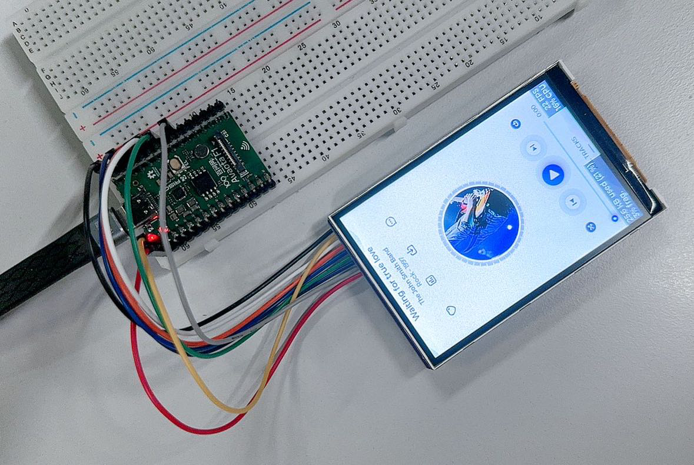
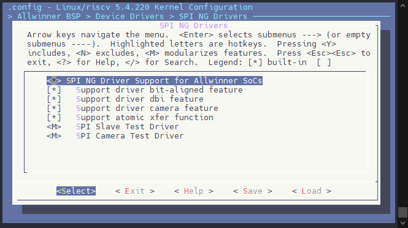

# DBI 驱动 ST7789V 3.5 寸 LCD

此次适配的 SPI 屏为 `jlt35031c` ，使用的是 DBI 进行驱动。



引脚配置如下：

| V861 | TFT 模块 |
| --- | --- |
| PD1 | CS |
| PD2 | SCK |
| PD3 | MOSI |
| 3V3 | BLK (PWM) |
| PD4 | RESET |
| PD5 | RS |
| 3V3 | VCC |
| GND | GND |

:::note

:::note

备注

:::
:::note

屏幕的 MISO 引脚由于没有实际使用，这里将 MISO 接到 PD6，这个脚由于不使用所以不接也可以

:::

:::

## 驱动配置

### 设置 SPI 驱动

勾选以下驱动：

```
Allwinner BSP  --->
    Device Drivers  --->
        SPI NG Drivers  --->
            <*> SPI NG Driver Support for Allwinner SoCs
            [*]   Support driver bit-aligned feature
            [*]   Support driver dbi feature
            [*]   Support driver camera feature
            [*]   Support atomic xfer function
```



## 编写 SPI LCD 显示屏驱动

整理后的初始化代码如下：

```c
sunxi_lcd_cmd_write(sel, 0x11);
sunxi_lcd_para_write(sel, 0x00);
sunxi_lcd_delay_ms(120);

sunxi_lcd_cmd_write(sel, 0xf0);
sunxi_lcd_para_write(sel, 0xc3);

sunxi_lcd_cmd_write(sel, 0xf0);
sunxi_lcd_para_write(sel, 0x96);

sunxi_lcd_cmd_write(sel, 0x36);
sunxi_lcd_para_write(sel, 0x48);

sunxi_lcd_cmd_write(sel, 0xb4);
sunxi_lcd_para_write(sel, 0x01);

sunxi_lcd_cmd_write(sel, 0xb7);
sunxi_lcd_para_write(sel, 0xc6);

sunxi_lcd_cmd_write(sel, 0xe8);
sunxi_lcd_para_write(sel, 0x40);
sunxi_lcd_cmd_write(sel, 0x8a);
sunxi_lcd_para_write(sel, 0x00);
sunxi_lcd_cmd_write(sel, 0x00);
sunxi_lcd_para_write(sel, 0x29);
sunxi_lcd_cmd_write(sel, 0x19);
sunxi_lcd_para_write(sel, 0xa5);
sunxi_lcd_cmd_write(sel, 0x33);

sunxi_lcd_cmd_write(sel, 0xc1);
sunxi_lcd_para_write(sel, 0x06);

sunxi_lcd_cmd_write(sel, 0xc2);
sunxi_lcd_para_write(sel, 0xa7);

sunxi_lcd_cmd_write(sel, 0xc5);
sunxi_lcd_para_write(sel, 0x18);

sunxi_lcd_cmd_write(sel, 0xe0);
sunxi_lcd_para_write(sel, 0xf0);
sunxi_lcd_para_write(sel, 0x09);
sunxi_lcd_para_write(sel, 0x0b);
sunxi_lcd_para_write(sel, 0x06);
sunxi_lcd_para_write(sel, 0x04);
sunxi_lcd_para_write(sel, 0x15);
sunxi_lcd_para_write(sel, 0x2f);
sunxi_lcd_para_write(sel, 0x54);
sunxi_lcd_para_write(sel, 0x42);
sunxi_lcd_para_write(sel, 0x3c);
sunxi_lcd_para_write(sel, 0x17);
sunxi_lcd_para_write(sel, 0x14);
sunxi_lcd_para_write(sel, 0x18);
sunxi_lcd_para_write(sel, 0x1b);

sunxi_lcd_cmd_write(sel, 0xE1);
sunxi_lcd_para_write(sel, 0xf0);
sunxi_lcd_para_write(sel, 0x09);
sunxi_lcd_para_write(sel, 0x0b);
sunxi_lcd_para_write(sel, 0x06);
sunxi_lcd_para_write(sel, 0x04);
sunxi_lcd_para_write(sel, 0x03);
sunxi_lcd_para_write(sel, 0x2d);
sunxi_lcd_para_write(sel, 0x43);
sunxi_lcd_para_write(sel, 0x42);
sunxi_lcd_para_write(sel, 0x3b);
sunxi_lcd_para_write(sel, 0x16);
sunxi_lcd_para_write(sel, 0x14);
sunxi_lcd_para_write(sel, 0x17);
sunxi_lcd_para_write(sel, 0x1b);

sunxi_lcd_cmd_write(sel, 0xf0);
sunxi_lcd_para_write(sel, 0x3c);

sunxi_lcd_cmd_write(sel, 0xf0);
sunxi_lcd_para_write(sel, 0x69);

sunxi_lcd_cmd_write(sel, 0x3a);
sunxi_lcd_para_write(sel, 0x55);
sunxi_lcd_delay_ms(120);

/* Display ON */
sunxi_lcd_cmd_write(sel, 0x29);

sunxi_lcd_cmd_write(sel, 0x36);
/* LCD_DISPLAY_ROTATION_0 */
sunxi_lcd_para_write(sel, 0x48);
/* LCD_DISPLAY_ROTATION_90
sunxi_lcd_para_write(sel, 0xe8); */
/* LCD_DISPLAY_ROTATION_180
sunxi_lcd_para_write(sel, 0x88); */
/* LCD_DISPLAY_ROTATION_27
sunxi_lcd_para_write(sel, 0x28); */

/* set_screen_size */
sunxi_lcd_cmd_write(sel, 0x2a);
sunxi_lcd_para_write(sel, 0x00);
sunxi_lcd_para_write(sel, 0x00);
sunxi_lcd_para_write(sel, 0x01);
sunxi_lcd_para_write(sel, 0x3f);
sunxi_lcd_cmd_write(sel, 0x2b);
sunxi_lcd_para_write(sel, 0x00);
sunxi_lcd_para_write(sel, 0x00);
sunxi_lcd_para_write(sel, 0x01);
sunxi_lcd_para_write(sel, 0xdf);

address(sel, 0, 0, info[sel].lcd_x - 1, info[sel].lcd_y - 1);
address(sel, 0, 0, info[sel].lcd_y - 1, info[sel].lcd_x - 1);
```

对照屏厂提供的驱动修改 `address` 函数，做如下修改

```c
static void address(unsigned int sel, int x, int y, int width, int height)
{
    sunxi_lcd_cmd_write(sel, 0x2a); /* Set coloum address */
    sunxi_lcd_para_write(sel, (((x + lcd_dev_xoffset) >> 8) & 0xff));
    sunxi_lcd_para_write(sel, ((x + lcd_dev_xoffset) & 0xff));
    sunxi_lcd_para_write(sel, ((width + lcd_dev_xoffset >> 8) & 0xff));
    sunxi_lcd_para_write(sel, ((width + lcd_dev_xoffset) & 0xff));

    sunxi_lcd_cmd_write(sel, 0x2b); /* Set row address */
    sunxi_lcd_para_write(sel, ((y + lcd_dev_yoffset >> 8) & 0xff));
    sunxi_lcd_para_write(sel, ((y + lcd_dev_yoffset) & 0xff));
    sunxi_lcd_para_write(sel, ((height + lcd_dev_yoffset >> 8) & 0xff));
    sunxi_lcd_para_write(sel, ((height + lcd_dev_yoffset) & 0xff));

    sunxi_lcd_cmd_write(sel, 0x2c);
}
```

完成驱动如下

```c
#include "jlt35031c.h"

#define RESET(s, v) sunxi_lcd_gpio_set_value(s, 0, v)
#define power_en(sel, val) sunxi_lcd_gpio_set_value(sel, 0, val)

static void LCD_power_on(u32 sel);
static void LCD_power_off(u32 sel);
static void LCD_bl_open(u32 sel);
static void LCD_bl_close(u32 sel);
static void LCD_panel_init(u32 sel);
static void LCD_panel_exit(u32 sel);

static uint16_t lcd_dev_xoffset = 0;
static uint16_t lcd_dev_yoffset = 0;
static struct disp_panel_para info[LCD_FB_MAX];

static void address(unsigned int sel, int x, int y, int width, int height)
{
    sunxi_lcd_cmd_write(sel, 0x2a); /* Set coloum address */
    sunxi_lcd_para_write(sel, (((x + lcd_dev_xoffset) >> 8) & 0xff));
    sunxi_lcd_para_write(sel, ((x + lcd_dev_xoffset) & 0xff));
    sunxi_lcd_para_write(sel, ((width + lcd_dev_xoffset >> 8) & 0xff));
    sunxi_lcd_para_write(sel, ((width + lcd_dev_xoffset) & 0xff));

    sunxi_lcd_cmd_write(sel, 0x2b); /* Set row address */
    sunxi_lcd_para_write(sel, ((y + lcd_dev_yoffset >> 8) & 0xff));
    sunxi_lcd_para_write(sel, ((y + lcd_dev_yoffset) & 0xff));
    sunxi_lcd_para_write(sel, ((height + lcd_dev_yoffset >> 8) & 0xff));
    sunxi_lcd_para_write(sel, ((height + lcd_dev_yoffset) & 0xff));

    sunxi_lcd_cmd_write(sel, 0x2c);
}

static void LCD_panel_init(unsigned int sel)
{
    unsigned int rotate;

    if (bsp_disp_get_panel_info(sel, &info[sel])) {
        lcd_fb_wrn("get panel info fail!\n");
        return;
    }

    sunxi_lcd_cmd_write(sel, 0x11);
    sunxi_lcd_para_write(sel, 0x00);
    sunxi_lcd_delay_ms(120);

    sunxi_lcd_cmd_write(sel, 0xf0);
    sunxi_lcd_para_write(sel, 0xc3);

    sunxi_lcd_cmd_write(sel, 0xf0);
    sunxi_lcd_para_write(sel, 0x96);

    sunxi_lcd_cmd_write(sel, 0x36);
    sunxi_lcd_para_write(sel, 0x48);

    sunxi_lcd_cmd_write(sel, 0xb4);
    sunxi_lcd_para_write(sel, 0x01);

    sunxi_lcd_cmd_write(sel, 0xb7);
    sunxi_lcd_para_write(sel, 0xc6);

    sunxi_lcd_cmd_write(sel, 0xe8);
    sunxi_lcd_para_write(sel, 0x40);
    sunxi_lcd_cmd_write(sel, 0x8a);
    sunxi_lcd_para_write(sel, 0x00);
    sunxi_lcd_cmd_write(sel, 0x00);
    sunxi_lcd_para_write(sel, 0x29);
    sunxi_lcd_cmd_write(sel, 0x19);
    sunxi_lcd_para_write(sel, 0xa5);
    sunxi_lcd_cmd_write(sel, 0x33);

    sunxi_lcd_cmd_write(sel, 0xc1);
    sunxi_lcd_para_write(sel, 0x06);

    sunxi_lcd_cmd_write(sel, 0xc2);
    sunxi_lcd_para_write(sel, 0xa7);

    sunxi_lcd_cmd_write(sel, 0xc5);
    sunxi_lcd_para_write(sel, 0x18);

    sunxi_lcd_cmd_write(sel, 0xe0);
    sunxi_lcd_para_write(sel, 0xf0);
    sunxi_lcd_para_write(sel, 0x09);
    sunxi_lcd_para_write(sel, 0x0b);
    sunxi_lcd_para_write(sel, 0x06);
    sunxi_lcd_para_write(sel, 0x04);
    sunxi_lcd_para_write(sel, 0x15);
    sunxi_lcd_para_write(sel, 0x2f);
    sunxi_lcd_para_write(sel, 0x54);
    sunxi_lcd_para_write(sel, 0x42);
    sunxi_lcd_para_write(sel, 0x3c);
    sunxi_lcd_para_write(sel, 0x17);
    sunxi_lcd_para_write(sel, 0x14);
    sunxi_lcd_para_write(sel, 0x18);
    sunxi_lcd_para_write(sel, 0x1b);

    sunxi_lcd_cmd_write(sel, 0xE1);
    sunxi_lcd_para_write(sel, 0xf0);
    sunxi_lcd_para_write(sel, 0x09);
    sunxi_lcd_para_write(sel, 0x0b);
    sunxi_lcd_para_write(sel, 0x06);
    sunxi_lcd_para_write(sel, 0x04);
    sunxi_lcd_para_write(sel, 0x03);
    sunxi_lcd_para_write(sel, 0x2d);
    sunxi_lcd_para_write(sel, 0x43);
    sunxi_lcd_para_write(sel, 0x42);
    sunxi_lcd_para_write(sel, 0x3b);
    sunxi_lcd_para_write(sel, 0x16);
    sunxi_lcd_para_write(sel, 0x14);
    sunxi_lcd_para_write(sel, 0x17);
    sunxi_lcd_para_write(sel, 0x1b);

    sunxi_lcd_cmd_write(sel, 0xf0);
    sunxi_lcd_para_write(sel, 0x3c);

    sunxi_lcd_cmd_write(sel, 0xf0);
    sunxi_lcd_para_write(sel, 0x69);

    sunxi_lcd_cmd_write(sel, 0x3a);
    sunxi_lcd_para_write(sel, 0x55);
    sunxi_lcd_delay_ms(120);

    /* Display ON */
    sunxi_lcd_cmd_write(sel, 0x29);

    sunxi_lcd_cmd_write(sel, 0x36);
    /* LCD_DISPLAY_ROTATION_0 */
    sunxi_lcd_para_write(sel, 0x48);
    /* LCD_DISPLAY_ROTATION_90
    sunxi_lcd_para_write(sel, 0xe8); */
    /* LCD_DISPLAY_ROTATION_180
    sunxi_lcd_para_write(sel, 0x88); */
    /* LCD_DISPLAY_ROTATION_27
    sunxi_lcd_para_write(sel, 0x28); */

    /* set_screen_size */
    sunxi_lcd_cmd_write(sel, 0x2a);
    sunxi_lcd_para_write(sel, 0x00);
    sunxi_lcd_para_write(sel, 0x00);
    sunxi_lcd_para_write(sel, 0x01);
    sunxi_lcd_para_write(sel, 0x3f);
    sunxi_lcd_cmd_write(sel, 0x2b);
    sunxi_lcd_para_write(sel, 0x00);
    sunxi_lcd_para_write(sel, 0x00);
    sunxi_lcd_para_write(sel, 0x01);
    sunxi_lcd_para_write(sel, 0xdf);

    if (info[sel].lcd_x < info[sel].lcd_y)
        address(sel, 0, 0, info[sel].lcd_x - 1, info[sel].lcd_y - 1);
    else
        address(sel, 0, 0, info[sel].lcd_y - 1, info[sel].lcd_x - 1);
}

static void LCD_panel_exit(unsigned int sel)
{
    sunxi_lcd_cmd_write(sel, 0x28);
    sunxi_lcd_delay_ms(20);
    sunxi_lcd_cmd_write(sel, 0x10);
    sunxi_lcd_delay_ms(20);
    sunxi_lcd_pin_cfg(sel, 0);
}

static s32 LCD_open_flow(u32 sel)
{
    lcd_fb_here;
    /* open lcd power, and delay 50ms */
    LCD_OPEN_FUNC(sel, LCD_power_on, 50);
    /* open lcd power, than delay 200ms */
    LCD_OPEN_FUNC(sel, LCD_panel_init, 200);

    LCD_OPEN_FUNC(sel, lcd_fb_black_screen, 50);
    /* open lcd backlight, and delay 0ms */
    LCD_OPEN_FUNC(sel, LCD_bl_open, 0);

    return 0;
}

static s32 LCD_close_flow(u32 sel)
{
    lcd_fb_here;
    /* close lcd backlight, and delay 0ms */
    LCD_CLOSE_FUNC(sel, LCD_bl_close, 50);
    /* open lcd power, than delay 200ms */
    LCD_CLOSE_FUNC(sel, LCD_panel_exit, 10);
    /* close lcd power, and delay 500ms */
    LCD_CLOSE_FUNC(sel, LCD_power_off, 10);

    return 0;
}

static void LCD_power_on(u32 sel)
{
    /* config lcd_power pin to open lcd power0 */
    lcd_fb_here;
    power_en(sel, 1);

    sunxi_lcd_power_enable(sel, 0);

    sunxi_lcd_pin_cfg(sel, 1);
    RESET(sel, 1);
    sunxi_lcd_delay_ms(100);
    RESET(sel, 0);
    sunxi_lcd_delay_ms(100);
    RESET(sel, 1);
}

static void LCD_power_off(u32 sel)
{
    lcd_fb_here;
    /* config lcd_power pin to close lcd power0 */
    sunxi_lcd_power_disable(sel, 0);
}

static void LCD_bl_open(u32 sel)
{
    sunxi_lcd_pwm_enable(sel);
    /* config lcd_bl_en pin to open lcd backlight */
    sunxi_lcd_backlight_enable(sel);
    lcd_fb_here;
}

static void LCD_bl_close(u32 sel)
{
    /* config lcd_bl_en pin to close lcd backlight */
    sunxi_lcd_backlight_disable(sel);
    sunxi_lcd_pwm_disable(sel);
    lcd_fb_here;
}

static int lcd_set_var(unsigned int sel, struct fb_info *p_info)
{
    return 0;
}

static int lcd_blank(unsigned int sel, unsigned int en)
{
    return 0;
}

static int lcd_set_addr_win(unsigned int sel, int x, int y, int width, int height)
{
    address(sel, x, y, width, height);
    return 0;
}

struct __lcd_panel jlt35031c_panel = {
    /* panel driver name, must mach the name of lcd_drv_name in sys_config.fex */
    .name = "jlt35031c",
    .func = {
        .cfg_open_flow = LCD_open_flow,
        .cfg_close_flow = LCD_close_flow,
        .blank = lcd_blank,
        .set_var = lcd_set_var,
        .set_addr_win = lcd_set_addr_win,
    },
};
```

### 配置设备树

```c
&pio {
    spi1_pins_default: spi1@0 {
        pins = "PD1", "PD2", "PD3"; /* CS, SCK, SDA */
        function = "spi1";
        allwinner,drive = <3>;
    };

    spi1_pins_hold: spi1@1 {
        pins = "PD5"; /* DC */
        function = "spi1_hold";
        allwinner,drive = <3>;
        bias-pull-up;
    };

    spi1_pins_sleep: spi1@2 {
        pins = "PD1", "PD2", "PD3", "PD5";
        function = "io_disabled";
    };
};

&lcd_fb {
    status = "okay";
    port {
        #address-cells = <1>;
        #size-cells = <0>;
        spi_panel0: endpoint@0 {
            reg = <0>;
            remote-endpoint = <&panel_jlt35031c_spi1>;
        };
    };
};

&spi1 {
    pinctrl-0 = <&spi1_pins_default &spi1_pins_hold>;
    pinctrl-1 = <&spi1_pins_sleep>;
    pinctrl-names = "default", "sleep";
    clock-frequency = <100000000>;
    sunxi,spi-bus-mode = <SUNXI_SPI_BUS_DBI>;
    sunxi,spi-cs-mode = <SUNXI_SPI_CS_AUTO>;
    status = "okay";

    panel_jlt35031c_spi1: slave@0 {
        device_type = "spi-panel";
        compatible = "allwinner,spi-panel";
        reg = <0x0>;
        spi-max-frequency = <100000000>;
        lcd_used = <1>;
        lcd_driver_name = "jlt35031c";
        lcd_if = <1>;
        lcd_dbi_if = <2>;
        lcd_data_speed = <150>;
        lcd_spi_bus_num = <1>;
        lcd_x = <320>;
        lcd_y = <480>;
        lcd_pixel_fmt = <10>;
        lcd_dbi_fmt = <2>;
        lcd_rgb_order = <0>;
        lcd_width = <60>;
        lcd_height = <60>;
        lcd_pwm_used = <0>;
        lcd_pwm_ch = <6>;
        lcd_pwm_freq = <5000>;
        lcd_pwm_pol = <1>;
        lcd_frm = <1>;
        lcd_gamma_en = <1>;
        fb_buffer_num = <2>;
        lcd_backlight = <100>;
        lcd_fps = <60>;
        lcd_dbi_te = <0>;
        lcd_dbi_clk_mode = <1>;
        lcd_gpio_0 = <&pio PD 4 GPIO_ACTIVE_LOW>;
        status = "okay";
    };
};
```

## 功能测试

勾选 LVGL，运行测试

```
lv_examples 1
```

屏幕可以正常显示，帧率正确即可。
