# FASTBOOT 异构 RAMDISK

在快启流程中，除了启动 BOOT、KERNEL 阶段的性能优化，还有启动到内核中 ROOTFS 加载速度提升。

SDK 支持异构 RAMDISK 模式，相较于传统快启 RAMDISK 模式，异构 RAMDISK 通过异构系统，加速 RAMDISK 的读取和解压启动。并且保证系统的独立与并行。

传统快启 RAMDISK 的加载流程如下

-   BOOT 初始化 FLASH，加载内核和 RAMDISK
-   加载后将 FLASH 驱动，DMA 参数保存到预留内存，跳转进入内核
-   Linux 在初始化阶段，启动一个内核线程使用 BOOT 阶段预留的 RAMDISK 压缩的地址，开始解压，使用硬件或软件解压
-   解压后启动 RAMDISK 中的应用程序，执行应用

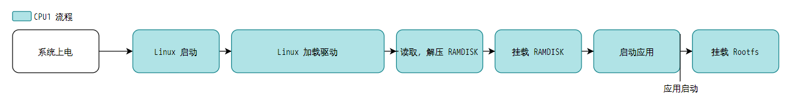

传统快启 RAMDISK 的缺点也很明显，需要内核参与，需要预留内存给 RAMDISK 使用，RAMDISK 需要打包在一起，OTA 更新 KERNEL 的时候也需要 OTA RAMDISK。

异构 RAMDISK 通过最大化系统资源，在 BOOT 阶段就启动双核系统，单独使用一个核心操作 FLASH 进行 RAMDISK 的读取解压操作，此时内核无需调度解压读取，当 RAMDISK 解压完成的同时通知内核可以挂载 RAMDISK，此时直接启动 RAMDISK 中的应用程序。

其优点如下：

-   无需魔改内核，增加解压线程
-   复用内核 RAMDISK 流程，对于内核来说与主线标准 RAMDISK 无差异
-   RAMDISK 可以放到分区上，支持直接 `dd` 命令 OTA 更新 RAMDISK
-   SDK 配置简单，SDK 支持自动打包 RAMDISK，支持 Quick Config 一键切换

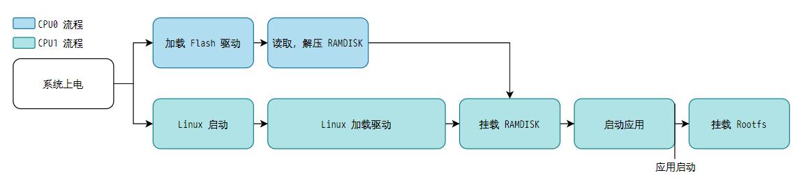

## 异构 RAMDISK 功能配置

### Linux 端相关配置

#### 设备树预留内存配置

首先设备树需要配置 RAMDISK 的预留内存，与标准配置无异

```
linux,initrd-start = <0x47800000>;
linux,initrd-end = <0x48000000>;
```

![RAMDISK 预留内存](data:image/png;base64,iVBORw0KGgoAAAANSUhEUgAAAcQAAAB5CAYAAACnfFEAAAAgAElEQVR4nO2de0xVebbnP4WovJHTaIPKFRWRchDm0JWoyG3qFBjtxOpM+eKOCR1sJt5LosbcjmNJLs6kSeiySXcqWgnTJo6mTOyLj+qk25m2olyavjTVJh1oHuMDX9jHElTuQTi8LEuZP/bj7H04L14HlPVJSDhn7/177H32/v7W+q39W++kpb83giAIgiDMckKmuwGCIAiCMBMQQRQEQRAERBAFQRAEARBBFARBEARABFEQBEEQABFEQRAEQQBEEAVBEAQBEEEUBEEQBEAEURAEQRAAEURBEARBAEQQBUEQBAGYKYL4/VNsOPxzIqa7HRMhoZzf5n/Ob/PL+fF0t0UQBEEYM6HT3YC3g3/g0/Rl3G/7EQe7prstgiAIwniYGRbim07kEr7LQ1pEDAVBEN5YQkNC5vD69augVBax8zdkZkTpn59f3cTNP3rePtxykqYLF/Rt8f94lVVLtU/9PPr8I+x3tM87STq8l6V60X/jTlkx3drH759iw6a/83hsxM7fsJpz2C179fLd2yUIgiC8/YTGxsbwvLeXkdevp7QiRewc3Cn7yCVURqKsrLL8nq/KfqkK2BbiL1ygWz121YImmsv+O4NaWT86xZAqehE7d7P0+e/56tgvR5e76udYN1l49PkmRQS/f4oNhmMBwjL2ktRykq9+dUEpe8PPifijUhdA6Ny5zJ8/H4CB/v5JPjOCIAjCTCAkZM4cIiMjp7iaf2ZZRhTPrxZ7FkOA/iaaf6UK2h//H8+xEL7KcOxXLoEavHCOR/1/x8LvG45f+p+I91BsxH9eBS3nXNbkH6+MPvbR73VrdPCvdxiO+o4pwOcdICwsjPlhYZ7bHr2AyMHn3PPWN0EQBGHGE/rq1SsGBgamtpZVCYTRT3fneAvop9/HsYMXPuKO5Sqryq+yCrO7NcISRdjSvWzI2Gs65vkYag8JCWF4eJiRkRHzhsif8OsNmUQ++7/8sOFfx1CiIAiCMNMI7QuCu5Q7XQyzagIFRBGVCOhzhklERZn36P7VJtX6/GfeLd+LFXRRdJ+PHCsvXrzgxYsXozcM/IL/eg3llYvsn/CLhl9QN+5aBEEQhOkk5PVUiyEAv+TZoyiWbhvPu4a/5NkjWLDBdWzEzr9nQX8TDz0GvtgxTvN13/wbYRm7SZqIHvvD+ZyBiAWsnMIqBEEQhKklaO8hdv9qE/zjVTLLr+rfBRrNOfrYv3GnTJtTdI8wBR79nq80i/CPxXzFKTb86Cp6kKp7FKogCIIw63knLf29Ef+7CT6J/Am/3rCAq9fK+N/T3RZBEARhXMiL+ZPBwNc8YSFJUx2sKwiCIEwZIoiTwr9ysO0Z39sga5kKgiC8qYjLVBAEQRAQC1EQBEEQgCAJ4nfiPa0hIwiCIAgzB7EQBUEQBAERREEQBEEARBAFQRAEAYA58YsW/8+priQiIoKhwUH/O04Fufso353C1/Wt/Mf0tOAtJJHtVRtY/3dP+OucZez5l++xMvw+N28EoeaSHP5b8WrWb13J+swh/vzvQU7HtS6FPf/yPd6f1LojsVW+jy3lCX/9y8tJKjOYKL+Hze+H8PCqA0mQJowZ7b7aupL1W2MZ+j9dPNE3Ts79oT07lvh4VgVt6ba3lzR2HikmruEQJ2Vl7ymns6qeT1F+3AVx092aMbLDysF1TqoP3WXciV+EwFmXwp6iaBpLmmge88GR2CqzydSWhLS38WnFGK7aDisH87RgwiGaz9RTe93YruXEakXXXOXSRdehmaWbsCUZC3M73lfZqPdGRrj6qZtaU/8T2V6VjlZ8b0sDp6sM2Y4mVPYEuH6X09fv6tdsuhBBFMZBH45+4NkAXB+gr2gIh3262xQktBtXMNDJpZK3S+IzS7PJ7Gnj00OdaCKyp6TPLB7eWJfCnrxIms9cpfa6KiJFVhzXm2gmEtuOBDrUbYoA5WCzm4XHXSQDK1spryBjgNqSeppRxbUyhaeH7tJJJLbKdGJaGvi0akAVn2y271DrmlDZMx9tMO2L0JCQObx+/SooDTISExNDf/9A0OpOLDhKYaYy8uhvPsWx6lv6ttySSvL1EZmTljM/5UK79jmPvRVbcG1u4uzPztHuftzmSso3M6r8VEO97mXnllSy3nGK37BL38f+pcHSTN3N4SIr5kxXD7lW+pmSZip3H+Wbl+lb3Ps1dQxQe0hbaN3Tw9Df6No8SjVt16yoi7BFG0UHODpPLMmhYEWXyQIzfbfDysHULqp7VuqjXNMI2U/dxpG7x5G1t7JNFkE8BVXL1YO8jbC18xP4CNw8cjc+UJVrYbnuesAq1vU9tV+JbK9K4O4ZJ1laG/sf6OdQ6bOhHWpfUPtmqnc8VpTJYk5ke9VKHAarxNwvs8WSWbqJrJ4GrmDV91H6bf592ao2YfNwvFfWpZCVNETzGa0vnTS0rKRgRSKJqL+jvPhR5zgT5bwtyltOrL1Nr6ez6h72qnRSdkDzxQFqD9W76rrYhT0vHUsS4K9dQKbPsiOxrYunt6VB/8001zwgqyiBtHV36UxKJTOqm1rtd3v9Lo15y7GlJgKdEys7gLaDr9/pWBjr/WH8PXj+DWj3dmhsbAzPg5ET0Y3hF8MEre5oK/mWK5SV1qgis4udTYowpRYcJX9BE2dLFZFLLThKYdE+npZ+Rh1p7DyyhbjmU5RV30JzjxaWPKGsqoa6qkPqPl5cpqm7eZ/zlJUaxHH7bppVQQWIyiym0K60LbXgKIXZu0mtO0c7aezcbgWt7tx9lG+20HJGFUPy2LvZQsuZQwbxNjN//nxC585lZGSEwXEkgR7v8ebRtfKwMI6uM0sTuFtylUuA9mPdvqPTdWNELaegqJvakqs0r0thT9FKbOs6/T7IOhu76M0w3qCRpK0Ip/d+p2sEm5ROAW18WtKpPtyt2NYZbhAfdTdXXNVHxlmeGmAse4eVg3mpZNJEs2ZVBuQyVc6HPooPhHUpbDGM3MdOPLYilD6r9WfvuMuli9Bc0YClMhtbaSLNFX3YdrjEEKbYhb0uhWya+LREqSuxJIeCHSncuu46f7EZ2RTYlXOeWJJDwboUEi/eVQZp43WZJkUT29/FLYOLUnmIR7MI6LzYRPXCHAryrGRebOJpiVUXw04iSYsD+3WthYpVlgT0LowEJpKMPRKLz7JjsEQN0dGo1ZHIdnWQY0mCxIWRYL+nn4vEkhxlgNcfSeIEy9bEfO7cucybP9/jM0MRw4n8TtV6x3p/6IN2ZcA1ih1WfdAXGjJnDpGRkfQ7neNuoj8WxHm/U6a6bkCx6qpqlP/bG7nvtLLCmgbtS3g/Mxr7ly6Baq8+T8uKYlbnQh35ZEQ/5Jpudd3iwqUmVhS9Sy41/pMBt5/jpEGs2pvu0p9pIRH0+oxtM21PzWJFtJP7TWrddTexb95CnOngaLUfnq3C169fExYWxgiYf5weLU/AfoUy7Tz5Ot4niaQkdVOrW40D1F7v5uA6dXQNNFc0Gfbv5K49nSzTw2KI5jPqQ+x6Jx07lgc2glZHvFlZkXB9ANYlkhzVTaPxxul/QLVmxXgse5x1u5d9sQt73kos6wI8FlBu2OXEuFmf7qNqDfPoOl4dyQdalxFDn0ddjwFqD7VhqVqJrWRAefAH/CCaINfvcslw7pQBjypK2peGc+5x+0TQLftuakvaSKlyXc/OqnpqSzeRVZJCXwY0nxk9yNGsjt6WBqqxUhAXg7sgZpamk9T/gGq365aUt4mDecr/o7wRXsvWcHlo7DVXqU3dpF5PFW2esP8B1WdgS1E0iwytH1/ZrvZ5fmYkkp0Rjr1momI4+v6YKJmp8WBvoxkIffXqFQPjsB7GwvOeHv6j25x9cN78eURERE553aO5xdPnsEL/7KTH193jdEzg5lKsxwzTHPFD0x799xtd+tZ+jmOl2v9P6MHqErzcd0niIdd0Fa7h5JnvcriomPJMpVzdlaoyAgwPD49uVvs5jpWe89t6r8f7Yl0kMcQb3FQq/YZBj2niXqG3x7ivYXRucs/6p7m9G5sqvmQlQIt/6yDGeENPoO6JEpuxnFiGaG403xN+5z6u3+V0UjQHtYeoweU5OXRyqSaBg3mRNJ9pGlu57td6TG1zc70DuGUxNVn/1+9yOuDBhx+MngJQ3KgMcNdQfnNFGymqtXLJrd6kvE2KFVOheUXC6e3pM+2jWGjd1JaYz4fmiVD3YntVNntKGjhd5a/sGCCczKJs7DVX+VR350Jf+wAsBJLSORj3gOoS9TrusBLb7+QpYJlI2SovX75Unhkjbktkr4skhiE6JhBr4O3+mChPe4YgI4FMOgntmwZ3KUDY/DCmp+40Fi2Anhu3gCVAtJvVtYQ4o4BFu1l0iZbRlpUXckuKycDljlUsM0uAR39NjxOSMjXBU+YXTVapQdhSC45SWLEPDKL47cuXfPvSQ5hygBai1+P94sO3vy6FPab5Fx8uyPGgWmZp6zphBXRc9H/z9D0L9qDMM70t6nyYMZCBAC3Ei03qQ0o5nwWVTJ4orkthTx7U1gxgc2ubXwztGiuZpeq8nCYYwYpAtDvpJZKOM4Z+JkXrwqGguBSpaaMvzxCYwgCOHqCnzWDFKO5Io3Ao1xSDZe4N1WInsLId/RBzv8HgOVBcnQ47dOoWv2GOfWEk9HTRyQCLJlC2kYF+Dy/eXB+gr8hnR/3i7f6YKJ3PBkAdxIe8ngYxBOjr62Na6s5V3KC36wBquG2HpOzdpKqbUws2kuRs4g91KG5KlrG+IE3dmsbO7GX0N18zCJNicSatyfNc3/Mnqpgqc4KBiim5+aqYHqJM/fP1Wkd7lyPQklUhdZWr/xnEcNxc76SjPx5baaKPnQw30Q6rW4j5ROmkoQUyd1hJ7rnnc94xscRKZlQ3d8f5wB4zdie9UQmkrfO+S2dVPbX2eGyVKSQavvu05OqoP2/BCE97hkZ9F6O5zHZYPYqrdyLVecN2mi82KW3zeW3HSJTi4jTOWZnoGVAf3ko7Yt23++L6AH2qK9kzkdgqN3GwKgeb8Zpc76SjP5zMHdo1UANKDNZoojpv2HCxk0s13STlWVHHrTS3d0NSOtu1enekmn5nLjEMIMBnhxVbkmvuznfZA9y6P0RshlXvT2LJSpI0r8fFLuwYr5/qxmzvnHjZfunkrt14TseHp/tjYijX1l6j3FNBSf/0nfj4US7ToOEWienJtWiOMnXf7hZl6mZFedpHj/Z0s8TszU3EZVr4s1q+FmXqOTLUk7vVEIU6ql/u0bHTyWhXl3EexPSeVf8DmnuWk9yjbvcZeOLJhcbo6EZ17qfPPYJtlKvWzZL1WbdbZKx7vwKImARv73Ep/Uq+r50jrZ+BRUWOtiDd+mWMcu1/QO39BGymKFNzO7XozdNVmKInO41l2dv4tKIvsOvhA+NvwV7TBnmGtri/r9fygJgMV5CMq50+LPwA36sbHe1o/q0Zf7+jBU3b13DeTfUar4fn35HLley+3YO3xWvZ5j6Zy9W3msof1e8Jle0f93cstfo9e0Em5/7wNEVj+i0Ytr9Vgvjv8b1TXocgCLODv+8ekz0qvJGYX0t6K17MFyEUBGGy0Z4rIoxvMzFYDB6ON95CFDEUBGGqEVGcobi51d3x9MrKKN4Wl6mIoSAIwUJE8e3nrXCZasgPVhCEyUIG3LOPNzYfovuPVcRQEITJxP2ZIgL59vPGCqIgCIIgTCYiiIIgCIKACKIgCIIgAG9ZUI1njKvIeF/NRVmtZiat9qKirXbjcYUc/wSlX7n7KM926HkiBUEQ3kRmgSDWcLK0BkUYN053Y2YQPvI4TjdTKbDqAut/dlu+b/oJ4+M9a7BqS/U96qDgizGsT2sq4xuazrfxSReQsJjTuxKIcN/V2cWJ04+px8M+xm0Aa1dSbdMCTAxlB9RuC8cOJJOsfhpsvcGeWkMGFZ9lQ44tnf1r56mferl8/B5nx3ROBCFwZoEgBoaS7HcGEmCqJm/M2H7NctzXsS3ctgZrbwcFpx1oInLaNmgWDz/k2FKw9vbSEW1YE7LrMXuOPzbtV7gti60Mq4Jn4dguC7fPN6pCpAhcsc1Bfe2wIpa2cJrU7Tm2dPbvWkmhKky+2x3Gx3uSWdR6gwKtrF1rONbdyOFW/JbN2pXsXzvE5eNtal1ZbN2zmAeaWOfuo3zNzclZlF4QgNCQkDm8fv0q6BXHxMTQ3z8wLXWbMC3A7b6wdxo7j+yCS38irkhzuxr3UazOHoM70vWgQ1mcmyaXpaMuyK0v0O0H46Lj+oLh+kblYXDWsZHCzOjR+/jol2kx882VlG92q0O3om6yWnM3O5tMFltqwVG9XgCcY7Fm3BZM18o2tXkZhRVWdQdj+90WPTe1y2X13l6j9VFzF5vrzK+oJB/j9jE0f0KkuX4XVeq1SljMB0u/oem8dg4d/K51MfuTLeTwmOXbsti61GAdqRYdRmsrYTHFa6HpfA9xu3xls7CQbqwrIYxFDNGmW2XDfN0Lq9VPhdkJRDzq0K22+trHfLg2mfS1wDPf7a5fuwRrdC+XtTZ2PebfHiWwdZUFWh2+y24N4+P3YhlsvaFbhGcbuvhgl4WchMfUdwF112jJLqb8yHe9ehOU3ykzbypEmJGExsbG8Hwa8hIOvxhmuuo2oVlgXnMVRpNRtJGWM4c42a48zNYXpFHnMUOFkVtc+NkV4iq28FFBI8eql7B3DGIILusut6SS9Z52SNpCIVcoK61RxTaf3OpbinD46JdSrj+X6TLyKyxqvxUxeT/3HO1qpo3CTAfXSn+q1JW7j/LswPoEkFuyhbjmU5S5n0OtzT5cpqkF+XDpEGXtoImLcn5dZSVtrlTKr7qliH9eHhfaVdd5AC7TyKgoGBkZd/Jq78erouw+H7wwnAinQ3nIg2oZzQPCWQ6c/eIGS/asYes2C2e/GOTjH7iJIWH6d590RXDMR9tybItJfvSYw1pdXQ5uO9e4LK+1K9m69BuaGhQLb0ksdPxFEzzF4ksGBuPDAN/tJj4cHj3WBS3Hls7WpYAzjBy/ZUcQF/0Nt29qfbRwTHXrxi0EukC5xw7xtKSSwgrLqCw2gjBWQkPmzCEyMpJ+p9P/3uNkQVyc121TXfdkYP9SG13eovm+kwzLEsCfIIIrq30+O7EoD8LJvGOdTZzVHqx1N7Fv3siiVJisiTdXv2u4bd/C+gQlL+TO7GWjkxWPkagVWaRya8xNba/+zHCMl+thv6ILZN2Nh+Rnf5dAT8vcuXMJCwtjBMyCFmBSZX/H42kgoKHP5fVy+XgH6QcWsyQB6Brmk9MdHDuwmI9tQ1jp4oRpHm6J4btRs4UGLHy4FoNFBzDMJ6cbFXflgQT206u7KI0Ubsti61JlDvAEKeyPi3Alr/fS7gd6+9R5QmcXJ85D8S5VMH2VreOao+yobeTyqiw+iA8DXP2vqzpEZ8FRCiuOssjNEmyv/ill1T5OiSAYCH316tW4R8KB8rynZ9RapvPmzyMiInLK65522s/xm+ajqkX1Js11aEmUFVxzkWle9jcwSjzMLtu6qlMsOlKsu0THYjV7FCa3jN32G4bzXPfZmAYhI8Dw8DAjI25L/AY4l+vt+FRrClGAh1ziCtEJ7N/Vy+XjjS63qMmV6eBwbRzVtnCazt9zBbxg4dio7zyTY1tMstPB77qM36qC09tBwXGHKoxZpNeq83xAsi1LmQf8QhGhwm3zGOwZBOJ8t/tdYGky1bFdnDiutm/tSvY7h3gALPFZdgQwD+uuNXTUNlLQqrb1PXh6x9u8ajQZqjdAEMZDaN80uSzD5ocxXXUHldx9FK64y7XmFPKP7KZzNrya4Fc8FFfXBVAFrpK9BCKKeex1s7JSC45S6MnTPU6+ffmSb1++HL0hQAvR2/GKpZLH3opiyi1uLtNnQwwSzu3zhgjKheFEqMIBqAEocLl2iK2mwJM4kplH8q4sjIZQ8q4sqk0RnxY+XDuPjtrHZuHU5vlOK/vV17YB6ex/bzE5rY/5uhesvR0m9+ySWFWU/LS7vnuI/Qxx2RCxmhMfDr091DPMcl9lAz1OWNRxQxdmzY3a88x8bpU58YcuF74gjJOQ19MkSH19fUxX3ZNLNHGJyn+pBUddwSoA5Cnzhg3nqKs+TwtWPipws7BSd3O4opLyI7tJDVaTAbjF0+eQtCZvYsel7ubw5mXjb0b7E3rcv+t00B+dQqaXE9LT5Qoc+sgY2BNwfctYnTvWdp7jWOkhytz/xhThWMPJ0lO0LNhivt5dDm4752H9wWJyAMUSimWww6EKiTZH+DVnW+9x+VEsW7epo4DWexQcbzT8ddDBNzSdbzS9/qBYh138rhUPhCuuWbWunOR50KtEoZ690wtLkzm2Vt2sCmhbawDtbu2hA0NbNVG+o7TLZ9kMU9/xDRFrU/g4wdgHw5wlqhguaOKsl/nD1IKjlFdUsnes11uYlbz9r12okZ0aSUWVZBgiC92jJZXoQ/doU2/UcPLLdynXIjXtV7hm36IGwBgCKOoAbnGh4SHlm4s5jCEatL2R+04rGdEWEjHOc7lFYiYVU57pIdrUC4H0q67qCqsrtlBesQUIvGzzcQ+5dqaJ9dv9Hua5X1q9xpOtuZmLKskAXC7XGv7QvJFCPTL2IS3NTjLGZCG6XbOgR5m6AkFcwUDDfHL6Bh/vWaPO4xnf11NdmoZ5QyXaMpnqbQT2rmLCYoo9WYcArfc4EZ/OfqOFabQsW+9RwEqqbVlU28D8LqCvdgM4OHwcjh1IpvqA8iZih8EV67tsg7Wqtc39/cjcfeRzhbKfeR+UtHc5IDNaGcDViStV8M0bmw/xbcp2oY9yZ4M7VRCCierq7hnLPLWBt+k5I/jn7bcQZzKa9eoUMRSEycX1vuqYgraEWY1YiIIgCF6Q58zsQrJdCIIgCAIiiIIgCIIAiCAKgiAIAiCCKAiCIAiACKIgCIIgACKIgiAIggDMivcQjSujeF+VRFkPMdirlgSAtoame8qgAAlKv6Yyw72/qt0S7QqCIIyXWSCIah48NZmvoOEvH6IwZrQ0RwB8Q9P5Nj35bcBoqZTclinLsaWruQYVzEukuW83L4FmTKEEmJdmA7RM98leyvbdrwmWLQgzCHGZqtRVHaKsdIZZh+BaVHoc1iHM4H696aTu5nDFPvQ1oxMWc9oWriyqfbyRE61g3bWSwjEVqizi/fSR+WVw1q5kf7KDE9oC3ue7wLDotZKYd4jL6vbLj2LZukdbcBsKt2npndTFv5cmc9oW5qpzT7KSgkkve41rwW0//ZpQ2aSx88hRdgZ3VXtB8EpoSMgcXr9+FfSKY2Ji6O8fmJa6TZjS+rgv6p3GziO74NKfiCvS3K7GfRSrs8fgjnS58FCWjsKwLJu6VFugS0kp7k7l/1ELb+fuo3zNTc46NuqLeJv28dEvY7noi1wbjtezyt9kteZudltezn3xcJwBLDKtY17g29ju1IKjfMR5/mwp1ttoPl+uJbk0+sdS9WRguI5aswqzE4h41KFbTvW1j/lwbTLpa4FWwwLdmtWnWl3Gxa5zbCnKPnfC2f+eqzpXyiSVrmGe6lvVDBOtN3SLUFn820JOwmPqWcwHS78xJAV28LvWxexPtpDDY+q19E+a1db1mH97lMDWVRZodfju17OJla0seO+gvKiSOB/3hCu9UyAL7gvC+AmJjY3hnZDgG4rDL4aZrrpNaBbYmSYvyVujySjaSM+ZQ5SVnqLFuYz17imcPHKLCz+7gj1aS/mkpoIaw7qKinV3iGt2LzskbaHQ8iclDdGXD4nKzHdZLD76pZR7ihanIjZaKiPzPNwy8iu0fiv9eF8rPHefmvD4kF534KSx88gW4ppPqfVeoSez2JSeJyqzmPUOZfvZZidJ2a5USbklxWQ8v6K32dO5mT9/PpFRUURERo6hXQpz5871eWxqwVHKN1toOWO8jkoePy2tkWYZJQOL1Ozun5zuoCM6gWJbGEpSX7MYKhkpoOn3ozNS1N90MGiwvAq3JRvSICk5Am/f1NyQFo7tSiCCecQtRM1PaEiZtHal4lqNVrLW58SHw6MeXUxzbOlsXQrEhpHjr18TKlul7jPKzjQRt7mSwwHdV4IwdYSGzJlDZGQk/U7nlFWyIC7O67aprnsysH+pWYC3aL7vJMOyBAgkiKOGk2e+y+GifHZiMaSCmiScTZzVXKl1N7Fv3siiVJisyBZXv2u4bd/C+gTlgbUz22wdjYnULFbQxG908VVTOhnT89iv6OLc3nSX/kw1NVbqbtYnPeRaqW/38evXrwkLC2MEGBwYcFXtbtXq/TQPUjwdC4FZKoXbsti6VJkrO0EK++MigGHAweHzYZzetYSPCSf5UYeaBV49LjsBWm8olthCt0K7HrPnuIOP96yh+gDKPN1pd7PYNZfXUdvI5VVZfBAfBtoSwtrcJL1cPt5B+oHFLEnAlYBYmyd0dnHiPBTvUkTNZ78mWLYu/O3nOFb6xHPyZJQBnFiGQjAIffXqFQNuN/5k87ynZ9Ti3vPmzyMiInLK6552tNx+mQ6/D/KZxUNuG55CrodSAKP4UdnlDSKSaCEqehmFFVbzMd6s4HEwAgwPjw7cULLW+z725cuXyrEj7mve57E6yeMhOsm2LGW+7Aul7sJt8xjsGXTt0PWYU63p6nyfQdDWrmRrbBcnvvASbKIKztPaRgpU92v1gThD4Mw8rLvW0FHbqIpsGB+/58o8T3QC+3f1cvl4o7J/wmJOM0RbF/AusDSZ6tguThy/p7tz96tZ75f47FfchMr2SNJGdqbWyJy3MC2E9vX2MjINmevD5ocxXXUHldx9FK64y7XmFPKP7KZzNqR5aj/HsdJz3rdPcbqrb1++5NuXL0d9H6iFONDvyXmuRCunFhylsOIoi0yvsQzzdS9YezsMEZSKu1EXJdCDYy63Wti6ZzEP1PnEwlWxEB2rJ9lVUD5/WNtI2yplHu+wmkleS8r7gS2Msz0wbNUAAASxSURBVLWD9DhhUccNl/tVdaP2PAMYYpBwbp83RJ0uDCdCFaX67iH2M8RlY0SrPmc5zHJf/Xo2kbKNF0YZQNF8ijJ5fUaYRkJeT5Mg9fX1MV11Ty7RxCUq/6UWHHUFqwD6vGHDOeqqz9OCNp9oIHU3hysqKT/imicLDrd4+hwlk/hEjkvdzeHNywI/vO6mYV51jLQ/oYdlrFbnG0efbz+HV/9Un3s0/o3ltZP26p9S9qWDjKJK07zn2Tu9sDTZFUGpBpS06SKlzhv+5TFna+/ShDafCGe/UKNHtb/aXsW9eNwwx2icd0uwsDoannYPA8PUd3xDhCHqNMe22DXH2OXgtnMe1h9oUadqEE6HQxGl1h46iGXrNovezg/XztPnDX32a4JlA6YEvt7eJc0tqaS8QqJRhann7X8PUUvCq5JUVEmG4QV9d6shv6KS/FHRpt6o4eSX71KuRWrar3DNvoX1gB5Jqc8b3uJCw0PKNxdzGEM0aHsj951WMqLVeTK9bHMkJknFlGd6iDb1QiD9qqu6wuqKLZRXbAECL9t83EOunWli/Xa/h6nUcLIUZb4o0/VtYMFGo8/32eaNfBRo1ZNF3WeUde7mcNE+cuvU89l6jwJWUm3LotoG5ncB1Xfx9HnDYT75Sy/VtjWcxv97eWe/uMGSPWtMFqQxIKe+tg1IZ/+uLKpBEVPdKnNZlNrx5ncBHRw+DscOJFN9IHlU2b77NcGySWPn9hTunznk00Xa6XBCUjQrrGnQLhakMHVIguAZQG5JJfkLptaNKAhvLLn71Mje4L9P+zY9ZwT/vP0W4kxGs16neE5NEN5MNC/JDFxSUXgrEQtREATBC/KcmV3I0m2CIAiCgAiiIAiCIABBEsTJdpcKgiAIwmTzxlqI7r58d1+/IAjCRJD5w9nHWxVlKqIoCIIgjJc31kIEGbEJghAc5FkzOwiaIP4483N+m/85v838h0ktV36ogiBMJfKMmT0E5T1EF9n8j+x/Iu7+jzjY5X/vsSIuU0EQJgsRwtlHkOcQG/jD0x/xT1HZQMOkly4/YEEQBGG8hISEzJnuNuikFhyVVe0FQRCEaSEkNjaGd0Le6NgaQRAEQZgw72x8f8vIixcv6Hc6g1NjQjm/XfGcXzT8IoD0SoIgCIIQHEJevXrFwMBA8GrsKuOH9xfwk/zP+XVKdvDqFQRBEAQfhPb19jISxMz1uSn/i59E/oEfXisLWp2CIAiC4I+Q10EUQ42Bgb95/F4Jqqlkb26QGyQIgiDMemZUNE17lwOApDV509wSQRAEYbYxowSRTgf9gP1GzXS3RBAEQZhlBPnF/GzeXxTBk/vuL+WnsfNIMRnRYP/yECcl/FQQBEEIMkFbuu3HmZ/zXxYCg83yyoUgCIIw4wjyWqaCIAiCMDOZWXOIgiAIgjBNhIbODZvuNgiCIAjCtCMWoiAIgiAggigIgiAIgAiiIAiCIAAiiIIgCIIAiCAKgiAIAiCCKAiCIAiACKIgCIIgACKIgiAIggCIIAqCIAgCIIIoCIIgCIAIoiAIgiAAIoiCIAiCAIggCoIgCAIggigIgiAIgAiiIAiCIAAiiIIgCIIAiCAKgiAIAgD/H9tL8MspU2RsAAAAAElFTkSuQmCC)

预留内存的大小需要参考 RAMDISK 的大小，一般布局如下：

![RAMDISK 数据布局](data:image/png;base64,iVBORw0KGgoAAAANSUhEUgAABJwAAACuCAYAAABz0xdpAAAgAElEQVR4nO3dP4gb6R3/8Y+S3DUpcuSukMK6UOKUG8LeFSuBCVnwufjxK27EGlZqYlyk8K8IxlVW3kI7Is1iSOHSuJIWvEiuE4M4ONBsk21cnkGBFUjtHSkSE5hfMTPSzGhGGmmflfbi9wvEnaXRzKM/O/PV93me75NzXdcVAAAAAAAAYMiPNt0AAAAAAAAA/G8h4QQAAAAAAACjSDgBAAAAAADAKBJOAAAAAAAAMIqEEwAAAAAAAIwi4QQAAAAAAACjSDgBAAAAAADAKBJOAAAAAAAAMIqEEwAAAAAAAIwi4QQAAAAAAACjSDgBAAAAAADAKBJOAAAAAAAAMIqEEwAAAAAAAIwi4QQAAAAAAACjSDgBAAAAAADAKBJOAAAAAAAAMIqEEwAAAAAAAIwi4QQAAAAAAACjSDgBAAAAAADAKBJOAAAAAAAAMIqEEwAAAAAAAIwi4QQAAAAAAACjSDgBAAAAAADAqI0knL744gsdHh5u4tAAAAAAlvDFF1/owYMHm24GgA/MvXv3dO/evU03A1ewkYTTP//5z00cFgAAAMCS3r9/v+kmAAB+gJhSBwAAAAAAAKNIOAEAAAAAAMAoEk4AAAAAAAAwioQTAAAAAAAAjCLhBAAAAAAAAKNIOAEAAAAAAMAoEk4AAAAAAAAwioQTAAAAAAAAjCLhBAAAAAAAAKNuZsLpvKlcLufd7rc1vtLOxmrfT9hP+BihW+U0erTxaSX0eFNO2v79bZrnSW1w1Jzso6L2MGGTDK850pbj2ZZkawsAAABgUoZYN7Orxe6ZjmAipiZ2B24Ak+ee4G82aT/h46Scd9Z2TjCRW1jjucfdgE8//dT985//nPzgZcu1JNdqj1zX7bu25KrRX/1gju1KcrXfckdJ98du3nE9o7blSnJtx3Vdd+S29uVKthtuTb8xvc/b3nJbl+ED+c/zjx/efqnX7LfXduLbL9MWAAAAYDnb29vuH/7wh5RHM8S6y7hC7L7M/q8UUxO7A2vx5Zdful9++WXKo4bPPcHf8szfoX9/cE7y/7Yjf89rOyeYyS2s89xz4xJO/UbsAuPYV3gDgiRRwkUr7rLlWpHjeM+Nfgm8D8xLQLmTD3Py7+B44Q90pv3ePsL7XfyaZ/frfTFCX64sbQEAAACWNDfhlCHWze4qsfsS+79iTE3sDqzH3IST0XPPdLDJTO7BsWeSOqO2FTkHrO2cYCK3sOZzzw2bUjfW4K1kfbWnvH+P86YuqavBKsPjzl+odmar1bYWbuq8rKnbeKLq1rytiiruh/45HKgrW3u7wb976pxJejuYDFsbDy6k/Yr2gv2e91SX1H03CLbI8JoHGpxJ9t3S5Dm9111JF9NtMrQFAAAAMGlxrLsE47F7nImYmtgduAmMnnvk6EW1K7vd0uKzj5Qv7oRbsrZzgpHcwprPPTcs4RRz3lT5rS07kuRpqxKf8+jPUYzOPRyr/awuq/1QewsP5Kh3FP4CSFJee19Z6r7uTd94/yI4+XAixmo/rmmnYc89TrN0Ibsx52uc9JrjRzp9pNq2rfQjZWkLAAAAYFJSrOvXGwnXEfHj+WgdlKvG7qFjZazxZCSmJnYHboCrnHuk8emJ6vstPbyTsOvdPdmqqzfJNfjnqlBSJ2Jt5wQTuYXrP/fcsISTl/nbKeYVfJD244cqSroY+F+Krao6ji0dnfgFsoKL00iH4USQnxx6cpD4NYg676mu2URS/uC5WqqpkGuqeZxTrlSX7RxqkpccXEj7RRWD46mlh3clnQ0U5BgH77rSdlF5+V/kxhM9vK1QBjHDax4OdCFLxS3Jy75KrQd7Cmcqs7QFAAAAMGlxrFvS4WVL1llNL/wfbN7opL464TjdQOzuHJdV329p5JUNkevY6lZfTBf9MRJTE7sDN4Gxc08wuulxNTmBpJIOHVv1Uk6V46YquYJqaun5ZB/rOyeYyC2s+9zzk2vYpxHj00eqqaXRrtSLP7h7qH4jp/JLR9W7PdXObPVfhb8e0yRUSVo4NMx5U5cafcX7SKS8ituSzuqqH83dg5qlumzHVV7N5E2GbT2qSq3LkvRN8iZzX3NwpOOy6o2+3C2lHClDWwAAAACT5sW6W1U9b3dUeNbWw2fSyZHlbTdhInafnUrijUwoq3d+qFJScuqKMTWxO3ADXOncMx3dNNqVlFbGZ6soS1L3qD63KWs7JxjJLazn3HNDE05+1u+yqnzKJaf0oCXrVlm5I8l23OgFx+8hiSah0o/VO5JsZzbd5BznVH7b0sj1s53nTeVKFRUvO5H54oPTE+9LsyspZUlB52VNao9U3Uq7iC5+zRq2dXJkq++WJCUto5itLQAAAIBJi2Ld/MET2dWyCmeS5W83YSR293v2H2fYh5GYmtgduAmudO4JRjc5nZTRTfKm4d2qacdx1dmVpLHa9wsqHBflPg2fh9Z3TjCRW1jbuedaSpEvkL5KXWhlikmV9NjKcDPbxpc+DO0j4Tazn4Sq89PjJi9DOKkCP1medbpdvGL9tNr99Bj9Rvj1ZXnNwRKNoWPHV+bI0BYAAABgWfNWqVsc6055S3GnLPNtJHZftA8TMTWxO7Au81apu/q5J7yPhJu/n1Hbmt1n5Dy0vnOCkdzCms89N6yGU8BW/+nsiKOwYIhYq1FX+Tg5O5iF86Y+ncMYNhzoYmZrb4pdvPK91X6+cIWMcO2nlC0Wvmbth+eKJsvSFgAAAMCkhbHueVPlI1uttlR73F44bS5Nauw+aYdfvyl0O4wv+GMkpiZ2B26C6z73DN51Z+/cKsoKrzDntWRt5wQTuYV1nXtu2JQ6b2U4KXQR8YsC9iMXiunQt+qW1Ll1ovaDYJpbXtVXrqqhrcenFRVeVzR6FS8E5g3JtdoJFea3itoJinhNPohgbrjfut09r7J8MT95vPe6K+ur55P95e9UZEl+gbDpMafDgLO85pL2GpJUnOx3/E1H3f2Kngf7zdAWAAAAwKTFsa4UrtFUPdjToFrWi/OqnwgyFLurqOK+VHvj6HA37YeWiZia2B24Ca5+7pHyBx25B6HNh21VbnVUCZXQKd62pNcDjVWa/m0OB+pqR0/8/MO6zglGcgvrPvdcw6iphdKn1Ln+0LJgCJg/9Cw2hC1xWGvC0Lnk7WePNTtdz+MNvQseD4anRYfihYfneUPc0oYJe8PevO1jw4AzvOZg6JvVHk22nwzHy9wWAAAAYDnzptRlinVj0+D6Dc2dvrFq7D6ZKhLE0Zct10psyxVjamJ3YC3mTam7jnPPzDS3yX2h58XPM+Ftrv2cYCa3sM5zz81LOLnu9E1K+qCSLjT+h5d28Um7aHlvbtIc8Pg2wVzO5G2DxFT6BxWem55yvHmvOTCZbzn75czeFgAAACC7+Qkn150f63o/eCKxa8qPrcnerhC7R2Jqpfy4NBFTE7sD125+wsl1TZ97EhNOoX3N/Xte2znBTG5hXeeenOu67nWMnJrns88+0x//+Ec1myz9CQAAANxkv/nNb/T555/r5cuXm24KgA/IvXv3JEl/+9vfNtwSrOqGFg0HAAAAAADADxUJJwAAAAAAABhFwgkAAAAAAABGkXACAAAAAACAUSScAAAAAAAAYBQJJwAAAAAAABhFwgkAAAAAAABGkXACAAAAAACAUSScAAAAAAAAYBQJJwAAAAAAABj1k00c9L///a8Gg4H+8pe/bOLwADL6/PPP5z7+j3/8Y00tAX644n9H/N0A+KEZDof697//TewOYK0Gg8Gmm4Aryrmu6677oJ988om+++67dR8WAAAAwJJyuZw28JMBAPTRRx/p/fv3m24GVrSREU6Br7/+Wj//+c832QQAAAAAc/z2t7/Vr371K3W73U03BcAH5Pe//72+//77TTcDV7DRhJMkbW9vb7oJAAAAABYgbgcALIOi4QAAAAAAADCKhBMAAAAAAACMIuEEAAAAAAAAo0g4AQAAAAAAwCgSTgAAAAAAADCKhBMAAAAAAACMIuEEAAAAAAAAo0g4AQAAAAAAwCgSTgAAAAAAADCKhBMAAAAAAACMIuEEAAAAAAAAo0g4AQAAAAAAwCgSTgAAAAAAADCKhBMAAAAAAACMIuEEAAAAAAAAo0g4AQAAAAAAwCgSTgAAAAAAADCKhBMAAAAAAACMIuEEAAAAAAAAo0g4AQAAAAAAwCgSTgAAAAAAADCKhBMAAAAAAACMIuEEAAAAAAAAo0g4AQAAAAAAwCgSTgAAAAAAADCKhBMAAAAAAACMIuEEAAAAAAAAo0g4AQAAAAAAwCgSTgAAAAAAADCKhBMAAAAAAACMIuEEAAAAAAAAo0g4AQAAAAAAwCgSTgAAAAAAADCKhBMAAAAAAACMIuEEAIg6byqXa8rZdDsyco5zyuVyyt1va5y20XlTldOkR8dq38+peZ7pSGrmcsodO5LGGg/D+6ioPZzzVEkatlXJ5VLaAQDATeWonXbtOm8ql8twDUza63Fu5XhjfFpJvp6eN5XLZbmue9f/ubFDZl58EG1POGaYY0F7M79H/n7SYozxaSXj+wKYRcIJwAfIDwLCt7SAw08SzAYMKYFEJPDyg5nQcZICgUnCZG57Ym2OPe4cx9vib79CIDUeXEiq6yTS1nCCJcM+/MBm2Vs8EMqyn/KRt621LQ3mtLFbLSQEWgMNzqT6s5T3KRLAFVXcD+5/ocKt4P6BBmdd1V4uCAe3itqRtFPMB69u5vuR5T0BAMT45+pF19vwtjOPp/zwd47D19LZ+GHmHB3EDYu2i7W5Ervmtu/H7kuNRxZJiHmy3GLxw6BaSHxPx1sP1W90Vbu1bOLIkW63ZKmu8gqxyuBdN/m6vlWUJUvFrUV7yKu4LWm7qPyiTROMz52ZNk+u7+dN5Y4HKu5L1tsT7/1M+9wWtLd425L2iyouatBWUVa4DTH54o6U6X0BzCLhBOCDZbVHcl1X7mVL1llNhaQepOFAXUl6O0gOhmL3O2/qqccZtS11q4WZIK701JXruuo3JO23NHJdua+qoQDIUTNXVl22+qH2PpozUmZ8euJtH9lPNoN3XUlegmYaKOc1eJktKJ0IXssSt8PdjI1s9Gee23laVSklkHLe1KX9lh7G9z8c6EKS/Tjlfdo9nHxuQVBr3Zbaz+pSo6/OQd7fh6XWg1LGxkdNvofx22VL1kp7BIAPkaXWpRu93ib8yPc6VaTuu0HiXi4G0VEqvaPZbWxnet2ul2LJhK2qOqFzeLBt5Pp23lSuVJ9cy7z2Ppo7Ssh5WVN3v6XR09WuNUE7Mt/C8cNwoIv9lp4fePeEO4MKtwp+x09d5Xh8MDc5VlLpoKqOY0tnNRWWSqSNNXgr/7pucqTSEgYnKkxea1l1+d+FXM77bANfPZfr2NJROeMIZ6+DbzxkNDT+N5BwAoCtqjpuX7bq6sV7Nt/UZbVbss866iUFgpH7kwPTQP6gM0kWvVhm1Mp5z082Hao0aa/rJTuSDNt6VO3KdvztlzFs6+QoSIL0ZUuTRI2XGPPuCyfRlpJ5qHtIUuJqmYDbf01JSaXxNx11FQoSE5Jo+YOO/6PikTqSutWyagoF/cOBuuqqdishGXfsSOdOQq+vI4eRSwBwLfIHHf9Hfi92/h2r97oru92SNfOYp/u6N01cnPc02400VXrq+sc5WWpKmfPGTzb515H8QUeu21E1bfTJeVPlI0utZ8t3IqXLnqhxXta087iq/LCtZpA0WdCp1G+Enn865xi7hxpdjuTe1cxnNRkFHE9GDXvqnAXXdW+kcuaRSonX5Ki00dXhhJH3mQWv14uNIkm9p3vR19huqaLk71xc73FOhZfJCVFprPbxmpNrwBWQcAIAScF0qWjPpteDtlPcU3G/mzJdq6vON/5z/NEyc23tqbIv1d9k78kLemMzbq3245q6jX720UIhzsuaurL15EBq3y/PjpI676kuS5U7K4a8mYe6GxBMV7hViyWVgpFs3g+PeYLpjl7vbVfdM/+Bs5oKfvCZNKotquf3+oZ7QMvq+Y+GR5JFbn67AQAr2CrK0kXs2j3Q4MxS8U5ROzOP+UIdSZmuv7t7ssOxwEL+6JzMHDVLdVnt5+kJqZVknFI2bOvkyNberqThQPVqQY9eS1JHj7KOKnpXC40Gmr0VbhWUK5VjI6QKqp0l787rLJq26UKSjsqha2e8EyhcY6o3OU75KPS8mamP/qjyUEJpcvyZhFRshFOo/cE1vlCtqVatqezHDpN9xNqb1iHXOw7td/L9CU2XjMc69yvUjcSNQMIJACQFtXwic9+HPXXObO3tekFZUpLIbtiTYfnjbzpSw14wDcoP8NKm6CU9405FVsLoqyTj00eqna02vWt8WgkNiw8CvWCIfFOOH/SqUZEe+0FidQ0pkbP5gersLTw1Mhww+j3RgfMX3nt1md4rG5nuKEtWUMPJn7rRudPTyZEiPb2RqZFPS9LuYWIPaJAQDE+pG12O5F6OIr3GqyQOAeCDNxyoq51oB8d5T/X9iva2iiruJyWJbNmNoINprN5ryW4sGsnrdVilTdGbldfeV1bC6KtkzrHX+fMkbVTztfI6sdR+qJLGaj+ry2qP1HnVkft4R90512cvmeO9xuBaGr0Wx67P4ank8WnzkVHNjl5Uu7LaD1XSdKRyZpNrsn+9nhwrmlSaJz66qZU4NX6k1n7ytPnOQd6vqRQX65A7b3px1llNNX/0eThGidSWjNveidWNBDaDhBMAaFrzaC/84344UNcv1Fi6aycniW4XJ8PyB++kyt2FZR29ApDL2KrqiV8nYn5PVc8PwpbvBR2fVqbJo/2WRn5ixnaCaXN1lYM6Uk+rXtJMfiC1Qp2opSxdCyrLVMIgefZk8Xt13lT5SLKd56pIUqOl1r5XILX50h+FdDaQn3Zcsuc65ptHyt16oaw/WwAAScZ+rb29yPVgPLjwR/R4SZ+kJFHxtuV3MA00UEV7txcdKz+5JmaVP3giW3WVF63u9u6FNyV8lSnyBnidWMEonYJqmtZxCmojhq/P0QTOnOtx4ugzTepm2nfTX62XgPMTKX4JgUhS57IlS/HOpKTpile8Xofa3EkpqB5p93lswuDWw4T2PtdeMEXwqDytBeW/z0mlFPaeRZN1k2l94Sl9E7GRX+uue4UPEgknAB+s8FSmQlVqXUYDI+dNfTrUfKsoK6mOU3FPlf0LDYaOekc71zZVrPQ0VAQ1bcj1UX3l6W5Bb12/IW9EkR/k1Eu5SCKq375QOVfR4LYtZTlWfLWexKHu8VFJ1+1CJ/fLqsuSrZO5QaJz7BX/tNqj0EijoqqvXLmOVD+SV+Mr/sQ5UxS84e7T1xv9HnY1W3h1teWmAeDDEr62FKK19iQF06it217HUL64kzjKqHinIuvtQOPznurbGVYHW0lJh+7I77xIvwZ2j+rTqWMGxFfFTZpSFq5VNB3J05etcA0pr2ZlpDbisK2To4wjrLeK2tFsqQJvCuOcafd+B5D/atS85RVSf36F0V/B92EZkffRn8o2Mz3+eKDidjDybazBs3Lkc85vxdvsqJkrqHDLS6iFC8qnyyu/VNwZS8Rdd4chIBJOAD5g8wtfez1fk162lODI69nsqvP4RPVYT6pp4aRQvZSQdApG3jy+jh4rr5aT3nUldVWr1hUJ7mMFPYOV7iar9cztecwyKilUPDTtlnmFG68Wk+08V/Ftd87KQI4kW7bjqnMgte8XVDuz1X9a0qT3fL+l5wd7Ku4HUx69nsl476wXnPpBZLgAvGLD7ROnGcwpJAsA8AXXFm8q0yyvftOkoyRtlM1WUTtnHT16Vp870ubq8l7nhb9oSTkh6eR1aNRVXmoFt5hQfcn41LbZEUnTKV9TY7Xvl3URGj3tjQqX6s/aGgcdSzMdSvM6S0raa/jPDx2n97or7Ve0l3TNG7ZVCa/+9kYqtlsrrcbr8UcSrWDyPl62ZKWNwg6SnW8HGvtFzoNpgCl71cPL0ZzvL/DDRMIJwAcvf/BcrXgtBz84mBaA9AtCJtRxKt211T3rZu4lmyRjVlR66gUjs20pqvpshVXw4hKn1Gmy2luS6Gv3h6nPK0QaBKgLhnPPvFcJgXG87lJUbLRQqa4goXO4m1f11WhOkq6k4u0L/zsQr2lVUOerYDphqMaXX1Q93DvrHPu9yPuWP9x9M1MjAODDkPevhbFRyec91cMJET9BMlvHqaS9Rlfds6wLXFx1alZJh5etlFqNezpcYRW8iOFA3QWLdQQjdpJGTzvH0eLXzXOvhpKk0HU+1pEU1GKao/QgFq+cv1DtLHlF2cloJllqXfq1lu6WVC0OYiOClxhJ7SfiVq9x5NW32nlcVf68mZhgK921pbOBen6R80V1uGZHPQE/fCScACCo5RBeCnk4UDc20mTUtpLrOPkFKJPm1s/KkIzJ2N7EtmxV9bxtqV66whS1xCl1dZVveavfJY3EeX4nvAOv13BuAm6rqs6lF2wWFtUQuNJ7NadouKTpD5OaHiVMrQtGlXlJt2BfXrAbDlJLd73lt5tv6jO9s6WnI40uXbmvniipRKheP4olxMJJsnVONQSA/xFbe6rEOpLGg4vEmkNJdZy8ESxZR5dmuOZlam98pVzf7qH6jdVHL3vT1OZP+S89TRk9HZnCZql1OVLxWVn1Rn9OR09Gk/qUTTmhUcMPE6cPlnSYNOI3VAB86ZHUGRJx8wT1reql4NqdMLprqyhLddVCRc7TOWomjGQLOt564VVz58ZFY7XvMxUfNwcJJwCQvxJcqDfUeTNbbDRf3Iksl7wSf+TUUsP0h+OZIHPwrpsacATFSE9WXQq30Y8UnwySLa22Na31EEuMFG6FpqUNB7rIUt9pq6qOY0spyZ4gOXelID4Lf9pfNGkW5vXmTkYmJYxi8pbFrqser2khKVuNhYTVemaSYwCAbOIdSX79pq/2Iufn4u3sq8Wl8q8Jy9RPHA9nruqzK+WGzIwGWsLgXXcmnkk8RjB6OtxhFUnodFR8GZ5aHhYbUeTXNVqk9MAb2eWtjBuuEXX9nIQOomVEVqqbSXL5iTE/qaZYnanxuTOJ67xV9rqq3SqrnraC8dlA8hecsZ34qn3+6/EXMamXCqqdJZWAADaDhBMASJMaTV5vaEqiY3dPdmIdp2zGpxUvCIv14DnhXqtgieHwqJ/hCxVCRTyDKVrpSauSDh17Tm2i1BZOpwX4K8WEFcPB1UytoWmvo/Oypm7WIM4PZhOTPX5ybl1L+iYPZfdqV9QVrBLo+CsfxVe38+pRzC12OsP/gbGdOO4JAHAF0U6i5IRO/k4luY5TRsHCEpFrQqSm0XRqfnjk0OBlITQFy1HTXwU2tTj4qqOX/anw2Tq5gppSD1VMeD/GpxV/tFNSTanlp9RJmiZkJC0ahWWWV/Q8noBc1vi0kjqNr3I6nk6pDzrW/O9G4Y00OA4tFhKMHp9TjyqIwbwFTPy6lv/3/+n/hAvAh8oOHBoqNA9cFQknAJAUJAy6r3uT4o6ziY6iiom1k+YL6h4UgqV7ly1wuXso17En+ykfeT1cc4OJ3YcrFBA3MC3AD26XDeKSkj1eb5251XlWEwTgrv8ZlL1e2AezRcG9QLyr2q2MPwjOe94PjLvX0GwA+ND5nUSdb8bJI1OlWGdTdkESKbgeJ404mcebwhYkKLxkU3/B4hnB6OVlCoivdh0NjcoNrTRbqHanUxKXfL0prVMzeA8btoJR04mr8C5tfuegV/R80ai08PT2YNGP4PmV0MqyllrO7DS+J+8Kk+9HsMpwczhNsJUehAqOz3k/vemd8e+GH69V66o3QouPGPlcAMPcDfjZz37mSnK//vrrTRweAJBg1LZcyXJbl67rOrYrybUb3n8l2+2HN3bs2fvckdva97d1guctd7Pao9D+5dpOfN9zbo1oa9zUNsTbHdVvyNV+yx0lvrbpzWvb9H7bcV33suVa0vR9jO7ZtSfP8/5fjf6cdi5uKwCsw49+9CP39u3bm24GluFfW6x2f/H1c871p98IXZtD+g3/GnbZcq34NS/pvshjwTFC20TuT7imT4/s2kpuU/h1T+OHlOP7+/din+i13bsvfP1dcMzw6w29jnAbIsdJfW2uO4kr5m3jHyPpNfad4HnhmMP135f4ZzJyW+2bHWV8+umn7kcffbTpZuAKGOEEAJCGbT2qhpYj9qe6HT4oylLaUr6xaQjDgYqPW7LbD1VKKuSZ4dY5yHs9h6W61OjPjuJaepW6RUXDpcnQ9Fy8IGf4fm+VHtsJpgrY0pvo/Ye7mtal8ofWe9Mgg/34PaSDtipBj/akN5IaTgAAcxztqd+w9eSgNB2pu9TNG1VTepplUZT5NZyC0gGRxxr9aBFwv57iZGXcoGZkfNSTv7rcqu+Kt9rd9PqbL06ntVvt0WpT0YaD6ZS6YP+xaW35g870up5Wq8nb0lsYJvT6Z27+in2JUxDflCOjsiarLc8UNvdjmHcrvF5gCT/ZdAMAAJs3Hhb1/LKvJypFp8JtVdVxq7PbDxLCva2SSlslla44BS5/0NGo6Ei72YeGl566crNsuHsod2ZDb9pc1a+jodB0xeqrkXS/oNp2PzRUvaqOK+lcqr8tahSfIrl7KNfdU/u0qOpBXgqFlZPE1J2iHJXmF3FNbCsAAIuVdktLXUeXE9R8DBInllqXnWgdq1udydbF25akrpRp6mBH7oF3jPb9gjpfrZgESjIs6qE70sNhfnrd3j2U6x4mbOx1qpW2pGCVvPks2Q1Jdzvp7U09VtT0PVhe6akr9+lqzwWuQ8511x/OfvLJJ/ruu+/09ddf63e/+926Dw8AAAAgox//+Mf65S9/qW+//XbTTQHwAfnss8/0/fff6/3795tuClbElDoAAAAAAAAYRcIJAAAAAAAARpFwAgAAAAAAgFEknAAAAAAAAGAUCScAAAAAAAAYRcIJAAAAAAAARpFwAgAAAAAAgFEknAAAAAAAAGAUCW1o9vQAAAK5SURBVCcAAAAAAAAYRcIJAAAAAAAARpFwAgAAAAAAgFEknAAAAAAAAGAUCScAAAAAAAAYRcIJAAAAAAAARpFwAgAAAAAAgFEknAAAAAAAAGAUCScAAAAAAAAYRcIJAAAAAAAARpFwAgAAAAAAgFEknAAAAACk+vjjjzfdBADADxAJJwAAAAAAABhFwgkAAAAAAABGkXACAAAAAACAUSScAAAAAKR6//79ppsAAPgBIuEEAAAAAAAAo0g4AQAAAAAAwCgSTgAAAAAAADCKhBMAAACAVB9//PGmmwAA+AEi4QQAAAAAAACjSDgBAAAAAADAKBJOAAAAAAAAMOonmzz4f/7zH/3973/fZBMAAAAAJPjyyy8j/yZuBwAsI+e6rrvug/7pT3/SX//613UfFgAAAEBGwc+EX/ziFxqNRhtuDYAP0U9/+lP961//2nQzsKKNJJzevn0rSfr222/161//et2HB7AG3377bepji/7ut7e35z4enEN4Ps/n+df//Pj28/62JcmyrLmPd7vduY8vOj8sOr7p5y/aPu6qr/+mP/+6v3+bdtP+/kw/P/75x7/vac83/bkt+3cF4MO26NqEm2sjCScAAAAAAAD876JoOAAAAAAAAIwi4QQAAAAAAACjSDgBAAAAAADAKBJOAAAAAAAAMIqEEwAAAAAAAIwi4QQAAAAAAACjSDgBAAAAAADAKBJOAAAAAAAAMIqEEwAAAAAAAIwi4QQAAAAAAACjSDgBAAAAAADAKBJOAAAAAAAAMIqEEwAAAAAAAIwi4QQAAAAAAACjSDgBAAAAAADAKBJOAAAAAAAAMIqEEwAAAAAAAIwi4QQAAAAAAACjSDgBAAAAAADAKBJOAAAAAAAAMIqEEwAAAAAAAIwi4QQAAAAAAACjSDgBAAAAAADAKBJOAAAAAAAAMOr/A8SDoRvQs9DmAAAAAElFTkSuQmCC)

举个例子，RAMDISK 的大小是 6M，经过 LZ4 压缩后的大小是 2M，所以这里需要配置总共 8M 内存

-   RAMDISK 解压后的数据：`0x47800000~0x47e00000`
-   RAMDISK 压缩后的数据：`0x47e00000~0x48000000`
-   设备树预留内存的配置：`0x47800000~0x48000000`

这部分内存在内核加载完成 RAMDISK 后会释放，所以不需要担心这部分内存有浪费或者无法被使用到

如果系统使用多媒体内存池，建议将 RAMDISK 的地址安排到多媒体内存池之前，多媒体内存池是从内存末尾申请的，如果内存末尾配置了 RAMDISK，则会导致多媒体内存池占用在内存中部，造成内存碎片化。一般建议可释放的内存连续排布，释放后可以改善内存碎片化的情况。

如下图，多媒体内存池占用了 32M 的内存，则按照之前的排布修改如下

-   RAMDISK 解压后的数据：`0x45800000~0x45e00000`
-   RAMDISK 压缩后的数据：`0x45e00000~0x46000000`
-   设备树预留内存的配置：`0x45800000~0x46000000`

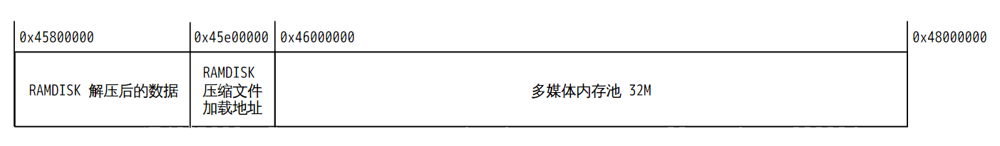

#### 设备树驱动配置

对于使用 RAMDISK 的情况，一般来说存储控制器驱动加载就可以延后了，因为存储控制器驱动比较占用启动时间，需要通讯识别等操作。所以推荐对于系统存储的控制器节点配置为 `deferred-device`，例如这里将 SPIF 控制器配置为 `deferred-device`

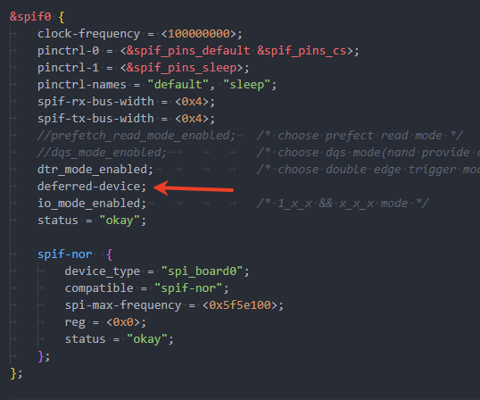

#### 内核选项配置

内核还需要配置启用 RAMDISK 功能

```
CONFIG_BLK_DEV_INITRD
```

配置位于

```
General setup  --->
	[*] Initial RAM filesystem and RAM disk (initramfs/initrd) support
```

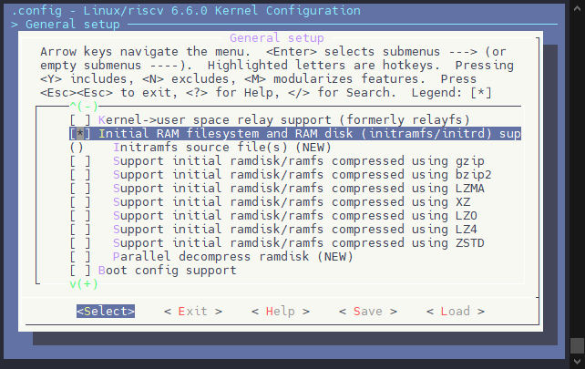

由于不需要内核解压 RAMDISK，所以下面的 RAMDISK 压缩配置可以全部取消。

```
# CONFIG_RD_GZIP is not set
# CONFIG_RD_BZIP2 is not set
# CONFIG_RD_LZMA is not set
# CONFIG_RD_XZ is not set
# CONFIG_RD_LZO is not set
# CONFIG_RD_LZ4 is not set
# CONFIG_RD_ZSTD is not set
```

配置异构 RAMDISK 内核服务模块

```
CONFIG_AW_PARALLEL_RAMDISK=y
CONFIG_AW_RAMDISK_DELAYINIT_RPROC_NAME="6010000.e907_rproc"
```

内核配置选项是

```
General setup  --->
	[*]   Parallel decompress ramdisk
	(6010000.e907_rproc) Ramdisk Delay Init Rproc Name
```

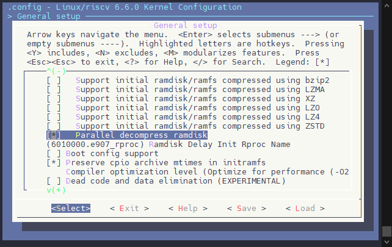

:::note

:::note

备注

:::
:::note

这里的 `Ramdisk Delay Init Rproc Name` 配置的名字是异构核心的名字，可以在系统启动后运行

```
ls /dev/rpmsg_ctrl*
```


这里的 `e907_rproc@06010000` 就是异构核心的名字，填入的时候需要改一下格式，改为 `6010000.e907_rproc` 即可

如果不方便启动系统看配置，可以检查内核设备树 `bsp/configs/linux-6.6-xuantie/sun252iw1p1.dtsi`


:::

:::

### RTOS 端功能配置

异构 RAMDISK 的主要操作基本上在 RTOS 端，所以 RTOS 端的配置需要更加注意。

#### 配置 RTOS 存储驱动

**SPI NOR 存储驱动配置**

```
Drivers Options  --->
	soc related device drivers  --->
		AW Flash Drivers  --->
			[*] Tina Flash Read
				Select Storage Type (SPINOR)  --->
			[*]   Flash Wait for Flag
			(0)     Flash Wait RTC Data Index
			(2)     Flash Wait RTC Data Bit
			(4064) Flash GPT Offset
			(128) Flash Boot Package Offset
```

存储配置驱动项如下：

```
CONFIG_DRIVERS_AW_FLASH_READ=y
CONFIG_DRIVERS_AW_FLASH_READ_SPINOR=y
# CONFIG_DRIVERS_AW_FLASH_READ_EMMC is not set
# CONFIG_DRIVERS_AW_FLASH_READ_SPINAND is not set
CONFIG_DRIVERS_AW_FLASH_WAIT_FLASH=y
CONFIG_DRIVERS_AW_FLASH_WAIT_FLASH_WAIT_INDEX=0
CONFIG_DRIVERS_AW_FLASH_WAIT_FLASH_WAIT_BIT=2
# CONFIG_DRIVERS_AW_FLASH_WRITE is not set
CONFIG_DRIVERS_AW_FLASH_GPT_OFFSET=4064
CONFIG_DRIVERS_AW_FLASH_BOOTPKG_OFFSET=128
# CONFIG_DRIVERS_AW_FLASH_DEBUG is not set
# CONFIG_DRIVERS_AW_FLASH_USE_HWLOCK is not set
```


1.  选择 `CONFIG_DRIVERS_AW_FLASH_READ` 驱动
2.  配置使用的 FLASH 类型，这里选择 SPI NOR
3.  配置 `[*] Flash Wait for Flag`，设置 FLASH 的等待标志，这里按默认即可
4.  配置 FLASH 的 GPT OFFSET，配置需要与 FLASH MAP 一致，需要找到 `uboot-board.dts` 中的 `flash_map` 参考下图配置即可


#### 配置 RTOS 解压组件

一般 RAMDISK 支持多组压缩格式，这里就以常用的 LZ4 为例，示意驱动配置。进入如下配置界面：

```
System components  --->
	thirdparty components  --->
		[*] Compress Support  --->
			[*]   LZ4 Compress
```

配置项目如下：

```
CONFIG_COMPONENTS_COMPRESS=y
CONFIG_COMPONENTS_COMPRESS_LZ4=y
```

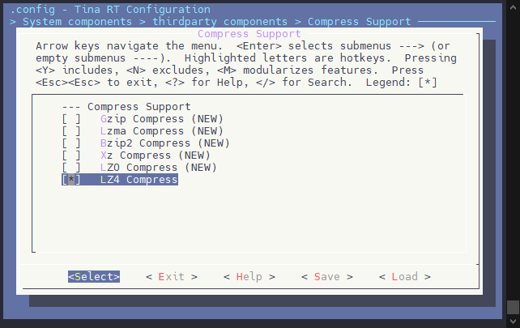

如果需要使用其他压缩格式，这里也可以配置其他压缩，勾选上即可，组件会自动识别加载的 RAMDISK 是哪一种压缩格式。

#### 配置 RTOS 异构 RAMDISK 组件

配置完成后，另外还需要配置 RTOS 的异构 RAMDISK 组件，配置路径如下所示：

```
System components  --->
	aw components  --->
		AW Fastboot Preloads Compenents  --->
			[*] Fastboot Preloads Compenents
			(spif) Preloads compenents rpmsg notify name
				Select Preload Components Type (Ramdisk)  --->
			[*]   Load kernel ramdisk
			(0x47e00000) kernel ramdisk load address
			(0x200000) kernel ramdisk compress size
			(0x47800000) kernel ramdisk decompress address
			(0x600000) kernel ramdisk decompress size
```

相关的地址需要参考设备树配置的预留地址。配置项如下

```
CONFIG_PRELOAD_COMPENENTS=y
CONFIG_PRELOAD_COMPENENTS_RPMSG_NOTIFY_NAME="spif"
CONFIG_PRELOAD_COMPENENTS_RPMSG_NOTIFY_PARA=""
CONFIG_USE_PRELOAD_RAMDISK=y
# CONFIG_USE_PRELOAD_ROOTFS is not set
CONFIG_PRELOAD_RAMDISK=y
CONFIG_RAMDISK_LOADADDR=0x47e00000
CONFIG_RAMDISK_PARTITION_SIZE=0x200000
CONFIG_RAMDISK_DECOMPRESS_ADDR=0x47800000
CONFIG_RAMDISK_DECOMPRESS_SIZE=0x600000
```

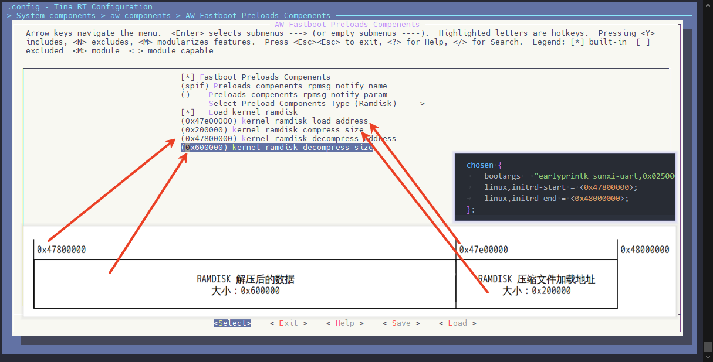

#### 增加异构 RAMDISK 启动流程

修改 RTOS 的 main 函数，新增 RAMDISK 启动流程代码，例如在 `rtos/lichee/rtos/projects/v861_e907/bga_perf1/src/main.c` 中，找到 `cpu0_app_entry` 函数，这样添加代码

```
#ifdef CONFIG_PRELOAD_COMPENENTS
extern void flash_load_data_async(void);
	flash_load_data_async();
#endif
```


### 配置打包 RAMDISK 功能

SDK 提供一套简单的脚本去打包 RAMDISK，在执行 PACK 命令的时候，自行去打包 RAMDISK，生成 RAMDISK 镜像，配置方法如下：

首先复制 `device/config/chips/v861/configs/default/ramdisk` 文件夹到板级目录下，作为 RAMDISK 的基础环境。

然后在板级目录下新建一个 `ramdisk_json` 配置文件作为打包配置文件。使用脚本自动打包 RAMDISK 环境。

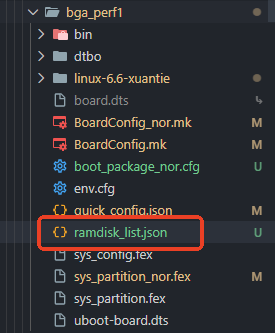

```json
{
	"compress": "lz4",
	"src": "${configs}/ramdisk",
	"auto_copy": {
		"lib/ld-musl-riscv32.so.1": "${rootfs}/lib/ld-musl-riscv32.so.1",
		"lib/libgcc_s.so.1": "${rootfs}/lib/libgcc_s.so.1",
		"usr/lib/libc.so": "${rootfs}/usr/lib/libc.so"
	},
	"cmd": [
		"mkdir -p ${src}/bin",
		"find ${rootfs}/bin/ -type l -exec cp -d {} ${src}/bin \\;",
		"[ -e ${rootfs}/bin/busybox ] && cp ${rootfs}/bin/busybox ${src}/bin"
	]
}
```

这个配置的含义解释：

1.  **compress**: 指定了 RAMDISK 的压缩格式，这里使用的是 `lz4`。LZ4 是一种快速压缩算法，通常用于高效地压缩数据，尤其是在 RAMDISK 中能显著减少内存占用。
2.  **src**: 这是 RAMDISK 固件的源文件位置。`${configs}/ramdisk` 是一个变量，表示实际路径应该在配置文件中定义。
3.  **auto\_copy**: 这个字段定义了一系列文件的自动复制操作，将源文件复制到目标文件系统的指定位置。具体文件及其对应的目标路径。这些操作确保了 RAMDISK 中所需的共享库和可执行文件被正确地放置在文件系统的相应位置。
4.  **cmd**: 这是一个命令数组，包含一些 shell 命令，要在执行时运行。命令的功能如下：
    -   `mkdir -p ${src}/bin`: 创建一个名为 `bin` 的目录，位于指定的 RAMDISK 源位置。如果路径中某些目录不存在，`-p` 参数将确保创建它们。
    -   `find ${rootfs}/bin/ -type l -exec cp -d {} ${src}/bin \\;`: 查找 `${rootfs}/bin/` 目录下的所有符号链接，并将其复制到刚刚创建的 `${src}/bin` 目录中。`-d` 参数确保复制符号链接而不是链接指向的文件。
    -   `[ -e ${rootfs}/bin/busybox ] && cp ${rootfs}/bin/busybox ${src}/bin`: 如果 `${rootfs}/bin/busybox` 存在，则将其复制到 `${src}/bin` 目录中。

:::note

:::note

备注

:::
:::note

这里 `auto_copy` 主要是拷贝用户程序和相关的依赖库到 RAMDISK 中，如果有新增的 app 需要在这里添加，注意不要让 RAMDISK 变太大，否则加载速度可能会更慢。

`cmd` 主要是拷贝 busybox 运行环境到 RAMDISK 中，一般不需要改。

:::

:::

如果需要新增一个 app 打包到 RAMDISK 中，在 `auto_copy` 里新增相关的拷贝即可。如果文件不需要拷贝，可以直接放到 `ramdisk` 文件夹中，也会打包进去。

### 配置打包 RAMDISK 分区

修改分区表，新增一个 RAMDISK 分区，名称必须是 `ramdisk`，大小依照打包出的文件大小可以裁剪

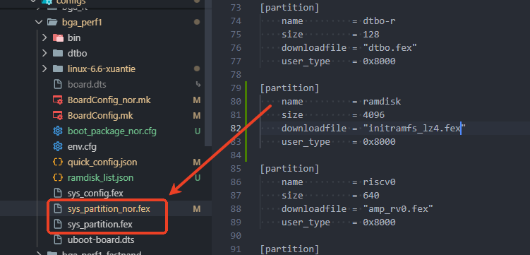

新增分区之后别玩同步分区布局到设备树，执行 `quick_config sync_partition_{xxx}_to_bootargs` 同步修改到 `bootargs` 中.

否则会出现分区表不同步导致加载不上 rootfs 的问题

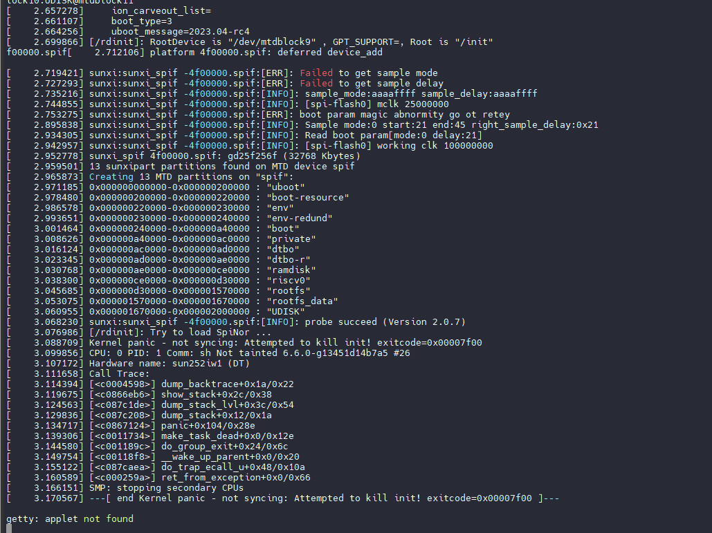

### 配置 RAMDISK 启动脚本

设备树，配置 RAMDISK 和正常 INIT 的脚本为 RAMDISK 的路径，这样配置使 Kernel 初始化可以找到运行的 init 环境。

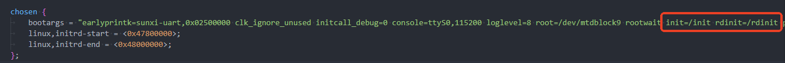

修改 RAMDISK 中的 init 脚本，路径 `device/config/chips/v861/configs/bga_perf1/ramdisk/init`

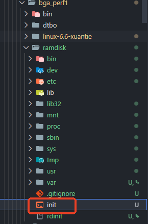

可以在红框处添加应用的启动命令，当 RAMDISK 初始化的时候便去执行相关命令。

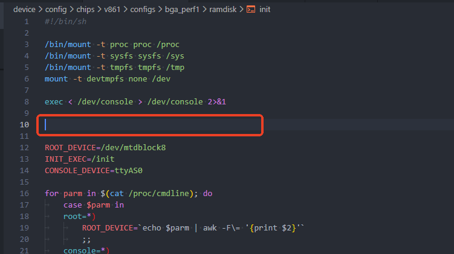

## 测试 RAMDISK 功能

此时编译系统，打包烧录，查看启动时的大核和小核日志。

在小核的日志中，可以看到 RAMDISK 的相关打印

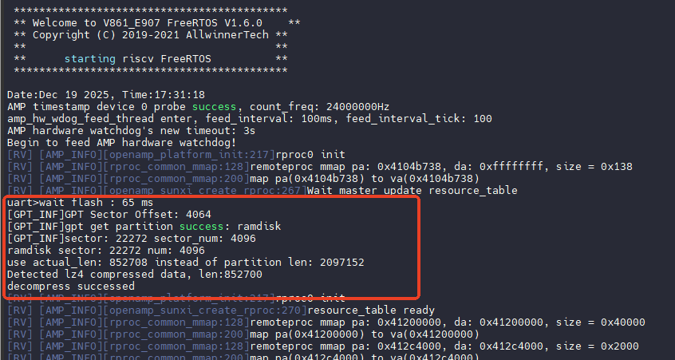

可以看到 Linux 端也是通过 RAMDISK 启动的

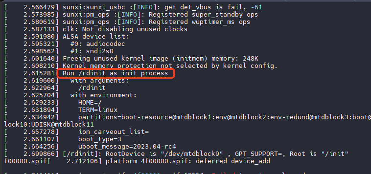

至此快启异构 RAMDISK 功能就算配置完毕了

## 常见问题

### RTOS 打印 get\_boot\_param failed


请确认配置 FLASH 的 GPT OFFSET，配置需要与 FLASH MAP 一致，需要找到 `uboot-board.dts` 中的 `flash_map` 参考下图配置即可


