# FASTBOOT 异构 ROOTFS 功能

在快启流程中，除了启动 BOOT、KERNEL 阶段的性能优化，还有启动到内核中 ROOTFS 加载速度提升。

提升 ROOTFS 加载的方式内核原生提供了 RAMDISK 方式，可以非常快速的读取最小化的 RAMDISK，在 RAMDISK 中运行应用。SDK 更进一步，提供了并行的异构 RAMDISK 功能。相较于传统 RAMDISK 使用异构方式读取解压，提升启动速度，最大化启动性能。

传统的异构 RAMDISK 流程如下：

-   BOOT 初始化 FLASH，加载内核和异构固件
-   BOOT 跳转进入异构固件和内核
-   Linux 在初始化阶段，异构固件读取 RAMDISK 给内核使用
-   内核启动 RAMDISK 中的应用程序，执行应用

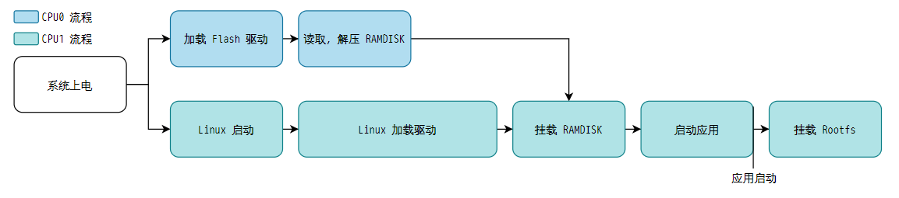

但是异构 RAMDISK 的缺点也很明显：

-   需要独立打包 RAMDISK 分区，占用存储容量
-   一次需要一份独立完整的 RAMDISK，其实更多时候不需要完整的功能但是由于 ROOTFS 还未加载所以需要全部带上
-   RAMDISK 普遍较大，会占用较多预留内存，低内存方案会出现同一时刻内存共存瓶颈
-   RAMDISK 初始化后还需要初始化真正的 ROOTFS，后续服务还是会延后

所以 SDK 提供了另外一套更加简单通用的方案：异构 ROOTFS 方案，通过异构核心，在 Linux 启动阶段从 Linux 的 ROOTFS 中读取需要的文件加载到内存，到 Linux 中直接运行已经加载到内存中的文件，例如应用 APP，可以用异构 ROOTFS 提前加载。这样内核在挂载文件系统的时候就可以直接从内存中运行，而不需要自行读取，解压 ROOTFS。而且由于是直接从同一份 ROOTFS 中读取，所以不需要单独的 RAMDISK 分区，存储占用更少，每次只需要读取必须的文件，读取效率更高，内存需求更少。

异构 ROOTFS 流程如下：

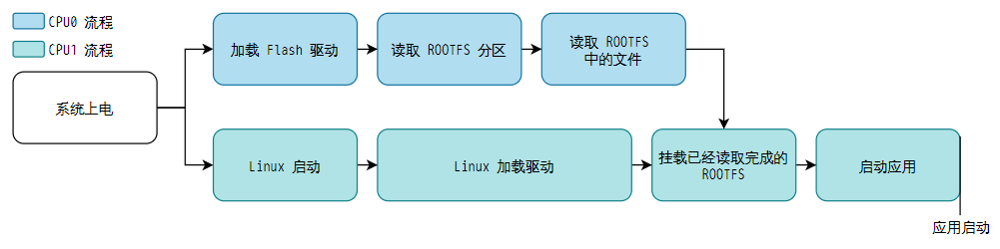

三种启动方式的比较如下，可以选择自己适合的方式：

| 类别 | 异构 RAMDISK | 异构 ROOTFS | 普通快启 |
| --- | --- | --- | --- |
| 存储占用 | 高，需要单独存放 RAMDISK | 低，从 Linux 的 ROOTFS 中读取 | 低，与异构 ROOTFS 一致 |
| 内存占用 | 高，需要预留压缩空间和解压空间 | 低，只需要运行空间 | 低、无快启优化 |
| 启动速度 | 最快，流程最简单，启动速度最快 | 快，流程稍复杂，但也有提升 | 一般、没有 ROOTFS 加载优化 |

## 异构 ROOTFS 功能配置

### Linux 端相关配置

#### 设备树预留内存配置

首先设备树需要配置 ROOTFS 的预留内存，与 RAMDISK 的标准配置无异

```
linux,initrd-start = <0x47c00000>;
linux,initrd-end = <0x48000000>;
```

![配置地址](data:image/png;base64,iVBORw0KGgoAAAANSUhEUgAAAY8AAAB3CAYAAAD7LMwnAAAdQklEQVR4nO3dfUxUaZ7o8W/brfIqUoM2qDWiIE27SN1iOkFpZrAGjW7ibG6rWLsmTGC4cS+JdsxOuCpZvDdNwrRDetKxO2HHxItpE3fxpTvpMbftKJeh27XHZALDy6qNqDgwQtssiLzazm3vH+ecqnPq/fBWoL9PYiJVdZ7znCp4fs/Lqef3UnrGG88QQgghTFgQ7goIIYSYfyR4CCGEME2ChxBCCNMkeAghhDBNgocQQgjTJHgIIYQwTYKHEEII0yR4CCGEME2ChxBCCNMkeAghhDBNgocQQgjTJHgIIYQwTYKHEEII0yR4CCGEMG3uBo+fnGTToV8TFe56TEViJZ9u+YhPt1Tyi3DXRQghptEr4a7A8+vveT9jNXfbf87BvnDXRQghptfcHXnMd9EreZX7tErgEEI8h7xGHkuWLGFkZJTvv/9/s1KBqIJPsGXGuH5+dHkrN7/w/fxE6wmaz51zPZfwj5dZt0r7aYSej96i+7b2cwHWQ/tY5Sr6z9yuKKFf+/EnJ9m09Yc+j40q+ITXOEO3ZZ+rfM96CSHEi8wreEw8mSAubgmPhoZ49v33M3pyJTAMcLviLXejrhdjZ53lM76q+I3a2G8n4dw5+tVj1y1tpqXifzCmlfXzk4yrASKqYC+rHn3GV8d+413uul9j32qh56OtSsD4yUk26Y4FiMjch7X1BF/99pxS9qZfE/WFci6AxYsX88rChTx79oyx0dHpf3OEEGIOW/CDhAT0/2Jjl7Dg5ZeJjo6e4VP/E6szY3h0ucR34AAYaablt2rj/8V/8AgLket0x37lbszHzp2hZ+SHLPuJ7vhVf0OCj2Kj/ss6aD3jHqV8ccn72J7PXKOcsT/dZiLmB4bF+++//56IiAgiIiN91z12KdFjj7jj9/qFEGL+euU/+41N96LFi4iKimZ0pnvT6xKJYIT+3skWMMJIgGPHzr3Fbctl1lVeZh3GKa8oSwwRq/axKXOf4ZhHJs7+DJiYmPB+IvqX/OsmG9Hf/h/+7tq/mShRCCHmD69pq4jFETyehSkrbvcxwbopFBBDTBLgWuOwEhNjfEX/b7eqo5p/4vXKfdjBFUA810/M+uvTp/z16VPvJ0bf4x+uoNymm/NL3rv2Ho2TPosQQsxNXndbPX78mO9nOnAA8Bu+7Ylh1c7JfJfjN3zbA0s3uY+NKvgxS0eaue9zUbubkRH3T/03/0xE5l6sU4ldwQw/YjRqKSkzeAohhAiXsH7Po/+3W+EfL2OrvOx6LNS7mryP/TO3K7Q1EM87rYCez/hKG2l8UcJXnGTTzy/julnL824sIYQQfr2UnvHGs3BX4rkU/Uv+ddNSLl+p4H+Huy5CCDHN5EuCM2X0L3zDMqwzfdOaEEKEgQSPGfNvHGz/lh9tkr2thBDPH5m2EkIIYZqMPIQQQpgWtuDxgwRf3/0WQggxH8jIQwghhGkSPIQQQpgmwUMIIYRpLycsX/G/wnHiqKgoxsfGgr9wJuTtp3JvKn+52sZ/hqcGz6EkdtVsYuMPv+FPL6+m+J9/RErkXW7emIUzl+by30peY+OOFDbaxvnDlyPBD5pO2akU//OP2Dyt547GUb0ZR+o3/OmPPvZQm/OU34dtmxdw//IAs/yJiFkgaWhnRDoFR0qIv1bGCdkVccb11lzlfZQg4owPd21M2m3nYPYwdWWdTHqDaRG67FSKi2JpKm2mxfTB0Tiqc7Bp2x51t/N+lYlPbbedg/najULjtJy6SsN1fb3WEKcVXX+ZC+fdh9rKt+Kw6gvzOD5Q2ah/G5la+oh+GgzXn8Sumgy04odar1Fbo9tV3U/ZEjzENHnMwAjw7ShcH+Vx0TgD3eGu0yy53knt9c5w12KO6eVC6fMVDm3lOdgG23m/rBetwS0ufWxsaP3JTqU4P5qWU5dpuK425kV2Bq4300I0jt2JdKnPKY11Lo5uYwDwDCihla2U58wcpaH0Ki2ogag6lYdlnfQSjaM6gyWt13i/ZlQNYjns2q2eK0DZYU9DG85zJzmPUmiLBWCk5STH6m65nssrrWaLK9IP03rqHc51aD/ns69qO+6nmzn9qzN0eB63rZrKbXiVn6Y7r2fZeaXVbBw4ySfscb2m+3PdCCZtL4eK7Bh3n7/PlfIPla3f8/ZTuW216xnP65o5ozSUaZtU+mo4gvXajL0fw/Na7/w8bNd6ZyH2+pJKc3Gu7TP07A2P7bZzMK2PusEUV8/M0PMKcm59j9Bnj81f2YaeZgLOmjXqQZ69Qs/3x9/zfq49052szN34KJ+F5bq7MVJGbXfU60piV00inaeGydLqOHLP9R4q16yrh3otqNdmOO9keueGkVgSu2pSGND1pI3XZexl28q3kjV4jUvYXa9Rrtv4++Wo2YrDx/F+ZaeSZR2n5ZR2Lb1ca03BuTaJJNTfo/wEr/fYhvK+Lc9fQ1x3u+s8vTV36K7JIHU3tJwfpaHsqvtc5/vozs/AYgWC1QuwBSw7Gkd2AkOt11y/My3198gqSiQ9u5Neaxq2mH4atN/b65005a/BkZYE9AYsO6xpaMN67lg7WyyXqCivVxvkPRQ0K414mvMoW5Y2c7pcCQhpzqMUFu3nYfmHNJJOwZHtxLecpKLuFtoUVWHpN1TU1NNYU6a+xs+0VdpeNnOWinJdINm1lxY1+ADE2Eoo7FbqluY8SmHOXtIaz9BBOgW77KCdO28/ldsstJ5SAwf57NtmofVUmS7QGb2ycCGLFy8GYHTE/Ez0ZI839tqUPyx9r81Wnkhn6WUuAFpDuWt3r7unFbMGZ1E/DaWXaclOpbgoBUd2b9A/+t6mPoYy1T+U6wDRpK+NZOhur3uayJqBk3beL+1VG0I7jmxdgxLg3C1Vl129uSxfFdCXvdvOwfw0bDTToo1WQpq2Ut4PV+8wFNmpbNf1Ns1LwFGEcs3q+XN2d3LhPLRUXcNSnYOjPImWqsc4drsDB8zwNGJ2Kjk0836pcq6k0lycu1O5dd39/sVl5uDsVt7zpNJcnNmpJJ3vVDo0k522ssYSN9LHLd00kRKcYlkO9J5vpm5ZLs58O7bzzTwstbsCRy/RpMdD93Wthkpv3woMLYsGppJ4LxpLwLKXYIkZp6tJO0cSu9QOgcUKScuiofuO671IKs1VOkMj0SQFKfsVf1/Wi46OZmR4eAoXFdjSeP+/VTN9bkAZLdTUK//vaOLusJ219nToWMlmWyzdn7sb8466s7SuLeG1PGhkC5mx97ni6s3f4tyFZtYWvU4e9cETP3Wc4YSuYe9o7mTEZiEJXOfT183wfFoWa2OHudusnrvxJt3bthNvODhWvQ7fo42XgIiICJ7h0fj7HNEA3Zeo0N6nQMcHlESqtZ8G12hklIbr/RzMVnttQEtVs+71vXR2Z5Bl+MMap+WU+gd/vZeu3WtC65mpPamsrGi4PgrZSSTH9NOkb4RH7lGn9Y59lj3Jc3uWfb6P7vwULNkhHgsogWMNSzxGNZ6jCo1xaiNB7X2Gei493TV7fR6jNJS1Y6lJwVE6qjSSoQa1qbreyQXde6d0DtQGXHtQ9577fH4qXCPGfhpK20mtcX+evTVXaSjfSlZpKo8zoeWUd4dAG6kOtV6jDjvO+CV4Bg9beQbWkXvUeXxu1vytHMxX/u81yvVbtsY98u+uv0xD2lb181Rp6xoj96g7BduLYlmuq72vssOWhvbR4CBhS4Hr5RYPH8Fa18/DDAb6TRsemMIvojIqyYzVP3bf8IqRu03uWNBxhmPl2v+/YRC7OzjkvY6V+1xxRax6Tpx6lUNFJVTalHJd01mqBQsWMDExwbNnHluadZzhWPmZoLX3e3wg2dEsIUE3VaBdqK6DYFiUUwwN6l+r6/UZpsiCa+nox6EGKrISoTV4r3OJPnBN4dxTFZe5hjjGaWky/k1ovXu/rndSa43loNbg6KadpkcvF+oTOZgfTcupZnPlen7WpurmMf0J4JGFxzCqvN5JbciBOgj9CBSUqSxG6dSV31LVTqo6SrzgcV5r/lZl9FiljbYjGRp8bHiN0vPvp6HU+H5oI1z1VeyqyaG49Bq1NcHKXgJEYivKobv+Mu+7ptTgcccoLAOsGRyMv0ddqfo57rYTNzLMQ8ASoGyvjRGVdYeRGc8m+IOEBK/gMRvn/jJhaMbKFkLMbz/uj/P9RHYqxUWJdHne4WSYctTWktohPwN0o0Bb+VYc6Nd//Kw7ZRLSGoy2tlNbMxqkbOX/yXf1IxXdOpLVzsF8DOto+vWvQGWHMQ2tt5k895cJQxI4hBABae3EwZpcHNm6J6730jUSiW13KkkAqAvRulFOkrrOce18Lxfq+7Hm27Gpz7V09IM1g1271Qd2KwvVnZMIHOy247C61zEClz3KrbvjxGXaXdeTVJqCVRtNn++jmwQc5UnaVZCTGUl3R2/QssO2JbuvkcdMkaAhhDDr/c1xHrfGGqfM9OsO3o2/9lrdXWmG6Tr9XXMedxpqXNN5ns/7uOPOb9no6hfpUa7rWUP5XrcE+yn7uQ8eEjiEEJPldxpLvHhfEpzPvwxpzqMUru10facE1O+VLG02PCY8+Zr3Vck3vIVLEl8mzMZ3op4Pz3Xw8Bx1zOfAAeotw0dKKKyyux8clsDhn26aobs99O9IiBdULz/ujzO0G18mDM37dmOmPNfTVs9b8BBCzDxpN0IjW7ILIYQwTYKHEEII0yR4CCGEME2ChxBCCNMkeAghhDDtub5V1z99Pg7PXB1uSm4O/8+HjbYDrseOt6GalevK209lzoDcRizEc+oFDR71nCivRwkib4a7MnPIHE6fO5PBKG0vh4os/MFjB+Lwi+Bw8Xrs2g7MPV04Px6YZBnf0Xy2nXf7gMQV1O5JJMrzpcN9fFD7gKs+SvGyIYU6h3YLq67skOpt4djbySSrP4213aC4YSLEsiHXkcGBDYvUn4a4ePwOp0Ops5hWL2jwCI2S2GkOCnH7dH/m7HW94LQsklrmx8Kd67EPdeGsHUBrcGsdY8aGNohcRyr2oSG6YnW5P/oeUHz8geF1hTuz2MFEaIEjcQW1jkiazzbxbp/amO9JoVBtxAPXO4LDxcksb7uBs2FCDWTrOdbfxKG24GWzIYUDG8a5eLxdPVcWO4pXcE8Lenn7qVx/c1IjcmHOC52G1i9DYiTPnBjpFBzZAxf+nfgibepL/xplNDPoI7XssTqUXB7ovhWupo01pJoNQJ/m1ivFrPqHc3rgTd/pdQNcV9D0ua7e+U1e06b8PL7dbkyvCwyb6SX7Se1rqPNq3bfr9fX3yJFiqJd7NPX1eu0atSk74zm3VFWzBf3zJqo/Jenu34sa9bNKXMFPV31H81ntPRzgd20rOJBsIZcHrNmZxY5Vul63OppA34tPXEHJBmg+O0j8Hu/EUW4WMgznUhh7+NDVoDTwhTmJRPV0uUYDVxse8LMNyWRsAL4NXO+rG1Zijx3iolbHvgf8355EdqyzQNtA4LLbIjj8RhxjbTdcI43T1/r46R4LuYkPuNoHNF6hNaeEyiOv+h2lKr+nzL3p6HnmxU1DG4jWs1cbTG+xZBa9SeupMk50KH/4G53pNAbNFX6Lc7+6RHzVdt5yNnGsbiX7TAQOcI8a8kqr2ejrBdbtFKKm183bT+W2LeTV3VIa2QDXFTR9LgCr2VJlUa9baXg3552hoxHI20+hbYAr5e+4c6nnhHZNAHml+tS+OlqdA0xbpTm3wIUyKjpAa4iV99ddlnVbtVJ+zS0lUObnc65Dnb4MMm21cOFCFi1ezLNnzxibRKKywMerAcxz/WpZJFHDA0qDCGqPexEQyRrg9Mc3WFm8nh07LZz+eIzDf+sROIhwPfZuXxTHAtQv17GC5J4HHPKaGnL38N0iWBkHXX8ccP18uFiZghpLiAAC15uESOh54Coz15HBjlXAcAS5QcuOIj72O76+qV2jhWPq9Fv8MqAPlL+xMh6WVlNYZfFKhiamz4ubhnaKuj/Xei23aLk7TKZlJRDKpmpatr8tFGBRGo3p/O3Wp9dtvEn3tjdZngbTtVDgvu56vu7ezsbEdAAKcpQgOJVLiVmbRRq3TFe1o+5D3TF+Po/uS65g0njjPltyXsXM26Kl3jU0/iGm7g12PL6Cpsa1PjHExeNdZLy9gpWJQN8E79Z2ceztFRx2jGOnjw8M6wYrdY95rW7oWPjZBjxGHRZ+tmERXQ2egcOocGcWO1YpaxYfkMqB+Ch3Uj8/9b7nqp+6rjHcxwdnoWSPGlwCle1+N11rKl0NTVxcl8VPEyIA9/U31pTR6zxKYdVRlnuMMDrq3qGiLsCFiZBIGtpw6DjDJy1H1Z76fJqbvc/XuujgXjtJD36oV0NrnDZrrDnJct2mj2ZGYz4b8W7jS7pv6N7nxg9NBeynT58yMTEBk0zd6+/4NHsqMYDfTPCxiRzYM8TF403uqSnGaXeNEAY41BBPnSOS5rN3dOsVFo55PeZbrmMFycMD/E436iAxguV8x9ff+j8u2ZGlrFt8rDTYhTsXMTY4BsQHrvfrwKpk6uL6+OC4Wr8NKRwYHucesDJg2VHAIux71tPV0ISzDSCCw2/Aw9v+1oFiyVRHmWJ6eU1bRSyO4HGYpo3Cee5ZlbefwrWdXGlJZcuRvfS+CLezBm1olemGc6AGg2r2EUoAyWefR+89zXmUQl+zjVMwOuKjiTcx8vB1vNIDzmdfVQmVFo9jvh1njEi+Pqu7k2hZJFFqIwuoi8twsWGcHYZF5XiSWUTyniz0HezkPVnUGe580kYYHndY9U3w0O87McFfhsA+1GWYIlsZpzbgQep9tX+cA4xzUXdXV25CJAwNcpUJ1gQqGxgchuVdN5TFdUCbyhr0CHTKGt599zSqmHYvTBra2RVLvJrVMc151L0QDUC+ss5x7QyNdWdpxc5bTo+ee9peDlVVU3lkL2mzVWUAbvHwEVjX50/tuLS9HNq2evLV6PiGQc/HegcYiU3F5ucNGexz3xTwln7RPuTzrea1PLP1PMOx8jIqPP+ZutOnnhPlJ2ldut34efcN8PXwIux/u4JcQOlhxzHWNaA2utqaxl843XaHiz1x7NipRsy2OziPN+n+ddHFdzSfbTLcMquMOvr4XRseBmjv0Z/b6PTtIViVzLEN6gPqInh7Wwj1bhukC11dtQB2eyB42Uxwtes7ojakcjhRfw26NRZ0OW78rHekOY9SWVXNPrOftzB4MW/VVe9w0liLqsnU3WHjedeQcheO511X/tRz4vPXqdTuWOq+xJXu7eritm5xtBHgFueu3adyWwmH0N0V1dHE3WE7mbEWktDPy3vckWQtodLm464rP0K5rsaaS7xWtZ3Kqu1A6GUbj7vPlVPNbNwV9DDf16WdV/9ma1N9RdVkAu5pr3p+3/Imha47xO7T2jJMpqmRh8dnNut3W7kXed0L/RO8W3uDw8XrOfB2IgfQfx9CnfPXrXModx0lU7eT0L4LkriCEl+jDtXpj5tgZ5br3OC+24q2OzhJoc6RRZ0DjN+1CFRvgAEOHYdjbydT93aysVyClQ1XG9qBDA5ooyrP76bk7WcLl6j4lf8A3tE3ALZYpbPTKNNZkyX5POYoyRAoxAxRpxsH/ayrzed2Yza9mCOPuUwbFUmGQCGmmfv7QKZuyBA+ychDCCF0pN0IjeyqK4QQwjQJHkIIIUyT4CGEEMI0CR5CCCFMk+AhhBDCNAkeQgghTHtBv+chaWif5zS0nkmVhBDT7wUNHpKG1rc5nIZ2vgqSUjUk2vbmHltxeCZr8kznGjhd60ymip1i2WJekGmrABpryqgon2OjDnBvyDfJVJtz9rrmu7S9HKraj2u/PV1KVefxJj5oA/ueFApNFapsgPiwx/jFNTakcCB5gA+0zQ/P9oFuw0B3ulbl+Ys9cewodm906EoVq22cuCqZWkeE+5xaqlhX2evdmxUGua4plU06BUeOUjC7O4KKSZA0tL5IGtqwp6HV1zvNeZS3OMsfLCWuOhrfL480tMCImVNPB93nqFUraEpVbXNDbTSh9ub1GwXmOlKV19yO5MAb7tO5tzFXGbZRD5KulRlMFTvFNLTKZqEDVBZVEx/gb8K95bpkCgwXr5GHlgr2pQWzPygJ57kNtJ79qWY/iXqUNLSDp8qoKD9J6/BqNnpuq+6Tkoa2O1bbhj1/UmloK8rLuNLt5wXW7RRa/l3ZGvzz+8TYtrh7wgGuSyn3JK3DSsOsbS9uXDdYzZYq7bqV69isFe5KQ1vmOnfo0ik4oqahLVfKHrSVGLbMjrGVsHFAef50yzDWHPf25XmlJWQ+uuSqs6/35pWFC4mOiSE6xiv7RkiiY2KIjo72+Vya8yiV29T0vK7PUU2pets7pepyNevdu7VddMUmUuKIQEngZAwcrhzkn3nvfHv15gBjuh594c5k3dbk/tK1LlLStfpLcRurZPPLTYiEnkHvVLFxulSx/q5rSmWrGj+k4lQz8duqORTS35UIB0lDO0mShnYa09CmZbGWZj5xBSp1m3X9ltm6NLIdzZ2M2NTt6tP2stF6P2hGxpdwp4LVJ2byGi25rtMdCBYuXOg+1iPLZSg9YN8pVSeAAQ6djaB2z0oOE0lyT5eaHU89LkfLQQ4s8yi07wHFxwc4XLyeurdR1hVqPYdbftK1zmSq2CmW7QqSHWc4Vv6N70RZ6LNYinCRNLThIGloMUybJVmIiV3tSkHr4m90NQkLFixgYmKCZx6pYEPJZ/0MfB4L+bxm9XWEm/+Uqqq+B5xsy1DXJ3SN/4YUdsT18cHHfhaS1cb5YUMTTnUKrO7teN2ieJB0rTOWKnZqaWh9sr5JQVq9rNHNMZKGNhwkDa23Gd6C/smTJzx58sTr8VBGHn99+pS/Pn3qo1Tlrr0051EKq46y3HDrc5B0rRp14ftim4UdxSu4p65/FK6Lg9g4QzImUH7+WUMT7euUdYdDaoY9LQHTTx0RnG4YC5KudQZTxU4pDa3+g1E6G/r0wmJukTS0M0LS0JpKQ9t4U7cOZJJHClnv9zvI4XXveKeRLTd3q3JH3TtUfD5AZpExtWnglKrgWuf44wNON3TSjLb+oWTyM6SSbRhSpniO69ZE9OsEiRZei4WH/RMETdc6k6lip1g2YEjW5O+7Onml1VRWyV1Z4fRifs9D0tD6va7wpKGt50Q5yvy2zf1oaDcSeL/fp1ve5K1QTz1dGj+koncvh4r2k9eovp8BU6qq33VwrXNM8O4fh6hzrKeW4N97OP3xDVbqUr2CMZ1r4HStM5kqdoplk07BrlTunioLOE3VOzAM1ljW2tOhQ0Ym4SDJoOYoSUMrRAB5+9U73Kb/+0rzud2YTS/myGMukzS0QgSgjb7n4LZBLxgZeQghhI60G6GR7UmEEEKYJsFDCCGEaWELHjM9ZSWEEGLmyMhDCCGEaRI8hBBCmCbBQwghhGlhDR6/sH3Ep1s+4lPb389I+Z632HnegieEEHpym27owvY9D7cc/mfOfyf+7s85aDY9ZwgkYAghJkuCh39zYNrqGr9/OMarMTkzUrp8+EKIyZC2IzCv4LFkyRIWLHg5HHXxKc15dMq7Z8ovgRDCDGkzgvPa20pLBfvoOcurof0yyDSWEMIfCRqhe+nNzdt9rnk8efJk9lLBJlby6dpHvHftPUktKYQQ84DXgrmWCnZotkceiZV8mrGa0a5/4R86r83eeYUQQpg2J9LQ5qX+C7+M/j1/d6Vi1s4phBBi8uZMGtrR0T/7fFxZMDem9xRCCBFec+BW3cA6+pTcxubzagshhJgpcz540DvACNB9oz7cNRFCCKGaA2loc9i8PIpv7noukqdTcKSEzFjo/ryME3IblhBCzBlh3Z7kF7aP+K/LgLEWuU1XCCHmkTmwt5UQQoj5Zu6veQghhJhzXnllYUS46yCEEGKekZGHEEII0yR4CCGEME2ChxBCCNMkeAghhDBNgocQQgjTJHgIIYQwTYKHEEII0yR4CCGEME2ChxBCCNMkeAghhDBNgocQQgjTJHgIIYQw7f8DehuzHSyPHlgAAAAASUVORK5CYII=)

预留内存的大小需要参考需要读取的文件的总大小，一般布局如下：

![ROOTFS 文件加载地址](data:image/png;base64,iVBORw0KGgoAAAANSUhEUgAABJ8AAACuCAYAAACY5KxqAAAW6klEQVR4nO3dP2ibd/4H8Ld+HDce5XqDDc4g6MEtWXLHj8hQ7jA0XX5LZVyIPJUMN3Q5QqdGyeDI3FIKN3QsN0mBGqvzXSEUCpaXy5LhhgZ0EIO1FroUDp7fIMmWZPlPEj+Rc/d6gSCWnuf7/T62MjxvPt/PUymKoggAAAAAlOB/Fr0AAAAAAP5zCZ8AAAAAKI3wCQAAAIDSCJ8AAAAAKI3wCQAAAIDSCJ8AAAAAKI3wCQAAAIDSCJ8AAAAAKI3wCQAAAIDSCJ8AAAAAKI3wCQAAAIDSCJ8AAAAAKI3wCQAAAIDSCJ8AAAAAKI3wCQAAAIDSCJ8AAAAAKI3wCQAAAIDSCJ8AAAAAKI3wCQAAAIDSCJ8AAAAAKI3wCQAAAIDSCJ8AAAAAKI3wCQAAAIDSCJ8AAAAAKI3wCQAAAIDSCJ8AAAAAKI3wCQAAAIDSCJ8AAAAAKI3wCQAAAIDSCJ8AAAAAKM3Cwqff/e53uXfv3qKmBwAAAK6w999/P++///6il8ElWFj49K9//WtRUwMAAADwmth2BwAAAEBphE8AAAAAlEb4BAAAAEBphE8AAAAAlEb4BAAAAEBphE8AAAAAlEb4BAAAAEBphE8AAAAAlEb4BAAAAEBprm74tL+dSqUyfH3YyeCVBhuk8+GccSbnmHitP3rR2Ubjj87f3p93TC/bR3Osp3Mw55ALXPPg0frxMQ97L7kWAAAAeNNd4D77BQzvt+eNMznPKZnBa7ufv4xs4fXnBlczfDroZL3WTL1zmKLYS2tnM8tz/zAXtP9lNncub3mzeg+Xs7nTyl5R5LBTT7M2+wUYpPPhapob7RwWRfa2utm8tp2pK7rINe9vZ7nRTatXpHjeTv3B6okv/flrAQAAgDfdBe6zX0gvXza6c9/frhzPU/Ra6TaWp+/FX9v9/OVkCwvJDYoFefvtt4tPP/107md7Wymy0S4Ox2/0WkVSL9rPX2amw6K9kSKZGXOe5+2i/qLzPG8X9aRo9Wbm29o7PubE+veKVlLUO8erOf+aT4572KkXSas4euciawEAAIA3wK1bt4pbt27N//AC99kvYnh/nZPZQ681fd89Pnbi/v213c9fRrawoNzgClY+DdJ/mtQ/WMvS6J3eN80k3fRfJonb/zKbO620O/VzD+39dTPdrU/SWHmB8Q/66aaVtZvjnx9ndyfJ0/5Radug/yTZWM/aeNz9x2km6T7rj4+4wDX3099JWu/Vjs55/HU3yZPjYy6wFgAAAHjTnX+f/SKGVU+tTjvnJwfJUvXG5Epe2/38pWQLC8oNrmD4NGN/O6tPW2ltTLx30Mn67B7J0Z7G6b2Kg3Q+b6beuZO1cyfq5fGDyS/DxCiT+zLP7EE1SOfuZm5stc6cZ7v2JK2tM77S8675xJo+zub1Vk6f6SJrAQAAgDfdvPvsUW+kyfv3UZYwu91t8OizNDfaufPunKFvrqWVZh4fZQ2jnGEi4Jny2u7nLyNbeH25wRUMn4aJ4I3qUsZ/1NbdO6kmedIffUFWGtnttZIHn432JY5DpsPcuzkx1Kjq6ZPbc78S0/YfpzmZ/h29P7Evsxi9vmocfcmGyWM11fF8aefOe0l2+hlnj/1n3eR6NUsZfam3PsmddzKRLF7gmg/6eZJ6qivJMJVN2h+tZTLBvMhaAAAA4E13/n12Lfeet1Pf2cyXo+BouNtpL7tTGcGo6uluY36YlFru9Vpp1ipZf7id9cpyNtPOF0djvL77+cvIFhaVG/ysxLFf2eDRx9lMO4c3k8ezH968l72tSlb/2kvjvcfDZllfTX5VjgOpWnJu+Vjvm2aytZfZuqfeN81ko507s6HUyRGyXWum1SuylO35hxx08nEjaT+vJd/NP+TMax7P9HA1za29FCs5ZaYLrAUAAADedGfdZ6808kVnN8ufd3Ln8+SzB/XhcRPGVU+HN5Oc1upnpZp6ku6D5plLeW3385eSLbze3OAKh0+jNPB5I0unREe1j9qpX1tN5UHS6hXTwdGo6mk6kDp9rscPklZvNnoa7pccJ4tn6T/6bPgFupnklMcU9v66mXQO01g5LQw7/5pz0MlnD1rZK2rJKX38L7IWAAAAeNOdd5+9dPuTtBqrWd5J6qPjJs4eVj31dk+/5z/oZP3aZm70iuzeTIZPnFvO8sNqivuTGcLru5+/jGzhdecGVzB8qqa6kWzWVpNRGnhUOnZ35uuwspb1jaS7M7tdblj1lCSrlclkspvlymZavWJme95wy93eudVNJy1VbyQ7m1ndOU5Qx03AquMreqeeNFazmlb2iuE1DMvlPhl9wS9wzSvV3Eg3m7XuUTXXuHRvfeXiawEAAIA33fn32WO1rG0leVDP+rvTnwwefZZmktQqmUoOrlWyubWX4n4tg+92h1v1jvKCpTTutrJZe5ze/Vpqr/F+/jKyhUXlBlew59NYK3v3Tzb/njQuI2tvNbP6cH5qeBHDrXXVOb/opVSvX2yMeueLc5+S1+rdO7Gtb+aIc685G5N7S19+LQAAAPCmO/c+e387qw9aaXeSzbunPTzsdP1n3ZNvrlRTn3xS3XAlr+1+/jKyhdedG1zByqelrH1QTzIRBs2tTDouj2usJLvXPkvno93RL28pja+KNCaOHjxaz/LX6zn8araJ2HDLXb0zv1P9MFkcJ5pz3FwbdqivHrUgz+Ovu6l/8MXReEvvrqeejJqLHc95vM3vItc8SmtzvAVw8N1uuhvr+WI87gXWAgAAAG+68++zk8le0I3ba+k3VvPlfuNoJ9TS7d0UtycOP+hk/dpu1p/vHgUz1Xfqydf9DFI7vq8+6KebG/lklD+8rvv5S8kWFpUbFAvy9ttvF59++un8D5+3i3pSZGuvKIq9onX072OHnXqRjXZxOPypaG+cPOb040/O1eqdduZo/rSKvaOfx/8eHbGVIqkX7eejeUb/nph9uL7RecPjp8e4yDUXvVaRpKh3Do+Or3emr+j8tQAAAMDVd+vWreLWrVunfHqB++xea+q9va3MzwXGnreL+uw99PhefXze6L586n79td3PX062sIjc4GqGT0Vx/Aub90ebFxiN/pCnhUinhU/DX/TMH+vk2aM/8Og1Z5zhHy9n/NEmxzhlvrOueWz8RZ/zRb34WgAAAOBqOzt8Koqz77OHwcvUffMpoc/05/Puo8dFKWfci7+2+/nLyRZed25QKYqiKLOy6jS/+tWv8sc//jHb2+U/0g8AAAB4s7z//vtJkr/97W8LXgmv6go3HAcAAADgTSd8AgAAAKA0wicAAAAASiN8AgAAAKA0wicAAAAASiN8AgAAAKA0wicAAAAASiN8AgAAAKA0wicAAAAASiN8AgAAAKA0P1vUxP/+97/T7/fz5z//eVFL4L/Eb3/72zM//8c//uH8Es+Hq2jR/y+c73znL+58AN4c/X5/0UvgklSKoigWMfFbb72VH374YRFTAwAAAG+An//85/npp58WvQxe0cIqn8a+/fbb/PKXv1z0MgAAAIAr5A9/+EN+/PHHRS+DS7Dw8ClJrl+/vuglAAAAAFACDccBAAAAKI3wCQAAAIDSCJ8AAAAAKI3wCQAAAIDSCJ8AAAAAKI3wCQAAAIDSCJ8AAAAAKI3wCQAAAIDSCJ8AAAAAKI3wCQAAAIDSCJ8AAAAAKI3wCQAAAIDSCJ8AAAAAKI3wCQAAAIDSCJ8AAAAAKI3wCQAAAIDSCJ8AAAAAKI3wCQAAAIDSCJ8AAAAAKI3wCQAAAIDSCJ8AAAAAKI3wCQAAAIDSCJ8AAAAAKI3wCQAAAIDSCJ8AAAAAKI3wCQAAAIDSCJ8AAAAAKI3wCQAAAIDSCJ8AAAAAKI3wCQAAAIDSCJ8AAAAAKI3wCQAAAIDSCJ8AAAAAKI3wCQAAAIDSCJ8AgEvVe1hJpbKd3sucvL+dysM5Zx50sl6pZP3RoNz5p0fK9ok5h+/NXeOcc089bn87lUol2/vnDDM67rTrHjxav9g4AAALJHwCgEsyDgImX3NDgVGgUKlUUvmwk5OxwiCdD08fYxiuzHlNjDVvLZXKejoHZ6/51UOMXvJOO/U0szr32s426D9JHqyeDFtWqrmR5EZ16dwxqu/Uk41qqi84d5IM9nsn1nw05/52Kg/7qW4k9aefDX9np4ZQ1eFx75yyipVq6qmnunLOglaqqef0616q3kguMg4AwAIJnwDgUrWyVxQpiiJ7W0mzNlO1sr+dSq2ZeucwRbGX1s5mlqdCmkE6Hy5nc2c4zmGnnmZtOhSq3R+OXzxvp56k1Rv9/FUj50czxwaP1rPc6I7WMl7vq1YM1VK73chur5XsbGb53Aqhaf1n3SStfHJ76RIrmF5kAZ9l+SiMW00zw79hpVJJpdY8Pu6DL1L0WvODslMMDgbJweCFAzkAgDed8AkASlK7PwyPul8/HgUOg3Q+byZbe9m9vZSklnvP26nvbObLcbi0/2U2d+ppP7+XWpKl27vDUOjzF68imgzChq/dNI4qZAZ5/PUweBquZRxqDee9iN6jM9Z0814Onx+meC8z4dFEVdeJYKqXxw+SeudOahmk/zQXr2A66KV3cM4xkxVnk6+JdSzd3p34fe2llYlwryhS3F+bvsZOO+t5fLGA7LuPU7n2ZfqnfDx4tH2iMg0A4D+B8AkASrRUvZHs9IeBw8Hj7O4krfcm4p2VtaxvJM1vhvFF75tmsrGetYltVLX3WsnObh5fajDRT3/nFYd4tjlRJXTytXxtOZXaalan3l/O5mnz7j9OM/Wsv7t0vL6d8RwzVUgntgn289m10byN7sR5lZmeSfW0n4/DpMO0N46nP7lVcd6cw/V3G8ujuTaz2djM6niOUW+q2eNO3Z733XEgttx4Mnpz1C+qUknl2ma6k2v4cP3Cva8AAK4K4RMAlGjQfzJTvTPbn2cp1eszJ12vTm+fG/X9uVy1rG1loirrJUa4P1lVVQy3oZ2otjreHpitven370/WWI2rwj4ZVmftP05z7qynWGlkdzTuYaeebLRzOCdgOsts1VN7tB1x+jUcrz7ns93bS0e9qWZN937qZfvaZrrpZrPRHK6115r4fNgvaq7rNy7c+woA4KoQPgFAaXr5stFN/YO1YZh00E83N040h66+U0+e9jMYbTU70aR6pZob6ab/wpVPzZmqo+n+SbWPhlv+li+rr9JKNfU8ObnOg366man4mjF49HE2d8bX3st2rTkTVs3ZAlcUuXfz5FjDvlGv6KCf3cbyuRVGvf2Z39xBNXfmhFRfvDteVzOro4qqoyqsOb261j4/pa/X5La/I91sXpvfeB4A4CoQPgHApZoMfFbTPOrvdAWtNLJb7KU1XvOrhhanhGSD/pOc+US2g04+bowDo346H66mmVb27l+0+9Qcs9VjFzD1FMHRdrejbXNH/aH6qV5Pus/6SQbpf746HeqtLJ2Yt/dwuAVx9UFyVBk2rgabaylLL/T0usmthC/eeB4AoGzCJwC4VONtZ8NKnauxlvFrXjPxWu6Nw5ATT957UcOtfNPN0YeNzWf7WB0bb0EbedZP9YP2UcP1FzdqVP4Spp4ieLRtb+Y1DsSe9jMY9fAaNkg/Y9yPDnM43g4IAPBfSPgEAKWo5V6vlTyYeBLaKdvS+s+6o0qdpYmqmgkH/Tw5q3LoMqw0stt79cbm461800/vS1p351XjDEZVTkmrN+rN9M5aau8mu5PbyM5oOF6prM88IW7YqPzE1sULG6RzdzM37jaytL89Z/xxA/h+Hn+3m25a+eS8yrY51VAAAP9NhE8AUJaba2mlmcf7k2/ObkubU6nztD9dfTTqmVS6m2tpvVRvqQkrjXyylTRr2+mNm4hvtHNnTm+mZCmNr+b0bppoHn5ez6ei2B02KB876OdJXr4h97j3VLNWSaXWzHQ/pVEQtVJNPc1sNrrnVj0lSe/hnJ5a47/p+Gl3tWYypx/YxMrS+fBkEAYA8CYQPgFAaUbb0L4ZRQ8ra1nfmPg5SUZbt8bNuIdVNdPVR71vmmdsW3tZgwzmNAa/jAqr2kft1NPMamU5mzv1tD9/fT2IBqNqpLW5Ydf5pp5497yd+lQ/pVHQNQrYstHOFxNVT4P93nFoOPq7dhvLWX0wpwl7kqSbfqoTTwI8udWw99fhlsRmbTmbO68YDAIALIjwCQBKVH2nPrH1bimNu63kweroKWqjfkeTlUE376S90c3mtWG1zODRelYfnLZt7dU8vjvxBLyDTtavbaZ7GSHXOJxJcnY1z2Ub9ZfaWnvJflGjUR6tTzQdn36S3PqjQXoPK8Pm4Tub+fjRYPi7q1Sy/E1GW/XG5457bs1UZ02qjqq8Rr2khnP/b/53NN/qg0w99W/e0/0AAK464RMAlGjp3fXUJ7fe3byXotcaPUVtNc2Ndg6nnk62lMZXh2lvDJ9At9zoptUrI3SYnqcyCsEOX/lJab1sj0KT1lYr46f/be+fe+KFPOmf0Q593F/qvbOip8kwaTmbO8efjEOn5UY3ST3t3mzlU5FPng2fWtfqDRuIdxvL2T6YCNtu3kl7Y3zOGU3Tb96bGyb1n3WTjT/lwVZS7xxONzkHAHhDCZ8A4JIMt2zNBA6j/kVTIcMoeCiKIsXcsOe4F9KZ1S7zxj5rLefMM38tFzSq/hk2Bh+GL/fu3xttXZtoFP7wRPejKSearR+NP+zldLpetmsT/aXGFUgzAVOmwqRRk/ORqS13J3pJDa9vHDzduzk8/rBTT7M2qlAajpLGV2dUOp1p1P/rejX/d7/I7sSWvt7+2b+32XE6j17keACAcgmfAICX0ns48dS5a8PeRMMtYhPhyyggO+zUhz8/WD06Z7oaaviUupczfmreRH+plVEvpdGads97It08B/3jbXcT2+gmw76l27speq3hD7ON4meMq+BWK7NP7JuuxJr7pL5vxr+3maf+nWiKPhrn2YtfLgBAWX626AUAAG+m6jv1JN0kreydU2W1dHs3xe1kGBQtZ/eDw0vdSrj2eZHDzwdZmgq9GnOOHDXtXknGlV/zjjpWT2sryXu7p6/35r0Uxb3zF3nqms5Xu1+kuP9SpwIALFylKIpiERO/9dZb+eGHH/Ltt9/m97///SKWAAAAAFxRb7/9dn788cf89NNPi14Kr8i2OwAAAABKI3wCAAAAoDTCJwAAAABKI3wCAAAAoDTCJwAAAABKI3wCAAAAoDTCJwAAAABKI3wCAAAAoDTCJwAAAABKI3wCAAAAoDTCJwAAAABKI3wCAAAAoDTCJwAAAABKI3wCAAAAoDTCJwAAAABKI3wCAAAAoDTCJwAAAABKI3wCAAAAoDTCJwAAAABKI3wCAAAAoDTCJwAAAABKI3wCAAAAoDTCJwAAAABKI3wCAAAAoDTCJwAAAABKI3wCAAAAoDTCJwAAAABKI3wCAAAArpxKpZJf/OIXi14Gl0D4BAAAAEBphE8AAAAAlEb4BAAAAEBpfrboBfz000/5+9//vuhlAAAAAFCCSlEUxSIm/tOf/pS//OUvi5gaAAAAeAP85je/yT//+c9FL4NXtLDw6enTp0mS77//Pr/+9a8XsQSgZN9///2pn533/3723Nnjzxr7Zca/bK86v/PLPf8/3aJ/v853vvOdD/PU6/UzP+92u//V54/vkU9z/fr1Us+/ytd/3tq5+hYWPgEAAADwn0/DcQAAAABKI3wCAAAAoDTCJwAAAABKI3wCAAAAoDTCJwAAAABKI3wCAAAAoDTCJwAAAABKI3wCAAAAoDTCJwAAAABKI3wCAAAAoDTCJwAAAABKI3wCAAAAoDTCJwAAAABKI3wCAAAAoDTCJwAAAABKI3wCAAAAoDTCJwAAAABK8//MiahRaaiKMgAAAABJRU5ErkJggg==)

#### 设备树驱动配置

对于使用异构 ROOTFS 的情况，因为还是需要挂载 ROOTFS，所以存储控制器不能配置延后，但是为了保证控制器的时序，需要使用异构锁保证控制器的使用唯一性。设备树不需要配置 `deferred-device`

#### 内核选项配置

内核需要配置启用 AMP ROOTFS 功能，配置项如下

```
CONFIG_AW_AMP_ROOTFS
```

```
Allwinner BSP  --->
	Device Drivers  --->
		Misc Devices Drivers  --->
			[*] Allwinner AMP Rootfs Support
```

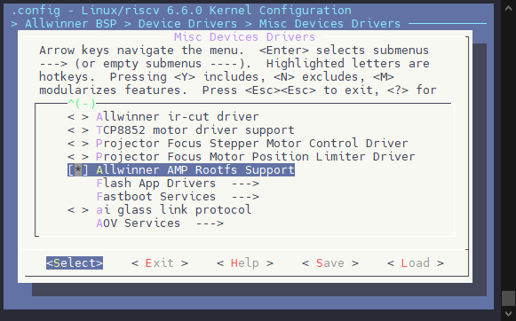

还需要配置内核控制器的异构锁的通讯模块

```
CONFIG_AW_RPMSG_NOTIFY
```

```
Allwinner BSP  --->
	Device Drivers  --->
		Rpmsg drivers  --->
			<*> Allwinner rpmsg notify driver
```

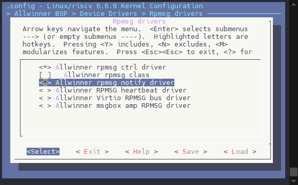

Flash 驱动也需要加上配置

```
CONFIG_AW_SPIF_DELAYINIT
CONFIG_AW_SPIF_DELAYINIT_RPROC_NAME
```

```
Allwinner BSP  --->
	Device Drivers  --->
		<*> Memory Technology Device (AW_MTD) support  --->
			<*>   SUNXI SPIF Controller
			[*]     SUNXI SPIF Controller Delay Init
			(6010000.e907_rproc) SUNXI SPIF Controller Delay Init Rproc Name
```

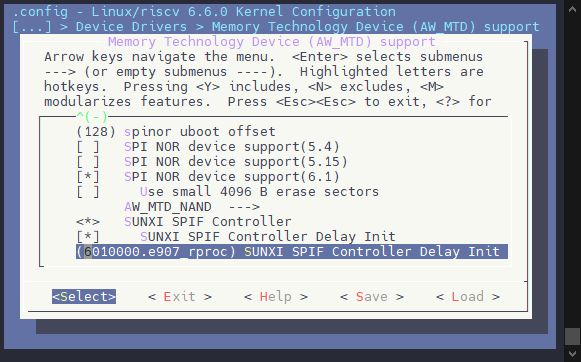

:::note

:::note

备注

:::
:::note

这里的 `Ramdisk Delay Init Rproc Name` 配置的名字是异构核心的名字，可以在系统启动后运行

```
ls /dev/rpmsg_ctrl*
```

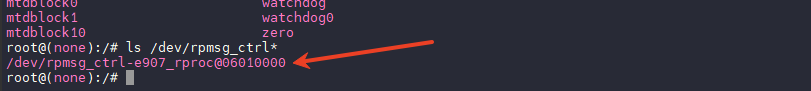

这里的 `e907_rproc@06010000` 就是异构核心的名字，填入的时候需要改一下格式，改为 `6010000.e907_rproc` 即可

如果不方便启动系统看配置，可以检查内核设备树 `bsp/configs/linux-6.6-xuantie/sun252iw1p1.dtsi`

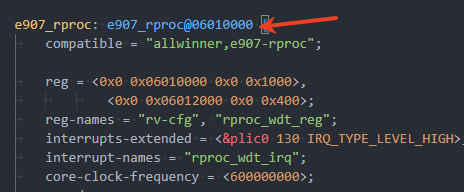

:::

:::

### RTOS 端功能配置

异构 ROOTFS 的主要操作基本上在 RTOS 端，所以 RTOS 端的配置需要更加注意。

#### 配置 RTOS 存储驱动

**SPI NOR 存储驱动配置**

```
Drivers Options  --->
	soc related device drivers  --->
		AW Flash Drivers  --->
			[*] Tina Flash Read
				Select Storage Type (SPINOR)  --->
			[*]   Flash Wait for Flag
			(0)     Flash Wait RTC Data Index
			(2)     Flash Wait RTC Data Bit
			(4064) Flash GPT Offset
			(128) Flash Boot Package Offset
```

存储配置驱动项如下：

```
CONFIG_DRIVERS_AW_FLASH_READ=y
CONFIG_DRIVERS_AW_FLASH_READ_SPINOR=y
# CONFIG_DRIVERS_AW_FLASH_READ_EMMC is not set
# CONFIG_DRIVERS_AW_FLASH_READ_SPINAND is not set
CONFIG_DRIVERS_AW_FLASH_WAIT_FLASH=y
CONFIG_DRIVERS_AW_FLASH_WAIT_FLASH_WAIT_INDEX=0
CONFIG_DRIVERS_AW_FLASH_WAIT_FLASH_WAIT_BIT=2
# CONFIG_DRIVERS_AW_FLASH_WRITE is not set
CONFIG_DRIVERS_AW_FLASH_GPT_OFFSET=4064
CONFIG_DRIVERS_AW_FLASH_BOOTPKG_OFFSET=128
# CONFIG_DRIVERS_AW_FLASH_DEBUG is not set
# CONFIG_DRIVERS_AW_FLASH_USE_HWLOCK is not set
```

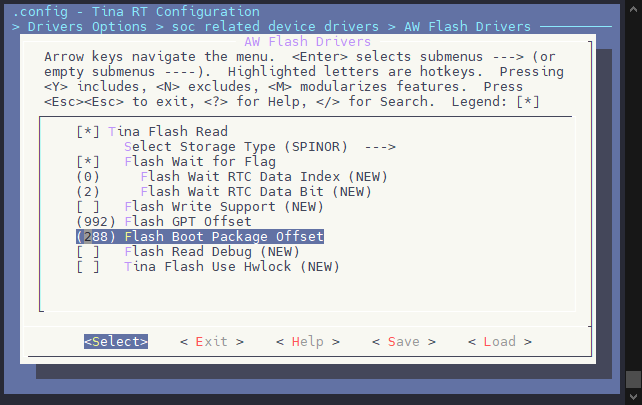

1.  选择 `CONFIG_DRIVERS_AW_FLASH_READ` 驱动
2.  配置使用的 FLASH 类型，这里选择 SPI NOR
3.  配置 `[*] Flash Wait for Flag`，设置 FLASH 的等待标志，这里按默认即可
4.  配置 FLASH 的 GPT OFFSET，配置需要与 FLASH MAP 一致，需要找到 `uboot-board.dts` 中的 `flash_map` 参考下图配置即可

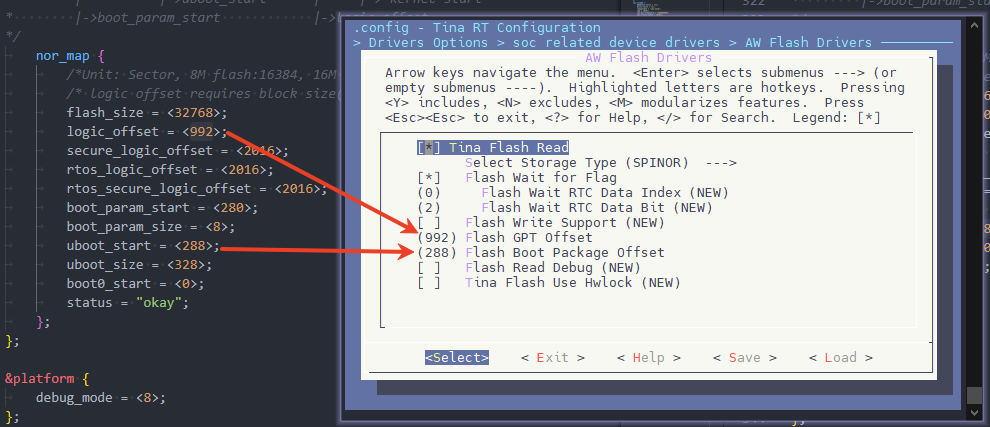

#### 配置 RTOS 解压组件

目前异构 ROOTFS 只支持 LZO 压缩格式解压，需要配置 LZO 压缩格式支持

```
System components  --->
	thirdparty components  --->
		[*] Compress Support  --->
			[*]   LZO Compress
```

配置项目如下：

```
CONFIG_COMPONENTS_COMPRESS=y
CONFIG_COMPONENTS_COMPRESS_LZO=y
```

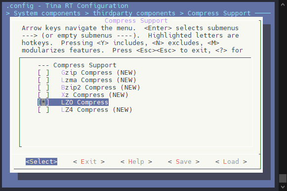

#### 配置 RTOS 文件系统

需要配置开启 RTOS 的文件系统支持，目前异构 ROOTFS 仅支持 `SquashFS` 文件系统

```
System components  --->
	thirdparty components  --->
		Filesystem Components  --->
			[*] SquashFS filesystem support
```


#### 配置 RTOS 异构 ROOTFS 功能

```
CONFIG_PRELOAD_COMPENENTS=y
CONFIG_PRELOAD_COMPENENTS_RPMSG_NOTIFY_NAME="spif"
CONFIG_PRELOAD_COMPENENTS_RPMSG_NOTIFY_PARA=""
CONFIG_USE_PRELOAD_ROOTFS=y
CONFIG_PRELOAD_ROOTFS=y
CONFIG_PRINT_ROOTFS_LOADTIME=y
CONFIG_ROOTFS_LOADADDR=0x47c00000
CONFIG_ROOTFS_PARTITION_SIZE=0x400000
CONFIG_ROOTFS_LOAD_FILES="usr/lib/libc.so lib/libgcc_s.so.1 bin/busybox init"
```

配置界面如下：

```
System components  --->
	aw components  --->
		AW Fastboot Preloads Compenents  --->
			[*] Fastboot Preloads Compenents
			(spif) Preloads compenents rpmsg notify name
				Select Preload Components Type (Rootfs)  --->
			[*]   load kernel rootfs
			[*]     Print load time
			(0x47c00000) rootfs load address
			(0x400000) rootfs load address size
			(xxxx) rootfs load file list. e.g. liba libc
```

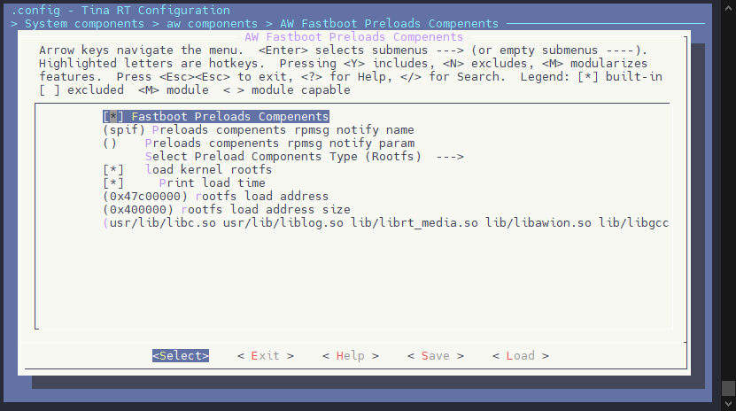

这里主要是配置启用功能，加载地址，可用的长度，还有需要加载到内存的文件，内存长度参考下图，填写基地址和长度即可。

![配置长度](data:image/png;base64,iVBORw0KGgoAAAANSUhEUgAABJkAAAC1CAYAAAD86y51AAAd0UlEQVR4nO3dP2hb6Z438K9eLlsuw84WNjiFYBa2SZNdlsgw3MUwM83bjIwDkaohxRbTLEOqa8WFI7NNGNgiZbiVZBhjTb07EAYGLDebZoot7oAWYrDagWkGFs5bSLIlW/6X48Rx3s8HBLF0znmeYznF+fJ7fk+lKIoiAAAAAFDC/7npCQAAAABw+wmZAAAAAChNyAQAAABAaUImAAAAAEoTMgEAAABQmpAJAAAAgNKETAAAAACUJmQCAAAAoDQhEwAAAAClCZkAAAAAKE3IBAAAAEBpQiYAAAAAShMyAQAAAFCakAkAAACA0oRMAAAAAJQmZAIAAACgNCETAAAAAKUJmQAAAAAoTcgEAAAAQGlCJgAAAABKEzIBAAAAUJqQCQAAAIDShEwAAAAAlCZkAgAAAKA0IRMAAAAApQmZAAAAAChNyAQAAABAaUImAAAAAEoTMgEAAABQ2o2FTP/4j/+Y9fX1mxoeAAAAeI998cUX+eKLL256GlzBjYVM//M//3NTQwMAAABwzSyXAwAAAKA0IRMAAAAApQmZAAAAAChNyAQAAABAaUImAAAAAEoTMgEAAABQmpAJAAAAgNKETAAAAACUJmQCAAAAoLT3N2Ta30qlUhm9HnQzLHWxYboP5lxneoyp1+r2VUcbX398/tb+vGP62ToaYzXdgzmHXOKeh9urx8c87b/hXAAAAOC2u8Rz9hWMnrfnXWd6nDMyg3f2PH8d2cLbyw3ez5DpoJvVWiv17mGKYi/tnWYW534Bl7T/Is2d65veSf2ni2nutLNXFDns1tOqnfyih+k+WE5rrZPDosjeZi/NO1uZuaPL3PP+VhYbvbT7RYrXndQ3lk/9cV88FwAAALjtLvGcfSX9vGj05r6/VTkep+i302sszj6Lv7Pn+evJFt5qblDckI8//rj405/+NPezvc0UWesUh5M3+u0iqRed128y0mHRWUuRnLjmPK87Rf2q47zuFPWkaPdPjLe5d3zMqfnvFe2kqHePZ3PxPZ++7mG3XiTt4uidy8wFAAAAboHPP/+8+Pzzz+d/eInn7KsYPV/ndPbQb88+d0+OnXp+f2fP89eRLbzl3OA9rGQaZvBzUv9yJQvjd/o/tJL0MniTZG3/RZo77XS69QsP7f+5md7m4zSWrnD9g0F6aWfl/uTnl9ndSfLz4KgkbTh4laytZmVy3f2XaSXp/TKYHHGJex5ksJO0P6sdnfPy+16SV8fHXGIuAAAAcNtd/Jx9FaMqpna3k4uTg2Shem96Ju/sef5asoW3nBu8hyHTCftbWf65nfba1HsH3ayeXMM4XnM4u5ZwmO63rdS7j7Jy4UD9vNyY/tKnrjK9bvLcHlHDdL9p5t5m+9xxtmqv0t4850933j2fmtPXad5t5+yRLjMXAAAAuO3mPWePexdNP7+Ps4STy9SG28/SWuvk0adzLn1/Je208vIoaxjnDFNBzox39jx/HdnC9ecG72HINEr47lUXMvny2t88SjXJq8H4D2Gpkd1+O9l4Nl43OAmTDrN+f+pS4yqmxw/nfvWz9l+mNZ3mHb0/tW6yGL++axz9MY2SxGqqk/HSyaPPkuwMMskSB7/0krvVLGT8x7v5OI8+yVRSeIl7PhjkVeqpLiWjlDXpfLWS6UTyMnMBAACA2+7i5+xa1l93Ut9p5sU4IBqtXtrL7kxGMK5i+qYxPzRKLev9dlq1SlafbmW1sphmOnl+dI139zx/HdnC284N/nAN13hrhttfp5lODu8nL09+eH89e5uVLP+5n8ZnL0dNq76b/pM4Dp5qyYVlX/0fWsnmXk7WMfV/aCVrnTw6GT6dvkK2aq20+0UWsjX/kINuvm4knde15Kf5h5x7z5ORni6ntbmXYilnjHSJuQAAAMBtd95z9lIjz7u7Wfy2m0ffJs826qPjpkyqmA7vJzmrRc9SNfUkvY3WuVN5Z8/z15ItvJ3c4D0Omcbp3utGFs6IiGpfdVK/s5zKRtLuF7MB0biKaTZ4OnuslxtJu38yYhqtZ5wkhecZbD8b/aHcT3LG9n/9PzeT7mEaS2eFXhffcw66ebbRzl5RS87om3+ZuQAAAMBtd9Fz9sLDx2k3lrO4k9THx02dPapi6u+e/cx/0M3qnWbu9Yvs3k9GO7wtZvFpNcWT6Qzh3T3PX0e28LZyg/cwZKqmupY0a8vJON07Kvn65sTXvrSS1bWkt3NymduoiilJlivTSWMvi5Vm2v3ixLK60VK5vQurlU5bqN5LdppZ3jlORCfNuKqTO/qknjSWs5x29orRPYzK3B6P/5Avcc9L1dxLL81a76g6a1Jyt7p0+bkAAADAbXfxc/ZELSubSTbqWf109pPh9rO0kqRWyUxycKeS5uZeiie1DH/aHS2xO8oLFtL4pp1m7WX6T2qpvcPn+evIFt52bvAe9mSaaGfvyekm3NMm5V+dzVaWn85PAS9jtCSuOucXupDq3ctdo959fuGudO3++qnleCeOuPCesza99vPN5wIAAAC33YXP2ftbWd5op9NNmt+ctYnX2Qa/9E6/uVRNfXpnuNFM3tnz/HVkC28rN3gPK5kWsvJlPclU6DO30ui4rK2xlOzeeZbuV7vjX9JCGt8VaUwdPdxezeL3qzn87mQzr9FSuXp3fmf4UVI4SSjnuL8y6ghfPWoFnpff91L/8vnR9RY+XU09GTf5Oh7zeHneZe55nL7meOne8Kfd9NZW83xy3UvMBQAAAG67i5+zk+lezY2HKxk0lvNiv3G0smnh4W6Kh1OHH3Szemc3q693jwKY6if15PtBhqkdP1cfDNLLvTwe5w/v6nn+WrKFt50bFDfk448/Lv70pz/N//B1p6gnRTb3iqLYK9pH/z522K0XWesUh6Ofis7a6WPOPv70WO3+WWeOx0+72Dv6efLv8RGbKZJ60Xk9Hmf876nRR/Mbnzc6fvYal7nnot8ukhT17uHR8fXu7B1dPBcAAAB4/33++efF559/fsanl3jO7rdn3tvbzPxcYOJ1p6iffIaePKtPzhs/l888r7+z5/nryRbeZm7wfoZMRXH8i5n35cwLhsZf2Flh0Vkh0+gXeuJLOX32+Iscv+ZcZ/Ql5ZwvZ/oaZ4x33j1PTP6g5/xBXn4uAAAA8H47P2QqivOfs0cBy8xz8xnhzuzn856jJ8Un5zyLv7Pn+evJFt5WblApiqK4joqoq/rbv/3b/Mu//Eu2tq5vqzwAAADgw/DFF18kSf7jP/7jhmfCZb3Hjb8BAAAAuC2ETAAAAACUJmQCAAAAoDQhEwAAAAClCZkAAAAAKE3IBAAAAEBpQiYAAAAAShMyAQAAAFCakAkAAACA0oRMAAAAAJT2h5sa+H//938zGAzyb//2bzc1Bf4/8Q//8A/nfv5f//Vfzn+L58P76Kb/Xzjf+Td5PgDcFoPB4KanwBVViqIobmLgjz76KL/++utNDA0AAADcAn/1V3+V33///aanwSXdWCXTxI8//pi/+Zu/uelpAAAAAO+Rf/7nf85vv/1209PgCm48ZEqSu3fv3vQUAAAAAChB428AAAAAShMyAQAAAFCakAkAAACA0oRMAAAAAJQmZAIAAACgNCETAAAAAKUJmQAAAAAoTcgEAAAAQGlCJgAAAABKEzIBAAAAUJqQCQAAAIDShEwAAAAAlCZkAgAAAKA0IRMAAAAApQmZAAAAAChNyAQAAABAaUImAAAAAEoTMgEAAABQmpAJAAAAgNKETAAAAACUJmQCAAAAoDQhEwAAAAClCZkAAAAAKE3IBAAAAEBpQiYA4Fr1n1ZSqWyl/yYn72+l8nTOmQfdrFYqWd0evt3xZ6+UrVNjjt6bO8c555553P5WKpVKtvYvuMz4uLPue7i9ernrAAC8A0ImALgmkwf+6dfch/9xcFCpVFJ50M3p+GCY7oOzrzEKUea8pq41by6Vymq6B+fPuXxY0U8+6aSeVpbn3tv5hoNXycby6VBlqZp7Se5VFy68RvWTerJWTfWKYyfJcL9/as5HY+5vpfJ0kOpaUv/52eh3dmbYVB0d98kZs1iqpp56qksXTGipmnrOvu+F6r3kMtcBAHgHhEwAcK3a2SuKFEWRvc2kVTtRhbK/lUqtlXr3MEWxl/ZOM4szYcww3QeLae6MrnPYradVmw1/ak9G1y9ed1JP0u6Pf/6ukYsjmGPD7dUsNnrjuUzmW7YCqJbaw0Z2++1kp5nFCyt+Zg1+6SVp5/HDhWusSLrKBJ5l8Sh0W04ro++wUqmkUmsdH/fl8xT99vxA7AzDg2FyMLxy8AYAcFsImQDgLak9GYVEve9fjoOFYbrftpLNvew+XEhSy/rrTuo7zbyYhEj7L9Lcqafzej21JAsPd0fhz7dXrwqaDrxGr900jipehnn5/ShgGs1lEl6Nxr2M/vY5c7q/nsPXhyk+y4mQaKpK61QA1c/LjaTefZRahhn8nMtXJB300z+44JjpCrLp19Q8Fh7uTv2+9tLOVIhXFCmerMzeY7eT1by8XBD209ep3HmRwRkfD7e3TlWaAQDcJkImAHiLFqr3kp3BKFg4eJndnaT92VSMs7SS1bWk9cMopuj/0ErWVrMytfyp9lk72dnNy2sNIAYZ7JS8xC/Nqaqf06/FO4up1JazPPP+Yppnjbv/Mq3Us/rpwvH8diZjnKgqOrW8b5Bnd8bjNnpT51VO9DSqp/N6EhodprN2PPzpJYbzxhzNv9dYHI/VTLPRzPJkjHHvqJPHnbms7qfj4Gux8Wr85rifU6WSyp1metNzeLB66d5UAADvmpAJAN6i4eDViWqck/1zFlK9e+Kku9XZZW/jvjzXq5aVzUxVWb3BFZ5MV0kVo+Vjp6qnjpf1ZXNv9v0n0zVTkyqvx6Nqq/2Xac0d9QxLjeyOr3vYrSdrnRzOCZLOc7KKqTNeRjj7Gl2vPuez3YcLR72jTprtzdTP1p1meuml2WiN5tpvT30+6uc01917l+5NBQDwrgmZAOCt6edFo5f6lyuj0OhgkF7unWrSXP2knvw8yHC8ROxUs+ilau6ll8GVK5laJ6qIZvsb1b4aLdVbvK6+R0vV1PPq9DwPBunlRAXXCcPtr9Pcmdx7P1u11olQas7StaLI+v3T1xr1dSrpYJDdxuKFFUP9/RO/uYNqHs0Jo55/OplXK8vjCqmjqqo5vbRWvj2j79b0cr0jvTTvzG8ADwDwLgmZAOBaTQc7y2kd9V96Dy01slvspT2Zc9lw4owwbDh4lXN3QDvo5uvGJBgapPtgOa20s/fkst2h5jhZDXYJM7v2jZepHS13O+rfNEj1btL7ZZBkmMG3y7Ph3dLCqXH7T0dLB5c3kqNKr0l111wLWbjSbnHTSwCv3gAeAOC6CJkA4FpNlouNKm/ej7lMXvOaeteyPgk9Tu10d1WjJXizTcpHDcZP9pk6Nlk6NvbLINUvO0eNz69u3DD8Dczs2ne03O7EaxJ8/TzIcNxja9So/JzrfnWYw8kyPgCAD5iQCQDeilrW++1kY2rnsTOWkw1+6Y0rbxamqmSmHAzy6rxKoOuw1Mhuv3yD8ckSvNnd8pL2N/Oqa4bjqqWk3R/3TvpkJbVPk93p5V/nNP6uVFZP7Mg2ahh+asnhpQ3T/aaZe980srC/Nef6k0bsg7z8aTe9tPP4okq1OdVNAAAfIiETALwt91fSTisv96ffPLmcbE7lzc+D2WqicU+jt+7+Stpv1PtpylIjjzeTVm0r/Ukz77VOHs3pnZQspPHdnN5KU028L+rJVBS7o0bhEweDvMqbN8ae9IZq1Sqp1FqZ7Xc0DpyWqqmnlWajd2EVU5L0n87peTX5Tie7y9VayZx+XVMzS/fB6cALAOB9ImQCgLdmvHzsh3HEsLSS1bWpn5NkvORq0hR7VCUzW03U/6F1znKzNzXMcE6D7uuomKp91Uk9rSxXFtPcqafz7bvrETQcVxetzA21Ljazw9zrTuoz/Y7GgdY4SMtaJ8+nqpiG+/3jcHD8vfYai1nemNMMPUnSyyDVqZ33Ti8R7P95tJSwVVtMc6dkAAgA8JYJmQDgLap+Up9aMreQxjftZGN5vGvZuB/RdKXP/UfprPXSvDOqfhlur2Z546zlZuW8/GZqx7mDblbvNNO7jjBrEsIkOb8657qN+z9trrxhP6fxVbZXp5p/z+7ctro9TP9pZdTEe6eZr7eHo99dpZLFHzJeYjc5d9IT60S11bTquGpr3OtpNPY/5Z/G4y1vZGaXvXm76QEAvC+ETADwFi18upr69JK5++sp+u3xrmXLaa11cjizG9hCGt8dprM22vFtsdFLu/82woXZcSrjsOuw9M5k/WyNw5H2ZjuT3fa29i888VJeDc5pSz7p//TZeRHTdGi0mObO8SeTcGmx0UtST6d/spKpyONfRrvEtfujRt69xmK2DqZCtfuP0lmbnHNO8/L763NDo8EvvWTtX7OxmdS7h7PNxgEA3nNCJgC4JqOlVieChXF/oZkwYRwwnL3d/HGvonOrV+Zd+7y5XDDO/Llc0riaZ9SgexSyrD9ZHy85m2rY/fRUd6IZp5qeH11/1GvpbP1s1ab6P00qik4ESZkJjcbNxsdmlsqd6vU0ur9JwLR+f3T8YbeeVm1ccTS6ShrfnVO5dK5xf6671fzfJ0V2p5bi9ffP/72dvE53+yrHAwBcDyETAPBG+k+ndnm7M+odNFraNRWyjIOww2599PPG8tE5s9VNo13h3sxkl7qp/k9L415H4zntXrQD3DwHg+PlclPL36ZDvYWHuyn67dEPJxu2nzCpaluunNwhb7ayau7OeD9Mfm8ndtk71Zx8fJ1frn67AABl/eGmJwAA3E7VT+pJekna2bugamrh4W6Kh8koEFrM7peH17oEcOXbIoffDrMwE2415hw5bp69lEwqueYddaye9maSz3bPnu/99RTF+sWTPHNOF6s9KVI8eaNTAQDemUpRFMVNDPzRRx/l119/zY8//pg//vGPNzEFAAAA4D318ccf57fffsvvv/9+01PhkiyXAwAAAKA0IRMAAAAApQmZAOC2Gu94trp9drvp/nb33GbUc+1vpVJZTfeg1OwAAPj/jJAJAG6rpWruJblXnb9z2nB7NcuNZhYrW7nKhvbDpUfZ2+yleef6gqbh9urx7mdPrzKbefrZOus6+1vH4zyYF7AN031QOWOHuxPXr1TODtsuHOe67xkA4P0nZAKAD9BwezWLjV6yuZfizJ3fpsOU49fincUsbyRJL807pz+vXFA9dcr+VhYbvbT7RYrXndQ3lq92/ql7e5bWvA8OulmttVLvHqYo9tLeaWbxRLjTf7qY5k47e0WRw249rdrJEGmY7oPltNY6OSyKcdh2IqS7xDjXfc8AALeBkAkAPjD9p5UsNnqjEOTJ/HhpWrtfpCiKFMVhOmsZB1PnvVdk9+H86qnThul+20o297J+P8lSI8+79fQaL65UXTV1d3nR6M3/5M/N9NY6ef5wIUkt6/12svHsOEQ66ObZRtLuj0K3hYfP01nrpfnnqZnsv0hzp57Ot40sJKk92Us7rTybCoguHOfa7xkA4HYQMgHAh2Lco2l5YxQcXT4ImlX/pDr100Kqd8tMapDBTtL+bBJ2DfPy+16SVxm8wVK84faztNY66Wye+iSDn5P6lyuZ3HX/h1aS3vE4B4P00s7K/cnPL7O7k+TnwdFyt+HgVbK2mpWl8Rv7L9NK0vtlcPlxrvmeAQBuCyETANx64z5Dd5rpZbQUbP3+xWcd+WHSX2gxzZ2k11icWRq3vJFkY3nqvav1eJqZ6fbXad5tpz3z3uqp/kj9p/PGGVUxtb9ppJoL7G9l+ed22mtnziTdb5q5t9k+64Ak/WzVXqW9WS8xzvx7BgD4EAmZAOCWa9VG4dD5/ZfO8dn6zNK4Ua+h46Vxe5s5sVzuCmMcDPIq9VSXklFIlHS+Wsl05c/Cw93sbSatb8cNtA+6ebZRT+f17DiTKqZHcwO0UfXQqAn6aLla+5tHqSZ5NRjVKY2qlKqjgGr/RZrp5NFnSXYGmdQpDX7pJXerWZiMt/k4jz7JVLXTxeNc5p4BAD5EQiYAuEVGFT6T1/JsA+yZaqN5r8vtFje3kula5r6c1ubjNJZOf1Z7Mmqg/WJ/3PPo1HHHVUwXLQIcbn89CpDOrObqZ6vWOv9aB9183Ug6X50dp108zvn3DADwofnDTU8AALi82pMixZPJT/1sVZaT/mh53GhHuXvZe5NqpiTJQhrfFWlc22ynHHTzbKOdvaKWzF1sV8ujbj2LtUqSyXHHJlVMhxcuAxxXDr1uZCHzd3MbbD9La3Mvxf0k+3MPSf/PzaR7mMZSzrjKxeNcfM8AAB8WlUwA8IEY7ZbWyvLTqwcak75I571Wt88IU86zVM299NKsNZPuo1H4NbOcbGr+n66mniSbKydCsvGOcjvNLJ7qEzWpzqqmupa0atOVQ9NL25KF6r1kp5nlqQqlmSV0Saqf1JON5SxvtPN43Dh9egndZca5yj0DAHxIhEwA8MFYSOPbTuoby28QCK1m73Un9Yx2ppvuyXTYrSc5Dl3eyFonz889f9SIO91O2hvLM03Ar6advSfn13HVu88vXL7W7l9UDXbxOBffMwDAh8VyOQD4kCw1stsfpFJbzGoOs3vJkGPh4ag/0fPubhZrW1mZLLk76ObrRi/17vM3XIJXy8pmklSP+h8Nf9pNb201z6eDnv0Xae60s/ddI9XsZvHbbh59N+mZVMt6UWR96vD+00qWs5fiKOhZyMqX9STHVUnZf5lW2tmbLLG7vzLa4a16NJO8/L6X+pfPj+Y2qaY6rjjq5+VG0u5fYZzL3jMAwAdGJRMAfGjur+ewWx818H7QPatj0NwlXEdL7h50M0w/W3ea6W3uXTqsmqf2WTuZVFdNQqsvV6aabo92aauPl5YtfLqa+rgJ+FVMzlt82s+kuffs0rtR+NOqjZbYDbe/TnOnntVPp+5taSWra70072yln3Hj7rSzcv8q41zmngEAPjwqmQDgQ3HQzeqdQR4X66k93M1hVrPYaGax0ky9e7qqafjTbnq5l8cz1TULaXy3l0FlOYuVJGudHF60LOwi99dT9JNKbTGV5NRcRmFPO3vfTXoaNfJ4s5nl6Yqqy1hqZPd1snpnOZWNJJvTlU4jtSdF9lLJ8p1Kkno6r3dPLJ1bSOO7w+TBYpYrrYyakJ+YwyXGueieAQA+RJWiKIqbGPijjz7Kr7/+mh9//DF//OMfb2IKAHDLjXeX22yntdFKkrT7h3m0tJCFSXBy0M3qnWZ6k1OOApHRua9OhR+j91snRmqPd7ADAHhXPv744/z222/5/fffb3oqXJLlcgBwW+2/TCtJa6OVevcwRVFk/f5UwJSMqm6Omncn7QzSPZgESe08rr44sYvcclqpp/N63Pi7306StGrTx0x2dAMAgGMqmQDg1hqmuz1I4+GbLGcbZngwCqSG26tZbPQyd2nYtP2tVGqt+cvDAACumUqm20fIBAAAALx3hEy3j+VyAAAAAJQmZAIAAACgNCETAAAAAKUJmQAAAAAoTcgEAAAAQGlCJgAAAABKEzIBAAAAUJqQCQAAAIDShEwAAAAAlCZkAgAAAKA0IRMAAAAApQmZAAAAAChNyAQAAABAaUImAAAAAEoTMgEAAABQmpAJAAAAgNKETAAAAACUJmQCAAAA3juVSiV//dd/fdPT4AqETAAAAACUJmQCAAAAoDQhEwAAAACl/eGmJ/D777/nP//zP296GgAAAACUUCmKoriJgf/1X/81//7v/34TQwMAAAC3wN///d/nv//7v296GlzSjYVMP//8c5LkL3/5S/7u7/7uJqYAvGV/+ctfzvzsov/3J889efx5136T61+3suM7/+2e/6G76d+v853vfOcz303//sueX6/Xz/281+sZ/xafP3lGP8vdu3dv7PyLzuX9cWMhEwAAAAAfDo2/AQAAAChNyAQAAABAaUImAAAAAEoTMgEAAABQmpAJAAAAgNKETAAAAACUJmQCAAAAoDQhEwAAAAClCZkAAAAAKE3IBAAAAEBpQiYAAAAAShMyAQAAAFCakAkAAACA0oRMAAAAAJQmZAIAAACgNCETAAAAAKUJmQAAAAAoTcgEAAAAQGlCJgAAAABKEzIBAAAAUJqQCQAAAIDShEwAAAAAlCZkAgAAAKA0IRMAAAAApQmZAAAAACjt/wFp0QTdzqGthwAAAABJRU5ErkJggg==)

`CONFIG_PRINT_ROOTFS_LOADTIME` 配置是打印读取每个文件的耗时，用于耗时优化，属于调试功能可以不用开启。

`CONFIG_ROOTFS_LOAD_FILES` 配置后面跟着的是文件列表，需要通过异构 ROOTFS 方式加载的文件列表，例如如下配置

```
CONFIG_ROOTFS_LOAD_FILES="usr/lib/libc.so usr/lib/liblog.so lib/librt_media.so lib/libawion.so lib/libgcc_s.so.1 bin/busybox bin/demo_video_in init"
```

包括了运行需要的库，busybox，应用 APP `demo_video_in`，启动脚本 `init`。请根据 ROOTFS 中实际的文件路径填写。

#### 增加异构 ROOTFS 启动流程

修改 RTOS 的 main 函数，新增 ROOTFS 启动流程代码，例如在 `rtos/lichee/rtos/projects/v861_e907/bga_perf1/src/main.c` 中，找到 `cpu0_app_entry` 函数，这样添加代码

```
#ifdef CONFIG_PRELOAD_COMPENENTS
extern void flash_load_data_async(void);
	flash_load_data_async();
#endif
```

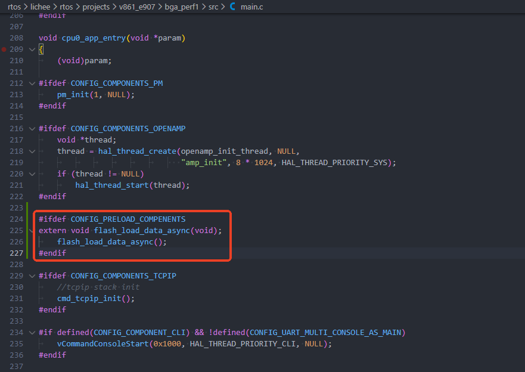

### 文件系统相关配置

由于异构 ROOTFS 只支持 LZO 压缩格式，需要配置打包构建的 ROOTFS 使用 LZO 压缩，这个配置需要同时配置 Kernel 使用 LZO 压缩，和 ROOTFS 构建使用 LZO 压缩。

#### Kernel 使用 LZO 压缩

执行 `m kernel_menuconfig`

```
File systems  --->
	[*] Miscellaneous filesystems  --->
		<*>   SquashFS 4.0 - Squashed file system support
		[*]     Include support for LZO compressed file systems
```

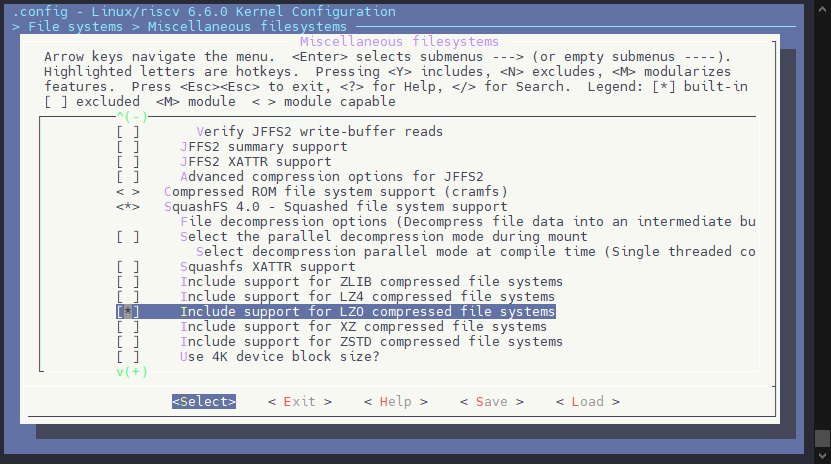

#### ROOTFS 构建打包 LZO 格式

执行 `m menuconfig`

```
Target Images  --->
	[*] squashfs  --->
		Compression (lzo)  --->
```

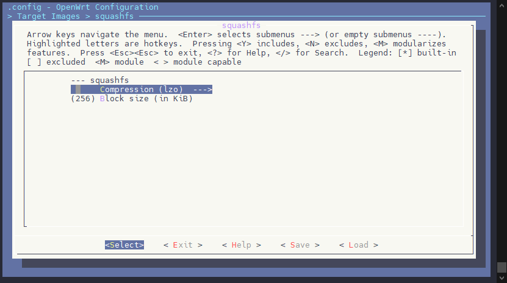

## 使用异构 ROOTFS 功能

编译打包烧录后，即可测试异构 ROOTFS 功能，可以在小核控制台看到异构 ROOTFS 的相关打印

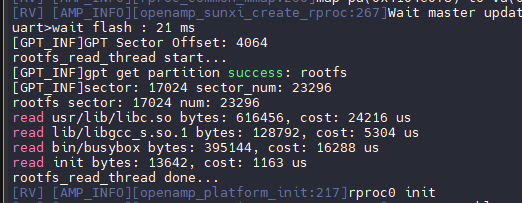

## 常见问题

### RTOS 打印 get\_boot\_param failed

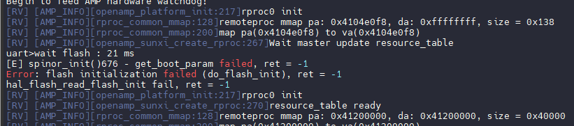

请确认配置 FLASH 的 GPT OFFSET，配置需要与 FLASH MAP 一致，需要找到 `uboot-board.dts` 中的 `flash_map` 参考下图配置即可


