# FASTBOOT 功能配置

FASTBOOT（快速启动）是一种能显著缩短系统启动时间、提升设备响应速度的启动机制。本文档将详细介绍配置FASTBOOT系统时需要涉及的模块和仓库设置，包括SDK构建配置、BOOT0配置以及存储设备配置。如果您不想深入了解这些细节，可以直接使用SDK提供的快启开发方案进行板级配置。

## SDK 已提供的快启方案

SDK已经内置了便捷的快启开发方案，让您能快速部署和使用FASTBOOT功能。在执行`lunch`命令选择配置时，如果能看到启动方式为FASTBOOT的选项，说明相关功能已经成功部署。您可以基于此方案进行二次开发，无需自行处理复杂的快启配置。

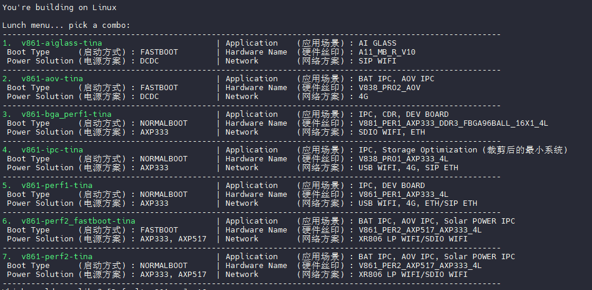

## 使用 QuickConfig 切换快启通路

SDK提供了`board_use_fastboot_nor`配置命令，可以一键切换到SPI NOR存储介质的快启模式。只需执行以下命令即可完成切换：

```
quick_config board_use_fastboot_nor
```

切换完成后，请参考以下章节进行个性化参数配置：

-   获取相关参数
-   配置内核快启
-   配置 Rootfs 提前启动应用

## 手动快启通路配置

本节以V861-BGA\_PERF1板级为例，演示如何将默认的普通SPI NOR启动模式切换为SPI NOR快启模式。在SDK中，V861-BGA\_PERF1的配置路径如下：

-   设备配置（含设备树、分区表、板级配置项）：`device/config/chips/v861/configs/bga_perf1`
-   目标配置（含ROOTFS配置、ROOTFS加载文件）：`openwrt/target/v861/v861-bga_perf1`
-   RTOS设备配置（RTOS引脚功能设置）：`rtos/board/v861_e907/bga_perf1/configs`
-   RTOS功能配置（RTOS功能设置、RTOS主函数）：`rtos/lichee/rtos/projects/v861_e907/bga_perf1`

:::note

:::note

备注

:::
:::note

板级配置分为两种方案：NOR方案和非NOR方案。切换NOR快启时需修改NOR配置；切换非NOR存储（如SPI NAND、eMMC、SD Nand）时需修改非NOR配置。以下是V861-BGA\_PERF1板级的配置文件示例：

-   SPI NOR存储的板级配置文件：
    -   BoardConfig：`BoardConfig_nor.mk`
    -   boot\_package：`boot_package_nor.cfg`
    -   分区表：`sys_partition_nor.fex`
-   非NOR存储的板级配置文件：
    -   BoardConfig：`BoardConfig.mk`
    -   boot\_package：`boot_package.cfg`
    -   分区表：`sys_partition.fex`

:::

:::

### 获取相关参数

在适配快启系统前，您需要先编译一次普通固件，收集一些关键启动参数信息，主要包括`bootargs`和分区配置。这些参数在后续配置中会用到，所以这一步是必须的。

**收集 cmdline 配置**

系统启动后，执行以下命令查看并保存`cmdline`配置：

```
cat /proc/cmdline
```

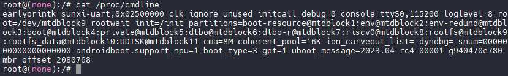

命令输出的数据就是`cmdline`，请将其保存好，后续需要写入到`board.dts`文件中。

### BOOT0 切换快启通路

#### 引用配置文件

SDK已经预配置了针对不同存储介质的快启BOOT0配置文件，包括：

-   `cfg_mmc_fastboot.mk`：适用于eMMC、TF卡、SD Nand等存储介质的快启配置
-   `cfg_nand_fastboot.mk`：适用于SPI NAND存储介质的快启配置
-   `cfg_nor_fastboot.mk`：适用于SPI NOR存储介质的快启配置

![快启 BOOT0 配置文件](data:image/png;base64,iVBORw0KGgoAAAANSUhEUgAAANkAAABACAYAAACX19L9AAALwUlEQVR4nO2dS0xb2RnHf8xMNVNnUlHCo6JpTdKC1EAHuVSNUG2QsoPI2aEBqYYsIgLuggqhFLFgwQIhhNDQBSCURWwvjORVB8XeITVGQjOqB7lKqAQV5LZpZgIMRWVwp1Lb6eJe34dfGOwL2JyfxOLa5/Gd4/Pd851z7/lTcqO2/hsEAoFpvHXeBggExY5wMoHAZISTCQQm806uBSzcvM7P3/921uk//SpG39bfc61WICgYcp7JTuJgAL9435JjjZ1M+j0E/B4mXTkWde7kty32oTkCE525F2QmjkGe+MfoPm87zpCCCxftQ63ckEJ0dPXwyHfe1uRGrm3pnvDwZKg5/4al4hI6R77IOVwE+NmfNrNO+9kHtTnXd7Qn5VzGRaGY2iJITV6czByaGVnow3ZVvjqKzLNc3ofTCtBHwN/GUtcoXjqZ9LdxAwCJpSA469fpGF5MU24nk/5WDiK72JqsAGwHe3jEGIF23bUys3RPeLizF2WnqVGuQwrRMYxWpxQy1uXSygFJsTGZ7glPUlu2huYYaLKkyKtvY4y1WS+4lL6x6vInlW1sS+J3SfY5BnnibuQKWp/fn1o1tMnp93An/rmCfWiOgfJN1soaZZsOo8z0rtIS//0Oo8z0TrOS1AvKb0y674uDMwkXP/3pj1lt+NEJcsidX7cxT0dXDx1dITYA73APM5EYR5F5OrpG8dLMyEIbBHuUdOs0qAM8ExZs5etynqDEjXYPgXr9tTEsutJUynPFjm1rGwH/LcO1up5yjRFoh6Uu2Z6ZyEFaC1K1paV8kxkl75JkxTnRqfSFvo39jIdXGe/tYUlCl1/B2kbDCyXtbJTK9jlGHPJX9qE5nGVRtY6OIDgXBrED0Mmku5EdtZ55Nur65Lb5RumYjXKExFJXj8HBVKy14JPzrdHIgL/bcP0gRVjbPdGHbT9ERxE7GJjoZA2W9/jt9yt4WHWNd0pKePett3hQWQbATyzvZs7saKaOKI/VH3OR8VQ/rKsNG1E+Vu/UizwKZhN+xVh7qsw+vnW2k64ruO7QUh9FQsogXuS5lHxdWSUPoO56K9tBbcCvTE2nnMVSs8r4sDbYvC8k9fNX+1odxyKFtJkrPM2yZKHudjPQyb0mWPPpBrQvxBq1tDi09aE2660yHpa4UZ/lRor0B8bDcr5nG7Gk6yvlxpvf9bjDp404igfTnOxhVRkfXivlYVWZ+pn7e9fk7yqvZc5cU8qV/dfZ3d2yTWc6zVwvi3HwMociXGMElN3GgG5G9g7Ls0rAf/KNjq29mO5ql1dh/bervNq3UFojXyWtD18ecFRWrcx0+cSKLdHhixjTnOyjz78k/lLkrzb/Ss9f/gbAf7+B332xd3wB2f64CensVRUntDSfaAP2xLjGCDgOdKGcfsDL4aEhhMuSm+UWdt7EowDjDJ14Y0icbU50szsREkvBXWzuy7FbmbOT/fGrf/HZB7VJf4G6H1KipCmhhJISLU8JJSnLUvGts31VH8d3MpLqDq6ku6cOuk7uNeX6HO60yGGRfj1nHxrMehDZqyoMs3J3faq1ZRaho7VVXYPhGsNplXjuAzm0tWBzDWo3JVcbNjZ5FoaVTzY50q8vaWbEYWX7RZpwzjVGYGHw9LOcb5SZSAXOS/BYIOfdxd6tVyk//6immpbvyPtUvtofqJ+/XQK/ripjUPo8Q6mLPOqCSX8fAX8fIO+SpUw3W80Tt4dAO8h3SIkb9adrS66sTPXD0BwDfg9OkHfVss7rpWVB3ikE2JbiM5lxlxUpRIeyPvU+jXLHnbC7KG2Cy0PADfJOZL+6LvQO98CEhwG/h4G4ffFNh/A09xnU9WXCzmR4muW7Hm138c2puiihzf3cnPDg9M9xfbZfWcMVHyVmHXVpsLzH3e9e5eA//1PXZbNffEn5t97m9//4J3+O/duMarEPzfEAb+odMIHgHDDtOdnz2Nc8j30NQK/iZI939s2qTsYxyIMm2JhdTXrmIyPf2c/yjmk3PPtSSPvcSFCMmDaTnQ36h7QyiQ9fBYLzpsCdTCC4+BTcC8ICQaEhnEwgMBnhZAKByQgnEwhMRjiZQGAywskEApMRTiYQmIxQqxIITEaoVZlGMyML2qnkdNiH5uTzY7m80a7SyaT/+DrPm4JQ1cojBRcuFpNalXpaebbnlEfwmxlZOLubzZmqYxURQq3q3Ek8rSwoNi6vWlVwk7p25S19g+KU8aVjVbHp2HzGN+6PIrL4T1p0pwRuqApQ1jR1k3CqQGKpa52GeNp2DwFHlJne13LaGl3axDf+0ylSKaRWs9L9FlZ932PIdyJVrwR7SLCjmLi8alUOeJxSceqWVt5sFJq6dWucTPnGGKjT1KYe06odtExFeJr7XSG29QpQaevuZNJdy8ZsvJ2jeFnkUdc8a4fyyQMt3NTb2MPSfiMD6vongyIVmdSsMqhj6cha1UtFs6dYHQwus1qVKuJiVJzCN6o7DbzKxmE2+ZSj+mFtxliZ8rJmyJsFaeuWODjMVj8kZhCo8T6NcmS9RTfHKVJlVrPKhmxVvWSqGVloozIyXwRr68yYFi4+rCrjl1eNRyb1alW/efk6feaaUq7sr5+ZWtXWXow76lXCcX9irGWVL0elqox1rzLea5V3VdtPeGYu/Jodd6l6mVKRylGNndekVrPqo6EGyPe60dqI7TDKTBHPYHGEWpUBeZCXhrVwKvvZKHGmsVKaKVw8cd2LPFJCL9pPsE3vqKby8EBVF86sSJVZzSqvSKGEULZ4EWpVBqyUXtUNKkczdVk5iqJU5dCeddmHWg0ntvNX93GhowXb3fjAbWbE1Qgbq6xwnCJVZjWrVOS6pe8dnmetrK3on5kJtarE8oK3CLgVtadDie0sZ7K48lJcCeooEmLtsDVPdafY8fSBvKZqI2DYXYyxtneLgN8jJ9apWx2nSJVRzYpkdazciYfBbQQWqotW90SoVQkEJiPUqkwnWewHhODPZaLAhXSEWpXg4lPgTiYQXHwK7gVhgaDQEE4mEJiMcDKBwGSEkwkEJiOcTCAwGeFkAoHJCCcTCExGqFUJBCYj1KpMI792FobCU2GoZZ01BRcuFopaVc525vqPz0+CY5Anl+AfpJ8XQq3KRArFToG5CLUqyKg6ZXxzX8kb2cXWZE1SeoqjKT5pdm4ZypQMak96haijyDyP6VbSWhnwe7gX7OHjFGkTX4ZOrTSlb7fuZep4m11jBBTxIaeqmqVrk2OQJ+5SNiIV2Josan88ux1vT/qTDbI9iXZcPoRaVSrVqaZdluKKTbOb1Ln1oZQFW/k6HV3pFZZS2dlSrilZLUlWnMr6yj40h5OQYr9c5spUPx1BST40qQ83rW00vNDUrCp1MgTplabi/SmL1sTrWaJNPtXsG6VjNsqRXjUrCSt1eOno6mEmAja3hwf6a1dyWKvZc7kdDIRaFSlVp4K6gRGeZlmy0uDS5X2abpZMxyrjw7oTxi80G1fe7GavZ6JXmgpPsyxZqLvdzLFKU0o/Pdb1ofdpFOqas1zzSSwreVc+2eQo8fpqKTf1yW8rN6oiPel8UkxzsodVZXx4rVQ9FQ1GtaqMGMRdjiFPalUaycIxW3uxBDmzU+AakzXv/R41PAPAN8rMRi0Dp9DDN9qdSmlKpwWS2E/h1+wkOkdesGBrSrhRXXKEWlUSySI1N8st7LzJQc7ANUbAcaAL5Yyz7cpUvxx6bdSeSL3JaNcxSlOJ/ZmgYpU/YqwFjaHsZUeoVRlQVKfadWswxyB3rBLPc3hcYK+qMMwk3fWp143Hho7WVm3gusZwqnYdozSV1J/QfVdTsUoi1y39l9PcD+5icwtHA6FWlcTKVD8MzTHg9+BEKTPHxfvKlJeWBXmnEWBb0mYye9Kuo7KO8YVYc/QZdxelTXApalbKrl7crsxKU8n9adgZDU+zfNej7S5+kkNj4/hGmamaY8DtYbLmYj/TNBuhViUQmIxQq8oB4yykkPhfVASXngIX0hFqVYKLT4E7mUBw8Sm4F4QFgkLj/+rTjCpH/eogAAAAAElFTkSuQmCC)

##### SPI NOR 存储介质配置

修改板级目录下的SPI NOR专用配置文件`device/config/chips/v861/configs/bga_perf1/BoardConfig_nor.mk`，在`LICHEE_SPL_BOARD_MK`配置项中添加`spinor-cfg_nor_fastboot`，表示为SPI NOR配置启用快启功能：

```
LICHEE_SPL_BOARD_MK:="spinor-cfg_nor_fastboot"
```

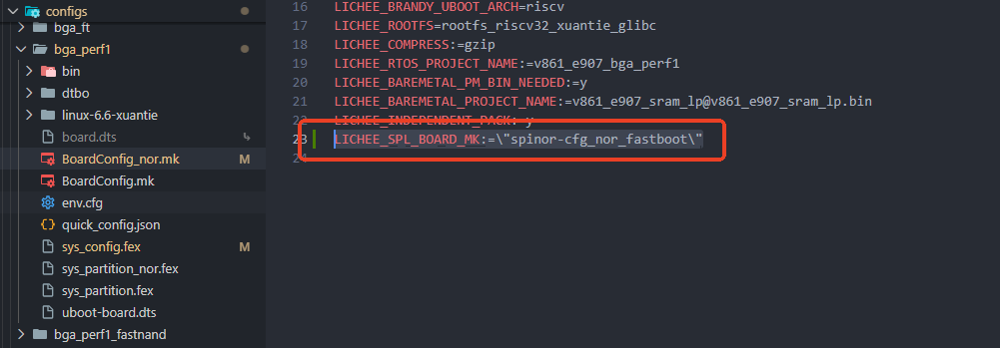

此外，还需要配置备份ENV的大小，以减少ENV的Flash读取时间：

```
LICHEE_REDUNDANT_ENV_SIZE:=0x1000
```

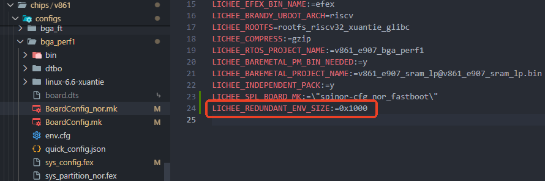

需要配置内核压缩模式为 LZ4 以获取最快的解压速度：

```
LICHEE_COMPRESS:=lz4
```

![配置内核压缩 LZ4](data:image/png;base64,iVBORw0KGgoAAAANSUhEUgAAATkAAABJCAYAAABGtFGEAAAJUklEQVR4nO3df2iU9wHH8XeHW5LnlJLwnCLJJZrWW85hEtNVmh5TWmsWUAjp1locg0JoQRj2rzI28Y+upKXsr8pGYFIorC2z7RqEwFKtLbWk6R+aala8VNto7lIk3pGw6T2Jf21/PHeX5y7PmTM/nzx+XiDkeb7Pj+89kg/fX/fkga3bfvY/iigrqyhWtEy2sv2JRipTwwz8+9rdDw008siu9cQ/+5KkS/GWp4dyP1//qGVpqykia8aPVrsCs+4h4KikdsdWylM3XANORCRr3WpXIMuof5hKALOR6BONuf1Tl09xeQKM+n3srDNy+2fGzjEwOrXyFRWRNcUzIWeNnmFgdOHlIiJuPNRdFRFZego5EfE1hZyI+JpCTkR87QFvrZMTEVlaasmJiK8p5ETE1xRyIuJrCjkR8TXPfOMBILijg7CZ2Zi+xtdfDWPd7ZiSvucqIvcz74TcpscJM8zAZ9eASmof283OHbccIWbvC6Wzx4iIzM87ITfxJQMT2Y0pUjctQhs3YIDdmtsUsQNOLTcRuQfeCbl5BDcGmUnfZvsTHfbbSph9Q4mISDHeDLlAI5E6g6nL2TG5SioCUG6uJ/7ZKS4DbHqc6PZ91N4+Qzy9qrUVEQ/z4OzqVrbv2gpj5+a00qYuO94CPBEjMW2wfv1K109E1hKPhdzs24Ev5L0Qc4rpNFQEKoueKSLixkMhd/fXnydvJimvixDM7tgUIVSRJKkxORG5C898Qb/w9eZZzsmF/GOSXCnyR2xERLI8E3IiIsvBQ91VEZGlp5ATEV9TyImIrynkRMTX1gU3Vhct/O9/JlewKktry9NDuZ+vf9SyJNdc9+PyJbmOrH11Neb8By3Q2Hhq2a59P1JLTkR8TSEnIr6mkBMRX/PmW0hE1oDGjpdo2Wj/PP39KU5+en11KySuPBVyew7/madCmY1bX/P319/jCgANPPOHLho3FJ5xi+G3/8QHV1awksEG+mot3roQp3dOoUlPdBuhgr2JK4Mczn3/rILuR5ppys5hTF7lQCxlXzcMpwdGOO68V25fwXmF1w7UcrK5mkBe6VT+9Ur5bOHsSxDucOniEEfTbmXOz5SpFz/MPpPMsfYxLs8k+5mLPLP0+EUOjk273heAGce9XM7Pe95znkvB51qE4VNvMowddpEFX2ULu3/TQb1hMdp/gnOJxddL8nkn5Pb8jqfo59gfz5INtd8enuBYz1lghA9ef5kPCo5/9ZdwcyUDbl4pDg+kyP7ikRdu5PaHJq9y4ELmlzzYQE8wxeES75CYc02neww1h866Frpq4NLFwUwAVNAdqaUzFqc3F7aD9rWDDfSFW+i2hjiaDlBVfof0jJELmiOmQXqmWL3tUOyL4Ag6R/AEajnZ3EyP5ficeaHmVEH3I9uoGr/IgWwo5jHpaa5m8sogBz36JeeaJ/dRf/sGSePB1a6Kb3kn5D7/C8c+z26McGn0Fo31mwgDbjm2Z3sdty+9xecuZV7VWVdLaOYH3oo5lggkR+yACxY7ayWYtNWUkbgy6GjhTHM0Fgcq6K61W2W58EyOcNpsJWpWQBrA4ruUQSQIJE0ixBmwthE13L77PM3R+BR9YZMjpOYGctqi5IVLgSAPl9/hu5RbwAFBkxBTnJ4n4Lb9+vcc2gHfvPMG/7xa6s3n0fQsz+/anL/P+pZP3u1nPLsdaif6EIz2X2NDe/MS3VgKrc2Jh/AhHguN8dXJkdWuyT2o4OdmGelU0qVFssoyYRBzDQO7pTZZ8GfTEtYdAmaQzsz2RCpFlWlC0ITUItZ5BU1CzL2fq3SS72bKaGpuoTvgUp5MkaCStmgDRxZeo4W59D5vn3gz8+8Uo5bF6DlHwLGF3bt/Ct+fURd1mXmnJecUPkRn0wYSH7/n3orbuxPWWCuuNJW0RVtpy9s3lbcVCrfSF85uFY4vFZxftJt3DwIGVVjECsawei2Lrlw5duAYdfSYEIsBRdfKmvSEK0mPX3S04spoam6lD7C73EP5Lbzyarqi1fb9wDGmN83RC4N2Vztzft54Xmb44EikNfdc3Lr7Vz98g1c+nFvTX7zwKk/WFO69zTfvvMH5Io1HNzVP7mPzjTOcdIZZ0y7q+ZZPPr3OKjfjfc+DIbeXF5+3Q+xvbikWPsRjoVuMnl1LrbhSTblOPDgt15hcUWmLSUw2Bch0TW2dhgFWil4MngNgmvMpgy4jzmGg07qTdxlnOOcHEcyGtT1maXd7HcXzhHXv2BC9Y+TG8/oM58QGHI85xxJbOWkU3t/dFyeO8UWRsro54VdEqJ3o5gQD7zpnXh9l/64HGe1/39Gyk+XisZDby4uvtRNK9HOsSFd0z96drE/0r+yM6pKYZsKCJjNI59giW1dLzbJIUz03XABIMzlTRpVBXsiFjDLSVhowYMYiQSZsHGcGjNk+5N3DOSvF6fFaumpr6Uwu4Bml4/xj3KTLNOiEuednxhLbjAAwf8gtviW3hd27Q9w4dyI/zJq2EsQg2P4S9Y7dwfaXqL/5Ja/89V+lXFxK5KGQcwRcz1n3QzKtuOG3i5R73PH4D0Sbq3muLkmvY4lEDyMlz64ui3Scgclq2sINHElmW4IVdEeCnI/FOZ+6Q5ezLNhAW9UUp2PT4DYWtgi9Y3HaarbRFozTe88zova4J5ZVJCBNIlWQHs/vexebeFhsS66xo4PNN07ld1PBHq+75NzxKPtfaOaWlpAsC8+EXPhg1F6CEGrn1dfac/sTH7+c6bY28MyvPNKKKxwjynWnCtZsZbpouVZMOs7Bi9hdquwvyeRVDsQoeVgmf0yusIVUOKZXevf1eGwQHGNX2S5kL8DYENBCV67McV3DIEApswSlyrTmnKFa7Hm7raFzrMGzl8WU5RXP7Sov1KPsf+Hx2f+2jR08/5BjUXDTs/ZC4cx+m9bCrYYHdkXbir7+XG8hyae3kEiW3kKydqzNJSQiIiXyTHdVls+RSCttVcVKl2FGVsRDFHL3gdwSCpH7kLqrIuJrvp14EBEBteRExOcUciLiawo5EfE1hZyI+JpCTkR8TSEnIr6mkBMRX1PIiYivrftJmd6sISL+pZaciPiaQk5EfE0hJyK+ppATEV9TyImIrynkRMTXFHIi4msKORHxNYWciPiaQk5EfE0hJyK+ppATEV9TyImIrynkRMTXFHIi4msKORHxNYWciPja/wHZ0YFyPjRxeQAAAABJRU5ErkJggg==)

:::tip

:::note

提示

:::
:::note

修改BoardConfig文件后，请重新执行`lunch`命令以重新加载配置

:::

:::

##### MMC 存储介质配置

MMC存储介质包括所有使用SDIO总线通信的存储设备，如eMMC、SD Nand和TF卡。需要修改板级目录下的通用配置文件`device/config/chips/v861/configs/bga_perf1/BoardConfig.mk`（注意：不是SPI NOR专用的`BoardConfig_nor.mk`），在`LICHEE_SPL_BOARD_MK`配置项中添加`mmc-cfg_mmc_fastboot`：

```
LICHEE_SPL_BOARD_MK:="mmc-cfg_mmc_fastboot"
```

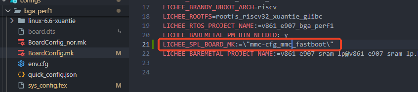

同样需要将内核压缩模式配置为LZ4以获得最快的解压速度：

```
LICHEE_COMPRESS:=lz4
```

![配置内核压缩 LZ4](data:image/png;base64,iVBORw0KGgoAAAANSUhEUgAAATkAAABJCAYAAABGtFGEAAAJUklEQVR4nO3df2iU9wHH8XeHW5LnlJLwnCLJJZrWW85hEtNVmh5TWmsWUAjp1locg0JoQRj2rzI28Y+upKXsr8pGYFIorC2z7RqEwFKtLbWk6R+aala8VNto7lIk3pGw6T2Jf21/PHeX5y7PmTM/nzx+XiDkeb7Pj+89kg/fX/fkga3bfvY/iigrqyhWtEy2sv2JRipTwwz8+9rdDw008siu9cQ/+5KkS/GWp4dyP1//qGVpqykia8aPVrsCs+4h4KikdsdWylM3XANORCRr3WpXIMuof5hKALOR6BONuf1Tl09xeQKM+n3srDNy+2fGzjEwOrXyFRWRNcUzIWeNnmFgdOHlIiJuPNRdFRFZego5EfE1hZyI+JpCTkR87QFvrZMTEVlaasmJiK8p5ETE1xRyIuJrCjkR8TXPfOMBILijg7CZ2Zi+xtdfDWPd7ZiSvucqIvcz74TcpscJM8zAZ9eASmof283OHbccIWbvC6Wzx4iIzM87ITfxJQMT2Y0pUjctQhs3YIDdmtsUsQNOLTcRuQfeCbl5BDcGmUnfZvsTHfbbSph9Q4mISDHeDLlAI5E6g6nL2TG5SioCUG6uJ/7ZKS4DbHqc6PZ91N4+Qzy9qrUVEQ/z4OzqVrbv2gpj5+a00qYuO94CPBEjMW2wfv1K109E1hKPhdzs24Ev5L0Qc4rpNFQEKoueKSLixkMhd/fXnydvJimvixDM7tgUIVSRJKkxORG5C898Qb/w9eZZzsmF/GOSXCnyR2xERLI8E3IiIsvBQ91VEZGlp5ATEV9TyImIrynkRMTX1gU3Vhct/O9/JlewKktry9NDuZ+vf9SyJNdc9+PyJbmOrH11Neb8By3Q2Hhq2a59P1JLTkR8TSEnIr6mkBMRX/PmW0hE1oDGjpdo2Wj/PP39KU5+en11KySuPBVyew7/madCmY1bX/P319/jCgANPPOHLho3FJ5xi+G3/8QHV1awksEG+mot3roQp3dOoUlPdBuhgr2JK4Mczn3/rILuR5ppys5hTF7lQCxlXzcMpwdGOO68V25fwXmF1w7UcrK5mkBe6VT+9Ur5bOHsSxDucOniEEfTbmXOz5SpFz/MPpPMsfYxLs8k+5mLPLP0+EUOjk273heAGce9XM7Pe95znkvB51qE4VNvMowddpEFX2ULu3/TQb1hMdp/gnOJxddL8nkn5Pb8jqfo59gfz5INtd8enuBYz1lghA9ef5kPCo5/9ZdwcyUDbl4pDg+kyP7ikRdu5PaHJq9y4ELmlzzYQE8wxeES75CYc02neww1h866Frpq4NLFwUwAVNAdqaUzFqc3F7aD9rWDDfSFW+i2hjiaDlBVfof0jJELmiOmQXqmWL3tUOyL4Ag6R/AEajnZ3EyP5ficeaHmVEH3I9uoGr/IgWwo5jHpaa5m8sogBz36JeeaJ/dRf/sGSePB1a6Kb3kn5D7/C8c+z26McGn0Fo31mwgDbjm2Z3sdty+9xecuZV7VWVdLaOYH3oo5lggkR+yACxY7ayWYtNWUkbgy6GjhTHM0Fgcq6K61W2W58EyOcNpsJWpWQBrA4ruUQSQIJE0ixBmwthE13L77PM3R+BR9YZMjpOYGctqi5IVLgSAPl9/hu5RbwAFBkxBTnJ4n4Lb9+vcc2gHfvPMG/7xa6s3n0fQsz+/anL/P+pZP3u1nPLsdaif6EIz2X2NDe/MS3VgKrc2Jh/AhHguN8dXJkdWuyT2o4OdmGelU0qVFssoyYRBzDQO7pTZZ8GfTEtYdAmaQzsz2RCpFlWlC0ITUItZ5BU1CzL2fq3SS72bKaGpuoTvgUp5MkaCStmgDRxZeo4W59D5vn3gz8+8Uo5bF6DlHwLGF3bt/Ct+fURd1mXmnJecUPkRn0wYSH7/n3orbuxPWWCuuNJW0RVtpy9s3lbcVCrfSF85uFY4vFZxftJt3DwIGVVjECsawei2Lrlw5duAYdfSYEIsBRdfKmvSEK0mPX3S04spoam6lD7C73EP5Lbzyarqi1fb9wDGmN83RC4N2Vztzft54Xmb44EikNfdc3Lr7Vz98g1c+nFvTX7zwKk/WFO69zTfvvMH5Io1HNzVP7mPzjTOcdIZZ0y7q+ZZPPr3OKjfjfc+DIbeXF5+3Q+xvbikWPsRjoVuMnl1LrbhSTblOPDgt15hcUWmLSUw2Bch0TW2dhgFWil4MngNgmvMpgy4jzmGg07qTdxlnOOcHEcyGtT1maXd7HcXzhHXv2BC9Y+TG8/oM58QGHI85xxJbOWkU3t/dFyeO8UWRsro54VdEqJ3o5gQD7zpnXh9l/64HGe1/39Gyk+XisZDby4uvtRNK9HOsSFd0z96drE/0r+yM6pKYZsKCJjNI59giW1dLzbJIUz03XABIMzlTRpVBXsiFjDLSVhowYMYiQSZsHGcGjNk+5N3DOSvF6fFaumpr6Uwu4Bml4/xj3KTLNOiEuednxhLbjAAwf8gtviW3hd27Q9w4dyI/zJq2EsQg2P4S9Y7dwfaXqL/5Ja/89V+lXFxK5KGQcwRcz1n3QzKtuOG3i5R73PH4D0Sbq3muLkmvY4lEDyMlz64ui3Scgclq2sINHElmW4IVdEeCnI/FOZ+6Q5ezLNhAW9UUp2PT4DYWtgi9Y3HaarbRFozTe88zova4J5ZVJCBNIlWQHs/vexebeFhsS66xo4PNN07ld1PBHq+75NzxKPtfaOaWlpAsC8+EXPhg1F6CEGrn1dfac/sTH7+c6bY28MyvPNKKKxwjynWnCtZsZbpouVZMOs7Bi9hdquwvyeRVDsQoeVgmf0yusIVUOKZXevf1eGwQHGNX2S5kL8DYENBCV67McV3DIEApswSlyrTmnKFa7Hm7raFzrMGzl8WU5RXP7Sov1KPsf+Hx2f+2jR08/5BjUXDTs/ZC4cx+m9bCrYYHdkXbir7+XG8hyae3kEiW3kKydqzNJSQiIiXyTHdVls+RSCttVcVKl2FGVsRDFHL3gdwSCpH7kLqrIuJrvp14EBEBteRExOcUciLiawo5EfE1hZyI+JpCTkR8TSEnIr6mkBMRX1PIiYivrftJmd6sISL+pZaciPiaQk5EfE0hJyK+ppATEV9TyImIrynkRMTXFHIi4msKORHxNYWciPiaQk5EfE0hJyK+ppATEV9TyImIrynkRMTXFHIi4msKORHxNYWciPja/wHZ0YFyPjRxeQAAAABJRU5ErkJggg==)

:::tip

:::note

提示

:::
:::note

修改BoardConfig文件后，请重新执行`lunch`命令以重新加载配置

:::

:::

##### SPI NAND 存储介质配置

修改板级目录下的通用配置文件`device/config/chips/v861/configs/bga_perf1/BoardConfig.mk`，在`LICHEE_SPL_BOARD_MK`配置项中添加`nand-cfg_nand_fastboot`：

```
LICHEE_SPL_BOARD_MK:="nand-cfg_nand_fastboot"
```

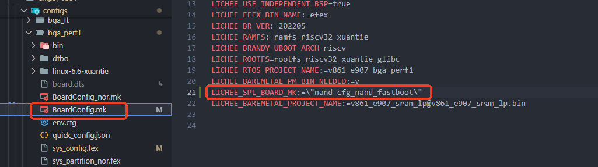

同样需要将内核压缩模式配置为LZ4：

```
LICHEE_COMPRESS:=lz4
```

![配置内核压缩 LZ4](data:image/png;base64,iVBORw0KGgoAAAANSUhEUgAAATkAAABJCAYAAABGtFGEAAAJUklEQVR4nO3df2iU9wHH8XeHW5LnlJLwnCLJJZrWW85hEtNVmh5TWmsWUAjp1locg0JoQRj2rzI28Y+upKXsr8pGYFIorC2z7RqEwFKtLbWk6R+aala8VNto7lIk3pGw6T2Jf21/PHeX5y7PmTM/nzx+XiDkeb7Pj+89kg/fX/fkga3bfvY/iigrqyhWtEy2sv2JRipTwwz8+9rdDw008siu9cQ/+5KkS/GWp4dyP1//qGVpqykia8aPVrsCs+4h4KikdsdWylM3XANORCRr3WpXIMuof5hKALOR6BONuf1Tl09xeQKM+n3srDNy+2fGzjEwOrXyFRWRNcUzIWeNnmFgdOHlIiJuPNRdFRFZego5EfE1hZyI+JpCTkR87QFvrZMTEVlaasmJiK8p5ETE1xRyIuJrCjkR8TXPfOMBILijg7CZ2Zi+xtdfDWPd7ZiSvucqIvcz74TcpscJM8zAZ9eASmof283OHbccIWbvC6Wzx4iIzM87ITfxJQMT2Y0pUjctQhs3YIDdmtsUsQNOLTcRuQfeCbl5BDcGmUnfZvsTHfbbSph9Q4mISDHeDLlAI5E6g6nL2TG5SioCUG6uJ/7ZKS4DbHqc6PZ91N4+Qzy9qrUVEQ/z4OzqVrbv2gpj5+a00qYuO94CPBEjMW2wfv1K109E1hKPhdzs24Ev5L0Qc4rpNFQEKoueKSLixkMhd/fXnydvJimvixDM7tgUIVSRJKkxORG5C898Qb/w9eZZzsmF/GOSXCnyR2xERLI8E3IiIsvBQ91VEZGlp5ATEV9TyImIrynkRMTX1gU3Vhct/O9/JlewKktry9NDuZ+vf9SyJNdc9+PyJbmOrH11Neb8By3Q2Hhq2a59P1JLTkR8TSEnIr6mkBMRX/PmW0hE1oDGjpdo2Wj/PP39KU5+en11KySuPBVyew7/madCmY1bX/P319/jCgANPPOHLho3FJ5xi+G3/8QHV1awksEG+mot3roQp3dOoUlPdBuhgr2JK4Mczn3/rILuR5ppys5hTF7lQCxlXzcMpwdGOO68V25fwXmF1w7UcrK5mkBe6VT+9Ur5bOHsSxDucOniEEfTbmXOz5SpFz/MPpPMsfYxLs8k+5mLPLP0+EUOjk273heAGce9XM7Pe95znkvB51qE4VNvMowddpEFX2ULu3/TQb1hMdp/gnOJxddL8nkn5Pb8jqfo59gfz5INtd8enuBYz1lghA9ef5kPCo5/9ZdwcyUDbl4pDg+kyP7ikRdu5PaHJq9y4ELmlzzYQE8wxeES75CYc02neww1h866Frpq4NLFwUwAVNAdqaUzFqc3F7aD9rWDDfSFW+i2hjiaDlBVfof0jJELmiOmQXqmWL3tUOyL4Ag6R/AEajnZ3EyP5ficeaHmVEH3I9uoGr/IgWwo5jHpaa5m8sogBz36JeeaJ/dRf/sGSePB1a6Kb3kn5D7/C8c+z26McGn0Fo31mwgDbjm2Z3sdty+9xecuZV7VWVdLaOYH3oo5lggkR+yACxY7ayWYtNWUkbgy6GjhTHM0Fgcq6K61W2W58EyOcNpsJWpWQBrA4ruUQSQIJE0ixBmwthE13L77PM3R+BR9YZMjpOYGctqi5IVLgSAPl9/hu5RbwAFBkxBTnJ4n4Lb9+vcc2gHfvPMG/7xa6s3n0fQsz+/anL/P+pZP3u1nPLsdaif6EIz2X2NDe/MS3VgKrc2Jh/AhHguN8dXJkdWuyT2o4OdmGelU0qVFssoyYRBzDQO7pTZZ8GfTEtYdAmaQzsz2RCpFlWlC0ITUItZ5BU1CzL2fq3SS72bKaGpuoTvgUp5MkaCStmgDRxZeo4W59D5vn3gz8+8Uo5bF6DlHwLGF3bt/Ct+fURd1mXmnJecUPkRn0wYSH7/n3orbuxPWWCuuNJW0RVtpy9s3lbcVCrfSF85uFY4vFZxftJt3DwIGVVjECsawei2Lrlw5duAYdfSYEIsBRdfKmvSEK0mPX3S04spoam6lD7C73EP5Lbzyarqi1fb9wDGmN83RC4N2Vztzft54Xmb44EikNfdc3Lr7Vz98g1c+nFvTX7zwKk/WFO69zTfvvMH5Io1HNzVP7mPzjTOcdIZZ0y7q+ZZPPr3OKjfjfc+DIbeXF5+3Q+xvbikWPsRjoVuMnl1LrbhSTblOPDgt15hcUWmLSUw2Bch0TW2dhgFWil4MngNgmvMpgy4jzmGg07qTdxlnOOcHEcyGtT1maXd7HcXzhHXv2BC9Y+TG8/oM58QGHI85xxJbOWkU3t/dFyeO8UWRsro54VdEqJ3o5gQD7zpnXh9l/64HGe1/39Gyk+XisZDby4uvtRNK9HOsSFd0z96drE/0r+yM6pKYZsKCJjNI59giW1dLzbJIUz03XABIMzlTRpVBXsiFjDLSVhowYMYiQSZsHGcGjNk+5N3DOSvF6fFaumpr6Uwu4Bml4/xj3KTLNOiEuednxhLbjAAwf8gtviW3hd27Q9w4dyI/zJq2EsQg2P4S9Y7dwfaXqL/5Ja/89V+lXFxK5KGQcwRcz1n3QzKtuOG3i5R73PH4D0Sbq3muLkmvY4lEDyMlz64ui3Scgclq2sINHElmW4IVdEeCnI/FOZ+6Q5ezLNhAW9UUp2PT4DYWtgi9Y3HaarbRFozTe88zova4J5ZVJCBNIlWQHs/vexebeFhsS66xo4PNN07ld1PBHq+75NzxKPtfaOaWlpAsC8+EXPhg1F6CEGrn1dfac/sTH7+c6bY28MyvPNKKKxwjynWnCtZsZbpouVZMOs7Bi9hdquwvyeRVDsQoeVgmf0yusIVUOKZXevf1eGwQHGNX2S5kL8DYENBCV67McV3DIEApswSlyrTmnKFa7Hm7raFzrMGzl8WU5RXP7Sov1KPsf+Hx2f+2jR08/5BjUXDTs/ZC4cx+m9bCrYYHdkXbir7+XG8hyae3kEiW3kKydqzNJSQiIiXyTHdVls+RSCttVcVKl2FGVsRDFHL3gdwSCpH7kLqrIuJrvp14EBEBteRExOcUciLiawo5EfE1hZyI+JpCTkR8TSEnIr6mkBMRX1PIiYivrftJmd6sISL+pZaciPiaQk5EfE0hJyK+ppATEV9TyImIrynkRMTXFHIi4msKORHxNYWciPiaQk5EfE0hJyK+ppATEV9TyImIrynkRMTXFHIi4msKORHxNYWciPja/wHZ0YFyPjRxeQAAAABJRU5ErkJggg==)

:::tip

:::note

提示

:::
:::note

修改BoardConfig文件后，请重新执行`lunch`命令以重新加载配置

:::

:::

### SPI NAND 裸分区配置

对于SPI NAND存储介质，还需要额外配置裸分区布局。具体操作是：在`device/config/chips/v861/configs/bga_perf1`目录下新建一个名为`spl.dts`的文件，作为BOOT0的分区配置文件，然后写入以下内容：

```c
#include "spl.dtsi"

&sunxi_flashmap {
	nand_map {
		partition0 {
			part_name = "boot_param";
			phy_block_num = <2>;
		};
		partition1 {
			part_name = "boot";
			phy_block_num = <160>;
		};
		partition2 {
			part_name = "boot_backup";
			phy_block_num = <160>;
		};
		partition3 {
			part_name = "riscv0";
			phy_block_num = <32>;
		};
		partition4 {
			part_name = "riscv0_bak";
			phy_block_num = <32>;
		};
	};
};
```

上述配置定义了SPI NAND的分区布局，每个分区都有特定的功能，确保系统在启动和运行时的稳定性与可靠性。由于NAND Flash可能会出现坏块，配置中特别设计了备份机制来应对这种情况。

#### 分区功能说明

1.  **boot\_param**
    
    -   **分区名称**: `boot_param`
    -   **物理块数量**: `2`
    -   **功能描述**: 存储系统启动参数。由于这些参数在系统初始化时只会写入一次，且只占用2个物理块，所以不需要双备份，这样可以提高存储效率和访问速度。
2.  **boot**
    
    -   **分区名称**: `boot`
    -   **物理块数量**: `160`
    -   **功能描述**: 存储操作系统内核，是设备启动的核心部分。160个物理块的大小足以存储内核及相关启动文件。考虑到NAND Flash可能出现坏块，我们为这个分区设计了备份机制。
3.  **boot\_backup**
    
    -   **分区名称**: `boot_backup`
    -   **物理块数量**: `160`
    -   **功能描述**: 作为`boot`分区的备份，存储一份完整的内核镜像。当主内核分区出现故障（如遇到坏块）时，可以从这个备份分区恢复，确保系统的可靠性。
4.  **riscv0**
    
    -   **分区名称**: `riscv0`
    -   **物理块数量**: `32`
    -   **功能描述**: 存储RISC-V架构处理器（通常是E907小核）的实时操作系统（RTOS）文件。32个物理块的大小适合存储RTOS的必要组件，支持实时计算和任务调度功能。
5.  **riscv0\_bak**
    
    -   **分区名称**: `riscv0_bak`
    -   **物理块数量**: `32`
    -   **功能描述**: 作为`riscv0`分区的备份，确保在原分区出现问题时，可以快速从备份中恢复数据，避免因坏块导致的系统故障。

:::warning

:::note

注意

:::
:::note

由于NAND Flash的特性，使用时需要注意以下几点：

-   **裸分区管理**: 每个分区都是物理连续且地址固定的。如果写入过程中遇到坏块，该块的数据将不可用，因此备份分区对于保障数据完整性至关重要。
-   **自动恢复机制**: 系统会自动检测主分区的坏块情况，一旦出现问题，会立即切换到相应的备份分区，确保系统继续稳定运行。

:::

:::

### SPI NOR 存储介质配置项说明

在BOOT0配置文件`brandy/brandy-2.0/spl/board/sun252iw1p1/cfg_nor_fastboot.mk`中，通过一系列配置项来实现快启功能。

#### ENV 相关配置

1.  **配置ENV大小**

通过`CFG_SUNXI_ENV_SIZE`配置项来设置ENV分区的大小，确保与`BoardConfig`中的配置保持一致：

```
CFG_SUNXI_ENV_SIZE=0x1000
```

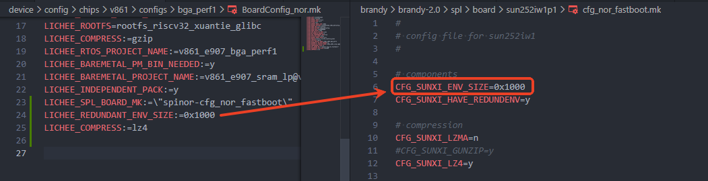

2.  **配置ENV备份**

通过`CFG_SUNXI_HAVE_REDUNDENV`配置项来启用或禁用ENV分区的备份功能。如果分区表中只有一个ENV分区（没有备份），则需要禁用这个选项。

:::info

:::note

信息

:::
:::note

建议启用ENV分区备份功能，因为ENV分区可能会被读写修改，存在写操作过程中突然断电导致数据损坏的风险。

:::

:::

```
CFG_SUNXI_HAVE_REDUNDENV=y
```

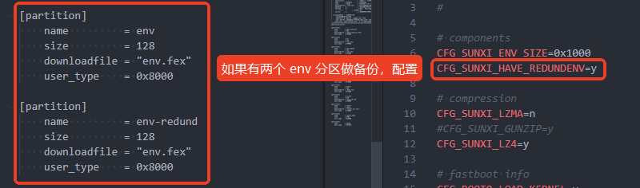

:::tip

:::note

提示

:::
:::note

修改 BoardConfig 请重新 `lunch` 以重新加载

:::

:::

**压缩相关配置**

快启系统通常会选择LZ4压缩格式，因为它是目前解压速度最快的压缩格式。这里只需与`BoardConfig`中的配置保持同步即可：`BoardConfig`配置了哪种压缩格式，就启用对应格式的压缩配置；同时，关闭不使用的压缩格式可以减少BOOT0的代码大小，进一步提高加载速度。

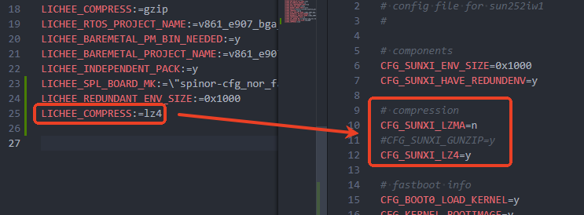

:::tip

:::note

提示

:::
:::note

修改BoardConfig文件后，请重新执行`lunch`命令以重新加载配置

:::

:::

### 快启核心配置选项

以下是快启系统的核心配置项，这些配置直接影响启动速度和流程：

```
CFG_BOOT0_LOAD_KERNEL=y        # 启用BOOT0直接加载内核功能，简化启动流程
CFG_KERNEL_BOOTIMAGE=y         # 配置内核使用bootimage格式，整合内核及相关启动文件
CFG_LOAD_DTB_FROM_KERNEL=y     # 从内核镜像中加载设备树(DTB)，减少单独加载步骤
CFG_KERNEL_CHECKSUM=n          # 禁用内核校验和检查，注释说明：设为y会检查内核校验和但降低启动速度
CFG_KERNEL_LOAD_ADDR=0x42600000 # 指定内核在内存中的加载地址，需与内核编译时的链接地址一致
CFG_SUNXI_FDT_ADDR=0x40c00000  # 指定设备树(DTB)在内存中的加载地址
CFG_FASTBOOT_EFEX=y            # 启用快速启动的EFEX功能，优化启动流程
CFG_EARLY_BOOT_RISCV=y         # 启用RISC-V核心的早期启动，加速系统初始化过程
CFG_SUNXI_NO_UPDATE_FDT_CHOSEN=y # 禁用更新设备树中的chosen节点，减少启动时间
CFG_SUNXI_NO_UPDATE_FDT_PARA=y  # 禁用更新设备树中的参数，进一步减少启动速度
```

#### 配置项详细说明

1.  **CFG\_BOOT0\_LOAD\_KERNEL**
    
    -   **默认值**: `y`（启用）
    -   **功能**: 让BOOT0（系统启动的第一阶段引导程序）直接加载内核
    -   **作用**: 简化启动流程，减少中间环节，从而提高启动速度
2.  **CFG\_KERNEL\_BOOTIMAGE**
    
    -   **默认值**: `y`（启用）
    -   **功能**: 配置内核使用bootimage格式
    -   **说明**: 目前快启只支持bootimage格式的固件，这也是SDK的默认格式。这种格式会将内核及相关启动文件整合在一起，方便快速加载
3.  **CFG\_LOAD\_DTB\_FROM\_KERNEL**
    
    -   **默认值**: `y`（启用）
    -   **功能**: 从内核镜像(bootimage)中加载设备树(DTB)
    -   **作用**: 设备树包含硬件设备信息，将其与内核打包在一起可以减少单独加载的步骤，提高启动效率
4.  **CFG\_KERNEL\_CHECKSUM**
    
    -   **默认值**: `n`（禁用）
    -   **功能**: 控制是否检查内核镜像的校验和
    -   **说明**: 设为`y`时会验证内核的完整性，但会降低启动速度；快启模式下默认禁用，以换取更快的启动速度
5.  **CFG\_KERNEL\_LOAD\_ADDR**
    
    -   **默认值**: `0x42600000`
    -   **功能**: 指定内核镜像在内存中的加载地址
    -   **注意事项**: 这个地址必须与内核编译时的链接地址一致，否则会导致启动失败
6.  **CFG\_SUNXI\_FDT\_ADDR**
    
    -   **默认值**: `0x40c00000`
    -   **功能**: 指定设备树(DTB)在内存中的加载地址
    -   **说明**: 设备树将被加载到RAM中的这个位置，供内核访问硬件设备信息
7.  **CFG\_FASTBOOT\_EFEX**
    
    -   **默认值**: `y`（启用）
    -   **功能**: 启用快速启动的EFEX功能
    -   **说明**: EFEX是支持USB一键烧录的功能，它不会增加启动时间，所以默认开启即可
8.  **CFG\_EARLY\_BOOT\_RISCV**
    
    -   **默认值**: `y`（启用）
    -   **功能**: 让RISC-V核心（通常是E907小核）提前启动
    -   **作用**: 与常规模式相比，提前启动RISC-V核心可以更早地运行RTOS，执行相关的快启操作，加速系统初始化过程
9.  **CFG\_SUNXI\_NO\_UPDATE\_FDT\_CHOSEN**
    
    -   **默认值**: `y`（启用）
    -   **功能**: 禁用更新设备树中的chosen节点
    -   **说明**: chosen节点通常包含启动参数，禁用更新可以减少启动时间，是快启模式的优化项之一
10.  **CFG\_SUNXI\_NO\_UPDATE\_FDT\_PARA**
     
     -   **默认值**: `y`（启用）
     -   **功能**: 禁用更新设备树中的参数
     -   **说明**: 进一步减少不必要的设备树修改操作，提高启动速度，是快启模式的重要优化项

### 配置BOOT0关闭打印

要关闭BOOT0阶段的调试打印（这也能提高启动速度），可以修改板级配置文件`device/config/chips/v861/configs/bga_perf1/sys_config.fex`，找到`debug_mode = 8`这一行，将其改为：

```
debug_mode = 0
```

这样就可以关闭BOOT0的打印输出了。

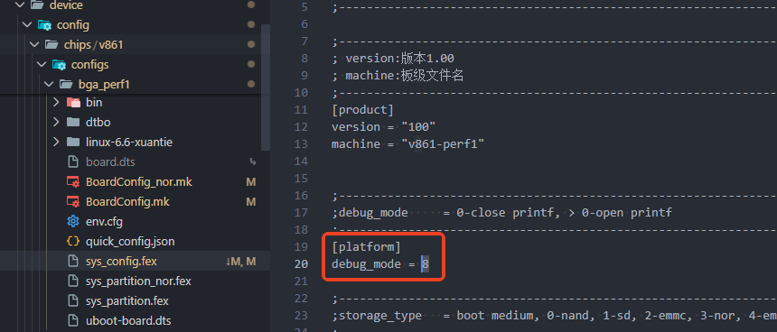

### 其他配置功能

`CFG_SHORT_COMMIT_LOG` 配置可以减少快启阶段的启动打印信息。由于 BOOT0 阶段的调试打印是 CPU 阻塞发送的，减少这个阶段的打印信息对提升启动速度有明显帮助。

### 配置快启专用的 OpenSBI

快启系统需要 BOOT0 直接跳转内核，因此需要使用专门的 OpenSBI 固件。配置步骤如下：

1.  **修改 OpenSBI 拷贝配置**
    -   打开板级配置文件：`device/config/chips/v861/configs/bga_perf1/BoardConfig_nor.mk`
    -   添加以下配置，指定需要从 `device/config/chips/v861/bin` 拷贝到打包仓库的 OpenSBI 文件：
        
        ```
        LICHEE_OPENSBI_BIN_NAME:=opensbi_sun252iw1p1_fastboot
        ```
        

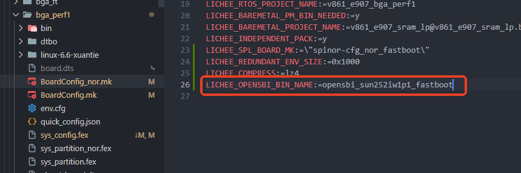

提供的 OpenSBI 固件示例：

![OpenSBI 固件](data:image/png;base64,iVBORw0KGgoAAAANSUhEUgAAAQMAAAB5CAYAAAA9H0TYAAAU0UlEQVR4nO2dfXAUZZ7Hv0m2k3NyQTAzhGSGBAUU8+IEhQVBILwlm81yihLWMReHO+4oVORFE6GgWE9zUMHE5V2zvhWRirEAvdtdYyC8BTkpWbHIkJnouqyaMJMQZoIINaHILMn9kemH7nnteUmmJb9PFVVkpp/uZ57u/vbz9Muno+4en9EHgiCGHMPuvEv0d3SE6kEQhMygMCAIAgCFAUEQTigMCIIAQGFAEIQTCgOCIABQGBAE4YTCgCAIAMAvBnoBO6f9EhOVt25uuNnXhwPfteKNlr/iZl9w9ztla7Ow4pll+J8//hl19Q1u3xfk52Lxosex78DHHr8nCMKdAQ8DYRAAQExUFH47dgx+O3aMx+nP2i7j+VN/CWmZdfUNFAIEESBew2DYsATMm5ODk/93ClZbl8dpVMpEzHhkGo4ca8TVq9e8LuSRPx30+t2qRU9g1aJFAIDtBw5g+ynv0xIEMXD47Blka7MwMfsB7NhV5RYIKmUiVq5Yjr6+Phw51uh3QYlxcXhn1jSo/ilO9HnKokVo/6AaALDqKT0Ke+xw9PZic5MRh83tPuc5ftxYfPD+O+A4DlarDZtf+z3MZgsK8nOx8NEF2PXmW1CnJGPhowtgNLVg+rSpAIAzX53FlsptfutMELczV3+6LPrb6wnEq1evYefuPwAAVq5YDpUykX3HBwEA7Nz9B5+9Ap6CVDULgsR5eUh5So+Up/QA4Pb/tH/9N7zwzDM+58dxHO4dPw4vrX8ZhTo97N3dWOWskysKxR1Qq1NQqNNjz/s1SL9/Agryc/3WmSCGEj6vJlhtXah66z3ExMSwQOCDICYmBlVvved1COHKPHUy+3/cyFF+p79v7Dif3zscDtTVH4LZbAEANJ44iRHDhyNbm+U2bXf3ddTU7gMAGJpNsNvtUArCjSAICScQLe0d2P3m23jumf/E6pXPAgCioqKw+823YWnvkLQQdbwC9wxLCK2mfrC0d6Cnp8fvdGazBfbu7gGtC0H8HJF0nwEfCFFRUQEHAQDkaVKCrqBU1CnJ6HE4YOu67H9igiDckHxp0dLegfUbXw1qIQMRBhzHIWfWDNTVN0CjUaMgPw+tbRdgNlugzcoI+/II4nZnwO8zOGu77HavQThwOBy4du0a9tf2X4n4obWNrhAQRAhERUJ79sHvNmJqerrPaT5vbkbxps2DVCOCICISBgRByA96UIkgCAAUBgRBOKEwIAgCAIUBQRBOKAwIggBAYUAQhBMKA4IgAFAYEAThhMKAIAgAFAYEQTgZ8AeVpBCz5AlE360Rfdb7vRk393wUoRqFD38m57Ulq5GWOpop236uVJSXAQBK122McE08k63NwpqVz0GhuAOffHoQ1XtrQ5rf2pLVUCoTB/33CpV+TYZmt+9DWQ+yCAPXIOA/uxmBugw2kXjSsiA/F0W6xeA4DgBEO4frdw6HAzW1+1BX3+CzXLA7Bb+TXrJaA57H2pLV0D6Qyerni7z5c4NaBo++WIcpkycNSmj72+F9EUo4ySIMeBwvbwcAcK+sinBNbm8eejAbr72+HU2GZvaOCZuti+1Ql6w2VG7d6bbR+ysXKGtLViP9/gkwmy2IjYuVXI4PELPZgu7u65LL2SQq+oYqsgqDcCLsFgL9vgM+NfkuHgCMSUsFALeuY0V5GfuOtynzXX6jqQW/nPwQOI4TzVe4TP6IyhuhvJmcpXQ315asxqSHJop+R0F+LubPm8N2Wo1GjZI1z+PwkWOwtHf4rOerm15j8zY0m1CQn8faQ6lMhMPh8Hj081WuorwMNlsXjKYWUb30xTrMyZmFrTt2o8nQDH2xDpkZ6Shdt5H1itaWrIYy7paT0lM7C9usydAM/dLlbDp/CNdl9btV2LpjN/Lmz2Vt2t19ndXP07oHwKbdWrEZn3x60OO8fW1Drstw7WXx25i+WIff/PpXAIAN60q8mrxzZj6CDetKAIi3bX49bKnc5radC3t5nrgtTyBqNGosW7oELV9/g0KdHoW6fvPy2pLVbJoxaakwmlqYMXlOzixmTOanK9TpsaZ0PdJSR0NfrAMgtjJvKq/ESJUK+mIdW+axxhMo1Onx1NP/wRo9EJOzK/piHdJSR2NN6XoU6vSSu4He6umKMrFfPGM4ZxS1zf7aauyvrfZYxls5oD8kADDb1Ijhw+FwOKBO6RfiZmakw2hqCaj+gbaZK6XrNuLMV2dx5quz0C9dDlvXZcTFxbI2vWS1oki3GIB43Rfq9NhSuQ1bKrfhk08Pwmq1YU3perbD+9uG4hUKtoxjjSewbOkSaDRqZGuzsHjR4zh0+KjbNla9txZ73q/BTz9dxabySo9BILR9ryldj3iFQrRtCxHW0XDOiIL8PGg0ao/Tyj4MYuZNR/T0B/v/P3sqonOm+C0zd/ZMAEDNh/vZZ40nTiI5eRRriB9a29hKratvwCWrFZkZ6cjWZmH8uLFoPHESQL9AtbXtAkYlJQEQW5mbDM24ZLViVFISE63y0wkJxOTsis3WhdjYWLbzScVbPYXwAdbadoEdsar31rIdwXUD91WOx2y2wOFwIDMjHRqNGmp1Cjo7L7G/AfcA8Vd/ILA284fZbMGrm15j8xaG08XOTsQrFF53GCH+tiFh/Y8e/ww9Dge0WRns/AVf1my24PSXZ5CZ4Vv4wyO0ffNl01JHe6yzsI5GU4vPbUn2w4S+f/wDMbkzEHVPKqLHpeHm8S8klbN3d4u6upb2DsRynNeGEI4nOY7DkqeLsOTpIvbZD61tfstt31WF9S+9gP211T5f1CLV5Az0b2RKZSI2rCtx62oGgut4Wcr7KOvqG5CZkY7MjHQ2jZRyRlMLMjPSoc3KQM+NHpz64jSmTZ0CbVYGOI4LSlobSJtJQdgdB26t3+q9tRiVlIStFZtFQxMpCNu4p6dHJA3mQ5LvtruuD5utCxzHSQohT8vtcTj8TuevDWXfM+htPI2+tg5Ej0tD7/dm9DaellTONd392ZOVykRc7OwEANjtdmwqr2RHSKndc7PZgmdXvug2tHAlUJMzf7QWdjVDgT/fsOHlMr8n/4Tvl5BaznDOiHiFAuPHjcW358/D0t6BESOGY/y4sejouBjU2fhw2q/5KwN8F154DgDov8JTqNOjte1CQEMT4TYUGxvLhkZAf2+K4zgWAq7v7fB1rkbKcoMtK0RWYcC9ssrtSkJ0zhREpSaj93szou/WIHrGZL/zMZwzIj4+HkVPFrLPcmbNEG2I6pRk1v3VF+swUqWC4ZwRTYZm2Lu72RgyGFyHDLzJGQAzOQezUwiHDJb2DvxzfDwbmxc9WYiRKqXfeWg0asyfNweHjxzzuPzfbXiJdcUL8nMxUqWC0dTit5yonl2X0eMcKthsXWgyNOPHH69IPl8AhK/NPDEqKUnUc/TWPfc3ZPC1Df145YpofD539kzEchwMzSYYTS1QpySzg4VGo8aUyZO8to2+WIc3drzO5qVQ3IG8+XMB9J9snZMzS3K7+kIWwwR+RxfS952zWx4djZtHTqH35JfAnIeBGP/51WRoxtYdu7Fm5XPMnuzabb9ktaEgPw9Lni5iZ1n57rewuw/A7cqAJzQaNda/9AJUzh2StzVna7NCMjkLu7Ou9fzb+b+z4Uyz0YRLVpvf+SkT78KI4cM9DoNK121EQkICO0stPPucrc3yWU6I2WxBR8dFpKWOZicUvz1/HhqNWvL7NgbSfl3z4X7R+hUOAYVXbvhhmdlswdHjn2HK5Emiqwm+tqHSdRtRUV6GrRX9Ul/hkIMPoSLdYrZuhVci6uobkDNrBruawPc2eLq7r2NYQoJo2w71JipgiApRI3X3GCENf3dtEgODLHoGhPt1ZwB+rwsTYoRHdZ5ATwIOZSgMZEJdfQPt9CFCL9EJjSE5TCAIwh1ZXU0gCCJyUBgQBAGAwoAgCCcUBgRBAKAwIAjCCYUBQRAAKAwIgnBCYUAQBAAgZkTiyP+KeCWWPIFfLMxFzOyp7F/UGA36mr6OdNVCJlubhf9+ZSNu3ryJv53/u9v3a0tWo+jJQhiaTbh69VoEahgeKsrLkDtvDg4fOR7pqrjhbx0MFGtLVuORaVPx+Smxg6OivAwPZmvdPgf667pl86u4884ESRKYcCKL25HJjjy4DEU7cqAIn3Pw9HwD3xaHDh8NyxODPLzfMRLIIgx4yI48OAxVO3Ig9VIqE5k70xM5s2aIHiq7HZBVGIQTsiOTHdkT/uadrc2CUpmI7buqvM5DX6xj5YQIe05Wqw0XOztx44ZnzVhcXCze2PE6VCqlmzeCf3zb33oMN7flCUSyI5MdOdh5ax/IBMdxTH7i2gbZ2ixMmTwJH//vn0TzzNZmYeGjC1BTuw+FOj3q6g9hwn33eq3DhPvuRV39IRTq9Dh0+CgWL3rco+xV6noMB7IPA7Ijkx0ZCK8d2de8RyUlYaRKyXbUPe/XYMb0acjWZrHfffrLM/ju+1bRPPPmz8WPV66wA0BdfYPP32k4Z2TTHj3+Gex2O7QPZPqsq7f1GC5kHwa8HTmm+DFJQcATDjsyf2SY9NBEN4Glp3Lbd1UhLXU09tdWe/XY83UJxI588vNT2LCuBNXvVgW9M3iyI296ZSPq6g95PYlZV9+Alq+/ETkCpZQzmlqgVCaK7MjDEhJkZUf2NW9LewfbUQ3NJvT09ED7QCaKnixEa9sFrycMg31jE38gkcJAvhVK9ucMehtPI3psWtB2ZKEA1Z8dme++2u12j0pyfzsib0fmfYj6Yp3Ho0MwduTqvbXQF+uwbOkSbH7t95LKeUNoOfZnAFIqE9kGKLWc4ZwRUyZPkq0d2de8L3Z2egz+kSoV0u+fAIXiDuYeBIDf/PpX7EjtyXgsZed1NSdHCln1DMiO7BuyI4fHjuxr3oZzRtG4fO7smYiPj8fho8ehX7qcDaHWlK6H1WrDJ58exJbKbTCaWjBSpWLbVEF+rkiVXlFeJuotpt8/gbVz0ZOFzJwcSWTRMyA7snfIjhx+O7KveTcZmrHvwMfMXCz1xTX8y2749rFabfjmr996nd5strArT0ILc6DnhsLJkNSekR1Z3gykHZnMy96RRc+AIDtyOCA7cmhQGMgEsiOHDtmRQ2NIDhMIgnBHVlcTCIKIHBQGBEEAoDAgCMIJhQFBEAAoDAiCcEJhQBAEAAoDgiCcUBgQBAGA7MgDDtmRCV/IafuQxe3IZEceXMiOfAve3RjsehA+D+H6hKOv76QymNuHLMKAh+zIgwPZkcODRqPGjRs3mGOzorwMRbrFaDI0I1ubhbi4WJF/kxfTyPWhKVmFQTghOzLZkYXtl5Y6mpWvKC8Dx3GI5TioVEqMSUtF9btV2LpjN9Qpyaz30919HXtrPsTjjy3A6S/PiHpP/G/ctvNNthyjqYUp4poMzaJegNHUgvHjxkKZeJfHtpWyfRTk52LhowtgNLVg+rSpANw9HaFwW55AJDsy2ZGF8GLcubNnoiA/FyOGD8ee92vw7MoX8UNrG858dZa9uERoONYvXY4jxxrR2nZB5IHMzEj3aF3y9duUykT8eOWKx2FCIL9VobgDanUK227T75/gJqwNFtmHAdmRyY4MhGZHNpstqKs/hInZWsyfNwcnPz/lcae0dV1GT0+Pm8vQaGoBx3HQaNTQaNRITh7Fdnp9sY4Fp9HU4lGWWpCfizk5s9g2Fcpv7e6+jprafQD6g9dut3uV9QaK7MOA7MhkRwZCtyPX1TfA4XDA4XB4tRubzRa89e4ezMmZJeoVCXs7c2fPdO68/b0+YXhmZqTjjR2vs9AD+nuZBfl52PBymeRzK1J/ayBWZSnIPgx6G0+jr60jaDsyjxQ78sXOTgD9duRN5ZVsJUvtnvN2ZNehhSvB2JELdXocazyBZUuXiH5XMAgtx/42UGEISi1nOGdEvEIhKztyQX4u4hUKjBg+3OdLSPjzEZvKKzFj+jQU5Ocyp2NmRrrPoQB/xOYPOPwB4dmVLwb0mwfSBO0LWYUB2ZF9Q3bk4IKEL3/6yzM4+fkpTJk8yW+gug4ZjKYWpKWOBsdxbJjTf0VlISuTN38uK1uQn4vk5FGioSpPQX4u3qnaydp5IE3QgSCLqwlkR/YO2ZFDtyOvWrEc9u5uNjzIzEjHqhXLUbpuIxpPnESRbjGq363CH/9ch0cXFLArUGe+OsvK8FdPHA4Ha39LewfWrHwOhU88BkDsW5w7eybUKcnYWrFZVJdPPj3oNmQbSBN0IAxJ7RnZkeUNGYwjgyx6BgTZkcMB2ZFDg8JAJpAdOXTIjhwaQ3KYQBCEO7K6mkAQROSgMCAIAgCFAUEQTigMCIIAQGFAEIQTCgOCIABQGBAE4YTCgCAIAGRHHnDkZL8dSORoR15bshqP/UuBxzpla7OwZfOruPPOBEmylaGALG5HJjvy4EJ25FveAuIWsggDHrIjDw5kRyY8IaswCCdkRyY7sqd1ya9n18ekK8rLcO3aNYxKSoJKpQz6PQc/Z27LE4hkRyY7svC3eFvPrky4717U1R9CoU6PS1ZrSLarnyOyDwOyI5MdGQjejuxtPXvCcM7IAtxoanHzaN7uyH6YwNuRo+5JRfS4NNw8/oWkcuGwI7vqvfyVE+rSfL3cIlA7slKZiA3rSkLqunqyIy9e9Dj2HfjY65i/rr6BSUD5aaSU418mIrQjT5s6JaJ2ZB7XdvA1XY/DEfLyfk7IPgx6G08jemxa0HZkoQDVnx2Z777a7XaPO52/oxJvR+Z9iPpincejYDB25Oq9tdAX69grukJBaDn2ZwBSKhPZDiS1nOGcEVMmT5KVHZlHuJ4JMbIaJpAd2TdkR/bfZhXlZaJzQ97WM+GOLHoGZEf2DtmRQzMGe1vPwb6M5nZmSGrPyI4sb8iOHBlk0TMgyI5MRB4KA5lAdmQi0gzJYQJBEO7I6moCQRCRg8KAIAgAFAYEQTihMCAIAgCFAUEQTigMCIIAQGFAEIQTCgOCIABIvAPx+WeXYeRIFXbsqoJV4vPgPE/o/x2aMXezv/t6e9H0l9M4efgg+np7A6utE7p3nSDCj6Qw+HDfR1i5YjnWrHoOu998W/KTZwBEQQAAUdHRmDj1YUyc+rDXMuYfvsdH1e9JXka44X1+kTAXE0Sk+H+NJKbFDN/++gAAAABJRU5ErkJggg==)

:::tip

:::note

提示

:::
:::note

修改 BoardConfig 文件后，请重新执行`lunch`命令以重新加载配置

:::

:::

2.  **配置 OpenSBI 打包**
    
    -   在板级目录下新建 `boot_package_nor.cfg` 文件
    -   写入以下配置内容（注意：文件末尾**必须添加三行空行**，否则可能导致打包失败）：
        
        ```
        [package]
        ;item=Item_TOC_name,         Item_filename,
        item=opensbi,                opensbi_sun252iw1p1_fastboot.fex
        ```
        
    
    对于非 NOR 存储介质方案，需要新建 `boot_package.cfg` 文件，配置内容与上述一致。

### 配置内核快启参数

快启系统跳过了 U-Boot 阶段，原本由 U-Boot 传递给内核的启动参数现在需要手动配置。这部分需要使用到之前在【获取相关参数部分】保存的数据。

1.  **配置内核启动参数**
    
    -   打开内核设备树文件：`device/config/chips/v861/configs/bga_perf1/linux-6.6-xuantie/board.dts`
    -   添加 `chosen` 节点，并将之前保存的 `cmdline` 数据填入 `bootargs`（注意：`bootargs` 的配置不可换行，否则会导致内核参数解析错误）：
        
        ```c
        chosen {
            bootargs = "之前保存的 cmdline 参数";  // 例如: "earlycon console=ttyS0,115200 root=..."
        };
        ```
        
    
    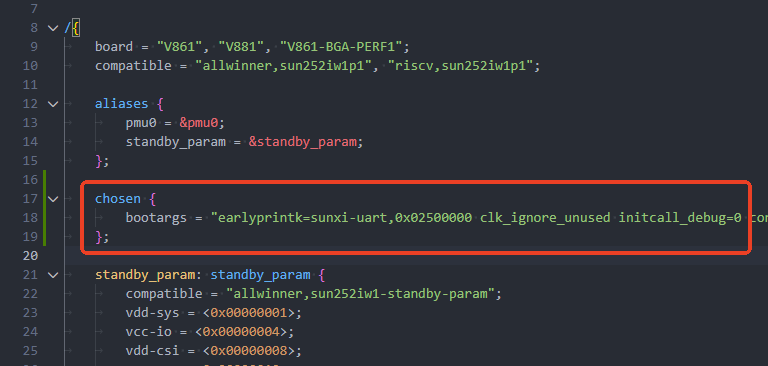
    
2.  **配置系统内存资源**
    
    -   同样在设备树文件中，配置内存资源（这部分原本也是由 U-Boot 自动配置的）
        
    -   内存配置需要关注起始地址和内存大小：
        
        -   起始地址默认是 `0x40000000`
        -   内存大小根据实际硬件配置：
            -   128MB 内存配置为 `0x08000000`
            -   512MB 内存配置为 `0x20000000`
            -   以此类推
        
        ```c
        memory@40000000 {
            device_type = "memory";
            reg = <0x00000000 0x40000000 0x00000000 0x08000000>;  // 0x08000000 代表 128MB 内存
        };
        ```
        
    
    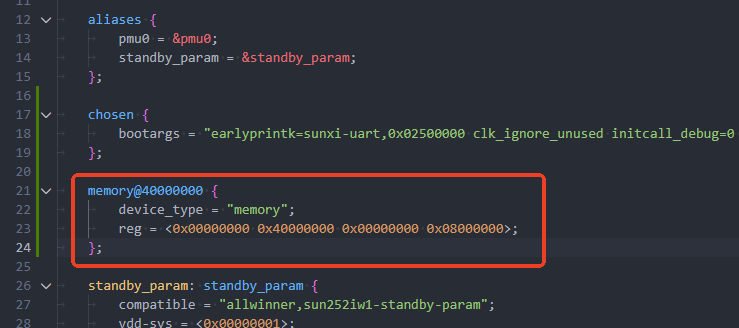
    
3.  配置存储控制器，在有 U-Boot 的普通流程中，存储控制器是由 U-Boot 自动识别启用的，在快启的时候就需要手动启用了，例如这里是通过 SPIF 控制器接 SPI NOR 外设，所以需要启用这个驱动。
    

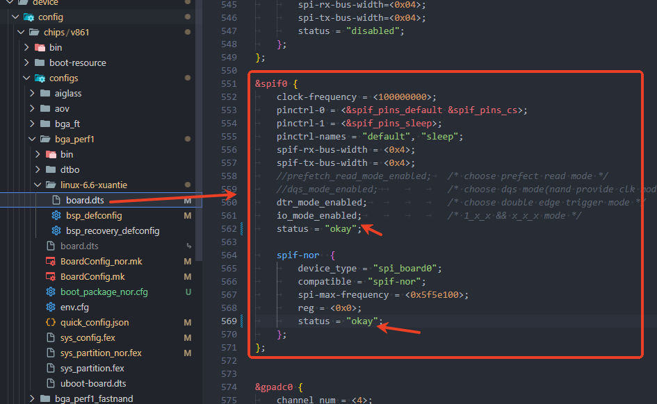

如果是 SD NAND 或 eMMC，需要启用对应的控制器例如 SDC2，或 SDC0

### 同步快启分区配置

完成上述配置后，需要同步分区信息。可以通过 `quick_config` 工具自动同步，也可以手动同步。

#### 使用 quick\_config 同步（推荐）

`quick_config` 工具支持同步三种存储介质的分区参数：

-   NOR 介质：`sync_partition_nor_to_bootargs`
-   MMC 介质：`sync_partition_to_bootargs`
-   SPI NAND（UBI）介质：`sync_nand_partition_to_bootargs`

执行 `quick_config` 命令即可完成配置。配置后还需要手动设置逻辑分区的起始地址，具体方法请参考【配置逻辑分区地址】部分。

#### 手动同步分区表

打开使用的分区表文件，记录每个分区的名称和对应的 block 编号（从 1 开始）：

:::tip

:::note

提示

:::
:::note

注意：`mtdblock0` 是裸分区，不在分区表上，默认名称为 `uboot`

:::

:::

将分区表的信息一一对应填写到 `bootargs` 中即可。注意：虽然下面的示例为了展示对应关系换行显示，但实际配置时必须将 `bootargs` 写在一行。

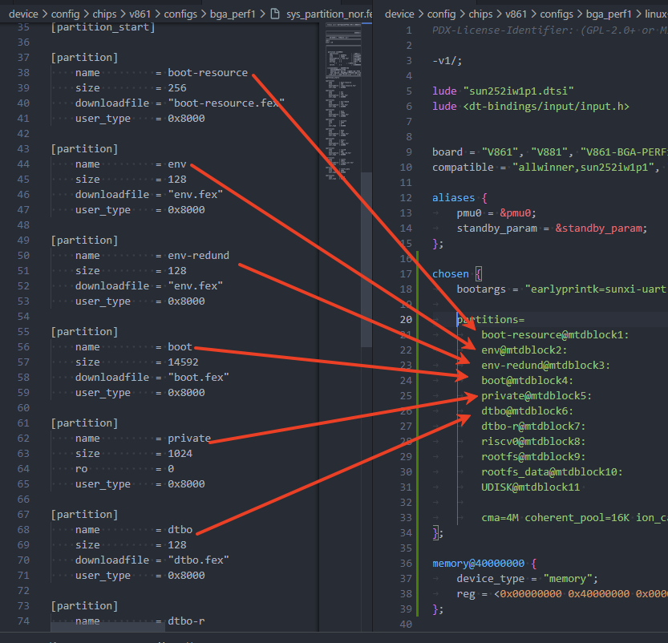

#### 配置逻辑分区地址

需要注意：**SPI NOR 和 MMC 设备需要配置逻辑分区地址，而 SPI NAND 设备不需要**，因为它们的分区管理方式不同。

对于 SPI NOR 和 MMC 设备，还需要同步配置 `mbr_offset` 来确定逻辑分区的起始地址：

1.  打开板级目录下的 `uboot-board.dts` 文件
2.  找到 `sunxi_flashmap` 节点中的 `logic_offset` 值
3.  计算 `mbr_offset`：`logic_offset` × 512（因为 `logic_offset` 的单位是扇区，每个扇区大小为 512Byte）

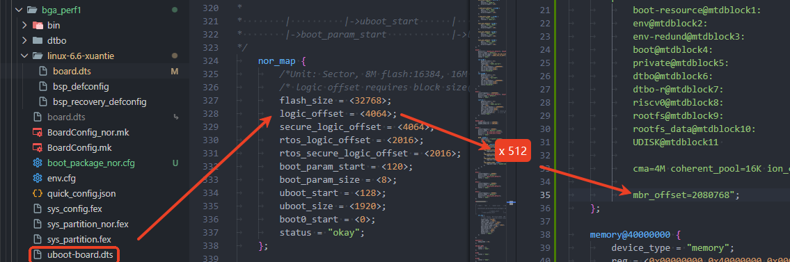

### 修改 lunch 菜单显示快启

如果希望在执行 `lunch` 命令时，默认显示当前板级的快启配置，可以修改板级 target 目录下的配置文件，将其设置为 FASTBOOT 模式：

修改文件路径：

```
openwrt/target/v861/v861-bga_perf1/lunch_menu.mk
```

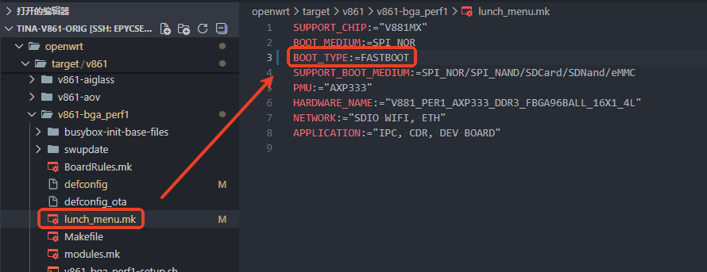

### 将快启的 quick\_config 配置加入 quick\_config 命令

默认情况下，快启板级可以使用基本的快启配置，但如果需要从常电模式切换到快启模式，还需要额外配置：

1.  打开板级目录下的 `quick_config.json` 文件
2.  将快启的配置加入 `include` 字段中

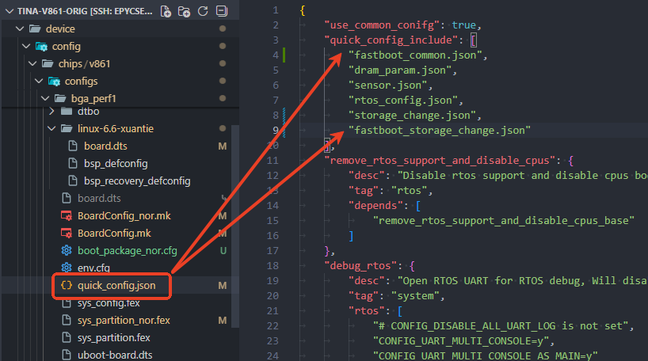

这样配置后，就可以使用快启特有的配置参数了，例如启动加速模块：

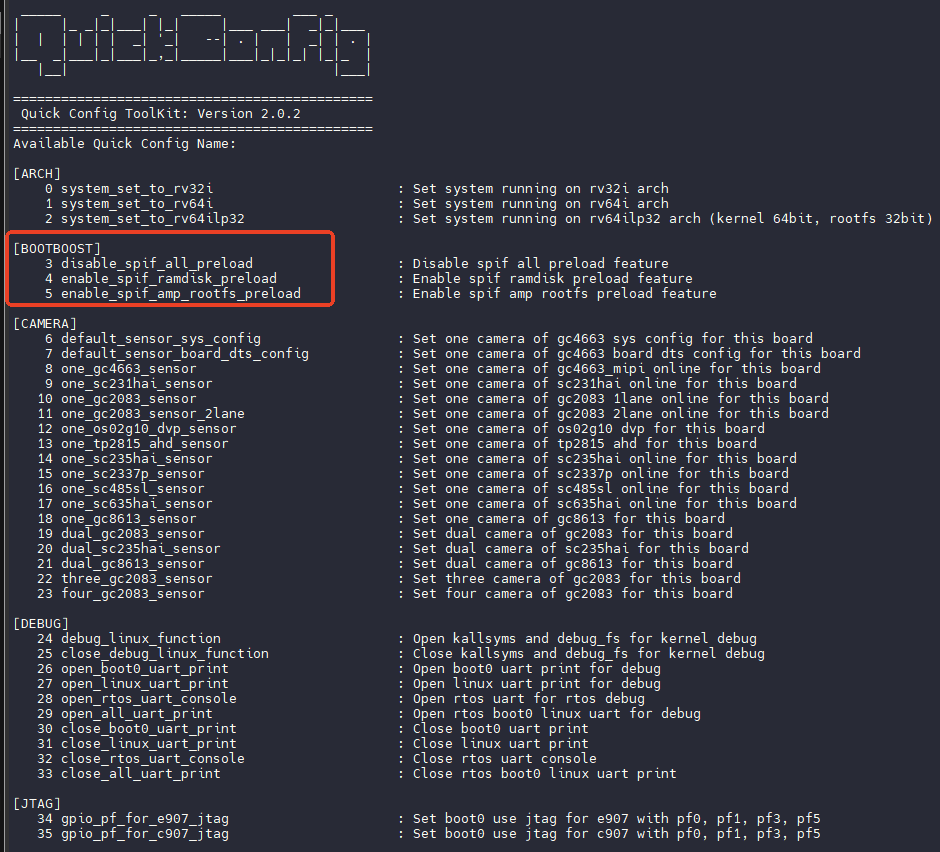

## 配置 BOOT0 解压加速

在启动阶段，其实大部分时间是从存储加载固件到内存解压运行，存储读取速度是有上限的，所以更多会用优化解压性能的方式加速读取和解压的流程。

SDK 目前支持 LZ4 压缩格式的解压加速功能，可以通过修改 BoardConfig 文件，在 `LICHEE_SPL_BOARD_MK` 中新增 `cfg_lz4_parall_decomp` 方式，启用 LZ4 加速解压功能。

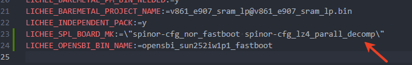

## 常见配置问题

### 修改快启后打包失败

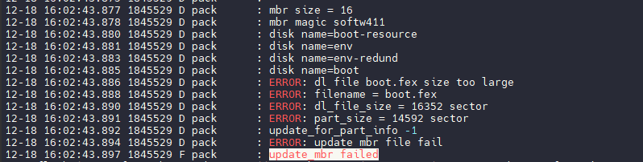

**原因**：通常是因为修改了压缩格式导致的问题。默认使用 gzip 压缩，而快启使用 lz4 压缩，两种压缩格式的压缩率不同，导致解压后的文件大小变化，需要更大的分区空间。

**解决方案**：

-   需要扩大分区表中的分区大小
-   推荐使用 `auto_update_partition` 自动化脚本进行分区扩容，操作更简单高效

### 修改快启后启动卡在 OpenSBI

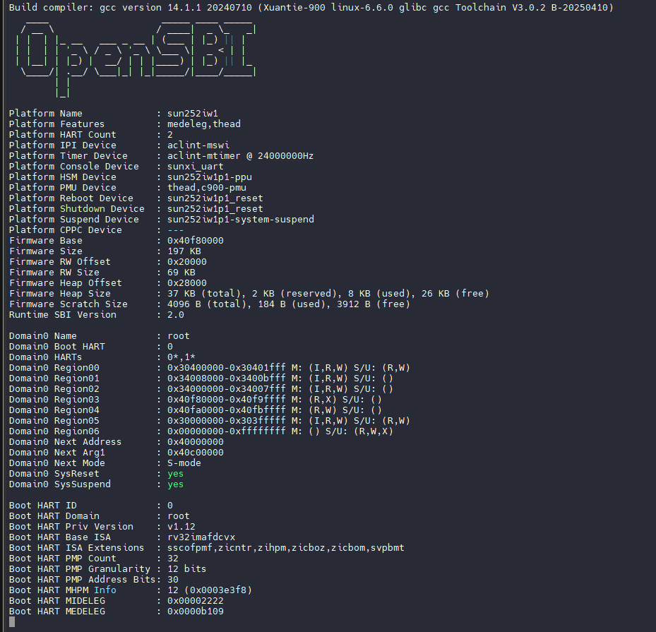

**原因**：一般是踩内存导致问题，由于快启系统排布非常紧凑，内核过大就容易踩到内存，可以向上找日志，看启动的内核大小，按默认布局不建议内核超过 `0x60000`，这里 `0x7e6fe2` 已经踩内存了

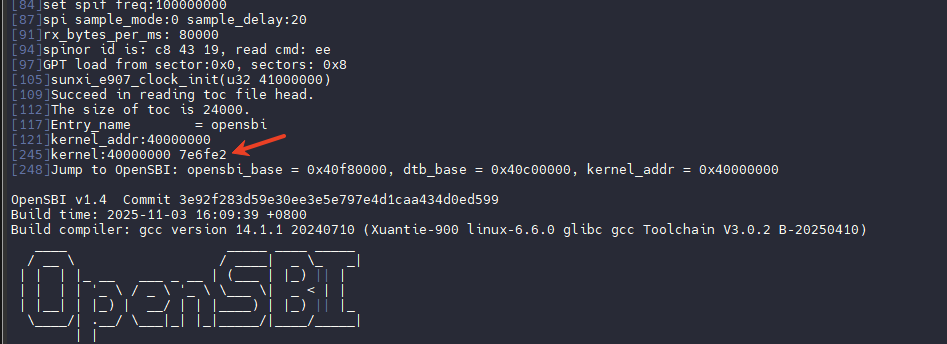

### 启动秒崩溃，无打印无显示

**原因**：极有可能是没有按照文档要求配置内核快启参数。例如，`cmdline` 参数不完整，或者内存配置过小（如只配置了 64MB）。

**解决方案**：

-   请参考【配置内核快启参数】章节，正确配置 `bootargs` 和内存参数
-   确保 `bootargs` 包含完整的启动参数
-   确保内存配置与实际硬件一致（如 128MB 内存应配置为 `0x08000000`）
-   确保没有踩内存，因为内存过大踩到了设备树的内存

修改设备树的加载地址，放到其他没有冲突的地址即可，请参考【快启核心配置选项】修改配置

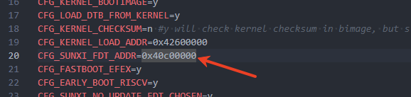

### 启动秒崩溃，打印 "Unable to handle kernel paging request"

启动马上崩溃，需要注意的是快启是否存在踩内存的情况，此时应该是在初始化系统基础资源，需要检查是否开启了这两个库

```
CONFIG_CRYPTO_ARC4
CONFIG_CRYPTO_USER_API_HASH
```

这两个库不兼容快启流程，需要关闭

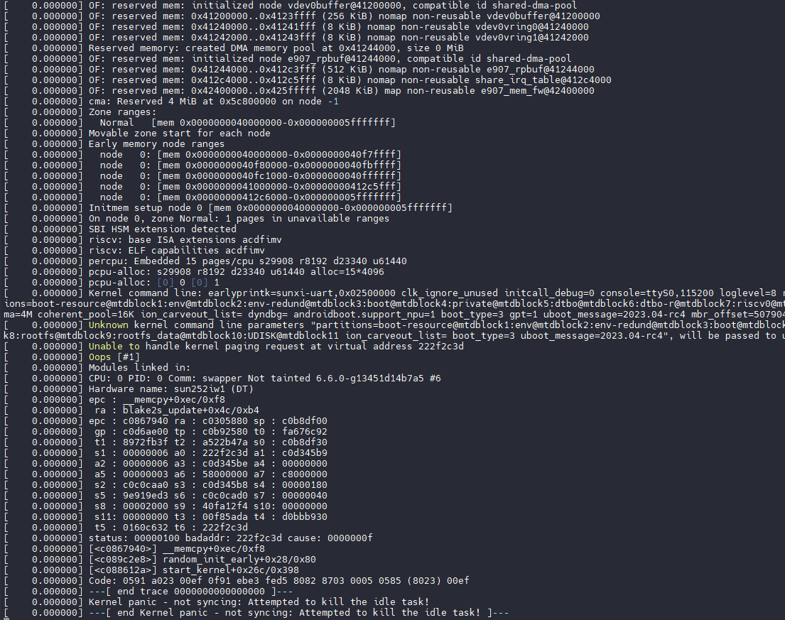

### 启动后 U-Boot 没有打印输出

**原因**：这是正常现象，因为快启系统对 U-Boot 进行了裁剪，移除了打印功能以提高启动速度。

**解决方案**：无需处理，这是快启模式的预期行为。

### 启动后一直在 Waiting for root device

这是由于没有配置启用 SPI、MMC 控制器，请参考【配置内核快启参数】配置设备树

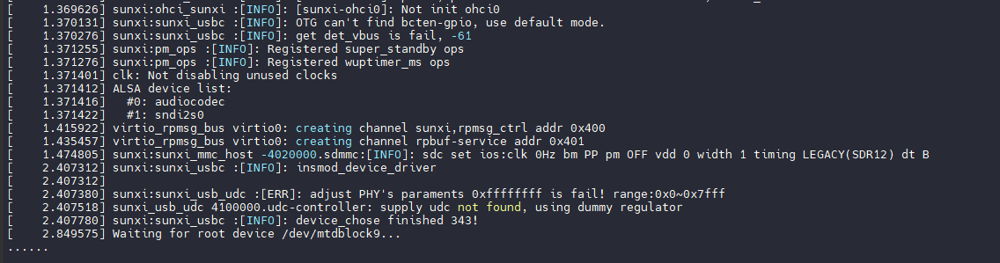

如果已经配置了，可能是因为没有同步 `mbr_offset` 配置，先检查一下内核是否有 `sunxipart: failed to parse sunxi_gpt!` 的打印，如果有则是需要同步 `mbr_offset`

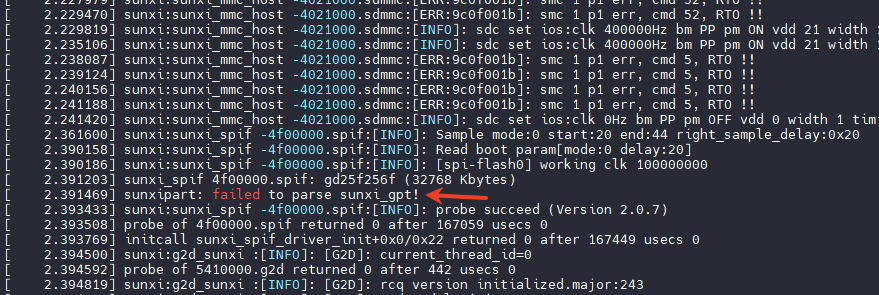
