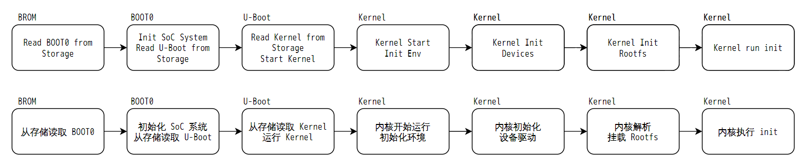
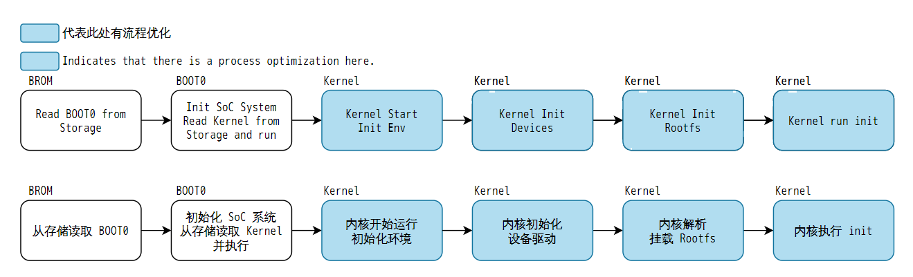

# FASTBOOT 快启系统

在现代科技快速发展的背景下，用户对于电子设备的使用体验的要求不断提高。随着智能手机、平板电脑和其他移动设备的普及，人们希望能够在最短的时间内开启设备并快速开始使用。因此，传统的启动方式已逐渐无法满足用户的需求，这促使技术开发者寻求更高效的解决方案。

快启系统的出现正是为了应对这一挑战。通过优化启动过程中的各个环节，快启技术能够大幅度缩短设备从关机到可用状态之间的时间。这不仅提升了用户的工作效率，也增强了整体的使用体验。对于那些需要频繁使用设备的用户而言，能够迅速启动，意味着可以节省宝贵的时间，同时也减少了因漫长启动过程而产生对产品性能的不信任感。

在竞争激烈的市场中，设备的启动速度也成为品牌吸引消费者的重要因素。能够提供更快、更流畅的操作体验的产品，往往能够获得更好的市场反响。因此，快启系统不仅是一项技术创新，更是现代电子设备在提升竞争力方面的重要举措。综上所述，快启系统的需求逐渐显得愈发重要，推动着技术不断进步，以适应用户不断变化的期望与需求。

## 快起系统与普通启动的差异

快启系统通过对芯片启动流程进行高度优化，以显著提升设备的启动速度。这项技术主要涵盖了多个关键方面，包括对 U-Boot 启动程序的裁剪优化、直接利用 BOOT0 拉取内核（Kernel）以及经过快启优化的内核启动流程、内核驱动和根文件系统（Rootfs）流程。

具体而言，裁剪 U-Boot 的过程减少了启动时加载的不必要模块和功能，从而缩短了启动时的时间开销。直接使用 BOOT0 拉取内核则避免了传统启动流程中的繁琐环节，使得内核能够迅速加载并启动。这种方法能够有效减少内核启动前的延迟，为后续的系统运行打下良好的基础。

在内核流程方面，经过快启优化的内核能够以更高效的方式初始化硬件，快速加载必要的驱动程序，使得系统可以更快速地响应用户操作。内核驱动的优化则确保了各个硬件组件能够在启动过程中得到及时的支持和激活，进一步提升了系统的整体性能。与此同时，根文件系统的优化流程确保了在启动过程中，必要的文件和应用能够迅速加载，从而减少用户等待时间。

通过这些综合优化，快启系统有效地提升了设备的启动速度，不仅提升了用户的使用体验，还有助于在市场竞争中增强产品的吸引力。未来，随着技术的进一步发展，快启系统有望继续演进，提供更快速、更高效的解决方案。

### 普通启动流程

1.  **BROM 加载 BOOT0**：在系统启动的第一步，BROM（Boot ROM）将 BOOT0 加载到 SRAM（静态随机存储器）中。这个过程为系统的基本启动奠定了基础，让硬件能够开始启动。
2.  **BOOT0 初始化 SoC**：BOOT0 在 SRAM 中执行初始化操作，它配置了 SoC（系统级芯片）的基本系统，包括内存的设置、时钟频率的配置等。这一阶段的成功与否直接影响后续启动流程的稳定性。
3.  **加载 U-Boot**：完成基本初始化后，BOOT0 将 U-Boot（更复杂的引导加载程序）加载到内存中，然后开始执行 U-Boot 代码。U-Boot 负责更高级的硬件初始化，以及选择和加载操作系统的内核。
4.  **加载 Kernel 和设备树**：U-Boot 通过读取存储介质中的相关信息，将 Kernel（内核）和设备树（Device Tree）加载到指定的内存区域，为下一个阶段的内核执行做准备。
5.  **内核初始化基础环境**：内核接管控制后，开始初始化基础系统环境，设置外设驱动，以便硬件可以顺利运作。这一过程包含勾画系统资源和管理硬件交互。
6.  **初始化 Rootfs 环境**：内核接着初始化 Rootfs（根文件系统），在此过程中，加载必要的运行库和功能模块，为用户空间应用提供支持。
7.  **执行 init 进程**：最后，内核执行 Rootfs 提供的 init 进程，这是用户空间的第一个进程，负责启动其它服务和应用，让操作系统进入能够被用户使用的状态。

### 快启流程

1.  **BROM 加载 BOOT0**：与普通启动流程相同，BROM 首先将 BOOT0 加载到 SRAM 中，为系统启动做好准备。
2.  **BOOT0 初始化 SoC**：BOOT0 在 SRAM 中进行 SoC 的基本初始化，包括内存和时钟设置，确保底层硬件能够稳定运行。
3.  **加载 Kernel 和设备树**：不同于普通启动流程，BOOT0 直接加载优化后的 Kernel 和设备树到指定内存区域，跳过了 U-Boot 的执行，从而减少了启动时间。
4.  **内核初始化经过优化的基础环境**：内核在执行时，迅速初始化经过优化的基础环境和外设驱动。这一升级确保了内核启动后能够迅速响应，而不再进行不必要的初始化操作。
5.  **加载优化后的 Rootfs 环境**：内核接着加载经过优化的 Rootfs 环境，包括优化后的运行库和功能模块。这些优化确保快速无缝地切换到用户空间。
6.  **执行优化后的 init 进程**：最终，内核执行从优化后的 Rootfs 中提取的 init 进程，开启用户空间的服务和应用，快速使系统达到可用状态，提升了用户体验

## 快启系统与普通系统的功能差异

快启系统由于没有 U-Boot，将不支持一些 U-Boot 提供的特性，包括：

1.  U-Boot 下执行自动 OTA
2.  U-Boot 初始化屏显示开机 LOGO
3.  U-Boot 动态选择启动存储
4.  U-Boot 启动 NFS 系统，以太网功能
5.  不支持卡烧录功能
