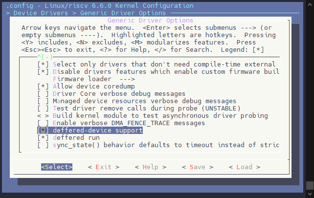
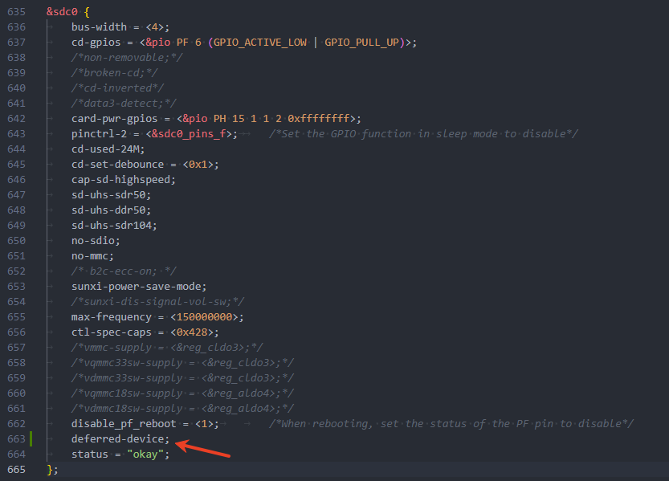
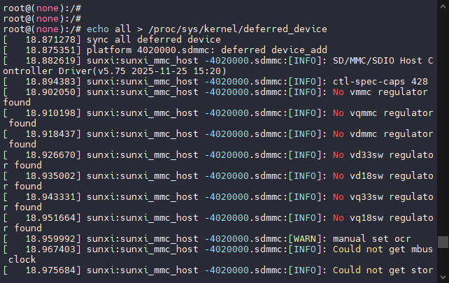

# FASTBOOT 内核启动优化

**内核启动优化的位置与范围**

在FASTBOOT（快速启动）过程中，内核启动优化是继初始启动之后的第二部分关键优化工作。这部分优化涵盖了多个层面：

-   驱动程序的加载过程优化
-   驱动程序内部实现的效率优化
-   对于完整产品而言，甚至需要进行系统级别的整体优化

**内核启动优化的核心目标**

对于操作系统内核来说，启动优化的核心目标非常明确：**尽可能快速地完成内核初始化，启动到用户进程，让系统尽快进入应用层交互阶段**。

简单来说，就是让设备能够更快地响应用户操作，缩短从开机到可以正常使用的时间。

**具体优化策略**

1.  驱动程序的延迟加载
    
    将驱动程序分为"必要"和"非必要"两类：
    
    -   **必要驱动**：系统启动和基本功能运行所必需的驱动（如CPU、内存、基本存储等），在启动初期优先加载
    -   **非必要驱动**：那些不影响系统基本启动但提供额外功能的驱动（如某些外设驱动），推迟到系统启动完成后再加载或挂载
    
    这种方式可以减少启动初期的负载，让核心功能更快可用。
    
2.  内核功能的精简
    
    对内核进行"瘦身"处理：
    
    -   关闭所有不需要的内核功能和模块
    -   只保留系统实际需要的功能组件
    
    这样可以避免内核在启动过程中执行不必要的配置和流程，减少启动时间和资源消耗。
    

## 驱动程序延迟加载

在传统的内核启动流程中，所有设备驱动程序通常会在系统初始化阶段被顺序加载和初始化。这种方式虽然实现简单，但存在明显的效率问题。首先是启动时间过长，即使是那些非系统运行必需的驱动（如某些外设驱动），也会在启动初期占用CPU时间和系统资源，拖慢整体启动速度。其次是资源竞争加剧，大量驱动同时初始化会导致系统资源（如内存、总线带宽等）竞争，进一步降低启动效率。最后是用户体验较差，设备需要等待所有驱动加载完成才能正常使用，延长了从开机到可用的时间窗口。为了解决这些问题，内核开发者引入了**deferred-device**（延迟设备）功能，专门用于实现驱动程序的延迟加载机制。

deferred-device是内核提供的一套驱动加载调度机制，其核心思想是通过驱动分类标记、启动阶段分离和依赖关系管理三大机制实现驱动程序的智能延迟加载。驱动程序可以通过特定的内核接口标记自己为"可延迟加载"的设备，系统会根据这些标记将驱动加载过程分为两个阶段：核心阶段和延迟阶段。在核心阶段，启动初期只加载那些标记为"必要"的驱动；而在延迟阶段，系统核心功能启动完成后，会通过内核线程或工作队列来异步加载那些标记为"可延迟"的驱动。同时，deferred-device功能能够智能处理驱动之间的依赖关系，确保延迟加载的驱动在其依赖的驱动完全初始化后再加载，避免因依赖问题导致的加载失败。

通过使用内核的deferred-device功能实现驱动延迟加载，相比传统方式具有多方面的优势。首先是启动速度显著提升，减少了启动初期的驱动加载数量，能够显著缩短系统核心启动时间。其次是资源利用更加优化，分散了驱动初始化对系统资源的占用，提高了资源利用率。第三是用户体验得到改善，用户可以在核心功能可用后尽快使用设备，而无需等待所有驱动加载完成。最后是内核集成度高，作为内核原生功能，具有更好的稳定性和兼容性。在FASTBOOT快速启动方案中，deferred-device功能是实现驱动程序延迟加载优化的核心技术基础，为提升整体启动速度提供了重要支持。

### 配置延迟加载功能

由于这个功能是内核原生功能，只需要启动配置即可，执行 `make kernel_menuconfig` 进入内核模块配置界面，启用驱动功能。

```
Device Drivers  --->
	Generic Driver Options  --->
		[*] deffered-device support
		[*] deffered run
```



然后对于不是启动时必要的外设，在设备树中添加配置，将其声明为一个延迟加载的驱动

```
deferred-device;
```



如上图，此时的 SDIO 驱动声明成了延迟加载驱动，此时 SDIO 在启动的时候就不会进行加载，只有应用程序执行加载命令，才会继续加载这个驱动。

```
echo all > /proc/sys/kernel/deferred_device
echo 1 > /proc/sys/kernel/deferred_fn
```



### 裁剪优化内核

正常状态下，内核默认会开启调试，符号表，外设驱动等功能，会造成内核镜像大小变大，针对不同产品可以对其进行裁剪，只使用需要的内核模块。

SDK 默认提供通用的 quick\_config 进行内核各模块的裁剪，执行命令如下：

```
quick_config memory_optimization
```

裁剪内容包括：

```
CONFIG_LOG_BUF_SHIFT=15
CONFIG_AW_BSP_LOWMEM=y
# CONFIG_VM_EVENT_COUNTERS is not set
# CONFIG_CGROUPS is not set
# CONFIG_KALLSYMS is not set
# CONFIG_SLUB_DEBUG is not set
# CONFIG_AW_MTD_SPINAND is not set
# CONFIG_SCSI is not set
# CONFIG_ATA is not set
# CONFIG_ETHERNET is not set
# CONFIG_USB_HID is not set
# CONFIG_INPUT_MOUSEDEV is not set
# CONFIG_INPUT_KEYBOARD is not set
# CONFIG_INPUT_MOUSE is not set
# CONFIG_SERIO is not set
# CONFIG_DRM is not set
# CONFIG_FB is not set
# CONFIG_CRYPTO_DEFLATE is not set
# CONFIG_CRYPTO_LZO is not set
# CONFIG_CRYPTO_ZSTD is not set
# CONFIG_CRYPTO_USER_API_HASH is not set
# CONFIG_CRYPTO_HW is not set
# CONFIG_XZ_DEC_X86 is not set
# CONFIG_XZ_DEC_POWERPC is not set
# CONFIG_XZ_DEC_IA64 is not set
# CONFIG_XZ_DEC_ARM is not set
# CONFIG_XZ_DEC_ARMTHUMB is not set
# CONFIG_XZ_DEC_SPARC is not set
# CONFIG_DEBUG_MISC is not set
# CONFIG_SCHED_DEBUG is not set
# CONFIG_FTRACE is not set
# CONFIG_RUNTIME_TESTING_MENU is not set
# CONFIG_NETWORK_FILESYSTEMS is not set
# CONFIG_AUTOFS_FS is not set
# CONFIG_UBIFS_FS is not set
# CONFIG_I2C_HELPER_AUTO is not set
# CONFIG_LEGACY_PTYS is not set
# CONFIG_WLAN_VENDOR_ADMTEK is not set
# CONFIG_WLAN_VENDOR_ATH is not set
# CONFIG_WLAN_VENDOR_ATMEL is not set
# CONFIG_WLAN_VENDOR_BROADCOM is not set
# CONFIG_WLAN_VENDOR_CISCO is not set
# CONFIG_WLAN_VENDOR_INTEL is not set
# CONFIG_WLAN_VENDOR_INTERSIL is not set
# CONFIG_WLAN_VENDOR_MARVELL is not set
# CONFIG_WLAN_VENDOR_MEDIATEK is not set
# CONFIG_WLAN_VENDOR_RALINK is not set
# CONFIG_WLAN_VENDOR_REALTEK is not set
# CONFIG_WLAN_VENDOR_RSI is not set
# CONFIG_WLAN_VENDOR_ST is not set
# CONFIG_WLAN_VENDOR_TI is not set
# CONFIG_WLAN_VENDOR_ZYDAS is not set
# CONFIG_WLAN_VENDOR_QUANTENNA is not set
# CONFIG_IPV6 is not set
# CONFIG_DEVMEM is not set
# CONFIG_DYNAMIC_DEBUG is not set
# CONFIG_DEBUG_PREEMPT is not set
# CONFIG_AW_ANSC_STANDBY_DEBUG is not set
# CONFIG_DEBUG_BUGVERBOSE is not set
# CONFIG_KEYS is not set
# CONFIG_DNS_RESOLVER is not set
# CONFIG_EROFS_FS is not set
# CONFIG_FUSE_FS is not set
# CONFIG_USB_XHCI_HCD is not set
# CONFIG_USB_XHCI_PLATFORM is not set
# CONFIG_MTD_UBI is not set
CONFIG_INET_TABLE_PERTURB_ORDER=8
# CONFIG_SND_SOC_SUNXI_DEBUG is not set
# CONFIG_USB_SUNXI_USB_DEBUG is not set
# CONFIG_CGROUPS is not set
# CONFIG_CGROUP_SCHED is not set
# CONFIG_CFS_BANDWIDTH is not set
# CONFIG_CGROUP_BPF is not set
# CONFIG_USB_STORAGE is not set
# CONFIG_USB_CONFIGFS_MASS_STORAGE is not set
# CONFIG_USB_ROLE_SWITCH is not set
# CONFIG_IIO is not set
# CONFIG_EXT4_FS is not set
# CONFIG_EXFAT_FS is not set
# CONFIG_USB_ANNOUNCE_NEW_DEVICES is not set
# CONFIG_DYNAMIC_DEBUG_CORE is not set
# CONFIG_STACKTRACE is not set
# CONFIG_CRYPTO_ECDH is not set
# CONFIG_CRYPTO_ECB is not set
# CONFIG_CRC_ITU_T is not set
# CONFIG_CRC7 is not set
# CONFIG_BACKLIGHT_PWM is not set
# CONFIG_RFKILL is not set
# CONFIG_RFKILL_GPIO is not set
# CONFIG_VIRTIO_BLK is not set
# CONFIG_RTC_NVMEM is not set
# CONFIG_NVMEM is not set
# CONFIG_BPF_SYSCALL is not set
# CONFIG_SECCOMP is not set
# CONFIG_IP_MULTIPLE_TABLES is not set
# CONFIG_BACKLIGHT_CLASS_DEVICE is not set
# CONFIG_VGA_CONSOLE is not set
# CONFIG_IO_URING is not set
# CONFIG_IOSCHED_BFQ is not set
# CONFIG_SECRETMEM is not set
# CONFIG_CRYPTO_RSA is not set
# CONFIG_CRYPTO_MANAGER is not set
# CONFIG_SYMBOLIC_ERRNAME is not set
# CONFIG_HID is not set
# CONFIG_ETHTOOL_NETLINK is not set
# CONFIG_AW_CCU_DEBUG is not set
# CONFIG_AW_CCMU_DYNAMIC_DEBUG is not set
# CONFIG_AW_PINCTRL_DYNAMIC_DEBUG is not set
# CONFIG_AW_UART_DYNAMIC_DEBUG is not set
# CONFIG_AW_DUMPREG_DYNAMIC_DEBUG is not set
# CONFIG_AW_VIDEO_DYNAMIC_DEBUG is not set
# CONFIG_SND_SOC_SUNXI_DYNAMIC_DEBUG is not set
# CONFIG_COMMON_CLK_DEBUG is not set
```

下面是Linux内核各配置项解释，可以参考

| 配置项 | 状态 | 含义 | 作用 |
| --- | --- | --- | --- |
| CONFIG\_LOG\_BUF\_SHIFT=15 | 启用 | 设置内核日志缓冲区的大小 | 值为15表示缓冲区大小为2^15 = 32KB，用于存储内核日志信息 |
| CONFIG\_AW\_BSP\_LOWMEM=y | 启用 | 启用全志(Allwinner)BSP的低内存支持 | 针对内存受限的设备进行优化，确保系统在低内存环境下正常运行 |
| CONFIG\_VM\_EVENT\_COUNTERS | 禁用 | 虚拟内存事件计数器 | 这些计数器用于跟踪虚拟内存操作（如页面分配、回收等）的统计信息，禁用可减少内存开销 |
| CONFIG\_CGROUPS | 禁用 | 控制组(Cgroups)功能 | Cgroups用于限制、记录和隔离进程组的资源使用，禁用可简化内核并减少内存占用 |
| CONFIG\_KALLSYMS | 禁用 | 符号表 | 符号表包含内核函数和变量的名称，用于调试和错误报告，禁用可减小内核体积 |
| CONFIG\_SLUB\_DEBUG | 禁用 | SLUB分配器的调试功能 | SLUB是Linux内核的内存分配器，调试功能用于检测内存泄漏和腐败，禁用可提高性能 |
| CONFIG\_AW\_MTD\_SPINAND | 禁用 | 全志平台的MTD SPI NAND支持 | MTD(Memory Technology Device)用于处理闪存设备，禁用未使用的闪存类型支持可减小内核体积 |
| CONFIG\_SCSI | 禁用 | SCSI设备支持 | SCSI是一种存储设备接口标准，禁用可减少内核体积，适用于不需要SCSI设备的系统 |
| CONFIG\_ATA | 禁用 | ATA设备支持 | ATA是传统的硬盘接口标准，禁用可减少内核体积，适用于不需要ATA设备的系统 |
| CONFIG\_ETHERNET | 禁用 | 以太网支持 | 禁用以太网相关功能，适用于不需要网络连接的系统 |
| CONFIG\_USB\_HID | 禁用 | USB HID设备支持 | USB HID(Human Interface Device)包括键盘、鼠标等输入设备，禁用可减少内核体积 |
| CONFIG\_INPUT\_MOUSEDEV | 禁用 | 鼠标设备的字符设备接口支持 | 此接口用于将鼠标事件转换为字符设备输入，禁用可减少内核体积 |
| CONFIG\_INPUT\_KEYBOARD | 禁用 | 键盘设备支持 | 禁用键盘输入设备的驱动支持，适用于不需要键盘的系统 |
| CONFIG\_INPUT\_MOUSE | 禁用 | 鼠标设备支持 | 禁用鼠标输入设备的驱动支持，适用于不需要鼠标的系统 |
| CONFIG\_SERIO | 禁用 | 串行输入/输出(SerIO)支持 | SerIO用于处理PS/2键盘、鼠标等设备，禁用可减少内核体积 |
| CONFIG\_DRM | 禁用 | Direct Rendering Manager(DRM) | DRM是Linux内核的显示子系统，用于管理图形硬件，禁用可减少内核体积 |
| CONFIG\_FB | 禁用 | 帧缓冲(Frame Buffer)设备支持 | 帧缓冲用于图形显示，禁用可减少内核体积，适用于无显示设备的系统 |
| CONFIG\_CRYPTO\_DEFLATE | 禁用 | DEFLATE压缩算法支持 | DEFLATE是一种常用的压缩算法，禁用可减少内核体积，适用于不需要此压缩算法的系统 |
| CONFIG\_CRYPTO\_LZO | 禁用 | LZO压缩算法支持 | LZO是一种高速压缩算法，禁用可减少内核体积，适用于不需要此压缩算法的系统 |
| CONFIG\_CRYPTO\_ZSTD | 禁用 | ZSTD压缩算法支持 | ZSTD是一种高效的压缩算法，禁用可减少内核体积，适用于不需要此压缩算法的系统 |
| CONFIG\_CRYPTO\_USER\_API\_HASH | 禁用 | 用户空间哈希算法API | 此API允许用户空间程序使用内核的哈希算法，禁用可减少内核体积 |
| CONFIG\_CRYPTO\_HW | 禁用 | 硬件加密加速器支持 | 禁用所有硬件加密设备的驱动支持，适用于不需要硬件加密的系统 |
| CONFIG\_XZ\_DEC\_X86 | 禁用 | X86平台的XZ解压支持 | XZ是一种高压缩率的压缩算法，禁用特定平台的支持可减少内核体积 |
| CONFIG\_XZ\_DEC\_POWERPC | 禁用 | PowerPC平台的XZ解压支持 | 同上，针对PowerPC平台 |
| CONFIG\_XZ\_DEC\_IA64 | 禁用 | IA64平台的XZ解压支持 | 同上，针对IA64平台 |
| CONFIG\_XZ\_DEC\_ARM | 禁用 | ARM平台的XZ解压支持 | 同上，针对ARM平台 |
| CONFIG\_XZ\_DEC\_ARMTHUMB | 禁用 | ARM Thumb平台的XZ解压支持 | 同上，针对ARM Thumb平台 |
| CONFIG\_XZ\_DEC\_SPARC | 禁用 | SPARC平台的XZ解压支持 | 同上，针对SPARC平台 |
| CONFIG\_DEBUG\_MISC | 禁用 | 杂项调试功能 | 禁用各种非分类的调试功能，减少内核体积和内存占用 |
| CONFIG\_SCHED\_DEBUG | 禁用 | 调度器调试功能 | 调度器调试用于分析和调试进程调度行为，禁用可提高性能 |
| CONFIG\_FTRACE | 禁用 | 函数跟踪功能 | Ftrace用于跟踪内核函数调用，禁用可减少内核体积和性能开销 |
| CONFIG\_RUNTIME\_TESTING\_MENU | 禁用 | 运行时测试菜单 | 此菜单包含各种内核子系统的运行时测试，禁用可减少内核体积 |
| CONFIG\_NETWORK\_FILESYSTEMS | 禁用 | 网络文件系统支持 | 禁用所有网络文件系统（如NFS、CIFS等），适用于不需要网络存储的系统 |
| CONFIG\_AUTOFS\_FS | 禁用 | 自动挂载文件系统支持 | Autofs用于自动挂载和卸载文件系统，禁用可减少内核体积 |
| CONFIG\_UBIFS\_FS | 禁用 | UBIFS文件系统支持 | UBIFS是针对闪存设备优化的文件系统，禁用可减少内核体积 |
| CONFIG\_I2C\_HELPER\_AUTO | 禁用 | I2C总线的自动探测功能 | 自动探测用于发现I2C总线上的设备，禁用可减少内核体积 |
| CONFIG\_LEGACY\_PTYS | 禁用 | 传统伪终端支持 | 传统伪终端是较旧的终端设备接口，禁用可减少内核体积，现代系统通常使用UNIX 98伪终端 |
| CONFIG\_WLAN\_VENDOR\_ADMTEK | 禁用 | ADMTEK无线网卡驱动支持 | 禁用特定供应商的无线驱动，减少内核体积 |
| CONFIG\_WLAN\_VENDOR\_ATH | 禁用 | ATH无线网卡驱动支持 | 同上 |
| CONFIG\_WLAN\_VENDOR\_ATMEL | 禁用 | ATMEL无线网卡驱动支持 | 同上 |
| CONFIG\_WLAN\_VENDOR\_BROADCOM | 禁用 | BROADCOM无线网卡驱动支持 | 同上 |
| CONFIG\_WLAN\_VENDOR\_CISCO | 禁用 | CISCO无线网卡驱动支持 | 同上 |
| CONFIG\_WLAN\_VENDOR\_INTEL | 禁用 | INTEL无线网卡驱动支持 | 同上 |
| CONFIG\_WLAN\_VENDOR\_INTERSIL | 禁用 | INTERSIL无线网卡驱动支持 | 同上 |
| CONFIG\_WLAN\_VENDOR\_MARVELL | 禁用 | MARVELL无线网卡驱动支持 | 同上 |
| CONFIG\_WLAN\_VENDOR\_MEDIATEK | 禁用 | MEDIATEK无线网卡驱动支持 | 同上 |
| CONFIG\_WLAN\_VENDOR\_RALINK | 禁用 | RALINK无线网卡驱动支持 | 同上 |
| CONFIG\_WLAN\_VENDOR\_REALTEK | 禁用 | REALTEK无线网卡驱动支持 | 同上 |
| CONFIG\_WLAN\_VENDOR\_RSI | 禁用 | RSI无线网卡驱动支持 | 同上 |
| CONFIG\_WLAN\_VENDOR\_ST | 禁用 | ST无线网卡驱动支持 | 同上 |
| CONFIG\_WLAN\_VENDOR\_TI | 禁用 | TI无线网卡驱动支持 | 同上 |
| CONFIG\_WLAN\_VENDOR\_ZYDAS | 禁用 | ZYDAS无线网卡驱动支持 | 同上 |
| CONFIG\_WLAN\_VENDOR\_QUANTENNA | 禁用 | QUANTENNA无线网卡驱动支持 | 同上 |
| CONFIG\_IPV6 | 禁用 | IPv6协议支持 | 禁用IPv6可减少内核体积，适用于仅使用IPv4的系统 |
| CONFIG\_DEVMEM | 禁用 | /dev/mem设备 | /dev/mem提供对物理内存的直接访问，禁用可提高系统安全性 |
| CONFIG\_DYNAMIC\_DEBUG | 禁用 | 动态调试功能 | 动态调试允许在运行时启用或禁用特定内核代码的调试输出，禁用可减少内核体积 |
| CONFIG\_DEBUG\_PREEMPT | 禁用 | 抢占调试功能 | 抢占调试用于检测和调试内核抢占相关的问题，禁用可提高性能 |
| CONFIG\_AW\_ANSC\_STANDBY\_DEBUG | 禁用 | 全志ANSC待机调试功能 | ANSC可能是全志平台的某种电源管理模块，禁用调试功能可减少内核体积 |
| CONFIG\_DEBUG\_BUGVERBOSE | 禁用 | 详细的bug报告 | 详细的bug报告包含更多调试信息，禁用可减少内核体积 |
| CONFIG\_KEYS | 禁用 | 内核密钥管理系统 | 密钥管理系统用于安全地存储和使用加密密钥，禁用可减少内核体积 |
| CONFIG\_DNS\_RESOLVER | 禁用 | 内核DNS解析器 | 内核DNS解析器允许内核直接进行DNS查询，禁用可减少内核体积 |
| CONFIG\_EROFS\_FS | 禁用 | EROFS文件系统支持 | EROFS(Enhanced Read-Only File System)是一种只读文件系统，禁用可减少内核体积 |
| CONFIG\_FUSE\_FS | 禁用 | FUSE文件系统支持 | FUSE允许用户空间程序实现文件系统，禁用可减少内核体积 |
| CONFIG\_USB\_XHCI\_HCD | 禁用 | USB XHCI主机控制器驱动 | XHCI是USB 3.0及以上版本的主机控制器规范，禁用可减少内核体积 |
| CONFIG\_USB\_XHCI\_PLATFORM | 禁用 | USB XHCI平台驱动 | 针对特定平台优化的XHCI驱动，禁用可减少内核体积 |
| CONFIG\_MTD\_UBI | 禁用 | MTD UBI层支持 | UBI(Unsorted Block Images)是MTD子系统上的卷管理层，用于管理闪存设备的磨损均衡和坏块处理，禁用可减少内核体积 |
| CONFIG\_INET\_TABLE\_PERTURB\_ORDER=8 | 启用 | 设置inet表的扰动顺序 | 值为8表示在哈希冲突时使用的扰动算法强度，用于提高网络表的哈希分布均匀性 |
| CONFIG\_SND\_SOC\_SUNXI\_DEBUG | 禁用 | 全志声卡调试功能 | 禁用音频子系统的调试输出，减少内核体积 |
| CONFIG\_USB\_SUNXI\_USB\_DEBUG | 禁用 | 全志USB调试功能 | 禁用USB子系统的调试输出，减少内核体积 |
| CONFIG\_CGROUPS | 禁用 | 控制组(Cgroups)功能（重复） | 再次确认禁用控制组功能 |
| CONFIG\_CGROUP\_SCHED | 禁用 | 控制组调度功能 | 此功能允许为控制组分配CPU时间，禁用可减少内核体积 |
| CONFIG\_CFS\_BANDWIDTH | 禁用 | CFS带宽控制功能 | CFS(Completely Fair Scheduler)带宽控制用于限制控制组的CPU使用率，禁用可减少内核体积 |
| CONFIG\_CGROUP\_BPF | 禁用 | 控制组BPF支持 | BPF(Berkeley Packet Filter)用于在控制组中实现自定义策略，禁用可减少内核体积 |
| CONFIG\_USB\_STORAGE | 禁用 | USB存储设备支持 | 禁用USB磁盘、U盘等存储设备的驱动，适用于不需要USB存储的系统 |
| CONFIG\_USB\_CONFIGFS\_MASS\_STORAGE | 禁用 | USB ConfigFS大容量存储功能 | 此功能允许通过ConfigFS配置USB大容量存储设备，禁用可减少内核体积 |
| CONFIG\_USB\_ROLE\_SWITCH | 禁用 | USB角色切换功能 | USB角色切换用于在主机和设备模式之间切换，禁用可减少内核体积 |
| CONFIG\_IIO | 禁用 | 工业I/O子系统 | 工业I/O子系统用于处理传感器和测量设备，禁用可减少内核体积 |
| CONFIG\_EXT4\_FS | 禁用 | EXT4文件系统支持 | EXT4是常用的Linux文件系统，禁用可减少内核体积，适用于不需要此文件系统的系统 |
| CONFIG\_EXFAT\_FS | 禁用 | EXFAT文件系统支持 | EXFAT是微软开发的文件系统，常用于U盘和SD卡，禁用可减少内核体积 |
| CONFIG\_USB\_ANNOUNCE\_NEW\_DEVICES | 禁用 | USB新设备通知 | 禁用当新USB设备连接时的内核通知，可减少内核体积 |
| CONFIG\_DYNAMIC\_DEBUG\_CORE | 禁用 | 动态调试核心功能 | 动态调试的核心组件，禁用可减少内核体积 |
| CONFIG\_STACKTRACE | 禁用 | 堆栈跟踪功能 | 堆栈跟踪用于在错误发生时显示函数调用链，禁用可减少内核体积 |
| CONFIG\_CRYPTO\_ECDH | 禁用 | ECDH加密算法支持 | ECDH(Elliptic Curve Diffie-Hellman)用于密钥交换，禁用可减少内核体积 |
| CONFIG\_CRYPTO\_ECB | 禁用 | ECB加密模式支持 | ECB(Electronic Codebook)是一种基本的加密模式，禁用可减少内核体积 |
| CONFIG\_CRC\_ITU\_T | 禁用 | ITU-T CRC校验算法 | ITU-T CRC是一种循环冗余校验算法，常用于通信领域，禁用可减少内核体积 |
| CONFIG\_CRC7 | 禁用 | CRC7校验算法 | CRC7是一种循环冗余校验算法，常用于存储设备，禁用可减少内核体积 |
| CONFIG\_BACKLIGHT\_PWM | 禁用 | PWM背光控制支持 | PWM(Pulse Width Modulation)用于调节显示设备的亮度，禁用可减少内核体积 |
| CONFIG\_RFKILL | 禁用 | 无线开关支持 | RFKill用于控制无线设备的电源状态，禁用可减少内核体积 |
| CONFIG\_RFKILL\_GPIO | 禁用 | GPIO无线开关支持 | 通过GPIO控制无线设备的电源状态，禁用可减少内核体积 |
| CONFIG\_VIRTIO\_BLK | 禁用 | VIRTIO块设备支持 | VIRTIO是虚拟化环境中的设备接口，禁用可减少内核体积，适用于非虚拟化系统 |
| CONFIG\_RTC\_NVMEM | 禁用 | RTC NVMEM支持 | 允许RTC(Real-Time Clock)设备作为NVMEM(Non-Volatile Memory)提供者，禁用可减少内核体积 |
| CONFIG\_NVMEM | 禁用 | NVMEM子系统 | NVMEM用于访问非易失性内存设备，禁用可减少内核体积 |
| CONFIG\_BPF\_SYSCALL | 禁用 | BPF系统调用 | BPF(Berkeley Packet Filter)允许用户空间程序在内核中执行自定义代码，禁用可减少内核体积和提高安全性 |
| CONFIG\_SECCOMP | 禁用 | 安全计算模式 | Seccomp用于限制进程可以使用的系统调用，禁用可减少内核体积 |
| CONFIG\_IP\_MULTIPLE\_TABLES | 禁用 | IP多表支持 | IP多表允许使用多个路由表，禁用可减少内核体积 |
| CONFIG\_BACKLIGHT\_CLASS\_DEVICE | 禁用 | 背光类设备支持 | 背光类设备用于统一管理显示设备的背光，禁用可减少内核体积 |
| CONFIG\_VGA\_CONSOLE | 禁用 | VGA控制台支持 | VGA控制台是通过VGA接口输出的文本控制台，禁用可减少内核体积 |
| CONFIG\_IO\_URING | 禁用 | IO\_URING支持 | IO\_URING是一种高性能的I/O接口，禁用可减少内核体积 |
| CONFIG\_IOSCHED\_BFQ | 禁用 | BFQ I/O调度器 | BFQ(Budget Fair Queueing)是一种I/O调度算法，用于优化存储设备的性能，禁用可减少内核体积 |
| CONFIG\_SECRETMEM | 禁用 | 安全内存支持 | 安全内存用于存储敏感数据，禁用可减少内核体积 |
| CONFIG\_CRYPTO\_RSA | 禁用 | RSA加密算法支持 | RSA是一种常用的公钥加密算法，禁用可减少内核体积 |
| CONFIG\_CRYPTO\_MANAGER | 禁用 | 加密管理器 | 加密管理器用于管理内核中的加密算法和密钥，禁用可减少内核体积 |
| CONFIG\_SYMBOLIC\_ERRNAME | 禁用 | 符号错误名称 | 符号错误名称将错误代码转换为可读的名称，禁用可减少内核体积 |
| CONFIG\_HID | 禁用 | HID设备支持 | HID(Human Interface Device)包括键盘、鼠标、游戏手柄等输入设备，禁用可减少内核体积 |
| CONFIG\_ETHTOOL\_NETLINK | 禁用 | ethtool的Netlink接口 | ethtool用于配置网络设备，Netlink接口提供了一种与内核通信的方式，禁用可减少内核体积 |
| CONFIG\_AW\_CCU\_DEBUG | 禁用 | 全志CCU调试功能 | CCU(时钟控制单元)的调试功能，禁用可减少内核体积 |
| CONFIG\_AW\_CCMU\_DYNAMIC\_DEBUG | 禁用 | 全志CCMU动态调试功能 | CCMU(时钟控制和管理单元)的动态调试功能，禁用可减少内核体积 |
| CONFIG\_AW\_PINCTRL\_DYNAMIC\_DEBUG | 禁用 | 全志PINCTRL动态调试功能 | PINCTRL(引脚控制)的动态调试功能，禁用可减少内核体积 |
| CONFIG\_AW\_UART\_DYNAMIC\_DEBUG | 禁用 | 全志UART动态调试功能 | UART(串行接口)的动态调试功能，禁用可减少内核体积 |
| CONFIG\_AW\_DUMPREG\_DYNAMIC\_DEBUG | 禁用 | 全志DUMPREG动态调试功能 | DUMPREG(寄存器转储)的动态调试功能，禁用可减少内核体积 |
| CONFIG\_AW\_VIDEO\_DYNAMIC\_DEBUG | 禁用 | 全志VIDEO动态调试功能 | VIDEO(视频)的动态调试功能，禁用可减少内核体积 |
| CONFIG\_SND\_SOC\_SUNXI\_DYNAMIC\_DEBUG | 禁用 | 全志声卡动态调试功能 | SND\_SOC\_SUNXI(声卡)的动态调试功能，禁用可减少内核体积 |
| CONFIG\_COMMON\_CLK\_DEBUG | 禁用 | 通用时钟调试功能 | 通用时钟框架用于管理内核中的时钟资源，禁用调试功能可减少内核体积 |
