# 图像 ISP61x 调试指南

## 前 言

### 文档简介

本文档适用于V861平台图像效果调试，通过更具体化的示例帮助用户了解图像ISP效果调试的基础流程。

### 目标读者

软件工程师、技术支持工程师。

### 符号约定

本文档中会使用不同符号区分信息类型，具体释义如下：

:::note

:::note

备注

:::
:::note

用于呈现技术核心信息（如功能原理、核心参数定义）、流程补充内容（如步骤细节说明）等。

:::

:::
:::tip

:::note

提示

:::
:::note

用于分享技术操作中的高效方法（如命令行快捷指令、配置项优化窍门）与实践技巧。

:::

:::
:::warning

:::note

注意

:::
:::note

用于突出技术操作中易出错的环节（如参数配置边界、操作顺序要求）的提示。

:::

:::

### 适用范围

:::note

:::note

适用产品列表

:::

:::

适用的产品型号：

-   V861
-   V838
-   V881

:::note

:::note

备注

:::
:::note

V861与V838、V881 均为ISP610平台，算法上无差异，下文统一使用V861进行描述。

:::

:::

## 调试环境准备

### 图像效果调试需要准备的环境

| **名称** | **说明** |
| --- | --- |
| 样机 | 用于调试使用，建议调试前确定好需要量产的镜头，避免重复工作 |
| 对比机 | 用于对比使用，由于镜头、sensor对成像质量影响大，建议选取对比机使用同款sensor、镜头 |
| 调试固件 | 图像调试依赖于`adb/ip`两种连接方式，必须确保调试固件能正常使用其中一种方式 |
| awTuningApp | 调试ISP使用的板端应用 |
| TigerISP | 调试ISP使用的PC程序，前往APST下载 |
| 串口 | 样机需将串口接出，便于调试过程中使用 |
| 光源箱 | 用于客观标定，提供多种不同色温不同亮度的照明环境 |
| 散光片 | 用于客观标定，又称毛玻璃 |
| 24色色卡 | 用于客观标定，用于色彩调优 |

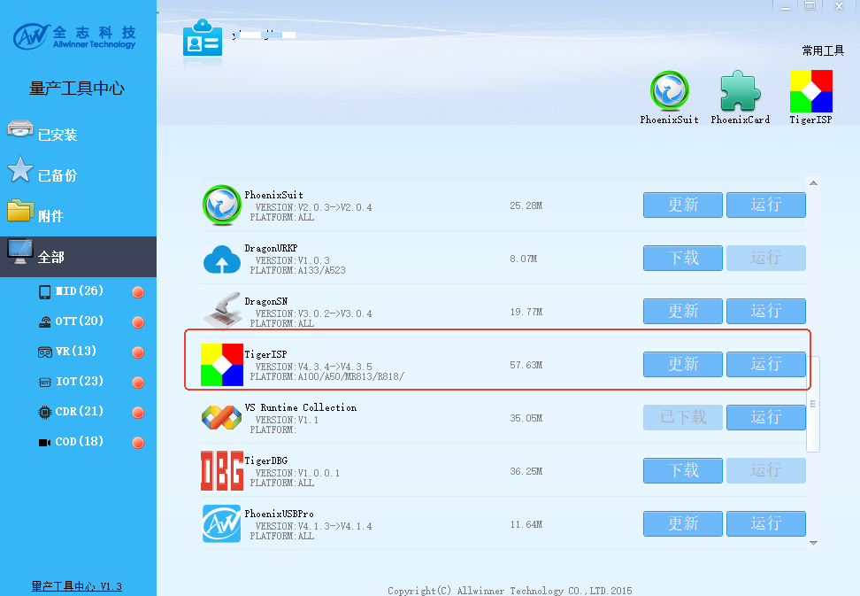

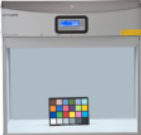

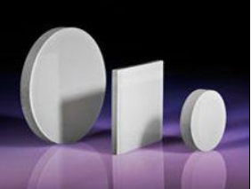


:::note

:::note

备注

:::
:::note

-   如无客观标定设备，可向我司对接人申请实验室环境用于客观标定。
    
-   V861 常电的 awTuningApp 路径： `platform/allwinner/vision/libAWIspApi/isp_mpp/isp_v861/libisp/tuning_app/awTuningApp_isp610`
    
-   V881 快启的 awTuningApp 路径： `rtos/lichee/rtos-hal/hal/source/vin/vin_isp/isp61x_server/out`
    

:::

:::

### 选择及设置色彩空间

色彩空间是一种数学模型，用于描述和表示图像或视频中的颜色，它定义了一组颜色值的范围、编码方式以及颜色之间的转换规则。

不同亮度范围的色彩空间是会导致动态范围呈现差异的；

**BT709-Partrange（部分范围）**：也称为"limited range"，它是指亮度范围在 16 到 235 之间的值。这意味着黑色对应的值是 16，白色对应的值是 235。在这个范围内，0 表示纯黑，255 表示纯白，而 1 和 235 之间的值用于表示灰度和其他亮度级别。Partrange 通常用于视频广播和一些消费电子设备中，以确保在传输和显示过程中能够兼容各种设备和标准。它可以防止黑色和白色之外的信息在传输或显示中被截断或失真。

**BT709-Fullrange（全范围）**：也称为"full range"，它是指亮度范围在 0 到 255 之间的值。这意味着黑色对应的值是 0，白色对应的值是 255。在这个范围内，所有的亮度级别都可以表示。Fullrange主要用于一些专业领域和特定应用，例如计算机图形和视频编辑。在这些情况下，使用全范围可以提供更大的亮度动态范围和更精细的色彩表示。

**在产品开发中，如果希望图像对比度更高，画面更通透，那么建议选择BT709-Fullrange的色彩空间。**

在实际应用中，ISP、VE以及解码端，均需要设置色彩空间，在配置过程中，务必要确保三者保持设置同一个色彩空间，避免部分亮度丢失，对比度异常的问题。其中VE、ISP的色彩空间设置，请参考sample\_smartIPC\_demo中如下图所示配置，解码端需要找对应同事进行确认。

V861 Sample路径：`\platform\allwinner\eyesee-mpp\middleware\sun252iw1\sample\sample_smartIPC_demo\sample_smartIPC_demo.c`


ISP、VE 设置好色彩空间后，通过抓取 ISP、VE 节点确认色彩空间是否设置成功。

ISP节点：`cat /sys/kernel/debug/mpp/isp`

VE节点：`cat /sys/kernel/debug/mpp/ve*`


:::note

:::note

备注

:::
:::note

-   potplayer播放器默认使用的是Full\_range的色彩空间，vlc播放器默认使用的是Part\_range的色彩空间，如果需要使用播放器对比图像效果，色彩空间也需要匹配上。

:::

:::

### 确认对焦是否准确

镜头对焦确认方法：

**Step1**：打印如下测试图，打印要求：横向、无边距、至少A4大小（越大越好）、至少600dpi（越大越好）

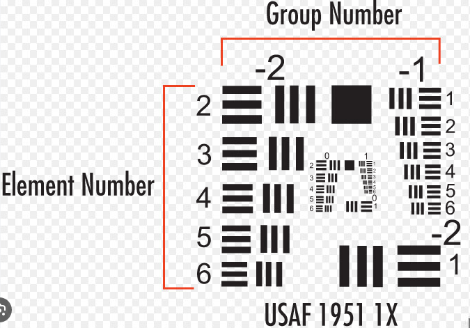

**Step2**：在充足照明（不小于1000lux）的环境拍摄，选择产品常用的拍摄距离放置测试图，最好能保证测试图高度占画面高度不小于1/8

**Step3**：彩色和红外下都需要测试。（如果打印版本无法在红外下使用，可到TB购买）

**Step4**：打开看视频的应用，画质调到最高，画面稳定后截图

**Step5**：用PS或ISP调试工具等打开图片，测量测试图的高度（上下边框的纵坐标差），根据最小的能看清楚三横三竖的图案所处位置，查表代入公式计算54941/Height/GE清晰度，如果图像有插值，那么公式为54941/Height/GE清晰度x插值图像高度/sensor实际高度


**Step6**：清晰度低于0.7的，请检查对焦

示例如下：

图片分辨率是1920x1080，测试图的高度为63像素，最小的能看清楚三横三竖的图案处于G-2E6，查表得1122.46。代入公式54941 / 63 / 1122.46 = 0.776935806，图像无插值，清晰度就是0.777


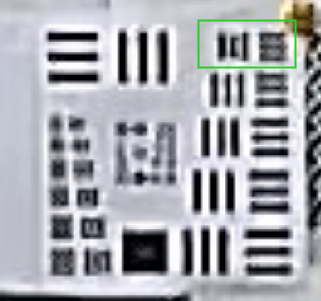

### 镜头sensor选型介绍

镜头与sensor在匹配状态下，才能将清晰度、画面均匀度达到最佳状态，镜头选型需要注意的方面如下

-   镜头与sensor的CRA是否匹配

镜头与sensor均有一个CRA曲线，在选型过程中，要尽量保证CRA参数要尽可能接近（一般不超过3度）


-   镜头解析力与sensor尺寸是否匹配

镜头解析力稍大于或等于sensor尺寸，才能将清晰度更好展现，不然会导致清晰度差异及摩尔纹等问题

-   镜头靶面与sensor是否匹配

sensor尺寸一般是按照对角线长度描述（单位inch），通常是1/3'、1/2'等，镜头靶面也是如此表示，如果镜头的靶面范围无法覆盖整个sensor，那么成像出来会存在严重暗角

-   镜头光圈及焦距

光圈越大进光量越大，摄像头模组的感光性更好，图像质量更佳（尤其是在低照度），焦距决定了成像的视场角，焦距越大，视场范围越小，适合用于观察远景

-   镜头的景深范围、点胶距离如何确定

景深范围是指摄像头在纵向距离上，能看清楚的最远点，和能看清楚的最近点之间的范围，它是可变的，由点胶距离决定

-   是否支持日夜共焦

对于需要红外补光的定焦镜头，要确定镜头+ir\_cut 是否是日夜共焦的。我们一般是以白天模式去进行对焦，在可见光下，ir\_cut 切到滤光片下对焦，但到夜晚以后，补红外光，ir\_cut切到透光片，如果此时镜头日夜不共焦，红外夜视下图像效果就是模糊的，处于虚焦状态。要保证两种状态下对焦都是清晰的，这就要保证镜头+ir\_cut是日夜共焦的才可以

-   镜头畸变

畸变可以通过畸变校准进行修复，但在一定程度上会损失视场角，因此选择镜头时对畸变有要求的话，就要考虑选择畸变范围小的镜头

### 离线调试和在线调试介绍

| **名称** | **说明** |
| --- | --- |
| 离线调试 | 不跑应用或sample出流， awTuningApp 负责出流及 ISP 调试 |
| 在线调试 | 跑应用或sample出流， awTuningApp 只负责 ISP 调试 |

#### 离线调试使用步骤

-   检查调试环境，确保调试固件能支持 `adb/ip` 的连接方式
    
-   设备上电后进入控制台，输入 `ls /dev/video*` ，确保有对应的 video 节点
    
-   准备 SDK 环境对应的 awTuningApp 、 TigerISP
    
-   准备SD卡，将 awTuningApp 放入卡中，插入样机（如设备不支持SD卡，可通过adb将 awTuningApp 推到 tmp 目录）
    
-   如通过adb推到tmp目录，需要先执行 chmod 777 awTuningApp 给应用执行权限
    
-   小机端执行 `./awTuningApp 8848 0 &`
    
-   PC端运行 TigerISP 工具,并选择对应的平台，下面的两个选项均不需勾选，点击 OK
    

![TigerISP引导界面1]()

-   根据下面介绍进行填写，离线调试下如果部分参数未填对也可以连接上，但在线调试下没填对会导致连接不上并加载参数失败

Comm Type ：连接方式，支持adb、IP连接方式

Port：端口号，与小机端运行时使用的保持一致，默认为8848

Sensor：sensor名

Width：输入ISP的图像宽度

Height：输入ISP的图像高度

FPS：帧率

ISP：ISP通道号

Vich：Video通道号

Wdr Mode：是否为WDR模式，非WDR模式选择None，如果为WDR模式请选择DOL

Stitching：是否为拼接模式，仅大尺寸走拼接时需要配置

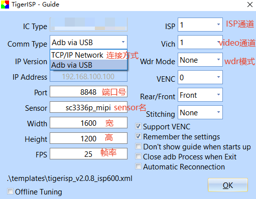

-   填写参数后进行连接， TigerISP 的日志如下代表连接成功

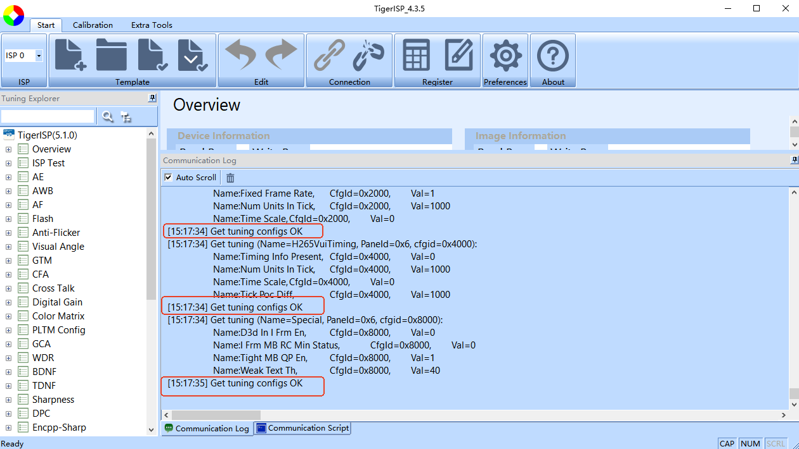

-   点击 Extra Tools 中的 Capture 后弹出 capture 窗口，点击 Dump 即可实现预览


:::note

:::note

备注

:::
:::note

-   连接 TigerISP 使用的 awTuningApp 需使用sdk默认编译出来
    
-   如果使用adb连接，却无法跳转到连接加载界面，请在板端运行 ifconfig -a ，检查是否有lo的网口配置，如没有需要确认是否将这个配置裁剪了，可与sdk中默认内核配置对比确认
    

:::

:::

#### 在线调试使用步骤

-   检查调试环境，确保调试固件能支持adb/ip的连接方式
    
-   设备上电后进入控制台，输入`ls /dev/video*`，确保有对应的 video 节点
    
-   确保小机端已运行 sample 或应用出流，并可以通过手机APP、PC端、屏幕等进行预览实时图像
    
-   准备 SDK 环境对应的 awTuningApp、TigerISP
    
-   准备SD卡，将 awTuningApp 放入卡中，插入样机。（如设备不支持SD卡，可通过 adb 将 awTuningApp 推到 tmp 目录）
    
-   如通过adb推到tmp目录，需要先执行 chmod 777 awTuningApp 给应用执行权限
    
-   小机端执行 `./awTuningApp 8848 1 &` ，注意这里传的参数与离线模式的差异
    
-   PC端运行 TigerISP 工具,并选择对应的平台，下面的两个选项均不需勾选，点击 OK
    
-   参数设置参考上面的离线调试介绍，在线调试设置参数必须与通路保持一致，不然会导致连接不上并加载参数失败
    

:::note

:::note

备注

:::
:::note

-   连接 TigerISP 使用的 awTuningApp 需使用 sdk 默认编译出来
    
-   如果使用 adb 连接，却无法跳转到连接加载界面，请在板端运行 ifconfig -a ，检查是否有 lo 的网口配置，如没有需要确认是否将这个配置裁剪了，可与 sdk 中默认内核配置对比确认
    
-   在线调试需严格根据应用或 sample 所跑的通路进行填写，不然会导致连接不上并加载参数失败，可通过 cat /sys/kernel/debug/mpp/vi 抓取节点确认
    

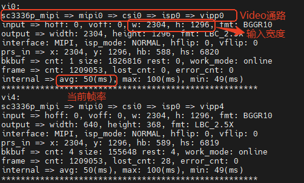

:::

:::

### TigerISP工具界面简介

| **名称** | **说明** |
| --- | --- |
| 加载参数 | 从PC本地选择一份ISP效果文件加载生效到板端 |
| 保存参数 | 将当前工具下的ISP效果文件保存到PC本地 |
| 抓取寄存器 | 抓取当前连接的sensor的寄存器配置 |
| 转换效果文件 | 进行效果文件的不同格式转换，如bin、h、dat |
| 图像标定 | 打开图像客观标定对应模块 |
| 实时预览 | 实时预览ISP处理后的YUV |
| 白平衡统计 | 预览白平衡统计的落点信息 |
| 编码预览 | 预览编码处理后的码流 |
| 编码锐化预览 | 预览编码锐化模块后的图像 |
| ISP日志 | 显示ISP各模块的debug信息，用于分析及调试 |

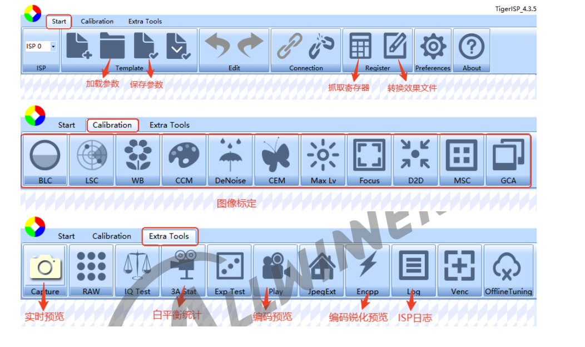

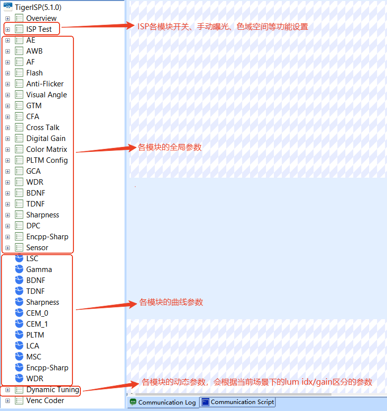

### TigerISP参数悬浮提示功能介绍

V861 TigerISP工具支持参数悬浮提示功能，使用鼠标悬浮在参数描述框上时，悬浮框会展示该参数的作用及范围。

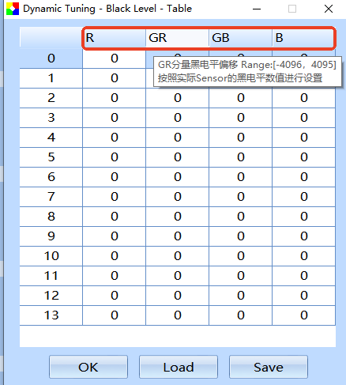

### ISP log介绍及联动关系

#### 两种联动方式介绍

ISP 有两种不同的连动关系。

ISP 的 2D 去噪、3D 去噪、色彩去噪、锐化、局部对比度、期望亮度、全局对比度、饱和度等参数都可以选择与环境亮度还是增益连动。在工具中调试这些参数时，可以看到这些参数都分成了 0~13，共 14个档位。

-   当选择与增益连动时

1 倍增益时使用第 0 档参数，

2 倍增益时使用第 1 档参数，

4 倍增益时使用第 2 档参数，

8 倍增益时使用第 3 档参数，

如 3 倍增益时，会使用第 1档与第2档参数进行线性插值，如此类推。

通过 ISP LOG 中的 TGAIN 的值可以得知当前处于什么增益下（ TGAIN 的值以 256 为 1 倍）。

-   当选择与环境亮度连动时

系统会将 AE Table 分为 350 档，通过打印 lum\_idx 的值来决定使用的档位。

当 lum\_idx 处于 0～25 之间时，使用第 0 档参数，

当 lum\_idx 为 50 时，使用第 1 档参数，

当 lum\_idx 为 75 时，使用第 2 档参数，

当 lum\_idx 为 100 时，使用第 3 档参数，

如 lum\_idx 为40时，会使用第 1档与第2档参数进行线性插值，如此类推。

通过 ISP LOG 中的 lum\_idx 的值可以得知当前处于什么档位下。

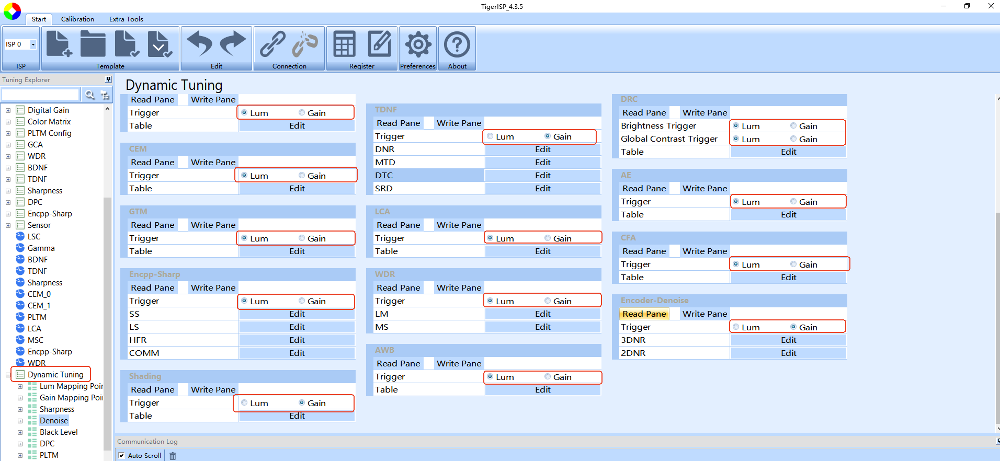

#### ISP Log的打印方式介绍

如果想打印ISP Log，有以下方式可以实现。

##### TigerISP调试工具

通过在线、离线连接上调试工具，点击 Extra Tools 中的 Log ，再点击 Dump。

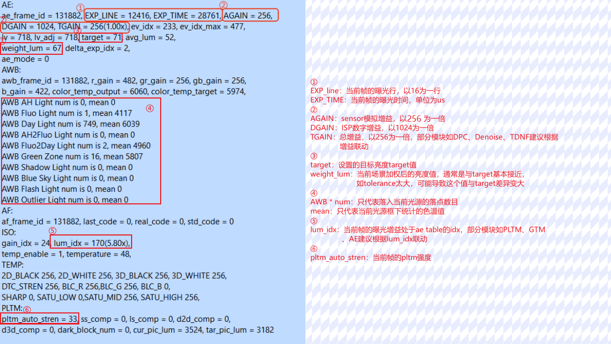

##### 修改效果参数打印等级

通过在线、离线连接上调试工具，修改效果文件里面的Log Param，打印会从串口或CMD界面输出。


如果不想连接调试工具，也可以在效果文件里面修改打印，打印会从串口打印出来。

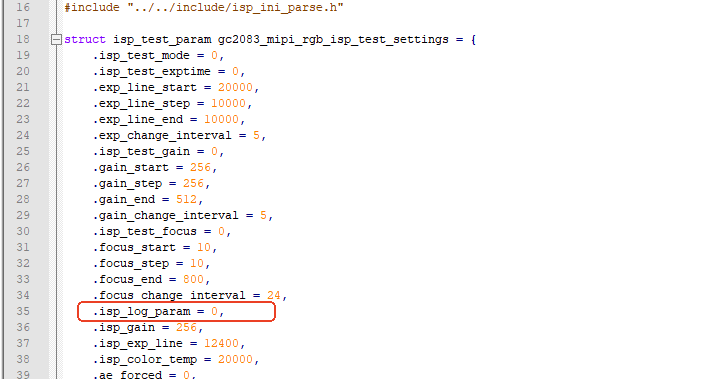

打印等级参考下述定义

```

#define ISP_LOG_AE				(1 << 0)	//0x1
#define ISP_LOG_AWB				(1 << 1)	//0x2
#define ISP_LOG_AF				(1 << 2)	//0x4
#define ISP_LOG_ISO				(1 << 3)	//0x8
#define ISP_LOG_GAMMA				(1 << 4)	//0x10
#define ISP_LOG_COLOR_MATRIX			(1 << 5)	//0x20
#define ISP_LOG_AFS				(1 << 6)	//0x40
#define ISP_LOG_MOTION_DETECT			(1 << 7)	//0x80
#define ISP_LOG_GAIN_OFFSET			(1 << 8)	//0x100
#define ISP_LOG_DEFOG				(1 << 9)	//0x200
#define ISP_LOG_LSC				(1 << 10)	//0x400
#define ISP_LOG_GTM				(1 << 11)	//0x800
#define ISP_LOG_PLTM				(1 << 12)	//0x1000
```

### ISP各模块简介及pipeline

| **名称** | **说明** |
| --- | --- |
| BLC | 提供 Sensor 相关黑电平矫正 |
| AFS | 自动曝光下，保持曝光在 10ms(50Hz)或 8.33ms(60Hz)的整数倍以达到防工频闪烁的效果 |
| AE | 硬件输出自动曝光的统计值信息，软件根据统计信息调节 Sensor 以实现自动曝光的功能 |
| AF | 硬件输出自动对焦的图像清晰度评价信息统计，软件根据统计信息调节 VCM(对焦马达)以实现自动对焦的功能 |
| WB | 硬件输出白平衡统计信息，软件根据统计信息调节 R/G/B 增益以实现自动白平衡的功能 |
| AWB | 软件自动白平衡算法开关 |
| Hist | 硬件输出直方图统计信息，软件用于辅助 AE、DRC 的计算 |
| WDR Split | Sensor 内部合成宽动态图像，将 Sensor 输出的较多的 bit 位宽数据拆分成较少 bit 位宽的数据，使拆分后的数据能被 ISP 处理 |
| WDR Stitch | 对 Sensor 输出的多帧合成为一帧宽动态图像 |
| DPC | 提供对静态坏点和动态坏点的检测和矫正功能 |
| CTC | 消除由于 Sensor 和镜头的 CRA 不匹配导致的 Cross Talk 噪声 |
| GCA | 全局色差矫正，用于矫正镜头引入的轴向色差与横向色差 |
| LCA | 局部色差矫正，用于矫正镜头引入的轴向色差与横向色差 |
| NRP | ISP 内部预 Gamma 模块，提高降噪、锐化性能 |
| D2D(Denoise) | 空域降噪 |
| D3D(TDNF) | 时域降噪，去除图像高斯噪声，使图像更平滑 |
| Dig-Gain | ISP 分通道的数字增益 |
| LSC、MSC | 用于镜头阴影矫正 |
| PLTM | 局部色调映射，可提升暗部动态范围 |
| CFA(Demosaic) | 将 Bayer 格式的 Raw 图像转化到 RGB 图像，优化 CFA 参数可减弱密集纹理区因去马赛克导致的摩尔纹现象 |
| Sharpness | 图像锐化，提高图像清晰度 |
| CCM | 通过 3x3 的矩阵和矢量偏移量完成颜色空间的线性矫正 |
| CNR | 色彩降噪 |
| DRC | 硬件动态范围控制模块 |
| PTN | 固定模式噪声 |
| GTM | 全局色调映射软件算法 |
| Gamma | 分 R G B 三通道调整图像亮度 |
| CEM | 利用 9x17x17 大小的 3D LUT 实现颜色调整操作 |
| CSC | 通过标准的 3x3 的矩阵和矢量偏移量将输入的 RGB 图像转化为 YUV |
| Encpp-Sharp | 编码器 Yuv Sharp |
| Encpp-LDCI | 局部对比度增强 |
| Enc 3Dnr | 编码器时域降噪 |
| Enc 2Dnr | 编码器空域降噪 |

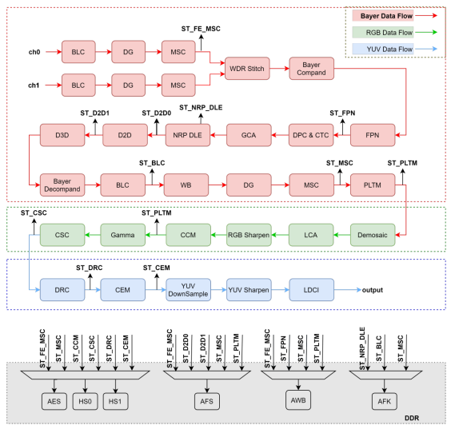

## 客观效果调试流程

### 图像调试需要完成哪些基础模块校准

客观校准是图像调试的基础，当sensor或镜头是第一次使用，需要完成客观校准后，才能得到一份初版效果，用于后续主观效果调试

| **名称** | **说明** |
| --- | --- |
| BLC | 黑电平校准，以确保图像的动态范围从真正的黑色开始 |
| AWB | 白平衡校准，以确保图像在不同光源下白色还原正常 |
| MSC | 均匀度校准，以确保图像使在整个视场中具有相同的亮度色度水平 |
| CCM | 色彩校准，以确保图像色彩的准确性 |
| D2D | 噪声校准，以确保ISP区分噪声及细节轮廓准确性 |

:::note

:::note

备注

:::
:::note

-   sensor第一次使用，需要将上述的所有校准项完成一轮校准
    
-   sensor保持不变，只更换了镜头，只需要重新校准 AWB、MSC、CCM 模块即可
    
-   校准顺序建议按照 `BLC -> AWB -> MSC -> CCM -> D2D` 进行
    

:::

:::

### BLC校准流程介绍

#### 原理简介

sensor输出数据中包含了 OB（optical black） 或 data pedestal 部分，需要去除，以免影响画面暗部表现。去除的方法是每个像素的 R、Gr、Gb、B 都减去一个值

#### 标定过程

1.使用镜头盖或其他工具遮黑sensor，确保sensor处于全黑的环境

2.离线连接上调试工具，并按照下面流程将 ISP 模块全部关闭并设置为手动曝光

3.点击 ISP Test ，在 ByPass Setting 模块，点击 All Operation 中的 disable ，关闭所有ISP模块,点击 write ，使修改生效


4.点击 ISP Test ，在 Test Attr 模块,将 TestMode 设置为 Mannual Mode ，并修改 Exposure Line 为16（16代表一行曝光行）,将 Gain 修改为256（256代表一倍增益），点击 write ，使修改生效

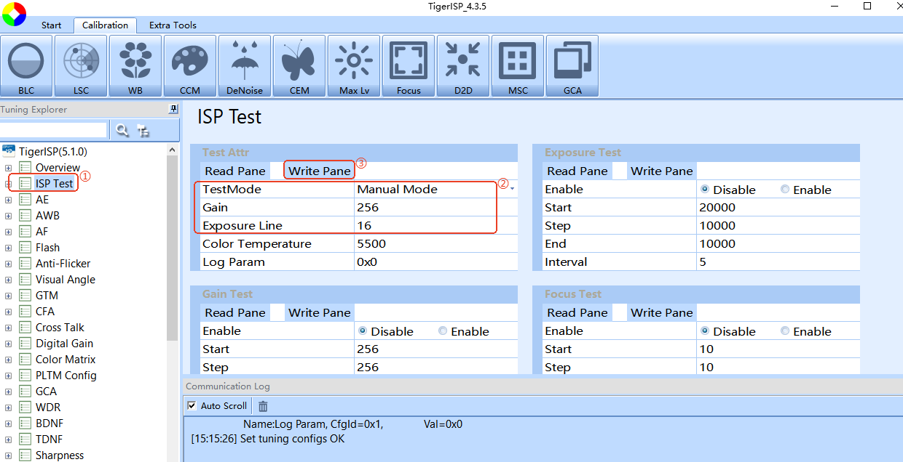

5.点击 Calibration ，再点击 BLC 按钮，跳出 BLC 标定界面后，修改预览格式为 BAYER 格式（请根据实际sensor输出的拜尔格式进行选择），点击 Dump 直到预览界面出现图像后点击 Stop


6.在 BLC 标定界面，选择对应的 Gain ，如当前使用的 Gain 为256（以256为一倍增益），那么应该选择 Gain 为0；这里的 Gain 与1.5.5中介绍的联动策略的一致，0代表1倍增益，1代表2倍增益，2代表4倍增益

7.点击 Calc 进行标定计算，计算完成后各通道均会得到一个 BLC 值

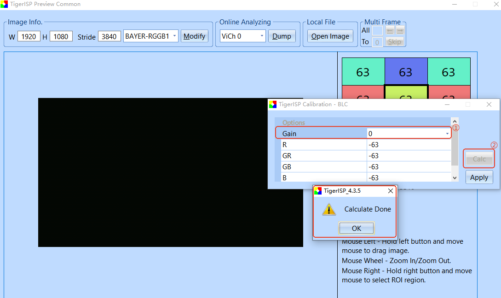

8.重新回到第4个步骤，将 Gain 修改为512（二倍增益），再依次进行5~7的步骤

9.按照上述步骤，依次完成各增益下的 BLC 校准，最后点击 Apply 将校准值写入生效

:::note

:::note

备注

:::
:::note

-   通常情况下，现在主流的CMOS sensor都是自己把 black level 处理好，然后加上一个 pedestal ，所以sensor设定的 black level 一般是准确的。因此可以与sensor原厂沟通确认 BLC 值需要设置为多少，如果sensor原厂确认的 BLC 值与 BLC 标定得到的 BLC 值差异较大，请与sensor原厂确认sensor配置

:::

:::

### AWB校准流程介绍

#### 原理简介

人眼具有独特的适应性，在一定的色温范围内，人眼无法察觉白色物体偏色，而摄像头对白色的响应却随着环境色温变化而变化。这就需要有 AWB （自动白平衡），使得摄像头拍摄的图像更接近人眼的视觉习惯。在实际操作中，是在不同色温下给予sensor输出值不同的 Rgain 与 Bgain 。而为了准确判断出当前的色温，需要事先标定出不同色温下的 RGB 响应特性

#### 标定过程

1.将设备放入灯箱中，让设备镜头对向灯箱壁

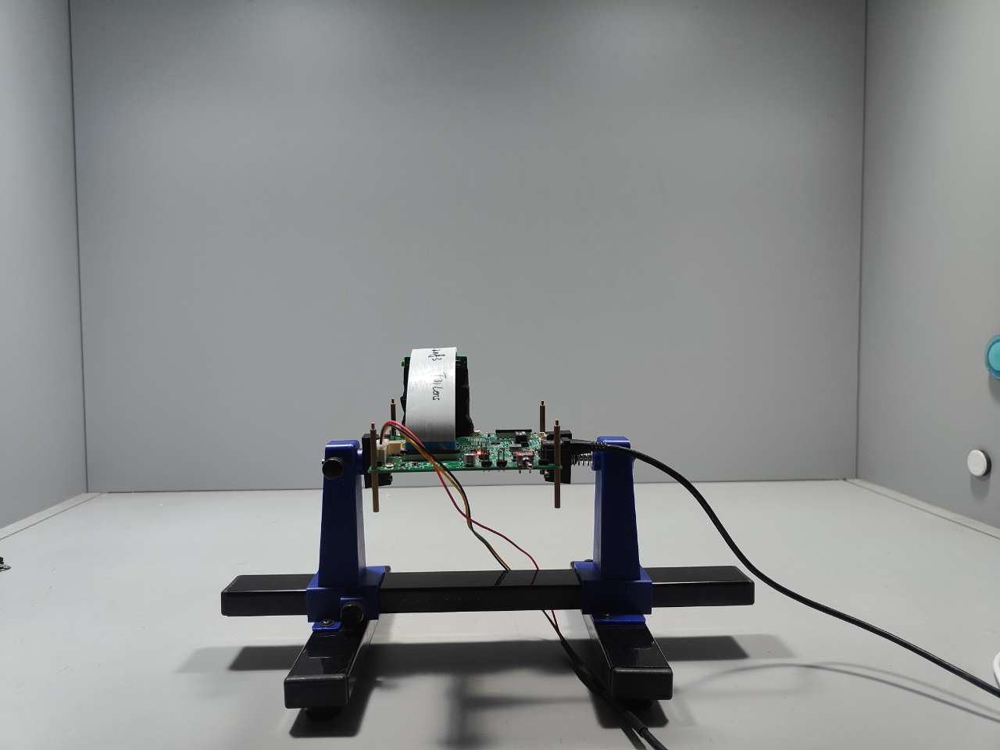

2.离线连接上调试工具，点击 ISP Test ，在 ByPass Setting 模块，点击 All Operation 中的 disable 后，将 BLC Enable ,关闭除 BLC 外的所有 ISP 模块,点击 write ，使修改生效

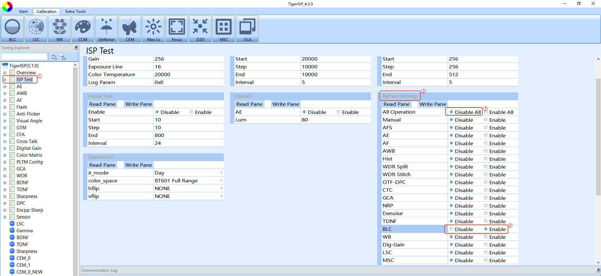

3.点击 Calibration ，再点击 WB 按钮，跳出 AWB 标定界面，打开灯箱并选择为 D65 光源

4.点击 WB 标定界面的 Get Exp （这个按钮会自动将亮度调整为合适校准的亮度），待亮度调整正常后，右击下面6500K的色温点，在弹出的界面点击 Calc

5.分别切换灯箱光源为 Tl84（4000K）、CWF（4200K）、A（2800K）、H（2200K） ，重复上面第四个步骤，完成上述几种光源的校准


6.在空白区域单击鼠标右键添加新的色温点，按照曲线分别添加 4800K、5500K 两个色温点，添加的色温点要基本符合曲线走向（如下图 AWB 标定流程6所示）


7.点击 Apply 将校准值写入生效

:::note

:::note

备注

:::
:::note

-   如灯箱有5000K、7500K的标准光源，建议按照标准光源做校准，不需要手动添加
    
-   标定完白平衡如何确认标定的准确性及如何做微调
    

1.校准完白平衡后，将 AE、AWB、WB、NRP、BLC 打开

2.点击 Extra Tools ，再点击 3A Stat 按钮，跳出 3A Stat 界面，点击 Dump

3.分别确认 D65、Tl84、CWF、A、H 光源下的落点是否落入标定的光源框内并基本在五角星区域，如有少许偏差，可手动微调光源框到落点聚集的区域

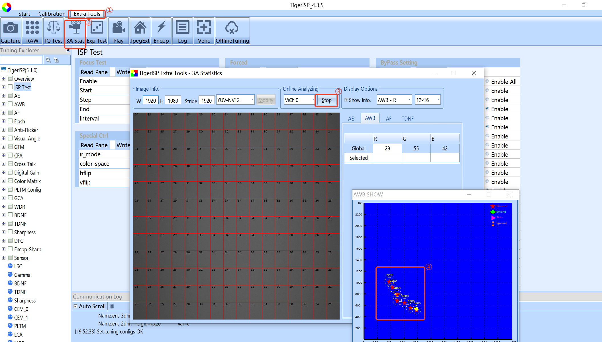

:::

:::

### MSC校准流程介绍

#### 原理简介

光通过镜头后，光强分布近似与光线角度的余弦的4次方成正比，画面中央比四周要亮（Lens shading）。其次， IR filter 对不同入射角度的光，截止频率不一样，画面中央与四周在色彩上也会不一致（Color shading）。 ISP 的 LSC 和 MSC 模块是根据像素在图像中所处的位置，给予相应的增益。 LSC 模块增益与像素离图像中心的距离有关，所以补偿增益呈同心圆分布。MSC模块增益受矩阵分配，可用于 shading 不中心对称的场景

#### 标定过程

1.将设备放入灯箱中，将设备镜头盖上毛玻璃


2.离线连接上调试工具，点击 ISP Test ，在 ByPass Setting 模块，点击 All Operation 中的 disable 后，将 BLC Enable ,关闭除 BLC 外的所有 ISP 模块,点击 write ，使修改生效


3.点击 Calibration ，再点击 MSC 按钮，跳出 MSC 标定界面，打开灯箱并选择为H光源(2800K)

4.点击 Clean All ，清除旧的 MSC 参数

5.选择 Temperature 为2200 K,点击 Get Exp ，（这个按钮会自动将亮度调整为合适校准的亮度），待亮度调整正常后，点击 Calc ，完成该光源的校准，然后将 VCM 改成 Max Code 后，再点击一次 Calc


6.分别切换灯箱光源为 Tl84（4000K）、D65（6500K） ，重复上面第五个步骤，完成上述几种光源的校准后，点击 Apply 将校准值写入生效

:::note

:::note

备注

:::
:::note

-   MSC 校准必须在sensor输出原始分辨率上进行
    
-   由于V线大部分产品均为定焦，因此 VCM 的 MinCode、Max Code 使用同一组图片标定即可，如果是变焦产品，VCM需要分别校准
    
-   建议2200K与2800K使用A光源进行校准，4000K-5500K使用Tl84光源进行校准，5500K-6500K使用D65光源进行校准
    
-   如校准的强度不够或太强，可通过调整 Compensation 的值修改校准强度
    

:::

:::

### CCM校准流程介绍

#### 原理简介

sensor对 RGB 的响应与人眼对 RGB 的响应并不一致，通过本项调试，可将sensor对 RGB 的响应调到与人眼接近，实现准确的色彩还原。在实际操作中，是将sensor输出的色彩空间通过一个色彩矩阵转化到 sRGB 色彩空间

#### 标定过程

1.将设备放入灯箱中，让设备镜头对向24色色卡，保证色卡占据画面大小 3/4 左右

2.离线连接上调试工具，点击 ISP Test ，在 ByPass Setting 模块，点击 All Operation 中的 disable 后，将 BLC、AWB、WB、NRP、MSC/LSC Enable ，点击 write ，使修改生效

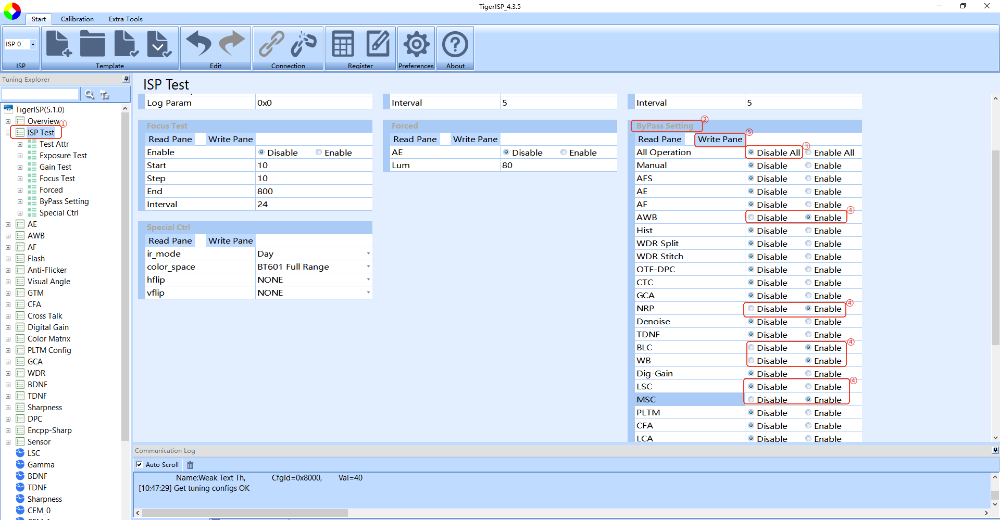

3.点击 Calibration ，再点击 CCM 按钮，跳出 CCM 标定界面，打开灯箱并选择为 D65 光源(6500K)，点击 Dump 预览到画面后 Stop ，右击鼠标将24色色卡框选上，点击 Mark As ，再点击 All 24 Blocks ，会进行24色块的标记

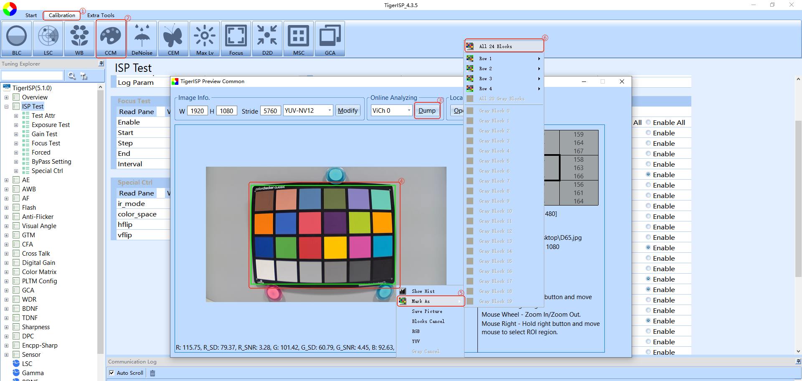

4.调整24个框的位置及大小，使其能完整落在24色色卡的每个色块上面

5.选择 Temperature 为 6500 K，将 Use Gamma 设置为 True ， Gamma File 选择 TigerISP 文件夹中的 `\data\gamma_sample.txt`

6.将 Use RGB Ref. 设置为 True ， RGB File 选择 TigerISP 文件夹中的 `\data\rgb_ref_nrp_*.txt` ，其中\*的数字选的越大，校准出来的色彩饱和度越高，建议 D65、Tl84 光源选择 rgb\_ref\_nrp\_90.txt ，A光源选择 rgb\_ref\_nrp\_80.txt

7.点击 Get Exp ，（这个按钮会自动将亮度调整为合适校准的亮度），待亮度调整正常后，点击 Calc ，完成该光源的校准

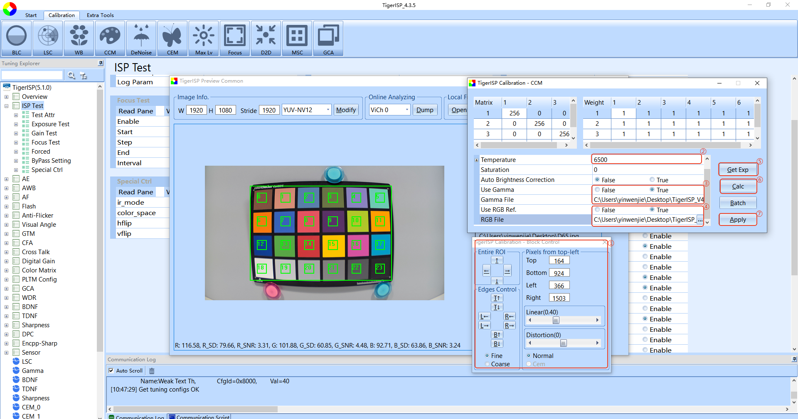

8.分别切换灯箱光源为 Tl84（4000K）、A（2800K） ，重复上面第五~第七步骤，完成上述几种光源的校准后，点击 Apply 将校准值写入生效

:::note

:::note

备注

:::
:::note

-   校准时标记24色色卡，必须确保每个框落入对应的色块，不能落出去或者出现一个框框住两个色块的情况

:::

:::

### 降噪校准流程介绍

#### 原理简介

由于不同Sensor的噪声水平差异，在不同增益下通过标定，可以更好的区分噪声及细节边缘

#### 标定过程

##### D2D

1.将设备放入灯箱中，让设备镜头对向灰阶卡，保证灰阶卡占据画面大小 3/4 左右

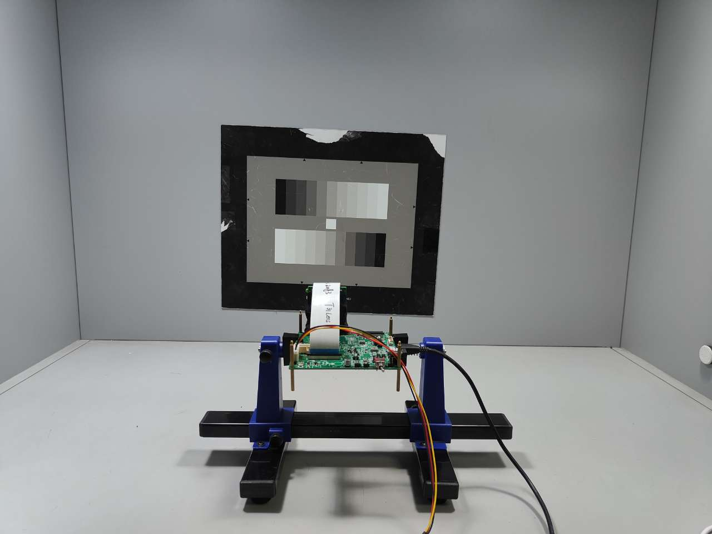

2.离线连接上调试工具，点击 ISP Test ，在 ByPass Setting 模块，点击 All Operation 中的 disable 后，将 BLC、AWB、WB、NRP、DGain Enable ，点击 write ，使修改生效

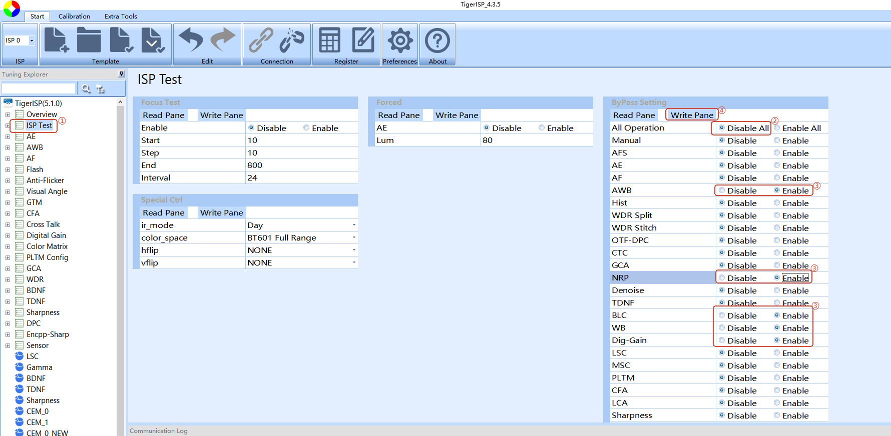

3.点击 Calibration ，再点击 D2D 按钮，跳出 D2D 标定界面，打开灯箱并选择为 D65 光源(6500K)，将需要标定的档位勾选上（建议勾选0~7即可，其中 0 代表 1倍增益，1 代表 2 倍增益，2 代表 4 倍增益，以此类推），将 Mode 设置为 D2D ，点击 Dump 预览到画面后 Stop ，手动调整曝光行数 Exposure Line ，使得在一倍增益下灰阶最亮灰块的亮度 Y 达到 220左右

4.右击鼠标将灰阶卡最亮灰块选上，点击 Mark As ，再点击 Gray Block 0 ，将第一个灰块标记上，依次勾选其他灰块并做好标记


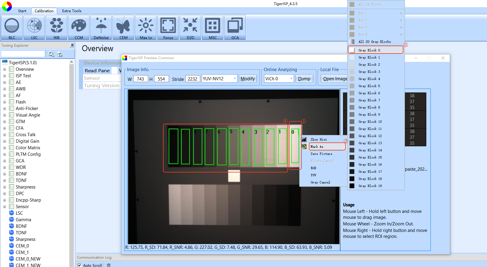

5.点击 calc ，完成各档位下的 D2D 标定

6.标定结束后，在 ISP Test->ByPass Setting 点击 Read Pane ， Denoise 模块和 CNR 模块（两者都为 D2D 降噪模块）会自动打开


7.在 BDNF 点击 Read ， D2D 降噪曲线会发生变化，点击 Apply 同步数据


8.在 Dynamic Tuning->Denoise 点击 Read Pane ， Denoise 参数发生变化，点击 Write Pane 同步数据

9.最后在 Start 菜单栏点击 Save dat File 备份 D2D 标定后的 dat 文件

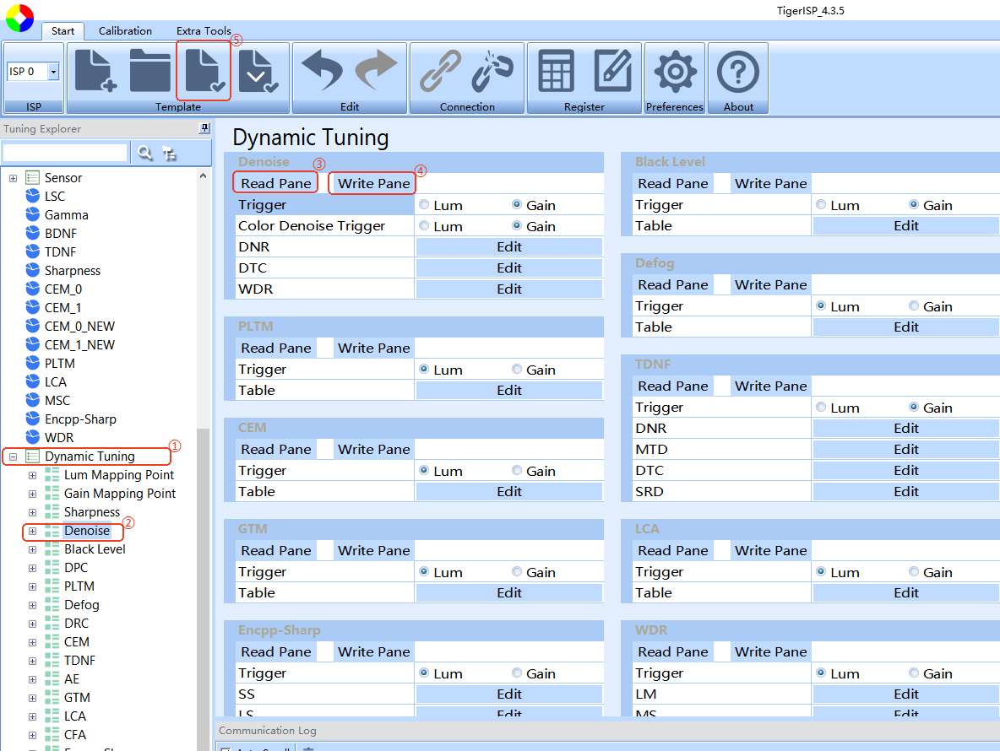

##### D3D

1.将设备放入灯箱中，让设备镜头对向灰阶卡，保证灰阶卡占据画面大小 3/4 左右


2.离线连接上调试工具，点击 ISP Test ，在 ByPass Setting 模块，点击 All Operation 中的 disable 后，将 BLC、AWB、WB、NRP、DGain Enable ，点击 write ，使修改生效


3.点击 Calibration ，再点击 D2D 按钮，跳出 D2D 标定界面，打开灯箱并选择为 D65 光源(6500K)，将需要标定的档位勾选上（建议勾选0~7即可，其中 0 代表 1倍增益，1 代表 2 倍增益，2 代表 4 倍增益，以此类推），将 Mode 设置为 D3D ，点击 Dump 预览到画面后 Stop ，手动调整曝光行数 Exposure Line ，使得在一倍增益下灰阶卡最亮灰块的亮度 Y 达到 220左右

4.右击鼠标将灰阶卡最亮灰块选上，点击 Mark As ，再点击 Gray Block 0 ，将第一个灰块标记上，注意接下来需要框选最亮灰块和次亮灰块的边界并标记为 1，之后以此类推依次框选灰块边界，最后框选灰阶卡最暗色块。注意框选灰块边界时要保证灰块边界位于中间，即两边不同灰块面积基本相等


5.点击 calc ，完成各档位下的 D3D 标定

6.标定结束后，在 ISP Test->ByPass Setting 点击 Read Pane ， TDNF 模块会自动打开


7.在 TDNF 点击 Read ， D3D 降噪曲线会发生变化，点击 Apply 同步数据


8.在 Dynamic Tuning->TDNF 点击 Read Pane ， TDNF 参数发生变化，点击 Write Pane 同步数据

9.最后在 Start 菜单栏点击 Save dat File 备份 D3D 标定后的 dat 文件


:::note

:::note

备注

:::
:::note

-   新sensor需要进行 D2D 校准，如果是旧sensor只更换了镜头，那么不需要重新进行 D2D 校准
    
-   D2D 校准时标记灰阶时，必须确保每个框落入对应的灰阶，不能落出去或者出现一个框框住两个灰阶的情况； D3D 校准时，注意框选时要保证灰块边界位于中间，即两边不同灰块面积基本相等
    
-   需确保标记的 Block0 为灰阶卡最亮灰块
    
-   D2D、D3D 校准耗时较长，请确保电脑电量充足，避免标定失败
    

:::

:::

## 主观效果调试流程

### 整体调图思路介绍

-   进行主观效果调试前，确保已完成客观效果调试；如使用的sensor没有参考的效果文件，可使用同sensor原厂的效果配置作为初版效果
    
-   图像效果调试应基本遵循亮度->对比度->色彩->清晰度的调试顺序，调试场景应包含白天户外、室内、低照度等多种场景，确保覆盖所有照度场景
    
-   亮度是图像效果的基础，当增益一定的情况下，曝光时间越长，能使得sensor接收到更多细节，但曝光时间变长，同时也容易导致运动拖影、亮区过曝等副作用，因此曝光调试应尽量对齐竞品，对比度在一定程度上会影响亮度调试时的判断，因此建议调试亮度时可以先关闭对比度模块将过曝区域调到与竞品对齐
    
-   对比度影响整体图像感官并在一定程度上会影响细节清晰度，适度调节对比度使图像动态范围更佳，并能提升细节的局部对比度
    
-   色彩分为白平衡和颜色，白平衡作用于全局，从效果上是整体图像偏色，而颜色作用于局部，从效果上是某种颜色与真实颜色的偏差。两者搭配使用，能让色彩表现更佳
    
-   清晰度分为去噪和锐化，如果噪声抹除过多，会导致细节在后期的锐化无法凸显出来，如果锐化强度过低，也会导致图像经过编码以后无法展现出来，因此当遇到清晰度问题时，先需要确认是哪里导致的问题，才能从根源解决
    

:::note

:::note

备注

:::
:::note

-   推荐使用在线调试，能确保调试效果与应用最终展示效果一致

:::

:::

### 曝光基础调试思路介绍

#### 模块参数介绍

ISP根据sensor输入raw数据，输出一份MxN分区域的AE的平均亮度统计值，驱动通过AE算法模块实时（每帧或者隔帧）对统计值进行计算， 得到对应的合适的sensor曝光时间和增益，并应用于sensor调整输出画面，使得画面亮度始终处于一个合适的水平。ISP、AE以及sensor的关系下图所示：

![自动曝光介绍]()

:::note

:::note

备注

:::
:::note

设置了Sensor曝光时间和增益的寄存器，通常不是即时生效的。ISP需要获得延迟生效的帧数，使得AE算法能配合sensor

:::

:::

**静态参数**

| 参数 | 描述 |
| --- | --- |
| Histogram Mode | 直方图统计使能，打开会统计画面直方图进行AE统计，建议默认打开 |
| Max Lv | AE 表中对应的最大亮度值。以 AE 表中最小曝光和增益设置来曝光，当图像亮度正常时，所对应的环境亮度值。例如，1350 表示 Lv13.5 |
| Ev Step | AE EV 变化的补偿/精度。数值越小，EV 步长越小，AE 越平滑，但曝光稳定时间也会变长。取值范围：\[20，40\]，建议值 40 |
| Compensation | AE补偿模块，在调用AW\_MPI\_ISP\_AE\_SetExposureBias时做亮度偏移时生效，值越大，接口偏移的亮度范围越大 |
| AE Table | AE曝光表，通常使用第一组曝光表Preview Table |
| Frame Delay | 曝光增益延迟生效帧数，通常与sensor搭配使用，避免曝光增益不同时生效导致的闪烁问题 |

**动态参数**

| 参数 | 描述 |
| --- | --- |
| Win Over-Exp | 抗过曝窗口权重 Range:\[128，1024\]，该值越大，根据窗口亮度防止过曝的效果越明显 |
| Win Under-Exp | 抗欠曝窗口权重 Range:\[128，1024\]，该值越大，根据窗口亮度防止欠曝的效果越明显 |
| Hist Over-Exp | 抗过曝直方图权重 Range:\[128，1024\]，该值越大，根据直方图防止过曝的效果越明显 |
| Hist Under-Exp | 抗欠曝直方图权重 Range:\[128，1024\]，该值越大，根据直方图防止欠曝的效果越明显 |
| Preview Speed | 预览模式AE速度 Range:\[0，31\]，该值越大，AE速度越慢 |
| Capture Speed | 拍照模式AE速度 Range:\[0，31\]，该值越大，AE速度越慢 |
| Video Speed | 录像模式AE速度 Range:\[0，31\]，该值越大，AE速度越慢 |
| Touch Speed | 触控模式AE速度 Range:\[0，31\]，该值越大，AE速度越慢 |
| Tolerance | AE容忍度 Range:\[0，15\]，该值越大，AE容忍度越高，曝光在一定范围内不会抖动 |
| Target | 期望亮度 Range:\[0，255\]，该值越大，画面亮度越亮，反之，画面亮度越暗 |
| Dark Min | 线性模式下:面光/背光场景控制 Range:\[0，63\]，WDR自动曝光比模式下:长/短帧的最小曝光比(256为1x) Range:\[1024，16384\] |
| Dark Max | 线性模式下:面光/背光场景控制 Range:\[0，63\]，WDR自动曝光比模式下:长/短帧的最大曝光比(256为1x) Range:\[1024，16384\] |
| Bright Min | 线性模式下:面光/背光场景控制 Range:\[0，63\]，WDR模式下:无作用 |
| Bright Max | 线性模式下:面光/背光场景控制 Range:\[0，63\]，WDR模式下:无作用 |
| WDR\_Rt Speed | WDR曝光比调节速度 Range:\[0，31\]，该值越大，在WDR动态曝光比模式下曝光比的调节速度越慢 |
| Face Target | 人脸曝光期望亮度 Range:\[0，255\]，人脸曝光模式下人脸区域的期望亮度 |
| Reserve1 | 预留参数，暂无作用 |
| Reserve2 | 预留参数，暂无作用 |
| Reserve3 | 预留参数，暂无作用 |

#### 调试思路介绍

##### 如何提高或降低亮度值

**Step1**：调试 AE 前，先确定好曝光表

曝光表代表了 ISP 的曝光索引，记录了最小曝光最小增益到最大曝光最大增益的索引值， AE 根据当前场景计算出当前曝光增益下的亮度值与我们的预期亮度进行对比，如果偏暗，就向上索引曝光表，提高曝光增益，如果偏亮，就向下索引曝光表，降低曝光增益

| **名称** | **说明** |
| --- | --- |
| Min Exp | 代表当前行的最小曝光值，22000代表1/22000秒 |
| Max Exp | 代表当前行的最大曝光值，20代表1/20秒 |
| Min Gain | 代表当前行的最小增益值，256代表1倍增益 |
| Max Gain | 代表当前行的最大增益值 |

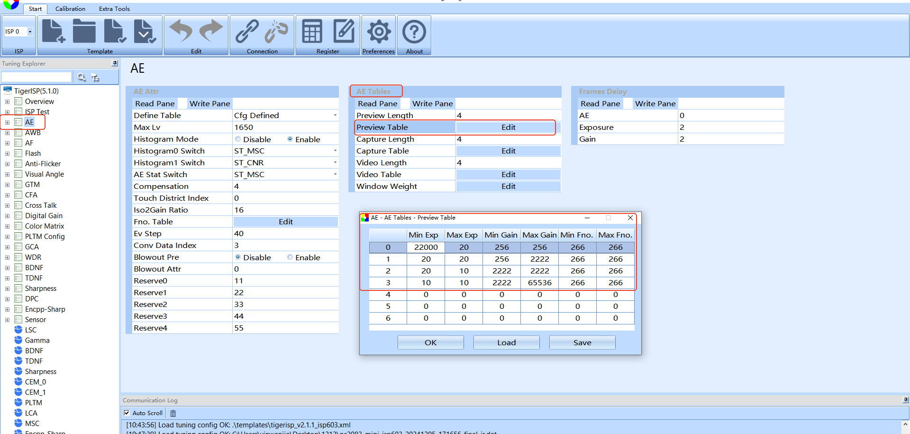

下面举例说明：

-   按照上图的曝光表，如果当前画面曝光值处于1/30秒，1倍增益的情况下，画面亮度偏暗
    
-   这个时候 AE 会按照第一行索引，继续提高曝光直到1/20秒，1倍增益，如果这时候的画面仍然偏暗
    
-   AE 就开始转到第二行，开始提高增益值，当提升到1/20秒，5倍增益（1280）后，画面亮度与期望亮度一致
    

**Step2**: 调整 Dynamic Tuning 中的 AE ， AE 通常是根据 Lum 联动，先根据当前环境下的日志确认当前跑的 Lum idx ，如下图所示，打开 log ， lum\_idx 为177（6.08X），对应 Dynamic Tuning 中的 AE 中的第6~7档参数

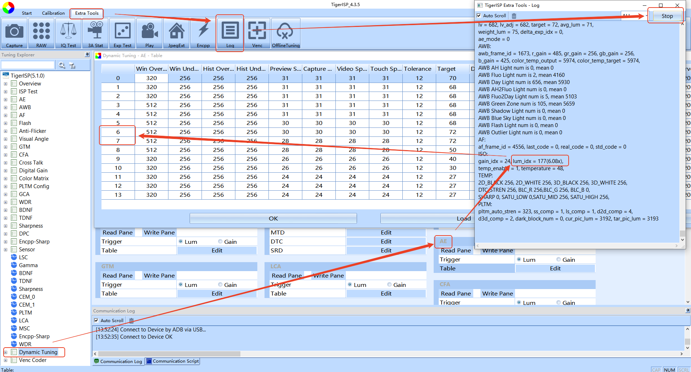

**Step3**: 如果希望将亮度降低，降低对应档位的 Target 值

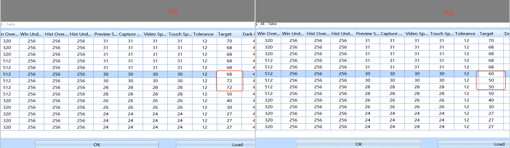

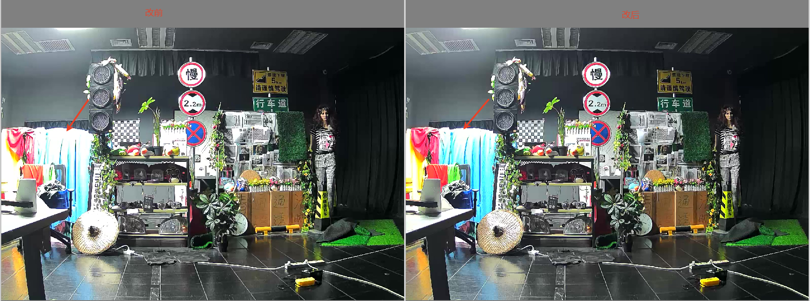

##### 如何优化白天户外过曝

**Step1**：检查曝光表，根据 Sensor 规格书确定最小曝光值，如 Sensor 最小曝光为1行，那么曝光表中的最小曝光值也需要设置为1行曝光

Sensor一行曝光时间(ms) = 1000000 / fps / vts

**Step2**：检查 AE log，确认当前是否跑到最小曝光时间及最小增益，如没有跑到，则需要降低 AE Target 来降低预期画面亮度

**Step3**：如已经跑到最小曝光时间及最小增益，那么需要确认 Sensor 驱动的曝光增益函数设置是否正确，读取 Sensor 曝光增益寄存器确认是否正确

:::note

:::note

备注

:::
:::note

-   曝光表设置务必要准守每行只调整曝光或增益的其中一个，且上一行的曝光增益最大值是下一行的曝光增益最小值
    
-   调试 AE target 值后无变化，可以将 AE 重新开关，使 AE 能正常收敛到最佳状态
    

:::

:::

### 对比度基础调试思路介绍

#### 模块参数介绍

与对比度相关的模块有 Gamma、PLTM、GTM/DRC、Encpp-LDCI 等

##### PLTM

**静态参数**

| 参数 | 描述 |
| --- | --- |
| Mode | PLTM 强度模式, 0 表示自动强度模式,1 表示手动强度模式 |
| Speed | PLTM 速度，该值越大，PLTM 强度变化越快，取值范围：\[0, 256\]，默认值：16 |
| Tolerance | PLTM 目标亮度和当前亮度之间 delta 的容忍度。该值越大，PLTM 容忍度越高，PLTM 越不容易产生震荡。  
当 delta 小于容忍度，PLTM 的强度不作变化，当 delta 大于容忍度时，PLTM 的强度开始变化。 |
| DCC Enable | PLTM 暗部对比度控制使能。打开后 PLTM 将进行暗部增益值控制，对暗部增益值根据亮度进行限制以达到增强全局对比度的作用。取值范围：\[0, 1\]，默认值：0 |
| DCC Shf Bit | 增益 PLTM 输入亮度的移位位数，移位后的亮度范围保持在\[0, 4095\]范围内，并使用移位后的亮度来进行对比度控制。线性情况下，输入亮度就是 12bit 的，此时，该参数设置为 0 即可。WDR 情况下（例如 2f-wdr@18bit），输入亮度大于 12bit，若 DCC Shf Bit 为 0，则表示 DCC 控制的亮度区域为更精细的范围（18bit 的前 4096 个亮度）。取值范围：\[0, 3\]，默认值：0 |
| DCC Lw Th | 暗部对比度控制低阈值。用于选择 DCC 系数过渡区。当亮度小于该值，则认为是完全暗部。取值范围：\[0, 4095\]，默认值：64 |
| DCC Hi Th | 暗部对比度控制高阈值。用于选择 DCC 系数过渡区。当亮度大于该值，则认为是正常非暗块。取值范围：\[0, 4095\]，默认值：256 |
| DSC Enable | PLTM 暗部饱和度控制使能。打开后 PLTM 将进行暗部饱和度控制，对暗部饱和度值进行降低，防止暗部饱和度提升过多。取值范围：\[0, 1\]，默认值：0 |
| DSC Shf Bit | PLTM 输入亮度的移位位数，移位后的亮度范围保持在\[0, 4095\]范围内，并使用移位后的亮度来进行饱和度控制。线性情况下，输入亮度就是 12bit 的，此时，该参数设置为 0 即可。WDR 情况下（例如 2f-wdr@18bit），输入亮度大于 12bit，若 DCC Shf Bit 为 0，则表示 DCC 控制的亮度区域为更精细的范围（18bit 的前 4096 个亮度）。取值范围：\[0, 3\]，默认值：0 |
| DSC Lw Th | 亮度控制低阈值。用于选择 DSC 过渡区。当亮度小于该值，则认为完全需要控制饱和度。取值范围：\[0, 4095\]，默认值：64 |
| DSC Hi Th | 亮度控制高阈值。用于选择 DSC 过渡区。当亮度大于该值，则认为不需要控制饱和度。取值范围：\[0, 4095\]，默认值：256 |

**动态参数**

| 参数 | 描述 |
| --- | --- |
| Auto Stren | 自动强度 Range:\[0，4095\]，强度越大，局部动态范围增强效果越强，图像亮度越高，反之，局部动态范围增强效果越弱 |
| Manual Stren | 手动强度 Range:\[0，4095\]，PLTM设置为手动模式时，该数值直接设置进PLTM硬件强度，PLTM为自动模式时，改数值作为PLTM初始强度 |
| Lum Ratio | 亮度明度混叠比例 Range:\[0，15\]，该值越大，亮度求取中亮度混叠比例越大，高亮区域越容易出现过曝，该值越小，明度混叠比例越大，高饱和区域越容易出现过饱和 |
| Dcc Lw Rt | 暗部对比度控制系数 Range:\[0，255\]，该值越小，暗部提亮程度越弱，反之，暗部提亮程度越强 |
| Dsc Lw Rt | 暗部饱和度调整系数 Range:\[0，255\]，该值越小，参与饱和度调整的范围越大，强度越强 |
| Min Stren Step | PLTM最小强度步长 Range:\[0，64\]，PLTM内部会根据场景中黑块数量进行控制最小强度，对应黑块数量乘以步长为最小强度 |
| Max Stren Clip | PLTM最大强度限制 Range:\[0，4095\]，用于限制当前场景PLTM的最大强度，防止暗部过分拉亮 |
| Shp HS Comp | 高频锐化补偿系数 Range:\[0，64\]，用于控制噪声的放大，该值越大，当PLTM实际强度提高时导致的噪声放大现象越弱 |
| Shp MS Comp | 中频锐化补偿系数 Range:\[0，64\]，用于控制噪声的放大，该值越大，当PLTM实际强度提高时导致的噪声放大现象越弱 |
| Shp LS Comp | 低频锐化补偿系数 Range:\[0，64\]，用于控制噪声的放大，该值越大，当PLTM实际强度提高时导致的噪声放大现象越弱 |
| D2D Comp | 空域降噪强度补偿系数 Range:\[0，4095\]，用于减弱暗部噪声，该值越大，当PLTM实际强度提高时，空域降噪的提升越强，噪声越少 |
| D3D Comp | 时域降噪强度补偿系数 Range:\[0， 4095\]，用于减弱暗部噪声，该值越大，当PLTM实际强度提高时，时域降噪的提升越强，噪声越少 |
| Darknest Rt | 亮度映射曲线插值系数 |
| Gtm Alpha | PLTM GTM映射曲线混合系数 Range:\[0，256\]，该值为256时，则完全使用PLTM GTM映射曲线，该值为0时，则完全使用线性曲线 |

##### GTM

**动态参数**

| 参数 | 描述 |
| --- | --- |
| EQ Stren | 直方图均衡曲线混叠强度 Range:\[0，255\]，该值越大，直方图均衡曲线混叠越多，直方图拉伸作用越强，对比度越高，反之，混叠越少，直方图拉伸作用越弱 |
| CDF Ratio | 局部均衡曲线与全局均衡曲线比例系数 Range:\[0，255\]，该值越小，全局均衡结果叠加越多，但部分场景变化大时容易产生跳变，该值越大，局部均衡结果叠加越多 |
| Global EQ Limit | 全局直方图均衡裁剪幅值 Range:\[0，255\]，取值越大，越不做裁剪，全局均衡效果越明显，取值越小，裁剪幅值越大，全局均衡效果越弱 |
| Local EQ Limit | 局部直方图均衡裁剪幅值 Range:\[0，255\]，取值越大，越不做裁剪，局部均衡效果越明显，取值越小，裁剪幅值越大，局部均衡效果越弱 |
| Dark Up Clip | 暗部上拉限制 Range:\[0，255\]，该值越大，限制越弱，暗部不做上拉限制，均衡效果越强，该值越小，暗部上拉限制越强，暗部不容易变亮 |
| Bright Up Clip | 亮部上拉限制 Range:\[0，255\]，该值越大，限制越弱，亮部不做上拉限制，均衡效果越强，该值越小，亮部上拉限制越强，亮部不容易变亮 |
| Dark Down Clip | 暗部下拉限制 Range:\[0，255\]，该值越大，限制越弱，暗部不做下拉限制，均衡效果越强，暗部越容易变黑，该值越小，暗部下拉限制越强，均衡效果越弱，暗部越不容易变黑 |
| Bright Down Clip | 亮部下拉限制 Range:\[0，255\]，该值越大，限制越弱，亮部不做下拉限制，均衡效果越强，亮部越容易变暗，该值越小，亮部下拉限制越强，均衡效果越弱，亮部越不容易变暗 |
| Speed | 均衡曲线生效速度 Range:\[0，32\]，该值越小，均衡曲线生效速度越快，但场景过渡时容易产生亮度跳动，该值越大，均衡曲线生效速度越慢 |
| Reserve0 | 预留参数，暂无作用 |
| Reserve1 | 预留参数，暂无作用 |
| Reserve2 | 预留参数，暂无作用 |

##### DRC

| 参数 | 描述 |
| --- | --- |
| Brightness | 亮度调节参数 Range:\[-128，128\]，该值越大，图像亮度越高，该值越小，图像亮度越低 |
| Global Contrast | 对比度调节参数 Range:\[-128，128\]，该值越大，图像对比度越高，该值越小，图像对比度越低 |

##### Encpp-LDCI

| 参数 | 描述 |
| --- | --- |
| Strength | 局部对比度均衡强度 Range:\[0，1023\]，强度越大，对比度均衡作用越明显，强度越小，对比度均衡作用越弱 |
| Dw Slope Dark | 局部均衡曲线的暗部下拉斜率控制 Range:\[0，255\]，该值越小，暗部下拉限制越弱，局部均衡暗部下拉效果越强，该值越大，暗部下拉限制越强，局部均衡暗部下拉效果越弱 |
| Dw Slope Bright | 局部均衡曲线的亮部下拉斜率控制 Range:\[0，255\]，该值越小，亮部下拉限制越强，局部均衡亮部下拉效果越弱，该值越大，亮部下拉限制越弱，局部均衡亮部下拉效果越强 |
| Up Slope Dark | 局部均衡曲线的暗部上拉斜率限制 Range:\[0，255\]，该值越小，暗部上拉限制越弱，局部均衡暗部上拉效果越强，该值越大，暗部上拉限制越强，局部均衡暗部上拉效果越弱 |
| Up Slope Bright | 局部均衡曲线的亮部上拉斜率限制 Range:\[0，255\]，该值越小，亮部上拉限制越强，局部均衡亮部上拉效果越弱，该值越大，亮部上拉限制越弱，局部均衡亮部上拉效果越强 |
| Gain Lower | 局部均衡增益的下限阈值 Range:\[0，255\]，用于限制局部均衡下拉幅度，数值越小，则越不进行限制 |
| Gain Upper | 局部均衡增益的上限阈值 Range:\[256，4095\]，用于限制局部均衡上拉幅度，数值越小，则越不进行限制 |
| Mad Ratio | 局部分块的MAD放大系数 Range:\[0，255\]，数值越大，则MAD被放大越多，更多的像素被判断为纹理而趋近于局部完全均衡，反之，则MAD被放大越少 |
| Eq Neg Enhance Stren | 局部均衡曲线下拉扩张系数 Range:\[0，255\]，数值越大，块内均衡曲线的下拉效果被放大越多，均衡效果越强，反之，则均衡效果越弱 |
| Eq Pos Enhance Stren | 局部均衡曲线上拉扩张系数 Range:\[0，255\]，数值越大，块内均衡曲线的上拉效果被放大越多，均衡效果越强，反之，则均衡效果越弱 |
| Eq Adj Ratio | 局部均衡曲线引导系数 Range:\[0，255\]，该值越小，则不调整alpha混合系数，局部均衡效果越强，该值越大，则alpha混合系数增大，局部均衡效果越弱 |

##### Gamma

| 参数 | 描述 |
| --- | --- |
| Table | Gamma曲线 table。取值范围：\[0, 4095\]，共有5条曲线，每条Gamma曲线由1024个12bit整数组成 |
| LV Tigergers | Gamma曲线Triggers。取值范围：\[0, 4095\]，必须从大到小排列 |

#### 调试思路介绍

##### 如何优化画面对比度

**Step1**：确认色彩空间是否设置正确，如果 ISP 及 VE 使用 BT709-Partrange ，但是播放器使用的是 BT709-Fullrange，就会导致画面对比度异常（详情请看本文第2.2章介绍）

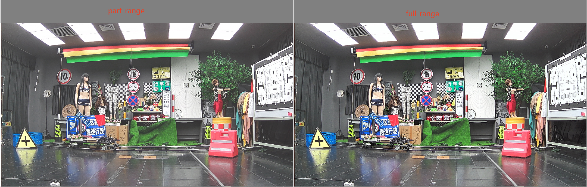

**Step2**：检查曝光是否与对比机是否一致，过曝区域应与对比机基本一致说明曝光接近

**Step3**：关闭PLTM，确认是否 PLTM 将画面提亮太多导致画面发蒙，如是，通过 DCC 模块抑制 PLTM 对暗部的提亮范围或直接降低 PLTM 强度来优化

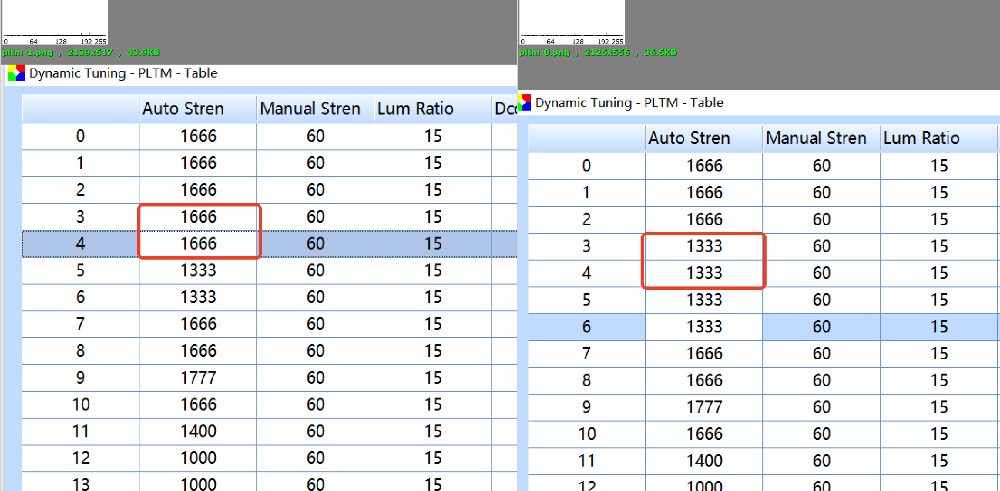

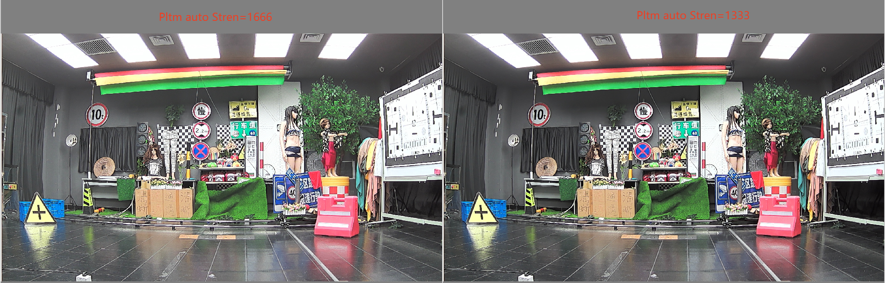

**Step4**：优化 DRC/GTM、ENCPP-LDCI 相关参数，提高整体对比度及局部对比度

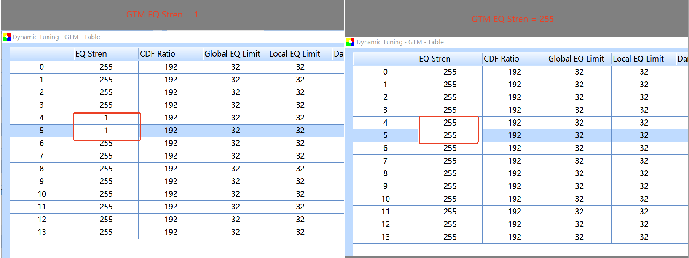

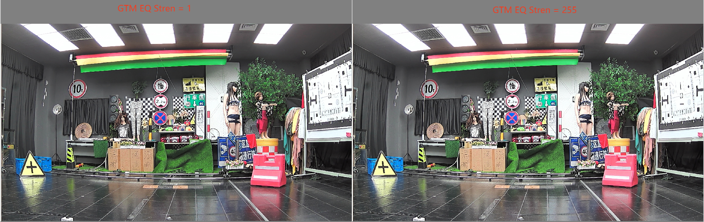

**Step5**：检查 Gamma 曲线是否合理，优化Gamma曲线使画面对比度达到最终预期效果

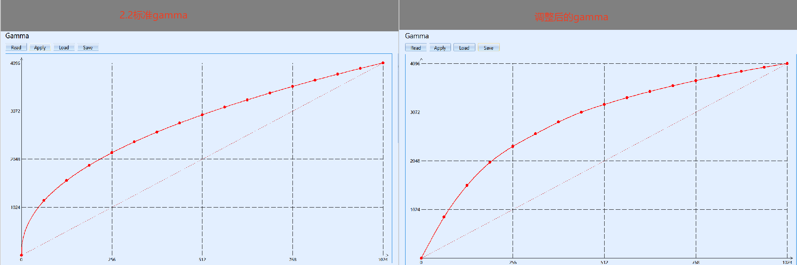

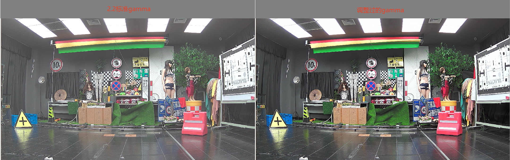

##### 如何优化暗部偏暗死黑

**Step1**：确认色彩空间是否设置正确，如果 ISP 及 VE 使用 BT709-Partrange ，但是播放器使用的是 BT709-Fullrange，就会导致画面对比度异常（详情请看本文第2.2章介绍）

**Step2**：关闭 GTM、DRC 这两个对比度相关模块，确认是否这里导致的暗部偏暗，如果是这里导致的，检查GTM的Dark Down Clip，降低该值可以减少暗部下拉强度，此外检查DRC的各参数是否为0，一般不建议通过这里调整对比度及亮度

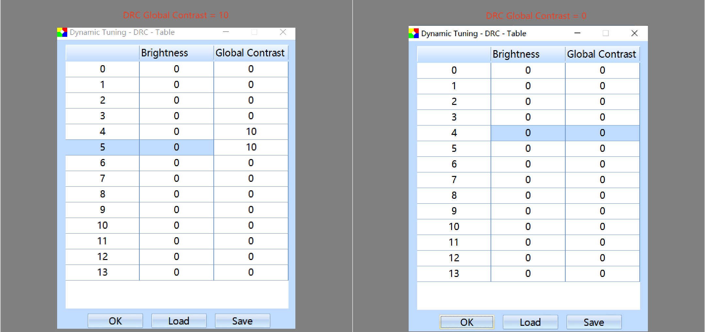

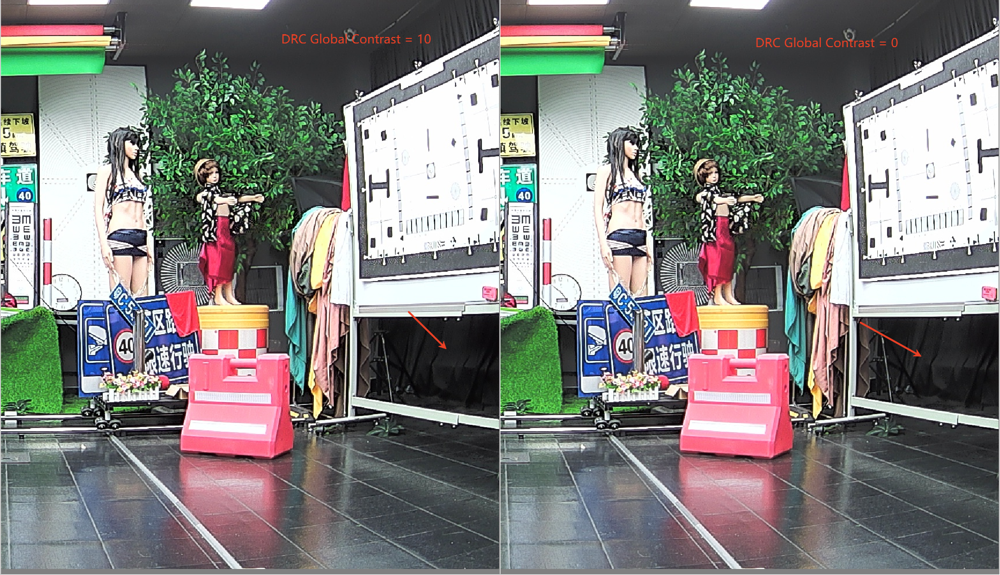

**Step3**：与对比机对比过曝区域，如果我们的过曝区域比对比机的低，可以适当提高对应档位的 Target 值，曝光值越大，画面越亮，暗部亮度也会提亮一些

AE target提高以后，画面亮度提升可能会导致pltm的强度变小，可以根据log实际情况再调整下pltm强度

**Step4**：如果暗部仍不够亮，可以通过 Gamma、Pltm 优化暗部亮度，如果当前 Pltm 强度小于 Max Stren Clip ，那么可以通过提高 Auto Stren 来提高暗部亮度

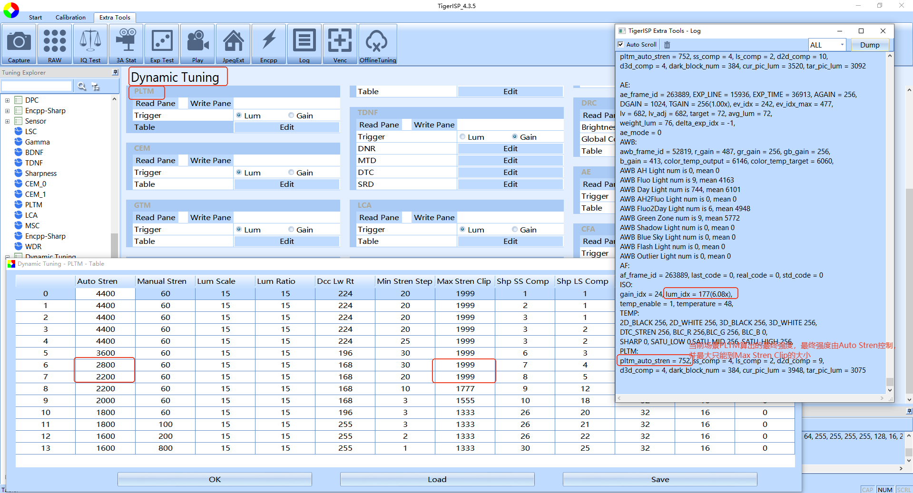

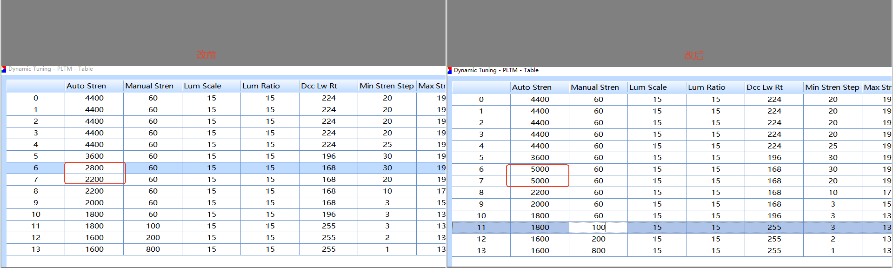

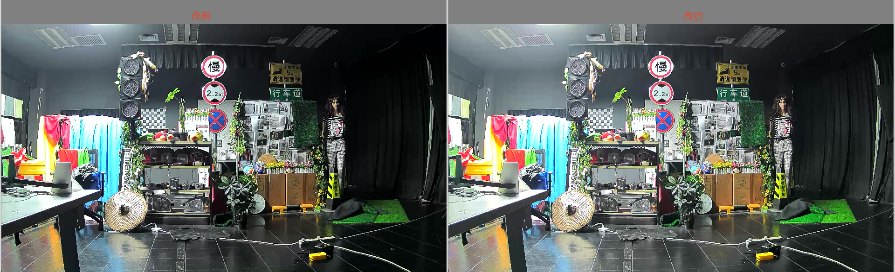

**Step5**：如果当前的 Pltm 强度等于 Max Stren Clip ,那么需要将 Max Stren Clip 提高来放开对 PLTM 强度的限制

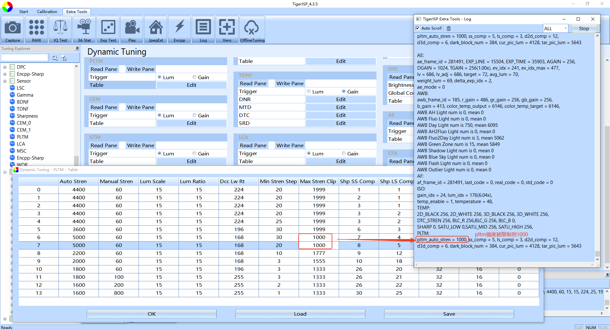

:::note

:::note

备注

:::
:::note

-   pltm强度不建议开太强，画面提亮太多易导致噪声偏大，画面对比度变低

:::

:::

### 色彩基础调试思路介绍

#### 模块参数介绍

与色彩相关的模块有 AWB、CEM、CCM 等

##### AWB

白平衡模块作用于全局，主要作用是让白色还原为白色

**静态参数**

| 参数 | 描述 |
| --- | --- |
| Color Temperature | 初始色温值。取值范围：\[0, 20000\]；0 - 以6500K作为初始色温值；其他取值 - 以isp\_color\_temp的值作为初始色温值 |
| Interval | AWB计算间隔帧数。取值范围：\[0, 255\]。取值能被10整除表示使用自适应间隔帧数，且每隔（取值+10）帧强制计算一次AWB。增大AWB计算间隔帧数可明显降低ISP的CPU占用率，但可能会导致场景变化时颜色更新不及时 |
| Speed | AWB调整速度。该值越大，速度越慢。取值范围：\[0, 47\] |
| Stat Low Lim | awb过滤低亮区域阈值，值越大，越多低亮区域不进行awb计算。取值范围：\[0, 4095\] |
| Stat Low Lim | awb过滤低亮区域阈值，值越大，越多低亮区域不进行awb计算。取值范围：\[0, 4095\] |
| Light Informarion | AWB标准光源参数，使用 AWB 标定标准光源落点，各组光源参数必须按照色温从低到高排列 |
| R Val | 标准测试光r值，取值范围：\[0, 1023\]，以256为1倍 |
| G Val | 标准测试光g值，取值范围：\[0, 1023\]，以256为1倍 |
| B Val | 标准测试光b值，取值范围：\[0, 1023\]，以256为1倍 |
| R Aim | 标准测试光还原目标r值，当awb\_light\_info\_9 > 100时有效 |
| G Aim | 标准测试光还原目标g值，当awb\_light\_info\_9 > 100时有效 |
| B Aim | 标准测试光还原目标b值，当awb\_light\_info\_9 > 100时有效 |
| Range | 统计范围，该值越大覆盖的统计值越多，AWB越灵敏，但可能会导致某些场景AWB判断不准确。 取值范围：\[0, 95\]，建议值为20 |
| Temp | 标准测试光色温,取值范围：\[0, 20000\] |
| Weight | 计算权重取值范围：\[0, 127\]。 |
| Compensation | AWB校正比例，越大还原效果越强。高于100时，在100%校正的基础上叠加自定义RGB增益（awb\_light\_info\[3-5\]），取值范围：\[0, 127\]，建议值为100 |
| Speed | AWB调整速度。该值越大，速度越慢。取值范围：\[0, 47\] |
| Lower | AWB最低色温。取值范围：\[0, 10000\]；色温低于最低色温的分块会被排除在白平衡增益的计算外 |
| Upper | AWB最高色温。取值范围：\[0, 10000\]；色温高于最低色温的分块会被排除在白平衡增益的计算外 |
| Base | AWB基准色温。取值范围：\[0, 10000\]，默认值为6500；低于6500画面会偏冷，高于6500画面会偏暖。偏差越大越明显 |
| Green Zone | AWB绿区范围。取值范围：\[0, 255\]；数值越小，越容易被判定为绿色区域。判定为绿色区域后，该分块会被排除在白平衡增益的计算外 |
| Blue Sky | AWB蓝天范围。取值范围：\[0, 255\]；数值越小，越容易被判定为蓝天区域。判定为蓝天区域后，该分块会被排除在白平衡增益的计算外 |
| Local WB Coef | 局部白平衡算法，需开启MSC模块才有效，-1：原算法，不使用局部自适应白平衡算法；0：完全使用降低饱和度的办法；1~19：组合使用自适应局部白平衡算法与降低饱和度办法；20：完全使用自适应局部白平衡算法 |

**动态参数**

| 参数 | 描述 |
| --- | --- |
| Rgain | R增益，根据用户喜好调整画面整体偏色 |
| Bgain | B增益，根据用户喜好调整画面整体偏色 |

##### CEM

**静态参数**

| 参数 | 描述 |
| --- | --- |
| CEM\_0 | CEM颜色增强表0，可调整颜色的色调饱和度亮度值 |
| CEM\_1 | CEM颜色增强表1，可调整颜色的色调饱和度亮度值 |

**动态参数**

| 参数 | 描述 |
| --- | --- |
| Ratio | CEM映射表联动系数 Range:\[0，255\]，取值为255时，则全部使用CEM0\_table的结果，取值为0时，则全部使用CEM1\_table的结果，0-255之间为CEM0/CEM1 table之间插值过渡 |
| Dark Satu | 暗部饱和度系数(影响的亮度范围0~32) Range:\[-256，256\]，该值越大，暗部饱和度越高，该值越小，暗部饱和度越低 |
| Low Li Satu | 低亮饱和度系数(影响的亮度范围32~96) Range:\[-256，256\]，该值越大，低亮区域饱和度越高，该值越小，低亮区域饱和度越低 |
| Mid Li Satu | 中亮饱和度系数(影响的亮度范围96~192) Range:\[-256，256\]，该值越大，中亮区域饱和度越高，该值越小，中亮区域饱和度越低 |
| High Li Satu | 高亮饱和度系数(影响的亮度范围192~255) Range:\[-256，256\]，该值越大，高亮区域饱和度越高，该值越小，高亮区域饱和度越低 |

##### CCM

| 参数 | 描述 |
| --- | --- |
| Low CM | 低色温CCM矩阵 |
| Mid CM | 中色温CCM矩阵 |
| High CM | 高色温CCM矩阵 |

#### 调试思路介绍

##### 如何排查偏色问题

**Step1**：确保当前镜头搭配Sensor已完成 AWB、BLC 标定，且IR-CUT状态正常， Dynamic Tuning 中的 AWB 模块参数正常，建议按照256设置，待白平衡正常后再调整偏好色

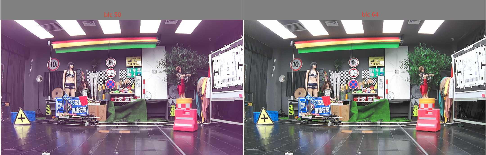

**Step2**：打开 log ，检查 awb log 是否正常，如下图 Outlier Light num 为339，说明有339个落点块未被统计到

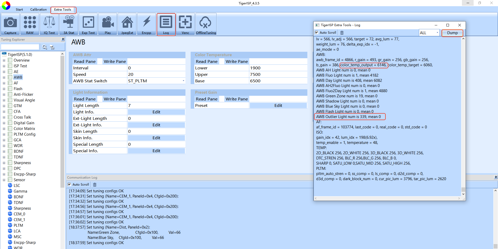

**Step3**：打开 3A Stat 后，点击 dump ，检查当前场景的落点信息


**Step4**：如落点基本未落入光源框中，需要手动移动光源框到大部分落点所在区域（或新增光源框框柱对应落点）

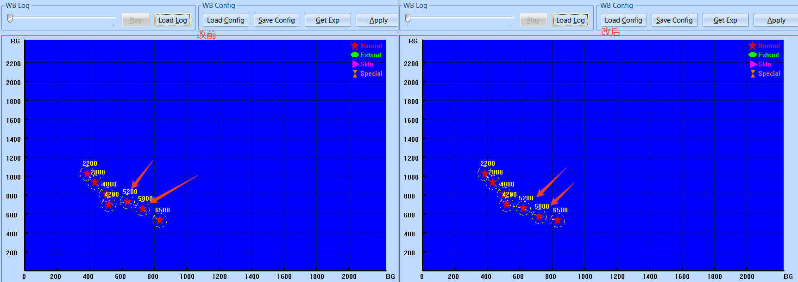


**Step5**：如果落点基本能落入光源框中，仍然有偏色现象，关闭 MSC/LSC 模块，确认是否 MSC/LSC 模块对各通道的补偿差异导致色彩异常，如是，请重新校准 MSC

**Step6**：关闭 CEM 模块，确认 CEM 曲线是否对低饱和度提升过大导致色彩异常，如关闭 CEM 后，整体色彩基本正常但整体饱和度偏低

**Step7**：按照下图方式调整 CEM 曲线解决，如果是刚开始调试， CEM 曲线建议先 Reset All 并在修改后 Save 曲线（曲线不一定完全按照下图设置，需根据实际场景在合适的位置做饱和度下拉）


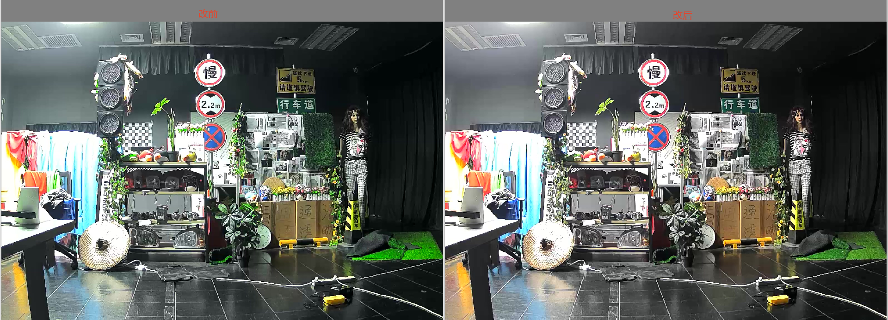

##### 如何提升整体饱和度

**Step1**：调整 Dynamic Tuning 中的 CEM ，将对应档位的参数提高，即可提高整体饱和度

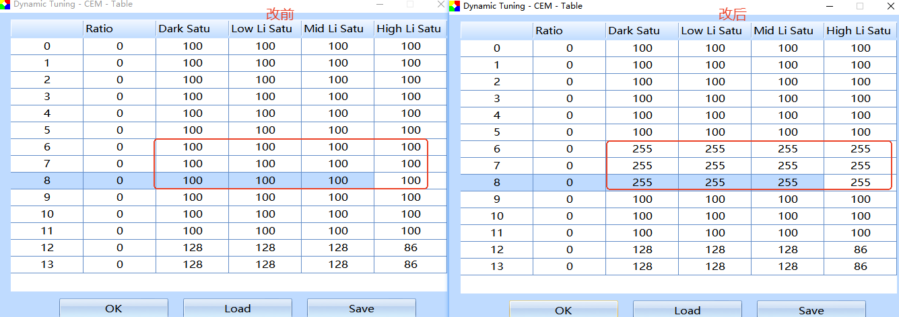

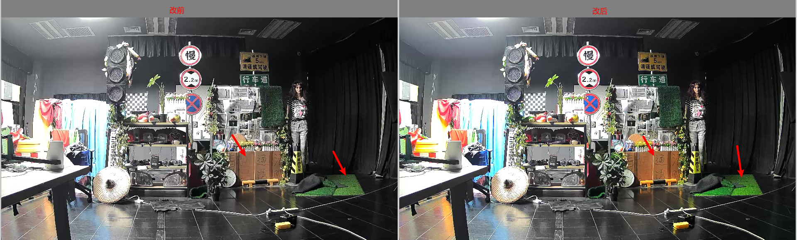

##### 如何提升绿色饱和度

**Step1**：确认整体饱和度是否与竞品接近，如果整理饱和度偏低，可以先提高 Dynamic Tuning 中的 CEM 的饱和度值

**Step2**：如果只是绿色饱和度偏低，可通过调整 CEM 曲线来优化，如果是刚开始调试， CEM 曲线建议先 Reset All 并在修改后 Save 曲线

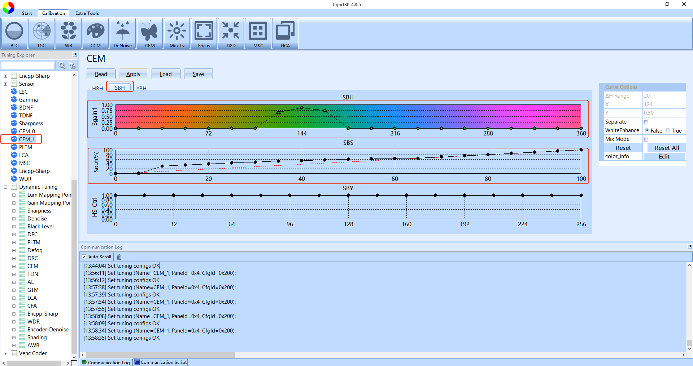

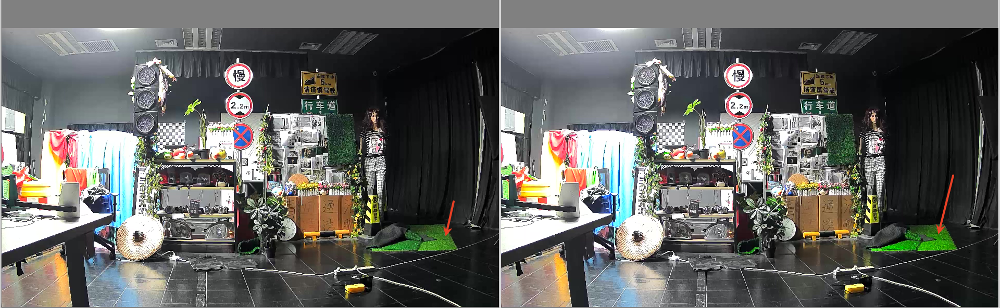

##### 如何优化肤色问题

在初步完成标定及主观调试后，由于CCM并无法将每种色彩完全还原准确，这些差异经过了CEM色彩增强后，会比较明显，比如肤色

肤色会存在的问题主要有肤色过重（饱和度偏高）、肤色偏红、肤色偏黄绿等，针对此类问题，可参考下面优化步骤进行修改

**Step1**：与竞品对齐肤色饱和度，如果整体饱和度偏高，先降低 Dynamic Tuning 中的 CEM 的饱和度值，如果降低后肤色仍然偏重，通过调整cem曲线来改善

**Step2**：人脸饱和度大致可按照下图曲线进行设置，如果肤色饱和度偏低，那么中间这条曲线可往回拉


**Step3**：修改完人脸饱和度后，如果人脸有偏黄绿的问题，可调整肤色色调，使其往红色方向偏移


##### 如何优化暗部偏色

**Step1**：检查 BLC 是否正常，进行BLC标定确认设置的值是否合理

**Step2**：关闭 PLTM 模块，检查目标区域是否有明显偏色，如果并非 PLTM 拉亮导致暗部偏色，那么建议可以通过 CEM 模块，降低暗部饱和度的方式进行抑制

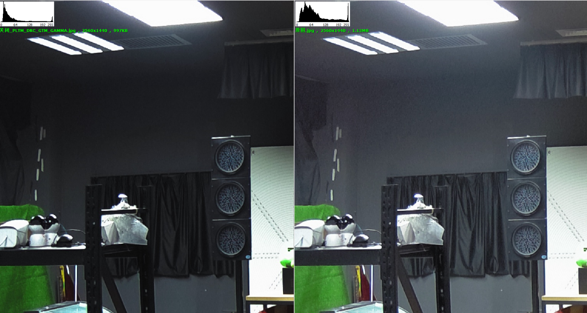

**Step3**： PLTM 拉升暗部亮度时，同时也会放大暗部的色噪，如果确认是 PLTM 导致，先关闭 PLTM 后，检查暗部区域亮度均值，估算 DSC 的亮度阈值范围，如本图的暗部亮度均值为28（8bit）

**Step4**：由于 DSC 亮度范围为12bit，所以换算后亮度值为28x16=448，那么可以将亮度阈值定在448左右，调试时适当偏移

**Step5**：将亮度的低阈值定在466，那么图像中亮度小于466的区域暗部饱和度抑制程度最大，处于466-768范围内抑制程度逐渐衰减，大于768的区域不受抑制，并适当调整 Ratio 直到调整前后抑制效果明显，可以较好地改善偏色现象


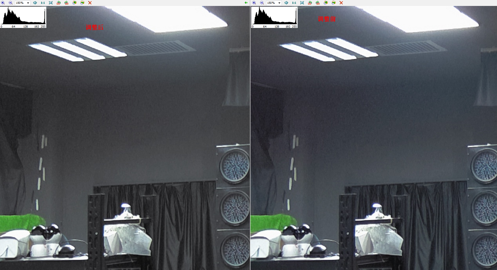

##### 如何修改白平衡统计窗口大小

针对行车类产品或户外摄像头设备，可能会存在上半部分蓝天区域被误纳入白平衡统计，导致白平衡异常，画面偏黄，针对此类问题，可以通过修改白平衡统计窗口大小，将白平衡统计改为只统计下半部分图像来优化此类问题

统计窗口是将全图坐标归一化到\[-1000,1000\]，那么如果想让awb只计算画面的下半部分，可以调整AE Reserve3设置为1，使白平衡只针对画面下半部分计算

![修改白平衡统计窗口示例1]()

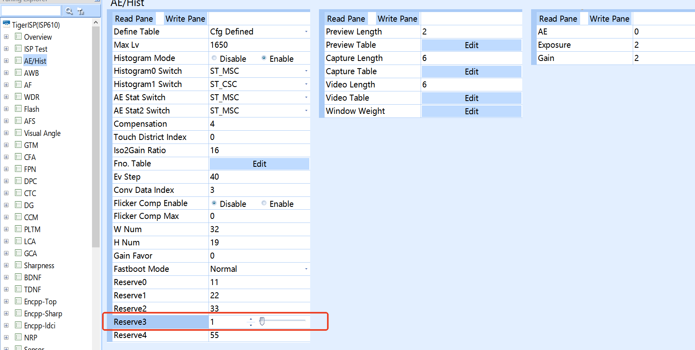

##### 如何优化混淆色

**为什么会出现白平衡混淆色？**

由于当前主流的白平衡算法都是使用灰块统计的方式，有部分特殊场景（如蓝天、肤色、绿植、黄土地等），容易被判断为灰块进行收白，从而导致白平衡异常

通常混淆色会导致的颜色异常包含有：

蓝天 - 大面积蓝天会被判定为高色温，导致蓝天收白，导致白平衡严重偏黄

肤色 - 大面积肤色会被判定为中色温，在室内正常日光灯下会导致轻微偏蓝

绿植 - 大面积绿植如果落入统计框，会导致白平衡偏紫

黄土地 - 大面积黄土地会被判定为低色温，导致图像偏蓝

**如何优化白平衡混淆色？**

**Step1**：降低对应光源框的range，通常混淆色与我们标定的色温标准落点会有一定偏差，降低range，可以一定程度上将这些混淆色剔除，避免纳入白平衡收白的落点中

**Step2**：如果是大面积绿植导致偏色，还可以通过调整Green Zone来优化，此值越小，绿植对白平衡的影响会降低，但如果白平衡标定数据不够准确或此值写的太小，可能会导致图像偏绿

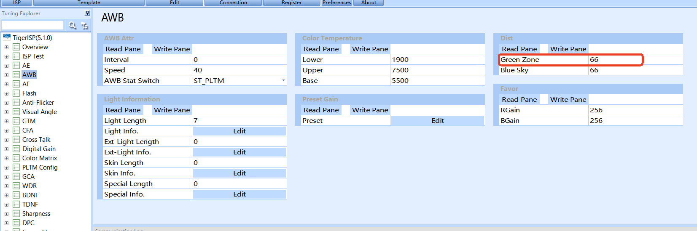

**Step3**：除上述的修改方案外，如果检查awb落点落入了多个色温下，可以将混淆色对应的色温的权重写小，来减小混淆色对整体白平衡的影响

**Step4**：如果是大面积蓝天场景导致偏色，还可以修改白平衡统计窗口，将白平衡统计改为只统计下半部分图像来优化

:::note

:::note

备注

:::
:::note

-   CEM 曲线修改后请保存曲线，避免后面关闭工具后加载参数无法查看
    
-   CEM 曲线修改要相对平滑，避免色彩过渡不均匀
    

:::

:::

### 清晰度基础调试思路介绍

#### 模块参数介绍

与清晰度相关的模块有 DPC、BDNF、TDNF、Sharpness、Encpp-Sharp 等

##### DPC

DPC模块用于去除sensor坏点，V861 支持静态坏点标定

**静态参数**

| 参数 | 描述 |
| --- | --- |
| Dynamic Corr Enable | 动态坏点校正使能 |
| Static Corr Enable | 静态坏点校正使能 |
| Static Cnt Calibra | 静态坏点标定的坏点数 |

**动态参数**

| 参数 | 描述 |
| --- | --- |
| Hot Ratio | 亮坏点检测强度系数 Range:\[0，511\]，该值越小，越容易被检测为亮坏点，坏点越少，反之，则越不容易检测为亮坏点，坏点越多 |
| Cold Ratio | 暗坏点检测强度系数 Range:\[0，511\]，该值越小，越容易被检测为暗坏点，坏点越少，反之，则越不容易检测为暗坏点，坏点越多 |
| Hot Ns Th | 去亮坏点检测噪声阈值 Range:\[0，4095\]，该值越大，越多像素会被识别为噪声，不会进行去坏点处理，去坏点效果越弱，反之，则越多的像素参与去坏点处理，去坏点效果越强 |
| Cold Ns Th | 去暗坏点检测噪声阈值 Range:\[0，4095\]，该值越大，越多像素会被识别为噪声，不会进行去坏点处理，去坏点效果越弱，反之，则越多的像素参与去坏点处理，去坏点效果越强 |
| Nbhd | 相同颜色通道的3x3像素SMAD比例阈值 Range:\[0，511\]，该值越大，保持纹理的能力越强，去坏点能力越弱，该值越小，保持纹理的能力越弱，去坏点能力越强 |
| Nearest | 最邻近3x3像素的SMAD比例阈值 Range:\[0，511\]，该值越大，保持纹理的能力越强，去坏点能力越弱，该值越小，保持纹理的能力越弱，去坏点能力越强 |
| Cold Abs Th | 检测为暗坏点的绝对阈值 Range:\[0，4095\]，该值越大，暗坏点的检测范围越大，被检测出的暗坏点越多，反之，被检测出的暗坏点越少 |
| Sup Twinkle Hi | 抑制闪烁上限阈值 Range:\[0，127\]，下限和上限的范围越大，参与闪烁抑制的像素越多 |
| Sup Twinkle Low | 抑制闪烁下限阈值 Range:\[-128，126\]，下限和上限的范围越大，参与闪烁抑制的像素越多 |
| Satu Lum Thr | RGB饱和度边缘保护亮度绝对阈值 Range:\[0，4095\]，亮度低于该值的像素不进行RGB饱和度边缘保护，反之，亮度高于该值的像素会进行RGB饱和度边缘保护 |
| Satu Min Val | RGB饱和度均值绝对差的最小阈值 Range:\[0，127\]，该值越小，像素越容易参与RGB饱和度边缘保护，该值越大，则越少像素参与RGB饱和度边缘保护 |
| Satu Prot Ratio | RGB饱和度边缘保护的强度系数 Range:\[0，512\]，取值越大，则边缘保护能力越强，同时矫正能力也会越弱，取值越小，边缘保护能力越弱，矫正能力会越强 |

##### BDNF

**静态参数**

| 参数 | 描述 |
| --- | --- |
| Mot Info Enable | 空域降噪运动信息参考使能，一般建议默认打开 |
| Block Dnr Enable | 局部降噪强度控制使能，一般建议默认打开 |
| Block Dnr Apply At | 局部降噪强度表应用位置选择 |
| LL Scale Sel | 顶层像素下采样抽样像素点模式，(使用建议值即可一般不建议调整) |
| Lyr0 Nr Y Enable | LYR0层降噪滤波开关，一般建议默认打开 |
| Lyr1 Nr Y Enable | LYR1层降噪滤波开关，一般建议默认打开 |
| Lyr2 Nr Y Enable | LYR2层降噪滤波开关，一般建议默认打开 |
| Out Sel | 调试信息输出节点 |
| Out Sel Mode(WDR) | 调试信息节点输出模式(仅在WDR模式有效) |
| CNR CV Mode | 色度降噪曲线模式控制选择 |
| Fltpd Y Str | 参考帧基础滤波器亮度强度，该值越大，代表顶层滤波器结果中参考帧基础滤波结果作用的占比越大，反之，则顶层滤波器结果中参考帧基础滤波结果作用的占比越小 |
| Fltpd Cb Str | 参考帧基础滤波器色度CB分量强度，该值越大，代表顶层滤波器结果中参考帧基础滤波结果作用的占比越大，反之，则顶层滤波器结果中参考帧基础滤波结果作用的占比越小 |
| Fltpd Cr Str | 参考帧基础滤波器色度CR分量强度，该值越大，代表顶层滤波器结果中参考帧基础滤波结果作用的占比越大，反之，则顶层滤波器结果中参考帧基础滤波结果作用的占比越小 |
| LYR0 Nr Crt | LYR0的色度NLM降噪滤波开关，该值越小，代表色度不进行降噪直接输出，该值越大，代表色度降噪越强 |
| LYR1 Nr Crt | LYR1的色度NLM降噪滤波开关，该值越小，代表色度不进行降噪直接输出，该值越大，代表色度降噪越强 |
| LYR2 Nr Crt | LYR2的色度NLM降噪滤波开关，该值越小，代表色度不进行降噪直接输出，该值越大，代表色度降噪越强 |
| Cnt Ratio0 | 2D降噪输出给3D降噪的Count信息权重，需满足sum(Cnt Ratio)=20 |
| Cnt Ratio1 | 2D降噪输出给3D降噪的Count信息权重，需满足sum(Cnt Ratio)=20 |
| Cnt Ratio2 | 2D降噪输出给3D降噪的Count信息权重，需满足sum(Cnt Ratio)=20 |
| WDR Lm Lw Slp | 用于控制WDR合成区偏长曝光的降噪强度 |
| WDR Lm Hi Slp | 用于控制WDR合成区偏短曝光的降噪强度 |
| WDR Lm Max Clip | 用于控制最大降噪强度增益 |
| WDR Ms Lw Slp | 用于控制WDR合成区偏长曝光的降噪强度 |
| WDR Ms Hi Slp | 用于控制WDR合成区偏短曝光的降噪强度 |
| WDR Ms Max Clip | 用于控制最大降噪强度增益 |

**动态参数**

| 参数 | 描述 |
| --- | --- |
| Black Gain | 亮度降噪曲线暗部区域增益 Range:\[0，4095\]，该值越小，暗部区域的空域降噪越弱，该值越大，暗部区域的空域降噪越强 |
| White Gain | 亮度降噪曲线亮部区域增益 Range:\[0，4095\]，该值越小，亮部区域的空域降噪越弱，该值越大，亮部区域的空域降噪越强 |
| Fltpd Y Thr | 参考帧基础滤波器亮度阈值强度滤波器 Range:\[0，255\]，该值越小，亮度判断越严格，越不容易发生纹理被抹平，对应的亮度降噪强度越弱，反之，则越容易发生纹理被抹平，对应的亮度降噪强度越强 |
| Fltpd C Thr | 参考帧基础滤波器色度阈值强度滤波器 Range:\[0，255\]，该值越小，色度判断越严格，越不容易发生色度混叠，对应的色度降噪强度越弱，反之，则越容易发生色度混叠，对应的色度降噪强度越强 |
| Fltpc Y Thr | 参考帧色度滤波器亮度阈值强度滤波器 Range:\[0，255\]，该值越小，亮度判断越严格，越不容易发生色度混叠，对应的色度降噪强度越弱，反之，则越容易发生色度混叠，对应的色度降噪强度越强 |
| Fltpc C Thr | 参考帧色度滤波器色度阈值强度滤波器 Range:\[0，255\]，该值越小，色度判断越严格，越不容易发生色度混叠，对应的色度降噪强度越弱，反之，则越容易发生色度混叠，对应的色度降噪强度越强 |
| Fltpc C Stren | 参考帧色度滤波器色度强度CB和CR分量 Range:\[0，255\]，该值越大，代表顶层滤波器结果中参考帧色度滤波结果作用占比越大，反之，则作用越小 |
| Nr C Gain | 色度NLM滤波器增益 Range:\[0，4095\]，该值越大，代表色度降噪越强，反之，则色度降噪越弱 |
| LYR0 Nr Ybk Gain | LYR0 YBK曲线增益 Range:\[0，4095\]，该值越大，运动判断越敏感 |
| LYR1 Nr Ybk Gain | LYR1 YBK曲线增益 Range:\[0，4095\]，该值越大，运动判断越敏感 |
| LYR2 Nr Ybk Gain | LYR2 YBK曲线增益 Range:\[0，4095\]，该值越大，运动判断越敏感 |
| Mot Sens Ratio | 运动灵敏控制寄存器，用于动静区降噪强度控制 Range:\[0，127\]，该值越大，代表内部对运动判断越灵敏，反之，则代表内部对运动判断越不灵敏 |
| Block Dnr Rt | 边缘区域降噪强度控制系数 Range:\[0，4095\]，该值越大，边缘区域降噪效果越强，该值越小，边缘区域降噪强度越弱 |
| Y Motion | 运动区域降噪强度控制系数 Range:\[0，255\]，该值越大，运动区域的降噪越强，反之，的运动区域的降噪越弱 |
| Y Static | 静止区域降噪强度控制系数 Range:\[0，255\]，该值越大，静止区域的降噪越强，反之，的静止区域的降噪越弱 |
| HF White Stren | DTC白边强度 Range:\[0，4095\]，该值越大，细节白边增强作用越明显，同时噪声放大越明显，该值越小，细节白边增强作用越弱 |
| HF Black Stren | DTC黑边强度 Range:\[0，4095\]，该值越大，细节黑边增强作用越明显，同时噪声放大越明显，该值越小，细节黑边增强作用越弱 |
| HF White Clip | DTC白边过冲控制 Range:\[0，4095\]，用于限制DTC增强引入的噪声波动 |
| HF Black Clip | DTC黑边过冲控制 Range:\[0，4095\]，用于限制DTC增强引入的噪声波动 |
| Coring Ratio | DTC Coring系数，用于控制弱纹理或噪声的抑制程度 Range:\[0，255\]，该值越大，弱纹理或噪声越容易被抑制，反之，则抑制作用越弱 |
| LYR0 Nr Dlt Clip | LYR0最终降噪后结果与guass结果限制 Range:\[0，4095\]，该值越小，图像越接近guass结果，画质越糊，反之，图像越清晰，但噪声越多 |
| LYR1 Nr Dlt Clip | LYR1最终降噪后结果与guass结果限制 Range:\[0，4095\]，该值越小，图像越接近guass结果，画质越糊，反之，图像越清晰，但噪声越多 |
| LYR2 Nr Dlt Clip | LYR2最终降噪后结果与guass结果限制 Range:\[0，4095\]，该值越小，图像越接近guass结果，画质越糊，反之，图像越清晰，但噪声越多 |
| LYR0 Dnr LM | LYR0中曝光降噪增益 Range:\[0，4095\]，该值越大，中曝光的降噪强度越高，反之，中曝光的降噪强度越弱 |
| LYR1 Dnr LM | LYR1中曝光降噪增益 Range:\[0，4095\]，该值越大，中曝光的降噪强度越高，反之，中曝光的降噪强度越弱 |
| LYR2 Dnr LM | LYR2中曝光降噪增益 Range:\[0，4095\]，该值越大，中曝光的降噪强度越高，反之，中曝光的降噪强度越弱 |
| LYR0 Dnr LMS | LYR0短曝光降噪增益 Range:\[0，32767\]，该值越大，短曝光的降噪强度越高，反之，短曝光的降噪强度越弱 |
| LYR1 Dnr LMS | LYR1短曝光降噪增益 Range:\[0，32767\]，该值越大，短曝光的降噪强度越高，反之，短曝光的降噪强度越弱 |
| LYR2 Dnr LMS | LYR2短曝光降噪增益 Range:\[0，32767\]，该值越大，短曝光的降噪强度越高，反之，短曝光的降噪强度越弱 |

##### TDNF

**静态参数**

| 参数 | 描述 |
| --- | --- |
| Motion Info Scale Sel | 3D融合单元运动信息选择 |
| Texture Ctrl Enable | 3D降噪纹理信息参考使能，一般建议默认打开 |
| Motion Ctrl Enable | 3D降噪运动信息参考使能，一般建议默认打开 |
| Block Dnr Enable | 局部降噪强度控制使能，一般建议默认打开 |
| Block Dnr Apply At | 局部降噪强度表应用位置选择 |
| Filt Out Sel | 3D降噪基本滤波单元输出选择 |
| Mot Sel | 3D降噪运动信息输出选择 |
| Out Sel | 调试信息输出节点 |
| Out Sel Mode(WDR) | 调试信息节点输出模式(仅在WDR模式有效) |
| Diff Intra Amp | 降噪过程中Intra区对于diff增益系数，(一般使用默认值即可) |
| Diff Inter Amp | 降噪过程中Inter区对于diff增益系数，(一般使用默认值即可) |
| Thr Intra Amp | 降噪过程中Intra区对于阈值的增益系数，(一般使用默认值即可) |
| Thr Inter Amp | 降噪过程中Inter区对于阈值的增益系数，(一般使用默认值即可) |
| Wdr Lm Hi Slp | 控制WDR合成区偏短曝光的降噪强度 |
| Wdr Ms Hi Slp | 控制WDR合成区偏短曝光的降噪强度 |
| Wdr Lm Lw Slp | 控制WDR合成区偏长曝光的降噪强度 |
| Wdr Ms Lw Slp | 控制WDR合成区偏长曝光的降噪强度 |
| Wdr Lm Max Clp | 控制最大降噪强度增益 |
| Wdr Ms Max Clp | 控制最大降噪强度增益 |
| Stl Stg Cth | 静止区域各阶梯count值，(一般使用默认值即可) |
| Stl Stg Kth | 静止区域K阶梯值，(一般使用默认值即可) |
| Mot Stg Cth | 运动区域各阶梯count值，(一般使用默认值即可) |
| Mot Stg Kth | 运动区域K阶梯值，(一般使用默认值即可) |

**动态参数**

| 参数 | 描述 |
| --- | --- |
| Black Gain | 低亮去噪阈值增益 Range:\[0，4095\]，该值越大，低亮区域去噪效果越强，同时拖影也更严重，该值越小，低亮区域去噪效果越弱 |
| White Gain | 高亮去噪阈值增益 Range:\[0，4095\]，该值越大，高亮区域去噪效果越强，同时拖影也更严重，该值越小，高亮区域去噪效果越弱 |
| Flt1 Thres Gain | 降噪单元1的降噪阈值相对于单元0的增益系数 Range:\[0，4095\]，该值越大，降噪单元1的去噪效果越强，该值越小，降噪单元1的去噪效果越弱 |
| SS MV DNR | 运动区域高频降噪系数 Range:\[0，4095\]，该值越小，运动场景的高频噪声闪动越大，对应拖影越小，反之，则运动场景的高频噪声闪动越小，对应拖影越大 |
| SS STL DNR | 静止区域高频降噪系数 Range:\[0，4095\]，该值越小，静止场景的高频噪声闪动越大，对应拖影越小，反之，则静止场景的高频噪声闪动越小，对应拖影越大 |
| LS MV DNR | 运动区域中频降噪系数 Range:\[0，4095\]，该值越小，运动场景的中频噪声闪动越大，对应拖影越小，反之，则运动场景的中频噪声闪动越小，对应拖影越大 |
| LS STL DNR | 静止区域中频降噪系数 Range:\[0，4095\]，该值越小，静止场景的中频噪声闪动越大，对应拖影越小，反之，则静止场景的中频噪声闪动越小，对应拖影越大 |
| Hf Cr Str | 高频红色分量去噪强度 Range:\[0，255\]，该值越大，去彩噪效果越强，反之，去彩噪效果越弱 |
| Hf Cb Str | 高频蓝色分量去噪强度 Range:\[0，255\]，该值越大，去彩噪效果越强，反之，去彩噪效果越弱 |
| Mf Cr Str | 中频红色分量去噪强度 Range:\[0，255\]，该值越大，去彩噪效果越强，反之，去彩噪效果越弱 |
| Mf Cb Str | 中频蓝色分量去噪强度 Range:\[0，255\]，该值越大，去彩噪效果越强，反之，去彩噪效果越弱 |
| NR LM AMP | 中曝光降噪增益系数 Range:\[0，4095\]，该值越大，中曝光的去噪效果越强，该值越小，中曝光的去噪效果越弱 |
| NR LMS AMP | 短曝光降噪增益系数 Range:\[0，32767\]，该值越大，短曝光的去噪效果越强，该值越小，短曝光的去噪效果越弱 |
| Block Dnr Rt | 边缘区域降噪强度控制系数 Range:\[0，4095\]，该值越大，边缘区域降噪效果越强，该值越小，边缘区域降噪强度越弱 |
| Diff Intra Sens | 降噪过程中运动差值帧内局部差异敏感度 Range:\[0，255\]，该值越大，帧内运动判断条件越宽松，越容易出现运动物体跟随噪声，反之，则帧内运动判断条件越严格，越不容易出现运动物体跟随噪声 |
| Diff Inter Sens | 降噪过程中运动差值帧间局部差异敏感度 Range:\[0，255\]，该值越大，帧间运动判断越严格，运动物体恢复越快，反之，帧间运动判断越宽松，运动物体恢复越慢 |
| Thres Intra Sens | 降噪过程中检测阈值帧内局部差异的敏感度 Range:\[0，255\]，该值越大，帧内运动判断越严格，越不容易出现运动物体跟随噪声 |
| Thres Inter Sens | 降噪过程中检测阈值帧间局部差异的敏感度 Range:\[0，255\]，该值越大，帧内运动判断越严格，运动物体恢复越快，越容易出现运动物体拖影不连续的问题 |
| STL Cycle Value | 静止区域自循环值 Range:\[0，15\]，该值越小，静止区域闪动越小，越清晰，同时在静止突然运动时也更容易产生拖影，该值越大，静止区域闪动越大，局部细节越少，但在静止突然运动时候，不容易产生拖影 |
| MOT Cycle Value | 运动区域自循环值 Range:\[0，254\]，该值越大，运动区域的噪声拖影恢复越快，对应的噪点闪动感越强，该值越小，运动区域的噪声拖影恢复越慢，对应的噪点闪动越小 |
| Cycle Dec SLP | cycle value衰减速度控制，用于控制运动区到静止区cycle递减速度 Range:\[0，15\]，该值越小，运动区的鬼影越不明显，但同时运动区的恢复速度变慢 |
| Rec Ratio Clip | 最大rec ratio控制寄存器，用于控制静止区的安静程度 Range:\[0，4095\]，该值越大，静止区域越干净 |
| Mot Sens Ratio | D3D运动敏感度 Range:\[0，127\]，该值越大，算法内部对运动越敏感 |
| HF Coring | DTC高频Coring系数 Range:\[0，255\]，该值越大，弱纹理或噪声更容易被抑制 |
| HF Black Clip | DTC高频黑边过冲限制 Range:\[0，4095\]，用于限制DTC增强引入的噪声波动 |
| HF White Clip | DTC高频白边过冲限制 Range:\[0，4095\]，用于限制DTC增强引入的噪声波动 |
| MF Coring | DTC中频Coring系数 Range:\[0，255\]，该值越大，弱纹理或噪声更容易被抑制 |
| MF Black Clip | DTC中频黑边过冲限制 Range:\[0，4095\]，用于限制DTC增强引入的噪声波动 |
| MF White Clip | DTC中频白边过冲限制 Range:\[0，4095\]，用于限制DTC增强引入的噪声波动 |
| HF Motion | 运动区域DTC高频强度控制系数 Range:\[0，1023\]，该值越大，该区域DTC处理后的高频强度越强，清晰度越高，反之，则清晰度越低 |
| HF Static | 静止区域DTC高频强度控制系数 Range:\[0，1023\]，该值越大，该区域DTC处理后的高频强度越强，清晰度越高，反之，则清晰度越低 |
| MF Motion | 运动区域DTC中频强度控制系数 Range:\[0，1023\]，该值越大，该区域DTC处理后的中频强度越强，清晰度越高，反之，则清晰度越低 |
| MF Static | 静止区域DTC中频强度控制系数 Range:\[0，1023\]，该值越大，该区域DTC处理后的中频强度越强，清晰度越高，反之，则清晰度越低 |
| HF Flat | 平坦区域DTC高频强度控制系数 Range:\[0，255\]，该值越大，该区域DTC处理后的平坦区域清晰度越高，反之，则平坦区域清晰度越低 |
| HF Texture | 纹理区域DTC高频强度控制系数 Range:\[0，255\]，该值越大，该区域DTC处理后的纹理区域清晰度越高，反之，则纹理区域清晰度越低 |
| MF Flat | 平坦区域DTC中频强度控制系数 Range:\[0，255\]，该值越大，该区域DTC处理后的平坦区域清晰度越高，反之，则平坦区域清晰度越低 |
| MF Texture | 纹理区域DTC中频强度控制系数 Range:\[0，255\]，该值越大，该区域DTC处理后的纹理区域清晰度越高，反之，则纹理区域清晰度越低 |
| D2D0 Cnr Stren | D3D输入端空域降噪前图像的去色噪强度 Range:\[0，255\]，该值越大，D3D去色噪模块对空域降噪前图像的去色噪效果越强 |
| Mv Satu | 运动区域饱和度控制 Range:\[0，255\]，该值越大，运动区域的饱和度越高，反之，则运动区域的饱和度越低 |
| Mv K Min | 运动区K值最小值CLIP值 Range:\[0，255\]，该值越大，强运动区域的D3D强度越大 |
| Mv K Ratio | 运动区K值最小值比例系数 Range:\[0，255\]，该值越大，强运动区域的D3D强度越大 |
| Mv R Min | 运动区rec\_ratio值最小值CLIP值 Range:\[0，255\]，该值越大，强运动区域的D3D强度越大 |
| Mv R Ratio | 运动区rec\_ratio值最小值比例系数 Range:\[0，255\]，该值越大，强运动区域的D3D强度越大 |
| Diff Min Clip | 参考噪声剔除过程中diff的下线值比例 Range:\[0，255\] |
| Diff Cv Clip | Diff曲线限制系数 Range:\[0，255\]，该值越大，对该区域diff值得限制效果越弱，相应噪点的闪动就会越明显 |
| Npu Face Nr | NPU人脸清晰度控制 Range:\[0，1024\]，数值越小，人脸清晰度越强，反之，则人脸清晰度越弱 |

##### Sharpness

**静态参数**

| 参数 | 描述 |
| --- | --- |
| Txt Info Enable | 纹理信息参考使能，一般建议默认打开 |
| Mot Info Enable | 运动信息参考使能，一般建议默认打开 |
| Dir Hs Val Cv Enable | 方向高频锐化值域曲线使能，一般建议默认打开 |
| Dir Ms Val Cv Enable | 方向中频锐化值域曲线使能，一般建议默认打开 |
| Dir Ls Val Cv Enable | 方向低频锐化值域曲线使能，一般建议默认打开 |
| Dir Hs Lum Cv Enable | 方向高频锐化亮度曲线使能，一般建议默认打开 |
| Dir Ms Lum Cv Enable | 方向中频锐化亮度曲线使能，一般建议默认打开 |
| Dir Ls Lum Cv Enable | 方向低频锐化亮度曲线使能，一般建议默认打开 |
| NDir Hs Val Cv Enable | 无方向高频锐化值域曲线使能，一般建议默认打开 |
| NDir Ms Val Cv Enable | 无方向中频锐化值域曲线使能，一般建议默认打开 |
| NDir Ls Val Cv Enable | 无方向低频锐化值域曲线使能，一般建议默认打开 |
| NDir Hs Lum Cv Enable | 无方向高频锐化亮度曲线使能，一般建议默认打开 |
| NDir Ms Lum Cv Enable | 无方向中频锐化亮度曲线使能，一般建议默认打开 |
| NDir Ls Lum Cv Enable | 无方向低频锐化亮度曲线使能，一般建议默认打开 |
| Sharpness Sensitive | 以应对不同清晰度的镜头，镜头越清晰，该值配的越大可以获取更精细的细节控制，反之，则应配小此值 |
| Out Sel | 调试模式输出，用于控制锐化模块的输出 |
| Stat Src | 锐化区域信息统计源选择 |
| Hs AA Ratio | 锐化高频尺度，该值越大，边缘锯齿抑制越强，对应清晰度损失也越大 |
| Hs AT Ratio | 锐化高频尺度抗过渡区系数，该值越大，将会抑制锐化过渡区域的不自然，但对应的弱纹理损失也会越大 |
| Hsv Satu Slope | 锐化色度曲线增益饱和度联动系数，该值越大，代表斜率越大，更多的低饱和度区域使用色度曲线增益，该值越小，则更少低饱和区域使用色度曲线增益 |
| Dir Vn Ratio | 方向锐化幅值的方法系数，该值越大，幅值的放大越多，弱纹理操控越精细，该值越小，弱纹理越不容易控制 |
| Dir Nms Ratio | 方向锐化非局部最大值抑制系数，该值越大，非局部最大值一直作用越强，该值越小，非局部最大值一直作用越弱 |
| Dir Nms Lw Clip | 方向锐化非局部最大值抑制作用下限，用于抑制作用的最强幅度，该值设置为0代表不做任何抑制，该值设置为255代表不允许非局部最大值进行下拉 |
| NDir Edge Slope | 无方向锐化边缘区域混叠系数下降斜率，该值越小，代表混叠系数下降斜率越小，强边缘平滑度保护将会越弱，对应强边不连续/锯齿越容易出现，该值越大，则容易造成部分清晰度不足的现象 |
| NDir Flat Slope | 无方向锐化平坦区域混叠系数下降斜率，该值越大，则代表混叠系数下降斜率越大，平坦区域噪声抑制越明显，反之，则容易出现平坦区域噪声被放大 |
| NDir Vn Ratio | 无方向锐化幅值放大系数，该值越大，对应幅值放大越多，弱纹理操控越精细，反之，弱纹理越不容易控制 |

**动态参数**

| 参数 | 描述 |
| --- | --- |
| Dth Edge Th | 高频方向锐化边缘区域阈值 Range:\[0，4095\]，阈值越小，边缘区域纹理越强，阈值越大，边缘区域纹理越弱 |
| Dth Flat Th | 高频方向锐化平坦区域阈值 Range:\[0，4095\]，阈值越小，平坦区域纹理越强，阈值越大，平坦区域纹理越弱 |
| Dth Edge Nsr | 高频方向锐化边缘区域噪声 Range:\[0，4095\]，数值越小，边缘区域的纹理越强，数值越大，边缘区域的纹理可能越弱 |
| Dth Flat Nsr | 高频方向锐化平坦区域噪声 Range:\[0，4095\]，数值越小，弱纹理和噪声保留较好，数值越大，平坦区域噪声排除越干净，纹理损失越大 |
| Black Stren | 高频方向锐化黑边强度 Range:\[0，4095\]，强度越小，黑边锐化越弱，强度越大，黑边锐化越强 |
| White Stren | 高频方向锐化白边强度 Range:\[0，4095\]，强度越小，白边锐化越弱，强度越大，白边锐化越强 |
| Black Clip Ratio | 高频方向锐化后黑边过冲控制 Range:\[0，1024\]，数值越小，黑边过冲限制越强，边缘不容易过黑，数值越大，黑边过冲限制越弱，边缘黑边越明显 |
| White Clip Ratio | 高频方向锐化后白边过冲控制 Range:\[0，1024\]，数值越小，白边过冲限制越强，边缘不容易过白，数值越大，白边过冲限制越弱，边缘白边越明显 |
| Smth Ratio | 高频尺度平滑系数 Range:\[0，256\]，数值越小，使用边缘平滑的区域越少，数值越大，使用边缘平滑的区域越多 |
| Lum Black Ratio | 高频亮度曲线暗部增强系数 Range:\[0，1023\]，数值越小，低亮区域的锐化越弱，数值越大，低亮区域的锐化越强 |
| Lum White Ratio | 高频亮度曲线亮部增强系数 Range:\[0，1023\]，数值越小，高亮区域的锐化越弱，数值越大，高亮区域的锐化越强 |
| Edge Th | 高频无方向锐化边缘区域阈值 Range:\[0，255\]，阈值越小，容易出现部分区域清晰度不足，阈值越大，强边缘平滑度保护越弱，容易出现强边锯齿/不连续现象 |
| Flat Th | 高频无方向锐化平坦区域阈值 Range:\[0，255\]，阈值越小，容易出现平坦区域噪声被放大，阈值越大，平坦区域噪声抑制越明显，容易造成清晰度下降 |
| Black Stren | 高频无方向锐化黑边强度 Range:\[0，4095\]，强度越小，黑边锐化越弱，强度越大，黑边锐化越强 |
| White Stren | 高频无方向锐化白边强度 Range:\[0，4095\]，强度越小，白边锐化越弱，强度越大，白边锐化越强 |
| Black Clip | 高频无方向锐化后黑边过冲控制 Range:\[0，4095\]，数值越小，黑边过冲限制越强，边缘不容易过黑，数值越大，黑边过冲限制越弱，边缘黑边越明显 |
| White Clip | 高频无方向锐化后白边过冲控制 Range:\[0，4095\]，数值越小，白边过冲限制越强，边缘不容易过白，数值越大，白边过冲限制越弱，边缘白边越明显 |
| Dth Edge Th | 中频方向锐化边缘区域阈值 Range:\[0，4095\]，阈值越小，边缘区域纹理越强，阈值越大，边缘区域纹理越弱 |
| Dth Flat Th | 中频方向锐化平坦区域阈值 Range:\[0，4095\]，阈值越小，平坦区域纹理越强，阈值越大，平坦区域纹理越弱 |
| Dth Edge Nsr | 中频方向锐化边缘区域噪声 Range:\[0，4095\]，数值越小，边缘区域的纹理越强，数值越大，边缘区域的纹理可能越弱 |
| Dth Flat Nsr | 中频方向锐化平坦区域噪声 Range:\[0，4095\]，数值越小，弱纹理和噪声保留较好，数值越大，平坦区域噪声排除越干净，纹理损失越大 |
| Black Stren | 中频方向锐化黑边强度 Range:\[0，4095\]，强度越小，黑边锐化越弱，强度越大，黑边锐化越强 |
| White Stren | 中频方向锐化白边强度 Range:\[0，4095\]，强度越小，白边锐化越弱，强度越大，白边锐化越强 |
| Black Clip Ratio | 中频方向锐化后黑边过冲控制 Range:\[0，1024\]，数值越小，黑边过冲限制越强，边缘不容易过黑，数值越大，黑边过冲限制越弱，边缘黑边越明显 |
| White Clip Ratio | 中频方向锐化后白边过冲控制 Range:\[0，1024\]，数值越小，白边过冲限制越强，边缘不容易过白，数值越大，白边过冲限制越弱，边缘白边越明显 |
| Lum Black Ratio | 中频亮度曲线暗部增强系数 Range:\[0，1023\]，数值越小，低亮区域的锐化越弱，数值越大，低亮区域的锐化越强 |
| Lum White Ratio | 中频亮度曲线亮部增强系数 Range:\[0，1023\]，数值越小，高亮区域的锐化越弱，数值越大，高亮区域的锐化越强 |
| Edge Th | 中频无方向锐化边缘区域阈值 Range:\[0，255\]，阈值越小，容易出现部分区域清晰度不足，阈值越大，强边缘平滑度保护越弱，容易出现强边锯齿/不连续现象 |
| Flat Th | 中频无方向锐化平坦区域阈值 Range:\[0，255\]，阈值越小，容易出现平坦区域噪声被放大，阈值越大，平坦区域噪声抑制越明显，容易造成清晰度下降 |
| Black Stren | 中频无方向锐化黑边强度 Range:\[0，4095\]，强度越小，黑边锐化越弱，强度越大，黑边锐化越强 |
| White Stren | 中频无方向锐化白边强度 Range:\[0，4095\]，强度越小，白边锐化越弱，强度越大，白边锐化越强 |
| Black Clip | 中频无方向锐化后黑边过冲控制 Range:\[0，4095\]，数值越小，黑边过冲限制越强，边缘不容易过黑，数值越大，黑边过冲限制越弱，边缘黑边越明显 |
| White Clip | 中频无方向锐化后白边过冲控制 Range:\[0，4095\]，数值越小，白边过冲限制越强，边缘不容易过白，数值越大，白边过冲限制越弱，边缘白边越明显 |
| Dth Edge Th | 低频方向锐化边缘区域阈值 Range:\[0，4095\]，阈值越小，边缘区域纹理越强，阈值越大，边缘区域纹理越弱 |
| Dth Flat Th | 低频方向锐化平坦区域阈值 Range:\[0，4095\]，阈值越小，平坦区域纹理越强，阈值越大，平坦区域纹理越弱 |
| Dth Edge Nsr | 低频方向锐化边缘区域噪声 Range:\[0，4095\]，数值越小，边缘区域的纹理越强，数值越大，边缘区域的纹理可能越弱 |
| Dth Flat Nsr | 低频方向锐化平坦区域噪声 Range:\[0，4095\]，数值越小，弱纹理和噪声保留较好，数值越大，平坦区域噪声排除越干净，纹理损失越大 |
| Black Stren | 低频方向锐化黑边强度 Range:\[0，4095\]，强度越小，黑边锐化越弱，强度越大，黑边锐化越强 |
| White Stren | 低频方向锐化白边强度 Range:\[0，4095\]，强度越小，白边锐化越弱，强度越大，白边锐化越强 |
| Black Clip Ratio | 低频方向锐化后黑边过冲控制 Range:\[0，1024\]，数值越小，黑边过冲限制越强，边缘不容易过黑，数值越大，黑边过冲限制越弱，边缘黑边越明显 |
| White Clip Ratio | 低频方向锐化后白边过冲控制 Range:\[0，1024\]，数值越小，白边过冲限制越强，边缘不容易过白，数值越大，白边过冲限制越弱，边缘白边越明显 |
| Lum Black Ratio | 低频亮度曲线暗部增强系数 Range:\[0，1023\]，数值越小，低亮区域的锐化越弱，数值越大，低亮区域的锐化越强 |
| Lum White Ratio | 低频亮度曲线亮部增强系数 Range:\[0，1023\]，数值越小，高亮区域的锐化越弱，数值越大，高亮区域的锐化越强 |
| Edge Th | 低频无方向锐化边缘区域阈值 Range:\[0，255\]，阈值越小，容易出现部分区域清晰度不足，阈值越大，强边缘平滑度保护越弱，容易出现强边锯齿/不连续现象 |
| Flat Th | 低频无方向锐化平坦区域阈值 Range:\[0，255\]，阈值越小，容易出现平坦区域噪声被放大，阈值越大，平坦区域噪声抑制越明显，容易造成清晰度下降 |
| Black Stren | 低频无方向锐化黑边强度 Range:\[0，4095\]，强度越小，黑边锐化越弱，强度越大，黑边锐化越强 |
| White Stren | 低频无方向锐化白边强度 Range:\[0，4095\]，强度越小，白边锐化越弱，强度越大，白边锐化越强 |
| Black Clip | 低频无方向锐化后黑边过冲控制 Range:\[0，4095\]，数值越小，黑边过冲限制越强，边缘不容易过黑，数值越大，黑边过冲限制越弱，边缘黑边越明显 |
| White Clip | 低频无方向锐化后白边过冲控制 Range:\[0，4095\]，数值越小，白边过冲限制越强，边缘不容易过白，数值越大，白边过冲限制越弱，边缘白边越明显 |
| Ndir Hs Mix Lw Clip | 无方向高频锐化混叠系数下限 Range:\[0，255\]，该值越小，混叠比例不做限制，越多区域无法叠加上无方向锐化，清晰度越低，该值越大，越多区域会叠加上无方向锐化，清晰度越高 |
| Ndir Hs Mix Hi Clip | 无方向高频锐化混叠系数上限 Range:\[0，255\]，该值越小，混叠比例限制越小，混叠比例限制越强，混叠的无方向锐化强度将会降低，该值越大，混叠限制越小 |
| Ndir Ms Mix Lw Clip | 无方向中频锐化混叠系数下限 Range:\[0，255\]，该值越小，混叠比例不做限制，越多区域无法叠加上无方向锐化，清晰度越低，该值越大，越多区域会叠加上无方向锐化，清晰度越高 |
| Ndir Ms Mix Hi Clip | 无方向中频锐化混叠系数上限 Range:\[0，255\]，该值越小，混叠比例限制越小，混叠比例限制越强，混叠的无方向锐化强度将会降低，该值越大，混叠限制越小 |
| Ndir Ls Mix Lw Clip | 无方向低频锐化混叠系数下限 Range:\[0，255\]，该值越小，混叠比例不做限制，越多区域无法叠加上无方向锐化，清晰度越低，该值越大，越多区域会叠加上无方向锐化，清晰度越高 |
| Ndir Ls Mix Hi Clip | 无方向低频锐化混叠系数上限 Range:\[0，255\]，该值越小，混叠比例限制越小，混叠比例限制越强，混叠的无方向锐化强度将会降低，该值越大，混叠限制越小 |
| Black Clip Ratio | 锐化最后输出的黑边过冲控制 Range:\[0，1024\]，该值越小，黑边过冲限制越强，边缘不容易过黑，数值越大，黑边过冲限制越弱，边缘黑边越明显 |
| White Clip Ratio | 锐化最后输出的白边过冲控制 Range:\[0，1024\]，数值越小，白边过冲限制越强，边缘不容易过白，数值越大，白边过冲限制越弱，边缘白边越明显 |
| Motion Ratio | 运动区域锐化比例系数 Range:\[0，255\]，该值越大，运动区域锐化越强，反之，运动区域锐化越弱 |
| Static Ratio | 静止区域锐化比例系数 Range:\[0，255\]，该值越大，静止区域锐化越强，反之，静止区域锐化越弱 |
| Flat Ratio | 平坦区域锐化比例系数 Range:\[0，255\]，该值越大，平坦区域锐化越强，反之，平坦区域锐化越弱 |
| Texture Ratio | 纹理区域锐化比例系数 Range:\[0，255\]，该值越大，纹理区域锐化越强，反之，纹理区域锐化越弱 |
| Stat Ratio | 锐化区域信息统计值归一化系数，数值越大，弱纹理的控制越精细 |
| Mot Sens Ratio | 运动区域锐化灵敏度控制，该值越大，运动时越多的像素会判断为运动状态，反之，越少的像素被判断为运动状态 |
| Red Gain | 红色锐化增益系数 Range:\[0，4095\]，数值越大，红色锐化越强，反之，则锐化越弱 |
| Yello Gain | 黄色(包括肤色)锐化增益系数 Range:\[0，4095\]，数值越大，黄色锐化越强，反之，则锐化越弱 |
| Green Gain | 绿色锐化增益系数 Range:\[0，4095\]，数值越大，绿色锐化越强，反之，则锐化越弱 |
| Blue Gain | 蓝色锐化增益系数 Range:\[0，4095\]，数值越大，蓝色锐化越强，反之，则锐化越弱 |

#### 调试思路介绍

##### 如何提升图像清晰度

**Step1**：由于 IPC、CDR 等编码产品，画质效果与编码有紧密的关系，在调试清晰度前，需要对比竞品将编码配置调整好，如码率、QP等，如果对清晰度要求较高，建议关闭编码2D、3D模块（通过应用接口设置）

**Step2**：确认好机器对焦准确，没有明显虚焦，如果存在虚焦，需要确认镜头底座与板子之间是否存在缝隙，尝试更换镜头或扭紧螺丝

**Step3**：分别关闭 Denoise、DPC 模块，确认是否去坏点强度过大或 D2D 强度过大导致细节损失（关闭后建议开关一下 TDNF ，使得画面细节重新收敛）

**Step4**：如果关闭后，细节有明显提升，检查DPC动态去坏点参数是否设置合理，V861支持静态坏点标定功能，尽量通过该方式去除坏点，再配合弱强度的动态去坏点功能优化

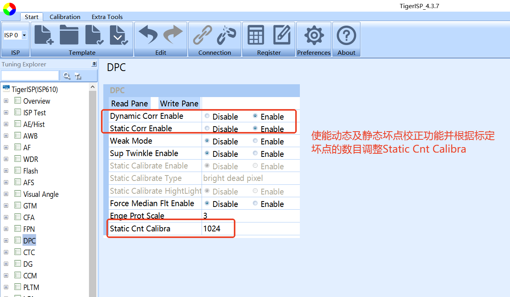

**Step5**：检查D2D参数是否合理，V861支持动静检测，可以分别对不同区域给不同的D2D去噪强度，如果D2D抹除的细节过多，可以降低下图D2D整体强度 Black Gain、White Gain 或将静止区域的D2D强度 Y Static 适当写小

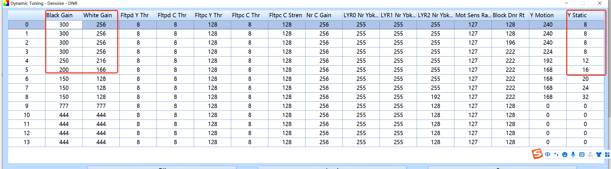

**Step6**：如果排除去噪模块影响，可通过两级锐化及LDCI功能来提高清晰度

V861 LDCI可以提高局部对比度，使得纹理轮廓表现更佳，但不建议开的太强，在运动的情况下可能会导致出现鬼影等情况

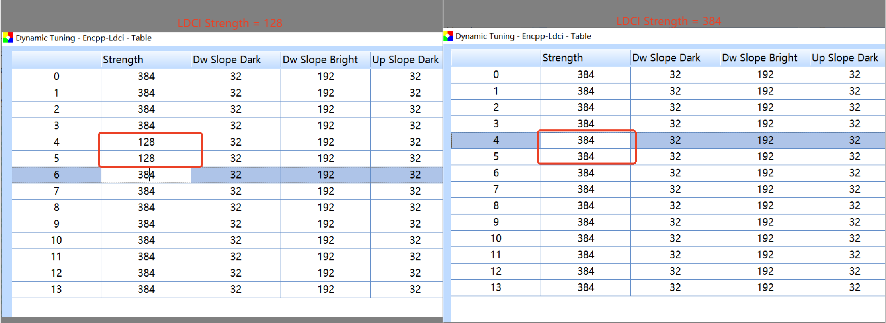

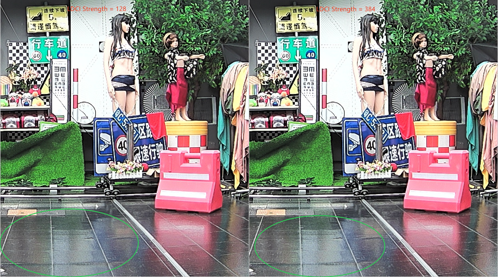

V861锐化模块相比上一代增加了高中低频、方向性及非方向性六种调试组合，且可通过Sharp Out Sel控制锐化模块的输出

推荐使用低频勾边、中高频勾纹理的方式进行锐化调试，合理利用锐化阈值对不同频率的锐化进行限制，避免锐化出边缘毛刺及噪声

如下图希望将草地纹理勾出来，如果想减少噪声出现，可以通过 MS 来尝试优化

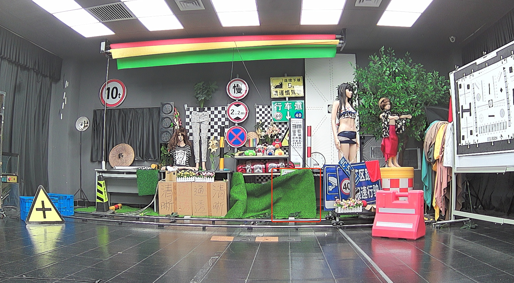

先通过 Sharp 输出的灰图确认 MS 是否有包含对该草地区域的锐化

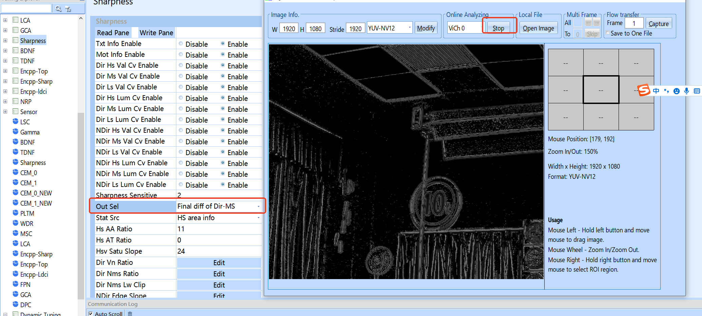

发现该区域没有在锐化区域中（标白的代表进行了锐化），通过调试 sharp MS Dth Flat Th 的锐化阈值，将该区域囊括进来

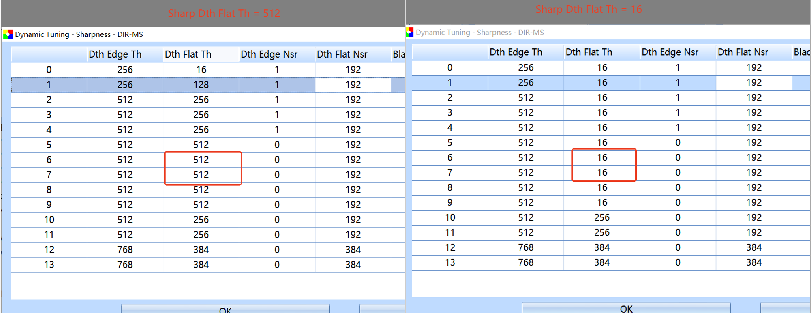

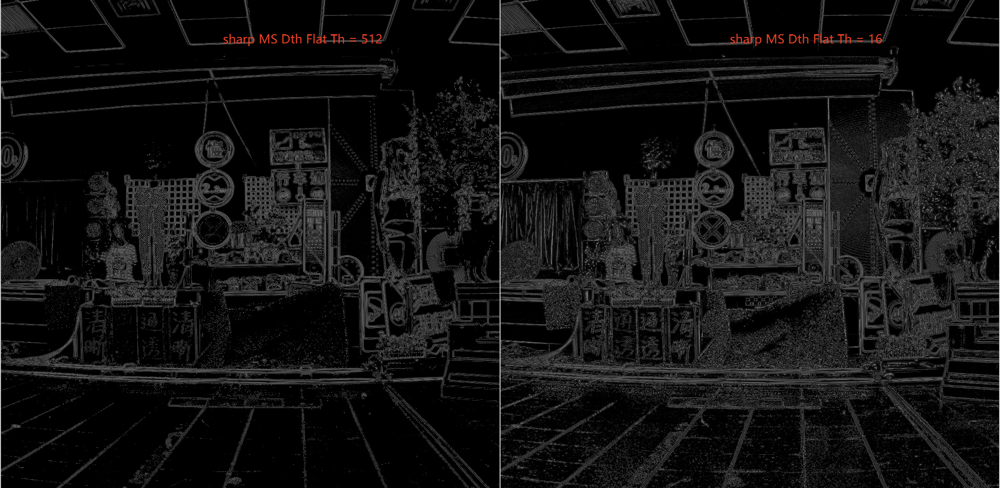

进一步调试 sharp MS Dth Flat Nsr 阈值，看能否在进一步优化

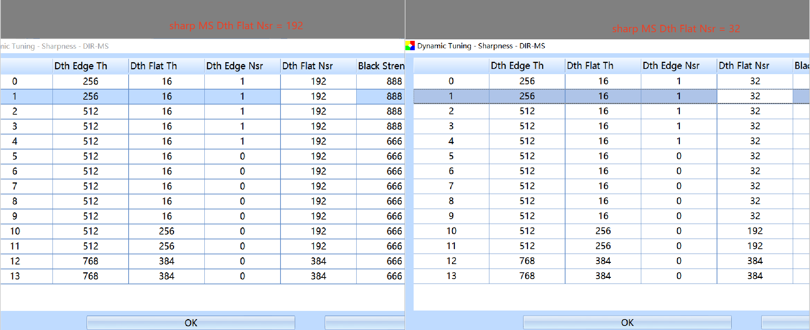

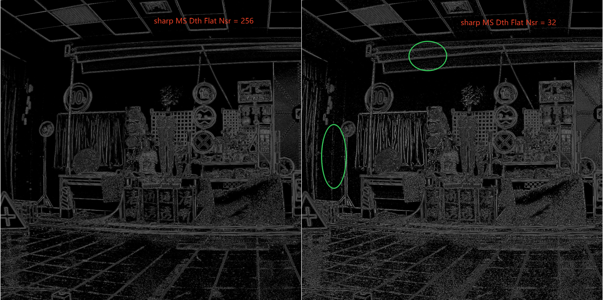

发现降低以后平坦区噪声也会被锐化到，因此再适当调大 sharp MS Dth Flat Nsr ，使噪声不会锐化出来即可

修改后的效果如下图所示

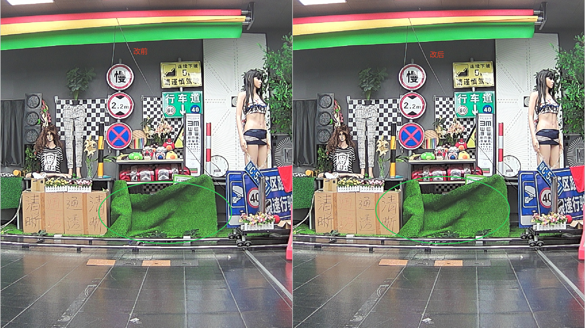

##### 如何去除噪声

**Step1**：如需要去除运动噪声，比如手臂挥动、人像走动出现的噪声，通过提高 Denoise 去噪整体去噪强度或 运动去噪强度优化

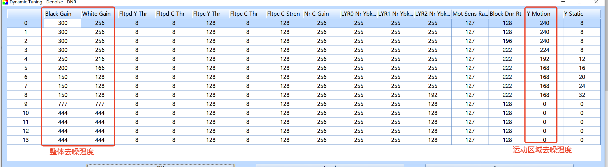

**Step2**：如画面中存在跳动噪声，需要提高 TDNF 去噪强度解决

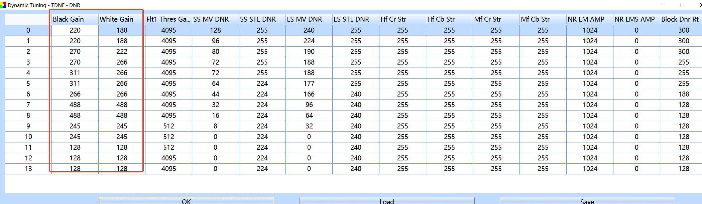

**Step3**：如果画面中存在坏点，可通过 DPC 模块去除

**Step4**：如果静止画面存在噪声，需要依次排除是哪个模块引入噪声，先关闭 Sharpness、Encpp 确认是否锐化引入噪声，如是，那么需要通过调整锐化阈值，避免低频噪声被锐化出来

**Step5**：如果不是锐化出来的噪声，可关 PLTM、GTM 模块等确认是否其他亮度增益模块拉出噪声

**Step6**：低照度环境下，请先和对比机对齐帧率，在对齐对比机的情况下降低帧率提高曝光时间，可以提升信噪比，此外通过降低亮度和增益也可以减少噪声出现

##### 如何优化拖影问题

**Step1**：连接调试工具，关闭 TDNF 模块，如果拖影消失，说明拖影为ISP引入。关闭TDNF会导致画面噪声闪烁，为正常现象

**Step2**如确认是ISP导致，先尝试降低D3D模块运动降噪强度，将 SS MV DNR 和 LS MV DNR 的强度降低

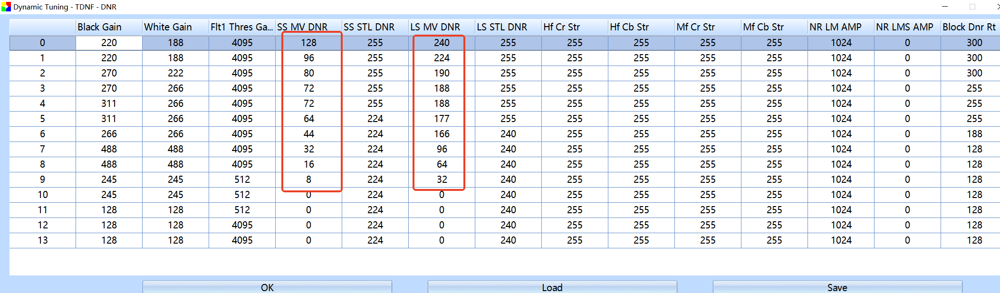

**Step3**：如果仍然存在拖影，可再继续降低D3D整体去噪强度,直到画面出现轻微噪声闪烁为止

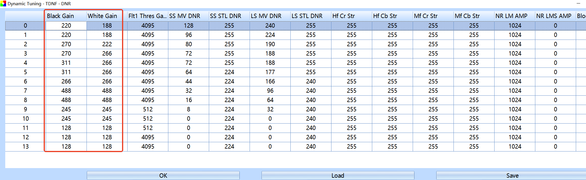

**Step4**：如果不是ISP导致，请抓取VE节点确认编码3D是否打开，如有打开可关闭再确认效果


## FAQ

### 如何使用或关闭降帧策略

降帧策略通常在低照度下生效，通过延长曝光时间来提升画面亮度和信噪比，下面简单介绍降帧策略的使用方法

**Step1**：确认 Sensor 的 VTS 寄存器

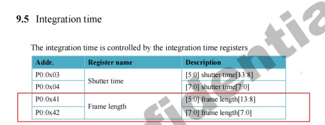

**Step2**：在 sensor\_s\_exp\_gain 函数中检查当前设置的曝光时间是否超过当前帧率对应的 VTS ，如果超过则动态调整 VTS 来延长曝光时间，如果没有则不需要调整 VTS

```
static int sensor_s_exp_gain(struct v4l2_subdev *sd, struct sensor_exp_gain *exp_gain)
{
  struct sensor_info *info = to_state(sd);
  int shutter, frame_length;
  int exp_val, gain_val;
  exp_val = exp_gain->exp_val;
  gain_val = exp_gain->gain_val;
  if (gain_val < 1 * 16)
  gain_val = 16;
  if (exp_val > 0xfffff)
  exp_val = 0xfffff;
  if (!sc3336_fps_change_flag) { // 检查是否在主动调节帧率，通过标志位或者锁互斥即可
    shutter = exp_val >> 4; // SOC 曝光行（时间）是以16为1行，所以将上层传下来的曝光行除以16，换算当前实际曝光行
    if (shutter > sc3336_sensor_vts - 8) { // 判断当前曝光时间是否大于当前帧率下的 VTS（“-8”只是偏移量，每个 Sensor 不一定）
    frame_length = shutter + 8; // 如果大于当前帧率下的 VTS，那么意味着需要增加VTS 来达到降帧的目的，以此实现自动降帧
  } else
    frame_length = sc3336_sensor_vts; // 如果曝光时间未达到需要调整 VTS 来降帧的情况下，那么还是保持当前帧率需要 VTS 值即可
    sensor_write(sd, 0x320f, (frame_length & 0xff));
    sensor_write(sd, 0x320e, (frame_length >> 8));
  }
  sensor_s_exp(sd, exp_val);
  sensor_s_gain(sd, gain_val);
  sensor_dbg("sensor_set_gain exp = %d, %d Done!\n", gain_val, exp_val);
  info->exp = exp_val;
  info->gain = gain_val;
  return 0;
}
```

**Step3**：调整 ISP 效果文件的最大曝光时间

ISP 效果文件中的 AE Table 用于设定当前效果的曝光表：

如图所示， Min Exp 代表最小曝光时间（倒数）—— 1/22000s， Max Exp 代表最大曝光时间（倒数）—— 1/20s，

Min Gain 代表最小增益、 Max Gain 代表最大增益（均以 256 为一倍），光圈调节暂不支持，故需要设置为默认值为266；

AE 调整亮度的逻辑：第 0 档为起始档位， AE 会保持一倍增益的前提下，优先提高曝光时间来达到提升亮度的目的，曝光时间的可调范围为【1/22000s，1/20s】，如果曝光时间提高到 1/20s的状态还没有达到期望亮度，那么会开始向下顺延执行第 1 档的设定：维持曝光时间为 1/20s 的前提，开始提高增益的倍数，增益的可调范围【256，32768】（也就是 1x - 128x），以此类推，直到达到最大曝光时间和最大增益


如果当前帧率为 20fps，则需要限制最大曝光时间为 1/20s，那么意味着 ISP 给驱动设置的最大曝光时间则不会大于 1/20s（50ms），如果有自动降帧需求，那么可以将最大曝光时间设置大于1/20s；例如设置为 1/10s ：意味着最大曝光时间从 50ms 调整到 100ms，驱动发现当前曝光时间大于当前 VTS 时，便会重新调整 VTS 来降帧延长曝光时间；

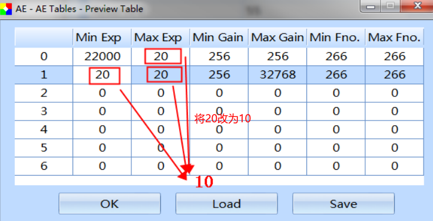

上述是通过调试工具调整曝光表，也可以通过直接修改对应 ISP 效果文件来实现自动降帧，打开效果文件并搜索 ae\_table\_preview ,参数和工具界面的参数是一一对应的

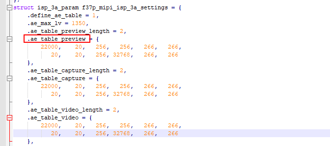

**Step4**：如果希望关闭自动降帧策略，可将效果文件的最大曝光时间改成帧率对应的曝光值，如最大帧率为20fps，那么最大曝光就是1/20s（50ms），此外也可以将驱动文件里面写 VTS 寄存器的动作注释

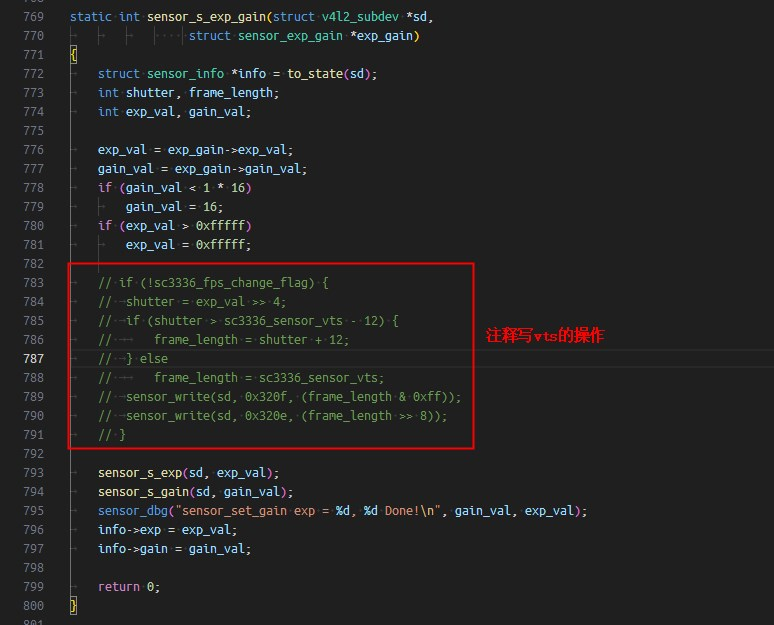

:::note

:::note

备注

:::
:::note

-   如有疑问请参考《Tina\_Linux\_Camera\_降帧\_开发指南》、《sensor帧率控制及检查》

:::

:::

### 如何排查亮度闪烁问题

**Step1**：先关闭 GTM、DRC、PLTM、Encpp-LDCI、Gamma 等对比度相关模块，确认是否还有闪烁，如果没有闪烁，请检查对比度相关模块参数设置是否合理及各档位参数过渡是否平滑

**Step2**：关闭 AE 改成手动曝光，确认是否还存在闪烁

**Step3**：如果确认是 AE 模块导致闪烁，通过 exp test 测试曝光增益线性度是否正常，如不正常，请检查 Sensor 曝光增益函数是否有问题

**Step4**：调整 Frames Delay 尝试改善，找Sensor原厂确认曝光增益的延迟生效帧数，并填写进去

**Step5**：调整 Dynamic Tuning 中的 AE 对应档位的 Speed、Tolerance ，使得收敛速度变慢， AE 容忍度变高

**Step6**：检查曝光表是否有问题， AE target 设置是否平滑

**Step7**：检查 Sensor 驱动的 HTS、VTS 和 PCLK 的值是否正确

**Step8**：检查曝光函数是否使用 Sensor 的 group hold/group write 功能，如果 Sensor 支持，一定要使用

**Step9**：添加帧头中断曝光策略，避免曝光增益跨帧导致闪烁，如需要添加该策略请联系FAE提供支持

### 如何解决工频干扰问题

交流电的瞬时功率周期性变化，导致没有滤波电路或滤波不好的照明设备发光强度也周期性变化。使用滚动快门的图像传感器，周期性变化的光强会在画面上呈现周期性的水平亮度差异，看起来就是周期性的条纹。世界主要有50Hz和60Hz两种交流电频率，对应亮度变化周期是1/100s和1/120s。要完全解决工频闪烁，就要令曝光时间是亮度变化周期的整数倍，通过调整 ISP 可以优化工频干扰

以使用50Hz交流电为例说明

**Step1**： ISP 效果参数使能 AFS（Anti-Flicker） 模块并打开 AE log ， EXP\_TIME 是以微秒为单位的， exp\_time 的值应该要等于或接近10000的整数倍


**Step2**：若 exp\_time 的值明显小于10000，则通过提高 AE target 可以提高 exp\_time 的值，令其接近10000us，修改方法可看第4.2章节详情

**Step3**：若不便提高 AE 期望亮度，令帧率严格等于100/N（N为正整数），可以让条纹定住不动，感观上也好一点

**Step4**：若 exp\_time 的值等于或接近10000的整数倍，仍有工频闪烁，就说明sensor驱动里面的 pclk、vts、hts 至少其中一个值不准确，请检查sensor驱动配置并与原厂确认

**Step5**：若 exp\_time 的值大于10000，但不是10000的整数倍，则可以设置 flicker\_type=1 ，令 Anti-Flicker 强制处于50Hz模式，或设置 flicker\_type=0 ，令 Anti-Flicker 处于自动检测模式，并通过改变 Ratio 的值让 Anti-Flicker 工作在50Hz模式

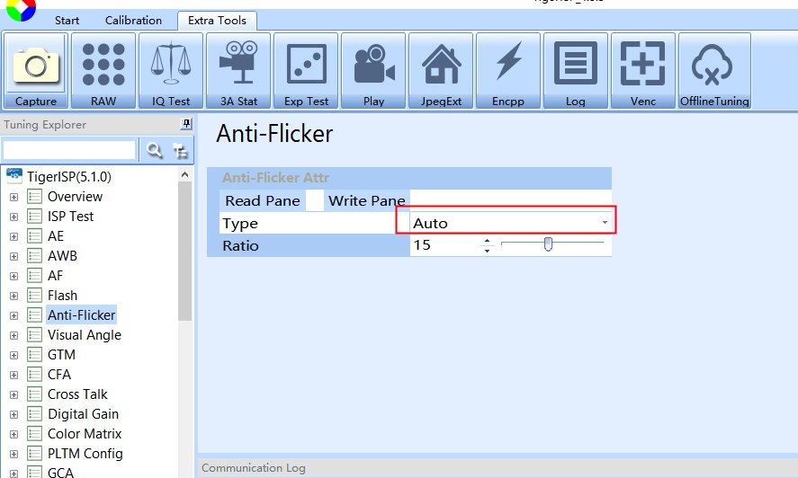

**Step6**：如果不希望通过调整效果文件，而是通过应用接口控制，可使用下述接口设置抗工频闪烁属性，模式列表如下

```
enum v4l2_power_line_frequency { 
V4L2_CID_POWER_LINE_FREQUENCY_DISABLED = 0, 
V4L2_CID_POWER_LINE_FREQUENCY_50HZ = 1, 
V4L2_CID_POWER_LINE_FREQUENCY_60HZ = 2, 
V4L2_CID_POWER_LINE_FREQUENCY_AUTO = 3, 
}; 
```

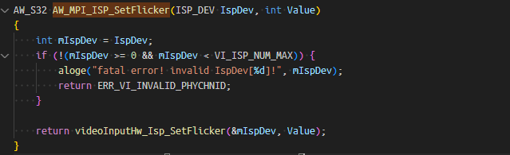

### 如何解决拜耳格式导致的图像问题

Bayer矩阵是图像传感器上用于捕捉彩色图像的一种滤色阵列。它的核心思想是通过排列红（R）、绿（G）、蓝（B）三种颜色滤镜，使每个像素仅捕获一种颜色信息，再通过插值算法（Demosaic）还原全彩图像。

当sensor输出raw数据的拜尔矩阵与sensor驱动设置的不一致，进行demosaic算法时，插值算法会错误计算颜色，导致图像颜色完全错误，因此在点亮sensor时，请根据sensor实际输出的拜尔格式正确填写到sensor驱动中。

#### 图像翻转如何适配拜尔格式

如果用户使用的翻转是sensor翻转，那么需要找原厂确认翻转以后sensor输出的拜尔格式是否变化，如有变化，请确认sensor驱动是否适配翻转后的拜尔格式。适配方法请参考一号通《Tina\_Linux\_Sensor驱动\_调试指南》中第3.2.15.2节实现。

一般sensor有自适应翻转功能，也就是在操作sensor翻转后，sensor保持输出的拜尔格式不会变化，这时候sensor驱动就不需要适配翻转后的拜耳格式，此功能请与原厂确认。

### 如何优化紫边问题

#### 模块参数介绍

由于被摄物体反差较大，在高光与低光部位交界处出现的色斑的现象即为色差，常见为紫色，因此又叫紫边现象。此现象与透镜无法将各种波长的色光都聚焦在同一点有较大关系， ISP 有两个模块参与去紫边，分别是 GCA 和 LCA ，去除紫边建议先做全局色差矫正。

#### GCA校准流程介绍

**Step1**：离线连接上调试工具，点击 ISP Test ，在 ByPass Setting 模块，点击 All Operation 中的 disable ，关闭所有 ISP 模块,点击 write ，使修改生效

**Step2**：点击 Calibration ，再点击 GCA 按钮，跳出 GCA 标定界面


**Step3**：准备 GCA 标定图，需要用到黑底的白圆点图，尺寸建议 A2/A1，如下图所示


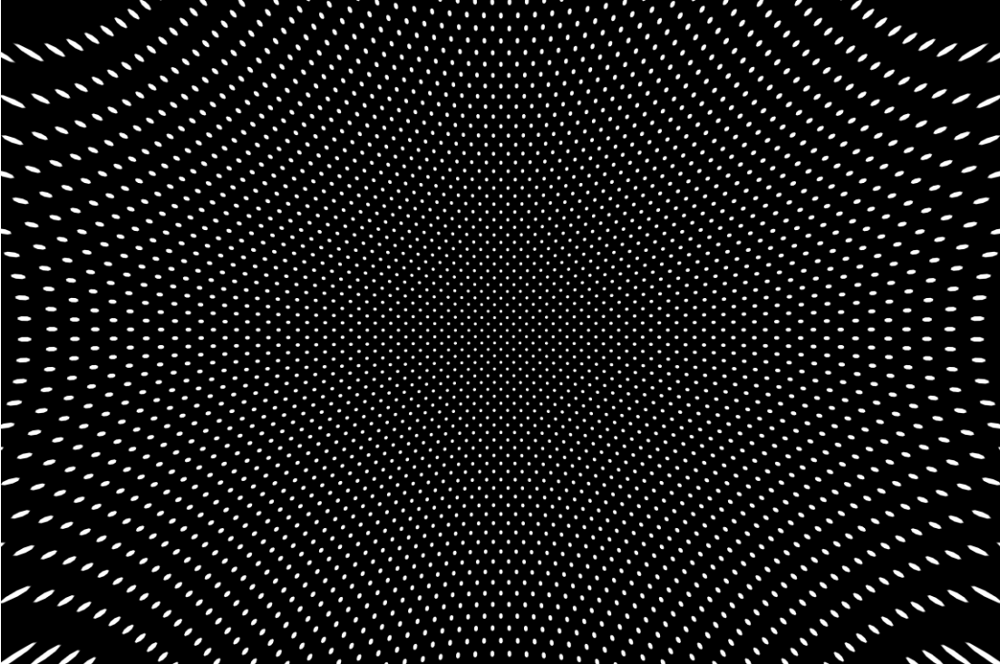

**Step4**：手动设置曝光、增益至合适的倍数，拖动鼠标右键框选中央区域，选择 RGB 测算， G\_MAX 数值应接近最大值


**Step5**：完成 Sensor 曝光设置后，点击 Capture 按钮抓取 20 帧 Raw 数据,点击 Calc ，工具将根据设定的参数计算出 R Param0 ~ B Param2 这 6 个参数,点击 Apply 使参数生效

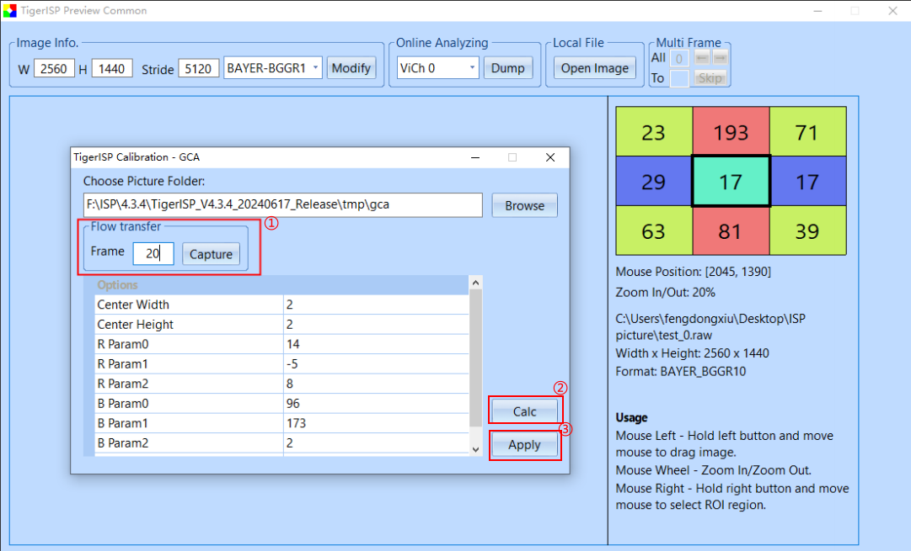

#### 主观调试方法


**Step1**：在 GCA 已标定好的前提下，物体边缘若还有紫边，可调试 LCA 参数

**Step2**： LCA 调试时先将校正系数设置为最强（ PF/GF Correction Ratio = 1024，PF/GF CLRC Ratio = 0，PF DECR Ratio = 15 ）来分别调试偏绿/偏紫紫边的检测区域（ Lum，Grad，CLR，PF Rshf，PF Blsp ）

**Step3**：在调试得到合适的检测区域后，可开始调试校正系数来平衡紫边去除程度及副作用（ PF/GF Correction Ratio，PF/GF CLRC Ratio，PF DECR Ratio 以及两条曲线）

:::note

:::note

备注

:::
:::note

-   设置 Sensor 曝光、增益时需要将 TestMode 设置为 Manual Mode
    
-   Raw 图的尺寸、 Bayer 格式确保选择正确（ cat vi 节点查看相关的配置）
    
-   抓取 Raw 图时，确保标定图占满整个画面，并且尽量拍到更多的白点
    

:::

:::

### 如何解决黑白全彩切换偏色

通常黑白全彩切换可能存在如下问题：

-   全彩切黑白或黑白切全彩时出现紫帧
    
-   黑白切全彩出现白平衡偏绿、紫帧等问题
    

需要优化上述问题，切换流程建议按照下述设置：

从彩色图像切换到黑白图像，一般建议先切换 ISP 效果（彩色->黑白），打开红外灯，再使能 IR-CUT，这样可以防止先使能 IR-CUT 后，摄像头会拍摄到红外光分量导致图像先变红再变黑白

从黑白图像切换到彩色图像，一般建议先关闭红外灯（白天场景环境光较充足），关闭 IR-CUT，切换ISP 效果（黑白->彩色）

### 如何去除sensor坏点

坏点主要产生原因与sensor相关，长时间高低温等极端环境工作、传感器受到外力撞击挤压或静电放电时可能直接破坏像素单元的电路结构、传感器生产过程中微小的工艺偏差等均有导致坏点的可能


ISP中的DPC模块可用于去除这类坏点，V861支持静态坏点检测和动态坏点检测，建议先进行静态坏点校正再配合适当的动态坏点去除强度来优化坏点问题，下面说明动态坏点校准参数调试操作方法：

**Step1**：先确认ISP效果参数中的DPC模块是否打开，若未打开，请打开

**Step2**：按照下述流程进行调试

调试分为检测和校正，以下调试建议在默认值参数的基础上进行

1.检测：

a)现将校正参数NBHD\_DIFF\_RATIO和NEAREST\_DIFF\_RATIO调至最小，保证调整检测参后，马上就能看出检测的实时效果

b)调节SLOPE\_TH参数，若图像动态坏点不明显（表现为稍亮），又希望将其去掉，将SLOPE\_TH参数调小，以此来检测出更多的不明显坏点。若图像的动态坏点都比较明显，则可调大SLOPE\_TH参数，防止误测出更多的纹理

c)在上一步的基础上，配合HOT\_RATIO参数去除亮坏点。将 HOT\_RATIO参数调小，则能越容易检测出亮坏点，同时，越多的亮边缘纹理也将被误检；将 COLD\_RATIO参数调小，COLD ABS TH调大（一般使用默认值即可，不需要整），则越容易检测出暗坏点来，同时，越多的暗边缘纹理也将被误检，需要权衡

d)调整到合适的检测参数后，将校正参数NBHD\_DIFF\_RATIO和NEAREST\_DIFF\_RATIO调至最大，接下进行调试校正参数

2.校正：

1)由于校正参数被设置最大，虽然检测到了，但是依然没校正过来。因此，逐步减小校正参数NBHD\_DIFF\_RATIO和NEAREST\_DIFF\_RATIO，会越来越多的坏点被校正

2)若希望被检测出的坏点更多的被校正（去坏点），则将NBHD\_DIFF\_RATIO和NEAREST\_DIFF\_RATIO参数继续调小，主要调NBHD\_DIFF\_RATIO参数，次调NEAREST\_DIFF\_RATIO

3)若希望被检测出的坏点更多的保持原始值（纹理和边缘），则将NBHD\_DIFF\_RATIO和NEAREST\_DIFF\_RATIO参数调大


### 如何读写Sensor寄存器配置

#### 通过sensor节点进行读写

**Step1**： cd /sys/devices/gc2053\_mipi （进入目标 sensor 节点目录）

**Step2**： echo 0x10 > addr\_width; echo 0x8 > data\_width （输入目标 sensor 寄存器地址/数据位宽，请查阅 datasheet 获取）

**Step3**： echo 0 > read\_flag （ read\_flag ：读写控制节点，使能为1表示后续操作为读动作，使能为0表示后续操作为写动作）

**Step4**： echo 30350021 > cci\_client （“30350021”：0x3035【目标寄存器地址】，0x0021【将要写入的寄存器值】，在 read\_flag = 1 情况下，写入值为无效状态）

**Step5**： cat read\_value （打印上一步操作的结果：寄存器值）

#### 通过TigerISP工具进行读写

**Step1**：离线/在线连接上调试工具

**Step2**：打开读取寄存器界面，正确选择sensor寄存器的地址及数据位宽

**Step3**：操作为读取寄存器时，先在 Address 这一列填入要读取的寄存器地址，点击 Read ，在 Data 这一列会显示读出来的寄存器数值

**Step4**：操作为读取寄存器时，先在 Address 这一列填入要写入的寄存器地址，再在 Data 这一列填入要写入的寄存器数值，点击 Write ，即可写入进去

**Step5**： Write 以后可以再 Read 一下，确认是否写入生效

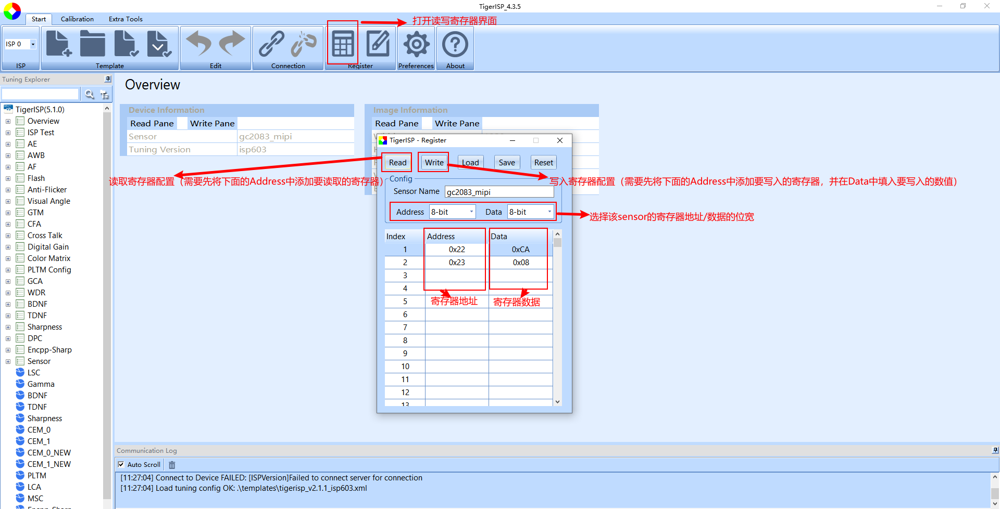

:::note

:::note

备注

:::
:::note

-   IIC 在系统和硬件上正常工作
    
-   上述命令需要在 Camera 正常工作状态下执行才会有效，如 /sys/devices/sensor 节点是否存在， Camera 是否上电等等
    
-   上述命令只在 tina-linux 系统有效， rtos 系统暂不支持
    

:::

:::

### 如何转换效果文件并合入应用生效

#### 介绍效果文件格式及转化方法

ISP 效果文件有三种格式： dat、h、bin

-   dat 文件用于效果调试，工具加载及保存只能使用 dat 文件
    
-   h 文件用于编译，使 ISP 在运行起来时，能快速找到对应匹配的效果文件并加载生效到应用中
    
-   bin 文件用于效果切换，客户可以将文件放入文件系统中，在应用起来时通过调用接口读取 bin 文件，实现 ISP 效果加载生效
    

下述为三种效果文件格式的转化方式


#### 应用应该如何适配ISP效果文件并生效

##### h头文件

**Step1**：拷贝效果 .h 至 SDK

在工具中将 .dat 文件转换为 .h 文件，拷贝至 SDK 指定路径

V861常电效果文件目录：`/platform/allwinner/vision/libAWIspApi/isp_mpp/isp_v861/libisp/isp_cfg/SENSOR_H/gc4663`

V861快起效果文件目录：`/rtos/lichee/rtos-hal/hal/source/vin/vin_isp/isp61x_server/isp_cfg/SENSOR_H`

**Step2**：配置 isp\_ini\_parse.c ， include 添加上新增的 ISP 效果文件

V821常电效果文件目录：`/platform/allwinner/vision/libAWIspApi/isp_mpp/isp_v861/libisp/isp_cfg/isp_ini_parse.c`

V821快起效果文件目录：`/rtos/lichee/rtos-hal/hal/source/vin/vin_isp/isp61x_server/isp_cfg/isp_ini_parse.c`

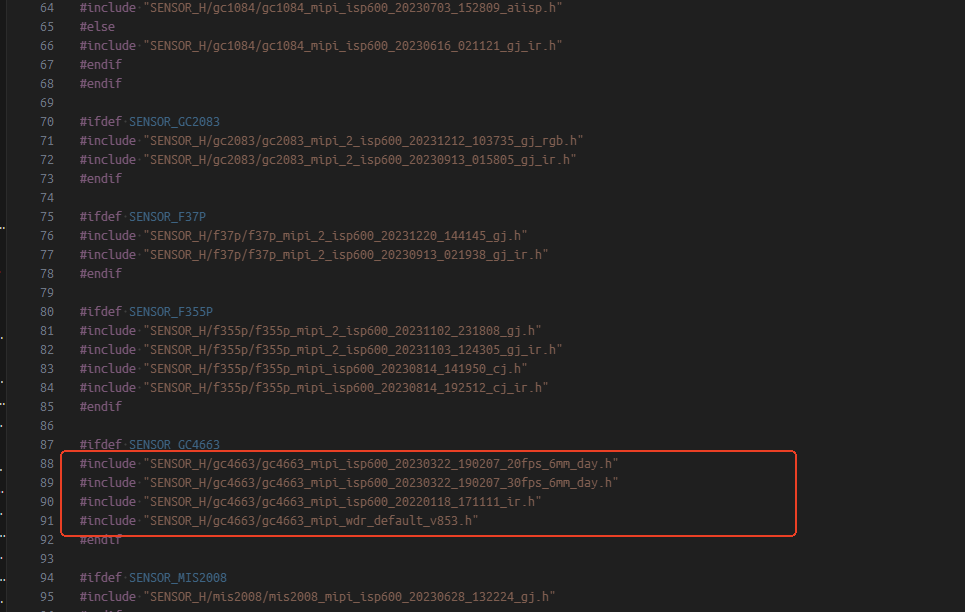

**Step3**：配置效果文件对应的属性，这一步是确保效果文件能否加载正确的关键

① Sensor dev名称：这个是驱动里面注册的sensorname，通常单路就是gc4663\_mipi,如果是双目的情况下，另一路通常注册为gc4663\_mipi\_2，如果不能确定，可以通过cat vi节点确认sensorname

② ISP 效果头文件名称：对应效果文件名

③ 分辨率宽度：当前vi节点sensor输出宽度，如果不能确定可以通过cat vi节点确认

④ 分辨率高度：当前vi节点sensor输出高度，如果不能确定可以通过cat vi节点确认

⑤ 帧率

⑥ 红外 IR 模式标志位：值为1则按照红外夜视黑白效果加载此效果文件

⑦ WDR 模式标志位：值为1则说明效果为 WDR 模式专用效果，使用 WDR 模式才需要配置

⑧ ISP 效果.h 末尾的 ISP 参数结构体“struct isp\_cfg\_pt gc4663\_mipi\_linear\_isp\_cfg”

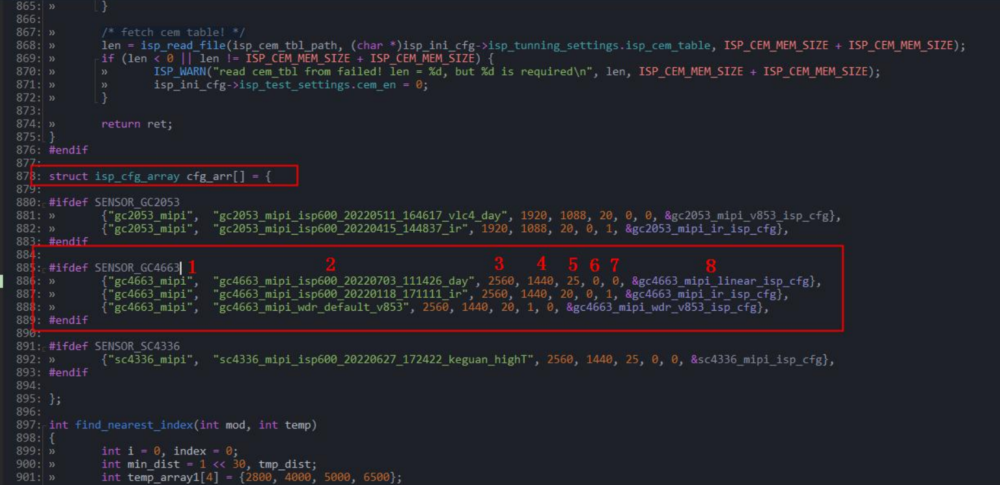

如打开效果头文件后，这里结构体名字与isp\_ini\_parse.c对应不上，那么需要修改isp\_ini\_parse.c中的⑧为&gc4663\_mipi\_rgb\_isp\_cfg

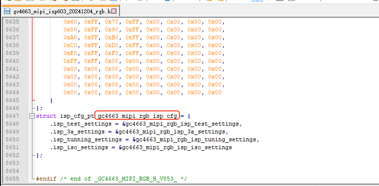

**Step4**：应用上使用 AW\_MPI\_ISP\_SwitchIspConfig接口切换效果配置

IspDev 为当前使用的 ISP 通道号

ModeFlag为切换模式，0代表线性模式彩色效果，1代表WDR 模式彩色效果，2代表线性模式红外黑白效果，3代表WDR 模式红外黑白效果

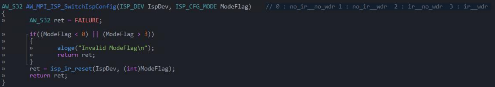

##### bin文件

**Step1**：将效果文件转换为bin格式并存放在文件系统指定路径下

**Step2**：应用上使用 AW\_MPI\_ISP\_ReadIspCfgBin接口切换效果配置

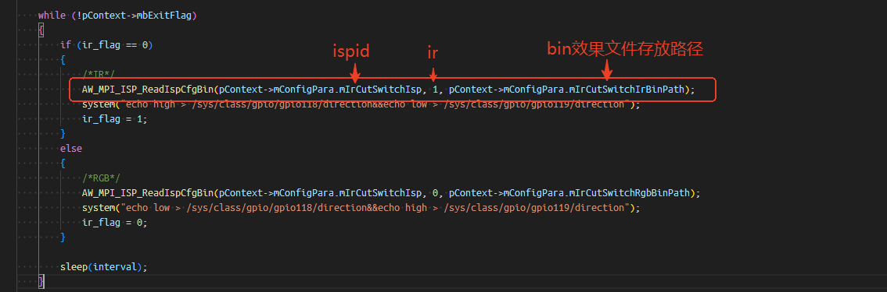

### 如何基于彩色效果整理一份初版红外效果

从彩色模式参数同步到红外模式过程中，效果文件上有以下点需要修改确认

-   CAC(LCA+GCA)模块需要关闭，避免红外模式下颜色误判断引起的异常
    
-   WB模块需要关闭(AWB保持打开)，避免色温异常判断引起画面的异常变化
    
-   CCM模块建议关闭
    
-   对比度(GTM模块)需要适当增强，避免红外补光灯下容易出现的图像发“朦”
    

### 如何抓取sensor raw数据

遇到图像效果异常，而无法判定是主控导致还是sensor本身的问题，在面对这种情况下，抓取raw数据进行分析是最快捷直观的排查手段，V系列支持多种抓取raw数据的方式

#### Sample\_virvi抓取raw数据

##### 介绍

Sample\_virvi支持从vipp抓取raw数据，这个过程中vipp直接输出raw格式数据，不会经过isp的任何处理，只能抓取video0节点下的raw数据。但由于在跑sample\_virv抓raw数据时，无法预览经过isp后的图像数据，因此针对一些非必现的场景问题下，此方案抓raw不推荐使用。

##### 使用方法：

**Step1**：将sample\_virvi放入卡中，图像尺寸帧率请按实际配置

**Step2**：修改sample\_virvi.conf文件，修改如下配置pic\_format\_0 = “srggb10”,raw\_store\_count = 5

**Step3**：执行./sample\_virvi -path ./sample\_virvi &

**Step4**：在mnt/extsd目录下有raw图保存

#### TigerISP离线抓取raw数据

##### 介绍

TigerISP是ISP调试工具，客户可以在APST上面进行下载。这里的离线指的是不跑sample出流或客户应用，通过运行TuningApp连接调试工具出流。本方法可以预览并判断到当前场景已复现到问题后，再进行raw数据抓取，但只能抓取video0节点下的raw数据，因此如果是双摄、三摄的情况下，需要手动配置设备树，将有问题的一路sensor配置到video0节点中。

##### 使用方法

**Step1**：进入串口，手动运行tuningapp，指令如下：./Tuningapp 8848 0 &

**Step2**：打开TigerISP，填写sensor对应的尺寸帧率等配置，完成调试工具连接

**Step3**：导入现在使用的效果参数，并预览图像，检查是否复现到问题

**Step4**：复现到问题以后，通过log记录下当前使用的曝光增益

**Step5**：在调试工具中手动关闭isp所有模块

**Step6**：在手动曝光窗口下，将复现场景下记录的曝光增益写到sensor中

**Step7**：在capture界面下，将格式改为sensor输出的raw图格式（如BAYER-RGGB10），在点击右上角的capture按钮就可以完成raw图抓取


#### sample\_smartIPC\_demo抓取raw数据

##### 介绍

sample\_smartIPC\_demo是基于IPC客户开发的示例demo，其中包含整个vin通路及rtsp功能，使用该sample可以实现通过wifi、adb、eth等方式的实时图像码流预览。通过sample\_smartIPC\_demo抓取raw数据，可以实现在实时预览经过ISP、VE处理后的码流的同时，将这一段raw数据保存到本地。

##### 使用方法

**Step1**：m kernel\_menuconfig，搜索并打开SUPPORT\_ISP\_TDM、TDM\_OFFLINE\_HANDLE\_RAW

**Step2**：打开board.dts，将vin通路配置为离线模式

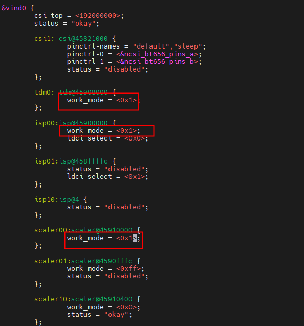

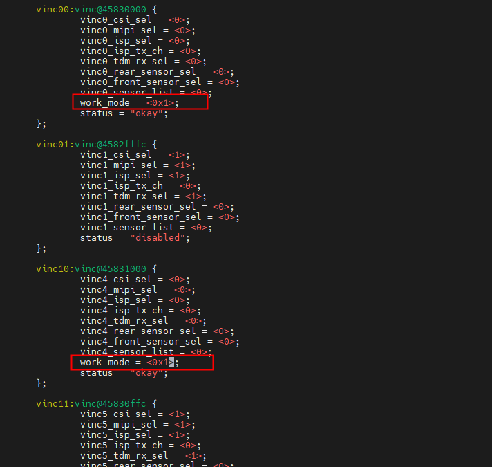

**Step3**：配置sample\_smartIPC\_demo.conf，其中main\_isp\_tdm\_raw\_process\_type请根据实际sensor输出的raw图的格式进行选择，其余配置按照sensor输出尺寸及需求进行配置

```
main_isp_tdm_raw_process_type = -1 #-1:disable, 0:dump 8bit, 1:dump 10bit, 2:dump 8bit for tools, 3:dump 10bit for tools, 4:send 8bit, 5:send 10bit
main_isp_tdm_raw_width = 1920
main_isp_tdm_raw_height = 1080
main_isp_tdm_raw_rxbuf_num = 5
main_isp_tdm_raw_process_frame_cnt_min = 0
main_isp_tdm_raw_process_frame_cnt_max = 5
main_isp_tdm_raw_file_path = "/mnt/extsd/tdm_raw.bin"
```

**Step4**：编译新固件并烧录

**Step5**：运行sample\_smartIPC\_demo进行raw数据抓取

#### TigerISP在线抓取raw数据

##### 介绍

TigerISP是ISP调试工具，客户可以在APST上面进行下载。这里的在线指的是在跑sample或客户应用的时候，连接上调试工具，进行raw数据抓取，在一些低概率才能复现到的问题上，推荐使用此方法进行raw数据抓取

##### 使用方法

**Step1**：参考sample\_smartIPC\_demo抓取raw数据步骤的前两点进行通路配置，sample 中将下述变量赋值给vi

```

    pStreamContext->mViAttr.mbSoftTdmEnable = 1;

    pStreamContext->mViAttr.mSoftTdmCfg.tdm_isp_mode = 1;
```

**Step2**：编译新固件及sample并烧录

**Step3**：进入串口，手动运行tuningapp，指令如下：./Tuningapp 8848 1 &

**Step4**：打开TigerISP，填写sensor对应的尺寸帧率等配置，完成调试工具连接

**Step5**：确认当前场景下已复现到问题

**Step6**：在capture界面下，将格式改为sensor输出的raw图格式（如BAYER-RGGB10），在点击右上角的capture按钮就可以完成raw图抓取


### 如何通过ISP优化高温热噪

#### 介绍

由于Sensor处于高温环境或长时间工作，本身积热严重形成热噪，噪声对图像效果产生比较大的影响，通过实时读取Sensor温度，适时调整ISP模块表现来优化画质表现

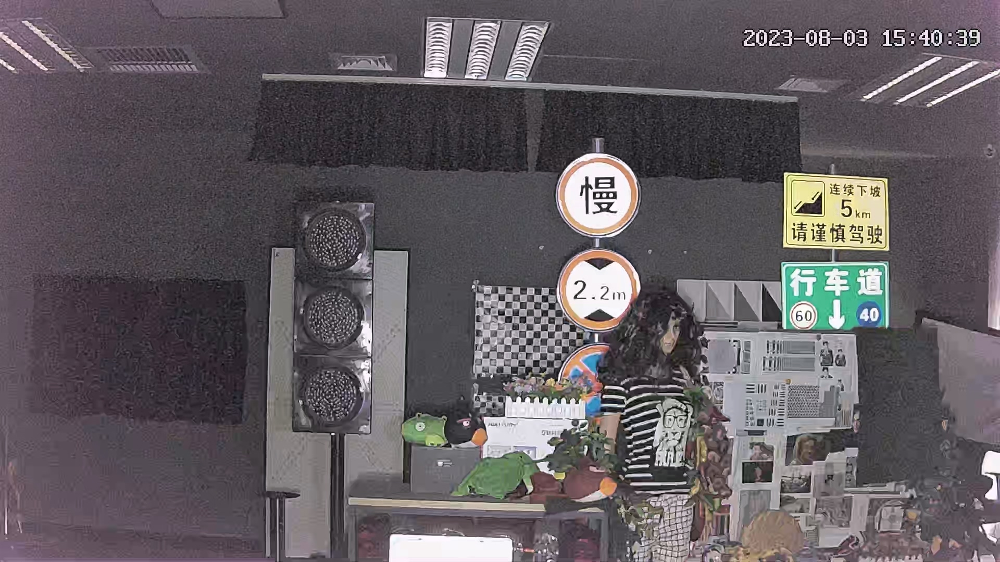

#### ISP高温联动策略介绍

-   Sensor驱动获取温度（标定拟合的温度曲线）
    
-   调试ISP高温联动模块
    

通过实时获取Sensor温度，联动 ISP Pipeline 的 Denoise、TDNF、BLC、Sharp、Saturation等模块来实时调整图像表现，例如高温下热噪严重，读取Sensor温度处于较高水平时，对应加强降噪模块的强度，减弱锐化模块的强度，使得图像不会因为热噪而变得十分异常

如图所示，ISP高温策略通过获取Sensor温度进行联动，温度值归一化在【55℃, 120℃】范围内（意味着Sensor获取温度值后，需要将其归一化在这个范围内）

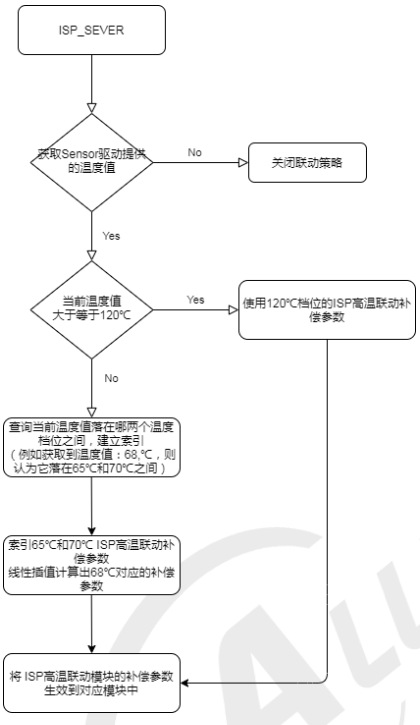

如图所示，ISP高温联动模块的参数是各个模块强度（降噪、锐化、饱和度、BLC等）的补偿系数

-   以256为默认值，小于256为衰减补偿，大于256为增强补偿。
    
-   如下表所示，BLC的补偿值系数默认值为0，补偿系数是在原有的BLC模块基础值上进行补偿偏移
    

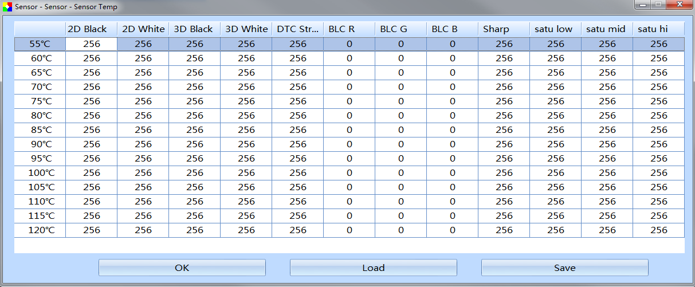

```
2D Black	2D暗部降噪联动系数，数值越大降噪越强，取值范围【0，4095】，默认值：256
2D White	2D亮部降噪联动系数，数值越大降噪越强，取值范围【0，4095】，默认值：256
3D Black	3D暗部降噪联动系数，数值越大降噪越强，取值范围【0，4095】，默认值：256
3D Black	3D亮部降噪联动系数，数值越大降噪越强，取值范围【0，4095】，默认值：256
DTC Stren	D3D DTC 强度联动系数，数值越大噪声越多，取值范围【0，256】，默认值：256
BLC_R   	黑电平 R 分量偏移，取值范围【-4095，4095】，默认值：0
BLC_G   	黑电平 G 分量偏移，取值范围【-4095，4095】，默认值：0
BLC_B   	黑电平 B 分量偏移，取值范围【-4095，4095】，默认值：0
Sharp	    锐化强度联动系数，数值越大锐化越强，取值范围【0，4095】，默认值：256
Satu_Low	低亮饱和度联动系数，数值越大低亮区域饱和度越强，取值范围【0，512】，默认值：256
Satu_Mid	中亮饱和度联动系数，数值越大中亮区域饱和度越强，取值范围【0，512】，默认值：256
Satu_High	高亮饱和度联动系数，数值越大高亮区域饱和度越强，取值范围【0，512】，默认值：256
```

#### 高温热噪调试策略

高温热噪的现象通常比较好分辨，如图所示，整个画面闪动的噪声会十分严重（特别是四角），随着时间流逝，清晰度也逐渐变差，与此同时，图像的颜色也会出现一些偏差


画面颜色偏差主要还是 Sensor BLC 在这个场景下有偏移导致，例如原本 BLC 只需要由平台扣除16，但受高温影响后实际需要扣除的BLC已经比16更大了。所以调试中需要观察每个温度档位下，图像中黑色的被摄物体是否有发红的表现，然后相应调整高温联动模块中的 BLC 参数和饱和度参数

从上图中可以看到，受温度的影响，图像噪声十分严重，那么就可以根据温度档位，适当调整降噪强度补偿和锐化强度补偿（下图参数仅作为示例，参数设置以实际情况调试为准），让画面恢复到比较正常的表现


下图为高温联动策略生效后的效果，即使是高温条件下，图像也能够调整回相对正常的状态

PS：如果通过高温联动策略也未能调整好图像，那么只能考虑从机器的模具设计、Sensor 选型来避免此类问题


### 如何使用远程调图

#### 介绍

全志调试工程师与需调试设备两者异地，全志调试工程师可使用远程调试系统，在系统对已挂上系统的需调试设备进行画质调试。

#### 使用流程

##### 安装 TigerDOS

TigerDOS是一款基于互联网的设备远程在线调试系统，支持线上远程调试设备（adb调试 & 串口调试 & IP+Port调试（比如ISP在线调试）& 远程PC桌面协助），通过远程线上调试快速支持全志客户问题

工具可以通过全志客户服务平台的开发工具页面获取，也可以使用 APST 获取

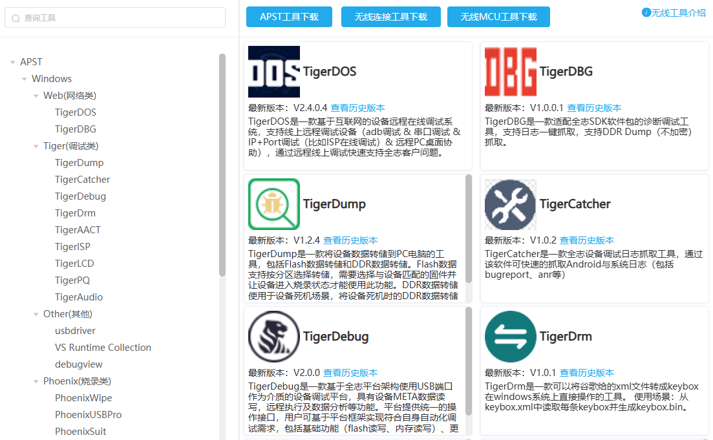

##### 准备调试环境

在调试之前，需要准备好调试固件，并且连接好串口，确认能使用adb/ip连接调试工具，在线调图连接工具方法请看第2.5.2章

##### 登录 TigerDOS

安装完成，打开 TigerDOS 后，全志客户输入一号通账号与密码（要求有NDA权限）


非NDA账号会显示无法登录

![远程调图流程3]()

##### 分享桌面

选择工具中的PC桌面选项，在搜索框中输入员工的姓名，点击开始共享

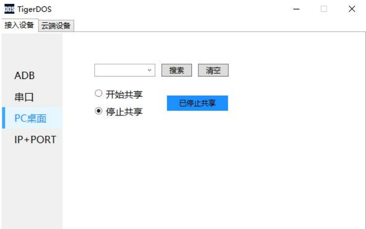

然后会显示验证码，将验证码发给对应员工即可


### 如何抓取及分析ISP、VI节点

如下所示为vi节点，串口执行下述指令可以查看 VI 节点状态：cat /sys/kernel/debug/mpp/vi

```
VIN hardware feature list:
mcsi 2, ncsi 1, parser 2, isp 1, vipp 2, dma 2
CSI_VERSION: CSI300_600, ISP_VERSION: ISP603_100
CSI_CLK: 200000000, ISP_CLK: 0
*****************************************************
vi0:
gc1084_mipi => mipi0 => csi0 => isp0 => vipp0
input => hoff: 0, voff: 0, w: 1280, h: 720, fmt: GRBG10
output => width: 1280, height: 720, fmt: LBC_1X
interface: MIPI, isp_mode: NORMAL, hflip: 0, vflip: 0
prs_in => x: 1280, y: 720, hb: 2432, hs: 6451
bkuf => cnt: 4 size: 1429504 rest: 4, work_mode: online
frame => cnt: 306, lost_cnt: 7, error_cnt: 0
internal => avg: 34(ms), max: 34(ms), min: 33(ms)
CSI Bandwidth: 0
*****************************************************
vi4:
(efault) => mipi0 => csi0 => isp0 => vipp4
input => hoff: 0, voff: 0, w: 0, h: 0, fmt: NULL
output => width: 0, height: 0, fmt: NULL
interface: NULL, isp_mode: NORMAL, hflip: 0, vflip: 0
prs_in => x: 0, y: 0, hb: 0, hs: 0
bkuf => cnt: 0 size: 0 rest: 0, work_mode: online
frame => cnt: 0, lost_cnt: 0, error_cnt: 0
internal => avg: 0(ms), max: 0(ms), min: 0(ms)
CSI Bandwidth: 0
*****************************************************
```

VI 节点参数说明

| 参数 | 描述 |
| --- | --- |
| mcsi | MIPI通道号，0/1 |
| ncsi | DVP通道号，0 |
| parser | 图像数据解析通道号，0/1/2/3 |
| isp | ISP通道号，0/1 |
| vipp | VI通道号，0~12 |
| input => hoff | 输入图像水平偏移 |
| input => voff | 输入图像垂直偏移 |
| input => w | 输入图像宽度 |
| input => h | 输入图像高度 |
| input => fmt | 输入图像格式，RAW：RGGB/BGGR/GRBG/GBRG，YUV： |
| output => width | 输出图像宽度 |
| output => height | 输出图像高度 |
| output => fmt | 输出图像格式：RAW8/10/12，YUV420等，LBC\_1/1.5/2/2.5X |
| interface | 接口类型：PARALLEL/MIPI/BT656/SUBLVDS/HISPI |
| isp\_mode | ISP模式：NORMAL/DOL\_WDR/CMD\_WDR/SEHDR |
| hflip | 输出图像水平（镜像）翻转：0/1 |
| vflip | 输出图像垂直翻转：0/1 |
| prs\_in => x | parser输入数据宽度 |
| prs\_in => y | parser输入数据高度 |
| prs\_in => hb | 行消隐时间 |
| prs\_in => hs | 行同步时间 |
| bkbuf => cnt | 图像buffer个数 |
| bkbuf => size | 图像buffer大小 |
| bkbuf => rest | 空闲图像buffer个数 |
| bkbuf => work\_mode | 图像编码模式：offline/online |
| tdmbuf => cnt | TDM buffer个数 |
| tdmbuf => size | TDM buffer大小 |
| tdmbuf => cmp\_ratio | TDM LBC 压缩系数 |
| ispbuf => cnt | ISP 3DNR buffer个数 |
| ispbuf => size | ISP 3DNR buffer大小 |
| ispbuf => cmp\_ratio | ISP 3DNR 压缩系数 |
| frame => cnt | 图像帧计数 |
| frame => lost\_cnt | 图像丢帧计数 |
| frame => error\_cnt | 图像异常帧计数 |
| internal => avg | 图像帧间隔平均值（ms） |
| internal => max | 图像帧间隔最大值（ms） |
| internal => min | 图像帧间隔最小值（ms） |

如下所示为isp节点，串口执行下述指令可以查看 isp 节点状态：cat /sys/kernel/debug/mpp/isp

```
cat /sys/kernel/debug/mpp/isp
*****************************************************
VIN hardware feature list:
CSI_VERSION: CSI300_600, ISP_VERSION: ISP603_100
CSI_CLK: 200000000, ISP_CLK: 0
vipp0, isp_dode: NORMAL
*****************************************************
ISP0 debug param list:
===> exp: 21600, gain: 17, lum_idx: 187, coms_temp: 48
===> color_temp: 5630, rgain: 468, bgain: 442
===> contrast: 256, sharp: 256, bright: 256
===> satur: 256, tdnf: 256, bdnf: 256, pltm: 0
*****************************************************
[ISP Colorspace]
====> REC709_FULL
[ISP Cfg Version Name]
====> gc2083_mipi_isp603_20241205_171656_final_rgb_suit
[ISP Libs Commit Version]
====> commit: b821ee6be69ccb9b847874aae1a3d8fb3fbb1e05
*****************************************************
```

```

ISP 节点参数说明

| 参数                      | 描述                                                 |
| ------------------------- | ---------------------------------------------------- |
| exp                       | 当前环境曝光时间，其中16代表一行曝光                 |
| gain                      | 当前环境下的增益，其中16代表一倍增益                 |
| lum_idx                   | 当前环境下的曝光idx值                                |
| coms_temp                 | 当前环境下的设备温度，需要实现高温功能               |
| color_temp                | 当前环境下的awb统计的色温值                          |
| rgain                     | 当前环境下的awb r通道补偿                            |
| bgain                     | 当前环境下的awb b通道补偿                            |
| contrast                  | 对比度叠加强度，通过应用接口调用设置                 |
| sharp                     | 锐化叠加强度，通过应用接口调用设置                   |
| bright                    | 亮度叠加强度，通过应用接口调用设置                   |
| satur                     | 饱和度叠加强度，通过应用接口调用设置                 |
| tdnf                      | d3d去噪叠加强度，通过应用接口调用设置                |
| bdnf                      | d2d去噪叠加强度，通过应用接口调用设置                |
| pltm                      | pltm叠加强度，通过应用接口调用设置                   |
| ISP Colorspace            | ISP色域空间                                          |
| ISP Cfg Version Name      | 当前使用的效果文件名                                 |
| ISP Libs Commit Version   | 当前的ISP库版本号                                    |
```

### 如何排查连接图像调试工具失败

先根据本文的第2.5章节离线调试和在线调试介绍，确认awTuningApp的执行脚本、确认awTuningApp是从哪里拿到的、确认TigerISP连接界面填写的参数（sensorname、尺寸、帧率等）

在线调试的情况下，执行脚本为 ./awTuningApp 8848 1 & ， 离线调试的情况下，执行脚本为 ./awTuningApp 8848 0 &

awTuningApp必须从SDK对应路径获取

-   V861 常电的 awTuningApp 路径：`platform/allwinner/vision/libAWIspApi/isp_mpp/isp_v861/libisp/tuning_app/awTuningApp_isp610`
    
-   V881 快启的 awTuningApp 路径：`rtos/lichee/rtos-hal/hal/source/vin/vin_isp/isp61x_server/out`
    

如果均已按照上述的规范来连接，还是连接不上，请确认调试工具填写的尺寸帧率等配置是否填写正确，有两种常见方法可以确认是否填写正确

1、执行awTuningApp后，进入设备端 tmp 路径，找到如下图所示文件夹 isp1\_1920\_1080\_20\_0

其中isp1代表使用的ispid为1

1920代表宽，1080代表高

20代表帧率

0代表非WDR模式

![TigerISP连接异常排查1]()

2、抓取vi节点，通过打印的尺寸及帧率等即可确定，但这里打印的帧率不一定为vi初始化时使用的帧率，存在降帧影响导致帧率误差

### 如何排查灯光高亮边缘存在彩条


如出现此类异常问题，请按照步骤进行排查

**Step1**：离线连接调试工具，导入现有参数并确认能复现到问题，离线调试预览的是未过编码的图像，可以排除编码影响

**Step2**：依次关闭ISP相关模块，定位是否是ISP某个模块导致的偏色

**Step3**：关闭d3d后，发现彩条消失，能确定是sensor在高亮区彩噪偏大，经过d3d后彩噪被定住导致彩条

**Step4**：根据上述排查思路，通过降低d3d的降噪强度,使得d3d不要将低频彩噪定住，可优化彩条问题

### 如何调用接口使用AE ROI模式

针对门锁、IPC等客户，需要使用AE ROI模式，通过设置AE ROI参数，使得指定区域的曝光能够达到预期效果。

快启方案使用方法如下所示：

```
    //使用方式
    isp_ctrl_attr.isp_attr_cfg.cfg_id = RT_ISP_CTRL_AE_ROI_TARGET;
    isp_ctrl_attr.isp_attr_cfg.ae_roi_area.enable = 1; //使能AE ROI
    isp_ctrl_attr.isp_attr_cfg.ae_roi_area.force_ae_target = forceAeTarget; //AE预期目标亮度,值越大则指定区域的曝光越大
    isp_ctrl_attr.isp_attr_cfg.ae_roi_area.coor.x1 = x1;
    isp_ctrl_attr.isp_attr_cfg.ae_roi_area.coor.y1 = y1;
    isp_ctrl_attr.isp_attr_cfg.ae_roi_area.coor.x2 = x2;
    isp_ctrl_attr.isp_attr_cfg.ae_roi_area.coor.y2 = y2;
    ret = AWVideoInput_SetIspAttrCfg(id, &isp_ctrl_attr);
```

快启方案关于坐标设置请务必注意，统计窗口是将全图坐标归一化到\[-1000,1000\]，因此坐标设定请按照下述坐标设置


常电方案使用方法如下所示：

```
    //常电方案使用接口  AW_S32 AW_MPI_ISP_AE_SetRoiArea(ISP_DEV IspDev, SIZE_S Res, RECT_S RoiRgn, AW_U16 ForceAeTarget, AW_U16 Enable)
    //使用方法
    Res.Width = 1920;     // 设置图像分辨率
    Res.Height = 1080;
    RoiRgn.X = 0;         // 设置ROI区域，其中（x,y）为ROI区域左上角坐标，（width,height）为ROI区域宽高
    RoiRgn.Y = 0;
    RoiRgn.Width = 640;
    RoiRgn.Height = 480;
    AW_U16 ForceAeTarget = 50;
    ret = AW_MPI_ISP_AE_SetRoiArea(IspDev, Res, RoiRgn, ForceAeTarget, 1);
```

### 如何实现软光敏模式

软光敏的设计方案：通过软件上获取相关参数（亮度信息+红外光分量）来判断当前环境状态，且是否要切换场景，从而替代硬件光敏感知环境亮度

其主要实现接口如下：

1.  &lt;AW\_MPI\_ISP\_GetEnvLV>获取当前图像亮度等级（存在负值），此参数值可初步表征当前场景亮度，亮度越高参数值越高，亮度越低参数值越低
    
2.  &lt;AW\_MPI\_ISP\_GetAwbGainIr>获取当前图像中红外光分量等级（awb\_rgain\_ir、awb\_bgain\_ir），两个参数值可以在红外夜视下初步表征当前图像中红外光分量的程度，数值越高，红外光分量程度越高
    
3.  &lt;AW\_MPI\_ISP\_GetIrAwbWinCntWeight>获取当前场景红外光源占比，值越大，说明当前场景的红外光分量越多
    
4.  &lt;AW\_MPI\_ISP\_SwitchIspConfig>切换 ISP 效果
    
5.  &lt;AW\_MPI\_VENC\_SetColor2Grey>设置编码通道颜色
    

如需了解更详细的实现流程，请通过一号通浏览《V系列Camera-IPC产品软光敏方案开发指南》、《V系列软光敏新算法使用指南》了解

### 如何排查快启方案前几帧图像异常

#### 快启方案介绍

快启异构方案出图基本流程如下所示，可以大概分为以下三个流程：

1.  Boot0引导melis系统（rtos系统）启动，melis系统启动后初始化sensor、CSI和ISP硬件以及初始化ISP算法库，图像开始采集并且ISP库对图像开始处理。
    
2.  Boot0引导Linux系统启动，然后等待melis的通知，melis系统对图像处理后关闭CSI和ISP硬件并发消息告知Linux系统。
    
3.  Linux系统打开CSI和ISP硬件开始接收图像，并把图像信息发送给melis系统的ISP算法库对图像进行处理，处理结果再发送回给Linux系统的ISP硬件，双系统协同完成图像的接收和处理。
    

#### 快速收敛图像的三种方案介绍

Melis 系统sensor首帧初始化目前支持预取值模式、高帧率模式、硬光敏模式和硬光敏高帧率模式，通过mmelis menuconfig选择配置，如下：


1.  read ae threshold from flash：预取值模式，指的是sensor的初始化曝光增益使用的是上一次系统关闭时候保存在flash的曝光和增益，以保证首帧曝光增益正常。
    
    优点就是出图时间快，缺点是场景变化会导致下一次出图曝光增益不准。
    
2.  use HFR to make AE&AWB fast stability(HFR)：高帧率模式（也称软光敏模式），指的是先使用低分辨高帧率先计算出曝光增益和白平衡，然后再切换到目标帧率，以得到当前环境正确的曝光增益和白平衡。
    
    优点就是首帧曝光增益和白平衡比较正常，缺点是比较耗时，特别是夜视需要开启ir\_cut，所以夜视出图耗时需要增加200ms。
    
3.  ISP\_ONLY\_HARD\_LIGHTADC（GPADC）：硬光敏模式，指的是读取光敏电阻数值从而得到当前环境的亮度，所以可以在boot0就判断当前环境的亮度，提前控制ir\_cut和红外补光，进入melis系统后通过提前标定光敏电阻gpadc数值与曝光增益关系的得到关系表，从而使得冷启动后获取当前环境gpadc数值经查询关系表得出sensor的曝光增益，从而保证首帧曝光增益正常。
    
    优点就是出图时间快，但是曝光增益准确性依赖于光敏电阻的精度，缺点是增加成本且首帧白平衡会有偏差。
    
4.  use hard light\_adc to make AE&AWB fast stability(GPADC&HFR)：硬光敏高帧率模式，指的是读取光敏电阻数值从而得到当前环境的亮度，所以可以在boot0就判断当前环境的亮度，提前控制ir\_cut和红外补光，进入melis系统的时候再使用高帧率模式收敛曝光增益和白平衡。
    
    由于提前在boot0就控制了it\_cut，所以优点就是出图比第二种高帧率模式快，而且首帧曝光增益和白平衡也比较正常，缺点是增加成本。
    

#### 快起前几帧图像异常的排查方法

##### 前几帧图像颜色异常

**预取模式**

1、确保在稳定环境下，搭配当前使用的效果文件抓取isp\_reg更新

预取模式下，前三帧图像用的是isp\_reg中设置的rgain/bgain，等三帧后才是是白平衡算法设置的增益

2、检查效果参数中的isp\_color\_temp，建议按照\[4000K,6500K\]范围设置

白平衡算法的初始色温值使用的效果文件中的isp\_color\_temp，isp\_color\_temp值越大，初始化色温越偏高色温，初始化的图像可能会更偏黄，如下图所示

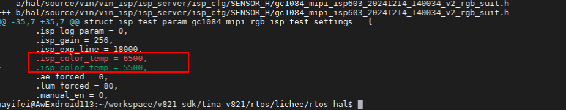

**高帧率模式**

1、确保高帧率效果参数的AWB相关参数与低帧率的一致

高帧率模式下，会使用高帧率参数进行AE及AWB的收敛，因此需要确保高帧率下的效果参数能将白平衡做准

2、抓取高帧率isp\_reg更新，并检查高帧率效果参数中的isp\_color\_temp不能设置太极端

3、检查小核打印awb是否收敛完成

默认高帧率是跑15帧，如果发现小核打印中收敛帧率已经到了15帧，说明可能还没收敛完，调试阶段可以把高帧率的稳定帧数设置大一点确保高帧率时候awb是完全稳定

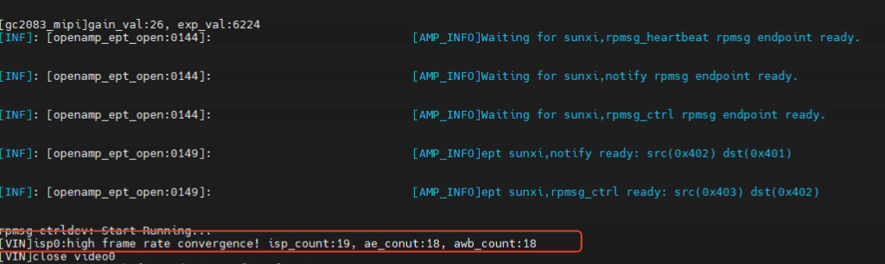

##### 前几帧图像亮度异常

**预取模式**

1、确认小核sensor驱动是否实现从flash中读取曝光增益

预期模式下，AE会从flash中获取上次ISP退出时候的曝光增益并从第一帧设置给sensor作为初始化的曝光增益


2、确认flash中读取的曝光增益是否与上一次退出时保存的曝光增益值一致

预期模式下，除初始化vin时使用的是小核驱动曝光外，跳到内核出流都是通过linux的sensor驱动控制曝光增益，因此通过在大小核中的曝光函数中加打印即可确认。如果不一致的话，请确认dts中分区情况是否调整，导致isp保存及读取的地址存在异常

**高帧率模式**

1、确认小核sensor驱动是否实现从flash中读取曝光增益

2、确认高帧率收敛后的曝光增益值是否已经稳定

默认高帧率是跑15帧，如果发现小核打印中收敛帧率已经到了15帧，说明可能还没收敛完，调试阶段可以把高帧率的稳定帧数设置大一点确保高帧率时候ae是完全稳定

3、确保高帧率效果参数的亮度相关参数与低帧率同步好

-   高帧率模式参数头文件中的ae table的min\_exp和ae\_max\_lv需要与线性模式一致，且ae table的max\_gain需要提高（例如：低帧率用的是30fps，最大增益设置为20000；在120fps高帧率下最大增益需要设置为 120 x 20000 / 30 = 80000）
    
-   高帧率模式参数头文件中ae target需要与线性模式的一致；一般情况下低帧率的彩色模式和红外模式下的AE target差异较小时可共用一份高帧率参数；如差异较大，高帧率可以分别使用彩色模式和红外模式两份效果头文件
    
-   低帧率模式ISP参数头文件中PLTM manual\_strength代表首帧的PLTM强度，需要填写各ISO下稳定时的PLTM实际强度
    
-   高帧率模式ISP参数头文件中ae tolerance越大，切换低帧率的时间越快，首帧的AE、AWB准确性越低；反之，切换低帧率的时间越慢，首帧的AE、AWB准确性越高
    

**硬光敏模式**

1、确认硬光敏是否完成标定，能覆盖到户外照度到低照度的各个照度

2、检查硬光敏设置的曝光值是否基本符合要求

:::note

:::note

备注

:::
:::note

-   上述是各模式下的图像异常的常见排查流程，但实际应用场景中会包含更多要素，如是否开关灯及切ircut等工作在流程的哪个位置执行、aiisp切换包含8bit到10bit效果差异等，需要结合上述排查流程并结合实际场景进行排查
    
-   软光敏模式下，设备烧录固件第一次上电，flash使用的是默认值，无法实现首帧曝光正常；此外如果上一次上电的环境与本次上电的环境的亮度差异较大，也无法保证首帧曝光正常
    
-   如想了解快启ISP更多信息，请通过一号通浏览《Tina\_Linux\_异构快启Camera\_使用指南》了解
    

:::

:::

### 如何在编码码流中插入SEI信息

SEI全称"Supplemental Enhancement Information"，SEI是h264/h265规范中定义的字段，可以用来插入辅助增强信息。我们把 ISP 和 VENC 在编码过程中的实时信息作为SEI插入码流中，便于后续从码流数据中分析视频采集的ISP参数和编码参数。

mpp平台和rt\_media都可以支持。

#### mpp打开SEI功能

mpi\_venc组件接口：

```

ERRORTYPE AW_MPI_VENC_ConfigSEI(VENC_CHN VeChn, const VENC_SEI_ATTR *pAttr);
```

设置mpi\_venc组件通道的SEI模式和参数。

数据结构VENC\_SEI\_ATTR的定义如下：

```
typedef enum {
    VencSei_Disable = -1,
    VencSei_FollowShellSet = 0, // check /tmp/sei_venc_chn
    VencSei_Enable = 1,
}VencSeiEnableSettingE;

typedef struct
{
    VencSeiEnableSettingE eSeiEnableSetting;
    int nSeiDataTypeFlags; //SEIDataType_ISP, SEIDataType_VIPP, SEIDataType_VENC
    ISP_DEV nIspDev;
    VI_DEV nVipp;
    int nFrameIntervalForISPLevel1; //Exp
    int nFrameIntervalForISPLevel2; //Colortmp
    int nFrameIntervalForISPLevel3; //Awb
    int nFrameIntervalForVIPP;
    int nFrameIntervalForVencLevel1; //nSceneStatus, nMoveStatus
    int nFrameIntervalForVencLevel2; //nMadTh,bOnlineEn
}VENC_SEI_ATTR;
```

数据结构VENC\_SEI\_ATTR的成员说明如下：

* * *

成员名称 描述

* * *

eSeiEnableSetting 3种SEI模式:  
VencSei\_Disable: 关  
VencSei\_Enable: 开  
VencSei\_FollowShellSet: mpi\_venc组件从配置文件 "/tmp/sei\_venc\_chn"读取要开启SEI功能的编码通道号，将这些 编码通道开启SEI功能。编码通道号之间用空格隔开。例如用户 可以在程序运行时，在串口终端输入 `echo "0 2 4" >/tmp/sei_venc_chn`，即表示打开编码通道0, 2,4的SEI功能。删除配置文件`rm /tmp/sei_venc_chn`或清空配 置文件`echo >/tmp/sei_venc_chn`，就表示关闭所有编码通道 的SEI功能。

nSeiDataTypeFlags 指定要包含的SEI数据种类，目前设计了3种类型: SEIDataType\_ISP, SEIDataType\_VIPP, SEIDataType\_VENC。其 中VIPP类型尚未实现。

nIspDev 指定视频帧来源的Isp设备号。

nVipp 指定视频帧来源的VIPP设备号。

nFrameIntervalForISPLevel1 ISP的level1等级的信息在视频帧中出现的频率，即多少帧携带 一笔ISP level1等级的信息。ISP驱动决定哪些信息是level1 的，例如曝光信息Exp等。level1是长度较少的信息，可以多次 出现而不影响码率。

nFrameIntervalForISPLevel2 ISP的level2等级的信息在视频帧中出现的频率，即多少帧携带 一笔ISP level2等级的信息。ISP驱动决定哪些信息是level2 的，例如色温Colortmp等。level2是长度稍长的信息，出现频率 要稍小一点，避免影响码率。

nFrameIntervalForISPLevel3 ISP的level3等级的信息在视频帧中出现的频率，即多少帧携带 一笔ISP level3等级的信息。ISP驱动决定哪些信息是level3 的，例如白平衡Awb等。level3是长度较长的信息，有时长达 10KB，出现频率要严格控制，避免影响码率。

nFrameIntervalForVIPP 未实现。

nFrameIntervalForVencLevel1 VENC的level1等级的信息在视频帧中出现的频率，即多少帧携带 一笔VENC level1等级的信息。VENC驱动决定哪些信息是level1 的，例如nSceneStatus, nMoveStatus等。level1是长度较少的 信息，可以多次出现而不影响码率。

nFrameIntervalForVencLevel2 VENC的level2等级的信息在视频帧中出现的频率，即多少帧携带 一笔VENC level2等级的信息。VENC驱动决定哪些信息是level2 的，例如nMadTh,bOnlineEn等。level2是长度稍长的信息，出现 频率要稍小一点，避免影响码率。

* * *

各等级信息出现的帧间隔推荐如下：

```
nFrameIntervalForISPLevel1 = 5
nFrameIntervalForISPLevel2 = 20
nFrameIntervalForISPLevel3 = 200

nFrameIntervalForVencLevel1 = 20
nFrameIntervalForVencLevel2 = 200
```

mpi\_venc支持3种SEI模式，默认使用VencSei\_FollowShellSet模式。在该模式下，mpi\_venc组件从配置文件"/tmp/sei\_venc\_chn"读取要

开启SEI功能的编码通道号，将这些编码通道开启SEI功能。编码通道号之间用空格隔开。因此用户可以在程序运行时，在串口终端通过

shell指令修改/tmp/sei\_venc\_chn的内容，从而实时配置各个视频编码通道的SEI功能。例如输入 echo "0 2 4" >/tmp/sei\_venc\_chn ，

即表示打开编码通道0,2,4的SEI功能。删除配置文件 rm /tmp/sei\_venc\_chn 或清空配置文件 echo >/tmp/sei\_venc\_chn ，就表示关闭

所有编码通道的SEI功能。

用户可以在串口终端执行 cat /sys/kernel/debug/mpp/ve\_base 查询到当前正在工作的视频编码通道号。

#### rt\_media打开SEI功能

AWVideoInput的接口：

```

int AWVideoInput_VENC_ConfigSEI(int channel, AWVideoInput_SeiAttr *pAttr)
```

数据结构AWVideoInput\_SeiAttr的定义如下：

```
typedef enum {
    AWVideoInput_SeiDisable = -1,
    AWVideoInput_SeiFollowShellSet = 0, // check /tmp/sei_rtmedia_chn
    AWVideoInput_SeiEnable = 1,
}AWVideoInput_SeiEnableSettingE;

typedef struct {
    AWVideoInput_SeiEnableSettingE eSeiEnableSetting;
    int nSeiDataTypeFlags; //RTSEIDataType_ISP, RTSEIDataType_VIPP, RTSEIDataType_VENC
    int nFrameIntervalForISPLevel1; //Exp
    int nFrameIntervalForISPLevel2; //Colortmp
    int nFrameIntervalForISPLevel3; //Awb
    int nFrameIntervalForVIPP;
    int nFrameIntervalForVencLevel1; //nSceneStatus, nMoveStatus
    int nFrameIntervalForVencLevel2; //nMadTh,bOnlineEn
} AWVideoInput_SeiAttr;
```

数据结构AWVideoInput\_SeiAttr的成员说明如下：

* * *

成员名称 描述

* * *

eSeiEnableSetting 3种SEI模式:  
AWVideoInput\_SeiDisable: 关  
AWVideoInput\_SeiEnable: 开  
AWVideoInput\_SeiFollowShellSet: rtmedia通道从配置文 件"/tmp/sei\_rtmedia\_chn"读取要开启SEI功能的rtmedia通 道号，将这些通道开启SEI功能。rtmedia通道号之间用空格 隔开。例如用户可以在程序运行时，在串口终端输入 `echo "0 2 4" >/tmp/sei_rtmedia_chn`，即表示打开通道 0,2,4的SEI功能。删除配置文件 `rm /tmp/sei_rtmedia_chn`或清空配置文件 `echo >/tmp/sei_rtmedia_chn`，就表示关闭所有rtmedia 通道的SEI功能。

nSeiDataTypeFlags 指定要包含的SEI数据种类，目前设计了3种类型: RTSEIDataType\_ISP, RTSEIDataType\_VIPP, RTSEIDataType\_VENC。其中VIPP类型尚未实现。

nFrameIntervalForISPLevel1 ISP的level1等级的信息在视频帧中出现的频率，即多少帧 携带一笔ISP level1等级的信息。ISP驱动决定哪些信息是 level1的，例如曝光信息Exp等。level1是长度较少的信 息，可以多次出现而不影响码率。

nFrameIntervalForISPLevel2 ISP的level2等级的信息在视频帧中出现的频率，即多少帧 携带一笔ISP level2等级的信息。ISP驱动决定哪些信息是 level2的，例如色温Colortmp等。level2是长度稍长的信 息，出现频率要稍小一点，避免影响码率。

nFrameIntervalForISPLevel3 ISP的level3等级的信息在视频帧中出现的频率，即多少帧 携带一笔ISP level3等级的信息。ISP驱动决定哪些信息是 level3的，例如白平衡Awb等。level3是长度较长的信息， 有时长达10KB，出现频率要严格控制，避免影响码率。

nFrameIntervalForVIPP 未实现。

nFrameIntervalForVencLevel1 VENC的level1等级的信息在视频帧中出现的频率，即多少帧 携带一笔VENC level1等级的信息。VENC驱动决定哪些信息 是level1的，例如nSceneStatus, nMoveStatus等。level1 是长度较少的信息，可以多次出现而不影响码率。

nFrameIntervalForVencLevel2 VENC的level2等级的信息在视频帧中出现的频率，即多少帧 携带一笔VENC level2等级的信息。VENC驱动决定哪些信息 是level2的，例如nMadTh,bOnlineEn等。level2是长度稍长 的信息，出现频率要稍小一点，避免影响码率。

* * *

rtmedia支持3种SEI模式，默认使用AWVideoInput\_SeiFollowShellSet模式。在该模式下，rtmedia通道从配置文件"/tmp/sei\_rtmedia\_chn"读取要开启SEI功能的rtmedia通道号，将这些通道开启SEI功能，通道号之间用空格隔开。

因此用户可以在程序运行时，在串口终端通过shell指令修改"/tmp/sei\_venc\_chn"的内容，从而实时配置各个rtmedia通道的SEI功能。

例如输入echo "0 2 4" >/tmp/sei\_rtmedia\_chn ，即表示打开rtmedia通道0,2,4的SEI功能。删除配置文件 rm /tmp/sei\_rtmedia\_chn 或清空配置文件 echo >/tmp/sei\_rtmedia\_chn ，就表示关闭所有rtmedia通道的SEI功能。

#### 如何解析SEI信息

使用上述方法打开SEI功能后录制出来的码流中会包含SEI信息，可通过下述方式进行解析，当前只支持H264/H265格式的裸码流解析。

##### 使用TigerISP调试工具进行解析

1、打开TigerISP调试工具，选择V821平台，点击OK，打开TigerISP调试工具，这里不需要连接板端设备。

2、点击菜单栏的Extra Tools，选择Play后跳出Play窗口，模式选为File，根据码流格式选择H264或H265，然后点击Browse，选择码流文件,即可完成解析。


3、解析出来的SEI信息生成在码流同级目录下。

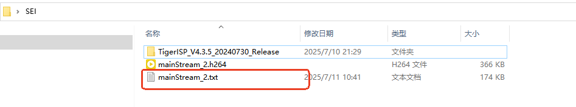

##### 使用解析程序进行解析

使用编译好的解析程序，在控制台进行执行，执行指令后面加多一个 “V85X”或 “V82X”配置参数，可指定版本。不加这个配置参数，默认为V82X，除此外还需加上码流文件路径参数，即可实现解析。

![SEI解析3]()

#### 如何基于解析的SEI信息检查AWB落点情况

1、如果是V821的SEI信息，请打开TigerISP调试工具，选择A733平台，默认打开即可，如果是V85X平台，则选择A523平台打开调试工具。

2、导入当前使用的效果文件dat文件

3、点击菜单栏的Extra Tools，选择JpegExt,点击Load TXT，选择SEI信息文件，即可实现检查AWB落点信息。

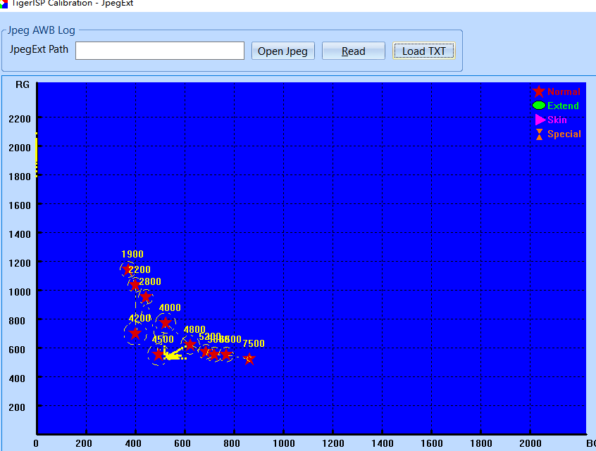

#### 如何修改SEI中各模块频率

以mpi\_venc组件从配置文件VencSei\_FollowShellSet为例，调用VideoEncConfigSEI接口前需要配置各个模块的频率，其中isp区分了3个Level进行频率设置，如果需要修改个模块的频率可参考下述代码修改。

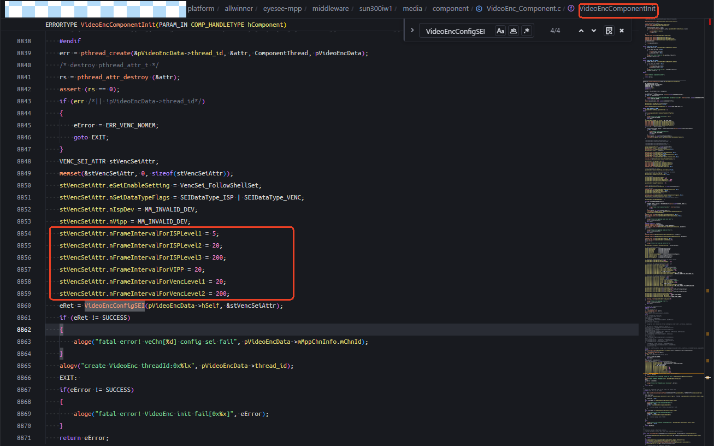


