# SDK 固件烧录

本章节主要介绍固件烧录工具以及如何烧录固件。

全志平台为开发者提供了多种多样的烧写方式和烧写工具：

（1）PhoenixSuit：基于Windows的系统的烧写工具，是最常用的烧写工具，通过数据线将PC和开发板连接，把固件烧到开发板上。PhoenixSuit 支持分区烧写，适用于开发和小规模生产使用。建议开发者开发时使用该工具进行固件升级。

（2）LiveSuit：基于Ubuntu的系统的烧写工具，通过数据线将PC和开发板连接，把固件烧到开发板上，即Ubuntu版的PhoenixSuit，适用于Ubuntu系统开发者进行开发烧写。

（3）PhoenixUSBpro：基于Windows的系统的烧写工具，通过数据线将PC和开发板连接，把固件烧到开发板上，一台PC可同时连接8台设备，分别控制其进行烧写，适用于产线批量生产。（如下图）

（4）PhoenixCard：可以将firmware烧写到SD卡里的工具。开发板插入这张卡就能够启动。基于Windows系统。

（5）存储器件批量烧写生产：用专有设备将提前将固件烧写到未贴片的存储器件（如emmc、nand、nor等）上，再上机贴片。这样可以提高设备生产效率。但需要拉通存储器件厂商和全志原厂定制设备联调。适用于超大规模产品的量产。

## SDK 固件烧录步骤

### Windows 烧录

:::note

:::note

备注

:::
:::note

-   PhoenixSuit 下载地址：[https://www.aw-ol.com/downloads?cat=5](https://www.aw-ol.com/downloads?cat=5)

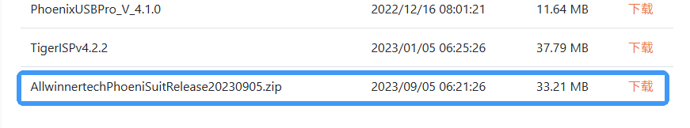

:::

:::

以PhoenixSuit为例，介绍固件烧录步骤：

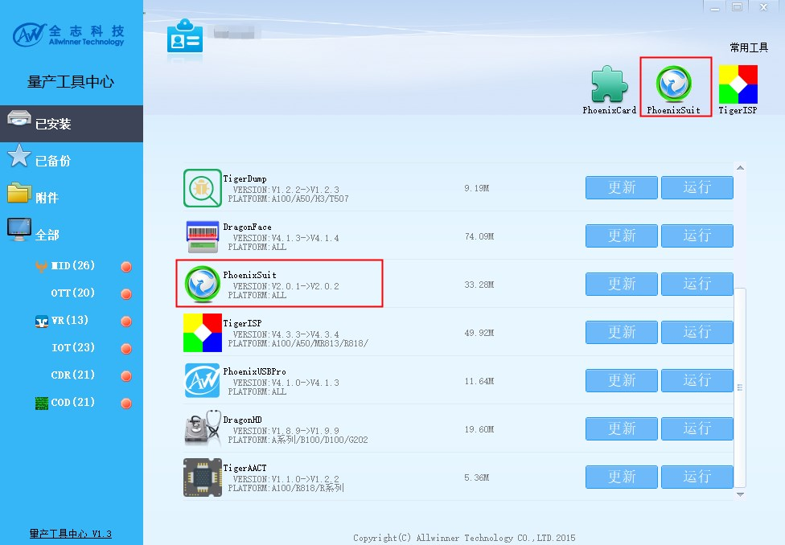

打开 PhoenixSuit，选择一键刷机，点击浏览，打开刚才生成的固件

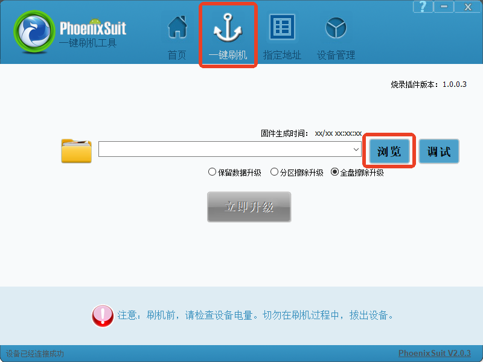

选择全盘擦除升级（若无法选择全盘擦除升级则选择分区擦除升级）

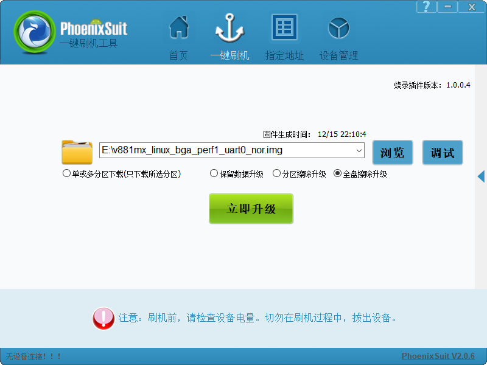

烧录工具出现提示，选择是

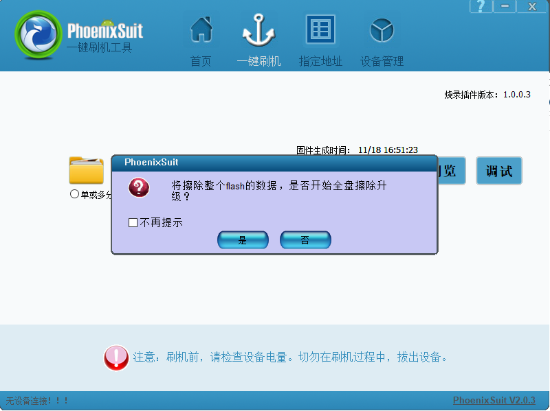

烧录中，请耐心等待

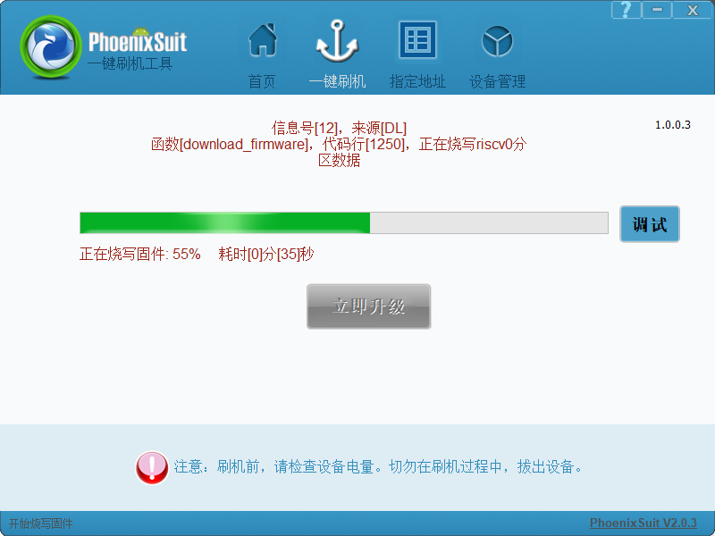

烧写结束，系统自动启动

#### 烧录单独分区

在开发过程中经常需要单独烧录某一分区，例如更新 RISC-V 固件，更新内核，更新 ROOTFS 而不用更新其他分区，此时可以用 `PhoenixSuit` 的【单或多分区下载功能】

:::warning

:::note

注意

:::
:::note

单或多分区下载功能需要固件不修改与第一次烧录时的分区布局和分区大小，否则烧录会破坏原有分区布局

:::

:::

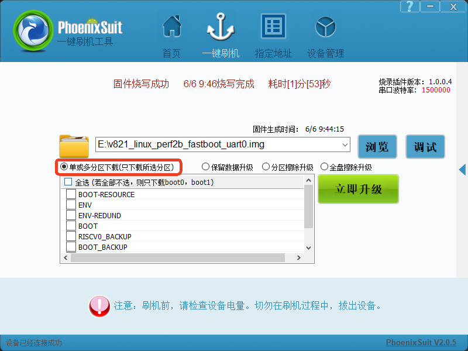

1.  只更新 Uboot，SPL 固件：不选择任何分区，则只下载 SPL 和 U-Boot

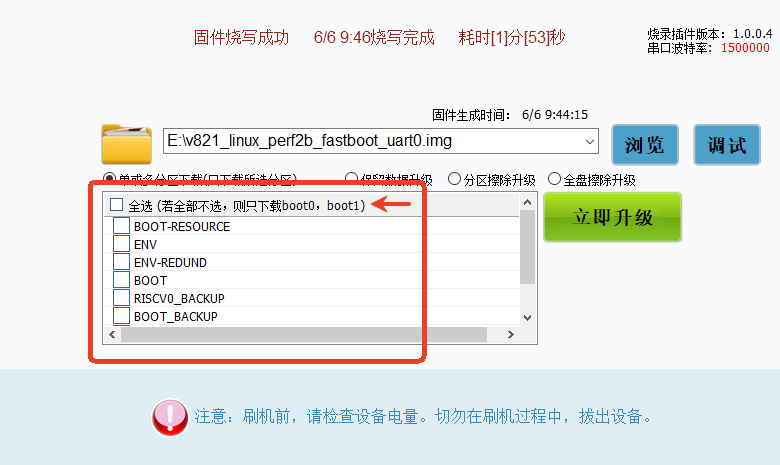

2.  只更新内核：由于内核与设备树是打包在一起在 boot 分区的，所以更新boot时也会更新内核，勾选 boot 即可

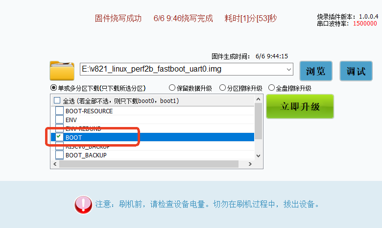

如果使用双备份，更新时需要主 boot 和备份都更新

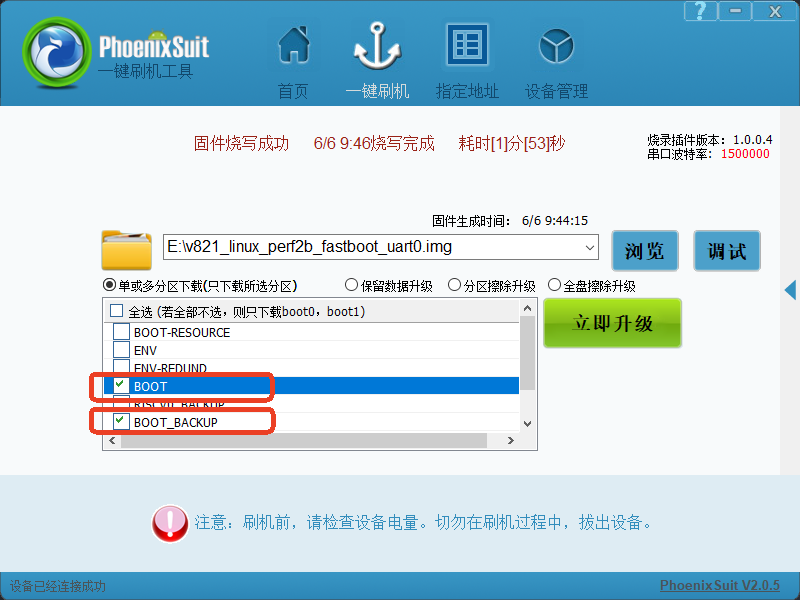

3.  只更新设备树：由于内核与设备树是打包在一起在 boot 分区的，所以更新boot时也会更新内核，勾选 boot 即可


如果使用双备份，更新时需要主 boot 和备份都更新


4.  更新小核固件：勾选 RISCV0 分区即可

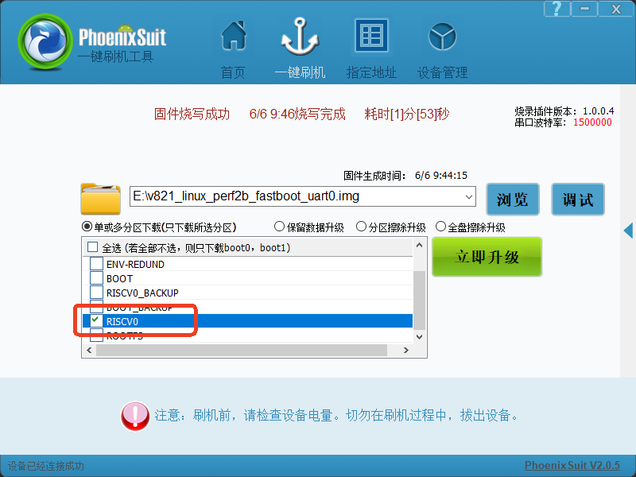

如果使用双备份，更新时需要主 RISCV0 和备份都更新

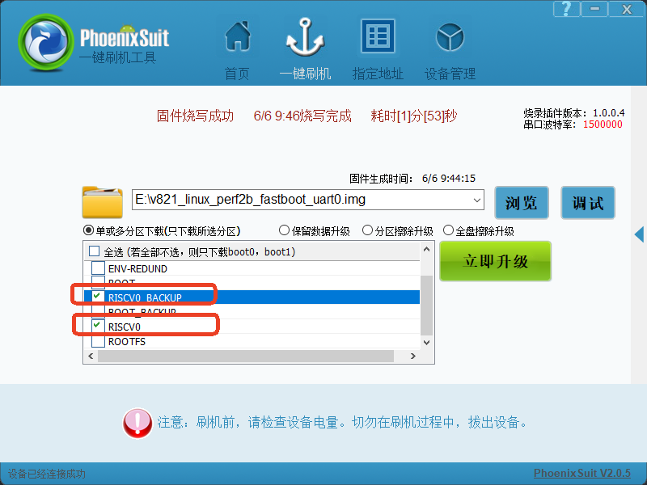

5.  更新 ROOTFS：勾选 ROOTFS 分区即可

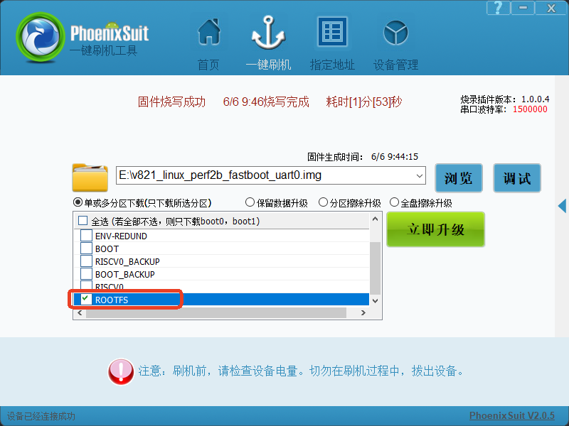

### Linux 下烧录

:::note

:::note

备注

:::
:::note

-   PhoenixSuit Linux 下载地址：[https://www.aw-ol.com/downloads?cat=5](https://www.aw-ol.com/downloads?cat=5)


:::

:::

Linux 版本 PhoenixSuit 支持的发行版本包括 Ubuntu、Fedora、Redhat 及 CentOS 等几个常见的发行版本。目前驱动已经可以支持 4.11.0 版本以上内核，建议安装内核版本号大于4.11.0 的 Linux 发行版本。

#### 安装 PhoenixSuit-Linux

-   下载 PhoenixSuit 到 Linux 中，解压

![image-20230823150847476](data:image/png;base64,iVBORw0KGgoAAAANSUhEUgAAAMgAAABuCAYAAABiHVxtAAAVp0lEQVR4nO2deXxU1b3Av2e2zCQhCxIgrJE17KAiolIrVUTLU1wo4tIHdQWl+IrytLgAKipqRVGs1h0UWrG+Z1VQcQNeLSJWBCo2KGg0oBCSEBLILPf3/kgmmczc3JnJNhM5389HmfnNufecm3O+95xzVyTJ8W2eK0MH3yKbfMFAobwyta/kjFsqOzbOlaEnLJCtfhHxbZJbhp8vy0pDFi7fKk9fmi+dT1kg/zho1IYDe9+Qqwfky/UvrZQZI3rJ6fPelx8DrblVbQxjrzw5Lksmrzpi9qNU7tkiq59dLuv3GSJyWP5yUaaMf2qfVP/Fj8imuUMkffT98qXffPXe/5stfbpcJW9VtdgWNBoHbQgp2cwTMy5h7hfjWf7WNfTeMw9b5UHKAyCHCtjp78a4VOBIIetefJiFdz/LV8fdwd/emMkJ7RRSsZv1f1nK3XeuwHvFy/zvxSfR7qyu3HnBJZzx41LWLJlAri3RW5msHGbVJVl4rP4+068EwPAJY8dXhwI7lvK7R4uZ+Ow0+tpbvpTNTRsSxMuWpXN4yriG19bewCkdbJB2Nhf3mcXVwwcSUGkMuOoJRjkB/14+XneA0xZ/xCvn9iOtZg2B79/mhTUBLnjhY644Nbd649ufym2vvUy7hVso9kFuSuK2MHlxkTvsTG6f+1du/5kzSlovH8y7gNW51ensPX7B1Hl9OOe8Y1ANLKHa9WD4cZVkNZQggSgRkUQXQqNJVvSAQqOxQAui0VigBdFoLNCCaDQWaEE0Ggu0IBqNBVoQjcYCLYhGY4EWRKOxQAui0VigBdFoLEi6ixUrKyspKyvj0KFD+Hw+fD4fIkIgEGjWfOx2O0opnE4nLpeL9PR0MjMz8Xg8zZpPm6ayADn0T1TVbgx/OQQOAwZKfCGJFNVXIaq676G/1f6rQn4KiSsQ5QTsKHsa2NPB3QOVNhjcvVpmu+IgaS5WNAyDwsJCSkpKyMrKIj09HafTidPpRCmFzWYjlqIqZX1JaHAdhmEgIvj9frxeLxUVFZSVlZGdnU23bt2w2Y7iztWoRL5bihz6JwQOgv8Q4AMJAAJiYC5GdWzRC8UAzPlNH8t0tZ+xVf9rswFOsKWAzYNKH4LqNK36e4JImh7k22+/pbKykv79+wN1DVlEEBEMw6hNayVKNEHC1+FwOHA4HKSlpZGTk0NhYSGFhYX07NmzsZvS5pHCxUjZBvD+aN47KBUlVhOPSNeQLDX1KQZQBQEvBMqRgxtRCOROb+YtjJ2k6EEqKyv5/PPPGTJkSFzLmRU9VkGs1rFt2zaGDRt2dA63Kndg7JwNvh9DgrGKUV+CJat8gGLmxTlRepEGYqLA5sGWNw/cec24kbGTFOOI/fv3k52dHXfjVkrFvUy0dSilyMrKYv/+/U1ab1slULoBAuU134KNVoGy1X23jKmwGGExm0m68Bh1y0oV/rKPW2XbzUiKIdaBAwfo2LFjTHMMM4INvCmdYeg6MjIy2L9/P927d2/0+toqUr4FJV7qhkhQ15CJqRdZ9Hz10GzOFf0t00X2IhCxbgyo/KLpG9ZIkkKQyspK3G43SqkmN/LmWIfT6aSioqLR62jLiPeH6g/19vDEJ4uyFigyRuTvtQIZiL+4KZvUJJJCkKqqKpzO6nuYm7s3aAxOp5OqqqpG59+WsUs59SSIOOJkFav+POc/OwOwZOU+AGZO6WSarg6TngVq0tlRgbJm2LLGkRSCBAKBiMOqiRTF4XDg9/sbnW9bRoyqmuYZjxhmsfAGH4sYZsuCksTVRVIIIiINTrYTIUpTh2ltGYVEmStEl2XRc3sBxZwr82mKGLUx8TbT1sVPUggSeo6jIVpblKNVkGpC9/rB75jEGpLFap4Rhxg1nxWJq4ukECQeWkuUo1sQWxQxzGJ18TnTugCKJSuqJ/wzp+TWXyb4OYoYkbHWJ6kF2bFjBw6Hg7y8PByO+kVNhsn8T5KYz35bxaIMqaLOWcJiogUxpaioiKKiIj799FN69+5Nv379aNeuXb00WpTmpqEhUuyyLHquCIA5Vw4kuhhmMTPBEkPSCGI2MR47diz79u2joKCAgoICduzYQZcuXRg4cCCdOnWKWL45ygBHuyjKRAzilIUG0sUqS1hZ9BCrGrMGmpOTQ05ODiNHjmTjxo3s3r2biooKJkyYEPM6GluOoxJlqxnSxDNXCJUI5kzrTvUcpAiUYuaUribpzATEJKZQugepT2gj9/l8fP311xQUFFBaWkpqaip9+vSJax2aeFB1/8U9iQ6ToDZuq4uZpauXNyFihKVNAEkpSJDNmzdTUFCA3++nU6dOjBkzhu7du8d1r4YWJV5Ch1jxiFEXW/RsIQBzrqy5OrvRYtTEVOKuqU1qQQKBAHl5eQwYMICsrCw9EW8NlAIJNshok+jGD8PqpVVBJaIMwxJAUgsyatSoet/1EavWIN6JdaQYc35Tfe/Gkpe+A2DmJT0sxag3z4gqVeuS1II0hBalBTEdXhFjzGSPH3EUSsUvRgKrqE0KArBs2TLTeGpqKoMGDSI/Pz+m9WhRwgmdpId+J86YYualobcth4sRGTPrWfQkvZGMGDHCNO50OunQoUPc69OiBLGZjP/jk2XRM98A4EnLAkJFaUgMs1joJF0Lgt1e/YbHWBvo0KFDTeNH85W4zYJSYMskUgxMYmay1InhSc2s/tneLg4xTGJG4u7NSRpBguj5RaJRxHbeoqFJdH1xVO3/g+kakq2hWPjn1iXpBAmiRUkUsc4LMBGDWgnqzRwadelK6E9akAbRorQy4Q23EecyFDDz0jxwtOOpVYUmy1rJEvpT+NCr9Ul6QYJoUVqL4N7cal4QEm/oJF+9w8WqCWLoSXpcaFFaGGVyFMvs8nOLcxlul50lL36DJzWTFJctTBZiFIPI5RJAmxMkiBalpQjf64f9FsO5jKsm9ayO2dOJFAPqNXhLMULLkxjarCBBtCjNjSLy4sBYxDCLmR0NC/8YZX5iWp7Wo80LEkTfMNVMWF4WEhkzS9dwDAsxwmIRnxPDT0aQIPqGqaYSuUdXoXHTSXS0WMhP4Q3fLBZeDi1I86N7g8aiTMTAfF4Qtxhm6aKIoYJ5J4afrCBBtChxomxEvS8jppN8cfQ2Zp/rCaQFafFrqLQosaGCb3uKSYzwWE08onFHEwOTdKHzlqN8kt6aFxjGIophGEfvPERFO2/RkBhm6Rp4AB0msYh01MYEe8L6kKQQBKyfz9sSRBPlaH1HYXVjDDZak4Ydkxg1sQaPToXELMSoKRCJbKZJIYjdbm91QYKYiZKosiQDolwhc+JwMaCeHLEOw8zmGtHECAaU1LwFNzEkxW7S6XTi9SbuCd5QLUpQCq/Xi8vlSmh5EoVhS6/5FDIXMRtymV1rFf5KtuAwKyKdyfzE9Oy5AgTDVv9pmq1JUgjicrnw+XxJsddWSuHz+XC73YkuSkIwbFkgEoMYDQnUgCymMSzEqIvXSdv6JIUgGRkZlJSUAPX35ImipKQk4hnARwuGs3fIUCek4YaLETUWKkJ4z4LJXKaBnkcCGPYeLbW5UUkKQTp06MCePXvqvSckUaIEAgH27t3LMccc0+p5JwOSNhQkUPPNqocwEaPBmFkvRF0e4cOw2mUB8SHu2B7A0RIkhSDZ2dm43W4KCgoiXqbTmqIEAgEKCgpITU0lOzu7VfJMNpzpfalQAwkE/GGN2+z1zbHKEvwpFjGq8xGBgL+CCumNKy1xPYiSJDlzVlxczK5du6isrKRr165kZWXhcrlwuVyISO37QaIVN1aZDMPAMAz8fj9VVVWUlpZSVFREamoqxx57LO3bt2/yNrVVSg/8gPHjizh9O3A4nDicdmw2W83fVqFUtBfs1MRtaWHpTJahesqDAhEDQwS/z4ffV4XP0Rtb+/PIys5p0e21ImkEERHKysooKSnh4MGDVFRU4PP58Pv9iAiBQCD6SuLAbrejlMLhcOByuUhNTSUjI4Ps7GwyMzMTPg9KJMG6OHJwJ4HybUjVNyijHPFXYogfJb6Q1Co2WWpjRMSEFGx2B8qWhtjTUa5u2FLz8WTkJbwukkaQID6fj6qqKrxeL4FAoHbIFct7DOMheCLQZrNht9txuVy43e6IN1kdzei6SEJBNJpkIikm6RpNsqIF0WgsaDlBZD8bHr+Z+au+pnmn15q40XXRaFpOEGMP7z35MCs2Fyfu6fW+j5g7NIcBsz/gcGvnJeXs+vsbrN1+MJFP769G10Wj66Jxgkgxf7msK2lOGzabDac7g859R3HuzCV8WORv1CpbBFsGXfv1p3+3LOxREwulnzzJjHGD6ZKRgjMlg879RnPhvLfYG8tBm/C8fJu4f9KF3L5mX8s2Sl0X0fNqQl008jian9J9xfhPupU1951NmvcgPxSs5/lF/824NV/w2qbHOCsZLmWyD2LGqg3MiCGp7HuZa8+Zwds9pzJ36d0MbG+w78uP2WTPJCuW3UgceTUvui6aklf0wjQGY688MS5F3BNflPKQcNVHN0k/RzuZ/PIhEf/nMn+4S9K695feHVLF5c6SniddJos/KhEjuID/e3nn7ovlxB4ZkpKSKT1PnCL3vFsk/tC8vLvl9TsmyUl9OkiaJ1uOPXWaLN1UWr2OQKGs+u0ZMqJPZ8l0O8QRnof/c5k/3C39b/5YfGLID3+9XLq7B8mN62tK7f2XPPizTOkyeaXsfme6dHHmyax1XvNtrnpXpndJkdEP7JRATSjw9UNyqrurzHivKiyvYHqbUH3Lj4BbLlxZ0ag/tyW6LkSk5eqiWecg9rR0PMrH4SN1XXtq/kXMf+411rzyBy5yreHGSTfxVjnAYTbefg7n3ruDwTctY/Xq55k9cDsL/2MCCzYdqVm6gg2/P4dfPX2I8fe8yofvPcfV2Wu54fwbWXMQkBK2r1vPD4Nns/z1t1n950VMtK8OySMURceJD7D4ojIem34XH1X4+HLpddy5czx/eGgS3Y/tSy9HEe+8+CbfNNvrKJwMv/FNtmzdytatm3nobE9zrTgqui7CaWRdxKRROMG91rnPyb7Dh6WidK8U/OPPMndsJ7FnnCmP7wpEWiwivs1zZZCrh8z8wCvGgZVyUVaKjLr3i7q9lG+73H1CimRPfllKRcQoXi7nZ2TKxGX7avd0gW8fkdNSOsi0N46Y5/HJ72VgTR5mvxs/rJJLu6XKkEuvkJ9ld5HJK4tq9kKH5Yvnr5Dj2jvEnTtSLrppqby9s7xuD9uovVb99C2CrovqsrRQXTSpBzny2lRyPB7SsjrTd/Tl/HHfKcxb9TxX5Zmv1p7Xh562YvYfMPB/uZktld0Zc1rvukmboy+njelKxWef8G8/+P/9GVsrynn9im543G7cbjepfWezwVvOnj3mRyTseX3Iq8nDDNXxAh6472z2rHiGT0fN58FJuTVHKtzk//opPin8incfmEjWJ4s4f2A/zrhrAyUJPwwVHV0XLUOTLnZxnTafNfeNp11KOu279KRnxzTLIxTK7sCBQcAAkOhHFETAlsslz6zhluNDi2ojPbc9ir2ReTicIXmYrbOEz9Z9RmW7DPh4FX/bNY1re9eVWqX24ORLfs/Jl8zi+nvPZsztM1g84VPmD7Jht4Pf54v9SEgrXmOn6yIKjayLJvUgtuw+jBx1IicMH0ivKBUSjqP/8QzzFLL+w5CTV/4C1m34ntRhx9PPAY6+QxmY8iNbCgL0ys8nv/a/fnTLjCe3IELxm3OYsaIjt723jruHbmTu9CfYaXr2LI1B435Gd9lFwa4A2HLonCN8s2MnR8ySh6M8pHqgrKSM5r20zxxdFxY0oS4Sdrmkyj6XG6/LZ+zCi7kmfQGXDRK2vnAb92wfyA2PTiAToMNEbrjiHs6+fzKXOuYy7ZQepFQUsv1Ab6ZePpqMOPOUsrXcNmsl7Wev57+OG4r98dv464m38dtnzuGVIau49tkKRp9+HL06pmIUf8EbjzzJl6mjmTnCCfb+TDhvEHfedzPXDq/i8mHtYddW9jf0F3f047ihbh5ZcS+PjprOEPmGfTnnMnl0+9bsWGJC14VVQRtDA4cW62EyKZPSZXKu2yO/WnWkJs138vZdk2Vk9wxJScmQHideLAvXhh9a/FZW3zlFTurVXjwOh3iOOVZGXfNnKQzEkEe9373y2bwR4ul9vbxXW+gjsvGWwZLS9dey/N2nZdbEk6Rvp3Rx2uySktlVhpxxlSxe/0PdxO7wDnnpt2dIvw4ecdhdkt6hpwwec7n8abvftCxV/14u15zcQzJcDvF0yJfzl26vv23Nga6LFq0Lfbm7RmOBvppXo7FAC6LRWKAF0Wgs0IJoNBZoQTQaC7QgmpajNW+SaiG0IJqWI66bpJITfR5Eo7Gg7fUgxl5W334hpwzoQqbbRUpmTya/UIThfY8ZXd2c/OBXtdfbGLsWM8bTjeve94LxHa/MOpPj+uaS5XHi9GSTN/pyHv5HaeLvGW/DeN+5hly7qn2GslIK5chj1jofBLayYISH/Fs24QcwvufV2eMZ2S+XTLcTV1onBvziah79+/5WuV6tMST+0XXxIvvY9LfX+brPPF547FSy/SXY+3XCxo4oywVv6LmL5X88HnfFTl5fdAs3TrqJ/v/6E+OT4bbUNojz5Dv44POZ+ATwfcmTv76Mp51TmDTcpGnJAba+9wHfD1zAsseOx125i/f/eCc3nrWF0nXruHVESquXPxptTxAAbGQOPoNfjh1ZtwExvaBK0S7/NMb/YiQOTufnXXfzzsnLefNTH+NPS9xrvtoyKq0L/Qd1ASrZdMdUntkzhvs2LODUDIX5M4YUGQNO55wzq+tu3FnDUCNP4eE/rGHWsvNItv1U2xtiNSPRbujRxIpw8MNbmXr/Hn756LPMyI9jZ+Mezlk/78zBf35CQRI9hCVIG+1BTFDx30QT9YYeTUzIwfe59eqlHJq0kiWTu8a911U2W807EJKPn04PEu9NNJpm4hDr513Hn45M4dEHz6NjvDe7BL7i7x/twTNoKL2TcHed9ILI/lf5Ta/2DJi1loiHY4RScxNN2cs3c+3iV3j7/fdZ+77FTTSaRhFeH94tD/G7x7/j+GmXkrd3O9u2bWPbtn/xbVlDf/gA3732AAufeZW333mVR66awsItxzJ1xjnVN2YlGUnobCQiMdwzjYNhc1bwbPH1zLv7claWBHBn55I3aiwjOrXV01TJSV19BNi95nU+P3II3/wzGTo/mMLNect/5H8uNlta4XYVs/aeK1n4zRGy+p/O9BUPs+DniXuTrRX6RKGm9QhsZcEJJ/LS+HVsu2dkm9g7J/0QS6NJJFoQjcYCPcTSaCzQPYhGY4EWRKOxQAui0VigBdFoLNCCaDQWaEE0Ggu0IBqNBVoQjcYCLYhGY4EWRKOxQAui0VigBdFoLPh/3WmFTbdH+9UAAAAASUVORK5CYII=)

-   安装依赖 dkms，对于 Ubuntu 可以用 `sudo apt install dkms dctrl_tools` 来安装

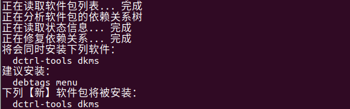

-   打开终端，输入 `sudo ./PhoenixSuit.run` 来运行安装程序。

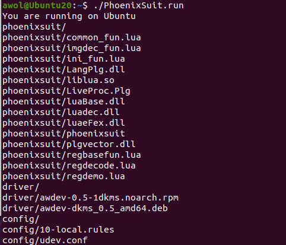

安装完成后默认目录在 `~/Bin/phoenixsuit` 目录下

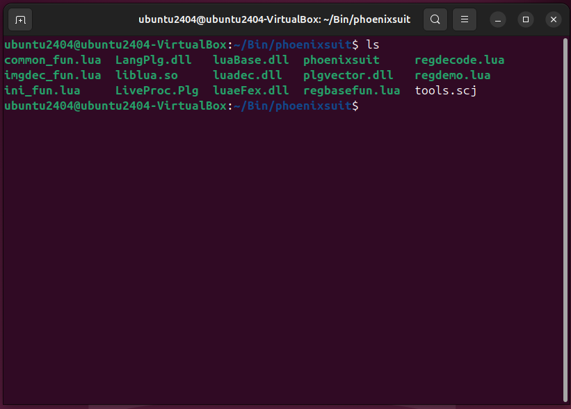

#### 烧录固件

使开发板进入烧录模式，使用命令开始烧录

```
./phoenixsuit <path/to/img>
```

例如

```
./phoenixsuit ../../tina-v861/out/v861_linux_ipc_uart0_nor.img
```

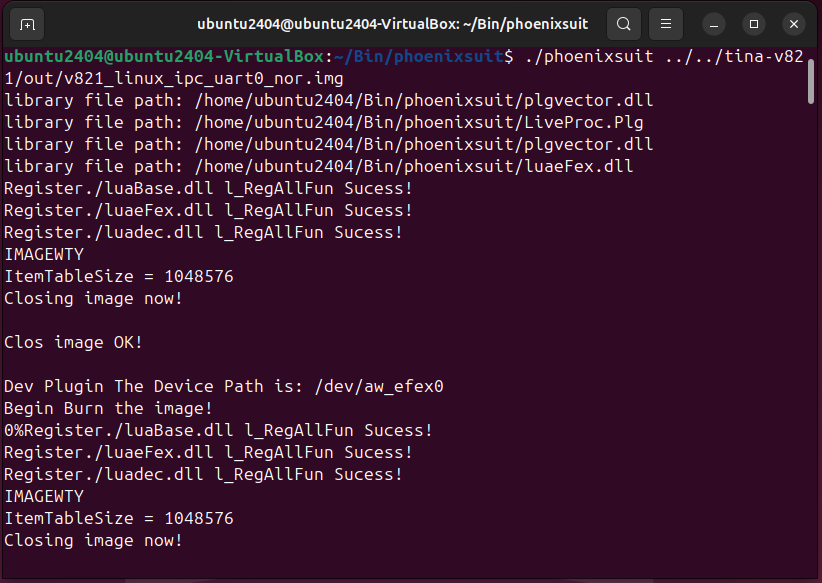

等待一会便烧录完成

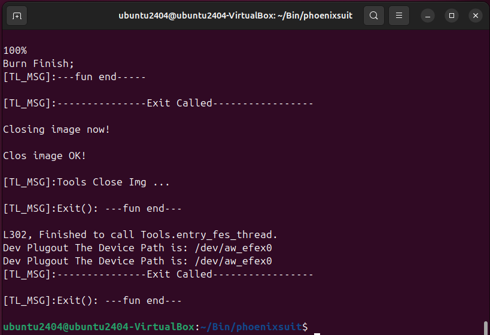

## 开发板如何进烧录模式

设备需进入烧录模式，以下几种情况会进入烧录模式：

1.  BROM无法读取到正确boot0镜像。例如裸片flash不包含数据会自动进烧录；上电时短路flash阻断通信（可以短接CS和GND）；用户态人为破坏boot0镜像（echo xxx > /dev/mtdblock0）。
2.  在串口中长按2进入烧录。即，在串口工具输出框中，长按键盘的'2'，不停输出字符'2'，上电启动。boot0检测到此字符，会跳到烧录模式。
3.  当板子有FEL按键时，按住FEL按键上电。
4.  PhoenixCard制作的量产卡，插入量产卡上电会进入烧录模式。

**提供的开发板可以长按UBOOT键后上电，PhoenixSuit开始烧录松开UBOOT。**
