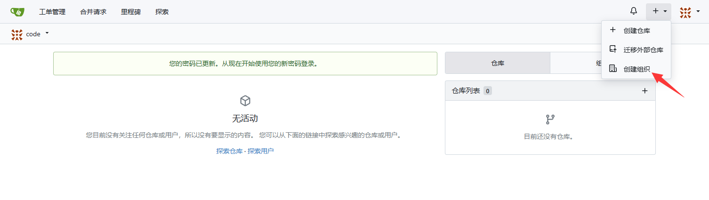
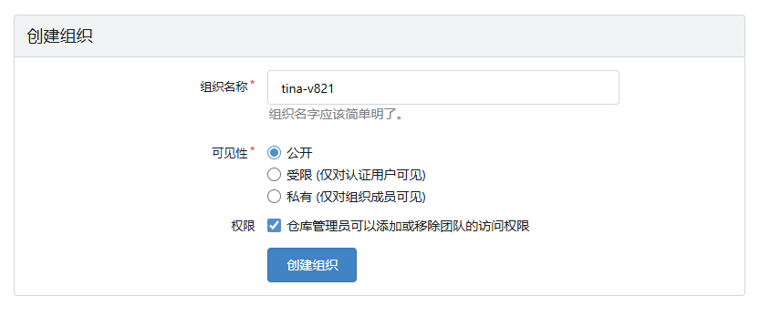
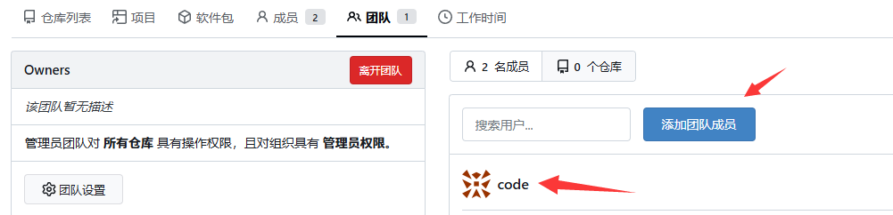
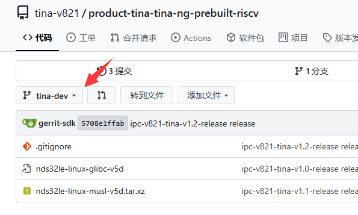
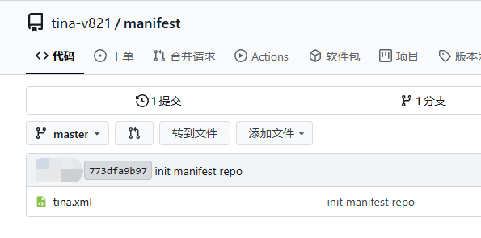
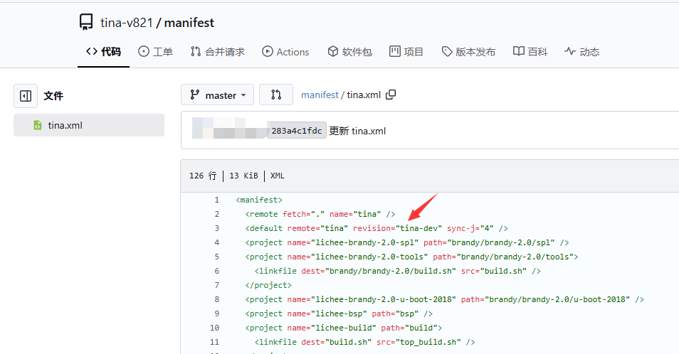

# SDK 使用 Gitea 管理开发

## 关于Gitea

Gitea 是一个轻量级的 DevOps 平台软件。从开发计划到产品成型的整个软件生命周期，他都能够高效而轻松的帮助团队和开发者。包括 Git 托管、代码审查、团队协作、软件包注册和 CI/CD。它与 GitHub、Bitbucket 和 GitLab 等比较类似。

Gitea的首要目标是创建一个极易安装，运行非常快速，安装和使用体验良好 的自建 Git 服务。

采用Go作为后端语言，只需生成一个可执行程序即可。 支持 Linux, macOS 和 Windows等多平台， 支持主流的x86，amd64、 ARM 和 PowerPC等架构。

详见 [Gitea - 关于Gitea](https://docs.gitea.com/zh-cn/)

## 安装配置 Gitea

请参考 [Gitea - 安装](https://docs.gitea.com/zh-cn/category/installation) 安装 Gitea 软件，官方文档详细的说明了安装方法和不同系统安装配置的方式。

:::note

:::note

备注

:::
:::note

如果出现 `error: RPC failed； HTTP 413 curl 22 The requested URL returned error: 413`

请参考 [Gitea - 反向代理](https://docs.gitea.com/zh-cn/administration/reverse-proxies) 配置反向代理最大包大小，一般是上传工具链被截断

```
client_max_body_size 4096M;
```

:::

:::

## 创建组织

点击加号，点击创建组织



然后新建一个组织，叫做 tina-v821



创建组织完成


## 安装 Gitea CLI

在下载了 SDK 的 Linux 环境中安装 Gitea CLI，安装方式：[https://gitea.com/gitea/tea](https://gitea.com/gitea/tea)

```
wget https://dl.gitea.com/tea/0.10.1/tea-0.10.1-linux-amd64 -O tea
chmod 777 tea
sudo mv tea /usr/local/bin/
```

执行 `tea` 应该可以看到输出如下

```
   tea - command line tool to interact with Gitea
   version Version: main  golang: 1.22.3

 USAGE
   tea command [subcommand] [command options] [arguments...]

 DESCRIPTION
   tea is a productivity helper for Gitea. It can be used to manage most entities on
   one or multiple Gitea instances & provides local helpers like 'tea pr checkout'.

   tea tries to make use of context provided by the repository in $PWD if available.
   tea works best in a upstream/fork workflow, when the local main branch tracks the
   upstream repo. tea assumes that local git state is published on the remote before
   doing operations with tea.    Configuration is persisted in $XDG_CONFIG_HOME/tea.

 COMMANDS
   help, h  Shows a list of commands or help for one command
   ENTITIES:
     issues, issue, i                  List, create and update issues
     pulls, pull, pr                   Manage and checkout pull requests
     labels, label                     Manage issue labels
     milestones, milestone, ms         List and create milestones
     releases, release, r              Manage releases
     times, time, t                    Operate on tracked times of a repository's issues & pulls
     organizations, organization, org  List, create, delete organizations
     repos, repo                       Show repository details
     comment, c                        Add a comment to an issue / pr
   HELPERS:
     open, o                         Open something of the repository in web browser
     notifications, notification, n  Show notifications
     clone, C                        Clone a repository locally
   MISCELLANEOUS:
     whoami    Show current logged in user
     admin, a  Operations requiring admin access on the Gitea instance
   SETUP:
     logins, login                  Log in to a Gitea server
     logout                         Log out from a Gitea server
     shellcompletion, autocomplete  Install shell completion for tea

 OPTIONS
   --help, -h     show help
   --version, -v  print the version

 EXAMPLES
   tea login add                       # add a login once to get started

   tea pulls                           # list open pulls for the repo in $PWD
   tea pulls --repo $HOME/foo          # list open pulls for the repo in $HOME/foo
   tea pulls --remote upstream         # list open pulls for the repo pointed at by
                                       # your local "upstream" git remote
   # list open pulls for any gitea repo at the given login instance
   tea pulls --repo gitea/tea --login gitea.com

   tea milestone issues 0.7.0          # view open issues for milestone '0.7.0'
   tea issue 189                       # view contents of issue 189
   tea open 189                        # open web ui for issue 189
   tea open milestones                 # open web ui for milestones

   # send gitea desktop notifications every 5 minutes (bash + libnotify)
   while :; do tea notifications --mine -o simple | xargs -i notify-send {}; sleep 300; done

 ABOUT
   Written & maintained by The Gitea Authors.
   If you find a bug or want to contribute, we'll welcome you at https://gitea.com/gitea/tea.
   More info about Gitea itself on https://about.gitea.com.
```

## 配置 Gitea 登录

输入 `tea login add` 进入登录配置

```
? URL of Gitea instance: xxx.com                      <- 输入 Gitea 的服务器地址/域名
? Name of new Login:  (xxx.com)                       <- 不用改直接回车即可
? Login with:   [Use arrows to move, type to filter]  <- 一般选择 token 即可，也可以用 ssh-key，这里与 token 为例
> token
  ssh-key/certificate
  oauth
? Do you have an access token? (y/N)                  <- 选择 N 没有，让他生成 token
? Username: admin                                     <- 输入用户名
? Password:  ****                                     <- 输入密码
? Token Scopes:  [Use arrows to move, space to select, <right> to all, <left> to none, type to filter]
> [x]  all                                            <- 权限选择 ALL 即可，空格选中，回车
  [ ]  repo
  [ ]  repo:status
  [ ]  public_repo
  [ ]  admin:org
  [ ]  write:org
  [ ]  read:org
? OTP (if applicable)                                 <- 没有 OTP 就回车，无视
? Set Optional settings:  (y/N)                       <- 回车，不用配置
```

测试是否可以在目标仓库新建仓库

```
tea repo c --name test-repo -O tina-v821
```

成功输出如下：

```
  tina-v821/test-repo (empty)

  Issues: 0, Stars: 0, Forks: 0, Size: 22 Kb

  Updated: 2025-07-01 04:02 (0s ago)

  • Browse:     http://xxx.com/tina-v821/test-repo
  • Clone:      git@xxx.com:tina-v821/test-repo.git
  • Permission: admin
```

如果显示失败，请将用户添加到团队成员

```
Error: Given user is not allowed to create repository in organization.
```

点击组织，团队，添加团队成员即可



## 配置本地仓库提交 Gitea

先在 SDK 根目录新建一个 Python 脚本 `gitea-import-repo.py` 写如如下代码：

```python
import os
import subprocess
import sys
import re
import xml.etree.ElementTree as ET

remote_revision = 'tina-dev'

def run_command(command, error_message, dry_run=False):
    """Runs a shell command, with optional dry run support."""
    if dry_run:
        print(f"[DRY RUN] Command: {command}")
        return
    try:
        # Using capture_output to prevent subprocess from printing directly
        # We can print it ourselves if needed for debugging.
        result = subprocess.run(
            command, check=True, shell=True, text=True
        )
    except subprocess.CalledProcessError as e:
        print(f"Error: {error_message}\nCommand: {e.cmd}\n")
        print(f"Stderr: {e.stderr}")
        sys.exit(1)

def parse_git_url(url):
    """
    Parses a Gitea or other Git provider URL to extract domain, owner, and repo name.

    :param url: The Git repository URL.
    :return: (domain, owner, repo_name) tuple.
    """
    # Regex for git@domain:owner/repo.git format
    ssh_pattern_1 = r"git@(?P<domain>[\w.-]+):(?P<owner>[\w-]+)/(?P<repo>[\w.-]+)\.git"
    # Regex for ssh://git@domain/owner/repo.git format
    ssh_pattern_2 = r"ssh://git@(?P<domain>[\w.-]+(?::\d+)?)/(?P<owner>[\w-]+)/(?P<repo>[\w.-]+)\.git"
    # Regex for https://domain/owner/repo format (allowing .git at the end)
    http_pattern = r"https?://(?P<domain>[\w.-]+(?::\d+)?)/(?P<owner>[\w-]+)/(?P<repo>[\w.-]+?)(?:\.git)?$"

    if match := re.match(ssh_pattern_1, url):
        return match.group("domain"), match.group("owner"), match.group("repo")
    elif match := re.match(ssh_pattern_2, url):
        return match.group("domain"), match.group("owner"), match.group("repo")
    elif match := re.match(http_pattern, url):
        return match.group("domain"), match.group("owner"), match.group("repo")
    else:
        print(f"Error: Invalid Git repository URL: {url}")
        sys.exit(1)

def check_or_create_gitea_repo(gitea_repo_url, private=False, org=None, dry_run=False):
    """
    Checks if a Gitea repository exists and creates it if it doesn't.

    :param gitea_repo_url: URL of the Gitea repository.
    :param private: Boolean indicating if the repository should be private.
    :param org: Organization under which to create the repository.
    :param dry_run: Whether to perform a dry run.
    """
    _, owner, repo_name = parse_git_url(gitea_repo_url)

    # If an org is specified, it becomes the owner. Otherwise, it's the logged-in user.
    # 'tea' handles this based on the owner in the repo string.
    repo = f"{org}/{repo_name}" if org else f"{owner}/{repo_name}"

    # Check if the repository exists
    print(f"Checking if the repository {repo} exists on Gitea...")
    repo_check_command = f"tea repo {repo}"
    result = subprocess.run(repo_check_command, shell=True, stdout=subprocess.PIPE, stderr=subprocess.PIPE)
    if result.returncode == 0:
        print(f"Repository {repo} already exists.")
        return

    # Create the repository if it doesn't exist
    print(f"Creating Gitea repository: {repo}")
    visibility_flag = "--private" if private else ""
    create_command = f"tea repo create --name {repo_name} {visibility_flag}"
    # Specify the owner only if it's an organization
    if org:
        create_command += f" --owner {org}"

    run_command(create_command, f"Failed to create Gitea repository: {repo}", dry_run)

def archive_repository(gitea_repo_url, dry_run=False):
    """Archives a Gitea repository."""
    _, owner, repo_name = parse_git_url(gitea_repo_url)
    repo_full_name = f"{owner}/{repo_name}"
    print(f"CLI does not currently support archiving (https://gitea.com/gitea/tea/issues/454). Skipping...")
    # print(f"Archiving repository: {repo_full_name}")
    # tea uses 'repo edit --archived=true'
    # archive_command = f"tea repo edit --archived=true {repo_full_name}"
    # run_command(archive_command, f"Failed to archive repository: {repo_full_name}", dry_run)

def get_git_remote_info():
    try:
        result = subprocess.run(['git', 'remote'], stdout=subprocess.PIPE, stderr=subprocess.PIPE, text=True)
        if result.returncode == 0:
            return result.stdout.strip()
        else:
            print("ERROR：", result.stderr)
    except Exception as e:
        print("ERROR:", str(e))

def import_repository(external_repo_path, gitea_repo_url, private=False, org=None, archive=False, dry_run=False):
    """
    Imports an external Git repository into a new Gitea repository.

    :param external_repo_path: PATH of the external Git repository.
    :param gitea_repo_url: URL of the Gitea repository.
    :param private: Boolean indicating if the repository should be private.
    :param org: Organization under which to create the repository.
    :param archive: Whether to archive the repository after importing.
    :param dry_run: Whether to perform a dry run.
    """
    global remote_revision

    check_or_create_gitea_repo(gitea_repo_url, private=private, org=org, dry_run=dry_run)

    print(f"\n=== Importing repository: {external_repo_path} ===")

    if not dry_run:
        os.chdir(external_repo_path)
    
    remote_revision = get_git_remote_info()
    print(f"Setting remote URL to {gitea_repo_url}...")
    run_command(f"git remote set-url {remote_revision} {gitea_repo_url}", f"Failed to set remote URL for {gitea_repo_url}", dry_run)
    
    run_command("FILTER_BRANCH_SQUELCH_WARNING=1 git filter-branch -f -- --all", f"Failed to git filter-branch {gitea_repo_url}", dry_run)
    
    run_command("rm -rf .git/shallow", f"Failed to remove shallow {gitea_repo_url}", dry_run)

    print(f"Pushing repo to Gitea at {gitea_repo_url}...")
    run_command(f"git push -f {remote_revision} HEAD", f"Failed to push repository to Gitea: {gitea_repo_url}", dry_run)

    if not dry_run:
        os.chdir(os.path.dirname(os.path.abspath(__file__)))

    if archive:
        archive_repository(gitea_repo_url, dry_run)

def process_repositories(repo_list, gitea_base_url, private=False, org=None, archive=False, dry_run=False):
    """
    Processes a list of repositories.

    :param repo_list: A list of tuples containing external and Gitea repo URLs.
    :param private: Whether repositories should be private.
    :param org: Organization under which to create the repositories.
    :param archive: Whether to archive repositories after importing.
    :param dry_run: Whether to perform a dry run.
    """
    for manifest_info in repo_list:
        for repo_name, path in manifest_info:
            gitea_repo_url = f'http://{gitea_base_url}/{org}/{repo_name.replace('/', '-')}'
            import_repository(
                path, gitea_repo_url, private=private, org=org, archive=archive, dry_run=dry_run
            )

def process_repo_manifest(file_path, manifest_name):
    manifest_path = f'{file_path}/.repo/manifests/{manifest_name}'
    tree = ET.parse(manifest_path)
    root = tree.getroot()
    projects = root.findall(".//project")
    return [(project.get('name'), project.get('path')) for project in projects]

def process_gitea_manifest_repo(file_path, gitea_base_url, manifest_name, private=False, org=None, dry_run=False):
    global remote_revision
    manifest_path = f'{file_path}/.repo/manifests/{manifest_name}'
    gitea_repo_url = f'http://{gitea_base_url}/{org}/manifest'
    check_or_create_gitea_repo(gitea_repo_url, private=private, org=org, dry_run=dry_run)
    tree = ET.parse(manifest_path)
    root = tree.getroot()
    for project in root.findall('project'):
        name = project.get('name')
        if name:
            new_name = name.replace('/', '-')
            project.set('name', new_name)
    for remote in root.findall('remote'):
        remote.set('fetch', '.')
    for default in root.findall('default'):
        default.set('revision', remote_revision)
    
    if not os.path.exists('manifest'):
        run_command("mkdir manifest", f"Failed to create manifest dir", dry_run)
    else:
        print("Manifest directory already exists.")

    if not dry_run:
        os.chdir('manifest')
    tree.write('tina.xml')
    run_command("git init", f"Failed to git init manifest", dry_run)
    run_command("git checkout -b master", f"Failed to git checkout -b main manifest", dry_run)
    run_command("git add .", f"Failed to git add manifest", dry_run)
    run_command("git commit -m \"init manifest repo\"", f"Failed to git commit manifest", dry_run)
    run_command(f"git remote add origin {gitea_repo_url}", f"Failed to remote add origin manifest", dry_run)
    run_command(f"git push -u origin master", f"Failed to push origin manifest", dry_run)
    if not dry_run:
        os.chdir(os.path.dirname(os.path.abspath(__file__)))
    run_command(f"rm -rf manifest", f"Failed to rm manifest", dry_run)

def main():
    # For Gitea repositories that don't exist, should they be made private?
    private = False
    # Archive repositories on Gitea after successful import?
    archive = False
    # Enable dry run mode? (This will print commands but not execute them)
    dry_run = False

    # Pre-flight check for 'tea' and login status
    gitea_base_url = None
    try:
        result = subprocess.run("tea login default", shell=True, check=True, text=True, capture_output=True)
        gitea_base_url = result.stdout.replace('Default Login:', '').strip()
        print(f"--- Successfully authenticated to Gitea as: {gitea_base_url} ---")
    except subprocess.CalledProcessError:
        print("Error: Gitea CLI 'tea' not found or you are not logged in.")
        print("Please install 'tea' and run 'tea login add ...' to configure access to your Gitea instance.")
        sys.exit(1)

    print("\nThis script imports local repo repositories to your Gitea instance.")
    file_path = os.path.dirname(os.path.abspath(__file__))
    
    manifest_path = f'{file_path}/.repo/manifest.xml'

    if not os.path.isfile(manifest_path):
        print("Error: File .repo/manifest.xml not found. Please provide a valid file path.")
        sys.exit(1)
    
    git_repo_list = []
    manifest_name = None
    # Parse the XML file
    try:
        tree = ET.parse(manifest_path)
        root = tree.getroot()
        
        # Now you can process the XML
        # For example, let's find all the <include> tags in the manifest
        includes = root.findall(".//include")
        
        # Print the names of the included manifests
        for include in includes:
            print(f"Including manifest: {include.get('name')}")
            manifest_name = include.get('name')
            git_repo_list.append(process_repo_manifest(file_path, manifest_name))
            break
    except ET.ParseError as e:
        print(f"Error parsing the manifest.xml file: {e}")
        sys.exit(1)
    
    org = input("For repositories that don't exist, enter the Gitea organization (leave blank for your personal account): ").strip() or None

    print("\nThe following actions will be performed:")
    for manifest_info in git_repo_list:
        for repo_name, path in manifest_info:
            gitea = repo_name.replace('/', '-')
            print(f"- Import {repo_name}: {path} -> {gitea}")
            if archive:
                print(f"  -> Then archive {gitea}")

    if not dry_run:
        confirm = input("\nDo you want to proceed? (yes/no): ").strip().lower()
        if confirm not in ["yes", "y"]:
            print("Operation canceled.")
            sys.exit(0)

    process_repositories(git_repo_list, gitea_base_url, private=private, org=org, archive=archive, dry_run=dry_run)
    process_gitea_manifest_repo(file_path, gitea_base_url, manifest_name, private=private, org=org, dry_run=dry_run)
    print("\nImport process finished.")

if __name__ == "__main__":
    main()
```

然后配置保存身份认证，可以用下列命令配置：

```
git config --global credential.helper store
```

然后执行脚本

```
python3 gitea-import-repo.py
```

在这里输入组织的名字，例如上面新建的 `tina-v821` 组织

```
--- Successfully authenticated to Gitea as: xxx.com ---

This script imports local repo repositories to your Gitea instance.
Including manifest: tina.xml
For repositories that don't exist, enter the Gitea organization (leave blank for your personal account):
```

出现询问是否进行处理，输入 `yes`

```
Do you want to proceed? (yes/no): yes
```

如果出现需要输入账号密码的情况，输入登录注册的用户账号密码即可，等待处理完成

```
Import process finished.
```

然后进入 Gitea 查看托管的仓库的分支名，随意选择一个仓库，可以看到分支名是 `tina-dev`



找到 manifest 仓库，编辑 `tina.xml`



将 `revision=""` 中写上分支名



至此 SDK 就已经被托管到 Gitea 中了，可以很方便的进行本地化开发工作

## 从 Gitea 拉取 SDK

执行命令

```
repo init -u http://xxx.com/tina-v821/manifest.git -b master -m tina.xml
repo start tina-dev --all
```

便可从 Gitea 拉取仓库进行开发，仓库修改直接使用 Git 提交即可
