# SDK 内核调试指南

本文档介绍如何使用 CKLink 调试器配合 GDB 对 V861 SDK 的 Linux 内核进行调试，包括硬件连接、软件环境配置、调试会话操作等内容。

## 概述

### 调试工具简介

V861 SDK 内核调试采用「CKLink + GDB」的调试方案，下表帮助您快速了解该方案的特点：

| 工具 | 功能概述 | 适用场景 |
| --- | --- | --- |
| **CKLink** | 平头哥 RISC-V 调试器，内置 GDB Server | 内核调试、U-Boot 调试、裸机程序调试 |
| **GDB** | GNU 调试器，支持断点、单步、变量查看 | 命令行调试、脚本自动化 |
| **VSCode** | 图形化调试环境（可选） | 大型项目调试、可视化操作 |

### 调试架构

```
┌─────────────────┐                    ┌─────────────────┐
│     PC Side     │                    │   Board Side    │
│                 │                    │                 │
│  ┌───────────┐  │      USB/Ethernet  │  ┌───────────┐  │
│  │    GDB    │◄─┼────────────────────┼──│  CKLink   │  │
│  │           │  │                    │  │  Server   │  │
│  └───────────┘  │                    │  └─────┬─────┘  │
│                 │                    │        │JTAG    │
│  vmlinux        │                    │        ▼        │
│  Source Code    │                    │  ┌───────────┐  │
│                 │                    │  │   C907    │  │
│                 │                    │  │   (SoC)   │  │
│                 │                    │  └───────────┘  │
└─────────────────┘                    └─────────────────┘
```

CKLink 通过 JTAG 接口连接目标芯片，PC 端的 GDB 通过网络端口与 CKLink 内置的 GDB Server 通信，实现对目标芯片的调试。

### 硬件要求

| 项目 | 要求 |
| --- | --- |
| 调试器 | CKLink 调试器（平头哥 T-Head 出品） |
| 开发板 | V861-BGA\_PER1 开发板（或其他 V861 系列开发板） |
| 连接线 | JTAG 连接线（10Pin 或 20Pin） |
| PC | Windows 或 Linux 系统 |

### 软件要求

| 软件 | 说明 |
| --- | --- |
| XuanTie Debug Server | 平头哥调试服务器软件（DebugServerConsole） |
| RISC-V GDB | RISC-V 架构 GDB 调试器（SDK 工具链自带） |
| 内核源码 | 带调试信息的内核源码 |

* * *

## CKLink 调试器简介

### 什么是 CKLink？

CKLink 是平头哥（T-Head）推出的 RISC-V 调试器，专为调试 RISC-V 架构处理器设计。它具有以下特点：

-   **原生 RISC-V 支持**：完整支持 RISC-V 调试规范
-   **内置 GDB Server**：无需额外配置，直接与 GDB 对接
-   **多核调试支持**：支持多核处理器的同步调试
-   **多种连接方式**：支持 USB 和以太网连接

### CKLink 型号与规格

| 型号 | 接口 | 连接方式 | 适用场景 |
| --- | --- | --- | --- |
| CKLink Lite | JTAG/SWD | USB | 个人开发、便携调试 |
| CKLink Pro | JTAG/SWD | USB/以太网 | 团队开发、远程调试 |

### 工作原理

CKLink 的核心是一个协议转换器，将 GDB 的调试命令转换为 JTAG 协议信号：

```
GDB Commands ──► GDB Server (CKLink) ──► JTAG Protocol ──► Target CPU
                       │
                       ▼
                 TCP/IP Port
                 (default: 2241)
```

* * *

## 硬件连接

### JTAG 接口位置

V861-BGA\_PER1 开发板的 JTAG 调试接口位于开发板正面，编号 26。全志平台也支持将 TF 卡口复用为 JTAG 功能，也可以用卡口作为调试口使用。

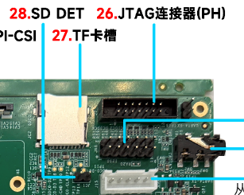

TF 卡口 JTAG 复用功能示例

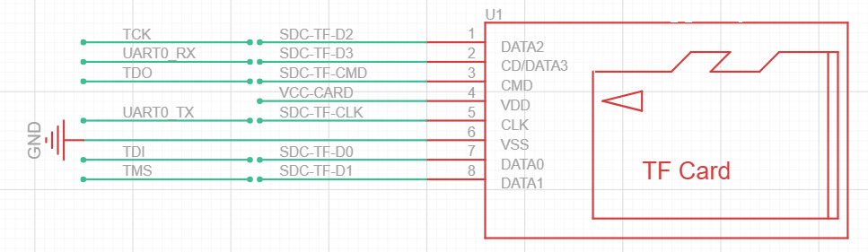

### 接线说明

CKLink 与开发板 JTAG 接口的连接关系如下：

| CKLink 信号 | JTAG 信号 | 说明 |
| --- | --- | --- |
| TCK | TCK | 时钟信号 |
| TMS | TMS | 测试模式选择 |
| TDI | TDI | 测试数据输入 |
| TDO | TDO | 测试数据输出 |
| GND | GND | 地线 |
| VCC | VCC | 目标板电源检测（可选） |
| RST | RST | 复位信号（可选） |

:::caution

:::note

注意事项

:::
:::note

1.  连接前请确保开发板处于断电状态
2.  确认 JTAG 接口线序正确，避免接反损坏芯片
3.  VCC 信号仅用于电平检测，不可用于供电

:::

:::

## 连接示意与配置

在这里我们使用 JTAG 连接 PH 口或者连接 PF 口，

### PH 口连接示意图

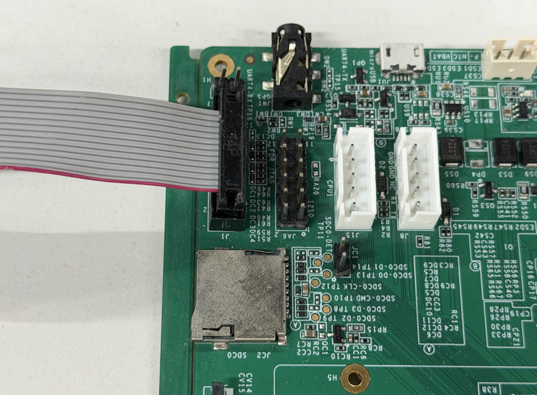

### PH 口配置方式

**C907 JTAG 口**

-   配置 BOOT0 使一开始就切换到 PH 作为 C907 JTAG，配置 `device/config/chips/{chip}/configs/{board}/sys_config.fex`

```
[jtag_para]
jtag_enable     = 1
jtag_ms         = port:PH9<7><default><default><default>
jtag_ck         = port:PH10<7><default><default><default>
jtag_do         = port:PH11<7><default><default><default>
jtag_di         = port:PH12<7><default><default><default>
```

-   如果内核启动了有驱动切换了，需要强制切回来（这里为了方便将PH CFG2全切 mux7，也可以先读出来再把有需要的切到对应的 mux）

```
echo 0x02000154 0x77777777 > /sys/class/sunxi_dump/write
```

**E907 JTAG 口**

-   配置 BOOT0 使一开始就切换到 PH 作为 E907 JTAG，配置 `device/config/chips/{chip}/configs/{board}/sys_config.fex`

```
[jtag_para]
jtag_enable     = 1
jtag_ms         = port:PH9<2><default><default><default>
jtag_ck         = port:PH10<2><default><default><default>
jtag_do         = port:PH11<2><default><default><default>
jtag_di         = port:PH12<2><default><default><default>
```

-   如果内核启动了有驱动切换了，需要强制切回来（这里为了方便将PH CFG2全切 mux2，也可以先读出来再把有需要的切到对应的 mux）

```
echo 0x02000154 0x22222222 > /sys/class/sunxi_dump/write
```

### PF 连接示意图

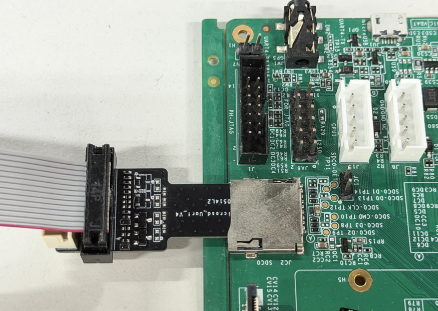

### PF 口配置方式

**C907 JTAG 口**

-   配置 BOOT0 使一开始就切换到 PF 作为 C907 JTAG，配置 `device/config/chips/{chip}/configs/{board}/sys_config.fex`

```
[jtag_para]
jtag_enable     = 1
jtag_ms         = port:PF0<6><default><default><default>
jtag_ck         = port:PF1<6><default><default><default>
jtag_do         = port:PF3<6><default><default><default>
jtag_di         = port:PF5<6><default><default><default>
```

-   如果内核启动了有驱动切换了，需要强制切回来（这里为了方便将PF全切 mux6，也可以先读出来再把有需要的切到对应的 mux）

```
echo 0x020000f0 0x66666666 > /sys/class/sunxi_dump/write
```

**E907 JTAG 口**

-   配置 BOOT0 使一开始就切换到 PF 作为 E907 JTAG，配置 `device/config/chips/{chip}/configs/{board}/sys_config.fex`

```
[jtag_para]
jtag_enable     = 1
jtag_ms         = port:PF0<3><default><default><default>
jtag_ck         = port:PF1<3><default><default><default>
jtag_do         = port:PF3<3><default><default><default>
jtag_di         = port:PF5<3><default><default><default>
```

-   如果内核启动了有驱动切换了，需要强制切回来（这里为了方便将PF全切 mux3，也可以先读出来再把有需要的切到对应的 mux）

```
echo 0x020000f0 0x33333333 > /sys/class/sunxi_dump/write
```

* * *

## 软件环境配置

### 安装 XuanTie Debug Server

#### Linux 环境

**（1）获取安装包**

从玄铁官网下载安装包：[玄铁官网下载](https://www.xrvm.cn/community/download?id=4238019891233361920)

安装包中包含：

-   `XuanTie-DebugServer-linux-i386-*.sh.tar.gz`：32位系统
-   `XuanTie-DebugServer-linux-x86_64-*.sh.tar.gz`：64位系统

**（2）安装步骤**

```bash
# 解压安装包
tar -xzf XuanTie-DebugServer-linux-x86_64-*.sh.tar.gz

# 添加执行权限
chmod +x XuanTie-DebugServer-linux-*.sh

# 执行安装（需要 sudo 权限）
sudo ./XuanTie-DebugServer-linux-*.sh -i
```

**（3）选择安装路径**

安装过程会提示设置安装路径：

-   默认路径：直接按回车，安装到 `/usr/bin/`
-   自定义路径：输入绝对路径后确认

**（4）验证安装**

```bash
DebugServerConsole -v
```

#### Windows 环境

**（1）获取安装包**

从玄铁官网下载 `XuanTie-DebugServer-windows*.zip`

**（2）安装步骤**

1.  解压 zip 文件
2.  双击运行 `Setup.exe`
3.  按向导完成安装（建议勾选 ICE Driver 和 Tutorial）

**（3）运行程序**

-   GUI 版：`DebugServer.exe`
-   Console 版：`DebugServerConsole.exe`

### XuanTie Debug Server 运行参数

Console 版 Debug Server 通过启动参数配置运行时行为。常用参数如下：

| 参数 | 说明 | 默认值 |
| --- | --- | --- |
| `-setclk iceclk` | 设定 JTAG 时钟频率，默认单位 MHz，支持 kHz | 12 |
| `-port port` | 设定 socket 通信端口 | 2241 |
| `-arch tcsky/riscv/auto` | 选择调试架构 | auto |
| `-list-ice` | 列出当前连接的 ICE 设备 | \- |
| `-select-ice serial_number` | 指定 ICE 串号连接 | \- |
| `-prereset` | 连接前执行 nreset 操作 | 不执行 |
| `-v/-version` | 查看版本号 | \- |
| `-h/--help` | 查看帮助信息 | \- |

:::tip

:::note

参数说明

:::
:::note

-   JTAG 时钟频率上限：CKLink-Pro/CKLink-V1 为 24MHz，CKLink-Lite 为 2500kHz
-   `-arch auto` 会自动探测调试架构（RISC-V DM 或 XuanTie HAD）

:::

:::

### 安装 GDB 调试工具

V861 SDK 已自带 RISC-V GDB，位于工具链目录：

```bash
# 内核编译工具链
out/toolchain/Xuantie-900-gcc-linux-6.6.36-glibc-x86_64-V3.3.0-20260204/bin
```

### 内核编译配置

为了使内核支持调试，需要开启以下配置选项：

#### 开启内核调试信息

```bash
make kernel_menuconfig
```

导航到以下路径并勾选：

```
Kernel hacking  --->
    Compile-time checks and compiler options  --->
        [*] Debug information
            [*]   Rely on the toolchain's implicit default DWARF version
        [*]   Reduce debugging information (可选项，减小符号表大小)
```

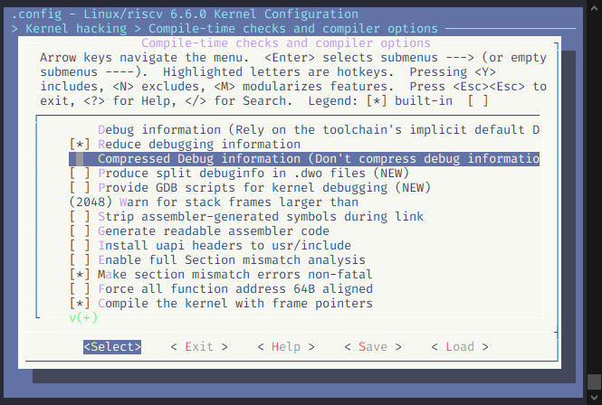

#### 相关配置选项说明

| 配置项 | 说明 |
| --- | --- |
| `CONFIG_DEBUG_INFO` | 编译内核时生成调试信息 |
| `CONFIG_DEBUG_INFO_DWARF_TOOLCHAIN_DEFAULT` | 使用工具链提供的 DWARF 格式 |
| `CONFIG_DEBUG_INFO_REDUCED` | 精简调试信息，减小内核体积 |

#### 重新编译内核

```bash
# 编译内核
make -j8

# 生成的带调试信息的内核文件
# vmlinux: 带调试符号的内核映像
# System.map: 内核符号表
```

编译完成后，`vmlinux` 文件位于内核源码根目录，用于 GDB 加载符号表。

* * *

## 启动调试会话

### 启动 XuanTie Debug Server

#### 查找 ICE 设备

连接 CKLink 到 PC 后，查看设备状态：

```bash
DebugServerConsole -list-ice
```

#### 启动 Debug Server

```bash
# 使用默认参数启动（端口2241，频率12MHz）
DebugServerConsole

# 指定端口和频率
DebugServerConsole -port 2241 -setclk 12

# 指定 ICE 设备
DebugServerConsole -select-ice <serial_number>
```

启动成功后，Debug Server 会在指定端口监听 GDB 连接。

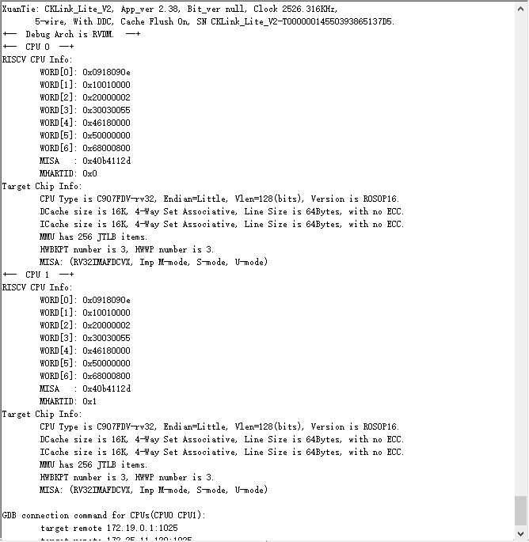

### 连接 GDB

#### 启动 GDB

进入工具链目录并启动 GDB：

```bash
# 进入工具链目录
cd out/toolchain/Xuantie-900-gcc-linux-6.6.36-glibc-x86_64-V3.3.0-20260204/bin

# 启动 GDB
./riscv64-unknown-linux-gnu-gdb
```

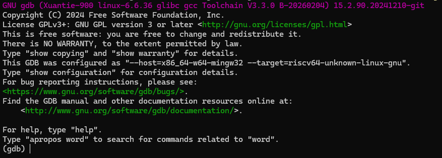

#### 连接 Debug Server

在 GDB 中连接 Debug Server：

```gdb
(gdb) target remote localhost:2241
```

连接成功后，目标 CPU 会暂停运行，等待调试命令。

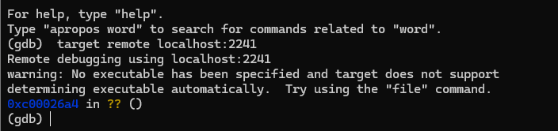

### 加载内核符号

#### 加载 vmlinux 符号表

```gdb
(gdb) file /path/to/vmlinux
```

例如这里演示的

```
(gdb) file ../../../kernel/build/vmlinux
```

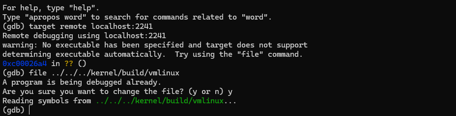

#### 验证符号加载

```gdb
# 查看调用栈
(gdb) backtrace
```

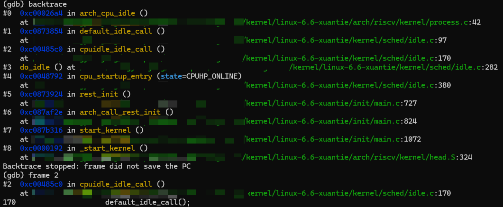

* * *

## XuanTie Debug Server 命令行功能

Debug Server 提供命令行交互功能，支持在 GDB 连接前后进行调试操作。

### 寄存器操作

```bash
# 打印寄存器值
p $pc           # 打印 PC 寄存器
p $sp           # 打印 SP 寄存器
p $dmstatus     # 打印 DM 状态寄存器
p target        # 打印目标板信息

# 设置寄存器值
set $pc=0x20000
set $r0=0x10000000
```

### 内存操作

```bash
# 打印内存值（Word 大小）
p *0x10000000

# 设置内存值
set *0x10000000=0x1
```

### 其他命令

| 命令 | 说明 |
| --- | --- |
| `singlestep` / `si` | 单步执行 |
| `setclk 3` | 修改 JTAG 频率为 3MHz |
| `cacheflush` | 刷新 L1 Cache |
| `cacheflush l2 0x0 0x10000` | 刷新 L2 Cache |
| `p target` | 打印目标信息 |
| `p cpu` | 打印当前 CPU 编号（多核） |
| `q` / `quit` | 退出 Debug Server |
| `help` | 打印帮助信息 |

* * *

## 内核调试实战

### 设置断点

#### 按函数名设置断点

```gdb
(gdb) break start_kernel
Breakpoint 1 at 0xffffffc000123456: file kernel/printk/printk.c, line 1234.
```

![image-20260321164825618](data:image/png;base64,iVBORw0KGgoAAAANSUhEUgAABEoAAABVCAYAAABeiQG9AAAgAElEQVR4nO3dfXBT570n8O+R5DeRAjJRMnYrQkwU1cWx2gnrl2luooS9G4lZk86NMexkcKj+WKbES2Zuelfu3GzXW3xTu7d4AiUw3pl67DCe4SV3poEWObdNLdhmbBhoKzDx6OI4ISJ2iKhNIMhgW9L+cXyOJevtHCO/ke9nJpNI5+h5fudFkPPT8/weobOzM7Jjxw4QEREREREREX3daRY6ACIiIiIiIiKixYKJEiIiIiIiIiKiKUyUEBERERERERFN0c32g06nE6tXrwYANDQ0ZCwgNf0//vjjuHr1Ko4cOYJAIDDvMRARERERERHR/UX1iBKj0YhDhw6htrYWNpstI0G4XC54PB75dWtra8zrZEpLS1FdXY2Ojg7U1NTMqm+lfc2XxRbPYrPUzo/dbofH45H/aW1tXeiQiIiIiIiIKAXViZLGxkaYTCa43W7YbLYFGU0CAG1tbdi4cSOampoAANu3b0dxcfGCxLKU2e12uFyueTl389nXYnHlyhW43W643W6OeiIiIiIiIloCVCVK7HY7LBYLent70dzcPFcxqdLV1YV9+/ZBr9fj5ZdfXuhwlhyr1QqHw4FHHnnkvuprsejv70dzczOam5sxMjKy0OEQERERERFRGqoSJRUVFQCAjo6OOQlmtrq6uuD3+1FaWrrQoRARERERERHREqaqmGtBQQECgQD6+/sTbjcajXjttdfkhEpvby9GR0fhcDjkeiYz9/F4PBgbG0vYntPpRHV1NfR6Pfx+Pzo7O9HV1ZVw376+PjgcDlRWVqKnp0fNYaXtS6qJEQgE0NLSgp07d8JkMsmvpf6cTiccDgeMRqN8/Hv27JGnXBQXF+PgwYMAgGAwiMuXL8Ptdic9JkldXR2qq6vR1NSUdt9oLpcLJSUlMJlM8nuBQACbN2+Gy+WCw+GQ36+vr0d9fb38WrpeSmJOd36efvppRX3NVqLzk+5aKLmmra2t0Ov16O7ulu8Nn8+H9vb2mHssXV9ERERERES0dKhKlJhMJvj9/qTbGxsbYbFY4PP5MDg4iKKiIqxduzbtPvn5+Qnbe/bZZ3H27FkAQFlZGerr63HlypWEiRrpoXTFihVqDklRX263G0VFRbBYLHjhhRfw2Wef4aOPPoLNZsPOnTvR09ODmpoa1NbWIhAIwO12Iy8vD2VlZWhpacG2bdvkftxuNwDAYDBg7dq1csIgVQLEbDYDAM6fP6/4eOrq6uBwOOD3++U+genz5PV6AUA+LimplUi6mNOdn87OTsV9zcbM86PkWii5poB4z5eXl+PUqVMwGAyoqKiI2a70uhMREREREdHSoCpRotfrk24zGo1yAmTHjh3y+8eOHVO1T7Q33nhDTorY7XbU19dj06ZNCRMlQ0NDag5FVV/Nzc1wuVywWCwYHR2V67O0trbCYrEAAKqqquTRGhKn04na2lp5lEt/f39M7EajEceOHUNFRUXSREllZSWsViu8Xq+qEQpS8uDAgQMJR9h0dXWhq6tLPi6Px5MwBiUxpzs/SvuajUTnR8m1UHJNJW+++aZ8DpqamuTRUEr7IiIiIiIioqVDVaIk1YP6k08+CQAYHByMef/SpUvy1Aol+0SLfkDv6uqKma4x02OPPZYm+tSU9iWNxAAQk+yRprckWrpWGuViNBqxZcsWPPHEEzHbCwoK4j7jcrnkEQzBYBCHDx9WcTTABx98ALPZjJ///Ofw+/346KOP8OGHH+Lo0aOq2lETM5D8/GRaqvOj5FpESxdz9L0xcySM2r6IiIiIiIhocVOVKBkZGYmpdzGfKisrU25ftmwZAODLL7+c876S8Xq9MdNcJNKUkJaWFqxatQpnz56V67LMHL0gia7p4ff7VY9MOHr0KLq7u1FVVYXHH38c69atg81mQ1VVVcyUkNu3b6dsR03M6aTrS4105yfdtcik+eyLiIiIiIiI5paqRMnw8DAsFkvCKQVXrlwBABQWFsa8v27dOlX7JLN161YAwOnTpxNuLykpQTAYzMhUh3R9JeL3+2E2m9HY2Jhw5I3dbofJZMKBAwfkUR1GozHmgT+aNMJm7969sFqtqKmpUT0aJBAIoK2tTX7d0NAAm80Wc/0GBgYAxF+T2cScTqq+1Ep1ftJdi0xS29dsk0xEREREREQ0P1QlSt577z3YbDZs3bo1LiHR398Pn88Hq9WKvXv3YmhoCEVFRar3ieZyuQAA69evh9FohMfjSZgIkR7oe3t71RyOor7sdjusVqscp81mg9VqxfHjx2OmZHR2dqK+vh4dHR24cOGCPEUjLy8PDQ0NcpJow4YNuHnzJpYvX46qqir4/X7k5+ejrq4O+/fvj4ursbERHR0d2L59O7q7uxU/+LtcLuTl5cmjQAwGA0pLS+OSSefPn0cwGER1dTVWr14t73/69GlFMQ8MDCg6P+n6mm2CK9H5SXctlF5TJdL1FU1KNLa2tmJwcBAGgwHvvvsu65gQEREREREtItoXX3yx4be//a2ina9evYrvfe97sFqt+Pa3vw2v14tgMChvP3PmDCwWC6xWK8xmM/r6+vDpp5/CbDajvb1d8T5PPfUUvvWtb8FsNsNsNuPq1as4evQo3nrrrbiYnE4nfvjDH2JiYgK/+MUvcP36dVUnIF1fL774IhwOBx588EEAkPft6+uTR0gA4miJzz//HPn5+Vi/fr3c3ueff44//OEPuH79OjQaDUpLS/H8889jzZo1+P3vf48VK1agqKgI3/nOd9De3o6qqio8+OCD8rkIBoMwGAywWq146KGHEtbCSKSqqgpPPfWUHEd+fj4uX76MAwcO4OrVq/J+wWAQf/vb3/DYY4/J18RsNuP999/HX/7yl7Qx37p1S9H5SddXdEzpjivd+Ul3LZRe05l9SfdL9L2arq9oly5dgsViwbp162A2m5GTk4MPP/ww7jwRERERERHRwhE6OzsjaopuGo1GeYlfAHEr2MwkTY1IVKz1XrhcLnkKSDAYxO7du/nL/BImrTSUjNvtllemISIiIiIiIporqqbeAGLdix07dsjTF1JNBTEajTCbzfD7/fcUZCLSSiWBQAAnTpyY81oUNLeuXLmSsCCqJHplGiIiIiIiIqK5onpESSpOpxNGoxHAdE0MvV4fUwyUiIiIiIiIiGixUj2iJJXoFVECgQAuX74Mt9uNrq6uTHZDREQLRCjIcIPZGW4vo3+rAZGPMtseDBlubzTD7REtIMGY4QaXZ7a5jP95QEREi1ZG/5eyubmZdSSIiIiIiIiIaMnSLHQARERERERERESLBRMlRERERES0pOi2CNA+Iyx0GPQ1txTvw6UY80JYsomS1tZWeDyeee/Xbrejrq5u3vul+8Pkyo0IPvZv+Grdn/HVuj9j7JGDCx1SWna7HYcOHYLH44HH48HevXsT7jPze2G32+XPeDwetLa2zlfIREREdB/TPiNA+7QA5ALacgE5b2nkf7L+Kf0DoLZcgO4HfFD8usn0dY++D+eqr/mMOWN93CffL8U1SlpbW2GxWOTXwWAQFy5cwJ49e75WS/Pu2rULer0eAwMDsypSKy2rfPz4cfT3988qhuLiYmzYsAHl5eUwmUzw+XzI1MpFiWQiZgCYyN+MifytCOc8CiF8G9ov30fuUEMGI1XX190CFya/8SwiWQ8BALRfnUH2SCe0t/6EyZUbceebjUnbFya+wLL/sKuKKfSNp3Dnm40QwrehGz0OITIGYeLanPSVKZWVlaivr0cwGITH48HY2FjC73ui70X0ks/r16+f17iJiIjo/qUpAyI3gNB7EQiPAqHTU++XKns4020RgBwgMgyEzkTmMNIMWQVo1wvQlAKaAgGhMxFMHplF3JlqZxHRlgsQ1gChsxFEPk69b6ave/R9OFd9pWpHzbEriTlTltz3KwnVxVylBx+DwYCKigo0NjbO6UP6YnPy5EmYzWacP39+Vp+3Wq1wOBzwer2zTjps2rRJbsNkMs2qDTUyEfPkyo24W/ATCBNfIGvkCMJ56zBp2IQ7QMaTJUr6ulvgwkT+FmjH+qC51Y2IzojJ5c/hTs6jWHZrOimhHeuDZuyS/DqcvQahB8qhu9WtOq6JlT8AAORe/Qm0t/4UE2+m+8qUF154AQCwe/du9PT0JN0v0feiv79fvl84moSIiIgyQVsuQLNGQOj34gNY5GNg8mPxv7NWK2sjdDoCYTUQGlj8D3GaEkD33zQQVooPuGGf+O+FamexEdYA2qcFRD4BQh+nvp6ZvO4z78O56itVO2qOXUnMmbKUvl+pqE6URK9q09TUhIqKiowGtNjt379/oUPA8ePH0dbWhkAgsCDTj2ZjYkUVACDX/2Nox/oAAGNFb2PSsAmR6/8XwvjQvPYVzlsHIXwbeYO18ufuFDZg0rAJoW88Jb+nGbuEnOHpe/6O6ZcAAN2N36mOK5L1EDR3P45JkkTLZF+ZYjAY4Pf7UyZJgMXxvSAiIqL7n+a7AnAXmPx/s38Im/zNEnmAWwVkOcVKCZNvR2b/63ym2lniMnnd092HmeprPmPOlCXz/UrjnpcHDgaD8n9LD+2BQAAtLS3YuXMnTCaT/Fp62HI6nXA4HDAajQCA3t7emCk8xcXFOHjwoNz+5cuX4Xa70051qaurQ3V1NZqamtDV1YXW1lbo9Xp0d3ejuroaer0efr8fJ06cwNGjR+XP1dTUYPPmzTAajQmnFNntdtTX18f0ZbPZYl4n6svn86G9vR09PT1wuVxwOBzy/vX19TFtzmwvlXuZ/hIt3XnOZMxhfQm0Y31y4gIAtDf/iFBeCUL670I3PoTgY/+GSNZDyP3kR9MJjkcOIvRAOfI+3SUnGCZXbsTEiiqEHigHIE5N0d3qlpMMSvoSJr4Ach5FJLswJkkjhG9De+tPCOWVIGvkCLRjF2OOI/RAuZjsmGo7lFeCsaK35c9qgn3I+vIEdDdOJjwPQvh2/Ht3P1XUFwCMP7gdE/lb5elCupt/RM61lrhEk91ux65du3D27Fk0NNzbiJ3o7/jMPtJ9L5RK92cCERERkfAooCmdGs7/N3Wf1ZYL0NXGTs25+0o45nXWPwkQ8sQpKbrnxekD4U8iCLkjCPdN7wMAE/8aiflc9HvZPxVHboz/KixPicjaJUBjETBxMCy3lY7uP4sx3GtyI1PtKDkuJedHeBTI/vFUqcy74jkOn4mdppHuWui2TNXakI6xNvb6StdWyXUHAO3zYnvCSvF1+AIw8U444X2W7D7M1D2Wrh2lx54uZqmf8AVAM1VhY/K9qbgwfZ2VXK9MHbtS2nIBmnJAYxH7jNwAwhcyO5VMdaLE5XIBEH9pLi0txTvvvCNvc7vdKCoqgsViwQsvvIDPPvsMH330EWw2G3bu3Imenh7U1NSgtrYWgUAAbrcbeXl5KCsrQ0tLC7Zt2xbTltTP2rVr5QeyVMkSs9kMADHD/00mExwOB86ePQsAKCsrw/bt23Hx4kX09/ejpqYGO3fulOMpLCyMm1IUXWtBOr5ETCYTysvLcerUKXlqknTcXq835vO9vb0YHR1VcebnRqrznMmYI5plECa+QCS7EOOrtkE7dhGayS8AAKG8J6C7cRI5n/1v3FlzEOMF/xN5g7UYf7gOoQfKkX29LSZJMrPOR2hZGSbyt0CYuIbs6+3K+rrWgjtZTQiuaYPuVjfC2WsQznkU2df2AUBcogUQ655ENMuQNWMqTNbIEfEYdUaE8kpw55uNyAWgu3ESkys3IpT3BAAgrBOTG3cLXPJndTd+p7ivifzNGH94lzylKCLkIbRiA8ZyfgX9wIsxny8sLIRer4fBYFB9raSaNACQn58PYPp7D0CuVaP0e5GO0j8TiIiI6OtN+3fiQ1FoFr+Ih7+IyLVMhNWAZk3ieibCw9MPlMJKAZpSAcI/CBjvi3/4TGbiUBjZ/0MDXbWAiX+NQPcDMZkQ+r26B0Jh9dT0mFwg+1+mp82ETkdU1ZjIVDuZOi5A7BsAhJUChNUCdFODvKMfvlNdi8gnQAgR+VqGLwCRG/HHouS6a58RoNskyOcEOYD2uwKyX9Fg/GcJkipJ7sNM3WPp2lF67EpiBgAsj2DyXUBXI0BjEePSPi1AWybI09rSXa/5/H7JSZm7U/3fFRMm2qeFjNZfUZ0okUYYSCMvhoamf8lubm6Gy+WCxWLB6OioPE0nuhBsVVUVAoEANm/eLH/O6XSitrYWlZWV6OnpialtAABGoxHHjh1DRUVF0kRJZWUlrFYrvF5v3K/Qv/71r+XPSX1t2LAB/f392LBhAwDgpz/9aUw9BYvFguLiYjkWaZt0fMm8+eab8r7RU5O6urrQ1dUlf97j8cyqGGwmpTvPmY5ZmAxgfNU2TORvQXhsHbJGDsds1471IfvaPtwt+AnumH6J0APlYoHVa9PTOuRpNQnqfESP4kjXlzA+BO3tswiv+K+YyN8CANCNHodmLPlonclvPCfGeXN6utPMJEckuxC3zb/FpL4MuhsnEcp7Qm5fPoao19qxi8BY/N8sifqayN8aV9h1fPwTjD+8C6FvPBVzPtra2tDf34+BgYGkx5OMVJMmWvRrqVaNmu9FKkr+TCAiIqKvuVXiw2v4AhQXrowWXctEt0UA1iTfd/IdqThmBFk7NNCUzqKvdyPQ1QjI2iE+fIZ9EXlKQqJf36OFTou/jGvWCIhcEx/kwxemH+B1mwSE/0NFAc807WgeUhZPuuNSdX7kmhoRYBWQ8zMNBAuAM7H7JrsWoTMR4Mz0tQz/NfFoGSXXXfuM+IA9/s/TD+uRa4BukwBNCWKTQCnuw0zdY+naUXrsSmIGgMinQOiUeF0j18REDJ5OHE+y6zWf3y+NOKkAE23Ro7Mi0JYLGZ1WpjpREj20vq6uDvX19SgsLERbW1vMftJoBAAxxV6l4qOJamusWLECgPjAvmXLFjzxxBMx2wsKCuI+43K55NEbwWAQhw8fjtsn+uG+ra0NtbW1WLZsGQDAYrHA5/PFJAwGBwdhsVjwyCOPqJ7mEr3/Yhgxkoqa85wJESEPWaPvIJy9BtrbZxLukzVyDKFl5Zhc/hyEiS+QO7w7Zrs8rWZGnY+ZU13S9SUlYqSESyS7EHcf/kfcWXMwZuqP3F52YcKpMJHsQkwY/gGhZWWx++cWAQByhpvlKUHSFJ3ouiiJJOsrnPMoAOCrdX+O/4x2edx7s00wNDc3xyQ5AcxpwWYlfyYQERHR15vu78Sh+qEPlP/yPFvRD5PiL/XqlzoNnYpA821xhZnIDWCic/oBLvrX94T9fxL1IgcYb5meAhK5Iv7yH/1rvyIp2gmdVR5PquNSbJV4PQVz7NvCwwn6zsC1SEfqN+ctTfy2ZQKA6WPM1H04H8clueeYVVwvJe712DVrBHH6z4zfmjNde+eeapTs378f5eXlKC8vj0uUpOL1euUh+9GkKTMtLS1YtWoVzp49i7GxMQBI+mt19C/dSopOLrTbt+NrVCwUpec5EzEL4duI5BZBO9aHvCs/AiDW2wAAzd3B2J1DX815X5PLn4Nu9LiccBHGh6C79UdMLn8OoeW2+Kkwy/8LAEB340TM+2Orf4VI1kPQfvk+hIh4DkN5JfcUf7K+AHEJ46wvE7wf/Os99bnQ0v2ZQERERF9vmv+U+OFoMRDyBETGEoxmGEv8EBj7C31qkRuxdTBCfeIv/2qlakdNPEDy40pm5vnJfkWc/hP6qzhtAkDKEQgp3U2/ixJhn1h3Y6aZK7csqvtQ4bHfa8wZvV5LyD0lSoxGI3Jzc5MWe0zE7/fDbDajsbExYaFGu90Ok8mEAwcOyAVXjUZj3FQAiTTCZe/evbBaraipqYkp1Cq1KY0qqampidnm8/liptkAYr0FQKxNkmnSVIjCwsKMt62GmvOciZg1wT6EHihHKK9kuhDqcnF6ie6rD+T9JvI3Y9KwCbrR4+KSvgX/S052xLQzY6rJbPqSRn3IrzXLksYfWiaO8cq6+e/ye5MrNyKc8yhyhn+OrJFjYhvZhXFTbdRK1BcAaO5+LI6oGd6taJWgyspKDAwMLJqCqMmSnen+TCAiIqKvN+3zYpHN0L+n31esjTC3q24IeVF9rBJ/WY8ZBQJxOoc0FUBbLiDrJQET+1ROUbkh1oTAqqgCnOunEhQJHpI1JUB4GHEFSNW2k4qS40p1frTlAoSHgcmjEYROTe8TXZxUjcjw1H+snNXHxTauiffNRGfi4q0SNffhfFBy7Pcac6avlxrJ7ufwJxFoLAI0JXObsJp1MVcAWL9+PYxGI86dOycXgJSSDDabDVarVS78KOns7ER9fT06Ojpw4cIFeXpKXl4eGhoa5OTEhg0bcPPmTSxfvhxVVVXw+/3Iz89HXV1dwqVIGxsb0dHRge3bt6O7uzvmgeull16Sa4WUlYlTJI4fPw4AeP/992GxWPCzn/0M586dQ2FhYdx0HKfTKa/GIR2fdB68Xq+quh3nz59HMBhEdXU1Vq9eLY/kOH36tOLRMNHxAGLBTSmemec7GTXnORMxZ315AqEHynHH9EuxeGreOoTySsSCrFMP/aG8Eow/vAvasT7kDjVgPHQd4w86Mf5wnVynJHukE3f0JRhbvQ+6m3+EMCle54jOiFz/jxX3pR3rk1es0YxdkgujCuHbMXVBgOmpMNqvzsSukHP3UwDA5MoqcRSLZhkm8reKCQ3dQzFxK5WsLwDIvv5r3PlmI4Jrj4jbpWMX8pA7FLuyjVTjw+v14tVXX1UVg1JqvhfDw8OwWCxobW3F4OAgDAYD3n33XfT09KT9M4GIiIi+3rTlU0UaT6VONESuAVgjrq4R+VRMDoQ+EOsYSA+MgFhsEpiqpYCp4phKh+3fFCCsEVd7iVwT2wp/Iham1P1AXBpVeBTQvSD+ij/5dgS4CWj/fnq7UuELYlHN7H/UxNQWSbTEq/b5qZojvkhc4kJNO6koOq405yfkFUejaMoA3BGA3KkaIdcQcw6VCg1EoLsrQPe8+EAvJX7ClyKKr3vovQh0tQJy/lmDsC+qMOrUSkHyOU5zH2bqHlPaTrpjVxJzOuEvlF2vjH2/pqS6n0N/FOv3ZP1IE1PIVlgpYKI1dnqRtEqnx+NR/Vwx62KugFjQ1ePxyEVco7dJiQmp8KNEenhyOBzyPoC4HCgg1vh4++234XA4UF9fL6+EYbVaYbVaUV1dnTBREggEcPLkSVRXV+OVV16JORHd3d3y0qOBQADt7e1yTNJois2bN8PhcCAYDMpLk0rKy8vjfg2PPlY1iZJAIIB9+/bhpZdeiqn3cvp0iomBM8yMJ3okyMzznYya85yJmHU3TiJnKpEwkb9FXrUm+gH/7jf/DwAge/gX4r+v7Ucodx3GH3RCG/wrtLf+BO2tPyH36k8wnv8SQg+Uy6NAhIkvVPWVe7Uedx/87wg9UIFQvjhVRvvVGWSPdCaddjOz1olUfHYif6u4Es/EF8gaOYzQsnKEHyjH+INO1YmSZH1Jx5ULsaDt5NQIGUBcInimoaEhBIPBOa2To+Z78dZbb8FgMMBqtcJisSAQCMj1R9L9maBUpgs4ERER0cKTf9E+nv7v+MnfRSCsnFoydM3USIq/iqMbNKXxK3FIv4qHEIkrIprMxDthZOUIch+TRyLQPA0IK8WkweRvIsjaJta6mHxHjHnyN+IKJdq/FxAeUP4ruLTUqaZ0ejnYsC+CyRMJlke+AeDu1Oo299JOCkqOS8n5mTwuJm50tdOr72gsUyuXTO2j2N/EPrTPiyNdJOFL0jGnv+7S/z9qysVzJE0rCl8ApJExSu7DTN1jittJc+xqvjvJRD6GouuVqWOXpbifw31iIVftc1P3Wc70EsHJXL9+XWUAgNDZ2RmZy0KNC0lavSb64Z6I7k9Zu9QPaSX1hEzXes7OcHv3NKE0XuSjzLYH9St2p7a4a4YTqSIY0++jSnyd83uS8T8PSJGsXQI0awTc/ZfU0yKI5tJSvA+XYsyZJg3maGpqUr16a4b/l5KIaGFEri10BERERJRpkWvApFfdyAeiTFuK9+FSjHmuqE2SAEyUENF9QhpWSkRERPcP/v1Oi8FSvA+XYsyZVlRUNOvFIpgoISIiIiIiIqL7ypkzaoujTLuva5QQEREREREREamhWegAiIiIiIiIiIgWCyZKiIiIiIiIiIimZCxRYrfb4fF45H9aW1sVfaauri5TIRARERERERER3ZOMFXO9cuUK3G43AGD9+vWKPrNr1y7o9XoMDAzMasmeTHG5XFi/fj2MRiMAwOv14vDhw+jp6YHdbkd9fX3SzwYCAWzevBlGoxGvvfYa1q5dG9NOY2PjrCvtEhEREREREdH8yliipL+/H/39/QCgaDQJAJw8eRJmsxnnz5/PVBiquVwuOBwO+Hw+nDt3DgaDARUVFSgsLMTmzZvl/Xw+HwYHB+XXhYWFsFqtOHfuHACgpaUFJpMJXq8X586dk7e//vrrePXVV+f9uIiIiIiIiIhIvQVdHnj//v0L2T0AcW3lYDCI6JV/GhoaYLPZUFlZKb83ODiI5uZm+XVTUxMA4Pjx4wCAN954AytXrkRPT4+8z6FDh2C1Wuf6EIiIiIiIiIgoQ+Y9UZJoKovNZot53draCr1ej+7ublRXV0Ov18Pn86G9vT0mEeF0OuFwOOSpLr29vdizZ4+qqS6jo6MwmUwwGo0xnwsGg+jp6UFxcTHcbje8Xm/M50pLS+H3++VRNNK/JUajEbm5uejt7VUcCxEREREREREtrHlPlETXMikqKoLFYkm4n8lkQnl5OU6dOiVPh9m5c6ecKKmpqUFtbS0CgQDcbjfy8vJQVlaGlpYWbNu2TXE8e/bsQWNjIw4cOCBPmSksLER7ezuA2ClFkpqaGuj1epw8eTKuveLiYlRWVuLZZ5/FyMgI9uzZozgWIiIiIiIiIlpY854oiU48uFyupIkSAHjzzTflfZuamlBRUSFvq6qqkgupSpxOJ2pra1FZWRkz8peP3NEAAAZ/SURBVCSVQCCAixcv4plnnoHD4QAAeDweXLx4Melnvv/97wMA3n///Zj3i4uLcfDgQbndvr4+RTEQERERERER0eKwoDVK0okeyTE6OhqzzWQyARCTGjOtWLFCcR9NTU0oLS3F7t270dPTI69es2fPHrz22msJp9RYrdaYaTfR8dpsNhiNRlRVVaG6uhpFRUUx9U+IiIiIiIiIaPFa1ImSdLxerzyNJ5qaVXQqKirg8XjkESiBQAAejwcVFRXYsGFDXDKkqqoKANDd3Z20zUAggLa2NqxevRo2mw3FxcVx7RARERERERHR4jNniZJUU2oywe/3w2w2o7GxUVXx1kQKCgpiXi9fvjzpvtIqNidOnEjbrsFgSLqtsrISAwMD9xw7EREREREREWXOnCRKhoeHYbFY0NraisHBQRgMBrz77rvo6emB0+mUV6kpKioCINYqAcQRIl1dXYr66OzsRH19PTo6OnDhwgV5ak5eXh4aGhoUx+rz+WJilYrCBoPBuBok0rQbr9cbl+CQlguW4igpKYHJZILP54sbTSLVUvF6vXj11VcVx0pEREREREREc2tOEiVvvfUWDAYDrFYrLBYLAoGAXDekvLw8brSJVEQVgOJEibSfw+GIKfKqdjne119/Ha+88grWrVsnx+X1enH48OGk025mLhUMAHfu3EFZWRn0ej0AyKvxtLW1xe07NDSEYDAYV3eFiIiIiIiIiBaW0NnZGWGxUSIiIiIiIiIiQLPQARARERERERERLRZMlBARERERERERTWGihIiIiIiIiIhoChMlRERERERERERTmCghIiIiIiIiIpoy6+WBnU4nVq9eDQBoaGjIWEBq+n/88cdx9epVHDlyBIFAYN5jICIiIiIiIqL7i+oRJUajEYcOHUJtbS1sNltGgnC5XPB4PPLr1tbWmNfJlJaWorq6Gh0dHaipqclILERERERERET09aU6UdLY2AiTyQS32w2bzbYgo0kAoK2tDRs3bkRTUxMAYPv27SguLl6QWIiIiIiIiIjo/qAqUWK322GxWNDb24vm5ua5ikmVrq4u7Nu3D3q9Hi+//PJCh0NERERERERES5iqRElFRQUAoKOjY06Cma2uri74/X6UlpYudChEREREREREtISpKuZaUFCAQCCA/v7+hNuNRiNee+01OaHS29uL0dFROBwOuZ7JzH08Hg/GxsYStud0OlFdXQ29Xg+/34/Ozk50dXUl3Levrw8OhwOVlZXo6elRc1hERERERERERABUJkpMJhP8fn/S7Y2NjbBYLPD5fBgcHERRURHWrl2bdp/8/PyE7T377LM4e/YsAKCsrAz19fW4cuVKwkSNtOrNihUr1BwSEREREREREZFMVaJEr9cn3WY0GuUEyI4dO+T3jx07pmqfaG+88YacFLHb7aivr8emTZsSJkqGhobUHAoRERERERERURxVNUqkURuJPPnkkwCAwcHBmPcvXbqkap9o0QmRZFNuJI899ljK7URERERERERE6ahKlIyMjMBkMs1VLClVVlam3L5s2TIAwJdffjkf4RARERERERHRfUhVomR4eBh6vT5h0uLKlSsAgMLCwpj3161bp2qfZLZu3QoAOH36dMLtJSUlCAaDLORKRERERERERLOmqkbJe++9B5vNhq1bt8YlJPr7++Hz+WC1WrF3714MDQ2hqKhI9T7RXC4XAGD9+vUwGo3weDwJEyF2ux0mkwm9vb1qDoeIiIiIiIiIKIaqESU9PT3wer2wWq1oamqC0WiM2f7666/L2x0OB4aHh3Hu3DnV+4yOjgIAHA4HHA4HRkZGcODAATQ0NMTF5HQ6sWvXLgSDQXR0dKg5HCIiIiIiIiKiGEJnZ2ckegWadIxGo7zEL4C4FWxm2rt3L6xWK2w22z0HG83lcsHhcAAAgsEgdu/ezWk3RERERERERHRPVE29AcSVb3bs2AG73Q6r1ZpyJRyj0Qiz2Qy/339PQSbi9XrleE6cOJEyDiIiIiIiIiIiJVQnSiRdXV1xS/Y6nU55Oo7BYEBpaSn0ej3a29vvLUqF/RMRERERERER3YtZJ0oSMRqN8nSYQCCAy5cvw+12M6FBREREREREREuC6holRERERERERET3K1Wr3hARERERERER3c+YKCEiIiIiIiIimsJECRERERERERHRFCZKiIiIiIiIiIimMFFCRERERERERDSFiRIiIiIiIiIioin/H4Q3jHT1QEx+AAAAAElFTkSuQmCC)

#### 按文件和行号设置断点

```gdb
(gdb) break linux-6.6-xuantie/init/main.c:1234
```

#### 按条件设置断点

```gdb
(gdb) break do_sys_open if flags & O_RDWR
```

#### 查看和管理断点

```gdb
# 查看所有断点
(gdb) info breakpoints

# 禁用断点
(gdb) disable 1

# 启用断点
(gdb) enable 1

# 删除断点
(gdb) delete 1
```

### 单步调试

#### 继续执行

```gdb
(gdb) continue
```

程序将继续执行，直到遇到断点或被手动中断。

#### 单步执行

```gdb
# 单步执行（不进入函数）
(gdb) next

# 单步执行（进入函数）
(gdb) step

# 执行到函数返回
(gdb) finish

# 执行到指定行
(gdb) until 100
```

### 查看变量与寄存器

#### 查看变量值

```gdb
# 打印变量
(gdb) print var_name

# 打印结构体
(gdb) print *struct_ptr

# 打印数组
(gdb) print array[0]@10

# 查看局部变量
(gdb) info locals

# 查看函数参数
(gdb) info args
```

#### 查看寄存器

```gdb
# 查看所有寄存器
(gdb) info registers

# 查看特定寄存器
(gdb) print $pc
(gdb) print $sp
```

### 查看调用栈

```gdb
# 查看调用栈
(gdb) backtrace

# 切换栈帧
(gdb) frame 2

# 查看当前栈帧信息
(gdb) info frame
```

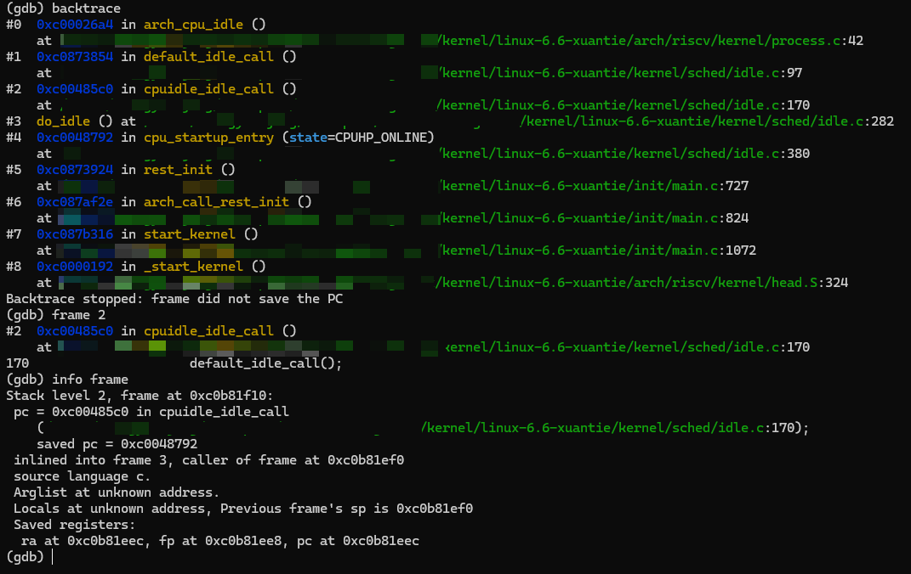

### 调试内核模块

#### 加载模块符号

```gdb
# 获取模块加载地址
(gdb) info sharedlibrary

# 加载模块符号
(gdb) add-symbol-file /path/to/module.ko 0xffffffc000000000
```

* * *

## 高级调试技巧

### 调试启动过程

调试内核启动过程需要在内核启动早期设置断点。

#### 调试 start\_kernel

```gdb
(gdb) break start_kernel
(gdb) continue
```

#### 调试 U-Boot 跳转内核

在 U-Boot 阶段设置断点，跟踪内核启动流程。

### 调试设备驱动

#### 设置驱动探测断点

```gdb
# 在驱动 probe 函数设置断点
(gdb) break xxx_driver_probe
(gdb) continue
```

#### 查看设备树信息

```gdb
# 查看 of_device_id 匹配
(gdb) print *of_match_table
```

### 多核调试

V861 采用双核异构设计，支持多核调试。

#### 查看多核状态

```gdb
# 查看所有 CPU
(gdb) info threads

# 切换 CPU
(gdb) thread 2
```

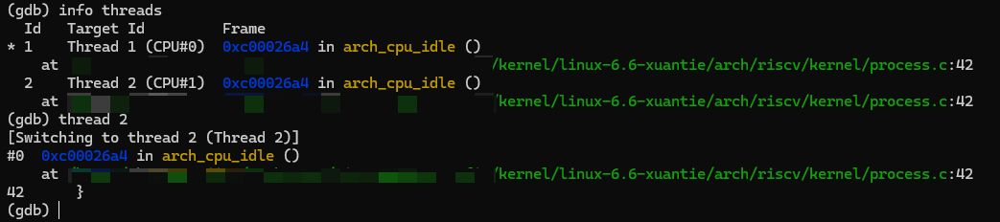

#### 同步控制

```gdb
# 暂停所有 CPU
(gdb) set scheduler-locking on

# 恢复所有 CPU
(gdb) set scheduler-locking off
```

* * *

## 常见问题排查

### 连接失败

#### ICE 设备无法识别

**可能原因：**

1.  USB 驱动未安装（Windows）
2.  USB 线缆损坏
3.  ICE 设备故障

**解决方案：**

1.  Windows 环境确保安装时勾选了 ICE Driver
2.  更换 USB 线缆或接口
3.  Linux 环境检查 USB 设备：`lsusb`
4.  使用 `DebugServerConsole -list-ice` 查看设备列表

#### 无法连接目标芯片

**可能原因：**

1.  JTAG 接线错误
2.  目标芯片未上电
3.  JTAG 频率过高
4.  JTAG 接口被禁用

**解决方案：**

1.  检查 JTAG 连接线序
2.  确认开发板已上电
3.  降低 JTAG 频率：`DebugServerConsole -setclk 1`
4.  检查芯片 JTAG 配置

#### ICE 固件升级提示

运行 Debug Server 时提示 ICE Upgrade：

**解决方案：**

1.  选择"是"进行固件升级
2.  升级完成后重新插拔 ICE
3.  重新启动 Debug Server 连接

### 断点不生效

**可能原因：**

1.  内核编译未开启调试信息
2.  符号表与运行内核不匹配
3.  代码被优化

**解决方案：**

1.  检查 `CONFIG_DEBUG_INFO` 配置
2.  确保使用正确的 vmlinux 文件
3.  降低优化级别或使用 `__attribute__((optimize("O0")))`

### 符号表加载失败

**可能原因：**

1.  vmlinux 文件路径错误
2.  vmlinux 不包含调试信息
3.  GDB 版本不兼容

**解决方案：**

1.  使用绝对路径加载 vmlinux
2.  使用 `file vmlinux` 验证文件格式
3.  检查 GDB 版本是否支持 DWARF4

* * *

## 附录

### GDB 内核调试命令速查表

| 功能 | 命令 | 说明 |
| --- | --- | --- |
| **连接控制** |  |  |
| 连接目标 | `target remote localhost:2241` | 连接 Debug Server |
| 断开连接 | `disconnect` | 断开当前连接 |
| **断点操作** |  |  |
| 设置断点（函数） | `break func_name` | 在函数入口设置断点 |
| 设置断点（行号） | `break file.c:100` | 在指定行设置断点 |
| 设置条件断点 | `break func if cond` | 条件断点 |
| 查看断点 | `info breakpoints` | 显示所有断点 |
| 删除断点 | `delete num` | 删除指定断点 |
| **执行控制** |  |  |
| 继续执行 | `continue` | 继续运行 |
| 单步（不进入） | `next` | 执行一行，不进入函数 |
| 单步（进入） | `step` | 执行一行，进入函数 |
| 执行到返回 | `finish` | 执行到当前函数返回 |
| **变量查看** |  |  |
| 打印变量 | `print var` | 打印变量值 |
| 打印结构体 | `print *ptr` | 打印指针指向的结构体 |
| 查看局部变量 | `info locals` | 显示局部变量 |
| 查看寄存器 | `info registers` | 显示寄存器 |
| **调用栈** |  |  |
| 查看调用栈 | `backtrace` | 显示函数调用栈 |
| 切换栈帧 | `frame num` | 切换到指定栈帧 |
| **多核调试** |  |  |
| 查看线程 | `info threads` | 显示所有 CPU/线程 |
| 切换线程 | `thread num` | 切换到指定 CPU |
| 锁定调度 | `set scheduler-locking on` | 锁定其他 CPU |

### 相关参考资料

-   [XuanTie Debug Server 用户手册](https://www.xrvm.cn/document?temp=introduction-2&slug=t-head-debug-server-user-manual)
-   [玄铁官网下载](https://www.xrvm.cn/community/download?id=4238019891233361920)
-   [GDB 官方手册](https://sourceware.org/gdb/documentation/)
-   [RISC-V 调试规范](https://riscv.org/technical/specifications/)
