# SDK 固件编译

本章节详细介绍获取V861 SDK后的编译流程，包括完整的SDK编译方法、单个组件的编译方式、常见编译问题及解决方案，以及编译过程中的优化技巧。

## SDK 整体编译

Loading asciinema cast...

### 检查SDK文件

下载完成后的 SDK 应有如下文件，可以使用 `ls` 或者 `tree -L 1` 命令检查

```
.
├── brandy
├── bsp
├── build
├── build.sh -> build/top_build.sh
├── device
├── docs
├── kernel
├── openwrt
├── platform
├── prebuilt
├── README.md -> docs/README.md
├── rtos
└── tools

11 directories, 2 files
```

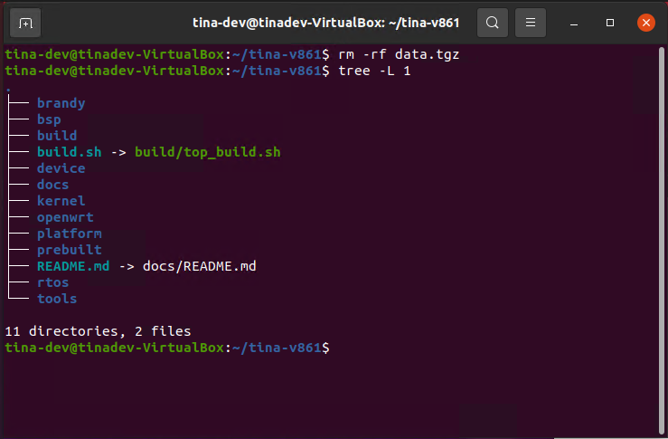

文件夹如图所示：

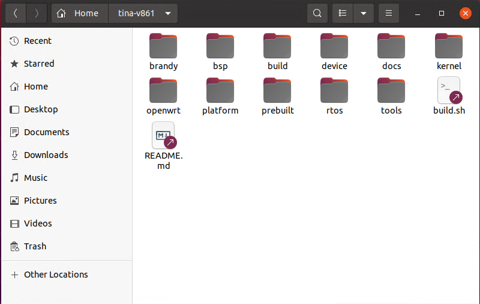

### 初始化环境

使用命令 `source build/envsetup.sh` 初始化SDK编译环境，初始化后便可以使用快捷指令与SDK相关指令。

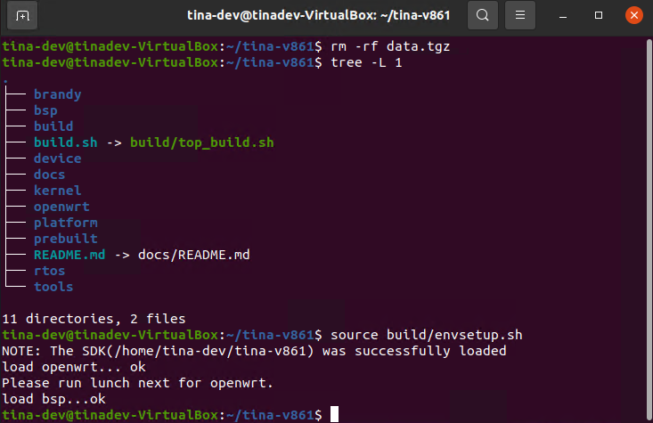

### 选择开发的板级方案

使用命令 `lunch` 选择编译的方案，这里以选择 `v861-bga_perf1-tina` 为例，选择 3

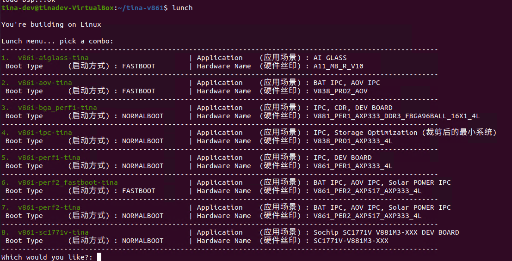

### 选择芯片主型号

之后需要选择开发的芯片主型号，请确认需要开发的板子上的芯片型号，选择芯片主型号

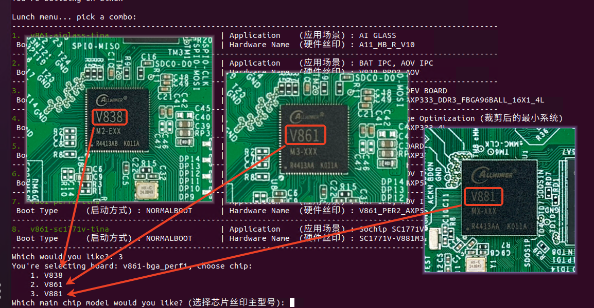

这里作为示例的开发的芯片型号是 `V881MX-XXX` 所以主型号是 `V881`，选择 `3`

### 选择芯片子型号

然后需要选择芯片的子型号，这里是 `MX-XXX`，选择 `1`

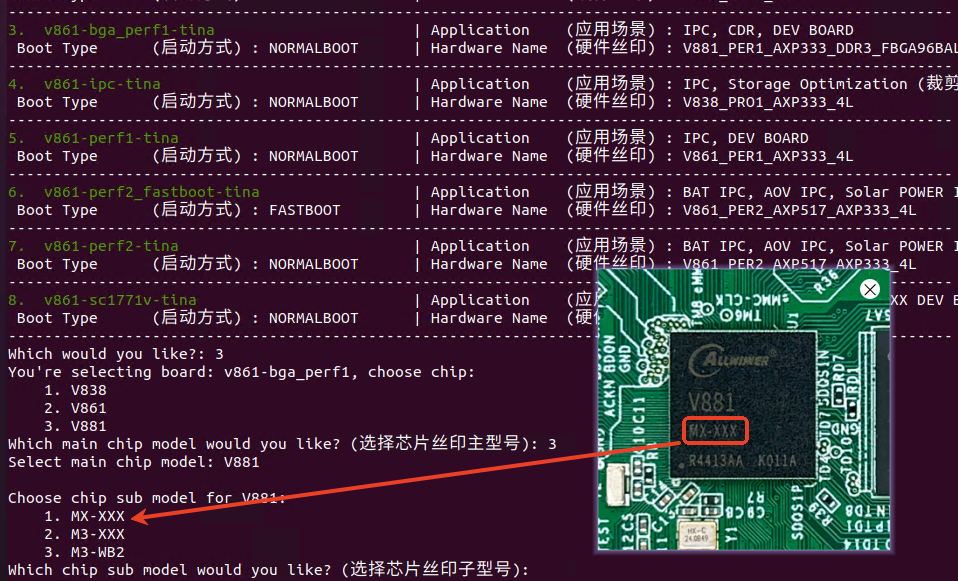

### 选择配置电压

然后需要选择开发板的电压，这里分两种情况，请参考流程图进行选择。

:::danger

:::note

危险

:::
:::note

电压选择将决定芯片的最大运行性能和编解码能力，更高的电压档位意味更高的性能同时也会有更大的能耗，请根据实际产品形态选择相应的电压配置以达到极致的功耗性能平衡。不同电压档位直接影响CPU频率上限、选择过高的电压可能导致不必要的功耗增加和发热，而选择过低的电压则可能影响系统稳定性和峰值性能表现。若不清楚如何选择电压，在开发阶段建议使用最低档位进行开发，后续根据硬件调整再做修改，也可以咨询 FAE，以确保最终产品的可靠性和能效比最优化。

:::

:::

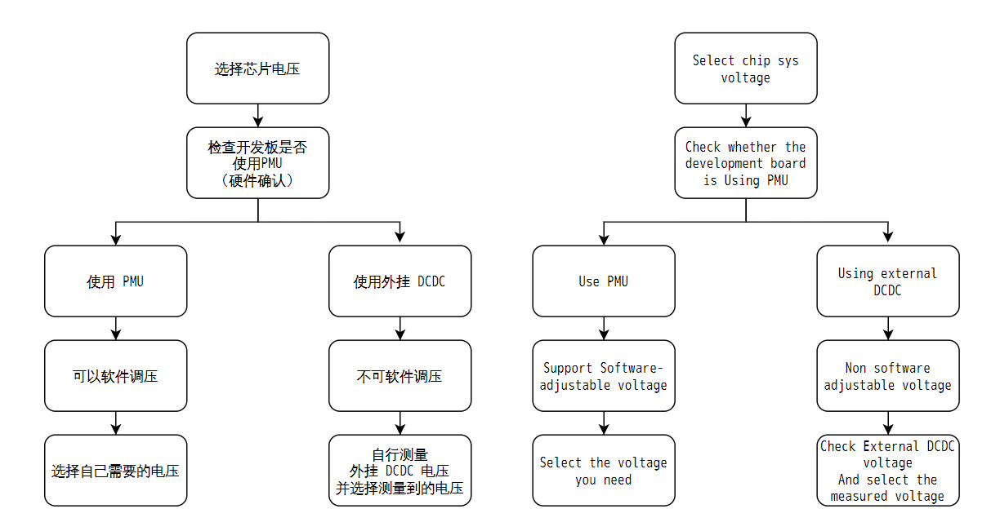

这里作为演示，选择 `0.92v` 电压，输入 `1`

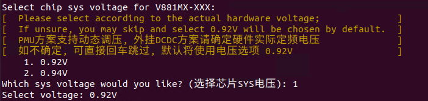

然后就会跳转到环境配置，此时如果是第一次使用 SDK，需要确认免责声明，若确认输入 Y 即可

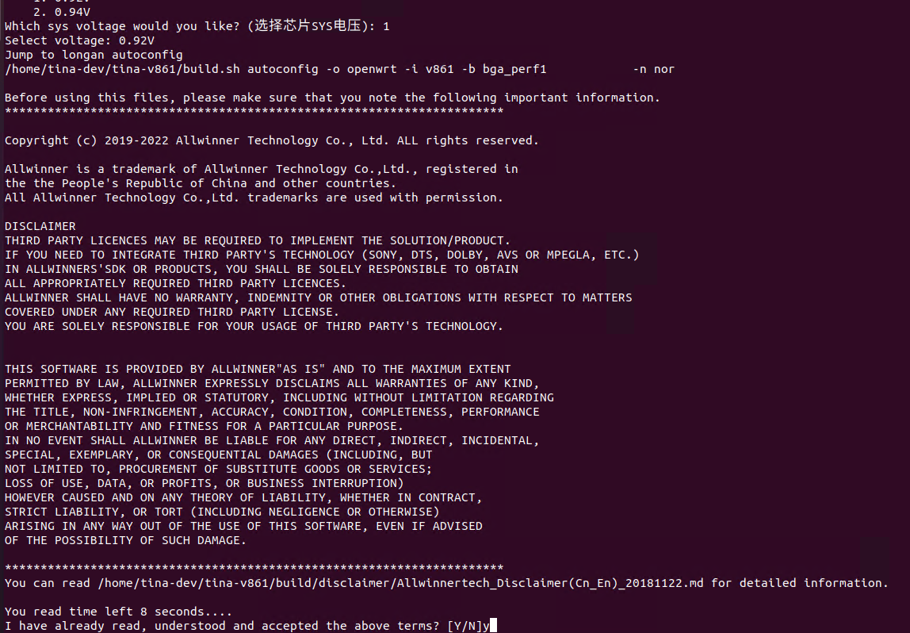

之后 SDK 便会解压工具链，初始化编译文件，展开代码，准备开发环境。等待其完成即可。

### 完整编译SDK

使用命令 `m` 或 `make` 完整编译 SDK，也可以使用快捷命令 `mp` 执行编译和打包的动作。可以使用 `m -jN` 参数N为并行编译进程数量，依赖编译服务器CPU核心数，如 4 核PC，可 `m -j4`

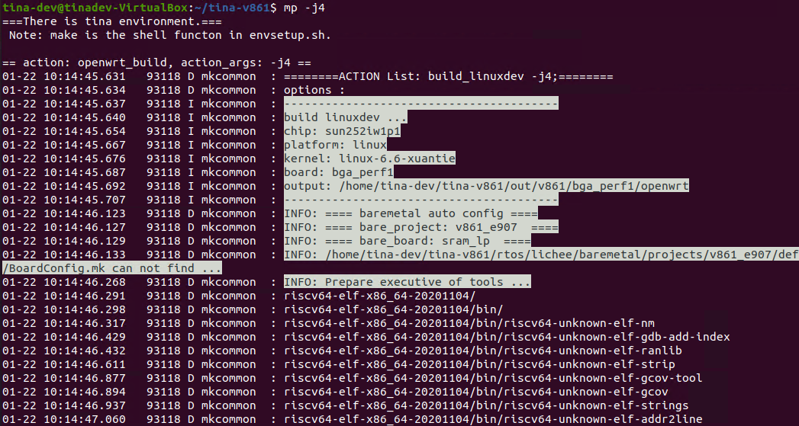

### 打包固件

SDK 编译完成，需要使用 `pack` 命令打包固件，会在 `out` 目录下输出固件

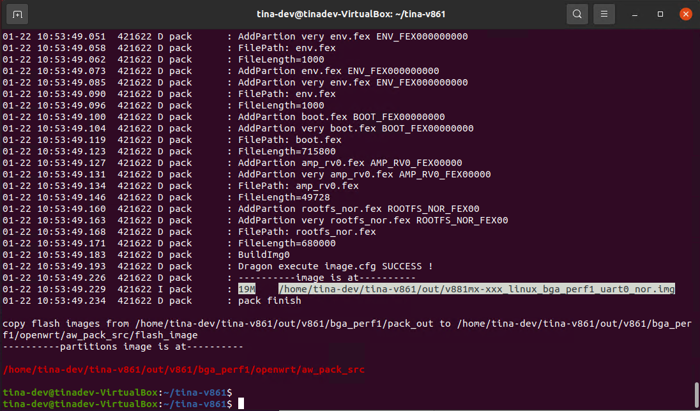

## 编译固件路径

### 镜像固件

可以在 `out` 目录找到编译打包的固件

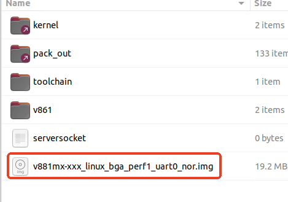

### 烧录器固件

如果是 SPI NOR 方案，可以在 `out/v861/bga_perf1/pack_out` 下找到板级对应的烧录器固件 `full_img.fex`，这个固件可以用编程器直接烧录进 SPI NOR，然后贴板运行。

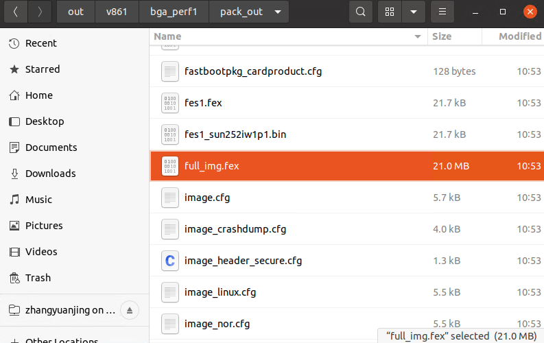

## SDK 组件单独编译

在开发过程中，会需要单独编译某一模块，但是完整编译太慢效率较低，这时可以使用单编命令。

| 命令 | 作用 | 作用范围 |
| --- | --- | --- |
| mboot | 编译boot0和uboot | boot0和uboot |
| mboot0 | 编译boot0 | boot0 |
| muboot | 编译uboot | uboot，uboot设备树 |
| mkernel | 编译内核 | 内核，设备树 |
| mrtos | 编译rtos镜像 | rtos镜像 |
| mbare | 编译休眠唤醒固件 | 休眠唤醒固件 |
| mkmpp | 编译eyesee-mpp-middleware | eyesee-mpp-middleware |
| cleanmpp | 清除eyesee-mpp-middleware的编译 | eyesee-mpp-middleware |

### 编译内核与内核设备树

使用命令 `mkernel` 可以单独编译内核与设备树，之后可以用 `p` 命令打包固件，编译后的 Kernel 固件会自动拷贝到 `out` 目录下 `out/kernel/build` 中

```
mkernel
```

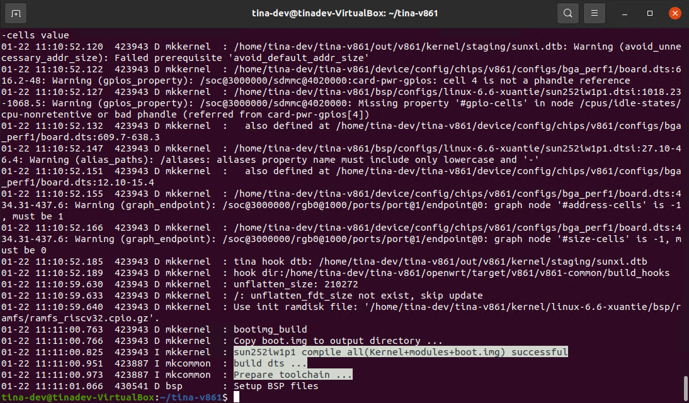

### 编译 RTOS

RTOS 可以使用 `mrtos` 编译，编译完成后使用 `pack` 打包，编译后的 RTOS 固件会自动拷贝到 `device` 目录下对应板级配置中。例如这里使用的 `v881-bga_perf1` 板，会拷贝到 `device/config/chips/v861/configs/bga_perf1/bin/amp_rv0.bin`

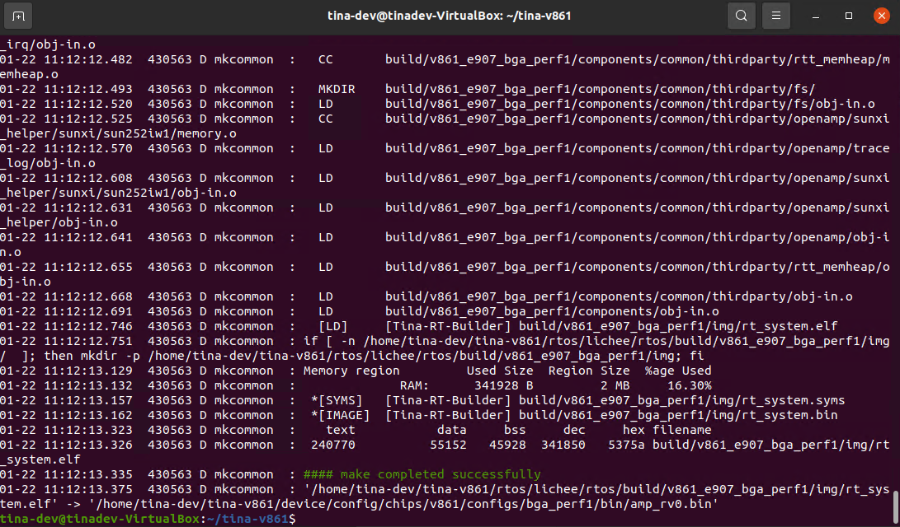

### 清理 RTOS 编译

可以使用 `mrtos clean` 命令清除上一次的 RTOS 编译产物。

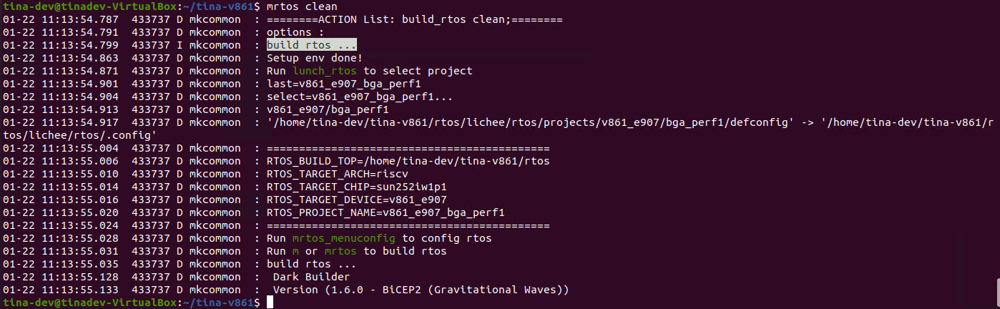

### 编译休眠唤醒固件

休眠唤醒固件可以使用 `mbare` 编译，编译完成后需要执行 `mrtos` 将其打包进 RTOS 中，然后使用 `pack` 打包到镜像

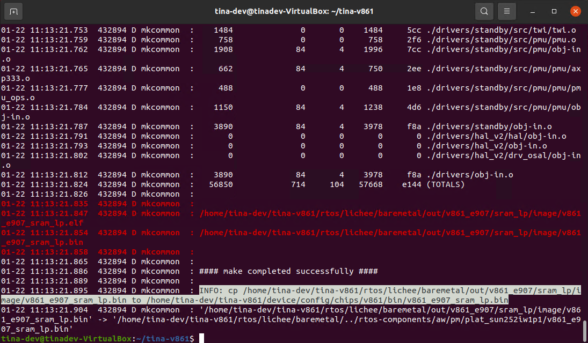

### 编译 U-Boot 与 U-Boot 设备树

U-Boot 可以使用`muboot`目录编译，编译前会自动执行 `clean` 清除之前的编译产物。编译完成后使用 `pack` 打包，输出的 U-Boot 文件会自动拷贝到 `device` 目录下对应板级配置中。例如这里使用的 `v861-bga_perf1` 板，会拷贝到 `device/config/chips/v861/configs/bga_perf1/bin`

```
muboot
```

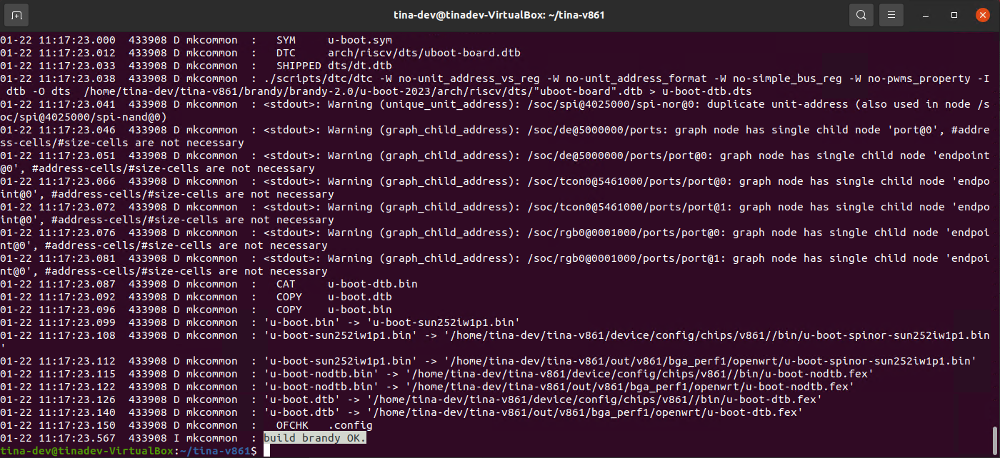

### 编译 SPL

SPL 可以用 `mboot0` 来编译，编译前会自动执行 `clean` 清除之前的编译产物。编译完成后使用 `pack` 打包，输出的 boot0 文件会自动拷贝到 `device` 目录下对应板级配置中。例如这里使用的 `v861-bga_perf1` 板，会拷贝到 `device/config/chips/v861/configs/bga_perf1/bin`

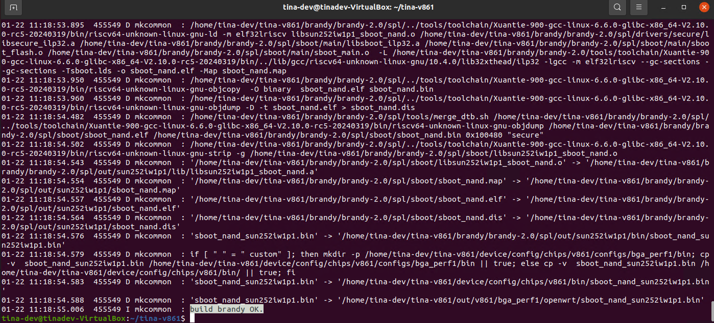

### 编译 U-Boot和SPL

可以使用命令 `mboot` 同时编译 `U-boot` 和 SPL，编译前会自动执行 `clean` 清除之前的编译产物。该命令会先编译 U-Boot 然后再编译 SPL

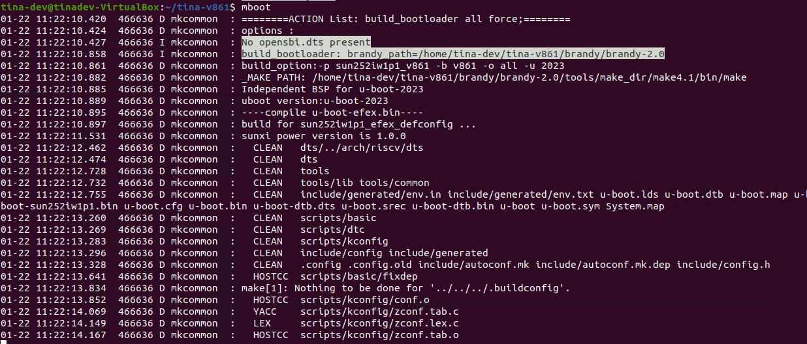

### 编译 MPP

可以使用 `mkmpp` 命令单独编译 mpp，请注意编译前需要在 `menuconfig` 中配置需要编译的软件包

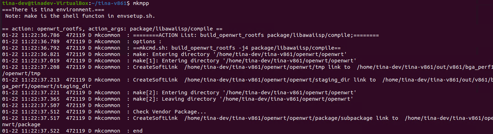

### 清除 MPP 编译

使用 `cleanmpp` 命令清除 MPP 编译产物

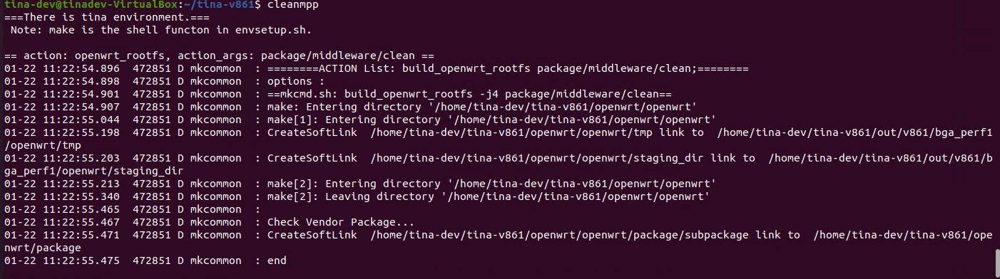

### 单独编译某一软件包

SDK 支持单独编译某一软件包，方便加速开发，这里以 `mtd-utils` 为例，介绍单独编译某一软件包的方法

**以 Package 方式编译**

```
make openwrt_rootfs package/mtd-utils/compile
make openwrt_rootfs package/mtd-utils/clean
```

-   `package` 是指在 `openwrt/openwrt/package`, 和 `openwrt/package` 目录下搜索该软件包。 `tools` 是指在 `openwrt/openwrt/tools` 下搜索
-   `mtd-utils` 是定义软件包的 Makefile 所在目录的目录名，编译其他软件包时，替换该字段即可
-   `compile` 换成 `clean` 是清理软件包编译文件

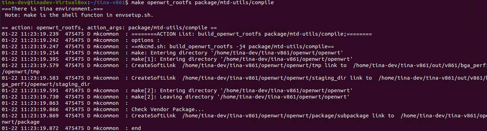

**以路径方式编译**

也可以使用软件包 `Makefile` 所在目录相对于`openwrt`原生代码根目录的相对路径来直接指定编译软件包

-   `mtd-utils` 软件包位置：`openwrt/openwrt/package/utils/mtd-utils`

编译指令：

```
make openwrt_rootfs package/utils/mtd-utils/compile
make openwrt_rootfs package/utils/mtd-utils/clean
```

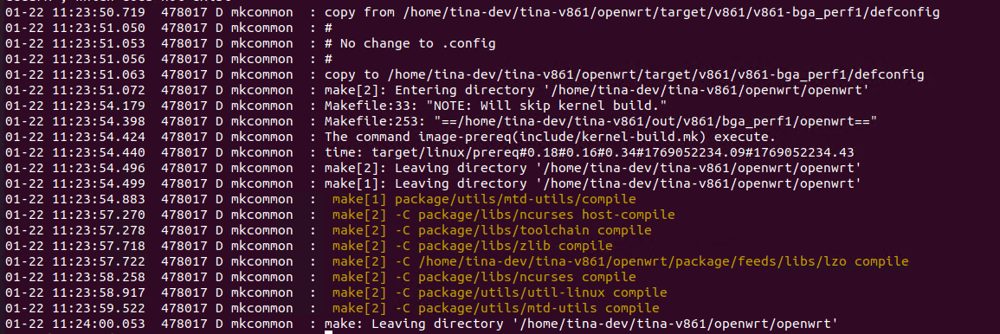

SDK为了区分openwrt原生代码与新增代码，软件包的 `Makefile` 放在 `openwrt/package/` 目录下，但编译时需嵌入到 `openwrt` 原生代码的标准路径，SDK 使用了软链接方式，将其软链接到 `openwrt/openwrt/package/subpackage`。这里以 `eyesee-mpp-middleware`包为例：

-   实际位置：`openwrt/package/allwinner/eyesee-mpp/middleware`
    
-   软链接之后的位置：`openwrt/openwrt/package/subpackage/allwinner/eyesee-mpp/middleware`
    

编译指令：

```
make openwrt_rootfs package/subpackage/allwinner/eyesee-mpp/middleware/compile
make openwrt_rootfs package/subpackage/allwinner/eyesee-mpp/middleware/clean
```

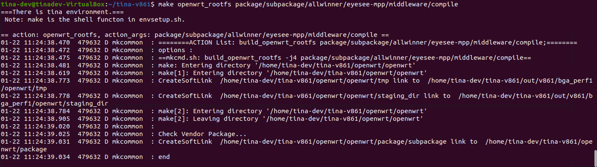

**以快捷指令方式编译**

SDK 提供一个快捷指令：`mmo` 只需要在 `mmo` 指令后面跟上需要编译的软件包名即可编译

```
mmo mtd-utils
```

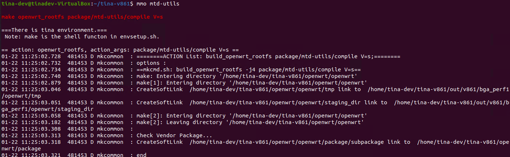

如果需要清理上一次编译产物，重新编译，则使用 `mmo -B` 命令

```
mmo mtd-utils -B
```

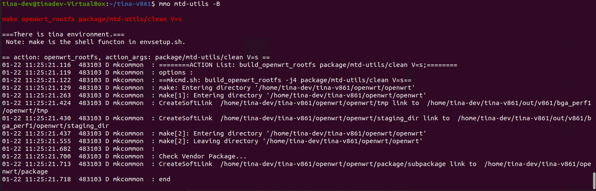

**前往文件夹下编译**

SDK 也支持在文件夹下编译软件包，例如 `mtd-utils` 位于 `package/utils/mtd-utils`，可以前往文件夹单独编译这个软件包

编译指令：

```
cd openwrt/openwrt/package/utils/mtd-utils
mm # 编译软件包、
mm -B # 先 clean 后重新编译软件包
```

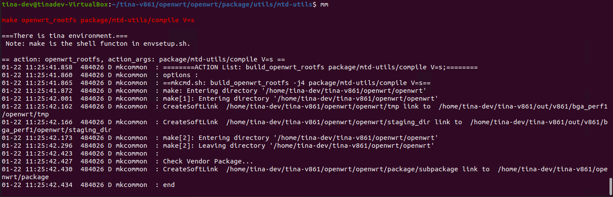

## 编译 XR806 Wi-Fi MCU 固件

针对低功耗 IPC，可以搭配 XR806 低功耗 Wi-Fi 套片解决方案，SDK 同时提供了 XR806 的固件，其编译方法如下：

### 初始化环境变量

在 SDK 根目录初始化环境变量，只编译 XR806 固件的情况下，不需要 `lunch` 板级

```
source build/envsetup.sh
```

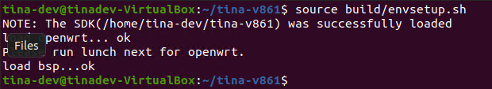

### 编译 XR806 固件

前往 `xrlink` 目录 `rtos/lichee/xr806/appos/project/example/xrlink/gcc`

```
cd rtos/lichee/xr806/appos/project/example/xrlink/gcc
```

使用命令加载默认配置

```
make defconfig
```

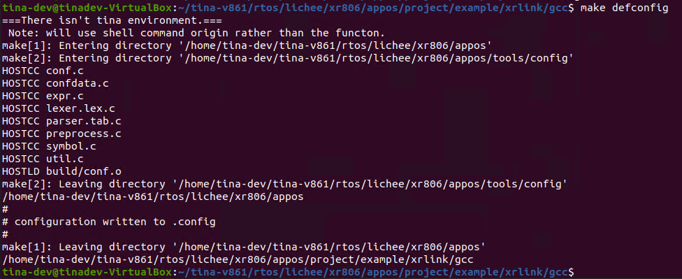

加载完配置后开始编译，使用指令：`make build` 开始编译

```
make build
```

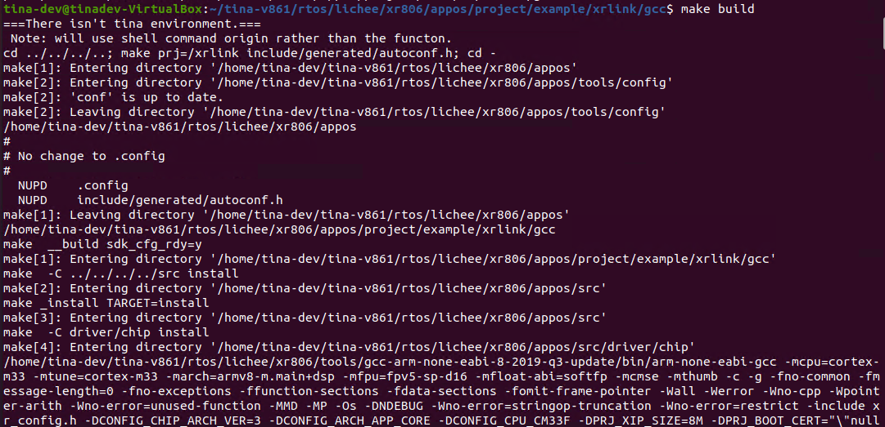

编译后生成的固件目录在 `rtos/lichee/xr806/appos/project/example/xrlink/image/xr806` 目录下，其中的 `xr_system.img` 则是目标固件。

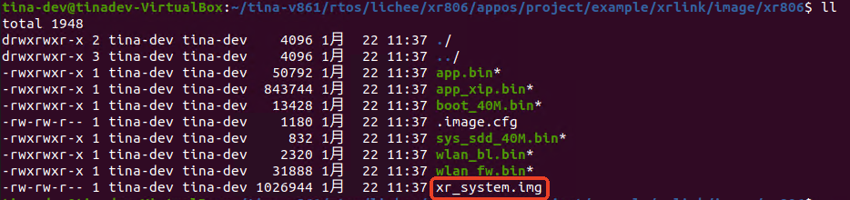

## SDK 快捷命令

SDK 提供了一系列方便开发的快速跳转指令，在开发过程中可以使用这些指令快速跳转目录，执行操作。

| **命令** | **命令有效目录** | **作用** |
| --- | --- | --- |
| make | tina根目录 | 编译整个sdk |
| pack | tina根目录 | 打包固件 |
| m | tina下任意目录 | make的快捷命令，编译整个sdk |
| p | tina下任意目录 | pack的快捷命令，打包固件 |
| m menuconfig | tina下任意目录 | 任意目录启动软件包配置界面 |
| m kernel\_menuconfig | tina下任意目录 | 任意目录启动内核配置界面 |
| mrtos menuconfig | tina下任意目录 | 任意目录启动内核配置界面 |
| croot | tina下任意目录 | 快速切换到tina根目录 |
| cconfigs | tina下任意目录 | 快速切换到方案的bsp配置目录 |
| cplat | tina下任意目录 | 快速切换到tina方案配置目录 |
| cout | tina下任意目录 | 快速切换到方案的输出目录 |
| cboot0 | tina下任意目录 | 快速切换到boot0源码目录 |
| cboot | tina下任意目录 | 快速切换到uboot源码目录 |
| ckernel | tina下任意目录 | 快速切换到linux源码目录 |
| cbsp | tina下任意目录 | 快速切换到bsp驱动源码目录 |
| crtos | tina下任意目录 | 快速切换到rtos源码目录 |
| cgrep | tina下任意目录 | 在c/c++/h文件中查找字符串 |
| mm \[-B\] | 软件包目录 | 编译软件包，-B指编译前先clean |
| cmpp\_s | tina下任意目录 | 快速切换到mpp middleware源码目录 |
| cmpp\_p | tina下任意目录 | 快速切换到mpp middleware配置目录 |
| clibcedarc\_s | tina下任意目录 | 快速切换到libcedarc软件包目录 |
| clibcedarc\_p | tina下任意目录 | 快速切换到libcedarc配置目录 |
| crtmedia\_s | tina下任意目录 | 快速切换到rt-media源码目录 |
| crtmedia\_p | tina下任意目录 | 快速切换到rt-media配置目录 |
