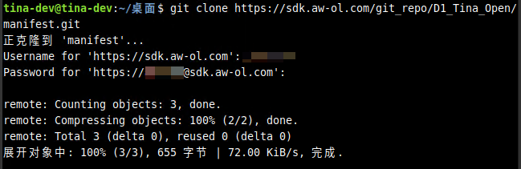
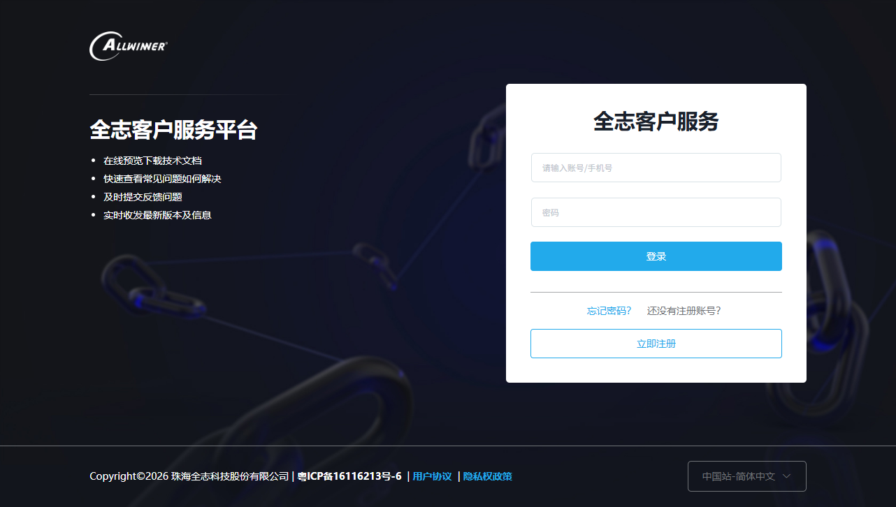
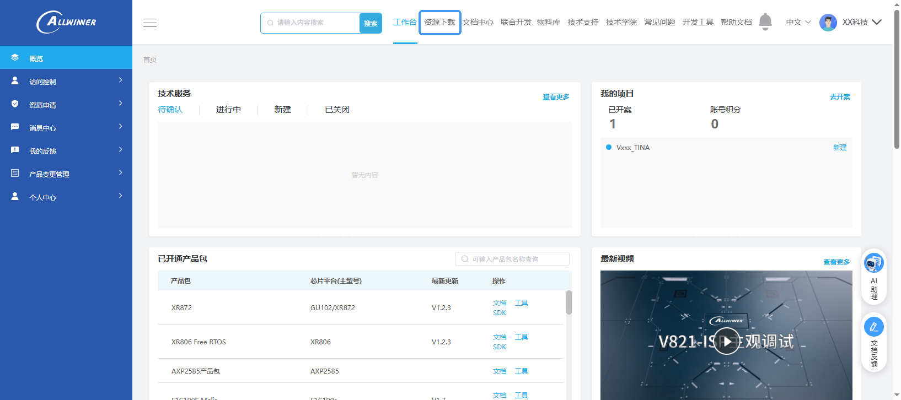
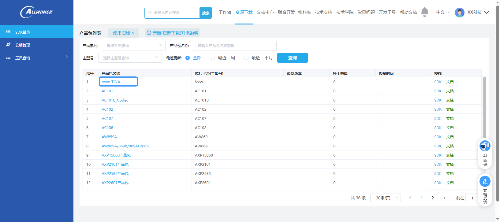
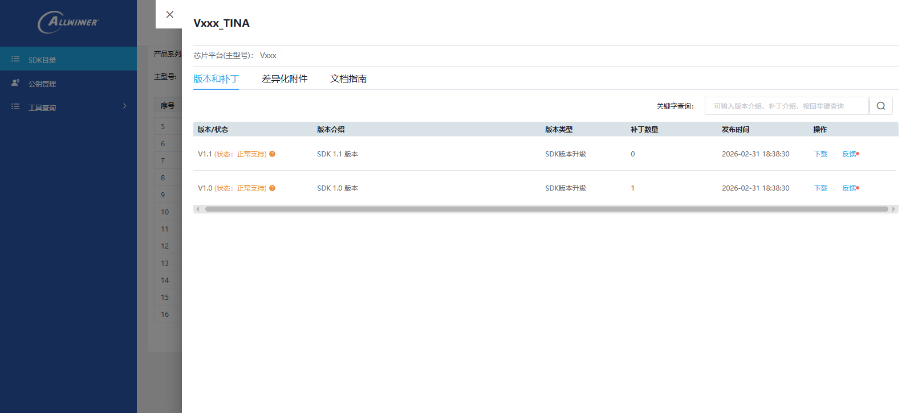
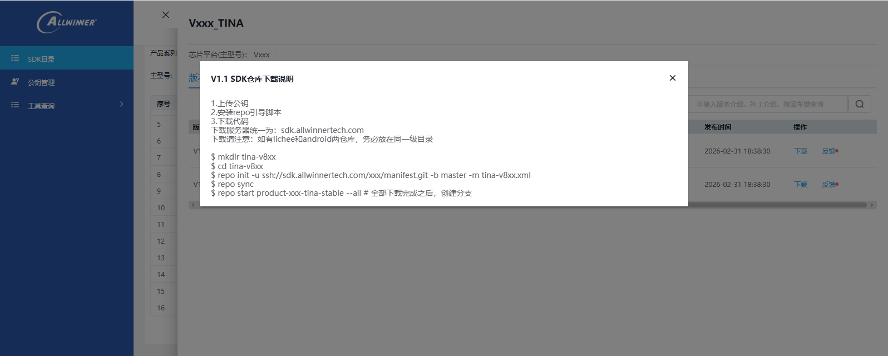

# SDK 获取下载

## SDK 拉取工具安装

SDK 使用 Repo 工具管理，拉取 SDK 需要配置安装 Repo 工具。

Linux 发行版可以用包管理器进行安装：

```bash
# Debian/Ubuntu.
$ sudo apt-get install repo
```

也可以手动单独安装：

```bash
$ mkdir -p ~/.bin
$ PATH="${HOME}/.bin:${PATH}"
$ curl https://mirrors.bfsu.edu.cn/git/git-repo > ~/.bin/repo
$ chmod a+rx ~/.bin/repo
```

### 更换镜像源

Repo 的运行过程中会尝试访问官方的 git 源更新自己，更换镜像源可以提高下载速度。将如下内容复制到你的`~/.bashrc` 里

```bash
$ echo export REPO_URL='https://mirrors.bfsu.edu.cn/git/git-repo' >> ~/.bashrc
$ source ~/.bashrc
```

如果您使用的是 dash、hash、 zsh 等 shell，请参照 shell 的文档配置。

### 配置保存身份认证

新版本 git 默认加强了安全性，身份认证不会保存，导致拉取 repo 需要多次输入密码，可以用下列命令配置：

```
git config --global credential.helper store
```

### 常见问题

-   卡在`Downloading Repo source from https://gerrit.googlesource.com/git-repo` 不动。
    -   国内网络较慢，参照上面的更换镜像源解决。
-   配置保存身份认证无效不启用
    -   检查是否运行了 `sudo git config --global credential.helper store`
    -   使用了 `sudo` 后保存的信息会存储到 `root` 用户下并非当前用户。
-   出现错误 `fatal: cannot make directory: File exists`
    -   之前拉取了 repo 但是不完整，需要删除 `.repo` 文件夹重新拉取

## 获取 SDK

### 新建文件夹保存 SDK

使用 `mkdir` 命令新建文件夹，保存之后需要拉取的 SDK，然后 `cd` 进入到刚才新建的文件夹中。

```bash
mkdir tina-v861-open
cd tina-v861-open
```

### 初始化 Repo 仓库

使用 `repo init` 命令初始化仓库，需要执行命令：

-   社区版 SDK
-   商业版 SDK

使用 `git clone` 初始化本地登录，由于 `repo` 无法提供交互式输入用户名密码的接口，所以需要先使用 `git` 命令将用户名与密码保存，我们先拉取 D1 的仓库，作为保存 `git` 用户名和密码的操作。

```bash
git config --global credential.helper store
git clone https://sdk.aw-ol.com/git_repo/D1_Tina_Open/manifest.git
```

如果提示 `Username for 'https://sdk.aw-ol.com':` 请输入 [全志在线开发者论坛](https://bbs.aw-ol.com/) 的用户名和密码。



之后便可以把 `clone` 的文件删除，这个操作只是用于保存密码的，拉取 V861 SDK 不是这个链接。

这样就可以把用户名密码本地保存，之后便可以用 repo 下载

使用 `repo init` 命令初始化仓库，需要执行命令：

```bash
SDK暂未发布，敬请期待，商业客户请切换商业版 SDK 选项查看下载方式
```

使用 `repo init` 命令初始化仓库，需要执行命令，命令请前往 `open.allwinnertech.com` 获取



输入账号登陆全志客户服务平台，点击资源下载



点击需要下载的芯片产品包



打开后可以看到产品包对应的 SDK 版本，SDK 会发布多个版本。



我们选择下载 SDK 1.1 版本，点击下载，可以看到弹出的下载说明



使用下载说明的命令下载即可

### 拉取 SDK

使用命令 `repo sync` 拉取 SDK

```bash
$ repo sync
```

由于 SDK 普遍较大，拉取可能需要一定的时间。

### 创建开发环境

使用命令 `repo start` 创建开发环境分支

```bash
$ repo start tina-dev --all
```

至此，SDK 获取完毕。
