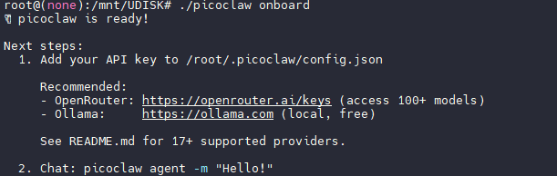
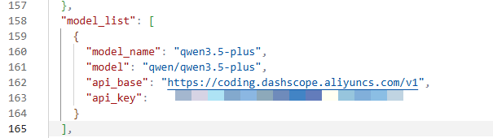
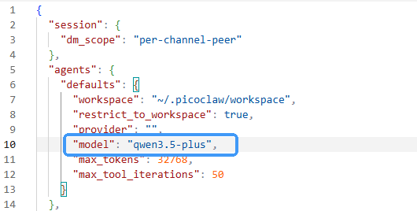
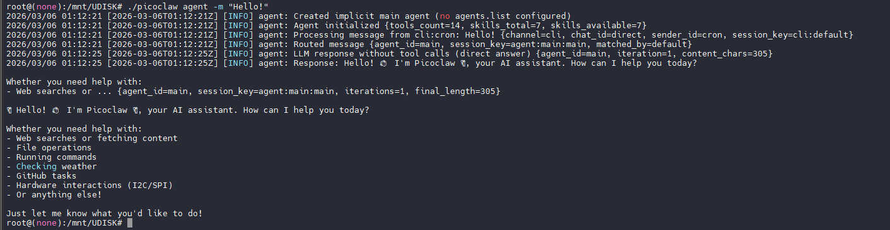
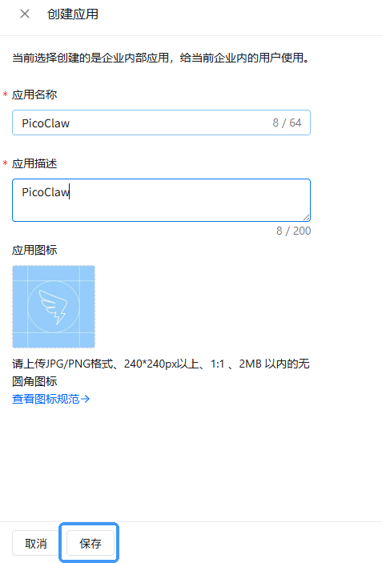
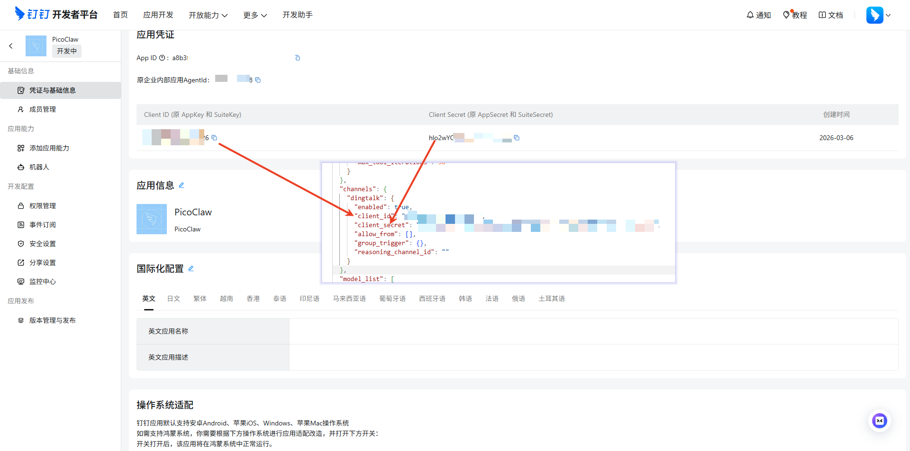
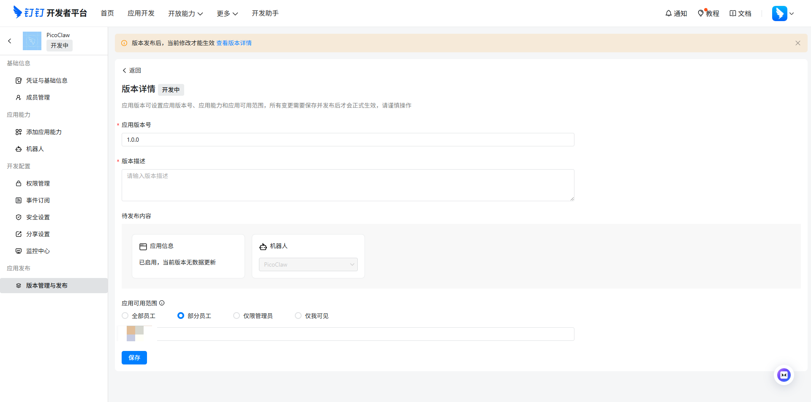
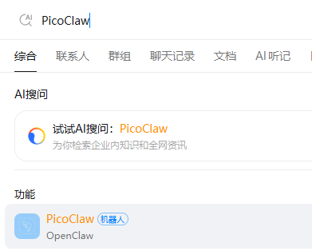
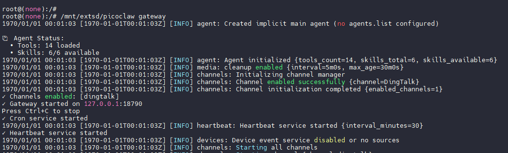

# PicoClaw 服务搭建指南

## 项目简介

🦐 **PicoClaw** 是一个受 [nanobot](https://github.com/HKUDS/nanobot) 启发的超轻量级个人 AI 助手，具有以下特点：

-   **超轻量级**: 核心功能内存占用 &lt;10MB — 比 Clawdbot 小 99%
-   **极低成本**: 高效到足以在 10 美元的硬件上运行 — 比 Mac mini 便宜 98%
-   **闪电启动**: 启动速度快 400 倍，即使在 0.6GHz 单核处理器上也能在 1 秒内启动
-   **真正可移植**: 跨 RISC-V、ARM 和 x86 架构的单二进制文件，一键运行
-   **AI 自举**: 纯 Go 语言原生实现 — 95% 的核心代码由 Agent 生成，并经由「人机回环 (Human-in-the-loop)」微调

PicoClaw 官方仓库：[https://github.com/sipeed/picoclaw](https://github.com/sipeed/picoclaw)

本指南将演示如何在 V881 开发板上部署 PicoClaw 服务，并对接 Qwen 大模型，通过钉钉接口进行访问，帮助您快速搭建个人 AI 助手服务。

## 准备工作

### 硬件要求

-   V881 开发板
-   SD 卡或 eMMC 存储介质
-   网络连接（有线或无线）

### 软件要求

-   OpenWRT 系统
-   基础命令工具
-   CA 证书支持
-   Python 3
-   curl 网络工具

## 固件配置

### 系统架构切换

1.  获取 SDK 后，执行以下命令将系统切换到 RV64 配置：
    
    ```bash
    quick_config system_set_to_rv64i
    ```
    

### 配置基础命令

修改 OpenWRT 配置，开启基础命令支持（也可以通过 `make menuconfig` 进入配置界面进行设置）：

```bash
CONFIG_BUSYBOX_CONFIG_BLKID=y
CONFIG_BUSYBOX_CONFIG_FDISK=y
CONFIG_BUSYBOX_CONFIG_FINDFS=y
CONFIG_BUSYBOX_CONFIG_GETOPT=y
CONFIG_BUSYBOX_CONFIG_HD=y
CONFIG_BUSYBOX_CONFIG_XXD=y
CONFIG_BUSYBOX_CONFIG_LSPCI=y
CONFIG_BUSYBOX_CONFIG_LSUSB=y
```

### 配置 CA 证书

开启 CA 证书支持，以确保 HTTPS 和 SSL 访问功能正常：

```bash
CONFIG_PACKAGE_ca-bundle=y
CONFIG_PACKAGE_ca-certificates=y
```

### 配置 Python 支持

启用 Python，使 PicoClaw 可以通过调用 Python 执行更多操作：

```bash
CONFIG_PACKAGE_libpython3=y
CONFIG_PACKAGE_python-pip-conf=y
CONFIG_PACKAGE_python3=y
```

### 配置网络工具

启用 `curl` 以获取网络访问能力：

```bash
CONFIG_PACKAGE_libcurl=y
CONFIG_PACKAGE_curl=y
```

### 编译固件

完成上述配置后，编译基础固件。编译后固件大小约为 40MB，建议使用 NAND 或 eMMC 介质存储。

## 部署方式

### 方式一：使用预编译部署

#### 部署步骤

1.  访问 [PicoClaw GitHub Releases](https://github.com/sipeed/picoclaw/releases/) 页面
2.  根据您的硬件架构选择并下载对应的预编译二进制包
    -   例如，对于 RISC-V64 架构，选择 RISCV64 版本
3.  解压下载的压缩包
4.  将解压后的文件部署到设备：
    -   **方法一**：放入 SD 卡，然后插入开发板
    -   **方法二**：使用 ADB 命令推送到设备
    -   **方法三**：在系统打包时直接包含


### 方式二：自行编译 PicoClaw

#### 适用场景

从源码编译安装适用于需要获取最新特性或进行开发定制的用户。

#### 编译步骤

1.  克隆仓库
    
    ```bash
    git clone https://github.com/sipeed/picoclaw.git
    ```
    
2.  进入项目目录并安装依赖
    
    ```bash
    cd picoclaw
    make deps
    ```
    
3.  构建选项
    
    -   **仅构建（无需安装）**
        
        ```bash
        make build
        ```
        
    -   **为多平台构建**
        
        ```bash
        make build-all
        ```
        
    -   **构建并安装**
        
        ```bash
        make install
        ```
        

## 配置与初始化

### 网络配置

启动开发板后，先连接网络：

-   **无线网络**：执行 `wifi -c <ssid> <password>` 连接 Wi-Fi
-   **有线网络**：执行 `udhcpc -i eth0` 获取动态 IP

### 初始化配置

执行以下命令进行 PicoClaw 初始化配置：

```bash
picoclaw onboard
```



### 配置模型 API

编辑 `config.json` 文件，填写使用的 API 和密钥。以下是使用 Qwen3.5-Plus 模型的配置示例：



### 配置代理模型

找到 `agents` 配置部分，设置使用的模型：



### 测试 LLM 功能

配置完成后，执行以下命令测试 LLM 功能是否正常：

```bash
./picoclaw agent -m "Hello!"
```



有回复即为配置成功。

## 接入钉钉平台

### 创建钉钉应用

1.  登录钉钉开发者平台，创建一个新应用 
    
2.  填写应用信息并保存
    



### 添加机器人

1.  在应用管理页面，添加一个机器人


2.  配置机器人名称等信息


3.  点击发布机器人


### 获取凭证信息

点击「凭证与基础信息」，获取 Client ID 和 Client Secret：


### 配置到 PicoClaw

将获取的凭证信息配置到 PicoClaw 的配置文件中：



```json
"dingtalk": {
  "enabled": true,
  "client_id": "xxxx",
  "client_secret": "xxxxxxxxxxxxxxxxxxxxxxxxxx",
  "allow_from": [],
  "group_trigger": {},
  "reasoning_channel_id": ""
}
```

### 发布应用

1.  进入「版本管理与发布」页面，点击「创建新版本」



2.  输入版本号和版本描述，点击发布


3.  确认应用已上线


4.  在钉钉中搜索并使用应用



## 运行服务

### 启动服务

执行以下命令启动 PicoClaw 服务：

```bash
picoclaw gateway
```

### 注意事项

由于大部分 API 都需要 HTTPS 协议，在启动前建议使用 `date` 命令设置当前日期，以免出现 TLS 证书验证错误。



## 故障排查

### 常见问题

1.  **网络连接问题**：确保开发板已正确连接网络，可通过 `ping` 命令测试网络连通性
2.  **API 配置错误**：检查 `config.json` 中的 API 配置是否正确
3.  **TLS 证书错误**：使用 `date` 命令同步系统时间
4.  **权限问题**：确保 PicoClaw 可执行文件有执行权限

### 日志查看

可通过查看 PicoClaw 运行日志来定位问题：

```bash
picoclaw gateway
```
