# PMC 使用指南

## 概述

### 编写目的

提供全志 V861 平台 PMC 模块的硬件设计，软件适配的相关说明文档。

### 适用范围

:::note

:::note

适用产品列表

:::

:::

| 产品名称 | 内核版本 | 备注 |
| --- | --- | --- |
| V861 系列 | Linux-6.6 | 需要芯片封装支持 PMC 功能 |

### 相关人员

需关注全志 V861 平台 PMC 模块的硬件设计，软件开发者，测试者和第三方人员。

## PMC模块

### PMC 模块功能

PMC 模块是芯片内部支持控制低功耗场景的应用，实现上下电以及不同场景的供电管理。其功能如下：

-   POWERON 按键开机/唤醒/中断功能
-   VBUS 插入开机/唤醒/中断功能
-   首次开机后可配置IRQ中断引脚开机/唤醒/中断功能
-   首次开机后可配置闹钟开机/唤醒
-   异常掉电检测功能
-   上下电顺序可配，休眠状态电源可配置单独MASK
-   POWERON 按键长按强制关机/重启/仅产生中断功能
-   记录开机/关机源
-   Watchdog 复位支持可配重启/仅产生全局复位/输出到引脚

### PL 组 IO 芯片内硬件架构

-   PL 组的每个IO 都可以作为**普通 GPIO**或 **唤醒引脚（Wake Up IO** 使用。
-   **PL0、PL1、PL2** 还可以切换为 **PMC 功能引脚**，不过一旦切换为 PMC 功能，它们就不能再用作 GPIO 或 Wake Up IO
-   默认情况下，PL0、PL1、PL2 口都是 PMC 功能，可以在 BOOT0 阶段配置切换回 GPIO 功能
-   只有当 **PMC-BYP 引脚被拉高**，并且**软件里也设置为 PMC 模式**时，PL0、PL1、PL2 口才会真正切换为 PMC 功能，否则将没有任何作用。
-   如果 **PMC-BYP 拉低**，即使软件设置为 PMC 模式，PMC 功能也不会生效

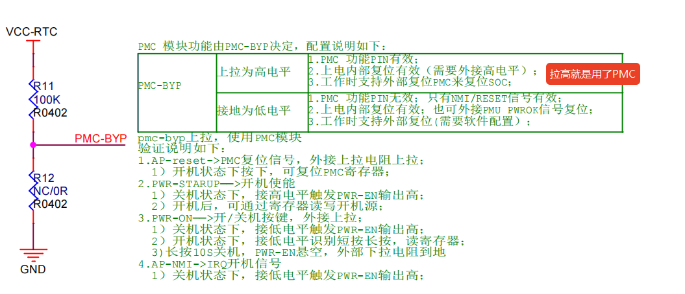

-   PL 口的 IO 还支持 **IO HOLD 功能**，在 **VSYS 掉电后**能保持原有电平状态
    
-   此外，**PMC 功能是否启用**完全由 **PMC-BYP 引脚电平**决定：
    
    -   拉高：启用 PMC 功能
    -   拉低：禁用 PMC 功能
-   **PL5** 引脚复用了 **TEST 功能**和 **NMI POWERON 功能**。
    
    -   冷启动上电时，切勿拉高 PL5，否则会进入 TEST 模式。
    -   PL5 会在芯片**启动或唤醒时自动拉高**，可用来控制外部 DCDC电源上电。例如为 **3.3V 外设供电**或 **VSYS 系统供电**。
    -   PL5 寄存器配置默认为 NMI POWERON 功能，软件会自动切换到 GPIO 模式，但是如果需要继续使用 PL5 作为上电控制则需要配置软件将其保留为 NMI POWERON 功能。

PL 组 GPIO 内部结构如下图所示：

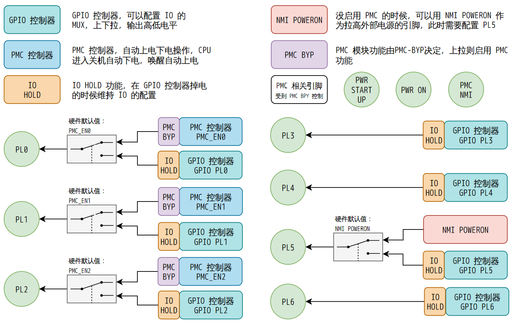

#### PMC 硬件说明

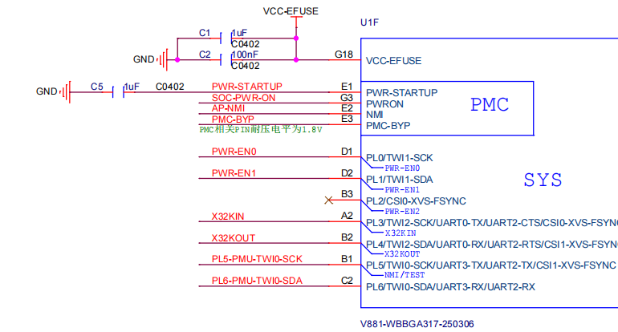

-   AP-ESET：PMC 复位信号，外接上拉电阻上拉，开机状态下按下，可复位 PMC 寄存器，复位系统
-   PWR-STARTUP：开机使能，关机状态下，接高电平触发 PWR\_EN 输出高电平；开机后，可提供节点获取开机源
-   PWR-ON：开/关机按键，外接上拉；开机状态下，接低电平识别短按长按，长按 10S 关机，PWR-EN 悬空，外部下拉电阻到地
-   PWR\_EN：总共三组 PWR\_EN pin 脚，默认为输出 1.8v，可在设备树通过配置 standby\_param 控制休眠时要关闭哪组 PWR\_EN 的输出
-   NMI：IRQ 开机信号，关机状态下，接低电平触发 PWR\_EN 输出高电平

:::danger

:::note

危险

:::
:::note

当使用 PMC 功能时，Super Standby 和 Hibernation **不支持** PL0~6 使用 Wakeup IO 功能唤醒，只可以使用 PL5 NMI 功能唤醒、 POWER-ON 唤醒和 PWR-STARUP 唤醒。

| 场景名称 | 唤醒源 |
| --- | --- |
| Normal Standby | Wakeup Timer / RTC alarm / GPIO / Wakeup IO / NMI（PL5）/ POWER-ON / PWR-STARUP |
| Super Standby | Wakeup Timer / RTC alarm / NMI（PL5）/ POWER-ON / PWR-STARUP |
| Hibernation | Wakeup Timer / RTC alarm / NMI（PL5）/ POWER-ON / PWR-STARUP |

:::

:::

### PL5 NMI POWERON 功能配置

如果不使用 PMC，只需要 PL5 上电拉高并维持供电，需要配置 `BoardConfig` 中的 `LICHEE_SPL_BOARD_MK` 条目，增加 `all-cfg_pl5_powon` 的配置。

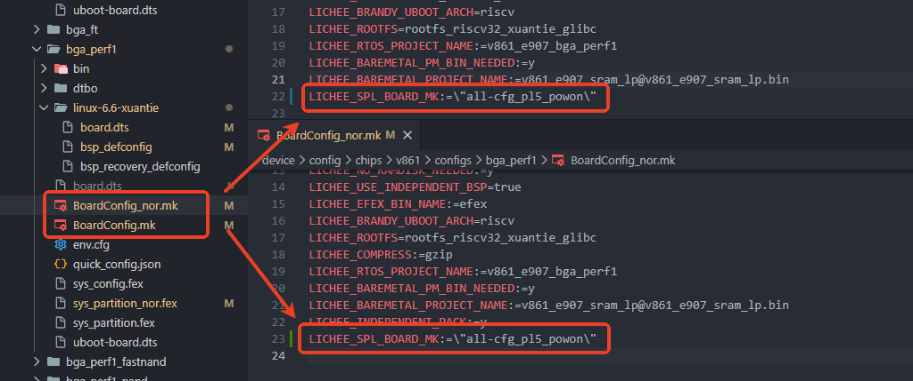

增加后需要重新 `lunch` 板级以实现环境变量的更新。

:::tip

:::note

提示

:::
:::note

这个配置修改将会启用 BOOT0 中的 `cfg_pl5_powon.mk` 的配置，启用 `CFG_PL5_PWRON=y` 配置项。在 `brandy/brandy-2.0/spl/board/sun252iw1p1/board.c` 中会判断这个配置是否启用，如果启用则会将 PL5 保留为 PMC 配置，而不是切换为 GPIO 模式。

:::

:::

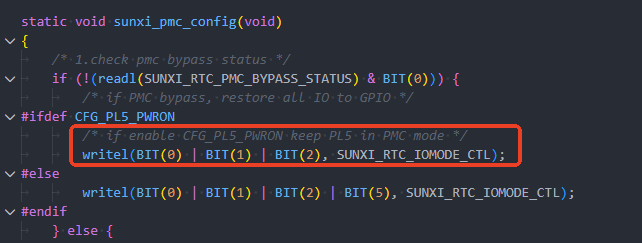

注意使用 PL5 NMI 功能请与全志 FAE 联系，获取其详细的使用方法。

### PMC 模块配置

#### PMC 快速切换

SDK 支持使用 `quick_config` 命令一键切换到 PMC 模式，包括三个引脚功能：

-   PWR\_EN0
-   PWR\_EN1
-   PWR\_EN2

这三个脚支持任意排列组合，请根据硬件形态配置开启关闭，此处 V881\_PERF1 板级使用了 PWR\_EN0 和 PWR\_EN1，则运行 `quick_config`

```
quick_config pmu_set_to_pmc_pl0
quick_config pmu_set_to_pmc_pl1
```

![quick\_config 配置](data:image/png;base64,iVBORw0KGgoAAAANSUhEUgAAA2QAAABdCAYAAADKdaUwAAAgAElEQVR4nO2dP5Liuvf2n/vWbx/ukjfQxQLaCZoNNLETAnsDNBETDBGwAROQEMMGWp24FzA1G7ALb+LWzb5vYBsMDbaMbEwzz6dqqqaBY0nH0jn6cyT90+v1/oeMf//7PxBCCCGEEEIIuQ3/r+sMEEIIIYQQQsjfCgdkhBBCCCGEENIRHJARQgghhBBCSEdwQEYIIYQQQgghHcEBGSGEEEIIIYR0BAdkhBBCCCGEENIRHJARQgghhBBCSEfoXTwmLNj7PxJEcVvZudP0CSGEEEIIIaQFNAZkDhYbF0LtEANA/IlgGSJqO2d7LPiemw3IniDkDkFvCnWz9AkhhBBCCCGkHfRWyLBDMD4zCJIT/Jk5hQ8SRMs1Xpfh8fdqiudx9plwsd24sOM1XpcWtjNgVBhg2d4KW7E+/B4JgvE0+7+DhXypW0ZCCCGEEEIIuUsa2EMWYtTr47nXx/NgjdibYOtZhe8TRPYLZPaXLR0gTsyTJYQQQgghhJBvTrOHesQhgmUCWzwVPtxBqSf4ngXAge/toBhvSAghhBBCCCG3OWUxUiEgHdjyBVJ9cv8XIYQQQgghhKDpAZlw4HsWonh3/HkcQsHB3HOgPsLzsoQQQgghhBDyl6F5qEcZDha/84M9EkTLKV6Xp3vEEgTLHfzZDoEC4GUfRwkiWCCEEEIIIYSQv5EGBmTh0SmJF1FTPGc/sst/SQghhBBCCCF/BTfZQ3aROEEMBz9ktkomHEh5JuSREEIIIYQQQh6QBlbITAgxGlhYzFf4M0s/idQUb19CHgkhhBBCCCHk8fin1+v9L//j3//Ojc8cLH6/4F0nLLF17ikvhBBCCCGEEGKG5gpZ4eCOeI3XwRpRe3k6k/Zkf7E0EOL9ZmkTQgghhBBCSHtorJARQgghhBBCCGmDbg/1IIQQQgghhJC/GA7ISLPICf5s3OuvNjCVJ4QQQtrgYf2bBSmtevkSLrZH20kIISZ8nwFZdiT+/RkyQgghhJBvinDgz1yIrvNByF9MxwMyC/7mA39+F/+dm3FxsNhMsPhbDYacXNDLjeQJIeQahIPFZnWw75sJZF0jfu/2q+v8dZ3+vUP9VBOv8Xrp9Oqu9dd1+uSxuaP6dReneETLIV4v3j1mwd9MIFQIdQ8aI4QQokE6kYbxEM8qs+/Cge+5iMe3PKmXEELuHQu2ABAntI2tcP/6/R4hi2qK1/Fnfbksxtn3JthmM7TbmXMIexQutr9XWMxW+PN7hYXnZr+bwBc4HyNdMwbcloe0//xeYSGtk19YkLPDDPLX/H3gz8xBevx/9pyZU6P8VfIW/Evpa+FgsTmUz/8y+31avlPdmcqXkL+/4jv4MkNvUH7T+mVaPkJuQmY76u59ERYEQryrwmRbHCI4Goy1aP9QZX/TZy6ODHwatZF/ViqvaV/Ly1dlH0po275r+D8j/6ZFubztrY7rZabTg/82qz937d9KOa7HRWxvVdBBQS+n71pXf9f616r61Uj/p9v+X3X7S6918r0Vtr9/Yj7/qb8v7w76H9X2ser9VuW/5Pss/1frtxH70Cx3MSCzvdXhhXqnBj1BsAwNnu7AF5946/XxPJhC2RPMT9JIV+gA6VkIen2MVLpfzRwH/uwJatzHc6+P594vvPedowoqZysssMZrr4/n3vA4f3H2+TgEEGLUy54z1tSHhrycreDn6V/QTxlyNoGMppn8GpDOyfcrLOwQo0Ga9tsHIGVz8tU48PvZ++8NMYocLLxDGqblN61f5uUj5E6JE8Rw4G8m8C/s/23V/lXa3xDBMoHsF2yOdOGLEO9KQ17Tvl4sX8bV/ucG9r0cQ/+mQZV8tBxiFLnZZw4WGxfxeIggRgP15zv4t0skiCJAiK+6FsJCFO+yv3K9nAlX1NJfi/61gffXbf9Pt/wOpFjjrTfE62CI58H6fOjoWbrsf1S3f/P8l39vpN9G6lezdDwgSxAM8pfZx+s4hPBWZ2d1jNJYhumMbBwiWIawZXEUvUMUIzVQcYK4yaQBABakcNKlUiRQ42Jjc/BDFvKX5fU4f21ykv5Z/dSX//L92xoqU2yk1ghUU/I6JFAF/aqPELDzzqFp+dNnXl+/migfIW2TOatB3TDDEKPBFDGe4M9W6Wzkpjhjegv7V2Z/gUiFiOTLPk+y7wDqs/CbcvlydMrXpv9pwr5V0aZ/05NX4ylib4XtZgKpphg1Zj+/g3+7jPoIYYsnAICcfWDrWQAs2HYCpS5tEalL2/7VPH/d9f90y1/UIYC4zrvpuv9hYh918l/2/S30e1vuYoUsJ1JrvJ3OWBqTVshuCDEarBFLF/PNmRVAYUGcHmxyy+VSYUGY6KdKvu3vtejw+VU0kj4hd0wcYjQYZpNuQwSRg0Vu41q3fxX2N8ufih342QpL7uC15cv47va9kpb9m7Z8utJpC9NomnPp37t/KyFKsskGBz/sBJAObOFAiibT7LB8WnSY/k3K32X/w9A+AqjO/73Xr2a5qwFZOzxlo/eOiNcYDYZ47fXxOt5Bem4h5CVBXFwqzf/Vnom+Nm8JYhP9VMm3/b0pjTy/Rf0Rcjc0ceVIgqA4g34L+1dmf/M85bOq8gUyDvezxXryZWl/c/uulUaL/k1XXriYezsES8CfN7gH96782xXtL3++9wKhfiGIsquDjlaAW+Qu/FuH6d+k/B33P0zsI4Dq/HfYP+yAbgdkwsXCO97EN/esdNm7MSz4eRrCge85aZiKjmi+ByIf9Wfy2pyW7wsh3lU6Y3zYJO0exWADSGe6TCreRfkQ78pAPxfkv3w/d/cbfW3pwpdNyZtiWn7AqH61Xj5CmsDB4veq/iWwwk1tW2EDud93MnsEtG7/Ku1vhvqEEi62s5O2qytfal81ymdKW/a9yv815d+M5PN9Y1ME2X6y7ekq2tX+817825XtL3u+lE9QKoH62EHKp8L+sVMu6Khh/e3rn27/yqj/02H/r5H+RRUd9j+q2r+W/qryX/Z9Q/o17V83SLcDsjjEO14w35/Q4yAeD09iwPPTTyaQR//XJUQQZ2ls0g22bxeP2P8qOxqHQH7oyPwFkaoxWIzXCArl23pAMDjePKvGQ4zg7k+RmfeB99M04jSudx+6UTfspURejYcI8vRr6yeTt7NTcDYucJJ3Nc42+m4O5VOqOXlTTMtvVr/aLx8h5uwQxQmiujPr8RrBxwvm88MpXBJrvBY2Tbdq/zTsb0p+iEca+lZbvsK+VpbPlNbse4X/a8q/lVAlL2fH+8bUeAolJ8f70A385334tx3er+zEx3ECOw9RjBJAWIjP7qEJMRrvIDf5uyyEnpnq72L90+xfGfV/Ouz/oYn+RXUeO+t/VLZ/Hf1V5b/8+0b0a9q/bpB/er3e//I//v3vLq4law7hYruxEFy68JAQE1i/CHkIbG+FrVh3esIWIZdxsNhYCG4V7voIPLp//u7lq8r/dy/fFfwFe8gIIYSQS6RhNc2GyhPSFBb8jQssORgj5JF5sCWxW5JeOHcxdDJe47XV2ay20++6fFXcQfnfrn44IeQOkLP08txITfH6t0zDkm+HesvuViOEPCyPHbJICCGEEEIIIXcMQxbJw2Lnm0lrHwRDCCGE6GKlR8rXERHuFScn6kP/1yRXvN82kBP82VxztcOd5L9rrtZfQ/IVcEBGHpZoObztvT+EEEL+PoQDf+biDk7O3kP/1yB3+H5r8d3z/5fQ8YDMOhw1eWEmx5aT/ZG3f36vsJB1bwJ/AOTEbIbLVP6hseDPVof6VfumeULIRYSDxaYwU7+Z7O+80ebe7VfX+es6fZLuKb50Gtxdvx/6Py3K3u934Dvn/67bT7PcxQrZfian18dzsdIIF37/E2+D7LtBCDFbHd8xQogBcraCjxCv2UwiPNYvQprBwWIzAZa/Dvb97RO2117IByFEH/q/R8KCLeqFJZ69DFlwUN4VdzEgu0i8xmgcppcaZn8HChC6FSaL0fa9wyrbdla4WVy42P5eYTFbZbND+QWUE/gC52O8a8aQVq/wWZCzwwzy1/zlF9Xll2LXuLhOS744Q3aSvtbzDfR7tvw1OmtV6Vfi4IdMEOTHCcfpxbCy393FgITcH5ntqBs7LywIhHhXxcuWQwTjYghVi/YPVfY3feZxBzSN2sg/K5XXtK/l5auyjyXcyL6X+T8j/6aZfjf+5bgeFLG9VUHHBb2f6kq3/hZ1WGcF+R78n3BO6texfo0inLruXwAofb/Z869uX7rpbw76+2oX0tOgfW+F7e+fmM9/nrTZ8vo535ypsxu38JlB+9WQt73VsV/J3umh/21m/6v1V1U/TOXrcRcDssPm06olcwu2jQs3zV/CgS8+8dbr43kwhbInmJ+kES2HeF0C0rMQ9PoYKQeykdBIB/7sCWqcr/79wnvfOWoAcrbCAut0hqo3PM5fnH0+DgGEGOWzzLqXl2rIpzNk2e8u6KeyjAb6lbMVFnaIUbYK+vYByFozdNXpX0RYENgdBvwAongH2Nz8SogxcYIYDvzNBP6FDeWt2r9K+3umAypd+CLEu9KQ17SvF8uXcbX/uYl9L8PQv+mm0Yl/SRBF5yd/hbBSPwHgoPcz4WBa9ddJo4Ay/YwiBwuvXoezS/8n5Qvwka+AD6HgYlsYrFbVj2q67l+UvF+03b4AOZtARtPDCqY8VzccSLHGW2+I18EQz4N1Ia9l9TOEih38KOjDlg5s9bn/rWn7rZKPlkOMIjf7zMFi4yIeZ1c8GNv/av1V1Q9T+bp0PCBLEOThiL0+XschRMmSuZyt4EdTjGoFwiYIlmFhBihMK93++9QgRfEu60A0jQUpnGxpOIEaFxtLPkOV5S/L63H+2uQk/bP6qcJEv1n6b2uo7ItIpaug+pjmH8hnQ7e5oRAWN78SsidzhrUPBwgxGkwR4wn+bJXOdm6OZ2/bt39l9heIVIhIvuzzJPsOUOiQVMmXo1O+Nv1PE/a9irb9W3f+RX2EsMUTgPS+utQ/WLDtBErVmRQuI4Eq6Ed9hDUnBLv1f2o5RbDXRYLgS/5N2k/2zE77F2W03b7OP/8rxToEQHvBIq3HhwkpB75npXXwXPq126+evBpPEXsrbDcTSFW3f18j/S/6q6ofpvL1uYsVspxIrfF2Yck8HYmu8VpjdJxyPAN0W0KMBmvE0sV8c2YFUFgQpweb1FqONeTMDFl9DOS7Tn9POjHwuswMWSsDc0L+QuIQo8FwP4MeRA4WuY1r3f5V2N8sfypOOyJFB6wtX8ZD2PcybuHfOvQvUZIN1h38sBNAOrCFAyma1Ok393/Sxfbi+zVsPwC671888PMBRMs1lHTTUDz5AhkXBhSm7VdbPo1UsEVyYcB5JVX6a/v7K/gWN0Hny4KvVx3f+gRbYD+CvTnxGqPBGkAWTz1zIZfZ8nGcIEaIoKvTb7KQIjP9GOj3DtO3xRMQffKYYEKOsGAjMWwX6Qy676Uz6NEt7F+Z/c3ztAzhew7s2IKMwzRcRlu+LO1HsO9VabTt3zr0L7m8Bwj1C4H4CSl3RyFd3dOl/3OwmKUhZq/5Kpmc4I9XTMOg/QDovn/R1POvsJ+3aL8I8a7SkPJIOIjU8Gilzaj96soLF3Nvh2D5BH/uQjV1TUOV/tr+/gq6XSETLhbe8SbN+dGSqQU5+zAYjKXP8PM0hAPfc9IwFR3RfA/Efik/ldfmtHxfCPGu0hnjwyZp92sMeZQgygzTVVyUD/GuDPQDwEi/efpzd7+R2ZYu/FoxuBrpZ+/xx5fn5uV3C/LF+kcISTdUr+pfYivc1LYVNtj7fSezR0Dr9q/S/maoTyiR7n05sh268qX2VaN8prRl36v8X1P+rZQu/UsqL+UTlEqgPnaQ8qmwf+yUC3XU1H+X0rX/SxAhG4zVrh86dN2/KHL6DnXb15X288Lzr+d8HVQfIWzp4oc8DcU1bb868vm+sSmCbD/Z9nQV7er2U6W/qvphKl+fbgdkcYh3vGC+P2HIQTweHmJIhZMWLj9tJT/JpNayd4ggztLYpBv03pa6MbYhRuMQyA8dmb8gUjWMVbxGUCjf1gOCwfFsgRoPMcKhfPM+8H6aRraMvF/6rRv2USKvxkMEefq19QOY6Tcrf3Q4yWbeB1St6Rid9NP3KGZf609aficrvwsshw3GMBPyCOwQxQmiuisD8RrBxwvm88MpVRLHYeet2j8N+5uSH+KRhs7Ulq+wr5XlM6U1+17h/5rybxV56NK/xHECOw9RjBJAWBcOFQsxGu8gN2f6KKb+u5Qu/V+IYLmDzJ57Tf1opnyXMe9fHPJx7v3qta8d3mtNch/nP7Anh/dzte0oqZ/qE0o4kHH4ZaXHtP1WycvZ8b4xNZ5CycnxORIG7adKf1X1w1S+Lv/0er3/5X/8+9+3iGDUR7jYbqzuQkYena7123X6hJCHwPZW2Ip1rRO8SMvQvpfz6Pp5qPI5WGwsBE2F45GH5K4O9SCEEEJuC0OVCSFtYcHfuMCSgzFSzoMtid2S9EK+i+Gi8dpg39s9pK/x/LerH/4N0ieEPDpyll7+G6kpXr//NDwh5A5Rb8Pjw4IIOcNjhywSQgghhBBCyB3DkEXysNj5ZvTfH/hT+4QjQgghRAcLUta50BnZYWXt+SX6vya54v22gZzgz8a9Ih93kv+uuVp/DclXwAEZeViiZXYhrU7opnBosAghhNRHOPBnLlo52f5K6P8a5A7fby2+e/7/EjoekJ3c4n1uJkccjpS87qb3B0BOzGa4TOUfHgeLzQQLGixCmkU4WGwKM/Wbyf7OFm3u3X51nb+u0yfpnuZLpwHe/fuh/6uk7P1+B75z/u++/TTHXayQ7Wdyen08H1UaC75n4f2tv5/pgbc6vqOAECMs+JsJhAq/p7Ei5G5JO3pY/jrY97dP2F57IR+EkDrQ/z0OFmxRb5Xz7GXL4i9c9LgT7mJAdpkEwXh9uKwuTi/wFLoVJovR9r3J/mK6beHW8PT7FRazVbb6ll9gN4EvcD7Gu2YMqS0nhUutV1jI07xbkLPDDPLX/OUX4TlY/K55MZ6WvAX/UvpazzfQ79ny1+isVaWvi5ridfxZV4qQv4TMdtSNnRcWBEK8q+JlyyGCcTGEqkX7hyr7mz7zeIIvjdrIPyuV17Sv5eWrso8l3Mi+l/k/I/+mmX43/uW4HhSxvVVBxwW9f4nu0ay/RR3WWUG+B/8nnJP6dazf6vpR9uyO+xcASt9v9vyr25du+oUIsa92IT2N2vdW2P7+ifn850mbLa+f882ZOrtxC58ZtF8NedtbHfuV7J0e+t9m9r9af1X1w1S+HncxIDtsPq0ISRQOfkggjvVvagcc+OITb70+ngdTKHuC+Uka0XKI1yUgPQtBr4+RSuOpzXHgz56gxvnq3y+8952jBiBnKyywxmuvj+fe8Dh/cfb5OAQQYpTPMuteXqohL2cr+Hn6F/RTWUYD/crZCgs7xGiQ5u3tA5C1VkCr0y8nQbDk/UOENE6cIIYDfzOBf2F/Sqv2r9L+hgiWCWS/4OClC1+kE3+V8pr29WL5Mq72Pzex72UY+jfdNDrxLwmi6PzkrxAWoniX/ZXr/Uw4mFb9deD3s/L1hhhFDhZevQ5nl/5PyhfgI18BH0LBxbYwWK2qH9V03b8oeb9ou30BcjaBjKbZ89eAPFc3HEixxltviNfBEM+DdSGvZfUzhIrTPnWOLR3Y6nP/W9P2WyUfLYcYRW72mYPFxkU8zq4IMLb/1fqrqh+m8nXpeECWIBjkjbWP13EIcSYkcT9g27jAcohRrbX11OBEQDo7uwzTSrf/focoRmpg4wTNXxVhQQonWxpOoMbFxuLghyzkL8vrcf7a5CT9s/qpwkS/Wfpvh1XQSK0RNPp+CSFmZM6w9r2GIUaDKWI8wZ+t0tnOzfHsbfv2r8z+ApEKEcmXfZ5k3wEKHZIq+XJ0ytem/2nCvlfRtn/rzr+ojxC2eAKQ3le39SwAFmw7gVJ1JoXLSKAK+lEfIWDXCTvr1v+p5RTBXhcJgi/5N2k/2TM77V+U0Xb7Ov/8rxTrEADtBYu0Hh8mpBz4npXWwXPp126/evJqPEXsrbDdTCDVtGb/vkb6X/RXVT9M5etzFytkOZFa4+10xhInpwXJVWYYdUkbbDeEGA3WiKWL+ebMCqCwIE4PNqm1HGuIsCCM9WMg33X6hJB2iUOMBsP9DHoQOVjkNq51+1dhf7P8qTjtiBQdsLZ8GQ9h38u4hX/r0L9ESTZYd/DDTgDpwBYOpGhSp9/c/0kX24vv17D9AOi+f/HAzwcQLddQ0k1D8eQLZFwYUJi2X235NFLBFg1HK1Xpr+3vr+B73QQdhwiWL/A9B/ZSd7b2CbbAYR/arYnXGA3WALJ46pkLucyWj+MEMUIEXZ1+k4UUmenHQL9dp08I0cSCjaTmCtkp6Qy676Uz6NEt7F+Z/c3ztAxTnxJbkHGYhstoy5el/Qj2vSqNtv1bh/4ll/cAoX4hED8h5e4opKt7uvR/DhazNMTsNV8lkxP88Qo/MWk/ALrvXzT1/Cvs5y3aL0K8qzSkPBIOIjU8Wmkzar+68sLF3NshWD7Bn7tQtSMxytIv0V/b319BtytkwsXCO96kOS8umX753oHvOenMlXYiVupsC/KRCvXk8z0Q+axOnr4up/n/Qoh3lc4YHzZJu19jyKMEUWaYruKifIh3ZaAfAEb6zdOfu/uNzLZ04deKwdVIP3uPP3g6JyFX4GDxe1X/ElvhpratsMHe7xftd8v2r9L+ZqhPKJHufTmyHbrypfZVo3ymtGXfq/xfU/6tlC79Syov5ROUSqA+dpDyqbB/7JQLddTUf5fStf9LECEbjNWuHzp03b8ocvoOddvXlfbzwvOv53wdVB8hbOnihzwNxTVtvzry+b6xKYJsP9n2dBXt6vZTpb+q+mEqX59uB2RxiHe8YL4/YchBPC7sEYvXCOLi99kGuxqb+oDw8IxM/m2pG2MbYjQOgXwP2/wFkaqRdrxGUCjf1gOCwfFsgRoPMYK7P0Vo3gfeT9PIlpH3S791wz5K5NV4iCBPv7Z+ADP9ZuWPDifZzPuAqjUdo5N++h7FLH8PX09aS08gKv6fEJKyQxQniOquDMRrBB8vmM8Pp1RJrI/sd6v2T8P+puSHeKShM7XlK+xrZflMac2+V/i/pvxbRR669C9xnMDOQxSjBBDWhUPFQozGO8jNGR9j6r9L6dL/hQiWO8jsudfUj2bKdxnz/sUhH+fer1772uG91iT3cf4DOztlcuMCV9uOkvqpPqGEAxmHX1Z6TNtvlbycHe8bU+MplJwcnyNh0H6q9FdVP0zl6/JPr9f7X/7Hv/99rwjGSoSL7cbqLmTk0elav12nTwh5CGxvha1Y1zrBi7QM7Xs5j66fhyqfg8XGQtBUOB55SO7qUA9CCCHktpyeLkYIIU1hwd+4gPa5B+Rv5cGWxG5JeiHfxaX9eI3XVmdD2k5f4/lvVz/8G6RPCHl05Cy9/DdSU7x+/2l4Qsgdot6Gx4cFEXKGxw5ZJIQQQgghhJA7hiGL5GHZXyjOgzoIIYS0hgUp61zojHSPVIt+if6vSa54v20gJ/izca/Ix53kv2uu1l9D8hV8qwGZLR1WKqLN0YXiXWeGEELIYyIc+DMXrZxsfyX0fw1yh++3Ft89/38JHQ/ITm7xLpvJES7mswkWf2OlkhOzGS5T+QfGlpP9kax/fq+wkFa1ECFED+FgsSnM1G8m+ztbtLl3+9V1/rpOn6R7mi+dBnjH74f+T5Oy9/sd+M75v+P20zR3sUK2n8np9fF8ttJY8OcO1JKnYJEGES78/ifeBlndG4QQs9XxHRiEkCtxsNhMgOWvg31/+4TttRfyQQjRhP7vwbBgi3oRZGcvWxYclHfFXQzIqrC9n5DRuv4pNVmMtu8dZoG2hVvD0+9XWMxW6eyQl19gN4EvcD7Gu2YMafUMlAU5O8wgf81ffhFefmljjYvxtOQt+JfS13q+gX7Plr9GZ60q/SriNUbjML30M/s7UICgQSKkQGY76sbOCwsCId5V8bLlEMG4GELVov1Dlf1Nn3ncAU2jNvLPSuU17Wt5+arsYwk3su9l/s/Iv2mm341/Oa4HRWxvVdBxQe+nutKtv0Ud1llBvgf/J5yT+nWsX6MVuK77FwBK32/2/Kvbl276m4P+vtqF9DRq31th+/sn5vOfJ222vH7ON2fq7MYtfGbQfjXkbW917Feyd3rof5vZ/2r9VdUPU/l63MWA7LD5dIWFd9pgHfjeDsHVF3Y68MUn3np9PA+mUPYE85M0ouUQr0tAehaCXh8jle5VM8eBP3uCGuerf7/w3neOGoCcrbDAGq+9Pp57w+P8xdnn4xBAiFE+y6yrCw15OVvBz9O/oJ/KMhroV85WWNghRtks3dsHIGvN0FWnr48F2wbiOKn+KSGknDhBDAf+ZgL/wt7fVu1fpf0NESwTyH7BwUsXvgjxrjTkNe3rxfJlXO1/bmLfyzD0b7ppdOJfEkTR+cGJEBaieJf9lev9TGSPVv110lWqTD+jyMHCq9fh7NL/SfkCfOQr4EMouNgWBqtV9aOarvsXJe8XbbcvQM4mkNE0e/4akOfqhgMp1njrDfE6GOJ5sC7ktax+hlCxgx8FfdjSga0+9781bb9V8tFyiFHkZp85WGxcxOPsigBj+1+tv6r6YSpfl44HZAmCfLm818frOITwjpfM5WwCjE1iXxMEyzCdkY1DBMswrXT773eIYqQGNk7Q/FURFqRwsqXhBGpcbCwOfshC/rK8HuevTU7SP6ufKkz0m6X/tobKvohUOkunj2n+D8jZCn40xehbBloT0haZM6x9OECI0WCKGE/wZ6t0tnNzPHvbvv0rs79ApEJE8mWfJ9l3gEKHpEq+HJ3ytel/mrDvVbTt37rzL+ojhC2eAKT31W09C+mgJYFSTU3aJVAF/aiPELDrhJ116//Ucopgr4sEwZf8m6FGXVwAAAT9SURBVLSf7Jmd9i/KaLt9nX/+V4p1CID2gDqtx4cJKQe+Z6V18Fz6tduvnrwaTxF7K2w3E0jVZP+rSn9V9cNUvj53sUKWE6k13oozlnKChb1GEJ3ExtYKKdsdluRvTojRYI1YuphvzqwACgvi9GCTWsuxhggLwlg/BvJdp18gnelY4/XqlVhCyBfiEKPBcD+DHkQOFrmNa93+VdjfLH8qTjsiRQesLV/GQ9j3Mm7h3zr0L1GSDdYd/LATQDqwhQMpmtTpN/d/0sX24vs1bD8Auu9fPPDzAUTLNZR001A8+QIZFwYUpu1XWz6NVLBFcmHAeSVV+mv7+yu4+5ugIziYzw8OHAAWcyB4m2ruKXuCLbAfwd6ceI3RYA0gi6eeuZDLbMUvThAjRNDV6TdZSJGZfgz023X6Gfmy8yuPBybkAhZsJIbtI51B9710ci26hf0rs795npYhfM+BHVuQcXjsVyrly9J+BPtelUbb/q1D/5LLe4BQvxCIn5BydxTS1T1d+j8Hi1kaYvaar5LJCf54hZ+YtB8A3fcvmnr+FfbzFu0XId5VGlIeCQeRGh6ttBm1X1154WLu7RAsn+DPXaim+mFV+mv7+yvodoVMuFh4x5s058UlUzXF62B4+JfHkg50B2MAYKXOFkg3oHpOGqaiI5rvgchndTJ5bU7L94UQ7yqdMT5skna/xpBHCaLMMF3FRfkQ78pAPwCM9JunP3f3G5lt6cKvFYOrkX72Hn98ea4FOfvgYIyQUhwsfq/qX2Ir3NS2FTbY+30ns0dA6/av0v5mqE8oke59ObIduvKl9lWjfKa0Zd+r/F9T/q2ULv1LKi/lE5RKoD52kPKpsH/slAt11NR/l9K1/0sQIRuM1a4fOnTdvyhy+g5129eV9vPC86/nfB1UHyFs6eKHPA3FNW2/OvL5vrEpgmw/2fZ0Fe3q9lOlv6r6YSpfn24HZHGId7xgvj9hyEE8Hja8hydEEGdpbNINem9L3RjbEKNxCOSHjsxfEKkaS6rxGkGhfFsPCAbHswVqPMQI7v4UoXkfeD9NI1tG3i/91g37KJFX4yGCPP3a+gHM9JuVPzqcZDPvA6rW+9dJP32PYpa/h0IHQ+Jwms/vk+8JIUjDhhJEdVcG4jWCjxfM54dTqiSOw6JatX8a9jclP8QjDZ2pLV9hXyvLZ0pr9r3C/zXl3yry0KV/ieMEdh6iGCWAsC4cehFiNN5Bbs74EFP/XUqX/i9EsNxBZs+9pn40U77LmPcvDvk493712tcO77UmuY/zH9jZKZMbF7jadpTUT/UJJRzIOPyy0mPafqvk5ex435gaT6Hk5Ph0U4P2U6W/qvphKl+Xf3q93v/yP/797+4jGOshXGw3VnchI49O1/rtOn1CyENgeytsxbrWCV6kZWjfy3l0/TxU+RwsNhYCRuKQEu7qUA9CCCHktpyeLkYIIU1hwd+4wJKDMVLOgy2J3ZL0Qr6L4aLxuuV9SW2nr/H8t6sf/g3SJ4Q8OnKWXv4bqSlev/80PCHkDlFvwxrnHpC/lccOWSSEEEIIIYSQO4Yhi4QQQgghhBDSERyQEUIIIYQQQkhHcEBGCCGEEEIIIR3BARkhhBBCCCGEdAQHZIQQQgghhBDSERyQEUIIIYQQQkhHcEBGCCGEEEIIIR3BARkhhBBCCCGEdAQHZIQQQgghhBDSERyQEUIIIYQQQkhH/H/jT130Uoh7VQAAAABJRU5ErkJggg==)

配置完成即可，quick\_config 将自动配置 BOOT0，内核，设备树。

#### PMC 模块 BOOT0 配置

BOOT0 主要是配置使用哪几个 IO 作为 PMC，硬件上电的时候寄存器默认的值是 PL0，PL1，PL2 都是 PMC 模式，默认不是 GPIO 模式。一般来说 PMC 模块不会完全用完 IO，多余的 IO 可以留着作为 GPIO 使用。这里以 PMC\_EN0，PMC\_EN1 作为 PMC 功能为例，讲解如何配置 PMC IO 作为 PMC。其他 IO 释放作为普通 GPIO 使用。

修改板级目录下的 BoardConfig，包括 NOR 的和非 NOR 的配置，增加 `LICHEE_SPL_BOARD_MK` 中加上 `all-cfg_pl0_pmc all-cfg_pl1_pmc` 即可配置。

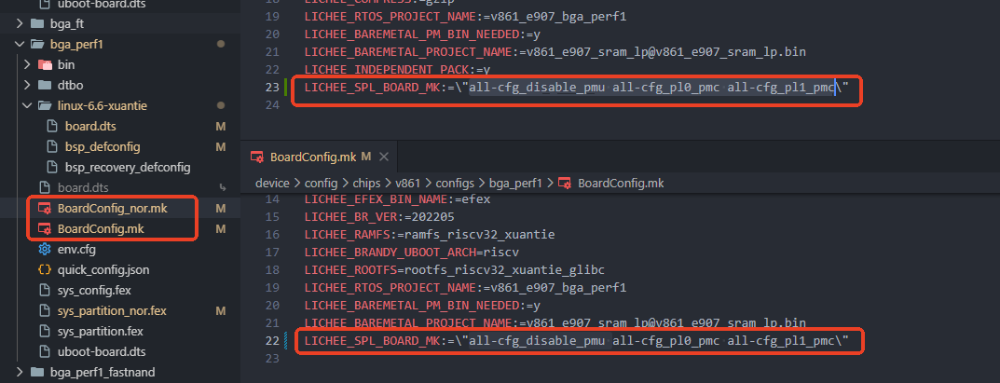

配置项目将在 BOOT0 中配置宏 `CFG_PMC_EN0_FOR_PWRCTRL` 和 `CFG_PMC_EN1_FOR_PWRCTRL`，控制寄存器是否需要切换到 PMC 功能。

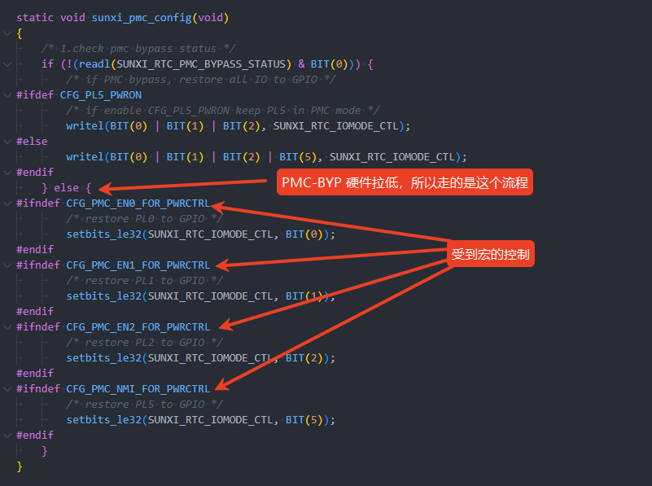

#### PMC 模块内核配置

PMC 模块的内核配置包括

```
CONFIG_AW_MFD_PMC
CONFIG_AW_REGULATOR_PMC
CONFIG_AW_PMC_POWER
CONFIG_REGULATOR
```

如果需要使用 PMC 的 POWERKEY 功能，需要同时配置

```
CONFIG_AW_INPUT_PMC_PEK
```

配置项如下：

-   CONFIG\_AW\_MFD\_PMC

```
Allwinner BSP  --->
	Device Drivers  --->
		PMIC Drivers  --->
			<*> X-Powers PMC MMIO PMICs
			<*> SUNXI PMC regulator
			<*> X-Powers SUNXI_PMC power button driver
			<*> PMC power supply driver
```

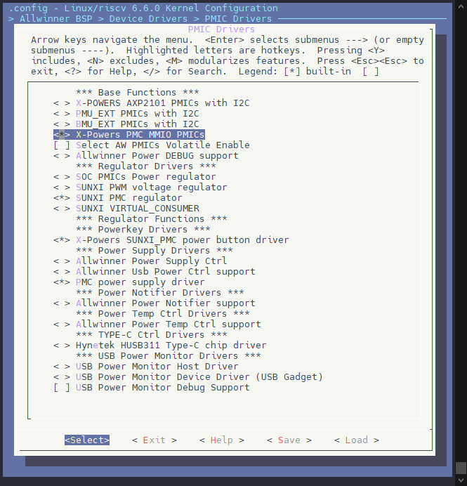

#### 内核设备树配置

下面是 PMC 的完整示例配置，包括三个部分：

```c
&pmc {
	pmc_irq_boot_en = <1>;
	pmc_irq_en = <1>;
	pmc_alarm_waleup_en = <0>;
	pmc_on2off_extra_en = <0>;
	pmc_vbus_wakeup_en = <0>;
	pmc_vbus_control_en = <0>;
	pmc_boot_seq = <0>;
	pmc_hw_clk_gating = <0>;
	wup_timer_wake_en = <1>;
	status = "okay";
};

&pmc_powerkey {
	pmu_powkey_off_time = <6000>;
	pmu_powkey_off_func = <0>;
	pmu_powkey_off_en = <1>;
	pmu_powkey_long_time = <1500>;
	pmu_powkey_on_time = <512>;
	wakeup_rising;
	status = "okay";
};

&pmc_usb_power_supply {
	pmu_usbpc_vol = <4600>;
	pmu_usbpc_cur = <500>;
	pmu_usbad_vol = <4600>;
	pmu_usbad_cur = <2500>;
	wakeup_usb_in;
	wakeup_usb_out;
	status = "okay";
};
```

**PMC 功能配置项**

配置设备树节点 `pmc`，具体配置项含义如下表：

| 参数名称 | 功能说明 | 配置内容 | 默认值 |
| --- | --- | --- | --- |
| **pmc\_irq\_boot\_en** | IRQ 开机唤醒功能使能，可使用 NMI 引脚唤醒系统（PMC 的 NMI，不是 PL5） | 0：禁用  
1：启用 | 0 |
| **pmc\_irq\_en** | IRQ 中断功能使能 | 0：禁用  
1：启用 | 0 |
| **pmc\_alarm\_wakeup\_en** | 闹钟开机唤醒功能使能 | 0：禁用  
1：启用 | 0 |
| **pmc\_on2off\_extra\_en** | 开机状态下异常掉电时的处理控制：  
启用时，异常掉电 PMC跳转到关机状态；  
未启用时，PMC 保持原状态 | 0：禁用  
1：启用 | 0 |
| **pmc\_vbus\_control\_en** | 开机状态下 VBUS 插入后，若强制关机，控制关机后是否自动重新上电 | 0：禁用  
1：启用 | 1 |
| **pmc\_vbus\_wakeup\_en** | 待机状态下，是否允许通过插入 VBUS 唤醒系统 | 0：禁用  
1：启用 | 1 |
| **pmc\_hw\_clk\_gating** | 是否启用 PMC 硬件自动控制时钟 Gating 功能 | 0：禁用  
1：启用 | 0 |
| **pmc\_pwr\_en0\_drv** | PMC\_EN0 引脚驱动能力 | 0：档位 0  
1：档位 1  
2：档位 2  
3：档位 3 | 0 |
| **pmc\_pwr\_en1\_drv** | PMC\_EN1 引脚驱动能力 | 0：档位 0  
1：档位 1  
2：档位 2  
3：档位 3 | 0 |
| **pmc\_pwr\_en2\_drv** | PMC\_EN2 引脚驱动能力 | 0：档位 0  
1：档位 1  
2：档位 2  
3：档位 3 | 0 |
| **pmc\_pwr\_en0\_oe** | PMC\_EN0 引脚输出使能 | 0：使能  
1：不使能 | 0 |
| **pmc\_pwr\_en1\_oe** | PMC\_EN1 引脚输出使能 | 0：使能  
1：不使能 | 0 |
| **pmc\_pwr\_en2\_oe** | PMC\_EN2 引脚输出使能 | 0：使能  
1：不使能 | 0 |
| **pmc\_pwr\_en0\_pull** | PMC\_EN0 引脚上下拉 | 0：关闭  
1：上拉  
2：下拉 | 0 |
| **pmc\_pwr\_en1\_pull** | PMC\_EN1 引脚上下拉 | 0：关闭  
1：上拉  
2：下拉 | 0 |
| **pmc\_pwr\_en2\_pull** | PMC\_EN2 引脚上下拉 | 0：关闭  
1：上拉  
2：下拉 | 0 |
| **pmc\_pwron\_ie** | POWERON 引脚输入使能 | 0：使能  
1：不使能 | 0 |
| **pmc\_nmi\_ie** | NMI 引脚输入使能 | 0：使能  
1：不使能  
（有特殊说明，见下面 Tips） | 1 |
| **pmc\_resetb\_ie** | RESET 引脚输入使能 | 0：使能  
1：不使能  
（有特殊说明，见下面 Tips） | 1 |
| **pmc\_boot\_seq** | PMC 上下电顺序配置（首次启动后需设置，且 RTC 不掉电） | 详见下表 | 0 |

:::tip

:::note

提示

:::
:::note

**pmc\_nmi\_ie** 和 **pmc\_resetb\_ie** 当 PMC 启用的时候固定有效，不可关闭。PMC 启用指的是 **PMC-BYP 引脚被拉高**，是一个硬件行为。

:::

:::

**PMC 上下电顺序配置**

控制 `pmc_boot_seq` 的参数。

| 配置 | 上电顺序 | 下电顺序 |
| --- | --- | --- |
| 0 | EN0 → EN1 →EN2 | EN2 → EN1 → EN0 |
| 1 | EN0 → EN2 → EN1 | EN1 → EN2 → EN0 |
| 2 | EN1 → EN0 → EN2 | EN2 → EN0 → EN1 |
| 3 | EN1 → EN2 → EN0 | EN0 → EN2 → EN1 |
| 4 | EN2 → EN0 → EN1 | EN1 → EN0 → EN2 |
| 5 | EN2 → EN1 → EN0 | EN0 → EN1 → EN2 |

**POWERON 按键功能配置项**

| 参数名称 | 功能说明 | 配置内容 | 默认值 |
| --- | --- | --- | --- |
| **pmu\_powkey\_off\_time** | 控制按下多长时间后响应关机（poweroff）事件 | 单位：ms  
支持 6s，8s，16s | 6000 |
| **pmu\_powkey\_off\_func** | 控制关机事件的功能类型，未配置时默认执行关机操作 | 0：关机  
1：复位系统  
2：仅触发中断 | 0 |
| **pmu\_powkey\_off\_en** | 控制按键关机功能是否启用 | 0：禁用  
1：启用 | 1 |
| **pmu\_powkey\_long\_time** | 控制按键长按时间阈值（ponlevel） | 单位：ms  
支持 1s，1.5s，2s，2.5s | 1500 |
| **pmu\_powkey\_on\_time** | 控制按键按下多长时间后开机 | 单位：ms  
支持 128，256，512，1s，2s | 512 |
| **wakeup\_rising** | 控制“按键弹起”是否能唤醒系统 | 配置该属性即启用  
注释掉该属性则禁用 | — |
| **wakeup\_falling** | 控制“按键按下”是否能唤醒系统 | 配置该属性即启用  
注释掉该属性则禁用 | — |

## PMC 节点说明

PMC 提供了一个 sys 节点以供获取 PMC 相关信息，位于 `/sys/class/pmc/` 下。其包括以下4个节点：

| 节点 | 功能 |
| --- | --- |
| debug\_mask | 调试 MASK 配置（弃用） |
| pmc\_reg | 打印指定的 PMC 寄存器 |
| powoff\_status | 显示关机源 |
| powon\_status | 显示开机源 |
| pmc\_status | 查看 PMC 是否启用（PMC Bypass 引脚是否浮空） |
| vbus\_status | 检查 PMC VBUS 是否接入 |

这里以常用的四个模块作为说明：

**powoff\_status**

用法：`cat powoff_status`

例子：

```
cat powoff_status
```

![关机源示例](data:image/png;base64,iVBORw0KGgoAAAANSUhEUgAAAmkAAAA1CAYAAAAaonx3AAATQ0lEQVR4nO2dvU8i77fAP7+b+2esiLt8E0Jl6NhC0JVYgduZ0EyMIdoRKr/GrEbNRq0InYYYQkOynUJl8GWx0I5YEZJlV178G25ud28xw6swMzgouJ5PYqGPM+c8L8w8nHOec/7jdrv/D43/+d//5vXxEy+s4238WvtB6GuC4gg06U2Xftyx5f5GZoQaCYIgCILw9/Of0W/SBEEQBEEQhG7+a9QKCIIgCIIgCE95R5s0B8GAA9e7lf/34YokuS9caD97BEetkPB2cYaJn2pr6TT89HNq1C4IgvACvJ9NmnOWlR0Fx3uV/xdSjC8z7Z5nOvSD6qiVGTEupx+XExpfBoTBCK4uYb9eU9dTj5hYo3ZBEISXYDw2aYE9XUuIK9D2LbaQJB5RX0LB2EWbJaXz5yzS9aIqJVgcdsC/M8yZWQvOS8h/AVyRJPcx/7uVb5XR6O9g4SDEAkBAYXdu6nXFG3x+xx8Hn6ag8qf8zHaLWB2/Nz/+giD0Y8BNmgOX85VddoE90jufqZxo32JDt9iVTaJOyETn1b+559nKQzW11vx9Mf5CD9S/Gj+rygT5q9w7lW+VEenvnMXHLeclcH38QLXy8LryBUEQhBfBxCbNT7ywRzSS5Kywyf7BJumOb20OorFWbNBZzN+1idNpd4Y5K1xwv+MBPOw2LGFNS4Sf+I6H/PYysay26SolOMlP4Fsw69LxE+8Xt9SwhAX2VD0KF9yf7hF0tv+Pv0v/QeNRLMjvZakL7HXExLgiyc4YGWeYs0KSaHsfGjoYxdIEZvDWfnCcbf3J1a5bIUm8w5Wm3jceaL+Jg+hp62/61xvLBwdBK+NvMH9G+lnSX5u/aKR1j6frP0k8ltQsxNrnobDXNn86/Q/scXaa5Cy9xKRtif3TJGllgkllc4BxMhhfvfEz/PwaYDQ+mn69nx+d66ydTmum3vNJvcd94QjFBt6d7pgzo3ZjdNePmfGzMv5mnh+DrG9BEF4dk5Y0Dz57mg33Motfl5kOpZpuu2DsCIU0Ifc806FDfk6ts9/matRtLyVYdM8zvX2Hmn9Ms4xFNUtEYAYvd1xmAadfc3km+UKdSbtZl06OiHueafch+T59W5m7YcM9z7R7ja0HD7urrYdkcGEGrr5rFro1frJEeiB3ljX5RhTjy2w9LGlj6ieeXqKyvUysNICKADiIrnjIn7TH2/hZ3fnAz+2GxfI7l3OzbQ/9HMepOt65Nn0DCopNmzPD643kq+tnd+qWrZB6j40rWOjxYu6H/vwZ6Wddf/Cg2LX57fH5AKgcLxNKgVexceKeZyvvaX4J0e1/9hsb/37nJA/51Bob/95S5Y6t0Hc2js3FTRmNr+74GX1+TaE/Pv2fH2V+P4D949NNhcM+0bQm6j+fysS+qv1K1SDfmOdmzJlRuxEG68fE+L3s+A+yvgVBGAUmN2l1fh7nWg+mUsOV6OeLt06q0VbKETu5Y3J2VvumZtSuj+vjB8jfkAGCq+t4Hw7VBwkT5ns4UN/KZK7uYMre1C8T/9ay4lEm1tX+0vLNkIkeUlGOODtdx5s/JJLt/g9to6j3cgkoKHRbsQAm8H1sBKWXyUQTHXF1xfNbqt6Z5oM9OOdpzpmZ6/Xla+vn3wQZbdNZzCaIPdGxP8bzZ6SfFf0BjNb/I79LUPzzCLUanU564/4XS/Bpqk7lvEzxHxuT+RsypTJFU5t04/u/xvp/7vMjc3XX/LIWjDXiUB18mqrz87xseP3rYHL99OHlx9+afoIgvCzWDg447di1l8yz2k2jBu6qsT5lypW61Ru2YaBfIMxZ89BCw7UwTIYxPqpFa9KmvpAGp58VKEck9IPKbIj9dOehjSala37WPKxolrzGS9H09Xryh7F+dOfPSD+L+gOW5le3/w6isT3isU18NvCt7hFf8cDUDHGzrk4z4zvK9W+k36+a9gXBz5epOszO4nLO4rNp1wzt+fNczK4fHV50/IegnyAIL4q1TVqpQoUPfHI+s90MU3ZcmmtDdas5cNiHaUnTw098Z6l1aKHpWhgznGH2lUdSKVAO+r2gdQ58dLgouygliHxdZtE9T2j7Ea+idLlDyi3rRGAGb00NYDd/vY58y+vHxPwZ6WdFfwAr+hv0//zqhgowWbvl5KoG1Mlf33B5dT2U+7/O+rfw/Gi0R2awX3/n5OEzCwuaNdHM9a+BmfXTl1cYf0v6CYLw0lhMwZHjMj+BsqoF4zr9RFc8VK+vNYuCUbvGrxrVHg/T4p9HsNlwAJnjQ/JT69wXNvnCcy1pz3lg16k0nFCa/s9nQPmlChUaVqp+8htxaN+IafFpT2Pm/MQLR10HPloE5zxUU6mnbg5nmHikO5C7B9kb8rYl0jtdc2vy+r7yG+vnINw8TOEKhIl2x6Rp4/SlZ6yazvwZ6WdZfwAT678vev0vU8zm+M0E+ZMEmWwFbI9cxnNksuUh3L+BifXf5/NrDivPD7XdN/uBn+dlMleP+GbbT7eafP68FGY/P7rjZ2H8jZ4fZvUTBGFkWM6TlomukSJEunDBfXod38MhG23pL4zaAe3EJijprtNJ2RSphiutlCPydZ5p9zKR6PKAwckAOSLbj/jSffKo9bnmOPWIr3Gq62CG39fd32TbTlXpnm57nvzI9h0oR33lB2OdcWiZ6CF573rXqbcHKrU61Y5YMQ1nmBXvHSe9UpaUEhwzw77Wr/QKpEK9cr3luMwDdN3HzPV68lHXz9bDZ3a1cdufg/NeMXfbd9h3usfWYP6M9BuC/nBHqqLdo9/610G//2r8VeUX6iGbXvNr6f5m1j/9P7+m0B8fo+dHuVJnsuHe/FUD20RHPjNTz5+Xwuznp+/4WR1/g+eH6c+3IAijYvwLrDvDnKU/U9n+TiQruc+GTTB2wUplzXJeOVckSdqeHnjzPCz5o0JXf2eYs7SNkzeQxHgkyPgIgiDoMh4VB/QoJVgMpWFls381AeF5GFqBzPLMJK5Dkz8i3rr+giAIwlgzhqazHpRyRL6+1Sz0Y0wpwaLb2i2CsQt2vVDNH7I4QGqMYckfKW9df8ECfuKFdbz9mms/CEmNT0EQLDL+7k5BEARBEIR3yPi7OwVBEARBEN4hskkTBEEQBEEYQ4z9m4G9Hlmu66RCy8RKDqKnavHhdqop7bTbk2vrVFNpFuNt8WVOP/GDEF6blqC2dsfWv9/IlFrxTr1oyhhI9x7ycRCNbaJ4VfnV/CEb0RxFLeaE7fknZZaaJxmvZnpmAM83rrEkv18f1Puo42+iXRAEQRCEN4m5ILS+QbBqAeIY6mbNd91r43THVuOIvdNPPL3OGQ/a/6m/s73GdLYtYeNqGFc0QSY631bI/bmpGvTkNwowHxJy5yhq/diPPLAYf6BSA99HtZhzO60CzjOd9x+q/DaZRkHIEqQsCIIgCH8dr+vuLGk1JrWiyGptvTsu2/OflXLEoi+04eiW312Aub3EkVaK6ilqHdGXly8IgiAIwnvmdTdpTj+rs235tBplS073iAZ0aku+mD49CjD/qlHVSlGVK40NlZ94Vyb19qzm5uV19d9AviAIgiAI7xdz7k7bEunCUuv3/OEAmeXVskm7ANTJb6+1xXjliIQgfhBC2TlC2UGNSfv6QhnInWrS1Wqqp4nsCcU/jzBrx+UEe61O1TtDELDbtFI8/0Bn/+BpPJhe/01iNP6W5kcQBEEQhHHEYkyaGVoxWa5IkvSOQjDbXh+xPVGtg2jsiN2Yn8zQNhmdm6Rq6tB8XJtm1VpY+ADXaU7sIT4FVOvXZQltk2Y+Jq1n/80gMWmCIAiC8O54VXdnMf69VTC9J2ViV3cwZR+i6/OOLfc80261OHvHycpShQof+ORs+/d/bEzWaupRgVKFCmC3T1D5k6NcAd/K51b7gDzpv5F8QRAEQRDeLa+cJ00LjFcUggDOMPGYH1dzk+IgOueBh8orWYVyXOYnUFb92qbQQXTFQ/X6WpP/QKXmweu94zILxfNbsE1Y0K+r/4byBUEQBEF4r1jcpDmInl5wX1BzpU0qR8YF0LM35NGsSaUEx1cz7B9caMXTj/Dxg9ArxlNlomukCJFuyH84ZKPpDtVOeHZZ1tT0Gw1Ud+p924/p/hvKFwRBEAThvSK1OwVBEARBEMYQKQslCIIgCIIwhrxh05latqlP1Sg58SgIgiAIwptG3J2C8E6JRlZ022Pxk1fSRBAEQejFO3J3OgiOoqrB2Mj/+3BFkm0HNva0E7OCIAiC8HfwfjZpzllWdpTRlVsatfy/kGJ8Wc1/F/pBddTKjBiXs5HKRv0yIAiCILx9xmOTFtjTtYS4AmHipw2LSZK4lr4iGOtMfaGbBqOUYFG3MsAzcIY5M2vBeQn5L4ArkuyoUfre5FtlNPo7WDgIsQAQUNidm3pl+YIgCMJLMOAmzYHL+couu8Ae6Z3PVE7WNKvJLXZlk6gTMtFGJYF5tvJQTa01fzdd+kloQ61t2iwA/+7kW2VE+jtn8XHLeQlcHz905fETBEEQ3iomNml+4oU9opEkZ4VN9g82SXdYjxxEY63YoLOYv2sTp9PuDHNWuOB+x0NHUtimJcJPfMdDfnuZWFbbdJUSnOQn8C2Yden4ifeLW2pYwgJ7qh6FC+5P9wi2l2ly+rv0Dw+4SbUgv5elLrDH/WlLB1ck2fG7ek2SaHsfGjqcGugemMFb+8FxWwF4V7tuhSTxDleaet94oP0maoLjxt/0rzeWDw6CVsbfYP6M9LOkvzZ/0UjrHk/Xf5J4LKlZiLXPQ2Gvbf50+h/Y4+w0yVl6iUnbEvunSdLKBJPK5jPWqSAIgjBumLSkefDZ02y4l1n8usx0KNV02wVjRyikCbnnmQ4d8nNqnf02V6NueynBonue6e07OmpsNioOBGbwopZkwunXXJ5JvlBn0m7WpZMj4p5n2n1Ivk/fVuZu2HDPM+1eY+vBw+5qy10VXJiBq++ahW6NnyyRHsidZU2+EcX4MlsPS9qY+omnl6hsLxMrDaAi0ChJlT9pT1viZ3XnAz+3GxbL71zOzbZtGnMcp+p459r0DSgoNm3ODK83kq+un92pW7ZC6j02rmAh0PMGPdGfPyP9rOsPHhS7Nr89Ph8AleNlQinwKjZO3PNs5T3NLyG6/c9+Y+Pf75zkIZ9aY+PfW6rcsRX6zsaxpJ8RBEF465jcpNX5eZxrPfRLDVeiny/eOqlGWymn1qacndW+xRu16+P6+AHyN2SA4Oo63odD9UXJhPkeDtS3MpmuAu+Z+LeWFe9FCsDryzdDJnpIRTni7HQdb/6QSLb7P7SNol7euICCQrcVC2AC38dGUHqZTDTREVdXPL+l6p1pblyCc57mnJm5Xl++tn7+TZDRNp3FbILYEx37Yzx/RvpZ0R/AaP0/8rsExT+PrfJjA/S/WIJPU3Uq52WK/9iYzN+QKZUpDrxJFwRBEMYNawcHnHbs2kvmWe2mcfBpCi3Wp0y5Urd6wzYM9AuEOTttO5Sw4xmibBPyTaFatCZt6oZgcPpZgXJEQj+ozIbYT3ce2mhSuuZnrVGLtLUpN329nvxhrB/d+TPSz6L+gKX51e2/g2hsj3hsE58NfKt7xFc8MDVDXFydgiAIfwXWNmmlChU+8Mn5zHYzTNlxaYXOVbeaA4d9mJY0PfzEd5ZahxaartkxwxlmX3kklQLloN8LWufAR4eLsotSgsjXZRbd84S2H/EqSpe7r9yyDgVm8NbUAHbz1+vIt7x+TMyfkX5W9Aewor9B/8+vbqgAk7VbTq5qQJ389Q2XV9fPFCgIgiCMExZTcOS4zE+grGrB0E4/0RUP1etrzaJg1K7xq0a1x8uo+OcRbDYcQOb4kPzUOveFTb7wXEvac16YdSoNJ5Sm//MZUH6pQoWGlaqf/EYc2jdiWnza05g5P/HCUdeBjxbBOQ/VVOqpG88ZJh7pPgjSg+wNedsS6Z2uuTV5fV/5jfVzEG4epnAFwkS7Y9K0cfrSM1ZNZ/6M9LOsP4CJ9d8Xvf6XKWZz/GaC/EmCTLYCtkcu4zky2bLEowmCIPwFWM6TlomukSJEunDBfXod38MhG23pL4zaAe3EJijprtOd2RSphiutlCPydZ5p9zKR6HLrcIFpckS2H/Gl++RR63PNceoR346m18EMv6+7LWltp1KfnE61Lj+yfQfKUV/5wVhnHFomekjeu9514vKBSq1OtSNWTMMZZsV7x0mvlCWlBMfMsK/1K70CqVCvXG85LvMAXfcxc72efNT1s/XwmV1t3Pbn4LxXzN32Hfad7rE1mD8j/YagP9yRqmj36Lf+ddDvv0ONR/uFesim1/wKgiAIb5bxr93pDHOW/kxl+zuRrOQ+GzbB2AUrlTXLeeVckSRpe3rgzfOw5I8KXf2dYc7SNk7GNImx1O4UBEEYb8aj4oAepQSLoTSsbPavJiA8D0MrkFmemcR1aPJHxFvXXxAEQRhrxtB01oNSjsjXt5qFfowpJVh0W7tFMHbBrheq+UMWB0iNMSz5I+Wt6y8IgiCMNePv7hQEQRAEQXiHjL+7UxAEQRAE4R0imzRBEARBEIQxRDZpgiAIgiAIY4hs0gRBEARBEMYQ2aQJgiAIgiCMIf8PxKk/7q8Vq5sAAAAASUVORK5CYII=)

| 关机源 | 含义 |
| --- | --- |
| FIRST\_POWEROFF | 首次关机状态 |
| LONGPRESS\_POWEROFF | 长按 POWERON 关机 |
| LONGPRESS\_REBOOT | 长按 POWERON 重启 |
| WDT\_REBOOT | 看门狗重启 |
| ABNORMAL\_POWER\_LOSS | 异常掉电 |
| SOFT\_POWEROFF | 软件配置关机 |
| SOFT\_REBOOT | 软件配置重启 |

**powon\_status**

用法：`cat powon_status`

例子：

```
cat powon_status
```

![开机源示例](data:image/png;base64,iVBORw0KGgoAAAANSUhEUgAAAqIAAAAiCAYAAACELrsCAAAL1ElEQVR4nO3dvU8i3xrA8e/v5v4ZirDLTQiVobgJW4hvxAq024SGGGO0I1TsxqxGyUatyHQaQwgNiZ1iZfANi6UjVoRk2RXQ/+PeguFV54UXwZfnk1joceY8c+bMMJwz55x/HM7//g+h8qLkI3i0kqvHBJaOKAwzpK689fiFEEII8ZH8Iw+iQgghhBBiFP416gBelh2/z47zw+b//jhDCe7yF+pPFP+oAxJCCCFEz973g6hjhpXtIPaPmv87VFCWmXTNMxk4pjLqYEbM6fDidED9C48QQgjx1ozuQdQX1W3RcvpWUU7qLV8JlFDtg9Yfu2hpEWv/OQ11fBgXj1h0/SA9yLgdq5yabYl7ifxfgDOU4C7m/bD592s08dtZ2AuwAOALsjNrG272Btfvh9dv+Uj5CiE+CBMPonacjiF3L/uipLa/UI6vq61fv7AGNwg7IB2er/3NNc9mFirJ9cbvi0ppmFG+E17WguNkrzIfNP9+jSh+xwzT/OK8CM5PY1TK98PNXwghhBgAjQdRL0o+SjiU4DS/we7eBqm2b+d2wrHmu3qnMW/Hg6pOumOV0/wFd9tuwM1OvUWz0aLkRdl2k91aJnamPlgWj4hnx5leMNv96EXReo+w3qLpi9biyF9wdxLF72j9H29H/KtdPoj3kf9zLa6+KHcnzRicoUTb77VtEoRbj6Eew4lB7L4pPNVjDs+af3K2xpZPoLR1+9b2q/had2InfNL8m/72xvmDHX8/5W9w/ozi6yt+9fyFQ819PK3/CZRYQm3pV6+HfLTl/Okcvy/K6UmC09RXJixf2T1JkAqOMxHc6KKcDMpXr/wMr18DRuWjxvf8/aO9nrVqb5U2uv8YXP8GdOuHmfLpp3zN3B+6qb9CCDFiOi2ibqatKb67lllcWmYykGx0MftjBwRJEXDNMxnY58YWYbelW1w3vXjEomueya0ckGNTbc2cDKstSr4pPOS4PAMcXrV7PsEcD0xYzXY/Zgi55pl07ZPVOLaV2Vu+u+aZdK2zee9mZ635QeFfmIKrn2pL6zo3fCXVVddrf/kbKSjLbN5/VcvUi5L6SnlrmVixixABsBNecZONt07p5GVte4ybrXrL808uZ2daPvgyHCYf8My2xOsLErSo58xwe6P8a/Vnx/aLzUBtH9+vYOGZhw8t+ufPKL7+4wc3Qat6fp+5PgDKh8sEkuAJWoi75tnMuhtftHSP/+wH37/9JJ6FbHKd799+USHHZuAn3w/NTc1lVL665Wd0/ZqiXz7a948Sf+7B+unpg5XdOt5oFTa6P/V3/RnUDxPl87Ll2039FUKI0dN5EH3g5jDT/GAr1ru9vcx5HkjW04oZYvEcEzMz6jdyo3R9zk9jkL0lDfjXInju92s3U8Z7O0LDYyuRvsqBzdqIL638aLbGUiLWkf7S+ZuRDu9TDh5wehLBk90ndNb5H+rDsN68ob4gQTpbIwHGmf5UHwhTIh0+anvPtXD+i4pnqvHh5p91N86Zme3181frz7cj0uqDdeHsiNiTGLUZnz+j+PqJH8Co/j/ypwiFv49QrdL+Qonx8ReK8Nn2QPm8ROE/Fiayt6SLJQqmvogY738Y9b/X+0f6Ktf4QuqP1d8Lt/PZ9sDNeclw+3r+/V1/JuuHhpcv3/7iE0KIYep+sJLDilX9IO0p3TQ7n22o796VKJUf+t1hC4P4fKucNgZK1bvJBmkQ5VNrmZyw1D50u6fVmpchFDimPBNgN9U+UKyheM1N1c2K2iJb/+A3vb1e/oOoP7rnzyi+PuMH+jq/usdvJxyLosQ2mLbA9FoUZcUNtikUs93yZsp3lPXfKL7fVfVLkJc52wPMzOB0zDBtUbcxVX/6qV9m64eOFy3fAcQnhBBD1P2DaLFMmTE+a71TZZRuhs2KU+2Gq3UB27FbB9kiqseLsv21OVCq0U32yjhW2Q0+kkxCcE/rIURnkFlbd3qH4hGhpWUWXfMEth7xBIMdXXulZiuTbwpPtTZoxvz2Ovn3XX9MnD+j+PqJH6Cf+A2O//zqljIwUf1F/KoKPJC9vuXy6nog+x9O/e/j/lFPD01hvf5J/P4LCwtqq7CZ7QfBTP3QNITy7Ss+IYQYrh6mb8pwmR0nuKYOAHB4Ca+4qVxfqy1DRumq31Uqz3xgFP4+gsWCHUgf7pO1RbjLbzBHry2ivXwoPVCud5iq8feuy/yLZcrUWxu18q+/F/qDmPq+6NN3WL0o+YOOQWZN/lk3lWTyaZedYxUl1Dl45Blnt2QtX0ltd5xbk9tr5l+vP3urjQEkTt8q4c53RNVymnv23VGd82cUX9/xA5io/5r0jr9E4SzDH8bJxo9In5XB8silkiF9VhrA/utM1H+N69ecfu4ftfTpmTFuzkukrx6ZnmmdNcDk/adXZq8P3fLpo3yN7g9m4xNCiFeip3lE0+F1kgRI5S+4S0WYvt/ne8vUSUbpgDoSHoKpjlGhZ0mS9W7fYobQ0jyTrmVC4eUuB0QAZAhtPTKd0phnVGObw+Qj09tqXHtT/LnubLFoGc2qO2q4t/xDWzkIHmjm74+1vxeaDu+T9UQ6RhPfU64+UGl7d1PlWGXFkyP+3HRXxSMOmWJXPa7UCiQDz82FmuEyC9CxHzPb6+VPrf5s3n9hRy233Vk4f+4d2K0c1u3OsjU4f0bxDSB+yJEsq/vQqv869I+/9j5k+Te1gX3Pnd++9m+m/qN9/ZqiXz5G949S+YGJelf87ypYxin/7fL+0yuz14dm+fRbvgb3B9PXrxBCvA6vc615xyqnqS+Ut34SOpO5QQfNH7tgpbze97yrzlCClDXV9ReEQeU/KrrxO1Y5TVmIv4GFDEZCykcIIUSL17nEZ/GIxUAKVja0V00SvTFszTOrx4ncB5b/iLz1+IUQQohX5N+jDkBTMUNo6a2utvOKFY9YdPW3C3/sgh0PVLL7LHYxrdKg8h+ptx6/0OFFyUfwaCVXjwnoTYcmhBCia6+za14IIYQQQrx7r7NrXgghhBBCvHvyICqEEEIIIUbi6YOoY5XTfIJwx/x1/pg6hYgv2j5tUf6C01jLvHW+KHcdc1c6Q4n26V0cXpSTRHMfJ9HGnIaGjPIHaivQJHpK98cunuxfBkwJIYQQQgze0wfR4jU31XGmF1ofurzMeWgZIZ1js74qiGudG1uEXdMPaV6UVATiP5sri3y75fOaySUKTeTvjx0QJEWgh/R0eL4R12YWKsnmCihvdbohIYQQQojX6Jmu+RLn1w+15Rvrf/JN4UFrOUP1/602czk6rFjJcdk6P2gxQyzc62jUzvyba58X1PTGcpSm0oUQQgghxDA8+45o4fwXFXWZTQDnpzHQWsHF4WVhZrxliT0D9SXqTqKEfTproZvVmb/DihV11ZW639Xm8RilCyGEEEKIoXh+HtHiNTfVA+Z8kD6zszAzTjbeOqdnbYnLHfW3SrabJfQyhAKg7AUIbh8Q3AaqOTaXullppZ/8hRBCCCHEa6Axar7W3e2Z9YJjhmlLZ7d8+zuacSKk6oORflepGOVazBBaWm5sn7x3s9PlWtWa+QshhBBCiDdBc/qmwt9HsFnx/8fCRLWKdntjifRVDjxTbSPlzSsRu8qBzdpjN31H/sUyZcb43DoKv/UYjNKFEEIIIcRQaM8jenZL1vKFlRU3letrnYFEdvyfxqDtQc/NnE994/LJO5yrKDEvTkdz+/CsG+7LPQ5W6sifDJfZcYJr9SmZ7ITbjsEoXQghhBBCDIPOWvMZLrMRdjwPJM872wo73tGsHrP57ajxoBcKWFH2DrjbVtNb3+EsHnF4FWV3L8KEpZ5+TCDczbryevlDOrzO59gGqXzkaf4m0oUQQgghxMuTteaFEEIIIcRIyBKfQgghhBBiJHS65kfBi5KP4NFKrh4TWOp14nshhBBCCPGaSNe8EB9IOLSimx5T4kOKRAghhHj3XfN2/INYvenN5v/+OEMJ7vIX6k+0xynDhBBCCPEavO8HUccMK9vB0S3dOer836GCoi6EEDg2XjjhnXM66tOg1b7wCCGEEG/N/wEnX9ITUBRcrgAAAABJRU5ErkJggg==)

| 开机源 | 含义 |
| --- | --- |
| RESET\_STATUS | 复位状态 |
| POWERON\_BOOT | POWERON 按键开机 |
| VBUS\_BOOT | VBUS 插入开机 |
| IRQ\_BOOT | IRQ 检测开机 |
| ALARM\_BOOT | 闹钟开机 |
| REBOOT | 重启 |
| POWERON\_WAKE | POWERON 按键唤醒 |
| VBUS\_WAKE | VBUS 插入唤醒 |
| IRQ\_WAKE | IRQ 检测唤醒 |
| ALARM\_WAKE | 闹钟唤醒 |
| USB\_WAKE | USB 中断唤醒 |
| WUP\_TIMER\_POWERON | Wakeup timer 开机 |
| WUP\_TIMER\_WAKE | Wakeup timer 唤醒 |

**pmc\_reg**

用法：`echo [reg] > pmc_reg; cat pmc_reg`

例子：查看 PMC 0x10 寄存器的值

```
echo 0x10 > pmc_reg;cat pmc_reg
```

![寄存器示例](data:image/png;base64,iVBORw0KGgoAAAANSUhEUgAAAnEAAAA1CAYAAAAu271rAAAXwklEQVR4nO2dT0hjW5rAfz3MfmboWpYx1kvTIYuHCL1I8TBqGYQHibVoEMIMtyUEhbcIWVkiKiqi0gUhBQ1KkEyYIVA7jfCgiH8q8igXDSK9CGleqozRbTM9m6Z33Yvc/DW59yY3GpP6fuDCnJxzvnPPyb3f/c53vu8Xz549+8fbt2959+4d1fzt7//Kk8Me4DDxkvzqJsGjXLel6Tu84WP8+XmmI+aurSMYI2FNMBxKdaX/bqEpvz3AYcLC/sgyyccXTRAEQehD/qXbArRENsq0LwH+Ja4uj7m6POYwaOu2VP2BPYDfdcG+aQXKzZwyQPq0NQWuc/13iV6XXxAEQeg5nqC5TYdsiuDrFhUEQZ9slOkRc014w8esu+AmvcP00eP331V6XX5BEASh5+g9JU54siRDk7JV2AxR8gRBEIQO01vbqR3Dhtdjw/HV9t9/OIKx8hb71eUG3m4L9LVh+4Hfnv0ecW4QBEF4PL5OJc4+jn9N6d4Dp9v99yGZyCzDI5MM+95z021huozD7sZhh9LLglCH3S0vUYIg9AVPT4nzbGhaUhyeAJGDksUlRkQ92OANH1dZYmr/7h1+yEaZ7vQpQXuAQ6MWoIfo/wFwBGNchd1fbf9m6Y78Nqa2fUwBeBTWJ4Yeuf+HxEYoHLv3228NN5HEAusNX6I60b7QVXSeH4LQb5hQ4mw47I/8NuvZILH2kvz+vGp1+YRVWSJkL/pjDY8U/1bScBOfL//fqyErukubp0z7pn+zdEl++zhjfOJDFhwvnnOTv37c/h8Qb3gXhU/4RiYZ9iVA2SXiaaUFG6GDBazpC9IP0n4/0YX7u1CFXH/BGC0qcW4ilxuEgjEOL5fY2l4iUfPWU/0me8xh2F23CDXK7QEOL4+5WnMCTtZLlrSyJcNNZM1JenWWcClGXDbKfnqAsSmjb8xuIs38pkqWNM9GUY7LY64ONvDaq7/jrpM/0OKPzET/jSx9ng2uDioyOIKxmv+LdWKEqsdQkuFAR3bPKK7Ce/aqTpk6qmW7jBGp2aortlv70LMROqh8pl1fv3+w4TVz/XXmT08+U/Kr8xcKVtq4v/5jRMIx1Qqk/h4uN6rmT2P8ng0OD2IcJmYYtMywdRAjoQwwqCy1cJ1+jW3zPf6zC/xnF/x283t+qVn+Q105MPV7fquW+//n99hstfV/o9m+Fm5euW6J70XJAGRT7MVvcU1ULJ2G1v/ZDtOh87ba18IRjHEYDuC1t2m9e+j1YQj9+7tX7/5etUsSCm40uM+4iRwU695HR36t36/u80OHr+b6C/1GG5Y4J2PWBIsjs0y/nmXYFy9vCxbfZBPqm+wOH4cW2KraktAsz0aZHplkePUCuGBFtaKVA8Z6RnFxwckRYHerW6oxXnHLoNXollGK4MgkwyM7Dd/EwYl/4pzFkUmGR+ZZuXayPle5CXinRuF0U7XwzfORGRItbZeZ61+PTGSWlesZ9Zq6iSRmyK/OEs62ICIANkJ+J+l99YEGgJu5ted8XC1ZPDc5mRivusE0eOh5FBSLOme69fX6L66f9aFPrPiKbSyewlQLlhLt+dOTz7z84ESxqvPb4PcBkN+bxRcHl2Jhf2SSlbSz/JKiOf6jZRbfbLKfhnR8nsU3n7jhghXfJot79XI0xrb537iIczDuZH/8d9xYlhmf+3VtueWcdMDJ/riTs3N4MVXdwncMj55xptZPF77DNft9Tf1vS+0HNu61r4ndipU7Plet5cyXOxiylh9S+us/RzjSxDJqoH0tMpFNFk/h1fau+pAv+SW2wgOujxZk0Lq/r5fu3yPzje/v1zsVS+a4837zditWCwy6Ru/9dvTk1/z96j0/DI6976+/0He0ocTd8nEvVXkoZEtblaU32VT5TTa8f8Hg+Lh6E9Qr18bx4jmkz0kC3rkFXNc7xQcpA60PwdDYciRPL2pu4snIcsUKSI5wXflD92+EZGiHvLLL4cECrvQOwXvx2lRF8rXGg92joFBvBQMYYOxF6eGUIxmK1vj1ZT584qbq5uydcJbnzEh97f7V9fMmSlJ90GaOooRbiEenP3968pmRH0Bv/ReViMyXOygUqHUC0B9/JgvfDN2S/5Aj8ysLg+lzktkcGUNK/PdYXxb4U+xH/gLAn/nj//7Ev303qVrL1PK1P5BTBfvLhz/wxw/VbRS4qaqfO/8JLEO19UvluR/r2jdK0dpQ9nO1WGp82/TXv7n2m5MjcxQl+FpV8Blla7toTQ8ZVuYedn0YlcHQ/Z2cofv7PbJRFn07+Hz1PsH68j/G/bfvr7/Qd3QuTpz6JnvS7IGhV24YG98MQXq/+IaVy9+C1WybJWrfxO/hCXDon2HQUvVZodCpzvX7N0SKvbiPhALxN+34Y5WsSMt1Sl6KoM9KZNvHlrLAILek45sEq/0Ns2d8LOziD9pIRoaKNxVfynh9rf47sX40509PPpPyA6bmV3P8NkJhBSvPsVqAuQ2sQ8W38EjYyl7IgCXONsS/Y2EwesG3NSLnq8oL5DXdSwv8X7NyQ/WNkCP8epIwgIcGD1Oz61+v/YfkodZHB7BbsTKAK3GMUv156ffTQv+ZbIN5MVL/Kd9/e+j6C/1F506nZvPkec43zd469cqNMGTFQY7P16jbdjZs1k5a4rRwE1mbqRyqKJvunxj2AFvKHfE4KNvN/CE0HGZrtkDryEYJvp5lemQS3+odLkWp2xKpejv0jOIqFB3sjdfX6N/0+jEwf3rymZEfwIz8OuP/cHpOHhgsfGL/tADckj475+T0zFj7uWv+yk+kx4tbpeW///qDajm75q9Y+I92D2yard9g/I4Xz+E6X6fsG1n/Jtpviq3q5PwSrzhn8c0kw6+XW3BneLj1YZpsnnz1NmXpr2TRN9u/bv3HuP9+xddf6Fk6GGIkxUl6AGVOdba0uwn5ndycnak3Qb1ylZ8L3DRYjJkvd+WtjeTeDumhBfVmedumvO0s+FvypfdyVf72abH/bJ48TvylbZ6G/Zf8gJYJq/5B93323EQud+scZit4J5zcxOP3twntgaKfj56cR+ekLTMk1urm1mD9pv2X1s92oHzYw+EJEKr3OVGv06uGviga86cnn2n5AQys/6ZojT9H5ijFZwZI70dJHuXBcsdJJEXyKGew/R/Jf/oOV9Vhg19O/cDk3PdV5Ra+Xf2hfFjhl1M/8JupRm01a9/Ct7Nq+7bv+c1/fsf//3Ssbr/qUbp/BMrX7/7pXyPr30z7zXEEl9iagJM38wyPzBKMpAxuY1fzUOujE6Q4STtZr3Kmd3iKv4ma/uvkv4+76Hx/z+HeiPwG7r9Nnh/G+Bquv9BvdDROXDI0TxwfictjrhILjF3vsFi13aRXDqgnTkFJ1J0uOooTL6hKTDal+p7MEgzNtui8CpAiuHrHWKJJHLkmdfbid4ytqXJtj/L5rP5NsOpUlObpqPb6D65egLLbtH9vuNYPKBnaIe1aqDsxek2+cMtNja+ailYS92yUPUbZUseV8EP8nl9LUc6TNEBdO0bq6ySRT4bmWbl+ybp63bYm4EMjn7/VC6xr9ddWZ/705OuA/HBBPK+20Wz9a6A9flvRH+5nioeAGs2vDrml35FG4bV6enR8FPInP9aWF0ZxRSvlXz5oNNig/T+V2o8uM1jY4Gzvz4brF+8fL9X7hw/i8zU+b/rrv3Q6fAFX+bdaeZnRa1+LTGSW6VCUZNbM5utDrg/zJEPzrJTu32r7Jx9SNeXxoYVi+fYo3Ls/FrFaAMtLpuoULW35jdx/af78MMTXcf2F/uIXz549+8fbt2959+5dTcHf/v4E06raAxwmXpJf3SR49HieKl8L3vAx/vy86bh6jmCMhDXRsnLdqf67hab89gCHCQv7PRDkWegC/bg+PBtc+Qv47h2ishE6WII37ZycfyC+qusv9BNPL2ODFtko074E+JeaZ2MQ2kPXimSUNoPcdqz/LtHr8guCWTyBqtiJtqbbkQ6Pwth14ukocP2Cwesv9BdP0NymQzZF8HWvRvF/wmSjTI+Ya8IbPmbdBTfpHaZb3UboQP9dpdflF/oYN5HLBVzNigvvO2OtOTrjJLzE1VrxsNlNusF2pGeDrYkCiy27wPQyT+j6C31Hb22nCoIgCIIgCMBTtMTV5IszGqj0EXnq8j0G9gCR7RlcFjr3FikIgiAIQks8MSXOTSThw5q+Iw+QP2cvm+q8gmB34/3VNTnD4RdK2AjNKWps4edYXXe96Qjb9viLeOdmsJ7NMyymekEQBEHoGsaVOM+Gmly4xC038QTTpVyE98qLpFcna47pOzwbbK05GQQoXBB/Ux8M8479UDPFyEYovITiGoCmEfP1cBNJLODigpWj+qj6eu3nCIeWK+1cjrbYdyfkN4vW+MER3GBLKc7PTXqHxVC9El3MmJE/bSS33vjMlguCIAiCUKLF06lVEaN9CfLKQt3p0PsRpWsUuGCMhB/21QTBw2/OYc54VHVveBeFT5UEv8puXQw0PWyEDhawpi8aJqA33742D92+PtrjdwRjJMYr87N4am0twbzO+MyWC4IgCIJQof0QI9kUe/FbBq1DBiu4mVMg/ma5nCCYbIqwkbyOav1igt9oOcHvXvxWTb9VxBGM1UYCtwc4vIzVJqA+22E6dN5W++bogPx2N6FwrBJeJVynAOuVg+b455QB0vvLTRI4FxODX13uoljAVQq6WZZXb3xmywVBEARBqKZ9Jc7uZm68hXhgaoJeswmGq+tnvtyp+VTV/9VUO1tBG5UUPNUBJXOEI03kNdC+Fo5grDZTQ9VfxNMZ+b1To3C6qVo55/lIbVohvXL98V+QZ4PDhkpgMTH48Mg88UJxm7wmd5/e+MyWC4IgCIJQQ4sHG4qpatYBuCW9Wp+Wprq8+J24r3FUbkcwRkIZ0PxOY2yEDnYZO5tn+gvlfKola14ytMOry10Ox2EwvcNwy2lPtNtvRiYyy3BE4wtla2D78icjy1UN5gifXqD4i0pOxkC5Pk7GXuywOLJMBhuh8C6JcL7FzAt6189suSAIgiAI0LISd8GKehrTEYyRWFPwHlUfQqiU61FUetxELn2tiaBahMIAHqBQoNb1PcVe3EdCgfibdgJK6rVvFhPyewIc+mcYtFR9VigYL9flgv1I6SBDO0qgWk9zfGbLBUEQBEEAE9upmchmJSG9EbJ58jznG7v+V43Wd7x4Dtf5WgXDHmBLuSMeB2Xb+KEJw+03QXc71bT8biJrM+T35ysHR1arExzrlRsZvwn0xme2XBAEQRCEGkzkTs0R3r9gUFHwGvp+ir04KNsbeMuO+tYW+ktxkh5AKZ1mtTfK0VnyI1smrPqX1fqEmW2/OZnIbM2p3PsndDsh/y35kl3K7ibkrw/poleuN34n/qBbVRxthCacLShReuMzWy4IgiAIQjUmlDjg6Jw01da4ok9ctRWqOgRJJjKL7wz8CbU88RLiCT4Y9IdLhuaJ85LE5TFXCR/Ea33yvOEFXOmd8mfJ0A5p10JVmAo3kctjri4XcJVl3SgroXrtm8Wc/Cn24neMlU6Fbo/y+aza0qZXbmz8H62+onyXu4zxHl8L/nB64zNbLgiCIAhChSeWO7UYQPekJ7Ig9JKsgiAIgiD0G08s7RbUnHB9cnk53UQuF3CV/7/gpIvSCIIgCILw9fLElLgUwZGn7AP11OUTBEEQBOFr4YkpcYIgdINQ0K9ZHo7sP5IkgiAIglHMHWzoWWx4PbYuZgLodv/9R22Ilw2DJ6YFQRAEoXf5OpU4+zj+NQWDEe76r/8+pBzixfeem24L02UcdjcOO5ReFgRBEIT+5OkpcZ4NTUuKwxMgclCyuMSIqCFMvOHGgXbrw5wAkI0y3elTpfYAh0YtQA/R/wPgCMa4Mhxnr//6N0t35Lcxte1jCsCjsD4x9Mj9C4IgCI+FCSXOhsP+yFuCng0Say8rWQl8n7AqS4TskAxVguuupOEmXslcMB2RxE2t0+1gu93u3yxdkt8+zhif+JAtZry4yV8/bv+CIAjCo9GiEucmcrlBKBjj8HKJre0lEjXWJxuhcMU36TDsrlPyNMrtAQ4vj7lac1ITNLhsyXATWXOSXp0lfKQqZdko++kBxqaMbhmVgt028JsqWdI8G0U5Lo+5OqjKLgHFLAg18reQ1sts/40sfZ4Nrg4qMjiCsZr/i3VihGpSnakyHOjI7hnFVXjPXlWwXUe1bJcxIjVbdcV2K4GVoZjMvvKZdn39/sGG18z115k/PflMya/OXyhYaeP++o8RCcdUC7P6e7jcqJo/jfF7Njg8iHGYmGHQMsPWQYyEMsCgstTGOhUEQRB6gTYscU7GrAkWR2aZfj3LsC9e3hb0hndRSOAbmWTYt8PHoQW2qrYyNcuzUabL+T4vWCmlrSplDPCM4uKCkyPA7la3VGO84pZBq9EtoxTBkUmGR3ZINxmbf+KcxZFJhkfmWbl2sj5X2Q7zTo3C6aZq4ZvnI62k9TLfvx4ZNVVX8ZqWUnjNEjaYEaOCjZDfSXq/Okafm7m153xcLVk8NzmZGK9SKlPsxW9xTVTJ61FQLOqc6dbX67+4ftaHPrHiK7axeApTnoYNNER7/vTkMy8/OFGs6vw2+H0A5Pdm8cXBpVjYH5lkJe0sv6Rojv9omcU3m+ynIR2fZ/HNJ264YMW3yeLeU4q1KAiCIHSKNpS4Wz7upSoPhWxpq9LNK9ct8VJZNlXMrTo+rloB9Mq1cbx4DulzkoB3bgHX9U7xQcpA60MwNLYcydMLGLKW5UtGlitWQHKE68ofun8jJEM75JVdDg9qU3hVUBVJrSDKHgWFeisYwABjL0pO8zmSoWiNX1/mwyduXKNlxcY74SzPmZH62v2r6+dNlKSqlGaOooRbSMulP3968pmRH0Bv/d/xOQuZL3dQKFDrBKA//kwWvhm6Jf8hR+ZXFgbT5ySzOTItK/GCIAhCL9C5gw12K1b1IdRWuWFsfDOE6muUI5e/NdtgFTryeQIcHlQdmlhrJcF8B/o3RNEiNmgpKgyt08yKlCLoe09+3MdWovZQSZnsGR8LpVy6FaXdcH2t/juxfjTnT08+k/IDpuZXc/w2QuENIuElxiwwNrdBxO+EoVEispUqCILQt3ROicvmyfOcb+xtlhthyIqDHJ+vUbftbNisnbTEaeEmsjZTOVRR3vp9YtgDbCl3xOOgbDd7gGscSKnZAq0jGyX4epbpkUl8q3e4FKVuOzFXsS55RnEVig72xutr9G96/RiYPz35zMgPYEZ+nfF/OD0nDwwWPrF/WgBuSZ+dc3J61maHgiAIwlOngyFGUpykB1DmVGdtu5uQ38nN2ZlqkdArV/m5wE2Dh1Xmyx1YLNiA5N4O6aEFri6XeEW7lrh2Hqi35EubXKr87dNi/9k8eUpWrmb9l/zglgmr/nH3ffbcRC536w6kVPBOOLmJx+9vE9oDRIL1B1UacHRO2jJDYq1ubg3Wb9p/af1sB8qHPRyeAKF6nzj1Or1q6CunMX968pmWH8DA+m+K1vhzZI5SfGaA9H6U5FEeLHecRFIkj3LiDycIgtCndDROXDI0TxwfictjrhILjF3vsFgV3kOvHFBPnIKSqDudehQnXtqqy6YIvp5keGSWYGi2cvjBMCmCq3eMJZrEkWtSZy9+x9iaKtf2KJ/P6i1xVadq752uNd9/cPUClN2m/XvDtX5wydAOaddC3YnRa/KFW25qfNVU7AH8rgv2G4VkyUbZY5QtdVwJP8R9jWLdpThJA9S1Y6S+Vv8U18/K9UvW1eu2NQEfGvn8rV5gXau/tjrzpydfB+SHC+J5tY1m618D7fHbiv5wP1M8BNRofgVBEIS+4hfPnj37x9u3b3n37l1Nwd/+/gTTqtoDHCZekl/dJHgksd86jTd8jD8/bzquniMYI2FNtKxcd6r/bqEpvz3AYcLC/hMN8iy5UwVBEHqPp5exQYtslGlfAvxLzbMxCO2ha0UySptBbjvWf5fodfkFQRCEnuMJmtt0yKYIvu7VKP5PmGyU6RFzTXjDx6y74Ca9w3QLoT861X9X6XX5BUEQhJ6jt7ZTBUEQBEEQBKDXtlMFQRAEQRAEQJQ4QRAEQRCEnkSUOEEQBEEQhB5ElDhBEARBEIQe5J8zPOCt6NTruAAAAABJRU5ErkJggg==)

PMC 寄存器定义如下

```
#define PAD_CTRL_REG           (0x00)
#define PMC_CTRL_EN_REG        (0x08)
#define PMC_DLY_CTRL_REG       (0x0C)
#define SW_CFG_REG             (0x10)
#define PWRON_INT_EN_REG       (0x14)
#define PMC_STATUS_REG         (0x18)
#define PWR_EN_CFG_REG         (0x28)
#define RST_DLY_SEL_REG        (0x2C)
#define PMC_BYP_ST_REG         (0x48)
#define PMC_ADDR_EXT           (0x0F8)
```

**pmc\_dump\_reg**

打印全部寄存器的值

例子：查看全部寄存器的值

```
cat pmc_dump_reg
```

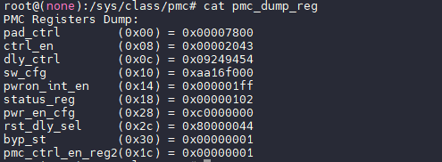

**vbus\_status**

用法：`cat vbus_status`

例子：

```
cat vbus_status
```

![VBUS 示例](data:image/png;base64,iVBORw0KGgoAAAANSUhEUgAAAgkAAAA0CAYAAAAAGauiAAAQD0lEQVR4nO3dvU8iXfvA8e/z5PkzFPFe7oRQGTq2EHUlVuB2JjQTQ4h2hMo1ZjVqjFqR6TSGEBqS7RQqw/qCxdoZK0Ky7C2if8OTX/d7CoZXh5mBEfHl+iRbrMNwrnOYgTNnzpzrX16v9//R/Pf//kMbd5STjIOk9ztZ3qhgFJULYrky4CJ+fMDUxTLzannYkQ3fe/h8hRBCDMx/zF8yKAHUmxX83TZXfxD+ekTRbjG5C84Sa9xujgJwX9hnVToI78ALHT+iT/L5CPEe/MtwJEEIIYQQH9a/hx3Ay3ERCrrwfNjyxVvjiaW4vfmp/dsmNOyA3hp3lBNpNyFs+TidBPc0kU0F10ct3yaPO4DHDfXOjhi8orrIhHeWifAP7ocdjBDiQ3odnYTgtuGVkicYRT2uX1GlUGO1H6lQ4mfLlVb7v5NYxw9Z6Yj5556g18uVyiDKHwBPLMVtItDxVxdze2HmAIIKWzPjLxuUyfHRC/36vZxhl2/XsOMfdvkDYff4fsbzQ4hOPXYSXHjcLzxkHtwms/mZSnJZu6r6hVNZI+6GbHy29jfvLOsFuE8vN/4vTy/0I8CSMkrhPN/+Z/c0U/zitASev0a4r9wNJzzbutTvw5Rv17Djf1p+bXSrg1tGuoR4LhY6CQHUm23isRQnN2vs7q2Raeu1uognmvdOTxKBjk6EwXZ3lJObn9xu+gAfW/WRgMaVQgB100dhY5FETvvRLx2RLIwyNWf1iyCA2u2+bn0kILhdi+PmJ7fH24Rav3jcgY74oz12kmyUrzdSEdzm9rgZgyeWavt/bZ8U8bYvTy2GY5PYg5P4qz84zDXLOjlOcZJZYMyxwO5xiowyypiy1kM7uAgZtZ9R+5oeHz3qrB/gaW37mxRq262UWrupwfb6xI+bfzPe37x80/YxY3J8msVnK37t+IzHmu/x9PxOoSZS2gig9nnebLccnz3UX6f83YzOOZVR2v72yTA+k/Orl/bRYbi/lePbzvnxAvUT75/FkQQfU84Mq95F5r8uMhFON4bNQ4kDFDKEvbNMhPe5HF9ht2Wo33B76Yh57ywTG9fANevaKMBEXLtSCE7i55qzHOAOaLccUnzhgTGn1SHvPDHvLBPefQpd6haZuWLVO8uEd5n1Ox9bS82TNDQ3Cec72gjFMpcskOnpR8pe+WaK6iLrdwtamwZQMwtUNhZJlHoIEQAX8YiPQrLlsbTcd1a/7ZAsQCG9zOq3X9xzzXp4h9VDa4+vhRIHbI3/Yj1c+2xXz2Gu5UfXsH3Njg+79SPA0uYIlxv1EakdzmamW75U8xymH/DPtHweQQXFoR2TpvublW/ePmaMj0+z+OzHDz4Up3b86pz/AJXDRcJp8CsOkt5Z1gu+Riffev11yi9dcFn18aXl9Z65z4wVrlpu65nH110v7dPH/haO78GeH3brJz4Ci52EBy4P8y0nZ30oP8AX/wPp+rZSnkTymrHpaa2narbdmOevEdBO+NDSCv67/dqBzKj1GvZUtzLZ82sYdzbiy6rfm6MYlEl0bB90+VZk4/tUlANOjlfwF/aJ5TpfoXVUjJ5LDyoodF7lQrEEn8YfqJyWKf7tqH0Bl8oULXVCtM//2xFZ7fXF3BGJljIG376aLvWDUab+qk/KLJONH7XNGyme/uLeP9n44gzN+BrHpJX9jcs3bx8z5u1nFp+d+AHMzu9H/pSg+M8jVKu03wTsof665Zc5vWjtxOndDun/+6fGYvsMaP/Bnx926yfeO3sTF91OnNqXQF/bLXPxaRzt5C9TrjzYfcMWJvEFo5w0Jk3Wh/ae03O0T+2Kd8xR+0Lsnd5Voot4Yhs1scaUA6aWtlEjPhifRLU6JG7l8x94+0L3q+A8sfAPKtNhdjPtk2IbtKvViDZSU+/0Wt7fqPznOD8M288sPpvxA7aOX8v1715+Uc1Q8Idrty90b+fYaV+r7TOo/Rnw+fEM8Yl3z14noVShwgif9CYPWdluxbgTD2X+3KFdMbhwOZ9zJMFIAHVzoTlpsjG098q4o+wqj6TToOx1+wE3mHDaNoTedHp+RQUYq/4ieV4FHihcXHF2fmEtLtPP/4Xat0v9ajEeEfu6yLx3lvDGI35F6RhuLTevPoOT+Ku1CZzW9zco3/b5YaH9zOKzEz+Anfit1t+w/Dxn2hyl0IyP+4uLjo6Eze8fK+0zsP1f4PywWz/x7tl8BLJ2gipL2mQgd4B4pPVENduu+V3lXudkLv7zCA4HLiB7uE9hfIXbmzW+0O9IQj9fGA9U6oOkWvz967H8UoUK9avYbuXX5yF8J6HNT3g6ZyKAenPQMeG0KTTj4z6d7hhmLFPM5fnDKIXkEdlcBRyPnKl5srmyxeV0tc9/L9qYjOkJRom33XO20L5djg+r9OsHuKOosc6JtjpyVxQcC2Q2O45di/t3Ld9S+9A4Dr7o3qs3aD+z+GzHD2Dh/O7KWv2Ny4fs+TVj0wpf/A9cnnY+1WQQn9n5ZfX46Mbq/obHt43zY9D1Ex+C7XUSsvFl0oTJ3PzkNrPC1F17bgSz7YD2xAIomY7Zubk06fpQbylP7OssE95FYvHFPiav5YltPDKV6bKOQpd9DtOPTG1qce1N8ueisyffMqvYcPZ9f+XHNq5BOehafijRPg8hG9+n4F/pmJF/R6X6wH3bvXSNO0rEf01S95FRV20+wm9qQ7l6+5vIxpdZv/vMllbv3Rk4bVwRWmlfuh8fVhjVr3TEIZPsap9bJgLpsN5aFnnOCgAd72Nlf8P2NWufZvmxjWucm53Hjkn7mcX3DPHDNemK9h7dzm8DpvU3LR+tE+d7OsrTJb7m49Em55fl46MLq/t3Pb7tnh8Drp/4EF5/7gZ3lJPMZyobO1omR/GcQomfRCrvNyvmc9XPE0uRcWZ67py+9fY1jP8Fsoi+9fYT4q17HSsuGikdMR/OQGSt+2qKoj9WrtLesmerX5+LCL319h12/MMuXwjxBkYShBiiUOInW/5aivH5vtZneMdeYCTh9ZJU2OJjkE6CEEIIIXS9/tsNQgghhBgK6SQIIYQQQpdxJ0E3WZCWojkR0FKUdqRobk2gopPC9EmqV3cA9biZwORJgiVDtWQ7XdNEa/G1TXTsSHAihBBCCH3GnYTSBZfVzoyLAb74aZnp3ZJYxLvccwIVNbMCyZ3mimLfrvi0ZPVHvEzia63cdLWZKrrzcakxWUVMCCGE6JnJ7YZaApW2hCitmRm7vd5qhka3EyfXnLWuf1DKk4g/56zgawqFllXHhBBCCGGJ6ZyE4ukv7rWlkaE9M+MT7gBz06PcV+6slV5fNvR4m3jQILeATWeHP6CnzG9CCCGEMJ+42Jaz3cXcdOeiMi3LEve8LGueWHifCiMomwe1pZuP9fML2FK64JIFlnTXvhdCCCGEHgtPN7TkbHdPM/UkG1v7nIQkK80EQ7+r3Ju9fSlP7OtiY//0nY+tXtbmt6SWyc8fkQmLQgghhFWWHoEs/vMI405CfzsYq1bpPk5QJnt+Df7JPkcDyiTOr7X00M8slybNAkszz/3GQgghxPtkbZ2E3BUFx2cipmlgXYT+GoF6R6KR4raZqrRtzoI7ipoI4HE394/P+OCuMoDlTLUREb+dVM9CCCHEx2FxHeY8Z4UVtvwPpJ/ka6/NSdjS/ndf/cH6t/rTCXliYSfq3gG3m9r2QsuchdIRh+fb7O6tMOaob/9B2PIa+S7ixwco2r4oB9wqtUch9bLGFdUMBcVgvXUhhBBCNEjuBiGEEELokmWZhRBCCKFLOglCCCGE0CX3F8TAxGMRw+0JNflCkQghhOjHBxpJcBEa4KqOr798IYQQojcfp5PgniayqTC0DA7DLt8mj7v+qGqtsyOEEOL9ex2dBJ2U0q08wShqIyV0ClVL1hRKPE0T/SRddF3piHnvd/2cE/1yRzkxiHvg5Q/Ak1TeALiY2wszBxBU2JqxmMBLCCHEm9bjnARX7WqyVB7AYkddBLfJbI6Q3lgmlivXfpgza8RPF0nEZxs/uqHETyIV/fURhFUBlpRRChsd61S4p5niF6sl8MyNWE/gJYQQ4k2zMJIQQL3ZJh5LcXKzxu7eGpm2q2cX8USqeQWfCHTcdzfY7o5ycvOT200fbYmiGleyAdRNH4WNRRK55gJMycIoU3NWh7wDqI0Rho6r/vpIQHC7Fkc9wZS79TWBjvh7zf9go3y9kYrgNrfHzRg8sVTb/2v7pIi31qEew7FJ7MFJ/NUfHNZzcwS3OTlOcZJZYMyxwO5xiowyypiy1kc7CCGEeGss3m7wMeXMsOpdZP7rIhPhdMsV/AEKGcLeWSbC+1yOr7DbMtRvuL10xLx3lomNa9oSRdVXXAxO4kdLKOUOaLccUnzhgTGn1SHvPDHvLBPefQpd6haZuWJVSzC1fudja6k53B6am4TznUYCqksWmgmsXqB8M0V1kfW7Ba1NA6iZBSobiyRKPYQIgIt4xEchedQcJcp9Z/XbDskCFNLLrH77xT3XrId3WD08ernRJCGEEENhsZPwwOVhvvmjUKoP6Qf44n8gXd9WypNIXjM2Pa1dZZptN+b5awQKV2SB0NIK/rt9Jrw7nDFqvYY91U1LUNWSYCqrfm+OYgwkAZVx+VZk4/tUlANOjlfwF/aJ5TpfoXVUvhr8sAcVFFpGETTFEnwaf6ByWqb4t4OxwhXZUpliz50QIYQQb429dRLcTpw8ctbtB8Nsu2UuPo1DIVkbYShXHsBp9z3rHvljFF8wyklkoZFbAoBq9bkKNy/fkjyH6TAZBdLfrOa9aFUfRfje0olwEU8oOBnB6QCWtnGO15JjqQknh3EZSRBCiPfO3tMNpQoVRvjk7nO7FeNOPJT5cwf+mQDgwuV8zpEEIwHUzQUqyWXtdkP91sgr446yqzySToOy122ugMEaDUEFxaHd1mlxen5FBRir/iJ5XgUeKFxccXZ+8YzBCyGEeK1sPgKZ56wwirKkTUZ0B4i3pZM22675XeVepzNR/OcRHA5cQPZwn8L4Crc3a3zhoc94++mwPFBBu92gxd+/HsvXUm1HYs1U20/Lr89D+E5Cm5/wdM5EAPXmoGPCaVNoxsd9Ot3xeGaZYi7PH0YpJI/I5irgeORMzZPNveDTLUIIIYbG9joJ2fgyacJkbn5ym1lh6q4lFbSF7YD2xAIomY6nG3Jp0lXtR7KUJ/Z1lgnvIrH4YnNyo2V5YhuPTGW6rKPQZZ/D9CNTm1pce5P8uegcSWh5KuPJ0xn2y49tXNdSYHcpP5Ron4eQje9T8K+gBltfdUel+sC9Nr+jjTtKxH9NUvfRUVdtPsJvapNI9fYXQgjxbr3+VNHuKCeZz1Q2dmrrJIhnNcj1JSR3gxBCvG2vY8VFI6Uj5sMZiKx1X01R9MdwFEEIIcRH9wqHDnSU8sS+9jNrXxgqHTHvHXYQQgghXqvXf7tBCCGEEEPx+m83CCGEEGIopJMghBBCCF3SSRBCCCGELukkCCGEEELX/wBz5Aff43uWLAAAAABJRU5ErkJggg==)

| 关机源 | 含义 |
| --- | --- |
| VBUS IN | VBUS 插入 |
| NO VBUS | 没有 VBUS |

## 异常掉电保护

**V861芯片内置异常掉电保护功能**，且默认启用。该功能包括 VSYS\_DET 和 VCC\_DET，用于低压保护，主要应用场景如下：

1.  **加快上电**：电源正常时，可根据实际电压情况判断是否成功上电。
2.  **异常处理（初次上电）**：在初次上电时，默认启用 VSYS\_DET 功能。如果 VCC\_SYS 没有电源，系统将无法完成上电过程。
3.  **异常处理（掉电检测）**：当上电后突然拔掉电源，VCC\_DET 和 VSYS\_DET将检测到电压下降至特定阀值，并复位整个系统。

对于正常运行的产品，在突然断电的场景下，保护 **Flash** 数据尤为重要。由于断电后内部电压逐渐下降，当 Flash 工作电压接近 $2\text{V} \sim 2.7\text{V}$ 时，可能会产生不稳定状态，特别是在 SPI Flash 正在访问时，可能会导致数据异常。因此，在此场景下，需要通过 VSYS\_DET 和 VCC\_DET 对芯片进行复位，确保系统正常运行。

默认情况下，软件配置异常掉电保护如下：

-   VSYS\_DET 配置掉电阈值 600mV 复位系统
-   VCC33\_DET 配置上电阈值3.1V，掉电阈值 2.9V 复位系统

#### 配置异常掉电保护功能

:::danger

:::note

危险

:::
:::note

关闭异常掉电保护**仅在调试过程中排查问题使用**，量产产品使用会造成**数据损坏**等一系列问题，修改前请联系全志 FAE

:::

:::

配置异常掉电保护包括三个寄存器，包括配置 3V3 掉电阈值，和启用掉电检测功能。

-   默认上电时，默认会启用 VSYS\_DET 掉电检测复位功能，禁用 VCC33\_DET 掉电检测复位功能。
-   在 BOOT0 阶段，软件会配置该寄存器，启用 VSYS\_DET 掉电检测复位功能，和 VCC33\_DET 掉电检测复位功能。

brandy/brandy-2.0/spl/board/sun252iw1p1/board.c

```c
void rtc_set_vccio_det_spare(void)
{
	u32 val = 0;

	/* set detection threshold to 2.9V */
	val = readl(SUNXI_RTC_BASE + VCC33_DET_CTRL_REG);
	val &= ~(VCCIO_THRESHOLD_MASK << 4);
	val |= (VCCIO_THRESHOLD_VOLTAGE_2_9 | FORCE_DETECTER_OUTPUT); // <- 修改这个宏
	val &= ~VCCIO_DET_BYPASS_EN;
	writel(val, SUNXI_RTC_BASE + VCC33_DET_CTRL_REG);
}
```

修改 3V3 上电/掉电电压需要修改代码里的宏 `VCCIO_THRESHOLD_VOLTAGE_2_9` 配置如下：

```c
#define VCCIO_THRESHOLD_VOLTAGE_2_5	  (0 << 4) 选择检测阈值2.5V
#define VCCIO_THRESHOLD_VOLTAGE_2_6	  (1 << 4) 选择检测阈值2.6V
#define VCCIO_THRESHOLD_VOLTAGE_2_7	  (2 << 4) 选择检测阈值2.7V
#define VCCIO_THRESHOLD_VOLTAGE_2_8	  (3 << 4) 选择检测阈值2.8V
#define VCCIO_THRESHOLD_VOLTAGE_2_9	  (4 << 4) 选择检测阈值2.9V
#define VCCIO_THRESHOLD_VOLTAGE_3_0	  (5 << 4) 选择检测阈值3.0V
```

如果需要关闭这个功能，如下修改

brandy/brandy-2.0/spl/board/sun300iw1p1/board.c

```c
void rtc_set_vccio_det_spare(void)
{
	u32 val = 0;

	/* set detection threshold to 2.9V */
	val = readl(SUNXI_RTC_BASE + VCC33_DET_CTRL_REG);
	val &= ~(VCCIO_THRESHOLD_MASK << 4);
	val |= (VCCIO_THRESHOLD_VOLTAGE_2_9 | FORCE_DETECTER_OUTPUT); // <- 修改这个宏
	val |= VCCIO_DET_BYPASS_EN;
	writel(val, SUNXI_RTC_BASE + VCC33_DET_CTRL_REG);
}
```

#### 寄存器配置说明

-   VCC\_DET 掉电/上电检测阈值：`0x070901f4`

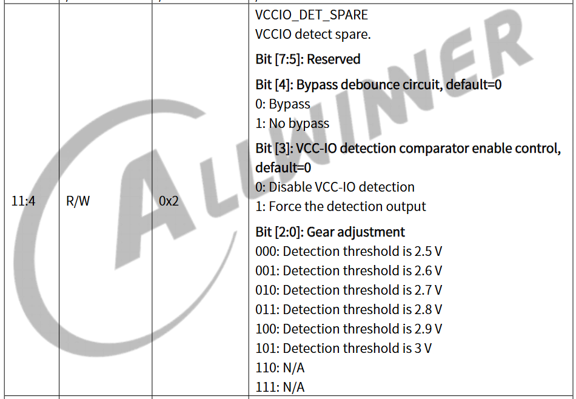

## PMC 常见问题

Q：**配置PMC之后，长按POWERON重启，而不是关机**

请检查此时 VBUS 是否有电，NMI，RESET 是否配置正确

（1）如果 VBUS 有电，检查配置

```
pmc_vbus_wakeup_en  = <0>;    # 在开机状态 VBUS 插入后，如果出现强制关机的情况，关机后VBUS不自动开机。
pmu_powkey_off_time = <6000>; # 正确配置长按时间
pmu_powkey_off_func = <0>;    # 长按按键为关机模式
```

（2）如果配置正确，检查关机的时候 RESET，NMI 信号是否正确拉高

Q：**PMC 搭配 GSensor 实现抖动唤醒如何配置**

这里以 V881 PERF1 开发板为例，开发板板载 DA380 加速度传感器作为演示

（1）配置中断唤醒功能

```
pmc_irq_boot_en = <1>;
pmc_irq_en = <1>;
```

（2）配置传感器

通过遍历 `/sys/class/input/inputX/name` 节点获取 DA380 配置节点，如下是 `/sys/class/input/input3`。

```
cat /sys/class/input/input3/name
```

配置灵敏度，其中数值 高：0x99，中：0xC0，低：0xF3，关闭：0xF01

```
echo 0xC0 > /sys/class/input/input3/slope_th
```

开启中断功能

```
echo 1 > /sys/class/input/input3/int2_enable
```

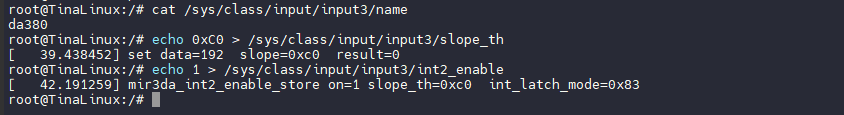

（3）测试

先进入休眠模式

```
echo mem > /sys/power/state
```

此时轻拍开发板即可唤醒系统，此时配置系统关机

```
poweroff -f
```

此时轻拍开发板即可唤醒系统
