# 休眠唤醒开发指南

## 概述

### 编写目的

提供全志 V861 平台 休眠唤醒通路的设计，软件适配的相关说明文档。

### 适用范围

:::note

:::note

适用产品列表

:::

:::

| 产品名称 | 内核版本 | 备注 |
| --- | --- | --- |
| V861 系列 | Linux-6.6 |  |

### 相关人员

需关注全志 V861 平台 休眠唤醒通路设计，软件开发者，测试者和第三方人员。

### 术语与缩略词

:::note

:::note

术语与缩略词介绍表

:::

:::

| 术语/缩略词 | 解释说明 |
| --- | --- |
| standby | 休眠唤醒 |
| baremetal | 裸机环境，休眠唤醒固件使用 |
| normal standby | C907 和 E907 不掉电，DRAM 进入自刷新模式 |
| super standby | C907 和 E907 掉电，SRAM 掉电，DRAM 进入自刷新模式 |
| hibernation | C907，E907，SRAM，DRAM 都掉电，体现在系统上是输入 `poweroff` 命令 |
| 从核，小核 | 指 E907 核心，异构核心 |

## 模块介绍

休眠唤醒指系统进入低功耗和退出低功耗的模式，一般称之为 Standby。通过合理的休眠策略，可以在保证系统功能的前提下，最大程度地降低功耗，延长设备续航时间。

V861 Standby 相关场景一共有三种：

-   Normal Standby
-   Super Standby
-   Hibernation

其主要区别如下：

:::note

:::note

standby场景主要区别

:::

:::

| 场景名称 | CPU 域 | SYS 域 | RTC 域 | SRAM | DDR 休眠模式 | CPU 唤醒动作 | 唤醒源 | 唤醒速度 | 休眠功耗 |
| --- | --- | --- | --- | --- | --- | --- | --- | --- | --- |
| Normal Standby | 保持供电 | 保持供电 | 保持供电 | 保持供电 | 自刷新 | 从休眠处唤醒 | Wakeup Timer / RTC alarm / GPIO / Wakeup IO | 快 | 高 |
| Super Standby | 掉电 | 掉电 | 保持供电 | 掉电 | 自刷新 | 从休眠处唤醒 | Wakeup Timer / RTC alarm / Wakeup IO | 中 | 中 |
| Hibernation | 掉电 | 掉电 | 保持供电 | 掉电 | 掉电 | 重启 | Wakeup Timer / RTC alarm / Wakeup IO | 慢 | 低 |

:::danger

:::note

危险

:::
:::note

当使用 PMC 功能时，Super Standby 和 Hibernation **不支持** PL0~6 使用 Wakeup IO 功能唤醒，只可以使用 PL5 NMI 功能唤醒、 POWER-ON 唤醒和 PWR-STARUP 唤醒。

| 场景名称 | 唤醒源 |
| --- | --- |
| Normal Standby | Wakeup Timer / RTC alarm / GPIO / Wakeup IO / NMI（PL5）/ POWER-ON / PWR-STARUP |
| Super Standby | Wakeup Timer / RTC alarm / NMI（PL5）/ POWER-ON / PWR-STARUP |
| Hibernation | Wakeup Timer / RTC alarm / NMI（PL5）/ POWER-ON / PWR-STARUP |

:::

:::

**Normal Standby**

Normal Standby 是一种轻量级的休眠模式，适用于需要快速唤醒且对功耗要求不极端的场景。

**主要功能特性：**

-   **CPU 保持供电**：主核（C907）和从核（E907）在休眠期间保持供电状态，仅进入 WFI（Wait For Interrupt）低功耗状态
-   **系统域保持供电**：SYS 域、RTC 域和 SRAM 均保持供电，确保系统状态完整保留
-   **DDR 自刷新**：DDR 进入自刷新模式，降低功耗的同时保持数据完整性
-   **快速唤醒**：CPU 从休眠位置直接唤醒，无需重新加载代码，唤醒速度最快
-   **丰富唤醒源**：支持 Wakeup Timer、RTC alarm、GPIO、Wakeup IO 等多种唤醒源
-   **应用场景**：适用于需要频繁唤醒、唤醒延迟要求极低的场景，如待机状态下的快速响应

**Super Standby**

Super Standby 是一种中等功耗的休眠模式，在功耗和唤醒速度之间取得平衡。

**主要功能特性：**

-   **CPU 掉电**：主核和从核在休眠期间完全掉电，最大限度降低功耗
-   **系统域掉电**：SYS 域和 SRAM 掉电，仅保留 RTC 域供电以维持基本时钟功能
-   **DDR 自刷新**：DDR 进入自刷新模式，保持数据完整性
-   **从核唤醒**：唤醒时由从核响应中断，从指定唤醒地址继续执行，无需重启系统
-   **有限唤醒源**：支持 Wakeup Timer、RTC alarm、Wakeup IO 等多种唤醒源，不支持任意 GPIO 唤醒源
-   **应用场景**：适用于对功耗有一定要求，但仍需保持系统状态、唤醒速度适中的场景，如夜间待机

:::danger

:::note

危险

:::
:::note

当使用 PMC 功能时，Super Standby **不支持** PL0~6 使用 Wakeup IO 功能唤醒，只可以使用 PL5 NMI 功能唤醒、 POWER-ON 唤醒和 PWR-STARUP 唤醒。

:::

:::

**Hibernation**

Hibernation 是一种深度休眠模式，功耗最低但唤醒时间最长（对于系统来说就是重启）。

**主要功能特性：**

-   **全面掉电**：CPU 域、SYS 域、SRAM 和 DDR 全部掉电，仅保留 RTC 域供电，维持 RTC 时钟和唤醒相关功能。
-   **系统重启**：唤醒时系统需要从 BROM 重新启动，重新初始化所有硬件
-   **最低功耗**：所有非必要模块均掉电，功耗最低
-   **唤醒时间长**：由于需要完整的启动流程，唤醒时间最长
-   **有限唤醒源**：支持 Wakeup Timer、RTC alarm、Wakeup IO 等多种唤醒源，不支持任意 GPIO 唤醒源
-   **应用场景**：适用于长时间待机、对功耗要求极高的场景，如设备关机状态下的定时唤醒、

:::danger

:::note

危险

:::
:::note

当使用 PMC 功能时 Hibernation **不支持** PL0~6 使用 Wakeup IO 功能唤醒，只可以使用 PL5 NMI 功能唤醒、 POWER-ON 唤醒和 PWR-STARUP 唤醒。

:::

:::

### 休眠唤醒通路

休眠唤醒（Standby）指系统进入低功耗模式和退出低功耗模式的完整过程。休眠过程由应用层发起请求，经由内核的电源管理框架（PM framework）进行统一的休眠唤醒管理工作，协调各个子系统的状态切换。

V861平台采用主从核协同的休眠唤醒架构，大致机制如下：

**休眠流程：**

-   主核（C907）：依次运行 Linux 内核 → OpenSBI 固件，负责保存上下文、关闭外设、通知从核进行休眠、进入低功耗状态
-   从核（E907）：依次运行 RTOS → baremetal 固件，负责关闭从核相关外设、进入低功耗状态

**唤醒流程：**

-   从核（E907）：先被唤醒，运行 Baremetal → RTOS，负责初始化从核相关硬件、通知主核唤醒
-   主核（C907）：后被唤醒，运行 OpenSBI → Linux 内核，负责恢复上下文、重新初始化外设

**核间通信：**

-   主从核之间通过 rpmsg 和 msgbox 机制进行通信
-   通信内容包括：休眠同步信号、唤醒通知、状态信息交换等
-   确保两核在休眠和唤醒过程中的时序协调

#### Normal Standby 通路

Normal Standby模式下，C907主核和E907从核保持不掉电，DRAM进入自刷新模式以降低功耗。具体休眠唤醒流程如下：

**休眠流程：**

1.  **主核（C907）休眠：**
    
    -   应用层发起休眠请求，主核进入 Suspend 状态
    -   主核保存上下文，关闭非必要外设
    -   在进入WFI（Wait For Interrupt）状态前，通过 msgbox 向从核发送休眠同步信号
    -   主核进入 WFI 状态，等待唤醒
2.  **从核（E907）休眠：**
    
    -   接收到主核的休眠同步信号后，开始休眠流程
    -   保存从核上下文，关闭从核相关外设
    -   在休眠最后阶段，配置 DRAM 控制器进入自刷新模式
    -   从核进入 WFI 状态，等待唤醒

**唤醒流程：**

1.  **从核（E907）唤醒：**
    
    -   唤醒源中断触发后，从核优先响应中断
        
    -   从核从 WFI 位置唤醒，退出低功耗状态
        
    -   配置 DRAM 退出自刷新模式，恢复正常工作模式
        
    -   初始化从核相关外设，恢复从核上下文
        
    -   通过 msgbox 向主核发送唤醒通知信号
        
2.  **主核（C907）唤醒：**
    
    -   接收到从核的唤醒通知后，主核从 WFI 状态唤醒
        
    -   恢复主核上下文，重新初始化外设
        
    -   系统恢复正常运行状态
        

**关键特性：**

-   主从核保持不掉电，可快速唤醒
-   外设断电，降低功耗
-   DRAM 进入自刷新模式，保持数据完整性，降低功耗
-   从核负责 DRAM 控制，唤醒控制
-   唤醒时间短，适用于频繁休眠唤醒场景

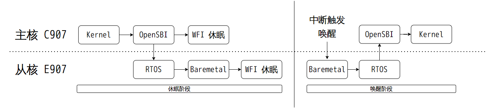

#### Super Standby 通路

Super Standby模式下，C907 主核和 E907 从核都会掉电，SRAM掉电，DRAM进入自刷新模式，功耗低。具体休眠唤醒流程如下：

**休眠流程：**

1.  **主核（C907）休眠：**
    
    -   应用层发起休眠请求，主核进入 Suspend 状态
        
    -   主核保存上下文，关闭非必要外设
        
    -   在进入WFI 状态前，通过 msgbox 向从核发送休眠同步信号
        
    -   主核进入 WFI 状态，等待从核关闭主核电源
        
2.  **从核（E907）休眠：**
    
    -   **RTOS阶段：** 接收到主核的休眠同步信号后，开始休眠流程，保存从核上下文，关闭从核相关外设
        
    -   **Baremetal阶段：** 这是与Normal Standby的关键差异点
        
        -   根据Device Tree中standby\_param参数配置，决定关闭哪些电源域（如vdd-sys、vcc-io、vdd-csi、vcc-pa等）
            -   通过PMU/PMC/PL5电源管理芯片控制各路电源的关闭
            -   关闭主核（C907）电源
            -   关闭SRAM电源，进一步降低功耗
            -   配置DRAM控制器进入自刷新模式
            -   从核配置 PMC/PMU 掉电

**唤醒流程：**

1.  **硬件唤醒响应：**
    
    -   唤醒源中断触发后，由PMU/PMC/PL5电源管理芯片响应中断
        
    -   PMU/PMC/PL5不同方案按照配置重新给系统上电，包括主核、SRAM等
        
    -   由于SRAM已掉电，DRAM处于自刷新状态，系统需要从BROM重新启动
        
2.  **主核（C907）启动：**
    
    -   主核从BROM（Boot ROM）开始执行启动代码
        
    -   BROM 加载 boot0 固件到SRAM
        
    -   boot0 阶段初始化 DRAM 控制器，使 DRAM 退出自刷新模式
        
    -   boot0 拉起从核（E907），设置从核的启动地址
        
3.  **从核（E907）唤醒：**
    
    -   从核被拉起后，跳转到指定的唤醒地址
        
    -   切换到 baremetal 阶段，执行唤醒恢复流程
        
    -   初始化从核相关外设，恢复从核上下文
        
    -   通过 msgbox 向主核发送唤醒通知信号
        
4.  **主核（C907）恢复：**
    
    -   接收到从核的唤醒通知后，主核继续执行
        
    -   恢复主核上下文，重新初始化外设
        
    -   系统恢复正常运行状态
        

**关键特性：**

-   主从核和 SRAM 全部掉电，功耗较低
-   DRAM 进入自刷新模式，保持数据完整性
-   唤醒时间较长，适用于长时间待机场景
-   支持灵活的电源域配置，可根据需求选择关闭的电源路数
-   适用于对功耗要求高、唤醒时间较不敏感的场景

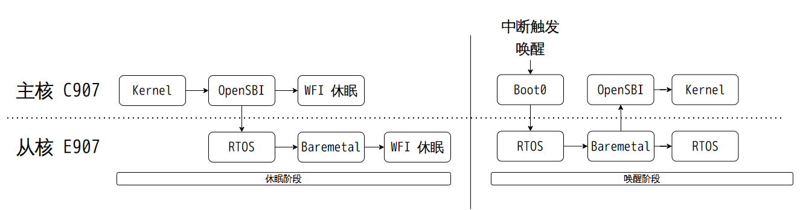

#### Hibernation 通路

Hibernation 模式下，C907 主核和 E907 从核都会掉电，SRAM掉电，DRAM 掉电，功耗最低。具体休眠唤醒流程如下：

**休眠流程：**

1.  **主核（C907）休眠：**
    
    -   应用层发起休眠请求，主核进入 Suspend 状态
        
    -   主核保存上下文，关闭非必要外设
        
    -   在进入WFI状态前，通过 msgbox 向从核发送休眠同步信号
        
    -   主核进入WFI状态，等待从核关闭主核电源
        
2.  **从核（E907）休眠：**
    
    -   **RTOS阶段：** 接收到主核的休眠同步信号后，开始休眠流程，保存从核上下文，关闭从核相关外设
        
    -   **Baremetal阶段：** 这是与 Super Standby 的关键差异点
        
        -   关闭全部电源域（仅RTC域供电保留）
            -   通过PMU/PMC/PL5电源管理芯片控制各路电源的关闭
            -   关闭主核（C907）电源
            -   关闭 SRAM 电源，进一步降低功耗
            -   关闭 DRAM 控制器电源
            -   从核配置 PMC/PMU 掉电，关机

**唤醒流程：**

1.  **硬件唤醒响应：**
    
    -   唤醒源中断触发后，由 PMU/PMC/PL5 电源管理芯片响应中断
        
    -   PMU/PMC/PL5不同方案按照配置重新给系统上电，包括主核、SRAM等
        
    -   由于SRAM已掉电，DRAM处于自刷新状态，系统需要从BROM重新启动
        
    -   由于 DRAM 已掉电，所以执行冷启动流程开机启动
        

**关键特性：**

-   芯片除 RTC 外全部掉电，功耗最低
-   唤醒时需要完整的启动流程（BROM → boot0 → 冷启动内核）
-   唤醒时间较长，适用于长时间待机场景
-   适用于长时间关机场景

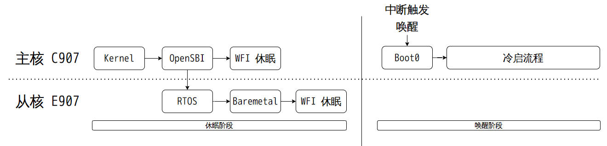

### Standby 内核驱动配置

在 SDK 根目录下执行 `m kernel_menuconfig`，并按以下步骤操作：

**内核 POWER 相关选项**

打开内核POWER相关选项，配置如下：

```
Power management options  --->
    [*] Suspend to RAM and standby
    -*- Device power management core functionality
```

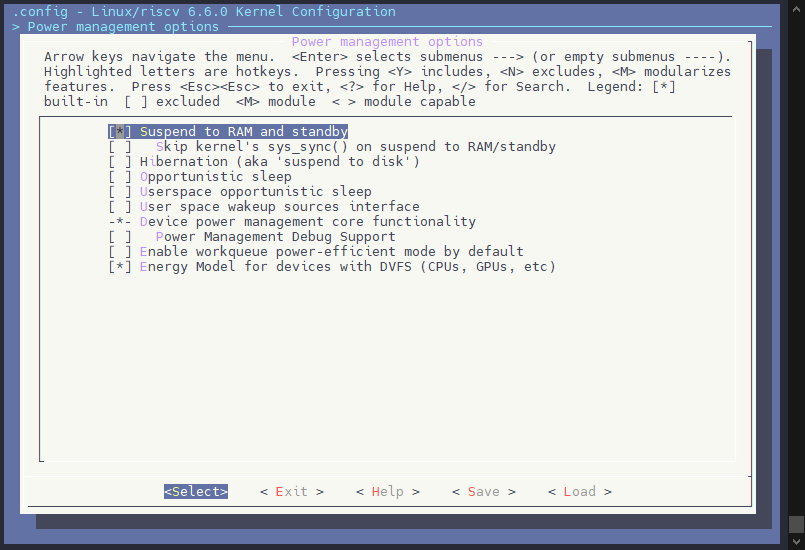

**内核 BSP 配置相关选项**

打开 `pm_msgbox` 驱动配置，用于主核和从核之间的通信。

```
Allwinner BSP --->
    Device Drivers ---> 
        Standby Drivers  --->
            [*] Allwinner PM Message Box Driver
```

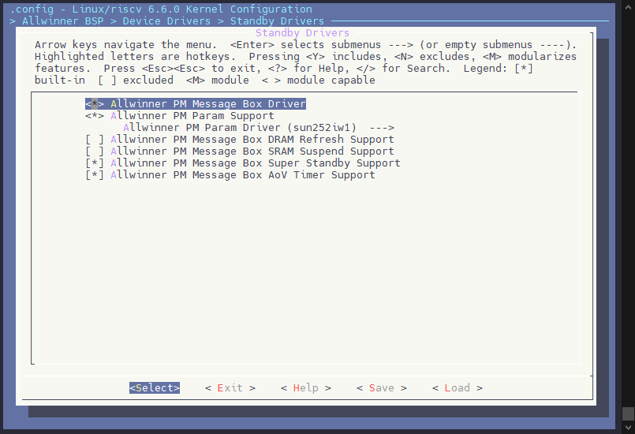

打开 `pm_param` 驱动，用于主核和从核之间的参数传递。

```
Allwinner BSP --->
    Device Drivers ---> 
        Standby Drivers  --->
                Allwinner PM Param Support --->
                [*] Allwinner PM Param Driver
                Allwinner PM Param Driver (sun252iw1)  --->
```

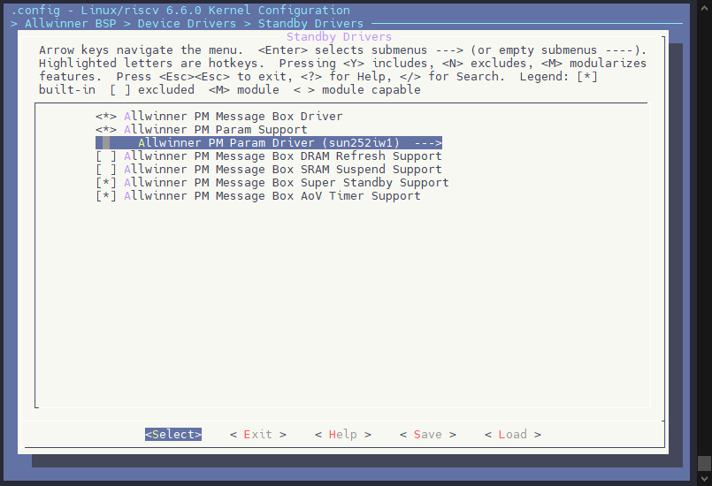

使能 `Super Standby` 配置，用于支持 `Super Standby` 模式。

```
Allwinner BSP --->
    Device Drivers ---> 
        Standby Drivers  --->
                [*] Allwinner PM Message Box Super Standby Support
```

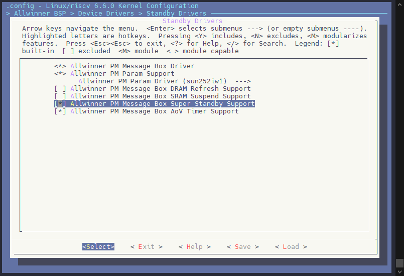

使能 `Wakeup Timer` 配置，用于支持 `Wakeup Timer` 作为唤醒源。

```
Allwinner BSP --->
    Device Drivers ---> 
        Standby Drivers  --->
            [*] Allwinner PM Message Box AoV Timer Support
```

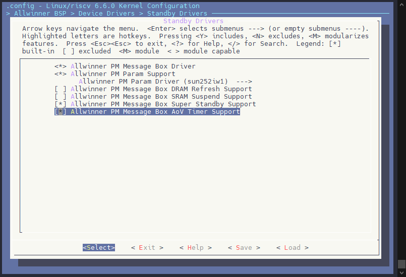

### 内核设备树配置说明

#### Standby 参数预留内存

休眠唤醒中需要预留一块内存作为 Standby 参数的固定存储地址，其描述 `Standby` 相关参数的保留区域，用于存储 `Standby` 相关参数。一般建议对齐页大小 4K

```c
standby_param_reserved: standby_param@40fc0000 {
    reg = <0x0 0x40fc0000 0x0 0x1000>;
    no-map;
};
```

-   `reg`：`standby_param_reserved` 的地址范围，`0x40fc0000-0x40fc1000`
-   `no-map`：`standby_param_reserved` 不映射到用户空间

![Standby 参数预留内存](data:image/png;base64,iVBORw0KGgoAAAANSUhEUgAAAc4AAABzCAYAAAARxeKvAAAgAElEQVR4nO3dfWwU573o8W/IAdbrNdhm3dh0DcR0DSaxnbUCjQMxhxcr+Cq3V6HHoMMtVlJ6TSJBjkSTmKDjHJ3jigKhkU6C1IKOkwiqVOB7iW5OdEhkXi5OCC2p2NpugHhbYuxtTIJZ23htlpCY+8fM7M7s+2DDGvL7SJa8OzPP88zM7vz2eZl57pn74MM3SNI0u53Lvb3Jri6EEELcdSakugBCCCHEnUQCpxBCCGGCBE4hhBDCBAmcQgghhAkSOIUQQggTJHAKIYQQJkjgFEIIIUyQwCmEEEKY8HepLoAQ4Z76yT/EXf7Wb//3bSqJEEJEksApxqX/OPC7qO//bNU/3uaSCCGEkTTVCiGEECZI4BRCCCFMkMA57lSTX9dMUUWqyzFOWOs4UPE7/quikX+1prowQgghfZxiXFvIvz7wEHTv4r99fgKAn6W4REIIITVOMY7NIjttmLNfnkh1QYQQImjUNc4pU6bg9w8xMvLtWJQnjmry62qxnazkUlEzTgeAH+/eJ+n2qKtUNFJeOUN9EbYMsFa/Q2mJLfi6v7mSsy3G9B3aYu8hTu5+VfnfuQNXzTS66z8lp6GKTAC/m9btLzLMJooaqsCQVvh7cdLWrZ+pe6c/mUNS0Uh50WW8mS4cNj/eZg/2SheWYNki0w607cHd1KSWaQ2c9+EomQHeQ3iowukwHhf7eu1Yhx/TeOdDWWY/r+UVWt/4nhBC3HlGXeMMXAswdeoU7plweyqvmZXN5Pv2cLK+Eo/XhmPpJmWBcweuymy8eys5WV/JyWYfjppG7NqGzh3MKfHhqVeX1+sDHdjX1+LoP6Qu24M3swpXdbUu5xk4Gx7Dv7eSk/WH6Le5mFkB8CqXvJBZtCm0qjMXC11cakkm7Wry66qwtO0JLfebOCAOF7aT6rGonEZ3/SH6bU6mOaOlfYhASa2u/9SGo+AyrXvdBBxV5Pv20NrmD+6LtfodnJluWtXj1dqG8ZjGPB9NXD7vx1Iwn2C3pHM+dpuf3j8Zg2a6zUZ6erqJHRZCiNQyFe0ys7KYZrcb/jIypjDh3ntv38XPeyhYY+k92wWZuVgB60NOaHs7VMNseR+vfwY5hkE24a81m8hxdOEJ1gKb6D7ZZbzwA/3NWm1LCZaW+5Tg13vUTcDxQDCgKGV5n95k0q5YgQM3n91sLczv5oIaoAPBPFXO+dgNab/KBV1gBOg/qdVMu+g2lGETM0tsuuUw3PR25DGNcT6Gmz7UBXDlmFi8HxpaACZOnIjFYmFyWlr0fbM6uI+v6B6OvlgIIVLBVFNtf18fl3sNl2YmTZ6E1ZrO0NDQmBYsZhnO6po4W9ZxUqvVZduwOGopL6k1rq/943kRd3Mj5ZXNlFeia2pFrSHOwNnQjFO/sf+y7kWoBgnQu7syFKQ8n9DrryWnAnpbqplWAL0H1SCUVNrxGZtL9c2tCeRNw2KbQWlDs/F9b7I5+/H3xF8j1vlQflxUkf9QNd0emFYA3oOvGra9AQQCAW7cuBGW6jxer/gds6/+iR0tL/H/ki2uEELcBqPu47RMtnBlYIAbIyNjUZ5RSRhQ9IF2fTOldTt0fYFdeOrXGWtsSWvi8vk1OIo2QU8udjx85tEvH03aYUHaLEN/p151lJXD2bDlAcF9ycdmi7N6mN6zXTjL52N1EuWYwDfXr/PN9etRtjzDxpZ69VaUX/KDlpf4j+SzFUKIW2rUHZNXrlxhZBwEzd6zXVhK1pDvTLwuwLBP15Ho+YRe/wyc6zfF3iBRen/yEMjMxf6Qk4CueTNh2j2XCeiaNO3rdYOIRqvlU/ptLuZUJxMkw6l9t+U7gs3V1urHyNQ1DSfO/328uJizMuyYJGvYy5d8j3y5f1MIMY7cPfdxtqzjJI2U1zQTatUM1fTCR9Qqy7SLeRPd24G6WsobqoJrJN0kCuB5ke7+ZpwlXXjq9QsSpO15kc/a3qFULXegbQ8easkxufvRvcrZeihqMDZhG0cTx9a7uxLWN+uaevXHLBlqTbzER3eywVYIIca5e+Y++HB4B1NM0+z2iD5OIeKxVr9DafaHYbffxPfUT/5Bfcj7/+T1iqX4/riOf1Gj9c9W/aPMjiKESCl5AIK4dZw7mFMC3qPJB02jTnxXrWSPVdO1EEKMgbunqVaMH84duGpcWFCahbs9CbeI4QT/8ukiDjz8O/5r7jCf/HEd3WNYTCGEuBkSOMXY87yIuz7xakkZ3s4qXf+oPKtWCJFqEjjFuCQTVgshxqs7ZnDQowsr+PiEDM0UQgiRWjI4SAghhDBBAqcQQghhggROIYQQwgQJnHealWUc2eZUnzRrY+e2x3ljZYrLJFLD8Fm4e9jXN+um3dtEUcM7ST9K825jX99MeYPy57qpR2fGU01+XSj98lE8cnS8uV79CX0//4S+6n++JenLqNqxsrKMIwsG+c1mDzJNs7gb2dcrc6/KROS3Q2ji95O7m4KviyqajI/L1O6ZjpjMIdYE9iHW6jU4cNNq6jGaobIFn6ntPWR8MlhFI+WVM9QX2uT2+nz1jz8NnwAjQdrJKD2Af8bn2H61ionmtkya1DiFEGK8qViBo/+QLtgp8/jq59KFavJXugh4u8I2DpvAfq8bDBPYK6zZNgLnPzE9+YJ9fS2O/kNK2vWH6HdUhWrDzh24KrPx7q3kZH0lrW3gqGkMzlVMRSOlJT489cpyj3cGzrrQRBJx007SSI4dutpuWdCEMahxTpkyBb9/iJGRb8eiPOM375VlHFkaevT6UPsJfrTbDwucvFtTgDKNdw7P7CrgGQAucWjDaXYCSpPqQlzaryj/eV3NNI83duVxZu8gFVo6huVQvb6CZ4p1kz37B8MKl8cbu0qYGZZv9foKnrm/JzKtsPdiqV5fwVpO05K1kCr1yfkXjn7ATw9GyxfwtrFsmzqB5wIn79Zk0LKhh3naOnH36yruvS08f0o91oWDuDMLcNmu4j7aQ+HSAtLDto9Jq/0fhLXaMdWXLfx8GJZF2a/wfA2fBV25E+Sd1PmIl3bEMSPKZ2EZtVtXkN/9PvW/PpLoSBmET4SgTQZgeF8/562hNmCs4RiWVTRSXvQprb7HgukYa0BhtQwg4AsrXF7oaVShqfJCtbLwtIzvxVJNft0aOPghthqt7GE1IEPtKWyChIpGyssv03oQ5mhlMxyTsP3S1Qqt1e8wBw+BEheZdOFpBmflDHX7bvLLsyPmr6XlU/orH8AO6sQVao3x7DQyy3XrVazAYevCo+2/50W6vc04izZBS6hsaZlA+HEOCjufWtmdO8h3+PHu1dJ5lQttj1FaMB8rTViXurB4DwVrmMNNH9JfUhWcqzi/fAaBtj3B49t71E1+jTI71DDx0x5P89mPusYZuBZg6tQp3DPh9ldeb1/eebyx1IZ77wcs26D8/Wi3Oi3ZKQ8/2vABy45eUi6wG7R1tKAJ1esL4aD2/gncFLB2vf4BrDlU1WTQsuEDlm1o44KtgCqt33JlGc8U+zmkpXv0UkTpZi514lPLdsibQ9XmPACa3D0M2fL44QJtTRs/vD+Noc97km5OTi9eSEXfiWDeM5eW8by67PnNeZwJ7m8bFxwlYf2tOVTt0soWtl8LnFRxOng8f9MOrpW6/jpHAdmnPuCQNw3X0gxaNrRxwbAvCdgKeEY7pnvPM+RwsnOBVu6FuPrbQucjs4R3defj+c0l2NtPBMu2TB80Fzh5V/9ZOOrHVRM6JvHyjjwfMDNLdz4SpZ3EZyGRyZMnk26zYU1PNy5w7mCOriZwsj4UIIabnlRrB0rA05brm9Ds6x/gUnBbpaZgqOE4qpSH/ddXcrK5C0vJimAtxFjLUPIxsuGonEZ3fSUn6/coU9VVV6PMvuPHUjA/WGPBOR+7zU/vn5L9hNtw1DyGf6+uBhTs69tEUdGnof1t7iKzUld7ArC5KK1Ry7bXTcDxWLA/1lq9Ag5qx0RfboWlxIl/7x68/hk4yy/TutdNwPEAdud87Hi47FECrNYHWVTRjV+bDVF7DvTByGZW633Z4P00GJys1e/gdACZuVjZRFFDM+UNSkC3lNSq6ev7kZWgadGfa60ZOG8aFr9SNkCtQdrANg2rGoxDk9srNd9MwHJfNcp8vvpzs4miGhcWbd7fuGmHTJw4Mfpn+DYyFXEys7KYZrcb/jIypjDh3ntJv8U7YbWlpyxvRRqFrpt72njT7tO6WoOfP3x+lfSsDN0aV3Hv1QJtD2e8YM+xATZ2LsjhwtFQEI7mwtFQrWRnxyVw5CkX21MeWry6ci/Io9B2iZbd/lhJRfK2hX4kHOzhAjZy1Qv/zm36cunLHa1sYctPefiprhxKUMkw1PIOqTXbofaOuPsfne6Ynuqhw59GtgMgj3mOSxwK1jD9PH/qEun35xkG2YS/1lS78qBddz4PduD25zDP8IMhRt7h50Mti3Y+4qed3GcBjrBnywsxa5sjIyNYLBYsaWlRls4gpyLK20no3a3vp1LmclUuliq/m1Yt0LZ8Sj/ZpDkB5w7yHV144vZj+fHu1dI3Bsvhpg/p181na33IicX7oannI/c3h/rges92qQFG2Y+z+nLpyx2tbJ5P6PWrQQAYblqnK4da7uz80Ka6cvbr56vNm4al/yLDwR8ze/D6/fh1jSL2pS5oezv+flY0Ut7QTGmBRwnKtmlYeZWzWiD3638IhY6BNu/uZ/Fq7M4duBqaKa8ET/2hiOOiDGpSav6tbWH7HRyUVAXNyg8lw2clQdpAnM8wfJuVwYS+zjgHZvRMNdX29/VFPDlo0uRJWK3pDA0NjWnBwg37h1KWN/Tw07023q1ZyJFdYGyGTYKhOVcV8at6jHgHGSIUlHd2XKJqQR7VeEC9MJsPQnpaECCi+RpgqE//6hJnDoZe7dz2gS7vsOZSdf0x4+/hD7ofK89v/kD5d4ENOzlU7XqcKsP6oSbPndtOkLttYbDZXd88PTMrjXSH9jkIuZBM3hjPR9PKPGZ6e/gpJtIepRtAIBCIXOB5EXdzI+WVygWLiMEmCYQ1aUKU5tYxMvylDwq0V69yyVtF/kPVdHtgWgGRTZxmqTWcYZQA4HToF/ox/OzU15Boonu7LtjoJjsISvJ7H/B1Y33oMWh7m17yKbL5uOSBNICKRpyZblp3xwlsjirKM9201q9TzmFFIxb/5aTOpzXbBv0XY69rc1Fa04WnvlL5weDcQT6h8mVWNiu1VbV89vW1BHzdQD5KDb+W/uZKTrYAVJNfDoGzTcCKuGlrrl+/rnyGbxgfejey/CgDpRlMOjyfqa1J7OgojLqP0zLZwpWBAW6MjIxFecZv3qc8/OiUcvaq11fwzK4ySCp45vFGTQG0n2CZVrNYX8EzWbeonI4M0v2DoYvtwR4uLHXywwU9cD90HDRR24zqKj4varNijiGoPL/5cZKtsDy/eSEuzvObDZ5QM2VNRqLNxkiiHz76QOvk3ZrHeYPQfgb7t29G8Hx4mFmYw4WO04bFo0o7Cd9cv843169HX9iyTr2YKQGjtG5HcsHTuQNX5QxD/599fTP58be6adb7sqH/02C5es924Syfj9UJdjx8dtOz8ajUAKM0cer7PDdR1PBYkokozZC07eGkWnNT5qZNvOWk+5SVrNk2pQ/SmasGvXxyuMy3RS6wzdBNMA+gvO5vruTslz7Ah0d37sKPWTzDPj/EKmfPZQJk07tX18KQN00tXxP014JhUJPSfKsExmr8frCc36MbGaw03yq16XhpGw35I78jEw4vJeuwcivKQM6/M/Xwb5PY25sz6s7BK1euMJKCoJnKvJsuRbmweQcj+q/0erVtFjhZWxy9iSGSn4v9MLMwL7jtu2E1PCOlOc/Yh9nDoXZwrSyjsN9jGGhi1vObS5hpqE2pQRRgZVlwAFHS+v1qOW3sXBlWI79VTvXQ4Q/1Ayde34++nWNnxyXSi8uC/aXm9XDGm0a2I495maHm6MRpJ/tZWEbt1ldoeHbZzRYQUC+eUd4z9CeGlS/YlFjRGFZLi8NzkYCuiTjYHxfTJmaW2HT9aEDL+0r/4UongZNmb60wpl1UOcM40lR30bav1w2WSVLgS/Wb6NzBnJLkunq+/tJYVbc+5FRqrRUPkNl/kS92h/qhtb5X/G5atX7plk/px9hXG3HM4hj+k4dAeB+1Rm2OdqzURsKqA37UY9Z7tgv026oDlS61QLC5umSNrh/4MTK1WnuCtJN1b98gI1mzTGxhntzHmYyIJklltKOhxnLKwz5XHs/UPM6RGgjVano41O7kmaWPc2Sp8r67/SquJGucO7e1MW9XCUd2lShp7j1PRdgDD2YG045eY2ly97C2uIDeUz2Y5tDyxji69JSHlqUFVGn76z+P25tDYZLJ7jx6noqaUNoX2s8zVHw7apx+nt98gp3bFob2C/1xCxtRqy3TAtzB0yyjjCPB8wxmm+53Hj3PuzUl0H7COEgrQdrJfBZuVviIWmV0qTEIDTe9jbeuNlTT0UaQaqM2a5pxAPjdeL0zjINoYnqVs80PhJqIvYdobXuMOYZ1bDi0tAkb2QooF+Q1OEp8dN/EPBCZWt4YR/sON31If0NVcH8DbW76Hck+iUEdERpMuwtvmx9HEjVOAEt2vlKTrqyl1OvGi4vSSv2I0/h5n62HooYqpR+RaMcsDs+LuPfuwFUTOi6hpvsmurcDus+BYYR0yzpOomvyDxulPNz0JK28Q6nusxJq1UiQ9jgis6N8FwRvDTHXv6k0KXvCbtUQYvxRmkE/NHmzvHK7iO2kiaByOzh34KqZRrfhwQAiWSPLjzKQdZSspl/csjzkAQh3PaUZlJsamSrEHUC7NePoKAcFjReeF+k23BYD1urG7+xjB82acKkXMqdzKzvxpKn2rqUbteptCw5M0kTcSG+gNEX/4ZaX8SZEG6Gsc6sH14hxRDdqtb+5MuLWjMgRsXpdeOrfv8UFvHm9u/eQVlcbbGrF76Z1/LVYjk+tq7AVfsLAzz+Brv97S2qe0lQrhBBCmCBNtUIIIYQJEjiTMM2e3PhAIYQQdz8JnEIIIYQJEjiFEEIIEyRwCiGEECbI7ShCpMCiJQ+ysXiS+mqA9177K/tSWiIhRLIkcIqUGV3wyGb7c7PQnkg53H6Gp49FmfUjKgubn56HS3vCn7eT1QfNT+WxdmUZTzig89hp6tpD7yfcr9zprCsG94HTbLtoLs/4aSfar/jHLHXnY5R5F89m/5Kp6ouvcR/4s8njqpZ98CKvv/kFH5lIe3TnQ9yppKlW3BaFq182Pni8eDYbi6/y3munWf3aad7zTuWJp6ezKKnULGx+ehbfaz/D6tdOs/rARSiex/bi5MqyduU8XAOdyravddLpmMWbSyyJN9Qrns0TUwfoHIx8P+F+5aRhHfTxkcmgmSjt+PuV4Jil8HyMKu/c6by5JA33AWXb19vBtWo2a5PMmuLZ7H8ui772r82nParzoXwn6lbPTbakYhwZdeCcMmUKEybcOxZlkbyjWbyBhpfWUFi4hrqtr9AQMfPFXKpfUt+PNiuGfrvg3wYW3/qSh3bh2VdYW+rjcHByZQubH57KcPvfgr/O9318keGMbBblolywniszXGTWrixj/3PqRav4+7gyBjiq1WgufsFRL8xyJvEE7dzpLHV8jftj7Ze/j/9s/xrrrGzlglc8m/3Pleku+hY2P13GfsOFPJvtS6bS+ce/YZh+NNF+qRbZ482Oo+b3nPanXagTH7P4+xXvmCVX7pgSnA/DuYOw8zu6vNc+movV+0WwFvjRsS/oZCoPFuuOpf7cGc5vNtsfvsrrr/3VWMtMNu3RnA+gY/8J+krXxZ3JpnD1yzRsfZnqZGdPELfFqANn4FqAqVOncM+E2195/c7kneFi7VPZ/H7LC9S/5cafvzD4RVr87DpK+t+nfssL1G9ppC1zhe5X7Fyqf+yC1kZl+QcXgEHa3trFcXWNv5s4kXSbjXRbclMehYu/vRLUl2e62bcllCdYycr4ms/Oak152WxflYuVSWTlABe/4OljA1iLf8DmXJTanSPUDLbIngbevuAFa9GSB3nCAUy1BC9KMcsVXtsrnq00tWWkcT9A+195vf1rZi1RLvSLlvwAF8YmvLUrZzHL22lonk1mv5QAUqbml8tGNTgaa4X6WsppVgeb/hIcswT7Ff+YJUhbJ91mIz3d+MDDROdj38EzuAen8sRKNUhX5UKwKTe5vKOfTwvfnwqdHl/w9eanlebi79ktQIBtb3bSmZHLuiUWgj94gk3rPurCm2aTTnt050NxhD3qd7bhpTVJzywkUs9UH2dmVuy5sNLT0/EPhrdbjR2rLT3mgwhudd6p3G+FLth1nOb8oIusPKBjGXPyL3B4i1aTO0fTxxdoeLSMQs7RUVhGQcYg593nlMXHz9L9+Ap1W+WtewCLxcINIieHXfzsKyyPmI14kLa3/o2mhNsvo3brCvK736c+WNMMF+oD6jx2mvecZSxVL3i0/5XX7Q+y8dHpbJ6qXOwi+ry0/qfBi7x+ANatUi5KHyXYL0Cp9azKxcoA773WyYPPTef7ucBF+OjYn7k/q4ylS6bzVTG4D+gurrnTWeoY4L3XfECs5t3o+7XvoLIPi5Y8yMZZvij9aUrN7b034/WDxThm2pMwY+zX53GPWSB+2uryiRMnho7p0FBk0WKeDyWAbX9uOpuXXFV+iET0f8bPO9H51Pqbh9vP8Do/YGOWVd3WR90BC2+u+j6bSWOWt5PVET944oue9ujOB8Fm+nM0/fIFvnr2FdZuzeaw4QcmdOz/N+r3myuvuPVMBc7+vr6IZ9VOmjwJqzU9+hdpDA37h1KWdyr3G4DBv9Daob1QvmgAFN5HFjNZvvUVlhvWVy+8HV/Sh4sC11zoOAeLi8jnAod138wJEyYQCAS4cSPykcXHf/2C4UscTcztFxcREXMNJuFaNY/OY6fVC5mFzQ/DV57QBfWjY39hkVYDC7/YOWaxf+rFUDNb8Ww2Dl4NBoh4+0VGLhtXDfDea2owzp3Om1zlz7o+x30HO3nwOaXfri74vlJb+ipaEDexX7EssqfBoC8U5MymHW+/iuIfsweTKPcNiH1ME5wP8FF3LIv9S9JwHwhvGk2cd7zzOWtJmdK/elBZf+3KSQz36WYSvfgFje0Pqv2R5gbnxE7bmrjcSXzOjGbyyOq5HN9/zlQZxe036lG1lskWrgwMcGPkVk7iInnHdiHiV2rI3+gbhPzSdTSUKu90f2AMhteuXePatWtRt06mxhlz++O7qD8+l+qX1tHw0n3s++XbBGM/w/QNwvc6z+iaO5Wmr75LoSTWrpzHnM5O3LNm8eaS4eAozY96r7KRq7ynq7EtsqfBQF/wdcxyXbrKMGl8dkA3+jEnDavhIq80y3Gsk6+WzGN7r9q0l5vNnAywLilj/xJdmkvK2P/wRV5/05fUfsXyUe9VNsacuD7RMYu/X/GP2TCLkij3N9ev883169HLneB8KANt4L1jV3li1WzWBpugk/ssRD+fAf42AK6BTt0IXqWJ1fBDpXg2G2f5eK89myeens7nMZtnzaU9mvMRonxHSnCzb4v+OyLGs1F30F25coWRFAWP72reQR2nOT84k+WxBhcsXq5+IV9Q+0BfYE+iKqTO8V+Htgv9hYJmYkrt+HC/i7WGAUkBPur8OtSHCSxaMp1ZYX1CTzgGOHrMx7ZDF0G3Lu19dKL1mQFk89+LJ+n6o+K46OOzwUm4qrQBI+ogj05f6KKv9mv+Z7uPumMDwf5OLn7B08G+x9Osfu0M7kGliW71m1/wUTL7FU97n64/LlyCtBPtV9xjNgbljns+tH7Nv7Gv/a/K6NPguqPLe59nAByzdKODlebuPweDmTaQ6wv2HfsLbmIdX7Npj/J8AMGg2f8+9b+MHjSVwUGvUHs7R/OJhGRasSSkcr9ZvIGGR31hNTY99cuXEXrH39rI9v3noi4DpdZpJoCOhcLVL7M2+4Shv9NwD5z+Hjq1r0x/f6TSz6S/j85432D4vZTxGe+v099zqJQJXT7autHuLVSWZf0xzn2cUe4NjNnHSeR+hd8bGD/t2PsVLe24959Gu6cxrlhpq2XSD7DS+v109zWOKm/DvZb646WWSX//pLqucmww3mepifJZjEybJMod/3wUrn6ZJzmgfldjWLyBhsdnQtyxAuJ2k8CZhJQGztGIFnQXb6DhceI07wohxo3CNdQ95aIvBT92RWzy5KC7WGFuNmBsvlw8byYMuulJTZGEEEkJtRalooVIxCc1ziTcsTXOaE21g+44zb5CCCESkRrnXU0ZnNOU6mIIIcRdRJ5VK4QQQpgggVMIIYQwQQKnEEIIYYIETiGEEMIECZxCCCGECRI4hRBCCBMkcAohhBAmSOAUQgghTBj1AxCmTJmC3z/EyMi3Y1EeyTuM9iDo32evC07xZXwElzphtPYy6ScDzaX6pVVw3kdJqfIQ6cOsYHm+Mf3C1S+ztlR79JB+SrFl1G4t4rO3fDzylAtbjLyV7TFMRSaEEHeyUdc4A9cCTJ06hXsm3P7K63clb1vpOh7xNVK/5QX2tQ6S/+gaCgEl+K0gq7VRnfKrkTZcrI01zViEDEoKfOx7y40/fwWP+BqV9Oep2xeu4e85EJxSbF8rlPxYyxtgJsufyub3uryfXD13jPdeCCHGF1M1zsysrJjL0tPT8Q8OjrpAsVht6Uyz21OSdyr3G4Du94NTD3W4/4K/NJs8oGPxckoyLnA4OC3ROZr+j5uCp4pYzJGkZj/p/vhtOlgDXOD3+8/Bat3CjrfZo6slGvIGlBqoNsvKOVrPD1KS/X0gNE1Sx/5/o37/Te63EEKMQ6YCZ39fX8TDzidNnoTVms7Q0NCYFizcsH8oZXmncr8TGvTFn+lEm88vuL6Zh7xHm8/zQvxNMu+jEOQh8kKIu9ao+zgtky1cGRjgxsjIWJRH8jYrQ18DBPKylf5GzdNlKo4AAAMnSURBVPFd1N/klESLn11HCW72bVEDbeEa6p7Kjr9R/5cSNIUQd7VRd9BduXKFkRQFj+9q3kHHz9LNTB4J9ivOpfrRmfhbD4/dJNXBQDiX6h+7jEFZr3ANT5Zm0H3GOEt94eqXadj6CrWLx6pAQgiRWjKt2B3tCHu2QO3WdTSUqm91v0/9/nNxt0rW8SNuHnlqBQ1bVyhJt7rxl+prnBmUPPUKJVrWUSbc7bjog9IMZcDRcWNQFUKIO5FMZJ2EO3ci61tpGbVbF9KX6DaTwjXUPeWiT2axF0LcJaTGKW6R0MCiaDVRIYS4U0ngFLfIOZp++QJNqS6GEEKMMQmc4iYdYc8W6bMUQnz3yLNqhRBCCBMkcCZBBgYJIYTQSOAUQgghTJDAKYQQQpgggVMIIYQwQUbVJuWfGfr5/+BrYNLh+aS3pro8QgghUkVqnEn5Bem/mk/W25/wzfIDXE91cYQQQqSMBE4zej5m8hU73+aluiBCCCFSZdSBc8qUKUyYcO9YlOWOyjuaxc++QsPWDchEIEIIcfcadeAMXAswdeoU7plw+yuvqcxbCCHEd5OpwUGZWVkxl6Wnp+MfHBx1gWKx2tKZZrenJO+Q33Jv/z8x/MBPsPT8NmLp8V+/MHbzYAohhBiXTAXO/r6+iKfoTJo8Cas1naGhoTEtWLhh/1DK8tab2DQfa/Un9P38p6S9vRRLz23LWgghxDgw6ttRLJMtXBkY4MbIyFiUZ5zn/RMC/+uf+PbUfLJk2g8hhPhOGnXgvHLlyliU4w7Ke5B7v4q+ZPGzr7A8f5C2RJM7CyGEuGPJqJox1OMbBDIocM1NdVGEEELcIhI4x1DHRR8wyHn3uVQXRQghxC0ij9wzI+9Rrk3pxRoxIGgZtVtXkI800wohxN1OAmdSQs+qndD670yMWH6EPVuO3P5iCSGEuO0kcCblF6T/6hekp7oYQgghUk76OIUQQggTJHAKIYQQJkjgFEIIIUyQwCmEEEKYIIFTCCGEMEECpxBCCGGCBE4hhBDCBAmcQgghhAkSOIUQQggTJHAKIYQQJkjgFEIIIUyQwCmEEEKY8P8B6QNI56pKk+kAAAAASUVORK5CYII=)

#### Standby 参数配置

`standby_param` 节点用于配置 Standby 模式下的电源管理参数，包括各路电源开关控制、电源管理芯片（PMU/PMC/PL5）的通信配置、DRAM参数地址等。该节点在 Super Standby 模式下尤为重要，决定了哪些电源域需要关闭以实现最低功耗。

SDK 支持多种电源控制方案，开发者需要根据实际硬件设计选择合适的方案：

**1\. 外挂 PMU 电源方案**

-   使用外挂的 PMU（一般是 AXP333）进行供电控制
-   PMU 通过 I2C 总线与主控芯片通信，实现多路电源的精细控制
-   支持的电源路数较多，控制灵活，适用于需要复杂电源管理的场景
-   需要配置 PMU 的 I2C 通信参数（接口号、引脚配置等）
-   适用于所有 Standby 模式（Normal Standby、Super Standby、Hibernation）

**2\. PMC 搭配分立 DCDC 方案**

-   使用芯片内置的 PMC 模块进行电源控制
-   PMC 模块仅支持部分芯片型号，使用前需确认芯片是否支持
-   通过控制外部 DCDC 电源芯片的使能引脚来实现电源开关
-   配置相对简单，外围相对简单
-   适用于所有 Standby 模式（Normal Standby、Super Standby、Hibernation）

**3\. PL5 电源方案**

-   使用 PL5 作为电源控制功能，PL5 是芯片的一个 GPIO 引脚
-   PL5 在芯片上电启动的时候会拉高，芯片休眠的时候会拉低，以此控制电源的开关
-   仅支持 `Super Standby` 和 `Hibernation` 模式，**不支持 `Normal Standby`**
-   配置相对简单，但需要确保硬件预留 PL5 作为电源控制功能

下面会分别对这三种电源方案进行示例配置，以提供配置参考。

##### 外挂 PMU 方案

```c
standby_param: standby_param {
    compatible = "allwinner,sun252iw1-standby-param";
    vdd-sys = <0x00000001>;
    vcc-io = <0x00000004>;
    vdd-csi = <0x00000008>;
    vcc-pa = <0x00000010>;
    ext32k = <0x1>;
    pwrctl_type = "PMU";
    standby_pmu = <&pmu0>;
    standby_pmu_twi = <2>;
    standby_pmu_pinbase = "PE";
    standby_pmu_pinctrl = <10 8>, <11 8>;
    standby_dram_param = <&dram>;
    memory-region = <&standby_param_reserved>;
    status = "okay";
};
```

:::note

:::note

参数详细说明

:::

:::

| 参数名称 | 类型 | 说明 | 取值范围 |
| --- | --- | --- | --- |
| compatible | string | 设备树兼容性标识 | `"allwinner,sun252iw1-standby-param"` |
| vdd-sys | int | Standby 模式下 vdd-sys 电源控制 | 0=不掉电，1=掉电 |
| vcc-io | int | Standby 模式下 vcc-io 电源控制 | 0=不掉电，1=掉电 |
| vdd-csi | int | Standby 模式下 vdd-csi 电源控制 | 0=不掉电，1=掉电 |
| vcc-pa | int | Standby 模式下 vcc-pa 电源控制 | 0=不掉电，1=掉电 |
| ext32k | int | Standby 模式下 32k 晶振控制 | 0=不开启，1=开启 |
| pwrctl\_type | string | 电源控制芯片类型 | PMU |
| standby\_pmu | phandle | PMU 设备节点引用 | 指向pmu0节点 |
| standby\_pmu\_twi | int | PMU 使用的 I2C 接口号 | 0、1、2等 |
| standby\_pmu\_pinbase | string | PMU I2C 引脚组名称 | 如"PE"、"PF"等 |
| standby\_pmu\_pinctrl | array | PMU I2C 引脚配置 | &lt;引脚号 功能复用配置> |
| standby\_dram\_param | phandle | DRAM 参数节点引用 | 指向 `dram` 节点 |
| memory-region | phandle | 保留内存区域引用 | 指向 `standby_param_reserved` 节点 |
| status | string | 节点状态 | `"okay"`\=启用，`"disabled"`\=禁用 |

**配置说明：**

1.  **电源控制参数（vdd-sys、vcc-io、vdd-csi、vcc-pa）**
    
    -   这些参数控制 Super Standby 模式下各路电源的开关
        
    -   设置为 1 表示在 Standby 时关闭该路电源，设置为 0 表示保持供电
        
    -   根据实际硬件设计和功耗需求进行配置
        
2.  **32k晶振控制（ext32k）**
    
    -   控制 Standby 模式下是否启用外挂 32K 晶振
        
    -   如果不使用需要 32k 晶振，可以关闭，但是 RTC 会定时校准功耗较高
        
3.  **电源控制芯片类型（pwrctl\_type）**
    
    -   PMU：使用电源管理芯片进行电源控制
        
    -   PMC：使用电源管理控制器进行电源控制
        
    -   PL5：使用PL5电源控制方案
        
    -   根据实际硬件方案选择合适的类型
        
4.  **PMU通信配置（standby\_pmu相关参数）**
    
    -   `standby_pmu`：指定 PMU 设备节点
        
    -   `standby_pmu_twi`：指定 PMU 连接的 TWI 总线编号
        
    -   `standby_pmu_pinbase`：指定 TWI 引脚所在的端口
        
    -   `standby_pmu_pinctrl`：配置 TWI 引脚的具体参数，格式为 `<引脚号 功能配置>`
        
    -   这些参数必须与实际硬件连接一致，否则 Standby 功能无法正常工作
        
5.  **DRAM参数（standby\_dram\_param）**
    
    -   指向DRAM参数节点，用于唤醒时初始化 DRAM
        
    -   Super Standby 唤醒时需要重新初始化 DRAM 控制器
        
    -   必须确保 DRAM 参数配置正确，否则唤醒失败
        
6.  **内保留区域（memory-region）**
    
    -   指向`standby_param_reserved`节点，用于存储`standby`相关参数
        
    -   该内存区域在 `Standby` 期间不会被覆盖
        
    -   必须确保保留区域大小足够且地址正确
        

**电源控制参数配置示例：**

电源控制参数是与 PMU 端的参数一一对应的。需要查阅 PMU 的手册，这里以 AXP333 为例，手册描述电源输出开关控制寄存器如下：

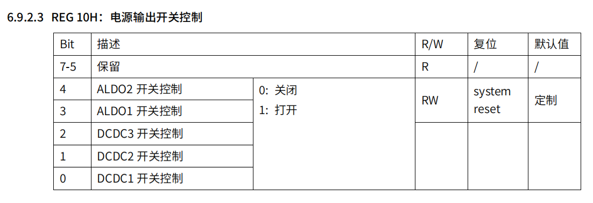

硬件电源树配置如下：

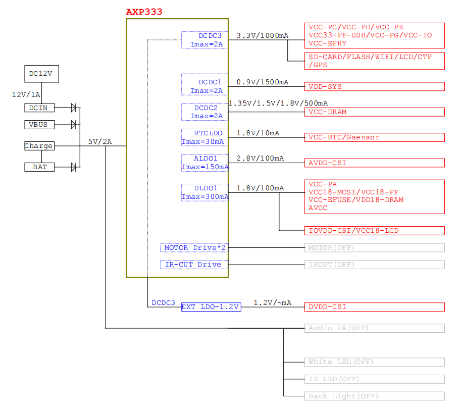

AXP333 的电源和软件的配置关系可以梳理如下：

:::note

:::note

AXP333 电源和软件配置关系

:::

:::

| 软件电源名 | PMU 名称 | PMU 控制位 | PMU 控制位 MASK | 控制电源 | Super Standby 是否下电 |
| --- | --- | --- | --- | --- | --- |
| vdd-sys | DCDC1 | 0 | 0x1 | VDD-SYS | 是 |
| vcc-dram | DCDC2 | 1 | 0x2 | VCC-DRAM | 否 |
| vcc-io | DCDC3 | 2 | 0x4 | VCC-PC/VCC-PD/VCC-PE/VCC-IO/VCC-EPHY | 是 |
| vdd-csi | ALDO1 | 3 | 0x8 | AVDD-CSI | 是 |
| vdd-pa | DLDO1 | 4 | 0x10 | VCC-PA/VCC18-MCSI/VCC18-PF/VCC-EFUSE/VDD18-DRAM/AVCC | 是 |

在 Super Standby 休眠的时候，我们需要对需要下电的那路电源进行下电操作，在这里是 `vdd-sys`，`vcc-dram`，`vcc-io`，`vdd-csi`，`vdd-pa` 这四路电，所以设备树配置为：

```c
vdd-sys = <0x00000001>;
vcc-io = <0x00000004>;
vdd-csi = <0x00000008>;
vcc-pa = <0x00000010>;
```

假设有一个设计，其电源方案因为特殊原因配置如下：

| 软件电源名 | PMU 名称 | PMU 控制位 | PMU 控制位 MASK | 控制电源 | Super Standby 是否下电 |
| --- | --- | --- | --- | --- | --- |
| vdd-sys | DCDC1 | 0 | 0x1 | VDD-SYS | 是 |
| vcc-dram | DCDC2 | 1 | 0x2 | VCC-DRAM | 否 |
| vcc-io | DCDC3 | 2 | 0x4 | VCC-PC/VCC-PD/VCC-PE/VCC-IO/VCC-EPHY | 是 |
| vdd-csi | ALDO1 | 3 | 0x8 | 供 MCU 模块，需要一直供电 | 否 |
| vdd-pa | DLDO1 | 4 | 0x10 | VCC-PA/VCC18-MCSI/VCC18-PF/VCC-EFUSE/VDD18-DRAM/AVCC | 是 |

那么他的设备树配置为

```c
vdd-sys = <0x00000001>;
vcc-io = <0x00000004>;
vdd-csi = <0x00000000>;
vcc-pa = <0x00000010>;
```

只需要把需要一直供电的这一路电源位配置为 0 即可。

**注意事项：**

1.  配置参数前必须确认硬件设计，确保电源控制方案与硬件一致
2.  关闭电源前需确认该电源域上的设备在 Standby 期间不需要工作
3.  PMU通信参数错误会导致 Standby 功能失效，请仔细核对硬件连接
4.  修改配置后需要重新编译设备树并烧录到设备
5.  建议先在开发板上测试验证配置的正确性

##### PMC 搭配分立 DCDC 方案

```c
standby_param: standby_param {
    compatible = "allwinner,sun252iw1-standby-param";
    ext32k = <0x1>;
    /* PMC_EN0 PMC_EN1 PMC_EN2 */
    pmc = <(0x001 | 0x010 | 0x000)>;
    pwrctl_type = "PMC";
    standby_dram_param = <&dram>;
    memory-region = <&standby_param_reserved>;
    status = "okay";
};
```

**参数详细说明：**

| 参数名称 | 类型 | 说明 | 取值范围 |
| --- | --- | --- | --- |
| compatible | string | 设备树兼容性标识 | `"allwinner,sun252iw1-standby-param"` |
| ext32k | int | Standby 模式下 32k 晶振控制 | 0=不开启，1=开启 |
| pwrctl\_type | string | 电源控制芯片类型 | PMC |
| pmc | int | PMC 休眠下电配置 | 详细说明见下文 |
| standby\_dram\_param | phandle | DRAM 参数节点引用 | 指向 `dram` 节点 |
| memory-region | phandle | 保留内存区域引用 | 指向 `standby_param_reserved` 节点 |
| status | string | 节点状态 | `"okay"`\=启用，`"disabled"`\=禁用 |

PMC 方案的配置重点是 `pmc` 参数，用于指定休眠时需要关闭的电源路数。

**PMC 电源配置说明：**

PMC 使用位掩码（bitmask）方式控制各路电源，每位对应一路电源：

| 电源名称 | 位位置 | 掩码值 | 说明 |
| --- | --- | --- | --- |
| PMC\_EN0 | 0 | 0x1 | 第1路电源 |
| PMC\_EN1 | 4 | 0x10 | 第2路电源 |
| PMC\_EN2 | 8 | 0x100 | 第3路电源 |

**配置规则：**

-   对应位设置为 **1**：休眠时该路电源关闭
-   对应位设置为 **0**：休眠时该路电源保持供电

**配置示例：**

| 需求 | 配置值 | 计算方式 |
| --- | --- | --- |
| 仅关闭 PMC\_EN0 | `pmc = <0x1>;` | `0x1` |
| 仅关闭 PMC\_EN1 | `pmc = <0x10>;` | `0x10` |
| 仅关闭 PMC\_EN2 | `pmc = <0x100>;` | `0x100` |
| 关闭 PMC\_EN0 和 PMC\_EN1 | `pmc = <0x11>;` | \`0x1 |
| 关闭 PMC\_EN0、PMC\_EN1、PMC\_EN2 | `pmc = <0x111>;` | \`0x1 |
| 关闭 PMC\_EN1 和 PMC\_EN2 | `pmc = <0x110>;` | \`0x10 |
| 不关闭任何电源 | `pmc = <0x0>;` | `0x0` |

**快速计算方法：**

将需要关闭的电源对应的掩码值相加即可：

-   关闭 PMC\_EN0：`0x1`
-   关闭 PMC\_EN1：`0x10`
-   关闭 PMC\_EN2：`0x100`

例如，关闭 PMC\_EN0 和 PMC\_EN2：`0x1 + 0x100 = 0x101`

也可以不做计算，让 DTS 自行计算值，例如：

-   休眠时需要 PMC\_EN0，PMC\_EN1 下电，PMC\_EN2 不变，则配置为

```
pmc = <(0x001 | 0x010 | 0x000)>;
```

-   休眠时需要 PMC\_EN0，PMC\_EN1，PMC\_EN2 下电，则配置为

```
pmc = <(0x001 | 0x010 | 0x100)>;
```

-   休眠时需要 PMC\_EN1，PMC\_EN2 下电，则配置为

```
pmc = <(0x000 | 0x010 | 0x100)>;
```

##### PL5 电源方案

PL5 电源方案比较简单，没有什么可配置的，电源类型使用 `PL5` 即可

```c
standby_param: standby_param {
    compatible = "allwinner,sun252iw1-standby-param";
    ext32k = <0x1>;
    pwrctl_type = "PL5";
    standby_dram_param = <&dram>;
    memory-region = <&standby_param_reserved>;
    status = "okay";
};
```

**参数详细说明：**

| 参数名称 | 类型 | 说明 | 取值范围 |
| --- | --- | --- | --- |
| compatible | string | 设备树兼容性标识 | `"allwinner,sun252iw1-standby-param"` |
| ext32k | int | Standby 模式下 32k 晶振控制 | 0=不开启，1=开启 |
| pwrctl\_type | string | 电源控制芯片类型 | PL5 |
| standby\_dram\_param | phandle | DRAM 参数节点引用 | 指向 `dram` 节点 |
| memory-region | phandle | 保留内存区域引用 | 指向 `standby_param_reserved` 节点 |
| status | string | 节点状态 | `"okay"`\=启用，`"disabled"`\=禁用 |

### Standby RTOS 驱动配置

V861平台由于启动核心是 E907，所以采用主从核协同的休眠唤醒架构，从核（E907）运行RTOS系统，在休眠唤醒流程中扮演关键角色，因此必须正确配置RTOS驱动。

```
System components  --->
aw components  --->
    [*] PowerManager Support  --->
        [*]   PM Use Baremetal Firmware  --->
            (0x00101000) PM Baremetal firmware START address
            (0x00015000) PM Baremetal firmware LENTH
```

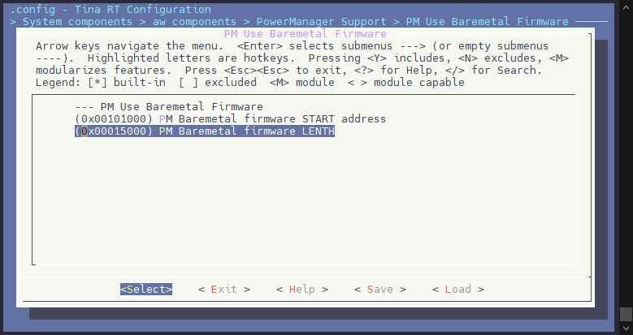

这部分使用这个固定配置即可，包括启动地址和长度。

#### 最小化 RTOS 配置

如果方案上只使用 RTOS 作为休眠唤醒功能，可以裁剪 RTOS 作为最小化休眠唤醒配置。下面是一份裁剪配置清单，可以对比进行操作。RTOS 可以最小裁剪到 256K 内存占用。具体配置功能方式可以咨询 FAE 获取支持。

```diff
-# CONFIG_OPTIMISE_SIZE is not set
-CONFIG_OPTIMISE_SPEED=y
+CONFIG_OPTIMISE_SIZE=y
+# CONFIG_OPTIMISE_SPEED is not set
-CONFIG_TOOLCHAIN_OPTIMISATION="-O2"
-CONFIG_TOOLCHAIN_DEBUG=y
-CONFIG_TOOLCHAIN_DEBUG_FLAGS="-g"
+CONFIG_TOOLCHAIN_OPTIMISATION="-Os"
+# CONFIG_TOOLCHAIN_DEBUG is not set
-CONFIG_BUILD_DISASSEMBLE=y
-# CONFIG_BUILD_DISASSEMBLE_SOURCE is not set
+# CONFIG_BUILD_DISASSEMBLE is not set
-CONFIG_ARCH_MEM_LENGTH=0x200000
+CONFIG_ARCH_MEM_LENGTH=0x40000
-CONFIG_PANIC_CLI=y
-CONFIG_PANIC_CLI_PWD=y
-CONFIG_IMG_VERSION_MESSAGE=y
+# CONFIG_PANIC_CLI is not set
+# CONFIG_DISABLE_ALL_UART_LOG is not set
+# CONFIG_IMG_VERSION_MESSAGE is not set
-CONFIG_ARCH_RISCV_FPU=y
-CONFIG_SAVE_RISCV_FPU_CONTEXT_IN_TCB=y
-# CONFIG_RECORD_RISCV_FPU_CTX_STATISTICS is not set
+# CONFIG_ARCH_RISCV_FPU is not set
-CONFIG_DRAM=y
-CONFIG_VIRTUAL_DRAM_ADDR=0x82000000
-CONFIG_DRAM_SIZE=0x80000
+# CONFIG_DRAM is not set
-# CONFIG_CLI_UART_PORT_LOCK is not set
-CONFIG_DRIVERS_WATCHDOG=y
-# CONFIG_HAL_TEST_WATCHDOG is not set
-# CONFIG_ENABLE_WDG_IRQ is not set
+# CONFIG_DRIVERS_WATCHDOG is not set
-CONFIG_DRIVERS_GPIO_RECORD_USAGE=y
+# CONFIG_DRIVERS_GPIO_RECORD_USAGE is not set
-CONFIG_DRIVERS_PRCM=y
-# CONFIG_HAL_TEST_PRCM is not set
+# CONFIG_DRIVERS_PRCM is not set
-CONFIG_DRIVERS_HWSPINLOCK=y
-# CONFIG_HAL_TEST_HWSPINLOCK is not set
-CONFIG_HWSPINLOCK_CLK_INIT_IN_OTHER_CORE=y
+# CONFIG_DRIVERS_HWSPINLOCK is not set
-CONFIG_HAL_TEST_MSGBOX=y
+# CONFIG_HAL_TEST_MSGBOX is not set
-CONFIG_COMPONENTS_AMP_APP=y
-CONFIG_COMPONENTS_AMP_HW_WATCHDOG=y
-CONFIG_AMP_HW_WATCHDOG_TIMEOUT=3
-CONFIG_AMP_HW_WATCHDOG_FEED_INTERVAL=100
-CONFIG_AMP_HW_WATCHDOG_THREAD_PRIORITY=31
-# CONFIG_COMPONENTS_AMP_USER_MEMORY is not set
-# CONFIG_COMPONENTS_AMP_USER_RESOURCE is not set
-CONFIG_COMPONENTS_AMP_TIMESTAMP=y
-CONFIG_AMP_TS_DEV_0=y
-CONFIG_AMP_TS_DEV_0_COUNTER_REG_ADDR=0x0800A000
-CONFIG_AMP_TS_DEV_0_COUNT_FREQ=24000000
-# CONFIG_AMP_TS_ARM_ARCH_COUNTER_TYPE is not set
-CONFIG_AMP_TS_THEAD_ARCH_COUNTER_TYPE=y
+# CONFIG_COMPONENTS_AMP_APP is not set
-CONFIG_COMPONENTS_RPBUF=y
-CONFIG_COMPONENTS_RPBUF_SERVICE_RPMSG=y
-CONFIG_COMPONENTS_RPBUF_CONTROLLER=y
-# CONFIG_AW_RPBUF_PERF_TRACE is not set
-# CONFIG_COMPONENTS_RPBUF_DEMO is not set
+# CONFIG_COMPONENTS_RPBUF_SERVICE_RPMSG is not set
+# CONFIG_COMPONENTS_RPBUF_CONTROLLER is not set
-CONFIG_RPMSG_MULTI_CONSOLE=y
-CONFIG_RPMSG_CONSOLE_CACHE=y
-CONFIG_COMPONENTS_AACTD=y
+# CONFIG_COMPONENTS_AACTD is not set
-CONFIG_COMMAND_FORK=y
+# CONFIG_COMMAND_FORK is not set
-# CONFIG_COMMAND_UPGRADE is not set
-CONFIG_COMMAND_PANIC=y
+# CONFIG_COMMAND_PANIC is not set
-CONFIG_COMPONENTS_MD5=y
+# CONFIG_COMPONENTS_MD5 is not set
-CONFIG_COMPONENTS_LIBMETAL=y
-CONFIG_COMPONENTS_OPENAMP=y
-CONFIG_AMP_SLAVE_MODE=y
-CONFIG_MBOX_CHANNEL=0
-CONFIG_MBOX_QUEUE_LENGTH=16
-# CONFIG_RPMSG_DEMO is not set
-CONFIG_RPMSG_NOTIFY=y
-# CONFIG_RPMSG_SPEEDTEST is not set
-# CONFIG_RPMSG_TEST is not set
-CONFIG_RPMSG_CLIENT=y
-# CONFIG_RPMSG_CLIENT_TEST is not set
-CONFIG_RPMSG_CLIENT_QUEUE_SIZE=16
-CONFIG_RPMSG_CLIENT_DEBUG=y
-# CONFIG_RPMSG_HEARBEAT is not set
-CONFIG_SLAVE_EARLY_BOOT=y
-CONFIG_AMP_TRACE_SUPPORT=y
-CONFIG_AMP_TRACE_BUF_SIZE=0x8000
-# CONFIG_MULTI_OPENAMP_SUPPORT is not set
-CONFIG_AMP_SHARE_IRQ=y
-CONFIG_AMP_MISC_RSC=y
-# CONFIG_AW_RPMSG_PERF_TRACE is not set
+# CONFIG_COMPONENTS_LIBMETAL is not set
-CONFIG_COMPONENT_RTT_MEMHEAP=y
-# CONFIG_RTT_MEMHEAP_USE_MUTEX_LOCK is not set
-CONFIG_RTT_MEMHEAP_USE_SCHEDULER_LOCK=y
+# CONFIG_COMPONENT_RTT_MEMHEAP is not set
+# CONFIG_PROJECT_V861_E907_QFN128_QA is not set
```

### 唤醒源配置

大部分唤醒源通过在设备树节点中添加 `wakeup-source` 属性即可启用。

#### RTC

```c
rtc: rtc@07000000 {
    compatible = "allwinner,sunxi-rtc";
    device_type = "rtc";
    wakeup-source;
};
```

#### WLAN

```c
wlan {
    compatible    = "allwinner,sunxi-wlan";
    wlan_busnum   = <0x1>;
    wlan_regon    = <&pio PE 9 GPIO_ACTIVE_HIGH>;
    wlan_hostwake = <&pio PG 7 GPIO_ACTIVE_HIGH>;
    status        = "okay";
    wakeup-source;
};
```

#### BT

```c
&btlpm {
    compatible = "allwinner,sunxi-btlpm";
    uart_index = <0x2>;
    bt_wake = <&pio PE 7 GPIO_ACTIVE_HIGH>;
    bt_hostwake = <&pio PE 6 GPIO_ACTIVE_HIGH>;
    status = "okay";
    wakeup-source;
};
```

#### WAKEUP TIMER

Wakeup Timer 是 RTOS 端驱动，默认开启。Linux 端需配置：

```
CONFIG_AW_STANDBY_PM_MSGBOX_AOV_TIMER_OPS=y
```

#### WAKEUP IO

设备树配置唤醒按键，这里以 PL3 作为示例，PL3 可作为普通按键和 WUPIO。在系统正常启动使用的时候，是作为普通按键，当系统进入休眠自动注册为 WUPIO。

:::danger

:::note

危险

:::
:::note

当使用 PMC 功能时，Super Standby 和 Hibernation **不支持** PL0~6 使用 Wakeup IO 功能唤醒，只可以使用 PL5 NMI 功能唤醒、 POWER-ON 唤醒和 PWR-STARUP 唤醒。

当不使用 PMC 功能时，可以使用PL0~6 使用 Wakeup IO 功能唤醒。

:::

:::

board.dts

```c
#include <dt-bindings/input/linux-event-codes.h> // 导入 linux,code = <KEY_POWER>; 的定义

&soc {
	gpio-keys {
		compatible = "gpio-keys";
		status = "okay";
		power {
			label = "Power";
			gpios = <&rtc_pio PL 3 GPIO_ACTIVE_HIGH>;
			linux,code = <KEY_POWER>;
			debounce-interval = <30>;
			status = "okay";
		};
	};
};

&wakeup_io {
    reg = <0x0 0X07090250 0x0 0X1000>;
	status = "okay";
	wakeup_pins {
		wakeup_pin1:wakeup-pin@1 {
			gpio_info = <&rtc_pio PL 3 GPIO_ACTIVE_HIGH>;
			edge_mode = "positive";
			clk_src = <0>;
			debounce_us = <2000000>;
			share-io;  // 共享 IO
            wakeup-source;
			status = "okay";
		};
	};
};
```

如果该 WUPIO 是专用的，例如外挂 WIFI 的唤醒源，则不需要配置共用功能。配置如下（这里以 PL4 为例）：

```c
&wakeup_io {
    reg = <0x0 0X07090250 0x0 0X1000>;
	status = "okay";
	wakeup_pins {
		wakeup_pin1:wakeup-pin@1 {
			gpio_info = <&rtc_pio PL 4 GPIO_ACTIVE_HIGH>;
			edge_mode = "positive";
			clk_src = <0>;
			debounce_us = <2000000>;
            wakeup-source;
			status = "okay";
		};
	};
};
```

如果既有专用 IO，也有共用IO，则配置如下：

```c
#include <dt-bindings/input/linux-event-codes.h> // 导入 linux,code = <KEY_POWER>; 的定义

&soc {
	gpio-keys {
		compatible = "gpio-keys";
		status = "okay";
		power {
			label = "Power";
			gpios = <&rtc_pio PL 7 GPIO_ACTIVE_HIGH>;
			linux,code = <KEY_POWER>;
			debounce-interval = <30>;
			status = "okay";
		};
	};
};

&wakeup_io {
	status = "okay";
    reg = <0x0 0X07090250 0x0 0X1000>;
	wakeup_pins {
		wakeup_pin1:wakeup-pin@1 {
			gpio_info = <&rtc_pio PL 3 GPIO_ACTIVE_HIGH>;
			edge_mode = "positive";
			clk_src = <0>;
			debounce_us = <2000000>;
			share-io; // 共享 IO
            wakeup-source;
			status = "okay";
		};
		
		wakeup_pin2:wakeup-pin@2 {
			gpio_info = <&rtc_pio PL 4 GPIO_ACTIVE_HIGH>;
			edge_mode = "positive";
			clk_src = <0>;
			debounce_us = <2000000>;
            wakeup-source;
			status = "okay";
		};
	};
};
```

#### PMU

```c
pmu0: pmu@36 {
    compatible = "x-powers,axp333";
    reg = <0x36>;
    status = "okay";
    wakeup-source;
};
```

#### PMC

```c
pmc: pmc@7090208 {
    compatible = "x-powers,pmc-v101";
    reg = <0x0 0x7090208 0x0 0x32>;
    status = "okay";
    wakeup-source;
};
```

## 休眠唤醒相关节点

### pm\_msgbox 相关节点

`pm_msgbox` 节点用于主核和从核之间的通信，支持设置唤醒时间、切换 Standby 模式等。

#### set\_wuptimer\_ms

设置休眠后的唤醒时间（单位：毫秒）。

:::note

:::note

操作说明

:::

:::

| 操作 | 命令 |
| --- | --- |
| 设置唤醒时间为 500ms | `echo 500 > /sys/class/pm_msgbox/set_wuptimer_ms` |
| 查看当前唤醒时间 | `cat /sys/class/pm_msgbox/set_wuptimer_ms` |

#### set\_super\_standby

切换 Standby 模式（Normal Standby 或 Super Standby）。

:::note

:::note

模式说明

:::

:::

| 模式 | 命令 |
| --- | --- |
| Normal Standby | `echo 0 > /sys/class/pm_msgbox/set_super_standby` |
| Super Standby | `echo 1 > /sys/class/pm_msgbox/set_super_standby` |

### 内核 pm 节点

#### state

**路径**：`/sys/power/state`

Linux 标准节点，用于配置系统休眠状态。

:::note

:::note

状态说明

:::

:::

| 状态 | 说明 |
| --- | --- |
| freeze | Linux 系统自身休眠状态，与平台无耦合，仅冻结任务后进入 cpuidle |
| mem | Standby 模式 |

**使用示例：**

```shell
## 强制进入休眠
root@TinaLinux:/# echo mem > /sys/power/state
```

:::warning

:::note

注意

:::
:::note

直接使用 `echo mem > /sys/power/state` 强制休眠会跳过 `wakeup_count` 检测，可能导致同步问题（如 WiFi 唤醒中断无法终止休眠流程）。

:::

:::

#### pm\_wakeup\_irq

**路径**：`/sys/power/pm_wakeup_irq`

Linux 标准节点，只读。用于查看上一次唤醒系统的中断号。

```shell
## 查看唤醒中断号
root@TinaLinux:/# cat /sys/power/pm_wakeup_irq
```

#### pm\_test

**路径**：`/sys/power/pm_test`

Linux 标准节点，用于休眠唤醒调试。休眠流程执行到指定调试点时会等待 5 秒后返回。

:::note

:::note

支持的调试点

:::

:::

| 调试点 | 说明 |
| --- | --- |
| none | 完整休眠流程，需触发唤醒源唤醒 |
| core | 冻结系统服务后等待 5 秒返回 |
| processors | 关闭非引导 CPU 后等待 5 秒返回 |
| platform | 执行设备 suspend\_late、suspend\_noirq 后等待 5 秒返回 |
| devices | 执行设备 prepare、suspend 后等待 5 秒返回 |
| freezer | 任务冻结后等待 5 秒返回 |

**使用示例：**

```shell
## 查看支持的调试点
root@TinaLinux:/# cat /sys/power/pm_test
[none] core processors platform devices freezer

## 设置调试点为 core
root@TinaLinux:/# echo core > /sys/power/pm_test
```

## 常见问题与解决方案（FAQ）

### 休眠时卡死，从核(E907)无法切换到baremetal

通过RTC状态码定位到休眠时从核无法切换到baremetal，导致后续流程卡死。以下是几种常见的原因及解决方案：

#### SRAM执行权限问题

从核在休眠时切换到baremetal时，其运行在SRAM上。如果开启了PMP（Physical Memory Protection，物理内存保护），且SRAM的访问权限未设置为可执行，则会导致从核无权限访问SRAM，从而使后续流程卡死。

**解决方案**：

-   **方法一**：在PMP初始化中添加SRAM区域的可执行权限
    -   源码位置：`rtos/lichee/rtos/arch/risc-v/sun252iw1/sun252i.c`
    -   操作步骤：在`pmp_init`函数中为SRAM区域添加可执行权限
    -   参考图示：

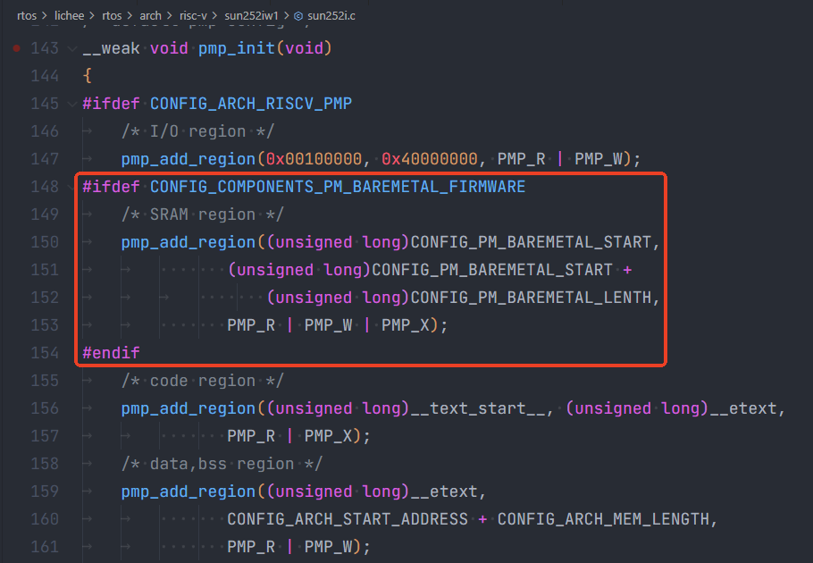

-   **方法二**：直接关闭PMP
    -   操作步骤：通过mrtos menuconfig关闭`CONFIG_ARCH_RISCV_PMP`
    -   参考图示：

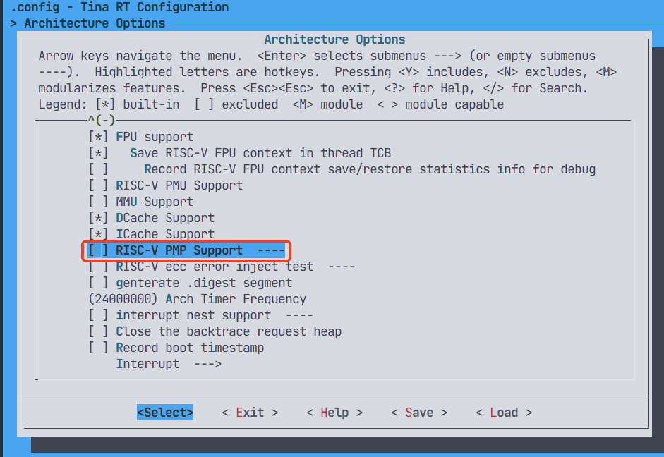

#### SRAM模式切换问题

V861上的SRAM与VE RAM共用，分为boot mode和normal mode两种模式，默认情况下为boot mode。其中：

-   **boot mode**：用于从核访问
-   **normal mode**：仅用于VE访问

在执行AOV或视频播放等需要用到VE的场景后，VE会将SRAM切换到normal mode。若未及时将SRAM mode切换回boot mode，则会导致从核无法访问SRAM，从而使后续流程卡死。

**解决方案**：在执行完AOV或视频播放等需要用到VE的场景后，立即将SRAM mode切换回boot mode。

**SRAM模式控制寄存器**：

| 寄存器地址 | boot mode | normal mode |
| --- | --- | --- |
| 0x03000004 | bit24置1 | bit24置0 |

#### barehead内容不同步问题

barehead是RTOS和baremetal之间的共享数据结构和通信桥梁，包含了内存布局等关键信息。

**定义位置**：

-   RTOS端：`rtos/lichee/rtos-components/aw/pm/plat_sun252iw1p1/include/pm_standby_param.h`
-   baremetal端：`baremetal/lichee/baremetal-components/aw/pm/plat_sun252iw1p1/include/pm_standby_param.h`

**问题原因**：如果在RTOS或baremetal中修改了barehead内容但未同步到另一方，可能会导致内存布局错误。RTOS根据自己的barehead结构体定义计算`text_offset`、`data_offset`等参数，若修改未同步，会导致baremetal固件的代码段、数据段、BSS段位置错误，在执行时访问错误的内存地址，从而导致崩溃或无法启动。

**解决方案**：在RTOS或baremetal任意一方修改了barehead内容后，必须同步改动到另一方，确保两边的定义完全一致。
