# 存储优化开发指南

## 前 言

### 概述

V系列大多使用8M的spinor FLASH总是遇到固件太大，容量不够情况。本文档提供裁优化剪各个分区的的方法，降低个分区生成的文件大小，从而达到固件能放到8M flash的目的。

### 读者对象

本文档（本指南）主要适用于以下人员：

-   系统工程师
    
-   软件开发工程师
    

### 适用范围

:::note

:::note

适用产品列表

:::

:::

| 产品名称 | 内核版本 |
| --- | --- |
| V821 | Linux-5.4 |
| V861/V838/V881 | Linux-6.6 |

### 文档约定

#### 标志说明

:::warning

:::note

注意

:::
:::note

-   提醒操作中应注意的事项。不当的操作可能会损坏器件，影响可靠性、降低性能等。

:::

:::
:::note

:::note

备注

:::
:::note

为准确理解文中指令、正确实施操作而提供的补充或强调信息。

:::

:::
:::note

:::note

备注

:::
:::note

一些容易忽视的小功能、技巧。了解这些功能或技巧能帮助解决特定问题或者节省操作时间。

:::

:::

#### V系列芯片代号

以下芯片代号可能存在代码或者文档中，下面对应表格将说明它特制哪一款芯片。后续文档介绍会以`{芯片代码}`或者直接写`sun252iw1p1`来展示SDK中的一些文件路径和名字,请根据目前手头研发方案来进行识别。

| 芯片代号 | 芯片名称 |
| --- | --- |
| sun300iw1p1 | V821 |
| sun252iw1p1 | V881/V838/V861 |

#### 不同介质不同配置文件

SDK支持不同介质的配置，在确定方案使用的介质情况，需要改对相关的配置文件才能生效。

以下列举一些Nor Flash和非Nor Flash不同的配置文件 ，请修改的时候根据自身方案介质来确定的文件。

包括不限于

| Nor Flash | 非Nor Flash |
| --- | --- |
| sys\_partition\_nor.fex | sys\_partition.fex |
| BoardConfig\_nor.mk | BoardConfig.mk |
| sun300iw1p1\_min\_nor\_defconfig | sun300iw1p1\_min\_defconfig |

### 相关术语介绍

-   SPINOR：一种使用SPI接口通讯的存储介质，支持叫小的容量。
-   boot0 : 芯片启动的第一个软件程序，用于引导uboot启动， 同时也指boot0分区的镜像文件。
-   opensbi:是rv芯片启动必须的。
-   uboot: 芯片启动的第二阶段程序，一般用于引导kernel启动， 同时也指uboot分区的镜像文件。
-   kernel : Linux内核程序，它会挂载rootfs分区， 同时也指boot分区的镜像文件。
-   rootfs : 文件系统，同时也指rootfs分区的镜像。
-   LZMA(Lempel-Ziv-Markov chain algorithm): 压缩算法，压缩率一般较高，但解压速度较慢。
-   GZIP（GNU zip）: 压缩算法，常用的数据压缩格式之一，压缩率较高，通常比较均衡地考虑了压缩速度和压缩率。
-   LZ4:压缩算法，压缩率较低，但解压速度很快，适用于需要快速处理的场景。
-   LZO(Lempel-Ziv-Oberhumer algorithm):压缩算法，速度很快，但压缩率一般比较低。
-   bzip2:bzip2，它的压缩率通常比较高，但压缩速度较慢。

## 存储分区布局介绍

### SPINOR存储分区布局

了解SPINOR FLASH 存储布局，可以得知有哪些文件镜像存放在flash哪个分区上。我们可以通过调整分区大小来减小FLASH容量使用。但分区大小又被分区烧录的镜像文件限制着，分区镜像可以通过配置SDK相关选项来裁剪优化。

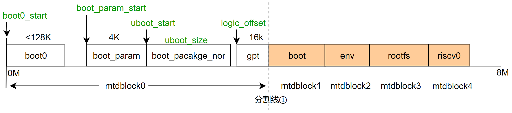

-   如果从spinor 0~8M裸数据看，则数据的布局就是这样的；
    
-   如果从linux 系统上看，则可以看到mtdblock0,1,2,3...分区里面包含了什么类型数据；
    

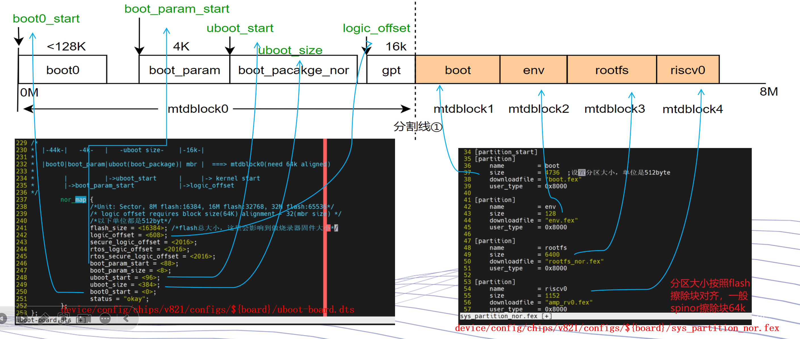

-   如果从配置文件角度上看，以-分割线①-分开来看，可以分两个区域：
    
    1.  分割线①左边（白色方格）：是boot0/uboot启动分区； 它的区域划分由uboot-board.dts和boot0源码管理； 从用户层看它是/dev/mtdblock0分区。
    2.  分割线①右边（橙色方格）：是用户定义的分区；它的区域划分由sys\_partition\_nor.fex管理；如boot分区放内核镜像，env分区放env镜像；从用户层看，他们是/dev/mtdblock1、/dev/mtdblock2...
    3.  可以通过配置文件修改他们分区起始地址和分配的大小；

上图里面的分区文件，可以对应从编译后的SDK这里查看（文件和分区名对应关系可查看sys\_partition\_nor.fex）：

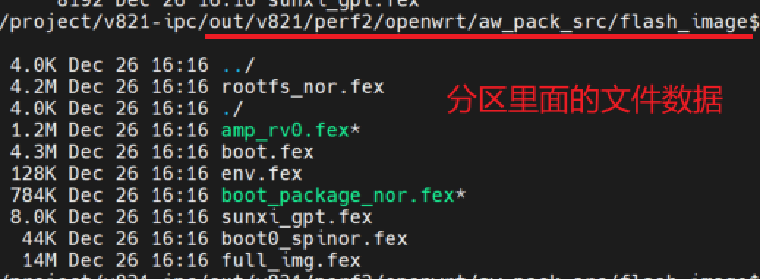

:::note

:::note

备注

:::
:::note

aw\_pack\_src文件夹生成，需要修改BoardConfig\_nor.mk文件中添加：LICHEE\_INDEPENDENT\_PACK:=y。然后重新source && lunch SDK最后打包可生成；

:::

:::

## 分区文件系统选择

V系列方案分区中，有些使用的是裸分区，不需要制作文件系统，比如：

```
boot0
uboot_package_nor
boot
env
riscv0
...
```

以下是对V系列可能使用到的分区文件系统进行解释，如下表：

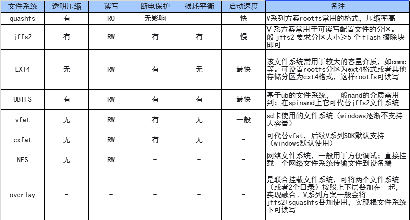

建议这些分区使用以下的文件系统：

| 分区 | 建议设置文件系统 |
| --- | --- |
| rootfs | squashfs |
| data | jffs2 |
| boot-resource | vfat |

V系列中相关文件系统如何配置，请看**分区裁剪优化**章节。

## 分区裁剪优化


我们以spinor布局来分析。 如果我们需要在在8M flash放入我们的方案。既:

mtdblock0 + mtdblock1 + mtdblock2 + mtdblock3 + mtdblock4 + ... &lt;= 8M

mtdblock0 空间划分大小，我们可以通过`uboot-board.dts`来设定； mtdblock1/2/3等空间划分大小，我们可以通过`sys_partition_nor.fex`来设定；

每个分区里面要写入分区数据/镜像，我们需要优化的就是编译出来后的分区镜像变小，但分区占用Flash容量是取决于分区镜像的大小，分区镜像小可以把分区划分的小一点。

### boot0 镜像裁剪方法

boot0源码目录：

```
brandy/brandy-2.0/spl
```

boot0 功能配置目录和文件：

```
brandy/brandy-2.0/spl/board/{芯片代号}/spinor.mk #spinor方案配置文件
brandy/brandy-2.0/spl/board/{芯片代号}/mmc.mk
brandy/brandy-2.0/spl/board/{芯片代号}/nand.mk
```

:::note

:::note

备注

:::
:::note

\{芯片代号\}， 请查看文档约定章节。

:::

:::

boot0 编译的时候，就会默认编译3种介质的boot0，并且拷贝到：

```
device/config/chips/v821/bin  或者 device/config/chips/v821/configs/ipc/bin（优先级更高）
```

boot0如下镜像文件：

```
56K Jan 23 18:30 boot0_nand_sun300iw1p1.bin      #nand 介质boot0
56K Jan 23 18:30 boot0_sdcard_sun300iw1p1.bin    #emmc 介质boot0
44K Jan 23 18:30 boot0_spinor_sun300iw1p1.bin    #spinor 介质boot0
15K Jan 23 18:30 fes1_sun300iw1p1.bin            #usb烧录使用的boot0
```

如果是spinor常电方案，我们只要改spinor.mk裁剪里面功能就能缩小其体积。

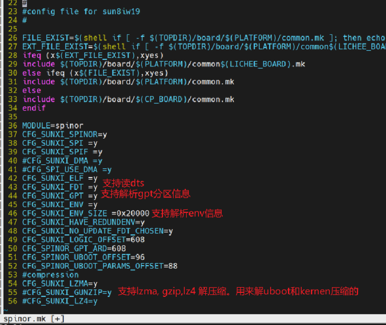

使用“#” 写在开头来注释相关功能，注意一些功能可能有耦合关系，需要一起注释；

**V821 spl配置文件**

如何新增自己的`配置文件`并编译和使用？ 在

```
brandy/brandy-2.0/spl/board/sun300iw1p1/common.mk
```

中加入

```
BOARD_BUILD_NBOOT=spinorfastboot mmcfastboot
```

并新增以下配置文件（文件从spinor.mk拷贝一份）

```
brandy/brandy-2.0/spl/board/sun300iw1p1/spinorfastboot.mk
brandy/brandy-2.0/spl/board/sun300iw1p1/mmcfastboot.mk
```

同时板级配置中：

```
device/config/chips/v821/configs/{board}/BoardConfig_nor.mk
```

加入：

```
LICHEE_BOOT0_BIN_NAME:=spinorfastboot
```

编译出来的固件就会用自己的boot0 （快启fastboot 就是这样配置的）

**V861/V838/V881 spl配置文件**

V861采用了新方法，一个版级完整的编译化配置通过common.mk + 启动方式—存储介质.mk + 定制化.mk来组成。

在`BoardConfig_nor.mk`中添加`LICHEE_SPL_CUSTOM_MK:=$(存储介质flag)-$(定制化)`。如果不存在这个变量，则说明按照默认规则`common.mk + 启动方式—存储介质.mk`

可在LICHEE\_SPL\_BOARD\_MK添加多份配置文件。

```
LICHEE_SPL_BOARD_MK:=\"spinor-cfg_nor_fastboot all-cfg_disable_pmu fes-cfg_disable_pmu\"
```

V861配置文件存放位置以及介绍：

```
brandy/brandy-2.0/spl/board/sun252iw1p1

存储介质mk                存储介质flag
nand.mk                  nand
mmc.mk                   mmc
spinor.mk                spinor
ufs.mk                   ufs
sboot_nand.mk            sboot_nand
sboot_mmc.mk             sboot_mmc
sboot_nor.mk             sboot_nor
sboot_ufs.mk             sboot_ufs
所有                      all

烧写mk
fes
```

:::note

:::note

备注

:::
:::note

使用这个方法反推，可以知道目前这个板级使用哪个boot0的配置文件。

:::

:::

改完后编译方法：

1.  直接编译boot0

```
mboot0
```

1.  编译整个SDK

```
m -j8
```

查看编译出来的大小，boot0名字与mk文件有关联性：

```
44K device/config/chips/v821/configs/{board}/bin/boot0_spinor_sun300iw1p1.bin
```

### boot\_package\_nor.fex 镜像优化裁剪方法

boot\_package\_nor.fex 是一个多文件包裹。他里面包含的文件由文件指定：

```
device/config/chips/v821/configs/ipc/boot_package_nor.cfg
```

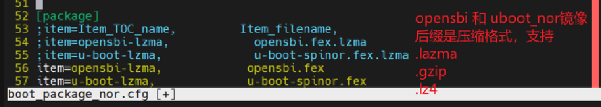

(图中;表示注释功能)

从boot\_package\_nor.cfg看，boot\_package\_nor.fex里面打包这opensbi镜像和uboot镜像。

```
1. opensbi 是rv芯片启动必须的，这个bin文件是闭源的,所以无法进行裁剪；
2. u-boot 是SDK中源码编译出来的镜像，可支持裁剪。也可以直接省略掉，让boot0直接启动内核。
```

**boot\_package\_nor.fex打包压缩格式**

选择适当的压缩格式，可以极大减少boot\_package\_nor包的大小。 但同时会增加启动时间。

| 压缩格式 | boot\_package大小 | 启动耗时增加 |
| --- | --- | --- |
| none | 409600 | 0 |
| lzma | 212992 | +79ms |
| gzip | 229376 | \-36ms |
| lz4 | 294912 | \-22ms |

通过配置boot\_package\_nor.cfg 来选择压缩格式的镜像，如：

```
uboot/opensbi等开启压缩修改 device/config/chips/${LICHEE_IC}/configs/${LICHEE_BOARD}/boot_package_nor.cfg(nor方案)
#lzma压缩
[package]
;item=Item_TOC_name, Item_filename,
item=opensbi‑lzma, opensbi.fex.lzma
item=u‑boot‑lzma, u‑boot‑spinor.fex.lzma

#lz4压缩
[package]
;item=Item_TOC_name, Item_filename,
item=opensbi‑lz4, opensbi.fex.lz4
item=u‑boot‑lz4, u‑boot‑spinor.fex.lz4

#gzip压缩
[package]
;item=Item_TOC_name, Item_filename,
item=opensbi‑gz, opensbi.fex.gz
item=u‑boot‑gz, u‑boot‑spinor.fex.gz
```

如果上面压缩开启，则boot0需要开启解压缩功能:

```
brandy/brandy‑2.0/spl/board/sun300iw1p1/spinor.mk #(正常的nor方案)
#compression
CFG_SUNXI_LZMA=y   #打开lzma解压缩功能
CFG_SUNXI_GUNZIP=y #打开gzip解压缩功能
CFG_SUNXI_LZ4=y    #打开lz4解压缩功能
```

如果想省掉uboot镜像，直接让boot0启动内核。

```
1. boot_package_nor.cfg 不要包含uboot以节省flash空间；
2. boot0的配置文件参考spinorfastboot.mk
```

#### uboot 镜像裁剪方法

boot\_package\_nor.fex 里面的uboot可以单独编译优化。

uboot源码目录：

**V821**

```
brandy/brandy-2.0/u-boot-2018
```

**V861**

```
#uboot2023开源版本
brandy/brandy-2.0/u-boot-2023

#全志模块功能代码都单独放这里
brandy/brandy-2.0/u-boot-bsp
```

uboot配置文件： 板级方案制定的uboot使用的配置文件：

```
device/config/chips/v821/configs/ipc/BoardConfig_nor.mk
```

中的配置：

```
LICHEE_BRANDY_DEFCONF:=sun300iw1p1_min_defconfig
```

上面配置指明会使用（nor方案）：

```
brandy/brandy-2.0/u-boot-2018/configs/sun300iw1p1_min_defconfig
brandy/brandy-2.0/u-boot-2018/configs/sun300iw1p1_min_nor_defconfig
如果不存在指明的配置文件，则会使用默认
brandy/brandy-2.0/u-boot-2018/configs/sun300iw1p1_v821_defconfig
brandy/brandy-2.0/u-boot-2018/configs/sun300iw1p1_v821_nor_defconfig
```

V861的uboot配置文件则存在以下目录：

```
brandy-2.0/u-boot-bsp/configs
```

在源码仓库编译后，我们可以利用编译生成的中间件.o文件，来查看有那些文件编译进去，占用多大。 boot0编译后，在brandy/brandy-2.0/spl 输入如下指令，对编译的.o文件从大到小排列：

```
find . -name "*.o" -exec ls -lS {} +

-rw-rw-r-- 1 user user 3802680 Oct 14 15:18 ./lib/built-in.o
-rw-rw-r-- 1 user user 3446208 Oct 14 15:18 ./fs/built-in.o
-rw-rw-r-- 1 user user 3135804 Oct 14 15:18 ./fs/ubifs/built-in.o
-rw-rw-r-- 1 user user 2811612 Oct 14 15:18 ./drivers/built-in.o
-rw-rw-r-- 1 user user 1996280 Oct 14 15:18 ./drivers/mmc/built-in.o
-rw-rw-r-- 1 user user 1894508 Oct 14 15:18 ./cmd/built-in.o
-rw-rw-r-- 1 user user 1746728 Oct 14 15:18 ./drivers/mtd/built-in.o
-rw-rw-r-- 1 user user 1707136 Oct 14 15:18 ./common/built-in.o
...
```

:::note

:::note

备注

:::
:::note

V861/V838/V881 平台关于uboot有两个目录，需要在两个目录上都检索 find . -name "\*.o" -exec ls -lS \{\} +

:::

:::

可以针对上面文件夹/文件名字来判断是什么功能，是否是自己方案需要的。

主要有下面两种裁剪思路：

-   修改uboot配置文件，删减不需要的配置。uboot配置文件通常位于源码下`include/configs/${CHIP}.h`或者`configs/${CHIP}_*_defconfig`。
    
-   删除不需要的uboot命令。
    

改完后编译方法：

1.  直接编译uboot

```
muboot
```

2.  编译整个SDK

```
m -j8
```

查看编译出来的大小 Tian5.0 编译后会存到以下目录：

```
device/config/chips/${LICHEE_IC}/bin
或者
device/config/chips/${LICHEE_IC}/configs/${LICHEE_BOARD}/bin #存在这目录，优先级更高

307798 u-boot-spinor-sun300iw1p1.bin
659270 u-boot-sun300iw1p1.bin
```

### 内核镜像裁剪优化

内核镜像启用压缩,启用压缩缩减大小，V821 RV方案内核不提供自解压模式,需要uboot来帮忙解压。开启压缩可以使用SDK中 quick\_config来配置：

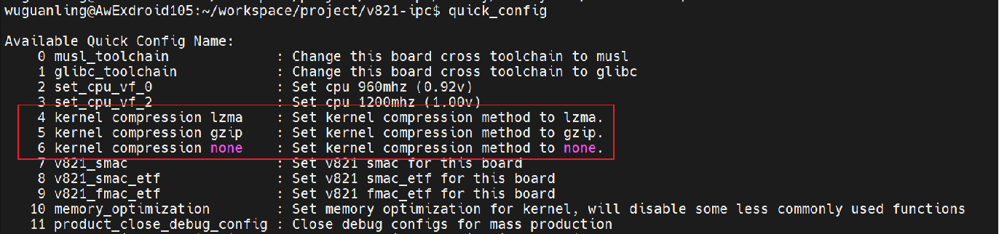

也可以改以下配置文件：

```
device/config/chips/${LICHEE_IC}/configs/default/BoardConfig.mk  #非spinor方案
device/config/chips/${LICHEE_IC}/configs/default/BoardConfig_nor.mk #spinor方案
或者(下面优先级更高)
device/config/chips/${LICHEE_IC}/configs/${LICHEE_BOARD}/BoardConfig.mk     #非spinor方案
device/config/chips/${LICHEE_IC}/configs/${LICHEE_BOARD}/BoardConfig_nor.mk #spinor方案

LICHEE_COMPRESS:=gzip   #开启gzip压缩
LICHEE_COMPRESS:=lzma   #开启lzma压缩
LICHEE_COMPRESS:=lz4    #开启lz4压缩
LICHEE_COMPRESS:=lzo    #开启lzo压缩
LICHEE_COMPRESS:=bzip2  #开启bzip2压缩
LICHEE_COMPRESS:=       #不开启压缩
```

:::note

:::note

备注

:::
:::note

修改BoardConfig\_nor.mk文件，需要重新source SDK 才能生效。

:::

:::

同一个kernel镜像使用不同的压缩方式，镜像大小如下表所示：

| 压缩方式 | 镜像大小 | 加载内核时间（从falsh加载到dram的时间） | 解压时间 | 总时间 |
| --- | --- | --- | --- | --- |
| GZIP | 2.31M | 124ms | 89ms | 213ms |
| LZO | 2.53M | 136ms | 23ms | 159ms |
| LZ4 | 2.68M | 143ms | 27ms | 170ms |
| XZ | 1.95M | 104ms | 667ms | 771ms |

:::note

:::note

备注

:::
:::note

kernel解压是由uboot做的,uboot需要开启相关解压功能（默认开启）

:::

:::

**裁剪内核大小**

kernel源码目录：

```
bsp/  #全志相关的驱动
kernel/linux-5.4-ansc/   #V821内核主代码
kernel/linux-6.6-xuantie/ #V861/V838/V881内核主代码
```

以上两个目录，会在内核编译的时候合并一起编译。

V系列也提供了内核优化快捷方式，使用quick\_config命令来配置。

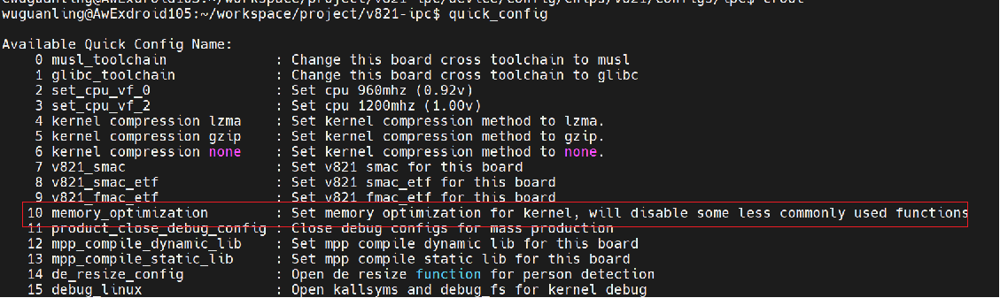

memory\_optimization 配置主要去掉无用的模块，减小内核大小，同时也减小内核内存占用的大小。

:::note

:::note

备注

:::
:::note

quick\_config选择后，一定要审核它改了那些东西。

:::

:::

查看内核每个模块大小，从而去针对性关闭某些模块或者优化内核代码。将编译所有.o文件遍历一边，并且从小到大排列，就清楚目前存在哪些模块会被编译进去。

```
cd out/kernel/build
find ./* -name "*.o" | xargs size  -t  | sort -k 4 -n
```

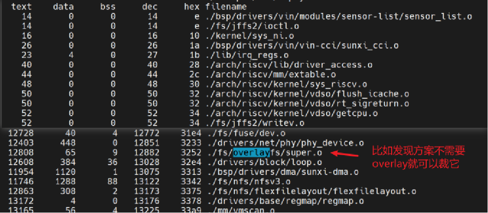

需要了解目标文件中： text 段 、data 段 、bss 段 含义和dec十进制大小。

关掉模块可以通过make kernel\_menuconfig 来可视化开关模块；

也可直接改内核的配置文件：

```
device/config/chips/v821/configs/${board}/linux-5.4-ansc/bsp_defconfig  #v821
device/config/chips/v861/configs/${board}/linux-6.6-xuantie/bsp_defconfig  #v861/v838/v881
```

优化参考：

```
device/config/chips/v821/configs/ipc/linux-5.4-ansc/bsp_defconfig
(ipc板级有专门裁剪过优化适配spinor8M)
```

优化完后，可以看内核编译出来的大小：

```
2316288 out/v821/ipc/openwrt/boot.img
```

### rootfs镜像裁剪优化

Tina SDK 提供rootfs可更换的文件系统。选择合适的文件系统可从大小和读取速度中取平衡。（推荐使用squashfs,压缩较好）

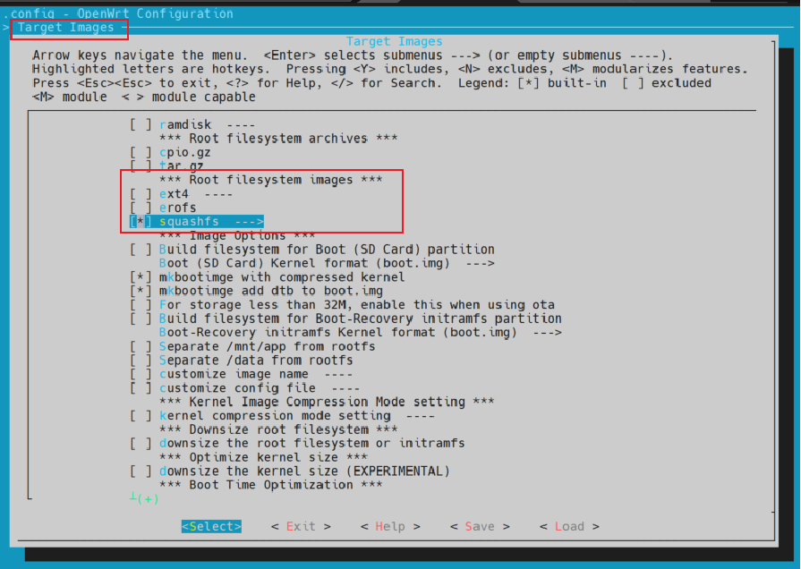

squashfs 还可以选择压缩格式， 如果需要存储空间小，则 可以选择xz压缩（解压时间高）。

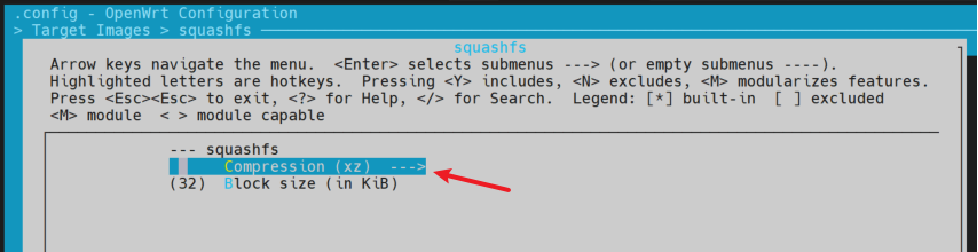

其中Block size = 32 也可以调整。 从256调整为32的时候，rootfs多128k， 内存节省1.14MB。

**应用程序app大小优化**

应用程序app， 需要连接mpp库。mpp库可以通过make menuconfig 来选择mpp组件相关的功能。

比如产品不需要aec,ans,agc等音频的3A功能，如果这里开启了的话，整个代码流程就会嵌入这些算法库，所以在ld连接的时候必须依赖这些库，这时候整个app编译后就变大了。占用了flash的空间；

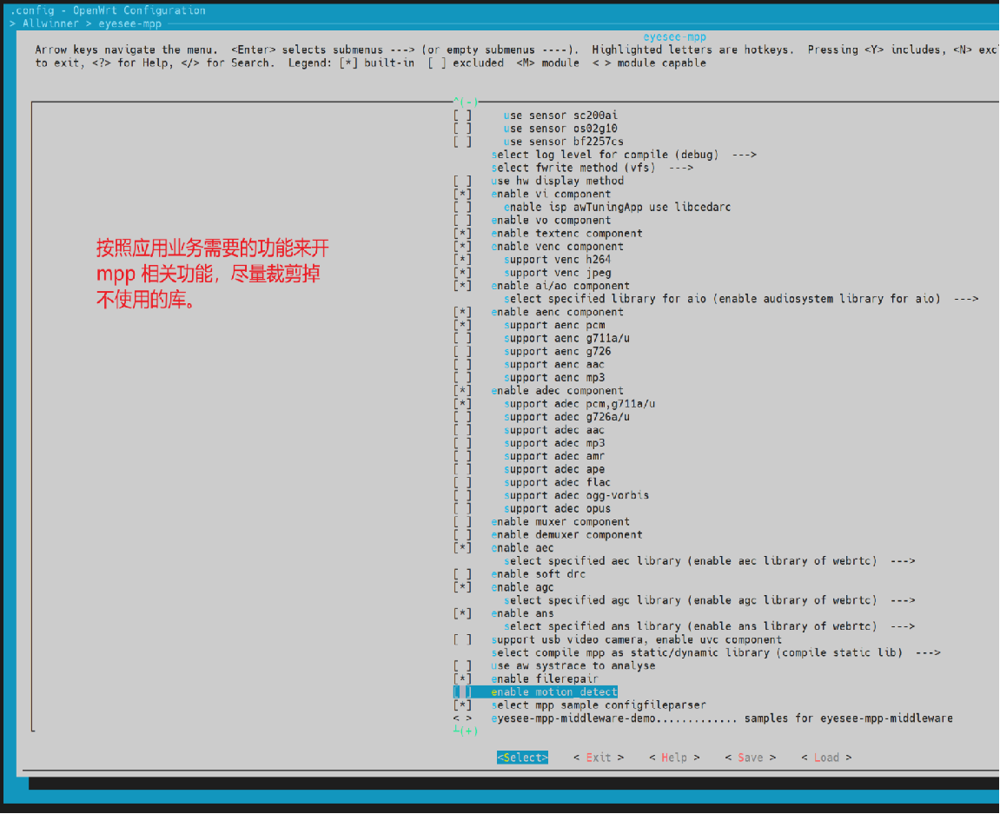

**mpp使用全志Audiosystem组件来替换标准的alsa(libasound.so)**

mpp选择全志自己的AudioSystem系统来代替alsa-lib。可节省一点rootfs空间。 但应用在编译的时候要多连接以下库： libaudiosystem.so libtinyalsa.so libaudiosystem\_core.a ；去掉连接libasound.so库。

:::note

:::note

备注

:::
:::note

SDK编译后，相关库可在out目录下查找。

:::

:::

更换使用make menuconfig 来选择：

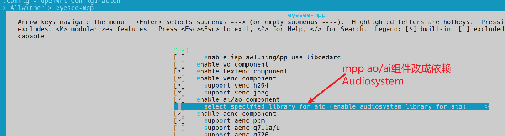 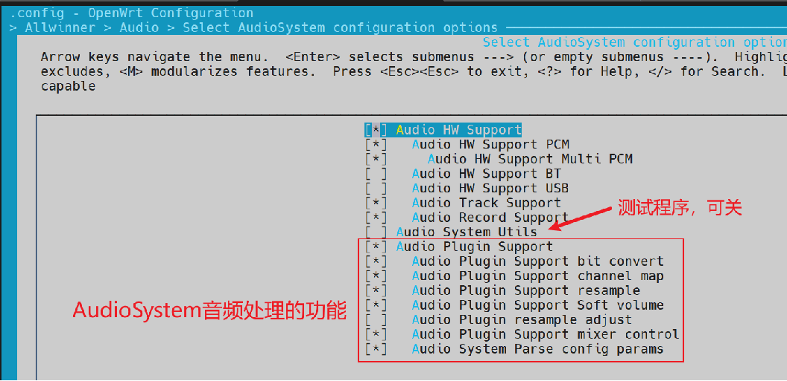 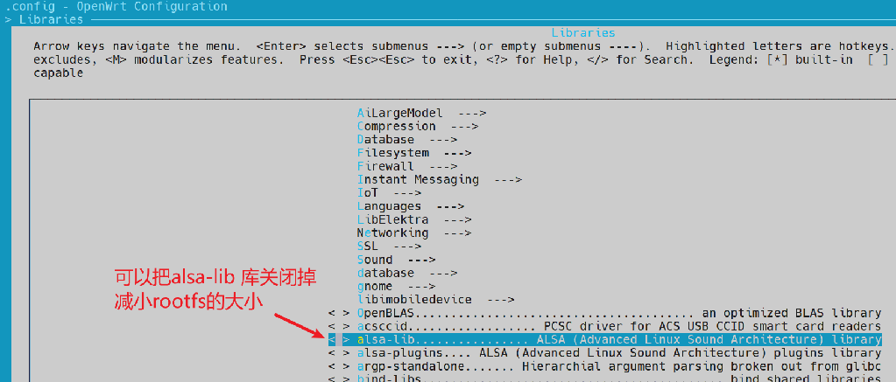

**rootfs自动化删除rootfs里面没用的库**

这个是在make编译制作rootfs的时候，调用脚本openwrt/build/reduce-rootfs-size.sh 对rootfs里面所有app的依赖进行检查，如果发现有.so库根本不需要用到，则会删除掉他。

注意:这里需要提前把方案app通过tina编译安装进rootfs，不然它需要的库则会被默认删除。

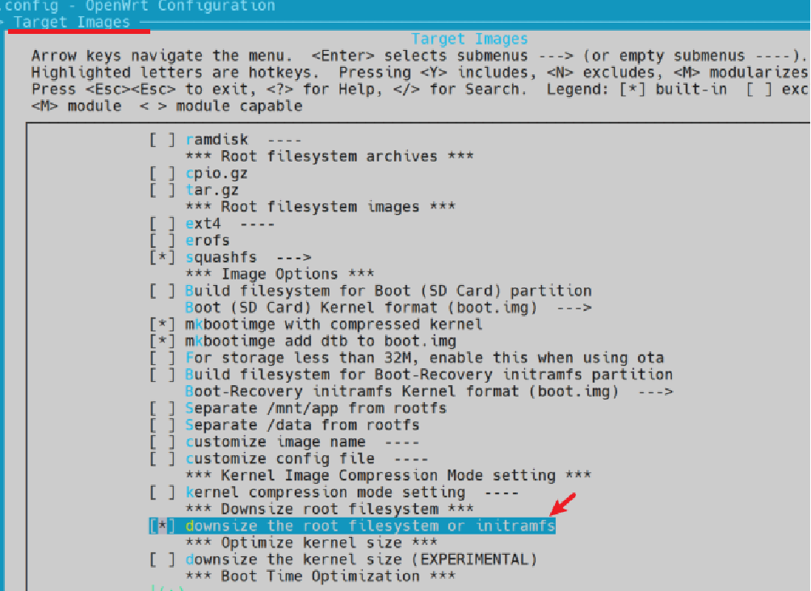

**手动排查不需要的应用和库**

敲入crootfs 进入到rootfs目录：

```
out/v821/ipc/openwrt/build_dir/target/root-v821-ipc
```

输入命令自动按大小排序：

```
find . -type f -exec ls -lS {} +
```

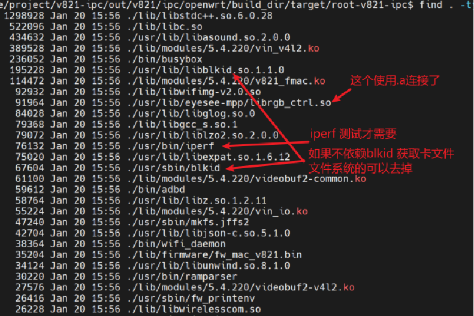

通过make menuconfig 去选择把它关闭掉

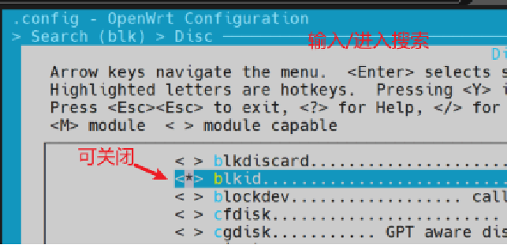

如果直接修改配置文件（优化可参考ipc板级的）： openwrt/target/v821/v821-\{board\}/defconfig

以下有一些推荐关闭掉，如：

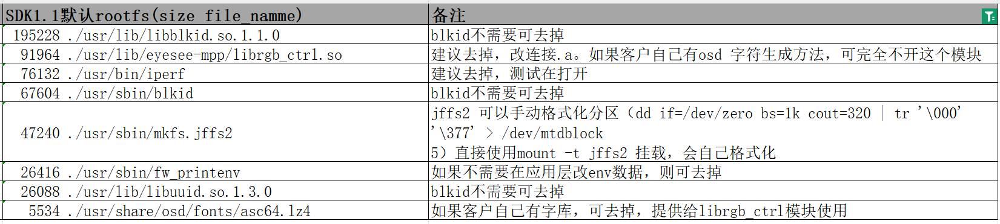

如果你是使用外编app和自己制作固件的，可以直接在root-v821-ipc 这个目录删除，然后在使用squashfs手动重新制作rootfs（可参考外编流程）。

**优化rootfs里面的ko驱动（V821 SDK 支持 / V861 SDK 不支持 ）**

内核驱动build-in 和 做成ko相比，做成ko会大一点。 相同代码下、RISCV 架构的 KO 会比 ARM 架构的 KO 大很多、甚至有些会大一倍。具体原因如下：

1.  RISCV使用的是RELA重定位格式，ARM是REL 格式，RELA会比REL 多占用 4 字节。
    
2.  RISCV 对变量的读取，采用高低位配合的方式获取变量地址，这会造成重定位在某些情况下比arm32 多，并且会多出一个符号，导致符号表也偏大。
    
3.  RISCV 直到链接时才计算分支目标、会导致.o 文件有非常多.Lxxx 的代码段，会导致多出非常多的符号和重定位项。
    

为了减小内核的大小、tina可在生成rootfs时对指定的模块进行预处理、减小模块的大小（V821 SDK 1.1 已带该功能）。

使用全志的工具可以重构这些Ko的重定位格式，使得ko变得更小：

优点：

1.  可有效减少内核模块的大小、平均可减少约 50% 的大小。加快加载速度

缺点：

1.  预处理后的模块和内核版本强相关，OTA 升级内核时一定要同步升级KO模块。

:::warning

:::note

注意

:::
:::note

-   请确认，使用了ko优化后，后续OTA需要内核和ko一起升级。

:::

:::

下面是 V821-ipc 方案下内核模块预处理前后的数据：

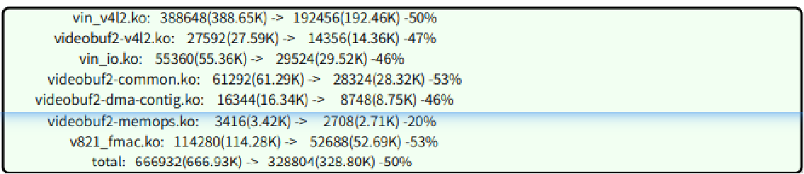

使用方法：

```
1. 进入tina配置目录：openwrt/target/v821/v821-{board}  #使用命令cplat快速跳入
2. 修改openwrt/target/v821/v821-{board}/kernel_modules.json;如果没有这个文件从其他板级拷贝过来
3. 在modules中，给需要进行预处理的ko写好名字和分配唯一的id；
4. 将status 改为 "okay"
5. 直接编译和打包mp -j8
```

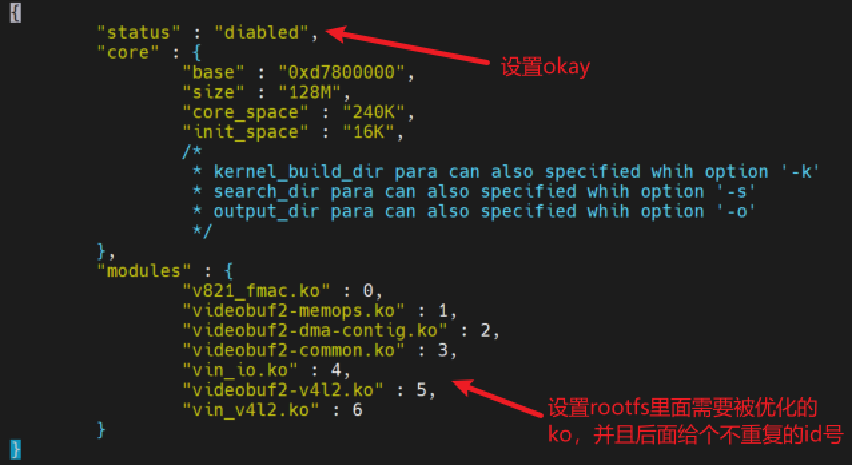

编译完后，可以去编译好的rootfs看看是否规定的ko已优化了：

```
1. 敲入crootfs
2. 输入ll lib/modules/5.4.220/
  4096 Feb 26 15:46 ./
  4096 Jan 20 15:56 ../
 25392 Jan 20 15:56 gc1084_mipi.ko
 52556 Feb 26 15:46 v821_fmac.ko
 28120 Feb 26 15:46 videobuf2-common.ko
  8736 Feb 26 15:46 videobuf2-dma-contig.ko
  2696 Feb 26 15:46 videobuf2-memops.ko
 14284 Feb 26 15:46 videobuf2-v4l2.ko
 29392 Feb 26 15:46 vin_io.ko
192040 Feb 26 15:46 vin_v4l2.ko
```

### 小核riscv0裁剪

V821/V861 也支持小核镜像压缩， 具体可以使用`mrtos menuconfig`来配置压缩算法（小核自解压）。

```
 >Kernel Options > kernel Compress Support

--- kernel Compress Support
[ ]   Debug (NEW)
      Compress kernel format (elf)--->
(0)   ELF decompress addr (NEW)          #这个地址也要填写，根据下图跟board.dts匹配
      Compress methon (LZMA)  --->       #选择压缩格式（lzma,gzip,lz4）
```

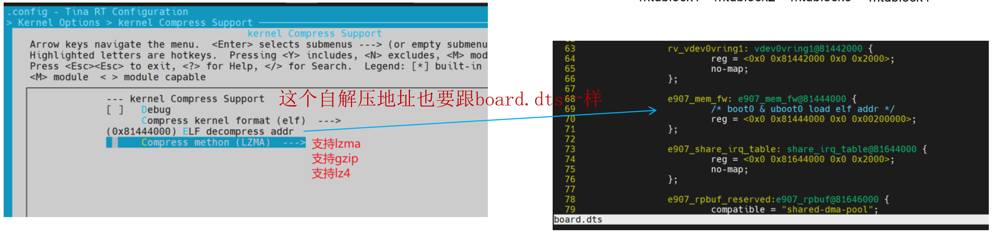

:::note

:::note

备注

:::
:::note

注意：小核rtos自解压时间跟选择的压缩算法有关。 时间上lzma（≈1.5s） > gzip > lz4。

:::

:::

很有可能大核已经跑到加载wifi ko 的位置，小核还没解压完。如果这时候wifi驱动加载跟小核通讯，会失败。需要等待小核解压完才能加载wifi ko。等待脚本如下所示： 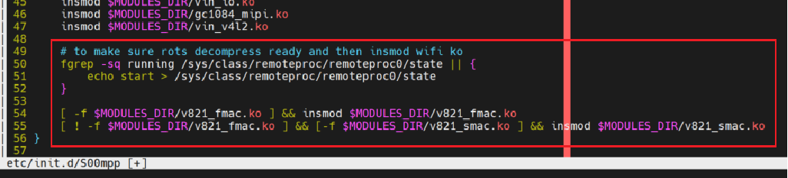

**小核功能裁剪**

小核源码目录：

```
rtos/lichee/rtos
```

配置文件目录：

```
rtos/lichee/rtos/projects/v821_e907/{board}/defconfig
```

运行mrtos menuconfig，可根据方案需要关闭下面选项来缩减大小：

:::note

:::note

备注

:::
:::note

以下说明节省大小的，都是非压缩情况的镜像。

:::

:::

以下配置当时SDK 默认打开（可以默认关闭）

```
CONFIG_COMPONENTS_MD5
CONFIG_COMMAND_PANIC
CONFIG_DRIVERS_GPIO_RECORD_USAGE
CONFIG_COMMAND_LIST_IRQ
```

关闭以上配置，当前实测减少19156字节。

编译优化：SDK 默认使用 O2 编译优化，偏向性能。

可以把把O2 改为Os

mrtos menuconfig 配置：

```
Build System (dbuild)  --->
	Optimisation Level (-Os (Optimise for size))  --->
```

基于当前SDK 代码环境编译可以减少51856字节

裁剪AP 模式配置，大概占用127020字节。

```
CONFIG_WLAN_AP
```

Monitor 模式配置，大概占用21972字节。

```
CONFIG_WLAN_MONITOR
```

裁剪net命令，大概占用77480字节

```
CONFIG_DRIVERS_XRADIO_CMD
```

裁剪fw保活命令，大概占用2780字节。

```
CONFIG_XRADIO_FW_KEEPALIVE_CMD
```

裁剪 rf 命令，大概占用6804字节。

```
CONFIG_XRADIO_RF_CMD
```

裁剪大核wifimanager拓展，如wifi -e支持小核wlan的命令，大概占用18900字节。

```
 CONFIG_WLAN_SUPPORT_EXPAND_CMD
```

裁剪拓展小核lmac命令，wifi -e支持小核lmac命令，大小可忽略不计

```
CONFIG_SUPPORT_EXP_LMAC_CMD
```

裁剪拓展小核rf命令，wifi -e支持小核rf命令，大小可忽略不计

```
CONFIG_SUPPORT_EXP_RF_CMD
```

### env分区和jffs2分区减小

受限于分区对齐，如果擦除块为64k的情况下，每个分区都必须是64k的整数倍；jffs2 要求必须大于等于5个擦除块。所以这里调整spinor擦除块可缩减env和jffs2分区占用的大小。

**调整spinor的擦除块大小**

1.  spinor在系统上能支持的擦除块只有64k/32k/4k。 我们以调整4k为例子。 修改spinor代码，需要改动到对应使用的spinor id 那一行

```
brandy/brandy-2.0/u-boot-2018/drivers/mtd/spi/spi-nor-ids.c(uboot)
bsp/drivers/mtd/spi-nor-5.4/spi-nor.c (kernel)
```

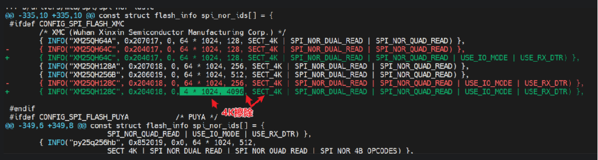 其中：

```
SECT_4K 是表示开启4K擦除块；
4*1024  表示一个page 4K
40960  是表示一共多少个page，16M就4096个
```

2.  修改uboot /kernel 配置文件，开启4K的宏

uboot defconfig添加（两份）

```
brandy/brandy-2.0/u-boot-2018/configs/sun300iw1p1_min_defconfig
brandy/brandy-2.0/u-boot-2018/configs/sun300iw1p1_min_nor_defconfig
如果BoardConfig_nor.mk指明的配置文件不存在，则会使用默认
brandy/brandy-2.0/u-boot-2018/configs/sun300iw1p1_v821_defconfig
brandy/brandy-2.0/u-boot-2018/configs/sun300iw1p1_v821_nor_defconfig
```

```
CONFIG_SPI_FLASH_USE_4K_SECTORS=y
```

kernel 选项也要开

```
CONFIG_MTD_SPI_NOR_USE_4K_SECTORS
```

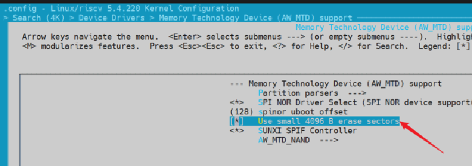

配置上设置完4K擦除块后，烧录机器启动，可以通过 cat /proc/mtd 来确认是否已经配置4K擦除块了。

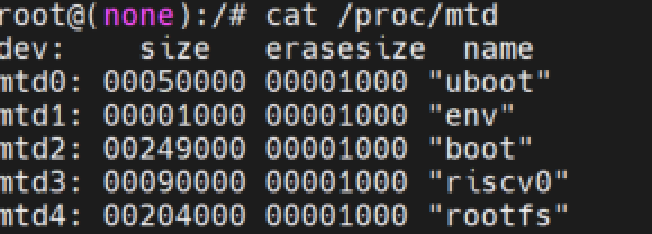

**调整env分区的大小（4k整数倍）**

修改配置文件：

```
device/config/chips/v821/configs/{board}/BoardConfig_nor.mk
```

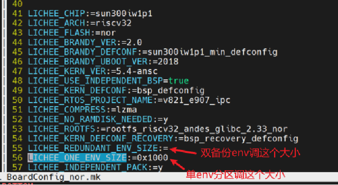

:::note

:::note

备注

:::
:::note

BoardConfig\_nor.mk修改需要重新source SDK。

:::

:::

修改env分区表

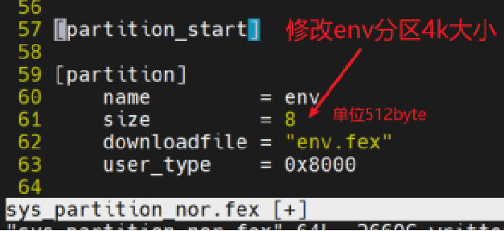

由于boot0 和 uboot 也会使用env，他们配置文件上也要把env实际大小指定好（尤其是uboot，没该对启动不了）。

修改boot0 的spinor.mk的配置

```
brandy/brandy-2.0/spl/board/sun300iw1p1/spinor.mk #常电默认配置
```

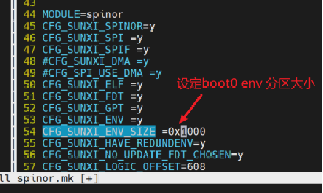

修改两份uboot的配置

```
brandy/brandy-2.0/u-boot-2018/configs/sun300iw1p1_min_defconfig
brandy/brandy-2.0/u-boot-2018/configs/sun300iw1p1_min_nor_defconfig
如果BoardConfig_nor.mk指明的配置文件不存在，则会使用默认
brandy/brandy-2.0/u-boot-2018/configs/sun300iw1p1_v821_defconfig
brandy/brandy-2.0/u-boot-2018/configs/sun300iw1p1_v821_nor_defconfig
```

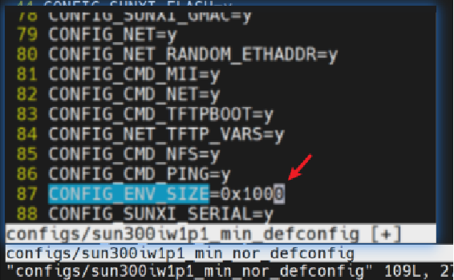

修改完后重新source 再重新编译即可。

## 调试方法

### 查看mtd分区

使用如下命令，可以知道目前mtd分区占用多少，擦除块大小：

```
cat /proc/mtd

dev:    size   erasesize  name
mtd0: 00050000 00010000 "uboot"
mtd1: 00010000 00010000 "env"
mtd2: 00010000 00010000 "env-redund"
mtd3: 00460000 00010000 "boot"
mtd4: 00200000 00010000 "riscv0"
mtd5: 005a0000 00010000 "rootfs"
mtd6: 00320000 00010000 "recovery"
mtd7: 00010000 00010000 "isp_param"
mtd8: 00050000 00010000 "data_part"
mtd9: 00010000 00010000 "private"
mtd10: 00000000 00010000 "UDISK"
```

## FAQ

### 如何制作一个整个flash的mtd分区？

**需求背景：**

需要有一个mtd分区能读写spinor 从0~8M空间。

**解决方案:**

需要在mtd驱动里面解析分区表的时候，新增一个分区，并且把它的start改成0，len改成flash\_size。 具体改动可参考如下：

`bsp` 仓库下改动：

```
diff --git a/drivers/mtd/parsers/sunxipart.c b/drivers/mtd/parsers/sunxipart.c
index 6c95f2b..a2189fa 100644
--- a/drivers/mtd/parsers/sunxipart.c
+++ b/drivers/mtd/parsers/sunxipart.c
@@ -162,7 +162,7 @@ static int sunxipart_parse(struct mtd_info *master,
                        kfree(sunxi_mbr);
                        return -EINVAL;
                }
-               nrparts = gpt_head->num_partition_entries + 1;
+               nrparts = gpt_head->num_partition_entries + 1 + 1;
                parts_size = nrparts * sizeof(*parts);
                parts = kzalloc(parts_size, GFP_KERNEL);
                if (parts == NULL) {
@@ -174,7 +174,7 @@ static int sunxipart_parse(struct mtd_info *master,
                strncpy(partition_name[0], "uboot", 16);
                sunxipart_add_part(&parts[0], partition_name[0],
                                   mbr_offset + MBR_SIZE, 0);
-               for (i = 1; i < nrparts; i++) {
+               for (i = 1; i < nrparts - 1; i++) {
                        for (j = 0; j < 16; j++)
                                partition_name[i][j] =
                                    (char)(entry[i - 1].partition_name[j]);
@@ -191,6 +191,10 @@ static int sunxipart_parse(struct mtd_info *master,
                                                   NOR_BLK_SIZE +
                                               mbr_offset);
                }
+               //添加整个flash 映射
+               printk("flash_all--- ,size:%llu , offset:%u \n", master->size, 0);
+               strncpy(partition_name[i], "flash_all", 16);
+               sunxipart_add_part(&parts[i], partition_name[i], master->size, 0);
        }

        kfree(sunxi_mbr);
```

最终会生成：

```
cat /proc/mtd
dev:    size   erasesize  name
mtd0: 00050000 00010000 "uboot"
mtd1: 00010000 00010000 "env"
mtd2: 00010000 00010000 "env-redund"
mtd3: 00460000 00010000 "boot"
mtd4: 00200000 00010000 "riscv0"
mtd5: 005a0000 00010000 "rootfs"
mtd6: 00320000 00010000 "recovery"
mtd7: 00010000 00010000 "isp_param"
mtd8: 00050000 00010000 "data_part"
mtd9: 00010000 00010000 "private"
mtd10: 00000000 00010000 "UDISK"
mtd11: 01000000 00010000 "flash_all"
```
